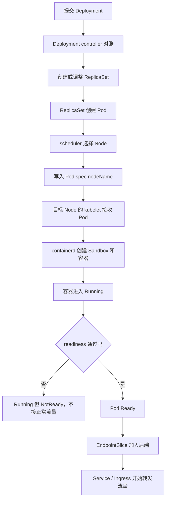
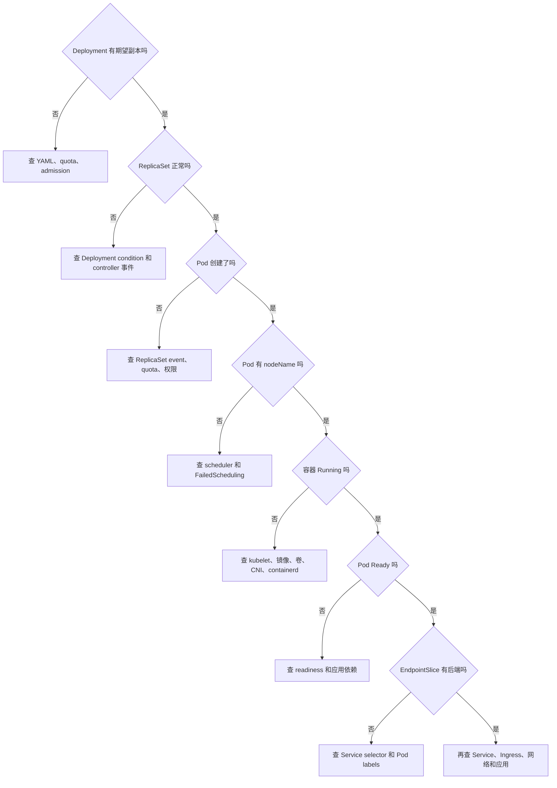

# 平台 K8s 总图：一次发布到接流量

> 定位：多年 K8s 运维人员的全链路速查，不是必修入门课。  
> 如果你能口述 controller → scheduler → kubelet → readiness → EndpointSlice，可以直接跳到 `07_源码热身_Deployment_rollout卡住如何沿控制器找原因.md`。

## 1. 这篇课解决什么问题

这篇不钻源码，只建立一张以后反复使用的地图：

```text
一份 Deployment YAML 提交以后，
怎样变成真正运行的容器，
又怎样进入 Service 开始接流量？
```

以后不管是 Java 服务、官网、SDK 服务，还是 vLLM 推理服务，都要经过这条主线。

## 2. 一句话总链路

```text
Deployment 管发布
  -> ReplicaSet 管副本
  -> Pod 进入调度
  -> kubelet 启动容器
  -> readiness 判断能否服务
  -> EndpointSlice 记录可用后端
  -> Service / Ingress 把流量送进来
```

## 3. 先认识角色

| 角色 | 最简单的理解 | 它不负责什么 |
| --- | --- | --- |
| Deployment | 发布经理，管理版本和滚动更新 | 不直接在节点上启动容器 |
| ReplicaSet | 班组长，保证某版本 Pod 数量 | 不负责选择 Node |
| Pod | 真正的运行单元 | 不决定自己去哪台 Node |
| scheduler | 分配员，为未绑定 Pod 选择 Node | 不启动容器，也不选择具体 GPU UUID |
| kubelet | 节点执行负责人，把已绑定 Pod 跑起来 | 不负责全局选择 Node |
| containerd | 容器运行时服务，执行镜像和容器操作 | 不负责 Kubernetes 发布策略 |
| readiness | 服务准入检查 | 不负责重启容器 |
| EndpointSlice | Service 的后端名单 | 不负责真正启动 Pod |
| Service | 稳定访问入口和负载转发抽象 | 不保证后端应用一定健康 |

## 4. 完整流程图



## 5. 用一次 Java 服务发布理解

假设线上运行：

```text
镜像：game-sdk:v1
副本数：3
```

现在发布 `game-sdk:v2`。

### 第一步：Deployment 发现版本变化

Deployment 看到 Pod 模板里的镜像从 `v1` 变成 `v2`。

它不会直接登录三台机器执行 `docker run`，而是创建一个代表 `v2` 的新 ReplicaSet。

### 第二步：新旧 ReplicaSet 一起调整

```text
旧 ReplicaSet：管理 v1 Pod
新 ReplicaSet：管理 v2 Pod
```

Deployment 按滚动更新策略逐步扩新、缩旧。

### 第三步：新 Pod 被调度和启动

ReplicaSet 创建 v2 Pod 后：

```text
scheduler 选择 Node
-> kubelet 接收 Pod
-> containerd 拉镜像并启动容器
```

### 第四步：Running 还不能立即接流量

Java 进程虽然启动了，但 Spring Boot 可能还在：

- 初始化 Bean。
- 建立数据库连接池。
- 加载配置。
- 注册到其他系统。

因此容器可以已经 `Running`，readiness 仍然失败。

### 第五步：Ready 后进入后端名单

readiness 通过以后，Pod 变为 Ready，EndpointSlice 才会把它作为正常可用后端，Service 再把流量转过来。

## 6. 为什么 Kubernetes 要拆这么多层

如果一个程序同时负责：

```text
发布版本
维持副本
选择节点
启动容器
健康检查
流量转发
```

任何一处出问题都会拖累整个系统，也很难单独扩展。

Kubernetes 把职责拆开后：

- scheduler 可以专门优化调度。
- kubelet 可以专门处理节点执行。
- Deployment 可以专门处理发布策略。
- Service 可以专门处理稳定访问。
- GPU Device Plugin 将来可以只负责设备发现和分配接口。

这就是“组件解耦”。

## 7. 出问题时怎样按层排查



## 8. 最小观察命令

先在测试环境观察，不要直接对生产做破坏性实验。

```bash
kubectl get deployment,replicaset,pod -n <namespace> -o wide
kubectl rollout status deployment/<name> -n <namespace>
kubectl describe deployment/<name> -n <namespace>
kubectl describe pod/<pod-name> -n <namespace>
kubectl get endpointslice -n <namespace>
kubectl get events -n <namespace> --sort-by=.lastTimestamp
```

现在不需要把命令全部背下来。先知道分别对应：

```text
发布对象
副本对象
运行对象
流量后端
事件时间线
```

## 9. 这和 GPU 有什么关系

以后部署 vLLM 时，前半条主线完全一样：

```text
Deployment 创建 GPU Pod
-> scheduler 先选择有 nvidia.com/gpu 的 Node
-> kubelet 再通过 Device Plugin 分配具体 GPU
-> runtime 把 GPU 暴露给容器
-> vLLM 加载模型
-> readiness 通过
-> Service 接入推理流量
```

GPU 不是推翻普通 Pod 流程，而是在调度与容器创建之间多了一条设备链路。

## 10. 当前源码学到哪里就停

这篇只需知道：

- Deployment controller 会对账。
- ReplicaSet controller 会维持 Pod 数量。
- scheduler 负责选 Node。
- kubelet 负责节点执行。
- EndpointSlice controller 根据 Service selector 和 Pod 状态整理后端。

暂时不读具体 Go 函数。后续每进入一个组件，再把这张图中的那一段放大。

## 11. 你应该记住的三点

1. Deployment、ReplicaSet、Pod 是三层职责，不是同一个东西的三个名字。
2. `Running` 只代表容器进程启动，不代表服务已经能接流量。
3. 故障排查要从对象链路逐层缩小范围，不要一开始同时看所有组件。

## 12. 掌握题和答案

### 问题一：为什么 Deployment 不直接创建 Pod？

答案：

Deployment 关注发布和版本，ReplicaSet 关注某一版本的副本数量。拆开以后，滚动更新可以同时控制新旧两个 ReplicaSet，也更容易回滚。

### 问题二：Pod 已经 Running，为什么 rollout 仍可能卡住？

答案：

Deployment 判断可用副本时还要看 Pod 是否 Ready/Available。容器虽然启动，但 readiness 没通过，仍不能算可用实例。

### 问题三：以后 GPU Pod 和普通 Pod 最大的共同点是什么？

答案：

都要经过创建、调度、kubelet 执行、容器启动、健康检查和流量接入。GPU Pod 只是在其中增加设备上报、分配和注入。

## 13. 返回正式主线

本篇是按需总图速查，不串成基础顺序课。正式源码主线从这里开始：

```text
07_源码热身_Deployment_rollout卡住如何沿控制器找原因.md
```

旧资料来源仅供后续查证：

- `study/90_主线复盘与进阶/17_Pod主线全链路复盘_从kubectl到Service转发.md`
- `study/90_主线复盘与进阶/24_Deployment主线全链路复盘_从Deployment到PodReady.md`
- `study/90_主线复盘与进阶/29_Service主线全链路复盘_从Service到Pod转发.md`
