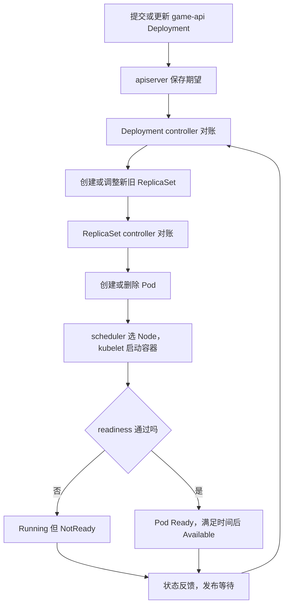

# 生产速查：Deployment、ReplicaSet、Pod——发布与副本

> 定位：RollingUpdate 机制和故障实验速查，源码仅为 S1 入口，不是正式源码热身。  
> 如果你能解释 maxSurge/maxUnavailable、Ready/Available 和 NotReady 卡 rollout，可直接学习 `07_源码热身_Deployment_rollout卡住如何沿控制器找原因.md`。

## 1. 这篇课的位置

上一篇建立了“一次发布到接流量”的总图。这一篇只放大前半段：

```text
Deployment
  -> ReplicaSet
  -> Pod
  -> Ready
```

这是平台 Kubernetes 的发布基础，也是以后部署 vLLM 等 GPU 推理服务仍会使用的主线。

本课的源码深度是：

```text
机制必须讲清
只认识三个关键源码入口
暂时不逐行深挖 controller
```

正文自包含，不要求跳到旧目录，也不要求提前学完 Go。

## 2. 学习目标

学完后，你应该能够：

1. 说清 Deployment、ReplicaSet、Pod 的职责边界。
2. 解释扩副本和修改 Pod template 为什么结果不同。
3. 看懂新旧 ReplicaSet 如何完成滚动发布。
4. 分清 Running、Ready、Available。
5. 按对象层次排查一次发布故障。
6. 找到三个最小源码入口，并用白话解释它们。

本课不讲 controller-manager 启动、informer 队列细节、expectations、rollback 和历史 ReplicaSet 清理。

## 3. game-api 场景与角色边界

假设平台上有一个 Java 服务：

```text
服务名：game-api
当前版本：v1
期望副本：3
发布方式：RollingUpdate
```

现在要发布 v2。Kubernetes 用三层对象完成它：

| 角色 | 最简单的职责 | 不负责什么 |
| --- | --- | --- |
| Deployment | 管版本、滚动策略和发布状态 | 不直接启动容器 |
| ReplicaSet | 保证某个模板版本有指定数量的 Pod | 不选择 Node |
| Pod | 承载真正运行的业务容器 | 不决定副本数 |
| scheduler | 给未绑定 Pod 选择 Node | 不创建 Pod，不启动容器 |
| kubelet | 在目标 Node 上启动 Pod、探测并上报状态 | 不决定全局发布策略 |

先记住三个边界：

```text
Deployment controller 主要创建或调整 ReplicaSet。
ReplicaSet controller 才负责创建或删除 Pod。
Pod 创建后，才进入 scheduler 和 kubelet 主线。
```

## 4. 简明总图



这是一个持续对账的闭环：

```text
spec：希望怎样
controller：执行修正
status：现在怎样
controller：再根据反馈决定下一步
```

## 5. ownerReference、replicas、template 和 hash

### 5.1 谁直接管理谁

对象关系通常是：

```text
Deployment game-api
  └─ ReplicaSet game-api-7f6d...
       ├─ Pod game-api-7f6d...-a1
       ├─ Pod game-api-7f6d...-b2
       └─ Pod game-api-7f6d...-c3
```

对应的 ownerReference 是：

```text
ReplicaSet.ownerReferences -> Deployment
Pod.ownerReferences        -> ReplicaSet
```

因此 Pod 的直接 owner 通常是 ReplicaSet，而不是 Deployment。label/selector 用来选择对象，ownerReference 表示直接控制关系，两者不是一回事。

### 5.2 只改 replicas

把：

```yaml
spec:
  replicas: 3
```

改成 5，表示同一个版本需要更多实例。通常是当前 ReplicaSet 扩到 5，再由 ReplicaSet controller 创建 Pod，不会仅因此产生新模板版本。

### 5.3 修改 Pod template

Pod template 位于：

```yaml
spec:
  template:
    metadata:
    spec:
```

修改下面任一内容，都是发布新模板：

- 镜像、环境变量、command/args。
- template 内的 label/annotation。
- resources、探针、volume。
- sidecar。
- `nvidia.com/gpu` 等 GPU 资源声明。

Deployment 会为新模板创建或找到新的 ReplicaSet，再扩新、缩旧。

一个常见坑：只改 ConfigMap 或 Secret 对象的数据，Deployment template 本身可能没变，因此不会天然触发新 ReplicaSet 或重启 Pod。

### 5.4 pod-template-hash

不同模板版本通常有不同的 `pod-template-hash`：

```text
ReplicaSet  game-api-7f6d8c9b4
Pod label   pod-template-hash=7f6d8c9b4
```

它帮助 ReplicaSet 区分各自版本的 Pod。平台运维只需用它判断“这些 Pod 属于哪个版本”，不需要手工设置或计算。

## 6. 滚动约束与三种状态

假设：

```yaml
spec:
  replicas: 3
  minReadySeconds: 5
  strategy:
    type: RollingUpdate
    rollingUpdate:
      maxSurge: 1
      maxUnavailable: 0
```

两个硬约束：

```text
最大总 Pod 数 = replicas + maxSurge = 4
最低可用 Pod 数 = replicas - maxUnavailable = 3
```

一次简化发布过程：

```text
开始：old RS(v1)=3，new RS(v2)=0
扩新：old=3，new=1，总数达到 4
新 Pod Available 后：旧 RS 才能继续缩
结束：old=0，new=3
```

扩新不能突破总量上限，缩旧不能突破可用下限。`maxSurge` 还要求集群真的有额外 CPU、内存或 GPU 容量。

### Running、Ready、Available

| 状态 | 最简单的理解 |
| --- | --- |
| Running | Pod 已进入运行阶段，但应用未必可服务 |
| Ready | readiness 等条件通过，可以进入正常服务后端 |
| Available | Ready 又持续满足 `minReadySeconds`，计入稳定可用副本 |

所以可能出现：

```text
STATUS=Running
READY=0/1
```

如果新 Pod Running 但 NotReady：

```text
旧版本 3 个仍 Available
新版本 1 个占用了 surge 名额，但不算 Available
总数已达 4，最低可用数又必须保持 3
```

Deployment 既不能继续扩新，也不能安全缩旧，于是 rollout 等待。这通常是保护机制生效，不一定是 controller 坏了。

## 7. 分层排障

| 现象 | 先查哪层 | 关键证据 |
| --- | --- | --- |
| Deployment 有，但没有 RS | Deployment | spec/status、Condition、Event、是否暂停或副本为 0 |
| 新 RS 有，但 `spec.replicas=0` | Deployment 滚动决策 | 新旧 RS 副本、Available、滚动约束 |
| RS 期望副本大于 0，但没有 Pod | ReplicaSet | RS Event、quota、admission、namespace 状态 |
| Pod Pending 且无 nodeName | scheduler | `FailedScheduling` Event、request、taint、affinity |
| Pod 卡 ContainerCreating | kubelet/runtime | Pod Event、镜像、CNI、卷、runtime 日志 |
| Pod Running 但 `READY 0/1` | 应用/readiness | Pod Condition、探针 Event、应用日志 |
| Pod Ready 但 rollout 未完成 | Deployment status | `minReadySeconds`、Available、新旧 RS |

排查顺序：

```bash
kubectl get deployment,replicaset,pod -n <namespace> -l app=<app>
kubectl rollout status deployment/<name> -n <namespace>
kubectl describe deployment/<name> -n <namespace>
kubectl describe rs/<rs-name> -n <namespace>
kubectl describe pod/<pod-name> -n <namespace>
kubectl get events -n <namespace> --sort-by=.metadata.creationTimestamp
```

不要在 Pod 对象还没创建时先查 scheduler，也不要在 Pod 已 Running/NotReady 时继续纠结 ReplicaSet 为什么没创建。

## 8. 最小源码入口：只看三个

源码根目录：

```text
<KUBERNETES_SRC>
```

### 8.1 Deployment 总对账

```text
kubernetes/pkg/controller/deployment/deployment_controller.go
```

```go
func (dc *DeploymentController) syncDeployment(ctx context.Context, key string) error
```

白话职责：

```text
取得 Deployment
-> 找它的新旧 ReplicaSet
-> 判断发布策略
-> 调整对象并更新状态
```

### 8.2 RollingUpdate 对账

```text
kubernetes/pkg/controller/deployment/rolling.go
```

```go
func (dc *DeploymentController) rolloutRolling(
    ctx context.Context,
    d *apps.Deployment,
    rsList []*apps.ReplicaSet,
) error
```

白话职责：在 `maxSurge` 和 `maxUnavailable` 约束下决定扩多少新 RS、缩多少旧 RS。

### 8.3 ReplicaSet 总对账

```text
kubernetes/pkg/controller/replicaset/replica_set.go
```

```go
func (rsc *ReplicaSetController) syncReplicaSet(ctx context.Context, key string) error
```

白话职责：比较期望副本和当前 Pod，少了创建，多了删除，再更新 RS status。

用 `rg` 找入口，不依赖固定行号：

```powershell
rg -n "func \(dc \*DeploymentController\) syncDeployment" kubernetes/pkg/controller/deployment
rg -n "func \(dc \*DeploymentController\) rolloutRolling" kubernetes/pkg/controller/deployment
rg -n "func \(rsc \*ReplicaSetController\) syncReplicaSet" kubernetes/pkg/controller/replicaset
```

第一次只问：输入是谁、读了什么、写了什么、失败后如何重试。不要遇到每个辅助函数都跳进去。

## 9. 一个 Go 语法点：方法接收者

看：

```go
func (dc *DeploymentController) syncDeployment(ctx context.Context, key string) error
```

其中：

```go
(dc *DeploymentController)
```

叫方法接收者。可以先翻译成：

> `syncDeployment` 是 `DeploymentController` 的方法，方法内部通过变量 `dc` 使用当前 controller 实例。

`*DeploymentController` 表示 `dc` 指向这个类型的实例。本课不继续扩展 Go 指针、interface 或内存细节。

## 10. 一个完整的观察与故障实验

只在测试集群执行。先确认：

```bash
kubectl config current-context
kubectl get nodes
```

若当前是生产集群，不要继续。

### 10.1 准备

创建独立 namespace：

```bash
kubectl create namespace sre-study --dry-run=client -o yaml | kubectl apply -f -
```

将下面内容保存为 `game-api.yaml`。nginx 只用于模拟服务；若无法访问 Docker Hub，请换成公司可用的测试镜像。

```yaml
apiVersion: apps/v1
kind: Deployment
metadata:
  name: game-api
  namespace: sre-study
spec:
  replicas: 3
  minReadySeconds: 5
  progressDeadlineSeconds: 60
  strategy:
    type: RollingUpdate
    rollingUpdate:
      maxSurge: 1
      maxUnavailable: 0
  selector:
    matchLabels:
      app: game-api
  template:
    metadata:
      labels:
        app: game-api
    spec:
      containers:
      - name: game-api
        image: nginx:alpine
        env:
        - name: RELEASE_ID
          value: v1
        ports:
        - name: http
          containerPort: 80
        readinessProbe:
          httpGet:
            path: /
            port: http
          initialDelaySeconds: 1
          periodSeconds: 2
          failureThreshold: 2
        resources:
          requests:
            cpu: 20m
            memory: 32Mi
          limits:
            memory: 64Mi
```

应用并等待：

```bash
kubectl apply -f game-api.yaml
kubectl rollout status deployment/game-api -n sre-study --timeout=120s
kubectl get deployment,replicaset,pod -n sre-study -l app=game-api
```

预期：1 个 Deployment、1 个当前 RS、3 个 Ready Pod。

### 10.2 观察 owner 和 hash

```bash
kubectl get rs -n sre-study -l app=game-api -o custom-columns='NAME:.metadata.name,OWNER:.metadata.ownerReferences[0].name,HASH:.metadata.labels.pod-template-hash,DESIRED:.spec.replicas'

kubectl get pod -n sre-study -l app=game-api -o custom-columns='NAME:.metadata.name,OWNER:.metadata.ownerReferences[0].name,HASH:.metadata.labels.pod-template-hash,PHASE:.status.phase'
```

确认 RS 的 owner 是 Deployment，Pod 的 owner 是 RS，同一 RS 和 Pod 的 hash 相同。

### 10.3 先观察扩副本

```bash
kubectl get rs -n sre-study -l app=game-api
kubectl scale deployment/game-api -n sre-study --replicas=4
kubectl rollout status deployment/game-api -n sre-study --timeout=120s
kubectl get rs -n sre-study -l app=game-api
kubectl scale deployment/game-api -n sre-study --replicas=3
kubectl rollout status deployment/game-api -n sre-study --timeout=120s
```

确认 Pod 数变化，但当前模板的 RS 名称/hash 没有仅因扩副本而改变。

### 10.4 发布一个故意有故障的 v2

一次同时修改环境变量和 readiness 路径：

```bash
kubectl patch deployment/game-api -n sre-study --type=json -p='[{"op":"replace","path":"/spec/template/spec/containers/0/env/0/value","value":"v2"},{"op":"replace","path":"/spec/template/spec/containers/0/readinessProbe/httpGet/path","value":"/not-found"}]'
```

观察：

```bash
kubectl get deployment,replicaset,pod -n sre-study -l app=game-api -w
```

看到状态稳定后按 `Ctrl+C`。预期出现新 RS；旧版本仍有 3 个 Available Pod，新版本有 1 个 Running/NotReady Pod，总数停在 4。

收集故障证据：

```bash
kubectl rollout status deployment/game-api -n sre-study --timeout=75s
kubectl describe deployment/game-api -n sre-study
kubectl get pod -n sre-study -l app=game-api
kubectl describe pod/<新Pod名> -n sre-study
kubectl logs pod/<新Pod名> -n sre-study
```

`rollout status` 预期可能超时或报告没有进展，这是本实验要制造的结果。

### 10.5 修复并观察收敛

```bash
kubectl patch deployment/game-api -n sre-study --type=json -p='[{"op":"replace","path":"/spec/template/spec/containers/0/readinessProbe/httpGet/path","value":"/"}]'

kubectl rollout status deployment/game-api -n sre-study --timeout=120s
kubectl get deployment,replicaset,pod -n sre-study -l app=game-api
```

修复 readiness path 也是一次 Pod template 变化，所以会再产生一个新 hash/ReplicaSet；这是正常现象，不是重复故障。预期：修复后的 Pod Ready/Available，当前版本扩到 3，最初的 v1 RS 和故障模板 RS 最终都缩到 0，rollout 完成。

如果马上继续第 2、3 课，先保留 `sre-study/game-api`，后面还会复用它观察 readiness 和 EndpointSlice。暂时停止学习或完成后续实验时，再确认 context 并清理：

```bash
kubectl config current-context
kubectl delete namespace sre-study
```

若 namespace 中还有其他资源，只删除本实验 Deployment：

```bash
kubectl delete deployment/game-api -n sre-study
```

## 11. 本课证据

实验完成时，至少能拿出下面五项证据：

| 证据 | 它证明什么 |
| --- | --- |
| RS 与 Pod 的 ownerReference | Deployment 管 RS，RS 直接管 Pod |
| RS 与 Pod 的 `pod-template-hash` | Pod 属于哪个模板版本 |
| replicas 3→4 时 RS hash 不变 | 扩副本不等于发布新模板 |
| 故障 v2 出现新 RS，Pod Running/NotReady | template 改变产生新版本，Running 不等于 Ready |
| 旧 Pod 保留且 rollout 卡住 | `maxSurge`、`maxUnavailable` 和 Available 在起作用 |

生产排障的证据优先级：

```text
对象 spec/status
-> Condition/Event
-> Pod 和应用日志
-> 必要时再进入组件日志和源码
```

## 12. 验收题

先回答，再看答案。

1. Deployment、ReplicaSet、Pod 各负责什么？Pod 的直接 owner 通常是谁？
2. 为什么修改 replicas 通常不产生新 RS，而修改镜像或探针会？
3. `pod-template-hash` 对运维有什么用？
4. `replicas=3`、`maxSurge=1`、`maxUnavailable=0` 时，最大总 Pod 数和最低 Available 数各是多少？
5. 新 Pod Running 但 NotReady 时，为什么 rollout 可能卡住？
6. 本课三个源码入口各负责什么？`(dc *DeploymentController)` 表示什么？
7. 一个 vLLM Deployment 有 3 个副本，每个占 1 张 GPU；集群只有 3 张空不出来的 GPU，`maxSurge=1`、`maxUnavailable=0`，更新时可能发生什么？

## 13. 验收题答案

1. Deployment 管发布和版本；RS 维持某个模板版本的 Pod 数；Pod 承载容器。Pod 的直接 owner 通常是 ReplicaSet。
2. replicas 只改变同一模板需要多少实例；镜像、探针等位于 `.spec.template`，代表新模板版本，因此需要新 RS。
3. 用来区分模板版本，并把 Pod 对应到管理它的 RS；不需要人工计算。
4. 最大总数 `3+1=4`，最低 Available 数 `3-0=3`。
5. NotReady 不能计入 Available；它占用了 surge 名额，旧 Pod 又不能在违反最低可用数时缩容，所以发布等待。
6. `syncDeployment` 做 Deployment 总对账；`rolloutRolling` 控制扩新缩旧；`syncReplicaSet` 维持 Pod 数。`(dc *DeploymentController)` 是方法接收者。
7. 新 GPU Pod 会因没有第 4 张可分配 GPU 而 Pending；旧 Pod 又不能先缩，rollout 会卡住，直到新增容量或调整发布策略。

## 14. GPU 桥接

把 game-api 换成 vLLM 后，前三层不变：

```text
Deployment 管推理服务发布
-> ReplicaSet 管某个模板版本的 GPU Pod 数
-> Pod 进入 scheduler 和 kubelet
```

GPU 场景会放大三个问题：

1. 修改 `nvidia.com/gpu`、GPU 型号标签或 runtime 配置属于 template 变化，会产生新 RS。
2. `maxSurge` 需要真实的额外 GPU；普通服务多一个 Pod 可能容易，GPU 服务多一张卡可能做不到。
3. vLLM 容器 Running 后还可能在加载模型、初始化 CUDA、建立 KV cache，因此 readiness 通常比普通 Web 服务更关键。

后续 GPU 课程会在 Pod 创建之后补上：

```text
scheduler 按 nvidia.com/gpu 选择节点
-> kubelet 通过 Device Plugin 分配具体 GPU
-> runtime 把设备交给容器
```

本篇只作为 RollingUpdate 机制和实验参考；已经熟悉这些行为时不需要继续停留。

## 15. 本课收口

只记五句话：

1. Deployment 管发布，ReplicaSet 管副本，Pod 真正运行。
2. 改 replicas 是扩缩实例；改 template 是发布新版本。
3. `pod-template-hash` 用来区分模板版本。
4. Running 不等于 Ready，Ready 也可能尚未 Available。
5. rollout 卡住时沿 Deployment → RS → Pod → readiness 分层取证。

## 16. 返回正式主线

本篇不是源码热身。回到真正必修的生产故障反查课：

```text
07_源码热身_Deployment_rollout卡住如何沿控制器找原因.md
```
