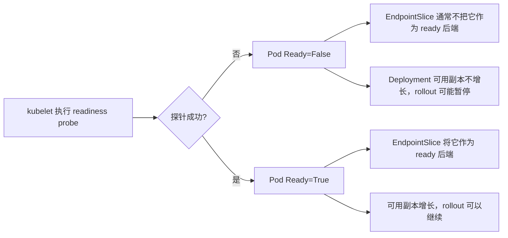

# 生产速查：Pod 状态与探针——Running 为什么不等于 Ready

> 定位：Pod 状态与 probe 的生产排障手册，不要求顺序阅读。  
> 能区分 phase、container state、Condition、startup/readiness/liveness 时可以跳过；kubelet probe 源码会在第 13 课定向学习。

> 本篇位置：`Deployment -> ReplicaSet -> Pod` 之后，`EndpointSlice -> Service` 之前。  
> 源码深度：S1，只理解职责和关键状态，不追 kubelet 全部实现。

## 先说结论

`Running` 只说明 Pod 中至少有容器进程已经启动；`Ready` 才表示这个 Pod 当前可以作为业务后端接收流量。

对平台运维来说，最危险的误判就是：

```text
Pod 是 Running
  ≠ 应用已经启动完成
  ≠ 依赖已经正常
  ≠ 可以接流量
  ≠ Deployment 已完成发布
```

这一课学完，你要能回答：

1. Pod phase、容器状态和 Pod Condition 有什么区别？
2. startup、readiness、liveness 三种探针分别解决什么问题？
3. Java 应用为什么最容易因探针配置不当形成重启循环？
4. Pod Running 但 `0/1 Ready` 时，证据应该按什么顺序找？
5. Ready 的变化怎样影响 EndpointSlice 和滚动发布？

## 1. 从一个 Java 服务故障开始

假设 `game-api` 启动需要 90 秒：

- 前 20 秒 JVM 启动；
- 接着加载配置和缓存；
- 最后连接数据库、注册必要组件；
- 90 秒后才真正能响应业务请求。

如果 liveness probe 从第 10 秒开始检查，并连续失败 3 次就重启容器，会发生：

```text
容器启动
  -> 应用还没准备好
  -> liveness 失败
  -> kubelet 重启容器
  -> 应用重新从第 0 秒启动
  -> 再次被过早重启
```

这不是应用一定有 bug，而可能是平台把“启动慢”误判成“已经死掉”。

## 2. 三套状态不要混在一起

### 2.1 Pod phase：一个很粗的总阶段

常见 phase：

| phase | 表示什么 | 不能据此得出什么 |
|---|---|---|
| Pending | Pod 已被接受，但还没完整运行 | 不等于只是在等 scheduler |
| Running | Pod 已绑定节点，至少一个容器运行或正在启动/重启 | 不等于应用健康、可接流量 |
| Succeeded | 所有容器成功终止，且不会重启 | 常见于 Job |
| Failed | 至少一个容器失败终止，且不会重启 | 不等于能直接看出根因 |
| Unknown | 控制面暂时拿不到 Pod 状态 | 常见于节点通信问题 |

`Pending` 可能覆盖多个现场：

```text
还没有 spec.nodeName        -> 多半看 scheduler Event
已经有 spec.nodeName        -> 多半看 kubelet、镜像、卷、网络、runtime
```

### 2.2 Container state：单个容器正在做什么

每个容器的状态是三选一：

- Waiting：还没运行，例如 `ImagePullBackOff`、`CrashLoopBackOff`。
- Running：容器进程正在运行。
- Terminated：已经退出，重点看 exit code、reason、finishedAt。

`CrashLoopBackOff` 不是 Pod phase，而是容器反复失败后处于重启退避。

### 2.3 Pod Conditions：能否继续参与系统协作

平台运维最常看的 Condition：

| Condition | 白话含义 |
|---|---|
| PodScheduled | scheduler 是否已经选好节点 |
| Initialized | init containers 是否已成功完成 |
| ContainersReady | 普通容器是否都 Ready |
| Ready | Pod 是否整体可以作为服务后端 |

所以一条很实用的判断是：

```text
看 phase 判断“大致走到哪”
看 containerStatuses 判断“容器发生了什么”
看 conditions 判断“系统是否认为它可用”
```

## 3. 三种探针各自只负责一件事

| 探针 | 它回答的问题 | 失败后的主要动作 |
|---|---|---|
| startupProbe | 应用是否已经完成启动 | 启动成功前，liveness/readiness 不接管；持续失败会重启容器 |
| readinessProbe | 当前是否可以接业务流量 | Pod Ready 变为 False，通常从 Service 后端摘除，不重启容器 |
| livenessProbe | 已运行的应用是否陷入不可恢复状态 | kubelet 重启对应容器 |

记忆方式：

```text
startup：给慢启动一次合理的等待窗口
readiness：决定流量进不进来
liveness：决定进程要不要重启
```

### 哪些情况不要交给 liveness

- 数据库短暂不可用；
- 某个下游接口超时；
- 消息队列瞬时抖动；
- 应用正在预热但仍有机会恢复。

如果这些依赖失败就让 liveness 失败，很多 Pod 会同时重启，反而把小故障放大成雪崩。

更稳妥的思路通常是：

- readiness 反映“我现在能不能安全接流量”；
- liveness 只判断“进程是否真的无法自愈”；
- startup 为慢启动提供保护；
- 依赖的瞬时错误由超时、重试、熔断和降级处理。

## 4. 一个适合慢启动 Java 应用的最小示例

```yaml
containers:
  - name: game-api
    image: example/game-api:v2
    ports:
      - name: http
        containerPort: 8080
    startupProbe:
      httpGet:
        path: /actuator/health/startup
        port: http
      periodSeconds: 5
      failureThreshold: 24
    readinessProbe:
      httpGet:
        path: /actuator/health/readiness
        port: http
      periodSeconds: 5
      timeoutSeconds: 2
      failureThreshold: 3
    livenessProbe:
      httpGet:
        path: /actuator/health/liveness
        port: http
      periodSeconds: 10
      timeoutSeconds: 2
      failureThreshold: 3
```

这里 startup 的最大失败窗口大致是：

```text
periodSeconds × failureThreshold
= 5 × 24
= 120 秒
```

这不表示应用一定要等 120 秒。一旦 startup 成功，readiness 和 liveness 就会开始工作。

不要机械照抄这些数字。你应该根据实际启动耗时分布设置：

```text
正常 P99 启动时间
  + 模型/缓存加载波动
  + 下游初始化的合理抖动
  = startup 允许窗口
```

## 5. Ready 是怎样进入发布和流量链路的



必须分清职责：

- kubelet 在节点上执行探针，并上报 Pod 状态；
- EndpointSlice controller 根据 Pod、Service selector 和 Ready 等信息维护后端；
- Deployment controller 读取副本可用状态，决定是否继续滚动；
- Service 本身不执行探针。

## 6. Running 但 NotReady 的排障顺序

先看事实，不要先猜源码。

### 第一步：确认是哪个容器不 Ready

```powershell
kubectl get pod <pod-name> -n <namespace> -o wide
kubectl get pod <pod-name> -n <namespace> -o jsonpath='{range .status.containerStatuses[*]}{.name}{" ready="}{.ready}{" restarts="}{.restartCount}{" state="}{.state}{"\n"}{end}'
```

### 第二步：看 Pod 描述和 Event

```powershell
kubectl describe pod <pod-name> -n <namespace>
kubectl get events -n <namespace> --field-selector involvedObject.name=<pod-name> --sort-by=.lastTimestamp
```

常见线索包括：

- Readiness probe failed；
- Liveness probe failed；
- connection refused；
- context deadline exceeded；
- HTTP status code 非 2xx/3xx；
- Back-off restarting failed container。

### 第三步：看当前和上一次容器日志

```powershell
kubectl logs <pod-name> -n <namespace> -c <container-name> --tail=200
kubectl logs <pod-name> -n <namespace> -c <container-name> --previous --tail=200
```

`--previous` 对 CrashLoopBackOff 特别重要，因为当前容器可能刚重启，真正的错误在上一个实例。

### 第四步：从 Pod 网络命名空间的视角验证

探针访问的是 Pod IP/容器端口，不等于你在 Service 或 Ingress 外部访问。

重点核对：

- 应用是否监听 `0.0.0.0`，而不是只监听 `127.0.0.1`；
- path、port、scheme 是否正确；
- 探针端点是否需要认证；
- timeout 是否小于应用正常响应时间；
- readiness 是否错误依赖了非关键下游。

### 第五步：再看节点侧

只有当 Event、应用日志仍解释不了，或多个 Pod 只在同一节点异常时，再看：

```powershell
kubectl get node <node-name>
kubectl describe node <node-name>
```

并检查 kubelet、runtime、CNI 或节点资源压力。

## 7. 五个高频误区

### 误区一：readiness 失败会重启容器

不会。它主要改变 Ready 和流量资格。真正触发容器重启的是 liveness/startup 持续失败，或进程退出等情况。

### 误区二：liveness 只要检查接口能返回业务数据就行

检查过重会让下游抖动变成全体重启。liveness 应尽量轻量、稳定，只判断本进程是否不可恢复。

### 误区三：initialDelaySeconds 越大越安全

它只是固定等待。应用启动时间变化大时，startupProbe 更能表达“成功前允许多次检查”的语义。

### 误区四：探针成功就说明真实用户一定访问成功

探针不覆盖 Ingress、Gateway、Service 转发、NetworkPolicy、DNS 等整条外部链路。它只证明探针所在视角的检查成功。

### 误区五：把所有依赖都放进 readiness

如果一个非关键依赖失败，服务其实还能降级提供核心功能，却被整体摘流量，就会降低系统可用性。健康端点要按业务能力设计。

## 8. 本篇只看这一层源码

现在不要求进入 probe manager 的全部 worker 和结果缓存。只建立这条边界：

```text
kubelet
  -> 为容器管理 probe worker
  -> 按配置执行 HTTP/TCP/exec/gRPC 检查
  -> 将结果汇入容器与 Pod 状态
  -> status manager 把状态更新回 apiserver
```

第一次看源码只问四个问题：

1. 探针配置从哪个 PodSpec 字段进入？
2. 哪个组件周期执行检查？
3. 失败结果改变 Ready，还是触发容器重启？
4. 最终状态怎样写回 apiserver？

此处知道关键名 `probeManager`、`statusManager` 就够了，不需要背函数行号。kubelet 的主线会在后续专项课深读。

## 9. 可复现实验：让 readiness 安全失败

目标：观察“不 Ready 但不重启”和“发布不继续”的区别。

### 实验步骤

复用上一课 `sre-study` 中的 `game-api`；如果已经清理，请先重做上一课的实验准备。保持 liveness 正确或不配置 liveness，只破坏 readiness：

```powershell
kubectl expose deployment game-api -n sre-study --name=game-api --port=80 --target-port=80 --dry-run=client -o yaml | kubectl apply -f -
kubectl patch deployment/game-api -n sre-study --type=json -p='[{"op":"replace","path":"/spec/template/spec/containers/0/readinessProbe/httpGet/path","value":"/not-exist-for-lab"}]'
kubectl get pod -n sre-study -l app=game-api -w
```

看到新 Pod 后按 `Ctrl+C`，再收集：

```powershell
kubectl rollout status deployment/game-api -n sre-study --timeout=2m
kubectl describe pod <new-pod> -n sre-study
kubectl get endpointslice -n sre-study -l kubernetes.io/service-name=game-api -o yaml
```

### 应该观察到

- 新容器可能处于 Running；
- Ready 为 False，READY 列可能显示 `0/1`；
- restartCount 不应仅因 readiness 失败而增长；
- EndpointSlice 中该端点不会成为正常 ready 后端；
- 滚动策略需要可用副本时，旧 Pod 会被保留，rollout 可能卡住。

### 恢复

把 readiness path 改回正确路径，确认：

```powershell
kubectl patch deployment/game-api -n sre-study --type=json -p='[{"op":"replace","path":"/spec/template/spec/containers/0/readinessProbe/httpGet/path","value":"/"}]'
kubectl rollout status deployment/game-api -n sre-study
kubectl get deploy,rs,pod -n sre-study -l app=game-api
```

路径恢复也是一次 Pod template 变化，因此又出现一个 ReplicaSet 是正常现象。

不要在生产服务上做此实验。

## 10. 你要保存的证据

学习记录至少保留：

- 故障前后 `kubectl get pod` 输出；
- Pod Conditions 和 containerStatuses；
- Readiness probe failed Event；
- restartCount 是否变化；
- EndpointSlice 中 endpoint 的 conditions；
- rollout 卡住和恢复的时间线；
- 一句话根因与恢复动作。

## 11. 验收题

先自己回答，再看答案。

1. Pod phase 是 Running，为什么仍可能不能接流量？
2. readiness 连续失败会不会直接重启容器？
3. 一个 Java 服务启动需要 90 秒，过早的 liveness 会造成什么？
4. Pod 没有 `spec.nodeName` 和已经有 `spec.nodeName`，排 Pending 的第一责任层有什么不同？
5. 为什么 readiness 失败可能让 Deployment rollout 卡住？

### 参考答案

1. Running 只表示容器进程处于运行等状态；Ready 才代表 Pod 通过就绪条件、可成为正常服务后端。
2. 通常不会；它改变 Ready/流量资格。liveness/startup 持续失败才会触发 kubelet 重启容器。
3. 应用每次还没启动完成就被判死并重启，形成永远到不了 Ready 的启动循环。
4. 没有 nodeName 先查 scheduler Event；已有 nodeName 先查 kubelet、runtime、镜像、网络和卷等节点执行链路。
5. 新副本不能成为 available replica；Deployment 为遵守 maxUnavailable 等约束，不能继续安全缩掉旧副本。

## 12. 和 GPU 运维的连接

以后部署 vLLM 或其他模型服务时，这一课会直接复用：

- 模型权重加载可能需要几分钟，startupProbe 不能照搬普通 Java 服务；
- GPU 已分配、容器已 Running，不代表模型已加载、推理接口已 Ready；
- liveness 过于激进会反复加载大模型，制造更长中断和存储流量；
- readiness 应反映推理实例能否安全接请求；
- GPU OOM、驱动异常和模型服务健康要分层，不要全部简化成同一个探针。

本篇是按需排障手册，不要求继续读 04。回到 README，正式主线从 `07_源码热身_Deployment_rollout卡住如何沿控制器找原因.md` 开始。

---

> 资料回查：旧的 probe、Pod、Deployment 源码文章仍保留在 `study/90_主线复盘与进阶`，只在需要追具体实现或故障深挖时使用，不是本课前置阅读。
