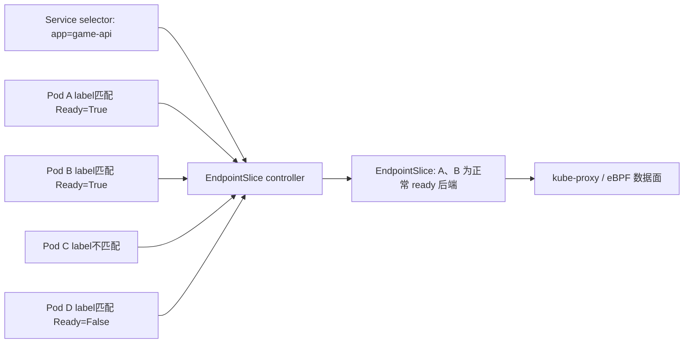

# 生产速查：Service 与 EndpointSlice——流量怎么找到 Ready Pod

> 定位：Service 流量链路的生产排障手册，不是网络基础课。  
> 能按 selector → EndpointSlice → Pod IP → 节点数据面分层排障时可以跳过。

> 本篇位置：Pod 已经运行并报告 Ready 之后，解释业务请求怎样找到它。  
> 源码深度：S1，理解对象和职责边界；暂不深挖 kube-proxy 规则生成。

## 先说结论

Service 不是一个“转发进程”，也不会自己扫描 Pod。对最常见的 selector 型 Service 来说：

```text
Service 用 selector 表达“我要哪类 Pod”
EndpointSlice controller 计算“现在有哪些具体后端”
节点转发实现读取 Service + EndpointSlice，生成实际转发路径
```

一条请求的最短主线是：

```text
客户端
  -> Service 的虚拟 IP 和 port
  -> 节点上的转发规则或数据面
  -> EndpointSlice 中一个可用的 Pod IP:targetPort
  -> 容器内应用
```

这一课学完，你要能回答：

1. Service、EndpointSlice、kube-proxy（或替代数据面）分别负责什么？
2. selector、Pod label、port、targetPort 错在哪里会出现什么现象？
3. 为什么 Pod Running 但 NotReady 时通常不会接到正常 Service 流量？
4. ClusterIP 能访问、Ingress/Gateway 不能访问时，为什么不该先怪 Pod？
5. Service 无后端时，应该用哪组证据逐层定位？

## 1. 用一个 game-api Service 开始

```yaml
apiVersion: v1
kind: Service
metadata:
  name: game-api
spec:
  selector:
    app: game-api
  ports:
    - name: http
      port: 80
      targetPort: http
---
apiVersion: apps/v1
kind: Deployment
metadata:
  name: game-api
spec:
  replicas: 3
  selector:
    matchLabels:
      app: game-api
  template:
    metadata:
      labels:
        app: game-api
    spec:
      containers:
        - name: game-api
          image: example/game-api:v1
          ports:
            - name: http
              containerPort: 8080
```

上面是用于解释字段关系的独立 8080 示例，不直接复用后文顺序实验；顺序实验沿用前课的 nginx，因此实际端口是 80。

这里有三个容易混淆的数字或字段：

| 字段 | 本例 | 含义 |
|---|---:|---|
| Service `port` | 80 | 客户端访问 Service 时使用的端口 |
| Service `targetPort` | http | 要转到 Pod 上哪个端口；这里引用容器端口名 |
| container `containerPort` | 8080 | 对应用监听端口的声明，主要供工具和引用使用 |

真正能否连接，还取决于应用是否确实监听 8080。写了 `containerPort: 8080` 不会让应用自动监听。

## 2. 三个核心角色

| 角色 | 它保存或执行什么 | 它不负责什么 |
|---|---|---|
| Service | 稳定虚拟入口、port、selector、流量策略 | 不保存应用进程，不执行 readiness probe |
| EndpointSlice | 一组实际后端地址、端口及 ready/serving/terminating 等条件 | 不负责启动 Pod |
| kube-proxy 或替代数据面 | 根据 Service 和 EndpointSlice 编程节点转发规则 | 不决定 Pod 是否健康，不创建 EndpointSlice |

如果集群使用 eBPF 数据面，可能没有传统 kube-proxy，或其转发方式不同。但对象层的排障顺序仍然成立：

```text
Service 配置
  -> EndpointSlice 后端事实
  -> 节点数据面
  -> Pod 网络与应用监听
```

## 3. EndpointSlice 是连接“声明”和“事实”的中间层

对于带 selector 的 Service，控制器持续做类似的事：

```text
读取 Service selector
  -> 查找 label 匹配的 Pod
  -> 读取 Pod IP、端口和 Ready 等状态
  -> 创建或更新 EndpointSlice
```



因此：

- selector 写错：可能一个 Endpoint 都没有；
- Pod label 写错：那个 Pod 不属于此 Service；
- targetPort 写错：Endpoint 有地址，但流量到错端口；
- Pod NotReady：通常仍可出现在 EndpointSlice 中，但 `conditions.ready=false`，不会作为普通 ready 后端接收新流量；
- 数据面没同步：Service 和 EndpointSlice 正确，访问仍失败。

## 4. Ready、serving、terminating 不要只看一个布尔值

最常用的是 ready，但 Pod 删除与优雅终止时还可能看到：

| 条件 | 重点理解 |
|---|---|
| ready | 该 endpoint 是否应该接收正常新流量 |
| serving | 终止过程里是否仍具备服务能力 |
| terminating | 对应 Pod 是否正在终止 |

第一阶段不需要背所有组合，只记住：

```text
日常无流量：先看 endpoint 是否存在、ready 是否为 true
发布/下线丢请求：再看 terminating、serving、终止宽限期和应用优雅退出
```

另一个特殊配置是 Service `publishNotReadyAddresses: true`。它常用于需要发现未 Ready 成员的有状态系统。不要为了“让流量通”就随便打开；普通在线服务通常应该尊重 readiness。

## 5. Service 类型只学运维边界

| 类型 | 入口范围 | 当前需要掌握的边界 |
|---|---|---|
| ClusterIP | 集群内部虚拟 IP | 默认类型，先用它验证 Pod 后端链路 |
| NodePort | 每个节点开放端口 | 还涉及节点防火墙、地址可达性和流量策略 |
| LoadBalancer | 外部负载均衡入口 | 依赖云控制器或具体 LB 实现 |
| ExternalName | 返回外部 DNS 名称 | 没有普通 selector/EndpointSlice 转发链路 |

Ingress 或 Gateway 通常位于 Service 之前：

```text
用户
  -> 外部 LB
  -> Ingress / Gateway
  -> Service
  -> EndpointSlice
  -> Pod
```

所以排障要从最近的已知成功点向两边收缩。

## 6. 六步排障法

假设现象是访问 `game-api` 超时。下面复用前两课的 `sre-study/game-api`（nginx 监听 80）；排查其他环境时替换 namespace 和真实端口。

### 第一步：Service 对象是否存在，端口是否正确

```powershell
kubectl get svc game-api -n sre-study -o wide
kubectl describe svc game-api -n sre-study
```

确认：

- selector 是不是你预期的；
- port/targetPort 是否正确；
- ClusterIP 是否已分配；
- sessionAffinity、trafficPolicy 是否有特殊设置。

### 第二步：selector 实际匹配到了谁

```powershell
kubectl get pod -n sre-study -l app=game-api --show-labels -o wide
```

不要只看 Deployment 名字。Service 依据 Pod label 匹配，不依据 Pod 名称、Deployment 名称或镜像名。

### 第三步：EndpointSlice 里到底有什么

```powershell
kubectl get endpointslice -n sre-study -l kubernetes.io/service-name=game-api
kubectl get endpointslice -n sre-study -l kubernetes.io/service-name=game-api -o yaml
```

需要回答：

- 是否有 addresses；
- 地址是否等于预期 Pod IP；
- port 是否正确；
- conditions.ready 是什么；
- endpoint 指向哪个 targetRef。

### 第四步：先验证应用进程，再验证 Pod 网络

在允许的测试环境，先用端口转发验证应用进程和端口：

```powershell
kubectl port-forward pod/<pod-name> -n sre-study 18080:80
```

然后访问本机 `127.0.0.1:18080`。但要注意：`port-forward` 主要经过 apiserver/kubelet 的 streaming 通道，它能验证进程和端口，不等于验证了正常 CNI、路由或 NetworkPolicy 路径。

再从集群内诊断 Pod 访问真实 Pod IP：

```powershell
kubectl get pod <pod-name> -n sre-study -o wide
kubectl run pod-ip-check -n sre-study --rm -it --restart=Never --image=curlimages/curl --command -- sh
```

在诊断容器内执行：

```sh
curl -v http://<pod-ip>:80
```

- port-forward 隧道都无法建立：先查 RBAC、apiserver 到 kubelet 的 streaming 通道和节点连通。
- 隧道已建立但本地连接失败：优先查应用进程、监听地址和端口。
- port-forward 成功、Pod IP 失败：优先查 CNI、NetworkPolicy 和跨节点网络。
- Pod IP 成功、ClusterIP 失败：问题更靠近 Service/节点数据面。

### 第五步：从集群内访问 Service 和 DNS

用已有的诊断 Pod，或在测试命名空间临时启动：

```powershell
kubectl run net-debug -n sre-study --rm -it --restart=Never --image=curlimages/curl --command -- sh
```

在容器里分别验证：

```sh
nslookup game-api
curl -v http://game-api
curl -v http://game-api.sre-study.svc.cluster.local
```

这一步把 DNS 问题与 Service 转发问题分开。

### 第六步：对象都正确，再查节点数据面

只有在以下事实都成立时再进入 kube-proxy/eBPF/CNI：

- Service 正确；
- EndpointSlice 有正确且 ready 的 Pod IP:port；
- 直接访问 Pod 应用成功；
- 但通过 ClusterIP 失败。

此时检查：

- kube-proxy 或 CNI agent 是否在相关节点健康；
- 对应组件日志是否有同步错误；
- 网络策略、主机防火墙、conntrack 是否异常；
- 是否只有某一节点上的客户端失败。

## 7. 现象到责任层的速查表

| 现象 | 优先责任层 | 第一证据 |
|---|---|---|
| Service 存在但 EndpointSlice 没有地址 | selector/label/Pod IP/控制器 | Service selector、Pod labels/IP、EndpointSlice controller |
| Endpoint 地址正确但端口不对 | targetPort/端口名 | Service YAML、EndpointSlice ports、应用监听 |
| port-forward 失败 | 应用/监听 | Pod 日志、进程、端口、探针 |
| Pod IP 成功，ClusterIP 失败 | Service/节点数据面 | Service/EndpointSlice、kube-proxy 或 CNI agent 日志 |
| ClusterIP 成功，Ingress 失败 | Ingress/Gateway/LB | 路由对象、controller 日志、LB 健康 |
| 只在发布或删除时丢请求 | readiness/优雅终止 | EndpointSlice conditions、preStop、termination grace |
| 只有跨节点失败 | CNI/路由/MTU/网络策略 | 源节点与目标节点对比、CNI 日志 |

## 8. 两个容易踩的配置坑

### 坑一：Deployment selector 对了，Service selector 却少一个 label

```yaml
# Pod labels
app: game-api
track: stable

# Service selector
app: game-api
track: canary
```

Pod 全都 Running/Ready，Service 仍可能没有任何后端。因为它们根本没有被 Service 选中。

### 坑二：targetPort 名字和容器端口名字不一致

```yaml
# Service
targetPort: web

# container
ports:
  - name: http
    containerPort: 8080
```

字段看起来都“像是对的”，但名字解析不到预期端口。统一使用有意义且一致的端口名，比散落数字更容易维护。

## 9. 本篇源码看到哪里就停

只建立三段职责：

```text
EndpointSlice controller:
  Service/Pod 变化 -> 重新计算后端 -> 写 EndpointSlice

kube-proxy 或替代数据面:
  监听 Service/EndpointSlice -> 更新节点转发状态

kubelet:
  执行 readiness -> 回写 Pod Ready
```

第一遍源码只需要认识：

- EndpointSlice controller 的 reconcile/sync 入口；
- kube-proxy 的 Service 与 EndpointSlice change tracker；
- 最终同步数据面的入口通常可概括为 `syncProxyRules`。

不要求学习 iptables、IPVS、nftables 或 eBPF 的全部规则细节。生产集群用哪种实现，后续再定向深挖哪一条。

## 10. 安全故障实验：让 selector 失配

目标：亲眼看到“Pod 全部 Ready，但 Service 零后端”。

只在测试命名空间操作。下面复用前两课的 `sre-study/game-api`；若你使用其他 namespace，请替换参数。

1. 记录原 Service selector。
2. 一个终端持续观察 EndpointSlice。
3. 另一个终端把 selector 临时改成不存在的值。

```powershell
kubectl get pod -n sre-study -l app=game-api -o wide
kubectl get svc game-api -n sre-study -o yaml
kubectl get endpointslice -n sre-study -l kubernetes.io/service-name=game-api -w
```

另一个终端执行故障注入：

```powershell
kubectl patch service game-api -n sre-study --type=merge -p '{"spec":{"selector":{"app":"game-api-lab-missing"}}}'
```

你应该看到：

- Pod 状态没有因此改变；
- Service ClusterIP 仍然存在；
- EndpointSlice 中可用后端消失或变空；
- 通过 Service 访问失败。

恢复原 selector，并观察 EndpointSlice 自动重新收敛：

```powershell
kubectl patch service game-api -n sre-study --type=merge -p '{"spec":{"selector":{"app":"game-api"}}}'
kubectl get endpointslice -n sre-study -l kubernetes.io/service-name=game-api -o yaml
```

完成本课后，如果 `sre-study` 确认只包含这套实验资源，可以清理：

```powershell
kubectl config current-context
kubectl delete namespace sre-study
```

这个实验揭示了控制器模型最重要的特点：你不需要手工把 Pod IP 填回 Service；只要声明恢复正确，控制器会重新计算事实。

## 11. 需要保存的证据

- Service selector 和 ports；
- Pod labels、IP、Ready；
- 故障前后 EndpointSlice YAML；
- 集群内 `curl -v` 结果；
- 恢复后 EndpointSlice 自动收敛的时间；
- 一句话责任层判断。

## 12. 验收题

1. Service 会不会直接保存并转发所有 Pod 流量？
2. Pod 名叫 `game-api-xxx`，为什么 Service 仍可能选不中？
3. EndpointSlice 有正确 Pod IP，但访问连接拒绝，应先核对什么？
4. ClusterIP 可以访问，Ingress 域名不通，排障重心在哪一层？
5. 为什么 readiness 会影响 Service 后端？

### 参考答案

1. Service 是稳定入口与选择规则；实际后端记录在 EndpointSlice，节点数据面完成转发。
2. Service 按 label selector 匹配，不按 Pod 名称匹配。
3. Endpoint port、Service targetPort，以及应用是否真正监听该地址和端口。
4. Service 之前的 Ingress/Gateway、外部 LB、路由和证书等层；不要先怀疑已验证成功的 Pod 链路。
5. kubelet 将探针结果反映为 Pod Ready，EndpointSlice controller 据此维护后端条件，普通流量通常只进入 ready endpoint。

## 13. 和 GPU 运维的连接

vLLM 等推理服务仍然使用同一条网络主线：

```text
模型加载完成
  -> readiness 成功
  -> EndpointSlice ready
  -> Service/Gateway 开始送入推理请求
```

GPU 服务的差别主要在于：

- 启动和预热更慢；
- 单个后端昂贵，错误摘流或错误送流量的代价更高；
- 长连接、流式响应和优雅终止更重要；
- 需要把应用延迟、排队、GPU 利用率与 Service 后端状态一起观察。

本篇是按需排障手册，不要求继续读 05。回到 README，正式主线从 `07_源码热身_Deployment_rollout卡住如何沿控制器找原因.md` 开始。

---

> 资料回查：旧的 Service、EndpointSlice、kube-proxy 深挖文章仍保留在 `study/90_主线复盘与进阶`。本篇只作生产速查，旧文不是前置阅读。
