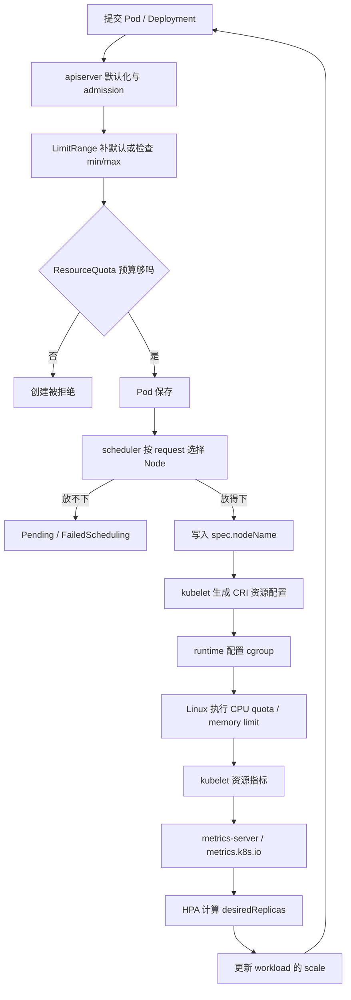

# 生产速查：资源与弹性——requests、limits、QoS 与 HPA

> 定位：scheduler 与 GPU 扩展资源之前的选择性速查。  
> 熟悉 CPU/内存治理时不用重读；只需确认 request 是调度账本、HPA 利用率以 request 为分母，以及 `nvidia.com/gpu` 的扩展资源语义。

## 1. 这篇课解决什么问题

平台运维中常见的几个问题，其实属于同一条资源链：

```text
request / limit 写进 Pod
  -> admission 补默认值、查配额
  -> scheduler 判断 Node 放不放得下
  -> kubelet/runtime 配置 cgroup
  -> metrics-server 提供当前用量
  -> HPA 调整副本数
```

学完本篇，你要能解释：

1. request、limit、usage、allocatable 为什么不是一回事。
2. scheduler 与 kubelet/runtime 各管哪一段。
3. CPU throttling、内存 OOM、QoS 分别意味着什么。
4. LimitRange、ResourceQuota 怎样影响 Pod。
5. HPA 的 CPU 利用率为什么会被 request 改变。
6. 普通资源模型怎样过渡到 `nvidia.com/gpu`。

本篇源码深度为 `S1`：只给必要入口与伪代码，不逐行读实现。

本篇信息量比前几课大，分两次学：第一次读第 1~4 节，先吃透 requests、limits、QoS 和 quota；第二次再读第 5~7 节，把 HPA 与 GPU 扩展资源接上。实验放在两次都读完以后做。

---

## 2. 一张资源总图



| 组件 | 主要决定 | 不负责什么 |
| --- | --- | --- |
| admission | 对象能否创建、最终默认值、namespace 配额 | 不选择 Node |
| scheduler | Pod 放到哪台 Node | 不创建容器、不执行 CPU limit |
| kubelet | 把已绑定 Pod 翻译成节点动作和 CRI 请求 | 不做全局选 Node |
| containerd/内核 | 创建容器、配置并执行 cgroup 约束 | 不决定副本数 |
| metrics-server | 暴露近期 CPU/内存资源指标 | 不是长期监控数据库 |
| HPA | 调整 Pod 副本数 | 不增加 Node、不改变单 Pod 规格 |

一句话：

```text
scheduler 解决“放哪里”；
kubelet/runtime 解决“怎样跑”；
HPA 解决“跑几个”。
```

---

## 3. requests 和 limits

### 3.1 最小示例

```yaml
resources:
  requests:
    cpu: 250m
    memory: 256Mi
  limits:
    cpu: 500m
    memory: 512Mi
```

| 字段 | scheduler 视角 | 运行时视角 | 配错的典型后果 |
| --- | --- | --- | --- |
| CPU request | 按 250m 记账 | 竞争时影响 CPU 权重 | 过大难调度；过小容量失真 |
| CPU limit | 普通 CPU 调度通常不用它装箱 | 常转成 CPU quota | 过小导致 throttling、延迟升高 |
| Memory request | 按 256Mi 记账 | 不是硬上限 | 过大降低装箱率；过小掩盖需求 |
| Memory limit | 普通内存调度通常不用它装箱 | 常转成 cgroup memory 上限 | 超限可能 OOMKilled |

单位：

```text
cpu: 1     = 1 个逻辑 CPU 核的计算时间
cpu: 500m  = 0.5 CPU
memory: 1Gi / 512Mi 是容量
```

request 是 Kubernetes 做资源承诺和治理的基准，不是切出一块永远独占的物理资源。

limit 是上限，不是保证。`cpu limit=500m` 不承诺一定拿到 500m；`memory limit=512Mi` 也不保证节点始终有 512Mi 空闲。

普通 CPU/内存可以只写 request。只写 limit 时，如果 admission 没有另外注入 request，Kubernetes 会把同值用作 request；LimitRange 也可能先补入默认值。两者都没写且无默认策略时，Pod 可能没有资源基准。

排障时看 admission 后真正保存的对象：

```bash
kubectl get pod <pod-name> -n <namespace> -o yaml
```

### 3.2 Capacity、Allocatable、Requested、Usage

| 名称 | 含义 |
| --- | --- |
| Capacity | Node 识别到的总容量 |
| Allocatable | 扣除系统、kubelet 和安全余量后，可分给 Pod 的容量 |
| Requested | Node 上已调度 Pod 的 request 总账 |
| Usage | 此刻实际使用量 |

scheduler 的判断近似为：

```text
新 Pod request
  <= Node allocatable - 已有 Pod requested
```

例如 CPU Allocatable 为 `7500m`、已有 request 为 `6000m`，即使实时 usage 只有 `800m`，请求 `2000m` 的新 Pod 仍会 `Insufficient cpu`，因为剩余承诺容量只有 `1500m`。

观察：

```bash
kubectl describe node <node-name>
kubectl top node
```

`kubectl describe node` 的 Allocated resources 与 `kubectl top node` 是两张不同的账。

### 3.3 CPU throttling

常见 Linux 配置下，CPU limit 会变成一段周期内允许使用的 CPU 时间：

```text
本周期 quota 没用完 -> 继续运行
quota 用完           -> 暂停到下一周期
```

这叫 throttling。应用不会因为多用 CPU 就 OOMKilled，但可能表现为：

- CPU usage 被压在 limit 附近。
- 线程有工作却拿不到 CPU 时间。
- Java GC、序列化或接口延迟抖动。

`kubectl top` 只能显示 usage，不能单独证明 throttling。cgroup v2 可查看：

```bash
kubectl exec -n <namespace> <pod-name> -- cat /sys/fs/cgroup/cpu.stat
```

上面是常见 cgroup v2 路径；cgroup v1 的文件位置不同。命令不存在时先确认节点的 cgroup 版本，不要据此断言“没有 throttling”。

若 `nr_throttled`、`throttled_usec` 持续增长，证据更直接。

### 3.4 内存 OOM 不等于 Java OOM，也不等于 Evicted

| 现象 | 发生层次 | 关键证据 |
| --- | --- | --- |
| `OOMKilled` | cgroup/内核杀进程 | terminated reason、常见退出码 137 |
| Java `OutOfMemoryError` | JVM 内部 | Java 日志、heap dump |
| Pod `Evicted` | kubelet 节点压力管理 | Pod reason、Event、Node Pressure condition |

memory request 不是硬上限。容器可以从 request 继续增长，直到碰到 limit 或节点压力。

Java 容器的内存还包括 Heap、Metaspace、Direct Memory、线程栈和 native memory；因此 `Xmx=memory limit` 往往没有给非堆区域留下空间。排障时同时看 Pod terminated reason、`--previous` 日志和 Node Pressure。

### 3.5 QoS

Kubernetes 主要按 CPU、内存的 request/limit 划分 QoS：

| QoS | 简化判断 |
| --- | --- |
| Guaranteed | 每个普通/init container 都完整设置 CPU、内存 request/limit，且对应值相等 |
| Burstable | 不是 Guaranteed，但存在 CPU/内存 request 或 limit |
| BestEffort | 所有普通/init container 都没有 CPU/内存 request 和 limit |

例如 CPU request/limit 都是 `500m`、内存 request/limit 都是 `512Mi`，且每个容器字段完整，才满足简单 Guaranteed 条件。查看：

```bash
kubectl get pod <pod-name> -n <namespace> -o jsonpath='{.status.qosClass}{"\n"}'
```

QoS 是节点压力驱逐的重要输入，但不是绝对免死牌；Priority、实际使用是否超过 request、压力类型也会参与决策。

仅声明 `nvidia.com/gpu` 不会让 Pod 自动成为 Guaranteed，QoS 的核心仍是 CPU 和内存。

---

## 4. LimitRange 与 ResourceQuota

| 对象 | 管什么 | 典型结果 |
| --- | --- | --- |
| LimitRange | 单个 container/Pod 的默认 request/limit、min/max | 补默认值或拒绝超范围对象 |
| ResourceQuota | namespace 的资源和对象总预算 | 超预算时拒绝创建/更新 |

最小策略：

```yaml
apiVersion: v1
kind: LimitRange
metadata:
  name: defaults
  namespace: resource-lab
spec:
  limits:
  - type: Container
    defaultRequest: {cpu: 100m, memory: 64Mi}
    default: {cpu: 500m, memory: 128Mi}
---
apiVersion: v1
kind: ResourceQuota
metadata:
  name: budget
  namespace: resource-lab
spec:
  hard:
    pods: "10"
    requests.cpu: "1"
    requests.memory: 1Gi
    limits.cpu: "4"
    limits.memory: 2Gi
```

LimitRange 补出的值会继续影响 scheduler、QoS、ResourceQuota 和 HPA 分母。

两种故障要分开：

```text
exceeded quota:
  admission 已拒绝，Pod 不会进入 scheduler。

Insufficient cpu/memory:
  Pod 已创建，但 scheduler 找不到可容纳它的 Node。
```

观察：

```bash
kubectl get limitrange -n resource-lab -o yaml
kubectl describe resourcequota budget -n resource-lab
kubectl get events -n resource-lab --sort-by=.lastTimestamp
```

---

## 5. metrics-server 与 HPA

### 5.1 指标和控制链

```text
kubelet 资源指标
  -> metrics-server
  -> metrics.k8s.io
  -> HPA controller
  -> workload /scale
  -> Deployment 创建或删除 Pod
```

metrics-server 为 `kubectl top` 和 HPA 提供近期 CPU/内存指标；Prometheus 更适合历史、告警、业务指标和自定义指标。

最小 HPA：

```yaml
apiVersion: autoscaling/v2
kind: HorizontalPodAutoscaler
metadata:
  name: demo
  namespace: resource-lab
spec:
  scaleTargetRef:
    apiVersion: apps/v1
    kind: Deployment
    name: demo
  minReplicas: 1
  maxReplicas: 5
  metrics:
  - type: Resource
    resource:
      name: cpu
      target:
        type: Utilization
        averageUtilization: 60
```

近似公式：

```text
desiredReplicas
  = ceil(currentReplicas × currentMetric / desiredMetric)

CPU Utilization
  ≈ 可用 Pod 的 CPU usage 总和
    / 可用 Pod 的 CPU request 总和
```

真实实现还会处理缺失指标、未 Ready Pod、容忍度、min/max、限速和缩容稳定窗口。

### 5.2 最重要的分母误区

同一个 Pod 都实际使用 `200m` CPU：

| CPU request | HPA 看到的近似利用率 |
| --- | --- |
| 100m | 200% |
| 200m | 100% |
| 500m | 40% |

request 改变了 HPA 的分母，并不代表应用负载发生了变化。

CPU limit 还可能把 usage 截在上限附近，HPA 不能完整还原被 throttling 压掉的需求。对延迟敏感服务，QPS、队列长度和延迟常比单一 CPU 百分比更可靠。

### 5.3 HPA 显示 unknown 怎么查

```bash
kubectl top node
kubectl top pod -n resource-lab
kubectl describe hpa demo -n resource-lab
```

常见原因是 metrics-server 不可用、新 Pod 尚无指标、Pod 没有 CPU request，或 selector/`scale` 目标错误。

如果 `kubectl top` 都失败，先修指标链，不要先怀疑 HPA 公式。

### 5.4 HPA、VPA、Cluster Autoscaler

| 能力 | 调整什么 | 不负责什么 |
| --- | --- | --- |
| HPA | Pod 副本数 | 不增加 Node |
| VPA | 建议或调整单 Pod request/limit | 不增加副本 |
| Cluster Autoscaler | Node/Node Pool 数量 | 不修错误 selector、quota、taint/affinity |

正常扩容可能是：

```text
HPA 增副本 -> 新 Pod Pending
  -> Cluster Autoscaler 增 Node
  -> Pod 被调度
```

HPA 与 VPA 同时围绕 CPU request 工作时会互相影响，应明确控制边界。

---

## 6. 从普通资源过渡到 nvidia.com/gpu

GPU Device Plugin 正常工作后，Node 才会出现类似：

```yaml
status:
  capacity:
    nvidia.com/gpu: "4"
  allocatable:
    nvidia.com/gpu: "4"
```

Pod 常见写法：

```yaml
resources:
  limits:
    nvidia.com/gpu: "1"
```

GPU extended resource 的基本边界：

- 通常按整数申请，不能写 `500m` GPU。
- 原生扩展资源不能像 CPU 那样超卖。
- 只写 GPU limit 时，Kubernetes 使用同值作为 request。
- request 和 limit 都写时必须相等；不能只写 request。
- scheduler 按数量选择 Node，不选择具体 GPU UUID。
- kubelet DeviceManager 与 Device Plugin 后续才分配具体设备。

namespace GPU 配额通常写：

```yaml
spec:
  hard:
    requests.nvidia.com/gpu: "4"
```

`nvidia.com/gpu: 1` 只表示分配数量，不包含 GPU util、显存、温度、队列或 tokens/s。

metrics-server 不会把它自动变成 GPU 利用率。以后按 GPU/推理压力扩容，常见链路是：

```text
DCGM / 应用指标
  -> Prometheus
  -> Prometheus Adapter、KEDA 等
  -> custom/external metrics
  -> HPA 或事件驱动扩缩容
```

如果 HPA 增加 GPU Pod，但没有空闲 GPU，新 Pod 只会：

```text
Pending: Insufficient nvidia.com/gpu
```

还需要 GPU Node Pool 能扩容，并等待 Driver、Toolkit、Device Plugin 初始化。

---

## 7. S1 源码地图

本篇只需知道行为入口。下列路径都相对于 `kubernetes/` 源码根目录：

| 问题 | 必要入口 |
| --- | --- |
| scheduler 怎样聚合 request、判断放不下 | `staging/src/k8s.io/component-helpers/resource/helpers.go` 的 `PodRequests`；`pkg/scheduler/framework/plugins/noderesources/fit.go` 的 `PreFilter/Filter` |
| kubelet 怎样生成 Linux 资源配置 | `pkg/kubelet/kuberuntime/kuberuntime_container_linux.go` 的 `generateLinuxContainerResources` |
| QoS 怎样计算 | `pkg/apis/core/v1/helper/qos/qos.go` 的 `ComputePodQOS` |
| LimitRange/Quota admission | `plugin/pkg/admission/limitranger/admission.go`、`staging/src/k8s.io/apiserver/pkg/admission/plugin/resourcequota/admission.go` |
| HPA 怎样计算副本 | `pkg/controller/podautoscaler/horizontal.go`、`pkg/controller/podautoscaler/replica_calculator.go` |

核心伪代码：

```text
if PodRequests(pod) > node.allocatable - node.requested:
    return Unschedulable("Insufficient resource")

cpuRequest -> CPU weight
cpuLimit / memoryLimit -> CRI resources -> cgroup

HPA: metrics + requests -> desired -> normalize(min/max/behavior) -> scale
```

到这里就停，不展开每个插件、quota evaluator 和 HPA 算法分支。

---

## 8. 一个组合实验

只在测试集群执行。目标是一次看到 HPA、throttling、OOM 和 quota 证据。

### 8.1 准备策略

```bash
kubectl top node
kubectl create namespace resource-lab
```

把第 4 节策略保存为 `policy.yaml` 后执行：

```bash
kubectl apply -f policy.yaml
kubectl describe resourcequota budget -n resource-lab
```

若 `kubectl top node` 不可用，先修 metrics-server；不要继续验证 HPA。

### 8.2 CPU 满载 Pod 与 HPA

保存为 `demo.yaml`：

```yaml
apiVersion: apps/v1
kind: Deployment
metadata:
  name: demo
  namespace: resource-lab
spec:
  replicas: 1
  selector:
    matchLabels: {app: demo}
  template:
    metadata:
      labels: {app: demo}
    spec:
      containers:
      - name: burn
        image: busybox:1.36
        command: ["sh", "-c", "while true; do :; done"]
        resources:
          requests: {cpu: 100m, memory: 64Mi}
          limits: {cpu: 200m, memory: 128Mi}
```

执行：

```bash
kubectl apply -f demo.yaml
kubectl autoscale deployment demo -n resource-lab --cpu-percent=60 --min=1 --max=5
kubectl get pod,hpa -n resource-lab -w
```

另开终端保存证据：

```bash
kubectl top pod -n resource-lab --containers
kubectl describe hpa demo -n resource-lab
kubectl describe resourcequota budget -n resource-lab
kubectl get events -n resource-lab --sort-by=.lastTimestamp
```

预期：CPU 接近 `200m` limit；以 `100m` request 为分母，HPA 利用率超过 100%，副本逐渐增加。

验证 throttling：

```bash
kubectl get pod -n resource-lab -l app=demo
kubectl exec -n resource-lab <demo-pod> -- cat /sys/fs/cgroup/cpu.stat
```

间隔十几秒读两次，保存 `nr_throttled`、`throttled_usec` 的差值。

### 8.3 注入内存 OOM

保存为 `oom.yaml`：

```yaml
apiVersion: v1
kind: Pod
metadata:
  name: memory-oom
  namespace: resource-lab
spec:
  restartPolicy: Never
  containers:
  - name: allocate
    image: python:3.12-alpine
    command: ["python", "-c", "x=bytearray(256*1024*1024); import time; time.sleep(600)"]
    resources:
      requests: {cpu: 50m, memory: 32Mi}
      limits: {cpu: 200m, memory: 64Mi}
```

```bash
kubectl apply -f oom.yaml
kubectl describe pod memory-oom -n resource-lab
kubectl get pod memory-oom -n resource-lab -o jsonpath='{.status.containerStatuses[0].state.terminated.reason}{"\n"}'
```

预期终止原因是 `OOMKilled`。

### 8.4 注入 quota 拒绝

先避免 HPA 继续改副本，再把 Deployment 扩到超过 `pods: 10`：

```bash
kubectl delete hpa demo -n resource-lab
kubectl scale deployment demo -n resource-lab --replicas=20
kubectl describe replicaset -n resource-lab
kubectl describe resourcequota budget -n resource-lab
kubectl get events -n resource-lab --sort-by=.lastTimestamp
```

预期 ReplicaSet 创建一部分 Pod 后出现 `exceeded quota`；这是 admission 拒绝，不是 FailedScheduling。

证据至少保留 HPA current/target 与副本时间线、两次 `cpu.stat`、OOM terminated reason、ReplicaSet Event 和 quota hard/used。

清理：

```bash
kubectl delete namespace resource-lab
```

---

## 9. 排障速查表

| 现象 | 首查层次 | 关键证据 |
| --- | --- | --- |
| 创建时报 `exceeded quota` | admission | API 错误、quota hard/used |
| Pending 且 `Insufficient cpu/memory` | scheduler | Event、allocatable、requested |
| Node top 很低仍 Pending | scheduler 账本 | Allocated resources 对比 usage |
| Running 但延迟高，CPU 卡在 limit | cgroup | throttling 指标、`cpu.stat` |
| `OOMKilled` | 容器内存上限 | terminated reason、退出码、内存曲线 |
| HPA `<unknown>` | 指标链/request | `kubectl top`、HPA Conditions |
| HPA 扩容后 Pod Pending | scheduler/Node Pool | 新 Pod Event、CA 日志 |
| `Insufficient nvidia.com/gpu` | GPU 扩展资源 | Node allocatable、Device Plugin |

---

## 10. 验收题和答案

### 1. request 和 limit 的核心区别？

request 是调度与治理基准；limit 是常见运行时上限。scheduler 主要看 request，kubelet/runtime 落实 limit。

### 2. Node 很空闲，为什么仍会 `Insufficient cpu`？

scheduler 看 allocatable 减去已承诺 request，不看此刻 usage。

### 3. CPU、内存超过 limit 的典型后果？

CPU 常见是 throttling；内存可能被内核杀掉并显示 `OOMKilled`。

### 4. LimitRange 和 ResourceQuota 分别管什么？

LimitRange 管单对象默认值和边界；ResourceQuota 管 namespace 总预算。

### 5. 同样使用 200m CPU，request 从 100m 改成 500m，HPA 看见什么？

近似从 200% 变成 40%；负载没变，变化的是分母。

### 6. HPA、VPA、Cluster Autoscaler 分别调整什么？

分别调整 Pod 副本、单 Pod 规格、Node/Node Pool 数量。

### 7. 为什么 `nvidia.com/gpu: 1` 不能直接作为 GPU 利用率 HPA？

它只表示设备分配数量。GPU util、显存和业务队列要由 DCGM/应用指标经 custom/external metrics 等链路提供。

---

## 11. 返回正式主线

本篇是 scheduler/GPU 资源课前的选择性速查，不要求继续读 06。正式主线从 `07_源码热身_Deployment_rollout卡住如何沿控制器找原因.md` 开始；进入 NodeResourcesFit 前再按需回看本篇。
