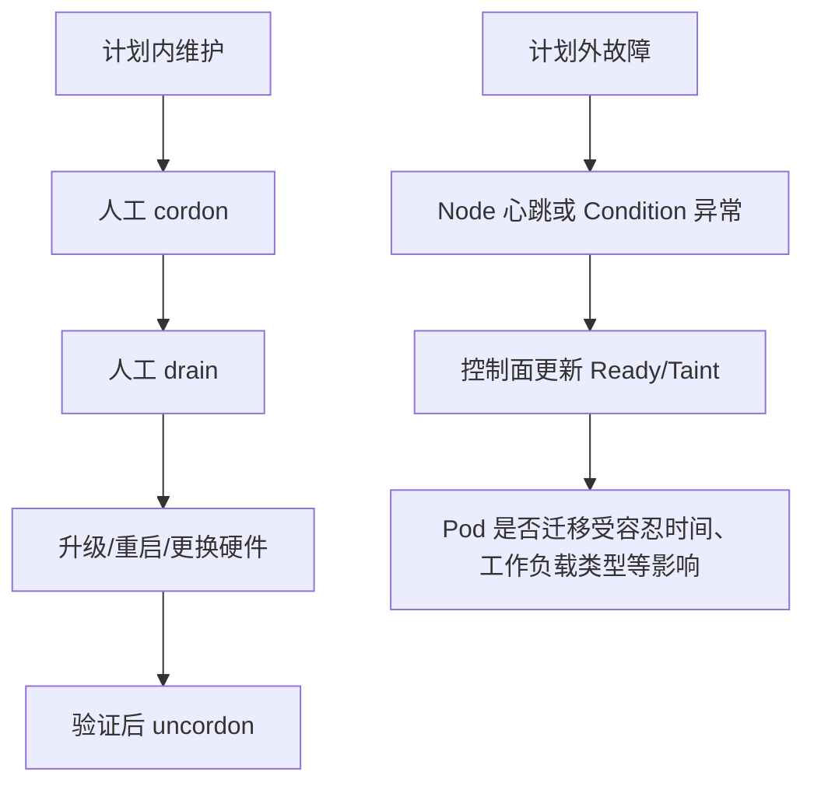

# 生产速查：节点维护与排障——cordon、drain、PDB 与 NodeReady

> 定位：普通节点与未来 GPU 节点维护的 SOP 速查，不是当前前置课。  
> 日常已熟练处理 cordon、drain、PDB 和 NodeReady 时先跳过，进入 GPU 节点升级维护阶段再回看。

> 本篇位置：完成平台 K8s 第一阶段，把工作负载、流量、资源放到“节点生命周期”中统一处理。  
> 源码深度：S1，运维行为和证据学深，控制器实现只认职责。

## 先说结论

节点维护不是一句 `kubectl drain`。一个安全的维护闭环是：

```text
确认业务冗余和迁移条件
  -> cordon：停止接收普通新 Pod
  -> drain：通过驱逐逐步迁走可迁移 Pod
  -> 维护并验证节点
  -> 检查 kubelet/runtime/网络/存储/设备
  -> uncordon：恢复调度
  -> 观察业务和副本重新收敛
```

这一课学完，你要能回答：

1. cordon、drain、delete Pod 有什么区别？
2. PDB 保护的是什么，为什么它不能保证业务一定可用？
3. Node Ready、MemoryPressure、DiskPressure、PIDPressure 各说明什么？
4. drain 为什么可能被 PDB、DaemonSet、本地数据或单副本服务阻塞？
5. GPU 节点维护为什么比普通节点多出驱动、设备和长启动服务的检查？

## 1. 先分清三个动作

| 动作 | 实质 | 现有 Pod | 新 Pod |
|---|---|---|---|
| `kubectl cordon node-a` | 设置节点不可调度 | 通常继续运行 | 普通 scheduler 不再把新 Pod 放上来 |
| `kubectl drain node-a ...` | cordon 后，使用驱逐/删除逐步迁移 Pod | 可迁移 Pod 被终止并由控制器在别处补建 | 不再调度到该节点 |
| `kubectl delete pod ...` | 删除指定 Pod | 该 Pod 终止；是否补建取决于控制器 | 不改变节点是否可调度 |

最常见误解：

```text
cordon 不会自动迁走已有 Pod
drain 不是一个常驻控制器，而是 kubectl 发起的一次维护流程
删除裸 Pod 后不会凭空重建；Deployment/StatefulSet 等控制器才会补副本
```

## 2. NodeReady 从哪里来

kubelet 周期性收集节点状态，并向 apiserver 更新 Node status；Node Lease 提供更轻量的心跳。控制面根据这些信息判断节点健康。

常见 Node Condition：

| Condition | 正常期望 | 异常时优先考虑 |
|---|---|---|
| Ready | True | kubelet、runtime、网络、心跳、节点宕机 |
| MemoryPressure | False | 可用内存低、回收与驱逐 |
| DiskPressure | False | 磁盘/镜像文件系统空间或 inode 压力 |
| PIDPressure | False | 可用进程号不足 |
| NetworkUnavailable | 通常 False | 节点网络尚未配置或异常，具体依赖网络插件 |

`Ready=False/Unknown` 是结果，不是根因。需要继续看：

```powershell
kubectl get node -o wide
kubectl describe node <node-name>
kubectl get lease -n kube-node-lease <node-name> -o yaml
kubectl get events --field-selector involvedObject.kind=Node,involvedObject.name=<node-name> --sort-by=.lastTimestamp
```

再到节点检查：

- kubelet 是否运行、日志报什么；
- containerd 等 runtime 是否健康；
- 磁盘、inode、内存、PID 是否耗尽；
- CNI agent 和主机网络是否正常；
- 证书、时间同步、apiserver 连通性；
- 对 GPU 节点还要看驱动、设备插件和 GPU 健康。

## 3. 节点异常和人工维护不是同一件事



不要把“Node NotReady 后系统可能迁移 Pod”当作维护 SOP。计划维护应该主动控制节奏、检查 PDB、确保容量，再执行 drain。

## 4. drain 到底会遇到哪些阻力

### 4.1 PodDisruptionBudget

PDB 限制的是自愿中断期间同时损失多少可用副本。常见写法：

```yaml
apiVersion: policy/v1
kind: PodDisruptionBudget
metadata:
  name: game-api
spec:
  minAvailable: 2
  selector:
    matchLabels:
      app: game-api
```

如果总共 3 个健康副本，`minAvailable: 2` 通常允许一次自愿驱逐一个可用副本；新副本恢复可用后，再继续下一个。

也可以使用 `maxUnavailable`，但同一个 PDB 只能选择一种表达。

PDB 不保证：

- 应用 readiness 一定正确；
- 集群有足够容量在其他节点补副本；
- 多个副本没有全在同一故障域；
- 节点突然宕机时业务一定不受影响；
- 你的应用具备会话迁移和优雅退出能力。

所以 PDB 是“驱逐闸门”，不是高可用本身。

### 4.2 DaemonSet Pod

DaemonSet 常用于每节点一个 agent，例如：

- CNI；
- 日志/监控 agent；
- NVIDIA device plugin；
- DCGM exporter。

drain 默认会提醒或阻止你忽略这类 Pod，通常需要显式使用 `--ignore-daemonsets`。它不是把 DaemonSet Pod 搬到另一台节点，因为其他节点本来就有各自的副本；节点维护时该节点上的实例随节点一起停止。

### 4.3 emptyDir 和本地数据

`emptyDir` 的数据随 Pod/节点生命周期，不是可迁移持久卷。使用：

```powershell
kubectl drain <node-name> --ignore-daemonsets --delete-emptydir-data
```

意味着你明确接受删除 emptyDir 数据。不能因为命令提示你加参数就盲目添加，必须先确认数据是否可丢。

使用 local PV、hostPath 或绑定特定节点的数据工作负载，也可能无法像普通无状态 Pod 一样迁移。

### 4.4 裸 Pod、静态 Pod 和受控 Pod

- Deployment/ReplicaSet Pod：删除后通常会由控制器补建；
- StatefulSet Pod：会补建，但身份、卷和顺序语义不同；
- DaemonSet Pod：按节点维度管理；
- 裸 Pod：没有上层控制器，删掉不会自动补；
- static Pod / mirror Pod：由本机 kubelet 管理，不能按普通 API Pod 迁走。

drain 前先看 owner：

```powershell
kubectl get pod -A --field-selector spec.nodeName=<node-name> -o custom-columns='NAMESPACE:.metadata.namespace,NAME:.metadata.name,OWNER:.metadata.ownerReferences[0].kind,READY:.status.containerStatuses[*].ready'
```

### 4.5 集群没有落脚容量

即使 PDB 允许驱逐，新 Pod 仍可能 Pending：

- CPU/memory request 放不下；
- 节点 affinity/selector 限制；
- taint 没有 toleration；
- PVC 拓扑限制；
- GPU 数量不足；
- 端口或其他资源冲突。

所以 drain 前要先评估“移出去以后放哪里”，而不是只看当前节点。

## 5. 一个生产维护检查单

### 维护前

1. 明确变更内容、回滚条件和负责人。
2. 确认业务副本、Ready、PDB、反亲和或拓扑分布。
3. 确认其他节点有足够 request 容量。
4. 列出该节点所有 Pod、owner、卷和本地数据。
5. 确认 Job、长连接、消息消费者等是否可中断。
6. 观察当前告警，避免在已有故障上叠加变更。
7. 对 GPU 节点确认是否有长时间推理/训练任务以及检查点策略。

### 执行

```powershell
kubectl cordon <node-name>
kubectl get node <node-name>
kubectl get pod -A --field-selector spec.nodeName=<node-name> -o wide
```

确认不可调度后，再根据已审查的工作负载选择 drain 参数。不要复制一条带 `--force`、`--delete-emptydir-data` 的“万能命令”。

执行时持续观察：

```powershell
kubectl get pod -A -o wide -w
kubectl get pdb -A
kubectl get events -A --sort-by=.lastTimestamp
```

### 维护后

先不要立刻 uncordon。检查：

- Node Ready=True，Pressure 条件正常；
- kubelet/runtime/CNI 正常；
- 持久卷、DNS、镜像拉取正常；
- DaemonSet 都已恢复；
- 普通节点做一次最小 Pod 启动验证；
- GPU 节点做 `nvidia-smi`、device plugin、可调度资源和 GPU smoke test。

最后：

```powershell
kubectl uncordon <node-name>
kubectl get node <node-name>
```

并观察一段时间，确认新 Pod 能正常调度和 Ready。

## 6. drain 被阻塞时怎么排

| 现象 | 不要立刻做什么 | 首先确认 |
|---|---|---|
| PDB violation | 不要直接删 PDB 或强制删 Pod | 期望副本、当前 healthy、disruptionsAllowed、其他节点容量 |
| 提示 DaemonSet | 不要误以为 agent 可迁到别处 | 是否确属 DaemonSet，节点回来后能否自动恢复 |
| 提示 local/emptyDir 数据 | 不要无脑加删除参数 | 数据是否可丢、是否已有持久化 |
| 新 Pod 全 Pending | 不要继续驱逐更多 | FailedScheduling Event、request、taint/affinity、卷/GPU |
| Pod 长时间 Terminating | 不要先强制删除 | preStop、terminationGracePeriod、finalizer、存储卸载、应用退出 |
| 单副本服务阻塞 | 不要把 PDB 当错误 | 先扩副本并验证多副本安全，再维护 |

查看 PDB 的关键证据：

```powershell
kubectl get pdb -A
kubectl describe pdb <pdb-name> -n <namespace>
```

关注：

- currentHealthy；
- desiredHealthy；
- expectedPods；
- disruptionsAllowed。

`disruptionsAllowed: 0` 不是“PDB 坏了”，它可能是在正确阻止一次会越过可用性底线的维护。

## 7. 节点 Pressure 和驱逐

节点资源紧张时，kubelet 可能执行 node-pressure eviction。需要分清：

```text
scheduler：
  主要根据 request 和节点可分配资源决定能否放入

kubelet：
  节点实际运行后，面对内存、磁盘等压力执行节点侧管理和驱逐
```

所以“request 明明能放下”不代表运行期永远安全。应用实际使用超出预期、磁盘日志膨胀、镜像堆积等，都可能让节点进入 Pressure。

排查顺序：

1. Node Conditions 与 allocatable；
2. Node Event 中的 eviction/pressure；
3. Pod 的 QoS、request、实际使用；
4. 节点文件系统空间/inode；
5. kubelet eviction 配置与日志；
6. 工作负载是否持续制造压力。

不要只清磁盘恢复表象，还要找到增长来源和容量治理缺口。

## 8. 本篇源码边界

当前只认四个职责：

| 组件 | 本篇需要知道的职责 |
|---|---|
| kubelet | 上报 Node status/lease，执行节点侧 Pod 生命周期和压力驱逐 |
| Node lifecycle controller | 根据节点健康更新状态/taint，并参与不可达节点处理 |
| scheduler | 避开不可调度或不满足条件的节点 |
| eviction API / PDB | 在自愿驱逐时检查中断预算 |

不需要现在深读：

- Node lifecycle controller 的全部定时器；
- taint eviction controller 的队列实现；
- kubelet eviction manager 的全部阈值计算；
- kubectl drain 的全部过滤分支。

等到 scheduler、kubelet 专项课，再把 `spec.unschedulable`、taint、Node condition 和节点执行源码串起来。

## 9. 安全实验：只做 cordon，不做生产 drain

选择一个可丢弃的测试 worker，确认它不是单节点集群唯一可用节点。

### 实验一：观察 cordon

```powershell
kubectl cordon <test-node>
kubectl get node <test-node>
kubectl get pod -A --field-selector spec.nodeName=<test-node> -o wide
```

验证：

- 节点显示 `SchedulingDisabled`；
- 已有 Pod 没有自动消失；
- 新建的普通 Pod 不应由 scheduler 选择该节点。

完成后：

```powershell
kubectl uncordon <test-node>
```

### 实验二：仅做 drain 预检查

先列 Pod 和 PDB，不直接执行 drain：

```powershell
kubectl get pod -A --field-selector spec.nodeName=<test-node> -o wide
kubectl get pdb -A
```

逐个回答：

- owner 是谁；
- 能否重建；
- 是否有本地数据；
- 是否受 PDB 保护；
- 迁移后哪个节点能放下。

如果你有专用测试集群，再在明确参数含义和恢复方案后做完整 drain。

## 10. 需要保存的证据

- cordon 前后的 Node spec/显示状态；
- 节点上的 Pod 与 owner 列表；
- Node Conditions、Event、Lease；
- PDB 四个关键值；
- 维护期间 Pending/Terminating 的 Event；
- 维护后的 DaemonSet、业务 Ready 和最小 smoke test；
- 变更时间线、回滚条件和最终结论。

## 11. 验收题

1. cordon 后节点上已有 Pod 会立即被迁走吗？
2. PDB 为什么不能单独保证业务高可用？
3. drain 看到 `disruptionsAllowed: 0` 时，正确动作是什么？
4. 新 Pod 在 drain 期间 Pending，第一证据是什么？
5. GPU 节点维护恢复后，为什么 Node Ready=True 仍不够？

### 参考答案

1. 不会；cordon 主要阻止 scheduler 将普通新 Pod 放入，已有 Pod 通常继续运行。
2. PDB 只约束自愿驱逐预算，不创造副本、容量、正确探针、拓扑分散或应用优雅退出能力。
3. 查期望副本、healthy、PDB 配置和其他节点容量，先恢复可用性或扩容；不要先删 PDB/强制删除。
4. Pod 的 FailedScheduling Event，然后查 request、taint/affinity、卷拓扑和 GPU 等资源条件。
5. Ready 只说明节点基础心跳/状态正常；还需验证驱动、GPU 可见性、device plugin、`nvidia.com/gpu` allocatable、监控和实际 CUDA workload。

## 12. 和 GPU 运维的连接

GPU 节点维护是在普通节点闭环上增加几层：

```text
普通节点：
  kubelet + runtime + CNI + 存储 + 业务 Pod

GPU 节点再增加：
  内核驱动
  NVIDIA Container Toolkit / CDI
  device plugin
  GPU Operator 组件
  DCGM 监控
  MIG 或共享策略
  昂贵且启动缓慢的推理/训练任务
```

因此未来的 GPU 节点 SOP 至少要覆盖：

- 哪些任务允许驱逐，是否有 checkpoint；
- 驱动/内核/Operator 升级顺序和回滚；
- 节点回归后 GPU 数量、型号、健康状态是否正确；
- device plugin 是否重新上报资源；
- DCGM 指标和 Xid 是否正常；
- smoke test 是否真正执行了 CUDA，而不只是 Pod Running。

本篇是按需节点维护手册，不代表必须完成一个“平台 K8s 基础阶段”。回到 README，正式主线从 `07_源码热身_Deployment_rollout卡住如何沿控制器找原因.md` 开始；进入 GPU 节点升级维护时再回看本篇。

---

> 资料回查：旧的 drain、PDB、NodeReady、压力驱逐源码文档仍保留在 `study/90_主线复盘与进阶`，仅在后续深挖或真实故障需要时使用。
