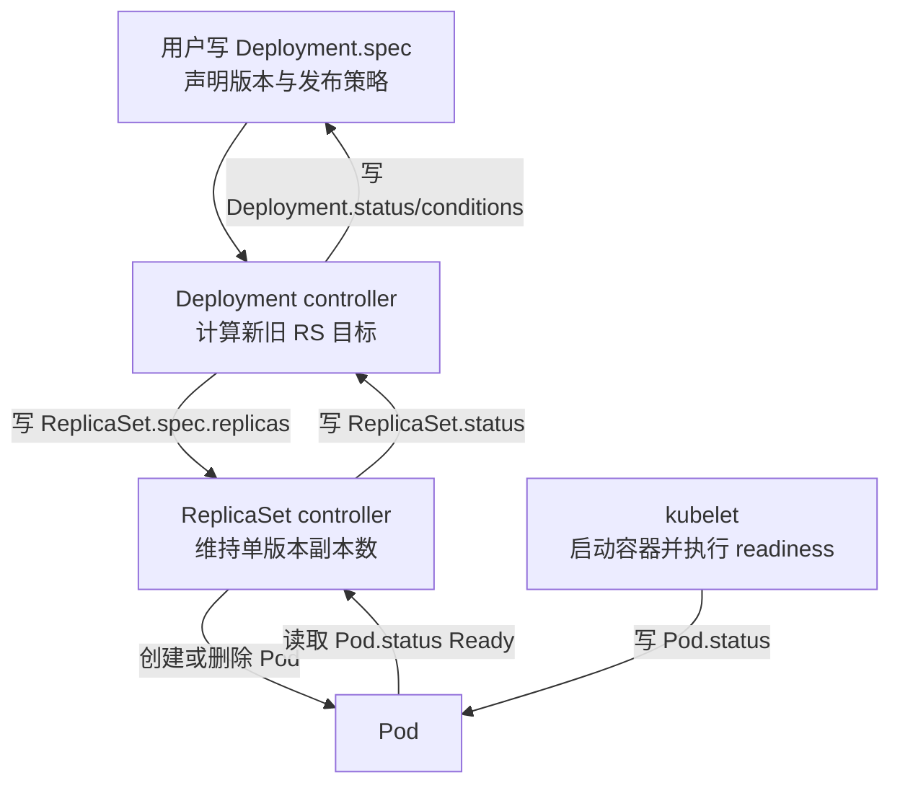

# 第 07 课：Deployment 为什么宁愿卡住也不缩旧 Pod

> 从一次 Java 应用 rollout，读懂 Kubernetes 的声明式控制循环、安全边界与源码设计。

这不是一篇 Deployment 使用说明，也不是让你照着执行一串命令的故障手册。

你已经做了几年 Kubernetes 平台运维，`kubectl get/describe/logs` 并不是本课的难点。本课真正要训练的是另一种能力：看到生产现象后，先推断控制器必须维护哪些不变量，再进入源码验证自己的推断。

整章只围绕一个问题：

> 新版本 Pod 已经创建，甚至显示 `Running`，Deployment 为什么既不继续扩新版本，也不删除旧版本？

我们不会马上公布答案。学习顺序是：

```text
先看矛盾现场
  → 追问 Deployment 当初为什么需要被设计出来
  → 建立 Kubernetes 控制器模型
  → 在白板上推演控制器的正确动作
  → 用源码证明推演
  → 最后才用 kubectl 证据验证现场
```

这节课要贯穿的中心命题是：

> **Deployment rollout 不是一串扩容、删 Pod 的命令；它是在异步、状态可能滞后的系统中，反复观察当前状态，并持续守住安全不变量的声明式控制循环。**

先把两个会反复出现的词换成大白话：

```text
不变量：无论发布走到哪一步，controller 都不能主动破坏的底线。

reconcile（对账/调谐）：读目标、读现状、算差距，
然后做一个安全动作，或者明确决定暂时不动。
```

本章较长，建议分两遍：

```text
第一遍主课：0～17
  先理解设计背景、两本账、关键源码和生产推理。

完成主课后：直接做第 21 节验收题

遇到 Go 阅读障碍：查第 18 节附录 A
想继续追 queue、定时重算、首次 Create：读第 19 节附录 B
真正值班需要命令：查第 20 节附录 C
```

---

## 0. 先不执行命令：白板上只有四组数字

假设游戏平台的 `game-api` 正在从 `v1` 发布到 `v2`。

Deployment 配置如下：

```yaml
spec:
  replicas: 3
  strategy:
    type: RollingUpdate
    rollingUpdate:
      maxSurge: 1
      maxUnavailable: 0
```

几分钟后，现场停在下面这个状态：

| 对象 | `spec.replicas` | 实际 Pod | Ready | Available |
|---|---:|---:|---:|---:|
| 旧 ReplicaSet `game-api-v1` | 3 | 3 | 3 | 3 |
| 新 ReplicaSet `game-api-v2` | 1 | 1 | 0 | 0 |
| 合计 | 4 | 4 | 3 | 3 |

新 Pod 的表面状态是：

```text
phase=Running
Ready=False
```

此时控制器有三个看似可能的动作：

1. 再创建一个新 Pod，加快发布；
2. 删除一个旧 Pod，给新版本让位置；
3. 暂时什么都不改，等待状态变化。

先不要往下扫答案。请把你的选择和理由写成三句话：

```text
我认为能 / 不能继续扩新，因为 ______。
我认为能 / 不能先删旧 Pod，因为 ______。
我认为 Running 能 / 不能代表可替换旧容量，因为 ______。
```

如果你的理由只是“现在有 4 个 Pod，删 1 个还剩 3 个”，先保留这个判断。后面我们会验证：**对象数量是不是等于服务能力。**

也先记住三个尚未回答的问题：

- 为什么 Kubernetes 把发布做成反复对账，而不是一段按顺序执行的脚本？
- 为什么 Deployment 不直接管理 Pod，而要经过 ReplicaSet？
- 为什么源码宁愿返回 `false, nil`，也不替用户“想办法把发布做完”？

第 4、5 节会先从设计约束推导正确动作，第 7、8 节再让源码给出证明。在那之前，不靠命令输出直接公布根因。

---

## 1. Deployment 当初要解决的，不只是“换镜像”

### 1.1 如果用一段命令式脚本发布，会遇到什么

先假设没有 Deployment controller，我们自己写发布程序：

```text
1. 创建 1 个 v2 Pod
2. 等 v2 Ready
3. 删除 1 个 v1 Pod
4. 重复三次
```

这套流程在理想世界里成立，但 Kubernetes 面对的不是理想世界。

考虑这些情况：

- 第一步请求已经被 API Server 接受，但客户端没有收到成功响应；
- 发布程序在第二步和第三步之间崩溃并重启；
- 新 Pod 已创建，但 scheduler、kubelet、镜像仓库或 CNI 的反馈还没回来；
- 一个旧 Pod 恰好同时因为节点故障变成不可用；
- `v2` 还没发完，用户已经把目标改成 `v3`；
- 两个相同事件被重复投递，或者多个变化合并成一次唤醒。

命令式程序最难回答的是：**我上次执行到第几步了，那一步到底成功没有，现在还能不能继续？**

如果“步骤号”只存在发布进程的内存里，进程一崩，发布上下文也可能丢失。即使把步骤号持久化，外部世界仍可能在两步之间变化，原来的步骤计划很快就过期。

所以 Kubernetes 没有把 Deployment 设计成一个必须从第一步严格走到最后一步的工作流引擎。

### 1.2 Kubernetes 保存的是目标，不是待执行命令

Kubernetes API 对象的核心分工是：

```text
spec   = 用户希望系统最终变成什么样
status = 控制器目前观察到系统是什么样
```

例如：

```text
Deployment.spec.template.image = game-api:v2
```

这不是一条“一次性执行换镜像”的命令，而是一份可以被反复读取的目标声明。controller 每次被唤醒，都重新读取最新的目标和当前状态，再计算下一步。

官方 API 约定把这种方式称为 **level-based**：系统朝着最新的 `spec` 推进，而不是要求把用户提交过的每一个中间变化都顺序重放。

这对发布中途改版本尤其重要：

```text
起点：v1 有 10 个副本
第一次目标：v2
发布中途：v1=5，v2=5
用户把最新目标改成：v3
```

控制器不必先把 v2 发到 10，再开始 v3。它可以重新把 `v3` 当作最新目标，将 `v1` 和 `v2` 都视作旧版本逐步退出。

这不是遗漏了 v2 的某个事件，而是声明式系统的本意：**最新目标比历史动作序列更重要。**

### 1.3 “无状态 controller”到底是什么意思

2015 年最初的 Deployment 设计提案明确写过：Deployment controller 应当能够在发布过程中崩溃后恢复，因此发布进度不能只依赖 controller 进程内存。

这里的“无状态”不能机械理解为“进程里没有 queue、cache 或任何变量”。当前 controller 当然有 informer cache、workqueue 和重试计数。它真正强调的是：

> 某个 Deployment 已经进行到哪里，关键事实保存在 API 对象的 `spec/status`、ReplicaSet 和 Pod 中；新 controller 实例可以重新观察这些对象，再算出下一步，而不必恢复一份唯一的内存步骤表。

这就是为什么 controller 可以被重启、迁移和重新选主，发布仍能继续收敛。

### 1.4 这个设计解决了什么，又付出了什么代价

| 现实约束 | Kubernetes 的选择 | 得到的能力 | 代价 |
|---|---|---|---|
| 进程和网络都会失败 | 把目标与状态放进 API 对象 | controller 重启后可重新计算 | 状态传播不是瞬时的 |
| 事件可能重复、合并 | 按当前 level 对账 | 不依赖完整重放事件历史 | 必须把 reconcile 写成幂等逻辑 |
| 多个组件各自异步工作 | 用多个小 controller 协作 | 故障隔离、职责清楚 | 需要接受最终一致与短暂滞后 |
| 发布中途目标可能变化 | 始终面向最新 `spec` | 支持 rollover | 中间版本不保证被完整执行 |
| 可用性比发布速度更重要 | 把安全预算写进策略 | 坏版本不会轻易带走旧容量 | 资源不足或新版本异常时会停住 |

这张表很重要。后面看到的 queue、early return、`maxSurge` 公式和 `return false, nil`，都不是孤立代码技巧，而是在实现这些设计选择。

---

## 2. 为什么是 Deployment → ReplicaSet → Pod 三层，而不是一个大控制器

### 2.1 三层分别维护什么不变量

先不用背资源定义，把三层看成三个职责不同的管理者：

```text
Deployment controller
  关心：新旧版本之间应该怎样迁移
  动作：创建或调整 ReplicaSet

ReplicaSet controller
  关心：某一个固定 Pod 模板应该保持多少副本
  动作：创建或删除 Pod

kubelet
  关心：分配到本节点的 Pod 怎样真正运行并上报状态
  动作：调用容器运行时、执行探针、写 Pod.status
```

当前源码边界必须说准确：

> Deployment controller 不直接为了扩缩容去创建、删除业务 Pod。它修改 ReplicaSet 的期望副本；ReplicaSet controller 再根据自己的 `spec/status` 差值创建或删除 Pod。

### 2.2 ReplicaSet 为什么像一张“版本快照”

一次 rollout 期间，系统必须同时回答两个问题：

1. 哪些 Pod 属于旧模板，哪些属于新模板？
2. 每个版本当前应该保留多少副本？

Deployment 根据 Pod template 计算 `pod-template-hash`，不同模板对应不同 ReplicaSet。于是 rollout 不再是“把一批 Pod 原地改成另一个版本”，而是：

```text
旧 RS（v1 模板）逐步缩小
新 RS（v2 模板）逐步扩大
```

一个 RS 只维护一个模板的副本数，Deployment 则编排多个 RS 之间的份额变化。这是分层之后最直接的收益。

旧 RS 缩到 0 后通常不会立刻全部删除。当前源码的注释直接给出两个原因：保留历史，以及提供回滚能力；清理数量由 `revisionHistoryLimit` 约束。

### 2.3 为什么不把所有逻辑塞进 Deployment controller

如果 Deployment controller 直接负责版本、Pod 创建、节点运行、探针和流量，表面上少了一些对象，实际上会形成一个巨大的集中式状态机：任何一层变化都可能让整个控制器变复杂。

Kubernetes 更偏向多个小控制器，每个控制器守住自己的局部目标：

- Deployment controller 只需要消费 RS 汇总出的副本事实；
- RS controller 不需要理解 rollout 策略，只维持一个模板的数量；
- kubelet 不需要知道这是 v1 还是 v2，只负责本节点 Pod 的实际生命周期；
- 各层通过 API 对象协作，不要求彼此建立强耦合的同步 RPC。

官方控制器文档也解释了这一取向：多个小 controller 比单体 controller 更容易隔离职责和控制循环故障；某个控制循环出问题，不意味着其他控制循环必须一起停摆。这里说的是职责与控制逻辑层面的隔离，不等于每个 controller 一定运行在独立进程里。

### 2.4 API 对象是一块共享白板

这条协作链可以画成两条方向相反的流：



下行是“目标逐层细化”，上行是“事实逐层汇总”。

这里没有一个跨 Deployment、RS、Pod、kubelet 的大事务。每一层都可能稍晚一点看到另一层的变化，所以 controller 必须能容忍：

- 重复观察同一个状态；
- 暂时看见新旧状态混合的快照；
- 写入之后下一次 cache 更新尚未来到；
- 处理失败后重新入队。

这正是后面“做一步就返回”的背景。

---

## 3. Event 只负责叫醒控制器，当前状态才负责做决定

很多人第一次读 controller 源码，会把它想成传统事件处理程序：

```text
收到 Pod Ready 事件
  → 执行删除一个旧 Pod 的动作
```

这会把 Kubernetes 理解错。

更准确的模型是：

```text
某个对象变化
  → informer 提醒“这个 Deployment 可能需要重新计算”
  → workqueue 保存 namespace/name key
  → syncDeployment 用 key 读取当前对象状态
  → 根据当前 level 决定动作
```

### 3.1 源码首先注册的是“谁变化时需要重算”

本仓库当前快照中，入口位于：

```text
kubernetes/pkg/controller/deployment/deployment_controller.go
NewDeploymentController
```

核心结构如下。先约定本章后面的源码展示方式：

> **阅读约定：** 标有“教学注释版”的代码，真实变量名和控制逻辑来自当前源码；中文 `//` 注释是讲义新增的，不是 Kubernetes 原注释。每个教学摘录省略了什么，都会在代码块前明确写出，不在 Go 代码块里塞一个 `...` 让你猜。每条有业务含义的语句都配中文解释；同一次函数调用只是因为排版折成多行时合并解释，单独的右括号也不机械写“括号结束”。

【证据】下面是真实 handler 结构的教学注释版，不再用 `...` 代替 Go 代码：

```go
// Deployment 的新增、更新、删除都会进入各自处理函数。
dInformer.Informer().AddEventHandler(cache.ResourceEventHandlerFuncs{
	AddFunc:    func(obj interface{}) { dc.addDeployment(logger, obj) },             // 新建 Deployment 时处理。
	UpdateFunc: func(oldObj, newObj interface{}) { dc.updateDeployment(logger, oldObj, newObj) }, // 更新时处理新旧对象。
	DeleteFunc: func(obj interface{}) { dc.deleteDeployment(logger, obj) },          // 删除时处理对象或 tombstone。
})

// ReplicaSet 的变化也会让所属 Deployment 重新对账。
rsInformer.Informer().AddEventHandler(cache.ResourceEventHandlerFuncs{
	AddFunc:    func(obj interface{}) { dc.addReplicaSet(logger, obj) },             // 新 RS 出现时处理。
	UpdateFunc: func(oldObj, newObj interface{}) { dc.updateReplicaSet(logger, oldObj, newObj) }, // RS spec/status 变化时处理。
	DeleteFunc: func(obj interface{}) { dc.deleteReplicaSet(logger, obj) },          // RS 删除时处理。
})

// Deployment controller 对 Pod 只注册删除事件。
podInformer.Informer().AddEventHandler(cache.ResourceEventHandlerFuncs{
	DeleteFunc: func(obj interface{}) { dc.deletePod(logger, obj) }, // 当前只为 Recreate Deployment 入队。
})

// 把真正执行一次 Deployment 对账的函数保存到 syncHandler 字段。
dc.syncHandler = dc.syncDeployment // 后面 worker 会通过这个字段调用 syncDeployment。
```

**大白话总结：** 这段代码不是在执行发布，而是在登记“哪些对象变化时，Deployment 可能需要重新算一次”。真正的发布判断还没发生，Event 在这里只负责叫醒 controller。

**Go 语法补充：** `cache.ResourceEventHandlerFuncs{...}` 是创建结构体值；`AddFunc:` 是按字段名赋值；`func(obj interface{}) { ... }` 是匿名函数，`interface{}` 表示这里先按通用对象接收，具体处理函数再识别实际类型。`dc.syncDeployment` 没有括号，表示把函数本身交给 `syncHandler`，不是此刻立刻调用它。

有一个容易讲错的细节：Deployment controller 会监听 Deployment 和 ReplicaSet 的增删改，但对 Pod 这里只注册了删除处理；当前 `deletePod` 也只会为 `Recreate` 策略的 Deployment 入队。RollingUpdate 并不是靠这个 handler 监听每一次 Pod Ready 更新来推进。

Pod Ready 的常规反馈链是：

```text
Pod 更新
  → ReplicaSet controller 重新汇总 RS.status
  → 聚合字段发生变化时更新 RS.status
  → Deployment controller 被 RS 更新唤醒
```

### 3.2 队列里主要保存的是 key，不是完整发布指令

worker 取出类似下面的 key：

```text
game/game-api
```

然后调用。这里是一行源码，也按“值分别去了哪里”拆开读：

```go
// 用当前上下文 ctx 和对象 key 执行一次对账；返回的错误保存到 err。
err := dc.syncHandler(ctx, key) // := 表示第一次声明 err，并同时赋值。
```

**大白话总结：** worker 不知道 rollout 细节，它只负责把 `game/game-api` 这个任务交给 `syncDeployment`，并接住是否出错的结果。

真正进入 `syncDeployment` 后，controller 再用 lister 读取 Deployment：

```go
// 从本地 informer cache 中读取 namespace/name 对应的 Deployment。
deployment, err := dc.dLister.Deployments(namespace).Get(name) // 同时得到对象和 error。

// 如果对象已经不存在，这次对账就没有事情可做；它不是需要反复重试的故障。
if errors.IsNotFound(err) {
	return nil // nil 放在 error 返回位，表示正常结束。
}
// 除“对象不存在”之外，只要读取失败，就把错误交给 worker 的重试机制。
if err != nil {
	return err // 不再继续使用可能为空的 deployment。
}

// Kubernetes 原注释：必须深拷贝，否则后续修改会直接碰到共享 cache 对象。
d := deployment.DeepCopy() // 复制出当前 reconcile 自己可以安全修改的对象 d。

// 找出当前 Deployment 管理的所有 ReplicaSet，结果放入 rsList。
rsList, err := dc.getReplicaSetsForDeployment(ctx, d) // 仍然同时接收结果和 error。
// RS 查询失败时，同样停止本轮，不能拿不完整的对象集合继续算发布策略。
if err != nil {
	return err
}
```

**大白话总结：** 也就是说，事件没有携带“请把新 RS 加一”这种业务命令。事件只提供一个重算线索；controller 被叫醒后，重新读取当前 Deployment 和它的所有 RS。读不到 Deployment，说明任务对象已经删了，正常收工；其他读取错误则交给队列重试；只有对象资料齐全，才继续计算动作。

**Go 语法补充：** `a, err := f()` 是 Go 很常见的多返回值写法：`a` 接正常结果，`err` 接错误。短变量声明 `:=` 要求左侧至少有一个新变量；因此 `deployment, err := ...` 可以新建 `deployment`，同时把已有的 `err` 重新赋值。`DeepCopy()` 返回一个新的对象指针，避免修改 informer 共享缓存。

### 3.3 为什么 level-driven 比重放事件可靠

假设短时间内发生三次变化：

```text
新 Pod 创建
新 Pod Running
新 Pod Ready
```

controller 不一定需要把三个事件当成三条不可丢失的步骤逐个执行业务动作。只要最终被唤醒后看到：

```text
newRS.status.availableReplicas = 1
```

就能基于当前事实算出可以缩一个旧副本。

反过来，即使同一个 key 被重复入队，也不应该重复扩容。因为 reconcile 计算的是绝对目标值：

```text
newRS.spec.replicas 应该是 1
```

而不是执行一条无条件指令：

```text
newRS.spec.replicas += 1
```

这就是 level-driven 与幂等性的配合：

- Event：提醒“也许有变化”；
- cache/lister：提供当前观察值；
- reconcile：从目标和当前值重新计算；
- 幂等写入：相同输入再次执行，结果不应不断漂移。

### 3.4 幂等不是抽象口号，它处理的是请求不确定性

假设 controller 发出 `Update RS replicas=1`：

```text
API Server 已经落库
        ↓
响应途中网络断开
        ↓
controller 不知道这次是否成功
```

如果重试逻辑是“再加 1”，副本就可能错误变成 2；如果逻辑是“重新观察并把目标设为 1”，重复执行仍然安全。

当前 `scaleReplicaSet` 中就有这样的保护。下面只摘录本章 rollout 会走到的 `forceUpdate=false` 副本目标主线；为突出幂等判断，省略了 annotation 更新、Event 记录、外层 `sizeNeedsUpdate || annotationsNeedUpdate` 判断和最终统一返回：

```go
// 如果不是强制更新，并且 RS 当前目标已经等于刚算出的目标，就不再写 API。
if !forceUpdate && *(rs.Spec.Replicas) == newScale {
	// false：没有发生扩缩容；rs：把当前对象带回去；nil：这不是错误。
	return false, rs, nil
}

// 复制 RS，不能直接修改来自 informer cache 的共享对象。
rsCopy := rs.DeepCopy()
// 把副本指针所指的值改为绝对目标 newScale，而不是在旧值上盲目加一。
*(rsCopy.Spec.Replicas) = newScale
// 通过 Kubernetes client 把复制后的 RS 更新到 API Server，并接收新对象与错误。
rs, err = dc.client.AppsV1().ReplicaSets(rsCopy.Namespace).Update(ctx, rsCopy, metav1.UpdateOptions{})
```

**大白话总结：** `newScale` 是重新计算出的绝对目标。在本章这条 `forceUpdate=false` 路径上，当前副本数已经等于目标时就不再写。即使同一个 key 被重复处理，controller 也不会每次都再加一个副本。

**Go 语法补充：** `!` 是“不是”，`&&` 是“并且”，`==` 是比较是否相等。`*(rs.Spec.Replicas)` 中，`Replicas` 是指针，前面的 `*` 表示取出它指向的实际副本数。`return false, rs, nil` 是一次返回三个值。

创建新 RS 也采用确定性名字。源码注释写得很直白；这里先讨论 `collisionCount` 没有变化的普通重试，真实 hash 冲突会增加 `collisionCount`，随后重新计算 hash 和名称：

```go
// Kubernetes 原注释：让名称可确定，从而保证幂等。
// 使用 Deployment 名称和 Pod 模板 hash 计算普通重试下同一个逻辑版本的 RS 名称。
Name: generateReplicaSetName(d.Name, podTemplateSpecHash), // 这是结构体中的 Name 字段赋值。
```

**大白话总结：** 在模板和 `collisionCount` 都没变的普通重试里，controller 会算出同一个 RS 名称。API 请求已经成功但响应丢失时，下一轮能够识别“它已经存在”，而不是再造一个随机 RS；若真的发生 hash 冲突，controller 会增加 `collisionCount`，有意换一个 hash 再试。

**Go 语法补充：** `Name: value` 是结构体字面量中的字段赋值；`generateReplicaSetName(...)` 是普通函数调用。

因此“幂等”不是为了代码看起来优雅，而是为了让超时、重复事件和重试不会把集群越改越错。

---

## 4. RollingUpdate 的本质：同时维护两本账

理解 Deployment rollout，最重要的不是先背 `rolloutRolling()`，而是先理解它必须同时守住两条边界。

### 4.1 第一本账：容量上限

```text
所有新旧 RS 的期望副本总数
    <= desired replicas + maxSurge
```

本例：

```text
desired = 3
maxSurge = 1
容量上限 = 4
```

它回答的是：发布期间最多可以临时多占多少容量。

### 4.2 第二本账：可用性下限

```text
所有新旧 RS 的 Available 副本总数
    >= desired replicas - maxUnavailable
```

本例：

```text
desired = 3
maxUnavailable = 0
可用性下限 = 3
```

它回答的是：发布期间至少要保住多少可用容量。

但这不是 Kubernetes 对物理世界作出的绝对可用性承诺。节点故障、进程崩溃等外部事实仍可能把 Available 拉到下限以下；这条边界约束的是 **Deployment controller 自己还能不能主动缩健康旧副本**。如果现场已经低于下限，controller 能做的是停止继续扩大损失，而不是凭空恢复可用容量。

把两本账放在一起：

```text
容量上限：总期望副本不能超过 4
可用下限：Available 不能低于 3
```

现场那个新 Pod 正好揭示了两本账的区别：

> 它已经占据一个容量名额，却还没有贡献一个 Available 名额。

这就是 rollout 卡住的核心矛盾。

### 4.3 `maxSurge` 和 `maxUnavailable` 不是两个简单的“速度旋钮”

它们更接近两种风险预算：

| 参数 | 允许承担的代价 | 设大之后 |
|---|---|---|
| `maxSurge` | 临时多占资源 | 可以更早并行启动新副本，但需要额外 CPU、内存、IP 或 GPU |
| `maxUnavailable` | 临时少一些可用副本 | 可以先释放旧资源，但服务冗余和容错空间下降 |

所以不同工作负载的合理设置不同：

- 普通 Java 无状态服务有余量时，常用 surge 换取平滑发布；
- 资源非常紧张时，可能必须允许先下一个旧副本；
- 单副本服务若 `maxSurge=0` 且不能不可用，就没有可执行的迁移路径；
- GPU 服务的每一个 surge Pod 可能意味着额外占一张昂贵 GPU，策略必须和资源池容量一起设计。

### 4.4 百分比为什么有不同的取整方向

当前实现解析百分比时：

- `maxSurge` 向上取整，避免小副本场景永远得不到可用的 surge 名额；
- `maxUnavailable` 向下取整，避免取整后比用户声明允许更多不可用。

源码还处理了一个边界：如果两者经取整都成为 0，会把 `maxUnavailable` 调整为 1。注释给出的工程理由是 surge 可能因 quota 等原因无法实现，否则 rollout 没有任何可移动空间。

这里能看到 Kubernetes 常见的设计取向：API 表面参数很简单，controller 必须把百分比、极小副本数和资源受限这些边界转化成一条实际可执行的路径。

---

## 5. 先不看 Go：在白板上手推三轮 reconcile

现在把 controller 暂时当成一个会算账的人。

### 第 0 轮：发布刚开始

```text
旧 RS：spec=3，available=3
新 RS：不存在
```

controller 观察到 Deployment 的 Pod template 已变化，于是为新模板建立新 RS。

新 RS 最多能先拿到多少副本？

```text
容量上限       = desired + maxSurge = 3 + 1 = 4
当前 RS 总副本 = 3
剩余容量       = 4 - 3 = 1
```

所以新 RS 初始目标只能是 1。

### 第 1 轮：新 RS 已经是 1，但 Pod 还不可用

一段时间后，controller 观察到：

```text
旧 RS：spec=3，available=3
新 RS：spec=1，available=0
RS spec 总数：4
```

扩新检查：

```text
当前总数 4 == 容量上限 4
=> 不能继续扩
```

缩旧检查：

```text
最低可用数 = 3
当前可用数 = 3
删 1 个健康旧副本后只剩 2
=> 不能缩
```

因此本轮合法动作仍然是 no-op。

### 第 2 轮 A：如果新 Pod 终于 Available

假设探针通过，并满足 `minReadySeconds`：

```text
旧 RS：spec=3，available=3
新 RS：spec=1，available=1
总 available=4
```

这时删除一个健康旧副本后仍有 3 个 Available，不会跌破下限：

```text
4 - 1 = 3
```

于是旧 RS 的期望副本可以从 3 缩到 2。下一轮观察到 `oldRS.spec.replicas=2` 后，账面容量上限已经空出一个位置，新 RS 就可以从 1 扩到 2。此时旧 Pod 的物理 CPU、内存或 GPU 可能尚未真正释放，因此新 Pod 仍可能 Pending；Deployment 的 RS 副本账和底层资源实际释放是两条异步反馈链。

典型过程是：

```text
扩新 1 → 等新副本可用 → 缩旧 1
      → 再观察 → 再扩新 1 → 再等待 → 再缩旧 1
```

注意，这是本例参数产生的节奏，不是所有 RollingUpdate 都固定“先扩新再缩旧”。如果 `maxSurge=0`、`maxUnavailable=1`，新副本一开始无法增加，但旧副本可以在不可用预算内先缩一个，之后新副本再补上。

### 第 2 轮 B：如果旧版本自己坏了一个

假设新 Pod 已经 Available，但旧 RS 自己坏了一个：

```text
oldRS.spec.replicas = 3
oldRS.status.availableReplicas = 2

newRS.spec.replicas = 1
newRS.status.availableReplicas = 1
```

此时：

```text
maxScaledDown = 4 - 3 - (1 - 1) = 1
```

第一道预算允许继续，那个不可用旧副本本来就没有贡献 Available。Deployment controller 会优先降低包含不健康副本的旧 RS 期望数；随后由 ReplicaSet controller 根据删除优先级选择具体 Pod。删除本来就不可用的 Pod 不会进一步降低可用数，因此能为发布释放账面空间。

如果新 RS 仍是 `spec=1, available=0`，则：

```text
maxScaledDown = 4 - 3 - (1 - 0) = 0
```

源码会在进入不健康副本清理前直接返回。也就是说，清理旧不健康副本不是无条件动作，它仍受第一道 `maxScaledDown` 总预算约束。

这里体现的不是“永远不删旧 Pod”，而是更精确的原则：

> **不能执行会让可用性进一步跌破预算的删除；删除本来就不可用的旧副本，不会增加新的不可用。**

做到这里，你应该已经能预测源码中至少会出现三类判断：

1. 计算新旧 RS 总数是否触顶；
2. 计算最低 Available 和新版本不可用数；
3. 区分不健康旧副本与健康旧副本。

下面再看源码，目的不是被代码牵着走，而是验证这些预测。

---

## 6. 源码地图：主线只抓五个落点

### 6.1 本课源码基线

本地 Kubernetes 源码目录：

```text
<KUBERNETES_SRC>
```

本课核对的提交：

```text
301946d15e67a4a2e8a5fb8292eb836acd366d78
v1.37.0-alpha.0-280-g301946d15e6
```

行号会随版本变化，因此学习时以“文件 + 函数名”为主，行号只用于当前快照定位。

本机 Go 是 `go1.19.4`，而当前源码 `go.mod` 要求 Go 1.26，所以本课做静态阅读与逻辑核对，不把“本机无法直接跑全量测试”伪装成已经验证通过。

### 6.2 主调用链

主线先只看这五个落点：

```text
syncDeployment
  └─ rolloutRolling
       ├─ reconcileNewReplicaSet
       │    └─ NewRSNewReplicas
       └─ reconcileOldReplicaSets
```

对应文件：

```text
pkg/controller/deployment/deployment_controller.go
  syncDeployment

pkg/controller/deployment/rolling.go
  rolloutRolling
  reconcileNewReplicaSet
  reconcileOldReplicaSets

pkg/controller/deployment/util/deployment_util.go
  NewRSNewReplicas
```

第二条反馈链稍后再看：

```text
Pod Ready
  → ReplicaSet calculateStatus
  → RS.status.availableReplicas
  → Deployment calculateStatus / rollout decision
```

### 6.3 读源码的固定方法

这节课不按文件从第一行往下读。每个源码片段都按下面的顺序处理：

```text
它要解决什么现实问题？
  → 必须守住什么不变量？
  → 先写成人话伪代码
  → 再看 Go 如何表达
  → 回到生产现象能解释什么？
```

如果只会复述函数调用顺序，却说不清为什么要有这个判断，就不算读懂。

---

## 7. 源码第一问：新 RS 为什么只扩到 1

### 7.1 `rolloutRolling` 先尝试找到一个安全动作

文件：

```text
pkg/controller/deployment/rolling.go
```

【主读】这段源码只回答一个问题：RollingUpdate 一轮对账时，按什么顺序尝试扩新、缩旧，以及重算并按需提交 status？

下面是教学注释版主干。它省略了 rollout 完成后的 `cleanupDeployment` 等收尾分支，只保留本课讨论的扩新、缩旧和 status 重算入口；因此不要把它当作完整函数复制使用。

```go
// 定义 DeploymentController 的 rolloutRolling 方法。
func (dc *DeploymentController) rolloutRolling(
	ctx context.Context,        // 本轮调用上下文，可传递取消、超时和日志信息。
	d *apps.Deployment,         // 当前要对账的 Deployment 指针。
	rsList []*apps.ReplicaSet, // 当前观察到的 ReplicaSet 指针列表。
) error { // 这个方法只向调用方返回“有没有 error”。
	// 找出与最新 Pod 模板匹配的 newRS，以及其余 oldRSs；true 表示不存在时允许创建 newRS。
	newRS, oldRSs, err := dc.getAllReplicaSetsAndSyncRevision(ctx, d, rsList, true)
	// 如果查找、同步 revision 或创建 newRS 失败，立即把错误交给上层重试。
	if err != nil {
		return err
	}
	// 把 oldRSs 和 newRS 放到同一个 slice，后面计算总副本时一起统计。
	allRSs := append(oldRSs, newRS)

	// 先问：在 maxSurge 容量预算内，newRS 的期望副本能不能增加？
	scaledUp, err := dc.reconcileNewReplicaSet(ctx, allRSs, newRS, d)
	// 扩新计算或 API Update 失败时，把错误返回。
	if err != nil {
		return err
	}
	// scaledUp=true 只表示已有 RS 的 spec.replicas 确实被更新，不表示 Pod 已 Ready。
	if scaledUp {
		// 调用状态同步后结束本轮；只有重算出的 status 变了，里面才会发 UpdateStatus。
		return dc.syncRolloutStatus(ctx, allRSs, newRS, d)
	}

	// 扩新是 no-op 后，再问：旧 RS 是否有安全的缩容额度？
	scaledDown, err := dc.reconcileOldReplicaSets(
		ctx,                                                 // 继续传递本轮上下文。
		allRSs,                                              // 所有新旧 RS，用于计算总量。
		controller.FilterActiveReplicaSets(oldRSs),          // 只保留 spec.replicas>0 的活动旧 RS。
		newRS,                                               // 最新模板对应的 RS。
		d,                                                   // 当前 Deployment。
	)
	// 如果 reconcileOldReplicaSets 返回了非 nil error，调用方就在这里原样上抛。
	if err != nil {
		return err
	}
	// scaledDown=true 表示至少一个旧 RS 的 spec.replicas 已降低。
	if scaledDown {
		// 同样调用状态同步并结束本轮，不在旧快照上继续做更多 rollout 动作。
		return dc.syncRolloutStatus(ctx, allRSs, newRS, d)
	}

	// 新旧都不能变，也重算 status/Condition；内容没变化时不会写 API。
	return dc.syncRolloutStatus(ctx, allRSs, newRS, d)
}
```

**大白话总结：** 不要把它背成“固定先扩再缩”。这段函数先试着扩新；扩不了才试着缩旧；发生一次真实 scale update 后通常先返回，等新状态传播再算。两边都不能动也不是报错，仍然会重新计算 status；新旧 status 一样时不会为了“走流程”再写一次 API。

**顺手学 Go：** `func (dc *DeploymentController)` 中的 `dc` 可以暂时类比 Java 的 `this`；`*apps.Deployment` 表示传入对象指针；`[]*apps.ReplicaSet` 表示“ReplicaSet 指针组成的 slice”；`newRS, oldRSs, err := ...` 是一次接三个返回值；`err != nil` 表示 error 不是空值。

把控制决策拆开是：

1. 先问新 RS 在容量预算内能不能变大；
2. 如果实际完成了一次 scale update，本轮调用状态同步后返回；
3. 如果扩新是 no-op，再问旧 RS 在可用性预算内能不能变小；
4. 两边都不能动时，也重新计算 status；只有内容变化才提交。

`maxSurge=0` 时，第一问通常得到 no-op，代码仍会继续执行缩旧判断。

### 7.2 `NewRSNewReplicas` 实现的是容量上限账

文件：

```text
pkg/controller/deployment/util/deployment_util.go
```

【主读】这段源码只回答：new RS 的绝对目标副本数应该是多少？

下面是完整函数中 `RollingUpdate` 分支的教学摘录；原函数外层还有 `switch strategy` 以及 `Recreate/default` 分支，本段没有展示。

```go
// 定义计算 newRS 新目标副本数的函数。
func NewRSNewReplicas(
	deployment *apps.Deployment, // 当前 Deployment，里面有 desired 和 rollout 策略。
	allRSs []*apps.ReplicaSet,  // 所有新旧 RS，用来汇总账面期望副本。
	newRS *apps.ReplicaSet,     // 最新模板对应的 RS。
) (int32, error) { // 第一个返回值是新目标副本数，第二个是 error。
	// 把 maxSurge 的整数或百分比配置换算成具体数量。
	maxSurge, err := intstrutil.GetScaledValueFromIntOrPercent(
		deployment.Spec.Strategy.RollingUpdate.MaxSurge, // 原始 maxSurge，例如 1 或 25%。
		int(*(deployment.Spec.Replicas)),                // 百分比的基数是 desired replicas。
		true,                                            // 百分比有小数时向上取整。
	)
	// 配置无法换算时返回 0 和错误；0 在这里不是有效计算结论。
	if err != nil {
		return 0, err
	}

	// 汇总所有 RS 的 spec.replicas；这是期望副本账，不是 Running Pod 实数。
	currentPodCount := GetReplicaCountForReplicaSets(allRSs)
	// 计算 controller 允许设置的总期望副本上限：desired + surge。
	maxTotalPods := *(deployment.Spec.Replicas) + int32(maxSurge)
	// 如果账面期望总数已经触顶，就不能再提高 newRS 目标。
	if currentPodCount >= maxTotalPods {
		// 返回 newRS 当前目标和 nil：保持不变，而且这不是错误。
		return *(newRS.Spec.Replicas), nil
	}

	// 先按“总上限减当前总数”计算还剩几个 surge 名额。
	scaleUpCount := maxTotalPods - currentPodCount
	// 再取两个限制的较小值：剩余 surge，以及 newRS 距最终 desired 还差多少。
	scaleUpCount = min(
		scaleUpCount,                                           // 限制一：总账还能增加多少。
		*(deployment.Spec.Replicas)-*(newRS.Spec.Replicas),    // 限制二：newRS 自己不能超过 desired。
	)
	// 返回“当前 newRS 目标 + 本轮允许增加数”这个绝对目标，以及 nil error。
	return *(newRS.Spec.Replicas) + scaleUpCount, nil
}
```

**大白话总结：** 先算整个 rollout 最多允许多少账面副本，再看现在已经用了多少，只把剩余额度分给 new RS。额度用满时返回原值，不会为了推进发布突破 `maxSurge`。这里算的是 RS `spec.replicas` 目标预算，不保证终止中的物理 Pod 已经释放。

**顺手学 Go：** `(int32, error)` 表示函数返回两个值；`int(...)` 和 `int32(...)` 是类型转换；表达式里的 `*deployment.Spec.Replicas` 是读取指针指向的值；`min(a, b)` 取较小值。`true` 是这个工具函数的取整参数，不是“允许扩容”的开关。

先翻译成伪代码：

```text
发布期间最多允许的总副本 = desired + maxSurge

如果当前总副本已经达到上限：
    新 RS 保持原值
否则：
    只使用剩余的 surge 空间
    同时不能让新 RS 自己超过最终 desired
```

代入本例：

```text
desired                    = 3
maxSurge                   = 1
maxTotalPods               = 4
currentPodCount            = 3
scaleUpCount               = 1
newRS 当前副本             = 0
newRS 新目标               = 1
```

所以新 RS 初始只到 1，不是 controller 保守过头，而是用户只给了 1 个额外容量名额。

### 7.3 读懂这段计算，先抓住两个核心 Go 语法

第一，`Replicas` 是指针字段：

```go
// 先取得 Replicas 指针，再用前面的 * 读取它指向的 int32 值。
*(deployment.Spec.Replicas)
```

可以先读成：

```text
取出 replicas 指针指向的 int32 值
```

API 类型中使用指针，常用于区分“字段没有设置”和“字段明确设置为 0”。读 controller 时，先把 `*x` 心译成“x 的实际值”即可。

第二，函数返回两个值：

```go
// 函数会同时返回一个 int32 计算结果和一个 error。
(int32, error)
```

调用处：

```go
// 调用函数，并把副本结果放进 newReplicasCount、错误放进 err。
newReplicasCount, err := deploymentutil.NewRSNewReplicas(deployment, allRSs, newRS)
```

左边第一个变量接计算结果，第二个变量接错误。这里不需要先系统学完 Go，先知道这两个返回值分别回答：

```text
应该把新 RS 调到多少？
计算过程中是否发生错误？
```

### 7.4 “当前不能扩”为什么返回原值而不是报错

这段代码：

```go
// 总期望数达到或超过上限时，不提高 newRS 目标。
if currentPodCount >= maxTotalPods {
	// 返回当前 newRS 目标；nil 表示“正常 no-op”，不是报错。
	return *(newRS.Spec.Replicas), nil
}
```

**大白话总结：** 这三行是在说：“座位已经占满，new RS 先保持原数，等以后有空间再重算。”

**顺手学 Go：** `>=` 是“大于等于”；`nil` 放在 error 返回位置表示没有错误。

它的返回值表示：

```text
目标值 = 保持当前 newRS.spec.replicas
error  = nil
```

容量用满不是程序异常，而是一个正常、可预期的控制状态。controller 不应该因为“现在没有安全动作”不停报错重试；它应等待后续状态变化重新触发对账。

这也是读 Kubernetes 源码时需要建立的直觉：

> `nil error` 不等于“发生了资源变更”，`false, nil` 也不等于“控制器没干活”。它可能表示控制器成功判断当前应保持不变。

---

## 8. 源码第二问：旧 RS 为什么一个也不能缩

真正决定本次事故行为的核心在：

```text
pkg/controller/deployment/rolling.go
reconcileOldReplicaSets
```

### 8.1 先看设计问题，不急着看公式

controller 不能只看“现在一共有 4 个 Pod”，因为这 4 个 Pod 的质量不同：

```text
旧版本 3 个：Available
新版本 1 个：Unavailable
```

如果只做：

```text
总副本 4 - 最低可用 3 = 可以删 1
```

就会错误地把那个不可用的新 Pod 当作安全余量，删除一个真正可用的旧 Pod。

所以计算必须把“新 RS 已占位但尚不可用”的数量扣掉。

### 8.2 源码中的第一道安全闸

【主读】这段源码只回答：旧 RS 的 `spec.replicas` 最多还能降低多少？下面只截取第一道缩容预算的计算。

```go
// 汇总所有新旧 RS 的 spec.replicas；这是账面期望数，不是 Running Pod 实数。
allPodsCount := deploymentutil.GetReplicaCountForReplicaSets(allRSs)
// 把 maxUnavailable 的整数或百分比配置换算成具体数量。
maxUnavailable := deploymentutil.MaxUnavailable(*deployment)

// 计算 controller 主动 rollout 时要守住的最低 Available：desired - U。
minAvailable := *(deployment.Spec.Replicas) - maxUnavailable
// 计算 newRS 中“已经占期望副本，但尚未计入 Available”的差值。
newRSUnavailablePodCount :=
	*(newRS.Spec.Replicas) - newRS.Status.AvailableReplicas // 典型发布态下就是新版本未兑现的容量。

// 用总期望数减去最低可用数，再减去 newRS 尚未兑现的可用容量。
maxScaledDown :=
	allPodsCount - minAvailable - newRSUnavailablePodCount // 结果是可降低旧 RS 期望数的预算。

// 预算小于或等于 0，说明一个旧 RS 期望副本也不能安全减少。
if maxScaledDown <= 0 {
	return false, nil // false=本轮没缩旧；nil=这是安全结论，不是程序错误。
}
```

**大白话总结：** 输入是所有 RS 的期望数、新 RS 的 Available 和用户给出的不可用预算；输出是“最多还能把旧 RS 目标降低多少”。本例结果为 0，所以正常返回、不缩旧，等待 new RS 的 `availableReplicas` 变化后再对账。

**顺手学 Go：** `:=` 表示在函数内声明并赋值；`a.b.c` 是逐层访问结构体字段；表达式换行只是排版，仍是一条赋值语句；`<=` 是“小于等于”。这里的 `false` 和 `nil` 分属两个返回位置，含义不能混在一起。

把变量名翻译成两本账：

| 变量 | 人话 | 本例 |
|---|---|---:|
| `allPodsCount` | 新旧 RS 当前期望副本总数 | 4 |
| `minAvailable` | 用户要求守住的最低可用数 | 3 |
| `newRSUnavailablePodCount` | 新 RS 中已占容量、却不能顶替旧容量的副本 | 1 |
| `maxScaledDown` | 当前最多还能安全缩掉多少旧副本 | 0 |

代入：

```text
maxScaledDown
  = 4 - 3 - (1 - 0)
  = 0
```

所以源码返回 `false, nil`。准确的人话不是“函数失败了”，而是：

> 本轮没有错误，但为了不扩大不可用，不能缩旧 RS。

### 8.3 为什么一定要减 `newRSUnavailablePodCount`

这是全章最值得真正想懂的一项。

假设忘了减它：

```text
allPodsCount - minAvailable
= 4 - 3
= 1
```

controller 会误以为可以缩一个旧副本。但删完后：

```text
旧 Available：3 → 2
新 Available：0
总 Available：2
```

用户声明的最低值是 3，安全约束已经被破坏。

因此 `newRSUnavailablePodCount` 的意义是：

> surge Pod 只有在真正 Available 后，才可以被当成替换健康旧 Pod 的安全资本。仅仅创建出来、进入 Running，甚至 Ready 但未满足 `minReadySeconds`，都不能提前兑现这笔资本。

### 8.4 为什么还需要第二道保护

第一道公式算出“理论上最多能释放多少空间”后，源码先处理旧 RS 中本来就不健康的部分，然后在降低健康旧副本目标前再次核算当前总 Available。

【主读】下面是第二道保护的教学注释版源码：

```go
// 重新写出本轮要守住的最低 Available，仍然是 desired - U。
minAvailable := *(deployment.Spec.Replicas) - maxUnavailable
// 汇总所有 RS.status.availableReplicas，得到本轮观察到的可用副本总数。
availablePodCount :=
	deploymentutil.GetAvailableReplicaCountForReplicaSets(allRSs) // 这是 status 汇总，不是 Pod phase=Running 数。

// 当前可用数已经等于或低于下限时，不能再减少健康旧副本。
if availablePodCount <= minAvailable {
	return 0, nil // 0=可缩健康旧副本数为零；nil=没有程序错误。
}

// 只有 Available 严格高于下限，多出来的部分才是健康旧副本缩容额度。
totalScaleDownCount := availablePodCount - minAvailable
```

**大白话总结：** 第一道闸算“旧 RS 总共最多能减多少”，第二道闸专门算“其中健康、正在贡献 Available 的旧副本还能减多少”。如果当前 Available 正好贴着下限，答案就是 0。

**顺手学 Go：** `return 0, nil` 的第一个返回值是 `int32` 数量，第二个仍是 error；`availablePodCount <= minAvailable` 中包含“等于”，所以只有严格大于下限才有健康缩容预算。

这道判断表达得更直接：

```text
当前 Available 已经贴着下限
=> 一个健康旧副本也不能再删
```

为什么不是有第一道公式就够了？两段计算承担的职责不同：第一道先算旧 RS 的总缩容额度，并把 new RS 中尚不可用的副本扣掉；`cleanupUnhealthyReplicas` 先消耗这份额度，降低本来就不贡献 Available 的旧 RS 期望数；第二道再根据同一轮观察到的总 Available，计算健康旧副本还剩多少可缩额度。

要注意，第二道保护没有重新读取一份更鲜活的集群快照。它仍基于本轮对象状态，只是把“不健康部分的清理”和“健康可用容量的缩减”分阶段核算，避免两类副本共用一个含糊预算。

### 8.5 不健康旧副本为什么可以先清理

`cleanupUnhealthyReplicas` 比较：

```go
// 旧 RS 的期望数减去 Available，得到“不贡献 Available 却占着期望数”的差值。
*(targetRS.Spec.Replicas) - targetRS.Status.AvailableReplicas
```

**大白话总结：** 这个差值只告诉 Deployment controller 可以优先把旧 RS 的期望数降低多少；它不负责亲自挑选具体 Pod。后续由 ReplicaSet controller 按删除优先级执行。

**顺手学 Go：** 前半段 `*(targetRS.Spec.Replicas)` 是对指针解引用，后半段 `targetRS.Status.AvailableReplicas` 是普通字段值，两者类型都是可相减的整数。

如果旧 RS 期望 3，但只有 2 个 Available，说明至少有一个副本本来就没有贡献可用性。Deployment controller 会把这个差值作为可优先降低的旧 RS 期望数；真正挑选并删除哪个 Pod 的是 ReplicaSet controller，而不是 Deployment controller。

这不是“坏 Pod 随便删”的通用口号。它成立的前提是旧 RS 的 unavailable 差值已经被识别，缩容数量仍受 `maxScaledDown` 限制；RS controller 的删除排序才负责优先选择不健康 Pod。

---

## 9. 为什么 `Running` 不能替代 `Available`

到这里还有一个关键事实没有解释：新 Pod 明明 `Running`，为什么在公式里仍算 unavailable？

### 9.1 三个词代表三份不同契约

| 状态 | 它大致证明了什么 | 它没有证明什么 |
|---|---|---|
| `Running` | Pod 已绑定到节点，至少有容器处于运行或启动/重启过程中 | 应用能接业务流量 |
| `Ready=True` | kubelet 按 readiness 等条件判断 Pod 当前可作为服务端点 | 已稳定一段时间、业务一定正确 |
| `Available` | Pod 已 Ready，并满足 RS 的 `minReadySeconds` 稳定窗口 | 所有业务 SLO、数据兼容和下游依赖都正确 |

一个 Java 进程可以已经存在，但还可能：

- Spring Boot 正在初始化；
- 监听端口和 readiness 配置不一致；
- 数据库连接池没有建立；
- 配置中心或注册中心未就绪；
- Full GC、依赖超时让探针持续失败。

因此发布控制器如果用 `Running` 作为替换旧容量的依据，会过早删除还能服务的旧版本。

### 9.2 Available 是 ReplicaSet controller 汇总出来的

文件：

```text
pkg/controller/replicaset/replica_set_utils.go
calculateStatus
```

【主读】下面只截取 RS `calculateStatus` 中统计 Ready/Available 的部分。`activePods` 是该 RS 当前纳入计算的活动 Pod，不是集群全部 Pod。

```go
// Ready 计数从 0 开始。
readyReplicasCount := 0
// Available 计数也从 0 开始。
availableReplicasCount := 0

// 逐个遍历 activePods；_ 表示这里不要循环下标，只需要 pod。
for _, pod := range activePods {
	// 先问这个 Pod 的 Ready Condition 是否为 True。
	if podutil.IsPodReady(pod) {
		// Ready 一个，Ready 计数就加一。
		readyReplicasCount++
		// 再问它是否同时满足 minReadySeconds；helper 内部会自包含地再检查一次 Ready。
		if podutil.IsPodAvailable(
			pod,                         // 当前正在判断的 Pod。
			rs.Spec.MinReadySeconds,     // Ready 后至少要稳定多少秒。
			metav1.Time{Time: now},      // 把本轮 time.Time 包成 Kubernetes 的 metav1.Time。
		) {
			// Ready 且稳定窗口满足，Available 计数才加一。
			availableReplicasCount++
		}
	}
}

// 把本轮 Ready 统计值写入准备提交的新 RS status。
newStatus.ReadyReplicas = int32(readyReplicasCount)
// 把本轮 Available 统计值写入新 RS status。
newStatus.AvailableReplicas = int32(availableReplicasCount)
```

**大白话总结：** RS controller 给每个活动 Pod 过两道门：先 Ready，再看 Ready 是否稳定够久。第一道通过就计入 `readyReplicas`，两道都通过才计入 `availableReplicas`；Deployment 后面使用的是第二个数。

**顺手学 Go：** `for _, pod := range activePods` 是遍历 slice，`_` 表示丢弃下标；`count++` 表示加一；`metav1.Time{Time: now}` 是按字段构造结构体；`int32(...)` 把 Go 的 `int` 计数转换成 API 字段需要的 `int32`。

顺序很清楚：

```text
先 Ready
  → 再满足 minReadySeconds
  → 才计入 RS.status.availableReplicas
```

### 9.3 `IsPodAvailable` 为什么还要等待稳定窗口

文件：

```text
pkg/api/v1/pod/util.go
IsPodAvailable
```

【主读】下面是完整 `IsPodAvailable` 函数的教学注释版：

```go
// 定义一个只回答 true/false 的 Pod 可用性判断函数。
func IsPodAvailable(
	pod *v1.Pod,             // Pod 指针，避免复制整个 Pod 对象。
	minReadySeconds int32,   // Ready 后还需要稳定的秒数。
	now metav1.Time,         // 本轮判断采用的当前时间。
) bool { // bool 返回值只有 true（可用）或 false（不可用）。
	// 第一扇门：连 Ready 都不是，就不可能 Available。
	if !IsPodReady(pod) {
		return false // 立即返回不可用。
	}

 	// 取出 Ready Condition；它的 LastTransitionTime 是 Ready 状态最近一次转换时间。
	c := GetPodReadyCondition(pod.Status)
	// 把“秒数”转换成 Go 的时间长度，例如 30 * time.Second。
	minReadySecondsDuration :=
		time.Duration(minReadySeconds) * time.Second

	// 第二扇门：配置为 0 秒，或者 Ready 转换时间加稳定窗口已经不晚于 now。
	if minReadySeconds == 0 ||
		// LastTransitionTime 必须是有效时间，不能是零值。
		(!c.LastTransitionTime.IsZero() &&
		 // Ready 到期时间 <= 当前时间，说明稳定窗口已经走完。
		 c.LastTransitionTime.Add(minReadySecondsDuration).
		 Compare(now.Time) <= 0) {
		return true // Ready 且时间门槛满足，可以计入 Available。
	}
	// 能走到这里，通常是已经 Ready，但稳定时间还没满。
	return false
}
```

**大白话总结：** 先过 Ready 门，再过时间门，两扇门都通过才是 Available。`LastTransitionTime` 不是容器启动时间，也不是最近一次探针成功时间，而是 Ready Condition 最近一次改变状态的时间。

**顺手学 Go：** `!` 表示取反；`:=` 是声明并赋值；`||` 是“或者”、`&&` 是“并且”，二者会短路；`time.Duration(...)` 是类型转换；`.Add(...).Compare(...)` 是连续调用方法；`Compare(now.Time) <= 0` 表示计算出的到期时间早于或等于现在。

如果 `minReadySeconds=30`，一个刚刚 Ready 5 秒的 Pod 还不能计入 Available。设计意图是减少“探针刚变绿就立刻删旧 Pod，随后新 Pod 又抖回 NotReady”的风险。

但不要把它神化：`minReadySeconds` 只能提供一个时间稳定门槛，不会替你验证接口成功率、游戏房间状态、数据库 schema 兼容或真实业务流量。readiness 设计仍然是平台和应用共同承担的契约。

---

## 10. Ready 怎样跨过三个控制循环，最终影响 Deployment

现在把前面的分层设计和源码连起来。

### 10.1 第一层：kubelet 写 Pod 的当前事实

kubelet 在节点上执行 readiness probe，并把结果写入 Pod status：

```text
Pod.status.conditions[type=Ready].status
```

它只负责报告“这个 Pod 当前是否满足 Ready 条件”，不会直接调用 Deployment controller 说“你现在可以删旧 Pod 了”。

### 10.2 第二层：ReplicaSet controller 汇总单版本事实

RS controller 监听 Pod 变化，重新计算：

```text
readyReplicas
availableReplicas
replicas
```

只有这些聚合字段相对旧 status 发生变化时，才需要写回 `ReplicaSet.status`。Pod 持续保持 `Ready=False`、汇总值也没变时，并不会因为每次 probe 失败都产生新的 RS status update。

这一步把许多 Pod 的细粒度状态，压缩成 Deployment 编排版本时需要的摘要。

### 10.3 第三层：Deployment controller 消费 RS 摘要

Deployment controller 监听 ReplicaSet 更新。RS status 聚合字段发生变化并写回时，会使 Deployment key 入队；下一轮 `syncDeployment` 重新读取当前 Deployment 与 RS，进入刚才读过的安全公式。

完整链路是：

```text
Pod Ready 首次被报告为 False
  → RS controller 重新汇总
  → 若 replicas/ready/available 等聚合字段变化，则更新 RS.status
  → Deployment 被这次 RS 更新唤醒
  → reconcileOldReplicaSets 重算
  → maxScaledDown 仍为 0
  → 保留旧 RS
```

之后 readiness 持续失败但 RS 聚合值不变时，可以没有新的 RS update；这不改变已有结论。controller 下次因其他事件或定时重算被唤醒，仍会按当前 level 得到同一个安全 no-op。

这条链解释了两种常见误区：

**误区一：Deployment controller 直接读取应用探针。**

不是。它主要消费 RS 已汇总的 `availableReplicas`。

**误区二：没有缩旧就是 controller 没收到事件。**

不一定。它可能收到了事件、完成了 reconcile，然后根据当前状态正确得出 no-op。

这就是单一职责和松耦合的实际样子：下游 controller 写事实，上游 controller 消费事实；它们通过 API 对象协作，而不是把内部函数彼此串成一个同步调用链。

---

## 11. 为什么 rollout 必须分成多轮 reconcile

前面白板上用了“第 0 轮、第 1 轮”。现在解释为什么 controller 不把整个发布在一次函数调用里做完。

### 11.1 一次发布跨越多个异步系统

把新 RS 从 0 调到 1，只是修改了一个 API 对象的期望值。后面还要经过：

```text
ReplicaSet controller 观察新 spec
  → 创建 Pod 对象
  → scheduler 选择节点并写 binding
  → kubelet 观察 Pod
  → runtime 拉镜像、启动容器
  → kubelet 执行 readiness
  → 写 Pod.status
  → RS controller 汇总 status
  → Deployment controller 再观察 RS.status
```

这些步骤不在一个进程里，也不属于一个数据库事务。Deployment controller 发出 scale update 后，不可能立刻从函数返回值中得到“新 Pod 已经真实可用”的可靠结论。

### 11.2 lister 读 cache，client 写 API，二者不是同一个瞬间

`syncDeployment` 的读取路径是：

```go
// 从本地 informer cache 读取 Deployment；不是直接向 API Server 发 GET。
deployment, err := dc.dLister.Deployments(namespace).Get(name)
// Deployment 已删除时，不需要重试这次对账。
if errors.IsNotFound(err) {
	return nil
}
// 其他读取错误必须返回，不能继续解引用 deployment。
if err != nil {
	return err
}
// 复制一份给本轮 reconcile 使用，避免修改共享 cache 对象。
d := deployment.DeepCopy()

// 根据 owner/selector 找到这个 Deployment 当前管理的所有 RS。
rsList, err := dc.getReplicaSetsForDeployment(ctx, d)
// RS 列表不完整时，本轮计算也不可信，因此返回错误等待重试。
if err != nil {
	return err
}
```

`scaleReplicaSet` 的写入路径是：

```go
// 同样先复制 RS，不能原地修改 lister 返回的对象。
rsCopy := rs.DeepCopy()
// 把复制对象中的期望副本设置为本轮算出的绝对目标。
*(rsCopy.Spec.Replicas) = newScale
// 使用 client 向 API Server 提交 Update，并接收服务端返回的新 RS 与 error。
rs, err = dc.client.AppsV1().ReplicaSets(rsCopy.Namespace).Update(ctx, rsCopy, metav1.UpdateOptions{})
```

**大白话总结：** 上面第一块是“看现在”，数据来自本地 cache；第二块是“改目标”，请求发给 API Server。写成功以后，本地 cache 仍要等待 watch 事件更新，所以两者不是同一个瞬间。

**顺手学 Go：** `:=` 要求左边至少有一个新变量，不要求所有变量都是新的。这里 `deployment` 是新变量，而 `err` 可以是在前文已经声明过的变量；后面的 `rs, err = ...` 使用普通 `=`，因为两者都已经存在。`metav1.UpdateOptions{}` 创建一个字段都采用默认值的空配置结构体。

可以先形成一个简单但重要的区分：

```text
lister 读：本地 informer cache 中当前观察到的对象
client 写：向 API Server 提交变更
```

写 API 成功，不代表本地 cache 在下一行代码中已经更新。多个对象的变化也没有一个可供 controller 使用的跨对象原子快照。

所以，如果刚把新 RS 从 0 调到 1，就继续拿变更前的 RS/Pod 快照计算“能不能删旧”，推理的依据可能已经过时。

### 11.3 early return 的工程作用

回看 `rolloutRolling`。下面是把两个 early return 放在一起的教学摘录，中间真实存在缩旧计算：

```go
// 如果本轮确实提高了已有 newRS 的 spec.replicas。
if scaledUp {
	// 调用状态同步后立即结束本轮；return 后面的缩旧路径不会再执行。
	return dc.syncRolloutStatus(ctx, allRSs, newRS, d)
}

// 中间省略 reconcileOldReplicaSets 的调用和错误检查。

// 如果本轮确实降低了某个旧 RS 的 spec.replicas。
if scaledDown {
	// 同样调用状态同步并结束本轮；status 没变化时不会发 UpdateStatus。
	return dc.syncRolloutStatus(ctx, allRSs, newRS, d)
}
```

**大白话总结：** 一旦已有 RS 的期望副本在本轮发生实际变化，就先停下来。让变更经过 API Server、RS controller、Pod、status 和 informer，再用新观察值开启下一轮。

**顺手学 Go：** `return f(...)` 表示先调用 `f`，再把它的返回值直接作为当前函数的返回值；它同时结束当前函数，所以叫 early return。这里的 `scaledUp/scaledDown` 是布尔值。

从这段控制流可以得到一个工程解释：已有 new RS 完成一次实际 scale update 后，本轮不再继续执行另一个依赖当前状态的 scale 动作；先返回，让对象变化经过 API、其他 controller 和 informer，再在新一轮基于新观察值计算。

这里必须把“源码事实”和“设计解读”分开：

- 源码事实：`scaledUp` 或 `scaledDown` 为真时，函数调用 `syncRolloutStatus` 后返回；该函数会重算 status，只有内容变化才写 API；
- 合理解读：这样减少了基于写入前快照连续做多个依赖决策的风险，并让每轮动作更容易重试和恢复；
- 不应伪造的结论：源码没有一句注释宣称“所有路径永远一轮只做一步”。

### 11.4 首次创建 new RS 是一个必须单独说明的细节

新模板第一次出现时，new RS 的创建发生在：

```text
getAllReplicaSetsAndSyncRevision
  → getNewReplicaSet
```

`getNewReplicaSet` 会先算初始副本数，再直接创建 RS：

```go
// 计算第一次创建 newRS 时，它应携带多少初始期望副本。
newReplicasCount, err := deploymentutil.NewRSNewReplicas(
	d,       // 当前 Deployment。
	allRSs,  // 当前所有旧 RS，加上尚未创建的 newRS 结构。
	&newRS,  // 取 newRS 变量的地址，传入 *ReplicaSet。
)

// 计算失败时，不能把一个不可信的副本数写进 newRS，更不能继续创建。
if err != nil {
	return nil, err // nil 表示没有可返回的 RS；err 交给上层处理。
}

// 把计算结果写进即将发送的 newRS 对象。
*(newRS.Spec.Replicas) = newReplicasCount

// 在 Create 前写入 revision、desired replicas、max replicas 等 controller annotation。
deploymentutil.SetNewReplicaSetAnnotations(ctx, d, &newRS, newRevision, false, maxRevHistoryLengthInChars)

// 向 API Server 发 Create；返回创建后的对象和 error。
createdRS, err := dc.client.AppsV1().ReplicaSets(d.Namespace).Create(ctx, &newRS, metav1.CreateOptions{})
```

这段只展示 Create 的正常主线。真实源码后面还会处理 `AlreadyExists`、模板 hash 冲突、`collisionCount` 和创建失败 Condition；这些分支不影响这里要说明的“初始副本数在 Create 前已经算好”，所以本节暂不展开。

**大白话总结：** 第一次 new RS 并不是先以 0 创建、再一定经过 `scaleReplicaSet` 扩容；Create 请求里就可能已经带着 `replicas=1`。计算报错就立刻停下，不会拿错误结果继续创建。所以回到 `reconcileNewReplicaSet` 后，它可能发现目标已经是 1，返回 `scaledUp=false`。

**顺手学 Go：** `&newRS` 表示取得变量地址；类型要求 `*ReplicaSet` 时就传这个指针。`SetNewReplicaSetAnnotations(...)` 有返回值但这里没有接，表示调用方只需要它对 `newRS` 做的修改；`Create(...)` 返回服务端对象和 error；`createdRS` 不是“Pod 已创建”，只是 RS 对象创建结果。

返回到 `rolloutRolling` 后，`reconcileNewReplicaSet` 看到这个 RS 已经是目标初始值，可能返回 `scaledUp=false`，随后代码仍会尝试缩旧判断。

因此不能把整段源码粗暴总结成：

```text
只要创建或扩了 new RS，就必定 scaledUp=true 并立即 return
```

正确性最终依赖的是缩旧公式和 Available 下限，它们必须在任何路径上都能阻止危险删除。这个细节也说明：读源码不能只靠一句漂亮的设计口号替代真实控制流。

### 11.5 为什么 cache 对象要 `DeepCopy`

informer cache 中的对象可能被多个读者共享。源码明确注释：

```go
// Kubernetes 原注释：必须深拷贝，否则会修改共享 cache。
d := deployment.DeepCopy() // 得到本轮可以安全修改的 Deployment 副本。
```

**大白话总结：** lister 返回的对象像一份共享只读快照，先复印一份再改，不能在公共底稿上直接写。

**顺手学 Go：** `d := ...` 创建局部变量；方法调用 `deployment.DeepCopy()` 返回同类型的新对象指针。

人话是：

> lister 给你的对象应当视作只读快照；要修改字段并提交 API，先复制自己的对象。

这与 Java 中“拿到共享缓存对象后不要原地修改”是同一个风险，只是 Go API 对象通常通过指针和 `DeepCopy()` 明确表达。

### 11.6 多轮 reconcile 的完整黑板模型

下面这张表不是说真实系统只存在这些瞬间，而是只挑 controller 已观察并可据此决策的稳定状态。记法 `spec/available`：

| 轮次 | old RS | new RS | RS spec 总数 | controller 的安全动作 |
|---:|---:|---:|---:|---|
| 0 | `3/3` | `0/0` | 3 | 扩 new 到 1 |
| 1 | `3/3` | `1/0` | 4 | 等待，不能扩也不能缩 |
| 2 | `3/3` | `1/1` | 4 | 缩 old 到 2 |
| 3 | `2/2` | `1/1` | 3 | 扩 new 到 2 |
| 4 | `2/2` | `2/1` | 4 | 等待第二个新副本 Available |
| 5 | `2/2` | `2/2` | 4 | 缩 old 到 1 |
| 6 | `1/1` | `2/2` | 3 | 扩 new 到 3 |
| 7 | `1/1` | `3/3` | 4 | 缩 old 到 0 |

每一轮都重复同一个闭环：

```text
Observe：观察 spec/status
  → Diff：计算目标与当前差距
  → Act：执行一个可证明安全的变更，或保持不变
  → Re-observe：等待新事实，再重新计算
```

这就是 controller 的“循环”。它不是为了把代码写得绕，而是为了适应一个没有跨组件事务、反馈有延迟、进程会失败的系统。

---

## 12. `spec/status/conditions`：目标、事实和判断不能混成一团

运维现场经常看到这样的组合：

```text
Available=True
Progressing=False
Reason=ProgressDeadlineExceeded
```

第一反应可能是“状态怎么自相矛盾”。其实这些字段回答的是不同问题。

### 12.1 Deployment status 是 controller 的观察摘要

文件：

```text
pkg/controller/deployment/sync.go
calculateStatus
```

【主读】下面截取 `calculateStatus` 中的计数与 status 组装，并补回“负数归零”保护：

```go
// 汇总所有 RS.status.availableReplicas。
availableReplicas :=
	deploymentutil.GetAvailableReplicaCountForReplicaSets(allRSs)
// 汇总所有 RS.spec.replicas；这是期望副本账。
totalReplicas :=
	deploymentutil.GetReplicaCountForReplicaSets(allRSs)
// 先用“期望总数 - Available”得到 unavailable 数。
unavailableReplicas := totalReplicas - availableReplicas
// 缩容等瞬态下 Available 可能暂时大于期望总数，status 不应暴露负数。
if unavailableReplicas < 0 {
	unavailableReplicas = 0 // 小于 0 时按 0 记录。
}

// 创建一份新的 DeploymentStatus，把本轮汇总结果填进去。
status := apps.DeploymentStatus{
	ObservedGeneration: deployment.Generation, // 这份 status 对应本轮观察到的 generation。
	// Replicas 使用 RS.status.replicas，表示实际副本汇总，不是上面的 spec 期望和。
	Replicas: deploymentutil.GetActualReplicaCountForReplicaSets(allRSs),
	// UpdatedReplicas 只统计 newRS 的实际副本。
	UpdatedReplicas:     deploymentutil.GetActualReplicaCountForReplicaSets(
		[]*apps.ReplicaSet{newRS}, // 临时构造只包含 newRS 的 slice。
	),
	ReadyReplicas:       deploymentutil.GetReadyReplicaCountForReplicaSets(allRSs), // 汇总 Ready。
	AvailableReplicas:   availableReplicas,                                         // 写入 Available。
	UnavailableReplicas: unavailableReplicas,                                       // 写入已归零保护的 unavailable。
}
```

**大白话总结：** 这段代码把多个 RS 的事实压缩成一张 Deployment 汇总表。特别要分清：`totalReplicas` 用 RS 的 `spec` 算期望账，而 `status.Replicas/UpdatedReplicas` 用 RS status 算实际账。它们不是下一步命令。

**顺手学 Go：** `if x < 0` 是普通条件判断；`x = 0` 是给已存在变量重新赋值；`apps.DeploymentStatus{...}` 是结构体字面量；`[]*apps.ReplicaSet{newRS}` 是临时创建一个只含 `newRS` 的指针 slice。

### 12.2 `ObservedGeneration` 为什么重要

用户每次修改 Deployment `spec`，对象的 `metadata.generation` 会变化。controller 在 status 中写：

```text
status.observedGeneration
```

它表示 controller 计算这份 status 时观察到的 Deployment generation，也就是这份 status 对应到了哪一代 `spec`。

如果你看到：

```text
metadata.generation = 12
status.observedGeneration = 11
```

就不能拿这份旧 status 断言 controller 已经对第 12 代配置做完判断。对自动化发布平台来说，这比单纯等待某个布尔值更重要：先确认观察代数，再解释 Condition。

### 12.3 `Available` 和 `Progressing` 为什么可以一真一假

【证据】Available 条件的真实源码分支如下，中文注释解释每个动作：

```go
// 如果当前 Available 已达到 desired - maxUnavailable 这条下限。
if availableReplicas >=
	*(deployment.Spec.Replicas)-deploymentutil.MaxUnavailable(*deployment) {
	// 构造一条 Available=True、Reason=MinimumReplicasAvailable 的 Condition。
	minAvailability := deploymentutil.NewDeploymentCondition(
		apps.DeploymentAvailable, v1.ConditionTrue,
		deploymentutil.MinimumReplicasAvailable,
		"Deployment has minimum availability.",
	)
	// condition 是指针，前面的 * 取出它指向的 Condition 值并写入 status。
	deploymentutil.SetDeploymentCondition(&status, *minAvailability)
} else {
	// 没达到下限时，构造 Available=False 的 Condition。
	noMinAvailability := deploymentutil.NewDeploymentCondition(
		apps.DeploymentAvailable, v1.ConditionFalse,
		deploymentutil.MinimumReplicasUnavailable,
		"Deployment does not have minimum availability.",
	)
	// 把失败的可用性 Condition 写进准备提交的 status。
	deploymentutil.SetDeploymentCondition(&status, *noMinAvailability)
}
```

**大白话总结：** 它只问“当前有没有守住最低可用数”，然后把答案写成一条 Condition。它没有判断新版本是否全部完成，所以 `Available=True` 不能等价成 rollout 成功。

**顺手学 Go：** `&status` 是取得 status 变量地址，让函数可以修改它；`*minAvailability` 是从 Condition 指针中取值。多行函数调用只是为了排版，四个参数依次是 Condition 类型、真假、Reason 和可读消息。

它问的是：

```text
当前是否仍有足够的可用副本？
```

Progressing 条件问的是：

```text
最新 rollout 最近是否还在取得进展？
```

本例旧版本 3 个 Pod 一直 Available，所以 `Available=True` 完全可能成立；但新版本一个也没变 Available，经过 deadline 后 `Progressing=False` 也完全成立。

这不是矛盾，而是两个正交事实：

```text
线上旧服务还活着
但新版本发布已经失去进展
```

### 12.4 Condition 不是一个只能处于单一状态的枚举

不要把多个 Condition 想成：

```text
Deployment 当前状态只能是 Available 或 Progressing 或 Failed 三选一
```

它们更像多个观察维度：

- `Available`：是否守住最低可用；
- `Progressing`：rollout 是否推进或已超时；
- `ReplicaFailure`：下层 RS 是否报告创建/删除失败。

Condition 的设计让 controller 可以表达部分成功、部分异常，而不是强迫复杂系统塞进一个粗糙的单状态机。

---

## 13. 为什么 `ProgressDeadlineExceeded` 只报告失败进度，不自动回滚

### 13.1 安全约束和进度检测是两件事

先把两个概念分开：

```text
maxUnavailable
  = 动作前必须守住的安全约束

progressDeadlineSeconds
  = 多久没有进展后，应把这个事实报告出来
```

前者决定“现在能不能删旧副本”；后者决定“这种没有进展的状态是否已经持续太久”。

### 13.2 源码怎样判断超时，又为什么只更新 Condition

超时判断位于：

```text
pkg/controller/deployment/util/deployment_util.go
DeploymentTimedOut
```

【主读】下面省略日志，只保留时间判断主干：

```go
// 定义“当前 Deployment 是否已经超过进度期限”的判断函数。
func DeploymentTimedOut(
	ctx context.Context,               // 本轮上下文；完整源码还用它取 logger。
	deployment *apps.Deployment,       // 当前 Deployment。
	newStatus *apps.DeploymentStatus,  // 本轮刚计算出的新 status 指针。
) bool { // 只返回 true/false。
	// 没有配置 progressDeadlineSeconds，就没有超时规则。
	if !HasProgressDeadline(deployment) {
		return false
	}

	// 从新 status 中取得 Progressing Condition，作为“上次进展”的时间依据。
	condition := GetDeploymentCondition(*newStatus, apps.DeploymentProgressing)
	// 没有 Progressing Condition，就没有可靠的起算点。
	if condition == nil {
		return false
	}
	// 上一次已经成功完成 rollout 时，不用拿旧完成时间判断新 rollout 超时。
	if condition.Reason == NewRSAvailableReason {
		return false
	}
	// 如果 Condition 早已标成 TimedOut，直接保持超时结论。
	if condition.Reason == TimedOutReason {
		return true
	}

	// 起点是 Progressing Condition 最近一次更新的时间，不是 Deployment 创建时间。
	from := condition.LastUpdateTime
	// 取得本轮当前时间。
	now := nowFn()
	// 把 deadline 秒数转换成 Go 的时间长度。
	delta := time.Duration(*deployment.Spec.ProgressDeadlineSeconds) * time.Second
	// “上次进展时间 + deadline”早于 now，才算已经超时。
	timedOut := from.Add(delta).Before(now)
	// 把最终布尔结论交给调用方。
	return timedOut
}
```

**大白话总结：** deadline 不是从 Deployment 创建那一刻固定倒计时，而是从 `Progressing` Condition 最近一次更新开始算。只要 rollout 又取得进展，时间基准就会刷新；没有配置 deadline 或没有可靠 Condition 时，不会凭空判超时。

**顺手学 Go：** 参数里的 `*apps.DeploymentStatus` 是指针类型；调用 `GetDeploymentCondition(*newStatus, ...)` 时，表达式里的 `*` 是取出指针指向的值。`condition == nil` 表示没有 Condition 对象；`.Before(now)` 返回布尔值。

Condition 写入位于：

```text
pkg/controller/deployment/progress.go
syncRolloutStatus
```

这个 `case` 位于一个无表达式 `switch` 中，前面已经先检查 Complete 和 Progressing；本轮发现进展时不会同时进入超时分支。

```go
// 前面的“完成”和“仍有新进展”分支都没有命中后，再判断是否超时。
case util.DeploymentTimedOut(ctx, d, &newStatus):
	// 先准备一个以 Deployment 为主体的默认消息。
	msg := fmt.Sprintf("Deployment %q has timed out progressing.", d.Name)
	// 正常 rollout 有 newRS 时，把消息具体到这个 ReplicaSet。
	if newRS != nil {
		msg = fmt.Sprintf("ReplicaSet %q has timed out progressing.", newRS.Name)
	}
	// 创建 Progressing=False、Reason=TimedOutReason 的 Condition。
	condition := util.NewDeploymentCondition(
		apps.DeploymentProgressing, // Condition 类型：发布进度。
		v1.ConditionFalse,         // 状态：当前不再被认为正在推进。
		util.TimedOutReason,        // Reason：ProgressDeadlineExceeded。
		msg,                        // 给人和平台看的消息。
	)
	// 把 condition 指针解引用成值，写入 newStatus 的 Conditions。
	util.SetDeploymentCondition(&newStatus, *condition)
```

在走到提交代码之前，`syncRolloutStatus` 已经用 `reflect.DeepEqual(d.Status, newStatus)` 比较过新旧 status：如果完全一样，它只按需要安排 deadline 重算，然后直接返回，不会调用 `UpdateStatus`。只有 status 确实变化，才继续执行下面这段：

```go
// d 在 syncDeployment 开头已经 DeepCopy；这里仅把同一个对象指针赋给另一个变量名，并没有再复制对象。
newDeployment := d
// 把刚计算的 newStatus 放进准备提交的 Deployment 对象。
newDeployment.Status = newStatus
// 只调用 UpdateStatus 更新 status 子资源；返回的 Deployment 对象用 _ 忽略，只接 error。
_, err := dc.client.AppsV1().Deployments(newDeployment.Namespace).UpdateStatus(ctx, newDeployment, metav1.UpdateOptions{})
// 把 status 写入是否成功原样交给 worker；失败时队列可以按错误路径重试。
return err
```

**大白话总结：** controller 先比较“新算出来的状态”和“对象原来的状态”。没变化就不写；有变化才把“这个 rollout 已经长时间没进展”提交到 Deployment status。写失败会返回错误，而不是假装成功。整个过程没有修改 Pod template，没有把 `spec` 改回旧版本，也没有直接调用告警系统。

**顺手学 Go：** `case condition:` 是无表达式 `switch` 的条件分支；`newRS != nil` 表示指针存在；`&newStatus` 取得变量地址，`*condition` 取出指针指向的值。`newDeployment := d` 只是复制指针值，两个变量仍指向同一个已深拷贝对象；`_, err := ...` 用 `_` 丢掉不需要的第一个返回值；`return err` 把当前 error 原样返回。

这里更新的是 `status`，没有把 Deployment 的 Pod template 改回旧版本，也没有自动执行 rollback。

controller 本身也不是在这里直接发送监控告警；监控或发布平台可以读取这条 Condition，再按自己的规则告警、暂停流水线或请求人工处理。

官方 Deployment 文档同样说明：超过进度期限后，controller 报告失败进度，但仍会继续重试处理 Deployment。

### 13.3 通用 controller 为什么没有资格擅自回滚

“新版本超时就回滚”听起来很合理，但 controller 不知道这些业务事实：

- 新版本是否执行了不可逆的数据库 schema 迁移；
- 旧版本是否还能读取新格式数据；
- 旧镜像是否本来就有严重安全漏洞；
- 当前失败是否来自集群容量，而不是应用版本；
- 公司策略是自动回滚、暂停等待审批，还是继续灰度观察；
- GitOps controller 是否会把自动回滚又覆盖回最新 Git 目标。

以 Java 服务为例：`v2` 启动时把字段改成新格式，旧 `v1` 已不兼容。如果 Deployment controller 只因为 readiness 超时就擅自切回 `v1`，可能制造第二次事故。

所以 Kubernetes 在这里做了责任分离：

```text
Deployment controller：报告客观进度事实
发布平台 / GitOps / 人：根据业务政策决定回滚、暂停或继续
```

这是一种重要的设计克制：controller 只自动化自己拥有足够信息做出的决定。

### 13.4 历史提案也能帮助理解这条边界

最初的 Deployment 提案把“错误或超时时自动回滚”列在 Future 工作中，而不是基本 controller 行为里。当前实现已经演进多年，但这段历史能说明：状态超时和自动回滚从设计上就是两个不同能力，不能因为看到 `ProgressDeadlineExceeded` 就想当然地认为源码会替用户改回旧版本。

---

## 14. 现在才回到生产现场：用证据验证刚才的推理

到这里才适合执行命令。因为我们已经知道每条证据应该验证哪一个变量，而不是在大量输出里碰运气。

本教学案例设定的根因是：

```text
新镜像实际监听：8080
readinessProbe 仍访问：8081
```

于是完整因果链是：

```text
容器进程已启动
  → Pod phase=Running
  → readiness 访问错误端口
  → Pod Ready=False
  → new RS availableReplicas=0
  → newRSUnavailable=1
  → maxScaledDown=4-3-1=0
  → Deployment 保留 3 个旧 Pod
  → 长时间无进展后写 ProgressDeadlineExceeded
```

### 14.1 第一组证据：两本账的输入是什么

```bash
kubectl -n game get deployment game-api -o yaml
kubectl -n game get rs -l app=game-api -o wide
```

重点读取：

```text
Deployment.spec.replicas
Deployment.spec.strategy.rollingUpdate.maxSurge
Deployment.spec.strategy.rollingUpdate.maxUnavailable
Deployment.metadata.generation
Deployment.status.observedGeneration

各 RS 的 spec.replicas
各 RS 的 status.readyReplicas
各 RS 的 status.availableReplicas
各 RS 的 revision / pod-template-hash
```

它们能证明：

- controller 当前面对的容量上限和可用性下限；
- 新旧 RS 各占了多少账面副本；
- 新版本是否已经贡献 Available；
- status 是否对应最新一代 spec。

它们不能单独证明：

- Pod 为什么不 Ready；
- 应用接口是否真的正确；
- 流量是否已经经过真实业务路径验证。

### 14.2 第二组证据：新副本为什么没有贡献 Available

```bash
kubectl -n game get pod -l app=game-api -o wide
kubectl -n game describe pod <new-pod-name>
kubectl -n game get pod <new-pod-name> -o yaml
```

重点对照：

```text
status.phase
status.containerStatuses[*].state
status.conditions[type=Ready]
readinessProbe 的类型、port、path
Events 中 probe 失败信息
```

示例现象：

```text
Status:    Running
Ready:     False

Warning  Unhealthy  Readiness probe failed:
Get "http://192.0.2.41:8081/actuator/health/readiness":
connect: connection refused
```

容器日志或监听信息显示：

```text
Tomcat started on port 8080
```

这组证据证明的是：Kubernetes 收到的 Ready 信号为什么是 false。它仍不能自动证明业务所有接口都不可用；它只证明当前 probe 契约没有满足。

### 14.3 第三组证据：旧 Pod 为什么仍在接流量

```bash
kubectl -n game get endpointslice \
  -l kubernetes.io/service-name=game-api -o yaml
```

再结合网关、Service mesh 或应用指标观察：

```text
EndpointSlice 中哪些地址 conditions.ready=true
新旧版本实际请求量
成功率、P95/P99、错误码
```

在默认按 Ready 选端点的场景中，新 Pod Ready=False，通常不会成为正常 Service 流量端点；旧 3 个 Ready Pod 仍承担请求。

这恰好说明 Deployment 的保守行为有价值：如果它为了“让 rollout 看起来完成”删掉一个旧 Pod，服务可用冗余会先下降，但坏的新版本并不会因此自动变好。

### 14.4 修复后应该观察哪条反馈链恢复

修正 readiness port 或应用监听配置后，不要只看到 Pod 变绿就结束：

```text
Pod Ready=True
  → 满足 minReadySeconds
  → new RS availableReplicas 增加
  → Deployment 获得缩旧预算
  → old RS spec.replicas 逐轮下降
  → new RS updated/available 达到 desired
  → rollout complete
```

`observedGeneration` 要单独判断：

```text
status.observedGeneration >= metadata.generation
  = 这份 status 已经针对当前这一代 spec 计算

updatedReplicas、replicas、availableReplicas 等满足完成条件
  = rollout complete
```

rollout 卡住时，`observedGeneration` 很可能早已追平，它不代表发布完成。如果修复是再次修改 Pod template，产生了新的 generation，才需要等待新一代目标被观察。

还应核对：

- EndpointSlice 是否纳入新 Pod；
- 新版本真实请求成功率和延迟是否正常；
- 旧 RS 是否按预期缩到 0；
- `Progressing` Condition 是否更新；
- 发布平台是否正确记录本次失败原因和修复动作。

命令只是用来验证这条因果链，不是因果链本身。

---

## 15. 用反事实检验：换一个参数或事实，源码应怎样行动

真正理解 controller 的标准，是条件变化后能先预测动作，再去看源码或现场。

### 场景 A：只把 `maxUnavailable` 从 0 改成 1

仍然是：

```text
desired=3
maxSurge=1
old available=3
new spec=1, available=0
```

新的下限：

```text
minAvailable = 3 - 1 = 2
maxScaledDown = 4 - 2 - 1 = 1
```

controller 可以缩一个旧副本。代价是服务可用副本可能从 3 降到 2。这不是算法凭空变聪明，而是用户明确给了牺牲一个可用副本的预算。

如果集群资源紧张，这可能释放资源让新 Pod 获得调度机会；如果业务不能承受少一个副本，这个策略就不合适。

### 场景 B：新 Pod 已 Ready，但还没满足 `minReadySeconds`

```text
Ready=True
Ready 持续 5 秒
minReadySeconds=30
```

RS `availableReplicas` 仍不会增加，Deployment 也不会提前缩健康旧副本。它在等待 Ready 信号稳定到用户声明的时间门槛。

### 场景 C：readiness 写得太宽松

假设应用只要 JVM 进程存在就返回 200，但数据库、缓存和关键业务线程还没就绪：

```text
Pod Ready=True
RS Available 增加
Deployment 获得缩旧预算
```

controller 会按这个输入正确工作，却可能做出业务上危险的替换。

这揭示了控制系统的信任边界：

> controller 的安全性建立在 status 信号足够真实的前提上。Kubernetes 能保证按 Ready/Available 规则执行，不能替平台自动理解“游戏业务真的可服务”是什么意思。

### 场景 D：`maxSurge=0`，`maxUnavailable=1`

初始总数已经等于 desired，所以扩新是 no-op；但可用性预算允许先缩一个旧副本：

```text
old(-1) → 等资源释放 → new(+1)
```

这再次纠正“RollingUpdate 永远先扩新再缩旧”的误解。源码排列顺序是先调用扩新判断，但安全策略可能让扩新 no-op，随后缩旧真正发生。

### 场景 E：终止中的 Pod 迟迟不退出

`maxSurge` 的核心计算使用 RS 的期望副本账。Pod 从期望副本中移除到实际进程完全终止之间存在时间差；在终止延迟场景，真实存在的 Pod 进程数可能暂时高于 `desired + maxSurge` 的账面目标。

所以不要把 `maxSurge` 误读为“任意时刻节点上绝不可能多出超过 S 个物理进程”的硬物理定律。它是 controller 调整 RS 期望副本时的容量预算，实际世界仍受异步终止影响。

---

## 16. 迁移到 GPU：同一套控制逻辑，多一份稀缺资源账

现阶段仍以 Java 平台应用为主。GPU 在本课只做知识迁移，不提前把 Device Plugin、DeviceManager 和 NVIDIA 节点栈全部展开。

### 16.1 GPU rollout 为什么更容易出现“没有下一步”

假设模型服务：

```text
replicas=1
requests nvidia.com/gpu=1
maxSurge=1
maxUnavailable=0
集群中只有 1 张可用 GPU，已被旧 Pod 占用
```

Deployment 创建一个新 RS 副本后，新 Pod 因没有空闲 GPU 一直 Pending：

```text
old：spec=1，available=1，占用唯一 GPU
new：spec=1，available=0，Pending
总 spec=2，已达到 desired+surge
```

Deployment 看到的是：

```text
不能继续扩：surge 账已满
不能缩健康旧 Pod：maxUnavailable=0
```

于是形成循环等待：

```text
不删旧 → 没有空闲 GPU → 新 Pod 不能调度
新 Pod 不 Available → 又不能删旧
```

Deployment controller 没有能力凭空创造 GPU，也不会为了调度新 Pod 擅自突破可用性下限。

### 16.2 GPU 已分配，也可能长时间不 Available

另一个常见场景：

```text
Pod 已 Running
Device Plugin 已完成设备分配，容器已经可以看到 GPU
模型权重仍在下载或加载
readiness=False
```

这和本课 Java 端口错误在 Deployment 层的输入完全相同：

```text
newRS.status.availableReplicas 没增加
```

但责任层不同：

| 表面现象 | 优先检查的层 |
|---|---|
| Pending，`Insufficient nvidia.com/gpu` | scheduler、节点 Allocatable、资源占用 |
| Pending，设备资源未上报 | Device Plugin、kubelet DeviceManager、节点健康 |
| Running 但 Ready=False | 模型加载、应用探针、CUDA/运行时错误、业务依赖 |
| Ready 后吞吐或错误率异常 | 应用 SLO、GPU 利用率/显存、真实流量验证 |

Deployment 的安全公式没有因为 GPU 而改变；改变的是“谁生产了 unavailable 这个事实，以及怎样修复”。

### 16.3 GPU 比 Java 多出的第三本账

普通 rollout 主要看：

```text
容量上限账：N + S
可用性下限账：N - U
```

GPU rollout 还必须显式考虑：

```text
设备资源账：集群是否真有额外可分配的 nvidia.com/gpu
```

因此 GPU 发布策略通常要在以下方案中做业务选择：

- 预留 surge GPU 容量；
- 允许 `maxUnavailable>0`，先释放旧 GPU，但接受服务降级或中断；
- 临时扩 GPU 节点池；
- 用灰度、蓝绿或外部流量编排改变发布方式。

哪个方案正确取决于 SLO、成本、模型加载时间和集群扩容速度。Deployment 源码只负责执行你声明的边界，不替你做这些业务取舍。

---

## 17. 从生产现象反查源码，应该问哪六个问题

以后再遇到 rollout 卡住，不要先背函数名，也不要一上来搜索所有日志。先按下面六问建立模型：

### 1. 最新目标是什么

```text
Deployment generation 是多少？
observedGeneration 是否已追平？
新模板对应哪个 RS？
```

### 2. 容量上限是多少

```text
desired + maxSurge = ?
所有 RS 的 spec.replicas 总和 = ?
```

### 3. 可用性下限是多少

```text
desired - maxUnavailable = ?
所有 RS 的 availableReplicas 总和 = ?
```

### 4. 新版本卡在哪一层

```text
RS 目标都没增加？
Pod 没创建？
Pod Pending？
容器没启动？
Running 但 NotReady？
Ready 但还没满足 minReadySeconds？
```

### 5. 当前 no-op 是安全决策还是处理错误

```text
maxScaledDown 是否 <= 0？
是否有 FailedCreate / FailedDelete？
controller 是否在重试错误？
还是已经成功对账，只是没有安全动作？
```

### 6. 谁有权决定下一步

```text
修复 probe 或应用？
补资源？
调整 rollout 预算？
暂停发布？
由发布平台回滚？
```

这六问把生产现象映射到设计边界。源码阅读的价值不是让你在值班时现场通读几万行 Go，而是让你知道控制器究竟依据哪些状态做决定、哪些现象属于正确保护、哪些才是实现或基础设施故障。

---

## 18. 附录 A：本章 Go 语法复习索引

正文已经在源码第一次出现时就地解释语法，这里不再把同一段代码重讲一遍，只保留忘记时可以快速回看的索引。

| 语法 | 先按什么人话读 | 本章首次重点讲解 |
|---|---|---|
| method receiver：`(dc *DeploymentController)` | 这是 `DeploymentController` 的方法，`dc` 可暂时类比 Java 的 `this`，但 Go 没有 class 继承体系 | 7.1 |
| `:=` | 短变量声明：左侧至少要有一个新变量；同一作用域中已有的变量可以同时被重新赋值 | 3.2、7.2 |
| `=` | 给已经存在的变量重新赋值 | 3.4、11.2 |
| 多返回值 | 左边按位置接多个结果，常见模式是“业务结果 + error” | 3.2、7.1 |
| `nil` | 放在 error 位置表示没有错误；放在指针位置表示没有对象 | 3.4、13.2 |
| 类型里的 `*T` | `T` 的指针类型，例如 `*apps.Deployment` | 7.1 |
| 表达式里的 `*x` | 读取指针 `x` 指向的值，也叫解引用 | 7.2、8.2 |
| `&x` | 取得变量 `x` 的地址 | 11.4、13.2 |
| `[]*T` | 由 `T` 指针组成的 slice，可先理解为动态序列 | 7.1 |
| `append(slice, x)` | 追加元素并返回新的 slice 结果，必须接住返回值 | 7.1 |
| `for _, pod := range pods` | 遍历 pods，只要元素 pod，不要下标 | 9.2 |
| `if err != nil` | error 不为空就走失败路径，通常返回给 workqueue 重试 | 7.1 |
| `interface{}` 与类型断言 | handler 先接通用对象，再用 `obj.(*v1.Pod)` 取回具体 Pod；不带 `ok` 且类型不符会 panic | 3.1、19.4 |
| `DeepCopy()` | 这是 Kubernetes cache 对象的安全使用方式，不是 Go 语法强制 | 3.2、11.5 |
| `||` / `&&` / `!` | 或 / 且 / 取反，并且会短路计算 | 9.3 |
| `defer` | 登记一个动作，在当前函数返回前执行，不是写到这里立刻执行 | 19.3 |

本章最需要形成的三个 Go 阅读习惯：

1. 先分清一个函数返回的是“是否发生变更”“数量”还是“error”；
2. 看到 `false, nil` 不要自动翻译成失败，它经常表示正常 no-op；
3. 看到 lister 对象先找 `DeepCopy()`，看到 client 调用再判断它写的是 `spec` 还是 `status`。

第一遍掌握这些就够。普通排序接口、反射、泛型和更完整的类型系统，等后续源码真正用到时再补。

---

## 19. 附录 B：第二遍深读，把主线之外的实现细节接回来

这一节不影响第一次理解 rollout 安全公式。等你能口述主线后，再回来补 controller 的唤醒、去重、定时重算和首次创建路径。

### 19.1 完整源码定位表

| 设计问题 | 文件 | 关键函数 |
|---|---|---|
| 哪些对象变化会唤醒 Deployment | `pkg/controller/deployment/deployment_controller.go` | `NewDeploymentController` |
| key 怎样被 worker 处理和重试 | 同上 | `processNextWorkItem`、`handleErr` |
| 怎样读取最新目标并选择策略 | 同上 | `syncDeployment` |
| 怎样取得或创建 new RS | `pkg/controller/deployment/sync.go` | `getNewReplicaSet` |
| 怎样执行 RS 绝对目标更新 | 同上 | `scaleReplicaSet` |
| RollingUpdate 主骨架 | `pkg/controller/deployment/rolling.go` | `rolloutRolling` |
| 新 RS 扩容判断 | 同上、`util/deployment_util.go` | `reconcileNewReplicaSet`、`NewRSNewReplicas` |
| 旧 RS 缩容判断 | `pkg/controller/deployment/rolling.go` | `reconcileOldReplicaSets` |
| 清理旧版本不健康副本 | 同上 | `cleanupUnhealthyReplicas` |
| 缩健康旧副本前的第二道保护 | 同上 | `scaleDownOldReplicaSetsForRollingUpdate` |
| RS 怎样汇总 Ready/Available | `pkg/controller/replicaset/replica_set_utils.go` | `calculateStatus` |
| Available 的稳定时间判断 | `pkg/api/v1/pod/util.go` | `IsPodAvailable` |
| Deployment status 汇总 | `pkg/controller/deployment/sync.go` | `calculateStatus` |
| 进度与超时 Condition | `pkg/controller/deployment/progress.go` | `syncRolloutStatus` |

### 19.2 workqueue 为什么不会把每个重复事件都当成独立发布步骤

Deployment queue 保存 key。client-go workqueue 的实现维护 `dirty` 与 `processing` 集合：

```text
dirty：还需要处理的 key
processing：当前正在处理的 key
```

同一个 key 在处理前被重复 Add，不会简单堆出很多完全相同的队列项；如果 key 正在处理时又被标记 dirty，`Done` 后会重新入队。

对应源码：

```text
staging/src/k8s.io/client-go/util/workqueue/queue.go
Typed.Add
Typed.Get
Typed.Done
```

其工程效果是：

```text
短时间多次变化可以合并为“至少再算一次”
处理中又发生变化不会被永久忽略
```

这与 level-driven reconcile 非常匹配。controller 要保证的是重新观察最新状态，不是把每个边缘事件都转换成一次固定业务动作。

### 19.3 worker 的错误重试与正常 no-op 不同

【第二遍深读】下面把 worker 主干补完整，并逐行解释：

```go
// 定义“处理队列中下一个 key”的方法；bool 表示 worker 是否继续循环。
func (dc *DeploymentController) processNextWorkItem(ctx context.Context) bool {
	// 从队列取一个 key；quit 表示队列是否已关闭，它不是 error。
	key, quit := dc.queue.Get()
	// 队列关闭时，不再继续 worker 循环。
	if quit {
		return false // false 的意思是“停止 worker”，不是“本轮发布失败”。
	}
	// 登记清理动作：当前函数返回前，一定通知 queue 这个 key 本轮处理结束。
	defer dc.queue.Done(key)

	// 对这个 Deployment key 执行一次 reconcile，并接住 error。
	err := dc.syncHandler(ctx, key)
	// 根据 error 决定 Forget、限速重试，或超过次数后放弃。
	dc.handleErr(ctx, err, key)

	// worker 继续取下一个 key；不代表刚才的 sync 一定没有 error。
	return true
}
```

**大白话总结：** worker 只是控制循环的传送带：拿一个 key、对账一次、交给错误处理决定是否重试，然后继续拿下一件任务。真正的 rollout 决策仍在 `syncDeployment` 里面。

**顺手学 Go：** `queue.Get()` 的第二个值是 shutdown 标志；`defer` 是“函数返回前再执行”；方法末尾 `return true` 表示 worker 继续循环。sync 出错也可能返回 true，因为错误重试由 `handleErr` 单独安排。

`handleErr` 大致区分：

```text
err == nil
  → Forget，本次正常完成

err != nil 且未超过重试次数
  → AddRateLimited，退避后重试
```

因此业务 reconcile 返回 `false, nil` 时，不会触发错误退避风暴：`false` 是“没有发生 scale”，`nil` 是“没有 error”。它表示安全地保持现状，等待真正的对象变化或定时重算。

### 19.4 没有新 Event，`minReadySeconds` 到期后谁来重算

时间流逝本身不会修改 Pod。一个 Pod 从“Ready 了 29 秒”变成“Ready 了 30 秒”，可能没有新的 Pod update 事件。

RS controller 在 Pod 从 NotReady 变为 Ready 且 `minReadySeconds>0` 时，会安排延迟入队：

```go
// 只有 Pod 从 NotReady 变成 Ready，并且配置了正数稳定窗口，才安排这次延迟检查。
if !podutil.IsPodReady(oldPod) &&
	podutil.IsPodReady(curPod) &&        // 新对象已经 Ready。
	rs.Spec.MinReadySeconds > 0 {        // 只有大于 0 才需要等待。
	// 把所属 RS 安排到延迟队列，未来重新计算 Available。
	rsc.enqueueRSAfter(
		rs, // 要重新对账的 ReplicaSet。
		time.Duration(rs.Spec.MinReadySeconds)*time.Second, // 把秒数转换成延迟时长。
	)
}
```

**大白话总结：** Pod 刚 Ready 时还不能立刻算 Available，RS controller 给自己定一个未来闹钟。时间到了，即使 Pod 没再变化，也会重新检查稳定窗口。

**顺手学 Go：** 多行 `if` 仍是一个布尔表达式；`!oldReady && newReady && seconds>0` 三个条件必须同时成立。`time.Duration(x) * time.Second` 把整数秒转成 Go 时间长度。

这次 `enqueueRSAfter` 是观察到 Ready 后按完整窗口安排的重查，不应理解成毫秒级精确计时。多个 Pod 的 Ready 时间不同时，`syncReplicaSet` 末尾还有后续可用性检查的兜底调度。

源码还说明，多 Pod 不同 Ready 时间的精确调度存在实现复杂性，并在 RS 同步结束处安排进一步 resync。这里能看到一个真实工程问题：**基于时间的状态变化不能完全依赖对象事件，controller 需要显式安排未来重算。**

### 19.5 没有新进展，deadline 又怎样被发现

Deployment 的 `syncRolloutStatus` 在 status 没有新变化时，会调用：

```go
// 根据最新 Progressing Condition 和剩余 deadline，安排 Deployment 未来再次入队。
dc.requeueStuckDeployment(ctx, d, newStatus)
```

**大白话总结：** 没有新 Event 不等于永远没人再检查。controller 会为 deadline 主动预约下一次对账，届时再用当前 status 判断是否已经超时。

**顺手学 Go：** 这是 method call；`dc` 是 receiver，三个参数分别是上下文、Deployment 和刚计算的 status。

它根据剩余 deadline 安排未来重新入队。否则没有对象变化时，controller 可能永远没有机会把“尚未超时”更新为“已经超时”。

所以 Event 不是 controller 唯一的唤醒来源：

```text
对象变化可以唤醒
错误退避可以重新入队
时间条件也可以 AddAfter / 定时重算
```

但无论因为什么被唤醒，决策仍然基于当前对象 level。

### 19.6 首次创建 new RS 怎样保证可恢复和幂等

`getNewReplicaSet` 做几件关键事：

1. 查找是否已有与当前 Pod template 相同的 RS；
2. 用 template hash 生成 label 和确定性名称；
3. 先用 `NewRSNewReplicas` 计算初始副本；
4. 创建 RS；
5. 遇到 `AlreadyExists` 时检查 owner 和 template 是否一致；
6. 真正 hash 冲突时增加 `collisionCount`，下一轮重试。

其中：

```go
// 用 Deployment 名称和模板 hash 算出可重复得到的 RS 名称。
Name: generateReplicaSetName(d.Name, podTemplateSpecHash),
```

**大白话总结：** 在模板和 `collisionCount` 都没变的普通重试里，创建仍指向同一个名字，controller 才能在响应丢失、cache 慢等情况下识别“这可能是刚才已经创建成功的那个 RS”。如果确认发生 hash 冲突，增加 `collisionCount` 后改用新名字是有意的冲突恢复，不违背普通重试的幂等性。

**顺手学 Go：** `Name: ...` 是结构体字段赋值；函数参数按位置传入 Deployment 名称和模板 hash。

不是为了名字好看，而是为了同一目标的重试能指向同一个逻辑 RS。请求成功但响应丢失时，下一轮不会随便再创造另一个随机版本对象。

### 19.7 为什么旧 RS 要按历史保留，再受限清理

`cleanupDeployment` 的源码注释说明旧 RS 保留用于历史和 rollback，并按 `revisionHistoryLimit` 清理。删除前还要求：

```text
status.replicas == 0
spec.replicas == 0
generation 已被观察
没有 deletionTimestamp
```

这再次体现安全偏好：只有确认旧 RS 已经不承载副本、状态已被观察后，才把历史对象真正清掉。

---

## 20. 附录 C：值班时怎样使用命令验证模型

本节是操作参考，不是正文学习顺序。真正故障中，先保存事实，再做会改变现场的动作。

### 20.1 最小证据集

```bash
kubectl -n game get deployment game-api -o yaml
kubectl -n game get rs -l app=game-api -o yaml
kubectl -n game get pod -l app=game-api -o wide
kubectl -n game describe deployment game-api
kubectl -n game describe pod <new-pod-name>
kubectl -n game get endpointslice \
  -l kubernetes.io/service-name=game-api -o yaml
```

应用证据：

```bash
kubectl -n game logs <new-pod-name> --all-containers --tail=300
kubectl -n game logs <new-pod-name> --all-containers --previous --tail=300
```

如果容器可进入，再核对实际监听与探针目标；具体命令取决于镜像是否包含诊断工具，不应假定每个生产镜像都有 `curl`、`ss` 或 shell。

### 20.2 先按变量整理，而不是按命令整理

| 要证明的变量 | 主要证据 |
|---|---|
| `N/S/U` | Deployment spec |
| 当前新旧版本目标 | RS spec、revision、template hash |
| `newRSUnavailable` | new RS spec 与 availableReplicas |
| Pod 为什么不可用 | Pod Condition、probe、Event、容器日志 |
| status 是否新鲜 | generation 与 observedGeneration |
| 线上是否仍可服务 | EndpointSlice、网关/mesh、真实 SLI |
| 是否只是无进展 | Progressing Condition、更新时间、deadline |

如果证据不能放进这张表，就问自己它是否真的能缩小问题范围。

### 20.3 暂停、修复、回滚分别解决什么

| 动作 | 适合解决 | 不会自动解决 |
|---|---|---|
| pause rollout | 防止继续推进，给调查留窗口 | 不会修复已经 NotReady 的新 Pod |
| 修正 probe/配置并发布新模板 | 根因是新版本配置错误 | 不会补足 GPU/节点容量 |
| 增加集群容量 | 根因是无可调度资源 | 不会修复应用启动失败 |
| rollback | 确认旧模板业务和数据都安全 | 不保证数据库迁移可逆 |
| 调整 `maxUnavailable` | 主动用可用性换释放资源 | 不等于没有业务风险 |

可能用到的控制命令：

```bash
kubectl -n game rollout pause deployment/game-api
kubectl -n game rollout status deployment/game-api --timeout=5m
kubectl -n game rollout history deployment/game-api
kubectl -n game rollout undo deployment/game-api --to-revision=<revision>
```

不要因为命令存在就默认应该执行。特别是 `undo`，先确认旧版本、数据 schema、配置和外部依赖仍然兼容。

### 20.4 事故复盘不能只写“探针配置错误”

更完整的复盘至少回答：

- 为什么镜像监听端口变化没有同步到 probe？
- CI 是否能在容器内验证 readiness target？
- 预发是否使用了和生产相同的 probe 与 Service 路径？
- 发布平台是否同时观察 generation、Available、Progressing 和真实 SLI？
- `maxSurge/maxUnavailable` 是否符合当前容量与 SLO？
- 如果换成 GPU 服务，是否预留了 surge 设备资源？
- 超时后的自动化策略由谁拥有，是否有明确审批和回滚前置检查？

复盘的目标不是责怪某个人写错了 8081，而是修正让错误能够进入生产、又未被尽早发现的系统设计。

---

## 21. 课后验收：不要背函数名，先证明你能推理

请先独立回答，再展开答案。

### 题 1：计算与解释

```text
desired N=5
maxSurge S=2
maxUnavailable U=1
old RS：spec=5，available=5
new RS：spec=2，available=0
```

求：

1. 容量上限；
2. 可用性下限；
3. `maxScaledDown`；
4. 为什么这个策略允许 controller 缩旧，但这并不代表新版本健康？

### 题 2：Ready 但仍不能缩旧

`N=3，S=1，U=0`。新 Pod 已 `Ready=True`，但只持续 5 秒，`minReadySeconds=30`。为什么旧 RS 仍不能缩？状态会通过谁在什么时间重新计算？

### 题 3：探针过早成功

readiness 只检查 JVM 进程，关键数据库连接尚未建立，探针却返回 200。Deployment 会怎样行动？错误属于 controller 算法，还是输入契约？平台应怎样补强？

### 题 4：controller 重启与重复事件

为什么 Deployment controller 重启后不需要从一份内存中的“第几步”继续？同一个 key 重复入队又为什么不应反复加副本？

### 题 5：组件边界

谁创建或缩放 ReplicaSet？谁真正按副本差值创建 Pod？谁产生 Ready 信号？谁把 Pod Ready 汇总为 RS Available？

### 题 6：首次 Create 的细节

为什么不能简单说“new RS 只要第一次被创建，就一定会让 `reconcileNewReplicaSet` 返回 `scaledUp=true` 并立即结束本轮”？危险缩旧最终由什么保证不会发生？

### 题 7：没有新对象事件，时间条件怎样推进

Pod 一直保持 Ready，没有发生新 update。`minReadySeconds` 到期后谁安排重算？Deployment 一直没有进展，deadline 到期又怎样被发现？

### 题 8：为什么不自动回滚

请分别从 `spec/status` 权责和 Java 数据库兼容风险解释：`ProgressDeadlineExceeded` 为什么只是一条 Condition，而不是自动 rollback 指令？

<details>
<summary>展开参考答案</summary>

#### 题 1

```text
容量上限 = N + S = 7
可用性下限 = N - U = 4
new unavailable = 2 - 0 = 2
maxScaledDown = 7 - 4 - 2 = 1
```

策略允许把 Available 从 5 降到最低 4，所以可缩一个旧副本；这只是用户允许牺牲一个可用容量，不代表两个新副本健康。

#### 题 2

Ready 未稳定满足 30 秒，因此 RS 还不会把它计入 Available，缩旧预算仍为 0。RS controller 在 Ready 转换时通过延迟入队安排到期后的 availability 重算，之后 RS status 更新再唤醒 Deployment。

#### 题 3

controller 会相信 Ready/Available 增加，并可能缩健康旧副本。算法按输入正确执行，问题在 readiness 契约没有代表真实服务能力。应让 probe 覆盖必要依赖，并用灰度真实流量、错误率/延迟等 SLI 补足 Kubernetes 不知道的业务真相。

#### 题 4

最新目标、RS/Pod 当前状态和进度摘要都在 API 对象中，controller 可重新观察并计算。reconcile 计算绝对目标值，`scaleReplicaSet` 在当前值等于目标时 no-op；workqueue 也会合并同 key 的重复处理需求。

#### 题 5

Deployment controller 创建/缩放 RS；RS controller 创建/删除 Pod；kubelet 执行 readiness 并写 Pod Ready；RS controller 汇总 Ready 与 `minReadySeconds`，写 RS Available；Deployment controller 消费 RS status。

#### 题 6

首次 new RS 在 `getNewReplicaSet` 内已经计算初始副本并 Create；回到 `reconcileNewReplicaSet` 时可能已经等于目标，因而返回 `scaledUp=false`。随后即使继续进入缩旧分支，`maxScaledDown` 和 Available 下限仍会阻止危险删除。

#### 题 7

RS controller 使用 `enqueueRSAfter` 安排 `minReadySeconds` 后重算。Deployment 通过 `requeueStuckDeployment` 根据剩余 progress deadline 安排未来重算。

#### 题 8

Condition 属于 controller 对现状的报告；自动 rollback 会修改用户目标 `spec`，超出了单纯报告 status 的动作。通用 controller 也不知道旧 Java 版本是否兼容已经发生的数据迁移，所以回滚策略应由有业务上下文的发布平台、GitOps 策略或人决定。

</details>

### 本章通过标准

不要求背行号。你能够做到下面这些，就可以进入第 08 课 scheduler 主线：

- 用自己的话说明声明式、level-driven、幂等为什么适合 controller；
- 解释 Deployment、RS、Pod/kubelet 为什么分层；
- 不看源码推导容量上限和可用性下限；
- 算出 `maxScaledDown`，并说明为什么要减 new RS unavailable；
- 解释两道缩旧保护的差别；
- 复述 `Pod Ready → RS Available → Deployment 决策` 的反馈链；
- 说明 Running、Ready、Available 的契约边界；
- 解释 early return 的工程作用和首次 Create 的例外细节；
- 说明 deadline 为什么只报告、不自动回滚；
- 把相同模型迁移到 GPU Pending 和模型加载 NotReady 场景。

---

## 22. 附录 D：参考资料，设计思想与当前实现分开看

### 官方设计与 API 语义

- [Kubernetes Controllers](https://kubernetes.io/docs/concepts/architecture/controller/)：控制循环、期望状态以及多个小 controller 的设计。
- [Kubernetes Objects](https://kubernetes.io/docs/concepts/overview/working-with-objects/)：对象、`spec` 和 `status` 的基本契约。
- [Kubernetes API Conventions](https://github.com/kubernetes/community/blob/master/contributors/devel/sig-architecture/api-conventions.md)：level-based 行为、`spec/status`、Condition 与 `observedGeneration`。
- [Deployments](https://kubernetes.io/docs/concepts/workloads/controllers/deployment/)：RollingUpdate、`maxSurge`、`maxUnavailable`、deadline 与 rollout 行为。

### 历史设计背景

- [2015 Deployment proposal](https://github.com/kubernetes/kubernetes/blob/be6342db1dd/docs/proposals/deployment.md)：声明式更新、controller 可恢复、发布中途改变目标、Recreate/RollingUpdate 取舍。提案使用当时的 ReplicationController 术语，不能当作当前 API 或源码细节；它只用于理解设计背景。

### 本课固定提交的当前源码

- [deployment_controller.go](https://github.com/kubernetes/kubernetes/blob/301946d15e67a4a2e8a5fb8292eb836acd366d78/pkg/controller/deployment/deployment_controller.go)
- [rolling.go](https://github.com/kubernetes/kubernetes/blob/301946d15e67a4a2e8a5fb8292eb836acd366d78/pkg/controller/deployment/rolling.go)
- [deployment sync.go](https://github.com/kubernetes/kubernetes/blob/301946d15e67a4a2e8a5fb8292eb836acd366d78/pkg/controller/deployment/sync.go)
- [deployment_util.go](https://github.com/kubernetes/kubernetes/blob/301946d15e67a4a2e8a5fb8292eb836acd366d78/pkg/controller/deployment/util/deployment_util.go)
- [ReplicaSet status calculation](https://github.com/kubernetes/kubernetes/blob/301946d15e67a4a2e8a5fb8292eb836acd366d78/pkg/controller/replicaset/replica_set_utils.go)
- [Pod availability helper](https://github.com/kubernetes/kubernetes/blob/301946d15e67a4a2e8a5fb8292eb836acd366d78/pkg/api/v1/pod/util.go)

最后再收束一次本课：

> 当 rollout 卡住时，不要先问“为什么 controller 不继续做事”。先问“它现在必须同时守住哪些边界，当前观测值允许它安全地做什么”。

一旦你能从这个问题出发，源码就不再是一串函数说明，而是一组为分布式失败、异步反馈和生产安全服务的设计选择。
