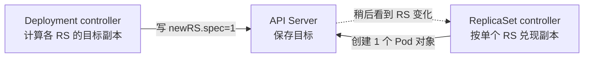
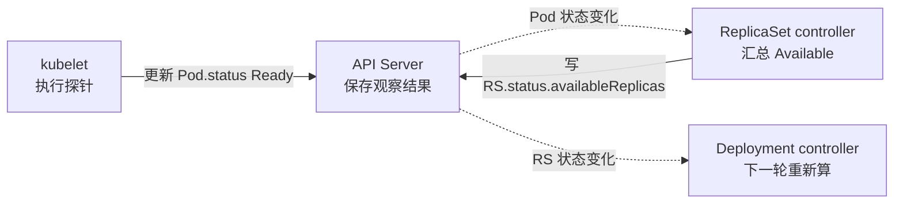
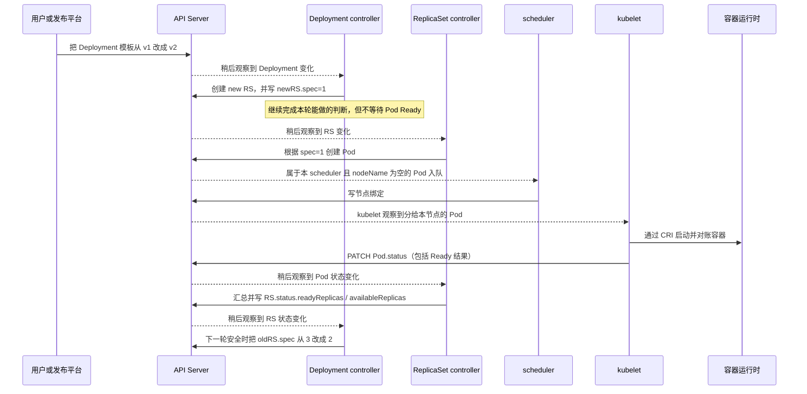
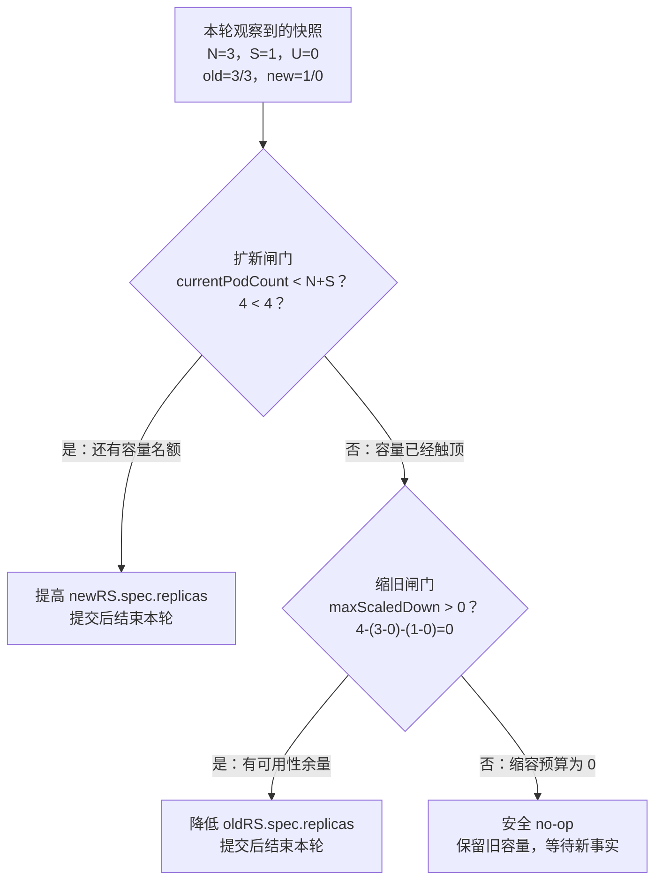
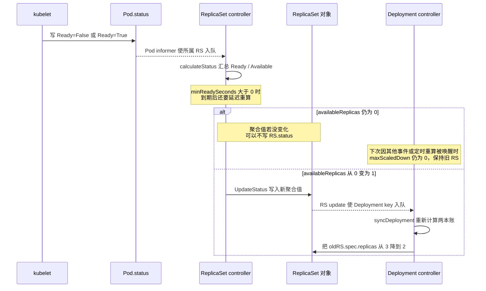
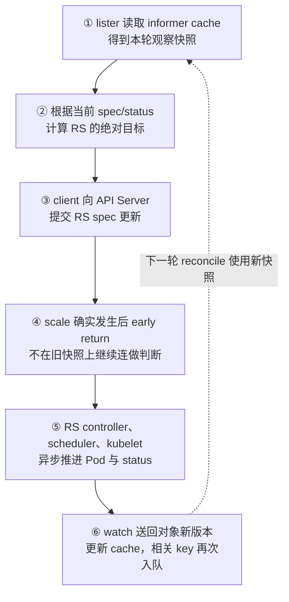

# 第 07 课：Java 应用滚动发布停在“3 个旧 Pod + 1 个新 Pod”——Deployment 到底在等什么

> 用一次常见的 Java 发布卡住现场，拆开看 Deployment controller 为什么既不继续加新 Pod，也不敢先删旧 Pod。

## 0. 先交代背景：这个问题是怎么出现的

假设你正在为游戏平台值班。`game` namespace 里的 Java/Spring Boot 服务 `game-api`，要从 `v1` 发布到 `v2`。

这就是一次普通的滚动发布，不是扩容，也不是节点维护。

先说明：这是整理出来的教学案例。服务名、数字、故障和输出都不是你们公司某个真实集群的原始记录。

这节课按下面的方式对待你的基础：

```text
你已经会用 Deployment、探针和 kubectl，这些不从头重讲。

但 controller 为什么这样算、Go 代码怎样读，
都按第一次学习来解释。
```

案例只保留两个会影响发布判断的事实：

- JVM 进程已经启动，不等于 Spring Boot 已经能正常接流量；
- Kubernetes rollout 完成，也不等于业务成功率和延迟已经通过验收。

Deployment controller 看不到 Git tag 的含义，也不知道数据库、缓存和注册中心是否正常。它只能读取 Kubernetes 对象里写下来的目标和状态。后面我们就是要看：这些状态怎样一步步影响它的决定。

Deployment 的关键配置是：

```yaml
spec:
  replicas: 3
  progressDeadlineSeconds: 600
  strategy:
    type: RollingUpdate
    rollingUpdate:
      maxSurge: 1
      maxUnavailable: 0
```

先只把这三个数读成人话：

```text
replicas=3
  = 最终希望保有 3 个业务副本

maxSurge=1
  = 发布过程中，RS 账面上最多临时多出 1 个副本

maxUnavailable=0
  = Deployment 自己不能主动把可用副本从 3 降到 2
```

`progressDeadlineSeconds=600` 只用于后面判断“发布多久没有进展算超时”，不参与这两道扩缩容计算。

注意：`maxUnavailable=0` 不是在保证集群永远不会坏。节点故障和进程崩溃仍然可能让副本不可用。它只限制 Deployment controller 自己不能再主动删掉健康旧副本。

发布系统把 `v2` 镜像写入 Deployment 的 Pod template 后，Deployment controller 创建并调整新 ReplicaSet，ReplicaSet controller 随后创建出一个 `v2` Pod。容器进程已经启动，所以 Pod 显示：

```text
phase=Running
Ready=False
```

此刻我们只知道一件事：容器进程起来了，但 Pod 还不能接正常流量。

为什么还不 Ready，暂时不知道。可能是 startup probe，可能是 readiness，也可能是应用初始化失败。先不猜根因。

几分钟后，现场一直停在：

| 对象 | `spec.replicas` | 实际 Pod | Ready | Available |
|---|---:|---:|---:|---:|
| 旧 ReplicaSet `game-api-v1` | 3 | 3 | 3 | 3 |
| 新 ReplicaSet `game-api-v2` | 1 | 1 | 0 | 0 |
| 合计 | 4 | 4 | 3 | 3 |

先把表里的四个词翻成人话：

```text
Running：容器进程已经启动，但应用不一定能接请求。
Ready：kubelet 当前认为这个 Pod 可以进入正常流量后端。
Available：Pod Ready 后又稳定了足够时间，RS 才把它计入发布可用量。
minReadySeconds：Ready 后还要稳定多少秒，才能成为 Available。
```

后面还会看到两个名字很像、但不是一回事的字段：`RS.status.availableReplicas` 是“可用副本有几个”；Deployment 的 `Available` Condition 是一张判断卡，回答“当前是否守住最低可用量”。

本例新 Pod 虽然 Running，但 Ready=False，所以它既不能正常接流量，也没有给 Deployment 增加 Available。

从平台值班视角看，这个画面很容易产生两个直觉：

```text
既然 v2 Pod 已经 Running，为什么不继续再建一个 v2？

既然最终只需要 3 个 Pod，现在已经有 4 个，
为什么不先删一个 v1，再让发布继续？
```

但 Deployment 两件事都没做：

```text
没有继续把新 RS 从 1 扩到 2
也没有把旧 RS 从 3 缩到 2
```

所以这节课只追一个问题：

> 现在明明有 4 个 Pod，Deployment 为什么宁愿等着，也不先删 1 个旧 Pod？

“等着”不等于 controller 挂了。它可能已经正常运行完一轮，只是算出的结果是：

```text
现在加新 Pod 不安全。
现在删旧 Pod 也不安全。
本轮先不改副本数。
```

### 0.1 为什么用这个现场作为源码入门

因为这个现场你很熟悉，但它刚好能带出 controller 最重要的几个问题：

- `spec` 与 `status` 为什么分开；
- controller 为什么反复对账，而不是保存一个“执行到第几步”的流程；
- Deployment 为什么通过 ReplicaSet 管理版本，而不直接操作 Pod；
- `Running`、`Ready`、`Available` 为什么不是同一个意思；
- 源码为什么会把“当前没有安全动作”表示成正常的 `false, nil`，而不是错误；
- 为什么 status 只能报告超时，通用 controller 却不能擅自替业务回滚。

这里的 `Condition` 可以先理解成 `status` 里的一张“判断卡”：记录在判断什么、结果是真是假、原因是什么、什么时候更新。后面看到 `Available`、`Progressing`，就是在看不同主题的判断卡。

这不是重新教你使用 Deployment。本课要练的是：

```text
先根据现场猜 controller 为什么不动，
再去源码里找到它真正判断的字段和分支。
```

### 0.2 先别急着替 controller 选动作

此时有三个看似可能的动作：

1. 再创建一个新 Pod，加快发布；
2. 删除一个旧 Pod，给新版本让位置；
3. 暂时什么都不改，等待状态变化。

先用值班时的说法讨论“加 Pod、删 Pod”。进入源码后再说准确：

```text
Deployment controller 改 RS.spec.replicas
ReplicaSet controller 才真正创建或删除 Pod
```

先不看后面的公式和源码，请把你的判断写成三句话：

```text
我认为能 / 不能继续扩新，因为 ______。
我认为能 / 不能先删旧 Pod，因为 ______。
我认为 Running 能 / 不能代表可替换旧容量，因为 ______。
```

如果你的理由只是“现在有 4 个 Pod，删 1 个还剩 3 个”，先保留这个判断。后面我们会验证：**对象数量是不是等于服务能力。**

也先记住三个尚未回答的问题：

- 为什么 Kubernetes 把发布做成反复对账，而不是一段按顺序执行的脚本？
- 为什么 Deployment 不直接管理 Pod，而要经过 ReplicaSet？
- 为什么源码会返回 `false, nil`，也不替用户“想办法把发布做完”？

### 0.3 先记住 controller 每轮只做四件事

先不管专业词，你先记住下面四步：

```text
第 1 步：看 Deployment 最终想要几个副本。
第 2 步：看新旧 RS 现在各有几个、可用几个。
第 3 步：算一下现在能不能安全地扩新或缩旧。
第 4 步：按固定顺序尝试安全动作；不能安全修改就先不动，等状态变化后再算。
```

这四步不断重复，专业名称叫 `reconcile`，中文常译成“对账”或“调谐”。

```text
reconcile：重新看目标、重新看现状、重新算下一步。

不变量：controller 无论执行到哪一轮都不能主动破坏的底线。
本例的底线就是：不能为了发 v2，主动把可用副本降到 3 以下。

no-op：代码正常执行完了，但这一轮没有修改副本数。
它表示“现在保持原样”，不是“函数失败”。
```

这里真正必须一直守住的是发布预算，不是“一轮永远只能写一次”。
对已有 RS 的 scale 路径，实际发生修改后通常会返回；首次创建 new RS
时，初始副本数可以随 Create 一起提交，这是后面单独解释的例外。

从本课开始，图表不再让你自己猜阅读方向：

- **因果权衡表**：先横向读完一行，再向下换到另一组独立问题；
- **状态变化图**：按图下注明的方向沿箭头读，箭头上的文字表示“什么事实或动作使状态发生变化”；
- **判断分支图**：从入口走到菱形判断，再沿“是/否”分支继续；
- **时序图**：时间从上往下，横向各列表示不同组件；横向排列不是执行顺序；
- 图中出现 `3/1` 这类写法时，会在图前说明它究竟表示 `spec/available`，还是其他变量。

每张机制图下面还会再用大白话说明：图想证明什么、对应哪段源码、哪些箭头只是异步事件传播而不是同步函数调用。

本章按下面的顺序讲：

```text
先看 Java 发布现场
  → 追问 Deployment 为什么要这样设计
  → 建立 Kubernetes 控制器模型
  → 在白板上推演合法动作
  → 按当前仓库的真实调用链阅读源码
  → 最后再用 kubectl 和应用证据验证根因
```

本章较长，明确分两遍。**第一遍不要顺着三千多行从头硬读到底**：

```text
0～2：看事故背景、设计原因和三层职责
4～5：手算“两本账”，先得到不动的答案
7.2、7.4：先读最简单的扩新公式和正常 no-op
8.1～8.4：再读缩旧公式与两道安全保护
9～10：看 Ready 怎样变成 RS Available，再反馈给 Deployment
13.1、13.3：只拿到“超时是报告，不是自动回滚”的边界
14、17：把源码变量带回 Java 生产现场
21：只做标成“首遍”的题
```

第 3 节首遍只看 3.1 和 3.4 的结论；第 6 节只把函数地图当导航。第二遍再回看 7.1 的总编排、11.1～11.3 的多轮对账、13.2 的 Condition 源码，以及第 19 节的队列、错误重试、定时重算。首次创建等更细的例外也都放在第二遍。

遇到 Go 阅读障碍时查第 18 节；值班需要命令时查第 20 节。第一遍的目标不是背函数名，而是能自己算出：为什么扩新和缩旧都应当 no-op。

---

## 1. Deployment 当初要解决的，不只是“换镜像”

### 1.1 如果用一段命令式脚本发布，会遇到什么

先假设没有 Deployment controller，我们自己写发布程序：

```text
1. 创建 1 个 v2 Pod
2. 等 v2 Ready
3. 删除 1 个 v1 Pod
4. 重复三次
```

如果每一步都成功、网络永远不超时，这段脚本能工作。问题是生产环境不会这么听话。

考虑这些情况：

- 第一步请求已经被 API Server 接受，但客户端没有收到成功响应；
- 发布程序在第二步和第三步之间崩溃并重启；
- 新 Pod 已创建，但 scheduler、kubelet、镜像仓库或网络插件的反馈还没回来；
- 一个旧 Pod 恰好同时因为节点故障变成不可用；
- `v2` 还没发完，用户已经把目标改成 `v3`；
- 两个相同的对象变化通知被重复投递，或者多个变化合并成一次唤醒。

脚本最难回答的是：

```text
我刚才那一步到底成功没有？
如果成功了但响应丢了，我再执行一次会不会多建或多删一个 Pod？
如果我重启了，应该从哪一步继续？
```

即使把“执行到第几步”保存下来，也不够。因为你保存步骤之后，节点、Pod 或用户的新目标都可能已经变化。

所以 Deployment controller 不靠记住一张固定步骤表来完成发布。它每次醒来都重新看当前现场。

### 1.2 Kubernetes 保存的是目标，不是待执行命令

Kubernetes API 对象的核心分工是：

```text
spec   = 用户希望系统最终变成什么样
status = 控制器目前观察到系统是什么样
```

例如：

```text
Deployment.spec.template.image = game-api:v2
```

这不是一条“只执行一次的换镜像命令”。它更像写在白板上的最终目标。controller 每次醒来都重新看这块白板，再看现场，然后重新计算。

先看例子，再记术语：

这对发布中途改版本尤其重要：

```text
起点：v1 有 10 个副本
第一次目标：v2
发布中途：v1=5，v2=5
用户把最新目标改成：v3
```

controller 看到最新目标已经是 `v3`，就不必先把 `v2` 完整发到 10。它直接朝 `v3` 继续算，并把 `v1`、`v2` 都当作需要逐步退出的旧版本。

这种“以当前最新目标为准，不要求重放每个历史动作”的方式，官方 API 语义叫 **level-based**。

### 1.3 “无状态 controller”到底是什么意思

2015 年最初的 Deployment 设计提案明确写过：Deployment controller 应当能够在发布过程中崩溃后恢复，因此发布进度不能只依赖 controller 进程内存。

这里的“无状态”不是说 controller 进程里什么都不保存。它当然会保留本地对象副本、待办队列和重试次数；这些实现词后面再解释。

这里真正想说的是：

```text
发布走到哪里，不只存在 controller 内存里。
Deployment、RS 和 Pod 对象本身已经留下了现场。
controller 重启后，重新读取这些对象，就能接着算。
```

所以 controller 重启后不需要恢复一份唯一的“发布步骤号”。

### 1.4 这个设计解决了什么，又付出了什么代价

**这张表先从左往右读，读完一行再往下。** 每一行都是一组完整的设计权衡：

```text
现实约束 → Kubernetes 的选择 → 得到的能力 → 同时付出的代价

向下换行 = 换到另一组现实问题
           不是继续执行上一行的下一步
```

| 现实约束 | Kubernetes 的选择 | 得到的能力 | 代价 |
|---|---|---|---|
| 进程和网络都会失败 | 把目标与状态放进 API 对象 | controller 重启后可重新计算 | 一个对象改完，其他组件不会立刻同时看到 |
| 对象变化通知可能重复、合并 | 每次重新看当前状态（level-based） | 不必按顺序重放所有通知 | 重复执行也不能把副本越加越多（幂等） |
| 多个职责的反馈速度不同 | 分控制循环，并把交接状态写入 API 对象 | 某一步失败或进程重启后，可以按当前对象恢复，不必保住一条长调用栈 | 链路和排障更长；同进程退出时多个循环仍会一起暂停 |
| 发布中途目标可能变化 | 始终读取最新 `spec` | 可以中途直接转向新版本（rollover，也就是发布中途再次换目标） | 中间版本不保证完整发布 |
| 可用性比发布速度更重要 | 在策略里写清“最多多建几个、最多少用几个” | 新版本异常时先保留旧容量 | 资源不足或新版本异常时，发布会等住 |

这张表很重要。后面看到的待办队列、early return（提前结束本轮）、`maxSurge` 公式和 `return false, nil`，都不是孤立代码技巧，而是在实现这些设计选择。

---

## 2. 为什么是 Deployment → ReplicaSet → Pod 三层，而不是一个大控制器

### 2.1 三层各自只管什么

一句话先说：

```text
Deployment 管版本怎么换。
ReplicaSet 管一个版本要几个 Pod。
kubelet 管一个 Pod 在节点上怎么跑。
```

再看准确一点：

```text
Deployment controller
  关心：新旧版本之间应该怎样迁移
  动作：创建或调整 ReplicaSet

ReplicaSet controller
  关心：某一个固定 Pod 模板应该保持多少副本
  动作：创建或删除 Pod

kubelet
  关心：分配到本节点的 Pod 怎样真正运行并上报状态
  动作：调用容器运行时、执行探针、写 Pod.status
```

源码里最容易混淆的一点是：

> Deployment controller 不直接为了扩缩容去创建、删除业务 Pod。它修改 ReplicaSet 的 `spec.replicas`；ReplicaSet controller 再比较当前看到的活动 Pod 数量和 `spec.replicas`：Pod 少了就创建，多了就删除。

`RS.status.replicas` 是 ReplicaSet controller 随后汇总并写回的观察结果，不是这次创建、删除 Pod 时用来做差的输入。

### 2.2 ReplicaSet 为什么像一张“版本快照”

一次 rollout 期间，Deployment controller 必须回答两个问题：

1. 哪些 Pod 属于旧模板，哪些属于新模板？
2. 每个版本当前应该保留多少副本？

这两个判断都由 **Deployment controller** 完成，不是 API Server 在算，也不是 Deployment 对象自己在运行代码：

- Deployment controller 读取 Deployment 的最新模板和发布策略，找出哪个 RS 是新版本、哪些是旧版本，再计算这一轮每个 RS 的目标副本数；
- API Server 只像共享账本一样保存 Deployment、RS、Pod 的目标和状态，不替 Deployment 计算新旧版本各留几个；
- ReplicaSet controller 只根据某一个 RS 的 `spec.replicas` 创建或删除 Pod，不决定 v1、v2 之间怎样分配副本。

还要分清 RS 上的两种数：

```text
RS.spec.replicas
  = 这个版本希望保持几个 Pod，是目标数

RS.status.replicas
  = RS controller 随后观察和汇总到几个 Pod，是结果数
```

所以“旧 RS 缩到 0”只表示 `oldRS.spec.replicas=0`，也就是旧版本现在不再希望保留 Pod；它不等于旧 RS 对象立刻被删除。`revisionHistoryLimit` 限制的是“最多保留多少个旧 RS 历史对象”，不是“保留多少个旧 Pod”。超过这个数量后，controller 才按清理条件删除多余的旧 RS 对象。

Deployment 根据 Pod template 计算 `pod-template-hash`。它可以先理解成“Pod 模板的指纹”：模板内容不同，指纹通常不同，Deployment 就能据此区分哪个 RS 对应哪个版本。于是 rollout 不再是“把一批 Pod 原地改成另一个版本”，而是：

```text
旧 RS（v1 模板）逐步缩小
新 RS（v2 模板）逐步扩大
```

一个 RS 只维护一个模板的副本数，Deployment 则编排多个 RS 之间的份额变化。这是分层之后最直接的收益。

旧 RS 缩到 0 后通常不会立刻全部删除。当前源码的注释直接给出两个原因：保留历史，以及提供回滚能力；清理数量由 `revisionHistoryLimit` 约束。

### 2.3 先承认：拆开后，每一块简单了，整体协作却更复杂

你的担心是对的。不能因为 Kubernetes 选择了分层，就只讲它的好处。

**这张表逐行从左往右读，每一行只比较同一个问题。**

| 看哪里 | 变简单的部分 | 变复杂的部分 |
|---|---|---|
| 单个 controller | 只需要理解自己负责的判断 | 必须相信下层以后会把结果写回来 |
| 故障恢复 | 重启后可以重新读取对象，不必恢复一条旧调用栈 | 必须处理重复通知、本地对象副本还没更新和中间状态 |
| 状态传递 | 每一步都有 Deployment、RS 或 Pod 可以观察 | 状态不会瞬间传完，排障链更长 |
| 整个架构 | 版本编排、副本维护、节点执行分开处理 | 组件更多，并共同依赖 API Server 这本总账 |

所以准确说法是：

> Kubernetes 没有消灭复杂度，而是把“大程序内部缠在一起的复杂度”，换成了“多个组件通过 API 对象接力的复杂度”。

从当前实现产生的效果看，它更看重“中途停下后还能恢复”，而不是让一次调用看起来最短。这是根据源码和官方控制器模型做出的设计解读，不冒充作者当年的原话。

### 2.4 它为什么不是一条同步调用链，崩溃后又怎样继续

前面画出的 `Deployment → RS → Pod` 是对象管理关系。真正推动发布的是多轮状态接力，不是一条从 Deployment 一直阻塞到 kubelet 的函数调用链。

先分清：

```text
同步调用链：A 调 B 后原地等待，B 再调 C 并继续等待。

Kubernetes 状态接力：A 把目标写进 API 对象后结束本轮；
                    B 稍后观察到变化，再做自己那一步。
```

首遍先看两张短图，不要一上来同时记七个角色。

**第一张图从左往右读，只回答“谁决定副本数，谁创建 Pod”。虚线表示后一个 controller 稍后看到对象变化，不是前一个函数在原地等它。**



**第二张图也从左往右读，只回答“新 Pod 的 Ready 怎样反馈回来”。**



两张图合起来就是：前半程把目标往下传，后半程把观察结果往上汇总。中间任何一步慢了，Deployment 都只能等下一轮再算。

<details>
<summary><strong>第二遍再展开：完整七角色时序图</strong></summary>

下面的完整七角色图把 scheduler、kubelet 和容器运行时也接进来。图中几个词先翻成人话：

- `nodeName`：Pod 要运行在哪个节点；它为空时，通常表示还没有完成节点选择；
- `CRI`：kubelet 调用容器运行时的标准接口，可以理解成二者约定好的“插座”；
- `PATCH Pod.status`：只更新 Pod 状态里的部分字段，不是在直接调用 Deployment controller。

下面继续使用本章数字：

```text
old=3/3、new=1/0
斜杠前是 RS.spec.replicas，斜杠后是 RS.status.availableReplicas。
```

**这张图时间从上往下；横向各列只是不同角色。指向 API Server 的实线箭头表示一次 API 读写，这个单独请求可能等待 API Server 返回；从 API Server 发出的虚线箭头表示后面的组件稍后观察到对象变化。只有 kubelet 到容器运行时那一根箭头是节点本地调用。整张图没有一条从 Deployment 持续等待到 Pod Ready 的调用栈。**



</details>

controller 也不一定每次都直接读取 API Server。可以先这样理解：

```text
API Server：总账
informer cache：controller 手边的总账复印件
watch：总账变化后，异步把新页送过来
```

所以写成功后，不能假设手边的复印件在下一行代码里已经更新。controller 要等新状态回来，再重新计算。

本课固定提交还能确认一个很重要的事实：Deployment controller 和 RS controller 通常同处一个 `kube-controller-manager` 进程，只是两套不同的控制循环，并不是两个微服务。

如果整个 `kube-controller-manager` 退出，两套循环都会暂停。但下面这些内容仍保存在 API Server：

```text
Deployment 的 v2 目标
oldRS.spec=3
newRS.spec=1
已经存在的 Pod 和 status
```

进程重启或新的 leader 接管后，可以重新读取这些对象，从当前状态继续计算。这里的 `leader` 是多个 `kube-controller-manager` 副本中，当前真正负责执行控制循环的那个负责人；原负责人退出后，另一个副本可以接手。它不需要恢复一条已经消失的 Go 调用栈，也不需要记住“上次执行到第几行”。

源码还会反复计算“应该等于多少”，而不是盲目执行“再加一个”。这使重复通知和重试不容易把副本越加越多。至于“怎样避免状态反馈慢时重复创建”和“怎样记录 Pod 归哪个 RS 管”，放到第 19 节第二遍阅读。

### 2.5 什么情况值得拆，什么情况说明拆过头

Kubernetes 源码里没有“达到多少分就拆成 controller”的通用公式。第一次可以只问四个问题：

1. **有没有一份独立、持久、可观察的交接物？** 本例有 RS 和 Pod；如果只有函数里的临时变量，就不适合硬拆成异步组件。
2. **下一步晚几秒执行是否仍然正确？** rollout 可以等待下一轮；如果几步必须同时成功，就更适合放在一起。
3. **双方各自负责什么，能不能一句话说清？** Deployment 决定版本份额，RS 维护某一个版本的 Pod 数量。
4. **独立恢复或扩容的收益，是否大于状态传播和排障成本？** 如果永远一起改、一起发、同步互等，通常没有继续拆的价值。

因此，Kubernetes 也没有把每个 helper 函数都做成 controller：

```text
普通计算只拆成函数；
需要长期维护一份状态时，才可能拆成控制循环；
必须在不同运行位置工作时，才进一步拆成独立进程或节点组件。
```

可以记成一句话：

> 有独立状态、独立规则和独立重试价值，才值得拆；只是为了让代码仓库小一点，不值得拆成独立服务。

### 2.6 和公司 Java 微服务很像，但不能直接照搬

相同点是：两者都希望责任更清楚，也希望某部分可以独立修改和恢复。

**这张表逐行从左往右读，每一行只比较同一个问题。**

| Kubernetes controller 链 | 常见 Java 微服务请求链 |
|---|---|
| 后台不断对账，写完目标后可以结束本轮 | 用户正在等待这一次请求返回 |
| 主要靠 API 对象和后续 watch 接力 | 经常是 A 同步调用 B，再等待 C |
| 很多步骤允许几秒后继续 | 在线请求通常要求几十或几百毫秒内完成 |
| 失败后按当前 `spec/status` 重算 | 调用失败后，要决定重试、返回失败，还是撤销前面已经做过的动作 |

如果你们公司的请求经常变成：

```text
网关 → A → B → C → D → 数据库
```

并且出现下面情况，就可能拆得太细：

- 一个需求总要同时修改很多服务；
- 这些服务总是一起发布、一起扩容；
- 它们仍然直接读写同一批表；
- 某个小服务一超时，整条请求立即失败；
- 没人能说清每个服务独立拥有的业务状态。

这类系统虽然部署分开了，变化和故障却仍绑在一起，常被称为“分布式单体”。

还要避免一个错误类比：Kubernetes 用 API Server 保存控制面状态，不等于业务微服务也应该随意共享数据库表。Kubernetes API 另外定义了对象版本、watch、`spec/status` 和写冲突等协作规则；普通共享数据库不会自动提供这些边界。

本节最终只需要记住：

> 链路变长确实是代价。Kubernetes 接受这个代价，是为了让每一步都有持久记录，进程恢复后能够重新计算；但这种理由不能自动证明任何微服务拆分都是合理的。

下一节继续看：对象变化怎样只负责叫醒 controller，而不是携带“下一步必须执行什么”的命令。更完整的 Ready 反馈链在第 10 节，多轮 reconcile 在第 11 节，对象回调和队列源码在第 19.8 节。

---

## 3. 先分清两种“事件”：真正叫醒 controller 的不是 `kubectl get events` 那张表

> **第一遍只抓一句：对象变化通知只负责叫醒，真正动作要等 controller 重新读取当前对象后再算。** 本地对象副本、待办队列和回调接线细节放到第二遍。

运维时说“Event”，很容易把两件不同的东西混在一起。

```text
对象变化通知
  = API 对象发生变化后，watch/informer 触发 controller 内部回调
  = 主要作用是把对象 key 放进待办队列

Kubernetes Event 对象
  = kubectl get events 能看到的排障记录
  = 主要给人看，不是 rollout 的下一步命令
```

所以：

> 没有看到一条 Kubernetes Event 记录，不等于 controller 没有被叫醒，也不等于它没有执行 reconcile。

### 3.1 对象变化通知只说“重新看看”，不说“删一个旧 Pod”

第一次读 controller，很容易把流程想成：

```text
收到“Pod Ready”的对象变化通知
  → 固定执行“删除一个旧 Pod”
```

真实过程更接近：

```text
某个相关 API 对象发生变化
  → informer（变化接收器）触发回调，并更新本地对象副本
  → workqueue（待办队列）记下 game/game-api
  → worker（后台取任务的循环）取出这个 key
  → syncDeployment 重新读取当前 Deployment 和 RS
  → 用最新对象重新计算现在能不能扩新、缩旧
```

先把三个词翻成人话：

- `informer`：持续接收对象变化，并在 controller 本机维护一份可查询的对象副本；
- `workqueue`：controller 的待办队列；
- `worker`：不断从待办队列取出一个 key、执行一次对账的后台循环；
- `key`：对象索引，本例是 `game/game-api`，不是“把新 RS 加一”的命令。

因此，通知只负责叫醒。真正决定动作的是 controller 醒来后看到的当前对象状态。

### 3.2 Pod Ready 怎样间接叫醒 Deployment

当前固定提交中，Deployment controller 会监听 Deployment 和
ReplicaSet 的新增、更新、删除。它对 Pod 注册的回调函数（handler）只有删除，
主要服务于 Recreate 策略。

这意味着 RollingUpdate 的 Ready 反馈通常不是：

```text
Pod Ready update
  → 直接调用 Deployment controller
```

而是：

```text
Pod.status Ready 变化
  → ReplicaSet controller 重新汇总 RS.status
  → RS.status 的 Ready/Available 聚合值发生变化
  → ReplicaSet update 让所属 Deployment key 入队
  → Deployment controller 重新计算
```

第 10 节会把这条链画完整。这里先记住：Deployment controller
主要消费 RS 的汇总结果，不是直接读取每一次 readiness 探测结果。

### 3.3 为什么队列里只需要保存 key

队列保存：

```text
game/game-api
```

而不保存：

```text
请把新 RS 从 1 加到 2
```

原因很实际。这个 key 在队列里等待时，集群可能已经又变化了。
一条预先写死的动作可能已经过期；重新读取对象再算，才有机会使用
较新的事实。

假设短时间内连续发生：

```text
新 Pod 创建
  → 新 Pod Running
  → 新 Pod Ready
```

controller 不必把它们当作三张必须按顺序执行的发布工单。
它醒来时只要看到当前 `newRS.status.availableReplicas=1`，就可以用
这个最新事实重新算缩旧预算。

这种“关心当前值，不要求重放每个历史事件”的方式，叫
`level-based`。

### 3.4 幂等：同一个 key 重算两次，不能错误地多加一个 Pod

假设 controller 计算出的绝对目标是：

```text
newRS.spec.replicas 应该等于 1
```

它不是在下达：

```text
newRS.spec.replicas 无条件加 1
```

两者在网络异常时差别很大：

```text
API Server 已经把 replicas=1 写入
  → 返回响应时网络断了
  → controller 不知道上次请求是否成功
  → 同一个 key 再次处理
```

如果重试的是“再加 1”，目标可能错误地变成 2。
如果重新看现场后仍写“目标等于 1”，重复一次结果仍是 1。

这种“同一个目标重复处理，不能把结果越改越错”的要求叫
**幂等**。

本节首遍只记住：

```text
对象变化通知：负责叫醒
key：告诉 worker 重新看哪个对象
reconcile：重新读取并计算绝对目标
幂等：重复计算不能无条件重复加副本
```

对象变化回调和本地读取的 Go 源码在附录 19.8，`scaleReplicaSet` 在
19.9；确定性 RS 名称在 19.6。都留到第二遍再读。

---

## 4. 先别看源码：RollingUpdate 其实只是在算两道限制

controller 每轮先回答两个很朴素的问题：

```text
问题 1：现在还能不能再加一个新副本？
问题 2：现在能不能先减一个旧副本？
```

回答第一个问题看“容量上限”，回答第二个问题看“可用性下限”。

### 4.1 第一道限制：发布期间最多允许几个账面副本

```text
所有新旧 RS 的期望副本总数
    <= desired replicas + maxSurge
```

本例：

```text
desired = 3
maxSurge = 1
容量上限 = 4
```

本例最多是 4。现在如果已经有：

```text
旧 RS.spec.replicas = 3
新 RS.spec.replicas = 1
合计 = 4
```

那么新增名额已经用完，不能再把新 RS 调到 2。

注意，这里算的是 RS 的 `spec.replicas`，也就是 controller 写下的目标数，不是节点上此刻还活着多少个物理进程。

### 4.2 第二道限制：至少要保住几个 Available 副本

```text
所有新旧 RS 的 Available 副本总数
    >= desired replicas - maxUnavailable
```

本例：

```text
desired = 3
maxUnavailable = 0
可用性下限 = 3
```

本例至少要保住 3 个 Available。

再强调一次：这是对 Deployment controller 的限制。节点故障仍然可能让 Available 低于 3。controller 不能凭空造出健康 Pod，它只能保证自己不要继续主动删掉健康旧副本。

把两本账放在一起：

```text
容量上限：总期望副本不能超过 4
可用下限：Available 不能低于 3
```

现在的新 Pod 很特殊：

```text
它让 RS spec 总数从 3 变成 4：占了一个新增名额。
但它的 Available 还是 0：还不能顶替一个健康旧 Pod。
```

所以两个方向都被堵住：

```text
再扩新：总 spec 会从 4 变 5，超过上限。
先缩旧：总 Available 会从 3 变 2，低于下限。
```

把这次 reconcile 画成源码判断分支，会更直观。图里的字母和斜杠先读成：

```text
N = desired replicas = 3
S = maxSurge = 1
U = maxUnavailable = 0
old=3/3、new=1/0 都按 spec/available 读取
```

**这张图从上往下读，菱形是 controller 必须回答的判断题：**



这张图只想说明：

```text
扩新被容量上限挡住。
缩旧被可用性下限挡住。
所以本轮正常结束，但不改副本数。
```

等到第 7、8 节再把三个框分别对应到源码函数。

### 4.3 `maxSurge` 和 `maxUnavailable` 不是两个简单的“速度旋钮”

先按人话理解这两个参数：

| 参数 | 允许承担的代价 | 设大之后 |
|---|---|---|
| `maxSurge` | 临时多占资源 | 可以更早并行启动新副本，但需要额外 CPU、内存、IP 或 GPU |
| `maxUnavailable` | 临时少一些可用副本 | 可以先释放旧资源，但服务冗余和容错空间下降 |

所以不同工作负载的合理设置不同：

- 普通 Java 无状态服务有余量时，常用 surge 换取平滑发布；
- 资源非常紧张时，可能必须允许先下一个旧副本；
- 单副本服务若 `maxSurge=0` 且不能不可用，就没有可执行的迁移路径；
- GPU 服务的每一个 surge Pod 可能意味着额外占一张昂贵 GPU，策略必须和资源池容量一起设计。

### 4.4 第二遍再看：百分比为什么一个向上取整，一个向下取整

第一次阅读只记结论即可：

当前实现解析百分比时：

- `maxSurge` 向上取整，避免小副本场景永远得不到可用的 surge 名额；
- `maxUnavailable` 向下取整，避免取整后比用户声明允许更多不可用。

源码还处理了一个边界：如果两者经取整都成为 0，会把 `maxUnavailable` 调整为 1。注释给出的工程理由是 surge 可能因 quota 等原因无法实现，否则 rollout 没有任何可移动空间。

为什么还要处理“两者都取整成 0”的特殊情况，属于边界实现。它不影响本例 `maxSurge=1、maxUnavailable=0` 的主线。

---

## 5. 先不看 Go：在白板上手推三轮 reconcile

现在把 controller 暂时当成一个会算账的人。

### 第 0 轮：发布刚开始

```text
旧 RS：spec=3，available=3
新 RS：不存在
```

controller 观察到 Deployment 的 Pod template 已变化，于是为新模板建立新 RS。

新 RS 最多能先拿到多少副本？

```text
容量上限       = desired + maxSurge = 3 + 1 = 4
当前 RS 总副本 = 3
剩余容量       = 4 - 3 = 1
```

所以新 RS 初始目标只能是 1。

### 第 1 轮：新 RS 已经是 1，但 Pod 还不可用

一段时间后，controller 观察到：

```text
旧 RS：spec=3，available=3
新 RS：spec=1，available=0
RS spec 总数：4
```

扩新检查：

```text
当前总数 4 == 容量上限 4
=> 不能继续扩
```

缩旧检查：

```text
最低可用数 = 3
当前可用数 = 3
删 1 个健康旧副本后只剩 2
=> 不能缩
```

因此本轮合法动作仍然是 no-op。

### 第 2 轮 A：如果新 Pod 终于 Available

假设探针通过，并满足 `minReadySeconds`：

```text
旧 RS：spec=3，available=3
新 RS：spec=1，available=1
总 available=4
```

这时删除一个健康旧副本后仍有 3 个 Available，不会跌破下限：

```text
4 - 1 = 3
```

于是 controller 可以把旧 RS 的目标从 3 改成 2。

等下一轮看到 `oldRS.spec.replicas=2` 后，RS 的目标总数变成 3，才空出一个新名额。然后新 RS 才能从 1 增加到 2。

注意：**账面名额空出来，不等于旧 Pod 的 CPU、内存已经立刻释放。** 旧 Pod 还在 Terminating 时，新 Pod 仍可能因为资源没释放而 Pending。

典型过程是：

```text
扩新 1 → 等新副本可用 → 缩旧 1
      → 再观察 → 再扩新 1 → 再等待 → 再缩旧 1
```

下面把数字真正画出来。**这张状态变化图从左往右读；每个方框是一轮反馈稳定后 controller 能观察到的快照，记法都是 `spec/available`：**


实线箭头分别表示 controller 写 RS 的绝对目标，或 Pod/RS 状态反馈已经回来；最后一条虚线省略了相同的重复轮次。最关键的变化是：`new 1/0 → new 1/1` 发生之前，新 Pod 只占用了 surge 名额，还不能换走一个健康旧副本。

注意，这是本例参数产生的节奏，不是所有 RollingUpdate 都固定“先扩新再缩旧”。如果 `maxSurge=0`、`maxUnavailable=1`，新副本一开始无法增加，但旧副本可以在不可用预算内先缩一个，之后新副本再补上。

### 第 2 轮 B：如果旧版本自己坏了一个

假设新 Pod 已经 Available，但旧 RS 自己坏了一个：

```text
oldRS.spec.replicas = 3
oldRS.status.availableReplicas = 2

newRS.spec.replicas = 1
newRS.status.availableReplicas = 1
```

此时：

```text
maxScaledDown = 4 - 3 - (1 - 1) = 1
```

这个坏掉的旧副本本来就没有贡献 Available。因此把旧 RS 的目标从 3 减到 2，不会让可用副本再少一个。

Deployment controller 只负责把旧 RS 的目标数调小。具体删除哪个 Pod，仍由 ReplicaSet controller 按删除优先级决定。

如果新 RS 仍是 `spec=1, available=0`，则：

```text
maxScaledDown = 4 - 3 - (1 - 0) = 0
```

源码会在进入不健康副本清理前直接返回。也就是说，清理旧不健康副本不是无条件动作，它仍受第一道 `maxScaledDown` 总预算约束。

所以规则不是“永远不删旧 Pod”，而是：

> **不能执行会让可用性进一步跌破预算的删除；删除本来就不可用的旧副本，不会增加新的不可用。**

到这里，你只要能预测源码里会有下面三种判断，就可以继续：

1. 计算新旧 RS 总数是否触顶；
2. 计算最低 Available 和新版本不可用数；
3. 区分不健康旧副本与健康旧副本。

下面进入源码，只做一件事：验证我们刚才的手算有没有猜对。

---

## 6. 源码地图：主线只抓五个落点

### 6.1 本课源码基线

本地 Kubernetes 源码目录：

```text
kubernetes/
```

本课核对的提交：

```text
301946d15e67a4a2e8a5fb8292eb836acd366d78
v1.37.0-alpha.0-280-g301946d15e6
```

行号会随版本变化，因此学习时以“文件 + 函数名”为主，行号只用于当前快照定位。

本机 Go 是 `go1.19.4`，而当前源码 `go.mod` 要求 Go 1.26，所以本课做静态阅读与逻辑核对，不把“本机无法直接跑全量测试”伪装成已经验证通过。

### 6.2 主调用链

第一次只看下面五个函数名。先看右边的人话，不用背名字：

```text
syncDeployment                 读取这次要处理的 Deployment
  └─ rolloutRolling            进入滚动发布计算
       ├─ reconcileNewReplicaSet   先问能不能扩新
       │    └─ NewRSNewReplicas    算新 RS 应该调到多少
       └─ reconcileOldReplicaSets  再问能不能缩旧
```

对应文件：

```text
pkg/controller/deployment/deployment_controller.go
  syncDeployment

pkg/controller/deployment/rolling.go
  rolloutRolling
  reconcileNewReplicaSet
  reconcileOldReplicaSets

pkg/controller/deployment/util/deployment_util.go
  NewRSNewReplicas
```

另一条链回答“新 Pod 什么时候才算可用”，第 9、10 节再看：

```text
Pod Ready
  → ReplicaSet calculateStatus
  → RS.status.availableReplicas
  → Deployment calculateStatus / rollout decision
```

### 6.3 读源码的固定方法

不要从文件第一行一直往下硬啃。每段源码都按这个顺序读：

```text
这段只回答哪个问题？
  → 先用本例数字猜答案
  → 再看 Go 里的 if 和 return
  → 最后回到 3 个旧 Pod + 1 个新 Pod
```

函数名记不住没关系。能说清“它看了哪些数、为什么没改副本”才算读懂。

后面看到 `helper` 时，把它理解成“被主函数调用、只负责一个小计算或小判断的辅助函数”。它不是新的 controller，也不是另一个服务。

---

## 7. 源码第一问：新 RS 为什么只扩到 1

> **Go 新手第一遍：先跳到 7.2 看扩新公式，再读 8.2 的缩旧公式；7.1 留到第二遍回看。** 7.1 只是把两个公式串起来；如果先读它，容易同时被 receiver、slice、多返回值和多个辅助函数挡住。

### 7.1 `rolloutRolling` 先尝试找到一个安全动作

文件：

```text
pkg/controller/deployment/rolling.go
```

【第二遍回看主干】等你先读懂 7.2 和 8.2 的两个公式后，再看这段。它只回答：RollingUpdate 一轮对账时，怎样把“先试扩新、再试缩旧、最后重算 status”串起来？

下面是教学注释版主干。它省略了 rollout 完成后的 `cleanupDeployment` 等收尾分支，只保留本课讨论的扩新、缩旧和 status 重算入口；因此不要把它当作完整函数复制使用。

```go
// 定义 DeploymentController 的 rolloutRolling 方法。
func (dc *DeploymentController) rolloutRolling(
	ctx context.Context,        // 本轮调用上下文，可传递取消、超时和日志信息。
	d *apps.Deployment,         // 当前要对账的 Deployment 指针。
	rsList []*apps.ReplicaSet, // 当前观察到的 ReplicaSet 指针列表。
) error { // 这个方法只向调用方返回“有没有 error”。
	// 找出与最新 Pod 模板匹配的 newRS，以及其余 oldRSs；true 表示不存在时允许创建 newRS。
	newRS, oldRSs, err := dc.getAllReplicaSetsAndSyncRevision(ctx, d, rsList, true)
	// 如果查找、同步 revision 或创建 newRS 失败，立即把错误交给上层处理。
	// 这里只把 error 交给外层；错误怎样重试留到附录 19.3。
	if err != nil {
		return err
	}
	// 把 oldRSs 和 newRS 放到同一个 slice，后面计算总副本时一起统计。
	allRSs := append(oldRSs, newRS)

	// 先问：在 maxSurge 容量预算内，newRS 的期望副本能不能增加？
	scaledUp, err := dc.reconcileNewReplicaSet(ctx, allRSs, newRS, d)
	// 扩新计算或 API Update 失败时，把错误返回。
	if err != nil {
		return err
	}
	// scaledUp=true 只表示已有 RS 的 spec.replicas 确实被更新，不表示 Pod 已 Ready。
	if scaledUp {
		// 调用状态同步后结束本轮；只有重算出的 status 变了，里面才会发 UpdateStatus。
		return dc.syncRolloutStatus(ctx, allRSs, newRS, d)
	}

	// 扩新是 no-op 后，再问：旧 RS 是否有安全的缩容额度？
	scaledDown, err := dc.reconcileOldReplicaSets(
		ctx,                                                 // 继续传递本轮上下文。
		allRSs,                                              // 所有新旧 RS，用于计算总量。
		controller.FilterActiveReplicaSets(oldRSs),          // 只保留 spec.replicas>0 的活动旧 RS。
		newRS,                                               // 最新模板对应的 RS。
		d,                                                   // 当前 Deployment。
	)
	// 如果 reconcileOldReplicaSets 真返回非 nil error，调用方就在这里原样上抛。
	// 当前固定提交里，它会把两类更深层的缩旧 error 转成 false, nil；附录 19.3 单独说明。
	if err != nil {
		return err
	}
	// scaledDown=true 表示至少一个旧 RS 的 spec.replicas 已降低。
	if scaledDown {
		// 同样调用状态同步并结束本轮，不在旧快照上继续做更多 rollout 动作。
		return dc.syncRolloutStatus(ctx, allRSs, newRS, d)
	}

	// 新旧都不能变，也重算 status/Condition；内容没变化时不会写 API。
	return dc.syncRolloutStatus(ctx, allRSs, newRS, d)
}
```

**大白话总结：**

1. 先算 new RS 能不能增加；
2. 如果真的扩了新 RS，同步 status 后结束本轮，等新状态回来；
3. 如果没有扩新，不代表失败，接着算 old RS 能不能减少；
4. 两边都不能动时也会重算 status；status 没变化就不写 API。

**顺手学 Go：**

- `(dc *DeploymentController)`：这是 `DeploymentController` 的方法，`dc` 可暂时类比 Java 的 `this`；
- `*apps.Deployment`：参数是 Deployment 指针；
- `[]*apps.ReplicaSet`：ReplicaSet 指针组成的列表；
- `a, b, err := f()`：按位置接住多个返回值；
- `err != nil`：调用过程出现了错误。

把控制决策拆开是：

1. 先问新 RS 在容量预算内能不能变大；
2. 如果实际完成了一次 scale update，本轮调用状态同步后返回；
3. 如果扩新是 no-op，再问旧 RS 在可用性预算内能不能变小；
4. 两边都不能动时，也重新计算 status；只有内容变化才提交。

`maxSurge=0` 时，第一问通常得到 no-op，代码仍会继续执行缩旧判断。

### 7.2 `NewRSNewReplicas` 实现的是容量上限账

文件：

```text
pkg/controller/deployment/util/deployment_util.go
```

【主读】这段源码只回答：new RS 的绝对目标副本数应该是多少？

【非连续主干，不能直接复制编译】下面保留函数签名和 `RollingUpdate` 核心计算，但没有展示原函数外层的 `switch strategy` 以及 `Recreate/default` 分支。

先堵住 Go 新手最容易担心的两个点：普通 `apps/v1` Deployment 在 YAML 里省略 `spec.replicas` 时，API 默认逻辑通常会先补成 `1`，controller 正常读取已保存对象时，这个指针通常已经有值；代码里的 `int(...)` 只是把 API 字段使用的 `int32` 转成这个换算函数需要的 Go `int`，数字含义没有改变。

```go
// 定义计算 newRS 新目标副本数的函数。
func NewRSNewReplicas(
	deployment *apps.Deployment, // 当前 Deployment，里面有 desired 和 rollout 策略。
	allRSs []*apps.ReplicaSet,  // 所有新旧 RS，用来汇总账面期望副本。
	newRS *apps.ReplicaSet,     // 最新模板对应的 RS。
) (int32, error) { // 第一个返回值是新目标副本数，第二个是 error。
	// 把 maxSurge 的整数或百分比配置换算成具体数量。
	maxSurge, err := intstrutil.GetScaledValueFromIntOrPercent(
		deployment.Spec.Strategy.RollingUpdate.MaxSurge, // 原始 maxSurge，例如 1 或 25%。
		int(*(deployment.Spec.Replicas)),                // 百分比的基数是 desired replicas。
		true,                                            // 百分比有小数时向上取整。
	)
	// 配置无法换算时返回 0 和错误；0 在这里不是有效计算结论。
	if err != nil {
		return 0, err
	}

	// 汇总所有 RS 的 spec.replicas；这是期望副本账，不是 Running Pod 实数。
	currentPodCount := GetReplicaCountForReplicaSets(allRSs)
	// 计算 controller 允许设置的总期望副本上限：desired + surge。
	maxTotalPods := *(deployment.Spec.Replicas) + int32(maxSurge)
	// 如果账面期望总数已经触顶，就不能再提高 newRS 目标。
	if currentPodCount >= maxTotalPods {
		// 返回 newRS 当前目标和 nil：保持不变，而且这不是错误。
		return *(newRS.Spec.Replicas), nil
	}

	// 先按“总上限减当前总数”计算还剩几个 surge 名额。
	scaleUpCount := maxTotalPods - currentPodCount
	// 再取两个限制的较小值：剩余 surge，以及 newRS 距最终 desired 还差多少。
	scaleUpCount = min(
		scaleUpCount,                                           // 限制一：总账还能增加多少。
		*(deployment.Spec.Replicas)-*(newRS.Spec.Replicas),    // 限制二：newRS 自己不能超过 desired。
	)
	// 返回“当前 newRS 目标 + 本轮允许增加数”这个绝对目标，以及 nil error。
	return *(newRS.Spec.Replicas) + scaleUpCount, nil
}
```

**大白话总结：**

```text
输入：desired=3、maxSurge=1、当前 RS spec 总数=3。
判断：总上限是 4，还剩 1 个名额。
动作：把 new RS 的目标从 0 算成 1。
结果：只扩 1 个，不会一次扩到 3。
```

这段只算 RS 的账面目标。它不能证明 Pod 已经创建，也不能证明节点资源已经准备好。

**顺手学 Go：**

- `(int32, error)`：函数同时返回“副本目标值”和“有没有错误”；
- `*deployment.Spec.Replicas`：读取指针里保存的实际副本数；普通 apps/v1 对象省略该字段时通常已由 API 默认成 1；
- `int(...)`：只做整数类型转换，把 `int32` 变成 Go `int`，数值本身不变；
- `min(a, b)`：两个限制里取更小的那个。

这里的 `true` 只是百分比向上取整的参数，不是“允许扩容”的开关。

先翻译成伪代码：

```text
发布期间最多允许的总副本 = desired + maxSurge

如果当前总副本已经达到上限：
    新 RS 保持原值
否则：
    只使用剩余的 surge 空间
    同时不能让新 RS 自己超过最终 desired
```

代入本例：

```text
desired                    = 3
maxSurge                   = 1
maxTotalPods               = 4
currentPodCount            = 3
scaleUpCount               = 1
newRS 当前副本             = 0
newRS 新目标               = 1
```

所以新 RS 初始只到 1，不是 controller 保守过头，而是用户只给了 1 个额外容量名额。

### 7.3 读懂这段计算，先抓住两个核心 Go 语法

第一，`Replicas` 是指针字段：

```go
// 先取得 Replicas 指针，再用前面的 * 读取它指向的 int32 值。
*(deployment.Spec.Replicas)
```

可以先读成：

```text
取出 replicas 指针指向的 int32 值
```

API 类型中使用指针，常用于区分“字段没有设置”和“字段明确设置为 0”。但普通 `apps/v1` Deployment 省略 `replicas` 时，API 通常会在对象保存前补成默认值 `1`；因此这里不是在教你无条件解引用任意指针。读这段 controller 时，可以先把 `*x` 心译成“取出 x 里面的实际副本数”。

第二，函数返回两个值：

```go
// 函数会同时返回一个 int32 计算结果和一个 error。
(int32, error)
```

调用处：

```go
// 调用函数，并把副本结果放进 newReplicasCount、错误放进 err。
newReplicasCount, err := deploymentutil.NewRSNewReplicas(deployment, allRSs, newRS)
```

左边第一个变量接计算结果，第二个变量接错误。这里不需要先系统学完 Go，先知道这两个返回值分别回答：

```text
应该把新 RS 调到多少？
计算过程中是否发生错误？
```

### 7.4 “当前不能扩”为什么返回原值而不是报错

这段代码：

```go
// 总期望数达到或超过上限时，不提高 newRS 目标。
if currentPodCount >= maxTotalPods {
	// 返回当前 newRS 目标；nil 表示“正常 no-op”，不是报错。
	return *(newRS.Spec.Replicas), nil
}
```

**大白话总结：** 这三行是在说：“座位已经占满，new RS 先保持原数，等以后有空间再重算。”

**顺手学 Go：** `>=` 是“大于等于”；`nil` 放在 error 返回位置表示没有错误。

它的返回值表示：

```text
目标值 = 保持当前 newRS.spec.replicas
error  = nil
```

容量用满不是程序异常，而是一个正常、可预期的控制状态。controller 不应该因为“现在没有安全动作”不停报错重试；它应等待后续状态变化重新触发对账。

这也是读 Kubernetes 源码时需要建立的直觉：

> `nil error` 不等于“发生了资源变更”，`false, nil` 也不等于“控制器没干活”。它可能表示控制器成功判断当前应保持不变。

---

## 8. 源码第二问：旧 RS 为什么一个也不能缩

真正决定本次事故行为的核心在：

```text
pkg/controller/deployment/rolling.go
reconcileOldReplicaSets
```

### 8.1 先看设计问题，不急着看公式

controller 不能只看“现在一共有 4 个 Pod”，因为这 4 个 Pod 的质量不同：

```text
旧版本 3 个：Available
新版本 1 个：Unavailable
```

如果只做：

```text
总副本 4 - 最低可用 3 = 可以删 1
```

就会错误地把那个不可用的新 Pod 当作安全余量，删除一个真正可用的旧 Pod。

所以计算必须把“新 RS 已占位但尚不可用”的数量扣掉。

### 8.2 源码中的第一道安全闸

【主读·连续摘录】这段源码只回答：旧 RS 的 `spec.replicas` 最多还能降低多少？下面只截取 `reconcileOldReplicaSets` 中相邻的第一道缩容预算计算，前后还有清理和实际 scale 分支。

```go
// 汇总所有新旧 RS 的 spec.replicas；这是账面期望数，不是 Running Pod 实数。
allPodsCount := deploymentutil.GetReplicaCountForReplicaSets(allRSs)
// 把 maxUnavailable 的整数或百分比配置换算成具体数量。
maxUnavailable := deploymentutil.MaxUnavailable(*deployment)

// 计算 controller 主动 rollout 时要守住的最低 Available：desired - U。
minAvailable := *(deployment.Spec.Replicas) - maxUnavailable
// 计算 newRS 中“已经占期望副本，但尚未计入 Available”的差值。
newRSUnavailablePodCount :=
	*(newRS.Spec.Replicas) - newRS.Status.AvailableReplicas // 典型发布态下就是新版本未兑现的容量。

// 用总期望数减去最低可用数，再减去 newRS 尚未兑现的可用容量。
maxScaledDown :=
	allPodsCount - minAvailable - newRSUnavailablePodCount // 结果是可降低旧 RS 期望数的预算。

// 预算小于或等于 0，说明一个旧 RS 期望副本也不能安全减少。
if maxScaledDown <= 0 {
	return false, nil // false=本轮没缩旧；nil=这是安全结论，不是程序错误。
}
```

**大白话总结：**

```text
输入：RS spec 总数=4，最低 Available=3，新 RS 还有 1 个不可用。
判断：4 - 3 - 1 = 0。
动作：旧 RS 目标不变。
结果：返回 false, nil，表示正常算完，但本轮没有缩旧。
```

**顺手学 Go：** `:=` 表示在函数内声明并赋值；`a.b.c` 是逐层访问结构体字段；表达式换行只是排版，仍是一条赋值语句；`<=` 是“小于等于”。这里的 `false` 和 `nil` 分属两个返回位置，含义不能混在一起。

把变量名翻译成两本账：

| 变量 | 人话 | 本例 |
|---|---|---:|
| `allPodsCount` | 新旧 RS 当前期望副本总数 | 4 |
| `minAvailable` | 用户要求守住的最低可用数 | 3 |
| `newRSUnavailablePodCount` | 新 RS 中已占容量、却不能顶替旧容量的副本 | 1 |
| `maxScaledDown` | 当前最多还能安全缩掉多少旧副本 | 0 |

代入：

```text
maxScaledDown
  = 4 - 3 - (1 - 0)
  = 0
```

所以源码返回 `false, nil`。准确的人话不是“函数失败了”，而是：

> 本轮没有错误，但为了不扩大不可用，不能缩旧 RS。

首遍只把返回值读到这里：

```text
false = 这一步没有降低旧 RS 的目标副本数
nil   = 没有程序错误
外层会正常结束本轮，等以后再次被叫醒后重新计算
```

这条返回值在队列层怎样决定“正常结束还是错误重试”，统一放在附录 19.3，不让内部函数名打断这道核心公式。

### 8.3 为什么一定要减 `newRSUnavailablePodCount`

这是全章最值得真正想懂的一项。

假设忘了减它：

```text
allPodsCount - minAvailable
= 4 - 3
= 1
```

controller 会误以为可以缩一个旧副本。但删完后：

```text
旧 Available：3 → 2
新 Available：0
总 Available：2
```

用户声明的最低值是 3，安全约束已经被破坏。

因此 `newRSUnavailablePodCount` 的意思很直接：

> 新 Pod 只有计入 Available 后，才能替代一个健康旧 Pod。只是创建出来、进入 Running，或者 Ready 但还没满足 `minReadySeconds`，都还不能作为缩旧依据。

### 8.4 为什么还需要第二道保护

为什么还要算第二次？因为旧副本分两类：

```text
已经不可用的旧副本：
  减掉它，不会让 Available 再下降。

仍然可用的旧副本：
  每减一个，总 Available 就少一个。
```

第一道计算限制“旧 RS 总共最多能减多少”，并优先处理本来就不可用的旧副本。如果还想继续减健康旧副本，第二道再检查当前 Available 是否真的高于下限。

【主读·连续摘录】下面这段来自 `scaleDownOldReplicaSetsForRollingUpdate`。它只回答“健康旧副本还能缩几个”，不是 8.2 那段代码的紧接下一行：

```go
// 重新写出本轮要守住的最低 Available，仍然是 desired - U。
minAvailable := *(deployment.Spec.Replicas) - maxUnavailable
// 汇总所有 RS.status.availableReplicas，得到本轮观察到的可用副本总数。
availablePodCount :=
	deploymentutil.GetAvailableReplicaCountForReplicaSets(allRSs) // 这是 status 汇总，不是 Pod phase=Running 数。

// 当前可用数已经等于或低于下限时，不能再减少健康旧副本。
if availablePodCount <= minAvailable {
	return 0, nil // 0=可缩健康旧副本数为零；nil=没有程序错误。
}

// 只有 Available 严格高于下限，多出来的部分才是健康旧副本缩容额度。
totalScaleDownCount := availablePodCount - minAvailable
```

**大白话总结：**

```text
第一道：旧 RS 总共最多能减几个？
第二道：其中仍在提供 Available 的健康旧副本还能减几个？

当前 Available 正好等于下限 3，
所以健康旧副本一个也不能减。
```

**顺手学 Go：** `return 0, nil` 的第一个返回值是 `int32` 数量，第二个仍是 error；`availablePodCount <= minAvailable` 中包含“等于”，所以只有严格大于下限才有健康缩容预算。

这道判断表达得更直接：

```text
当前 Available 已经贴着下限
=> 一个健康旧副本也不能再删
```

两次计算使用的还是本轮同一份对象快照，不是中途又查询了一次集群。它只是把“不健康旧副本”和“健康旧副本”分开算，避免把两类副本混在一起。

### 8.5 不健康旧副本为什么可以先清理

`cleanupUnhealthyReplicas` 比较：

【非连续检查点】下面只是函数循环中的一条计算式，`targetRS` 是当前正在检查的旧 RS；它离开前后文不能单独编译。

```go
// 旧 RS 的期望数减去 Available，得到“不贡献 Available 却占着期望数”的差值。
*(targetRS.Spec.Replicas) - targetRS.Status.AvailableReplicas
```

先代入数字：

```text
旧 RS spec = 3
旧 RS available = 2
差值 = 3 - 2 = 1
```

这个 `1` 的意思是：旧 RS 里至少有一个期望副本没有贡献 Available。

这里说的“不健康”只表示“没有贡献 Available”。它不一定已经崩溃；也可能只是 Ready 还没稳定到 `minReadySeconds`。

**大白话总结：**

- Deployment controller 可以优先把旧 RS 的期望数降低 1，但仍不能超过本轮算出的 `maxScaledDown`；
- 它只改 RS 的目标副本数，不亲自指定删哪个 Pod；
- ReplicaSet controller 接到缩容目标后，才按自己的删除排序挑具体 Pod。

所以这不是“看到坏 Pod 就能随便删”。前提是差值已经算出来，而且缩容仍没有越过本轮安全上限。

**顺手学 Go：**

- `targetRS.Spec.Replicas` 是一个指针；
- 前面的 `*` 把指针里的整数值取出来；
- `targetRS.Status.AvailableReplicas` 本来就是整数；
- 两边取到整数后，才能直接做减法。

---

## 9. `Running`、`Ready`、`Available` 不是同一个层级

到这里还有一个关键事实没有解释：新 Pod 明明 `Running`，为什么在公式里仍算 unavailable？

### 9.1 先看这三个词分别写在哪里

它们不是 Pod 上从低到高排列的三个状态：

| 名称 | 写在哪里 | 大白话 |
|---|---|---|
| `Running` | `Pod.status.phase` | 容器已经进入运行或启动/重启过程，但不代表应用能接业务请求 |
| `Ready=True` | `Pod.status.conditions` | kubelet 认为这个 Pod 当前满足就绪条件；Kubernetes Service 默认会参考它 |
| `availableReplicas` | `ReplicaSet.status` | RS controller 在 Ready 基础上再检查 `minReadySeconds`，算出有几个副本能计入发布可用量 |

所以这里的 Available 不是 Pod 自己又多了一个状态。Deployment 缩旧副本时，使用的是 RS 汇总后的 `availableReplicas`，不是 Pod 的 `phase=Running`。

一个 Java 进程可以已经存在，但还可能：

- Spring Boot 正在初始化；
- 监听端口和 readiness 配置不一致；
- 数据库连接池没有建立；
- 必要配置、缓存初始化或应用级服务注册尚未完成；
- Full GC（JVM 做全堆垃圾回收时的长暂停）、依赖超时让探针持续失败。

如果 Deployment 只看 `Running` 就删旧 Pod，可能出现这种情况：

```text
Java 进程刚起来
配置和缓存还没准备好
旧 Pod 已经被删掉
新 Pod 又接不了流量
```

Deployment 不会自己排查 Java 为什么没就绪。配置、缓存、注册中心和连接池等原因，到了它这一层只剩下一个结果：

```text
newRS.status.availableReplicas 没有增加
```

### 9.2 Available 是 ReplicaSet controller 汇总出来的

文件：

```text
pkg/controller/replicaset/replica_set_utils.go
calculateStatus
```

【主读·连续摘录】下面只截取 RS `calculateStatus` 中统计 Ready/Available 的部分，不是完整函数。`rs` 是正在统计的 ReplicaSet，`activePods` 是前面筛出的该 RS 活动 Pod，`now` 是本轮当前时间，`newStatus` 是准备填好后写回 API 的状态副本。

```go
// Ready 计数从 0 开始。
readyReplicasCount := 0
// Available 计数也从 0 开始。
availableReplicasCount := 0

// 逐个遍历 activePods；_ 表示这里不要循环下标，只需要 pod。
for _, pod := range activePods {
	// 先问这个 Pod 的 Ready Condition 是否为 True。
	if podutil.IsPodReady(pod) {
		// Ready 一个，Ready 计数就加一。
		readyReplicasCount++
		// 再问它是否同时满足 minReadySeconds；helper 内部会自包含地再检查一次 Ready。
		if podutil.IsPodAvailable(
			pod,                         // 当前正在判断的 Pod。
			rs.Spec.MinReadySeconds,     // Ready 后至少要稳定多少秒。
			metav1.Time{Time: now},      // 把本轮 time.Time 包成 Kubernetes 的 metav1.Time。
		) {
			// Ready 且稳定窗口满足，Available 计数才加一。
			availableReplicasCount++
		}
	}
}

// 把本轮 Ready 统计值写入准备提交的新 RS status。
newStatus.ReadyReplicas = int32(readyReplicasCount)
// 把本轮 Available 统计值写入新 RS status。
newStatus.AvailableReplicas = int32(availableReplicasCount)
```

**大白话总结：**

```text
第一道门：Pod 是不是 Ready？
第二道门：Ready 后是不是稳定了足够时间？

只过第一道门 → readyReplicas 加 1
两道都过      → availableReplicas 才加 1
```

**顺手学 Go：**

- `for _, pod := range activePods`：逐个读取 Pod，`_` 表示不需要下标；
- `count++`：计数加 1；
- `int32(count)`：把计数转换成 API 字段需要的整数类型。

`metav1.Time{Time: now}` 只是把当前时间装进 Kubernetes 使用的时间结构，第一次阅读知道它代表“本轮当前时间”即可。

顺序很清楚：

```text
先 Ready
  → 再满足 minReadySeconds
  → 才计入 RS.status.availableReplicas
```

### 9.3 `IsPodAvailable` 为什么还要等待稳定窗口

文件：

```text
pkg/api/v1/pod/util.go
IsPodAvailable
```

【主读】下面是完整 `IsPodAvailable` 函数的教学注释版：

先不看 Go，函数只做两次判断：

```text
不是 Ready                  → false
已经 Ready，但稳定时间没到  → false
Ready 且稳定时间已到         → true
```

```go
// 定义一个只回答 true/false 的 Pod 可用性判断函数。
func IsPodAvailable(
	pod *v1.Pod,             // Pod 指针，避免复制整个 Pod 对象。
	minReadySeconds int32,   // Ready 后还需要稳定的秒数。
	now metav1.Time,         // 本轮判断采用的当前时间。
) bool { // bool 返回值只有 true（可用）或 false（不可用）。
	// 第一扇门：连 Ready 都不是，就不可能 Available。
	if !IsPodReady(pod) {
		return false // 立即返回不可用。
	}

 	// 取出 Ready Condition；它的 LastTransitionTime 是 Ready 状态最近一次转换时间。
	c := GetPodReadyCondition(pod.Status)
	// 把“秒数”转换成 Go 的时间长度，例如 30 * time.Second。
	minReadySecondsDuration :=
		time.Duration(minReadySeconds) * time.Second

	// 第二扇门：配置为 0 秒，或者 Ready 转换时间加稳定窗口已经不晚于 now。
	if minReadySeconds == 0 ||
		// LastTransitionTime 必须是有效时间，不能是零值。
		(!c.LastTransitionTime.IsZero() &&
		 // Ready 到期时间 <= 当前时间，说明稳定窗口已经走完。
		 c.LastTransitionTime.Add(minReadySecondsDuration).
		 Compare(now.Time) <= 0) {
		return true // Ready 且时间门槛满足，可以计入 Available。
	}
	// 能走到这里，通常是已经 Ready，但稳定时间还没满。
	return false
}
```

**大白话总结：** 先过 Ready 门，再过时间门，两扇门都通过才是 Available。`LastTransitionTime` 不是容器启动时间，也不是最近一次探针成功时间，而是 Ready Condition 最近一次改变状态的时间。

**顺手学 Go：**

- `!` 是“不”，`||` 是“或者”，`&&` 是“并且”；
- `c.LastTransitionTime.Add(...)`：在 Ready 状态改变的时间上加一段时长；
- `Compare(now.Time) <= 0`：算出的到期时间已经早于或等于现在。

`time.Duration(...)` 是时间类型转换，第一次阅读不用展开 Go 的时间类型体系。

如果 `minReadySeconds=30`，一个刚刚 Ready 5 秒的 Pod 还不能计入 Available。设计意图是减少“探针刚变绿就立刻删旧 Pod，随后新 Pod 又抖回 NotReady”的风险。

`minReadySeconds` 只是在检查“Ready 是否持续了足够时间”。它不会检查接口成功率、游戏房间状态、数据库兼容或真实流量。应用和平台仍然要一起决定 readiness 到底代表什么。

### 9.4 同一个健康 URL，不代表三种 probe 在问同一个问题

Java 平台可能让 startup、readiness、liveness 复用同一个 HTTP 入口，但三者分别在问“启动完成了吗”“现在该接流量吗”“进程需要重启吗”。Deployment 只消费最终形成的 Pod Ready 和 RS Available，并不知道 URL 内部检查了什么。

本课只追到“为什么 `Ready=False` 会让 `availableReplicas` 不增加”。startup 怎样控制 readiness/liveness 何时开始，探针写错又怎样造成过早接流量或重启风暴，留到第 13 课沿 kubelet 源码展开。

---

## 10. Ready 怎样跨过三个控制循环，最终影响 Deployment

先说结论：

```text
Deployment controller 不直接读取 Pod probe。
它等 RS controller 把 Pod 状态汇总成 RS.status.availableReplicas。
```

### 10.1 第一层：kubelet 写 Pod 的当前事实

kubelet 在节点上维护 readiness 结果；存在 startup probe 时，readiness 还要先受 startup 成功门控。最终就绪事实写入 Pod status：

```text
Pod.status.conditions[type=Ready].status
```

它只负责报告“这个 Pod 当前是否满足 Ready 条件”，不会直接调用 Deployment controller 说“你现在可以删旧 Pod 了”。

### 10.2 第二层：ReplicaSet controller 汇总单版本事实

RS controller 监听 Pod 变化，重新计算：

```text
readyReplicas
availableReplicas
replicas
```

只有这些聚合字段相对旧 status 发生变化时，才需要写回 `ReplicaSet.status`。Pod 持续保持 `Ready=False`、汇总值也没变时，并不会因为每次 probe 失败都产生新的 RS status update。

这一步把许多 Pod 的细粒度状态，压缩成 Deployment 编排版本时需要的摘要。

### 10.3 第三层：Deployment controller 消费 RS 摘要

先把“入队”翻译成人话：

> 把 `namespace/name` 放进待处理队列，意思是“这个对象稍后要重新算一次”。它不是立刻同步调用另一个 controller。

完整过程只有四步：

1. kubelet 把 Ready 写进 Pod status；
2. RS controller 看到 Pod 变化，重新统计 Ready 和 Available；
3. 统计值真的变化时，RS controller 更新 RS status；
4. Deployment controller 看到 RS 更新，再算能不能缩旧副本。

`RPC` 可以先理解成“一个组件直接请求另一个组件，并在原地等返回”。完整反馈链如下。**这张时序图从上往下读，横向五列只表示职责归属，不表示五个组件正在组成一条同步 RPC：**



图里的箭头表示“把结果写入 API 对象”或“对象变化后通知下一层重新算”。这些组件不会互相直接打电话并等对方返回。

之后 readiness 持续失败但 RS 聚合值不变时，可以没有新的 RS update；这不改变已有结论。controller 下次因其他事件或定时重算被唤醒，仍会按当前 level 得到同一个安全 no-op。

这条链解释了两种常见误区：

**误区一：Deployment controller 直接读取应用探针。**

不是。它主要消费 RS 已汇总的 `availableReplicas`。

**误区二：没有缩旧就是 controller 没收到对象变化通知。**

不一定。它可能收到了通知、完成了 reconcile，然后根据当前状态正确得出 no-op。

大白话总结：

```text
每一层先把自己的结果写到 API 对象。
下一层看到对象变化后，再重新对账。

Deployment 没缩旧，
可能是新事实还没传回来，
也可能是它已经正常算出 no-op。
```

---

## 11. 为什么 rollout 必须分成多轮 reconcile

前面白板上用了“第 0 轮、第 1 轮”。现在解释为什么 controller 不把整个发布在一次函数调用里做完。

本节整体放到第二遍。第二遍先读 11.1～11.3；11.4 的首次创建例外和 11.5 的 `DeepCopy` 再往后读。

### 11.1 一次发布跨越多个异步系统

把新 RS 从 0 调到 1，只是修改了一个 API 对象的期望值。后面还要经过：

```text
ReplicaSet controller 观察新 spec
  → 创建 Pod 对象
  → scheduler 选择节点并写 binding
  → kubelet 观察 Pod
  → runtime 拉镜像、启动容器
  → kubelet 执行 readiness
  → 写 Pod.status
  → RS controller 汇总 status
  → Deployment controller 再观察 RS.status
```

这些步骤不在一个进程里，也不属于一个数据库事务。Deployment controller 发出 scale update 后，不可能立刻从函数返回值中得到“新 Pod 已经真实可用”的可靠结论。

### 11.2 lister 读 cache，client 写 API，二者不是同一个瞬间

先记住三个角色：

- `lister`：读 controller 本机的 informer cache。速度快，但可能比 API Server 慢半拍；
- `client`：向 API Server 提交修改；
- `watch`：API 对象变化后，再把新版本送回各 controller 的 cache。

可以把它们先理解成：

```text
lister：看本机保存的照片
client：去 API Server 改目标
watch：把新照片送回来
```

`syncDeployment` 的读取路径是：

下面的 `namespace` 和 `name` 不是凭空出现：前面的代码已经把队列 key `game/game-api` 拆成 `namespace=game`、`name=game-api`。这里从拆好的两个变量继续读 cache。

```go
// 从本地 informer cache 读取 Deployment；不是直接向 API Server 发 GET。
deployment, err := dc.dLister.Deployments(namespace).Get(name)
// Deployment 已删除时，不需要重试这次对账。
if errors.IsNotFound(err) {
	return nil
}
// 其他读取错误必须返回，不能继续解引用 deployment。
if err != nil {
	return err
}
// 复制一份给本轮 reconcile 使用，避免修改共享 cache 对象。
d := deployment.DeepCopy()

// 根据 owner/selector 找到这个 Deployment 当前管理的所有 RS。
rsList, err := dc.getReplicaSetsForDeployment(ctx, d)
// RS 列表不完整时，本轮计算也不可信，因此返回错误等待重试。
if err != nil {
	return err
}
```

`scaleReplicaSet` 的写入路径是：

```go
// 同样先复制 RS，不能原地修改 lister 返回的对象。
rsCopy := rs.DeepCopy()
// 把复制对象中的期望副本设置为本轮算出的绝对目标。
*(rsCopy.Spec.Replicas) = newScale
// 使用 client 向 API Server 提交 Update，并接收服务端返回的新 RS 与 error。
rs, err = dc.client.AppsV1().ReplicaSets(rsCopy.Namespace).Update(ctx, rsCopy, metav1.UpdateOptions{})
```

**大白话总结：** 上面第一块是“看现在”，数据来自本地 cache；第二块是“改目标”，请求发给 API Server。写成功以后，本地 cache 仍要等待 watch 把对象新版本送回来，所以两者不是同一个瞬间。

**顺手学 Go：** `:=` 要求左边至少有一个新变量，不要求所有变量都是新的。这里 `deployment` 是新变量，而 `err` 可以是在前文已经声明过的变量；后面的 `rs, err = ...` 使用普通 `=`，因为两者都已经存在。`metav1.UpdateOptions{}` 创建一个字段都采用默认值的空配置结构体。

可以先形成一个简单但重要的区分：

```text
lister 读：本地 informer cache 中当前观察到的对象
client 写：向 API Server 提交变更
```

写 API 成功，不代表本地 cache 在下一行代码中已经更新。

controller 也拿不到 Deployment、RS、Pod 在同一瞬间的一张合影。刚写完 RS 后，手里的 RS 和 Pod 仍可能是修改前的旧照片。继续拿这张旧照片判断“能不能删旧”，依据就不可靠。

### 11.3 early return 的工程作用

`early return` 就是命中条件后立刻结束本轮函数。

它不是失败，也不是 controller 原地等着。它只是说：

```text
本轮已经改了一个目标。
先别继续拿旧照片做第二个动作。
等新照片回来，下轮再算。
```

回看 `rolloutRolling`。下面是同一函数里的两个**非连续检查点**：它们中间真实存在缩旧调用和错误检查，不能把两个代码块拼起来当成可独立编译的完整函数。

检查点一：扩新已经发生时。

```go
// 如果本轮确实提高了已有 newRS 的 spec.replicas。
if scaledUp {
	// 同步 status 后立即结束本轮；后面的缩旧路径不会再执行。
	return dc.syncRolloutStatus(ctx, allRSs, newRS, d)
}
```

检查点二：中间的缩旧计算完成以后。

```go
// 如果本轮确实降低了某个旧 RS 的 spec.replicas。
if scaledDown {
	// 同样同步 status 后结束本轮；status 没变化时不会发 UpdateStatus。
	return dc.syncRolloutStatus(ctx, allRSs, newRS, d)
}
```

**大白话总结：** 本轮刚把 RS 目标写进 API Server，Pod 和 status 还没有来得及反馈。源码先结束本轮。等 watch 更新 cache 后，下一轮再用新状态计算。

**顺手学 Go：** `return f(...)` 表示先调用 `f`，再把它的返回值直接作为当前函数的返回值；它同时结束当前函数，所以叫 early return。这里的 `scaledUp/scaledDown` 是布尔值。

从这段代码能直接看出：如果 `scaledUp` 或 `scaledDown` 为真，函数会同步 status，然后 return。本轮后面的另一个 scale 分支不会继续执行。

这里必须把“源码事实”和“设计解读”分开：

- 源码事实：`scaledUp` 或 `scaledDown` 为真时，函数调用 `syncRolloutStatus` 后返回；该函数会重算 status，只有内容变化才写 API；
- 合理解读：这样减少了基于写入前快照连续做多个依赖决策的风险，并让每轮动作更容易重试和恢复；
- 不应伪造的结论：源码没有一句注释宣称“所有路径永远一轮只做一步”。

把 cache、API 写入和 early return 放回一个闭环，就能看出为什么 controller 要“改一步，再重新观察”。**这张图从上往下读，最后的虚线表示已经进入下一轮函数调用：**



这不是一个数据库事务。`Update` 成功后，cache 不会在下一行自动刷新。

第 ③ 步只证明 API 写请求成功。Pod、status 和 cache 什么时候更新，要等其他 controller 和 watch 链路继续工作。

这里也不要扩大结论：我们只能说本课读到的 scale 分支会 early return，不能说所有 controller 的所有路径永远一轮只做一个动作。

### 11.4 首次创建 new RS 是一个必须单独说明的细节

> **第二遍再读。** 第一遍只记一句：第一次创建新 RS 时，`replicas=1` 可能已经随 Create 请求一起提交，所以后面的 scale 分支不一定返回 `scaledUp=true`。但危险缩旧仍会被 `maxScaledDown` 和 Available 下限拦住。

新模板第一次出现时，new RS 的创建发生在：

```text
getAllReplicaSetsAndSyncRevision
  → getNewReplicaSet
```

`getNewReplicaSet` 会先算初始副本数，再直接创建 RS：

```go
// 计算第一次创建 newRS 时，它应携带多少初始期望副本。
newReplicasCount, err := deploymentutil.NewRSNewReplicas(
	d,       // 当前 Deployment。
	allRSs,  // 当前所有旧 RS，加上尚未创建的 newRS 结构。
	&newRS,  // 取 newRS 变量的地址，传入 *ReplicaSet。
)

// 计算失败时，不能把一个不可信的副本数写进 newRS，更不能继续创建。
if err != nil {
	return nil, err // nil 表示没有可返回的 RS；err 交给上层处理。
}

// 把计算结果写进即将发送的 newRS 对象。
*(newRS.Spec.Replicas) = newReplicasCount

// 在 Create 前写入 controller annotation：也就是 metadata.annotations 里供 controller 保存辅助信息的键值记录。
deploymentutil.SetNewReplicaSetAnnotations(ctx, d, &newRS, newRevision, false, maxRevHistoryLengthInChars)

// 向 API Server 发 Create；返回创建后的对象和 error。
createdRS, err := dc.client.AppsV1().ReplicaSets(d.Namespace).Create(ctx, &newRS, metav1.CreateOptions{})
```

这段只展示 Create 的正常主线。真实源码后面还会处理 `AlreadyExists`（同名对象已经存在）、模板 hash 冲突、`collisionCount`（为解决 hash 重名而记录的碰撞次数）和创建失败 Condition；这些分支不影响这里要说明的“初始副本数在 Create 前已经算好”，所以本节暂不展开。

**大白话总结：**

```text
第一次创建 new RS 时，Create 请求里可能已经带着 replicas=1。
所以回到后面的 scale 判断时，它可能发现目标早就是 1。
这时 scaledUp=false 只表示“这里没有再次扩容”。
它不表示 new RS 没有被创建。
```

**顺手学 Go：**

- `&newRS`：取得 `newRS` 的地址，传给需要 `*ReplicaSet` 的参数；
- `Create(...)`：返回 API Server 创建后的 RS 对象和 error；
- `createdRS` 表示“RS 对象创建结果”，不是“Pod 已经创建”。

`SetNewReplicaSetAnnotations(...)` 的返回值这里没有接。第一次阅读只要知道它会把创建 RS 所需的 annotation 写进 `newRS`。

返回到 `rolloutRolling` 后，`reconcileNewReplicaSet` 看到这个 RS 已经是目标初始值，可能返回 `scaledUp=false`，随后代码仍会尝试缩旧判断。

因此不能把整段源码粗暴总结成：

```text
只要创建或扩了 new RS，就必定 scaledUp=true 并立即 return
```

正确性最终依赖的是缩旧公式和 Available 下限，它们必须在任何路径上都能阻止危险删除。这个细节也说明：读源码不能只靠一句漂亮的设计口号替代真实控制流。

### 11.5 为什么 cache 对象要 `DeepCopy`

> **第二遍再读。** 这一节只解释 Kubernetes 源码为什么不能直接修改 lister 返回的共享对象，不影响本例“为什么不能扩、不能缩”的主结论。

informer cache 中的对象可能被多个读者共享。源码明确注释：

```go
// Kubernetes 原注释：必须深拷贝，否则会修改共享 cache。
d := deployment.DeepCopy() // 得到本轮可以安全修改的 Deployment 副本。
```

**大白话总结：** lister 返回的对象像一份共享只读快照，先复印一份再改，不能在公共底稿上直接写。

**顺手学 Go：** `d := ...` 创建局部变量；方法调用 `deployment.DeepCopy()` 返回同类型的新对象指针。

人话是：

> lister 给你的对象应当视作只读快照；要修改字段并提交 API，先复制自己的对象。

这与 Java 中“拿到共享缓存对象后不要原地修改”是同一个风险，只是 Go API 对象通常通过指针和 `DeepCopy()` 明确表达。

### 11.6 多轮 reconcile 的完整黑板模型

下面这张表不是说真实系统只存在这些瞬间，而是只挑 controller 已观察并可据此决策的稳定状态。记法 `spec/available`：

**这张表和 1.4 的权衡表不同：** 先横向读一行，理解“这一轮看到了什么、决定做什么”；再从上往下进入下一轮。这里的纵向顺序确实代表时间推进。

| 轮次 | old RS | new RS | RS spec 总数 | controller 的安全动作 |
|---:|---:|---:|---:|---|
| 0 | `3/3` | `0/0` | 3 | 扩 new 到 1 |
| 1 | `3/3` | `1/0` | 4 | 等待，不能扩也不能缩 |
| 2 | `3/3` | `1/1` | 4 | 缩 old 到 2 |
| 3 | `2/2` | `1/1` | 3 | 扩 new 到 2 |
| 4 | `2/2` | `2/1` | 4 | 等待第二个新副本 Available |
| 5 | `2/2` | `2/2` | 4 | 缩 old 到 1 |
| 6 | `1/1` | `2/2` | 3 | 扩 new 到 3 |
| 7 | `1/1` | `3/3` | 4 | 缩 old 到 0 |

每一轮都重复同一件事：

```text
看目标和现状
  → 算现在能做什么
  → 安全就改一次，不安全就不改
  → 等新状态回来，再算下一轮
```

这就是 reconcile 循环。代码之所以不一次做完整个发布，是因为 Pod、RS、scheduler 和 kubelet 的反馈都不会在同一瞬间完成。

---

## 12. `spec`、`status`、`Condition` 分别在说什么

先把 Condition 换成人话：

> Condition 是一张“带主题的判断记录”。它会写清楚：判断什么、结果是真还是假、原因是什么、什么时候更新。

一个 Deployment 可以同时有多张 Condition。它不是一个只能选择单一值的“总状态”。

所以运维现场看到下面组合，不一定矛盾：

```text
Available=True
Progressing=False
Reason=ProgressDeadlineExceeded
```

它们分别表示：

```text
Available=True
  = 旧版本还守住了最低可用副本

Progressing=False
  = 新版本已经长时间没有进展

Reason=ProgressDeadlineExceeded
  = 没有进展已经超过期限
```

### 12.1 Deployment status 是 controller 的观察摘要

文件：

```text
pkg/controller/deployment/sync.go
calculateStatus
```

【主读】下面截取 `calculateStatus` 中的计数与 status 组装，并补回“负数归零”保护：

```go
// 汇总所有 RS.status.availableReplicas。
availableReplicas :=
	deploymentutil.GetAvailableReplicaCountForReplicaSets(allRSs)
// 汇总所有 RS.spec.replicas；这是期望副本账。
totalReplicas :=
	deploymentutil.GetReplicaCountForReplicaSets(allRSs)
// 先用“期望总数 - Available”得到 unavailable 数。
unavailableReplicas := totalReplicas - availableReplicas
// 缩容等瞬态下 Available 可能暂时大于期望总数，status 不应暴露负数。
if unavailableReplicas < 0 {
	unavailableReplicas = 0 // 小于 0 时按 0 记录。
}

// 创建一份新的 DeploymentStatus，把本轮汇总结果填进去。
status := apps.DeploymentStatus{
	ObservedGeneration: deployment.Generation, // 这份 status 对应本轮观察到的 generation。
	// Replicas 使用 RS.status.replicas，表示实际副本汇总，不是上面的 spec 期望和。
	Replicas: deploymentutil.GetActualReplicaCountForReplicaSets(allRSs),
	// UpdatedReplicas 只统计 newRS 的实际副本。
	UpdatedReplicas:     deploymentutil.GetActualReplicaCountForReplicaSets(
		[]*apps.ReplicaSet{newRS}, // 临时构造只包含 newRS 的 slice。
	),
	ReadyReplicas:       deploymentutil.GetReadyReplicaCountForReplicaSets(allRSs), // 汇总 Ready。
	AvailableReplicas:   availableReplicas,                                         // 写入 Available。
	UnavailableReplicas: unavailableReplicas,                                       // 写入已归零保护的 unavailable。
}
```

**大白话总结：** 这段代码把多个 RS 的事实压缩成一张 Deployment 汇总表。特别要分清：`totalReplicas` 用 RS 的 `spec` 算期望账，而 `status.Replicas/UpdatedReplicas` 用 RS status 算实际账。它们不是下一步命令。

**顺手学 Go：**

- `if x < 0`：普通条件判断；
- `x = 0`：给已经存在的变量重新赋值；
- `apps.DeploymentStatus{...}`：创建一个 `DeploymentStatus` 结构体并填写字段；
- `[]*apps.ReplicaSet{newRS}`：临时创建一个列表，列表里只有 `newRS`，保存的是 RS 指针。

### 12.2 `ObservedGeneration` 为什么重要

先按“目标版本号”和“controller 回执”理解：

```text
metadata.generation
  = 用户目标现在是第几版

status.observedGeneration
  = controller 回执：我这份 status 是按第几版目标算的
```

如果你看到：

```text
metadata.generation = 12
status.observedGeneration = 11
```

先别急着解释其他 status。controller 的回执还落后一版，它还没有告诉你第 12 版目标的完整判断。

### 12.3 `Available` 和 `Progressing` 为什么可以一真一假

【证据】Available 条件的真实源码分支如下，中文注释解释每个动作：

```go
// 如果当前 Available 已达到 desired - maxUnavailable 这条下限。
if availableReplicas >=
	*(deployment.Spec.Replicas)-deploymentutil.MaxUnavailable(*deployment) {
	// 构造一条 Available=True、Reason=MinimumReplicasAvailable 的 Condition。
	minAvailability := deploymentutil.NewDeploymentCondition(
		apps.DeploymentAvailable, v1.ConditionTrue,
		deploymentutil.MinimumReplicasAvailable,
		"Deployment has minimum availability.",
	)
	// condition 是指针，前面的 * 取出它指向的 Condition 值并写入 status。
	deploymentutil.SetDeploymentCondition(&status, *minAvailability)
} else {
	// 没达到下限时，构造 Available=False 的 Condition。
	noMinAvailability := deploymentutil.NewDeploymentCondition(
		apps.DeploymentAvailable, v1.ConditionFalse,
		deploymentutil.MinimumReplicasUnavailable,
		"Deployment does not have minimum availability.",
	)
	// 把失败的可用性 Condition 写进准备提交的 status。
	deploymentutil.SetDeploymentCondition(&status, *noMinAvailability)
}
```

**大白话总结：** 它只问“当前有没有守住最低可用数”，然后把答案写成一条 Condition。它没有判断新版本是否全部完成，所以 `Available=True` 不能等价成 rollout 成功。

**顺手学 Go：** `&status` 是取得 status 变量地址，让函数可以修改它；`*minAvailability` 是从 Condition 指针中取值。多行函数调用只是为了排版，四个参数依次是 Condition 类型、真假、Reason 和可读消息。

它问的是：

```text
当前是否仍有足够的可用副本？
```

Progressing 条件问的是：

```text
最新 rollout 最近是否还在取得进展？
```

本例旧版本 3 个 Pod 一直 Available，所以 `Available=True` 完全可能成立；但新版本一个也没变 Available，经过 deadline 后 `Progressing=False` 也完全成立。

它们各问各的，所以可以同时成立：

```text
线上旧服务还活着
但新版本发布已经失去进展
```

### 12.4 为什么可以同时有多张 Condition

不要把多个 Condition 想成：

```text
Deployment 当前状态只能是 Available 或 Progressing 或 Failed 三选一
```

可以把它们理解成三张不同问题的判断卡：

- `Available`：是否守住最低可用；
- `Progressing`：rollout 是否推进或已超时；
- `ReplicaFailure`：下层 RS 是否报告创建/删除失败。

所以同一个 Deployment 可以“旧服务还可用”，同时“新版本发布超时”。一张卡为真，不会自动让另一张卡为假。

---

## 13. 为什么 `ProgressDeadlineExceeded` 只报告失败进度，不自动回滚

### 13.1 安全约束和进度检测是两件事

先用值班时的话区分：

```text
maxUnavailable
  = 现在能不能删旧 Pod

progressDeadlineSeconds
  = 发布多久没有进展后，要把“已经超时”写进 status
```

一个负责限制动作，一个负责报告时间。超时不等于 controller 自动获得了回滚权限。

### 13.2 源码怎样判断超时，又为什么只更新 Condition

超时判断位于：

```text
pkg/controller/deployment/util/deployment_util.go
DeploymentTimedOut
```

> **第二遍再读。** 第一遍只需看 13.1 和 13.3，知道“超时只报告，不自动回滚”。下面才进入 defaulting、时间判断和 status 写回细节。

先不看 Go，把判断顺序写成人话：

```text
controller 判断 deadline 已禁用 → 不判超时
没有 Progressing Condition → 没有起算时间，不判超时
上次状态表示 rollout 已完成 → 不拿旧完成时间判断新发布
已经标记 TimedOut          → 保持超时结论
其他情况                   → 比较“上次进展时间 + deadline”和现在
```

这张表还有两个前提，必须先说清楚：

1. 普通 `apps/v1` Deployment 即使在 YAML 中省略
   `progressDeadlineSeconds`，API 默认逻辑通常也会把它补成 `600` 秒；
2. 本表讨论未暂停的 rollout。Deployment 处于 `spec.paused=true` 时，
   `syncDeployment` 会先走暂停处理路径，不直接套用下面的超时分支。

在尚未标记 TimedOut 的情况下，暂停和恢复路径还会写入相应的
`Progressing=Unknown` Condition，避免恢复后直接沿用暂停前的旧时间
立刻判超时。

源码里的“没有进度期限”不是简单等于“用户 YAML 没写”。当前实现的
`HasProgressDeadline` 只有在字段为 `nil`，或值等于内部使用的
`math.MaxInt32` 哨兵值时，才返回 `false`。这里的“哨兵值”就是借一个特殊数字表达额外含义；它不是让系统真的等待这么多秒，而是 controller 内部约定的“关闭 deadline 检查”。

默认值来自：

```text
pkg/apis/apps/v1/defaults.go
SetDefaults_Deployment
```

【连续摘录】下面是 defaulting 函数里相邻的四行，不是完整函数：

```go
// apps/v1 对象没有填写 progressDeadlineSeconds 时……
if obj.Spec.ProgressDeadlineSeconds == nil {
	// 先创建一个 int32 存储位置。
	obj.Spec.ProgressDeadlineSeconds = new(int32)
	// 再把默认期限写成 600 秒。
	*obj.Spec.ProgressDeadlineSeconds = 600
}
```

`new(int32)` 可以读成“先造一个能存 `int32` 的小格子，并拿到它的地址”；下一行前面的 `*` 再把 `600` 写进这个格子。

controller 判断“是否启用期限”的辅助函数是：

【非连续检查点】这里只摘出函数里的返回表达式，离开函数外壳不能单独编译：

```go
// 字段存在，并且不是内部约定的禁用哨兵值，才算启用了 deadline。
return d.Spec.ProgressDeadlineSeconds != nil &&
	*d.Spec.ProgressDeadlineSeconds != math.MaxInt32
```

【非连续检查点】下面来自 `DeploymentTimedOut`。为聚焦超时判断，省略了中间日志语句，因此不能把它当成完整函数直接复制编译：

```go
// 定义“当前 Deployment 是否已经超过进度期限”的判断函数。
func DeploymentTimedOut(
	ctx context.Context,               // 本轮上下文；完整源码还用它取 logger。
	deployment *apps.Deployment,       // 当前 Deployment。
	newStatus *apps.DeploymentStatus,  // 本轮刚计算出的新 status 指针。
) bool { // 只返回 true/false。
	// controller 判断该对象没有启用 progress deadline，就不做超时计算。
	if !HasProgressDeadline(deployment) {
		return false
	}

	// 从新 status 中取得 Progressing Condition，作为“上次进展”的时间依据。
	condition := GetDeploymentCondition(*newStatus, apps.DeploymentProgressing)
	// 没有 Progressing Condition，就没有可靠的起算点。
	if condition == nil {
		return false
	}
	// 上一次已经成功完成 rollout 时，不用拿旧完成时间判断新 rollout 超时。
	if condition.Reason == NewRSAvailableReason {
		return false
	}
	// 如果 Condition 早已标成 TimedOut，直接保持超时结论。
	if condition.Reason == TimedOutReason {
		return true
	}

	// 起点是 Progressing Condition 最近一次更新的时间，不是 Deployment 创建时间。
	from := condition.LastUpdateTime
	// 取得本轮当前时间。
	now := nowFn()
	// 把 deadline 秒数转换成 Go 的时间长度。
	delta := time.Duration(*deployment.Spec.ProgressDeadlineSeconds) * time.Second
	// “上次进展时间 + deadline”早于 now，才算已经超时。
	timedOut := from.Add(delta).Before(now)
	// 把最终布尔结论交给调用方。
	return timedOut
}
```

**大白话总结：**

普通 apps/v1 Deployment 即使没手写这个字段，也通常已有默认的
600 秒期限。deadline 不是从 Deployment 创建那一刻固定倒计时，
而是从 `Progressing` Condition 最近一次更新开始算。

只要 rollout 又取得进展，时间基准就会刷新。controller 判断期限
已禁用，或没有可靠 Condition 时，才不会判超时。

**顺手学 Go：**

- 参数里的 `*apps.DeploymentStatus`：传入的是 status 指针；
- `*newStatus`：取出指针指向的 status 值；
- `condition == nil`：没有找到对应的 Condition；
- `.Before(now)`：判断一个时间是不是早于现在。

Condition 写入位于：

```text
pkg/controller/deployment/progress.go
syncRolloutStatus
```

这里的 `switch` 可以先当成一串 `if / else if` 来读。前面的“已经完成”和“仍有新进展”都没命中，才会检查是否超时。

【非连续检查点】下面的 `case` 位于一个前文未展示的 `switch` 里面，不能离开这个 `switch` 单独编译：

```go
// 前面的“完成”和“仍有新进展”分支都没有命中后，再判断是否超时。
case util.DeploymentTimedOut(ctx, d, &newStatus):
	// 先准备一个以 Deployment 为主体的默认消息。
	msg := fmt.Sprintf("Deployment %q has timed out progressing.", d.Name)
	// 正常 rollout 有 newRS 时，把消息具体到这个 ReplicaSet。
	if newRS != nil {
		msg = fmt.Sprintf("ReplicaSet %q has timed out progressing.", newRS.Name)
	}
	// 创建 Progressing=False、Reason=TimedOutReason 的 Condition。
	condition := util.NewDeploymentCondition(
		apps.DeploymentProgressing, // Condition 类型：发布进度。
		v1.ConditionFalse,         // 状态：当前不再被认为正在推进。
		util.TimedOutReason,        // Reason：ProgressDeadlineExceeded。
		msg,                        // 给人和平台看的消息。
	)
	// 把 condition 指针解引用成值，写入 newStatus 的 Conditions。
	util.SetDeploymentCondition(&newStatus, *condition)
```

写 API 前，源码先比较新旧两份 status。完全相同就不写，只按需要预约 deadline 的未来检查；内容真的变了，才调用 `UpdateStatus`。

这里的 `status` 子资源可以理解成“只允许写观察结果的 API 入口”。通过它更新 `status`，不会顺手把 Deployment 的 Pod 模板、replicas 或发布策略这些 `spec` 目标改掉。

【连续摘录】下面是 `syncRolloutStatus` 写回状态的相邻代码：

```go
// d 在 syncDeployment 开头已经 DeepCopy；这里仅把同一个对象指针赋给另一个变量名，并没有再复制对象。
newDeployment := d
// 把刚计算的 newStatus 放进准备提交的 Deployment 对象。
newDeployment.Status = newStatus
// 只调用 UpdateStatus 更新 status 子资源；返回的 Deployment 对象用 _ 忽略，只接 error。
_, err := dc.client.AppsV1().Deployments(newDeployment.Namespace).UpdateStatus(ctx, newDeployment, metav1.UpdateOptions{})
// 把 status 写入是否成功原样交给 worker；失败时队列可以按错误路径重试。
return err
```

**大白话总结：**

```text
controller 只是在 status 上记录“发布超时”。
它没有修改 Pod template。
它没有把 spec 改回旧版本。
写 status 失败时，才返回 error 交给外层处理。
正常写成功则结束本轮；错误重试细节放在附录 19.3。
```

告警、暂停和回滚，由外部发布平台或人决定。

**顺手学 Go：**

- `newRS != nil`：new RS 对象存在；
- `&newStatus`：取得 status 的地址，让函数可以修改它；
- `_, err := ...`：第一个返回值不需要，用 `_` 丢掉，只保留 error。

`newDeployment := d` 只是给同一个已深拷贝对象再起一个局部变量名。这个指针细节属于第二遍，不影响“这里只写 status”的主结论。

这里更新的是 `status`，没有把 Deployment 的 Pod template 改回旧版本，也没有自动执行 rollback。

controller 本身也不是在这里直接发送监控告警；监控或发布平台可以读取这条 Condition，再按自己的规则告警、暂停流水线或请求人工处理。

`ProgressDeadlineExceeded` 本身是一条 Condition，不是 Go error，因此它不会触发“程序出错后先等一会儿再重试”的错误退避。
它也不会把 Deployment 永久冻住：后续对象变化或其他入队来源仍可
让 controller 重新对账；但当前 `requeueStuckDeployment` 看到已经
TimedOut 后，不会再为同一个 deadline 预约下一次定时检查。

### 13.3 通用 controller 为什么没有资格擅自回滚

“新版本超时就回滚”听起来很合理，但 controller 不知道这些业务事实：

- 新版本是否执行了不可逆的数据库 schema 迁移（数据库表结构或字段格式变化）；
- 旧版本是否还能读取新格式数据；
- 旧镜像是否本来就有严重安全漏洞；
- 当前失败是否来自集群容量，而不是应用版本；
- 公司策略是自动回滚、暂停等待审批，还是继续灰度观察；
- GitOps controller（持续把 Git 中声明的目标同步到集群的控制器）是否会把自动回滚又覆盖回最新 Git 目标。

以 Java 服务为例：`v2` 启动时把字段改成新格式，旧 `v1` 已不兼容。如果 Deployment controller 只因为 readiness 超时就擅自切回 `v1`，可能制造第二次事故。

所以这里的分工是：

```text
Deployment controller：报告客观进度事实
发布平台 / GitOps / 人：根据业务政策决定回滚、暂停或继续
```

如果 Git 是期望状态源，持久回滚要修改 Git。只在集群里执行一次 `rollout undo`，GitOps 可能随后又把新镜像同步回来。

Deployment controller 不知道公司的发布政策，也不知道数据库能不能回滚。它只负责按当前 API 中的 `spec` 调整副本，并把观察结果写进 `status`。

### 13.4 历史提案也能帮助理解这条边界

最初的 Deployment 提案把“错误或超时时自动回滚”列在 Future 工作中，而不是基本 controller 行为里。当前实现已经演进多年，但这段历史能说明：状态超时和自动回滚从设计上就是两个不同能力，不能因为看到 `ProgressDeadlineExceeded` 就想当然地认为源码会替用户改回旧版本。

---

## 14. 现在才回到生产现场：用证据验证刚才的推理

现在才开始看命令，因为我们已经知道要找哪些数。否则拿到几百行 YAML，也不知道哪一行真正进入了源码公式。

本教学案例把 Java 服务常见的启动过程压缩成一个可验证的单一根因：

```text
v2 的 JVM 和 HTTP Server 已经启动
  → 启动期必要初始化仍未完成
  → 本教学案例约定：初始化未完成时，健康端点返回 503
```

这是一条匿名教学设定，不是在断言某个真实健康端点一定检查哪些依赖。排生产问题时，必须查看应用健康端点的实际实现和配置，不能从 URL 名字猜它检查了什么。

于是完整因果链是：

```text
发布系统把新镜像写入 Deployment.spec.template
  → Deployment controller 创建或调整新 ReplicaSet
  → ReplicaSet controller 创建 v2 Pod
  → 容器进程与 HTTP Server 已启动
  → Pod phase=Running
  → 启动期必要初始化超时
  → 健康端点返回 503
  → Pod Ready=False
  → new RS availableReplicas=0
  → newRSUnavailable=1
  → maxScaledDown=4-3-1=0
  → Deployment 保留 3 个旧 Pod
  → 长时间无进展后写 ProgressDeadlineExceeded
```

### 14.1 第一组证据：两本账的输入是什么

```bash
kubectl -n game get deployment game-api -o yaml
kubectl -n game get rs -l app=game-api -o wide
```

重点读取：

```text
Deployment.spec.replicas
Deployment.spec.strategy.rollingUpdate.maxSurge
Deployment.spec.strategy.rollingUpdate.maxUnavailable
Deployment.metadata.generation
Deployment.status.observedGeneration

各 RS 的 spec.replicas
各 RS 的 status.readyReplicas
各 RS 的 status.availableReplicas
各 RS 的 revision / pod-template-hash
```

它们能证明：

- controller 当前面对的容量上限和可用性下限；
- 新旧 RS 各占了多少账面副本；
- 新版本是否已经贡献 Available；
- status 是否对应最新一代 spec。

它们不能单独证明：

- Pod 为什么不 Ready；
- 应用接口是否真的正确；
- 流量是否已经经过真实业务路径验证。

### 14.2 第二组证据：新副本为什么没有贡献 Available

```bash
kubectl -n game get pod -l app=game-api -o wide
kubectl -n game describe pod <new-pod-name>
kubectl -n game get pod <new-pod-name> -o yaml
```

重点对照：

```text
status.phase
status.containerStatuses[*].state
status.conditions[type=Ready]
startupProbe/readinessProbe/livenessProbe 的类型、port、path 和阈值
当前究竟是 startup 尚未成功，还是 readiness 已经开始执行后失败
Events 中 probe 失败信息
```

下面是整理后的教学证据摘要，不是某个真实集群的逐字 Event 或日志：

```text
Status:    Running
Ready:     False

health probe target: http://<pod-ip>:<app-port>/<health-path>
probe result: HTTP 503
```

应用侧证据摘要：

```text
HTTP Server 已在应用端口启动
启动期必要初始化未完成
健康端点继续返回 503
```

如果 Pod 配置了 startup probe，并且它尚未成功，那么 readiness/liveness 还没有获得实际探测资格；此时不能把所有 `Unhealthy` 都口头归为“readiness 失败”。这一层门控由 kubelet 负责，第 13 课再细读。

这组证据能说明“为什么 Kubernetes 看到 Ready=False”。它不能自动证明所有业务接口都不可用，也不能替你决定健康端点应该检查哪些下游依赖。

### 14.3 第三组证据：旧 Pod 承担了哪些流量，哪条路径不受 Kubernetes Ready 直接控制

`EndpointSlice` 是 API Server 里的一张 Service 后端清单：它记录这个 Service 目前有哪些候选 Pod，以及这些后端是否 Ready。查它，是为了确认 Kubernetes Service 会不会把新请求选到这个 Pod。

```bash
kubectl -n game get endpointslice \
  -l kubernetes.io/service-name=game-api -o yaml
```

EndpointSlice 只能验证 Kubernetes Service 这条流量路径。Java 微服务平台还可能存在应用级服务发现或配置直连，因此要把证据边界拆开：

| 流量路径 | `Ready=False` 通常能证明什么 | 还必须检查什么 |
|---|---|---|
| 网关或调用方 → Kubernetes Service → EndpointSlice | 默认情况下，新 Pod 不进入正常 Ready endpoints | EndpointSlice 条件、实际网关/Service 流量 |
| 应用级服务发现或直接目标 | **不能自动证明**这条路径会遵守 Pod Ready | 实例健康、生效配置、调用链或访问日志 |

因此，本例从 EndpointSlice 最多可以得出：

> 新 Pod 没有进入 Kubernetes Service 的正常 Ready endpoints；旧 3 个 Ready Pod 仍是这条路径的合格后端。

这仍不能证明现场确实有请求落到旧 Pod，也不能断言“新 Pod 没有收到任何内部请求”。实际承载量要看网关指标、访问日志或按 Pod/版本拆分的请求量；其他调用路径还要检查应用级服务发现和生效配置。

这也说明 Deployment 的责任边界：它根据 Kubernetes Available 保护旧副本，不负责统一所有应用级流量发现系统。如果它为了“让 rollout 看起来完成”删掉一个旧 Pod，可用冗余会先下降，但新版本的启动依赖和其他流量路径不会因此自动恢复。

### 14.4 修复后应该观察哪条反馈链恢复

先把后面会用到的监控词翻成人话：`RT` 是一次请求花了多久；`P95/P99` 表示 95%/99% 的请求能在多长时间内完成；`SLI` 是实际测到的指标，`SLO` 是团队希望这些指标达到的目标。

修复启动期必要初始化，或修正健康端点对“必要就绪条件”的表达后，不要只看到 Pod 变绿就结束：

```text
Pod Ready=True
  → 满足 minReadySeconds
  → new RS availableReplicas 增加
  → Deployment 获得缩旧预算
  → old RS spec.replicas 逐轮下降
  → new RS updated/available 达到 desired
  → rollout complete
```

`observedGeneration` 要单独判断：

```text
status.observedGeneration >= metadata.generation
  = 这份 status 已经针对当前这一代 spec 计算

updatedReplicas、replicas、availableReplicas 等满足完成条件
  = rollout complete
```

rollout 卡住时，`observedGeneration` 很可能早已追平，它不代表发布完成。如果修复是再次修改 Pod template，产生了新的 generation，才需要等待新一代目标被观察。

还应核对：

- EndpointSlice 是否纳入新 Pod；
- 应用级服务发现或直连配置是否指向预期目标；
- 新旧版本实际分别收到了多少请求；
- 核心短请求的成功率、P95/P99 和业务错误码是否正常；
- 新 Pod 冷缓存是否造成缓存 miss、下游调用量或连接池等待突然上升；
- 旧 RS 是否按预期缩到 0；
- `Progressing` Condition 是否更新；
- 发布平台是否正确记录本次失败原因和修复动作。

Kubernetes 显示 rollout complete，只证明副本数和 Available 条件已经达到目标。它不等于整条 Java 业务链已经验收通过。

---

## 15. 用反事实检验：换一个参数或事实，源码应怎样行动

真正理解 controller 的标准，是条件变化后能先预测动作，再去看源码或现场。

### 场景 A：只把 `maxUnavailable` 从 0 改成 1

仍然是：

```text
desired=3
maxSurge=1
old available=3
new spec=1, available=0
```

新的下限：

```text
minAvailable = 3 - 1 = 2
maxScaledDown = 4 - 2 - 1 = 1
```

controller 可以缩一个旧副本。代价是服务可用副本可能从 3 降到 2。这不是算法凭空变聪明，而是用户明确给了牺牲一个可用副本的预算。

如果集群资源紧张，这可能释放资源让新 Pod 获得调度机会；如果业务不能承受少一个副本，这个策略就不合适。

### 场景 B：新 Pod 已 Ready，但还没满足 `minReadySeconds`

```text
Ready=True
Ready 持续 5 秒
minReadySeconds=30
```

RS `availableReplicas` 仍不会增加，Deployment 也不会提前缩健康旧副本。它在等待 Ready 信号稳定到用户声明的时间门槛。

### 场景 C：readiness 写得太宽松

假设健康端点只要 JVM 进程存在就返回 200，但必要配置、本地缓存或应用级服务注册还没就绪：

```text
Pod Ready=True
RS Available 增加
Deployment 获得缩旧预算
```

controller 会按这个输入正确工作，却可能做出业务上危险的替换。

大白话说，controller 会相信你提供的 Ready 信号：

> readiness 如果过早返回成功，Deployment 就可能过早删旧 Pod。Kubernetes 会按信号正确执行，但它不知道“游戏业务真的能服务”具体要满足什么。

对高频短请求或状态聚合服务，这种过早 Ready 还可能造成第二层放大：新 Pod 的缓存尚冷，大量 cache miss 被转换成下游同步调用，使总体成功率暂时正常、P99 和下游压力却快速上升。Deployment 不读取这些指标，发布平台必须另行观察。

### 场景 D：`maxSurge=0`，`maxUnavailable=1`

初始总数已经等于 desired，所以扩新是 no-op；但可用性预算允许先缩一个旧副本：

```text
old(-1) → 等资源释放 → new(+1)
```

这再次纠正“RollingUpdate 永远先扩新再缩旧”的误解。源码排列顺序是先调用扩新判断，但安全策略可能让扩新 no-op，随后缩旧真正发生。

### 场景 E：终止中的 Pod 迟迟不退出

`maxSurge` 的核心计算使用 RS 的期望副本账。Pod 从期望副本中移除到实际进程完全终止之间存在时间差；在终止延迟场景，真实存在的 Pod 进程数可能暂时高于 `desired + maxSurge` 的账面目标。

所以不要把 `maxSurge` 误读为“任意时刻节点上绝不可能多出超过 S 个物理进程”的硬物理定律。它是 controller 调整 RS 期望副本时的容量预算，实际世界仍受异步终止影响。

---

## 16. 迁移到 GPU：同一套控制逻辑，多一份稀缺资源账

现阶段仍以 Java 平台应用为主。GPU 在本课只做知识迁移，不提前把 Device Plugin、DeviceManager 和 NVIDIA 节点栈全部展开。

本节先临时这样理解三个 GPU 词：

- `nvidia.com/gpu`：scheduler 能计数的一种 GPU 资源名；
- `Allocatable`：节点告诉 scheduler“我能分给 Pod 多少 GPU”的资源数；
- `Device Plugin`：GPU 厂商侧组件，把健康 GPU 告诉 kubelet，并响应设备分配请求；
- `DeviceManager`：kubelet 内部的设备管家，维护设备账本，并在容器启动时协调具体设备；
- 两者怎样通过接口配合，留到 GPU 专章，本课只记住它们不是同一个组件。

### 16.1 GPU rollout 为什么更容易出现“没有下一步”

假设模型服务：

```text
replicas=1
requests nvidia.com/gpu=1
maxSurge=1
maxUnavailable=0
集群中只有 1 张可用 GPU，已被旧 Pod 占用
```

Deployment 创建一个新 RS 副本后，新 Pod 因没有空闲 GPU 一直 Pending：

```text
old：spec=1，available=1，占用唯一 GPU
new：spec=1，available=0，Pending
总 spec=2，已达到 desired+surge
```

Deployment 看到的是：

```text
不能继续扩：surge 账已满
不能缩健康旧 Pod：maxUnavailable=0
```

于是形成循环等待：

```text
不删旧 → 没有空闲 GPU → 新 Pod 不能调度
新 Pod 不 Available → 又不能删旧
```

Deployment controller 没有能力凭空创造 GPU，也不会为了调度新 Pod 擅自突破可用性下限。

### 16.2 GPU 已分配，也可能长时间不 Available

另一个常见场景：

```text
Pod 已 Running
Device Plugin 已完成设备分配，容器已经可以看到 GPU
模型权重仍在下载或加载
readiness=False
```

这和本课 Java 新 Pod 初始化未完成的场景，在 Deployment 层收到的输入完全相同：

```text
newRS.status.availableReplicas 没增加
```

但责任层不同：

| 表面现象 | 优先检查的层 |
|---|---|
| Pending，`Insufficient nvidia.com/gpu` | scheduler、节点 Allocatable、资源占用 |
| Pending，设备资源未上报 | Device Plugin、kubelet DeviceManager、节点健康 |
| Running 但 Ready=False | 模型加载、应用探针、CUDA/运行时错误、业务依赖 |
| Ready 后吞吐或错误率异常 | 应用 SLO、GPU 利用率/显存、真实流量验证 |

Deployment 的安全公式没有因为 GPU 而改变；改变的是“谁生产了 unavailable 这个事实，以及怎样修复”。

### 16.3 GPU 比 Java 多出的第三本账

普通 rollout 主要看：

```text
容量上限账：N + S
可用性下限账：N - U
```

GPU rollout 还必须显式考虑：

```text
设备资源账：集群是否真有额外可分配的 nvidia.com/gpu
```

注意：**第三本账不是 Deployment controller 直接读取的变量。**

Deployment 仍然只看 RS 副本数和 Available。GPU 能不能分配，由 scheduler、kubelet 和设备链路负责。运维人员在选择 rollout 策略时，必须另外核对这本 GPU 资源账。

因此 GPU 发布策略通常要在以下方案中做业务选择：

- 预留 surge GPU 容量；
- 允许 `maxUnavailable>0`，先释放旧 GPU，但接受服务降级或中断；
- 临时扩 GPU 节点池；
- 用灰度、蓝绿或外部流量编排改变发布方式。

哪个方案正确取决于 SLO、成本、模型加载时间和集群扩容速度。Deployment 源码只负责执行你声明的边界，不替你做这些业务取舍。

---

## 17. rollout 卡住时，按这六问往下查

以后再遇到 rollout 卡住，不要先背函数名，也不要一上来搜索所有日志。先按下面六问建立模型：

### 1. controller 看的是不是最新一版目标

```text
Deployment generation 是多少？
observedGeneration 是否已追平？
新模板对应哪个 RS？
```

### 2. 发布期间还能多建几个

```text
desired + maxSurge = ?
所有 RS 的 spec.replicas 总和 = ?
```

### 3. 至少必须保住几个可用副本

```text
desired - maxUnavailable = ?
所有 RS 的 availableReplicas 总和 = ?
```

### 4. 新版本具体卡在哪一层

```text
RS 目标都没增加？
Pod 没创建？
Pod Pending？
容器没启动？
Running 但 NotReady？
Ready 但还没满足 minReadySeconds？
```

### 5. 不动作是在保护业务，还是 controller 真出错了

```text
maxScaledDown 是否 <= 0？
是否有 FailedCreate / FailedDelete？
controller 是否在重试错误？
还是已经成功对账，只是没有安全动作？
```

### 6. 下一步需要谁来改什么

```text
修复 probe 或应用？
补资源？
调整 rollout 预算？
暂停发布？
由发布平台回滚？
```

这六问的作用，是把现场字段和源码判断一一对上。值班时不需要临时读完几万行 Go，但你要知道：controller 看了什么、为什么没有动作、接下来应该等谁或修谁。

---

## 18. 附录 A：本章 Go 语法复习索引

> **用途：只作查表。** 正文第一次遇到语法时已经解释过，这里只方便忘记时回来找。

### 首遍需要认识

| 语法 | 先按什么人话读 | 本章首次重点讲解 |
|---|---|---|
| method receiver：`(dc *DeploymentController)` | 这是 `DeploymentController` 的方法，`dc` 可暂时类比 Java 的 `this`，但 Go 没有 class 继承体系 | 7.1 |
| `:=` | 短变量声明：左侧至少要有一个新变量；同一作用域中已有的变量可以同时被重新赋值 | 7.2 |
| 多返回值 | 左边按位置接多个结果，常见模式是“业务结果 + error” | 7.1 |
| `nil` | 放在 error 位置表示没有错误；放在指针位置表示没有对象 | 7.1、8.2 |
| 类型里的 `*T` | `T` 的指针类型，例如 `*apps.Deployment` | 7.1 |
| 表达式里的 `*x` | 读取指针 `x` 指向的值，也叫解引用 | 7.2、8.2 |
| `[]*T` | 由 `T` 指针组成的 slice，可先理解为动态序列 | 7.1 |
| `if err != nil` | 当前函数走错误分支；error 是否最终触发重试，要看上层怎样处理 | 7.1 |
| `||` / `&&` / `!` | 或 / 且 / 取反，并且会短路计算 | 9.3 |

### 遇到对应源码时再查

| 语法或写法 | 先按什么人话读 | 本章位置 |
|---|---|---|
| `=` | 给已经存在的变量重新赋值 | 11.2、19.9 |
| `&x` | 取得变量 `x` 的地址 | 11.4、13.2 |
| `append(slice, x)` | 追加元素并返回新的 slice 结果，必须接住返回值 | 7.1 |
| `for _, pod := range pods` | 遍历 pods，只要元素 pod，不要下标 | 9.2 |
| `interface{}` | handler 先接收一个通用对象，具体处理函数再识别真实对象类型 | 19.8 |
| `DeepCopy()` | 准备修改 lister/cache 返回的共享对象时，先复制自己的副本 | 11.2、11.5、19.8 |
| `defer` | 登记一个动作，在当前函数返回前执行，不是写到这里立刻执行 | 19.3 |

本章最需要形成的三个 Go 阅读习惯：

1. 先分清一个函数返回的是“是否发生变更”“数量”还是“error”；
2. 看到 `false, nil` 不要自动翻译成失败，它经常表示正常 no-op；
3. 准备修改 lister/cache 对象时先找 `DeepCopy()`；看到 client 调用，再判断它写的是 `spec` 还是 `status`。

普通排序接口、反射、泛型和更完整的类型系统，等后续源码真正用到时再补。

---

## 19. 附录 B：第二遍深读，把主线之外的实现细节接回来

> **首遍整节跳过。** 这一节不影响第一次理解 rollout 安全公式。等你能口述主线后，再回来补 queue 去重、定时重算和首次创建路径。

### 19.1 完整源码定位表

| 设计问题 | 文件 | 关键函数 |
|---|---|---|
| 哪些对象变化会唤醒 Deployment | `pkg/controller/deployment/deployment_controller.go` | `NewDeploymentController` |
| key 怎样被 worker 处理和重试 | 同上 | `processNextWorkItem`、`handleErr` |
| 怎样读取最新目标并选择策略 | 同上 | `syncDeployment` |
| 怎样取得或创建 new RS | `pkg/controller/deployment/sync.go` | `getNewReplicaSet` |
| 怎样执行 RS 绝对目标更新 | 同上 | `scaleReplicaSet` |
| RollingUpdate 主骨架 | `pkg/controller/deployment/rolling.go` | `rolloutRolling` |
| 新 RS 扩容判断 | 同上、`util/deployment_util.go` | `reconcileNewReplicaSet`、`NewRSNewReplicas` |
| 旧 RS 缩容判断 | `pkg/controller/deployment/rolling.go` | `reconcileOldReplicaSets` |
| 清理旧版本不健康副本 | 同上 | `cleanupUnhealthyReplicas` |
| 缩健康旧副本前的第二道保护 | 同上 | `scaleDownOldReplicaSetsForRollingUpdate` |
| RS 按什么差值创建或删除 Pod | `pkg/controller/replicaset/replica_set.go` | `manageReplicas` |
| RS 怎样汇总 Ready/Available | `pkg/controller/replicaset/replica_set_utils.go` | `calculateStatus` |
| Available 的稳定时间判断 | `pkg/api/v1/pod/util.go` | `IsPodAvailable` |
| Deployment status 汇总 | `pkg/controller/deployment/sync.go` | `calculateStatus` |
| 进度与超时 Condition | `pkg/controller/deployment/progress.go` | `syncRolloutStatus` |
| apps/v1 省略 deadline 后的默认值 | `pkg/apis/apps/v1/defaults.go` | `SetDefaults_Deployment` |

### 19.2 workqueue 为什么不会把每个重复通知都当成独立发布步骤

先看一个时间线：

```text
1. game/game-api 第一次 Add：队列记下这个 key。
2. worker 还没处理前又 Add 一次：不需要排两份完全相同的任务。
3. worker 正在处理时对象又变化：把这个 key 标成“处理完后还要再算”。
4. 本轮 Done 后：如果处理中又变过，再把 key 放回队列。
```

源码用两个集合记录这件事：

```text
dirty：还需要处理的 key
processing：当前正在处理的 key
```

同一个 key 在处理前被重复 Add，不会简单堆出很多完全相同的队列项；如果 key 正在处理时又被标记 dirty，`Done` 后会重新入队。

对应源码：

```text
staging/src/k8s.io/client-go/util/workqueue/queue.go
Typed.Add
Typed.Get
Typed.Done
```

其工程效果是：

```text
短时间多次变化可以合并为“至少再算一次”
处理中又发生变化不会被永久忽略
```

所以 queue 要保证的是“这个对象至少还会再算一次”，不是“每个事件都必须变成一个固定发布动作”。

### 19.3 worker 的错误重试与正常 no-op 不同

【第二遍深读】下面把 worker 主干补完整，并逐行解释：

先分清：worker 最终只看到 `error`。内层函数返回的 `false` 不会直接送到 workqueue。

```text
reconcileOldReplicaSets() 返回 (false, nil)
  → rolloutRolling() 知道“本轮没有缩旧”，继续同步 status
  → status 同步成功后，rolloutRolling() 返回 nil error
  → syncDeployment() 把这个 nil error 交回 worker
  → processNextWorkItem() 把 nil 交给 handleErr
  → handleErr 执行 Forget，不走错误退避
```

这里选择 `reconcileOldReplicaSets()`，是因为它正对应本章的
`maxScaledDown <= 0 → return false, nil`。

如果换成 `reconcileNewReplicaSet() 返回 (false, nil)`，只表示新 RS
这一步没有调整；`rolloutRolling()` 还会继续尝试缩旧判断，不能提前说整轮已经 no-op。

```go
// 定义“处理队列中下一个 key”的方法；bool 表示 worker 是否继续循环。
func (dc *DeploymentController) processNextWorkItem(ctx context.Context) bool {
	// 从队列取一个 key；quit 表示队列是否已关闭，它不是 error。
	key, quit := dc.queue.Get()
	// 队列关闭时，不再继续 worker 循环。
	if quit {
		return false // false 的意思是“停止 worker”，不是“本轮发布失败”。
	}
	// 登记清理动作：当前函数返回前，一定通知 queue 这个 key 本轮处理结束。
	defer dc.queue.Done(key)

	// 对这个 Deployment key 执行一次 reconcile，并接住 error。
	err := dc.syncHandler(ctx, key)
	// 根据 error 决定 Forget、限速重试，或超过次数后放弃。
	dc.handleErr(ctx, err, key)

	// worker 继续取下一个 key；不代表刚才的 sync 一定没有 error。
	return true
}
```

**大白话总结：** worker 只是控制循环的传送带：拿一个 key、对账一次、交给错误处理决定是否重试，然后继续拿下一件任务。真正的 rollout 决策仍在 `syncDeployment` 里面。

**顺手学 Go：** `queue.Get()` 的第二个值是 shutdown 标志；`defer` 是“函数返回前再执行”；方法末尾 `return true` 表示 worker 继续循环。sync 出错也可能返回 true，因为错误重试由 `handleErr` 单独安排。

`handleErr` 大致区分：

```text
err == nil
  → Forget，本次正常完成，不做错误退避

error 带 NamespaceTerminatingCause
  → 同样 Forget；namespace 正在终止时，不继续错误退避

其他 err != nil，且 NumRequeues(key) < 15
  → AddRateLimited，退避后重试

已经达到 15 次
  → HandleError 记录错误
  → Forget，并把这次 key 从错误重试队列中丢弃
  → 以后要靠新的对象变化通知或其他入队来源再次处理
```

因此，内层 helper 的 `false, nil` 表示“没有发生 scale，也没有
error”。到了 worker 这一层只剩最终的 `nil error`，所以不会触发
错误退避。`false` 本身不是 workqueue 直接读取的值。

这里的 `15` 来自当前固定提交中的 `maxRetries`，不是所有版本、
所有 controller 都相同的永久常量。

#### 当前固定提交有一条必须单独记住的失败旁路

上面讲的是正常 no-op 的传播。可当前固定提交
`301946d15e67...` 还有一个反直觉事实。

【非连续检查点】下面两段来自 `reconcileOldReplicaSets` 的不同位置，不能独立编译。`oldRSs` 是前面取得的旧 RS 列表；`cleanupCount`、`scaledDownCount` 是分别接住两个辅助函数返回数量的变量。

```go
// 清理旧 RS 不健康副本时，如果更深层 helper 返回 error……
oldRSs, cleanupCount, err :=
	dc.cleanupUnhealthyReplicas(ctx, oldRSs, deployment, maxScaledDown)
if err != nil {
	return false, nil // 当前版本把这个 error 转成了 false, nil。
}

// 继续缩健康旧副本时，如果更深层 helper 返回 error……
scaledDownCount, err :=
	dc.scaleDownOldReplicaSetsForRollingUpdate(ctx, allRSs, oldRSs, deployment)
if err != nil {
	return false, nil // 当前版本同样没有把原 error 交给调用方。
}
```

这两条路径与“安全预算为零”的正常 no-op，到了外层都呈现为
`false, nil`。因此 worker 看不到原始缩旧 error，也不会因为这次
error 走 `AddRateLimited`。

这里不要替源码猜设计意图，也不要推广成“controller 都会吞错”：

- 这是本课固定提交的实际控制流；
- 其他扩容、读取或 status 写入错误仍可能正常向上返回；
- 生产排障时必须核对目标集群版本，不能只凭通用的
  “`err != nil` 就会交给 workqueue 重试”口号判断。

**大白话总结：** 在这个固定提交里，“预算为零所以正常不缩旧”和
“两类缩旧 helper 实际出错”都可能让 worker 最终看到 `nil`。
只看 workqueue 有没有错误退避，不能区分这三种情况；必须回到目标
版本源码和现场对象变化继续核对。

### 19.4 没有新的对象变化通知，`minReadySeconds` 到期后谁来重算

> **二遍只抓主结论：** RS controller 会给自己设置一个未来闹钟。后面的多 Pod 精确调度属于第三遍实现细节。

时间流逝本身不会修改 Pod。一个 Pod 从“Ready 了 29 秒”变成“Ready 了 30 秒”，可能没有新的 Pod update 事件。

RS controller 在 Pod 从 NotReady 变为 Ready 且 `minReadySeconds>0` 时，会安排延迟入队：

```go
// 只有 Pod 从 NotReady 变成 Ready，并且配置了正数稳定窗口，才安排这次延迟检查。
if !podutil.IsPodReady(oldPod) &&
	podutil.IsPodReady(curPod) &&        // 新对象已经 Ready。
	rs.Spec.MinReadySeconds > 0 {        // 只有大于 0 才需要等待。
	// 把所属 RS 安排到延迟队列，未来重新计算 Available。
	rsc.enqueueRSAfter(
		rs, // 要重新对账的 ReplicaSet。
		time.Duration(rs.Spec.MinReadySeconds)*time.Second, // 把秒数转换成延迟时长。
	)
}
```

**大白话总结：** Pod 刚 Ready 时还不能立刻算 Available，RS controller 给自己定一个未来闹钟。时间到了，即使 Pod 没再变化，也会重新检查稳定窗口。

**顺手学 Go：** 多行 `if` 仍是一个布尔表达式；`!oldReady && newReady && seconds>0` 三个条件必须同时成立。`time.Duration(x) * time.Second` 把整数秒转成 Go 时间长度。

`enqueueRSAfter` 不保证毫秒级精确。多个 Pod 的 Ready 时间不同时，源码还有后续检查。第一次二遍阅读知道“时间变化也需要主动安排重算”就够了。

### 19.5 没有新进展，deadline 又怎样被发现

Deployment 的 `syncRolloutStatus` 在 status 没有新变化时，会调用：

```go
// 根据最新 Progressing Condition 和剩余 deadline，安排 Deployment 未来再次入队。
dc.requeueStuckDeployment(ctx, d, newStatus)
```

**大白话总结：** 没有新的对象变化通知，不等于永远没人再检查。controller 会为 deadline 主动预约下一次对账，届时再用当前 status 判断是否已经超时。

**顺手学 Go：** 这是 method call；`dc` 是 receiver，三个参数分别是上下文、Deployment 和刚计算的 status。

它根据剩余 deadline 安排未来重新入队。否则没有对象变化时，controller 可能永远没有机会把“尚未超时”更新为“已经超时”。

如果 rollout 已完成，或当前 `Progressing` Condition 已经是
`TimedOutReason`，该函数返回 `-1`，不再为同一个 deadline 安排
下一次定时检查。以后仍可由对象变化通知或其他入队来源唤醒。

所以对象变化通知不是 controller 唯一的唤醒来源：

```text
对象变化可以唤醒
错误退避可以重新入队
时间条件也可以 AddAfter / 定时重算
```

但无论因为什么被唤醒，决策仍然基于当前对象 level。

### 19.6 首次创建 new RS 怎样保证可恢复和幂等

`getNewReplicaSet` 做几件关键事：

1. 查找是否已有与当前 Pod template 相同的 RS；
2. 用 template hash 生成 label 和确定性名称；
3. 先用 `NewRSNewReplicas` 计算初始副本；
4. 创建 RS；
5. 遇到 `AlreadyExists` 时检查 owner 和 template 是否一致；
6. 真正 hash 冲突时增加 `collisionCount`，下一轮重试。

其中：

```go
// 用 Deployment 名称和模板 hash 算出可重复得到的 RS 名称。
Name: generateReplicaSetName(d.Name, podTemplateSpecHash),
```

把两种情况分开：

| 情况 | controller 怎样做 |
|---|---|
| Create 已成功，但响应丢失 | 同一模板和 `collisionCount` 再算出同一个名字，认回原来的 RS |
| 真的发生 hash 冲突 | 增加 `collisionCount`，换一个 hash 和名字再试 |

**大白话总结：** 普通重试要指向同一个 RS；只有确认名字冲突时，才有意换名字。

**顺手学 Go：** `Name: ...` 是结构体字段赋值；函数参数按位置传入 Deployment 名称和模板 hash。

不是为了名字好看，而是为了同一目标的重试能指向同一个逻辑 RS。请求成功但响应丢失时，下一轮不会随便再创造另一个随机版本对象。

### 19.7 为什么旧 RS 要按历史保留，再受限清理

`cleanupDeployment` 的源码注释说明旧 RS 保留用于历史和 rollback，并按 `revisionHistoryLimit` 清理。删除前还要求：

```text
status.replicas == 0
spec.replicas == 0
generation 已被观察
没有 deletionTimestamp
```

这再次体现安全偏好：只有确认旧 RS 已经不承载副本、状态已被观察后，才把历史对象真正清掉。

### 19.8 第二遍源码：对象变化通知怎样变成一次 reconcile

> **首遍跳过。** 第 3 节已经给出概念链。这里才补 handler、key 和 lister 的 Go 写法。

这段只回答：Deployment controller 在启动时登记了哪些对象变化回调？这里的 `handler` 就是“对象变化时要执行的回调函数”。

先认清代码里的现成变量：`dInformer`、`rsInformer`、`podInformer` 是构造函数收到的三类对象监听器；`logger` 是日志记录器；`dc` 是正在组装的 Deployment controller。它们都在这段摘录之前已经准备好。

`tombstone` 可以理解成“删除通知的包装盒”：对象已经从本地 cache 消失时，它尽量保留最后看到的旧对象，方便 controller 判断这个对象原来归谁管理。

文件：

```text
pkg/controller/deployment/deployment_controller.go
NewDeploymentController
```

```go
// Deployment 的新增、更新、删除都会进入各自处理函数。
dInformer.Informer().AddEventHandler(cache.ResourceEventHandlerFuncs{
	// obj 是本次通知携带的通用对象。
	AddFunc: func(obj interface{}) {
		dc.addDeployment(logger, obj) // 新增 Deployment 时，计算并加入对应 key。
	},
	// 更新通知同时带旧对象和新对象。
	UpdateFunc: func(oldObj, newObj interface{}) {
		dc.updateDeployment(logger, oldObj, newObj)
	},
	// 删除时可能收到对象，也可能收到上面解释过的 tombstone 删除包装。
	DeleteFunc: func(obj interface{}) {
		dc.deleteDeployment(logger, obj)
	},
})

// ReplicaSet 变化也可能让所属 Deployment 需要重算。
rsInformer.Informer().AddEventHandler(cache.ResourceEventHandlerFuncs{
	AddFunc: func(obj interface{}) {
		dc.addReplicaSet(logger, obj)
	},
	UpdateFunc: func(oldObj, newObj interface{}) {
		dc.updateReplicaSet(logger, oldObj, newObj)
	},
	DeleteFunc: func(obj interface{}) {
		dc.deleteReplicaSet(logger, obj)
	},
})

// 当前 Deployment controller 对 Pod 只注册删除回调。
podInformer.Informer().AddEventHandler(cache.ResourceEventHandlerFuncs{
	DeleteFunc: func(obj interface{}) {
		dc.deletePod(logger, obj) // 当前主要为 Recreate 路径查找所属 Deployment。
	},
})

// 保存一次真正的 Deployment 对账函数，worker 稍后再调用。
dc.syncHandler = dc.syncDeployment
```

**大白话总结：**

```text
输入：Deployment、RS 或特定 Pod 删除的对象变化通知。
判断：这个变化可能影响哪个 Deployment？
动作：把对应 namespace/name key 加入待办队列。
结果：这里只安排重算，还没有执行扩新或缩旧。
```

**顺手学 Go：**

- `cache.ResourceEventHandlerFuncs{...}`：创建一个结构体，并填写几个回调函数字段；
- `func(obj interface{}) { ... }`：没有单独名字的临时函数；
- `interface{}`：先接收通用对象，具体处理函数再判断它实际是什么类型；
- `dc.syncDeployment` 后面没有 `()`：保存这个方法，暂时没有执行它。

worker 取出的不是完整对象，而是类似 `game/game-api` 的 key：

```go
// 用 key 执行一次对账，返回的 error 保存到 err。
err := dc.syncHandler(ctx, key)
```

进入 `syncDeployment` 后，才从本机 informer cache 重新读取对象：

```go
// 按 namespace/name 从 Deployment lister 读取本机 cache。
deployment, err := dc.dLister.Deployments(namespace).Get(name)
// 对象已经删除，当前 key 没有工作可做，正常结束。
if errors.IsNotFound(err) {
	return nil
}
// 其他读取错误不能忽略。
if err != nil {
	return err
}

// cache 对象按只读快照对待，复制后再供本轮使用。
d := deployment.DeepCopy()

// 找出当前 Deployment 管理的 RS。
rsList, err := dc.getReplicaSetsForDeployment(ctx, d)
// RS 集合读不完整时，不能继续计算发布动作。
if err != nil {
	return err
}
```

**大白话总结：**

```text
输入：队列里的 game/game-api。
判断：对象还在不在，相关 RS 能不能完整读到？
动作：复制本轮快照，准备交给后续 rollout 计算。
结果：通知没有携带动作；动作必须用重新读取的对象现算。
```

### 19.9 第二遍源码：绝对目标怎样避免重复“加一”

> **首遍跳过。** 本节只给第 3.4 节的幂等结论补源码证据。

文件：

```text
pkg/controller/deployment/sync.go
scaleReplicaSet
```

这段只回答：同一个 key 被重复处理时，已有 RS 为什么不会每次都再加一个副本？

`forceUpdate` 是调用方传进来的布尔参数，不是 RS 对象上的字段；普通“目标没变就不写”路径先按 `false` 理解。这里的 annotation 是 `metadata.annotations` 中供 controller 保存 desired/max replicas 等辅助信息的键值记录。

【连续摘录】下面保留同一函数里相邻的判断与 Update 主干；函数结尾和 Event 记录没有展示，因此不能当作完整函数复制：

```go
// 非强制更新时，当前 RS 目标已经等于 newScale，就不再写 API。
if !forceUpdate && *(rs.Spec.Replicas) == newScale {
	// false=没有发生 scale；rs=当前对象；nil=没有 error。
	return false, rs, nil
}

// 记录副本目标是否真的需要变化。
sizeNeedsUpdate := *(rs.Spec.Replicas) != newScale
// annotation 里的 desired/max replicas 是否也需要刷新。
annotationsNeedUpdate := deploymentutil.ReplicasAnnotationsNeedUpdate(rs, *(deployment.Spec.Replicas), *(deployment.Spec.Replicas)+deploymentutil.MaxSurge(*deployment))

// 只有副本目标或相关 annotation 需要变化，才进入 Update。
if sizeNeedsUpdate || annotationsNeedUpdate {
	// 复制 lister 得到的对象，不能直接修改共享 cache 对象。
	rsCopy := rs.DeepCopy()
	// 写入重新算出的绝对目标，而不是在旧值上盲目加一。
	*(rsCopy.Spec.Replicas) = newScale
	// 同步 controller 使用的副本 annotation。
	deploymentutil.SetReplicasAnnotations(rsCopy, *(deployment.Spec.Replicas), *(deployment.Spec.Replicas)+deploymentutil.MaxSurge(*deployment))
	// 向 API Server 提交 RS 更新。
	rs, err = dc.client.AppsV1().ReplicaSets(rsCopy.Namespace).Update(ctx, rsCopy, metav1.UpdateOptions{})
}
```

上面保留了 early return、两个更新条件和 API Update。为了聚焦副本目标，省略了 `scaled` 标记、Kubernetes Event 记录和统一返回，所以它是连续主干摘录，不是完整函数。

**大白话总结：**

```text
输入：当前 RS.spec.replicas 和本轮重新算出的 newScale。
判断：两者是不是已经相等？
动作：相等就不写；不同才把 RS 目标改成绝对值 newScale。
结果：同一个目标重复处理，不会被解释成无条件重复加一。
```

普通 Create 重试为什么还能认回同一个逻辑 RS，继续看 19.6
的确定性名称与 `collisionCount`。

### 19.10 第二遍源码：ReplicaSet 真正拿什么数创建、删除 Pod

> **首遍只记结论：** 输入是 `len(activePods)` 和
> `RS.spec.replicas`，不是 `RS.status.replicas`。

文件：

```text
pkg/controller/replicaset/replica_set.go
manageReplicas
```

先看最关键的一行：

```go
// 当前看到的活动 Pod 数量，减去 RS 想要的 Pod 数量。
diff := len(activePods) - int(*(rs.Spec.Replicas))
```

这里 `len(activePods)` 返回 Go 的 `int`，而 `RS.spec.replicas` 是 `*int32`。源码先用 `*` 取出副本数，再用 `int(...)` 转成同一种整数类型，才能相减；这一步没有改变副本数的含义。

代入数字：

```text
activePods=2，spec.replicas=3
diff=2-3=-1
  → 少 1 个，需要创建

activePods=4，spec.replicas=3
diff=4-3=1
  → 多 1 个，需要删除
```

真实函数还包含三项第二遍机制：

- `expectations`：controller 本机的临时待确认账，记录“创建或删除请求已经发出，但 informer 还没看见结果”，避免反馈慢时重复操作；
- `slowStartBatch`：大量创建 Pod 时先发小批，成功后逐步放大；前一批大量失败时，不继续猛发请求；
- `ownerReference`：写进 Pod `metadata` 的归属记录，说明这个 Pod 由哪个 RS 管理；它不是组件之间的一次函数调用。

为了不伪造一段可以复制的连续函数，下面只展示两个真实调用落点。

`diff<0` 时，源码先把负数转成缺少数量，并在
`slowStartBatch` 的回调中执行：

```go
// 使用 RS 的 Pod template 创建 Pod，并把当前 RS 设为 owner。
err := rsc.podControl.CreatePods(
	ctx,                                                    // 本轮上下文。
	rs.Namespace,                                           // RS 所在 namespace。
	&rs.Spec.Template,                                      // RS 保存的 Pod 模板。
	rs,                                                     // 当前 owner 对象。
	metav1.NewControllerRef(rs, rsc.GroupVersionKind),      // 生成上面解释的 ownerReference 归属记录。
)
```

`diff>0` 时，源码先选出应该删除的具体 Pod：

```go
// 根据删除优先级，从活动 Pod 中选出 diff 个目标。
podsToDelete := getPodsToDelete(activePods, relatedPods, diff)
```

之后的并发删除循环才逐个调用 `DeletePod`。这两个代码块来自同一
函数的不同分支，中间真实存在批处理、expectations 和错误处理，
这里没有把它们假装拼成一段连续源码。

**大白话总结：**

```text
输入：activePods 数量和 RS.spec.replicas。
判断：实际活动 Pod 是少了、正好，还是多了？
动作：少了创建，多了按排序挑选并删除。
结果：之后再汇总 RS.status，status 不是本次差值的输入。
```

---

## 20. 附录 C：值班时怎样使用命令验证模型

> **首遍跳过，值班时查表。** 真正故障中，先保存事实，再做会改变现场的动作。

### 20.1 先确定要证明哪个变量

| 要证明什么 | 具体字段或证据 |
|---|---|
| `N/S/U` | `Deployment.spec.replicas`、`maxSurge`、`maxUnavailable` |
| 当前新旧 RS 各要几个副本 | 各 RS 的 `spec.replicas`、revision、template hash |
| 新 RS 还有几个未兑现可用量 | `newRS.spec.replicas - newRS.status.availableReplicas` |
| Pod 为什么没计入 Ready | Pod Condition、probe 配置、Kubernetes Event 记录、容器日志 |
| status 是不是按最新目标算的 | `metadata.generation` 与 `status.observedGeneration` |
| Kubernetes Service 会不会选到新 Pod | EndpointSlice 的 endpoint conditions |
| 真实业务是不是仍可服务 | 按版本请求量、成功率、P95/P99、应用级服务发现 |
| rollout 是否只是长时间无进展 | `Progressing` Condition、Reason、更新时间、deadline |

如果一条证据不能回答上面某个问题，就先别被它带着跑。

### 20.2 再用命令取这些值

```bash
kubectl -n game get deployment game-api -o yaml
kubectl -n game get rs -l app=game-api -o yaml
kubectl -n game get pod -l app=game-api -o wide
kubectl -n game describe deployment game-api
kubectl -n game describe pod <new-pod-name>
kubectl -n game get endpointslice \
  -l kubernetes.io/service-name=game-api -o yaml
kubectl -n game logs <new-pod-name> --all-containers --tail=300
kubectl -n game logs <new-pod-name> --all-containers --previous --tail=300
```

如果容器可进入，再核对实际监听与探针目标。具体命令取决于镜像是否包含诊断工具，不能默认每个生产镜像都有 `curl`、`ss` 或 shell。

### 20.3 暂停、修复、回滚分别解决什么

| 动作 | 适合解决 | 不会自动解决 |
|---|---|---|
| pause rollout | 防止继续推进，给调查留窗口 | 不会修复已经 NotReady 的新 Pod |
| 修正 probe/配置并发布新模板 | 根因是新版本配置错误 | 不会补足 GPU/节点容量 |
| 增加集群容量 | 根因是无可调度资源 | 不会修复应用启动失败 |
| rollback | 确认旧模板业务和数据都安全 | 不保证数据库迁移可逆 |
| 调整 `maxUnavailable` | 主动用可用性换释放资源 | 不等于没有业务风险 |

可能用到的控制命令：

```bash
kubectl -n game rollout pause deployment/game-api
kubectl -n game rollout status deployment/game-api --timeout=5m
kubectl -n game rollout history deployment/game-api
kubectl -n game rollout undo deployment/game-api --to-revision=<revision>
```

不要因为命令存在就默认应该执行。特别是 `undo`，先确认旧版本、数据 schema、配置和外部依赖仍然兼容。

### 20.4 事故复盘不能只写“启动初始化失败”

> **二遍或复盘时再用。** 下面不是进入下一课的必答清单。

更完整的复盘至少回答：

- 为什么启动期必要初始化没有完成，失败是否有清楚的超时和降级边界？
- 统一健康端点是否分别表达了 startup、readiness、liveness 真正要回答的问题？
- 预发是否使用了和生产一致的配置、应用级服务发现与缓存初始化路径？
- 是否同时验证了 Kubernetes Service 和其他应用调用路径？
- 发布平台是否同时观察 generation、Available、Progressing 和真实 SLI？
- 业务验收是否按新旧版本拆分成功率、P95/P99、错误码、缓存命中与下游 RT？
- `maxSurge/maxUnavailable` 是否符合当前容量与 SLO？
- 如果换成 GPU 服务，是否预留了 surge 设备资源？
- 超时后的自动化策略由谁拥有，是否有明确审批和回滚前置检查？

最后要落到三个具体问题：

```text
应用什么时候才算真正就绪？
哪些流量路径会遵守 Kubernetes Ready？
发布完成后，用哪些业务指标验收？
```

---

## 21. 课后验收：不要背函数名，先证明你能推理

首遍只做题 1、2、3、5、8。题 4、6、7 是第二遍加深，不影响进入第 08 课。

请先独立回答，再展开答案。

### 题 1【首遍】：计算与解释

```text
desired N=5
maxSurge S=2
maxUnavailable U=1
old RS：spec=5，available=5
new RS：spec=2，available=0
```

求：

1. 容量上限；
2. 可用性下限；
3. `maxScaledDown`；
4. 为什么这个策略允许 controller 缩旧，但这并不代表新版本健康？

### 题 2【首遍】：Ready 但仍不能缩旧

`N=3，S=1，U=0`。新 Pod 已 `Ready=True`，但只持续 5 秒，`minReadySeconds=30`。为什么旧 RS 仍不能缩？状态会通过谁在什么时间重新计算？

### 题 3【首遍】：探针过早成功

readiness 只检查 JVM 进程，必要配置和缓存尚未准备好，探针却返回 200。Deployment 会怎样行动？对高频短请求服务可能产生什么下游放大？问题出在 controller 算法，还是输入给 controller 的健康状态不准确？

### 题 4【二遍】：controller 重启与重复通知

为什么 Deployment controller 重启后不需要从一份内存中的“第几步”继续？同一个 key 重复入队又为什么不应反复加副本？

### 题 5【首遍】：组件边界与拆分代价

请分三步回答：

1. 谁创建或缩放 ReplicaSet？谁比较 `activePods` 与 `RS.spec.replicas`，再创建或删除 Pod？谁产生 Pod Ready，谁汇总 `RS.status.readyReplicas/availableReplicas`？
2. `Deployment → RS → Pod` 为什么是对象和状态接力链，而不是一条从 Deployment 一直阻塞到 kubelet 的同步调用链？
3. 一个 Java 请求同步经过六个小服务，能否只凭“Kubernetes 也是分层的”就证明这种拆分合理？至少说出两个可能拆得太细的信号。

### 题 6【二遍】：首次 Create 的细节

请分成两个问题回答：

1. 第一次 Create new RS 时，`replicas=1` 可能在哪里就已经写入？
2. 即使后面的 `scaledUp=false`，哪两道判断仍会阻止危险缩旧？

### 题 7【二遍】：没有新的对象变化通知，时间条件怎样推进

Pod 一直保持 Ready，没有发生新 update。`minReadySeconds` 到期后谁安排重算？Deployment 一直没有进展，deadline 到期又怎样被发现？

### 题 8【首遍】：为什么不自动回滚

请分别从 `spec/status` 权责和 Java 数据库兼容风险解释：`ProgressDeadlineExceeded` 为什么只是一条 Condition，而不是自动 rollback 指令？

<details>
<summary>展开参考答案</summary>

#### 题 1

```text
容量上限 = N + S = 7
可用性下限 = N - U = 4
new unavailable = 2 - 0 = 2
maxScaledDown = 7 - 4 - 2 = 1
```

策略允许把 Available 从 5 降到最低 4，所以可缩一个旧副本；这只是用户允许牺牲一个可用容量，不代表两个新副本健康。

#### 题 2

Ready 未稳定满足 30 秒，因此 RS 还不会把它计入 Available，缩旧预算仍为 0。RS controller 在 Ready 转换时通过延迟入队安排到期后的 availability 重算，之后 RS status 更新再唤醒 Deployment。

#### 题 3

controller 会相信 Ready/Available 已经增加，然后可能缩健康旧副本。

源码计算没有错，错的是 readiness 太早放行。高频服务的新 Pod 还可能因为冷缓存产生大量下游调用，让 P99 和依赖压力升高。

所以平台既要修正 readiness，也要按版本观察真实请求量、错误率、延迟、缓存命中和下游 RT。

#### 题 4

最新目标、RS/Pod 当前状态和进度摘要都在 API 对象中，controller 可重新观察并计算。reconcile 计算绝对目标值，`scaleReplicaSet` 在当前值等于目标时 no-op；workqueue 也会合并同 key 的重复处理需求。

#### 题 5

第一步的责任链是：

```text
Deployment controller：创建或缩放 RS。
ReplicaSet controller：比较 activePods 与 RS.spec.replicas，再创建或删除 Pod。
kubelet：执行 readiness，并写 Pod Ready。
ReplicaSet controller：汇总 Pod Ready 和 minReadySeconds，写 `RS.status.readyReplicas/availableReplicas`。
Deployment controller：读取 RS status，再决定下一轮动作。
```

第二步：Deployment 写完 RS 目标后，还会完成本轮能做的判断，然后返回；它不会原地等 Pod Ready。RS、scheduler、kubelet 分别在以后观察 API 对象并完成自己的步骤，反馈再经 Pod/RS status 回来。单次 API 请求可能同步等待 API Server，但不存在一条从 Deployment 持续阻塞到 kubelet Ready 的调用栈。Deployment 和 RS controller 在标准实现里通常仍同处 `kube-controller-manager`，所以控制循环分开也不等于两个微服务。

第三步：不能照搬。若六个 Java 服务每次都同步互等、总是一起修改和发布、共享同一批表、不能独立扩容，或者一个小服务超时就让整条请求失败，说明它可能只是增加了网络链路，没有换来独立状态和独立恢复价值。

#### 题 6

首次 new RS 在 `getNewReplicaSet` 内已经计算初始副本并 Create；回到 `reconcileNewReplicaSet` 时可能已经等于目标，因而返回 `scaledUp=false`。随后即使继续进入缩旧分支，`maxScaledDown` 和 Available 下限仍会阻止危险删除。

#### 题 7

RS controller 使用 `enqueueRSAfter` 安排 `minReadySeconds` 后重算。Deployment 通过 `requeueStuckDeployment` 根据剩余 progress deadline 安排未来重算。

#### 题 8

Condition 属于 controller 对现状的报告；自动 rollback 会修改用户目标 `spec`，超出了单纯报告 status 的动作。通用 controller 也不知道旧 Java 版本是否兼容已经发生的数据迁移，所以回滚策略应由有业务上下文的发布平台、GitOps 策略或人决定。

</details>

### 本章通过标准

#### 首遍通关：做到这些就可以进入第 08 课

不要求背函数名和行号。你能够：

- 解释 Deployment、RS、Pod/kubelet 为什么分层，并说明这不是端到端同步 RPC，同时说出状态传播和跨组件排障的代价；
- 不看源码推导容量上限和可用性下限；
- 算出 `maxScaledDown`，并说明为什么要减 new RS unavailable；
- 解释两道缩旧保护的差别；
- 复述 `Pod Ready → RS Available → Deployment 决策` 的反馈链；
- 说明 Running、Ready、Available 分别写在哪一层；
- 说明 deadline 为什么只报告、不自动回滚；
- 把相同模型迁移到 GPU Pending 和模型加载 NotReady 场景。

#### 二遍加深：以后回来补

- 说明 `level-based` 和幂等怎样应对重复对象变化通知与响应丢失；
- 解释 lister/cache/client/watch 的时间差；
- 解释 early return 的作用和首次 Create 的例外；
- 画出 helper 的 `false, nil` 怎样逐层传递，直到 worker 最终只看到一个 `error` 返回位；并说明本例为什么是 `nil`；
- 说明没有新的对象变化通知时，`minReadySeconds` 和 deadline 怎样安排未来重算。

---

## 22. 附录 D：参考资料，设计思想与当前实现分开看

### 官方设计与 API 语义

- [Kubernetes Controllers](https://kubernetes.io/docs/concepts/architecture/controller/)：控制循环、期望状态以及多个小 controller 的设计。
- [Kubernetes Objects](https://kubernetes.io/docs/concepts/overview/working-with-objects/)：对象、`spec` 和 `status` 的基本契约。
- [Kubernetes API Conventions](https://github.com/kubernetes/community/blob/master/contributors/devel/sig-architecture/api-conventions.md)：level-based 行为、`spec/status`、Condition 与 `observedGeneration`。
- [Deployments](https://kubernetes.io/docs/concepts/workloads/controllers/deployment/)：RollingUpdate、`maxSurge`、`maxUnavailable`、deadline 与 rollout 行为。

### 历史设计背景

- [2015 Deployment proposal](https://github.com/kubernetes/kubernetes/blob/be6342db1dd/docs/proposals/deployment.md)：声明式更新、controller 可恢复、发布中途改变目标、Recreate/RollingUpdate 取舍。提案使用当时的 ReplicationController 术语，不能当作当前 API 或源码细节；它只用于理解设计背景。

### 本课固定提交的当前源码

- [kube-controller-manager 构造 Deployment 与 RS 两套控制循环](https://github.com/kubernetes/kubernetes/blob/301946d15e67a4a2e8a5fb8292eb836acd366d78/cmd/kube-controller-manager/app/apps.go#L94-L147)
- [controller-manager 分别运行各 controller loop](https://github.com/kubernetes/kubernetes/blob/301946d15e67a4a2e8a5fb8292eb836acd366d78/cmd/kube-controller-manager/app/controllermanager.go#L751-L779)
- [scheduler 接收未绑定 Pod 的对象变化](https://github.com/kubernetes/kubernetes/blob/301946d15e67a4a2e8a5fb8292eb836acd366d78/pkg/scheduler/eventhandlers.go#L126-L169)
- [scheduler 默认 Bind 写入 Pod 绑定](https://github.com/kubernetes/kubernetes/blob/301946d15e67a4a2e8a5fb8292eb836acd366d78/pkg/scheduler/framework/plugins/defaultbinder/default_binder.go#L50-L74)
- [kubelet 只 watch 分配到本节点的 Pod](https://github.com/kubernetes/kubernetes/blob/301946d15e67a4a2e8a5fb8292eb836acd366d78/pkg/kubelet/config/apiserver.go#L35-L65)
- [kubelet status manager 回写 Pod status](https://github.com/kubernetes/kubernetes/blob/301946d15e67a4a2e8a5fb8292eb836acd366d78/pkg/kubelet/status/status_manager.go#L1150-L1188)
- [deployment_controller.go](https://github.com/kubernetes/kubernetes/blob/301946d15e67a4a2e8a5fb8292eb836acd366d78/pkg/controller/deployment/deployment_controller.go)
- [rolling.go](https://github.com/kubernetes/kubernetes/blob/301946d15e67a4a2e8a5fb8292eb836acd366d78/pkg/controller/deployment/rolling.go)
- [deployment sync.go](https://github.com/kubernetes/kubernetes/blob/301946d15e67a4a2e8a5fb8292eb836acd366d78/pkg/controller/deployment/sync.go)
- [deployment progress.go](https://github.com/kubernetes/kubernetes/blob/301946d15e67a4a2e8a5fb8292eb836acd366d78/pkg/controller/deployment/progress.go)
- [deployment_util.go](https://github.com/kubernetes/kubernetes/blob/301946d15e67a4a2e8a5fb8292eb836acd366d78/pkg/controller/deployment/util/deployment_util.go)
- [apps/v1 Deployment defaults](https://github.com/kubernetes/kubernetes/blob/301946d15e67a4a2e8a5fb8292eb836acd366d78/pkg/apis/apps/v1/defaults.go)
- [ReplicaSet manageReplicas](https://github.com/kubernetes/kubernetes/blob/301946d15e67a4a2e8a5fb8292eb836acd366d78/pkg/controller/replicaset/replica_set.go)
- [ReplicaSet status calculation](https://github.com/kubernetes/kubernetes/blob/301946d15e67a4a2e8a5fb8292eb836acd366d78/pkg/controller/replicaset/replica_set_utils.go)
- [Pod availability helper](https://github.com/kubernetes/kubernetes/blob/301946d15e67a4a2e8a5fb8292eb836acd366d78/pkg/api/v1/pod/util.go)
- [workqueue dirty/processing semantics](https://github.com/kubernetes/kubernetes/blob/301946d15e67a4a2e8a5fb8292eb836acd366d78/staging/src/k8s.io/client-go/util/workqueue/queue.go)

最后再收束一次本课：

```text
controller 现在看到了哪些数？
扩新会不会超过容量上限？
缩旧会不会跌破 Available 下限？
如果两边都不安全，no-op 就是正确动作。
```

读源码时反复问这四句，比背函数名更有用。
