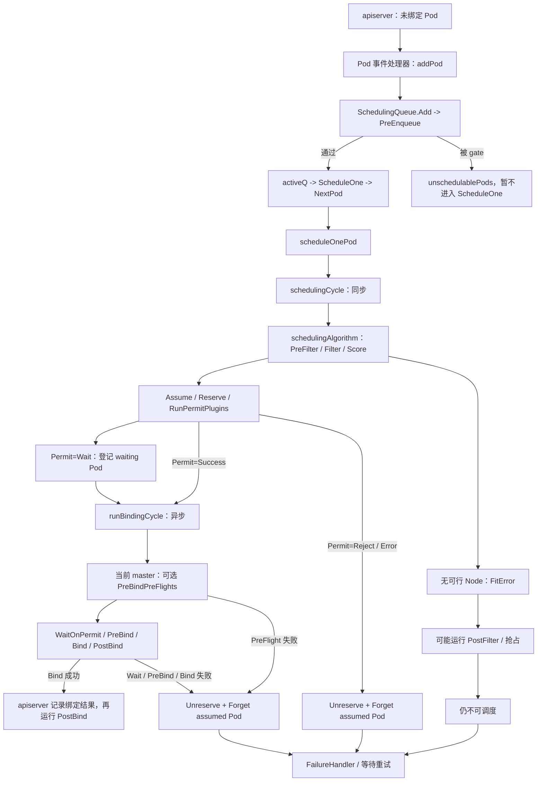

# 第 08 课：Java Pod 为什么宁愿 Pending，也不能随便挑一台 Node

> 从一次 `Insufficient cpu`，读懂 kube-scheduler 的硬约束、偏好、内存假设和绑定边界。

这不是一篇“scheduler 插件有哪些”的产品说明，也不是让你从头补一遍 Pod 基础。

你已经处理过很多 Java Pod Pending。第 08 课要做的是把熟悉的现场现象翻译成 scheduler 内部必须解决的设计问题：

> 集群状态持续变化、多个 Pod 同时争抢资源、不同团队又有不同放置规则时，scheduler 怎样既不把 Pod 放到错误的 Node，又能保持足够的调度吞吐？

本课先不把调用链答案一次性倒出来。学习顺序是：

```text
先看三台 Node 的资源矛盾
  -> 推导 scheduler 必须守住的安全底线
  -> 理解为什么硬约束和偏好必须分开
  -> 理解为什么“选出 Node”和“完成 Bind”不能混为一步
  -> 再沿本仓库真实源码逐层验证
  -> 最后回到 Java 生产证据与 GPU 短映射
```

整章贯穿的中心命题是：

> **调度不是“找一台看起来空闲的机器”，而是在一份不断变化的集群账本上，先排除所有不安全的 Node，再从可行 Node 中选择更合适的一个，并用 Assume 保护尚未完成的异步绑定。**

## 0. 本课定位与边界

第 08 课属于平台 Kubernetes 的 scheduler 深读，源码深度是 S3。现阶段统一用你熟悉的 Java 平台故障进入源码，GPU 只做简短迁移。

本课会讲：

- Pending Pod 怎样进入 scheduler；
- `ScheduleOne`、Filter/Score、Assume/Bind 的职责边界；
- Java Pod 的 CPU request 为什么会产生 `Insufficient cpu`；
- 0、1、多个可行 Node 为什么走不同分支；
- 为什么 scheduling cycle 串行，而 binding cycle 可以并发；
- 为什么“当前没有可行 Node”是正常调度结果，不等于 scheduler 进程故障；
- 遇到的 Go 函数字段、短路判断、类型断言、context 和 goroutine；
- 最后用一个小节说明相同框架怎样迁移到 GPU。

本课不展开：

- NodeResourcesFit 汇总 init container、app container 和 Pod-level resources 的全部细节；
- DefaultPreemption 怎样挑选候选 Node 和 victim；
- scheduler PodGroup、Extender、DRA、OpportunisticBatching 和并行 Filter 实现；
- Driver、CUDA、Device Plugin、DeviceManager 等 GPU 专属链路。

这些分别放在第 09、10、14～17 课，不会打断本课的 scheduler 主线。

建议分两遍读，不要第一次就把每个旁支都背下来：

- **首遍读主干：** 读到 5～13 节，先回答“Pod 怎样入队、怎样 Filter/Score、为什么先 Assume 再 Bind”；11.2 的并行 Filter 明确先跳过。
- **二遍补边界：** 再看 Error/Rejected 分流、Permit 等待和 binding failure 补偿；遇到 Go 写法卡住，直接回查第 16 节语法索引，不需要先系统学完整本 Go 教程。

## 1. 当前源码基线

```text
源码目录：<KUBERNETES_SRC>
commit：301946d15e67a4a2e8a5fb8292eb836acd366d78
describe：v1.37.0-alpha.0-280-g301946d15e6
```

本篇按当前 master 快照定位。生产排障时必须切换到目标集群对应的 tag/branch，不能记死行号。

主要文件：

```text
kubernetes/pkg/scheduler/schedule_one.go
kubernetes/pkg/scheduler/scheduler.go
kubernetes/pkg/scheduler/eventhandlers.go
kubernetes/pkg/scheduler/backend/queue/scheduling_queue.go
kubernetes/pkg/scheduler/framework/types.go
kubernetes/pkg/scheduler/framework/plugins/noderesources/fit.go
```

> **阅读约定：** 标有“教学注释版”的代码，变量名、判断顺序和返回关系来自本章固定提交；中文 `//` 是讲义新增，不是 Kubernetes 原注释。每个摘录省略了什么，都在代码块前明确交代，不用 `...` 代替被删掉的源码。唯一例外是 `failureReasons...` 这类真实 Go 可变参数展开语法，正文会当场解释。每条有业务意义的语句都解释；多行调用只解释一次，单独的括号不机械写“括号结束”。语法小例子会明确标成“Go 示例”，不冒充 Kubernetes 源码。

## 2. scheduler 为什么看 request 账本，而不是“哪台机器此刻最闲”

### 2.1 调度动作本质上是一份资源承诺

假设 scheduler 看见 worker-05 此刻 CPU 只有 10%，就把新 Pod 放上去。这个判断只描述了“刚才那一秒”，却没有回答：

- Node 已经向多少个 Pod 承诺了 CPU；
- 这些 Pod 是否只是暂时空闲，稍后会不会同时进入高峰；
- 新 Java 进程启动、JIT、类加载和 GC 峰值到来时，Node 是否仍能兑现承诺；
- scheduler 正在异步绑定的另一个 Pod，是否已经先占用了这份容量。

所以 scheduler 不是一个按瞬时利用率找“最闲机器”的负载均衡器。它做的是放置承诺：如果选择某个 Node，就必须根据声明的长期资源请求判断这台 Node 还有没有可承诺额度。

这也是本章第一条不变量：

> **一个没有通过全部硬约束的 Node，不能因为实时利用率低或 Score 较高而被选中。**

### 2.2 本课先认清五个账本词

| 词 | 大白话 | 现场看什么 |
|---|---|---|
| `requests.cpu` | Pod 希望 scheduler 提前预留的 CPU | Pod YAML、LimitRange 默认值 |
| `allocatable.cpu` | Node 可以承诺给 Pod 的 CPU 总账 | `kubectl describe node` |
| 已分配 requests | 当前 Node 上所有 Pod 已经预订的 CPU | Node 的 `Allocated resources` |
| 实时 usage | 当前一刻真正使用的 CPU | `kubectl top node/pod` |
| `Pending` | Pod 已创建但尚未完成调度或启动 | 必须结合 `NODE`、Condition 和 Event |

scheduler 做资源 Filter 时关心的是：

```text
Node 剩余可承诺 CPU = allocatable CPU - 已分配 CPU requests

Pod request <= 剩余可承诺 CPU
  -> 资源这一关可以通过

Pod request > 剩余可承诺 CPU
  -> Insufficient cpu
```

它不使用 `kubectl top` 的实时 CPU usage 做这个判断。机器此刻只有 10% CPU 利用率，也可能因为 requests 账本已经预订到很高而拒绝新 Pod。

这里的“已分配 request”也不能机械理解成某一刻 `kubectl describe node` 输出中的静态数字。scheduler 本轮使用的是自己的 cache/snapshot；正式 Bind 尚未写进 API 时，已经 Assume 的 Pod 也会先进入 scheduler 内存账本，防止下一轮重复许诺同一份资源。

为了先读通控制流，第 08 课把 admission 处理后的整个 Pod 有效 request 抽象成：

```text
effective Pod request:
  cpu: 2000m
  memory: 2Gi
```

这个 `2000m/2Gi` 不保证只来自 `game-api` 主容器。第 09 课会还原真实来源：app、sidecar、init container、LimitRange 默认值和 RuntimeClass overhead 怎样共同得到它。scheduler 使用最终有效 request，不按 CPU limit，也不按 JVM 此刻真正用了多少 CPU。

### 2.3 为什么不能把所有规则都混成一个总分

调度规则至少分成两类：

| 规则 | 例子 | 能否妥协 |
|---|---|---|
| 硬约束 | CPU 放不下、taint 不容忍、nodeAffinity 必须项 | 不能；失败 Node 必须淘汰 |
| 偏好 | 更均衡、更靠近数据、拓扑更分散 | 可以；只在可行 Node 中比较 |

如果把两类规则混成一个总分，理论上就可能出现“CPU 根本放不下，但其他偏好分很高，所以总分仍胜出”的危险结果。

Kubernetes 因此先 Filter、后 Score：

```text
Filter：这台 Node 能不能安全运行 Pod？
Score：已经能运行的 Node 中，更喜欢哪一台？
```

Score 没有权力复活一个 Filter 失败的 Node。这是第二条不变量。

## 3. 先不执行命令：把 game-api 的调度矛盾摆到白板上

以下是按真实生产格式整理的教学案例，不是用户集群原始输出。它延续第 07 课的 Java 发布场景：

```text
命名空间：prod
服务：game-api（Spring Boot）
Deployment：3 副本
发布策略：maxSurge=1，maxUnavailable=0
旧版本：3 个 Pod 正常服务
新版本：admission 后的整个 Pod 有效 cpu request 从约 1 核提高到 2 核
优先级：新旧 Pod 都使用默认优先级
```

Deployment 已经创建 new RS 和一个新 Pod。先把教学现场压缩成对象快照，不急着照抄命令：

```text
NAME       READY   UP-TO-DATE   AVAILABLE
game-api   3/3     1            3

NAME                                  DESIRED   CURRENT   READY
replicaset.apps/game-api-old          3         3         3
replicaset.apps/game-api-new          1         1         0

NAME                                READY   STATUS    NODE
pod/game-api-old-a                  1/1     Running   worker-05
pod/game-api-old-b                  1/1     Running   worker-06
pod/game-api-old-c                  1/1     Running   worker-07
pod/game-api-new-x                  0/1     Pending   <none>
```

这里和第 07 课的关键区别是：第 07 课的新 Pod 已经有 Node、正在经历 kubelet/应用 readiness；本例的新 Pod 是 `NODE=<none>`，责任还停在 scheduler。

Pod Condition 与 Event：

```text
Conditions:
  Type           Status  Reason
  PodScheduled   False   Unschedulable

Events:
  Warning  FailedScheduling  default-scheduler
  0/3 nodes are available: 3 Insufficient cpu.
  preemption: 0/3 nodes are available:
  3 No preemption victims found for incoming pod.
```

> Event 文本会随 Kubernetes 版本和启用插件略有差异；这里是与本案例相符的简化示意，生产上以目标集群实际输出为准。

Node 的 request 账本：

```text
NAME        CPU
worker-05   7500m
worker-06   7500m
worker-07   7500m

Allocatable:
  cpu: 7500m

Allocated resources:
  Resource  Requests       Limits
  cpu       6000m (80%)    12000m (160%)
```

三个 Node 在本教学现场都已经分配 `6000m` CPU requests，因此每个只剩：

```text
7500m - 6000m = 1500m

新 Pod request = 2000m

2000m > 1500m
  -> 三个 Node 都是 Insufficient cpu
```

即使实时使用率很低也不矛盾：

```text
NAME        CPU(cores)   CPU%
worker-05   800m         10%
```

`800m` 是此刻 usage，`6000m` 是已经向 Pod 承诺的 requests。scheduler 使用后者，避免按瞬时低负载做出无法兑现的长期承诺。

先暂停在这里，写下你的判断：

```text
能不能因为 worker-05 当前只用了 800m，就忽略 request 账本把 Pod 放上去？
三个 Node 都只剩 1500m 时，Score 还有没有运行的意义？
如果以后选出了 Node，但 API Bind 还没完成，下一轮怎样避免重复使用同一份容量？
```

第 6～12 节会让源码逐个回答；真正值班时怎样用命令验证这些变量，放到第 13 节再讲。

## 4. 先从证据判断责任层

不要从 `Pending` 三个字直接猜根因：

| 证据 | 结论 |
|---|---|
| 新 RS `DESIRED=1`、新 Pod 已存在 | Deployment/ReplicaSet 已完成当前创建动作 |
| 新 Pod `NODE=<none>` | 只能证明 API Server 中的 `spec.nodeName` 尚未持久化；单独看它，不能区分“还没选点”和“已经 Assume、正在异步 Bind” |
| `PodScheduled=False` | API 中记录的最近一次调度尝试失败，不是 readiness 问题 |
| `Unschedulable` | 当前没有满足全部硬条件的 Node，不等于 YAML 语法错误 |
| `3 Insufficient cpu` | 三个 Node 都在 CPU 资源 Filter 上失败 |
| `No preemption victims found` | PostFilter/默认抢占尝试后，没有合适的低优先级 Pod 可释放 |
| `kubectl top` 只有 10% | 不推翻前面的结论；scheduler 看 request 账本，不看瞬时 usage |

本课的重点不是背这些命令，而是把每条证据对应回 scheduler 的函数、分支和返回值。

本案例为什么仍然可以确认“没有选出可行 Node”？因为 `NODE=<none>` 不是孤证：它同时伴随 `PodScheduled=False`、持续的 `FailedScheduling` 和三个 Node 的 `Insufficient cpu`。这些证据共同指向 Filter 后可行集合为空，而不是短暂卡在异步 Bind。

## 5. 先看 scheduler 总地图

### 5.1 先建立五条不变量，再记函数名

| 不变量 | 为什么必须守住 | 后面在哪段源码验证 |
|---|---|---|
| 没通过全部 Filter 的 Node 不能进入 Score | 偏好不能覆盖安全约束 | 10～12 |
| 一次普通 Pod scheduling cycle 最多选一个 Node | 一个 Pod 不能同时被承诺给多个 Node | 10 |
| 异步 Bind 前先在内存账本 Assume | 防止下一轮重复承诺尚未写入 API 的资源 | 8、12 |
| Reserve、Permit、PreBindPreFlight、PreBind 或 Bind 失败必须补偿 | 临时插件状态和 assumed 资源不能永久残留 | 12 |
| Unschedulable 与内部 Error 分开表达 | “当前没位置”不能被误判成 scheduler 自身故障 | 7、9 |

Scheduling Framework 把调度拆成多个扩展点，不只是为了插件名字整齐。随着资源、亲和性、拓扑、存储和批任务规则增加，如果所有逻辑都塞进一个大函数，核心调度器会越来越难维护，扩展也很难正确回滚。框架把不同责任放到固定阶段：

```text
PreFilter：只和 Pod 或候选集合有关的准备，尽量只算一次
Filter：逐 Node 判断硬约束
PostFilter：当前无解时，尝试为未来一次调度创造条件
PreScore / Score：只比较已经可行的 Node
Reserve / Unreserve：插件资源的临时占用与补偿
Permit：在正式绑定前批准、等待或拒绝
PreBind / Bind / PostBind：提交前准备、正式绑定、成功后通知
```

这套设计的代价是调用链变长；收益是核心保持稳定，插件能共享 `CycleState`，并且每个可能失败的阶段都有明确的停止或回滚边界。

### 5.2 普通 Java Pod 的主地图



当前版本必须讲准六个边界：

1. `schedulingCycle` 不只是 Filter/Score；选点失败时 `schedulingAlgorithm` 可能运行 PostFilter，选点成功后才进入 Assume、Reserve 和 `RunPermitPlugins`。
2. Permit 插件在 scheduling cycle 中运行：Success 才直接进入 binding；Wait 会先登记 waiting Pod；Reject/Error 会执行 Unreserve、忘掉 assumed Pod，再返回失败。
3. 真正等待 Permit 完成发生在 binding cycle 的 `WaitOnPermit`。当前 master 在它前面还可能运行 `RunPreBindPreFlights`；这是版本新增边界，本课只标位置，不展开实现。
4. Assume 只修改 scheduler 内存中的 Pod 副本和资源账本，不等于 apiserver 已经完成 Bind。
5. `SchedulingQueue.Add` 不是无条件进入 `activeQ`；PreEnqueue 插件没有放行时，Pod 会先留在内部不可调度集合。主案例没有 scheduling gate，所以才进入 `activeQ`。
6. `PostBind` 只在 Bind 成功后运行；PreBindPreFlight、WaitOnPermit、PreBind 或 Bind 失败时，都会回到统一的 binding failure 补偿：撤销 Reserve 状态并 Forget assumed Pod，再交给失败处理。

大白话：

```text
先在 scheduler 自己的小账本里占住位置
再异步向 apiserver 提交正式绑定
```

这样 scheduler 不必等较慢的 API Bind 完成，就能继续处理后面的 Pod，同时又不会把相同资源重复许诺出去。

### 5.3 不是所有 Pod Add 事件都应该进入调度队列

文件：`kubernetes/pkg/scheduler/eventhandlers.go`。下面是 `addPod` 完整控制分支的教学注释版：

```go
// 定义 Scheduler 处理 Pod Add 事件的方法；obj 先以通用接口类型传进来。
func (sched *Scheduler) addPod(obj interface{}) {
	// 取得 scheduler 自己的 logger，后面错误和事件都使用它记录。
	logger := sched.logger
	// 尝试把通用 obj 安全地转换成 *v1.Pod；ok 表示转换是否成功。
	pod, ok := obj.(*v1.Pod)
	// informer 若传来的不是 Pod，不能继续访问 Pod 字段。
	if !ok {
		// 记录类型不符合预期的内部错误。
		utilruntime.HandleErrorWithLogger(logger, nil, "Cannot convert to *v1.Pod", "obj", obj)
		return // 结束这次事件处理，不把错误对象送进队列。
	}

	// 已经有 spec.nodeName 的 Pod 不再等待选点，而是进入 scheduler cache 账本。
	if assignedPod(pod) {
		sched.addAssignedPodToCache(pod) // 让后续调度看到它已经占用目标 Node 的资源。
	// 未绑定 Pod 还必须确认 schedulerName 属于当前 scheduler 的 profile。
	} else if responsibleForPod(pod, sched.Profiles) {
		sched.addPodToSchedulingQueue(pod) // 只有这种 Pod 才进入等待调度的路径。
	}
}
```

**大白话总结：** Pod Add 事件只是入口。已经绑定的 Pod 用来更新资源账本；尚未绑定、并且明确由当前 scheduler 负责的 Pod，才会进入 scheduling queue。一个自定义 scheduler 的 Pod 不应被 default-scheduler 抢走。

**顺手学 Go：** `func (sched *Scheduler)` 中的 `sched` 可暂时类比 Java 的 `this`；`obj.(*v1.Pod)` 是安全类型断言，第二个返回值 `ok=false` 时不会 panic；`else if` 表示只有前面的“已绑定”条件不成立，才继续判断当前 scheduler 是否负责。

`addPodToSchedulingQueue` 最终调用 `SchedulingQueue.Add`。当前源码还有 PodGroup/Gang 相关旁支，本课主案例没有启用这些能力，只先跟进入普通队列的调用：

```go
// addPodToSchedulingQueue 先从 Scheduler 取出自己的 logger。
logger := sched.logger
// 记录这是一个未调度 Pod 的新增事件。
logger.V(3).Info("Add event for unscheduled pod", "pod", klog.KObj(pod))
// 把 Pod 作为 PodGroup 成员登记；普通 Pod 调度不依赖这个结果。
sched.Cache.AddPodGroupMember(pod)
// 把 Pod 交给内部 SchedulingQueue；这里尚不能直接断言它一定进入 activeQ。
sched.SchedulingQueue.Add(klog.NewContext(context.Background(), logger), pod)
```

**大白话总结：** event handler 不负责选 Node，它只把“这个 Pod 需要调度”交给队列。真正的排队资格还要经过 `PriorityQueue.Add` 内部的 PreEnqueue 检查。

### 5.4 `SchedulingQueue.Add` 为什么不是无条件进入 `activeQ`

文件：`kubernetes/pkg/scheduler/backend/queue/scheduling_queue.go`。`PriorityQueue.Add` 的完整函数很短：

```go
// 新 Pod 进入 PriorityQueue 时使用这个方法。
func (p *PriorityQueue) Add(ctx context.Context, pod *v1.Pod) {
	// 修改多个内部队列前先加锁，避免并发读写破坏队列状态。
	p.lock.Lock()
	// 当前函数返回前自动解锁；即使中途 return 也会执行。
	defer p.lock.Unlock()

	// 把普通 Pod 包装成 QueuedPodInfo，加入排队时间、尝试次数等调度元数据。
	pInfo := p.newQueuedPodInfo(ctx, pod)
	// 从 context 中取 logger。
	logger := klog.FromContext(ctx)
	// moveToActiveQ 会先处理 PreEnqueue；added=true 才说明真的进了 activeQ。
	if added := p.moveToActiveQ(logger, pInfo, framework.EventUnscheduledPodAdd.Label(), false); added {
		p.activeQ.broadcast() // 唤醒可能正阻塞在 Pop 的调度循环。
	}
}
```

`moveToActiveQ` 为什么返回 `false`？下面直接读完整函数，特别注意：PreEnqueue 在 `underLock` closure 之前运行，真正修改 activeQ 的分支才在 closure 里面：

```go
// 尝试把 QueuedPodInfo 移进 activeQ，并返回是否真的加入成功。
func (p *PriorityQueue) moveToActiveQ(logger klog.Logger, pInfo *framework.QueuedPodInfo, event string, movesFromBackoffQ bool) bool {
	// 先记住运行 PreEnqueue 前是否已经 gated，后面更新内部集合要用。
	gatedBefore := pInfo.Gated()
	// 特定 backoff 快速路径已经运行过 PreEnqueue，可以避免重复调用。
	skipPreEnqueue := p.isPopFromBackoffQEnabled && movesFromBackoffQ
	// 普通新 Pod 走这里，运行全部 PreEnqueue 插件。
	if !skipPreEnqueue {
		p.runPreEnqueuePlugins(context.Background(), pInfo)
	}

	// 默认先认为没有加入 activeQ，只有成功分支才改成 true。
	added := false
	// 在 activeQ 自己的锁内完成“查重、清旧队列、加入 activeQ”这一组动作。
	p.activeQ.underLock(func(unlockedActiveQ unlockedActiveQueuer) {
		// PreEnqueue 没放行时，Pod 进入内部不可调度集合。
		if pInfo.Gated() {
			// 如果 activeQ 已有同一 Pod，不再重复加入其他队列。
			if unlockedActiveQ.has(pInfo) {
				return
			}
			// backoffQ 已有同一 Pod 时也不重复保存。
			if p.backoffQ.has(pInfo) {
				return
			}
			// 第一次进入内部不可调度集合时记录调试日志。
			if p.unschedulablePods.get(pInfo.Pod) == nil {
				logger.V(5).Info("Pod moved to an internal scheduling queue, because the pod is gated", "pod", klog.KObj(pInfo.Pod), "event", event, "queue", unschedulableQ)
			}
			// 保存或更新 gated Pod，然后只结束这个 closure。
			p.unschedulablePods.addOrUpdate(pInfo, gatedBefore, event)
			return
		}
		// 首次真正激活时记录第一次尝试时间。
		if pInfo.InitialAttemptTimestamp == nil {
			now := p.clock.Now()
			pInfo.InitialAttemptTimestamp = &now
		}
		// 从其他内部队列删除旧副本，保持一个 Pod 只处于一个主要队列状态。
		p.unschedulablePods.delete(pInfo.Pod, gatedBefore)
		p.backoffQ.delete(pInfo)

		// 通过所有入口检查后，才真正加入 activeQ。
		unlockedActiveQ.add(logger, pInfo, event)
		added = true
		// 新增或更新未调度 Pod 时，同步维护 nominated Pod 账本。
		if event == framework.EventUnscheduledPodAdd.Label() || event == framework.EventUnscheduledPodUpdate.Label() {
			p.nominator.addNominatedPod(logger, pInfo.PodInfo, nil)
		}
	})
	return added // 外层 Add 只有拿到 true 才 broadcast 唤醒 Pop。
}
```

**大白话总结：** `SchedulingQueue.Add` 的意思是“尝试把新 Pod 加入可调度队列”，不是承诺一定进 `activeQ`。主案例的 `game-api` 没有 scheduling gate，所以 PreEnqueue 通过，才会被 `ScheduleOne` 取到。

**顺手学 Go：** `defer` 表示把函数安排到当前函数返回前执行；`if added := call(); added` 把调用和布尔判断写在一起，`added` 只在这个 `if` 中有效；`!skipPreEnqueue` 中 `!` 表示取反。

## 6. ScheduleOne：调度循环怎样从 `activeQ` 取一个任务

### 6.1 为什么 scheduling cycle 是串行入口

文件：`kubernetes/pkg/scheduler/scheduler.go`。`Scheduler.Run` 会启动一个持续调用 `ScheduleOne` 的循环：

```go
// 在独立 goroutine 中反复调用 ScheduleOne；间隔 0 表示上一轮结束后可立即取下一项。
go wait.UntilWithContext(ctx, sched.ScheduleOne, 0)
```

**大白话总结：** 普通 scheduling cycle 从同一个 `ScheduleOne` 循环逐个启动。绑定阶段可以异步并发，但选点和 Assume 的主入口保持有序，降低多个调度决定同时修改同一份核心账本的复杂度。

### 6.2 `NextPod` 为什么是函数字段

`Scheduler` 没有把“从队列取 Pod”写死成一个固定调用，而是保存一个函数值。下面分别摘自字段声明和初始化位置；两行不在源码中连续出现：

```go
// NextPod 字段保存一个函数：输入 logger，返回 QueuedPodInfo 和 error。
NextPod func(logger klog.Logger) (*framework.QueuedPodInfo, error)

// 默认把 PriorityQueue.Pop 这个方法赋给 NextPod；这里没有括号，所以不是立刻调用。
sched.NextPod = podQueue.Pop
```

**大白话总结：** `NextPod` 默认就是从调度队列 `Pop`，但测试或特殊实现可以替换这个函数，而不必改写整个 Scheduler。变量在 Go 里不仅能保存数字和对象，也能保存函数。

**顺手学 Go：** `func(...) (A, error)` 描述函数类型；`sched.NextPod = podQueue.Pop` 是把函数本身赋值给字段；真正调用时才写 `sched.NextPod(logger)`。括号里的两个类型表示函数会返回两个值。

### 6.3 `ScheduleOne` 先守住取队列的错误与空值边界

文件：`kubernetes/pkg/scheduler/schedule_one.go`。下面先读函数开头连续的取队列与空值保护；当前 master 后面还有 Generic Workload/PodGroup 分支，本课普通 Java Pod 最终进入它的 `else` 路径：

```go
// 从本轮 context 取得 logger。
logger := klog.FromContext(ctx)
// 调用 NextPod；默认会阻塞等待 activeQ 中出现一个 QueuedPodInfo。
podInfo, err := sched.NextPod(logger)
// 从队列取任务本身失败时，记录内部错误并结束本轮。
if err != nil {
	utilruntime.HandleErrorWithLogger(logger, err, "Error while retrieving next pod from scheduling queue")
	return
}
// queue 关闭时可能得到 nil；先判断 podInfo，才能安全访问右边的 podInfo.Pod。
if podInfo == nil || podInfo.Pod == nil {
	return // 没有可调度对象，本轮正常结束。
}
```

普通 `game-api` Pod 不带 `SchedulingGroup`，因此真实 `else` 分支执行：

```go
// 把刚从队列取出的普通 Pod 交给单 Pod 调度主线。
sched.scheduleOnePod(ctx, podInfo)
```

**大白话总结：** `ScheduleOne` 不是 Filter 插件，它是“一次调度从哪里开始”的门卫：先从队列拿到一个有效任务，再根据任务类型分流。主案例从这里进入 `scheduleOnePod`。

**顺手学 Go：** 完整函数签名中的 `(sched *Scheduler)` 是 method receiver，`sched` 可暂时类比 Java 的 `this`；`podInfo, err := ...` 一次接两个返回值；`||` 会短路——如果左边 `podInfo == nil` 已经成立，右边不会再访问 `podInfo.Pod`，因此避免空指针。

关键对象可以这样记：

| 名称 | 类型/来源 | 大白话 |
|---|---|---|
| `sched` | `*Scheduler` receiver | 当前 scheduler 实例 |
| `NextPod` | Scheduler 中保存的函数字段 | 从调度队列取下一个任务 |
| `podInfo` | `*framework.QueuedPodInfo` | Pod 加上入队时间、尝试次数等排队信息 |
| `podInfo.Pod` | `*v1.Pod` | 真正要调度的 Pod 对象 |

## 7. `scheduleOnePod`：为什么先同步选点，再异步 Bind

文件：`kubernetes/pkg/scheduler/schedule_one.go`。下面保留函数全部有控制意义的语句；原有日志注释被讲义中文注释替代，没有省略错误分支：

```go
// 定义普通单 Pod 的完整调度入口。
func (sched *Scheduler) scheduleOnePod(ctx context.Context, podInfo *framework.QueuedPodInfo) {
	// 从 context 取得 logger，并从排队包装对象中拿到真正的 Pod。
	logger := klog.FromContext(ctx)
	pod := podInfo.Pod
	// 给后续日志统一附加 namespace/name 等 Pod 标识。
	logger = klog.LoggerWithValues(logger, "pod", klog.KObj(pod))
	// 把带 Pod 字段的新 logger 放回 context，后面函数都可复用。
	ctx = klog.NewContext(ctx, logger)
	logger.V(4).Info("About to try and schedule pod", "pod", klog.KObj(pod))

	// 根据 pod.spec.schedulerName 选择对应的 scheduler profile/framework。
	fwk, err := sched.frameworkForPod(pod)
	// 找不到 profile 属于内部配置异常，不能继续运行插件。
	if err != nil {
		logger.Error(err, "Error occurred")
		// 结束这个 Pod 的 in-flight 队列记录。
		sched.SchedulingQueue.Done(pod.UID)
		return
	}
	// 删除中的 Pod、已经 Assume 的 Pod 等不应重复进入新的 scheduling cycle。
	if sched.skipPodSchedule(ctx, fwk, pod) {
		sched.SchedulingQueue.Done(pod.UID) // 清理队列的 in-flight 状态。
		return
	}

	logger.V(3).Info("Attempting to schedule pod", "pod", klog.KObj(pod))
	// 记录本轮起点，用于延迟指标和失败处理。
	start := time.Now()
	// 创建本轮插件共享的 CycleState，下一轮不会复用这份临时数据。
	state := framework.NewCycleState()
	// 只抽样一部分 cycle 记录逐插件耗时，避免指标本身带来过高开销。
	state.SetRecordPluginMetrics(rand.Intn(100) < pluginMetricsSamplePercent)

	// 创建一个集合，插件可把“本轮结束后应激活的其他 Pod”放进来。
	podsToActivate := framework.NewPodsToActivate()
	// 以固定 key 把集合写入 CycleState，供不同插件共享。
	state.Write(framework.PodsToActivateKey, podsToActivate)

	// 为同步 scheduling cycle 建立可取消的子 context。
	schedulingCycleCtx, cancel := context.WithCancel(ctx)
	// scheduleOnePod 返回前一定调用 cancel，释放子 context 相关资源。
	defer cancel()

	// 同步执行选点、Assume/Reserve 和 Permit；一次接回三个结果。
	scheduleResult, assumedPodInfo, status := sched.schedulingCycle(
		schedulingCycleCtx, // 只服务同步 scheduling cycle 的 context。
		state,              // 本轮插件共享状态。
		fwk,                // 当前 Pod 对应的 scheduler framework/profile。
		podInfo,            // 原始排队信息。
		start,              // 本轮开始时间。
		podsToActivate,     // 插件准备激活的其他 Pod 集合。
	)
	// Unschedulable 或 Error 都不能进入 binding cycle。
	if !status.IsSuccess() {
		// 交给统一失败处理，记录诊断并安排后续队列状态。
		sched.FailureHandler(schedulingCycleCtx, fwk, assumedPodInfo, status, scheduleResult.nominatingInfo, start)
		return
	}

	// scheduling cycle 已成功并完成 Assume，绑定阶段才可以异步运行。
	go sched.runBindingCycle(
		ctx,             // 使用父 context，不跟随上面的 schedulingCycleCtx 一起取消。
		state,           // 继续传递同一份 CycleState；它不是 context.Context。
		fwk,             // 继续使用相同 scheduler profile。
		scheduleResult,  // 里面包含 SuggestedHost 等算法结果。
		assumedPodInfo,  // 已在内存中 Assume 的 Pod 副本。
		start,           // 用于完整调度延迟指标。
		podsToActivate,  // 绑定成功后可能激活其他 Pod。
	)
}
```

**大白话总结：** `scheduleOnePod` 先同步完成“能不能调、选哪台、先占住账本”。失败就交给 `FailureHandler`；成功才开一个 goroutine 去做较慢的绑定。异步并不是先斩后奏，因为 Pod 的资源已经通过 Assume 计入 scheduler 内存账本。

**顺手学 Go：** `context.WithCancel` 返回子 context 和取消函数；`defer cancel()` 表示当前函数返回前执行清理；`go f()` 表示启动 goroutine 后立即继续，不等待 `f` 完成；多行参数只是一次函数调用。`status.IsSuccess()` 对 `nil Status` 也按成功处理，因此它不是普通的 `err == nil`。

framework Status 先记三类：

| Status | 大白话 | 本轮后果 |
|---|---|---|
| Success / nil | 当前阶段成功 | 可以继续 |
| Unschedulable | 当前事实下没有合适 Node | 记录诊断，等待事实变化后重试 |
| Error | 插件、cache 或外部调用执行异常 | 按错误路径退避重试 |

为什么不能先异步 Bind、以后再补账？假设 Node 只剩 2 核，Pod A 和 Pod B 都请求 2 核：A 已选中该 Node、但 API Bind 还没完成；如果下一轮 snapshot 看不到 A，也没有本地 Assume，B 就可能再次拿到同一份 2 核。第 12 节会直接读 `assumeAndReserve` 和失败回滚源码。

## 8. `schedulingCycle`：snapshot、选点和内存占账为什么必须按顺序

文件：`kubernetes/pkg/scheduler/schedule_one.go`。下面是当前完整函数的教学注释版：

```go
// 同步 scheduling cycle 返回：算法结果、供后续使用的 PodInfo、framework Status。
func (sched *Scheduler) schedulingCycle(
	ctx context.Context,                    // 本轮同步调度的 context。
	state fwk.CycleState,                  // 插件共享的本轮状态。
	schedFramework framework.Framework,    // 当前 scheduler profile。
	podInfo *framework.QueuedPodInfo,      // 正在调度的 Pod 与排队元数据。
	start time.Time,                       // 本轮开始时间。
	podsToActivate *framework.PodsToActivate, // 插件可能激活的其他 Pod。
) (ScheduleResult, *framework.QueuedPodInfo, *fwk.Status) {
	// 把 scheduler cache 当前内容更新到本轮只读 NodeInfo snapshot。
	if err := sched.Cache.UpdateSnapshot(klog.FromContext(ctx), sched.nodeInfoSnapshot); err != nil {
		// snapshot 失败属于内部 Error；同时清空旧的 nominated node 意图。
		return ScheduleResult{nominatingInfo: clearNominatedNode}, podInfo, fwk.AsStatus(err)
	}

	// 在同一份 snapshot 上运行 Filter/Score；无可行 Node 时也会在里面进入 PostFilter。
	scheduleResult, status := sched.schedulingAlgorithm(ctx, state, schedFramework, podInfo, start)
	// 选点没有成功，就不能进入 Assume、Reserve 或 Permit。
	if !status.IsSuccess() {
		return scheduleResult, podInfo, status
	}

	// 选点成功后，在内存中 Assume，并运行 Reserve 和 Permit，准备异步绑定。
	assumedPodInfo, status := sched.prepareForBindingCycle(ctx, state, schedFramework, podInfo, podsToActivate, scheduleResult)
	// 任一步失败，就返回 prepare 阶段处理后的 PodInfo 和失败状态。
	if !status.IsSuccess() {
		return ScheduleResult{nominatingInfo: clearNominatedNode}, assumedPodInfo, status
	}

	// 三道门都通过：把 SuggestedHost 和 assumed Pod 交给 binding cycle。
	return scheduleResult, assumedPodInfo, nil
}
```

**大白话总结：** `schedulingCycle` 是同步调度阶段的总编排器：先刷新本轮账本，再决定 Node，最后才把决定应用到 scheduler 内存并过 Reserve/Permit。前一步失败，后一步绝不能偷跑。

**顺手学 Go：** `if err := call(); err != nil` 把“调用、声明局部 err、立即检查”写在一起，`err` 只在这个 `if` 范围内可见。第二次写 `assumedPodInfo, status := ...` 仍合法，因为左侧至少有一个新变量 `assumedPodInfo`；已有的 `status` 同时被重新赋值。三个返回位置必须按函数签名理解，不能把 `nil` 一概读成同一种含义。

三道门的责任边界：

| 阶段 | 读取/处理什么 | 失败后怎样 |
|---|---|---|
| `UpdateSnapshot` | 把 cache 中 Node、已绑定 Pod 和 assumed Pod 汇总到本轮视图 | 作为内部 Error 返回 |
| `schedulingAlgorithm` | Filter/Score；无可行 Node 时可能运行 PostFilter | 返回 Unschedulable/Error，不进入 Assume |
| `prepareForBindingCycle` | Assume、Reserve、Permit | 失败时撤销相应临时状态 |

主案例实际停在第二道门：三个 Node 都 Filter 失败，所以不会产生 assumed Pod，更不会进入 Bind。

## 9. `schedulingAlgorithm`：为什么 FitError 不是 scheduler 崩了

文件：`kubernetes/pkg/scheduler/schedule_one.go`。下面是完整函数的教学注释版，重点看三类 error 怎样分流，以及 PostFilter 结束后究竟返回什么：

```go
// 运行单 Pod 的选点算法；返回 ScheduleResult 和 framework Status。
func (sched *Scheduler) schedulingAlgorithm(
	ctx context.Context,                 // 本轮 context。
	state fwk.CycleState,               // 插件共享状态。
	schedFramework framework.Framework, // 当前 profile。
	podInfo *framework.QueuedPodInfo,   // 待调度 Pod。
	start time.Time,                    // 算法开始时间。
) (ScheduleResult, *fwk.Status) {
	// 无论从哪个 return 离开，都记录本次算法耗时。
	defer func() {
		metrics.SchedulingAlgorithmLatency.Observe(metrics.SinceInSeconds(start))
	}()

	// 取出真正的 Pod，供日志和 PostFilter 使用。
	pod := podInfo.Pod
	logger := klog.FromContext(ctx)
	// SchedulePod 是函数字段；默认指向 sched.schedulePod。
	scheduleResult, err := sched.SchedulePod(ctx, schedFramework, state, podInfo)
	// nil 表示已经选出 SuggestedHost；非 nil 要继续判断是哪一类失败。
	if err != nil {
		// snapshot 中根本没有可参与放置的 Node，属于当前不可解决的调度结果。
		if err == ErrNoNodesAvailable {
			status := fwk.NewStatus(fwk.UnschedulableAndUnresolvable).WithError(err)
			return ScheduleResult{nominatingInfo: clearNominatedNode}, status
		}

		// 安全判断 error 接口里装的是不是 *framework.FitError。
		fitError, ok := err.(*framework.FitError)
		// 不是 FitError，说明是插件执行或 scheduler 内部异常。
		if !ok {
			logger.Error(err, "Error selecting node for pod", "pod", klog.KObj(pod))
			return ScheduleResult{nominatingInfo: clearNominatedNode}, fwk.AsStatus(err)
		}

		// 没配置 PostFilter 时，保留原始 FitError 并报告 Unschedulable。
		if !schedFramework.HasPostFilterPlugins() {
			logger.V(3).Info("No PostFilter plugins are registered, so no preemption will be performed")
			return ScheduleResult{nominatingInfo: clearNominatedNode}, fwk.NewStatus(fwk.Unschedulable).WithError(err)
		}

		// 把每个 Node 的失败状态交给 PostFilter；默认配置通常会在这里尝试抢占。
		result, status := schedFramework.RunPostFilterPlugins(ctx, state, pod, fitError.Diagnosis.NodeToStatus)
		// 保存 PostFilter 消息，后续 Event/诊断可以同时展示原始失败与补救结果。
		msg := status.Message()
		fitError.Diagnosis.PostFilterMsg = msg
		// PostFilter 自身 Error 与普通拒绝使用不同日志级别，但下面仍保留原始 FitError。
		if status.Code() == fwk.Error {
			utilruntime.HandleErrorWithContext(ctx, nil, "Status after running PostFilter plugins for pod", "pod", klog.KObj(pod), "status", msg)
		} else {
			logger.V(5).Info("Status after running PostFilter plugins for pod", "pod", klog.KObj(pod), "status", msg)
		}

		// PostFilter 可能给出 nominated node，供未来一次 scheduling cycle 使用。
		var nominatingInfo *fwk.NominatingInfo
		if result != nil {
			nominatingInfo = result.NominatingInfo
		}
		// 当前函数不会立刻重新跑 Filter；最终仍返回原始 FitError 对应的 Unschedulable。
		return ScheduleResult{nominatingInfo: nominatingInfo}, fwk.NewStatus(fwk.Unschedulable).WithError(err)
	}
	// SchedulePod 没有 error，直接把选点结果向上返回。
	return scheduleResult, nil
}
```

**大白话总结：** `schedulingAlgorithm` 把“现在没地方放”和“程序执行坏了”分开。`FitError` 是硬约束计算出的正常业务结果；PostFilter 可以尝试为将来创造条件并留下 nominated node，但不会在当前函数里删除 victim 后马上重跑 Filter，更不会伪装成本轮已经选点成功。

**顺手学 Go：** `fitError, ok := err.(*framework.FitError)` 是带 `ok` 的安全类型断言：匹配时 `ok=true` 并得到具体错误对象，不匹配时 `ok=false`，不会 panic。`defer func() { ... }()` 定义一个匿名函数并安排在当前函数返回前执行。`var nominatingInfo *T` 声明指针变量，未赋值时默认是 `nil`。

三类失败必须分开：

| 结果 | 大白话 | 主案例是否命中 |
|---|---|---|
| `ErrNoNodesAvailable` | 当前 snapshot 中没有 Node | 否 |
| `*framework.FitError` | 有 Node，但没有一个通过全部硬约束 | **是** |
| 其他 error | 插件、cache 或 scheduler 执行异常 | 否 |

本例所有工作负载都是默认优先级，没有合适的低优先级 victim，所以 PostFilter 也无法改变未来条件。第 10 课再深读抢占候选、victim 和重入队，本课只守住这个入口边界。

## 10. `schedulePod`：本轮收集到 0、1、多个可行 Node 时为什么分叉

`SchedulePod` 同样是可替换的函数字段。默认初始化行是：

```go
// 默认让 SchedulePod 字段指向 Scheduler 自己的 schedulePod 方法。
sched.SchedulePod = sched.schedulePod
```

**大白话总结：** 上一节调用的是函数字段，默认实现才是下面的 `schedulePod`；这种间接层让测试可以替换选点算法。

文件：`kubernetes/pkg/scheduler/schedule_one.go`。下面是完整函数的教学注释版：

```go
// 尝试为一个 Pod 选择 Node；命名返回值 result/err 在函数内已预先声明。
func (sched *Scheduler) schedulePod(ctx context.Context, fwk framework.Framework, state fwk.CycleState, podInfo *framework.QueuedPodInfo) (result ScheduleResult, err error) {
	// 从排队信息中取 Pod，并创建一次 scheduling trace。
	pod := podInfo.Pod
	trace := utiltrace.New("Scheduling", utiltrace.Field{Key: "namespace", Value: pod.Namespace}, utiltrace.Field{Key: "name", Value: pod.Name})
	// 只有函数总耗时超过 100ms 才打印这条 trace。
	defer trace.LogIfLong(100 * time.Millisecond)

	// 当前 placement snapshot 中一个 Node 都没有，无法进入逐 Node Filter。
	if sched.nodeInfoSnapshot.NumNodesInPlacement() == 0 {
		return result, ErrNoNodesAvailable
	}

	// 运行 PreFilter、逐 Node Filter 以及 extender Filter，得到本轮收集到的可行 Node。
	feasibleNodes, diagnosis, nodeHint, err := sched.findNodesThatFitPod(ctx, fwk, state, podInfo)
	// 插件或 snapshot 执行异常直接向上返回，不能伪装成 Node 不合适。
	if err != nil {
		return result, err
	}
	trace.Step("Computing predicates done")

	// 可行集合为空时，构造包含每个 Node 失败诊断的 FitError。
	if len(feasibleNodes) == 0 {
		return result, &framework.FitError{
			Pod:         pod,                                           // 哪个 Pod 无法放置。
			NumAllNodes: sched.nodeInfoSnapshot.NumNodesInPlacement(),   // 本轮 placement 中的 Node 总数。
			Diagnosis:   diagnosis,                                     // 各 Node/插件失败原因。
		}
	}

	// 本轮只收集到一个可行 Node 时，没有比较对象，直接选它。
	if len(feasibleNodes) == 1 {
		node := feasibleNodes[0].Node().Name
		// OpportunisticBatching 开启时，把结果存起来供相似 Pod 复用；不改变本例选择。
		if utilfeature.DefaultFeatureGate.Enabled(features.OpportunisticBatching) {
			fwk.StoreScheduleResults(ctx, podInfo.PodSignature, nodeHint, node, nil, sched.CurrentCycle())
		}
		return ScheduleResult{
			SuggestedHost:  node,                              // 算法建议的 Node 名称。
			EvaluatedNodes: 1 + diagnosis.NodeToStatus.Len(), // 成功与失败检查过的 Node 数。
			FeasibleNodes:  1,                                 // 本轮收集到一个可行 Node。
		}, nil
	}

	// 多个可行 Node 进入 prioritizeNodes；默认 profile 会运行 PreScore/Score。
	priorityList, err := prioritizeNodes(ctx, sched.Extenders, fwk, state, pod, feasibleNodes)
	// 评分插件或 extender 执行失败时，不能继续从不完整分数中选 Node。
	if err != nil {
		return result, err
	}

	// 把评分结果放入排序结构，Pop 取得最高分 Node。
	sortedPrioritizedNodes := newSortedNodeScores(priorityList)
	node := sortedPrioritizedNodes.Pop()
	trace.Step("Prioritizing done")

	// 开启 OpportunisticBatching 时保存排序结果，供后续相似 Pod 尝试复用。
	if utilfeature.DefaultFeatureGate.Enabled(features.OpportunisticBatching) {
		fwk.StoreScheduleResults(ctx, podInfo.PodSignature, nodeHint, node, sortedPrioritizedNodes, sched.CurrentCycle())
	}

	// 返回算法建议和统计；此时 err 已在上面的判断中确认是 nil。
	return ScheduleResult{
		SuggestedHost:  node,
		EvaluatedNodes: len(feasibleNodes) + diagnosis.NodeToStatus.Len(),
		FeasibleNodes:  len(feasibleNodes),
	}, err
}
```

**大白话总结：** 先找“能放”的 Node。一个都没有就返回带诊断的 `FitError`；只有一个就直接用；多个才值得比较偏好。这里的 `feasibleNodes` 是本轮实际收集到的候选，不保证等于集群里理论上所有可行 Node——大集群可能找到足够数量后就提前停止搜索。

**顺手学 Go：** `(result ScheduleResult, err error)` 是命名返回值；`len(slice)` 取 slice 长度；`feasibleNodes[0]` 取第一个元素，所以必须先保证长度为 1；`&framework.FitError{...}` 中 `&` 取得新结构体地址；`Field: value` 是结构体按字段赋值。

三个分支要准确表述为：

| 本轮 `feasibleNodes` 数量 | 行为 | 默认 profile 是否运行 Score |
|---:|---|---|
| 0 | 返回 `FitError` | 否 |
| 1 | 直接选择唯一 Node | 否 |
| 大于 1 | 进入 `prioritizeNodes` | 是 |

“大于 1 就一定执行 PreScore/Score”只对有 Score 能力的 profile 成立。自定义 profile 如果既没有 Score 插件也没有 extender，`prioritizeNodes` 会走快速路径，给候选同样的默认分数；第 12 节会看到这个保护分支。

### 10.1 用同一组 Java 数据手算三个分支

主案例：三个 Node 都已分配 `6000m`：

| Node | Allocatable | 已分配 request | 剩余 | 新 Pod request | Filter |
|---|---:|---:|---:|---:|---|
| worker-05 | 7500m | 6000m | 1500m | 2000m | 失败 |
| worker-06 | 7500m | 6000m | 1500m | 2000m | 失败 |
| worker-07 | 7500m | 6000m | 1500m | 2000m | 失败 |

`len(feasibleNodes)==0`，因此返回 FitError，主案例根本不会运行 Score。

如果只有 worker-07 的已分配 request 降为 `5000m`：

| Node | 剩余 | Filter |
|---|---:|---|
| worker-05 | 1500m | 失败 |
| worker-06 | 1500m | 失败 |
| worker-07 | 2500m | 通过 |

此时 `len(feasibleNodes)==1`，直接选择 worker-07，也不会运行 Score。

如果 worker-06 已分配 `5000m`、worker-07 已分配 `4500m`：

| Node | 剩余 | Filter | 后续 |
|---|---:|---|---|
| worker-05 | 1500m | 失败 | 不参与打分 |
| worker-06 | 2500m | 通过 | 进入 Score |
| worker-07 | 3000m | 通过 | 进入 Score |

此时才需要在 worker-06 和 worker-07 之间比较“哪个更合适”。

### 10.2 SuggestedHost 还不是正式 Bind

`schedulePod` 返回：

```go
// schedulePod 返回的是算法结果结构体，不是已经写入 API 的 Pod。
ScheduleResult{
	SuggestedHost:  node,                                             // 本轮建议的 Node。
	EvaluatedNodes: len(feasibleNodes) + diagnosis.NodeToStatus.Len(), // 检查过多少 Node。
	FeasibleNodes:  len(feasibleNodes),                               // 本轮收集到多少可行 Node。
}
```

**大白话总结：** `SuggestedHost` 只是“算法决定把它放哪”。它还没有证明 scheduler cache 已占账，更没有证明 API Server 已写入 `spec.nodeName`。

**顺手学 Go：** `ScheduleResult{...}` 是结构体字面量；按字段名赋值时不依赖字段声明顺序。这里三个字段只是结果数据，不会因为构造结构体就自动触发 Bind。

这只是本轮算法选出的建议 Node。后面还要经过：

```text
Assume
  -> Reserve
  -> Permit
  -> WaitOnPermit
  -> PreBind
  -> Bind
  -> Bind 成功后才 PostBind

中途失败
  -> Unreserve
  -> Forget assumed Pod
  -> FailureHandler
```

所以“已经算出 SuggestedHost”和“apiserver 中 Pod 已绑定 Node”不是同一时刻。

## 11. `findNodesThatFitPod`：为什么 PreFilter 只算一次，Filter 却要逐 Node 执行

如果一个 Pod 要检查 3000 台 Node，而 Pod 自己的有效 request、亲和性解析结果每台都重新计算一遍，会产生大量重复工作。Scheduling Framework 因此提供 `CycleState`：PreFilter 先把只需计算一次的结果写进去，Filter 再拿同一份结果逐 Node 比较。

```text
PreFilter：准备 Pod 侧结果，必要时还能缩小候选 Node 集合
Filter：读取同一份 CycleState，逐 Node 检查硬约束
Diagnosis：保存正常拒绝的插件和原因，供 FitError、Event 与重入队使用
```

### 11.1 PreFilter 的失败也分“正常拒绝”和“内部 Error”

NodeResourcesFit 的 PreFilter 位于 `kubernetes/pkg/scheduler/framework/plugins/noderesources/fit.go`：

```go
// NodeResourcesFit 在 PreFilter 阶段先计算整个 Pod 的有效资源请求。
func (f *Fit) PreFilter(ctx context.Context, cycleState fwk.CycleState, pod *v1.Pod, nodes []fwk.NodeInfo) (*fwk.PreFilterResult, *fwk.Status) {
	// 把 containers、init、Pod-level resources 等汇总成 preFilterState；细节留到第09课。
	result := computePodResourceRequest(pod, ResourceRequestsOptions{EnablePodLevelResources: f.enablePodLevelResources})
	// 把结果写入本轮 CycleState，后面检查每个 Node 时直接复用。
	cycleState.Write(preFilterStateKey, result)
	// 两个 nil 分别表示“不限制候选 Node 子集”和“PreFilter 成功”。
	return nil, nil
}
```

**大白话总结：** `game-api` 的 `2000m` 不是对 worker-05、06、07 各算一遍，而是本轮先算一次、存一次，三个 Node 的 Filter 共用。

`findNodesThatFitPod` 调用所有 PreFilter 插件时，还必须准确区分正常拒绝和执行异常。下面是函数开头到 PreFilter 返回处理的连续源码教学注释版：

```go
// 从本轮 context 取得 logger。
logger := klog.FromContext(ctx)
// 先创建本轮 Diagnosis，里面会保存每个 Node 的失败状态。
diagnosis := framework.Diagnosis{
	NodeToStatus: framework.NewDefaultNodeToStatus(),
}
// 从本轮 snapshot 列出 placement 中的全部 Node。
allNodes, err := sched.nodeInfoSnapshot.ListNodesInPlacement()
// snapshot 读取失败属于内部 Error，直接向上返回 error。
if err != nil {
	return nil, diagnosis, "", err
}
// 取出待调度 Pod，供插件调用和日志使用。
pod := podInfo.Pod
// 运行所有 PreFilter：得到候选子集、Status 和拒绝它的插件集合。
preRes, s, unscheduledPlugins := schedFramework.RunPreFilterPlugins(ctx, state, pod)
// 记录哪些插件认为 Pod 当前不可调度。
diagnosis.UnschedulablePlugins = unscheduledPlugins
// 非 Success 还要再分“正常拒绝”和“插件 Error”。
if !s.IsSuccess() {
	// 不是 Rejected，说明插件执行出错；把 Status 转成 error 向上传。
	if !s.IsRejected() {
		return nil, diagnosis, "", s.AsError()
	}
	// 正常拒绝意味着所有 Node 都可使用同一份失败 Status。
	diagnosis.NodeToStatus.SetAbsentNodesStatus(s)
	// 保存 PreFilter 的人类可读消息。
	msg := s.Message()
	diagnosis.PreFilterMsg = msg
	logger.V(5).Info("Status after running PreFilter plugins for pod", "pod", klog.KObj(pod), "status", msg)
	// 保存插件级状态，供 Event 与重入队判断使用。
	diagnosis.AddPluginStatus(s)
	// error 返回位是 nil：这是正常不可调度，不是程序执行错误。
	return nil, diagnosis, "", nil
}
```

**大白话总结：** PreFilter 说“这个 Pod 当前不满足条件”时，函数保留诊断并正常返回；PreFilter 自己执行坏了，才把 error 向上抛。两者不能都压成 `return nil`，否则值班时会把 scheduler 故障误判成资源不足。

**顺手学 Go：** `return nil, diagnosis, "", err` 的四个位置分别对应可行 Node slice、诊断、node hint 和 error；空字符串不是 error。`s.AsError()` 把 framework Status 转成 Go `error`。结构体字面量可跨多行按字段初始化。

PreFilter 成功后，真实函数还会优先尝试 nominated/hinted Node，并允许 PreFilter 返回 Node 子集；这些是本章旁支。普通 `game-api` 主线最终进入：

```go
// batching/node hint 旁支会按需给它赋值；普通主线里先是空字符串。
var nodeHint string
// 默认从全部 Node 开始；如果 PreFilter 返回子集，真实源码会在这里缩小 nodes。
nodes := allNodes
// 对 PreFilter 留下的候选 Node 运行逐 Node Filter。
feasibleNodes, err := sched.findNodesThatPassFilters(ctx, schedFramework, state, pod, &diagnosis, nodes)
// 无论成功失败，都推进下次搜索起点，让不同 Node 有轮流被检查的机会。
processedNodes := len(feasibleNodes) + diagnosis.NodeToStatus.Len()
sched.nextStartNodeIndex = (sched.nextStartNodeIndex + processedNodes) % len(allNodes)
// Filter 插件执行 Error 时向上传，不能继续运行 extender。
if err != nil {
	return nil, diagnosis, nodeHint, err
}
```

**大白话总结：** PreFilter 负责“准备与初筛”，`findNodesThatPassFilters` 才真正逐 Node 过硬约束。搜索起点会轮转，避免每个 Pod 永远从同一批 Node 开始检查。

### 11.2 【旁读】Filter Error 不能当成“这个 Node 不合适”

`findNodesThatPassFilters` 会并行调用下面这个 closure。外层预先创建了 `feasibleNodes`、错误 channel 和原子计数；本段只摘录完整的单 Node 判断闭包：

```go
// 定义一个接收 Node 下标的匿名函数，后面由 Parallelizer 并发调用。
checkNode := func(i int) {
	// 从轮转起点开始取 Node；% 保证数组下标回到 0..numAllNodes-1。
	nodeInfo := nodes[(sched.nextStartNodeIndex+i)%numAllNodes]
	// 对这台 Node 运行全部 Filter；存在 nominated Pod 时框架可能补充检查。
	status := schedFramework.RunFilterPluginsWithNominatedPods(ctx, state, pod, nodeInfo)
	// 插件执行 Error 是整轮算法错误，发到 error channel 并取消其他检查。
	if status.Code() == fwk.Error {
		errCh.SendWithCancel(status.AsError(), func() {
			cancel(errors.New("some other Filter operation failed"))
		})
		return
	}
	// Success 才能把 Node 放进可行集合。
	if status.IsSuccess() {
		// 多个 goroutine 共享计数，必须用原子加一取得不冲突的位置。
		length := atomic.AddInt32(&feasibleNodesLen, 1)
		// 已经找到配置要求数量的 Node 后，取消多余搜索。
		if length > numNodesToFind {
			cancel(errors.New("findNodesThatPassFilters has found enough nodes"))
			atomic.AddInt32(&feasibleNodesLen, -1) // 撤销这次超额计数。
		} else {
			feasibleNodes[length-1] = nodeInfo // 保存这台真正可行的 Node。
		}
	} else {
		// 正常 Unschedulable 不是内部 error；保存 Node 名和失败 Status。
		result[i] = &nodeStatus{
			node:   nodeInfo.Node().Name,
			status: status,
		}
	}
}
```

**大白话总结：** 一台 Node 有三种结果：通过就进可行集合；正常硬约束失败就记进 Diagnosis；插件自身 Error 则终止整轮并向上报错。原实现并不是把所有非 Success 都当成“Node 不合适”。

**顺手学 Go：** `checkNode := func(i int) { ... }` 是 closure（匿名函数并捕获外层变量）；`%` 是取余，用于循环下标；`&feasibleNodesLen` 取得变量地址交给原子操作；`&nodeStatus{...}` 创建结构体并返回它的指针。并发、channel 和 atomic 的实现首遍只认用途，不要求会写。

大集群里 scheduler 找到配置要求数量的可行 Node 后可以提前停止，并不保证每轮检查完所有 Node。它用吞吐换取“足够好”的候选集合，再通过轮转起点给不同 Node 被检查的机会。

### 11.3 `Insufficient cpu` 最终来自哪个判断

NodeResourcesFit 的 Filter 位于 `kubernetes/pkg/scheduler/framework/plugins/noderesources/fit.go`。它先从 CycleState 读取 PreFilter 结果，再把资源不足列表变成 framework Status：

```go
// 对一台 Node 执行 NodeResourcesFit 硬约束检查。
func (f *Fit) Filter(ctx context.Context, cycleState fwk.CycleState, pod *v1.Pod, nodeInfo fwk.NodeInfo) *fwk.Status {
	// 读取本轮 PreFilter 已经计算好的 Pod request。
	s, err := getPreFilterState(cycleState)
	// 读不到通常表示调用顺序或状态异常，作为 Error 返回。
	if err != nil {
		return fwk.AsStatus(err)
	}

	// DRA 扩展资源启用时才取得共享 DRA manager；主案例保持 nil。
	var draManager fwk.SharedDRAManager
	if f.enableDRAExtendedResource {
		draManager = f.handle.SharedDRAManager()
	}
	// 组装本轮资源检查选项。
	opts := ResourceRequestsOptions{
		EnablePodLevelResources:   f.enablePodLevelResources,
		EnableDRAExtendedResource: f.enableDRAExtendedResource,
	}
	// 比较 Pod request 与这台 Node 的 allocatable/requested 账本。
	insufficientResources := fitsRequest(s, nodeInfo, f.ignoredResources, f.ignoredResourceGroups, draManager, opts)

	// 非空列表表示至少一种资源不足。
	if len(insufficientResources) != 0 {
		// 收集所有失败原因，不只保留第一个。
		failureReasons := make([]string, 0, len(insufficientResources))
		statusCode := fwk.Unschedulable
		for i := range insufficientResources {
			failureReasons = append(failureReasons, insufficientResources[i].Reason)
			// 请求本身超过 Node 总容量时，升级为不可通过抢占解决。
			if insufficientResources[i].Unresolvable {
				statusCode = fwk.UnschedulableAndUnresolvable
			}
		}
		// 把状态码和全部原因返回给 Filter 框架。
		return fwk.NewStatus(statusCode, failureReasons...)
	}
	// nil Status 在 framework 中表示成功：这台 Node 资源维度可行。
	return nil
}
```

**大白话总结：** `fitsRequest` 先生成结构化的资源不足清单，Filter 再把它翻译成 scheduler 能传播的 Status。Event 中的 `Insufficient cpu` 就来自这份清单，不是 kube-scheduler 临时拼出来的猜测。

**顺手学 Go：** `failureReasons...` 不是“此处省略源码”。这是 Go 的 variadic 展开：把 `[]string` 中的每个元素依次作为 `NewStatus` 的可变参数传入。

CPU 分支的完整字段如下：

```go
// 只有 Pod 确实请求了 CPU，并且请求大于 Node 剩余可承诺 CPU 时才失败。
if podRequest.MilliCPU > 0 && podRequest.MilliCPU > (nodeInfo.GetAllocatable().GetMilliCPU()-nodeInfo.GetRequested().GetMilliCPU()) {
	// 把这次 CPU 不足追加到资源失败列表。
	insufficientResources = append(insufficientResources, InsufficientResource{
		ResourceName: v1.ResourceCPU,                              // 失败资源是 CPU。
		Reason:       "Insufficient cpu",                          // 最终诊断使用的原因文本。
		Requested:    podRequest.MilliCPU,                          // 新 Pod 请求多少毫核。
		Used:         nodeInfo.GetRequested().GetMilliCPU(),        // scheduler 账本已承诺多少毫核。
		Capacity:     nodeInfo.GetAllocatable().GetMilliCPU(),      // Node 可承诺总量。
		Unresolvable: podRequest.MilliCPU > nodeInfo.GetAllocatable().GetMilliCPU(), // 清空 Node 也放不下吗。
	})
}
```

**大白话总结：** 本例代入就是 `2000 > 7500 - 6000`，所以三个 Node 都追加 `Insufficient cpu`。`Unresolvable=false`，因为 `2000 < 7500`：释放足够资源理论上可解决；只是当前没有合适的低优先级 victim。

**顺手学 Go：** `&&` 是短路“并且”；`append(slice, value)` 返回追加后的 slice，所以要重新赋回 `insufficientResources`；`InsufficientResource{Field: value}` 是结构体字面量；最后一个布尔表达式直接成为 `Unresolvable` 字段值。

还要记住：`nodeInfo.GetRequested()` 来自 scheduler 的本轮内存视图，可能已经包含尚未正式 Bind、但已经 Assume 的 Pod；它不保证与同一瞬间 `kubectl describe node` 的展示完全相同。

## 12. Score、Assume 与 Bind：偏好决定之后，为什么还需要内存事务

### 12.1 Score 只能比较可行 Node，不能推翻 Filter

文件：`kubernetes/pkg/scheduler/schedule_one.go`。下面摘录 `prioritizeNodes` 从快速返回到 Score 完成的连续主线；后面的日志与 extender 分数合并明确留在二遍阅读：

```go
// 如果既没有 extender，也没有任何 Score 插件，就无需运行 PreScore/Score。
if len(extenders) == 0 && !schedFramework.HasScorePlugins() {
	// 给所有候选创建同样的默认分数。
	result := make([]fwk.NodePluginScores, 0, len(nodes))
	for i := range nodes {
		result = append(result, fwk.NodePluginScores{
			Name:       nodes[i].Node().Name, // 候选 Node 名称。
			TotalScore: 1,                    // 每台同分，不表达额外偏好。
		})
	}
	return result, nil
}

// 有评分能力时，先运行只需准备一次的 PreScore 插件。
preScoreStatus := schedFramework.RunPreScorePlugins(ctx, state, pod, nodes)
// PreScore 失败时，不能使用不完整的评分上下文。
if !preScoreStatus.IsSuccess() {
	return nil, preScoreStatus.AsError()
}

// 对每个可行 Node 运行 Score 插件并汇总已配置权重。
nodesScores, scoreStatus := schedFramework.RunScorePlugins(ctx, state, pod, nodes)
// Score 执行失败时返回 error，不从部分结果里硬选一台。
if !scoreStatus.IsSuccess() {
	return nil, scoreStatus.AsError()
}
```

真实函数在这之后还会记录详细分数，并按需合并 extender 分数；这些旁支结束后，函数最后用下面这一行把最终结果交还给 `schedulePod`。这行与上面的代码不是连续摘录，特意单列是为了把“分数去了哪里”闭环：

```go
// 日志与 extender 分数合并结束后，把最终 Node 分数返回给 schedulePod。
return nodesScores, nil
```

**大白话总结：** 多个候选一定进入 `prioritizeNodes`，但只有 profile 真有评分能力时才运行 PreScore/Score。默认 scheduler 有 Score 插件，所以常规场景会打分；完全没有评分能力的自定义 profile 给所有候选同分后快速返回。最终的 `nodesScores` 会回到 `schedulePod`，再由它选出 `SuggestedHost`，而不是 Score 插件自己绑定 Pod。

**顺手学 Go：** `make([]T, 0, len(nodes))` 创建长度为 0、预留容量为候选数的 slice；`for i := range nodes` 遍历下标；`append` 返回扩展后的 slice；`status.AsError()` 把插件 Status 转成 Go error 返回。

一句话区分：

```text
Filter：这个 Node 能不能运行 Pod，是硬条件
Score：在已经能运行 Pod 的 Node 中，哪个更合适，是偏好
```

Score 不能让一个 `Insufficient cpu` 的 Node 重新通过。假设 worker-06 和 worker-07 都通过 Filter，各插件加权后的教学分数是：

| Node | Filter | TotalScore（教学示意） | 结果 |
|---|---|---:|---|
| worker-05 | 失败 | 不打分 | 淘汰 |
| worker-06 | 通过 | 65 | 候选 |
| worker-07 | 通过 | 82 | `SuggestedHost` |

这些分数只说明控制流，不是固定算法结果。真实分数取决于目标集群启用的 Score 插件、权重与当时的 snapshot。

### 12.2 `assumeAndReserve`：先在 scheduler 自己的账本里占住位置

选出 `SuggestedHost` 后，`prepareForBindingCycle` 会先调用 `assumeAndReserve`。下面是当前完整函数的教学注释版：

```go
// 在 scheduler 内存中应用算法结果，并运行 Reserve 插件。
func (sched *Scheduler) assumeAndReserve(
	ctx context.Context,                 // 当前 scheduling context。
	state fwk.CycleState,               // 插件共享状态。
	schedFramework framework.Framework, // 当前 profile。
	podInfo *framework.QueuedPodInfo,   // 原始 Pod 排队信息。
	scheduleResult ScheduleResult,      // 包含 SuggestedHost。
) (*framework.QueuedPodInfo, *fwk.Status) {
	logger := klog.FromContext(ctx)
	// 复制 PodInfo，不能直接把 informer/queue 中的原对象改成已绑定。
	assumedPodInfo := podInfo.DeepCopy()
	assumedPod := assumedPodInfo.Pod
	// sched.assume 会给这个副本设置 NodeName，并调用 Cache.AssumePod 占用内存资源账本。
	err := sched.assume(logger, state, assumedPodInfo, scheduleResult.SuggestedHost)
	// Assume 失败属于内部执行异常，交给上层重试。
	if err != nil {
		return assumedPodInfo, fwk.AsStatus(err)
	}

	// 通知所有 Reserve 插件为这个 Pod/Node 建立临时状态。
	if sts := schedFramework.RunReservePluginsReserve(ctx, state, assumedPod, scheduleResult.SuggestedHost); !sts.IsSuccess() {
		// Reserve 失败后必须先 Unreserve，并从内存 cache Forget assumed Pod。
		err := sched.unreserveAndForget(ctx, state, schedFramework, assumedPodInfo, scheduleResult.SuggestedHost)
		if err != nil {
			utilruntime.HandleErrorWithContext(ctx, err, "ForgetPod failed")
		}

		// Reserve 正常拒绝要转成针对 SuggestedHost 的 FitError。
		if sts.IsRejected() {
			fitErr := &framework.FitError{
				NumAllNodes: 1,
				Pod:         podInfo.Pod,
				Diagnosis: framework.Diagnosis{
					NodeToStatus: framework.NewDefaultNodeToStatus(),
				},
			}
			fitErr.Diagnosis.NodeToStatus.Set(scheduleResult.SuggestedHost, sts)
			fitErr.Diagnosis.AddPluginStatus(sts)
			return assumedPodInfo, fwk.NewStatus(sts.Code()).WithError(fitErr)
		}
		// 其他失败保留原 Status 返回。
		return assumedPodInfo, sts
	}
	// Assume 和 Reserve 都成功，才把 assumed Pod 交给 Permit/Bind。
	return assumedPodInfo, nil
}
```

**大白话总结：** Assume 不是写 API，而是 scheduler 先在自己的账本上写一张“这份资源已经答应给 game-api”的便签。Reserve 插件如果失败，便签和插件临时状态都必须撤销；否则后面的 Pod 会永远少看到一份资源。

`sched.assume` 怎样真正写这张“内存便签”？下面摘录普通单 Pod 路径；DRA 状态复制和 PodGroup 使用 snapshot Assume 的旁支在本课不展开：

```go
// 只修改 DeepCopy 出来的 assumed Pod：把算法选出的 Node 写到副本上。
assumedPodInfo.Pod.Spec.NodeName = host
// 普通 Pod 把 assumed 副本加入 scheduler cache，NodeInfo request 账本会立即计入它。
if err := sched.Cache.AssumePod(logger, assumedPodInfo.Pod); err != nil {
	logger.Error(err, "Scheduler cache AssumePod failed")
	return err // cache 占账失败，不能假装 Assume 成功。
}
// 如果它曾是 nominated Pod，Assume 后清理旧的 nomination，避免重复候选状态。
if sched.SchedulingQueue != nil {
	sched.SchedulingQueue.DeleteNominatedPodIfExists(assumedPodInfo.Pod)
}
return nil // 内存占账成功，正式 API Bind 仍在后面。
```

**大白话总结：** `spec.nodeName` 先写在 DeepCopy 的内存副本上，再交给 `Cache.AssumePod`；此时 API Server 中的原 Pod 仍可能是 `NODE=<none>`。这正是为什么不能单靠 `kubectl get pod` 判断 scheduler 有没有选点。

**顺手学 Go：** `if sts := call(); !sts.IsSuccess()` 中 `sts` 只在整个 `if` 语句里有效；`DeepCopy()` 返回独立对象指针；`&framework.FitError{...}` 创建错误结构体并取地址；多层结构体字面量要按花括号层次读。

### 12.3 Permit 为什么仍属于 scheduling cycle

`prepareForBindingCycle` 在 Assume/Reserve 后运行 Permit。下面只摘录 Wait、Reject/Error 的完整分叉；Pod 激活收尾不影响本节：

```go
// Reserve 成功后运行 Permit，得到“插件名 -> 该插件等待时限”的 map 和汇总 Status。
pluginsWaitTime, runPermitStatus := schedFramework.RunPermitPlugins(ctx, state, assumedPod, scheduleResult.SuggestedHost)
// Wait 表示暂时批准等待，先登记到 waiting Pods。
if runPermitStatus.IsWait() {
	schedFramework.AddWaitingPod(assumedPod, pluginsWaitTime)
// 既不是 Wait 也不是 Success，说明 Permit 拒绝或执行出错。
} else if !runPermitStatus.IsSuccess() {
	// Bind 尚未开始，先撤销 Reserve 并 Forget assumed Pod。
	err := sched.unreserveAndForget(ctx, state, schedFramework, assumedPodInfo, scheduleResult.SuggestedHost)
	if err != nil {
		utilruntime.HandleErrorWithContext(ctx, err, "ForgetPod failed")
	}
	// 正常拒绝要构造只针对 SuggestedHost 的 FitError。
	if runPermitStatus.IsRejected() {
		fitErr := &framework.FitError{
			NumAllNodes: 1,
			Pod:         podInfo.Pod,
			Diagnosis: framework.Diagnosis{
				NodeToStatus: framework.NewDefaultNodeToStatus(),
			},
		}
		fitErr.Diagnosis.NodeToStatus.Set(scheduleResult.SuggestedHost, runPermitStatus)
		fitErr.Diagnosis.AddPluginStatus(runPermitStatus)
		return assumedPodInfo, fwk.NewStatus(runPermitStatus.Code()).WithError(fitErr)
	}
	// 非 Rejected 的 Error 直接保留原 Status 返回。
	return assumedPodInfo, runPermitStatus
}
```

**大白话总结：** Permit=Wait 不是失败，它把 assumed Pod 连同各个 Wait 插件自己的等待时限登记起来；不是大家统一等一个“最长时间”。后续任一等待条件拒绝或超时，都可能结束等待。Permit 直接拒绝或 Error 时，则必须先把临时占账撤掉。真正阻塞等结果发生在 binding cycle 的 `WaitOnPermit`。

**顺手学 Go：** `else if` 只有前一个条件不成立时才判断；`pluginsWaitTime, runPermitStatus := ...` 是两个返回值；`fitErr := &framework.FitError{...}` 创建的局部变量只在当前分支后续代码中使用。

### 12.4 Bind 失败为什么必须 Unreserve + Forget

`runBindingCycle` 的主控非常短。指标语句不影响控制流，下面保留调用、失败分流和返回：

```go
// 为异步 binding cycle 创建一份独立、可取消的 context。
bindingCycleCtx, cancel := context.WithCancel(ctx)
// runBindingCycle 返回前释放这份 binding context 关联的资源。
defer cancel()

// 真正执行可选 PreBindPreFlight、WaitOnPermit、PreBind、Bind 和成功后的 PostBind。
status := sched.bindingCycle(bindingCycleCtx, state, schedFramework, scheduleResult, assumedPodInfo, start, podsToActivate)
// 任一步没有成功，都进入统一绑定失败补偿。
if !status.IsSuccess() {
	sched.handleBindingCycleError(bindingCycleCtx, state, schedFramework, assumedPodInfo, start, scheduleResult, status)
	return
}
```

`bindingCycle` 的关键检查点按真实顺序是：

```go
// 先声明预检状态；特性开关关闭时，这个指针保持 nil。
var preFlightStatus *fwk.Status
// 特性开关开启时，先做正式 PreBind 前的轻量预检。
if sched.nominatedNodeNameForExpectationEnabled {
	preFlightStatus = schedFramework.RunPreBindPreFlights(ctx, state, assumedPod, scheduleResult.SuggestedHost)
	// Error 或 Rejected 都直接结束 bindingCycle，交给外层统一补偿。
	if preFlightStatus.Code() == fwk.Error || preFlightStatus.IsRejected() {
		return preFlightStatus
	}
}

// 等 Permit 插件最终批准；非 Success 还要区分正常拒绝和 Error。
if status := schedFramework.WaitOnPermit(ctx, assumedPod); !status.IsSuccess() {
	// 正常拒绝会被包装成针对 SuggestedHost 的 FitError。
	if status.IsRejected() {
		fitErr := &framework.FitError{
			NumAllNodes: 1,
			Pod:         assumedPodInfo.Pod,
			Diagnosis: framework.Diagnosis{
				NodeToStatus:         framework.NewDefaultNodeToStatus(),
				UnschedulablePlugins: sets.New(status.Plugin()),
			},
		}
		fitErr.Diagnosis.NodeToStatus.Set(scheduleResult.SuggestedHost, status)
		return fwk.NewStatus(status.Code()).WithError(fitErr)
	}
	return status // 其他 Error 保留原 Status 返回。
}
// Permit 是最后一个还能把 Pod 分类为 Unschedulable 的扩展点；之后释放队列 in-flight 记录。
sched.SchedulingQueue.Done(assumedPod.UID)
// 运行正式绑定前的插件；任何非 Success Status 都原样返回并进入统一补偿。
if status := schedFramework.RunPreBindPlugins(ctx, state, assumedPod, scheduleResult.SuggestedHost); !status.IsSuccess() {
	return status
}
// 执行 Bind；只有成功写入绑定结果后才会继续。
if status := sched.bind(ctx, schedFramework, assumedPod, scheduleResult.SuggestedHost, state); !status.IsSuccess() {
	return status
}
// PostBind 只在 Bind 成功后运行，作为成功后的通知/收尾扩展点。
schedFramework.RunPostBindPlugins(ctx, state, assumedPod, scheduleResult.SuggestedHost)
```

当前 master 在 PreBind 附近还有 nominated node 更新与 preemption 保护 bookkeeping；上面是从同一函数抽出的控制检查点，不是可独立复制编译的完整函数。`RunPreBindPreFlights` 返回 Error 或 Rejected 时也会立刻返回，外层 `runBindingCycle` 随即调用同一套 `handleBindingCycleError`，因此它同样不能漏掉补偿。

失败后，普通 Pod 的 `unreserveAndForget` 核心动作是：

```go
// 从 binding context 取得 logger，供 ForgetPod 报错时补充日志上下文。
logger := klog.FromContext(ctx)
// 让 Reserve 插件逆序清理为这个 Pod 保存的临时状态。
schedFramework.RunReservePluginsUnreserve(ctx, state, assumedPodInfo.Pod, nodeName)
// 普通 Pod 最终从 scheduler cache 删除 assumed 记录，释放内存资源账本。
return sched.Cache.ForgetPod(logger, assumedPodInfo.Pod)
```

随后 `handleBindingCycleError` 调用 `FailureHandler` 安排错误或拒绝后的队列处理。

**大白话总结：** SuggestedHost 是算法决定，Assume 是 scheduler 内存承诺，Bind 才是向 API 世界提交结果。PreBindPreFlight、WaitOnPermit、PreBind 或 Bind 任一步失败，都会回到外层统一执行 Unreserve 和 Forget；Bind 成功后才允许 PostBind。这个补偿路径就是异步绑定还能保持资源账本正确的前提。

**顺手学 Go：** `if status := call(); !status.IsSuccess()` 把临时变量限制在判断范围；`return status` 同时结束当前函数；方法连续调用只是普通顺序控制，不是数据库事务。

## 13. 回到 game-api：从 Event 到源码的完整闭环

主案例真实执行路径：

```text
game-api-new-x 被创建
  -> scheduler addPod
  -> SchedulingQueue.Add -> PreEnqueue 通过 -> activeQ
  -> ScheduleOne -> NextPod
  -> scheduleOnePod
  -> schedulingCycle
  -> Cache.UpdateSnapshot
  -> schedulingAlgorithm
  -> sched.SchedulePod -> sched.schedulePod
  -> findNodesThatFitPod
  -> NodeResourcesFit.PreFilter：得到 2000m
  -> 对三个 Node 运行 Filter
  -> 2000m > 7500m - 6000m
  -> 三个 Node 都返回 Insufficient cpu
  -> feasibleNodes 长度为 0
  -> schedulePod 返回 *framework.FitError
  -> schedulingAlgorithm 运行 PostFilter
  -> 没有低优先级 victim
  -> 返回 Unschedulable
  -> FailureHandler
  -> Pod 保持 Pending，NODE=<none>
```

生产证据与源码位置的对应关系：

| 生产证据 | 源码含义 |
|---|---|
| `NODE=<none>` | 只证明 API 中 `spec.nodeName` 尚未持久化；不能单独证明是否已经 Assume |
| `PodScheduled=False` | API 中记录的最近一次调度尝试失败 |
| `3 Insufficient cpu` | 三个 Node 的 NodeResourcesFit Filter 都返回失败 Status |
| `No preemption victims found` | FitError 后进入过 PostFilter，但没有解决 |
| `kubectl top` 只有 10% | 不参与 `fitsRequest` 的 request 账本公式 |
| Deployment 旧 3 个 Pod 仍 Available | `maxUnavailable=0` 仍在保护旧服务，rollout 因新 Pod Pending 无法收敛 |

### 13.1 现在才用命令验证前面已经推导出的变量

先确认 Pod 是否已经在 API 中绑定 Node，以及最近一次调度 Condition：

```bash
kubectl -n prod get pod game-api-new-x -o wide
kubectl -n prod get pod game-api-new-x -o jsonpath='{.spec.nodeName}{"\n"}{range .status.conditions[?(@.type=="PodScheduled")]}{.status} {.reason} {.message}{"\n"}{end}'
```

再看 scheduler 写下的 Event 聚合原因：

```bash
kubectl -n prod describe pod game-api-new-x
```

最后核对候选 Node 对外展示的 allocatable/request 证据，并把 usage 作为容量评估的另一条证据，而不是替代 scheduler 账本：

```bash
kubectl describe node worker-05
kubectl top node worker-05
```

| 命令证据 | 用来验证的源码变量 | 不能单独证明什么 |
|---|---|---|
| `.spec.nodeName` | Bind 是否已持久化到 API | 不能区分尚未选点与正在异步 Bind |
| `PodScheduled`、Event | 最近一次 FailureHandler 诊断 | Event 文本不是永不变化的源码 API |
| Node `Allocatable/Allocated resources` | request 账本的外部近似证据 | 可能与 scheduler 当下 snapshot/assumed Pod 有短暂时差 |
| `kubectl top` | 当前 usage 与容量规划 | 不能推翻 `fitsRequest` 的 request 判断 |

### 13.2 运维上先做什么

不要先重启 scheduler，也不要因为 `top` 很低就认定 scheduler 算错。先按证据顺序处理：

1. 核对 Pod 最终生效的 requests，包括 LimitRange 或其他默认注入。
2. 查看所有候选 Node 的 allocatable 和 Allocated resources。
3. 判断是 requests 配置偏大、其他工作负载占用账本，还是集群确实缺容量。
4. 结合 Java 应用的历史 p95/p99 使用量、启动峰值和 GC 行为，评估 request 是否合理；不要只为让 Pod 调度成功而盲目下调。
5. 可选动作包括释放非关键工作负载、扩 Node、调整发布窗口，或评估 `maxUnavailable=1` 是否可以先退出一个旧副本。

两个常见误区：

- 调大 `maxSurge` 只会允许创建更多 Pod；没有 CPU 可承诺时，只会得到更多 Pending Pod。
- `maxUnavailable=1` 可能让旧 Pod 先退出并释放 request，但会牺牲发布期间可用副本，而且 Pod 删除和资源释放是异步过程。

## 14. GPU 短映射：只替换资源维度，不重讲第二遍源码

到这里才做一次 GPU 迁移：

| Java 平台主案例 | GPU 迁移 | 不变的 scheduler 逻辑 |
|---|---|---|
| `requests.cpu=2` | `nvidia.com/gpu=1` | 都形成 Pod 资源请求 |
| `Insufficient cpu` | `Insufficient nvidia.com/gpu` | 都可能在 NodeResourcesFit 的 Filter 阶段淘汰 Node |
| 看 CPU request 账本 | 看 GPU 整数名额账本 | 都不按实时利用率做本次 Filter |
| `kubectl top` 低不代表能调度 | `nvidia-smi` 利用率低不代表有可分配名额 | usage 和 scheduler 账本是两回事 |
| scheduler 选择普通 Node | scheduler 选择 GPU Node | scheduler 都只决定 Node |

现阶段只保留三个 GPU 边界：

```text
nvidia.com/gpu 是整数资源数量，不是 GPU 利用率
scheduler 选择 GPU Node，不选择具体 GPU UUID
具体设备由后面的 kubelet DeviceManager 处理
```

第 09 课会在读懂 CPU/memory request 计算后，再把同一个 `fitsRequest` 扩展到 `nvidia.com/gpu`；Driver、Device Plugin 和 UUID 分配留在冻结后的专项章节。

## 15. 本章哪些要读深，哪些先略过

必须掌握：

- 从 `Pending/NODE=<none>/FailedScheduling` 反查 scheduler 责任层；
- `addPod -> PreEnqueue -> activeQ -> ScheduleOne -> scheduleOnePod`；
- `schedulingCycle`、`schedulingAlgorithm`、`schedulePod` 的职责边界；
- PreFilter、Filter、Score 的先后关系；
- 0、1、多个可行 Node 的不同分支；
- FitError 为什么可能触发 PostFilter；
- SuggestedHost、Assume 和正式 Bind 不是一回事；
- Reserve、Permit、PreBindPreFlight、PreBind 或 Bind 失败为什么必须 Unreserve/Forget；
- 为什么 `NODE=<none>` 不能单独证明“尚未选点”；
- request 账本与实时 usage 的区别。

首遍只认入口：

- Generic Workload/PodGroup、gang scheduling；
- nominated node、node hint、OpportunisticBatching；
- extender、DRA；
- Filter 并行实现里的 channel、atomic、cancel；
- DefaultPreemption 的 victim 选择细节；
- Score 排序堆和 extender 并发评分。

这些不是不学，而是不在第一次读主链时抢占注意力。

## 16. 附录 A：本章 Go 语法复习索引

正文已经在语法第一次影响控制流的位置就地解释。这里不重新讲一套 Go 课程，只保留忘记时可快速回看的索引。

| 写法 | 本章怎样理解 |
|---|---|
| method receiver：`(sched *Scheduler)` | 这是 Scheduler 的方法，`sched` 可暂时类比 Java 的 `this` |
| 函数字段 | 变量/字段可以保存函数；没有调用括号时只是传递函数值 |
| `if err := call(); err != nil` | 调用并在较小作用域内立即检查错误 |
| `fitError, ok := err.(*framework.FitError)` | 安全判断接口里是否装着具体错误类型 |
| `len(feasibleNodes)` | 读取 slice 当前包含多少个可行 Node |
| `feasibleNodes[0]` | 取 slice 中第一个 Node；只有长度为 1 时才安全 |
| 多返回值 | 一个函数同时返回调度结果、诊断信息和 error/status |
| `:=` 混合声明 | 左侧至少一个新变量时，可以同时新建变量并复用旧变量 |
| `&T{Field: value}` | 创建结构体值并取得它的地址 |
| `make([]T, 0, n)` | 创建空 slice，并提前预留 n 个元素的容量 |
| `append(slice, value)` | 返回追加后的 slice，需要把结果接回来 |
| `func(i int) { ... }` | 匿名函数；引用外层变量时也是 closure |
| `defer f()` | 当前函数返回前再执行 `f` |
| `go f()` | 启动 goroutine，不等待 `f` 完成 |
| `failureReasons...` | 真实的可变参数展开，把 string slice 的元素逐个传入 |
| `status.AsError()` | 把 scheduler framework Status 转成 Go error |

本章不要求掌握 goroutine 调度器、heap.Interface、泛型 result channel 或 atomic 的内部实现。

## 17. 本章验收题

不用背全部行号，先尝试回答：

1. 为什么 `NODE=<none>` 不能单独证明 scheduler 还没选出 Node？还要结合什么证据？
2. 为什么 `kubectl top node` 只有 10%，仍可能出现 `Insufficient cpu`？
3. `schedulingCycle` 的三道主门分别是什么？
4. `FitError` 与 scheduler 内部 Error 有什么不同？
5. 本轮收集到 0、1、多个可行 Node 时，分别走什么分支？多个候选是否在任何 profile 下都必然运行 Score？
6. Filter 和 Score 分别回答什么问题？
7. 把 `2000m > 7500m - 6000m` 对应到 `fitsRequest` 的哪几个字段？
8. 为什么已经得到 SuggestedHost 仍不能说 Pod 已完成绑定？
9. 本例为什么进入 PostFilter 后仍然 Pending？
10. `SchedulingQueue.Add` 为什么不保证 Pod 一定进入 activeQ？
11. Assume 为什么是异步 Bind 的前提？
12. Reserve、Permit 或 Bind 失败后，不执行 Unreserve/Forget 会造成什么后果？
13. `Unresolvable=true` 与普通 `Insufficient cpu` 对抢占意味着什么差别？
14. 迁移到 GPU 后，scheduler 负责选择 GPU Node 还是具体 GPU UUID？

<details>
<summary>展开参考答案</summary>

1. `NODE=<none>` 只说明 API 中 `spec.nodeName` 还没写成；已经 SuggestedHost/Assume、正在异步 Bind 时也可能如此。还要结合 `PodScheduled`、FailedScheduling Event 和持续时间判断。
2. Filter 使用 request 承诺账本，不使用瞬时 usage。其他 Pod 暂时空闲不代表它们放弃了已声明的 request。
3. `UpdateSnapshot -> schedulingAlgorithm -> prepareForBindingCycle`，分别是刷新本轮视图、选点、应用内存占账并过 Reserve/Permit。
4. `FitError` 表示有 Node 但硬约束后可行集合为空；其他 Error 表示插件、cache 或 scheduler 执行异常。
5. 0 个返回 FitError；1 个直接选择；多个进入 `prioritizeNodes`。没有 Score 插件和 extender 的 profile 会走同分快速路径，不运行 PreScore/Score。
6. Filter 回答“能不能安全放”；Score 回答“能放的 Node 中更偏好哪台”。Score 不能复活 Filter 失败 Node。
7. `Requested=2000`、`Capacity=7500`、`Used=6000`；判断是 `Requested > Capacity - Used`。
8. SuggestedHost 只是算法输出；Assume 才写 scheduler 内存账本，Bind 才把选择提交到 API Server。
9. PostFilter 没找到更低优先级且合适的 victim，只能保留原 FitError，并让 Pod 等待后续事实变化。
10. `moveToActiveQ` 会先运行 PreEnqueue；被 scheduling gate 等插件拦住的 Pod 进入 `unschedulablePods`，不会被 `ScheduleOne` Pop。
11. Bind 较慢且异步。若不先 Assume，下一次 scheduling cycle 可能还看不到这个 Pod，重复许诺同一份资源。
12. 插件临时状态和 scheduler cache 中的 assumed 资源会泄漏，后续 Pod 会错误地认为资源仍被占用。
13. 普通不足表示释放当前占用后理论上能放；`Unresolvable=true` 表示 Pod 请求本身超过 Node 总 allocatable，清空该 Node 也无解。
14. scheduler 选择满足 `nvidia.com/gpu` 名额的 Node；具体 GPU UUID 由该 Node 上 kubelet DeviceManager 后续选择。

</details>

## 18. 当前源码断点

```text
本章已讲：
pkg/scheduler/eventhandlers.go
  -> addPod:126-139
  -> addPodToSchedulingQueue:208-217

pkg/scheduler/backend/queue/scheduling_queue.go
  -> moveToActiveQ:656-700（PreEnqueue 与 activeQ/unschedulablePods 分叉）
  -> PriorityQueue.Add:729-738
  -> PriorityQueue.Pop:953-955

pkg/scheduler/schedule_one.go
  -> ScheduleOne:67-96
  -> scheduleOnePod:99-148
  -> schedulingCycle:175-198
  -> schedulingAlgorithm:256-310
  -> prepareForBindingCycle:202-251
  -> assumeAndReserve:312-359
  -> unreserveAndForget:361-394
  -> bindingCycle:396-503
  -> handleBindingCycleError:505-536
  -> schedulePod:570-624
  -> findNodesThatFitPod:628-718
  -> findNodesThatPassFilters:777-860
  -> prioritizeNodes:943-1054
  -> assume:1108-1143

pkg/scheduler/framework/plugins/noderesources/fit.go
  -> PreFilter:330-335（request 写入 CycleState）
  -> Filter:593-625
  -> fitsRequest:647
  -> CPU 关键判断:668-676

下一课：
09 NodeResourcesFit
  -> computePodResourceRequest:317
  -> PreFilter:330
  -> CPU / memory / scalar extended resources 完整计算
  -> 从 Insufficient cpu 迁移到 Insufficient nvidia.com/gpu
```

## 19. 参考资料：设计语义与本课固定源码分开看

### 官方概念与设计背景

- [Kubernetes Scheduler](https://kubernetes.io/docs/concepts/scheduling-eviction/kube-scheduler/)：未绑定 Pod、feasible Node、Filter/Score 与 Binding 的官方概念。
- [Scheduling Framework](https://kubernetes.io/docs/concepts/scheduling-eviction/scheduling-framework/)：scheduling cycle、binding cycle 和各扩展点的职责。
- [Scheduler Performance Tuning](https://kubernetes.io/docs/concepts/scheduling-eviction/scheduler-perf-tuning/)：为什么大集群找到足够可行 Node 后可以停止搜索，以及轮转起点的吞吐/精度取舍。
- [KEP-624 Scheduling Framework](https://github.com/kubernetes/enhancements/blob/master/keps/sig-scheduling/624-scheduling-framework/README.md)：插件化框架的历史动机、并发模型与 Reserve/Unreserve 设计背景。

### 本课固定提交的源码

- [scheduler.go](https://github.com/kubernetes/kubernetes/blob/301946d15e67a4a2e8a5fb8292eb836acd366d78/pkg/scheduler/scheduler.go)
- [eventhandlers.go](https://github.com/kubernetes/kubernetes/blob/301946d15e67a4a2e8a5fb8292eb836acd366d78/pkg/scheduler/eventhandlers.go)
- [scheduling_queue.go](https://github.com/kubernetes/kubernetes/blob/301946d15e67a4a2e8a5fb8292eb836acd366d78/pkg/scheduler/backend/queue/scheduling_queue.go)
- [schedule_one.go](https://github.com/kubernetes/kubernetes/blob/301946d15e67a4a2e8a5fb8292eb836acd366d78/pkg/scheduler/schedule_one.go)
- [NodeResourcesFit fit.go](https://github.com/kubernetes/kubernetes/blob/301946d15e67a4a2e8a5fb8292eb836acd366d78/pkg/scheduler/framework/plugins/noderesources/fit.go)

---

> 第 08 课先把 scheduler 底层控制流读通；第 09 课继续沿同一个 Java 现场深挖资源计算，GPU 只在结尾做短映射。
