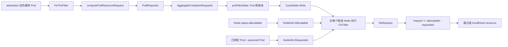

# 第 09 课：game-api 主容器只写了 1200m，scheduler 为什么按整个 Pod 的 2000m 算账

> 从一次 Java Pod 的 `Insufficient cpu`，读懂最终 Pod、资源并发模型、`CycleState` 和 NodeResourcesFit 的两本账。

你在平台现场很容易遇到这种争论：

```text
应用团队：game-api 明明只申请了 1200m，Node 还剩 1500m，为什么放不下？
平台团队：Event 说 Insufficient cpu，但 kubectl top 看机器又不忙。
```

如果只背一句“scheduler 看 requests”，这个故障仍然解释不完整。真正需要回答的是：

- scheduler 到底看 Deployment、Helm values，还是最终 Pod？
- 一个 Pod 里有 app、sidecar、init container 和 RuntimeClass overhead 时，request 为什么不能直接全部相加？
- 同一个 Pod 要试很多 Node，为什么 Pod request 只计算一次？
- Node 的 `requested` 从哪里来，尚未完成 Bind 的 Pod 算不算？
- `Insufficient cpu` 是怎样从一个不等式变成 Filter 结果的？

本课的学习顺序是：

```text
先摆出 Java 发布现场的矛盾
  -> 推导资源核算必须遵守的设计不变量
  -> 在白板上手算 2000m/2Gi
  -> 沿当前仓库源码验证 Pod 侧账本
  -> 再验证 Node 侧账本和 Filter 不等式
  -> 最后回到生产证据与 GPU 短映射
```

整章只有一个中心命题：

> **NodeResourcesFit 不是拿“主容器 request”去看哪台机器此刻最闲，而是把 admission 后的整个 Pod 折算成一份逐资源的并发承诺，再与 scheduler 内存中的 Node 可承诺余额比较。**

## 0. 本课定位与边界

这是 scheduler 资源核算的 S3 深读，不是重讲 `requests/limits` 基础，也不是 NodeResourcesFit 参数使用手册。

本课会读深：

- 为什么 scheduler 必须以 admission 后保存的 Pod 为输入；
- `AggregateContainerRequests` 怎样表达 app、普通 init 和 restartable init 的并发关系；
- `PodRequests` 为什么在容器核算后处理 Pod-level request 和 overhead；
- `computePodResourceRequest -> PreFilter -> CycleState -> Filter` 的职责边界；
- `NodeInfo.Allocatable`、`NodeInfo.Requested` 和 assumed Pod 怎样形成 Node 侧账本；
- CPU、memory 以及传统扩展资源的实际比较式；
- 本章源码中真正会卡住你的 Go 写法。

本课只建立边界、不深挖：

- LimitRanger 和 RuntimeClass admission 插件内部如何修改 Pod；
- Pod-level 原地扩缩容怎样在 spec、allocated、actuated 之间选值；
- DRA、ignored extended resources 和 NodeResourcesFit 的 Score 策略；
- 失败 Pod 何时重入队、怎样抢占；这属于第 10 课；
- Device Plugin 如何上报 GPU、kubelet 如何选择 device ID；这属于第 15～17 课。

建议分两遍读：

- **首遍抓主线：** 按 `2～5 -> 6.1～6.3 -> 7 -> 8.2～8.5 -> 9.1～9.3 -> 10（scalar/DRA 分支先跳过）-> 11～14 -> 16` 阅读；目标是独立手算 `2000m/2Gi`，讲清 `PreFilter` 与 `Filter` 为什么分开，并完成生产证据闭环。
- **二遍补边界：** 再读标有“二遍”的 6.4、9.4、9.5，以及 8.1 的内部转换、10.3 的 scalar/ignored/DRA 分支和第 15 节 Go 示例；不需要先学完一本 Go 教程。

## 1. 当前源码基线与阅读约定

```text
源码目录：<KUBERNETES_SRC>
commit：301946d15e67a4a2e8a5fb8292eb836acd366d78
describe：v1.37.0-alpha.0-280-g301946d15e6
源码 go.mod：go 1.26.0
本机 Go：go1.19.4
```

本机 Go 版本低于当前源码要求，因此本课做固定提交的静态源码核对，不伪装成已经编译验证。生产排障必须切换到目标集群对应的 tag/branch；Pod-level resources、native sidecar、原地扩缩容和 DRA 都有明显版本边界。

主文件：

```text
kubernetes/staging/src/k8s.io/component-helpers/resource/helpers.go
kubernetes/pkg/scheduler/framework/plugins/noderesources/fit.go
kubernetes/pkg/scheduler/framework/types.go
kubernetes/pkg/scheduler/framework/cycle_state.go
kubernetes/pkg/scheduler/backend/cache/cache.go
```

> **阅读约定：** 标有“教学注释版”的代码，变量名、判断顺序和返回关系来自本课固定提交；中文 `//` 是讲义新增，不是 Kubernetes 原注释。每个代码块都会说明是完整函数还是连续摘录，以及省略了哪一段；不会用占位省略号伪装成完整源码。`failureReasons...` 是源码中真实的 Go 可变参数展开，不是省略号。每条有业务意义的语句都就地解释，单独的括号不机械注释。小语法演示会明确标成“Go 示例”，不冒充 Kubernetes 源码。

## 2. 先看生产矛盾：你声明的模板，不等于 scheduler 收到的 Pod

以下是延续第 07、08 课的教学现场，结构按真实平台故障整理，不是某个用户集群的原始输出。

先把 Java 特征固定下来，避免把案例读成“随便一个 Pod 改了名字”：

| 项目 | 教学现场中的含义 |
|---|---|
| namespace / workload | `prod` / `Deployment game-api` |
| 业务进程 | Spring Boot 游戏 API；会经历冷启动类加载、JIT、GC 和流量峰值 |
| 主容器预算 | `1200m/1536Mi`；假设来自平台压测与容量评审，不是 scheduler 猜出来的 |
| JVM memory 边界 | 假设 `-Xmx=1Gi`，其余 request 还要覆盖 metaspace、线程栈、direct buffer 与 native 开销；不能把 request 机械等同于 heap |
| CPU-heavy init | `prepare-config` 解密、校验并解压游戏配置包，申请 `1900m/1024Mi` |
| 平台常驻容器 | `otel-agent` 与 Java 进程长期并发，模板漏填 request 后由 LimitRange 补齐 |
| 隔离运行时 | 教学环境用 `kata-qemu`，借此观察 RuntimeClass overhead |

这些数字是教学化的容量结论。真实服务必须用自己的启动曲线、GC/延迟、throttling 和业务峰值校准；scheduler 只消费校准后写入 Pod 的结果。

### 2.1 应用团队看到的 Deployment template

```yaml
spec:
  template:
    spec:
      runtimeClassName: kata-qemu

      initContainers:
      - name: prepare-config
        image: registry.example.com/platform/config-init:v3
        resources:
          requests:
            cpu: 1900m
            memory: 1024Mi

      containers:
      - name: game-api
        image: registry.example.com/game/game-api:v2
        resources:
          requests:
            cpu: 1200m
            memory: 1536Mi

      - name: otel-agent
        image: registry.example.com/platform/otel-agent:v1
        # 模板中没有显式 resources
```

如果应用团队只盯着 `game-api.resources.requests.cpu`，自然会得到 `1200m`。

但这个 namespace 还有一个 LimitRange：

```yaml
apiVersion: v1
kind: LimitRange
metadata:
  name: container-defaults
  namespace: prod
spec:
  limits:
  - type: Container
    defaultRequest:
      cpu: 200m
      memory: 256Mi
```

而 `kata-qemu` RuntimeClass 声明了 Pod 固定开销：

```yaml
apiVersion: node.k8s.io/v1
kind: RuntimeClass
metadata:
  name: kata-qemu
handler: kata-qemu
overhead:
  podFixed:
    cpu: 100m
    memory: 256Mi
```

这里使用 Kata 只是为了把 `spec.overhead` 讲清楚，不代表 Java Pod 都应该使用虚拟化 runtime。没有 Pod overhead 的生产 Pod，这一项就是 0。

### 2.2 admission 后真正保存的 Pod

ReplicaSet 创建 Pod 时，Pod CREATE admission 会先处理这个对象。教学现场中，最终保存并被 scheduler informer 看到的片段是：

```yaml
spec:
  runtimeClassName: kata-qemu
  overhead:
    cpu: 100m
    memory: 256Mi

  initContainers:
  - name: prepare-config
    resources:
      requests:
        cpu: 1900m
        memory: 1024Mi

  containers:
  - name: game-api
    resources:
      requests:
        cpu: 1200m
        memory: 1536Mi

  - name: otel-agent
    resources:
      requests:
        cpu: 200m
        memory: 256Mi
```

这时已经发生了两件事：

```text
LimitRange：给 otel-agent 缺失的 request 补成 200m/256Mi
RuntimeClass admission：把 podFixed 写成 Pod.spec.overhead
```

### 2.3 为什么 scheduler 不能回头猜“用户原意”

Kubernetes 必须支持很多 Pod 来源：Deployment、StatefulSet、Job、自研 controller、直接创建 Pod，以及各种 mutating admission。scheduler 如果分别读取每个上层对象再重放这些逻辑，会出现三个根本问题：

1. **输入不唯一。** 一个 Pod 可能没有 Deployment，scheduler 不能假定所有工作负载都有同一种父对象。
2. **逻辑会漂移。** admission 已经修改过 Pod；scheduler 再自行推导一遍，很可能与 API server 的最终结果不同。
3. **组件耦合。** 每新增一种 controller 或 webhook，scheduler 都要理解它，控制面就无法独立演进。

因此这里的设计选择是：

> **API server 中最终保存的 Pod 是调度契约；scheduler 只消费这份标准对象，不解释 Helm values，也不复原 Deployment template。**

代价也很现实：排障时只看 Git 仓库里的 YAML 不够，必须检查最终 Pod。这个代价换来的是控制器、admission 和 scheduler 之间清晰的责任边界。

## 3. 在读函数前，先推导六条设计不变量

函数名会变化，下面六条约束才是理解源码的骨架。

### 3.1 调度依据是资源承诺，不是瞬时使用率

Java 进程当前 CPU 低，不代表启动、JIT、GC 或业务高峰时仍然低。scheduler 需要判断 Node 已经承诺了多少资源，而不是截取某一秒的 usage。

```text
调度账本：requests
运行观测：usage
```

两者都重要，但解决的问题不同。`kubectl top` 不能推翻一次基于 request 的 `Insufficient cpu`。

### 3.2 每种资源必须独立核算

CPU 峰值可能来自 init，memory 峰值可能来自常驻 app。不能先挑一个“整体最大的容器阶段”，再把那一行同时当成所有资源的答案。

### 3.3 核算公式必须表达“哪些容器可能同时活着”

- 普通 app containers 会并行常驻，所以相加；
- 普通 init containers 按顺序运行，所以比较各阶段峰值；
- restartable init 是 native sidecar，会留在后续阶段，所以必须累计；
- Pod overhead 与容器阶段同时存在，所以在有效容器请求之后追加。

这不是任意的数学规则，而是 Pod 生命周期的并发模型。

### 3.4 同一轮中 Pod request 与候选 Node 无关

`game-api-new-x` 无论试 worker-05、06 还是 07，它自己的 request 都不变。若在每次 Filter 时重复遍历所有容器，会浪费 CPU；因此应该预计算一次，再复用多次。

### 3.5 Node 账本必须包含尚未完成 Bind 的承诺

scheduler 可能已经选中某个 Node 并开始异步 Bind。若下一轮在 API 对象更新前仍把这份资源当空闲，就可能把同一容量重复承诺给另一个 Pod。`NodeInfo.Requested` 因此包含 assumed Pods。

### 3.6 “Node 放不下”和“插件内部坏了”必须分开

资源余额不足是正常的 `Unschedulable` 结果；`CycleState` 数据缺失或类型错误则说明插件调用契约被破坏，应作为内部 Error。二者若混在一起，scheduler 会把自身故障伪装成业务容量不足。

## 4. 白板手算：2000m/2Gi 表达的是两个时间阶段的峰值

先不运行命令，也先不看 Go。把 Pod 生命周期压成两个主要阶段：

```text
阶段 A：prepare-config 普通 init 运行
        容器 request = 1900m / 1024Mi

阶段 B：game-api 与 otel-agent 同时常驻
        容器 request = (1200m + 200m) / (1536Mi + 256Mi)
                     = 1400m / 1792Mi

Pod infrastructure overhead 在两个阶段都存在
        overhead = 100m / 256Mi
```

### 4.1 常驻 containers 为什么求和

| container | CPU request | memory request | 是否与另一个 app 同时运行 |
|---|---:|---:|---|
| `game-api` | 1200m | 1536Mi | 是 |
| `otel-agent` | 200m | 256Mi | 是 |
| 常驻总和 | **1400m** | **1792Mi** | — |

### 4.2 普通 init 为什么不是再加 1900m

普通 `prepare-config` 完成后，app containers 才启动。它不会与阶段 B 长期同时运行，所以取两个阶段在每个资源维度上的最大值：

| 资源 | 阶段 A：init | 阶段 B：常驻总和 | 容器有效 request |
|---|---:|---:|---:|
| CPU | 1900m | 1400m | **1900m** |
| memory | 1024Mi | 1792Mi | **1792Mi** |

注意：CPU 取自阶段 A，memory 取自阶段 B。所谓“逐资源取最大”就是这个意思。

### 4.3 overhead 为什么最后追加

Kata VM、guest OS 或其他 Pod 基础设施不会因为 init 结束就凭空消失。它与峰值容器阶段共同占用资源：

| 资源 | 容器有效 request | overhead | 最终 Pod request |
|---|---:|---:|---:|
| CPU | 1900m | 100m | **2000m** |
| memory | 1792Mi | 256Mi | **2048Mi = 2Gi** |

于是本课的最终手算式是：

```text
regular = sum(app containers)
base    = max_per_resource(regular, each ordinary init phase)
pod     = base + overhead

CPU    = max(1200m + 200m, 1900m) + 100m = 2000m
Memory = max(1536Mi + 256Mi, 1024Mi) + 256Mi = 2048Mi
```

### 4.4 放回 Node 余额

教学现场每台候选 Node 的 scheduler 账本为：

```text
cpu allocatable = 7500m
cpu requested   = 6000m
cpu remaining   = 1500m

memory allocatable = 30Gi
memory requested   = 26Gi
memory remaining   = 4Gi
```

代入两个独立判断：

```text
CPU:    2000m > 7500m - 6000m  -> 失败
Memory: 2Gi    <= 30Gi - 26Gi   -> 通过
```

一个硬资源维度失败，这台 Node 就不再是可行 Node。Event 因而可以只出现 `Insufficient cpu`；memory 通过并不会抵消 CPU 失败。

## 5. 源码总图：先看两本账在哪里会合



文件职责可以先压缩成这张表：

| 文件 | 解决的问题 |
|---|---|
| `component-helpers/resource/helpers.go` | 整个 Pod 的 request 怎样按生命周期聚合 |
| `noderesources/fit.go` | 怎样预计算 Pod 账本，并逐 Node 判断资源是否足够 |
| `framework/types.go` | scheduler 怎样保存高频比较用的 Pod/Node 资源数据 |
| `framework/cycle_state.go` | 一次 scheduling cycle 内怎样写一次、读多次 |
| `backend/cache/cache.go` | assumed Pod 怎样提前进入 Node 账本 |

接下来严格按这条主线读，不先跳去 Score、抢占或 GPU device ID。

## 6. `AggregateContainerRequests`：真正的设计不是“加法”，而是并发阶段建模

### 6.1 `ResourceList` 是一张“资源名 -> 数量”的表

固定提交中的精确定义见 [`core/v1/types.go`](https://github.com/kubernetes/kubernetes/blob/301946d15e67a4a2e8a5fb8292eb836acd366d78/staging/src/k8s.io/api/core/v1/types.go#L6994-L7023)。下面是两个完整类型声明的教学注释版：

```go
// ResourceName 不是另一种底层存储；它仍以 string 为底层类型，
// 只是用独立类型表达“这个字符串必须是资源名”。
type ResourceName string

// ResourceList 是 map：键是 cpu、memory、nvidia.com/gpu 等资源名，
// 值是能正确处理 200m、1536Mi 等单位的 resource.Quantity。
type ResourceList map[ResourceName]resource.Quantity
```

**大白话总结：** Pod request 不是一个总数字，而是一张多维账单。CPU、memory 和扩展资源各有自己的键，后面的“求和”与“取最大”都是对每个键分别执行。

**顺手学 Go：`type` 与 `map`。** `type ResourceName string` 创建了新类型，避免把任意字符串随便混进 API；`map[K]V` 类似 Java 的 `Map<K,V>`。但 Go 的 map 遍历顺序不稳定，所以不能依赖 CPU、memory 谁先被处理；这里每个键独立运算，最终结果不依赖遍历顺序。

### 6.2 两个小函数，分别表达“同时存在”和“阶段取峰值”

完整源码见 [`helpers.go:474-492`](https://github.com/kubernetes/kubernetes/blob/301946d15e67a4a2e8a5fb8292eb836acd366d78/staging/src/k8s.io/component-helpers/resource/helpers.go#L474-L492)。下面是两个完整函数，没有删分支：

```go
// addResourceList 把 newList 的每个资源加到 list，表达“这些资源同时需要”。
func addResourceList(list, newList v1.ResourceList) {
	// name 是 cpu、memory 等键；quantity 是该键的新数量。
	for name, quantity := range newList {
		// 同时读取旧值，并用 ok 判断这个键此前是否存在。
		if value, ok := list[name]; !ok {
			// 首次出现时深拷贝，避免结果 map 与 Pod 原始 Quantity 共用内部数据。
			list[name] = quantity.DeepCopy()
		} else {
			// 键已存在：把新数量加到旧值的局部副本上。
			value.Add(quantity)
			// map 的 value 取出后不是可直接寻址字段，要把更新后的副本写回。
			list[name] = value
		}
	}
}

// maxResourceList 对 newList 中的每个资源分别取较大值，表达“阶段峰值”。
func maxResourceList(list, newList v1.ResourceList) {
	// 仍然逐资源处理，不存在一个跨 CPU/memory 的“整体最大容器”。
	for name, quantity := range newList {
		// 键不存在，或新 Quantity 大于旧 Quantity 时，才更新峰值。
		if value, ok := list[name]; !ok || quantity.Cmp(value) > 0 {
			// 同样深拷贝，保护输入对象不被后续修改连带影响。
			list[name] = quantity.DeepCopy()
		}
	}
}
```

把两个函数翻译成白板公式：

```text
addResourceList：result[r] = result[r] + new[r]
maxResourceList：result[r] = max(result[r], new[r])
```

**大白话总结：** `add` 回答“这两组东西会不会同时运行”，`max` 回答“这些互斥阶段中至少要扛住哪个峰值”。源码并不是随意选择加法或最大值，选择依据来自生命周期。

**顺手学 Go：`value, ok := map[key]`。** 这叫 map 的 comma-ok 读取。键不存在时，`value` 会拿到零值，`ok=false`。`!ok || ...` 使用短路运算：若键不存在，就不会再比较一个无意义的旧值。

### 6.3 常驻 containers：逐个相加

完整函数很长，本段是 [`AggregateContainerRequests` 的连续摘录 193-229 行](https://github.com/kubernetes/kubernetes/blob/301946d15e67a4a2e8a5fb8292eb836acd366d78/staging/src/k8s.io/component-helpers/resource/helpers.go#L193-L229)：从函数入口到常驻容器循环结束，未拼接后文。status resize、缺失 request 回填和回调分支都保留；本课 incoming Pod 路径的选项让这些旁支不执行。

```go
// AggregateContainerRequests 聚合一个 Pod 内所有容器阶段的 request。
func AggregateContainerRequests(pod *v1.Pod, opts PodResourcesOptions) v1.ResourceList {
	// 若调用者提供可复用 map 就清空复用，否则创建空 ResourceList。
	// 本课 PreFilter 没传 Reuse，所以从空表开始。
	reqs := reuseOrClearResourceList(opts.Reuse)

	// 只有原地扩缩容等路径才需要按容器名查 PodStatus；本课为 nil。
	var containerStatuses map[string]*v1.ContainerStatus
	if opts.UseStatusResources {
		// [旁读] 预分配 status 索引，容量是普通与 init status 数量之和。
		containerStatuses = make(map[string]*v1.ContainerStatus, len(pod.Status.ContainerStatuses)+len(pod.Status.InitContainerStatuses))
		// [旁读] 用容器名索引常驻容器 status。
		for i := range pod.Status.ContainerStatuses {
			containerStatuses[pod.Status.ContainerStatuses[i].Name] = &pod.Status.ContainerStatuses[i]
		}
		// [旁读] 用容器名索引 init container status。
		for i := range pod.Status.InitContainerStatuses {
			containerStatuses[pod.Status.InitContainerStatuses[i].Name] = &pod.Status.InitContainerStatuses[i]
		}
	}

	// 按 spec.containers 遍历 game-api、otel-agent 等常驻容器。
	for _, container := range pod.Spec.Containers {
		// 默认以 spec 中最终保存的 requests 为当前容器输入。
		containerReqs := container.Resources.Requests
		if opts.UseStatusResources {
			// [旁读] 若启用原地扩缩容，从索引里找同名容器状态。
			cs, found := containerStatuses[container.Name]
			if found && cs.Resources != nil {
				// [旁读] 在 spec、已执行值和已分配值之间选有效 request。
				containerReqs = determineEffectiveRequests(pod, &ResourceState{
					Spec:      container.Resources.Requests,
					Actuated:  cs.Resources.Requests,
					Allocated: cs.AllocatedResources,
				})
			}
		}

		// [旁读] 某些调用者会为缺失键补非零默认；本课该 map 为空。
		if len(opts.NonMissingContainerRequests) > 0 {
			containerReqs = applyNonMissing(containerReqs, opts.NonMissingContainerRequests)
		}

		// [旁读] 若调用者提供回调，就把本容器的有效 request 交给它。
		if opts.ContainerFn != nil {
			opts.ContainerFn(containerReqs, Containers)
		}

		// 主干：把每个常驻容器逐资源加入 reqs。
		addResourceList(reqs, containerReqs)
	}
```

对主案例，这个循环就是：

```text
第一次 add：{} + game-api   = 1200m / 1536Mi
第二次 add：上一步 + otel-agent = 1400m / 1792Mi
```

**大白话总结：** `spec.containers` 不区分“主容器”和“我觉得不重要的 sidecar”。只要它们可能共同常驻，request 就都进入求和。平台自动注入的 agent 也不会因为不是业务代码就免费。

**顺手学 Go：`for _, container := range slice`。** `_` 表示明确丢弃下标，只要元素值。这里遍历的是 slice，顺序稳定；但常驻容器只做可交换的加法，因此顺序不影响结果。`opts.ContainerFn != nil` 则是在调用函数字段前防止 nil 调用。

### 6.4 【二遍】init containers：必须按声明顺序构造每一个可并发阶段

下面是同一函数的[连续摘录 231-279 行](https://github.com/kubernetes/kubernetes/blob/301946d15e67a4a2e8a5fb8292eb836acd366d78/staging/src/k8s.io/component-helpers/resource/helpers.go#L231-L279)，从两个 init 账本初始化到把 init 峰值并入总账。后面的 DRA ResourceClaim status 分支没有拼入；本课 PreFilter 也没有启用该选项。

```go
	// 保存“已经启动且会继续运行”的 restartable init 累计值。
	restartableInitContainerReqs := v1.ResourceList{}
	// 保存所有 init 阶段逐资源出现过的最大值。
	initContainerReqs := v1.ResourceList{}

	// 按 spec.initContainers 的声明顺序遍历；这里的顺序具有生命周期意义。
	for _, container := range pod.Spec.InitContainers {
		// 默认读取最终 Pod spec 中该 init container 的 request。
		containerReqs := container.Resources.Requests
		if opts.UseStatusResources {
			// [旁读] 只有 restartPolicy=Always 的 native sidecar 才可能读取 status 资源。
			if container.RestartPolicy != nil && *container.RestartPolicy == v1.ContainerRestartPolicyAlways {
				cs, found := containerStatuses[container.Name]
				if found && cs.Resources != nil {
					// [旁读] 为原地 resize 选择有效 request。
					containerReqs = determineEffectiveRequests(pod, &ResourceState{
						Spec:      container.Resources.Requests,
						Actuated:  cs.Resources.Requests,
						Allocated: cs.AllocatedResources,
					})
				}
			}
		}

		// [旁读] 根据调用选项补齐缺失资源键；本课不执行。
		if len(opts.NonMissingContainerRequests) > 0 {
			containerReqs = applyNonMissing(containerReqs, opts.NonMissingContainerRequests)
		}

		// restartPolicy 指针非 nil 且值为 Always，说明这是会继续运行的 native sidecar。
		if container.RestartPolicy != nil && *container.RestartPolicy == v1.ContainerRestartPolicyAlways {
			// 它最终会和 app containers 同时运行，所以先加入常驻总账 reqs。
			addResourceList(reqs, containerReqs)

			// 也加入“此前仍存活的 restartable init”累计账本。
			addResourceList(restartableInitContainerReqs, containerReqs)
			// 当前 sidecar 启动阶段的用量，就是截至当前的 sidecar 累计值。
			containerReqs = restartableInitContainerReqs
		} else {
			// 普通 init 只在自己的阶段运行，先创建本阶段临时账本。
			tmp := v1.ResourceList{}
			// 加入当前普通 init 自己的 request。
			addResourceList(tmp, containerReqs)
			// 再加入它之前已经启动、仍然存活的 restartable init。
			addResourceList(tmp, restartableInitContainerReqs)
			// 当前可并发阶段就是“当前普通 init + 此前 sidecars”。
			containerReqs = tmp
		}

		// [旁读] 把当前 init 阶段结果交给可选回调。
		if opts.ContainerFn != nil {
			opts.ContainerFn(containerReqs, InitContainers)
		}
		// 对当前阶段逐资源更新 init 峰值。
		maxResourceList(initContainerReqs, containerReqs)
	}

	// 常驻总账与 init 阶段峰值再逐资源取最大。
	maxResourceList(reqs, initContainerReqs)
```

主案例没有 `restartPolicy: Always`，所以 `restartableInitContainerReqs` 一直为空，公式自然退化为：

```text
max_per_resource(sum(app containers), each ordinary init)
```

但在有 native sidecar 时，不能背这个简化式。准确公式是：

```text
app(r)       = 所有 spec.containers 的 request(r) 之和
before(i,r)  = 下标小于 i 的 restartable init request(r) 之和
phase(i,r)   = before(i,r) + 第 i 个 init 的 request(r)
steady(r)    = app(r) + 所有 restartable init request(r) 之和
result(r)    = max(steady(r), 所有 phase(i,r))
```

例如只看 CPU，声明顺序是：

```text
sidecar-A(Always)=100m
ordinary-B=800m
sidecar-C(Always)=200m
ordinary-D=600m
app containers=700m

A 启动阶段：100m
B 阶段：100m + 800m = 900m
C 启动阶段：100m + 200m = 300m
D 阶段：100m + 200m + 600m = 900m
最终常驻：700m + 100m + 200m = 1000m
有效 CPU request：max(100, 900, 300, 900, 1000) = 1000m
```

后出现的 `sidecar-C` 不会“穿越时间”加到此前 B 的阶段里，这就是源码为什么必须按 slice 顺序遍历。

**大白话总结：** 普通 init 不是简单“取最大的那一个”，而是取每个真实启动阶段的峰值；native sidecar 会留在后续阶段，必须累积。主案例的简式正确，是因为它没有 restartable init。

**顺手学 Go：指针、解引用与短路。** `RestartPolicy` 是指针，`container.RestartPolicy != nil && *container.RestartPolicy == ...` 会先判断非空；若为空，`&&` 右侧不执行，因而不会解引用 nil。`containerReqs = restartableInitContainerReqs` 是让局部变量指向同一张 map，不是在此处复制整张 map。

## 7. `PodRequests`：容器聚合之后，为什么还要覆盖和追加

完整源码见 [`helpers.go:151-187`](https://github.com/kubernetes/kubernetes/blob/301946d15e67a4a2e8a5fb8292eb836acd366d78/staging/src/k8s.io/component-helpers/resource/helpers.go#L151-L187)。下面是完整函数的教学注释版：

```go
// PodRequests 返回整个 Pod 在各资源维度上的有效 request。
func PodRequests(pod *v1.Pod, opts PodResourcesOptions) v1.ResourceList {
	// 先准备空结果；后续可能被容器聚合结果替换。
	reqs := v1.ResourceList{}
	// 默认不跳过 container-level resources，因此先执行上一节的并发阶段核算。
	if !opts.SkipContainerLevelResources {
		reqs = AggregateContainerRequests(pod, opts)
	}

	// [二遍旁读] feature 开启、调用者未跳过、而且 Pod 确实写了受支持的 Pod-level request 时进入。
	if !opts.SkipPodLevelResources && IsPodLevelRequestsSet(pod) {
		// 默认没有 status 生效值；incoming Pod 路径保持 nil。
		var effectiveReqs v1.ResourceList
		if opts.InPlacePodLevelResourcesVerticalScalingEnabled && opts.UseStatusResources {
			// [旁读] 只有 status 中存在 Pod-level resources 时才选择 resize 有效值。
			if pod.Status.Resources != nil {
				effectiveReqs = determineEffectiveRequests(pod, &ResourceState{
					Spec:      pod.Spec.Resources.Requests,
					Actuated:  pod.Status.Resources.Requests,
					Allocated: pod.Status.AllocatedResources,
				})
			}
		}

		// 遍历 Pod-level requests 中显式出现的每个资源键。
		for resourceName, quantity := range pod.Spec.Resources.Requests {
			// 只处理当前实现支持的 CPU、memory 和 hugepages-*。
			if IsSupportedPodLevelResource(resourceName) {
				// 对这个键覆盖此前 container 聚合值，不是把整张 map 清空。
				reqs[resourceName] = quantity
				if effectiveReqs != nil {
					// [旁读] resize 路径用生效中的值再次覆盖同一键。
					reqs[resourceName] = effectiveReqs[resourceName]
				}
			}
		}
	}

	// 公共 helper 允许调用者排除 overhead；本课 scheduler 路径没有排除。
	if !opts.ExcludeOverhead && pod.Spec.Overhead != nil {
		// 把 Pod 基础设施开销逐资源加到已经得到的有效请求上。
		addResourceList(reqs, pod.Spec.Overhead)
	}

	// 返回最终 ResourceList，交给 scheduler 转成高频比较结构。
	return reqs
}
```

对主案例，函数实际经过的路径是：

```text
AggregateContainerRequests -> 1900m/1792Mi
Pod 没写 Pod-level resources -> 覆盖分支不进入
ExcludeOverhead=false 且 spec.overhead 非 nil
addResourceList(overhead) -> 2000m/2048Mi
```

Pod-level resources 需要特别防止三种误读：

1. 它是**按显式资源键覆盖**；Pod-level 只写 CPU 时，container 聚合出的 memory 仍保留。
2. 当前固定源码支持 CPU、memory 和 `hugepages-*`，不是任意扩展资源。
3. 这是有 feature gate 和版本边界的分支；主案例未使用，不要拿当前 master 行为硬套旧集群。

**大白话总结：** `AggregateContainerRequests` 先回答“容器生命周期需要多少”；`PodRequests` 再应用 Pod 自己的资源边界，并在本课 scheduler 调用选项下最后加 overhead。`SetMaxResource` 并不负责重新计算 init 峰值。

**顺手学 Go：结构体零值。** `PodResourcesOptions` 按值传递。调用者没填写的 `bool` 字段自动是 `false`，map、函数和指针自动是 `nil`。所以源码注释偶尔写“nil options”时，大白话应理解成零值 `PodResourcesOptions{}`；这个参数本身不是指针，不能真的传 `nil`。

## 8. `PreFilter`：为什么 Pod 账本只算一次，却能给很多 Node 使用

### 8.1 先把通用 `ResourceList` 转成 scheduler 的高频结构

scheduler 会对大量 Node 高频比较。它没有在每次比较时反复解析 `2000m`、`2Gi`，而是使用 [`framework.Resource`](https://github.com/kubernetes/kubernetes/blob/301946d15e67a4a2e8a5fb8292eb836acd366d78/pkg/scheduler/framework/types.go#L991-L1003)：

```go
// Resource 是 scheduler 内部为高频计算准备的资源向量。
type Resource struct {
	// CPU 统一转成毫核，例如 2 CPU 变成 2000。
	MilliCPU int64
	// memory 统一转成字节数。
	Memory int64
	// ephemeral-storage 同样转成字节数。
	EphemeralStorage int64
	// Node 允许的 Pod 数单独保存为 int，减少转换。
	AllowedPodNumber int
	// GPU、hugepages 等整数型资源放在 scalar map 中。
	ScalarResources map[v1.ResourceName]int64
}
```

`computePodResourceRequest` 创建的是全零对象，再调用完整的 [`SetMaxResource`](https://github.com/kubernetes/kubernetes/blob/301946d15e67a4a2e8a5fb8292eb836acd366d78/pkg/scheduler/framework/types.go#L1088-L1107)：

```go
// SetMaxResource 对输入 ResourceList 的每个键与当前 Resource 取最大值。
func (r *Resource) SetMaxResource(rl v1.ResourceList) {
	// 方法允许 nil 接收者安全返回，避免空指针崩溃。
	if r == nil {
		return
	}

	// 逐资源键转换 Quantity；map 顺序不影响各维度结果。
	for rName, rQuantity := range rl {
		// CPU、memory、ephemeral-storage 使用专门字段。
		switch rName {
		case v1.ResourceMemory:
			// Quantity.Value() 返回基础单位字节数。
			r.Memory = max(r.Memory, rQuantity.Value())
		case v1.ResourceCPU:
			// Quantity.MilliValue() 把 CPU 转成毫核。
			r.MilliCPU = max(r.MilliCPU, rQuantity.MilliValue())
		case v1.ResourceEphemeralStorage:
			// 临时存储也使用基础单位字节数。
			r.EphemeralStorage = max(r.EphemeralStorage, rQuantity.Value())
		default:
			// 合法 scalar 资源进入 map，例如 nvidia.com/gpu。
			if schedutil.IsScalarResourceName(rName) {
				// SetScalar 内部会在 map 为 nil 时先初始化。
				r.SetScalar(rName, max(r.ScalarResources[rName], rQuantity.Value()))
			}
		}
	}
}
```

这个函数名容易造成一个误会：它**没有**再次遍历 app/init containers。容器阶段峰值早已由 `PodRequests` 算好。因为调用者此时传入一个全零 `Resource`，这里的逐维 `max(0, value)` 主要承担“Quantity -> int64 内部字段”的转换。

**大白话总结：** 上一节得到了人类可读、单位丰富的账单；这里把它压成 scheduler 适合高频算术比较的整数结构。`2000m` 最终进入 `MilliCPU=2000`，`2Gi` 进入字节数。

**顺手学 Go：匿名嵌入与内置 `max`。** 下一段的 `preFilterState` 匿名嵌入 `framework.Resource`，所以外层值能直接调用 `SetMaxResource`。当前源码工具链中的整数 `max(a,b)` 是 Go 内置函数；它与 helper 包里的 ResourceList 聚合不是同一层职责。

### 8.2 `preFilterState` 是当前 scheduling cycle 的只读便签

下面是 [`fit.go:110-118`](https://github.com/kubernetes/kubernetes/blob/301946d15e67a4a2e8a5fb8292eb836acd366d78/pkg/scheduler/framework/plugins/noderesources/fit.go#L110-L118) 的完整类型与方法：

```go
// preFilterState 是 NodeResourcesFit 在 PreFilter 算好、给 Filter 读取的状态。
type preFilterState struct {
	// 匿名嵌入 Resource，字段和方法会提升到外层。
	framework.Resource
}

// Clone 满足 CycleState 数据接口。
func (s *preFilterState) Clone() fwk.StateData {
	// 直接返回同一指针，没有深拷贝；后续必须把它当只读数据。
	return s
}
```

`Clone` 返回自身并不是“Go 自动线程安全”。它成立的前提是写入后不修改；当前 `fitsRequest` 只读这份状态。若以后在 Filter 中原地修改它，就会破坏并行 Node 检查的安全假设。

**大白话总结：** `preFilterState` 是贴在本轮调度档案上的只读资源卡片。复制调度上下文时可以共用这张卡片，是因为后续任何人都只看、不涂改。

### 8.3 `computePodResourceRequest` 只负责组装，不重新发明公式

完整函数见 [`fit.go:317-327`](https://github.com/kubernetes/kubernetes/blob/301946d15e67a4a2e8a5fb8292eb836acd366d78/pkg/scheduler/framework/plugins/noderesources/fit.go#L317-L327)：

```go
// computePodResourceRequest 计算 incoming Pod 的资源向量。
func computePodResourceRequest(pod *v1.Pod, opts ResourceRequestsOptions) *preFilterState {
	// 调用共享 helper；incoming Pod 尚未调度，本路径不使用 status resize 值。
	reqs := resource.PodRequests(pod, resource.PodResourcesOptions{
		// feature 开启时为 false，表示允许 Pod-level resources 参与。
		SkipPodLevelResources: !opts.EnablePodLevelResources,
		// 只有上层显式开启时，才把 DRA node-allocatable claim status 纳入。
		UseDRANodeAllocatableResourceClaimStatus: opts.EnableDRANodeAllocatableResources,
	})
	// 创建全零的状态对象。
	result := &preFilterState{}
	// 把 Quantity 账单转换成 MilliCPU、bytes 和 scalar int64。
	result.SetMaxResource(reqs)
	// 返回给 PreFilter 保存。
	return result
}
```

当前固定提交的 `Fit.PreFilter` 只设置 `EnablePodLevelResources`，没有设置 `EnableDRANodeAllocatableResources`；所以主路径中第二个 option 仍是 `false`。保留这个字段是函数能力，不代表本课调用一定启用它。

**大白话总结：** 这个函数是适配层：用公共 Pod 资源公式算账，再换成 scheduler 内部结构。init、sidecar、overhead 的设计不在这里重复实现，避免不同组件各算一套。

**顺手学 Go：复合字面量。** `resource.PodResourcesOptions{字段: 值}` 像 Java 创建配置对象并填写命名字段；没写的字段走零值。`&preFilterState{}` 前面的 `&` 取得新结构体地址，返回指针。

### 8.4 `PreFilter` 写一次，`Filter` 按 Node 读多次

完整 `PreFilter` 见 [`fit.go:330-335`](https://github.com/kubernetes/kubernetes/blob/301946d15e67a4a2e8a5fb8292eb836acd366d78/pkg/scheduler/framework/plugins/noderesources/fit.go#L330-L335)：

```go
// PreFilter 在本 Pod 的本次 scheduling cycle 中调用一次。
func (f *Fit) PreFilter(ctx context.Context, cycleState fwk.CycleState, pod *v1.Pod, nodes []fwk.NodeInfo) (*fwk.PreFilterResult, *fwk.Status) {
	// 计算 incoming Pod 自己的资源账本；它与候选 Node 无关。
	result := computePodResourceRequest(pod, ResourceRequestsOptions{EnablePodLevelResources: f.enablePodLevelResources})

	// 用插件专属 key 写入本轮 CycleState，供每次 Filter 复用。
	cycleState.Write(preFilterStateKey, result)
	// 第一个 nil：不预先缩小候选 Node 集；第二个 nil：PreFilter 成功。
	return nil, nil
}
```

框架的 `CycleState` 使用 `sync.Map`，源码注释明确把它定位为“write once, read many”的场景。其完整读写方法很短，见 [`cycle_state.go:152-164`](https://github.com/kubernetes/kubernetes/blob/301946d15e67a4a2e8a5fb8292eb836acd366d78/pkg/scheduler/framework/cycle_state.go#L152-L164)：

```go
// Read 按 key 读取一次 scheduling cycle 中的数据。
func (c *CycleState) Read(key fwk.StateKey) (fwk.StateData, error) {
	// Load 同时返回值和是否存在。
	if v, ok := c.storage.Load(key); ok {
		// storage 存的是接口值，这里断言为框架要求的 StateData。
		return v.(fwk.StateData), nil
	}
	// key 不存在不是“Node 不合适”，而是状态契约缺失。
	return nil, fwk.ErrNotFound
}

// Write 把插件状态存到本轮 CycleState。
func (c *CycleState) Write(key fwk.StateKey, val fwk.StateData) {
	// sync.Map.Store 支持后续并行 Filter 安全读取。
	c.storage.Store(key, val)
}
```

这解释了为何不把 `PodRequests` 放进每个 Node 的 Filter：

```text
PreFilter：与 Node 无关的 Pod 计算，1 次
Filter：与 Node 相关的余额比较，N 次，可并行
```

这是性能收益，但更重要的是职责清楚：Pod 侧账本在一轮内只有一个答案，Filter 不应因候选 Node 不同而重新解释 Pod。

**大白话总结：** 先把同一份 Pod 作业算一次，再拿答案去逐台机器核对；不是每走到一台机器前都重新统计一遍容器。

### 8.5 Filter 读取失败，为什么不能伪装成 `Insufficient cpu`

完整读取函数见 [`fit.go:342-354`](https://github.com/kubernetes/kubernetes/blob/301946d15e67a4a2e8a5fb8292eb836acd366d78/pkg/scheduler/framework/plugins/noderesources/fit.go#L342-L354)：

```go
// getPreFilterState 取回 NodeResourcesFit 在本轮写入的状态。
func getPreFilterState(cycleState fwk.CycleState) (*preFilterState, error) {
	// Read 返回接口值 c，以及可能的 key-not-found 错误。
	c, err := cycleState.Read(preFilterStateKey)
	if err != nil {
		// 包装原错误并保留错误链；不在这里偷偷重算。
		return nil, fmt.Errorf("error reading %q from cycleState: %w", preFilterStateKey, err)
	}

	// 把接口值断言成 NodeResourcesFit 自己的具体状态类型。
	s, ok := c.(*preFilterState)
	if !ok {
		// key 对应了错误类型，同样属于内部契约破坏。
		return nil, fmt.Errorf("%+v  convert to NodeResourcesFit.preFilterState error", c)
	}
	// key 和类型都正确，返回只读状态。
	return s, nil
}
```

两种失败都不是容量事实：

```text
key 不存在 -> PreFilter 可能未按契约执行
类型不正确 -> 同一个 key 放了错误的数据
```

后面的 `Filter` 会用 `fwk.AsStatus(err)` 把它作为内部 Error 返回，而不是 `Unschedulable`。

**大白话总结：** `CycleState` 像这一次调度考试的草稿纸。草稿上写着 `2000m/2Gi`，每台 Node 都读同一答案；草稿丢了说明考试流程出错，不等于某台 Node 资源不够。

**顺手学 Go：接口类型断言与 `%w`。** `c.(*preFilterState)` 是把接口还原成具体指针类型；`, ok` 形式避免断言失败时 panic。`fmt.Errorf(... %w, err)` 会包装并保留原错误链，便于上层识别根因。

## 9. Node 侧账本：`Allocatable` 与 `Requested` 来自两条不同的更新线

Pod 侧得到 `2000m/2Gi` 后，还缺另一半问题：`7500m` 和 `6000m` 是怎样进入 scheduler 内存的？

### 9.1 `NodeInfo` 不是 Node API 对象的简单别名

下面是 [`NodeInfo` 从类型开头到 Allocatable 的连续摘录](https://github.com/kubernetes/kubernetes/blob/301946d15e67a4a2e8a5fb8292eb836acd366d78/pkg/scheduler/framework/types.go#L171-L197)。后面 image、PVC、generation、DRA 等字段没有拼入本块。

```go
// NodeInfo 是 scheduler 为一台 Node 聚合的内存视图。
type NodeInfo struct {
	// 保存 API 中的 Node 对象本身。
	node *v1.Node

	// 保存 scheduler 认为已经在这台 Node 上的 Pods，包含 assumed Pod。
	Pods []fwk.PodInfo

	// Pods 的亲和性子集，供相关插件快速读取。
	PodsWithAffinity []fwk.PodInfo

	// Pods 的 required anti-affinity 子集。
	PodsWithRequiredAntiAffinity []fwk.PodInfo

	// 已占用的 host ports。
	UsedPorts fwk.HostPortInfo

	// 这台 Node 上全部 Pod 的真实 request 总和；源码注释明确包含 assumed Pods。
	Requested *Resource
	// 对缺失 CPU/memory request 应用最小值后的另一套账；不是本课 Filter 的真实 request。
	NonZeroRequested *Resource
	// 从 Node.Status.Allocatable 转换出的可承诺总量。
	Allocatable *Resource
```

这个摘录故意没有补一个假的闭合大括号，因为源码中的结构体后面还有字段；它是连续源码，不是可独立编译示例。

**大白话总结：** `NodeInfo` 是 scheduler 自己维护的“Node 工作底稿”，不仅有 API Node，还把 Pods、已承诺资源、端口等高频判断数据放在一起。

先建立“两条线”的概念：

```text
Node Add/Update -> SetNode -> Node.status.allocatable -> NodeInfo.Allocatable
Pod Add/Assume  -> AddPodInfo -> update(+1)          -> NodeInfo.Requested
Pod Remove      -> RemovePod  -> update(-1)          -> NodeInfo.Requested
```

`SetNode` 不会顺便扫描所有 Pods 重算 `Requested`，Pod 事件也不会重写 `Allocatable`。分开增量维护能避免每来一个事件都做全量聚合。

### 9.2 `SetNode` 只负责 Node 本身与 Allocatable

完整函数见 [`types.go:532-542`](https://github.com/kubernetes/kubernetes/blob/301946d15e67a4a2e8a5fb8292eb836acd366d78/pkg/scheduler/framework/types.go#L532-L542)：

```go
// SetNode 更新 NodeInfo 持有的 Node 对象和可分配资源。
func (n *NodeInfo) SetNode(node *v1.Node) {
	// 保存最新 Node API 对象。
	n.node = node
	// 只从 status.allocatable 构造 Allocatable，不读取 capacity，也不改 Requested。
	n.Allocatable = NewResource(node.Status.Allocatable)
	if utilfeature.DefaultFeatureGate.Enabled(features.NodeDeclaredFeatures) {
		// [旁读] feature 开启时映射 Node 声明的已知特性，未知项可丢弃。
		n.DeclaredFeatures = ndf.DefaultFramework.TryMap(node.Status.DeclaredFeatures)
	}
	// 标记该 NodeInfo 已变化，供 snapshot 增量更新判断。
	n.Generation = nextGeneration()
}
```

因此 Filter 使用的是 `status.allocatable`，不是硬件 `capacity`。两者之间的差额可用于 kube/system reserved 等节点开销，不能擅自当成还能分给业务 Pod 的余额。

**大白话总结：** `Capacity` 像机器物理总资产，`Allocatable` 才是节点承诺可拿给 Pods 的预算。NodeResourcesFit 的分母是后者。

**顺手学 Go：方法接收者。** `(n *NodeInfo)` 表示这个方法操作 `NodeInfo` 指针，所以对 `n.node`、`n.Allocatable` 的赋值会留在原对象中；这和 Java 实例方法修改字段相近。

### 9.3 每个 Pod 加入时，`update(+1)` 增量记账

完整 [`AddPodInfo`](https://github.com/kubernetes/kubernetes/blob/301946d15e67a4a2e8a5fb8292eb836acd366d78/pkg/scheduler/framework/types.go#L366-L375) 如下：

```go
// AddPodInfo 把一个已经解析好的 PodInfo 加入 NodeInfo。
func (n *NodeInfo) AddPodInfo(podInfo fwk.PodInfo) {
	// 先加入全部 Pods 列表。
	n.Pods = append(n.Pods, podInfo)
	if podWithAffinity(podInfo.GetPod()) {
		// 有 affinity 时，也加入对应快速索引。
		n.PodsWithAffinity = append(n.PodsWithAffinity, podInfo)
	}
	if podWithRequiredAntiAffinity(podInfo.GetPod()) {
		// 有 required anti-affinity 时，加入另一子集。
		n.PodsWithRequiredAntiAffinity = append(n.PodsWithRequiredAntiAffinity, podInfo)
	}
	// sign=1 表示把这个 Pod 的资源和其他占用加入 Node 账本。
	n.update(podInfo, 1)
}
```

完整 [`update`](https://github.com/kubernetes/kubernetes/blob/301946d15e67a4a2e8a5fb8292eb836acd366d78/pkg/scheduler/framework/types.go#L444-L467) 则把 `+1/-1` 统一为一套对称逻辑：

```go
// update 根据 sign 把 Pod 加入或从 NodeInfo 中扣除。
func (n *NodeInfo) update(podInfo fwk.PodInfo, sign int64) {
	// 取得该 Pod 已计算并可缓存的资源结果。
	podResource := podInfo.CalculateResource()
	// sign=+1 加账，sign=-1 扣账；CPU 使用毫核。
	n.Requested.MilliCPU += sign * podResource.Resource.GetMilliCPU()
	// memory 使用字节。
	n.Requested.Memory += sign * podResource.Resource.GetMemory()
	// ephemeral-storage 同样对称更新。
	n.Requested.EphemeralStorage += sign * podResource.Resource.GetEphemeralStorage()
	// 第一次遇到 scalar 资源时，先初始化可写 map。
	if n.Requested.ScalarResources == nil && len(podResource.Resource.GetScalarResources()) > 0 {
		n.Requested.ScalarResources = map[v1.ResourceName]int64{}
	}
	// GPU、hugepages 等每个 scalar 键分别加或减。
	for rName, rQuant := range podResource.Resource.GetScalarResources() {
		n.Requested.ScalarResources[rName] += sign * rQuant
	}
	// 另行维护缺失 request 被补最小值后的 CPU/memory 账。
	n.NonZeroRequested.MilliCPU += sign * podResource.Non0CPU
	n.NonZeroRequested.Memory += sign * podResource.Non0Mem

	// Pod 加入时占用端口，移除时释放端口。
	n.updateUsedPorts(podInfo.GetPod(), sign > 0)
	// 同理增减 PVC 引用计数。
	n.updatePVCRefCounts(podInfo.GetPod(), sign > 0)

	// 标记 NodeInfo 已变化。
	n.Generation = nextGeneration()

	if utilfeature.DefaultFeatureGate.Enabled(features.DRANodeAllocatableResources) {
		// [旁读] feature 开启时同步 DRA claim 状态。
		n.updateNodeAllocatableDRAClaimState(podInfo, sign)
	}
}
```

`RemovePod` 会找回 NodeInfo 中保存的旧 `PodInfo`，再调用 `update(removedPod, -1)`。使用同一份缓存结果做扣账，避免 Pod 后来发生状态变化时用另一组数字扣错账。

**大白话总结：** Node 的 `Requested` 不是每次 Filter 临时执行一遍 `kubectl describe` 得到的，而是 scheduler 随 Pod 增删持续维护的内存总账。

**顺手学 Go：用 `sign` 复用加减逻辑。** 乘以 `+1` 表示记账，乘以 `-1` 表示冲销；这样 CPU、memory、scalar 不需要各写两套函数。nil map 可以读取但不能写，所以 scalar 第一次写入前必须初始化。

### 9.4 【二遍】已调度 Pod 也复用 `PodRequests`，但调用选项不完全相同

下面是完整 [`PodInfo.CalculateResource`](https://github.com/kubernetes/kubernetes/blob/301946d15e67a4a2e8a5fb8292eb836acd366d78/pkg/scheduler/framework/types.go#L837-L878) 的教学注释版：

```go
// CalculateResource 计算并缓存 NodeInfo 中一个已分配 Pod 的资源结果。
func (pi *PodInfo) CalculateResource() fwk.PodResource {
	// 若此前已经计算，直接返回缓存值，Add/Remove 不必重复聚合。
	if pi.cachedResource != nil {
		return *pi.cachedResource
	}
	// 读取与 assigned Pod 有关的 feature gates。
	inPlacePodVerticalScalingEnabled := utilfeature.DefaultFeatureGate.Enabled(features.InPlacePodVerticalScaling)
	podLevelResourcesEnabled := utilfeature.DefaultFeatureGate.Enabled(features.PodLevelResources)
	inPlacePodLevelResourcesVerticalScalingEnabled := utilfeature.DefaultMutableFeatureGate.Enabled(features.InPlacePodLevelResourcesVerticalScaling)
	nodeAllocatableResourcesDRAEnabled := utilfeature.DefaultFeatureGate.Enabled(features.DRANodeAllocatableResources)

	// 核心仍调用共享 PodRequests，但 assigned Pod 可能需要考虑 status resize 与 DRA 状态。
	requests := resourcehelper.PodRequests(pi.Pod, resourcehelper.PodResourcesOptions{
		UseStatusResources: inPlacePodVerticalScalingEnabled,
		InPlacePodLevelResourcesVerticalScalingEnabled: inPlacePodLevelResourcesVerticalScalingEnabled,
		// gate 开启时不跳过 Pod-level resources。
		SkipPodLevelResources:                    !podLevelResourcesEnabled,
		UseDRANodeAllocatableResourceClaimStatus: nodeAllocatableResourcesDRAEnabled,
	})
	// 判断本 Pod 是否真的设置了受支持的 Pod-level request。
	isPodLevelResourcesSet := podLevelResourcesEnabled && resourcehelper.IsPodLevelRequestsSet(pi.Pod)
	// 为缺失的 CPU/memory 键准备 NonZeroRequested 使用的默认值。
	nonMissingContainerRequests := getNonMissingContainerRequests(requests, isPodLevelResourcesSet)
	// 默认 non-zero 结果与真实 requests 相同。
	non0Requests := requests
	if len(nonMissingContainerRequests) > 0 {
		// 若有缺失键，再按 NonMissingContainerRequests 计算第二份启发式账。
		non0Requests = resourcehelper.PodRequests(pi.Pod, resourcehelper.PodResourcesOptions{
			UseStatusResources: inPlacePodVerticalScalingEnabled,
			InPlacePodLevelResourcesVerticalScalingEnabled: inPlacePodLevelResourcesVerticalScalingEnabled,
			SkipPodLevelResources:                    !podLevelResourcesEnabled,
			NonMissingContainerRequests:              nonMissingContainerRequests,
			UseDRANodeAllocatableResourceClaimStatus: nodeAllocatableResourcesDRAEnabled,
		})
	}
	// 从 non-zero 账中取 CPU 与 memory。
	non0CPU := non0Requests[v1.ResourceCPU]
	non0Mem := non0Requests[v1.ResourceMemory]

	// 把真实 ResourceList 转成 scheduler Resource。
	var res Resource
	res.Add(requests)
	// 组装真实账与 non-zero 辅助账。
	podResource := fwk.PodResource{
		Resource: &res,
		Non0CPU:  non0CPU.MilliValue(),
		Non0Mem:  non0Mem.Value(),
	}
	// 缓存指针，后续读取和移除使用同一结果。
	pi.cachedResource = &podResource
	return podResource
}
```

这段要守住一个版本边界：

```text
incoming Pod 的 computePodResourceRequest：明确按“尚未调度”路径计算
NodeInfo 中 assigned Pod 的 CalculateResource：feature 开启时可能参考 status/allocated/actuated
```

二者共享容器生命周期聚合核心，但不能说所有 option 完全一样。主案例没有原地 resize、Pod-level resources 或 DRA，因此两侧都回到熟悉的 app/init/overhead 账本。

`fitsRequest` 下面会直接读取 `NodeInfo.Requested`，不是 `NonZeroRequested`。后者是为缺失 request 的其他资源策略保留的辅助账，不能拿来解释本例的 `Used=6000m`。

**大白话总结：** incoming Pod 与 Node 上已有 Pod 都使用共享的生命周期核算原则；但已有 Pod 可能经历原地 resize，所以它的读取选项和缓存边界更复杂，不能把两个入口机械说成完全相同。

### 9.5 【二遍】为什么 assumed Pod 也必须马上占账

第 08 课讲过 scheduler 先 Assume、再异步 Bind。这里补上资源账本的精确落点。

完整 [`cache.AssumePod`](https://github.com/kubernetes/kubernetes/blob/301946d15e67a4a2e8a5fb8292eb836acd366d78/pkg/scheduler/backend/cache/cache.go#L397-L410) 如下：

```go
// AssumePod 把已选中 Node、但尚未完成 API Bind 的 Pod 放进 scheduler cache。
func (cache *cacheImpl) AssumePod(logger klog.Logger, pod *v1.Pod) error {
	// GetPodKey 直接用 Pod UID 生成 cache key；UID 为空会返回错误。
	key, err := framework.GetPodKey(pod)
	if err != nil {
		return err
	}

	// 锁住 cache，保证检查和写入原子完成。
	cache.mu.Lock()
	defer cache.mu.Unlock()
	if _, ok := cache.podStates[key]; ok {
		// 同一个 Pod 已存在时拒绝重复 Assume。
		return fmt.Errorf("pod %v(%v) is in the cache, so can't be assumed", key, klog.KObj(pod))
	}

	// true 表示按 assumed 状态加入；addPod 内会调用 NodeInfo.AddPod。
	return cache.addPod(logger, pod, true)
}
```

随后固定源码中的关键检查点是：

```text
cache.addPod
  -> n.info.AddPod(pod)
  -> NodeInfo.AddPodInfo
  -> NodeInfo.update(+1)
  -> PodInfo.CalculateResource
  -> cache 中这台 Node 的 Requested 同步增加
```

下一次 scheduling cycle 开始时，`Cache.UpdateSnapshot` 根据 `Generation` 把变化同步到 Filter 使用的 `nodeInfoSnapshot`。所以准确表述是：

> Assume 成功返回前，Pod 已进入 scheduler cache 的 NodeInfo 并加账；下一轮 snapshot 更新后，后续 Pod 的 Filter 能看到这份承诺。Filter 读取 snapshot，不是每次直接锁住 cache。

Reserve、Permit、PreBind 或 Bind 等后续阶段失败时，会走 `unreserveAndForget -> ForgetPod -> RemovePod -> update(-1)` 冲销。成功 Bind 后 informer 事件会把 assumed 状态确认成已加入状态，不会把同一 Pod 重复加两次。

**大白话总结：** 银行转账还在异步落库时，scheduler 已先把额度冻结。否则两个并发发布都可能看到“还剩 2 核”，然后同时花掉同一份 CPU。

**顺手学 Go：`defer`。** `defer cache.mu.Unlock()` 表示当前函数返回前一定执行解锁；把它紧跟在 `Lock()` 后面，能减少中途错误返回忘记释放锁的风险。

## 10. `Filter`：两本账怎样变成 `Insufficient cpu`

### 10.1 `Filter` 自己不做减法，它负责状态边界与结果组装

完整函数见 [`fit.go:593-625`](https://github.com/kubernetes/kubernetes/blob/301946d15e67a4a2e8a5fb8292eb836acd366d78/pkg/scheduler/framework/plugins/noderesources/fit.go#L593-L625)：

```go
// Filter 对当前候选 Node 检查 Pod 的资源硬约束。
func (f *Fit) Filter(ctx context.Context, cycleState fwk.CycleState, pod *v1.Pod, nodeInfo fwk.NodeInfo) *fwk.Status {
	// 读取 PreFilter 已计算的 incoming Pod 账本。
	s, err := getPreFilterState(cycleState)
	if err != nil {
		// 状态缺失或类型错属于框架内部 Error，不是业务 Unschedulable。
		return fwk.AsStatus(err)
	}

	// 默认没有 DRA manager；传统 CPU/memory/GPU 主线不需要它。
	var draManager fwk.SharedDRAManager
	if f.enableDRAExtendedResource {
		// [二遍旁读] feature 开启时取得共享 DRA manager。
		draManager = f.handle.SharedDRAManager()
	}

	// 组装本次资源比较需要的 feature options。
	opts := ResourceRequestsOptions{
		EnablePodLevelResources:   f.enablePodLevelResources,
		EnableDRAExtendedResource: f.enableDRAExtendedResource,
	}

	// 真正逐资源做余额比较，返回所有不足项。
	insufficientResources := fitsRequest(s, nodeInfo, f.ignoredResources, f.ignoredResourceGroups, draManager, opts)

	// 至少有一个硬资源不足，这台 Node 就失败。
	if len(insufficientResources) != 0 {
		// 预分配与不足项数量相同的原因 slice。
		failureReasons := make([]string, 0, len(insufficientResources))
		// 默认是“释放资源后理论上可能改变”的 Unschedulable。
		statusCode := fwk.Unschedulable
		for i := range insufficientResources {
			// 保留所有不足原因，不只返回第一个。
			failureReasons = append(failureReasons, insufficientResources[i].Reason)

			if insufficientResources[i].Unresolvable {
				// 任一项超过整台 Node 总量，就升级整体状态。
				statusCode = fwk.UnschedulableAndUnresolvable
			}
		}

		// failureReasons... 把 slice 展开成可变参数；这是 Go 语法，不是省略源码。
		return fwk.NewStatus(statusCode, failureReasons...)
	}
	// nil *Status 在调度框架中表示 Success，这台 Node 通过本插件。
	return nil
}
```

**大白话总结：** `Filter` 像结果翻译层。它先确保草稿纸正常，再把 `fitsRequest` 的结构化不足项翻译成 scheduler status。资源不够、状态损坏和成功三条路不会混在一起。

**顺手学 Go：slice、`append` 和可变参数展开。** `make([]string, 0, n)` 创建长度 0、容量 n 的 slice；容量只是减少扩容，不代表已经有 n 个元素。`append` 返回更新后的 slice，必须接回变量。`failureReasons...` 把 `[]string` 展开给 variadic 参数。

### 10.2 一个不足项不只有一段字符串

完整结构体见 [`fit.go:629-641`](https://github.com/kubernetes/kubernetes/blob/301946d15e67a4a2e8a5fb8292eb836acd366d78/pkg/scheduler/framework/plugins/noderesources/fit.go#L629-L641)：

```go
// InsufficientResource 描述某个资源维度为何放不下。
type InsufficientResource struct {
	// 失败资源名，例如 cpu、memory、nvidia.com/gpu。
	ResourceName v1.ResourceName
	// 给用户和上层使用的原因字符串。
	Reason string
	// incoming Pod 在该维度需要多少。
	Requested int64
	// NodeInfo 已承诺了多少。
	Used int64
	// NodeInfo 可承诺总量是多少。
	Capacity int64
	// incoming 自己是否已经超过整台 Node 的总量。
	Unresolvable bool
}
```

`Capacity` 这个字段名在结构体里沿用通用说法，但赋值来自 `NodeInfo.Allocatable`，不是 `Node.Status.Capacity`。排障时不要因为字段名就把两个 API 数字混为一谈。

**大白话总结：** 一条失败原因不是只有“CPU 不够”五个字，还保留了新 Pod 要多少、Node 已承诺多少、可承诺总量多少，以及释放旧 Pod 是否在数学上可能解决。

### 10.3 `fitsRequest` 的完整判断顺序（首遍先读 CPU/memory）

下面是完整 [`fitsRequest`](https://github.com/kubernetes/kubernetes/blob/301946d15e67a4a2e8a5fb8292eb836acd366d78/pkg/scheduler/framework/plugins/noderesources/fit.go#L647-L734) 教学注释版。保留了 Pod 数、零资源快速返回、CPU、memory、ephemeral-storage、ignored extended resource、DRA delegation 和 scalar 分支；主案例只需要 CPU/memory，其他标为二遍旁读。

```go
// fitsRequest 比较 incoming Pod 与一个候选 Node 的资源账本。
func fitsRequest(podRequest *preFilterState, nodeInfo fwk.NodeInfo, ignoredExtendedResources, ignoredResourceGroups sets.Set[string], draManager fwk.SharedDRAManager, opts ResourceRequestsOptions) []InsufficientResource {
	// 预分配 4 个不足项容量；长度仍为 0，最终可能多于或少于 4。
	insufficientResources := make([]InsufficientResource, 0, 4)

	// 先检查 Node 允许的 Pod 数量，而不是 CPU/memory。
	allowedPodNumber := nodeInfo.GetAllocatable().GetAllowedPodNumber()
	if len(nodeInfo.GetPods())+1 > allowedPodNumber {
		// 当前 Pods 数再加 incoming Pod 超过上限时，记录 Too many pods。
		insufficientResources = append(insufficientResources, InsufficientResource{ // 追加一条 Pod 数不足记录。
			ResourceName: v1.ResourcePods,                   // 失败维度是 pods。
			Reason:       "Too many pods",                  // 面向上层的原因文本。
			Requested:    1,                                // incoming Pod 会新增一个名额。
			Used:         int64(len(nodeInfo.GetPods())),   // 当前已占用的 Pod 名额。
			Capacity:     int64(allowedPodNumber),          // Node 允许的 Pod 总数。
		})
	}

	// 若 incoming Pod 在所有可比较资源上都是 0，就不再做后续资源循环。
	// 注意：前面的 Pod 数量不足项仍会保留返回。
	if podRequest.MilliCPU == 0 &&
		podRequest.Memory == 0 &&
		podRequest.EphemeralStorage == 0 &&
		len(podRequest.ScalarResources) == 0 {
		return insufficientResources
	}

	// CPU request 大于 0，且超过 allocatable-requested 时失败。
	if podRequest.MilliCPU > 0 && podRequest.MilliCPU > (nodeInfo.GetAllocatable().GetMilliCPU()-nodeInfo.GetRequested().GetMilliCPU()) {
		insufficientResources = append(insufficientResources, InsufficientResource{ // 追加 CPU 不足记录。
			ResourceName: v1.ResourceCPU,                              // 失败维度是 CPU。
			Reason:       "Insufficient cpu",                         // 标准原因文本。
			Requested:    podRequest.MilliCPU,                         // incoming CPU 毫核数。
			Used:         nodeInfo.GetRequested().GetMilliCPU(),       // Node 已承诺 CPU。
			Capacity:     nodeInfo.GetAllocatable().GetMilliCPU(),     // Node 可承诺 CPU 总量。
			// 只有 incoming 本身大于整台 Node allocatable，释放现有 Pod 也无济于事。
			Unresolvable: podRequest.MilliCPU > nodeInfo.GetAllocatable().GetMilliCPU(), // 抢占是否数学上无解。
		})
	}
	// memory 使用完全相同的不变量，单位已经统一成字节。
	if podRequest.Memory > 0 && podRequest.Memory > (nodeInfo.GetAllocatable().GetMemory()-nodeInfo.GetRequested().GetMemory()) {
		insufficientResources = append(insufficientResources, InsufficientResource{ // 追加 memory 不足记录。
			ResourceName: v1.ResourceMemory,                          // 失败维度是 memory。
			Reason:       "Insufficient memory",                     // 标准原因文本。
			Requested:    podRequest.Memory,                          // incoming memory 字节数。
			Used:         nodeInfo.GetRequested().GetMemory(),        // Node 已承诺 memory。
			Capacity:     nodeInfo.GetAllocatable().GetMemory(),      // Node 可承诺 memory 总量。
			Unresolvable: podRequest.Memory > nodeInfo.GetAllocatable().GetMemory(), // 是否超过整台 Node。
		})
	}
	// [二遍旁读] ephemeral-storage 也按 allocatable-requested 比较。
	if podRequest.EphemeralStorage > 0 &&
		podRequest.EphemeralStorage > (nodeInfo.GetAllocatable().GetEphemeralStorage()-nodeInfo.GetRequested().GetEphemeralStorage()) {
		insufficientResources = append(insufficientResources, InsufficientResource{ // 追加临时存储不足记录。
			ResourceName: v1.ResourceEphemeralStorage,                              // 失败维度。
			Reason:       "Insufficient ephemeral-storage",                         // 标准原因文本。
			Requested:    podRequest.EphemeralStorage,                               // incoming 字节数。
			Used:         nodeInfo.GetRequested().GetEphemeralStorage(),             // Node 已承诺量。
			Capacity:     nodeInfo.GetAllocatable().GetEphemeralStorage(),           // Node 可承诺总量。
			Unresolvable: podRequest.GetEphemeralStorage() > nodeInfo.GetAllocatable().GetEphemeralStorage(), // 是否超过整台 Node。
		})
	}

	// [二遍/GPU] 遍历 hugepages、传统 extended resources 等 scalar 键。
	for rName, rQuant := range podRequest.ScalarResources {
		// request 为 0 的 scalar 不需要检查。
		if rQuant == 0 {
			continue
		}

		// extended resource 可能被 scheduler profile 配置为忽略。
		if v1helper.IsExtendedResourceName(rName) {
			// 资源组是斜杠前的域名部分，例如 nvidia.com。
			var rNamePrefix string // 保存资源域名前缀，默认空字符串。
			if ignoredResourceGroups.Len() > 0 {
				rNamePrefix = strings.Split(string(rName), "/")[0] // 取斜杠前的资源组。
			}
			// 名称或资源组被显式忽略时，由其他机制负责，不在这里拒绝。
			if ignoredExtendedResources.Has(string(rName)) || ignoredResourceGroups.Has(rNamePrefix) {
				continue // 当前资源由 profile 配置为忽略。
			}
		}

		// [二遍旁读] 若该资源应委托给 DRA，这里跳过传统 scalar 比较。
		if shouldDelegateResourceToDRA(rName, nodeInfo, draManager, opts) {
			continue // 当前资源改由 DRA 路径处理。
		}
		// 传统 scalar 主线仍使用 incoming > allocatable-requested。
		if rQuant > (nodeInfo.GetAllocatable().GetScalarResources()[rName] - nodeInfo.GetRequested().GetScalarResources()[rName]) {
			insufficientResources = append(insufficientResources, InsufficientResource{ // 追加 scalar 不足记录。
				ResourceName: rName,                                                     // 保留原资源名。
				Reason:       fmt.Sprintf("Insufficient %v", rName),                     // 动态生成原因。
				Requested:    podRequest.ScalarResources[rName],                          // incoming scalar 数量。
				Used:         nodeInfo.GetRequested().GetScalarResources()[rName],        // Node 已承诺数量。
				Capacity:     nodeInfo.GetAllocatable().GetScalarResources()[rName],      // Node 可承诺总量。
				Unresolvable: rQuant > nodeInfo.GetAllocatable().GetScalarResources()[rName], // 是否超过整台 Node。
			})
		}
	}

	// 返回所有不足维度；空 slice 表示资源检查全部通过。
	return insufficientResources
}
```

把主干统一写成不变量：

```text
对任意资源 r：

incomingPodRequest[r] <= nodeAllocatable[r] - nodeRequested[r]
  -> 该资源维度通过

incomingPodRequest[r] > nodeAllocatable[r] - nodeRequested[r]
  -> 记录 InsufficientResource
```

这里用的是严格大于 `>`。若 incoming 恰好等于剩余量，可以通过这一维度；调度后余额正好变成 0。

还有一个日志边界：CPU、memory、ephemeral-storage 的检查顺序由源码固定，但多个 scalar resource 来自 Go map 遍历，原因字符串的相对顺序不能当成稳定 API。排障应按资源名集合判断，不要写依赖第几个 reason 的自动化。

**大白话总结：** NodeResourcesFit 没有预测 Java 进程下一秒会跑多少，也没有把所有资源折成一个总分。它只是逐格检查：新承诺加上旧承诺，是否会超过这台 Node 对 Pods 的预算。

**顺手学 Go：early return、`continue` 与 map 零值。** early return 让全零请求跳过无意义比较；`continue` 只跳过当前 scalar 键。读取 nil map 或不存在键会得到元素零值，所以 Node 没有某个传统扩展资源键时，allocatable 读取为 0；但向 nil map 写值才会 panic。

### 10.4 把 `game-api` 的数字逐字段代回结构体

CPU 分支会得到：

```text
Requested    = podRequest.MilliCPU                 = 2000
Used         = nodeInfo.Requested.MilliCPU         = 6000
Capacity     = nodeInfo.Allocatable.MilliCPU       = 7500
Unresolvable = 2000 > 7500                         = false

是否不足：2000 > 7500 - 6000
          2000 > 1500
          true
Reason = "Insufficient cpu"
```

`Unresolvable=false` 只说明“如果能释放足够 CPU，这台规格的 Node 理论上能容纳它”。它不保证现场存在低优先级 victim，也不保证抢占一定成功；第 10 课再讲这些条件。

memory 分支则是：

```text
2Gi > 30Gi - 26Gi
2Gi > 4Gi
false
```

因此 memory 不追加失败项。三台 Node 账本相同，就形成三个 `Insufficient cpu` 结果；全部 Node 都被 Filter 淘汰后，外层调度流程才汇总成 FailedScheduling 证据。

### 10.5 两个反事实，检验是否真的读懂了源码

反事实一：把普通 init CPU 从 `1900m` 改成 `1300m`，其他不变。

```text
Pod CPU = max(1400m, 1300m) + 100m = 1500m
Node remaining = 1500m
1500m > 1500m = false
```

CPU 恰好相等会通过，因为源码不是 `>=`。

反事实二：Pod 最终 CPU request 是 `8000m`，Node allocatable 是 `7500m`。

```text
8000m > 7500m - used -> Insufficient cpu
8000m > 7500m        -> Unresolvable=true
```

此时就算把该 Node 上其他可释放 request 全部降到 0，单靠抢占也放不下这个 Pod。`Filter` 会把整体 status 升为 `UnschedulableAndUnresolvable`；这并不等于永远不能调度，新增更大 Node 或修改 Pod request 仍可能改变结果。

## 11. 回到 Java 生产现场：现在才用证据验证每一个变量

前面已经从设计和源码推出结论，现在命令的作用是验证变量，不是靠试命令碰运气。

### 11.1 先按责任层判断，这是不是 scheduler 问题

```powershell
# 只读：确认 Pod 已存在、尚未分配 Node。
kubectl get pod game-api-new-x -n prod -o wide

# 只读：查看 PodScheduled condition 与最近 Event。
kubectl describe pod game-api-new-x -n prod
```

教学现场预期的关键证据是：

```text
STATUS=Pending
NODE=<none>
PodScheduled=False
Reason=Unschedulable
Event 包含 Insufficient cpu
```

这组证据把责任停在 scheduler。若 Pod 已有 Node、卡在 `ContainerCreating`，就不该继续拿 `fitsRequest` 解释；应切到第 11、12 课的 kubelet/CRI 链路。

如果 Pod 根本没有创建出来，要先看 ReplicaSet/Deployment Event 与 admission 拒绝；ResourceQuota 或 LimitRange 拒绝 Pod CREATE，不会生成本课这个 `NODE=<none>` 的 Pod 现场。

### 11.2 验证 scheduler 的真正输入：最终 Pod，不是模板

```powershell
# 只读：对照用户声明的 Deployment template。
kubectl get deployment game-api -n prod -o yaml

# 只读：查看 admission 后实际保存的 Pod。
kubectl get pod game-api-new-x -n prod -o yaml

# 只读：检查 namespace 默认 request 的来源。
kubectl get limitrange container-defaults -n prod -o yaml

# 只读：检查 Pod overhead 的来源。
kubectl get runtimeclass kata-qemu -o yaml
```

最终 Pod 中优先找：

```text
spec.containers[].resources.requests
spec.initContainers[].resources.requests
spec.resources.requests                 # 当前版本的 Pod-level 分支
spec.runtimeClassName
spec.overhead
metadata.annotations["kubernetes.io/limit-ranger"]
```

annotation 能帮助解释默认值来源，但不是所有 mutating webhook 都必须用同一种 annotation 记录修改。真正的调度输入仍是最终字段本身。

### 11.3 验证 Node 的 API 侧预算与稳态 request 汇总

```powershell
# 只读：区分 Capacity 与 Allocatable。
kubectl get node worker-05 -o jsonpath='{.status.capacity.cpu}{"\t"}{.status.allocatable.cpu}{"\n"}'

# 只读：查看 API 可见的已绑定 Pods 汇总和 Allocated resources。
kubectl describe node worker-05

# 只读：实时 usage 只用来判断运行负载，不用于推翻 request Filter。
kubectl top node worker-05
```

`kubectl describe node` 的 `Allocated resources` 很适合稳态排障，但它不是某一纳秒 scheduler snapshot 的调试转储。短暂窗口中：

```text
scheduler 已 Assume
  -> cache NodeInfo.Requested 已加账
  -> 下一轮 snapshot 可见
  -> API Bind 可能尚未完成
  -> kubectl 侧暂时看不到这个 Pod 已绑定
```

所以遇到几百毫核的瞬时对不上，先比较 Pod UID、Event 时间、scheduler 日志时间和 API 对象版本，不要立刻断言 scheduler 算错。

### 11.4 每份证据能证明什么，不能证明什么

| 要验证的变量 | 主要证据 | 能证明 | 不能证明 |
|---|---|---|---|
| 用户原始声明 | Deployment/Helm 渲染结果 | 应用交付时写了什么 | admission 后 scheduler 最终看到什么 |
| 最终 Pod request | Pod YAML | 容器、init、Pod-level、overhead 的实际输入 | scheduler 某一时刻的 Node snapshot |
| 默认值来源 | LimitRange、相关 annotation | namespace 默认规则及常见修改痕迹 | 所有 webhook 的完整执行历史 |
| overhead 来源 | RuntimeClass 与 Pod `spec.overhead` | 固定开销配置和最终写入值 | runtime 实际瞬时开销一定等于该估算 |
| 最近调度失败 | `PodScheduled` condition、Event | 最近一轮为何没有选中 Node | 所有历史尝试及每个插件内部数据 |
| Node API 预算 | Node `status.allocatable` | API 中可分给 Pods 的总预算 | scheduler snapshot 当时是否另有 assumed Pod |
| 稳态已分配 request | `describe node` | API 可见已绑定 Pods 的聚合 | 异步 Bind 窗口中的精确内存账 |
| 实时资源使用 | Metrics API / `kubectl top` | 当前观测到的 usage | NodeResourcesFit 是否应基于 request 放行 |

上面命令均为只读，但 Event 有聚合、过期和重复计数语义；不要把一条 Event 文本当作永久审计日志或稳定编程 API。

### 11.5 按源码公式手工复算，而不是只相信百分比

对每个候选 Node 写成同一张小表：

| 资源 | incoming Pod | Node Allocatable | Node Requested | 剩余 | 结果 |
|---|---:|---:|---:|---:|---|
| CPU | 2000m | 7500m | 6000m | 1500m | 失败 |
| memory | 2Gi | 30Gi | 26Gi | 4Gi | 通过 |

生产中应保留原始 Quantity 或统一单位后再计算，不要拿 `kubectl describe node` 四舍五入后的百分比反推精确毫核。

### 11.6 用一张图收住本章的端到端闭环

```text
Deployment template 中 game-api=1200m
  -> Pod CREATE admission 补 sidecar request、写 overhead
  -> API server 保存最终 Pod
  -> PodRequests 按并发阶段算出 2000m/2Gi
  -> PreFilter 写入本轮 CycleState
  -> worker-05/06/07 分别执行 Filter
  -> 每台 Node 都满足 2000m > 7500m-6000m
  -> 各自产生 InsufficientResource{Reason: "Insufficient cpu"}
  -> 没有可行 Node，外层形成 FitError
  -> API 证据表现为 PodScheduled=False、Pending、FailedScheduling Event
```

最后把四种容易混淆的结果并排：

| 结果 | 触发条件 | 大白话 |
|---|---|---|
| `nil Status` / Success | 本插件没有不足项 | 这台 Node 通过资源硬约束 |
| `Unschedulable` | 至少一个不足项，但都可能通过释放 request 改变 | 正常业务拒绝，不是 scheduler 崩溃 |
| `UnschedulableAndUnresolvable` | 任一 incoming 资源超过该 Node 整体 Allocatable | 单靠抢占这台 Node 上的 Pods 数学上也放不下 |
| internal Error | PreFilter state 缺失、类型错误等 | 插件执行契约坏了，不能伪装成容量不足 |

`Unresolvable` 仍不是“永远失败”：更大规格 Node、Node 扩容或 Pod request 变化都可能让下一轮结果不同。

## 12. 从源码返回运维决策：应该改哪一层

查清公式后，修复不等于“把 request 调小直到能发布”。不同来源对应不同责任人和代价。

### 12.1 主容器 request 偏大或偏小

对 Spring Boot 服务，应结合稳定期、启动期、JIT/GC 峰值、延迟 SLO 与 throttling 证据校准。scheduler 不读取 JVM 指标，它只消费平台最终确定的 request。

- request 明显高于经过周期验证的需求：可评估下调，提高装箱率；
- request 过低：即使更容易调度，也可能带来 CPU throttling、Node 超卖和高峰抖动；
- 不要仅因为一次发布 Pending，就把资源承诺改成实时平均 usage。

### 12.2 平台 sidecar 或 LimitRange 默认值累积

自动注入的 OTel、service mesh、日志 agent 都可能与 Java 容器常驻。需要核对：

- 是否重复注入了同类 sidecar；
- sidecar 是否已有显式、经过测量的 request；
- LimitRange 的默认值是否适合所有工作负载；
- 修改 namespace 默认值会影响哪些尚未创建的 Pods。

LimitRange 不是 bug；它是在“应用漏填 request”时仍维持平台资源治理。问题若在默认策略，应治理策略，而不是假装 scheduler 应忽略被注入的字段。

### 12.3 init container 峰值让常驻阶段看起来“浪费”

普通 init 结束后，scheduler 不会立刻把有效 Pod request 从 `1900m` 降回常驻 `1400m`。这是预先为整个 Pod 建立稳定调度承诺的设计取舍：逻辑确定、安全，但可能造成长期装箱损失。

可评估：

- init 解压、校验任务是否真的需要 `1900m`；
- 大型准备工作能否在制品流水线或独立 Job 中提前完成；
- 是否应把共享准备结果放到镜像、制品仓库或持久化数据层；
- 变更架构是否会引入一致性、启动依赖与故障恢复成本。

不要为了账面变小就无条件拆分；先确认这是长期容量瓶颈，而不是一次性教学数字。

### 12.4 overhead 来自隔离方案

使用 Kata 等隔离 runtime 时，overhead 是平台安全边界的成本。选项通常是：

- 保留隔离并扩容；
- 按测量和 RuntimeClass 设计校准 overhead；
- 仅让确有隔离需求的工作负载使用该 RuntimeClass；
- 在安全团队确认后更换运行时策略。

不能在 Pod 上手工删除 admission 写入的 `spec.overhead` 来绕过真实基础设施开销。

### 12.5 发布重叠与 Node 容量

若单 Pod 账本合理，但滚动发布的 `maxSurge` 让新旧版本短时重叠，可以回到第 07 课评估：

- 调整 `maxSurge/maxUnavailable` 的可用性与容量取舍；
- 为发布预留 headroom；
- 扩容或增加合适规格的 Node；
- 使用优先级/抢占前，先确认 victim 与业务中断边界。

重入队、backoff 和抢占的源码行为放在第 10 课，本课只先利用 `Unresolvable` 判断“释放现有 request 在数学上有没有可能解决”。

### 12.6 五个常见错误直觉

| 错误直觉 | 为什么错 | 正确检查 |
|---|---|---|
| 主容器写 1200m，所以 Pod 就是 1200m | 漏掉 sidecar、init、Pod-level、overhead | 检查最终 Pod 并逐资源手算 |
| `kubectl top` 很低，应该放得下 | usage 不是 request 承诺账 | 比较 `incoming` 与 `allocatable-requested` |
| 所有 init 与 app 全部相加 | 普通 init 与 app 阶段互斥 | 按生命周期阶段逐资源取峰值 |
| 找“整体最大容器”即可 | CPU 与 memory 峰值可能来自不同阶段 | 每个资源键独立 max |
| Event 是 Insufficient cpu，scheduler 一定坏了 | 它通常是正常硬约束拒绝 | 复算结构化四字段与 cache 时间边界 |

## 13. GPU 短映射：只替换资源维度，不重讲第二遍 scheduler

传统 Device Plugin 路径中，`nvidia.com/gpu` 会进入 `Resource.ScalarResources`，复用同一个余额不变量：

```text
incomingGPU > nodeAllocatableGPU - nodeRequestedGPU
  -> Insufficient nvidia.com/gpu
```

对应关系是：

| Java CPU 主案例 | GPU 映射 |
|---|---|
| `MilliCPU=2000` | `ScalarResources["nvidia.com/gpu"]=1` |
| `2000m > remaining CPU` | `1 > remaining GPU slot` |
| `kubectl top` 低不能推翻 request 账 | `nvidia-smi` 利用率低不能证明整数 GPU 名额空闲 |
| scheduler 选择 Node | scheduler 仍只选 Node，具体 device ID 由后续 kubelet DeviceManager 处理 |

四条边界必须先记住：

1. 当前 Pod-level resources 只支持 CPU、memory、hugepages，不会用 Pod-level GPU 值覆盖 container 聚合。
2. 传统扩展资源按整数名额核算，不是 GPU 核心利用率、显存使用量或温度账。
3. Node 上是否有 `nvidia.com/gpu` Allocatable，来自 Device Plugin 等更前面的节点资源上报链；本课只消费结果。
4. 当前源码还可能按 ignored resource 配置跳过，或把某类 extended resource 委托给 DRA；不能看到 scalar 循环就断言所有 GPU 集群都走完全相同分支。

一个最小例子：

```text
Pod request nvidia.com/gpu = 1
Node allocatable GPU       = 4
Node requested GPU         = 4

1 > 4 - 4
1 > 0
-> Insufficient nvidia.com/gpu
```

即使四张卡此刻计算利用率都是 0%，传统整数资源账也没有空名额。为什么 Node 显示 4、插件怎样维护健康、kubelet 最后怎样选择 UUID，会在第 15～17 课展开。

## 14. 这一章读到什么深度才够

| 层级 | 内容 | 你的目标 |
|---|---|---|
| S3 必须掌握 | 最终 Pod、app 求和、普通 init 逐维峰值、overhead、PreFilter/CycleState、NodeInfo 两本账、CPU/memory 比较式 | 能不看答案复算生产现场，并沿固定源码讲出为什么这样设计 |
| S3 二遍掌握 | restartable init 顺序累计、assumed Pod、内部 Error、`Unresolvable`、scalar 余额 | 能解释边界案例，不把抢占或 GPU 利用率混进 Filter |
| S2 知道分支 | Pod-level 按键覆盖、NonZeroRequested、in-place resize options、ephemeral-storage | 知道何时必须切生产版本源码，不要求现在背完整实现 |
| S1 一笔带过 | DRA delegation、ignored groups、NodeDeclaredFeatures、ResourceClaim status | 能识别它们不是主案例，后续专题再深读 |
| 本章不学 | NodeResourcesFit Score、重入队、完整抢占、Device Plugin/DeviceManager | 分别交给第 08、10、15～17 课 |

对当前平台工作，前两行决定你能否把 Java Pending 从“看 Event 猜容量”提升为源码级核算；对未来 GPU 运维，真正可迁移的是资源向量、Node 余额和责任边界，不是提前背 GPU 组件名。

## 15. 附录 A：本章 Go 语法复习索引

正文已经在第一次出现时就地解释过语法。这里用于第二遍快速回查，不替代源码上下文。

| 写法 | 本章位置 | 大白话 |
|---|---|---|
| `map[K]V` | `ResourceList`、`ScalarResources` | 类似 Java `Map<K,V>`，遍历顺序不保证 |
| `value, ok := m[key]` | `addResourceList` | 同时拿值和“键是否存在” |
| `for _, x := range slice` | container/init 聚合 | 丢弃下标，只取元素；slice 顺序稳定 |
| `for k, v := range map` | ResourceList 聚合 | 逐键处理；不能依赖顺序 |
| `&T{}` / `*p` | state、restart policy | 取地址 / 解引用指针 |
| 匿名嵌入 | `preFilterState` | 外层可直接使用内层字段和方法 |
| `x, ok := i.(*T)` | `getPreFilterState` | 安全地把接口还原成具体类型 |
| `a != nil && *a == v` | restartable init | `&&` 短路保护 nil 指针 |
| `make([]T, 0, n)` | failure reasons | 长度 0、预留容量 n |
| `append(s, x)` | Pods、不足原因 | 返回增长后的 slice，要接回变量 |
| `args...` | `failureReasons...` | 把 slice 展开成可变参数，不是省略代码 |
| `defer` | cache lock | 函数退出前执行清理动作 |
| `return nil` | Filter | `nil *Status` 在框架中表示成功 |

### 15.1 Go 示例：map 的 comma-ok

下面只是语法示例，不是 Kubernetes 源码；省略 `package` 和 `import`，函数体本身可以放进 Go 包中编译：

```go
// demoMap 演示 map 的 comma-ok 读取。
func demoMap() {
	// requests 类似 ResourceList 的简化版本。
	requests := map[string]int64{"cpu": 2000}

	// cpu=2000，exists=true。
	cpu, exists := requests["cpu"]

	// gpu 键不存在时，gpu 得到 int64 零值 0，hasGPU=false。
	gpu, hasGPU := requests["nvidia.com/gpu"]

	// 明确使用变量，避免 Go 编译器报“声明但未使用”。
	fmt.Println(cpu, exists, gpu, hasGPU)
}
```

这解释了 scalar 比较为什么能直接读取不存在的资源键并得到 0；但若 map 本身为 nil，仍然不能向它写入。

**大白话总结：** comma-ok 让代码同时知道“值是多少”和“这个键是否真实存在”，适合区分首次写入与累加。

### 15.2 Go 示例：匿名嵌入带来的方法提升

下面只是语法示例；省略 `package`：

```go
// Resource 有一个方法。
type Resource struct {
	CPU int64
}

// SetCPU 修改内层字段。
func (r *Resource) SetCPU(v int64) {
	r.CPU = v
}

// State 匿名嵌入 Resource，没有写字段名。
type State struct {
	Resource
}

// demoEmbedding 演示外层直接调用提升后的方法。
func demoEmbedding() {
	// s 可以直接调用提升后的 SetCPU，不必写 s.Resource.SetCPU。
	s := &State{}
	s.SetCPU(2000)
}
```

这正是 `preFilterState` 能直接调用 `result.SetMaxResource(reqs)` 的原因。

**大白话总结：** 匿名嵌入像把内层能力提升到外层使用；它减少样板代码，但读源码时要知道方法真正定义在哪个类型上。

### 15.3 Go 示例：类型断言不能只看“长得像”

下面只是语法示例；省略 `package` 和 `import`：

```go
// AssertionState 是本示例要恢复出的具体类型。
type AssertionState struct {
	CPU int64
}

// demoAssertion 演示带 comma-ok 的类型断言。
func demoAssertion() {
	// any 可以保存任意类型；这里实际放入 *AssertionState。
	var data any = &AssertionState{CPU: 2000}

	// comma-ok 断言失败时不会 panic。
	state, ok := data.(*AssertionState)
	if !ok {
		// 类型不对时进入错误分支。
		fmt.Println("wrong state type")
		return
	}

	// 只有 ok=true 才安全使用具体字段。
	fmt.Println(state.CPU)
}
```

`CycleState` 按接口保存状态，所以读出后必须验证具体类型。key 正确但类型错误，说明内部契约出了问题。

**大白话总结：** 接口像通用盒子，类型断言是在开盒时核对标签；核对失败要返回错误，不能继续按错误类型使用。

### 15.4 Go 示例：为什么先判 nil 再解引用

下面只是语法示例；省略 `package` 和 `import`：

```go
// demoShortCircuit 演示短路判断保护 nil 指针。
func demoShortCircuit() {
	// policy 可能为空，模拟可选字段。
	var policy *string

	// 左边为 false 后，右边不会执行，因此不会解引用 nil。
	if policy != nil && *policy == "Always" {
		fmt.Println("restartable")
	}
}
```

如果颠倒成先执行 `*policy`，nil 指针就会触发 panic。

**大白话总结：** `&&` 不只是逻辑表达式，也常被 Go 源码用作安全门：先确认指针存在，再读取它指向的值。

## 16. 本章验收：先独立回答，再展开答案

### 16.1 核心问题

1. 为什么 scheduler 不读取 Helm values 或 Deployment template 重新计算 Pod request？
2. `game-api=1200m/1536Mi`、`otel-agent=200m/256Mi`、普通 init=`1900m/1024Mi`、overhead=`100m/256Mi`，最终为什么是 `2000m/2Gi`？
3. 为什么 CPU 峰值可以来自 init，而 memory 峰值来自 app containers？
4. 有 restartable init 时，为什么不能只背 `max(sum(app), max(each init))`？
5. `PodRequests` 中 Pod-level request 是整张表替换，还是逐键覆盖？overhead 是否无条件追加？
6. 为什么 `PreFilter` 计算一次、`Filter` 对每个 Node 执行？
7. `CycleState` key 缺失时为什么是内部 Error，而不是 `Unschedulable`？
8. `NodeInfo.Allocatable` 与 `NodeInfo.Requested` 分别从哪里来？
9. assumed Pod 尚未完成 Bind，为什么仍必须进入 Node request 账？Filter 是否直接读取 cache？
10. incoming=`1500m`、allocatable=`7500m`、requested=`6000m`，CPU 这一维通过还是失败？
11. `Unresolvable=true` 的精确条件是什么？它是否等于“Pod 永远无法调度”？
12. 为什么 `kubectl top node` 很低，仍可能得到 `Insufficient cpu`？
13. 在传统 GPU 扩展资源路径中，`nvidia.com/gpu` 在哪张表里比较？scheduler 此时是否选择具体 GPU UUID？

<details>
<summary>展开参考答案</summary>

1. 最终 Pod 是各类 controller 和 admission 汇合后的标准调度契约；回读上层对象会造成输入不唯一、逻辑漂移和组件耦合。
2. 常驻阶段是 `1400m/1792Mi`；与普通 init 对每个资源取最大得到 `1900m/1792Mi`；再加 overhead 得 `2000m/2048Mi`。
3. 资源向量逐键取最大，不选择一整行“最大阶段”；不同资源的峰值可以来自不同阶段。
4. restartable init 会留在后续阶段：普通 init 要加此前已启动的 restartable，最终 app 阶段要加全部 restartable，且声明顺序有意义。
5. 对受支持并显式出现的键逐键覆盖；未出现的 container 聚合键保留。公共 helper 可用 `ExcludeOverhead=true`，但本章 PreFilter 路径为 false，所以会追加 `spec.overhead`。
6. Pod request 与候选 Node 无关，适合一轮写一次；Node 余额各不相同，必须逐 Node Filter，并可并行读取只读 state。
7. 这表示插件执行顺序或状态类型契约被破坏，不是某台 Node 的容量事实。
8. Allocatable 来自 `Node.Status.Allocatable` 经 `SetNode` 转换；Requested 由 NodeInfo 随已分配/assumed Pods 的 Add/Remove 增量维护。
9. 为防止异步 Bind 窗口重复承诺同一资源。Assume 先更新 cache NodeInfo，下一轮 `UpdateSnapshot` 后 Filter 从 snapshot 读取，不是每次直接锁 cache。
10. 通过；源码判断是 `1500 > 7500-6000`，严格大于为 false。
11. `incoming request > 该 Node 的总 allocatable`。它只说明单靠释放当前 request 仍放不下，不排除更大 Node、扩容或修改 Pod 后成功。
12. usage 描述当前消耗，requests 描述已经做出的资源承诺；NodeResourcesFit 使用后者。
13. 在 `ScalarResources["nvidia.com/gpu"]` 中按整数余额比较；scheduler 这里只选 Node，设备 UUID 由 kubelet DeviceManager 后续处理。

</details>

### 16.2 两个生产推理题

**题 A：** 最终 Pod 中 app 总和为 `1800m/3Gi`，两个普通 init 分别为 `2500m/1Gi`、`900m/4Gi`，overhead 为 `100m/256Mi`。请算最终 CPU 和 memory。

**题 B：** Pod Event 是 `Insufficient cpu`，最终 Pod 算出 `2500m`，Node API 侧显示 allocatable=`8`、已绑定 Pods request 汇总约 `5500m`，但 scheduler 仍在一个短暂时刻拒绝。除“scheduler bug”外，先提出两个基于本章状态边界的检查方向。

<details>
<summary>展开推理题答案</summary>

- 题 A：CPU=`max(1800,2500,900)+100=2600m`；memory=`max(3Gi,1Gi,4Gi)+256Mi=4Gi+256Mi`。每个资源分别取最大。
- 题 B：先检查是否有已经 Assume、尚未 API Bind 的 Pod 已进入 scheduler cache/snapshot；再统一比较对象 UID、Event 与 Node describe 的时间点及单位/显示精度。也要确认最终 Pod 是否有新注入字段，而不是继续看旧 Deployment template。

</details>

### 16.3 通过标准

达到下面三条，才算本章过关：

- 不看正文，能画出 `最终 Pod -> PodRequests -> PreFilter/CycleState -> Filter -> fitsRequest`；
- 能手算主案例和题 A，并解释严格 `>`、assumed Pod 与 API 视图时差；
- 13 个核心问题至少答对 10 个，其中第 1、2、6、8、10 题必须正确。

若只会说“requests 大于剩余资源”，但说不清 request 怎样聚合、Node requested 怎样形成，还没有达到本课 S3 目标。

## 17. 源码断点、测试证据与参考资料

### 17.1 建议按这个顺序下断点或静态跟读

| 顺序 | 位置 | 重点观察变量 |
|---:|---|---|
| 1 | `Fit.PreFilter` | `pod.Spec`、feature option |
| 2 | `computePodResourceRequest` | `reqs` 与转换后的 `preFilterState` |
| 3 | `PodRequests` | container 聚合、Pod-level 覆盖前后、overhead 前后 |
| 4 | `AggregateContainerRequests` | `reqs`、`restartableInitContainerReqs`、`initContainerReqs` |
| 5 | `NodeInfo.update` | `sign`、`podResource`、Requested 加减 |
| 6 | `PodInfo.CalculateResource` | 缓存是否命中、assigned Pod 的 options |
| 7 | `Fit.Filter` | state 读取与 status 分流 |
| 8 | `fitsRequest` | incoming、Allocatable、Requested、每个不足项 |

本机 Go 1.19.4 不能构建 `go 1.26.0` 的当前 master；实际调试应准备匹配工具链，或者切到生产集群对应源码 tag。不要为了跑通而改仓库 `go.mod`。

### 17.2 固定提交的源码入口

- [`AggregateContainerRequests`](https://github.com/kubernetes/kubernetes/blob/301946d15e67a4a2e8a5fb8292eb836acd366d78/staging/src/k8s.io/component-helpers/resource/helpers.go#L193-L290)
- [`PodRequests`](https://github.com/kubernetes/kubernetes/blob/301946d15e67a4a2e8a5fb8292eb836acd366d78/staging/src/k8s.io/component-helpers/resource/helpers.go#L151-L187)
- [`addResourceList` / `maxResourceList`](https://github.com/kubernetes/kubernetes/blob/301946d15e67a4a2e8a5fb8292eb836acd366d78/staging/src/k8s.io/component-helpers/resource/helpers.go#L474-L492)
- [`computePodResourceRequest` / `PreFilter`](https://github.com/kubernetes/kubernetes/blob/301946d15e67a4a2e8a5fb8292eb836acd366d78/pkg/scheduler/framework/plugins/noderesources/fit.go#L317-L335)
- [`getPreFilterState`](https://github.com/kubernetes/kubernetes/blob/301946d15e67a4a2e8a5fb8292eb836acd366d78/pkg/scheduler/framework/plugins/noderesources/fit.go#L342-L354)
- [`Filter` / `fitsRequest`](https://github.com/kubernetes/kubernetes/blob/301946d15e67a4a2e8a5fb8292eb836acd366d78/pkg/scheduler/framework/plugins/noderesources/fit.go#L593-L734)
- [`NodeInfo.update`](https://github.com/kubernetes/kubernetes/blob/301946d15e67a4a2e8a5fb8292eb836acd366d78/pkg/scheduler/framework/types.go#L444-L467)
- [`PodInfo.CalculateResource`](https://github.com/kubernetes/kubernetes/blob/301946d15e67a4a2e8a5fb8292eb836acd366d78/pkg/scheduler/framework/types.go#L837-L878)
- [`SetMaxResource`](https://github.com/kubernetes/kubernetes/blob/301946d15e67a4a2e8a5fb8292eb836acd366d78/pkg/scheduler/framework/types.go#L1088-L1107)
- [`cache.AssumePod`](https://github.com/kubernetes/kubernetes/blob/301946d15e67a4a2e8a5fb8292eb836acd366d78/pkg/scheduler/backend/cache/cache.go#L397-L410)

### 17.3 上游测试如何保护这些不变量

当前环境因工具链不匹配未执行 Go 测试，但已静态核对下列测试入口：

- `staging/src/k8s.io/component-helpers/resource/helpers_test.go`：overhead、普通/restartable init、Pod-level 覆盖；
- `pkg/scheduler/framework/plugins/noderesources/fit_test.go`：init 峰值、相等边界、extended resource、overhead、缺失 PreFilter state 的 Error。

特别值得二遍读的测试名与区域：

```text
helpers_test.go:719-870    restartable init 的累计与顺序
helpers_test.go:1610-1975 Pod-level resources 的逐键行为
fit_test.go:223-230       init 取 max 而不是全相加
fit_test.go:271           相等边界
fit_test.go:457-466       overhead fit / not fit
fit_test.go:747-760       缺少 PreFilter state 返回 Error
```

### 17.4 官方概念与设计背景

- [Resource Management for Pods and Containers](https://kubernetes.io/docs/concepts/configuration/manage-resources-containers/)
- [Init Containers](https://kubernetes.io/docs/concepts/workloads/pods/init-containers/)
- [Sidecar Containers](https://kubernetes.io/docs/concepts/workloads/pods/sidecar-containers/)
- [Pod Overhead](https://kubernetes.io/docs/concepts/scheduling-eviction/pod-overhead/)
- [Scheduling Framework](https://kubernetes.io/docs/concepts/scheduling-eviction/scheduling-framework/)
- [KEP-624 Scheduling Framework](https://github.com/kubernetes/enhancements/blob/master/keps/sig-scheduling/624-scheduling-framework/README.md)
- [KEP-688 Pod Overhead](https://github.com/kubernetes/enhancements/blob/master/keps/sig-node/688-pod-overhead/README.md)
- [KEP-753 Sidecar Containers](https://github.com/kubernetes/enhancements/blob/master/keps/sig-node/753-sidecar-containers/README.md)
- [KEP-2837 Pod Level Resource Specifications](https://github.com/kubernetes/enhancements/blob/master/keps/sig-node/2837-pod-level-resource-spec/README.md)

官方概念页解释当前用户语义，KEP 解释“当时为什么要这样设计”，固定 SHA 链接则证明本课实际阅读的实现。三类资料不能互相替代。

## 18. 下一章怎么承接

本课停在：

```text
NodeResourcesFit 返回 Insufficient cpu
  -> 所有候选 Node 都失败
  -> 本轮没有可行 Node
```

第 10 课继续回答：

```text
这个 Pod 进入 scheduler 哪个内部状态？
什么 Node/Pod 事件值得唤醒它？
为什么不能每秒无脑重试？
backoff、QueueingHint 和抢占分别解决什么问题？
```

不要在本课提前把“资源比较”和“失败后的重试策略”揉成一个函数。能在这里正确停住，说明你已经开始按 Kubernetes 的职责边界读源码，而不是按 Event 文本猜调用链。
