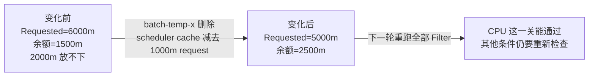
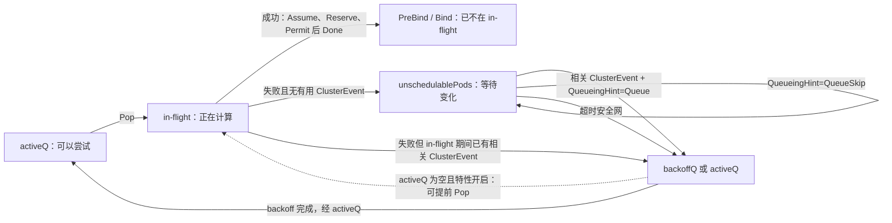
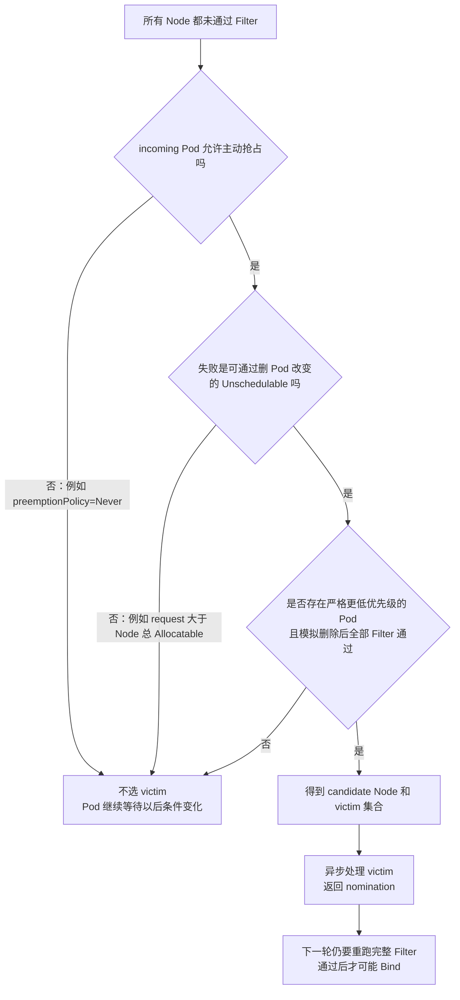

# 第 10 课：game-api 因 `2000m > 1500m` 失败后，scheduler 为什么不空转，却能在释放 `1000m` 后继续

> 从一次 Spring Boot 滚动发布的 `FailedScheduling`，看懂一件事：调度失败后，为什么先等“可能有用的变化”，而不是不停重算；资源真的释放后，它又为什么能继续。

第 09 课已经算清：经过 admission（Pod 保存前的统一补默认值、注入和校验）后，`game-api-new-x` 不是主容器写着的 `1200m`，而是整个 Pod 的 `2000m/2Gi`。这里的 request 是 scheduler 用来预留容量的数字，不是容器此刻的实时使用量。现在三台候选 Node 都只剩 `1500m` CPU request 余额，于是 NodeResourcesFit——scheduler 内置的“节点资源够不够”检查——返回 `Insufficient cpu`。

新的问题不是“为什么失败”，而是失败之后怎么办。

假设这是一个 Spring Boot 服务的滚动发布：JVM 冷启动、类加载、JIT（运行时逐步优化热点代码）和 readiness（应用通过就绪检查、可以接流量）约需 45 秒，所以平台使用 `maxSurge=1`、`maxUnavailable=0`，宁愿暂时多一个 Pod，也不先缩掉旧副本。新 Pod 因容量不足 Pending 了。

此时先不要执行命令，也不要先背队列名。你先预测四件事：

1. 资源账本完全没变化时，scheduler 应不应该每毫秒重算一次？
2. `worker-05` 上一个已绑定 Pod 释放 `1000m` request 后，这个变化能不能直接把新 Pod 绑定到该节点？
3. 如果资源释放恰好发生在新 Pod 已被取出、但失败处理还没结束的窗口里，scheduler 会不会永远错过它？
4. 新旧 Java Pod 都没有 PriorityClass（给 Pod 写入优先级整数的集群级配置）、优先级都是 0 时，新 Pod 能不能抢占旧 Pod？

先把本章最容易混淆的“事件”说清楚。本章会出现两种完全不同的东西：

- **ClusterEvent（集群对象变化通知）：** scheduler 内部把“某个 Pod 删除了”“某个 Node 的可分配资源变了”归成一种变化信号，用它判断失败 Pod 是否值得重算。它不是一个保存到 API Server 的对象。
- **Kubernetes Event 对象：** `kubectl get events` 或 `kubectl describe pod` 能看到的公开记录，例如 `FailedScheduling`。它主要给人排障看，不负责把 Pod 从内部队列叫醒。

后文写“ClusterEvent”或“对象变化通知”时指第一种；写“公开 Event”时指第二种。

下面按**从上往下**读。箭头表示因果顺序，不表示这些步骤一定处在同一个函数里，更不表示组件间同步 RPC（程序 A 直接远程调用程序 B，并等它返回）：

```text
Java 滚动发布制造临时副本
  -> “节点资源够不够”检查拒绝 Pod，并记住拒绝者叫 NodeResourcesFit
  -> 资源账没变化时先等着，不反复做同一道题
  -> 相关对象变化后，先改 scheduler 内存里的资源账，再发 ClusterEvent
  -> NodeResourcesFit 的 QueueingHint（“这次变化值得重算吗”）返回值得，Pod 才离开等待区
  -> backoff（失败后短暂让路）避免它连续挤占新 Pod；没有别的工作时当前版本也可提前再试
  -> 再次取出 Pod 后，完整 Filter（所有节点条件检查）才决定这轮能否成功
  -> 普通检查仍无解时，PostFilter（失败后的补救阶段）才评估抢占能否为下一轮创造条件
```

整章先记住这句人话：

> **没变化就别白算；有变化只是把 Pod 叫回来重算，并不直接指定节点；同优先级 Pod 也不能靠抢占互相挤掉。**

对应到源码：拒绝 Pod 的插件负责判断某次对象变化是否可能有用，backoff 让连续失败的 Pod 暂时给新工作让路，下一轮完整调度负责给最终答案；Pod 已经被取走、正在计算时，in-flight（“正在处理”记录）负责把中途发生的有用变化先记下来。

## 0. 本课定位、深度与阅读路线

这是 scheduler 失败反馈环（失败 -> 等变化 -> 被叫醒 -> 再计算这一圈）的 **S3 深读**。S3 的意思不是“先背很多函数”，而是能从生产现象一路追到关键判断源码。你已经用了几年 Kubernetes，所以本课不重复教 `kubectl get pod` 的基本操作；但源码里第一次出现的概念，仍按新手方式说明“它是谁、做什么、为什么需要”。

### 0.1 先把本章高频词翻成人话

这些词先认用途，不用背英文：

| 源码里的词 | 本章中的大白话 | 它解决什么问题 |
|---|---|---|
| scheduler / kube-scheduler | 给还没选 Node 的 Pod 挑节点的控制面进程 | 把 Pod 的要求与 Node 条件做匹配 |
| scheduling cycle | scheduler 取出一个 Pod，并尝试为它选 Node 的一轮计算 | 区分“这一轮失败”和“以后永远失败” |
| request / Allocatable | Pod 要预留多少；Node 最多可承诺多少 | scheduler 算的是承诺账，不是实时使用率 |
| plugin | scheduler 里各管一项检查的小模块 | 资源、污点、亲和性、存储等判断可以各自演进 |
| Filter / PostFilter | Filter 是正常节点检查；PostFilter 是全部节点都失败后的补救阶段 | 先判断能不能放，再考虑抢占等补救办法 |
| scheduler cache / snapshot | scheduler 内存里的对象账本；某一轮计算使用的只读视图 | 不必每次判断都远程查询 API Server，又能让一轮计算看到一致视图 |
| informer / lister | informer 持续接收对象变化并维护本地副本；lister 从这份副本读取 | 让控制器和 scheduler 高效读取最新已知状态 |
| `activeQ` | 可以马上取出来尝试的队列 | 保存当前值得调度的 Pod |
| in-flight | 已从队列取走、但这一轮还没完成的 Pod 记录 | 防止计算中途发生的有用变化被漏掉 |
| `unschedulablePods` | 上次失败，暂时等相关变化的 Pod 集合 | 避免在条件没变时反复空算 |
| backoff / `backoffQ` | 连续失败后短暂让路，以及保存这类 Pod 的队列 | 防止少数失败 Pod 挤占调度吞吐；它不会凭空增加资源 |
| QueueingHint | 拒绝插件回答“这次对象变化值不值得重算” | 只叫醒可能受这次变化影响的失败 Pod |
| `FitError` / rejector plugin | “所有候选 Node 都不合适”的结构化结果；里面记着每台 Node 为什么失败、哪些 plugin 拒绝 | 不靠解析一行公开 Event 文本，也能知道该问谁的 QueueingHint |
| UID / Condition | UID 是这一份对象的唯一身份证；Condition 是 API 上公开的某项判断记录 | 区分同名重建的新 Pod，也避免把公开状态误当内部队列位置 |
| scheduler profile | 由 `Pod.spec.schedulerName` 选中的一套 plugin 配置 | 同一个 kube-scheduler 可以让不同 Pod 使用不同插件组合 |
| 吞吐 / 活性 | 吞吐是单位时间能处理多少 Pod；活性是 Pod 最终还会再获得处理机会 | 一个关注处理效率，一个防止 Pod 永久睡住 |
| 竞态 / 原子 | 竞态是并发先后不同可能改变结果；原子表示外部看不到操作做到一半的中间状态 | 解释为什么要加锁、重查对象，以及为什么跨 API 动作不能假装一次完成 |
| nomination / `nominatedNodeName` | 抢占后记录的“下轮优先再看这台 Node” | victim 退出需要时间，不能当场假装已经绑定成功 |
| victim / PDB | victim 是抢占准备删除的低优先级 Pod；PDB 是业务允许同时少掉多少副本的预算 | 控制抢占对象及可用性破坏，但 PDB 在 scheduler 抢占中不是绝对锁 |

本课会读深：

- API 中的 Pending 与 scheduler 内部四种状态为什么不能一一对应；
- `Pop` 后为什么还要登记 in-flight；
- Filter 失败后为什么先运行 PostFilter，再进入 FailureHandler；
- `FitError.Diagnosis.UnschedulablePlugins`（记住本轮哪些正常检查拒绝了 Pod）为什么是一份重试依据；
- 失败处理为何重新检查 informer cache、`spec.nodeName`、UID 和对象副本；
- ClusterEvent、QueueingHint、三种 `queueingStrategy` 与 backoff 怎样分工；
- ClusterEvent 发生在 scheduling cycle 中间时，怎样避免丢唤醒；
- 5 分钟 flush（定期把等待过久的 Pod 兜底叫醒）为什么只是活性安全网，不是主要重试机制；
- 当前固定提交中 DefaultPreemption 的候选、victim、PDB、异步执行和 `nominatedNodeName` 边界。

本课只建立边界、不展开：

- 自定义 scheduler plugin 的开发与发布；
- PodGroup（把一组 Pod 当成整体等待）、Workload-aware preemption（按工作负载整体考虑抢占）、DRA Pending plugin（动态资源分配尚未完成时让 Pod 等待）的完整实现；
- scheduler extender（scheduler 调用的外部扩展程序）的网络协议；
- Cluster Autoscaler 如何决定扩容；
- Device Plugin 怎样上报 GPU、kubelet 怎样选择 GPU UUID；这些留给第 15～17 课。

### 0.2 首遍只走六站，不要从头到尾硬啃

| 站点 | 章节锚点 | 这一站学会什么 |
|---:|---|---|
| 1 | 第 2 节 | 用 `2000m > 1500m` 和释放 `1000m` 固定 Java 发布现场 |
| 2 | 第 3～4 节 | 说明为什么不能热循环、不能所有变化都全量唤醒、不能由删除通知直接指定 Node |
| 3 | 第 5 节与第 5.1 节 | 先看总图，再用本章第一段 Go 源码验证“已绑定 Pod 删除只表示值得重算” |
| 4 | 第 7～8 节；第 10.1～10.4、10.7～10.8 节 | 看 scheduler 怎样记住拒绝者，以及 NodeResourcesFit 怎样筛选真正相关的变化 |
| 5 | 第 11.1、11.2、11.7 节；第 12 节 | 看 backoff 怎样让路，再把资源释放前后按时间走一遍 |
| 6 | 第 13.1、13.3、13.4、13.9、13.10 节；第 14～16 节 | 判断本例为什么不能同优先级抢占，并把源码结论落回生产证据和 GPU 短映射 |

走完六站，完成第 18 节“首遍验收”，就可以进入下一课。

**第二遍再读：** 第 6、9、10.5～10.6、11.3～11.6、13.2、13.5～13.8、13.11、19～21 节。重点是 in-flight 链表、三种内部迁移策略、超时安全网、victim 赦免与当前默认异步抢占。Go 语法遇到阻碍时就地补，不需要先学完整本 Go 教程。

## 1. 当前源码基线与阅读约定

```text
源码目录：D:\datou\devops\kubernetes-master\kubernetes
commit：301946d15e67a4a2e8a5fb8292eb836acd366d78
describe：v1.37.0-alpha.0-280-g301946d15e6
源码 go.mod：go 1.26.0
本机 Go：go1.19.4
```

本机 Go 低于当前源码要求，因此本课完成的是固定提交下的静态源码核对和交叉审校，没有声称相关单测已经编译运行。生产排障必须切换到目标集群对应的 tag 或发行分支；QueueingHint、`SchedulerPopFromBackoffQ`、异步抢占和 PodGroup 都有明确版本边界。

主文件：

```text
kubernetes/pkg/scheduler/schedule_one.go
kubernetes/pkg/scheduler/eventhandlers.go
kubernetes/pkg/scheduler/backend/queue/scheduling_queue.go
kubernetes/pkg/scheduler/backend/queue/active_queue.go
kubernetes/pkg/scheduler/backend/queue/backoff_queue.go
kubernetes/pkg/scheduler/framework/plugins/noderesources/fit.go
kubernetes/pkg/scheduler/framework/preemption/preemption.go
kubernetes/pkg/scheduler/framework/preemption/executor.go
kubernetes/pkg/scheduler/framework/plugins/defaultpreemption/default_preemption.go
```

> **阅读约定：** 标有“教学注释版”的 Go 代码，其变量名、判断顺序和返回关系来自本课固定提交；中文 `//` 是讲义新增，不是 Kubernetes 上游原注释。每条有控制或业务含义的语句都会就地解释，多行调用只解释一次，单独括号不机械标注。每个代码块会说明是完整函数、连续摘录还是非连续检查点；区间外内容会明确交代，不用占位省略号冒充源码。小语法演示会标成“Go 示例”，不会伪装成 Kubernetes 源码。

## 2. 先不执行命令：把 Java 发布现场固定下来

以下是教学整理的生产场景，不是某个真实集群的原始公开 Event。数字沿用第 09 课，目的是让同一个 Pod request 从失败计算一直走到重试成功。

### 2.1 为什么滚动发布会在短时间多要一份 request

```yaml
apiVersion: apps/v1
kind: Deployment
metadata:
  name: game-api
  namespace: prod
spec:
  replicas: 3
  strategy:
    type: RollingUpdate
    rollingUpdate:
      maxSurge: 1
      maxUnavailable: 0
```

这个策略不是随便写的：

- Spring Boot 新实例需要约 45 秒完成类加载、JIT 预热和 readiness；
- `maxUnavailable=0` 保护发布期间的可服务副本数；
- `maxSurge=1` 允许先创建一个新 Pod，再逐步下线旧 Pod；
- 代价是发布窗口会临时多出一份 `2000m/2Gi` 的调度承诺。

如果平台只按稳态 3 个副本规划容量，却没有给 surge 留余量，发布卡住是设计结果，不是 scheduler 随机失灵。

### 2.2 新 Pod 与三台候选 Node 的账

`game-api-new-x` 的最终 request 已在第 09 课算出：

```text
Pod request：2000m CPU / 2Gi memory
Pod priority：0（没有 PriorityClass，且没有其他 globalDefault）
preemptionPolicy：默认 PreemptLowerPriority
```

抢占结论还依赖 Node 上已有 Pod 的 priority，不能只给 incoming Pod 写 priority。这个教学现场再固定两条输入：

```text
batch-temp-x：namespace=prod，node=worker-05，request=1000m，priority=0
三台候选 Node 上，所有计入 Requested 的已绑定 Pod priority 都 >= 0
```

因此三台 Node 上都不存在 `priority < 0` 的合格 victim。后文说“本例不能靠抢占解决”依赖的就是这条输入；如果你偷偷加入一个 priority=-10、删除后又足以让所有 Filter 通过的 Pod，主时间线会改走抢占反事实分支。

教学现场中，memory、taint、affinity、volume 等条件都能通过；三台 Node 只在 CPU request 这一维失败：

| Node | CPU Allocatable | 已承诺 Requested | 余额 | incoming | 初次结果 |
|---|---:|---:|---:|---:|---|
| `worker-05` | 7500m | 6000m | 1500m | 2000m | `Insufficient cpu` |
| `worker-06` | 7500m | 6000m | 1500m | 2000m | `Insufficient cpu` |
| `worker-07` | 7500m | 6000m | 1500m | 2000m | `Insufficient cpu` |

白板不等式是：

```text
2000m > 7500m - 6000m
2000m > 1500m
```

API 侧可能看到的教学化结果是：

```text
phase: Pending
spec.nodeName: ""
PodScheduled=False
Reason=Unschedulable
Message=0/3 nodes are available: 3 Insufficient cpu.
```

公开 Event 的文本随版本、插件和聚合方式变化，不能把这一行当稳定 API。本章真正依赖的是 FitError 中保存的插件身份与 Node 状态，而不是解析英文字符串。

### 2.3 唯一改变题目的事实：释放 `1000m` request

稍后，`worker-05` 上已经绑定的 `prod/batch-temp-x` 正常完成并从 scheduler cache 删除。它释放的是 `1000m` request，不是“CPU usage 降低了 1000m”。

下图**从左往右**读。方框是三个时间点的资源账，实线箭头写的是“发生了什么”；它只画数值变化，不表示组件间同步调用：



```text
worker-05 Requested：6000m -> 5000m
worker-05 余额：      1500m -> 2500m

下一轮：2000m <= 7500m - 5000m
       2000m <= 2500m
```

这次变化足以让 CPU Filter 通过，但它仍不能证明整个 Pod 一定能绑定：下一轮还要重跑所有 Filter，期间也可能有别的 Pod 占用资源。

### 2.4 先写下你的预测

| 变化 | 你应预测的动作 |
|---|---|
| 什么都没变 | 不应热循环；Pod 等待可能改变拒绝结论的对象变化 |
| 一个无关 ConfigMap 更新 | NodeResourcesFit 不应因此唤醒本 Pod |
| `worker-05` 的已绑定 Pod 删除 | 值得重试，但 ClusterEvent 不能直接 Bind |
| 新增 Node，但它总 Allocatable 只有 1000m | NodeResourcesFit hint 应认为仍不值得重试 |
| 新 Pod request 改成 8000m，Node 总 Allocatable 7500m | 属于总容量无解，抢占也不能制造 CPU |
| 旧、新 Java Pod 都是 priority 0 | 旧 Pod 不是严格低优先级 victim，默认抢占无效 |

后文每段源码都在验证其中一项。

## 3. 为什么不能用三个看似简单的方案

### 3.1 错误方案一：失败后立刻重新放回可调度队列

如果集群状态没变，第二轮 Filter 会得到同一个 `Insufficient cpu`。立刻再放回去只会形成：

下面从左往右读，每个箭头表示同一个 Pod 进入下一步；它描述的是重复计算，不是网络调用：

```text
Pop -> Filter 失败 -> 立刻入队 -> Pop -> 同样失败
```

一个永远放不下的 Pod 可以持续消耗 scheduler CPU，挤压本来能成功的其他 Pod。集群越大，每轮扫描和插件计算越贵。

### 3.2 错误方案二：任何 ClusterEvent 都唤醒所有失败 Pod

Node 心跳、Pod label、ConfigMap、EndpointSlice 等对象变化非常频繁。`game-api-new-x` 是被 NodeResourcesFit 拒绝的，绝大多数变化不可能增加它的 CPU request 余额。全量唤醒虽然不容易漏信号，却会让变化风暴制造大量无效 scheduling cycle。

### 3.3 错误方案三：资源释放通知直接指定 Node

删除这项对象变化只能说明某份旧状态可能改变了。它不知道：

- informer 与 scheduler snapshot 的时间差；
- 另一个 Pod 是否已经占了刚释放的容量；
- taint、affinity、volume、拓扑等其他 Filter 是否仍通过；
- 抢占或 nomination 是否改变了 Node 上的逻辑占用。

所以 ClusterEvent 只适合回答“值得不值得再算”，不能替代调度算法回答“最终放哪里”。

## 4. 先建立状态所有者和七条不变量

“状态所有者”就是这份状态到底由谁保存、谁能修改；“不变量”就是不管并发先后和局部失败怎样变化，设计都必须守住的底线。先把这两件事分清，后面的队列名才不会串在一起。

### 4.1 API Pending 不是某个内部队列的名字

| 状态/字段 | 所有者 | 能说明什么 | 不能说明什么 |
|---|---|---|---|
| `Pod.status.phase=Pending` | API 对象 | Pod 尚未进入 Running；可能还没调度，也可能已调度但镜像/容器未就绪 | 不能推出它位于 `activeQ`、backoff 还是 unschedulable pool |
| `spec.nodeName=""` | API 对象 | API 当前未持久化绑定 Node | 不能排除 scheduler 正在计算，也不能精确证明内部队列位置 |
| `PodScheduled=False` | Pod Condition | 最近一次公开调度判断失败 | 不能说明下一次重试的内部时间 |
| `activeQ` | kube-scheduler 内存 | Pod 可以被 `Pop` 进入 scheduling cycle | 不等于 API Pending 的全部集合 |
| in-flight | kube-scheduler 内存 | Pod 已被取出，覆盖 scheduling cycle 以及成功路径上的 Permit 等待 | 成功路径在 Permit 通过后就 `Done`，不覆盖后续 PreBind/Bind；API 也没有同名字段 |
| `unschedulablePods` | kube-scheduler 内存 | 上次失败后，尚无 ClusterEvent 证明值得再试 | 不是一个 Kubernetes API 对象 |
| `backoffQ` | kube-scheduler 内存 | 已值得重试，正常应等退避窗口；当前特性下 activeQ 为空时也可能被提前取出 | 不代表根因仍然存在 |

### 4.2 七条设计不变量

1. **无有用变化，不热循环。** 上次失败条件没有可能改变时，不重复浪费完整调度计算。
2. **ClusterEvent 只给 hint，不给最终答案。** 任何唤醒后都必须重新走 scheduling cycle。
3. **cache 先变，通知后发。** 否则 Pod 被唤醒后仍可能立刻读取旧账。
4. **in-flight 窗口不能丢 ClusterEvent。** Pod 已 Pop 但尚未重新入队时发生的有用变化，必须在失败落队时被补看见。
5. **失败身份比错误字符串更重要。** 只有知道是哪一个插件拒绝，才能调用正确的 QueueingHint。
6. **值得重试与失败 Pod 怎样让路分离。** QueueingHint 判断相关性；backoff 计算相对让路和排序。当前版本 activeQ 空时，普通 backoffQ Pod 可以提前被取出。
7. **抢占只能改变未来可用条件。** 它只能移除严格低优先级的可删除 Pod，不能创造 Node 总容量，也不能绕过其他 Filter。

### 4.3 这套设计的收益与代价

| 设计选择 | 收益 | 代价 |
|---|---|---|
| 记录拒绝插件 | 精准调用相关 hint，减少无效轮次 | `QueuedPodInfo` 要保存更多失败上下文 |
| 记录 in-flight ClusterEvent | 防止并发窗口丢唤醒 | scheduler 需要额外内存和清理逻辑 |
| QueueingHint | 对象变化过滤精细到“这个 Pod + 这个变化” | 插件 hint 写错可能让 Pod 等太久 |
| backoff | 让持续失败 Pod 在有新工作时先让路，防止垄断调度吞吐 | activeQ 有工作时，条件已变好的 Pod 仍可能短等；activeQ 空时当前版本可提前取出 |
| 定期 flush | hint 漏判时仍有最终活性 | 会周期性制造少量保守重试 |
| nomination 而非直接 Bind | victim 优雅退出期间保持调度正确性 | 抢占成功到真正调度之间存在时间窗 |

## 5. 白板状态机与源码总图

先用人话看状态。下面**从上往下**读；缩进表示下一步可能走的分支，不是组件调用：

```text
可尝试
  -> 正在计算
       -> 成功：Assume（先在内存占位）/ Reserve（插件预留）/ Permit（最后放行）
                 -> Done（结束 in-flight）-> PreBind / Bind（绑定前处理与写入 Node）
       -> 失败且无有用变化：等待相关变化
       -> 计算期间已有有用变化：进入重试节流或直接可尝试

等待相关变化
  -> 无关 ClusterEvent：继续等待
  -> 相关 ClusterEvent：进入重试节流

重试节流
  -> backoff 到期，或当前版本 activeQ 为空时机会性取出：再次可尝试
```

再映射到当前实现名。下图**从左往右**读：方框代表 scheduler 内部状态，实线代表常见状态迁移，虚线代表“特性开启且 activeQ 为空”时的优化路径，箭头文字代表触发条件。它不是组件拓扑图，任何箭头都不表示网络 RPC：



这张图先表达稳定状态关系。当前默认开启的 `SchedulerPopFromBackoffQ` 还有一个吞吐优化：当 activeQ 没有新工作时，可直接从普通 backoffQ 提前取 Pod；第 11.5 节会按源码修正“backoff 是绝对睡眠定时器”的直觉。

主调用链按**从上往下**读。这里的箭头表示 kube-scheduler 进程内的调用或返回路径，不是不同服务间的远程请求：

```text
PriorityQueue.Pop
  -> activeQueue.unlockedMovePodToInFlight
  -> schedulingAlgorithm
       -> SchedulePod / Filter
       -> FitError
       -> RunPostFilterPlugins / DefaultPreemption
  -> handleSchedulingFailure
       -> 保存 UnschedulablePlugins / PendingPlugins
       -> 重新核对 informer 中的 Pod 身份
       -> AddUnschedulableIfNotPresent
            -> 回看 in-flight 期间的 ClusterEvent
            -> isPodWorthRequeuing
            -> requeuePodWithQueueingStrategy
```

对象变化反馈链也按**从上往下**读。这里的箭头表示“对象变化被 informer 看见后，数据和通知依次产生影响”；它跨越异步 watch/informer 传播，不是一条同步调用栈：

```text
已绑定 Pod 删除或 Node 变化
  -> event handler 先更新 scheduler Cache
  -> MoveAllToActiveOrBackoffQueue
  -> 只调用上次拒绝插件注册的 QueueingHint
  -> QueueSkip / queueAfterBackoff / queueImmediately
  -> 下一次 Pop 后重新跑完整 Filter
```

### 5.1 第一段源码先看核心判断：删掉一个 Pod 后，为什么只说“值得再算”

这段代码只回答一个问题：`game-api-new-x` 上次因为资源不足失败，现在收到“另一个 Pod 被删除”的对象变化通知，NodeResourcesFit 会不会建议把它叫回来重算？它**不负责移动队列，也不负责选择 Node**。

源码位置：[`pkg/scheduler/framework/plugins/noderesources/fit.go:380-394`](https://github.com/kubernetes/kubernetes/blob/301946d15e67a4a2e8a5fb8292eb836acd366d78/pkg/scheduler/framework/plugins/noderesources/fit.go#L380-L394)。

读代码前先认变量：

| 变量 | 本例是谁 | 作用 |
|---|---|---|
| `pod` | 正在等待重试的 `game-api-new-x` | 这次要不要叫醒的目标 Pod |
| `oldObj` / `newObj` | 对象变化前后的通用输入；删除时通常从旧对象取值 | 同一套回调接口要兼容新增、更新和删除 |
| `deletedPod` | 被删除的 `batch-temp-x` | 判断它是否曾占用某台 Node 的调度账 |
| `Queue` | “可能有帮助，值得重算” | 只是建议，不等于调度成功 |
| `QueueSkip` | “这个删除不可能释放 Node 上的账，先别重算” | 避免无效调度轮次 |

下面是**完整函数，教学注释版**。中文 `//` 是讲义新增；每条有判断或返回含义的语句都已解释。

```go
// 判断“另一个 Pod 被删除”是否可能解除当前 Pod 的资源不足。
func (f *Fit) isSchedulableAfterAssignedPodDelete(logger klog.Logger, pod *v1.Pod, oldObj, newObj interface{}) (fwk.QueueingHint, error) {
	// 把通用事件对象安全转换成 Pod 指针；删除场景通常从 oldObj 取得对象。
	deletedPod, _, err := schedutil.As[*v1.Pod](oldObj, newObj)
	// 对象类型异常时宁可建议重算，同时把 error 交给调用者记录，避免 Pod 因一次转换问题长期睡住。
	if err != nil {
		return fwk.Queue, err
	}

	// 既没绑定 Node，也没被抢占逻辑提名到 Node，就没有占任何 Node 的调度账。
	if deletedPod.Spec.NodeName == "" && deletedPod.Status.NominatedNodeName == "" {
		// 写高详细度日志，说明为何这次删除无关。
		logger.V(5).Info("the deleted pod was unscheduled and it wouldn't make the unscheduled pod schedulable", "pod", klog.KObj(pod), "deletedPod", klog.KObj(deletedPod))
		// 告诉队列：不用因为这次删除叫醒目标 Pod。
		return fwk.QueueSkip, nil
	}

	// 删除对象曾绑定或被提名到 Node，可能减少某台 Node 的资源竞争账。
	logger.V(5).Info("another scheduled pod was deleted, and it may make the unscheduled pod schedulable", "pod", klog.KObj(pod), "deletedPod", klog.KObj(deletedPod))
	// 只说“值得重算”；不承诺释放量够，也不指定目标 Node。
	return fwk.Queue, nil
}
```

**大白话总结：** 被删除的 Pod 如果从未绑定、也没被提名到任何 Node，它没有释放 Node 调度账，返回 `QueueSkip`；只要它曾绑定或被提名，就保守返回 `Queue`。这个函数只发“值得重算”的建议，不直接移动队列，更不直接绑定 Node。

按“输入、判断、动作、结果”收束：

| 项目 | 本例结论 |
|---|---|
| 输入 | 等待中的 `game-api-new-x`，以及被删除的 `batch-temp-x` |
| 判断 | `batch-temp-x.spec.nodeName=worker-05`，说明它曾占用 Node 调度账 |
| 动作 | 函数只返回 `Queue`；调用者随后决定进入 activeQ 还是 backoffQ |
| 结果 | `game-api-new-x` 获得下一轮机会；只有下一轮完整 Filter 通过后才可能 Bind |

**顺手学 Go：**

- `(f *Fit)` 是 receiver，可先类比 Java 方法里的 `this`；它表示该方法属于 `Fit` 这个实现，但 Go 没有 Java class 继承。
- `interface{}` 表示这里先接收通用对象；`schedutil.As[*v1.Pod]` 中方括号里的 `*v1.Pod` 是类型参数，意思是“请转换成 Pod 指针”。
- `(fwk.QueueingHint, error)` 是两个返回位置。`return fwk.QueueSkip, nil` 的 `nil` 只表示没有程序错误，不表示“没有 Pod”。
- 函数名里的 `isSchedulable` 容易让人误会：它没有运行全部 Filter，只是在保守判断“这次删除是否可能让结果改变”。

## 6. 【二遍】为什么 `Pop` 后不能直接“从队列消失”

### 6.1 最危险的窗口

想象这个时间顺序。下面按**从上往下**读，`t0～t4` 只是先后标记，不代表等间隔：

```text
t0  game-api-new-x 从 activeQ 被 Pop
t1  scheduling cycle 使用快照开始计算
t2  worker-05 上的 batch Pod 删除，释放 1000m request
t3  本轮仍按先前快照得到 Insufficient cpu
t4  FailureHandler 准备把 game-api-new-x 放回等待区
```

如果 scheduler 只对“当前已经在 unschedulablePods 的 Pod”处理 t2 事件，那么 t2 发生时新 Pod 正在计算，不在等待区；到 t4 它又会以“没有变化”为由睡下，从此可能一直等不到下一次相同事件。

所以 `Pop` 不是删除责任，而是把 Pod 从“可尝试”转成“正在处理且需要追踪期间事件”。

### 6.2 `unlockedMovePodToInFlight` 完整函数

源码位置：`pkg/scheduler/backend/queue/active_queue.go:277-295`。

下面是**完整函数，教学注释版**。调用者已经持有 `activeQueue.lock`，因此函数名带 `unlocked`，不是说它可以无锁随便调用。

```go
// aq 可以暂时类比 Java 的 this；它指向 activeQueue 实例。
// pInfo 带着 Pod、尝试次数、失败插件集合和退避计数。
func (aq *activeQueue) unlockedMovePodToInFlight(pInfo *framework.QueuedPodInfo) error {
	// 每成功 Pop 一次就记一次尝试；这不是“调度成功次数”。
	pInfo.Attempts++

	// 用 Pod UID 检查是否已在 in-flight map，防止同一实例被重复追踪。
	if _, ok := aq.inFlightPods[pInfo.Pod.UID]; ok {
		// 重复 UID 会破坏链表清理和事件归属，因此作为内部错误返回。
		return fmt.Errorf("the same pod is tracked in multiple places in the scheduler: %s", klog.KObj(pInfo.Pod))
	}

	// 异步记录“一个 Pod 进入 in-flight”的指标变化。
	aq.metricsRecorder.ObserveInFlightEventsAsync(metrics.PodPoppedInFlightEvent, 1, false)
	// 把 Pod 作为链表标记放到尾部，并保存 UID -> 链表节点的索引。
	aq.inFlightPods[pInfo.Pod.UID] = aq.inFlightEvents.PushBack(pInfo.Pod)
	// scheduling cycle 只在 Pod 真正被取出并登记成功后递增。
	aq.schedCycle++

	// 上一轮失败插件对应的“当前不可调度”指标要在重试开始时减掉。
	for plugin := range pInfo.UnschedulablePlugins.Union(pInfo.PendingPlugins) {
		// profile 由 Pod.spec.schedulerName 区分。
		metrics.UnschedulableReason(plugin, pInfo.Pod.Spec.SchedulerName).Dec()
	}
	// nil 表示登记成功；Go 的 error 返回位置为 nil 不是“对象为空”。
	return nil
}
```

**大白话总结：** Pod 被 Pop 后不再属于 activeQ，但 scheduler 仍欠它一个处理结果。这个函数把 UID 放进 map，方便 O(1) 找到；同时在一条链表中插入 Pod 标记。之后发生的 ClusterEvent 会排在这个标记后面。失败落队时只回看标记之后的事件，就能知道“我计算期间发生过什么”。重复 UID 是 scheduler 内部一致性错误，不应悄悄覆盖旧索引。

**顺手学 Go：**

- `(aq *activeQueue)` 是 pointer receiver，可先类比 Java 实例方法的 `this`，但 Go 没有 class 继承。
- `if _, ok := map[key]; ok` 是 map 的 comma-ok 写法；`_` 丢弃 value，只关心 key 是否存在。
- `for plugin := range set` 只取迭代 key；这里的 set 底层以 map 表达。
- `return nil` 要按返回位置读：这个函数只返回 `error`，所以 nil 表示没有错误。

### 6.3 链表怎样表达“发生在我之后”

如果两个 Pod 先后被 Pop，中间发生两个 ClusterEvent，链表可能是下面这样。它按**从左往右的时间顺序**读，方括号是链表元素，箭头只是“下一个元素”的指针，不是 RPC：

```text
[Pod A] -> [Node update E1] -> [Pod B] -> [AssignedPod delete E2]
```

- A 需要回看 E1 和 E2；
- B 只需要回看 E2；
- 另一个 Pod 标记不是 ClusterEvent，遍历时跳过；
- `Done(A)` 后，只有不再被任何更晚 in-flight Pod 需要的前缀事件才能清理。

这就是为什么实现同时需要 map 和链表：map 负责快速定位，链表负责保留事件的先后关系。

### 6.4 成功路径的 `Done` 在哪里：Permit 之后，PreBind/Bind 之前

in-flight 不是“从 Pop 一直包到 API Bind 完成”。成功路径在此前已经完成 Assume、Reserve 和 Permit；`WaitOnPermit` 成功后，scheduler 就认为后续失败不再属于“Pod 被调度条件拒绝”，于是先清理 in-flight，再进入 PreBind/Bind。代码里的 `assumedPod` 是已经在 scheduler cache 中临时占好节点资源、但还没有把 Bind 写进 API Server 的 Pod 副本。

源码位置：`pkg/scheduler/schedule_one.go:447-466`。

下面是成功路径的**连续摘录，教学注释版**。区间之前 `WaitOnPermit` 已成功；区间之后才调用 Bind。

```go
// 从这里往后的 PreBind/Bind 失败，不再把 Pod 归类成普通 Unschedulable。
// PreBind 或 Bind 若失败，会走 error backoff，而不是等待某个 Filter 的 QueueingHint。

// Permit 已经通过，可以尽早删除 in-flight Pod 标记与它不再需要的历史事件。
// 这样繁忙集群不用把那段事件链一直保留到远程 Bind 完成。
sched.SchedulingQueue.Done(assumedPod.UID)

// preFlightStatus 成功表示存在需要正式进入 PreBind 的执行路径。
if preFlightStatus.IsSuccess() {
	// 保存取消函数；后续抢占等路径可以取消这个 PreBind Pod。
	var podInPreBindCancel context.CancelCauseFunc
	// 为 PreBind 阶段创建可携带取消原因的 context。
	ctx, podInPreBindCancel = context.WithCancelCause(ctx)
	// 函数退出时释放这个 context；nil 表示没有额外取消原因。
	defer podInPreBindCancel(nil)
	// 无论后续成功失败，都从 PreBind 跟踪表删除 UID。
	defer schedFramework.RemovePodInPreBind(assumedPod.UID)
	// 先登记到 PreBind 跟踪表，供并发路径查询或取消。
	schedFramework.AddPodInPreBind(assumedPod.UID, podInPreBindCancel)
}
// 运行 PreBind plugins；注意此时 Pod 已经不在 in-flight 事件账本里。
if status := schedFramework.RunPreBindPlugins(ctx, state, assumedPod, scheduleResult.SuggestedHost); !status.IsSuccess() {
	// PreBind 失败返回 binding-cycle Status，外层会执行 Unreserve/Forget 与错误退避。
	return status
}
```

**大白话总结：** in-flight 的责任是防止“调度判断还没收口时”漏掉会改变 Unschedulable 结论的事件。Permit 是最后一个还能把 Pod 按 Unschedulable 拒绝的扩展点；过了 Permit，后面即使 PreBind/Bind 出错，也属于绑定周期失败，不再需要拿 Filter 事件账本来决定是否唤醒。所以 `Done` 放在这里既守住正确性，又尽早释放内存。

**顺手学 Go：** `defer` 会在当前函数返回前执行；这里两个 `defer` 的执行顺序是后登记的先执行。`context.WithCancelCause` 返回新 context 与取消函数，不是开启 goroutine。

## 7. 为什么 Filter 全失败后先跑 PostFilter，而不是立刻落队

### 7.1 真实执行顺序

旧式讲法常把 FailureHandler 放在最前面讲，容易让人误以为 `FitError -> 直接 unschedulablePods`。下面按**从上往下**读；箭头是同一个 kube-scheduler 内的控制顺序：

```text
Filter 得到 FitError
  -> 若配置了 PostFilter，先尝试为未来一轮创造条件
  -> 无论抢占是否找到候选，本轮都没有选出可直接 Bind 的 Node
  -> 返回 FailureHandler，保存失败与 nomination 信息
```

### 7.2 `schedulingAlgorithm` 的失败连续摘录

源码位置：`pkg/scheduler/schedule_one.go:270-308`。

下面是**连续摘录，教学注释版**。区间开始前，函数已经取得 `pod`、`state`、`schedFramework` 和 `podInfo`；区间结束后只剩成功返回。这里完整保留 `ErrNoNodesAvailable`、非 FitError、无 PostFilter、PostFilter Error 与 nomination 分支。

```go
// 运行普通调度算法；成功时得到 SuggestedHost，失败时得到 error。
scheduleResult, err := sched.SchedulePod(ctx, schedFramework, state, podInfo)
// 只有失败才进入补救与分类路径。
if err != nil {
	// 集群连一台已注册 Node 都没有，与“有 Node 但放不下”不同。
	if err == ErrNoNodesAvailable {
		// 标成不可通过抢占解决，并要求清除旧 nomination。
		status := fwk.NewStatus(fwk.UnschedulableAndUnresolvable).WithError(err)
		return ScheduleResult{nominatingInfo: clearNominatedNode}, status
	}

	// 尝试把 error 还原成包含逐 Node 诊断的 FitError。
	fitError, ok := err.(*framework.FitError)
	// 不是 FitError，说明不是正常的“所有 Node 都不合适”。
	if !ok {
		// 记录 scheduler 内部或外部依赖错误。
		logger.Error(err, "Error selecting node for pod", "pod", klog.KObj(pod))
		// 清掉旧 nomination，并把 error 转成 framework Status。
		return ScheduleResult{nominatingInfo: clearNominatedNode}, fwk.AsStatus(err)
	}

	// 没有 PostFilter 插件就没有抢占等补救动作。
	if !schedFramework.HasPostFilterPlugins() {
		// 只记日志，不把正常无解伪装成程序错误。
		logger.V(3).Info("No PostFilter plugins are registered, so no preemption will be performed")
		// 本轮仍是 Unschedulable，并清除旧 nomination。
		return ScheduleResult{nominatingInfo: clearNominatedNode}, fwk.NewStatus(fwk.Unschedulable).WithError(err)
	}

	// 把原 Filter 的逐 Node 状态交给 PostFilter；默认实现会评估抢占。
	result, status := schedFramework.RunPostFilterPlugins(ctx, state, pod, fitError.Diagnosis.NodeToStatus)
	// 保存 PostFilter 人话消息，最终公开 Event 可以同时解释 Filter 与补救结果。
	msg := status.Message()
	fitError.Diagnosis.PostFilterMsg = msg
	// PostFilter 自己 Error 才进入错误处理；正常找不到 victim 不属于进程故障。
	if status.Code() == fwk.Error {
		// 交给统一 runtime 错误处理器。
		utilruntime.HandleErrorWithContext(ctx, nil, "Status after running PostFilter plugins for pod", "pod", klog.KObj(pod), "status", msg)
	} else {
		// 非 Error 只在高日志级别记录。
		logger.V(5).Info("Status after running PostFilter plugins for pod", "pod", klog.KObj(pod), "status", msg)
	}

	// 默认 nil 表示这次 PostFilter 没有要求改 nomination。
	var nominatingInfo *fwk.NominatingInfo
	// result 非 nil 时才读取其中的 nomination 操作。
	if result != nil {
		// 可能是设置某个 nominated node，也可能是 ModeOverride 清空旧值。
		nominatingInfo = result.NominatingInfo
	}
	// 即便 PostFilter 找到抢占候选，本轮仍返回原 FitError 对应的 Unschedulable。
	return ScheduleResult{nominatingInfo: nominatingInfo}, fwk.NewStatus(fwk.Unschedulable).WithError(err)
}
```

**大白话总结：** PostFilter 不是“第二条秘密 Bind 通道”。它只能尝试改变未来，例如选 victim、发起删除并写 nomination。本轮 Filter 已经没有可行 Node，所以最后仍按 Unschedulable 进入失败处理。这个顺序解释了为什么你可能同时看到 `PodScheduled=False` 和非空 `status.nominatedNodeName`：前者说“本轮没绑定”，后者说“下一轮优先考虑这里”。

**顺手学 Go：**

- `fitError, ok := err.(*framework.FitError)` 是类型断言。`ok=false` 时不会 panic，表示接口里的具体错误不是该指针类型。
- `var nominatingInfo *fwk.NominatingInfo` 的零值是 nil；nil 在这里表示“不提出 nomination 更新”，不是统一意义的失败。
- `WithError(err)` 把底层 error 保存在 Status 中；Status code 与 error 文本承担不同职责。

## 8. 为什么失败处理必须记“谁拒绝”，还要重新核对 Pod 身份

`handleSchedulingFailure` 同时处理三类责任：

1. 把 framework Status 分类成 API 可见的 `Unschedulable` 或 `SchedulerError`；
2. 把 FitError 中的拒绝插件身份写回 `QueuedPodInfo`，为 ClusterEvent 驱动的重试服务；
3. 在改变内部队列前重新确认 Pod 身份：已绑定则不再重入队，同名但 UID 已变化则整条旧失败处理直接停止。

为了让每行都能读懂，下面把同一个完整函数拆成三个连续区间。三个区间合起来覆盖函数全部业务语句。

### 8.1 第一段：错误分类与拒绝插件

源码位置：`pkg/scheduler/schedule_one.go:1200-1244`。

下面是**连续摘录，教学注释版**。

```go
// sched 是 Scheduler 实例；podInfo 是本轮 Pop 出来的内部 Pod 信息。
func (sched *Scheduler) handleSchedulingFailure(ctx context.Context, podFwk framework.Framework, podInfo *framework.QueuedPodInfo, status *fwk.Status, nominatingInfo *fwk.NominatingInfo, start time.Time) {
	// 记录 AddUnschedulableIfNotPresent 是否已经代为调用 Done。
	calledDone := false
	// 无论下面从哪个分支提前离开，都要清理 in-flight 责任。
	defer func() {
		// 若没有走到成功落队路径，就由这里补 Done。
		if !calledDone {
			// Done 使用 UID 清理 in-flight map 与事件链表。
			sched.SchedulingQueue.Done(podInfo.Pod.UID)
		}
	}()

	// 从 context 取得带本轮字段的 logger。
	logger := klog.FromContext(ctx)
	// 默认先按 scheduler 内部错误处理。
	reason := v1.PodReasonSchedulerError
	// Filter 等插件的正常拒绝不是程序故障。
	if status.IsRejected() {
		// API Condition reason 改成 Unschedulable。
		reason = v1.PodReasonUnschedulable
	}

	// 按公开结果类别记录不同指标。
	switch reason {
	case v1.PodReasonUnschedulable:
		// 记录一次正常不可调度及耗时。
		metrics.PodUnschedulable(podFwk.ProfileName(), metrics.SinceInSeconds(start))
	case v1.PodReasonSchedulerError:
		// 记录一次 scheduler error 及耗时。
		metrics.PodScheduleError(podFwk.ProfileName(), metrics.SinceInSeconds(start))
	}

	// 先拿到本轮内部对象；后面会用 informer 中的最新对象替换。
	pod := podInfo.Pod
	// 从 Status 还原 error，供 FitError 类型判断。
	err := status.AsError()
	// 保留完整消息，稍后用于日志、公开 Event 和 Condition。
	errMsg := status.Message()

	// 清空上一轮失败插件，避免陈旧身份污染这一轮的 ClusterEvent 订阅。
	podInfo.ClearRejectorPlugins()

	// 没有 Node 时只记录等待，不会凭空编造拒绝插件。
	if err == ErrNoNodesAvailable {
		// 这是可恢复的集群状态，不是让 scheduler 退出。
		logger.V(2).Info("Unable to schedule pod; no nodes are registered to the cluster; waiting", "pod", klog.KObj(pod))
	// FitError 才携带正常的逐 Node 插件诊断。
	} else if fitError, ok := err.(*framework.FitError); ok {
		// 保存明确返回 Unschedulable 的插件集合；本例包含 NodeResourcesFit。
		podInfo.UnschedulablePlugins = fitError.Diagnosis.UnschedulablePlugins
		// 保存返回 Pending 的插件集合；本例通常为空。
		podInfo.PendingPlugins = fitError.Diagnosis.PendingPlugins
		// 记录正常 no-fit，不把它当进程异常。
		logger.V(2).Info("Unable to schedule pod; no fit; waiting", "pod", klog.KObj(pod), "err", errMsg)
	// PodGroup 的不可调度有自己的错误身份。
	} else if errors.Is(err, errPodGroupUnschedulable) {
		// 本课普通 Java Pod 不走该分支，只保留版本完整性。
		logger.V(2).Info("Unable to schedule pod belonging to a pod group; waiting", "pod", klog.KObj(pod), "err", errMsg)
	} else {
		// 其他错误进入统一错误处理；后续仍会尝试安全重入队。
		utilruntime.HandleErrorWithContext(ctx, err, "Error scheduling pod; retrying", "pod", klog.KObj(pod))
	}
```

**大白话总结：** 公开 Event 中的 `Insufficient cpu` 是给人看的结果，`UnschedulablePlugins={NodeResourcesFit}` 才是给重试系统用的机器上下文。清空旧集合再写新集合，保证下一次 ClusterEvent 只问这一轮真正拒绝过 Pod 的插件。若是 API 临时错误等非正常拒绝，没有插件身份，队列会采用更保守的退避重试，避免永远卡住。

**顺手学 Go：**

- `defer func() { ... }()` 定义并立即登记一个匿名函数，在外层函数返回前执行；最后的 `()` 不能漏。
- `switch reason` 类似 Java switch，但不需要 `break`，默认不会贯穿下一分支。
- `errors.Is` 用于沿 error 包装链判断身份，比比较错误字符串可靠。

### 8.2 第二段：为何查 lister、NodeName、UID 与 DeepCopy

源码位置：`pkg/scheduler/schedule_one.go:1246-1273`。

下面是紧接上一段的**连续摘录，教学注释版**。

```go
	// 取得当前 profile 共享 informer 的 Pod lister；读取的是本地 cache，不是每次直连 API server。
	podLister := podFwk.SharedInformerFactory().Core().V1().Pods().Lister()
	// 用 namespace/name 获取 informer 当前看到的对象。
	cachedPod, e := podLister.Pods(pod.Namespace).Get(pod.Name)
	// 对象已删除或 cache 读取失败时，不能把旧 Pod 重新塞回队列。
	if e != nil {
		// 记录事实；函数末尾的 defer 会补 Done。
		logger.Info("Pod doesn't exist in informer cache", "pod", klog.KObj(pod), "err", e)
	} else {
		// extender 可能已完成绑定，只是响应超时；最新 Pod 的 nodeName 才是事实。
		if len(cachedPod.Spec.NodeName) != 0 {
			// 已绑定就停止重入队，避免把已调度 Pod 当未调度 Pod 再处理。
			logger.Info("Pod has been assigned to node. Abort adding it back to queue.", "pod", klog.KObj(pod), "node", cachedPod.Spec.NodeName)
		} else {
			// 同名 Pod 可能被删除后重建；UID 才标识对象实例。
			if cachedPod.UID != podInfo.Pod.UID {
				// 新实例不能继承旧实例的失败结果、公开 Event 或 nomination。
				logger.V(2).Info("Pod was recreated while handling scheduling failure. Skip requeueing and status updates.", "pod", klog.KObj(pod), "oldUID", podInfo.Pod.UID, "newUID", cachedPod.UID)
				// 提前返回；最外层 defer 仍会清理旧 UID 的 in-flight 状态。
				return
			}
			// informer 返回对象按约定只读；DeepCopy 后才能交给可变的队列状态。
			podInfo.PodInfo, _ = framework.NewPodInfo(cachedPod.DeepCopy())
			// 让后续公开 Event 和 Condition 使用最新副本。
			pod = podInfo.Pod
			// 结合 in-flight 期间事件，选择 unschedulable、backoff 或 active 状态。
			if err := sched.SchedulingQueue.AddUnschedulableIfNotPresent(logger, podInfo, sched.SchedulingQueue.SchedulingCycle()); err != nil {
				// 重复队列项等一致性问题需要记录，但不会让 scheduler 进程直接退出。
				utilruntime.HandleErrorWithContext(ctx, err, "Error occurred")
			}
			// 该调用内部无论成功失败都会 Done，因此阻止外层 defer 再做一次。
			calledDone = true
		}
	}
```

**大白话总结：** scheduling cycle 开始时拿到的 Pod 可能已经过时。失败落队前必须回答三个问题：它还存在吗、是否已经被别的路径绑定、还是同名但不同 UID 的新对象？只有“仍存在 + 未绑定 + UID 相同”才允许把失败上下文交还队列。`DeepCopy` 不是性能装饰，而是 informer 共享对象的只读边界。

**顺手学 Go：**

- `if err := call(); err != nil` 把变量作用域限制在 if/else 中，常用于紧邻处理错误。
- `podInfo.PodInfo, _ = ...` 丢弃第二个返回值。源码注释说明 API 历史兼容导致某些 affinity 校验错误无法在这里修复；教学上要知道这不是普遍推荐的忽略错误方式。
- `cachedPod.DeepCopy()` 返回独立对象；Go 指针复制本身只复制地址，不会自动深拷贝内部 slice、map 和指针字段。

### 8.3 第三段：内部 nomination 与 API 证据是两条输出

源码位置：`pkg/scheduler/schedule_one.go:1275-1299`。

下面是函数末尾的**连续摘录，教学注释版**。

```go
	// 先更新 scheduler 内存中的 nominator（nomination 索引表），堵住 API status 更新到达 informer 之前的竞态。
	if sched.SchedulingQueue != nil {
		// nominatingInfo 可能设置、清空或保持 nominatedNodeName。
		sched.SchedulingQueue.AddNominatedPod(logger, podInfo.PodInfo, nominatingInfo)
	}

	// 只有测试可能把 nil error 的 Status 送到失败处理。
	if err == nil {
		// 避免为不存在的失败写公开 Event 和 Condition。
		return
	}

	// 公开 Event 有长度上限，只截断展示文本，不改变前面保存的插件身份。
	msg := truncateMessage(errMsg)
	// 记录 Warning/FailedScheduling；这是可观察证据，不是内部队列的状态源。
	podFwk.EventRecorder().WithLogger(logger).Eventf(pod, nil, v1.EventTypeWarning, "FailedScheduling", "Scheduling", msg)
	// 更新 PodScheduled=False，并同时按 nominatingInfo 处理 nominatedNodeName。
	// APICacher 是可选的异步 API 调用路径：先按“调用会成功”更新 scheduler cache；未启用时 updatePod 改用普通 client patch。
	if err := updatePod(ctx, sched.client, podFwk.APICacher(), pod, &v1.PodCondition{
		// 这个 Condition 描述的是调度阶段。
		Type:               v1.PodScheduled,
		// 记录该 Condition 对应的 Pod generation。
		ObservedGeneration: podutil.CalculatePodConditionObservedGeneration(&pod.Status, pod.Generation, v1.PodScheduled),
		// 写入“这次调度尝试失败”；注意已绑定的 extender 超时角落分支也会走到这里。
		Status:             v1.ConditionFalse,
		// 正常拒绝为 Unschedulable，内部错误为 SchedulerError。
		Reason:             reason,
		// 保存完整错误消息，不使用公开 Event 的截断版本。
		Message:            errMsg,
	// updatePod 失败只记录错误；内部队列处理已经完成，不能假装一切回滚。
	}, nominatingInfo); err != nil {
		// API 更新失败是外部可见性问题，交给统一错误处理器。
		utilruntime.HandleErrorWithContext(ctx, err, "Error updating pod", "pod", klog.KObj(pod))
	}
}
```

**大白话总结：** 失败处理有两套输出。内部输出决定 Pod 接下来在 scheduler 内存中怎么等、何时再试；外部输出写公开 Kubernetes Event、Condition 和可能的 `nominatedNodeName`，方便其他组件与人观察。API 写失败不会神奇撤销已经发生的队列变化或 victim 删除，因此线上不能只凭一条公开 Event 推断内部状态。

还有一个反直觉角落：如果 extender 实际已 Bind，只是响应超时，lister 中的 `cachedPod.spec.nodeName` 已非空。FailureHandler 此时只跳过重入队，并没有 `return`；随后仍会更新内部 nominator、发送公开的 `FailedScheduling` Event，并尝试写 `PodScheduled=False`。它不会清掉已经存在的 `spec.nodeName`，但短时间内可能出现“已有 NodeName，同时还有本次失败证据”。所以已绑定判断保护的是**不把 Pod 再塞回调度队列**，不是承诺后续外部失败记录全部跳过。

**顺手学 Go：**

- 结构体字面量 `&v1.PodCondition{...}` 创建一个值并取地址；字段名让长参数可读。
- `if sched.SchedulingQueue != nil` 是测试兼容保护；生产 Scheduler 正常会有队列。
- 同一个 `err` 名可以在较小作用域内重新声明；阅读时要看它属于外层 scheduling status，还是 `updatePod` 这次调用。

### 8.4 用一张表区分四种结果

| 情况 | rejector plugins | 内部动作 | API Reason | 关键边界 |
|---|---|---|---|---|
| NodeResourcesFit 拒绝 | 有 `NodeResourcesFit` | 按其事件与 hint 等待/重试 | `Unschedulable` | 正常业务拒绝，不是 scheduler 崩溃 |
| API 临时错误 | 通常无 | 保守 backoff 重试 | `SchedulerError` | 没有插件可精确判断事件 |
| Pod 已绑定 | 不再落队；defer 清理 in-flight | 仍更新 nominator，并继续公开 Event/Condition 路径 | `spec.nodeName` 不会被清掉，但可能同时看到本次 `FailedScheduling` / `PodScheduled=False` | extender 已 Bind、返回超时的角落场景 |
| 同名 Pod 已重建 | 不再处理旧实例 | 清理旧 UID | 不给新 UID 写旧错误 | name 相同不代表同一对象 |

## 9. 【二遍】失败落队时，怎样补看计算期间发生的 ClusterEvent

第 6 节只解释了为什么 Pop 时要登记 in-flight。现在把反馈环闭合：失败处理进入 `AddUnschedulableIfNotPresent` 时，必须回看 Pod 标记之后发生过的 ClusterEvent，再决定它究竟该进入等待区、backoff，还是直接 active。

### 9.1 `clusterEventsForPod`：只取“我的标记之后”的 ClusterEvent

源码位置：`pkg/scheduler/backend/queue/active_queue.go:394-417`。

下面是**完整函数，教学注释版**。

```go
// pInfo 是已经 Pop、仍处于 in-flight 的 Pod；返回它计算期间发生的 ClusterEvent 切片。
func (aq *activeQueue) clusterEventsForPod(logger klog.Logger, pInfo *framework.QueuedPodInfo) ([]*clusterEvent, error) {
	// 这里只读 map 与链表，使用读锁允许其他只读操作并发。
	aq.lock.RLock()
	// 函数返回前释放读锁。
	defer aq.lock.RUnlock()
	// 高日志级别记录失败插件与 in-flight 规模，便于定位队列内部问题。
	logger.V(5).Info("Checking events for in-flight pod", "pod", klog.KObj(pInfo.Pod), "unschedulablePlugins", pInfo.UnschedulablePlugins, "inFlightEventsSize", aq.inFlightEvents.Len(), "inFlightPodsSize", len(aq.inFlightPods))

	// 通过 UID 找到这个 Pod 在链表中的标记节点。
	inFlightPod, ok := aq.inFlightPods[pInfo.Pod.UID]
	// 找不到说明 Pop/Done/落队契约被破坏。
	if !ok {
		// 返回内部错误；调用方会采用保守重试，避免 Pod 因 scheduler bug 永久睡死。
		return nil, fmt.Errorf("in flight Pod isn't found in the scheduling queue. If you see this error log, it's likely a bug in the scheduler")
	}

	// 准备收集这个 Pod 标记之后的 ClusterEvent。
	var events []*clusterEvent
	// 从当前 Pod 的下一个链表元素开始走到尾部。
	for event := inFlightPod.Next(); event != nil; event = event.Next() {
		// 链表同时放 Pod 标记和 clusterEvent，所以要做类型断言。
		e, ok := event.Value.(*clusterEvent)
		// 断言失败表示遇到另一个 in-flight Pod 标记，不是错误。
		if !ok {
			// 另一个 Pod 的标记不影响本 Pod 的事件时间线。
			continue
		}
		// 真正的 ClusterEvent 才加入返回切片。
		events = append(events, e)
	}
	// 返回按发生顺序收集的 ClusterEvent；nil error 表示链表契约正常。
	return events, nil
}
```

**大白话总结：** 这不是查询“集群最近所有公开 Event”，而是查询“从我被 Pop 之后，调度队列记下了哪些 ClusterEvent”。只看 Pod 标记之后，可以避免把早于本轮快照的旧变化再次当成新唤醒。遇到另一个 Pod 标记直接跳过，因为多个 in-flight Pod 共用同一条时间线。

**顺手学 Go：**

- `RLock/RUnlock` 是读写锁的读侧；多个读者可并发，但写者要等。
- `event.Value.(*clusterEvent)` 是类型断言；链表 Value 是 `interface{}`，具体值可能是 Pod 标记，也可能是 ClusterEvent。
- `var events []*clusterEvent` 的零值是 nil slice；可以直接 `append`，返回 nil slice 也可以安全 range。

### 9.2 `determineSchedulingHintForInFlightPod`：多个 ClusterEvent 取最积极策略

源码位置：`pkg/scheduler/backend/queue/scheduling_queue.go:804-847`。

下面是**完整函数，教学注释版**。

```go
// 返回这个失败 Pod 在重新落队时应使用的内部 queueingStrategy。
func (p *PriorityQueue) determineSchedulingHintForInFlightPod(logger klog.Logger, pInfo *framework.QueuedPodInfo) queueingStrategy {
	// 没有拒绝插件通常表示 API 网络错误等异常，而非正常 Filter 拒绝。
	if len(pInfo.UnschedulablePlugins) == 0 && len(pInfo.PendingPlugins) == 0 {
		// 无法精确等待某个插件事件，就采用 backoff 后保守重试。
		return queueAfterBackoff
	}
	// 当前 PodGroup 的事件驱动重试尚未按单 Pod 这套逻辑实现。
	if p.isGenericWorkloadEnabled && pInfo.Pod.Spec.SchedulingGroup != nil {
		// PodGroup 成员只按 backoff 重试；普通 game-api 不走这里。
		return queueAfterBackoff
	}

	// 读取从这个 Pod 被 Pop 后记录的 ClusterEvent。
	events, err := p.activeQ.clusterEventsForPod(logger, pInfo)
	// 链表契约异常时宁愿重试，也不让 Pod 永久停留。
	if err != nil {
		// 先记录 scheduler 内部错误。
		utilruntime.HandleErrorWithLogger(logger, err, "Error getting cluster events for pod", "pod", klog.KObj(pInfo.Pod))
		// 再返回保守的 backoff 重试策略。
		return queueAfterBackoff
	}

	// 默认没有事件值得唤醒，Pod 应进入 unschedulable pool。
	queueingStrategy := queueSkip
	// 按发生顺序检查本轮 in-flight 事件。
	for _, e := range events {
		// 高日志级别记录正在检查哪个事件。
		logger.V(5).Info("Checking event for in-flight pod", "pod", klog.KObj(pInfo.Pod), "event", e.event.Label())

		// 只调用本轮拒绝插件对这个事件的 QueueingHint。
		switch p.isPodWorthRequeuing(logger, pInfo, e.event, e.oldObj, e.newObj) {
		case queueSkip:
			// 这个事件无用，继续看后面的事件。
			continue
		case queueImmediately:
			// 立即 active 是最积极策略，后面不可能再有更高策略。
			return queueImmediately
		case queueAfterBackoff:
			// 至少有一个 Unschedulable plugin 认为值得重试。
			queueingStrategy = queueAfterBackoff
			// 没有 Pending plugin 时不可能再升级成 queueImmediately。
			if pInfo.PendingPlugins.Len() == 0 {
				// 可以提前返回 backoff 策略。
				return queueAfterBackoff
			}
		}
	}
	// 所有事件检查完，返回累计得到的最高策略。
	return queueingStrategy
}
```

**大白话总结：** 本例只有 NodeResourcesFit 这个 Unschedulable plugin。若 t2 的 AssignedPodDelete 发生在计算中，NodeResourcesFit hint 返回 Queue，于是失败落队时不会再睡进 unschedulable pool，而会按 backoff 状态进入 backoffQ 或 activeQ。若只有无关事件，仍返回 `queueSkip`。

**顺手学 Go：**

- `switch expression { case ... }` 可以直接按枚举值分支。
- `return` 在循环内部会结束整个函数，不只是结束当前 case。
- `:=` 创建当前作用域的新变量；这里 `queueingStrategy := queueSkip` 的具体类型由右侧常量推断。

### 9.3 三种内部策略先翻译成人话

源码位置：`pkg/scheduler/backend/queue/scheduling_queue.go:435-445`。

下面是**完整类型声明和完整 const 组，教学注释版**。它们不是函数；这 11 行就是三种内部迁移策略的全部定义。

```go
// 内部枚举只在 scheduling queue 中使用。
type queueingStrategy int

const (
	// 事件不能改变上次失败：留在 unschedulable pool。
	queueSkip queueingStrategy = iota
	// 事件可能有用：进入 backoff 语义；通常到期转 active，当前特性也可能在 activeQ 空时提前 Pop。
	queueAfterBackoff
	// Pending plugin 的外部等待条件完成：跳过 backoff，直接 active。
	queueImmediately
)
```

**大白话总结：** `QueueingHint` 对外只有“这个事件可能有用/没用”的判断，内部队列还要结合拒绝类型翻译成三种策略。本例 NodeResourcesFit 是正常 Unschedulable，因此 Queue 被解释为 `queueAfterBackoff`；DRA 等按设计需要等待外部完成的 Pending plugin 才可能得到 `queueImmediately`。

**顺手学 Go：** `iota` 在同一个 const 组中从 0 递增，所以这里依次是 0、1、2。名字而非数字才是业务语义，代码不应依赖你背枚举值。

### 9.4 `AddUnschedulableIfNotPresent`：名字叫 Add，实际可能去三个地方

源码位置：`pkg/scheduler/backend/queue/scheduling_queue.go:853-908`。

下面是**完整函数，教学注释版**。

```go
// 把本轮失败的 Pod 安全交还给调度队列体系。
func (p *PriorityQueue) AddUnschedulableIfNotPresent(logger klog.Logger, pInfo *framework.QueuedPodInfo, podSchedulingCycle int64) error {
	// PriorityQueue 总锁保护三类队列间的原子迁移。
	p.lock.Lock()
	// 返回前释放总锁。
	defer p.lock.Unlock()

	// 无论加入哪个状态或中途报重复错误，本轮 Pop 的责任都结束。
	defer p.Done(pInfo.Pod.UID)

	// 取得当前最新副本中的 Pod。
	pod := pInfo.Pod
	// 先防止同一个 Pod 已在 unschedulable pool。
	if p.unschedulablePods.get(pod) != nil {
		// 重复存在说明内部状态不一致，不能再插一份。
		return fmt.Errorf("Pod %v is already present in unschedulable queue", klog.KObj(pod))
	}

	// 再检查 activeQ。
	if p.activeQ.has(pInfo) {
		// 同一 Pod 不能同时 active 与 in-flight 落队。
		return fmt.Errorf("Pod %v is already present in the active queue", klog.KObj(pod))
	}
	// 最后检查 backoffQ。
	if p.backoffQ.has(pInfo) {
		// 同一 Pod 也不能重复进入 backoff heap（按到期时间排序的内部结构）。
		return fmt.Errorf("Pod %v is already present in the backoff queue", klog.KObj(pod))
	}

	// 无拒绝插件表示这次通常是网络等意外 Error。
	if len(pInfo.UnschedulablePlugins) == 0 && len(pInfo.PendingPlugins) == 0 {
		// Error 与正常不可调度分别计数，避免两类失败互相放大退避。
		pInfo.ConsecutiveErrorsCount++
	} else {
		// 正常被插件拒绝，增加 Unschedulable 次数。
		pInfo.UnschedulableCount++
		// 正常拒绝出现说明连续内部 Error 已中断，计数归零。
		pInfo.ConsecutiveErrorsCount = 0
	}
	// Timestamp 是这次重新入队的基准时间。
	pInfo.Timestamp = p.clock.Now()
	// 计数和时间都变了，清空上一次缓存的 backoff 到期时间。
	pInfo.BackoffExpiration = time.Time{}
	// 新一轮真实尝试已经发生，清掉“由超时 flush 唤醒”的标记。
	pInfo.WasFlushedFromUnschedulable = false

	// 合并 Unschedulable 与 Pending 插件，用于指标标签。
	rejectorPlugins := pInfo.UnschedulablePlugins.Union(pInfo.PendingPlugins)
	// 为每个拒绝插件增加当前不可调度原因指标。
	for plugin := range rejectorPlugins {
		// 同一个插件按 scheduler profile 分开计数。
		metrics.UnschedulableReason(plugin, pInfo.Pod.Spec.SchedulerName).Inc()
	}

	// 回放本轮 scheduling 期间发生的事件，决定最积极的合理策略。
	schedulingHint := p.determineSchedulingHintForInFlightPod(logger, pInfo)

	// 根据策略与 backoff 剩余时间，真正放入 activeQ、backoffQ 或 unschedulable pool。
	queue := p.requeuePodWithQueueingStrategy(logger, pInfo, schedulingHint, framework.ScheduleAttemptFailure)
	// 记录最终内部去向；这是比 API phase 更接近队列事实的高等级日志。
	logger.V(3).Info("Pod moved to an internal scheduling queue", "pod", klog.KObj(pod), "event", framework.ScheduleAttemptFailure, "queue", queue, "schedulingCycle", podSchedulingCycle, "hint", schedulingHint, "unschedulable plugins", rejectorPlugins)
	// activeQ 有新 Pod 时要唤醒阻塞的 Pop；当前特性下 backoffQ 也可能被 Pop 直接读取。
	if queue == activeQ || (p.isPopFromBackoffQEnabled && queue == backoffQ) {
		// condition variable 广播只表示“再检查队列”，不承诺这个 Pod 立即被选中。
		p.activeQ.broadcast()
	}

	// nil 表示本次状态迁移完成。
	return nil
}
```

**大白话总结：** 函数名是历史接口名，不能望文生义成“总是加入 unschedulablePods”。它先防重复，再区分正常拒绝与内部错误的计数，回放 in-flight 事件，最后可能把 Pod 放到三个状态之一。`defer Done` 保证不管走成功、重复检测还是其他错误，本轮 in-flight 责任都能结束。

**顺手学 Go：**

- 多个 `defer` 按后进先出执行：这里函数退出时先 `Done`，再 `Unlock`。由于 `Done` 还会获取 activeQueue 自己的锁，源码锁层次必须保持一致。
- `time.Time{}` 是时间结构的零值；`IsZero()` 可判断是否尚未缓存到期时间。
- `queue := ...` 的 queue 是字符串返回值，用于日志和广播判断，不是一个队列对象。

### 9.5 `Done` 为什么允许重复调用却不重复清理

源码位置：`pkg/scheduler/backend/queue/active_queue.go:463-504`。

下面是**完整函数，教学注释版**。它由已经持有 activeQueue 锁的路径调用。

```go
// 按 UID 结束一个 in-flight Pod，并清理不再需要的事件前缀。
func (aq *activeQueue) unlockedDone(pod types.UID) {
	// 找到 Pod 在事件链表中的标记。
	inFlightPod, ok := aq.inFlightPods[pod]
		// 找不到表示它已经 Done；幂等（重复调用效果与调用一次相同）地直接返回。
	if !ok {
		// close 与异步完成可能重复到达；no-op（安全地什么也不做）比报错更合适。
		return
	}
	// 先从 UID 索引删除，表示不再有处理责任。
	delete(aq.inFlightPods, pod)

	// 再从链表删除 Pod 标记。
	aq.inFlightEvents.Remove(inFlightPod)

	// 聚合被清理事件的指标变化，减少逐项异步记录开销。
	aggrMetricsCounter := map[string]int{}
	// 从链表头清理事件，直到空或遇到下一个仍在 in-flight 的 Pod 标记。
	for {
		// 每轮读取当前头元素。
		e := aq.inFlightEvents.Front()
		// nil 表示链表已经空。
		if e == nil {
			// 没有更多元素可清理。
			break
		}
		// 只有 clusterEvent 可以作为无人引用的前缀被删除。
		ev, ok := e.Value.(*clusterEvent)
		// 断言失败说明头部是另一个 Pod 标记。
		if !ok {
			// 后面的事件仍可能被该 Pod 需要，必须停止。
			break
		}
		// 删除已经没有任何更早 in-flight Pod 引用的事件。
		aq.inFlightEvents.Remove(e)
		// 记录这个事件标签的数量减少一。
		aggrMetricsCounter[ev.event.Label()]--
	}

	// 批量把事件数量变化送给指标记录器。
	for evLabel, count := range aggrMetricsCounter {
		// count 为负数，表示内存中对应事件减少。
		aq.metricsRecorder.ObserveInFlightEventsAsync(evLabel, float64(count), false)
	}

	// in-flight Pod 总数减少一。
	aq.metricsRecorder.ObserveInFlightEventsAsync(metrics.PodPoppedInFlightEvent, -1,
		// 最后一个 Pod 完成时强制 flush，避免小集群指标长期不刷新。
		len(aq.inFlightPods) == 0)
}
```

**大白话总结：** `Done` 不只是删一个 map key，还要维护事件链表的引用边界。只能清掉链表头部且位于下一个 Pod 标记之前的事件；更后面的事件仍可能属于另一个 in-flight Pod。找不到 UID 时正常 no-op，使失败处理兜底、队列内部 Done 和关闭流程可以安全重叠。

**顺手学 Go：**

- `delete(map, key)` 删除不存在的 key 也安全，但源码先查 map，因为还需要拿链表节点。
- `for {}` 是无限循环，必须靠 `break` 或 `return` 离开。
- 多行函数调用的最后一个参数是布尔表达式；换行不改变 Go 求值关系。

## 10. 为什么“一个 Pod 删除”不会无脑唤醒所有失败 Pod

整个过滤链分三层：

```text
第一层：这个 ClusterEvent 是否有任何启用插件关心？
第二层：这个 Pod 上一轮究竟被哪些插件拒绝？
第三层：那个拒绝插件认为这个具体 oldObj/newObj 能否改变该 Pod 的结论？
```

本例的答案是：AssignedPodDelete 是 NodeResourcesFit 注册的 ClusterEvent；`game-api-new-x` 上轮确实被 NodeResourcesFit 拒绝；删除的是已绑定 Pod，所以 hint 保守返回 Queue。

### 10.1 为什么对象变化处理必须先减 cache 账，再移动队列

源码位置：`pkg/scheduler/eventhandlers.go:412-423`。

下面是**完整函数，教学注释版**。

```go
// 处理一个已有 spec.nodeName 的 Pod 删除通知。
func (sched *Scheduler) deleteAssignedPodFromCache(pod *v1.Pod) {
	// 函数退出时记录 AssignedPodDelete 这类对象变化的处理总延迟。
	defer metrics.EventHandlingLatency.ObserveSince(time.Now(), framework.EventAssignedPodDelete.Label())()

	// 使用 Scheduler 自带 logger。
	logger := sched.logger

	// 记录被删除的已调度 Pod。
	logger.V(3).Info("Delete event for scheduled pod", "pod", klog.KObj(pod))
	// 第一件事：从 scheduler Cache 移除 Pod，让 NodeInfo.Requested（这台 Node 已承诺的 request 合计）先减少。
	if err := sched.Cache.RemovePod(logger, pod); err != nil {
		// cache 删除异常要记录，但对象变化通知仍继续；通知本身不会直接绑定 Pod。
		utilruntime.HandleErrorWithLogger(logger, err, "Scheduler cache RemovePod failed", "pod", klog.KObj(pod))
	}

	// 第二件事：把 AssignedPodDelete 交给失败 Pod 的 QueueingHint。
	sched.SchedulingQueue.MoveAllToActiveOrBackoffQueue(logger, framework.EventAssignedPodDelete, pod, nil, nil)
}
```

**大白话总结：** 正常顺序是“账本先变、再通知重试”。若反过来，`game-api-new-x` 可能被叫醒后仍读到 Requested=6000m，再次白跑一轮。即使 `RemovePod` 报错，源码也继续发对象变化通知，目的是别把等待 Pod 永久漏掉；但这不表示 cache 已修好。下一轮 Filter 只能读取当时从 cache 生成的 snapshot：若旧账仍在，它会保守地再次失败，等待后续状态恢复或其它重试机会，而不会因为这条通知直接错绑。

**顺手学 Go：** `defer f()()` 看起来有两对括号，是因为 `ObserveSince(...)` 先返回一个函数，后面的 `()` 表示把这个返回函数登记为 defer 调用。

### 10.2 NodeResourcesFit 注册的不是“所有 ClusterEvent”

源码位置：`pkg/scheduler/framework/plugins/noderesources/fit.go:358-376`。

下面是**完整函数，教学注释版**。首遍只看前两个 ClusterEvent；DRA 与原地缩容分支是当前版本边界。

```go
// 返回可能让 NodeResourcesFit 失败 Pod 变得可调度的 ClusterEvent 及回调。
func (f *Fit) EventsToRegister(_ context.Context) ([]fwk.ClusterEventWithHint, error) {
	// 基础事件只有已绑定 Pod 删除、Node 新增或 allocatable 更新。
	events := []fwk.ClusterEventWithHint{
		// 已绑定或 nominated Pod 删除可能释放已承诺资源。
		{Event: fwk.ClusterEvent{Resource: fwk.AssignedPod, ActionType: fwk.Delete}, QueueingHintFn: f.isSchedulableAfterAssignedPodDelete},
		// Node 新增或 allocatable 增加可能提供新的总容量。
		{Event: fwk.ClusterEvent{Resource: fwk.Node, ActionType: fwk.Add | fwk.UpdateNodeAllocatable}, QueueingHintFn: f.isSchedulableAfterNodeChange},
	}
	// 当前 profile 启用 DRA extended resource 时再关心 DeviceClass。
	if f.enableDRAExtendedResource {
		// 追加 DeviceClass 新增或更新事件。
		events = append(events,
			// DeviceClass 的 extended resource 映射变化可能解除等待。
			fwk.ClusterEventWithHint{Event: fwk.ClusterEvent{Resource: fwk.DeviceClass, ActionType: fwk.Add | fwk.Update}, QueueingHintFn: f.isSchedulableAfterDeviceClassEvent})
	}
	// 启用 Pod 原地垂直扩缩容时，request 下调也可能释放资源。
	if f.enableInPlacePodVerticalScaling {
		// 同时关心别的已绑定 Pod 下调，以及目标 Pod 自身下调。
		events = append(events,
			// 已绑定 Pod request 下调可能增加 Node 余额。
			fwk.ClusterEventWithHint{Event: fwk.ClusterEvent{Resource: fwk.AssignedPod, ActionType: fwk.UpdatePodScaleDown}, QueueingHintFn: f.isSchedulableAfterAssignedPodScaleDown},
			// 待调度 Pod 自己 request 下调也可能直接变得可放置。
			fwk.ClusterEventWithHint{Event: fwk.ClusterEvent{Resource: fwk.TargetPod, ActionType: fwk.UpdatePodScaleDown}, QueueingHintFn: f.isSchedulableAfterTargetPodScaleDown})
	}
	// 返回静态注册结果；nil 表示构造无错误。
	return events, nil
}
```

**大白话总结：** ConfigMap 更新不在列表里，Node heartbeat 若没有对应的调度属性变化也不会成为本插件的有效 ClusterEvent。插件不是订阅“集群变化”这个大筐，而是声明哪些资源与动作理论上可能改变自己的判定。

**顺手学 Go：**

- 参数名 `_ context.Context` 表示接口要求这个参数，但实现有意不用。
- `[]fwk.ClusterEventWithHint{...}` 是 slice 字面量。
- `append(events, item)` 返回可能换过底层数组的新 slice，所以必须赋回 `events`。

### 10.3 为什么已绑定 Pod 删除只返回“可能”

这个完整函数已经在第 5.1 节作为本章第一段源码逐行读过。下面按**从上往下**读；箭头表示过滤条件继续收窄，不是函数间 RPC。放到三层过滤链里，它的职责只有最后一步：

```text
NodeResourcesFit 注册了“已分配 Pod 删除”
  -> 本 Pod 上轮确实被 NodeResourcesFit 拒绝
  -> 检查删除对象是否曾占 Node 调度账
       ├─ 曾绑定或被提名到 Node：返回 Queue
       └─ 从未绑定且从未被提名：返回 QueueSkip
```

`Queue` 仍只是“值得重算”。这个 hint 不逐 Node、逐资源精算删除量；下一轮 Filter 才会发现它是在 `worker-06` 只释放 100m，还是本例在 `worker-05` 释放 1000m。保守返回 Queue 最坏多算一轮；错误地 Skip 却可能让 Pod 等很久，所以这里偏向不漏唤醒。

### 10.4 Node 新增或 allocatable 更新，为什么能更精细地 Skip

Node ClusterEvent 自带新 Node 对象，NodeResourcesFit 可以先做两个成本很低的判断：

1. 这台 Node 的**总 Allocatable** 是否至少能容纳目标 Pod；
2. 若是更新，Node 可容纳的 Pod 数是否增加，或目标 Pod 请求的某个资源维度是否真的增加了 Allocatable。

先看 `isFit`。源码位置：`pkg/scheduler/framework/plugins/noderesources/fit.go:580-588`。

下面是**完整函数，教学注释版**。

```go
// 只用 Node 对象构造一个没有已占用 Pod 的临时 NodeInfo，检查总容量可行性。
func isFit(pod *v1.Pod, node *v1.Node, draManager fwk.SharedDRAManager, opts ResourceRequestsOptions) bool {
	// Node 不存在时没有任何可行性可言。
	if node == nil {
		return false
	}
	// 创建空 NodeInfo；此时 Requested 为零。
	nodeInfo := framework.NewNodeInfo()
	// 把 Node Capacity/Allocatable 写入临时 NodeInfo。
	nodeInfo.SetNode(node)

	// 没有任何 InsufficientResource 才表示 Pod 小于等于 Node 总容量。
	return len(Fits(pod, nodeInfo, draManager, opts)) == 0
}
```

**大白话总结：** 这里故意不把节点上现有 Pods 加进 NodeInfo，所以它回答的是“理论总容量能否容纳”，不是“此刻余额是否足够”。新增一台总 CPU 1000m 的 Node 对 2000m Pod 毫无帮助，可直接 QueueSkip；总容量 7500m 只说明值得重试，不能保证当前 Requested 够低。

**顺手学 Go：** `len(slice) == 0` 用于判断没有不足项。`Fits` 返回不足列表而不是 bool，调用者可以保留每种资源的详细原因。

再看主 hint。源码位置：`pkg/scheduler/framework/plugins/noderesources/fit.go:469-503`。

下面是**完整函数，教学注释版**。

```go
// 判断 Node 新增或更新是否可能让目标 Pod 通过 NodeResourcesFit。
func (f *Fit) isSchedulableAfterNodeChange(logger klog.Logger, pod *v1.Pod, oldObj, newObj interface{}) (fwk.QueueingHint, error) {
	// Add 时 originalNode 为 nil，Update 时两者都有值。
	originalNode, modifiedNode, err := schedutil.As[*v1.Node](oldObj, newObj)
	// 转换失败时返回 Queue+error，调用方会按安全侧重试。
	if err != nil {
		return fwk.Queue, err
	}
	// 默认不需要 DRA manager。
	var draManager fwk.SharedDRAManager
	// 当前版本启用 DRA extended resource 时读取共享 manager。
	if f.enableDRAExtendedResource {
		// hint 计算可以查询 DRA extended resource cache。
		draManager = f.handle.SharedDRAManager()
	}

	// 组装与当前插件 feature 配置一致的 request 计算选项。
	opts := ResourceRequestsOptions{
		// 是否启用 Pod-level resources。
		EnablePodLevelResources:   f.enablePodLevelResources,
		// 是否把 DRA 暴露的 extended resource 纳入。
		EnableDRAExtendedResource: f.enableDRAExtendedResource,
	}

	// 先做总容量门槛；连空 Node 都放不下就无需唤醒。
	if !isFit(pod, modifiedNode, draManager, opts) {
		// 记录 Node 已变化，但变化仍不够容纳 Pod。
		logger.V(5).Info("node was created or updated, but it doesn't have enough resource(s) to accommodate this pod", "pod", klog.KObj(pod), "node", klog.KObj(modifiedNode))
		// 留在 unschedulable pool。
		return fwk.QueueSkip, nil
	}
	// oldObj 为 nil 表示 Node Add；总容量已可容纳，值得尝试。
	if originalNode == nil {
		// 这里仍只说 might fit。
		logger.V(5).Info("node was added and it might fit the pod's resource requests", "pod", klog.KObj(pod), "node", klog.KObj(modifiedNode))
		return fwk.Queue, nil
	}
	// Update 还要确认 allowed pod 数或目标 Pod 真正请求的某个 Allocatable 维度增加。
	if !haveAnyRequestedResourcesIncreased(pod, originalNode, modifiedNode, draManager, opts) {
		// label、地址或无关资源变化不值得重跑本插件。
		logger.V(5).Info("node was updated, but haven't changed the pod's resource requestments fit assessment", "pod", klog.KObj(pod), "node", klog.KObj(modifiedNode))
		return fwk.QueueSkip, nil
	}

	// 总容量能放下，且 allowed pod 数或相关 Allocatable 维度增加，返回可能可调度。
	logger.V(5).Info("node was updated, and may now fit the pod's resource requests", "pod", klog.KObj(pod), "node", klog.KObj(modifiedNode))
	return fwk.Queue, nil
}
```

**大白话总结：** Node hint 比 Pod 删除 hint 更精细，因为 old/new Node 直接提供 Allocatable 差异。`haveAnyRequestedResourcesIncreased` 先比较允许的 Pod 数，再只比较目标 Pod 真正请求的 CPU、memory、临时磁盘和 scalar resource（用整数计数的资源，例如 `nvidia.com/gpu`）；当前 DRA 分支还有委托判断。它仍不读取完整当前 Requested，所以 `Queue` 只表示“总容量门槛和相关增量都合理”，实际余额必须等下一轮 snapshot + Filter 再算。

**顺手学 Go：**

- `var draManager fwk.SharedDRAManager` 是接口变量，零值 nil；只有 feature 开启才赋值。
- `!isFit(...)` 是逻辑取反。
- 结构体字面量可以按字段名换行赋值，末尾逗号在多行 Go 语法中必须保留。

### 10.5 队列为什么只调用“上轮拒绝插件”的 hint

源码位置：`pkg/scheduler/backend/queue/scheduling_queue.go:476-563`。

下面是**完整函数，教学注释版**。首遍重点看“合并拒绝插件 -> 匹配对象变化 -> 只调用拒绝插件 -> Error 按 Queue -> 翻译策略”；wildcard（特殊的全匹配/强制激活变化）和 Pending plugin（等待外部条件完成的插件）分支二遍再读。

```go
// 判断一个具体事件是否值得让这个具体 Pod 离开 unschedulable pool。
func (p *PriorityQueue) isPodWorthRequeuing(logger klog.Logger, pInfo *framework.QueuedPodInfo, event fwk.ClusterEvent, oldObj, newObj interface{}) queueingStrategy {
	// 合并上轮返回 Unschedulable 与 Pending 的插件身份。
	rejectorPlugins := pInfo.UnschedulablePlugins.Union(pInfo.PendingPlugins)
	// 没有身份通常是异常错误，无法做精准事件过滤。
	if rejectorPlugins.Len() == 0 {
		// 记录为何采用保守策略。
		logger.V(6).Info("Worth requeuing because no failed plugins", "pod", klog.KObj(pInfo.Pod))
		// 保守地 backoff 后重试。
		return queueAfterBackoff
	}

	// wildcard 是强制激活、超时 flush 等特殊事件。
	if framework.ClusterEventIsWildCard(event) {
		// wildcard 携带 newObj 时可能只针对某一个 Pod。
		if newObj != nil {
			// 必须同时是 Pod 且 UID 与目标一致。
			if pod, ok := newObj.(*v1.Pod); !ok || pod.UID != pInfo.Pod.UID {
				// 类型正确但 UID 不同，可记录另一个目标 Pod。
				if ok {
					logger.V(6).Info("Not worth requeuing because the event is wildcard, but for another pod", "pod", klog.KObj(pInfo.Pod), "event", event.Label(), "newObj", klog.KObj(pod))
				}
				// 与本 Pod 无关。
				return queueSkip
			}
		}

		// 真正针对全部或本 Pod 的 wildcard 绕过插件 hint，但仍遵守 backoff。
		logger.V(6).Info("Worth requeuing because the event is wildcard", "pod", klog.KObj(pInfo.Pod), "event", event.Label())
		return queueAfterBackoff
	}

	// 每个 schedulerName/profile 有自己的事件 -> hint 函数表。
	hintMap, ok := p.queueingHintMap[pInfo.Pod.Spec.SchedulerName]
	// 找不到 profile 映射只应由 scheduler bug 导致。
	if !ok {
		// 记录错误，但不能让 Pod 因内部表缺失永久停留。
		utilruntime.HandleErrorWithLogger(logger, nil, "No QueueingHintMap is registered for this profile", "profile", pInfo.Pod.Spec.SchedulerName, "pod", klog.KObj(pInfo.Pod))
		return queueAfterBackoff
	}

	// hint 回调要读取的目标 Pod。
	pod := pInfo.Pod
	// 默认所有相关回调都 Skip。
	queueStrategy := queueSkip
	// 遍历 profile 注册的事件模式及对应插件回调。
	for eventToMatch, hintfns := range hintMap {
		// 资源和 ActionType 不匹配时，不调用这一组回调。
		if !framework.MatchClusterEvents(eventToMatch, event) {
			continue
		}

		// 同一种事件可能有多个插件注册各自 hint。
		for _, hintfn := range hintfns {
			// 即使插件关心该事件，也必须是它上轮拒绝过这个 Pod。
			if !rejectorPlugins.Has(hintfn.PluginName) {
				// 不相关插件没有资格唤醒这个 Pod。
				continue
			}

			// 记录单次 hint 执行耗时起点。
			start := time.Now()
			// 把目标 Pod 和事件的 old/new 对象交给插件。
			hint, err := hintfn.QueueingHintFn(logger, pod, oldObj, newObj)
			// hint 自己报错时采用 fail-open（出错也按值得重算处理），而不是相信 Skip。
			if err != nil {
				// 尝试提取日志友好的对象 metadata。
				oldObjMeta, newObjMeta, asErr := util.As[klog.KMetadata](oldObj, newObj)
				// 连 metadata 也无法转换时只记录基础字段。
				if asErr != nil {
					utilruntime.HandleErrorWithLogger(logger, err, "QueueingHintFn returns error", "event", event, "plugin", hintfn.PluginName, "pod", klog.KObj(pod))
				} else {
					// 转换成功时把 old/new 对象也带入错误日志。
					utilruntime.HandleErrorWithLogger(logger, err, "QueueingHintFn returns error", "event", event, "plugin", hintfn.PluginName, "pod", klog.KObj(pod), "oldObj", klog.KObj(oldObjMeta), "newObj", klog.KObj(newObjMeta))
				}
				// 出错按 Queue，宁可多重试一轮，也不让 Pod 卡死。
				hint = fwk.Queue
			}
			// 异步记录插件、事件、结果与耗时。
			p.metricsRecorder.ObserveQueueingHintDurationAsync(hintfn.PluginName, event.Label(), queueingHintToLabel(hint, err), metrics.SinceInSeconds(start))

			// QueueSkip 不改变累计策略，继续看其他拒绝插件。
			if hint == fwk.QueueSkip {
				continue
			}

			// 若返回 Queue 的是 Pending plugin，它按设计需要立即进入 activeQ。
			if pInfo.PendingPlugins.Has(hintfn.PluginName) {
				// queueImmediately 已是最高策略，无需再查其他回调。
				return queueImmediately
			}

			// 到这里说明 Unschedulable plugin 返回 Queue，应遵守 backoff。
			if pInfo.PendingPlugins.Len() == 0 {
				// 没有 Pending plugin 时不可能升级为立即策略。
				return queueAfterBackoff
			}

			// 还有 Pending plugin 未检查，先保存次高策略并继续遍历。
			queueStrategy = queueAfterBackoff
		}
	}

	// 返回所有匹配回调综合出的最高策略。
	return queueStrategy
}
```

**大白话总结：** `MoveAll` 的 All 指“拿候选集合来检查”，不是“所有 Pod 都进入 activeQ”。对 `game-api-new-x`，只有它上轮的 NodeResourcesFit hint 有投票权；NodeAffinity、VolumeBinding 等即使也注册 AssignedPodDelete，只要没拒绝过本 Pod，就不会被调用。hint 报错按 Queue 是活性优先的 fail-open：多一次无效计算比永久不再尝试更可接受。

**顺手学 Go：**

- `!ok || pod.UID != ...` 使用短路求值；`!ok` 为 true 时不会读取可能无意义的 pod 字段。
- `for eventToMatch, hintfns := range hintMap` 同时取 map key/value；map 遍历顺序不保证稳定，所以算法通过策略优先级保证结果不依赖顺序。
- 泛型 `util.As[klog.KMetadata]` 与前面的 Pod 转换同理，只是目标是日志 metadata 接口。

### 10.6 真正迁移状态时，gating、in-flight 与 broadcast 都不能漏

这里的 gating 是“某个 PreEnqueue plugin 暂时不让 Pod 进入可调度队列”；broadcast 是“唤醒正在等待队列条件的 `Pop`”，不是向集群广播网络消息。两者都是 kube-scheduler 进程内状态。

先看单 Pod 的最终去向。源码位置：`pkg/scheduler/backend/queue/scheduling_queue.go:1166-1188`。

下面是**完整函数，教学注释版**。调用者已经持有 PriorityQueue 总锁。

```go
// 按策略把一个 Pod 放入三种内部状态之一，并返回状态名。
func (p *PriorityQueue) requeuePodWithQueueingStrategy(logger klog.Logger, pInfo *framework.QueuedPodInfo, strategy queueingStrategy, event string) string {
	// 无事件值得重试时进入 unschedulable pool。
	if strategy == queueSkip {
		// 同时保存当前是否 gated 以及触发来源。
		p.unschedulablePods.addOrUpdate(pInfo, pInfo.Gated(), event)
		return unschedulableQ
	}

	// 正常 Queue 还要看 backoff 是否未到期。
	if strategy == queueAfterBackoff && p.backoffQ.isPodBackingoff(pInfo) {
		// 尝试进入对应 backoff heap。
		if added := p.moveToBackoffQ(logger, pInfo, event); added {
			return backoffQ
		}
		// gated 等原因导致未加入时，内部辅助函数已经放回等待区。
		return unschedulableQ
	}

	// 立即策略，或 backoff 已完成，都尝试进入 activeQ。
	if added := p.moveToActiveQ(logger, pInfo, event, false); added {
		return activeQ
	}
	// PreEnqueue/gate 拒绝时，moveToActiveQ 已把 Pod 放回等待区。
	return unschedulableQ
}
```

**大白话总结：** QueueingHint=Queue 之后还有两层控制：`queueAfterBackoff` 先决定 Pod 是否进入相对让路的 backoffQ，PreEnqueue/gating 再决定它能否进入可尝试状态。activeQ 有工作时它通常按 backoff 让路；activeQ 空且当前特性开启时，普通 backoffQ Pod 又可以提前 Pop。因而“事件发生了”不等于“马上 Pop”，更不等于“马上调度成功”。

**顺手学 Go：** `if added := call(); added` 把 bool 返回值直接作为条件，并把变量限制在 if 作用域中。

再看事件批量入口。源码位置：`pkg/scheduler/backend/queue/scheduling_queue.go:1191-1229`。

下面是**完整函数，教学注释版**。

```go
// 对候选失败 Pod 逐个判断事件，并维护 in-flight 事件记录。
func (p *PriorityQueue) movePodsToActiveOrBackoffQueue(logger klog.Logger, podInfoList []*framework.QueuedPodInfo, event fwk.ClusterEvent, oldObj, newObj interface{}) {
	// 第一层：没有任何启用插件关心该事件时直接结束。
	if !p.isEventOfInterest(logger, event) {
		return
	}

	// 记录本次是否真的让 active/backoff 可被 Pop 的 Pod 增加。
	activated := false
	// 逐个检查当前候选失败 Pod。
	for _, pInfo := range podInfoList {
		// gated Pod 还必须让事件匹配阻塞它的 PreEnqueue plugin。
		if pInfo.Gated() && !framework.MatchAnyClusterEvent(event, pInfo.GatingPluginEvents) {
			// 与 gate 无关的事件不能绕过 gate。
			continue
		}

		// 第二、三层：只问上次拒绝插件，并让它检查 old/new 对象。
		schedulingHint := p.isPodWorthRequeuing(logger, pInfo, event, oldObj, newObj)
		// 全部相关 hint 都认为无用。
		if schedulingHint == queueSkip {
			// 记录 no-op；Pod 继续留在等待区。
			logger.V(5).Info("Event is not making pod schedulable", "pod", klog.KObj(pInfo.Pod), "event", event.Label())
			continue
		}

		// 只有确定要迁移才从 unschedulable pool 删除。
		p.unschedulablePods.delete(pInfo.Pod, pInfo.Gated())
		// 结合 backoff 与 gate 放入最终内部状态。
		queue := p.requeuePodWithQueueingStrategy(logger, pInfo, schedulingHint, event.Label())
		// activeQ 增加，或当前特性允许直接从 backoffQ Pop，都需要唤醒等待者。
		if queue == activeQ || (p.isPopFromBackoffQEnabled && queue == backoffQ) {
			activated = true
		}
	}

	// 即使当前 unschedulable pool 没有 Pod 被移动，也要为正在计算的 Pod 记下事件。
	if added := p.activeQ.addEventIfAnyInFlight(oldObj, newObj, event); added {
		// 这正是防止 t2 事件丢失的补偿记录。
		logger.V(5).Info("Event received while pods are in flight", "event", event.Label())
	}

	// 至少有队列变得可 Pop 时才广播 condition variable。
	if activated {
		p.activeQ.broadcast()
	}
}
```

**大白话总结：** 这一段把“精准”和“不丢”同时守住：已经在等待区的 Pod 用 hint 精准筛选；只要该事件被任一启用插件关注，仍在计算的 Pod 就先把它记到时间线，等失败落队时再用自己的 rejector hint 判断。若只做前半段，会丢 in-flight 事件；若只做后半段，会让每个事件都制造重试。

**顺手学 Go：**

- `for _, pInfo := range podInfoList` 丢弃 slice 下标，只取元素。
- `activated` 是循环外的聚合 bool，多个 Pod 中任意一个可激活就广播一次。
- `addEventIfAnyInFlight` 的 bool 只表示事件是否写入链表，不表示任何 Pod 已调度成功。

### 10.7 本例与四个反事实的 hint 结果

| 对象变化 | NodeResourcesFit 判断 | 内部策略 | 原因 |
|---|---|---|---|
| `worker-05` 已绑定 Pod 删除 1000m | `Queue` | `queueAfterBackoff` | 删除可能释放 Node 账本；下一轮实际变成 2500m 余额 |
| 未调度 Pending Pod 删除 | `QueueSkip` | 留在等待区 | 它没有占任何 Node request 账 |
| 新 Node 总 CPU 1000m | `QueueSkip` | 留在等待区 | 2000m Pod 连空 Node 都放不下 |
| Node 只更新 label，CPU Allocatable 不变 | `QueueSkip` | 留在等待区 | 对本插件的目标资源没有增量 |
| QueueingHint 类型转换报错 | 按 `Queue` | `queueAfterBackoff` | fail-open，防止因插件错误永久卡住 |

### 10.8 最短返回值传播卡：`Queue` 到底传到哪里

不要把内层函数的返回值直接想成“worker 收到后立刻绑定”。下面按**从上往下**读；箭头表示返回值被上一层保留或转换，全部发生在 scheduler 内部：

```text
NodeResourcesFit hint 返回 (QueueingHint, error)
  -> isPodWorthRequeuing：error 会被记录，并按 Queue 继续，避免漏唤醒
  -> 上轮是普通 Unschedulable plugin：Queue 被翻成 queueAfterBackoff
  -> movePodsToActiveOrBackoffQueue：按策略把 Pod 放入 backoffQ 或 activeQ
  -> requeuePodWithQueueingStrategy 返回的字符串只用于日志、指标和是否广播，不是调度结果
  -> 以后 Pop 再跑完整 Filter，才产生本轮成功或再次失败
```

`QueueSkip, nil` 里的 `nil` 只表示 hint 函数没有程序错误；它不表示 Pod 已经成功，也不表示返回了空对象。`Queue, err` 也不是“出错就丢弃”，调用者会保守地把它当值得重算。

## 11. backoff：ClusterEvent 说“值得再算”，也不能让连续失败压住新工作

### 11.1 backoff 解决的是吞吐公平，不是根因判断

`worker-05` 的 Pod 删除已经让 NodeResourcesFit 返回 Queue，但此时还存在两种可能：

- 删除只释放了很少 request，下一轮仍失败；
- 很多相同约束的 Pod 被同一个事件同时唤醒，只有少数能拿到容量。

如果所有失败 Pod 都在一个事件后立即高频重算，仍可能形成惊群。因此职责被拆开：

```text
QueueingHint：这个变化与上次失败有没有关系？
backoff：这个 Pod 的连续失败重试应怎样让位给 activeQ 中的新工作？
Filter：到那一刻，最新快照是否真的满足全部约束？
```

### 11.2 默认退避参数与本例序列

源码位置：`pkg/scheduler/backend/queue/scheduling_queue.go:59-83`。

下面是两个 const 组的**连续摘录，教学注释版**；队列名称常量也在这个区间内，因此一并保留。

```go
const (
	// Pod 默认最多在 unschedulable pool 等 5 分钟，之后由安全网唤醒检查。
	DefaultPodMaxInUnschedulablePodsDuration time.Duration = 5 * time.Minute
	// 指标和日志使用的 active 状态名。
	activeQ        = "Active"
	// 指标和日志使用的 backoff 状态名。
	backoffQ       = "Backoff"
	// 指标和日志使用的 unschedulable 状态名。
	unschedulableQ = "Unschedulable"

	// PreEnqueue 是 gating 相关的内部标签。
	preEnqueue = "PreEnqueue"
)

const (
	// 正常不可调度 Pod 的初始 backoff 默认为 1 秒。
	DefaultPodInitialBackoffDuration time.Duration = 1 * time.Second
	// 指数增长最多封顶到 10 秒。
	DefaultPodMaxBackoffDuration time.Duration = 10 * time.Second
)
```

**大白话总结：** 默认初始 1 秒、最大 10 秒不是硬编码的跨集群事实，scheduler component config 可以调整。固定提交中的默认序列按正常 Unschedulable 次数近似为 `1s -> 2s -> 4s -> 8s -> 10s -> 10s`。5 分钟是另一件事：它限制 Pod 在 unschedulable pool 等事件的最长时间。

**顺手学 Go：** `time.Second` 和 `time.Minute` 都是 `time.Duration` 常量；`5 * time.Minute` 仍是 duration，不是普通整数秒。

### 11.3 为什么正常拒绝次数与内部 Error 次数分开算

源码位置：`pkg/scheduler/backend/queue/backoff_queue.go:222-246`。

下面是**完整函数，教学注释版**。

```go
// 计算并缓存这个 Pod 的 backoff 完成时间。
func (bq *backoffQueue) getBackoffTime(podInfo *framework.QueuedPodInfo) time.Time {
	// max=0 是显式关闭 backoff 的配置语义。
	if bq.podMaxBackoff == 0 {
		// 零时间表示无需等待。
		return time.Time{}
	}
	// 默认按连续正常不可调度次数计算。
	count := podInfo.UnschedulableCount
	// 最近连续出现内部 Error 时改用 Error 计数。
	if podInfo.ConsecutiveErrorsCount > 0 {
		// 防止此前大量正常容量失败把一次临时 API 错误直接推到最大退避。
		count = podInfo.ConsecutiveErrorsCount
	}

	// 没有失败尝试就不应惩罚。
	if count == 0 {
		return time.Time{}
	}

	// 同一轮中到期时间不变，首次读取时才计算。
	if podInfo.BackoffExpiration.IsZero() {
		// 由失败次数得到指数退避时长。
		duration := bq.calculateBackoffDuration(count)
		// 以本次 Timestamp 为起点，并按当前 ordering window 对齐。
		podInfo.BackoffExpiration = bq.alignToWindow(podInfo.Timestamp.Add(duration))
	}

	// 返回缓存的绝对到期时刻。
	return podInfo.BackoffExpiration
}
```

**大白话总结：** 正常 `Insufficient cpu` 和 scheduler/API 临时错误是两种失败预算。前者由 `UnschedulableCount` 增长，后者由 `ConsecutiveErrorsCount` 增长；一旦重新出现正常插件拒绝，Error 计数会在第 9.4 节的函数中归零。这样一类长期历史不会不合理地惩罚另一类新问题。

**顺手学 Go：** `podInfo.BackoffExpiration.IsZero()` 调用值类型的方法检查零值；缓存写回结构体字段，所以 receiver 持有的是可变 PodInfo 指针。

### 11.4 指数增长为什么先做反向比较

源码位置：`pkg/scheduler/backend/queue/backoff_queue.go:250-260`。

下面是**完整函数，教学注释版**。

```go
// 根据失败次数计算本轮退避时长。
func (bq *backoffQueue) calculateBackoffDuration(count int) time.Duration {
	// 零次失败不退避。
	if count == 0 {
		return 0
	}

	// 第一次失败左移 0 位，第二次左移 1 位。
	shift := count - 1
	// 先把 max 右移再比较，避免先把 initial 左移到溢出。
	if bq.podInitialBackoff > bq.podMaxBackoff>>shift {
		// 指数值将超过上限时直接封顶。
		return bq.podMaxBackoff
	}
	// 未超过上限时，左移一位等价于乘 2。
	return time.Duration(bq.podInitialBackoff << shift)
}
```

**大白话总结：** 公式是 `initial * 2^(count-1)`，但源码没有先算一个可能溢出的巨大数再 `min`，而是先用 `max >> shift` 判断是否会超限。默认参数下第 5 次已经封顶 10 秒，不会得到 16 秒。

**顺手学 Go：** `<<`、`>>` 是位移运算。对 duration 的底层整数左移一位相当于乘 2；这里的反向比较同时保护上限和整数溢出边界。

### 11.5 当前版本为什么 activeQ 空时也能从普通 backoffQ 取 Pod

固定提交中 `SchedulerPopFromBackoffQ` 自 Kubernetes 1.33 起为 Beta 且默认开启。它实质上修正了“backoff 是绝对睡眠”的直觉：只要 activeQ 还有工作，失败 Pod 留在普通 backoffQ，不去压住新 Pod；一旦 activeQ 为空，scheduler 可以提前从普通 backoffQ 取一个 Pod，利用本来会空闲的 scheduling cycle。内部 Error 使用的 `podErrorBackoffQ` 不走这个提前 Pop 路径。

源码位置：`pkg/scheduler/backend/queue/active_queue.go:307-346`。

下面是**完整函数，教学注释版**。这是二遍内容；首遍先记住“activeQ 优先，activeQ 空时普通 backoffQ 可提前重试”即可。

```go
// 在已持有 activeQueue 锁的条件下取下一个可调度 Pod。
func (aq *activeQueue) unlockedPop(logger klog.Logger) (*framework.QueuedPodInfo, error) {
	// 准备接收 activeQ 或 backoffQ 返回的 PodInfo。
	var pInfo *framework.QueuedPodInfo
	// active heap 为空时进入等待判断。
	for aq.queue.Len() == 0 {
		// feature 开启且普通 backoffQ 非空时，不等到期 flush，允许利用空闲调度轮次。
		if aq.backoffQPopper != nil && aq.backoffQPopper.lenBackoff() != 0 {
			// 跳出等待循环，下面先试 active heap，再回退到 backoff heap。
			break
		}
		// 队列关闭时不再等待新 Pod。
		if aq.closed {
			// 记录正常关闭。
			logger.V(2).Info("Scheduling queue is closed")
			// nil Pod + nil error 表示关闭，不是取队列故障。
			return nil, nil
		}
		// condition variable 原子释放锁并等待广播，醒来后重新检查 for 条件。
		aq.cond.Wait()
	}
	// 优先尝试 active heap。
	pInfo, err := aq.queue.Pop()
	// active heap 取不到时才考虑 backoffQ。
	if err != nil {
		// feature 关闭时没有 backoff popper，直接返回 active heap 错误。
		if aq.backoffQPopper == nil {
			return nil, err
		}
		// 只从普通不可调度 backoffQ 提前取 Pod；内部 Error heap 仍由 flush 处理。
		pInfo, err = aq.backoffQPopper.popBackoff()
		// 普通 backoff heap 为空或 Pop 失败则返回错误。
		if err != nil {
			return nil, err
		}
		// 记录从 backoffQ 直接进入本轮调度。
		metrics.SchedulerQueueIncomingPods.WithLabelValues("active", framework.PopFromBackoffQ).Inc()
	}
	// 无论来自哪一个 heap，都必须登记为 in-flight。
	err = aq.unlockedMovePodToInFlight(pInfo)
	// 重复 UID 等内部错误不能让整个 scheduler 停止。
	if err != nil {
		// 记录并丢弃这一份重复项。
		utilruntime.HandleErrorWithLogger(logger, err, "Discarding the popped pod")
		// 递归取下一项；仍在同一把锁的临界区内。
		return aq.unlockedPop(logger)
	}

	// 返回已登记 in-flight 的 Pod。
	return pInfo, nil
}
```

**大白话总结：** 旧路径主要等到期 flush 把 Pod 搬回 activeQ；当前默认特性把 backoff 更像“相对降级队列”：activeQ 有新工作时，失败 Pod 让路；activeQ 空时，可以直接从普通 backoffQ 提前重试，避免 scheduler 闲着。heap 仍以 backoff expiration 为第一排序维度，并按 1 秒 ordering window 组织同窗口优先级，但 `popBackoff` 本身没有再次检查是否到期。内部 Error queue 不享受这个提前重试。

**顺手学 Go：**

- `cond.Wait()` 返回后必须重新检查循环条件，因为广播不承诺具体条件已经对当前 goroutine 成立。
- 函数尾部递归用于跳过异常重复项；这不是业务重试 Pod，而是继续取下一条队列记录。
- `pInfo, err =` 是赋值，不是 `:=`；变量已在外层声明。

### 11.6 5 分钟 flush 为什么必须保留

QueueingHint 由插件实现，可能存在漏注册、漏判、版本 bug 或罕见对象转换问题。若系统完全依赖 hint，一次错误就可能破坏“Pod 最终还会再被考虑”的活性。

源码位置：`pkg/scheduler/backend/queue/scheduling_queue.go:926-946`。

下面是**完整函数，教学注释版**。

```go
// 把在 unschedulable pool 停留过久的 Pod 交回正常重试路径。
func (p *PriorityQueue) flushUnschedulablePodsLeftover(logger klog.Logger) {
	// 总锁保护遍历与迁移。
	p.lock.Lock()
	// 返回时解锁。
	defer p.lock.Unlock()

	// 收集超时 Pod，避免遍历 map 时直接修改它。
	var podsToMove []*framework.QueuedPodInfo
	// 使用可注入 clock，便于单测控制时间。
	currentTime := p.clock.Now()
	// 遍历 unschedulable pool 的内部 map。
	for _, pInfo := range p.unschedulablePods.podInfoMap {
		// Timestamp 是最近一次失败重新入队时间。
		lastScheduleTime := pInfo.Timestamp
		// 严格超过配置上限才进入安全网。
		if currentTime.Sub(lastScheduleTime) > p.podMaxInUnschedulablePodsDuration {
			// 标记这次是 timeout flush，便于成功后指标判断 hint 是否可能漏判。
			pInfo.WasFlushedFromUnschedulable = true
			// 加入待迁移列表。
			podsToMove = append(podsToMove, pInfo)
		}
	}

	// 没有超时 Pod 时保持 no-op。
	if len(podsToMove) > 0 {
		// wildcard 超时事件会让它们按 queueAfterBackoff 回到重试路径。
		p.movePodsToActiveOrBackoffQueue(logger, podsToMove, framework.EventUnschedulableTimeout, nil, nil)
	}
}
```

**大白话总结：** 这个函数不是每 5 分钟重试所有 Pending Pod。调度队列 `Run` 每 30 秒检查一次，只有停留时间已超过默认 5 分钟的 Pod 才被处理，因此实际触发可能在 5 分钟之后再多不到一个检查周期。它是一条“hint 可能有 bug，但 Pod 不能永远睡死”的最终保险。

**顺手学 Go：** 可注入 `clock` 是依赖倒置：生产用真实时间，测试用 fake clock，不需要让单测真的等 5 分钟。

### 11.7 三种机制不要混为一谈

| 机制 | 回答的问题 | 本例结果 | 不能证明 |
|---|---|---|---|
| QueueingHint | 资源删除是否可能改变 NodeResourcesFit 结论 | 是，返回 Queue | 不能证明余额一定足够 |
| backoff | 连续失败怎样相对 active 工作让路 | 默认计算 1/2/4/8/10 秒窗口；activeQ 空时普通失败可提前 Pop | 不能证明下一轮会成功，也不是绝对睡眠保证 |
| timeout flush | hint 长期没唤醒时是否还有活性兜底 | 默认约 5 分钟以上触发检查 | 不是正常重试频率，也不是根因修复 |

## 12. 把 `game-api-new-x` 的完整重入队时间线走一遍

本节四条时间线都按**从上往下**读，`t0、t1...` 表示先后，不表示每一步耗时相同。它把异步对象通知、scheduler 内存状态和公开 API 证据放在一条时间轴上，不是一条同步函数调用栈。

### 12.1 没有资源变化时

```text
t0  Deployment 因 maxSurge=1 创建 game-api-new-x
t1  Pod 进入 activeQ
t2  Pop 后进入 in-flight，Attempts++
t3  NodeResourcesFit 对三台 Node 都得到 2000m > 1500m
t4  PostFilter 运行；同优先级场景没有可抢占 victim
t5  FailureHandler 保存 UnschedulablePlugins={NodeResourcesFit}
t6  in-flight 期间没有相关事件
t7  AddUnschedulableIfNotPresent 得到 queueSkip
t8  Pod 进入 unschedulablePods，Done 清理 in-flight
```

此后 Node heartbeat、ConfigMap 更新或无关 Pod label 变化不会让 NodeResourcesFit 对本 Pod返回 Queue。scheduler 可以继续处理别的 Pod，而不是在这个失败上空转。

### 12.2 资源删除发生在 Pod 已经等待之后

```text
t9   worker-05 上 batch Pod 完成
t10  deleteAssignedPodFromCache 先 RemovePod
     worker-05 Requested：6000m -> 5000m
t11  再发送 EventAssignedPodDelete
t12  失败插件身份匹配 NodeResourcesFit
t13  isSchedulableAfterAssignedPodDelete 返回 Queue
t14  backoff 若未结束 -> backoffQ；已结束 -> activeQ
     当前默认特性下，若 activeQ 此时为空，普通 backoffQ 中的 Pod 也可能提前被 Pop
t15  再次 Pop，重新建立 snapshot 并跑完整 Filter
t16  CPU：2000m <= 7500m - 5000m = 2500m，通过
t17  其他 Filter 也通过后，才可能 Score、Assume、Bind
```

### 12.3 资源删除恰好发生在 in-flight 窗口

```text
t2   game-api-new-x 已 Pop，链表写入 [Pod X]
t3   本轮仍在计算
t3.5 batch Pod 删除；等待区里还没有 X
     movePodsToActiveOrBackoffQueue 仍把 [AssignedPodDelete] 追加到 in-flight 链表
t4   本轮按旧快照失败
t5   FailureHandler 保存 NodeResourcesFit
t6   determineSchedulingHintForInFlightPod 回看 Pod X 标记后的删除事件
t7   直接按 queueAfterBackoff 落入 backoff/active，而不是睡进 unschedulablePods
```

这条时间线是第 6 和第 9 节存在的真正原因。它保护的不是“队列名完整”，而是并发反馈不丢信号。

### 12.4 ClusterEvent 有用，但释放量仍不足

把释放量改成 400m：

```text
Requested：6000m -> 5600m
余额：      1500m -> 1900m
下一轮：    2000m > 1900m，仍失败
```

NodeResourcesFit 的 AssignedPodDelete hint 仍返回 Queue，因为它只做安全侧的相关性判断。下一轮 Filter 再次失败，`UnschedulableCount` 增加，backoff 从 1 秒继续增长。这不是 hint 错误，而是“便宜的可能性判断 + 昂贵的权威重算”的设计取舍。

### 12.5 状态与可见证据对照

| 时刻 | API 可能看到 | scheduler 内部 | 你能下的结论 |
|---|---|---|---|
| 初次创建 | Pending、`nodeName=""` | activeQ 或刚进入 in-flight | 还不能知道是否已经开始计算 |
| Filter 失败后 | `PodScheduled=False`、FailedScheduling | unschedulable/backoff/active 之一 | 公开 Event 说明最近失败，不暴露精确内部去向 |
| 已有 nomination | Pending、NNN 非空、`nodeName=""` | 仍等待未来调度轮；内部 nominator 还可能影响其他 Pod 的 Filter 竞争账 | 抢占曾选定候选，不是绑定完成 |
| 下一轮成功 Assume 但 API 尚未更新 | API 仍可能短暂 `nodeName=""` | scheduler cache 已 assumed | 只看单次 API 快照存在时间窗口 |
| Bind 持久化 | `spec.nodeName=worker-05` | 已离开调度队列 | scheduler 已完成节点分配，后续转入 kubelet 主线 |

## 13. PostFilter 与抢占：不是“高优先级插队”，而是模拟删谁后未来能通过

先翻译三个角色：发起抢占的待调度 Pod 叫 **preemptor（抢占者）**；可能被删除的低优先级 Pod 叫 **victim（牺牲者）**；模拟后看起来可行的 Node 叫 **candidate（候选节点）**。PostFilter 是普通 Filter 已经让所有 Node 出局后才进入的补救阶段，默认抢占只是其中一种实现。

### 13.1 先纠正五个常见误解

1. **Priority 高不等于一定抢占。** incoming Pod 必须允许发起抢占，Node 必须属于可通过删除低优先级 Pod 解决的 `Unschedulable`，且模拟删除后所有 Filter 都要通过。
2. **同优先级不能互抢。** victim 的 priority 必须严格小于 preemptor，不是小于等于。
3. **PDB 不是绝对锁。** PDB violation 的意思是“删掉这些 Pods 会超过 PDB 当前允许的中断数量”。scheduler 会优先找零 violation 方案，但找不到时仍可能删除会违反 PDB 的低优先级 Pod。
4. **`nominatedNodeName` 不是 Bind，也不只是一条“本 Pod 下轮先试这里”的建议。** FailureHandler 会先把 nomination 写进 scheduler 内部 nominator；其他 Pod 做 Filter 时，会把该 Node 上同等或更高优先级的 nominated Pods 计入竞争账。它仍不是硬预留：victim 可能尚在优雅退出，本 Pod 也可能最终落到别处。
5. **当前版本通常异步处理 victim。** 固定提交中 `SchedulerAsyncPreemption` 自 1.33 起默认开启；PostFilter 触发执行器后会继续返回 FailureHandler，不等删除完成才写失败结果。

下图按**从上往下**读。菱形是必须回答的是/否问题，方框是 scheduler 的动作或结果，实线是控制判断顺序；最后的 victim 删除会异步影响 API 对象，所以整张图不是同步 RPC 调用图：



### 13.2 `Evaluator.Preempt`：先验证资格，再找候选，最后只返回 nomination

这段函数的 `Evaluator` 是框架共用的抢占计算器；`state`（`CycleState`）是本轮调度给插件使用的临时草稿本；`pod` 是 preemptor；`m` 保存各 Node 上轮 Filter 的结果。它返回的 `PostFilterResult` 只是 nomination 操作，`framework.Status` 是这次插件执行结果，二者都不是 Bind 结果。Extender 是可选的外部 scheduler 扩展程序，本例首遍跳过。

源码位置：`pkg/scheduler/framework/preemption/preemption.go:103-170`。

下面是**完整函数，教学注释版**。首遍重点看步骤 0～5 和最后返回，Extender 是二遍边界。

```go
// 对当前 Filter 全失败的 Pod 评估抢占，并返回 nomination 操作与 Status。
func (ev *Evaluator) Preempt(ctx context.Context, state fwk.CycleState, pod *v1.Pod, m fwk.NodeToStatusReader) (*fwk.PostFilterResult, *fwk.Status) {
	// 使用 scheduling cycle 的 logger。
	logger := klog.FromContext(ctx)

	// 先保存 namespace/name，因为下面会用 lister 最新对象替换 pod 指针。
	podNamespace, podName := pod.Namespace, pod.Name
	// 从 informer lister 重新获取 preemptor，避免使用过时的 priority/policy/status。
	pod, err := ev.PodLister.Pods(pod.Namespace).Get(pod.Name)
	// 对象不存在或 lister 异常时不能继续制造删除副作用。
	if err != nil {
		// 记录最新对象获取失败。
		logger.Error(err, "Could not get the updated preemptor pod object", "pod", klog.KRef(podNamespace, podName))
		// nil result 表示不要求修改旧 nomination；Status 表示 Error。
		return nil, fwk.AsStatus(err)
	}

	// 读取当前 nominated Node 在初次 Filter 中的状态。
	nominatedNodeStatus := m.Get(pod.Status.NominatedNodeName)
	// 检查 policy、已有 nomination 上的 terminating victims 等资格。
	if ok, msg := ev.PodEligibleToPreemptOthers(ctx, pod, nominatedNodeStatus); !ok {
		// 资格不满足是预期的 Unschedulable，不是 scheduler Error。
		logger.V(5).Info("Pod is not eligible for preemption", "pod", klog.KObj(pod), "reason", msg)
		// nil result 保持当前 nomination 不变。
		return nil, fwk.NewStatus(fwk.Unschedulable, msg)
	}

	// 从当前 scheduler snapshot 取得全部 NodeInfo。
	allNodes, err := ev.Handler.SnapshotSharedLister().NodeInfos().List()
	// snapshot lister 出错就停止抢占。
	if err != nil {
		return nil, fwk.AsStatus(err)
	}
	// 对可通过抢占解决的 Node 做 dry-run，返回候选与失败状态。
	candidates, nodeToStatusMap, err := ev.findCandidates(ctx, state, allNodes, pod, m)
	// 若一个候选都没有，错误无法被部分结果掩盖。
	if err != nil && len(candidates) == 0 {
		return nil, fwk.AsStatus(err)
	}

	// 没有任何模拟可行候选，说明抢占对当前 Pod 没帮助。
	if len(candidates) == 0 {
		// 记录正常无候选。
		logger.V(2).Info("No preemption candidate is found; preemption is not helpful for scheduling", "pod", klog.KObj(pod))
		// 构造只用于解释 PostFilter 失败的 FitError。
		fitError := &framework.FitError{
			// 关联当前最新 Pod。
			Pod:         pod,
			// 保存全集群 Node 数，便于错误摘要。
			NumAllNodes: len(allNodes),
			// 保存抢占 dry-run 的逐 Node 失败。
			Diagnosis: framework.Diagnosis{
				// 这里故意不填 rejector plugin 集合，它不用于普通事件重入队。
				NodeToStatus: nodeToStatusMap,
			},
		}
		// 没有逐项状态的 Node 统一标成抢占不可解决。
		fitError.Diagnosis.NodeToStatus.SetAbsentNodesStatus(fwk.NewStatus(fwk.UnschedulableAndUnresolvable, "Preemption is not helpful for scheduling"))
		// 返回空 node 的 ModeOverride，要求清除过时的 nominatedNodeName。
		return framework.NewPostFilterResultWithNominatedNode(""), fwk.NewStatus(fwk.Unschedulable, fitError.Error())
	}

	// 配置了 scheduler Extender 时，让支持抢占的 Extender 再过滤候选。
	candidates, status := ev.callExtenders(logger, pod, candidates)
	// Extender 的拒绝或错误会停止后续 victim 执行。
	if !status.IsSuccess() {
		return nil, status
	}

	// 按 PDB violation、victim priority 等规则选一个候选 Node。
	bestCandidate := ev.SelectCandidate(ctx, candidates)
	// 防御性检查：候选对象或名字为空都不能执行抢占。
	if bestCandidate == nil || len(bestCandidate.Name()) == 0 {
		return nil, fwk.NewStatus(fwk.Unschedulable, "no candidate node for preemption")
	}

	// 记录最终候选 Node。
	logger.V(2).Info("the target node for the preemption is determined", "node", bestCandidate.Name(), "pod", klog.KObj(pod))

	// 触发 victim 处理；同步模式可在这里返回处理错误，异步模式在调用入口处返回 nil。
	if status := ev.executor.actuatePodPreemption(ctx, bestCandidate.Name(), bestCandidate.Victims(), pod, ev.PluginName); !status.IsSuccess() {
		// 只有同步执行路径的 victim 处理错误会沿这个 Status 返回。
		// 异步 goroutine 内的错误不会回到这里，而是由后台 Activate 补偿。
		return nil, status
	}

	// 返回“覆盖为候选 Node”的 nomination 与 Success；这仍会被外层转成当前轮 Unschedulable。
	return framework.NewPostFilterResultWithNominatedNode(bestCandidate.Name()), fwk.NewStatus(fwk.Success)
}
```

**大白话总结：** 抢占不是看到 `Insufficient cpu` 就删 Pod。它重新读取最新 preemptor，检查资格，只对可解决的 Node 做模拟，选出一个 victim 方案，再触发执行器。同步模式会把 victim 处理错误带回这里；当前默认异步模式只表示调用入口没有同步错误，后台错误另走 Activate 补偿。无论哪种模式，外层 `schedulingAlgorithm` 都仍把本轮作为 Unschedulable 交给 FailureHandler。

**顺手学 Go：**

- `(*fwk.PostFilterResult, *fwk.Status)` 是两个返回值；第一个描述 nomination 操作，第二个描述插件执行结果。
- `if ok, msg := call(); !ok` 一次接收两个返回值，并只在 if 作用域使用。
- `status.IsSuccess()` 对 nil Status 也按 framework 约定解释为成功，阅读时不能把所有 nil 都翻译成失败。

### 13.3 谁连抢占模拟的资格都没有

先看 incoming Pod 自己。源码位置：`pkg/scheduler/framework/plugins/defaultpreemption/default_preemption.go:363-387`。

下面是**完整函数，教学注释版**。

```go
// 判断 incoming Pod 当前是否可以再次发起抢占。
func (pl *DefaultPreemption) PodEligibleToPreemptOthers(_ context.Context, pod *v1.Pod, nominatedNodeStatus *fwk.Status) (bool, string) {
	// 显式 Never 禁止这个 Pod 主动抢别人。
	if pod.Spec.PreemptionPolicy != nil && *pod.Spec.PreemptionPolicy == v1.PreemptNever {
		return false, "not eligible due to preemptionPolicy=Never."
	}

	// 从 snapshot 读取 NodeInfo lister。
	nodeInfos := pl.fh.SnapshotSharedLister().NodeInfos()
	// 查看这个 Pod 是否已经有上次抢占得到的 nomination。
	nomNodeName := pod.Status.NominatedNodeName
	// 只有非空 nomination 才需要防止重复删除 victims。
	if len(nomNodeName) > 0 {
		// 若该 Node 已变成彻底不可解决，允许放弃旧方案并重新抢占。
		if nominatedNodeStatus.Code() == fwk.UnschedulableAndUnresolvable {
			return true, ""
		}

		// 尝试取得 nominated Node 当前快照；找不到时不在这里阻断。
		if nodeInfo, _ := nodeInfos.Get(nomNodeName); nodeInfo != nil {
			// 检查 Node 上的 Pods。
			for _, p := range nodeInfo.GetPods() {
				// 只有它是合法低优先级 victim 且正因 scheduler 抢占终止，才说明旧抢占仍在进行。
				if pl.isPreemptionAllowed(nodeInfo, p, pod) && podTerminatingByPreemption(p.GetPod()) {
					// 等旧 victims 退出，不重复制造更多破坏。
					return false, "not eligible due to a terminating pod on the nominated node."
				}
			}
		}
	}
	// 没有 policy 或进行中 victim 阻断，可以评估抢占。
	return true, ""
}
```

**大白话总结：** `preemptionPolicy: Never` 只禁止这个 Pod 当抢占者，不会让它免疫被更高优先级 Pod 抢占。已有 nomination 且 victims 还在优雅退出时，scheduler 选择等待而不是每一轮再删一批；若 nominated Node 已变成 `UnschedulableAndUnresolvable`，才允许重新寻找方案。

**顺手学 Go：** `*pod.Spec.PreemptionPolicy` 是解引用指针。先判断 `!= nil` 再解引用，避免 nil pointer panic。

再看 victim 的硬门槛。源码位置：`pkg/scheduler/framework/plugins/defaultpreemption/default_preemption.go:395-398`。

下面是**完整函数，教学注释版**。

```go
// 判断某个 Node 上的 Pod 能否成为这个 preemptor 的 victim。
func (pl *DefaultPreemption) isPreemptionAllowed(nodeInfo fwk.NodeInfo, victim fwk.PodInfo, preemptor *v1.Pod) bool {
	// 必须严格低优先级，并同时通过插件注入的额外 eligibility 判断。
	return corev1helpers.PodPriority(victim.GetPod()) < corev1helpers.PodPriority(preemptor) && pl.IsEligiblePod(nodeInfo, victim, preemptor)
}
```

**大白话总结：** 本例所有普通 Java Pod priority 都是 0，所以 `0 < 0` 为 false，`potentialVictims` 为空。QoS 是 Guaranteed、Burstable 还是 BestEffort 不改变这个严格优先级比较；victim 自己的 `preemptionPolicy` 也不在此条件里。

**顺手学 Go：** `&&` 会短路；严格优先级不成立时，不必再执行右侧额外判断。

### 13.4 为什么 request 超过总 Allocatable 时不进入 victim 模拟

源码位置：`pkg/scheduler/framework/preemption/preemption.go:174-196`。

下面是**完整函数，教学注释版**。

```go
// 从初次 Filter 状态中挑出值得做抢占 dry-run 的 Node。
func (ev *Evaluator) findCandidates(ctx context.Context, state fwk.CycleState, allNodes []fwk.NodeInfo, pod *v1.Pod, m fwk.NodeToStatusReader) ([]Candidate, *framework.NodeToStatus, error) {
	// 没有 Node 无法构造任何候选。
	if len(allNodes) == 0 {
		return nil, nil, errors.New("no nodes available")
	}
	// 使用当前 context logger。
	logger := klog.FromContext(ctx)
	// 只取初次 Filter 状态为 Unschedulable 的 Node。
	potentialNodes, err := m.NodesForStatusCode(ev.Handler.SnapshotSharedLister().NodeInfos(), fwk.Unschedulable)
	// 状态读取失败就停止。
	if err != nil {
		return nil, nil, err
	}
	// 没有可通过删除 Pod 改变的 Node，抢占无意义。
	if len(potentialNodes) == 0 {
		// 记录正常 no-op。
		logger.V(3).Info("Preemption will not help schedule pod on any node", "pod", klog.KObj(pod))
		return nil, framework.NewDefaultNodeToStatus(), nil
	}

	// 读取 PDB 快照，用于 victim 分类与候选偏好。
	pdbs, err := getPodDisruptionBudgets(ev.PdbLister)
	// lister 异常时不安全地继续删 Pod。
	if err != nil {
		return nil, nil, err
	}

	// 按配置和候选 Node 数计算随机起点与目标候选数量。
	offset, candidatesNum := ev.GetOffsetAndNumCandidates(int32(len(potentialNodes)))
	// 并行模拟各 Node 删除 victims 后的结果。
	return ev.DryRunPreemption(ctx, state, pod, potentialNodes, pdbs, offset, candidatesNum)
}
```

**大白话总结：** NodeResourcesFit 若发现 `incoming request > Node Allocatable`，会把该不足标成不可通过释放已占用 request 解决，Node 状态成为 `UnschedulableAndUnresolvable`。`findCandidates` 只取普通 `Unschedulable`，所以 8000m Pod 面对 7500m Node 在 victim 选择前就被排除。抢占不是扩容机制。

**顺手学 Go：** `errors.New` 创建新的 error；这里三个 nil 分别对应 candidates、NodeToStatus 和 error 返回位置，必须按位置理解。

### 13.5 【二遍】单个 Node 上怎样按既定顺序缩小 victim 集

先认三个词：dry-run 是“只在内存副本里演算，不真的删 Pod”；`NodeInfo` 是 scheduler 对一台 Node 及其 Pods 的计算账；`CycleState` 是这一轮调度给各插件共用的临时草稿本。源码里的 `reprieve` 直译是“赦免”，这里就是把刚才模拟移除的 Pod 再放回副本，看看还能不能保住它。

源码位置：`pkg/scheduler/framework/plugins/defaultpreemption/default_preemption.go:251-353`。

下面是**完整函数，教学注释版**。它在复制的 `NodeInfo` 与 `CycleState` 上做 dry-run，不会在这一步真的删除 API Pod。

```go
// 在一个候选 Node 上模拟删除与赦免，返回最终 victims、PDB violation 数和状态。
func (pl *DefaultPreemption) SelectVictimsOnNode(
	// scheduling cycle context。
	ctx context.Context,
	// 当前 cycle state 的副本，可被 PreFilter extension 增量更新。
	state fwk.CycleState,
	// 想要调度的高优先级 Pod。
	pod *v1.Pod,
	// 这个候选 NodeInfo 的模拟副本。
	nodeInfo fwk.NodeInfo,
	// 当前 PDB 快照。
	pdbs []*policy.PodDisruptionBudget) ([]*v1.Pod, int, *fwk.Status) {
	// 从 context 取得 logger。
	logger := klog.FromContext(ctx)
	// 收集严格低优先级且满足额外资格的潜在 victims。
	var potentialVictims []fwk.PodInfo
	// 定义“从模拟 Node 移除一个 Pod”的 closure（可使用外层变量的内部函数）。
	removePod := func(rpi fwk.PodInfo) error {
		// 先更新模拟 NodeInfo 的 Pod 列表与资源账。
		if err := nodeInfo.RemovePod(logger, rpi.GetPod()); err != nil {
			return err
		}
		// 再通知所有支持 PreFilterExtensions 的插件同步删除影响。
		status := pl.fh.RunPreFilterExtensionRemovePod(ctx, state, pod, rpi, nodeInfo)
		// 扩展状态失败会让 dry-run 结果不可信。
		if !status.IsSuccess() {
			return status.AsError()
		}
		// nil 表示模拟删除完成。
		return nil
	}
	// 定义“把一个 Pod 赦免并加回模拟 Node”的 closure。
	addPod := func(api fwk.PodInfo) error {
		// 恢复 NodeInfo 账本。
		nodeInfo.AddPodInfo(api)
		// 同步通知 PreFilterExtensions 恢复该 Pod 的影响。
		status := pl.fh.RunPreFilterExtensionAddPod(ctx, state, pod, api, nodeInfo)
		// 扩展失败则返回 error。
		if !status.IsSuccess() {
			return status.AsError()
		}
		return nil
	}
	// 遍历 Node 上当前所有 Pod。
	for _, pi := range nodeInfo.GetPods() {
		// 只收集严格低优先级且额外允许的 Pod。
		if pl.isPreemptionAllowed(nodeInfo, pi, pod) {
			potentialVictims = append(potentialVictims, pi)
		}
	}
	// 第一步先把全部潜在 victims 从模拟 Node 移除。
	for _, pi := range potentialVictims {
		// 任一模拟账本更新失败都终止该 Node 评估。
		if err := removePod(pi); err != nil {
			return nil, 0, fwk.AsStatus(err)
		}
	}

	// 一个严格低优先级 Pod 都没有时，删除无法改变 Node。
	if len(potentialVictims) == 0 {
		return nil, 0, fwk.NewStatus(fwk.UnschedulableAndUnresolvable, "No preemption victims found for incoming pod")
	}

	// 即使移除全部低优先级 Pod，也必须重新跑含 nominated Pods 语义的完整 Filter。
	if status := pl.fh.RunFilterPluginsWithNominatedPods(ctx, state, pod, nodeInfo); !status.IsSuccess() {
		// 仍失败说明这个 Node 不适合靠抢占解决。
		return nil, 0, status
	}
	// 保存最终无法赦免、必须处理的 victims。
	var victims []fwk.PodInfo
	// 记录最终 victims 中会违反 PDB 的数量。
	numViolatingVictim := 0
	// 按重要性从高到低排序，后面优先尝试保住更重要的 Pod。
	sort.Slice(potentialVictims, func(i, j int) bool {
		// 默认先比 priority，同 priority 更早启动、运行更久者更重要。
		return pl.MoreImportantPod(potentialVictims[i].GetPod(), potentialVictims[j].GetPod())
	})
	// 按当前 PDB budget 把 victims 分成会违反和不会违反两组，并保持原排序。
	violatingVictims, nonViolatingVictims := filterPodsWithPDBViolation(potentialVictims, pdbs)
	// 定义“把一个潜在 victim 加回去，看看还能不能放下 incoming”的 closure。
	reprievePod := func(pi fwk.PodInfo) (bool, error) {
		// 先把 Pod 加回模拟 Node。
		if err := addPod(pi); err != nil {
			return false, err
		}
		// 重新跑全部 Filter，并考虑 Node 上同等或更高优先级 nominated Pods。
		status := pl.fh.RunFilterPluginsWithNominatedPods(ctx, state, pod, nodeInfo)
		// Success 表示这个 Pod 可以被赦免、无需删除。
		fits := status.IsSuccess()
		// 加回后 incoming 又放不下，说明该 Pod 必须继续作为 victim。
		if !fits {
			// 再从模拟 Node 移除它，恢复可行状态。
			if err := removePod(pi); err != nil {
				return false, err
			}
			// 加入最终 victim 集。
			victims = append(victims, pi)
			// 记录 dry-run 选择。
			logger.V(5).Info("Pod is a potential preemption victim on node", "pod", klog.KObj(pi.GetPod()), "node", klog.KObj(nodeInfo.Node()))
		}
		// 返回是否成功赦免。
		return fits, nil
	}
	// 先尝试赦免会违反 PDB 的潜在 victims，尽量避免预算破坏。
	for _, p := range violatingVictims {
		// 同时读取是否赦免和错误。
		if fits, err := reprievePod(p); err != nil {
			return nil, 0, fwk.AsStatus(err)
		} else if !fits {
			// 只有无法赦免、最终仍需处理的才计为 violation。
			numViolatingVictim++
		}
	}
	// 再尝试赦免不会违反 PDB 的潜在 victims。
	for _, p := range nonViolatingVictims {
		// 这里不需要累计 PDB violation，只处理 error。
		if _, err := reprievePod(p); err != nil {
			return nil, 0, fwk.AsStatus(err)
		}
	}

	// 两个原始潜在 victim 分组都非空时，重新按重要性排序。
	// 这不保证两个分组最后都贡献 victim；其中一些 Pod 可能已被 reprieve。
	if len(violatingVictims) != 0 && len(nonViolatingVictims) != 0 {
		// 内联 less function 复用同一重要性规则。
		sort.Slice(victims, func(i, j int) bool { return pl.MoreImportantPod(victims[i].GetPod(), victims[j].GetPod()) })
	}
	// 把内部 PodInfo 转回 API Pod 指针列表。
	var victimPods []*v1.Pod
	// 逐个提取 Pod。
	for _, pi := range victims {
		victimPods = append(victimPods, pi.GetPod())
	}
	// Success 表示这个 Node 的 victim 集在 dry-run 中能让 incoming 通过。
	return victimPods, numViolatingVictim, fwk.NewStatus(fwk.Success)
}
```

**大白话总结：** 算法不是从所有 Pod 组合中做指数级穷举，而是“先移除所有合格低优先级 Pod，验证有解；再按既定顺序逐个加回，能保就保”。它先尝试保住会导致 PDB violation 的 Pod，再保其他 Pod，最后得到这一轮赦免顺序下留下的 victim 集。这里追求的是在可接受计算成本下少破坏一些 Pod，不保证 victim 数量是所有可能组合中的数学最小值。

**顺手学 Go：**

- `removePod := func(...) error {}` 和 `reprievePod := func(...) (bool,error) {}` 是 closure，可以读写外层的 `nodeInfo`、`state` 与 `victims`。
- `sort.Slice` 接收 less closure；less 返回 true 表示 i 应排在 j 前面。
- `if fits, err := ...; err != nil { } else if !fits { }` 中，fits/err 在整个 if/else 链可见，离开后失效。

### 13.6 多个 candidate Node 怎么选，为什么不是全局扫描最优

默认 candidate dry-run 有性能上限：

```text
目标候选数 = max(potentialNodes * 10%, 100)
最终不超过 potentialNodes 总数
从 `rand.Int31n` 生成的随机 offset 开始并行寻找
至少已有 1 个零 PDB violation candidate，且两类 candidate 总数达到目标后，可取消剩余工作
```

因此它不是“遍历全部 Node、枚举全部 victim 组合后的全局最优解”。在找到的 candidates 中，默认按以下顺序逐层打破平局：

| 顺序 | 更偏好的 candidate |
|---:|---|
| 1 | PDB violation 数更少 |
| 2 | victims 中最高 priority 更低 |
| 3 | victims 的调整后 priority 总和更小 |
| 4 | victim 数量更少 |
| 5 | 最高优先级 victims 中，最早启动时间更晚的一组 |
| 6 | 仍平局时取剩余列表第一项 |

这里最后一项容易读反：在同等破坏下，倾向抢占较晚启动、运行时间较短的 Pod，尽量保住已经跑更久的工作。

源码断点：

```text
pkg/scheduler/framework/plugins/defaultpreemption/default_preemption.go
  calculateNumCandidates
  GetOffsetAndNumCandidates

pkg/scheduler/framework/preemption/preemption.go
  DryRunPreemption
  pickOneNodeForPreemption

pkg/scheduler/apis/config/v1/defaults.go
  SetDefaults_DefaultPreemptionArgs
```

### 13.7 PDB 为什么只是 best effort

PDB 在上面的算法中有两次影响：

1. 单个 Node 内优先赦免会导致 PDB violation 的 Pod；
2. 多个 candidate 间优先选 violation 数更少的 Node。

但如果所有可行方案都必须违反 PDB，算法仍可能返回这样的 candidate。对于普通已绑定 victim，当前执行器先补 `DisruptionTarget=True/PreemptionByScheduler`，再直接调用 Pod DELETE；它没有走 eviction subresource（专门的驱逐 API 路径），因此不会由该路径的 PDB admission 再拦一次。

源码位置：`pkg/scheduler/framework/preemption/executor.go:124-159`。

下面是 `PreemptPod` closure 中普通 victim 的**连续摘录，教学注释版**。区间之前已经尝试处理 WaitingPod 和 PreBind Pod；只有 `skipAPICall=false` 才进入这里。

```go
// WaitingPod/PreBind 没能在 scheduler 内存中终止时，处理普通 API Pod。
if !skipAPICall {
	// 构造“它是 scheduler 抢占目标”的 Pod Condition。
	condition := &v1.PodCondition{
		// 通用 disruption target condition。
		Type:               v1.DisruptionTarget,
		// 绑定当前 victim generation。
		ObservedGeneration: apipod.CalculatePodConditionObservedGeneration(&victim.Status, victim.Generation, v1.DisruptionTarget),
		// 明确标记为 true。
		Status:             v1.ConditionTrue,
		// 原因是 scheduler preemption。
		Reason:             v1.PodReasonPreemptionByScheduler,
		// 消息说明 scheduler/profile 与高优先级对象类型。
		Message:            fmt.Sprintf("%s: preempting to accommodate a higher priority %s", preemptor.SchedulerName(), preemptor.Type()),
	}
	// 深拷贝 status，避免原地改 informer 对象。
	newStatus := victim.Status.DeepCopy()
	// 只有 Condition 真正变化才需要 patch。
	updated := apipod.UpdatePodCondition(newStatus, condition)
	// 状态发生变化时 patch status subresource。
	if updated {
		// 用旧、新 status 生成并提交补丁。
		if err := util.PatchPodStatus(ctx, fh.ClientSet(), victim.Name, victim.Namespace, &victim.Status, newStatus); err != nil {
			// NotFound 表示 victim 已被其他路径删除，可视为目标已经达成。
			if !apierrors.IsNotFound(err) {
				// 其他 patch 错误会提前返回，因此本路径不会继续发 DELETE。
				logger.Error(err, "Could not add DisruptionTarget condition due to preemption", "preemptor", klog.KObj(preemptor), "victim", klog.KObj(victim))
				return err
			}
			// 已删除无需再做 API 调用。
			logger.V(2).Info("Victim Pod is already deleted", "preemptor", klog.KObj(preemptor), "victim", klog.KObj(victim), "node", c.Name())
			return nil
		}
	}
	// 直接删除 Pod；这里没有调用 eviction subresource。
	if err := util.DeletePod(ctx, fh.ClientSet(), victim); err != nil {
		// 非 NotFound 才是真正删除失败。
		if !apierrors.IsNotFound(err) {
			logger.Error(err, "Tried to preempted pod", "pod", klog.KObj(victim), "preemptor", klog.KObj(preemptor))
			return err
		}
		// 已删除同样按幂等成功处理。
		logger.V(2).Info("Victim Pod is already deleted", "preemptor", klog.KObj(preemptor), "victim", klog.KObj(victim), "node", c.Name())
		return nil
	}
	// 记录删除请求已成功发出；不代表容器已完成优雅退出。
	logger.V(2).Info("Preemptor Pod preempted victim Pod", "preemptor", klog.KObj(preemptor), "victim", klog.KObj(victim), "node", c.Name())
} else {
	// WaitingPod 或 PreBind Pod 在 scheduler 内存中终止，没有发 DELETE。
	eventMessage += " (in kube-scheduler memory)."
}

// 只有前面的内存处理或 API 调用没有提前报错返回，才记录公开的 Preempted Event。
fh.EventRecorder().WithLogger(logger).Eventf(victim, preemptor.Obj(), v1.EventTypeNormal, "Preempted", "Preempting", eventMessage)

// nil 表示这一个 victim 处理成功。
return nil
```

**大白话总结：** PDB 影响“尽量选谁”，不是给 victim 加一把不可删除的锁。普通 victim 的 DELETE 成功只表示 API 接受删除请求，它仍有 `terminationGracePeriodSeconds`，资源账何时真正释放取决于对象删除与 cache 更新。WaitingPod 或正处于 PreBind 的 Pod 可能只在 scheduler 内存中被拒绝/取消，不一定发 API DELETE。

**顺手学 Go：**

- `apierrors.IsNotFound(err)` 判断 Kubernetes API 语义错误，不解析字符串。
- `eventMessage +=` 是字符串追加赋值。
- closure 内的 `return err` 返回 closure，而不是直接返回外层构造 Executor 的函数；要看当前花括号作用域。

### 13.8 当前默认异步抢占怎样改变时序

源码位置：`pkg/scheduler/framework/preemption/executor.go:167-179`。

下面是**完整函数，教学注释版**。

```go
// 为一个普通 Pod 执行选定 candidate 的 victim 处理。
func (e *Executor) actuatePodPreemption(ctx context.Context, targetNode string, victims *extenderv1.Victims, preemptorPod *v1.Pod, pluginName string) *fwk.Status {
	// 把 Node 名和 victim 集包装成统一 Candidate 接口。
	candidate := &candidate{
		// dry-run 得出的 victims 与 PDB violation 统计。
		victims: victims,
		// 将要写入 nomination 的目标 Node。
		name:    targetNode,
	}

	// 把 API Pod 包成 ExecutorPreemptor。
	podPreemptor := &podExecutorPreemptor{Pod: preemptorPod}
	// 当前固定提交默认启用异步抢占。
	if e.fts.EnableAsyncPreemption {
		// 交给异步准备入口；它会先过滤已进入删除状态的 victims。
		e.prepareCandidateAsync(candidate, podPreemptor, pluginName)
		// nil 只表示这里没有同步错误；不保证一定登记状态或启动了 goroutine。
		return nil
	}
	// feature 关闭时才在当前调用链等待 victim 处理完成。
	return e.prepareCandidate(ctx, candidate, podPreemptor, pluginName)
}
```

函数名里有 `Async`，不等于每次调用都必然启动 goroutine。入口先去掉已经带 `DeletionTimestamp` 的 victims：

源码位置：`pkg/scheduler/framework/preemption/executor.go:203-221`。

下面是 `prepareCandidateAsync` 开头的**连续摘录，教学注释版**。区间之后才记录 metrics、登记 `preempting` 并启动 goroutine。

```go
// 异步工作不能复用即将结束的 scheduling-cycle context，所以创建独立 context。
func (e *Executor) prepareCandidateAsync(c Candidate, preemptor ExecutorPreemptor, pluginName string) {
	// Background 不会随当前 scheduling cycle 取消；cancel 用于主动结束并释放资源。
	ctx, cancel := context.WithCancel(context.Background())
	// 从新 context 取得 logger。
	logger := klog.FromContext(ctx)

	// 新切片只收集仍需真正处理的 victims，初始长度为 0。
	victimPods := make([]*v1.Pod, 0, len(c.Victims().Pods))
	// 遍历 dry-run 选出的全部 victims。
	for _, victim := range c.Victims().Pods {
		// DeletionTimestamp 非 nil 说明优雅删除已经开始。
		if victim.DeletionTimestamp != nil {
			// 记日志后跳过，不再重复发 API 请求。
			logger.V(2).Info("Victim Pod is already being deleted, skipping the API call for it", "preemptor", klog.KObj(preemptor), "node", c.Name(), "victim", klog.KObj(victim))
			// continue 进入下一次循环，不执行下面的 append。
			continue
		}
		// 只有尚未开始删除的 victim 才加入待处理列表。
		victimPods = append(victimPods, victim)
	}
	// 如果所有 victims 都已在删除中，就没有新的异步工作。
	if len(victimPods) == 0 {
		// 释放刚创建的 context。
		cancel()
		// 直接返回：不会登记 preempting，也不会启动 goroutine。
		return
	}
```

**大白话总结：** 在本版本默认配置下，“选出候选 -> 处理 victims -> 写 nominatedNodeName”不是严格串行事务。只要还有尚未删除的 victim，执行器会在后续代码登记状态并启动 goroutine，外层则可以先把 nomination 返回给 FailureHandler；goroutine 并行处理大部分 victims，并专门追踪最后一个 victim。如果所有 victims 已经带 `DeletionTimestamp`，入口直接返回，外层得到的 nil 只表示“没有同步错误”，不能翻译成“新 goroutine 启动成功”。

**顺手学 Go：** goroutine 在 `prepareCandidateAsync` 内用 `go func() { ... }()` 启动；它有独立执行时序，不能依据源码书写顺序假设 API 事件先后。

异步执行仍处于需要等待的阶段时，同一个 preemptor 不能又进入新一轮抢占。DefaultPreemption 通过 PreEnqueue gate 守住这一点；但这个 gate 有一个刻意设计的尾部解锁窗口，并不机械等待 goroutine 完全 return。

源码位置：`pkg/scheduler/framework/plugins/defaultpreemption/default_preemption.go:165-186`。

下面是**完整函数，教学注释版**。PodGroup 分支保留作版本边界，普通 `game-api` 走后半段。

```go
// 在 Pod 进入 activeQ 前，检查它是否仍有异步抢占正在执行。
func (pl *DefaultPreemption) PreEnqueue(ctx context.Context, p *v1.Pod) *fwk.Status {
	// feature 关闭时同步执行，不需要这个 gate。
	if !pl.fts.EnableAsyncPreemption {
		return nil
	}
	// PodGroup + workload-aware preemption 有组级执行状态。
	if p.Spec.SchedulingGroup != nil && pl.fts.EnableWorkloadAwarePreemption {
		// 读取 PodGroup 对象。
		pg, err := pl.pgLister.PodGroups(p.Namespace).Get(*p.Spec.SchedulingGroup.PodGroupName)
		// 找不到组不由 DefaultPreemption 在此阻塞。
		if err != nil {
			return nil
		}
		// 整个组仍在执行抢占时，成员不能重新进入 scheduling cycle。
		if pl.Executor.IsPodGroupRunningPreemption(pg.GetUID()) {
			return fwk.NewStatus(fwk.UnschedulableAndUnresolvable, "waiting for the preemption for this pod group to be finished")
		}
		// 组级抢占已结束，可以入队。
		return nil
	}

	// 普通 Pod 的 UID 仍在 Executor.preempting 时暂时 gate。
	if pl.Executor.IsPodRunningPreemption(p.GetUID()) {
		return fwk.NewStatus(fwk.UnschedulableAndUnresolvable, "waiting for the preemption for this pod to be finished")
	}
	// 没有进行中的异步抢占，可以正常入队。
	return nil
}
```

为什么 `preempting` 集合还没清理，PreEnqueue 有时已经允许 Pod 通过？要看它实际调用的检查函数。

源码位置：`pkg/scheduler/framework/preemption/executor.go:359-384`。

下面是**完整函数，教学注释版**。

```go
// 判断某个 UID 是否仍处于“需要阻塞再次入队”的异步抢占阶段。
func (e *Executor) isRunningPreemption(uid types.UID) bool {
	// 读锁保护 preempting 集合和 lastVictimsPendingPreemption map。
	e.mu.RLock()
	// 函数返回时释放读锁。
	defer e.mu.RUnlock()

	// UID 已不在执行中集合，当然无需阻塞。
	if !e.preempting.Has(uid) {
		return false
	}

	// 查询为该 preemptor 专门跟踪的最后一个 victim。
	victim, ok := e.lastVictimsPendingPreemption[uid]
	// 已登记 preempting、但最后 victim 尚未登记，说明异步流程仍在前半段。
	if !ok {
		return true
	}
	// 从 informer lister 读取最后一个 victim 的最新对象。
	victimPod, err := e.podLister.Pods(victim.namespace).Get(victim.name)
	// lister Get 返回任何 error 都走这里；源码把它按“victim 已不可见”处理，不向上继续传播该 error。
	if err != nil {
		return false
	}
	// 对象仍在但已有 DeletionTimestamp，也视为删除已经启动，可以提前放行。
	if victimPod.DeletionTimestamp != nil {
		return false
	}
	// 最后一个 victim 既存在又未开始删除，抢占仍在真正进行。
	return true
}
```

**大白话总结：** 异步抢占提高 scheduler 主循环吞吐，但引入“victim 操作还在后台进行”的状态。PreEnqueue 在前半段阻止同一个 Pod 重复抢占；当最后一个 victim 的 lister 查询报错（常见是对象已删除）或对象已经带 `DeletionTimestamp` 时，即使 goroutine 还没来得及从 `preempting` map 清理 UID，也提前放行。注意源码没有区分 NotFound 与其他 lister error，这个 error 也不会继续传给上层；这是本函数真实的保守结束边界。若后台 API 调用失败，执行器最终清理状态并主动 Activate preemptor；已经成功发生的部分删除不会事务回滚。

**顺手学 Go：** `p.GetUID()` 来自对象接口方法，等价于读取 metadata UID；接口让 Pod 与 PodGroup 执行器复用同一套追踪逻辑。

### 13.9 `nominatedNodeName` 为什么仍要重跑 Filter

Nomination 同时服务两个方向，不能只把它理解成 UI 上的一条建议：

1. **对 preemptor 自己：** 下一次 scheduling cycle 先评估 nominated Node；若仍失败，再扫描其他 Node。
2. **对竞争者：** FailureHandler 在 API status 被 informer 看见之前，已经调用 `AddNominatedPod` 写入内部 nominator。其他 Pod 对该 Node 做 Filter 时，要把同等或更高优先级的 nominated Pods 临时加入 NodeInfo 与 PreFilter state，不能抢走原本为它们腾出的空间。

第二个作用的关键源码在 `pkg/scheduler/framework/runtime/framework.go:1271-1280`。下面是 `addGENominatedPods` 循环的**连续摘录，教学注释版**：

```go
// 遍历内部 nominator 记录的、候选到这个 Node 的 Pods。
for _, pi := range nominatedPodInfos {
	// 只计入 priority 大于等于当前待调度 Pod 的 nomination，并排除当前 Pod 自己。
	if corev1.PodPriority(pi.GetPod()) >= corev1.PodPriority(pod) && pi.GetPod().UID != pod.UID {
		// 在本次 Filter 使用的 NodeInfo 副本中，把 nominated Pod 当作竞争者加入。
		nodeInfoOut.AddPodInfo(pi)
		// 同步更新 PreFilter 插件自己的增量状态，例如资源或亲和性账本。
		status := fh.RunPreFilterExtensionAddPod(ctx, stateOut, pod, pi, nodeInfoOut)
		// 插件状态不是 Success 就停止，不能拿不一致的临时账继续 Filter。
		if !status.IsSuccess() {
			// 返回原始 state/nodeInfo，并把插件状态转换成 error。
			return false, state, nodeInfo, status.AsError()
		}
		// 标记本轮确实加入过 nominated Pods；框架据此决定是否再跑第二遍 Filter。
		podsAdded = true
	}
}
```

**大白话总结：** NNN 不是锁，也不是 Node 上真实存在的 Pod；它是一份保守的竞争账本。对优先级不低于当前 Pod 的 nomination，Filter 先按“它可能会占这里”来计算，避免刚为高优先级 Pod 腾出的资源马上又被同级或低级 Pod 拿走。框架还会按插件语义做第二遍 Filter，所以这仍不是硬预留。

对 preemptor 自己，`evaluateNominatedNode` 在 `pkg/scheduler/schedule_one.go:663-674` 中若验证成功，只返回这一台 feasible Node。随后 `SchedulePod` 命中单 Node 快路径：

源码位置：`pkg/scheduler/schedule_one.go:593-604`。

下面是**连续摘录，教学注释版**。

```go
// Filter 后只剩一个 feasible Node 时，无需运行 Score 做节点间比较。
if len(feasibleNodes) == 1 {
	// 取出唯一 Node 的名字。
	node := feasibleNodes[0].Node().Name
	// 当前版本若开启机会式批处理，还会保存这次单节点结果。
	if utilfeature.DefaultFeatureGate.Enabled(features.OpportunisticBatching) {
		// 记录 Pod 签名、hint、最终 Node 与当前 cycle，供批处理模块复用。
		fwk.StoreScheduleResults(ctx, podInfo.PodSignature, nodeHint, node, nil, sched.CurrentCycle())
	}
	// 直接把唯一 Node 作为 SuggestedHost 返回；这里不会进入后面的 prioritizeNodes/Score。
	return ScheduleResult{
		// 后续 Assume 使用的目标 Node。
		SuggestedHost:  node,
		// 统计本轮已评估 Node 数；包含 diagnosis 中已有状态的 Node。
		EvaluatedNodes: 1 + diagnosis.NodeToStatus.Len(),
		// 可行 Node 数明确为 1。
		FeasibleNodes:  1,
	// nil 表示节点选择没有算法错误。
	}, nil
}
```

**大白话总结：** nominated Node 通过全部 Filter 后，返回列表只有这一台，因此会跳过 Score，直接得到 `SuggestedHost`，随后才进入 Assume、Reserve 等路径；它不是“通过 Filter 后再和全体 Node 打分”。若 nominated Node 仍不通过，scheduler 才继续评估其他 Node。

因此下面三件事都可能发生：

- victims 尚在优雅退出，nominated Node 暂时仍放不下；
- 另一台 Node 先释放资源，preemptor 最终调度到另一台 Node；
- 更高优先级 Pod 到来并占用候选，原 preemptor 的 nomination 被清理或改变。

`status.nominatedNodeName` 与 `spec.nodeName` 必须分开读：

| 字段 | 含义 | 是否已 Bind |
|---|---|---|
| `status.nominatedNodeName=worker-05` | PostFilter 建立未来优先候选；内部 nominator 还会让其他 Pod 的 Filter 计入相应竞争账 | 否 |
| `spec.nodeName=worker-05` | 节点分配已写入 Pod spec | 是 |

### 13.10 把五组输入代回抢占源码

| incoming / Node 情况 | 关键源码分支 | 结果 |
|---|---|---|
| 本例：incoming priority 0；三台 Node 上已有 Pods priority 都 >= 0 | `victimPriority < preemptorPriority` 对所有占用者都为 false | 没有 victim，抢占无帮助，等待 `batch-temp-x` 自然完成或扩容 |
| incoming priority 10000；可释放 Pod priority 1000；删除后所有 Filter 通过 | 有 potential victims，reprieve 后得到必要集合 | 可触发 victim 处理并写 nomination，下一轮再调度 |
| incoming priority 10000，但 `preemptionPolicy: Never` | eligibility 直接 false | 不发起抢占，但仍按高 priority 排队并受 backoff |
| incoming request 8000m；Node Allocatable 7500m | 初次 NodeResourcesFit 为 Unresolvable，Node 不进 potentialNodes | 抢占无解；应改 request、扩容或增加更大规格 Node |
| lower-priority victim 受 PDB 保护，但无零 violation 方案 | candidate 仍可能保留 violation | PDB 尽力减少破坏，不保证绝不删除 |

### 13.11 抢占这条链的补偿边界

这里的“补偿”不是把时间倒回去，而是某一步失败后，用重新入队、再次观察和下一轮计算继续修正。抢占也不是数据库事务，不能保证“要么全部成功，要么全部回滚”：

- 多个 victim 可以并行处理；一部分删除成功、另一部分失败时，成功的删除不会恢复；
- 清理同一 Node 上较低优先级 nominated Pods 失败只记录错误，不撤销已经触发的 victim 处理；
- 异步失败会 Activate preemptor（把抢占者重新放回可尝试状态），避免它只因后台错误永久留在等待区；
- 已发出的 Pod DELETE 与最终对象消失之间有优雅退出窗口；
- 所有不确定性最终仍由下一轮 Filter 重新核对，让 scheduler cache 中的判断逐步回到最新对象事实。

这正是 Kubernetes 控制循环常见的设计：同一动作可以安全地再次尝试，局部失败靠后续步骤修正，状态经过多轮观察逐步接近真实情况。它不会把跨 API、跨 goroutine 的一串动作伪装成一次不可分割、还能整体回滚的操作。

## 14. 现在才回到生产证据：每条命令必须对应一个源码变量

下面所有命令默认只读。它们不是“照着跑就能自动定位”的命令清单，而是用来验证前文白板中的对象事实。内部队列没有逐 Pod 的稳定 API，因此有些结论只能通过 metrics、足够日志级别或源码级调试间接验证。

### 14.1 第一组：确认当前失败属于 scheduler 阶段

待验证变量：

```text
Pod 仍是同一个 UID
spec.nodeName 是否为空
PodScheduled Condition 的 Status/Reason/Message
status.nominatedNodeName 是否存在
```

```powershell
# 只读：一次查看对象身份、绑定字段、nomination 和最终 Pod spec。
kubectl -n prod get pod game-api-new-x -o yaml

# 只读：把 Condition 与最近关联 Event 放在一起看。
kubectl -n prod describe pod game-api-new-x

# 只读：按对象 UID 过滤公开 Event，避免同名重建后混入旧实例记录。
kubectl -n prod get events --field-selector involvedObject.uid=<pod-uid> --sort-by=.metadata.creationTimestamp
```

观察与边界：

| 观察 | 能证明 | 不能证明 |
|---|---|---|
| `spec.nodeName` 为空 | API 当前未持久化节点分配 | 不能证明 Pod 此刻一定在 unschedulable pool |
| `PodScheduled=False/Unschedulable` | 最近公开调度结果是正常拒绝 | 不能证明 scheduler 进程健康的全部维度，也不能推出下次重试时间 |
| `Message` 含 `Insufficient cpu` | 最近 FitError 摘要包含 CPU 不足 | 不能单独证明哪一个模板字段造成 2000m request |
| NNN 非空 | 抢占曾给出未来优先候选 | 不能证明 victim 已消失或 Pod 已 Bind |
| UID 改变 | 同名 Pod 已是新实例 | 旧的公开 Event、失败次数与 nomination 不能继续套用 |

时间边界：Event recorder（公开 Event 记录器）、Pod status patch 与内部队列迁移不是同一个原子写入；短时间内顺序可能与人类直觉不同。

### 14.2 第二组：复算 scheduler 真正看到的 Pod request

待验证变量：最终 Pod 中所有 containers、init containers、Pod-level resources、overhead 和 priority。

```powershell
# 只读：查看 admission 后真正保存的 Pod，而不是只看 Deployment template。
kubectl -n prod get pod game-api-new-x -o yaml

# 只读：对照上层发布模板，判断 request 是模板声明还是 admission 后变化。
kubectl -n prod get deployment game-api -o yaml

# 只读：检查 namespace 中是否有默认 request/limit 注入来源。
kubectl -n prod get limitrange -o yaml

# 只读：若 Pod 使用 RuntimeClass，检查固定 overhead 来源。
kubectl get runtimeclass -o yaml
```

必须沿第 09 课公式重新算出 `2000m/2Gi`。只看主容器、只看 Deployment Git YAML 或只看 `kubectl top pod` 都不能验证 NodeResourcesFit 的输入。

### 14.3 第三组：验证 Node API 预算与已绑定 Pod request

待验证变量：

```text
worker-05.status.allocatable.cpu = 7500m
API 可见已绑定 Pod request 汇总接近 6000m
删除的 batch Pod request = 1000m
```

```powershell
# 只读：查看 Node Capacity、Allocatable、Conditions 和 API 可见的 Allocated resources 汇总。
kubectl describe node worker-05

# 只读：列出 API 中绑定到 worker-05 的 Pods，逐个核对最终 request。
kubectl get pods -A --field-selector spec.nodeName=worker-05 -o wide

# 只读：在对象尚存在时查看将要完成/删除的 batch Pod 最终 spec。
kubectl -n prod get pod batch-temp-x -o yaml

# 只读：实时 usage 只用于运行态分析，不用于推翻 request 账本。
kubectl top node worker-05
```

关键限制：`kubectl describe node` 的 Allocated resources 基于 API 可见的已绑定 Pods；scheduler snapshot 还可能包含 assumed Pods 和 nominated Pods 的调度语义。数值短暂不一致时，要把对象时间戳、scheduler 日志和缓存传播窗口一起看。

### 14.4 第四组：验证 priority 与 preemptionPolicy，而不是猜“它应该更重要”

```powershell
# 只读：查看 Pod 最终解析后的 priority、policy、class 与 nomination。
kubectl -n prod get pod game-api-new-x -o jsonpath='{.spec.priority}{"\t"}{.spec.preemptionPolicy}{"\t"}{.spec.priorityClassName}{"\t"}{.status.nominatedNodeName}{"\n"}'

# 只读：查看平台现有 PriorityClass 的整数值、默认性和 policy。
kubectl get priorityclass -o wide

# 只读：列出三台候选 Node 上所有已绑定 Pod 的 priority；不能只抽查一个旧 Java Pod。
# 这组输出用于验证“没有 priority < 0 的合格 victim”，CPU 最终 request 仍按第 09 课规则另算。
kubectl get pods -A --field-selector spec.nodeName=worker-05 -o custom-columns='NS:.metadata.namespace,NAME:.metadata.name,PRIORITY:.spec.priority,CLASS:.spec.priorityClassName'
kubectl get pods -A --field-selector spec.nodeName=worker-06 -o custom-columns='NS:.metadata.namespace,NAME:.metadata.name,PRIORITY:.spec.priority,CLASS:.spec.priorityClassName'
kubectl get pods -A --field-selector spec.nodeName=worker-07 -o custom-columns='NS:.metadata.namespace,NAME:.metadata.name,PRIORITY:.spec.priority,CLASS:.spec.priorityClassName'
```

若 incoming priority 为 0，而候选 Node 上所有占用者都 >= 0，源码中的严格小于会逐个否决 victim。不要因为“新版本更重要”就假设 scheduler 知道业务语义；除非平台明确用 PriorityClass 把这份语义写进 Pod。

### 14.5 第五组：用 scheduler metrics 判断是单 Pod 容量问题还是系统性队列压力

metrics 是组件持续暴露的数字指标；PromQL 是在 Prometheus 中查询这些指标的表达式。下面看的是集群总体趋势，不是某个 Pod 的精确队列位置。

以下是 PromQL 示例，不是 Pod 级队列查询接口：

```promql
# 四类内部等待状态的集群级数量。
sum by (queue) (scheduler_pending_pods)

# 哪些插件正在拒绝多少 Pod；本例关注 NodeResourcesFit。
sum by (plugin, profile) (scheduler_unschedulable_pods)

# 哪类事件正在把 Pod 移入 active/backoff/unschedulable。
sum by (queue, event) (rate(scheduler_queue_incoming_pods_total[5m]))

# 调度结果中 Unschedulable 与 Error 是否同时上升。
sum by (result, profile) (rate(scheduler_schedule_attempts_total[5m]))

# 抢占尝试和 victim 数是否异常增长。
rate(scheduler_preemption_attempts_total[5m])
rate(scheduler_preemption_victims_sum[5m])

# timeout flush 后很快成功的数量；当前源码中为 Alpha 指标。
rate(scheduler_pod_scheduled_after_flush_total[15m])
```

说明：Histogram（直方图，一类用来统计数值分布的指标）在 Prometheus 暴露时会有 `_bucket`、`_sum`、`_count` 序列；这里用 `scheduler_preemption_victims_sum` 观察所选 victim 数的增长，`_count` 只表示采集了多少次抢占 victim 样本。不同发行版可能裁剪 Alpha metrics，必须以目标集群 `/metrics` 与对应版本文档为准。

这些指标能说明队列总体形态和插件维度，不能告诉你 `game-api-new-x` 此刻精确位于哪一个内部结构。不要把集群级 gauge 反推成单 Pod 事实。

### 14.6 第六组：何时才需要 scheduler 日志

```powershell
# 只读：先找到实际 kube-scheduler Pod；自托管控制面标签可能不同。
kubectl -n kube-system get pods -l component=kube-scheduler -o wide

# 只读：查看故障窗口日志；替换为目标控制面上的真实 Pod 名。
kubectl -n kube-system logs kube-scheduler-<control-plane> --since=15m --timestamps

# 只读：查看 static Pod 的 args、feature gates 与配置文件挂载位置。
kubectl -n kube-system get pod kube-scheduler-<control-plane> -o yaml
```

前文出现的 `"Pod moved to an internal scheduling queue"`、`"Event received while pods are in flight"` 等日志有较高 verbosity（日志详细度等级）；这里日志文本中的 Event 指对象变化通知。默认生产日志级别未必包含这些信息。为了临时提高日志级别去修改控制面参数属于有状态、高风险变更，不能把它当普通排障命令。优先使用已有 metrics、公开 Event、审计与当前日志；确需变更时走控制面变更流程和回退计划。

### 14.7 证据链怎样闭环，而不是堆截图

一个合格的本例结论应写成：

```text
对象事实：game-api-new-x UID 未变化，最终 request=2000m，priority=0。
Node 事实：worker-05 allocatable=7500m；失败时已承诺 request 约 6000m。
源码映射：NodeResourcesFit 记录为 rejector，等待 AssignedPodDelete/相关 Node allocatable ClusterEvent。
变化事实：batch-temp-x 是已绑定 Pod，request=1000m，随后对象删除并从 scheduler cache 移除。
预测：NodeResourcesFit hint 返回 Queue；Pod 仍受剩余 backoff；下一轮 CPU 余额为 2500m。
结果：下一轮完整 Filter 通过后才 Bind；若仍失败，继续检查其他 Filter 和 assumed/nominated 账。
```

这比“删了一个 Pod，后来好了，所以 scheduler 有 bug”更接近可审计的因果结论。

## 15. 从源码回到平台运维决策：到底该改哪一层

### 15.1 本例最先审查的是发布容量，不是 backoff 参数

Spring Boot 冷启动较慢，`maxUnavailable=0` 有明确可用性收益，但 `maxSurge=1` 要求集群在发布窗口多容纳一份 request。合理选择包括：

- 为 Node pool 保留可量化的 rollout headroom（发布时的额外容量余量）；
- 在业务允许时调整 surge/unavailable 组合；
- 用真实 JIT、GC、启动和峰值数据校准 request；
- 让 Cluster Autoscaler 等容量系统提前响应，而不是等发布已卡住再扩；
- 对非关键 batch 工作负载使用隔离 Node pool、明确 priority 或可中断策略。

调低 scheduler backoff 不会增加 500m 缺失容量，只会更频繁地重复失败。

### 15.2 生产处置矩阵

| 现场根因 | 正确责任层 | 可能动作 | 风险与前提 |
|---|---|---|---|
| request 由错误 LimitRange/sidecar 注入放大 | 平台 admission/模板 | 修正默认值或显式声明 | 先评估所有 namespace/workload，避免引发 OOM 或 CPU throttling（因 CPU limit 被限速） |
| Java request 本身失真 | 应用容量治理 | 基于启动、GC、延迟和峰值重新定额 | 不能为“先调度成功”盲降 request |
| rollout 没有 surge 余量 | 发布策略/容量 | 调整策略或预留/扩容 | 改 `maxUnavailable` 会直接影响发布可用性 |
| 自然会很快释放 batch 资源 | 调度等待 | 让 ClusterEvent 驱动重试继续推进 | 先确认释放量、退出时长和业务期限 |
| 高优先级在线服务确需抢占 batch | 平台优先级治理 | 设计受配额约束的 PriorityClass | 错配会制造大面积删除；PDB 也非绝对保护 |
| Pod request 超 Node 总容量 | 规格/架构 | 更大 Node、拆分 Pod 或修正 request | 抢占和缩短 backoff 均无效 |
| hint/队列疑似异常 | 控制面/SRE | 用 metrics、日志、版本测试验证 | 不要只凭两条公开 Event 的时间间隔断言 scheduler bug |

### 15.3 五个危险捷径

1. **随便删一个线上 Pod“腾位置”。** 这会改变业务副本与流量，且控制器可能立即重建同样 request 的 Pod。
2. **把 request 降到 usage 附近。** Java 的冷启动、JIT、GC 和峰值会让瞬时低 usage 失去代表性。
3. **给所有在线服务最高 priority。** 当大家都同样高时仍不能互抢，且会削弱系统组件与真正关键负载的优先级治理。
4. **把 PDB 当抢占防火墙。** 源码和官方语义都只提供 best-effort 偏好。
5. **看到 NNN 就宣布调度成功。** 只有 `spec.nodeName` 与后续 kubelet 状态才进入已绑定主线。

## 16. GPU 短映射：队列反馈环不变，资源事实换成设备账

本课仍以 Java 平台为主。迁移到 GPU 运维时，不需要把 scheduler 重学一遍；先替换资源维度，再增加设备责任边界。

| Java/CPU 本例 | GPU 场景 | 不变的源码模型 | 新增边界 |
|---|---|---|---|
| Pod request `cpu=2000m` | Pod request `nvidia.com/gpu=1` | NodeResourcesFit 仍可能成为 rejector；仍走 event -> hint -> backoff -> Filter | GPU 是整数 scalar extended resource，通常不能按利用率超卖 |
| 已绑定 batch Pod 删除释放 1000m | 已绑定 GPU Job 删除后释放 1 张 GPU request | AssignedPodDelete 仍可能返回 Queue | 对象退出、cache 更新后才是 scheduler 账本释放，不是 `nvidia-smi` 利用率变 0 |
| Node CPU Allocatable 增加 | Device Plugin/kubelet 让 GPU Allocatable 变化 | Node UpdateNodeAllocatable 可触发 NodeResourcesFit hint | 健康、注册和 checkpoint（设备分配恢复账本）属于 Device Plugin/DeviceManager 链 |
| priority 0 的 Java Pods 不能互抢 | 同 priority 的 GPU Jobs 也不能互抢 | 严格低优先级、PDB、NNN、异步抢占规则相同 | GPU Job 被删可能损失长时间训练进度，优先级治理代价更高 |
| scheduler 选 `worker-05` | scheduler 选一台有 GPU 资源的 Node | nomination 仍只是 Node 级候选 | scheduler 不在这里选择 GPU UUID；具体 device ID 由 kubelet DeviceManager/Allocate 处理 |

最重要的 GPU 反事实：

```text
nvidia-smi 显示 GPU-Util=0%
  != 已绑定 Pod 的 nvidia.com/gpu request 已释放
  != Node.status.allocatable 已增加
  != scheduler 自动得到一次有用的重入队 ClusterEvent
```

后续第 15～17 课会继续追：Device Plugin 怎样更新 Capacity/Allocatable、kubelet DeviceManager 怎样选 device ID、PodResources/checkpoint 怎样提供恢复账本。本课只要求你把“资源释放事实”和“设备此刻空闲观测”分开。

## 17. 这一章需要把 Kubernetes 源码读到什么深度

### 17.1 必须深读到能从事故反推的部分

| 能力 | 通过标准 | 为什么对平台/GPU 都重要 |
|---|---|---|
| API Pending 与内部状态分层 | 不再用 phase 猜 active/backoff/unschedulable | GPU Pending 同样只有 API 表象 |
| FailureHandler 保存 rejector | 能从 FitError 解释为什么只问 NodeResourcesFit hint | 自定义设备/拓扑插件也依赖失败身份 |
| ClusterEvent -> hint -> strategy -> backoff -> Filter | 能预测一个具体对象变化是否唤醒、失败 Pod 怎样给 active 工作让路、何时可能提前重试、为何仍可能失败 | 这是所有稀缺资源的通用反馈环 |
| cache 先更新再发 ClusterEvent | 能解释反序会怎样制造旧账重试 | GPU Allocatable/Pod 删除也有缓存传播 |
| in-flight 防漏 ClusterEvent | 能画出 t2 对象变化发生在计算中间的时间线 | 大集群、高并发调度更容易遇到窗口 |
| 抢占硬边界 | 能判断 priority、Never、Unresolvable、PDB、NNN | GPU 抢占成本通常远高于 Java Pod |

### 17.2 理解设计与关键分支即可，不必背实现

- `queueingStrategy` 三个枚举的业务含义；
- backoff 正常拒绝计数与 Error 计数分离；
- 5 分钟 flush 是安全网；
- victim 的“全删验证 + 按重要性 reprieve”思路；
- candidate 的 PDB/priority/数量排序；
- 当前默认 async preemption 有 PreEnqueue gate 和失败 Activate 补偿；
- metrics 的 queue/plugin/event 维度与证据边界。

### 17.3 首遍可以一笔带过的部分

- heap 的具体实现与 ordering window 的每个锁细节；
- metric recorder 的异步 channel 和批量 flush；
- scheduler Extender 的 victim map 协议；
- DRA Pending plugin 为什么可以 `queueImmediately` 的完整链；
- PodGroup、Gang Scheduling 和 Workload-aware preemption；
- candidate 并行取消器、每个 goroutine 的竞态测试；
- 自定义 QueueingHint plugin 的工程开发。

这些不是永远不用学，而是不会提高你当前解释 `game-api` 事故的准确度。进入 GPU 调度器扩展、DRA 或 scheduler 性能专项时再回补。

## 18. 本章验收：不要背队列名，要能改变输入推演分支

先独立回答，再展开答案。**首遍题通过就可以进入下一课；二遍题不是前置门槛。**

### 18.1 首遍验收：完成这九题即可进入下一课

1. 没有任何相关对象变化时，为什么 `game-api-new-x` 不应持续重跑 Filter？
2. batch Pod 删除释放 1000m 后，为什么 QueueingHint=`Queue` 仍不能直接 Bind？
3. 如果只释放 400m，下一轮 CPU 余额是多少，NodeResourcesFit 会返回什么？
4. ConfigMap 更新为什么通常不会唤醒被 NodeResourcesFit 拒绝的 Pod？
5. `PodScheduled=False`、`status.nominatedNodeName`、`spec.nodeName` 分别能证明什么？
6. incoming priority=0，三台 Node 上所有占用者 priority 都 >=0，为什么默认抢占无效？
7. incoming priority=10000、victim priority=1000，是否必然抢占成功？还要检查什么？
8. incoming priority 很高但 `preemptionPolicy: Never`，它能否主动抢别人，又能否被更高优先级 Pod 抢占？
9. incoming request=8000m、所有 Node Allocatable=7500m，为什么 victim 选择不会开始？

<details>
<summary>展开首遍答案</summary>

1. 上次失败输入没有可能改变，立刻重算只会得到同样结果并消耗调度吞吐；Pod 留在 unschedulable pool，等待拒绝插件关心的对象变化。
2. AssignedPodDelete 只说明 Node request 账**可能**变化；其他 Filter、并发 assumed Pod 和最新 snapshot 仍未知，所以必须再次 Pop 并重跑完整调度。普通资源不足会使用 `queueAfterBackoff`；有新工作时先让路，activeQ 为空且当前特性开启时也可能提前 Pop。
3. 余额从 1500m 变成 1900m，仍有 `2000m > 1900m`，所以 NodeResourcesFit 再次返回资源不足；本轮仍失败，失败次数增加并重新计算 backoff。
4. NodeResourcesFit 没有注册 ConfigMap 变化，而且队列只调用上轮拒绝插件中、与当前 ClusterEvent 匹配的 hint。
5. Condition 说明最近一次公开调度判断；NNN 只说明抢占留下的未来候选，仍不是 Bind；`spec.nodeName` 才说明节点分配已经写入 API。三者都不能直接显示 Pod 精确位于哪个内部队列。
6. victim 必须满足 `victimPriority < preemptorPriority`。本例不存在 priority 小于 0 的 Pod，因此没有合格 victim。
7. 不必然。incoming 必须允许抢占；Node 的失败必须可通过删除 Pod 解决；模拟删除后全部 Filter 要通过；随后还要经过 candidate 选择、victim 处理和下一轮完整调度。
8. `Never` 只禁止它主动发起抢占，不降低它自身的排队优先级；若另一个 Pod 优先级更高，它仍可能成为 victim，因为 victim 自己的 policy 不是保护条件。
9. NodeResourcesFit 把 CPU request 超过 Node 总 Allocatable 标成 `UnschedulableAndUnresolvable`；`findCandidates` 只拿普通 `Unschedulable` Node 做 victim 模拟。删 Pod 不能创造 Node 总容量。

</details>

### 18.2 二遍加深：检查并发窗口和异步抢占

1. 删除发生在 Pod 已 Pop、尚未失败落队时，哪个数据结构和哪两个关键入口保证对象变化不丢？
2. PDB 的 `disruptionsAllowed=0` 能否保证 Pod 绝不被 scheduler 抢占？
3. 当前默认异步抢占中，为什么不能假设 victim 已全部退出后才写 NNN？

<details>
<summary>展开二遍答案</summary>

1. `inFlightPods` map 与 `inFlightEvents` 链表保存时间关系；变化入口 `movePodsToActiveOrBackoffQueue` 通过 `addEventIfAnyInFlight` 记账，失败落队时 `determineSchedulingHintForInFlightPod` 回放。
2. 不能。PDB 影响 victim/candidate 偏好，是 best effort（尽量遵守）；没有零 violation 方案时仍可能删除。普通 victim 走 Pod DELETE，不是会由 PDB admission 检查的 eviction subresource。
3. `actuatePodPreemption` 默认调用无返回值的 `prepareCandidateAsync` 后立即返回 `nil`，不会等待 victim 全部退出。若 victims 仍需处理，后台 goroutine 与 FailureHandler 写 status 并发推进；若所有 victims 已有 `DeletionTimestamp`，入口甚至不会新开 goroutine，但 nomination 仍可沿外层返回。

</details>

### 18.3 GPU 迁移自测：检验能否把同一模型换到设备资源

这三题用于检验迁移，不阻塞你进入下一课：

1. 一个已绑定 GPU Job 的 `nvidia-smi` 利用率从 100% 降到 0%，NodeResourcesFit 是否因此自动得到一张可用 GPU？
2. Device Plugin 让 Node 的 `nvidia.com/gpu` Allocatable 从 3 变 4，等待 1 GPU 的 Pod 为什么只是“值得重试”？
3. `status.nominatedNodeName=gpu-worker-01` 是否意味着 GPU UUID 已分配？

<details>
<summary>展开 GPU 题答案</summary>

1. 不会。scheduler 看 extended resource request/Allocatable 账，不看瞬时 GPU-Util；已绑定 Pod 的资源承诺尚未释放。
2. Node UpdateNodeAllocatable 可以让 NodeResourcesFit hint 返回 `Queue`，但当前 Requested、其他 Filter、拓扑和并发 Pod 仍需下一轮验证。
3. 不是。NNN 只有 Node 级候选含义；具体设备 ID 在 Pod 绑定后由 kubelet DeviceManager 与 Device Plugin Allocate 链处理。

</details>

### 18.4 分级通过标准

你不需要默写函数名。

**首遍通过：**

- 能用 `2000m > 1500m`、释放 `1000m` 后余额变 `2500m`，完整解释“失败、等待、叫醒、重算”；
- 能分清 ClusterEvent、公开 Kubernetes Event 和 scheduler 内部队列状态；
- 能用 policy、严格优先级、总容量与“全部 Filter 仍要通过”判断抢占边界；
- 能说出一条生产证据能证明什么、不能证明什么。

**二遍通过：**

- 能画出 in-flight 窗口，并说明对象变化怎样记录与回放；
- 能把 QueueingHint、三种内部策略、backoff 和 5 分钟安全网分开；
- 能解释 PDB 的 best-effort 边界、异步 victim 处理与 nomination 为什么不等于 Bind。

## 19. 【首遍只作查表】附录 A：本章 Go 语法复习索引

不需要脱离源码背语法书。被某个符号挡住时再回来查。

### 19.1 首遍必会

| 语法 | 本章用途 | 最容易误读的点 |
|---|---|---|
| pointer receiver `(p *PriorityQueue)` | 修改同一个队列实例 | 只能暂类比 Java `this`，Go 没有 class 继承 |
| 多返回值 | 同时返回对象、状态、error | nil/false/0 必须按返回位置解释 |
| comma-ok | map 查询、类型断言 | `ok=false` 不一定是程序异常 |
| `defer` | 解锁、Done、指标收尾 | 后注册先执行；匿名函数末尾还有调用括号 |
| interface 类型断言 | 从 error 或对象变化输入中取具体类型 | 指针类型和值类型不同 |
| 泛型调用 `As[*v1.Pod]` | 把通用对象转换成指定类型 | 方括号里是类型，不是数组下标 |
| slice 与 `append` | 收集 events、victims、candidates | append 可能换底层数组，要接住返回值 |

### 19.2 遇到二遍源码再查

| 语法 | 本章用途 | 最容易误读的点 |
|---|---|---|
| closure | victim remove/add/reprieve | 可读写外层变量，作用域比 Java lambda 更要留心 |
| `iota` | 内部策略枚举 | 业务代码读名字，不背 0/1/2 |
| goroutine | 异步执行 victims | 源码上下行不等于运行时严格先后 |
| RWMutex/Cond | 队列并发与阻塞 Pop | Wait 醒来后必须重新检查条件 |

### 19.3 Go 示例：pointer receiver 为什么能累计次数

下面只是**Go 语法示例**，不是 Kubernetes 源码。

```go
// PodInfo 是最小教学结构。
type PodInfo struct {
	// attempts 保存可变计数。
	attempts int
}

// 指针 receiver 让修改落到调用者持有的同一个值。
func (p *PodInfo) Retry() int {
	// 修改结构体字段。
	p.attempts++
	// 返回修改后的次数。
	return p.attempts
}
```

**大白话总结：** 若方法需要改变队列或 PodInfo 内部状态，常使用指针 receiver。指针不是“更高级的对象”，只是让函数能通过同一地址读写原值。

### 19.4 Go 示例：类型断言为什么要带 `ok`

下面只是**Go 语法示例**。

```go
// FitError 实现 error 接口。
type FitError struct{}

// Error 方法让 *FitError 满足 error 接口。
func (*FitError) Error() string {
	// 返回教学错误文本。
	return "no fit"
}

// 从通用 error 安全识别具体类型。
func fitErrorFrom(err error) (*FitError, bool) {
	// ok=false 时 f 为 nil，不会 panic。
	f, ok := err.(*FitError)
	// 把具体指针和是否匹配一起交给调用者。
	return f, ok
}
```

**大白话总结：** 不带 `ok` 的断言失败会 panic；scheduler 处理外部状态时通常使用 comma-ok，把“不属于这个正常分支”交给显式错误路径。

### 19.5 Go 示例：两个 `defer` 为什么反向执行

下面只是**Go 语法示例**。

```go
// 使用命名返回值保存实际执行顺序，帮助理解 Done 与 Unlock。
func deferredOrder() (result []string) {
	// 初始化命名返回值。
	result = []string{}
	// 先登记的 defer 最后执行。
	defer func() {
		// 函数返回前追加 first。
		result = append(result, "first")
	}()
	// 后登记的 defer 先执行。
	defer func() {
		// 函数返回前先追加 second。
		result = append(result, "second")
	}()
	// 裸 return 先确定返回，再运行 defer；defer 可继续修改命名返回值。
	return
}
```

**大白话总结：** defer 按 LIFO（后登记的先执行），所以这个函数最终返回 `second, first`。真实源码的锁顺序不能只看“写在上面的先释放”，必须按登记顺序反过来推演。这里特意使用命名返回值；若返回普通 slice 值，defer 中 append 可能只改局部 slice header，不能用同样方式推断返回结果。

### 19.6 Go 示例：goroutine 为什么不能承诺先后

下面只是**Go 语法示例**。

```go
// 启动后台工作，并用只接收 channel 把完成信号交给调用者。
func startAsync() <-chan struct{} {
	// 创建一个完成信号 channel。
	done := make(chan struct{})
	// 启动独立 goroutine；调用者不会在此等待其结束。
	go func() {
		// 关闭 channel 广播完成；这里只能关闭一次。
		close(done)
	}()
	// 立即返回 channel，后台可能已完成，也可能尚未开始运行。
	return done
}
```

**大白话总结：** `go` 只保证函数被安排并发执行，不保证它在下一行之前或之后完成。当前默认异步抢占正因此需要执行中集合、PreEnqueue gate 和失败 Activate 补偿。

## 20. 【二遍深读】附录 B：源码断点、测试证据与验证强度

### 20.1 建议按这条顺序下断点或静态跟读

```text
1. pkg/scheduler/backend/queue/active_queue.go
   activeQueue.unlockedPop
   activeQueue.unlockedMovePodToInFlight
   activeQueue.clusterEventsForPod
   activeQueue.unlockedDone

2. pkg/scheduler/schedule_one.go
   Scheduler.schedulingAlgorithm
   Scheduler.handleSchedulingFailure

3. pkg/scheduler/backend/queue/scheduling_queue.go
   PriorityQueue.AddUnschedulableIfNotPresent
   PriorityQueue.determineSchedulingHintForInFlightPod
   PriorityQueue.isPodWorthRequeuing
   PriorityQueue.movePodsToActiveOrBackoffQueue
   PriorityQueue.requeuePodWithQueueingStrategy

4. pkg/scheduler/framework/plugins/noderesources/fit.go
   Fit.EventsToRegister
   Fit.isSchedulableAfterAssignedPodDelete
   Fit.isSchedulableAfterNodeChange

5. pkg/scheduler/backend/queue/backoff_queue.go
   backoffQueue.getBackoffTime
   backoffQueue.calculateBackoffDuration

6. pkg/scheduler/framework/preemption/preemption.go
   Evaluator.Preempt
   Evaluator.findCandidates
   Evaluator.DryRunPreemption
   pickOneNodeForPreemption

7. pkg/scheduler/framework/plugins/defaultpreemption/default_preemption.go
   DefaultPreemption.PodEligibleToPreemptOthers
   DefaultPreemption.SelectVictimsOnNode

8. pkg/scheduler/framework/preemption/executor.go
   Executor.actuatePodPreemption
   Executor.prepareCandidateAsync
```

跟读时不要只停在函数入口。至少观察这些变量：

```text
pInfo.UnschedulablePlugins
pInfo.PendingPlugins
pInfo.UnschedulableCount
pInfo.ConsecutiveErrorsCount
pInfo.BackoffExpiration
activeQ.inFlightPods
activeQ.inFlightEvents
schedulingHint
pod.Status.NominatedNodeName
potentialVictims
numViolatingVictim
Executor.preempting
```

### 20.2 上游测试保护了哪些不变量

| 测试 | 主要保护内容 |
|---|---|
| `Test_InFlightPods` | Pop/Done 与 in-flight 事件追踪 |
| `TestPriorityQueue_AddUnschedulableIfNotPresent` | 失败 Pod 重入队、重复防护、事件期间迁移 |
| `TestPriorityQueue_AddUnschedulableIfNotPresent_Backoff` | 正常失败后的 backoff 去向 |
| `TestPriorityQueue_MoveAllToActiveOrBackoffQueueWithQueueingHint` | rejector plugin 与 QueueingHint 策略 |
| `TestBackoffQueue_getBackoffTime` | 绝对到期时间、计数与缓存 |
| `TestBackoffQueue_calculateBackoffDuration` | 指数增长、封顶与边界 |
| `TestDryRunPreemption` | candidate dry-run、PDB 与 Filter 结果 |
| `TestPodEligibleToPreemptOthers` | Never、nomination、terminating victim |
| `TestPreempt` | nomination、无候选与执行器结果 |

在满足 Go 1.26 工具链的环境中，可定向运行：

```powershell
# 只读源码、会产生本地 Go 构建缓存；不改集群。
go test ./pkg/scheduler/backend/queue -run 'Test_InFlightPods|TestPriorityQueue_AddUnschedulableIfNotPresent|TestBackoffQueue' -count=1

# 只读源码、会产生本地 Go 构建缓存；不改集群。
go test ./pkg/scheduler/framework/plugins/defaultpreemption -run 'TestDryRunPreemption|TestPodEligibleToPreemptOthers|TestPreempt' -count=1
```

本次没有运行成功：本机是 Go 1.19.4，当前 `go.work/go.mod` 要求 Go 1.26.0，解析工作区阶段就会停止。因此本课验证强度是：

```text
固定 SHA 逐函数静态核对
+ 36 组 Kubernetes Go 摘录去掉教学注释后，与所标源码区间逐组比对
+ 文档机械规则校验
- 未完成 Go 编译与单测执行
```

### 20.3 固定提交源码入口

- [`schedule_one.go`：PostFilter 与 FailureHandler](https://github.com/kubernetes/kubernetes/blob/301946d15e67a4a2e8a5fb8292eb836acd366d78/pkg/scheduler/schedule_one.go)
- [`scheduling_queue.go`：失败落队、hint 与事件迁移](https://github.com/kubernetes/kubernetes/blob/301946d15e67a4a2e8a5fb8292eb836acd366d78/pkg/scheduler/backend/queue/scheduling_queue.go)
- [`active_queue.go`：Pop、in-flight、事件回放与 Done](https://github.com/kubernetes/kubernetes/blob/301946d15e67a4a2e8a5fb8292eb836acd366d78/pkg/scheduler/backend/queue/active_queue.go)
- [`backoff_queue.go`：退避计算与 heap](https://github.com/kubernetes/kubernetes/blob/301946d15e67a4a2e8a5fb8292eb836acd366d78/pkg/scheduler/backend/queue/backoff_queue.go)
- [`fit.go`：NodeResourcesFit 的事件与 QueueingHint](https://github.com/kubernetes/kubernetes/blob/301946d15e67a4a2e8a5fb8292eb836acd366d78/pkg/scheduler/framework/plugins/noderesources/fit.go)
- [`preemption.go`：candidate 查找与选择](https://github.com/kubernetes/kubernetes/blob/301946d15e67a4a2e8a5fb8292eb836acd366d78/pkg/scheduler/framework/preemption/preemption.go)
- [`default_preemption.go`：资格与 victim reprieve](https://github.com/kubernetes/kubernetes/blob/301946d15e67a4a2e8a5fb8292eb836acd366d78/pkg/scheduler/framework/plugins/defaultpreemption/default_preemption.go)
- [`executor.go`：同步/异步 victim 执行](https://github.com/kubernetes/kubernetes/blob/301946d15e67a4a2e8a5fb8292eb836acd366d78/pkg/scheduler/framework/preemption/executor.go)

## 21. 【可选实验，首遍跳过】附录 C：可销毁环境中的实验设计，不在生产照抄

### 21.1 资源释放实验为什么要先算 `F/2 < R <= F`

若想用两个 request 相同的 Pod 稳定制造“第一个能放、第二个放不下、删除第一个后第二个能放”的单 Node 实验，设：

```text
F = 实验 Node 在开始前可承诺的空闲 request
R = blocker 与 target 各自的 request
```

需要同时满足：

```text
第一个能放：R <= F
两个不能同时放：2R > F

合并：F/2 < R <= F
```

这条公式比随便写一个 `100000` CPU request 更有教学价值：它保证初次失败可解释，删除 blocker 后 target 又确实可行。

实验前提：

- 独立测试集群或可销毁 Node pool；
- 专用 namespace、nodeSelector/affinity，避免影响其他 Node；
- 没有 autoscaler 在中途增加 Node 改变题目；
- 记录 Node 初始 Allocatable 与已绑定 Pod request；
- 明确删除 blocker 是有状态操作，会终止容器；
- 完成后删除测试 namespace，并确认没有残留 PriorityClass 等集群级对象。

实验能验证：FailedScheduling、Pod 删除后的重入队、下一轮成功。它很难稳定复现极短的 in-flight 竞态；要验证竞态应依赖 fake clock、队列单测或源码断点，不要把一次未看到竞态的实验当作实现不存在。

### 21.2 抢占实验只改变 priority，不暗中改变 request

可设计四组彼此独立的用例：

| 用例 | incoming | blocker | 预期 |
|---|---|---|---|
| A | priority 0 | priority 0 | 无 victim，等待自然释放 |
| B | priority 10000 | priority 1000 | 若删后全 Filter 通过，可 nomination/抢占 |
| C | priority 10000 + Never | priority 1000 | 不发起抢占 |
| D | priority 10000、request > Node Allocatable | priority 1000 | Unresolvable，抢占无解 |

为了让结论可比较，四组应保持 Node、request、affinity、taint 和 volume 条件一致。PDB 另开一组，不要和 priority 变量同时改变，否则无法知道哪一个条件造成结果差异。

PriorityClass 是 cluster-scoped 对象，错误值会影响跨 namespace 工作负载；只能在隔离环境创建，命名显式带实验前缀，结束后按变更清单回收。

## 22. 参考资料

### 22.1 官方概念与当前用户语义

- [Scheduling Framework：QueueingHint、Filter 与 PostFilter](https://kubernetes.io/docs/concepts/scheduling-eviction/scheduling-framework/)
- [Pod Priority and Preemption：Never、NNN、PDB 与抢占限制](https://kubernetes.io/docs/concepts/scheduling-eviction/pod-priority-preemption/)
- [kube-scheduler Configuration v1：backoff 与 DefaultPreemption 参数](https://kubernetes.io/docs/reference/config-api/kube-scheduler-config.v1/)
- [Kubernetes Metrics Reference：scheduler 队列与抢占指标](https://kubernetes.io/docs/reference/instrumentation/metrics/)
- [Kubernetes v1.32：QueueingHint 改善无效重试](https://kubernetes.io/blog/2024/12/12/scheduler-queueinghint/)

### 22.2 设计背景与历史提案

- [KEP-4247：Per-plugin QueueingHint](https://github.com/kubernetes/enhancements/blob/master/keps/sig-scheduling/4247-queueinghint/README.md)
- [KEP-4832：Asynchronous Preemption](https://github.com/kubernetes/enhancements/blob/master/keps/sig-scheduling/4832-async-preemption/README.md)
- [KEP-624：Scheduling Framework](https://github.com/kubernetes/enhancements/blob/master/keps/sig-scheduling/624-scheduling-framework/README.md)

历史提案解释设计动机，当前行为仍以本课固定提交和目标生产版本为准。

## 23. 下一章怎么承接

本课结束在 `spec.nodeName` 已经持久化的边界：scheduler 选择并绑定了 Node，但容器还没有因此自动运行。

[第 11 课：Java Pod 已绑定后，kubelet 为什么还要经过 syncLoop、podWorkers 与 SyncPod](11_kubelet_JavaPod已绑定到syncLoop_podWorkers与SyncPod.md) 会继续追：

```text
Pod Update 到达目标 Node 的 kubelet
  -> syncLoop 识别变化
  -> podWorkers 串行化同一 Pod 的 sync
  -> SyncPod 计算期望状态
  -> runtimeManager/CRI 创建 sandbox 与容器
```

到那里，排障主问题会从“scheduler 为什么还没分 Node”切换成“已经有 Node，kubelet 为什么还没有把 Java 容器拉起来”。
