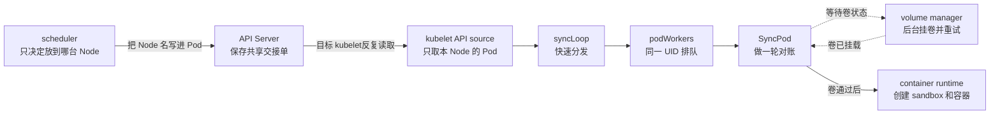

# 第 11 课：`game-api` 已绑定却仍 `FailedMount`——kubelet 为什么不把 Bind 当成一次性创建命令

> 从一次 Spring Boot 滚动发布的 ConfigMap 缺失，读懂持久化交接（把责任写成可重读的记录）、节点级快照（本节点当前 Pod 的全量照片）、`syncLoop`、按 UID 串行的 `podWorkers`，以及可重入的 `SyncPod`（失败后可以再做一轮，不必推倒重来）。

第 10 课结束在 scheduler 把 `game-api-new-x` 绑定到 `worker-05`。API 中已经能看到 `spec.nodeName=worker-05` 和 `PodScheduled=True`，但新 Pod 仍是 `0/2`，Event 反复出现：

```text
Warning  FailedMount  MountVolume.SetUp failed for volume "game-config":
                      configmap "game-api-config" not found
```

先把本章里两个都叫“事件”的东西分开。它们只是英文都叫 Event，作用完全不同：

| 名字 | 大白话 | 本章例子 |
|---|---|---|
| **Watch 对象通知** | apiserver 告诉客户端“某个 API 对象变了”，用来刷新本地看到的对象状态 | `ADDED`、`MODIFIED`、`DELETED` |
| **Kubernetes Event 对象** | 组件写下的一条诊断记录，方便运维人员看“刚才哪里失败了” | `Warning / FailedMount / configmap not found` |

后文单写 `Event` 时，默认指第二种诊断记录；第一种会明确写成“Watch 对象通知”。Watch 通知不是创建容器的命令，`FailedMount` Event 也不是一份可供 kubelet消费的任务。

很多平台同学此时会产生一个很自然、但会妨碍读源码的直觉：

> “scheduler 都已经 Bind 了，为什么 kubelet 没把两个容器创建出来？Bind 难道不是一条发给 kubelet 的创建命令吗？”

不是。一个普通 Pod 从 scheduler 交给 kubelet，不是一次易丢失的远程命令，而是一次**持久状态交接**：scheduler 把 Node 选择写进 apiserver；目标 kubelet 独立观察属于本节点的期望状态，再反复让节点实际状态向它靠拢。源码里把这种“发现没对上就继续补”的过程叫**收敛**。

本章只有一个中心命题：

> **Bind 只把 `worker-05` 写进共享的 Pod 记录，不会直接命令 kubelet创建容器。目标 kubelet随后自己看到这张记录；`syncLoop` 负责分发，`podWorkers` 让同一个 UID 排队执行，`SyncPod` 做一轮“期望和现实的对账”。ConfigMap 补齐后，这个 UID 因而能在原 Node 继续，而不是从头再调度。**

先看一张职责图。**从左往右读**；实线箭头表示“状态或责任交到下一层”，虚线表示“等待或观察结果”，不表示这些组件之间一定有一次同步 RPC（远程函数调用，也就是程序 A 直接调用程序 B）。



图里几个名字先按下面理解，不要求现在背函数：

| 源码名 | 先翻成大白话 | 它不负责什么 |
|---|---|---|
| UID | Pod 这一次生命的身份证；同名重建会换 UID | 不能只用 Pod 名区分新旧生命 |
| API source | kubelet从 apiserver 接收本节点 Pod 的入口 | 不直接创建容器 |
| `syncLoop` | 节点事件的交通警察，只做快速分发 | 不在主循环里等几分钟挂卷 |
| `podWorkers` | 每个 UID 一张最新工单、一个串行工位 | 不保证每个普通中间版本都执行一次 |
| `SyncPod` | 针对一个 Pod 做一轮检查和补差 | 不是“一调用就必须全部成功”的创建事务 |
| volume manager | kubelet里的后台挂卷小组 | 不替 scheduler 重新选 Node |
| container runtime | 真正管理容器的程序，例如 containerd；kubelet通过 CRI 标准接口调用它 | 不决定 Pod 应该去哪台 Node |
| PodSandbox | Pod 里各容器共用的基础运行环境，可先理解成“容器开工前的地基” | 有 sandbox 也不等于业务容器已经 Ready |

先不要执行命令。带着四个问题读本章：

1. scheduler Bind 成功后，如果 scheduler 立刻重启，`worker-05` 为什么仍能接到这个 Pod？
2. 缺失 ConfigMap 时，为什么不应该删除 Pod、重新调度或回滚已经完成的每一步？
3. 同一 UID 连续收到 v2、v3、v4 更新时，为什么不能让三个 goroutine（Go 的轻量并发任务）同时改它，却也不必逐个版本做完？
4. `uid-A` 在等卷时，为什么 `uid-B` 仍可以在同一节点推进？

## 0. 本课定位、深度和两遍阅读路线

这是 kubelet 节点执行主线的 **S3 深读**。S3 是本套材料的深度标记，意思是“能沿调用链反查源码，并能用现场证据判断走到哪一层”，不是 Kubernetes 官方等级。你不是 Kubernetes 使用新手，但可以把自己当成“kubelet 源码和 Go 的新手”。本课不会重新讲怎样创建 Pod、ConfigMap 或使用 `kubectl describe`；会把源码里第一次出现的专有词、状态所有者、并发边界、失败后谁重试讲清楚。

本课读深：

- Binding 怎样最终变成持久 Pod 的 `spec.nodeName`；
- 目标 kubelet 为什么用 field selector（服务端过滤条件）只观察 `spec.nodeName=<自己>` 的普通 Pod；
- 当前版本为什么要区分 watch-list（同一条 Watch 先传初始全量、再接后续变化）与传统 List/Watch（先取全量、再持续接变化）；
- 为什么 Reflector（把 API 状态同步到本地的组件）先把变化还原成完整 snapshot（当前集合的全量照片），再由 PodConfig（把前后照片翻译成 Pod 生命周期动作的一层）按 UID 做 diff（比较前后两张照片）；
- 为什么第一次“空 snapshot”也是重要同步结果；
- `syncLoop` 为什么只做节点级内部触发汇聚，不在主循环里同步创建容器；
- `HandlePodAdditions` 为什么先登记 desired Pod（节点应该管理的 Pod），再做节点本地 admission（节点接单前的最后复核）；
- `podWorkers` 怎样实现同 UID 串行、不同 UID 可并行、普通更新可合并、终止意图不可倒退；
- `SyncPod` 为什么是可重入的收敛脚本，而不是数据库原子事务；
- ConfigMap 缺失、卷等待超时、后台卷重试和 Pod worker 重试怎样分工。

本课只建立边界、不展开：

- CRI（kubelet 与容器运行时之间的标准接口）怎样创建 PodSandbox、拉镜像和创建容器，留到第 12 课；
- PLEG（观察容器变化）、probe（健康检查）、statusManager（汇总并回写 Pod 状态）留到第 13 课；
- static Pod、mirror Pod（static Pod 在 API 中的镜像对象）、file/http source 只解释会改变主结论的分支；
- Device Plugin、DeviceManager、GPU UUID 注入留到第 15～17 课。

建议分两遍。首遍不要从第 1 行硬啃到最后，只走下面 6 站：

| 站点 | 章节锚点 | 这一站只回答什么 |
|---:|---|---|
| 1 | [2.2～2.3](#22-02-的两个容器和缺失依赖) | 现场已经证明什么，还没证明什么 |
| 2 | [5.1～5.4](#51-主接单链) | 整条责任链，以及第一段源码为什么返回 NotFound |
| 3 | [6.3](#63-设计结论bind-成功也不等于-node-已经接受)、[7.1](#71-先在服务端只看属于本-node-的-pod)、[7.4～7.7](#74-podconfig-才把-snapshot-翻译成-kubelet生命周期更新) | Bind 后 kubelet怎样重新看到这个 UID |
| 4 | [8.2～8.4](#82-一个-select-汇聚多种触发但不规定固定优先级)、[9.1～9.4](#91-先用工位和门铃理解) | 为什么主循环不被一个 Pod 堵住，同 UID 又不会并发乱跑 |
| 5 | [10.3～10.5](#103-后半段error阶段推进和-worker-退出不能混为一谈)、[11.2～11.6](#112-一轮收敛的阶段和-early-return) | 失败后 Pod worker 与卷控制环分别怎样再试 |
| 6 | [12.2～12.5](#122-路径-a当前-syncpod-还在-wait原地继续同一轮)、[14.1～14.3](#141-api-侧绑定责任是否已经转移)、[18.1](#181-首遍验收题) | 配置补齐后的两种恢复时序，以及现场怎样取证 |

**首遍读源码的规则：** 第 5.3 节第一段源码逐行读；后面的长函数先读“输入是什么、改了哪本账、失败交给谁”和每段后的“大白话总结”。如果这三件事说不出来，再回到中文行注释逐句读。这样是在学源码主线，不是在逃避源码。

**二遍再补：** `6.1～6.2 -> 7.2～7.3 -> 8.1 -> 9.5 -> 10.1～10.2 -> 11.1、11.7 -> 13 -> 16～17 -> 18.2 -> 19～22`。这遍再处理版本分支、缓存新鲜度、termination（Pod 终止过程）、GPU 映射、Go 语法和测试边界。

## 1. 当前源码基线与阅读约定

```text
源码目录：D:\datou\devops\kubernetes-master\kubernetes
commit：301946d15e67a4a2e8a5fb8292eb836acd366d78
describe：v1.37.0-alpha.0-280-g301946d15e6
源码 go.mod / go.work：go 1.26.0
本机 Go：go1.19.4 windows/amd64
```

本机 Go 低于该源码要求。本课完成的是固定提交下的静态源码核对、交叉审校和讲义机械校验；不能把它说成“相关 Go 单测已在本机成功运行”。生产排障必须切换到目标集群对应的 tag 或发行分支，尤其要重新校准 watch-list、异步 scheduler API 调用、kubelet admission 和 Event 文本。

主文件：

```text
kubernetes/pkg/scheduler/framework/plugins/defaultbinder/default_binder.go
kubernetes/pkg/registry/core/pod/storage/storage.go
kubernetes/pkg/kubelet/config/apiserver.go
kubernetes/pkg/kubelet/config/config.go
kubernetes/staging/src/k8s.io/client-go/tools/cache/reflector.go
kubernetes/staging/src/k8s.io/client-go/tools/cache/undelta_store.go
kubernetes/pkg/kubelet/kubelet.go
kubernetes/pkg/kubelet/pod_workers.go
kubernetes/pkg/kubelet/container/cache.go
kubernetes/pkg/kubelet/volumemanager/volume_manager.go
kubernetes/pkg/volume/configmap/configmap.go
kubernetes/pkg/volume/util/operationexecutor/operation_generator.go
```

> **源码阅读约定：** 标有“教学注释版”的 Go 代码，控制流、变量名、判断顺序和返回关系来自本课固定提交；中文 `//` 是讲义新增，不是 Kubernetes 上游原注释。每条影响控制或业务语义的语句都会就地解释，多行调用只解释一次，单独括号不机械标注。每个代码块会说明是完整函数、连续摘录还是非连续检查点；不会用孤立的省略号冒充被删除的源码。小语法演示会明确标成“Go 示例”。

> **两个反复出现的 Go 名字：** `ctx/context` 是一轮工作的取消、超时和链路信息，不保存 Pod 业务状态；`err/error` 是函数返回的错误值，在某个 error 返回位置上 `nil` 才表示“这里没有错误”。context 只能传递“请停止”的意图，不能强行杀死 goroutine。

> **表格阅读约定：** 默认一行一行看，每一行从左往右读；不带“顺序/阶段/时间”列的表格，各行通常是并列关系，不表示从上往下依次调用。

## 2. 先不执行命令：把 Java 发布现场固定下来

以下是为了教学整理的生产场景，不是某个真实集群的原始事故记录。对象、数字和 UID 会贯穿整章，不在中途偷偷换题。

### 2.1 Deployment 为什么保留旧副本

```yaml
apiVersion: apps/v1
kind: Deployment
metadata:
  name: game-api
  namespace: prod
spec:
  replicas: 3
  strategy:
    type: RollingUpdate
    rollingUpdate:
      maxSurge: 1
      maxUnavailable: 0
```

这是一个 Spring Boot 服务：

- 旧版本 3 个 Pod 都是 `Ready=True`，继续承接游戏请求；
- 新实例完成类加载、连接池建立、JIT（即时编译）预热和 readiness（健康检查放行）大约需要 45 秒；
- `maxUnavailable=0` 表示新实例真正 Ready 前，不主动牺牲旧的可服务副本；
- `maxSurge=1` 允许临时多创建一个新 Pod；
- 第 09～10 课已经算出新 Pod 的有效 request 是 `2000m CPU / 2Gi memory`，并最终绑定到 `worker-05`。

这 45 秒不是装饰信息。它解释了为什么新 Pod 即使卷恢复、容器启动，也不会立刻进入 Service 流量；本课只走到 runtime 边界，业务 Ready 留给第 13 课。

### 2.2 `0/2` 的两个容器和缺失依赖

新 Pod 的两个普通容器是：

| 容器 | 作用 | 与本案有关的事实 |
|---|---|---|
| `game-api` | Spring Boot 主应用 | 启动时读取 `/etc/game/application.yaml` |
| `jmx-exporter` | 暴露 JVM/JMX 指标的 sidecar（和主应用放在同一个 Pod 里的辅助容器） | 即使它自身不需要该 ConfigMap，也要等 Pod 的卷准备阶段整体通过后才进入本章下一阶段 |

相关 Pod spec 简化为：

```yaml
metadata:
  namespace: prod
  name: game-api-new-x
  uid: 3f5f4a90-1111-2222-3333-444444444444
spec:
  nodeName: worker-05
  containers:
  - name: game-api
    volumeMounts:
    - name: game-config
      mountPath: /etc/game/application.yaml
      subPath: application-prod.yaml
  - name: jmx-exporter
  volumes:
  - name: game-config
    configMap:
      name: game-api-config
      optional: false
```

`optional: false` 是本案成立的输入。如果改成 `true`，ConfigMap 不存在时 volume plugin（kubelet里负责某一种卷的代码模块）的行为会变，不能继续套用本章这条失败链。

事故时刻：

```text
namespace: prod
pod:       game-api-new-x
uid:       3f5f4a90-1111-2222-3333-444444444444（后文简称 uid-A）
nodeName:  worker-05
condition: PodScheduled=True
phase:     Pending
kubectl 展示: ContainerCreating
ready:     0/2
关键 Event message:
  MountVolume.SetUp failed for volume "game-config":
  configmap "game-api-config" not found
```

同一台 `worker-05` 上另有一个无卷依赖的新 Pod `metrics-agent-x`，UID 简称 `uid-B`，它可以正常推进。稍后平台补齐 `prod/game-api-config`，`uid-A` 不换 Node、不换 UID，最终继续启动。

### 2.3 先把“事实”和“尚未证明”分开

| 现场证据 | 能证明 | 不能单独证明 |
|---|---|---|
| `spec.nodeName=worker-05` | API 中已经持久化目标 Node | 不能证明 kubelet 已成功创建 sandbox |
| `PodScheduled=True` | 调度责任域已正常越过 | 不能证明节点本地 admission 一定接受 |
| `MountVolume.SetUp failed ... configmap not found` | `worker-05` 的卷执行链尝试过 ConfigMap volume setup | 不能只凭 reason 推出 Pod worker 此刻停在 `SyncPod` 哪一行 |
| `0/2 ContainerCreating` | 两个普通容器都未 Ready，展示原因仍在创建前后阶段 | 不能证明 JVM 已经启动过 |
| 同 UID、同 Node 后来恢复 | 节点执行链具备原地继续收敛能力 | 不能单独区分是当前 `SyncPod` 继续，还是后续一轮重试 |

这里先记一个值班结论：**同一个 `FailedMount` 原因可能由两处代码写出。** 本例完整 message 以 `MountVolume.SetUp failed` 开头，说明是后台“卷操作执行器”在尝试挂卷时写的；`SyncPod` 等卷失败时还有另一处也能写 `FailedMount`。普通等待超时在源码里被归为“等待被打断”，所以不一定再写第二条。只看 reason，不看完整 message，会把两条路径混成一条。第 11 节再对照源码拆开。

### 2.4 先写下你的预测

1. scheduler 是否需要保持在线，直到 kubelet真正创建完容器？
2. kubelet看到一条原始 Watch 对象通知 `ADDED` 后，能否直接在 Watch 回调里启动容器？
3. `game-api-config` 缺失时，scheduler 应不应该把 Pod 换到另一个 Node？
4. API 连续写入同 UID 的 v2、v3、v4 时，节点必须逐条执行吗？
5. 补齐 ConfigMap 会不会直接向 `podWorkers` 的 channel（Go 协程之间传通知的管道）发送“继续”通知？

正确答案会从设计不变量和源码中推出来，而不是先背结论。

## 3. Kubernetes 在这里解决的不是“调用函数”，而是分布式交接

“分布式交接”听起来很大，其实就是：scheduler、API Server、kubelet 是三个会各自重启、网络也可能中断的进程，所以不能把责任交接只放在一次网络通话里，必须留下可以重新读取的记录。

### 3.1 错误方案一：scheduler Bind 后直接 RPC kubelet

假设设计成：

**读图方法：从左往右读。** 这是被 Kubernetes 放弃的假想方案，用来说明一次网络调用为什么不足以完成可靠交接。

```text
scheduler -> worker-05:10250 -> CreatePod(uid-A)
```

它马上遇到一组分布式系统问题：

- scheduler 收到超时，不知道 kubelet是没收到、收到未执行，还是执行后响应丢了；
- scheduler 或网络在 RPC 后立刻故障，谁负责重放？
- kubelet重启后，怎样恢复“应该在本机运行哪些 Pod”的完整集合？
- 同一创建命令重放两次，怎样避免并发创建两套 sandbox/容器？
- scheduler 还要长期跟踪节点执行结果，责任边界会从“选 Node”扩张成“管理每个 Node 的生命周期”。

Kubernetes 选择把交接事实写进 apiserver：持久对象可重读、可重列、可 Watch；scheduler 负责决定并写入，kubelet负责观察并收敛。代价是状态传播存在延迟，组件间只能做到基于观察的最终一致，而不是一个跨组件同步事务。

### 3.2 错误方案二：原始 Watch 对象通知直接启动容器

Watch 是持续接收 API 对象变化的网络连接，不是永不丢失的业务队列。连接会断，resourceVersion（API 对象的并发版本号，不是应用版本号）会过期，kubelet也会重启。初始状态更不能靠“只等未来新增通知”恢复。如果把每个 `ADDED/MODIFIED/DELETED` 当成必须执行一次的命令，会出现：

- 断线期间的对象不知道如何补齐；
- 重连后的全量对象可能被误当成“新建一次”；
- 重复 Watch 通知可能重复产生副作用；
- 同名 Pod 删除重建时，名称相同但 UID 已变，容易串错生命周期；
- source 尚未完成第一次同步时，错误清理本地已有 Pod。

所以 kubelet API source 先得到“当前属于本节点的完整 Pod 集合”，PodConfig 再把前后 snapshot 按 UID 归约成最小生命周期变化。原始传输事件和节点业务动作之间故意隔了一层。

### 3.3 错误方案三：`syncLoop` 收到 Pod 后同步做完整创建

卷挂载可能等待数分钟，镜像拉取可能很慢，runtime 或 CNI（Pod 网络插件接口）也可能阻塞。如果节点唯一的事件主循环亲自等完 `uid-A`：

**读图方法：从上往下读。** 这也是反例：前一个 Pod 的长等待把后面的全节点事件都堵住。

```text
syncLoop 收到 uid-A
  -> 等 ConfigMap/卷 2 分钟以上
  -> 这期间 uid-B、删除、探针、PLEG（容器变化观察）、housekeeping（周期清理检查）都难以及时分发
```

正确分层是：`syncLoop` 做短小的事件分发；耗时的单 Pod 收敛交给按 UID 切分的 worker。收益是不同 Pod 可以推进，代价是必须额外维护 per-UID 状态、锁、channel 和重试队列。

### 3.4 错误方案四：同一 UID 每来一个版本就开一个 goroutine

goroutine 是 Go 的轻量并发任务，可以先把它理解成“成本较低的线程”。如果 v2 正在挂卷，v3 改了 annotation，v4 又开始删除，三个 goroutine 同时操作同一 Pod，可能出现：

- 一个协程创建容器，另一个同时拆卷；
- 旧版本晚完成，覆盖新版本状态；
- grace period（优雅终止的等待时长）被重新放大；
- 同一 UID 的 cleanup 与 setup 交叉。

Kubernetes 要守的是“同一生命周期串行”，而不是“每条事件都执行”。普通期望更新允许合并成最新值；终止一旦开始则只能向前，不能被普通更新覆盖回运行态。

### 3.5 错误方案五：`SyncPod` 失败就删除重建或回滚一切

卷暂时缺失、网络暂时未就绪、镜像仓库短暂失败，往往都是可恢复依赖。如果每次失败都删除 Pod：

- 无意义地重新调度并制造新的 UID；
- 丢失本节点已经完成的目录、部分挂载或镜像缓存收益；
- 控制器看到旧 UID 消失后又创建新 Pod，放大抖动；
- 把节点依赖问题伪装成 scheduler 问题。

`SyncPod` 因此被设计成可重入（同一输入可以安全地再做一轮）的收敛脚本：一轮可以已经做成一部分；后面失败时，不要求把前面成功的步骤全部撤销。下一轮重新读取期望和实际状态，再继续补齐差距。

## 4. 先建立状态所有者、契约与九条不变量

源码里反复出现“哪本账”和“谁拥有状态”。它不是说真的有数据库表，而是在问：**这个事实由谁保存，哪个组件有权修改，故障后从哪里恢复。**

### 4.1 谁拥有哪本账

| 状态/账本 | 主要所有者 | key 或观察维度 | 在本案中回答什么 |
|---|---|---|---|
| Pod desired state（期望状态） | apiserver | `namespace/name` 定位；UID 划生命周期；RV 是 resourceVersion 的简称 | `uid-A` 应在 `worker-05`，并引用哪个 ConfigMap |
| scheduler binding decision | Pod spec/condition | `spec.nodeName`、`PodScheduled` | 调度责任是否已交出 |
| API source snapshot（全量照片） | Reflector + UndeltaStore（把零散对象变化整理成当前全量的内存账本） | Store 使用 `namespace/name` | 当前本节点可见的完整 Pod 集合是什么 |
| PodConfig lifecycle view（生命周期变化账） | `podStorage` | `source -> UID -> Pod`；source 是 Pod 配置来源，本例就是 apiserver | 相邻 snapshot 之间是 ADD、UPDATE、DELETE、REMOVE 还是 RECONCILE（对象没换，只需再对账） |
| 本机 desired Pod（本机期望） | `podManager` | UID / fullname | kubelet认为本机应该管理哪些 Pod |
| 本地已准入资源 | `allocationManager` | UID 与资源分配 | 本节点是否接受该已绑定 Pod |
| per-UID execution state | `podWorkers` | UID | 当前是 syncing、terminating 还是 terminated；有无最新 pending update |
| runtime actual state（容器实际状态） | PLEG / `podCache` | UID | sandbox 和容器实际上处于什么状态；PLEG 是 kubelet观察容器运行变化的组件 |
| volume desired/actual | volume manager | unique Pod name、volume key | 期望挂哪些卷、哪些已经 mounted |
| API status | statusManager | UID | 节点观察结果怎样异步回写 API |

不要把这些 cache（内存里的状态副本）都笼统叫“kubelet缓存”。它们的 key、真相来源和并发边界不同，排障时问错账本就会推出错误结论。

### 4.2 九条设计不变量

1. **交接必须可持久、可重放。** scheduler 或 kubelet重启不能让已绑定 Pod 永久丢失。
2. **普通 Pod 只由目标 Node 的 kubelet接单。** 节点级 server-side field selector 限制观察集合。
3. **传输事件不等于业务命令。** Watch 可以重连、重复，先恢复 snapshot，再计算生命周期变化。
4. **身份以 UID 为生命周期边界。** 同名重建是新 Pod；旧 UID 必须清理，新 UID 必须新增。
5. **source 未完成首次 snapshot 前，不做破坏性孤儿清理。** “完整集合为空”也必须被明确确认。
6. **节点事件主循环不承载长事务。** `syncLoop` 快速分发，耗时操作下沉。
7. **同 UID 串行、不同 UID允许并行。** 允许并行不等于所有下游插件都无等待。
8. **普通更新可收敛到最新值，终止意图只能单调向前。** 不保证中间对象版本逐条执行。
9. **Error 触发补偿或重试，不等于回滚、重调度或删除重建。** 本地 admission 否决是另一类结果；它的 reason 既可能表示资源/策略不满足，也可能封装内部异常，不能一概叫“业务拒绝”。

### 4.3 收益和代价

| 设计选择 | 收益 | 代价 |
|---|---|---|
| apiserver 持久交接 | 组件解耦、故障后可重放 | 观察存在延迟，不能假设瞬时一致 |
| snapshot + UID diff | 能处理重连、重复和同名重建 | 多一层内存状态与 DeepCopy（复制出互不影响的新对象）成本 |
| 首次空 snapshot ready 门 | 防止启动期误删 | 清理要等待所有已配置 source 报到 |
| `syncLoop` 与 worker 分层 | 一个慢 Pod 不阻塞全节点事件分发 | 并发状态机更复杂 |
| 只保留最新普通待办 | 降低更新风暴和重复工作 | 中间普通版本不保证逐条执行 |
| 可重入 `SyncPod` | 暂时失败可原地恢复 | 每一步都必须容忍重复调用和部分副作用 |
| volume 与 Pod worker 双控制环 | 挂载可独立重试，Pod 只等结果 | Event、退避和时间线不再只有一个来源 |

## 5. 白板总图：先看状态流，再进入函数

### 5.1 主接单链

**读图方法：从上往下读。** 箭头表示“上一层留下的状态，被下一层看见并继续处理”；只有缩进到同一个函数下面时，才可以先理解成函数调用。整张图不是一条跨进程同步调用栈。

```text
kube-scheduler
  DefaultBinder.Bind(uid-A, worker-05)
    -> Pod Binding 子资源
    -> apiserver GuaranteedUpdate（带并发检查地更新 Pod）
       spec.nodeName = worker-05
       PodScheduled = True

worker-05 kubelet
  NewSourceApiserver(fieldSelector: spec.nodeName=worker-05)
    -> Reflector 恢复当前完整集合
    -> UndeltaStore 把对象变化重新整理成完整 snapshot
    -> PodConfig 按 source + UID 比较前后 snapshot
    -> PodUpdate{Op: ADD, Pods: [uid-A], Source: "api"}
    -> syncLoopIteration
    -> HandlePodAdditions
       podManager.AddPod
       allocationManager.AddPod
       podWorkers.UpdatePod(SyncPodCreate)
    -> uid-A 的 podWorkerLoop
       -> 等一份上一轮之后重新观察过的 runtime status（容器实际状态快照）
       -> Kubelet.SyncPod
          -> WaitForAttachAndMount
          -> containerRuntime.SyncPod（第 12 课）
```

### 5.2 ConfigMap 缺失时的两条并行时间线

**读图方法：两条线都从上往下走，左右没有固定先后。** Pod worker 负责“等结果”，volume manager 负责“在后台真正尝试挂卷并重试”；二者通过卷的期望/实际状态协作，不是前者每隔几秒直接调用后者一次。

```text
Pod worker 时间线
  SyncPod(uid-A)
    -> WaitForAttachAndMount
       等全部卷 mounted，或及时返回 DSW（卷期望状态账）里的 Pod 级处理 error

Volume manager 时间线
  desired-state populator（把 Pod 所需卷登记进期望账的小组）看见 uid-A 引用 game-api-config
    -> reconciler（反复比较卷期望账和实际账的小组）发起 MountVolume.SetUp
       -> ConfigMap plugin 查询对象
       -> NotFound
       -> FailedMount Event
       -> volume operation 自身退避再试
```

补齐 ConfigMap 不是直接给 `podWorkers` 按门铃。它先改变 ConfigMap manager 和 volume operation 的可成功条件；Pod worker 此时可能仍在当前 wait，也可能已经超时并由自己的 workQueue（记录每个 UID 何时该再工作的日程表）等下一轮。第 12 节会把两种合法时序分别走一遍。

这里的**退避**不是放弃，而是“失败后先等一会再试”，避免依赖还没恢复时疯狂重试把节点和 API 打满。Pod worker 和卷操作各自记自己的下次重试时间。

### 5.3 第一段核心源码：为什么 `optional: false` 会把 NotFound 变成失败

先不追完整调用链，只用第一段 Go 源码回答事故最直接的问题：**ConfigMap 不存在时，哪一行决定继续还是报错？**

源码：`kubernetes/pkg/volume/configmap/configmap.go:189-202`

摘录类型：**`SetUpAt` 内部一段连续摘录，教学注释版**。函数前面已经准备好“把 ConfigMap 内容写成容器内文件”所需的临时目录层（源码叫 wrapper）；这段只展示读取 ConfigMap 和处理 NotFound（对象没找到）的完整判断，后面的文件写入不属于本次失败路径。

```go
// Optional 在 API 类型里是 *bool；只有“字段存在并且值为 true”才允许缺对象。
optional := b.source.Optional != nil && *b.source.Optional
// 用 Pod 的 namespace 和 volume source 里的 name 读取 ConfigMap。
configMap, err := b.getConfigMap(b.pod.Namespace, b.source.Name)
// err != nil 表示这次读取没有拿到正常对象。
if err != nil {
	// 只有“错误是 NotFound”并且“optional=true”才不返回错误。
	if !(errors.IsNotFound(err) && optional) {
		// 写节点日志，保留具体 namespace/name 和底层错误。
		klog.Errorf("Couldn't get configMap %v/%v: %v", b.pod.Namespace, b.source.Name, err)
		// 本例 optional=false，因此 NotFound 从这里返回给上层卷操作。
		return err
	}
	// 只有 optional=true 且对象不存在时，才构造一个空 ConfigMap 继续。
	configMap = &v1.ConfigMap{
		// 空对象仍保留原 namespace/name，供后续统一生成投影内容。
		ObjectMeta: metav1.ObjectMeta{
			// namespace 来自当前 Pod。
			Namespace: b.pod.Namespace,
			// name 来自 volume source。
			Name: b.source.Name,
		},
	}
}
```

**大白话总结：** 本例 `optional=false`，所以 `NotFound && optional` 的结果是 `false`，外层再取反后进入 `return err`。这段只证明“ConfigMap volume setup 失败了”；它还没有证明 Event 在哪写、Pod worker 当时是否正在等待，也没有证明 scheduler 应重新选 Node。后文会把这些责任逐层接上。

**顺手学 Go：** `*bool` 是“指向布尔值的指针”，既能表达 true/false，也能表达字段没有填写的 nil。`&&` 是“并且”，`!` 是“取反”，`*b.source.Optional` 是取出指针里的布尔值。读复合条件时可以代入本例：`IsNotFound=true`、`optional=false`。

### 5.4 章节停止线

本章在下面一行停住：

```text
kl.containerRuntime.SyncPod(...)
```

到这里我们只证明 kubelet完成了接单、per-UID 串行和进入 runtime 前的准备。PodSandbox、CNI（Pod 网络接口/插件）、镜像、容器、Java 进程是否真正启动，必须进入第 12 课，不能在本章提前下结论。

## 6. 为什么 Bind 要写持久对象，而不是调用目标 kubelet

### 6.1 `DefaultBinder` 只构造 Binding 请求

源码：`kubernetes/pkg/scheduler/framework/plugins/defaultbinder/default_binder.go:51-75`

摘录类型：**完整函数，教学注释版**。`APICacher` 是 scheduler 内部管理 API 调用生命周期的一层，不是 kubelet的 Pod 缓存。当前 `SchedulerAsyncAPICalls` 为 Beta 且默认 `false`；`APICacher()` 非空时才走上半分支。异步分支的 `WaitOnFinish` 还可能把 skipped/overwritten 视作可接受生命周期，因此不能把每个 `nil` 都机械翻译成“本次调用刚刚落盘”；真正的持久状态仍要以 apiserver 中的 Pod 为准。

```go
// DefaultBinder 是 receiver，可暂时类比 Java 方法里的 this；state 在当前实现中没有使用。
func (b DefaultBinder) Bind(ctx context.Context, state fwk.CycleState, p *v1.Pod, nodeName string) *fwk.Status {
	// 从 ctx 取本轮带字段的 logger；它不改变绑定状态。
	logger := klog.FromContext(ctx)
	// 构造 Binding 子资源请求：用 namespace/name/UID 锁定 Pod，用 Target 写目标 Node。
	binding := &v1.Binding{
		ObjectMeta: metav1.ObjectMeta{Namespace: p.Namespace, Name: p.Name, UID: p.UID},
		Target:     v1.ObjectReference{Kind: "Node", Name: nodeName},
	}
	// 如果 scheduler 启用了 API cacher，就把 API 调用交给它管理生命周期。
	if b.handle.APICacher() != nil {
		// BindPod 返回完成回调；这里仍不是对 kubelet发 RPC。
		onFinish, err := b.handle.APICacher().BindPod(binding)
		// 请求连提交都失败时，转成 framework Status，调度本轮失败。
		if err != nil {
			return fwk.AsStatus(err)
		}
		// 等待 API cacher 给出该调用的完成语义。
		err = b.handle.APICacher().WaitOnFinish(ctx, onFinish)
		// 等待失败同样返回 framework Status。
		if err != nil {
			return fwk.AsStatus(err)
		}
		// *fwk.Status 返回位置上的 nil 表示插件成功，不是“没有 Pod”。
		return nil
	}
	// 默认非 cacher 路径只记录准备绑定的日志。
	logger.V(3).Info("Attempting to bind pod to node", "pod", klog.KObj(p), "node", klog.KRef("", nodeName))
	// 调 Pod 的 binding 子资源；目的地是 apiserver，不是 worker-05 的 kubelet端口。
	err := b.handle.ClientSet().CoreV1().Pods(binding.Namespace).Bind(ctx, binding, metav1.CreateOptions{})
	// API 返回错误时，把 error 交回 scheduler framework。
	if err != nil {
		return fwk.AsStatus(err)
	}
	// API 调用成功，Bind 插件返回成功。
	return nil
}
```

**大白话总结：** 输入是 Pod、选中的 `nodeName` 和本轮 context；函数输出只说明 Bind 插件/API 调用的结果。两条分支都没有“连接 worker-05 并创建容器”。本例真正跨组件的交接物是 Binding 请求最终更新后的 Pod。

**顺手学 Go：** `func (b DefaultBinder) Bind(...) *fwk.Status` 中 `(b DefaultBinder)` 是 receiver；Go 没有 Java class 继承，这只表示该方法属于这个类型的方法集。返回类型是指针，所以 `return nil` 在这里代表“没有失败 Status”，要按返回位置解释，不能统一把 `nil` 读成错误。

### 6.2 apiserver 原子地把 Binding 变成 Pod 状态

源码：`kubernetes/pkg/registry/core/pod/storage/storage.go:213-270`

摘录类型：**完整函数，教学注释版**。上层 `BindingREST.Create` 已完成类型、URL 名称和 Binding 合法性校验，然后调用此函数。这个函数是 scheduler Binding 与 kubelet field selector 之间最关键、也最容易被旧讲义漏掉的桥。

```go
// 该函数只在 Pod 仍可绑定时，原子更新 nodeName、metadata 和 PodScheduled condition。
func (r *BindingREST) setPodNodeAndMetadata(ctx context.Context, podUID types.UID, podResourceVersion, podID, machine string, annotations, labels map[string]string, dryRun bool) (finalPod *api.Pod, err error) {
	// 按请求上下文和 Pod 名计算底层存储 key。
	podKey, err := r.store.KeyFunc(ctx, podID)
	// key 无法计算时立即返回；后面的持久更新完全没有发生。
	if err != nil {
		return nil, err
	}

	// preconditions 为空表示没有 UID/RV 前置条件；有任一值才创建结构体。
	var preconditions *storage.Preconditions
	if podUID != "" || podResourceVersion != "" {
		preconditions = &storage.Preconditions{}
		// UID 防止同名重建后把旧 Binding 写到新 Pod。
		if podUID != "" {
			preconditions.UID = &podUID
		}
		// resourceVersion 防止基于过期对象覆盖并发变化。
		if podResourceVersion != "" {
			preconditions.ResourceVersion = &podResourceVersion
		}
	}

	// GuaranteedUpdate 在存储层做带前置条件的原子读改写；闭包拿到当时的最新 Pod。
	err = r.store.Storage.GuaranteedUpdate(ctx, podKey, &api.Pod{}, false, preconditions, storage.SimpleUpdate(func(obj runtime.Object) (runtime.Object, error) {
		// runtime.Object 必须断言成内部 api.Pod，ok=false 表示类型不符合预期。
		pod, ok := obj.(*api.Pod)
		if !ok {
			return nil, fmt.Errorf("unexpected object: %#v", obj)
		}
		// 正在删除的 Pod 不再允许获得一个新 Node 责任人。
		if pod.DeletionTimestamp != nil {
			return nil, fmt.Errorf("pod %s is being deleted, cannot be assigned to a host", pod.Name)
		}
		// 已绑定 Pod 不允许被第二次覆盖到另一个 Node。
		if pod.Spec.NodeName != "" {
			return nil, fmt.Errorf("pod %v is already assigned to node %q", pod.Name, pod.Spec.NodeName)
		}
		// schedulingGates 尚未清空说明 Pod 还不具备绑定资格。
		if len(pod.Spec.SchedulingGates) != 0 {
			return nil, fmt.Errorf("pod %v has non-empty .spec.schedulingGates", pod.Name)
		}
		// 这行才把目标 Node 写入权威 Pod spec；本例 machine 就是 worker-05。
		pod.Spec.NodeName = machine
		// 当前 feature 开启时，绑定后清除已经过时的 nominatedNodeName 提示。
		if utilfeature.DefaultFeatureGate.Enabled(kubefeatures.ClearingNominatedNodeNameAfterBinding) {
			pod.Status.NominatedNodeName = ""
		}
		// annotations map 可能是 nil，写入前必须初始化。
		if pod.Annotations == nil {
			pod.Annotations = make(map[string]string)
		}
		// 合并 Binding 随附的 annotation；同 key 会覆盖 Pod 旧值。
		for k, v := range annotations {
			pod.Annotations[k] = v
		}
		// 当前特性开启时，Binding labels 也按既定策略覆盖到 Pod。
		if utilfeature.DefaultFeatureGate.Enabled(kubefeatures.PodTopologyLabelsAdmission) {
			copyLabelsWithOverwriting(pod, labels)
		}
		// 同一个原子更新里把 PodScheduled condition 置为 True。
		podutil.UpdatePodCondition(&pod.Status, &api.PodCondition{
			Type:   api.PodScheduled,
			Status: api.ConditionTrue,
		})

		// 保存最终对象，供外层返回；同时把更新后的 Pod交给存储层写入。
		finalPod = pod
		return pod, nil
	}), dryRun, nil)
	// 返回存储层最终对象和错误；err != nil 时不能假定以上修改已成功持久化。
	return finalPod, err
}
```

**大白话总结：** apiserver 不是盲目写一个字符串。这个函数支持调用方可选提供 UID/RV 前置条件；本章 `DefaultBinder` 构造的 Binding 实际携带 UID、未携带 ResourceVersion，因此本次至少用 UID 防止同名重建串绑。随后它拒绝正在删除、已经绑定或仍有 scheduling gate 的 Pod，最后把 `spec.nodeName=worker-05` 与 `PodScheduled=True` 写进持久对象。这才是 kubelet稍后能够重放接单的依据。

**顺手学 Go：** `(finalPod *api.Pod, err error)` 是**命名返回值**，函数体可以给它们赋值，最后直接 `return finalPod, err`。`obj.(*api.Pod)` 是类型断言，两个返回值分别是转换后的指针和是否成功的布尔值。传给 `storage.SimpleUpdate` 的匿名函数是 closure，它能读写外层的 `finalPod`。

### 6.3 设计结论：Bind 成功也不等于 Node 已经接受

到这里，以下结论必须分开：

**读图方法：从上往下读。** 第一行只证明 API 中的绑定事实；每个“不等于”都是下一层还要单独取得的证据。

```text
Binding 持久成功
  = API 已把 worker-05 记录为 uid-A 的目标 Node

不等于
  worker-05 kubelet已观察到 uid-A
不等于
  节点本地 admission 已接受 uid-A
不等于
  volume 已 mounted
不等于
  runtime 已创建 sandbox/container
不等于
  Spring Boot 已 Ready
```

这也是为什么 `PodScheduled=True` 后仍然可能 `Pending`。状态没有矛盾，只是不同责任域的进度不同。

## 7. 为什么 kubelet不把原始 Watch 对象通知当成创建命令

### 7.1 先在服务端只看属于本 Node 的 Pod

源码：`kubernetes/pkg/kubelet/config/apiserver.go:35-67`

摘录类型：**两个相邻的完整函数，教学注释版**。ListWatch 是把“取当前全量”和“持续接后续变化”组合起来的客户端入口。第一个函数建立本 Node 的 ListWatch，并等待 Node informer（长期同步 API 对象到本地缓存的组件）完成第一次同步；第二个函数把 Reflector、UndeltaStore 和下游 snapshot channel 接起来。

```go
// NewSourceApiserver 为当前 nodeName 创建普通 API Pod source。
func NewSourceApiserver(logger klog.Logger, c clientset.Interface, nodeName types.NodeName, nodeHasSynced func() bool, updates chan<- sourceUpdate) {
	// field selector 在 apiserver 端限制为 spec.nodeName=<本节点>，不是拉全群 Pod 后本地过滤。
	lw := cache.NewListWatchFromClient(c.CoreV1().RESTClient(), "pods", metav1.NamespaceAll, fields.OneTermEqualSelector("spec.nodeName", string(nodeName)))

	// Pod source 要等 Node informer 的初始缓存同步完成后再启动。
	logger.Info("Waiting for node sync before watching apiserver pods")
	// go 关键字启动独立 goroutine，避免构造 kubelet时同步阻塞。
	go func() {
		// 每秒检查一次初始 Node cache 是否已同步。
		for {
			if nodeHasSynced() {
				logger.V(4).Info("node sync completed")
				break
			}
			time.Sleep(WaitForAPIServerSyncPeriod)
			logger.V(4).Info("node sync has not completed yet")
		}
		// 通过门后才真正启动 Pod Reflector。
		logger.Info("Watching apiserver")
		newSourceApiserverFromLW(lw, updates)
	}()
}

// newSourceApiserverFromLW 把完整对象集合发送给 PodConfig，而不是暴露原始 Watch 对象通知。
func newSourceApiserverFromLW(lw cache.ListerWatcher, updates chan<- sourceUpdate) {
	// send 是 closure：输入 Store 的完整对象 slice，输出类型化 Pod snapshot。
	send := func(objs []interface{}) {
		// 初始为空 slice，表示当前 snapshot 中还没有 Pod。
		var pods []*v1.Pod
		// 把 interface{} 逐个断言为 *v1.Pod。
		for _, o := range objs {
			pods = append(pods, o.(*v1.Pod))
		}
		// 发送的是完整 sourceUpdate；这里没有 ADD/UPDATE 操作类型。
		updates <- sourceUpdate{Pods: pods}
	}
	// Reflector 把服务端状态镜像进 UndeltaStore；Store 变化时 send 收到完整 List。
	r := cache.NewReflector(lw, &v1.Pod{}, cache.NewUndeltaStore(send, cache.MetaNamespaceKeyFunc), 0)
	// Reflector 长期运行；NeverStop 表示此处没有通过 stop channel 结束它。
	go r.Run(wait.NeverStop)
}
```

**大白话总结：** `worker-05` 只订阅 `spec.nodeName=worker-05` 的 Pod。scheduler 不需要知道 kubelet何时在线；只要持久对象仍在，kubelet恢复 source 后就能重新得到完整集合。这里的 Node `HasSynced` 只是一道初始缓存门，不等于 Node 一定存在、Ready，也不证明后续 Watch 永远健康。

**顺手学 Go：** `chan<- sourceUpdate` 表示**只写 channel**，编译器禁止函数从它读取。`go func() { ... }()` 是立即启动匿名函数的 goroutine。`var pods []*v1.Pod` 得到的是 nil slice；它的 `len` 为 0，在这里可作为空集合安全地 `append`，但底层表示与 `make([]*v1.Pod, 0)` 不完全相同。`[]interface{}` 是可装不同动态类型的 slice；`o.(*v1.Pod)` 在这里依赖 Reflector 的对象类型契约，断言失败会 panic，并不是带 `ok` 的安全分支。

### 7.2 【二遍版本边界】当前版本不应写死“永远先 List 再 Watch”

先把三个词翻成人话：`List` 是“拿一张当前全量照片”，`Watch` 是“持续接收后续变化”，`watch-list` 是“用同一条 Watch 连接先传初始全量、再接后续变化”。很多旧教程把 Reflector 画成固定的：

**读图方法：从左往右读。** 这是设计抽象，不是在保证网络请求永远只有这一种顺序。

```text
LIST 得到初始全量 -> 从 resourceVersion 开始 WATCH 增量
```

这仍是正确的**抽象模型**：先建立一致的当前集合，再持续接收变化。但在本课固定提交里，client-go 的 `WatchListClient` 从 v1.35 起默认开启，生产 client 支持时会优先用 watch-list。

**下面从上往下读。** `synthetic Added` 是“为了拼出初始全量而发送的模拟 Added”，不表示这些 Pod 刚刚新建；Bookmark 是“初始全量到这里结束”的书签标记，不是 Kubernetes Event；fallback 是“首选方案失败后退回兼容方案”。

```text
WATCH(sendInitialEvents=true)
  -> 一串 synthetic Added 构造 temporaryStore（临时集合）
  -> initial-events-end Bookmark 确认初始集合结束
  -> Replace 到目标 Store
  -> 复用同一 watch 流接后续事件

若 client/server 不支持或该路径失败
  -> fallback 到传统 List + Watch
```

源码：`kubernetes/staging/src/k8s.io/client-go/tools/cache/reflector.go:470-509`

摘录类型：**完整函数，教学注释版**。它展示选择分支和 fallback；`watchList` 如何收集 synthetic Added、等待 Bookmark、再 `Replace`（用完整集合整体替换 Store），放到二遍源码断点，不在首遍展开网络细节。

```go
// ListAndWatchWithContext 建立初始一致状态，然后进入持续 watch。
func (r *Reflector) ListAndWatchWithContext(ctx context.Context) error {
	// logger 跟随本次 context，便于把同一次同步的日志串起来。
	logger := klog.FromContext(ctx)
	logger.V(3).Info("Listing and watching", "type", r.typeDescription, "reflector", r.name)
	// err 保存初始化错误；w 保存可能由 watch-list 提前建立的 watch 流。
	var err error
	var w watch.Interface
	// feature 未开启时，一开始就决定走传统 List。
	fallbackToList := !r.useWatchList

	// 函数退出时若已有 watch，保证 Stop，避免网络资源泄漏。
	defer func() {
		if w != nil {
			w.Stop()
		}
	}()

	// 当前默认优先尝试 watch-list。
	if r.useWatchList {
		// 成功时同时得到初始 snapshot 和可继续复用的 watch。
		w, err = r.watchList(ctx)
		// 没有 watch 也没有 error，表示 stop channel 已关闭，属于正常结束。
		if w == nil && err == nil {
			return nil
		}
		// watch-list 初始化失败时不立刻结束，改走兼容的传统 List。
		if err != nil {
			logger.V(4).Info(
				"Data couldn't be fetched in watchlist mode. Falling back to regular list. This is expected if watchlist is not supported or disabled in kube-apiserver.",
				"err", err,
			)
			fallbackToList = true
			// 丢掉失败分支可能留下的流，避免把无效对象交给后续 watch。
			w = nil
		}
	}

	// 未使用或未成功使用 watch-list 时，先做传统 List 恢复初始集合。
	if fallbackToList {
		err = r.list(ctx)
		if err != nil {
			return err
		}
	}

	// 到这里 Store 已有初始一致状态；进入通用 watchWithResync。本 source 的 resyncPeriod=0，不做“对象没变也定期重发”的 Resync。
	logger.V(2).Info("Caches populated", "type", r.typeDescription, "reflector", r.name)
	return r.watchWithResync(ctx, w)
}
```

**大白话总结：** “先恢复全量，再追增量”是稳定设计；“第一个 HTTP 请求一定是 List”不是当前版本事实。讲生产问题时应依赖前者，抓包或对照测试时再区分 watch-list 和传统路径。

**顺手学 Go：** `defer` 会把匿名函数安排在当前函数返回前执行，常用于释放资源。`fallbackToList := !r.useWatchList` 中 `:=` 在当前作用域声明并赋值；`!` 是布尔取反。`return r.watchWithResync(ctx, w)` 会直接把被调函数的一个 `error` 作为当前函数返回值。

### 7.3 【二遍实现】为什么把增量重新变成完整 snapshot

`UndeltaStore` 这个名字容易把人绕进去。Store 就是 client-go 在内存里保存的对象集合。首遍只记：**上游给它单个对象的增加、修改或删除；它每次都把 Store 当前完整列表推给下游。**

源码：`kubernetes/staging/src/k8s.io/client-go/tools/cache/undelta_store.go:45-89`

摘录类型：**连续摘录，教学注释版**。区间包含 `Add/Update/Delete/Replace/NewUndeltaStore` 五个完整函数；结构体和并发示例注释放在源码链接中。`Store` 的 key 使用 `MetaNamespaceKeyFunc`，即 `namespace/name`，UID 生命周期判断要等下一层 PodConfig。

```go
// Add 先把新对象放进 Store，再把 Store 当前完整 List 推给下游。
func (u *UndeltaStore) Add(obj interface{}) error {
	// 底层 Store.Add 失败时不能 push 一个并未成功写入的新状态。
	if err := u.Store.Add(obj); err != nil {
		// 把底层写入 error 原样交给 Reflector。
		return err
	}
	// Add 成功后读取并推送当前完整集合。
	u.PushFunc(u.Store.List())
	// 本次 Add 和 push 已完成。
	return nil
}

// Update 的外部表现同样是“更新一个对象后 push 完整集合”。
func (u *UndeltaStore) Update(obj interface{}) error {
	// 底层 Update 失败时停止，不向下游声称 snapshot 已变化。
	if err := u.Store.Update(obj); err != nil {
		// 返回具体 Store error。
		return err
	}
	// Update 成功后推送更新后的完整集合。
	u.PushFunc(u.Store.List())
	// 本次 Update 完成。
	return nil
}

// Delete 删除 Store 中的对象，再 push 删除后的完整集合。
func (u *UndeltaStore) Delete(obj interface{}) error {
	// 先删除对象；失败时旧 snapshot 仍是当前事实。
	if err := u.Store.Delete(obj); err != nil {
		// 返回删除 error，不制造下游变化。
		return err
	}
	// 删除成功后推送不再包含该对象的完整集合。
	u.PushFunc(u.Store.List())
	// 本次 Delete 完成。
	return nil
}

// Replace 用初始 list 或 relist 结果整体替换 Store，再 push 完整集合。
func (u *UndeltaStore) Replace(list []interface{}, resourceVersion string) error {
	// Store.Replace 必须先成功，resourceVersion 也由底层 Store 同步接收。
	if err := u.Store.Replace(list, resourceVersion); err != nil {
		// 替换失败时返回 error，不能推送半成品。
		return err
	}
	// 替换成功后把完整新集合交给 Pod source。
	u.PushFunc(u.Store.List())
	// 本次 Replace 完成。
	return nil
}

// NewUndeltaStore 组合一个普通 Store 和收到完整集合时执行的 pushFunc。
func NewUndeltaStore(pushFunc func([]interface{}), keyFunc KeyFunc) *UndeltaStore {
	// 返回组合后的指针，后续由 Reflector 通过 Store 接口调用。
	return &UndeltaStore{
		// keyFunc 决定底层 Store 的对象 key，本例是 namespace/name。
		Store:    NewStore(keyFunc),
		// PushFunc 保存下游 snapshot 回调。
		PushFunc: pushFunc,
	}
}
```

**大白话总结：** Reflector 可以收到增量，但 kubelet Pod source 的下游每次看到的是“目前完整有哪些 Pod”。这让断线重连、Replace 和重复通知都能回到同一个 snapshot 模型。源码明确允许并发时两次 `PushFunc` 得到相同集合；下一层必须把重复 snapshot 当正常 no-op（什么也不用做），而不是重复创建。

**顺手学 Go：** `if err := call(); err != nil` 把 `err` 的作用域限制在这条 `if/else` 结构里。`func([]interface{})` 是函数类型，说明 `PushFunc` 可像值一样保存在结构体中。`&UndeltaStore{...}` 返回结构体指针；字段名初始化不依赖书写顺序。

### 7.4 PodConfig 才把 snapshot 翻译成 kubelet生命周期更新

`UndeltaStore` 的完整集合进入 `PodConfig` 后，才出现 kubelet语义上的 `ADD/UPDATE/DELETE/REMOVE/RECONCILE`。这里有三层容易混淆的 key：

| 层 | key/组织方式 | 作用 |
|---|---|---|
| apiserver Pod | `namespace/name` 定位；UID/RV 可作前置条件 | 权威对象、生命周期身份与并发版本 |
| UndeltaStore | `namespace/name` | 镜像当前对象集合 |
| `podStorage` | `source -> UID -> Pod` | 比较同一 source 的前后生命周期 |

`PodConfig.updates` 是容量 50 的有界 channel（Go 组件之间传值的通道）。它不是无限消息仓库，也没有“满了就悄悄丢掉”的分支。下游长期不消费时，发送方会等；这种“后面堵住，压力向前传”的现象叫**反压**，会逐层传回 `Merge`、mux（把多个 source 汇成一路的组件）、source 和 Reflector。

### 7.5 `Merge` 为什么先算完，再按固定顺序发 PodUpdate

源码：`kubernetes/pkg/kubelet/config/config.go:139-175`

摘录类型：**完整函数，教学注释版**。`s.merge` 在内存中算出本轮五种差异；外层 `Merge` 用 `updateLock` 让多个 source 的输出保持严格顺序。

```go
// Merge 把一个 source 的完整 snapshot 归一化成零个或多个最小 PodUpdate。
func (s *podStorage) Merge(ctx context.Context, source string, update sourceUpdate) error {
	// updateLock 串行化“计算差异 + 发送结果”，避免不同 source 输出交错。
	s.updateLock.Lock()
	// 无论正常还是提前返回，函数退出前都释放锁。
	defer s.updateLock.Unlock()

	// 记录该 source 在本轮前是否已经至少发送过一次完整 snapshot。
	seenBefore := s.sourcesSeen.Has(source)
	// 内层按 UID 计算五类生命周期差异，同时更新 podStorage 的当前 snapshot。
	adds, updates, deletes, removes, reconciles := s.merge(ctx, source, update)
	// 前面没见过、内层之后见过，说明这正是第一次完整 snapshot。
	firstSet := !seenBefore && s.sourcesSeen.Has(source)

	// 先发从 snapshot 消失的旧 UID，处理旧生命周期清理。
	if len(removes.Pods) > 0 {
		s.updates <- *removes
	}
	// 再发新出现的 UID。
	if len(adds.Pods) > 0 {
		s.updates <- *adds
	}
	// 再发同 UID 的语义更新。
	if len(updates.Pods) > 0 {
		s.updates <- *updates
	}
	// 再发同 UID 开始优雅删除的变化。
	if len(deletes.Pods) > 0 {
		s.updates <- *deletes
	}
	// 第一次 snapshot 即使为空，也发一个空 ADD，通知 kubelet“这个 source 已完整报到”。
	if firstSet && len(adds.Pods) == 0 && len(updates.Pods) == 0 && len(deletes.Pods) == 0 {
		s.updates <- *adds
	}
	// 最后发只需重新对账、不代表 spec 语义改变的 RECONCILE。
	if len(reconciles.Pods) > 0 {
		s.updates <- *reconciles
	}

	// 当前 Merge 自身没有额外 error 分支；成功完成发送后返回 nil。
	return nil
}
```

**大白话总结：** PodConfig 不是把每条 Watch 事件原样转发。它先把完整 snapshot 与旧账比较，再按 `REMOVE -> ADD -> UPDATE -> DELETE -> RECONCILE` 输出。重复 snapshot 可以正常产生零个业务动作。第一次空 snapshot 例外地发空 ADD，因为“确实没有 Pod”和“我还没同步完”必须区分。

**顺手学 Go：** `defer s.updateLock.Unlock()` 常和 `Lock()` 成对，减少中途 return 忘记解锁的风险。`adds, updates, deletes, removes, reconciles := ...` 是多返回值；变量名相似，但每个指针指向不同 `PodUpdate`。`s.updates <- *adds` 中 `<-` 表示向 channel 发送，`*adds` 把指针解引用成值。

### 7.6 UID diff 为什么能识别同名重建

源码：`kubernetes/pkg/kubelet/config/config.go:177-248`

摘录类型：**完整函数，教学注释版**。内部 closure `updatePodsFunc` 比较新旧 UID；函数末尾 `copyPods` 会对输出做 `DeepCopy`，避免下游修改 `podStorage` 内部对象。

```go
// merge 在 podLock 下比较某个 source 的旧 snapshot 和新 snapshot。
func (s *podStorage) merge(ctx context.Context, source string, update sourceUpdate) (adds, updates, deletes, removes, reconciles *kubetypes.PodUpdate) {
	// podLock 保护 s.pods 这本 source -> UID 账。
	s.podLock.Lock()
	defer s.podLock.Unlock()
	// 本轮 logger 从 context 继承字段。
	logger := klog.FromContext(ctx)

	// 五个 slice 分别积累本轮差异，初始都为空。
	addPods := []*v1.Pod{}
	updatePods := []*v1.Pod{}
	deletePods := []*v1.Pod{}
	removePods := []*v1.Pod{}
	reconcilePods := []*v1.Pod{}

	// 取出该 source 上一轮按 UID 保存的 snapshot。
	pods := s.pods[source]
	// 第一次看到 source 时先建一张空 UID map。
	if pods == nil {
		pods = make(map[types.UID]*v1.Pod)
	}

	// closure 把 newPods 逐个放入新 map，并与 oldPods 中同 UID 对象比较。
	updatePodsFunc := func(newPods []*v1.Pod, oldPods, pods map[types.UID]*v1.Pod) {
		// 先过滤当前 source 不接受的无效 Pod。
		filtered := filterInvalidPods(logger, newPods, source, s.recorder)
		// 逐个处理新 snapshot 里的 Pod。
		for _, ref := range filtered {
			// source annotation 参与 kubelet内部归属；map 为 nil 时先初始化。
			if ref.Annotations == nil {
				ref.Annotations = make(map[string]string)
			}
			ref.Annotations[kubetypes.ConfigSourceAnnotationKey] = source
			// 普通 API Pod 记录“从 Watch 首次观察到”的启动时延指标；static Pod 不走这条统计。
			if !kubetypes.IsStaticPod(ref) {
				s.startupSLIObserver.ObservedPodOnWatch(ref, time.Now())
			}
			// oldPods 按 UID 查找；found=true 表示仍是同一生命周期。
			if existing, found := oldPods[ref.UID]; found {
				// 新 map 继续保存原指针，再由检查函数就地更新它。
				pods[ref.UID] = existing
				// 区分 spec 语义更新、status 对账和优雅删除。
				needUpdate, needReconcile, needGracefulDelete := checkAndUpdatePod(existing, ref)
				if needUpdate {
					updatePods = append(updatePods, existing)
				} else if needReconcile {
					reconcilePods = append(reconcilePods, existing)
				} else if needGracefulDelete {
					deletePods = append(deletePods, existing)
				}
				// 同 UID 已处理，不再走新 Pod ADD 分支。
				continue
			}
			// 旧 map 没有该 UID：记录首次看到时间，并分类为 ADD。
			recordFirstSeenTime(logger, ref)
			pods[ref.UID] = ref
			addPods = append(addPods, ref)
		}
	}

	// 无论 snapshot 是否为空，都把 source 标记为已完成至少一次 SET 语义。
	logger.V(4).Info("Setting pods for source", "source", source)
	s.markSourceSet(source)
	// oldPods 指向上一轮 map；新建 pods map 表示完整替换，不是增量追加。
	oldPods := pods
	pods = make(map[types.UID]*v1.Pod)
	// 把本轮完整 snapshot 写入新 map，同时分类 ADD/UPDATE/DELETE/RECONCILE。
	updatePodsFunc(update.Pods, oldPods, pods)
	// 遍历旧 UID；任何没有出现在新 map 的 UID 都是 REMOVE。
	for uid, existing := range oldPods {
		if _, found := pods[uid]; !found {
			removePods = append(removePods, existing)
		}
	}

	// 用新 map 替换该 source 的当前 snapshot。
	s.pods[source] = pods

	// 为五类结果构造不可混淆的 PodUpdate；copyPods 在内部做 DeepCopy。
	adds = &kubetypes.PodUpdate{Op: kubetypes.ADD, Pods: copyPods(addPods), Source: source}
	updates = &kubetypes.PodUpdate{Op: kubetypes.UPDATE, Pods: copyPods(updatePods), Source: source}
	deletes = &kubetypes.PodUpdate{Op: kubetypes.DELETE, Pods: copyPods(deletePods), Source: source}
	removes = &kubetypes.PodUpdate{Op: kubetypes.REMOVE, Pods: copyPods(removePods), Source: source}
	reconciles = &kubetypes.PodUpdate{Op: kubetypes.RECONCILE, Pods: copyPods(reconcilePods), Source: source}

	// 按命名返回位置交回五类差异。
	return adds, updates, deletes, removes, reconciles
}
```

**大白话总结：** 关键不是 Pod 名，而是 UID。若 `prod/game-api-new-x` 被删后同名重建，新 snapshot 会同时表现为“旧 UID 不见了”和“新 UID 第一次出现”，因此可以先 REMOVE 旧生命周期、再 ADD 新生命周期。若同 UID 对象完全重复，则五个输出都可以为空，这是正确 no-op。

**顺手学 Go：** `map[types.UID]*v1.Pod` 是 UID 到 Pod 指针的 map。`if existing, found := oldPods[ref.UID]; found` 同时取值和存在标记。`updatePodsFunc := func(...) {}` 是 closure，它能向外层的五个 slice `append`。slice 是描述底层数组的轻量结构，`append` 可能返回新的 slice 头，所以必须把结果重新赋值。

`checkAndUpdatePod` 的分类边界要说精确：

| 输入变化 | PodConfig 输出 | 说明 |
|---|---|---|
| 旧 map 没有新 UID | `ADD` | 即使对象一出现就带 `deletionTimestamp`，首次仍是 ADD；podWorkers 后续会锁存 termination |
| 同 UID 的 Spec/Labels/有效 Annotations 等发生语义变化，且新对象 `DeletionTimestamp==nil` | `UPDATE` | resourceVersion 自增本身不等于语义更新；删除时间变化要按下一行判断 |
| 同 UID 发生语义变化，且新对象带 `deletionTimestamp` | `DELETE` | syncLoop 把它按 update 交给 worker，开始优雅终止 |
| 旧 UID 从完整 snapshot 消失 | `REMOVE` | 表示 source 已不再期望它存在 |
| 语义没变，只有 Status 变化 | `RECONCILE` | kubelet要重新对齐自己负责的 status |
| 完全重复 snapshot | 无输出 | 正常 no-op |

### 7.7 第一次空 snapshot 为什么是“防误删安全门”

第一次 API snapshot 如果一个 Pod 都没有，`Merge` 仍发送：

```text
PodUpdate{Op: ADD, Pods: [], Source: "api"}
```

它不是无意义空消息，真实链路是：

**读图方法：从上往下读。** 每一层只把“这个 source 已完成第一次完整同步”交给下一层，直到删除安全门真正打开。

```text
API source 得到完整空 snapshot
  -> podStorage.markSourceSet("api")
  -> Merge 发送空 ADD
  -> syncLoop 消费后 sourcesReady.AddSource("api")
  -> PodConfig.SeenAllSources 同时确认：
       1. 配置过哪些 source
       2. podStorage 收到过哪些 source 的完整 snapshot
       3. syncLoop 已消费过哪些 source
```

如果只用“当前 map 为空”判断，kubelet启动早期无法区分：

**读图方法：上下两行是两个容易混淆的状态，不是先后步骤。**

```text
真的完整同步后为空
vs
还没来得及从 apiserver 得到任何对象
```

而 `deletePod` 和 housekeeping 都可能清理本地 runtime 对象。当前源码在 `sourcesReady.AllReady()==false` 时拒绝删除或跳过 housekeeping，避免把“尚未同步到”的 Pod 误判成孤儿。这是首遍就应掌握的安全设计，不是冷门边角。

## 8. 为什么 `syncLoop` 只做节点级事件分发

### 8.1 外层主循环先守住 runtime 全局健康

源码：`kubernetes/pkg/kubelet/kubelet.go:2615-2661`

摘录类型：**完整函数，教学注释版**。它展示 runtime 整体不健康时的全局退避，以及正常情况下每轮只让 `syncLoopIteration` 处理一个 ready 事件。

```go
// syncLoop 是 kubelet节点级主事件循环，不是某个 Pod 专属 worker。
func (kl *Kubelet) syncLoop(ctx context.Context, updates <-chan kubetypes.PodUpdate, handler SyncHandler) {
	// 取带 context 的 logger，记录主循环生命周期。
	logger := klog.FromContext(ctx)
	logger.Info("Starting kubelet main sync loop")
	// 每秒检查 workQueue 中是否有到期的 per-UID 工作；Pod 默认同步间隔更长。
	syncTicker := time.NewTicker(time.Second)
	defer syncTicker.Stop()
	// housekeeping 使用独立 ticker 触发节点清理。
	housekeepingTicker := time.NewTicker(housekeepingPeriod)
	defer housekeepingTicker.Stop()
	// PLEG channel 提供 runtime 生命周期变化。
	plegCh := kl.pleg.Watch()
	// runtime 整体不可用时，退避从 100ms 指数增长到 5s。
	const (
		base   = 100 * time.Millisecond
		max    = 5 * time.Second
		factor = 2
	)
	duration := base
	// resolv.conf 限制属于节点全局检查，不针对单个 Pod。
	if kl.dnsConfigurer != nil && kl.dnsConfigurer.ResolverConfig != "" {
		kl.dnsConfigurer.CheckLimitsForResolvConf(klog.FromContext(ctx))
	}

	// 主循环持续运行，直到 iteration 明确返回 false。
	for {
		// runtimeErrors 是全局健康门；失败时本轮不消费任何 Pod/PLEG/probe channel。
		if err := kl.runtimeState.runtimeErrors(); err != nil {
			logger.Error(err, "Skipping pod synchronization")
			// 当前实现用 sleep 做指数退避。
			time.Sleep(duration)
			duration = time.Duration(math.Min(float64(max), factor*float64(duration)))
			continue
		}
		// runtime 恢复后把全局退避重置为 100ms。
		duration = base

		// 记录主循环活性时间，供健康检查观察。
		kl.syncLoopMonitor.Store(kl.clock.Now())
		// iteration 从多个 channel 中选择一个 ready 事件并分发；false 表示退出。
		if !kl.syncLoopIteration(ctx, updates, handler, syncTicker.C, housekeepingTicker.C, plegCh) {
			break
		}
		// 一轮分发返回后再次刷新活性时间。
		kl.syncLoopMonitor.Store(kl.clock.Now())
	}
}
```

**大白话总结：** 正常情况下，`syncLoop` 是事件交通警察；runtime 整体不健康则是少数会让它暂停所有通道消费的全局门。暂停期间 PodConfig 容量 50 的输出 channel 可能逐渐塞满，然后形成反压，而不是悄悄丢更新。

**顺手学 Go：** `<-chan kubetypes.PodUpdate` 表示只读 channel。`time.NewTicker` 创建按固定间隔“响一次”的定时器；它需要 `Stop()`，所以用 `defer` 收尾。`const (...)` 把一组常量放在同一声明块。`continue` 直接开始下一轮 `for`，`break` 则结束循环。

### 8.2 一个 `select` 汇聚多种触发，但不规定固定优先级

`syncLoopIteration` 的 channel 包括：

- PodConfig updates；
- PLEG runtime 事件；
- workQueue 到期后的周期 sync；
- liveness/readiness/startup probe；
- containerManager 设备/资源更新；
- housekeeping。

多个 case 同时 ready 时，Go `select` 不提供“源码从上到下固定优先级”。当前函数也没有 `ctx.Done()` case；它主要通过 config channel 关闭返回 `false`，而生产 `PodConfig.updates` 当前没有普通关闭路径。

源码：`kubernetes/pkg/kubelet/kubelet.go:2695-2732`

摘录类型：**连续摘录，教学注释版**。区间只保留 config channel 这个完整 case，并在下一个 `plegCh` case 前停止；其他 case 已在上表交代。

```go
// 每轮 select 等待任一节点事件；这里从 config channel case 开始。
func (kl *Kubelet) syncLoopIteration(ctx context.Context, configCh <-chan kubetypes.PodUpdate, handler SyncHandler,
	syncCh <-chan time.Time, housekeepingCh <-chan time.Time, plegCh <-chan *pleg.PodLifecycleEvent) bool {
	// logger 继承本轮 kubelet context。
	logger := klog.FromContext(ctx)
	// select 等任一 channel ready；这里展示 configCh case。
	select {
	// 两个返回值分别是 PodUpdate 和 channel 是否仍开启。
	case u, open := <-configCh:
		// channel 被关闭是退出主 sync loop 的边界。
		if !open {
			// 记录退出原因，便于测试或异常场景诊断。
			logger.Error(nil, "Update channel is closed, exiting the sync loop")
			// false 由外层 syncLoop 用来 break。
			return false
		}

		// PodConfig 已完成 diff；这里按 Op 选择短小 handler。
		switch u.Op {
		case kubetypes.ADD:
			// ADD 表示当前这次 podStorage 生命周期首次见到这些 UID；kubelet重启后，既有 Pod 也会重新以 ADD 重放。
			logger.V(2).Info("SyncLoop ADD", "source", u.Source, "pods", klog.KObjSlice(u.Pods))
			// additions handler 因此既处理真正新 Pod，也处理 kubelet恢复后的重新接单。
			handler.HandlePodAdditions(ctx, u.Pods)
		case kubetypes.UPDATE:
			// UPDATE 记录同 UID 语义变化。
			logger.V(2).Info("SyncLoop UPDATE", "source", u.Source, "pods", klog.KObjSlice(u.Pods))
			// 更新交给 updates handler。
			handler.HandlePodUpdates(ctx, u.Pods)
		case kubetypes.REMOVE:
			// REMOVE 表示旧 UID 已从完整 snapshot 消失。
			logger.V(2).Info("SyncLoop REMOVE", "source", u.Source, "pods", klog.KObjSlice(u.Pods))
			// remove handler 负责清 desired 账并触发终止/补偿。
			handler.HandlePodRemoves(ctx, u.Pods)
		case kubetypes.RECONCILE:
			// RECONCILE 只需较低等级记录，因为 spec 语义未变。
			logger.V(4).Info("SyncLoop RECONCILE", "source", u.Source, "pods", klog.KObjSlice(u.Pods))
			// reconcile handler 重新对齐状态。
			handler.HandlePodReconcile(ctx, u.Pods)
		case kubetypes.DELETE:
			// DELETE 表示同 UID 对象已出现优雅删除语义。
			logger.V(2).Info("SyncLoop DELETE", "source", u.Source, "pods", klog.KObjSlice(u.Pods))
			// 优雅删除仍保留对象，因此按 UPDATE 交给 podWorkers 锁存 termination。
			handler.HandlePodUpdates(ctx, u.Pods)
		default:
			// 非法 Op 只记录错误；当前代码随后仍会把 source 标成已消费。
			logger.Error(nil, "Invalid operation type received", "operation", u.Op)
		}

		// 包括空 ADD 在内，只要该 source 更新被这一层消费，就登记 ready。
		kl.sourcesReady.AddSource(u.Source)
```

**大白话总结：** `syncLoopIteration` 不重新判断 Pod 差异，也不亲自挂卷或创建容器；它只是把已经归一化的事件派给正确 handler。`DELETE` 走 update handler 是因为对象仍在，只是生命周期开始终止；`REMOVE` 才表示它已从 source snapshot 消失。

**顺手学 Go：** `select` 用于等待多个 channel case；多个 case 同时就绪时不会按书写顺序承诺固定选择。`case u, open := <-configCh` 的 `open=false` 表示 channel 已关闭。`switch` 每个 case 默认不会像 C 那样自动 fall-through。

同一函数还有一个很适合 Go 初学者的正常 no-op：`syncCh` 到期后，如果 `getPodsToSync()` 为空，源码在该 case 内执行 `break`。这里的 `break` 只退出当前 `select`，随后函数走到末尾 `return true`；它不会退出外层 `syncLoop`。所以“一秒 ticker 到了但没有到期 UID”是正常空转一次，不是主循环终止。

### 8.3 `HandlePodAdditions` 为什么先入本机 desired 账，再做 admission

源码：`kubernetes/pkg/kubelet/kubelet.go:2832-2908`

摘录类型：**完整函数，教学注释版**。本例是普通 API Pod；mirror Pod、已终止 Pod和 InPlace resize 是二遍分支，但不能从源码中删除，因为它们解释了哪些路径不会走普通 admission。

```go
// HandlePodAdditions 处理一批当前 podStorage 生命周期的 ADD；kubelet重启时，其中也可能是已经存在或运行中的 Pod。
func (kl *Kubelet) HandlePodAdditions(ctx context.Context, pods []*v1.Pod) {
	// start 用于度量这一批从 handler 到 worker 反应的等待时间。
	start := kl.clock.Now()
	logger := klog.FromContext(ctx)
	// Store.List 没有业务顺序；排序让更早创建的 Pod 先尝试本地 admission。
	sort.Sort(sliceutils.PodsByCreationTime(pods))
	// 当前版本 feature 开启时，收集需要回填的 in-place resize UID。
	var pendingResizes []types.UID
	// 一个批次逐 Pod 做短小登记和派发，不在这里同步执行 SyncPod。
	for _, pod := range pods {
		// 无论后续是否准入，都先进入 podManager 这本本机 desired 账。
		kl.podManager.AddPod(pod)

		// 让证书管理器开始跟踪该 Pod 的相关需求。
		kl.podCertificateManager.TrackPod(ctx, pod)

		// 解析 static Pod 与 mirror Pod 的配对关系；普通 API Pod 的 wasMirror=false。
		pod, mirrorPod, wasMirror := kl.podManager.GetPodAndMirrorPod(pod)
		if wasMirror {
			// 找不到对应 static Pod 的孤立 mirror 只记录并跳过。
			if pod == nil {
				logger.V(2).Info("Unable to find pod for mirror pod, skipping", "mirrorPod", klog.KObj(mirrorPod), "mirrorPodUID", mirrorPod.UID)
				continue
			}
			// 找到配对时按 Update 交给既有 worker，不走普通新 Pod admission。
			kl.podWorkers.UpdatePod(ctx, UpdatePodOptions{
				Pod:        pod,
				MirrorPod:  mirrorPod,
				UpdateType: kubetypes.SyncPodUpdate,
				StartTime:  start,
			})
			continue
		}

		// 已请求终止或 API phase 已终态时跳过新准入，但仍要交给 worker 完成终止状态机。
		if !kl.podWorkers.IsPodTerminationRequested(pod.UID) && !podutil.IsPodPhaseTerminal(pod.Status.Phase) {
			// allocationManager 用节点当前已准入资源再做一次本地 admission。
			if ok, reason, message := kl.allocationManager.AddPod(kl.GetActivePods(), pod); !ok {
				// 拒绝会写 Event 和 PodFailed，不会撤销 API 中的 spec.nodeName。
				kl.rejectPod(ctx, pod, reason, message)
				// admission 指标在这里按一次新 Pod 拒绝记录。
				recordAdmissionRejection(reason)
				// continue 很关键：被拒绝 Pod 不进入普通 podWorkers.UpdatePod。
				continue
			}

			// 当前版本开启原地纵向扩缩时，从 allocation checkpoint 回填实际准入资源。
			if utilfeature.DefaultFeatureGate.Enabled(features.InPlacePodVerticalScaling) {
				_, updatedFromAllocation := kl.allocationManager.UpdatePodFromAllocation(pod)
				if updatedFromAllocation {
					pendingResizes = append(pendingResizes, pod.UID)
				}
			}
		}
		// 普通 game-api 到这里以 SyncPodCreate 写入 per-UID worker。
		kl.podWorkers.UpdatePod(ctx, UpdatePodOptions{
			Pod:        pod,
			MirrorPod:  mirrorPod,
			UpdateType: kubetypes.SyncPodCreate,
			StartTime:  start,
		})
	}
	// 所有 ADD 都登记完成后，当前 feature 才统一回填和重试 pending resize。
	if utilfeature.DefaultFeatureGate.Enabled(features.InPlacePodVerticalScaling) {
		kl.statusManager.BackfillPodResizeConditions(pods)
		for _, uid := range pendingResizes {
			kl.allocationManager.PushPendingResize(uid)
		}
		if len(pendingResizes) > 0 {
			kl.allocationManager.RetryPendingResizes(allocation.TriggerReasonPodsAdded)
		}
	}
}
```

**大白话总结：** 对普通 `uid-A`，顺序是 `podManager.AddPod -> allocationManager.AddPod -> podWorkers.UpdatePod`。先登记 desired state 不代表已经准入；本地 admission 否决后 Pod 仍在本机 desired 账和 API 的 `worker-05` 绑定上，但不会进入普通创建 worker。ADD 也不严格等于“集群刚创建”：kubelet重启后，apiserver 中已经存在甚至正在运行的 Pod 会在这次内存生命周期里重新以 ADD 接单并再次经过本地 admission，当前实现甚至可能在此时被否决。scheduler Bind 与 kubelet admission 是两道不同责任域的门。

**顺手学 Go：** `for _, pod := range pods` 中 `_` 明确丢弃下标。`if ok, reason, message := call(); !ok` 把三个返回值限定在这个 `if` 结构。`continue` 跳到下一次 `for`，所以它是否存在会直接改变后续 `UpdatePod` 是否执行。结构体字面量 `UpdatePodOptions{...}` 用字段名传参，类似 Java builder 的可读性，但它不是方法链。

### 8.4 为什么 scheduler 通过了，本地 admission 仍可能拒绝

scheduler 使用自己的 cache 做集群范围的选择；从调度快照到 kubelet真正接单之间，节点实际资源、端口、设备或系统状态可能变化。**本地 admission** 就是 kubelet按节点此刻的真实情况再过一道门：能接就继续，不能接就记录原因并拒绝，不负责重新挑 Node。

源码：`kubernetes/pkg/kubelet/allocation/allocation_manager.go:611-625`

摘录类型：**完整函数，教学注释版**。`AddPod` 在外层持有 `allocationMutex`，必要时读取已经准入或已经写入 checkpoint（节点磁盘上的恢复记录）的资源，再调用本函数。

```go
// canAdmitPod 让所有本地 admit handler 依次判断这个 Pod 是否能在当前节点运行。
func (m *manager) canAdmitPod(logger klog.Logger, allocatedPods []*v1.Pod, pod *v1.Pod, operation lifecycle.Operation) (bool, string, string) {
	// 评估更新/重启时先移除同 UID，避免把 Pod 自己重复计算成竞争者。
	allocatedPods = slices.DeleteFunc(allocatedPods, func(p *v1.Pod) bool { return p.UID == pod.UID })

	// attrs 同时携带 incoming Pod、其他已准入 Pod 和本次操作类型。
	attrs := &lifecycle.PodAdmitAttributes{Pod: pod, OtherPods: allocatedPods, Operation: operation}
	// 任意一个 handler 拒绝就立即返回第一个拒绝原因。
	for _, podAdmitHandler := range m.admitHandlers {
		if result := podAdmitHandler.Admit(attrs); !result.Admit {
			logger.Info("Pod admission denied", "podUID", attrs.Pod.UID, "pod", klog.KObj(attrs.Pod), "reason", result.Reason, "message", result.Message, "operation", operation)
			return false, result.Reason, result.Message
		}
	}

	// 所有 handler 通过；空 reason/message 与 true 一起表示接受。
	return true, "", ""
}
```

**大白话总结：** 本地 admission 是 Node 的最后保护门，不是第二个 scheduler。否决结果是 `false + reason + message`，`HandlePodAdditions` 会写 Event、把 Pod 标为 Failed 并停止普通创建；它不会擅自清空 `spec.nodeName` 或重新选 Node，上层控制器后续如何补副本是另一条控制链。这里没有独立 `error` 返回槽：资源/策略不满足和 `InvalidNodeInfo`（节点信息无效）、`UnexpectedAdmissionError`（准入内部异常）都可能被编码成 `Admit=false + reason/message`，值班时要继续按 reason/message 分层。

**顺手学 Go：** `func(p *v1.Pod) bool { return p.UID == pod.UID }` 是传给 `DeleteFunc` 的匿名判断函数。内层参数也叫 `p`，外层目标 Pod 叫 `pod`，作用域不同。Go 多返回值让 `bool/reason/message` 形成显式否决契约，但这里恰好没有单独 `error`，所以不能仅凭返回形状区分资源/策略不满足和内部异常。

还有一个二遍再看的特殊边界：启用 InPlacePodVerticalScaling（Pod 不重建就调整资源）时，`AddPod` 在 admission 通过后写 allocation checkpoint，也就是把已经准入的资源记录到节点磁盘，供重启后恢复。当前代码若写失败只记录日志，仍返回 admission 成功。因此“checkpoint 写失败”不是本函数这次拒绝 Pod 的分支。

到这里，`uid-A` 已完成：

**读图方法：从上往下读。** 每一行都是下一道门；上一行成功不自动代表下一行也成功。

```text
API 持久绑定
  -> 目标 kubelet快照观察
  -> PodConfig ADD
  -> syncLoop 分发
  -> podManager 登记
  -> 本地 admission 通过
```

接下来才进入本章最重要的并发边界：为什么不是 `HandlePodAdditions` 直接调用 `SyncPod`，而要先进入 `podWorkers`。

## 9. 为什么 `podWorkers` 要给每个 UID 一个串行工位

### 9.1 先用“工位”和“门铃”理解

先别背 `actor`、`latest-value worker`、`FIFO mailbox` 这些词。把一个 UID 想成一个维修工位：

- `pendingUpdate` 是桌上那张**最新工单**，保存真正的 Pod 内容；
- `podUpdates[uid]` 是容量 1 的**门铃**，只表达“桌上有活了”，不装 Pod 内容；
- 工人忙时又来普通新工单，可以用 v4 覆盖还没做的 v3；
- 同一 UID 只有一个 worker goroutine，所以上一轮结束后才开始下一轮；
- 不同 UID 有不同 worker，因此 `uid-A` 等卷时，`uid-B` 可以运行自己的 `SyncPod`；
- `podLock` 是所有 UID 共用的一把短锁，“临界区”就是拿着这把锁读写共享状态的那小段时间；耗时的 `SyncPod` 不拿着它；
- volume、runtime、device 等下游还可能按自己的资源 key 串行，所以“不同 UID 可并行”不等于“所有底层操作保证同时完成”。

如果以后在并发资料里看到 **latest-value worker**，说的就是“普通待办只保留最新值”；看到 **FIFO**，说的是“先进先出、每条都按顺序保留”。`podWorkers` 不是完整 FIFO 消息队列。

对本例可以画成：

**读图方法：两行都从左往右读，代表两个独立 UID；最下面三行说明共享锁只在取放工单时短暂使用。**

```text
uid-A:
  pendingUpdate -> [容量 1 的门铃] -> worker-A -> SyncPod -> FailedMount/wait

uid-B:
  pendingUpdate -> [容量 1 的门铃] -> worker-B -> SyncPod -> 正常推进

共享 podLock 只保护取放状态的短时间
worker-A 等卷时不持有 podLock
所以 worker-B 可以进入自己的 SyncPod
```

### 9.2 `UpdatePod` 为什么把“工单内容”和“门铃通知”分开

源码：`kubernetes/pkg/kubelet/pod_workers.go:941-995`

摘录类型：**连续摘录，教学注释版**。源码里的 payload 就是“真正的工单内容”。该区间是 `UpdatePod` 的后半段：前半段已经按 UID 建立/读取 `podSyncStatus`，拒绝已经彻底结束的 worker，并把删除、终态、kill 和优雅退出时间缩短等不可逆事实锁存进状态机；本段负责创建 worker、覆盖最新待办内容和发门铃通知。

```go
// 先按 UID 查是否已有通知 channel；每个 UID 最多一个常驻 worker channel。
podUpdates, exists := p.podUpdates[uid]
if !exists {
	// 容量 1 足以表达“至少有一份待处理工作”，发送方不会因 worker 正忙而阻塞。
	podUpdates = make(chan struct{}, 1)
	p.podUpdates[uid] = podUpdates

				// static Pod 还要按 fullname 排队；普通 API Pod uid-A 不进入这个分支。
	if kubetypes.IsStaticPod(pod) {
		p.waitingToStartStaticPodsByFullname[status.fullname] =
			append(p.waitingToStartStaticPodsByFullname[status.fullname], uid)
	}

	// 测试可以包装 channel 以注入延迟；生产通常直接使用 podUpdates。
	var outCh <-chan struct{}
	if p.workerChannelFn != nil {
		outCh = p.workerChannelFn(uid, podUpdates)
	} else {
		outCh = podUpdates
	}

	// 只在首次 UID 时启动一个 goroutine；后续更新复用它。
	go func() {
		// worker panic 交给统一 crash handler；退出时记录日志。
		defer runtime.HandleCrash()
		defer logger.V(3).Info("Pod worker has stopped", "podUID", uid)
		// 正确顺序是先进入 loop，收到通知后 loop 内再调用 startPodSync。
		p.podWorkerLoop(ctx, uid, outCh)
	}()
}

// 若已经有 pending update，保留更早的 StartTime，度量最大排队延迟。
if status.pendingUpdate != nil && !status.pendingUpdate.StartTime.IsZero() && status.pendingUpdate.StartTime.Before(options.StartTime) {
	options.StartTime = status.pendingUpdate.StartTime
}

// 新 options 覆盖 pending payload；普通中间版本不保证逐条进入 worker。
status.pendingUpdate = &options
// 当前 feature 开启时，用 allocationManager 中已准入资源修正 pending Pod。
if utilfeature.DefaultFeatureGate.Enabled(features.InPlacePodVerticalScaling) {
	status.pendingUpdate.Pod, _ = p.allocationManager.UpdatePodFromAllocation(options.Pod)
}
// working=true 表示已有待处理或正在处理的工作。
status.working = true
updateLogger.V(4).Info("Notifying pod of pending update", "workType", status.WorkType())
// 非阻塞按门铃：空 channel 写入一个 struct{}；已有门铃时 default 直接跳过。
select {
case podUpdates <- struct{}{}:
default:
}

// 只有开始 termination 或 grace period 进一步缩短，才取消当前 worker context。
if (becameTerminating || wasGracePeriodShortened) && status.cancelFn != nil {
	updateLogger.V(3).Info("Cancelling current pod sync", "workType", status.WorkType())
	status.cancelFn()
	return
}
```

**大白话总结：** `UpdatePod` 返回只代表“最新工单已经放上桌，并尽力按了门铃”，绝不代表 `SyncPod` 已执行完成。v2、v3、v4 在 worker 忙时可能压缩成 v4；到底执行几个版本取决于并发时序，但最终最新普通期望会被看到。创建 goroutine 的代码也证明了正确调用顺序是 `UpdatePod -> podWorkerLoop -> startPodSync`。

**顺手学 Go：** `make(chan struct{}, 1)` 创建容量 1 的 channel；空结构体 `struct{}` 不携带 payload，通常只做信号。`go func() { ... }()` 启动匿名 goroutine。带 `default` 的 `select` 是非阻塞发送：channel 已满时不会等待。`status.pendingUpdate.Pod, _ = ...` 丢弃第二个返回值，表示当前代码只关心修正后的 Pod。

### 9.3 为什么普通更新可覆盖，删除却不会被忘掉

在写 `pendingUpdate` 之前，`UpdatePod` 已经把不可逆事实“锁存”进 `podSyncStatus`。锁存就是一旦记下就不允许普通更新把它改回去：

| 事实 | 锁存字段/规则 | 后续普通 update 能否倒退 |
|---|---|---|
| API 有 `deletionTimestamp` | `terminatingAt`、`deleted=true` | 不能 |
| kubelet主动 kill/evict | `terminatingAt`，必要时 `evicted=true` | 不能 |
| Pod phase 已 Failed/Succeeded | `terminatingAt` | 不能回到 SyncPod |
| grace period | 只能选择更短的有效值 | 不能重新放大 |
| termination 已完成 | `terminatedAt` / `finished` | 普通 update 不会让同 UID 重新创建 |

`WorkType()` 的优先级也很直接：

**读图方法：从上往下检查，命中第一条就停止。**

```text
terminatedAt 已设置    -> TerminatedPod
否则 terminatingAt 已设置 -> TerminatingPod
否则                    -> SyncPod
```

所以即使一次删除更新的 `options` 后来被另一个普通 options 覆盖，生命周期方向已经锁进 status；worker 计算出的 WorkType 仍是终止。这就是“payload 可合并，生命周期不能倒退”。对应测试是 `TestUpdatePodDoesNotForgetSyncPodKill`。

### 9.4 `startPodSync` 怎样原子取走最新工作

这里的“原子”不是数据库事务，而是“在同一把锁里完成读取、取走和清空，其他 goroutine 不能只看见做到一半的状态”。

后面代码会出现 `runtime-only orphan`：它指 API Pod 已经不在了，但 container runtime 里还残留 sandbox 或容器的“孤儿运行对象”，只能清理，不能再按普通 Pod 启动。

源码：`kubernetes/pkg/kubelet/pod_workers.go:1122-1209`

摘录类型：**完整函数，教学注释版**。这个函数由 `podWorkerLoop` 在收到门铃后调用；它持有短时 `podLock`，消费 pending update、清空旧门铃、建立本轮 context，并决定 Pod 能否开始。

```go
// startPodSync 取走某 UID 的 pending update，并决定本轮是否能开始。
func (p *podWorkers) startPodSync(parentCtx context.Context, podUID types.UID) (ctx context.Context, update podWork, canStart, canEverStart, ok bool) {
	// 所有 per-UID 状态都在同一把 podLock 下原子读取和修改。
	p.podLock.Lock()
	defer p.podLock.Unlock()

	// UID 状态已被 housekeeping 清除时，worker 应退出。
	status, ok := p.podSyncStatuses[podUID]
	if !ok {
		return nil, update, false, false, false
	}
	logger := klog.FromContext(parentCtx)
	// working=false 却收到门铃属于内部状态异常，只记录诊断。
	if !status.working {
		logger.V(4).Info("Pod should be marked as working by the pod worker, programmer error", "podUID", podUID)
	}
	// 没有 payload 却收到通知同样属于空唤醒；清 working 后让 loop 继续等待。
	if status.pendingUpdate == nil {
		status.working = false
		logger.V(4).Info("Pod worker received no pending work, programmer error?", "podUID", podUID)
		return nil, update, false, false, false
	}

	// WorkType 从已经锁存的生命周期状态计算，不只看本次 options.UpdateType。
	update.WorkType = status.WorkType()
	// 复制最新 pending payload 到本轮局部变量。
	update.Options = *status.pendingUpdate
	// 清空槽位；worker 执行期间的新 update 会重新写入 pendingUpdate。
	status.pendingUpdate = nil
	// 在同一把锁下排空容量 1 的旧门铃，避免同一 payload 被空唤醒两次。
	select {
	case <-p.podUpdates[podUID]:
	default:
	}

	// 为本轮建立可取消 context，并把 cancelFn 留在 status 供 termination 使用。
	ctx, status.cancelFn = context.WithCancel(parentCtx)

	// 已开始过的 Pod 直接合并最新可见状态，本轮可以继续。
	if status.IsStarted() {
		status.mergeLastUpdate(update.Options)
		return ctx, update, true, true, true
	}

	// runtime-only orphan 已进入 termination 时，允许它直接走终止，不会尝试 setup。
	if update.Options.RunningPod != nil && update.WorkType == TerminatingPod {
		status.mergeLastUpdate(update.Options)
		return ctx, update, true, true, true
	}

	// 只有 RunningPod、没有 API Pod spec 时，永远不能启动，只能清理。
	if update.Options.Pod == nil {
		status.mergeLastUpdate(update.Options)
		logger.V(4).Info("Running pod cannot start ever, programmer error", "pod", klog.KObj(update.Options.Pod), "podUID", podUID, "updateType", update.WorkType)
		return ctx, update, false, false, true
	}

	// allowPodStart 处理 static fullname 排队等启动边界；普通 API Pod通常可直接开始。
	canStart, canEverStart = p.allowPodStart(logger, update.Options.Pod)
	switch {
	// 永远不能启动时，清理未启动 Pod 并结束 worker 生命周期。
	case !canEverStart:
		p.cleanupUnstartedPod(logger, update.Options.Pod, status)
		status.working = false
		if start := update.Options.StartTime; !start.IsZero() {
			metrics.PodWorkerDuration.WithLabelValues("terminated").Observe(metrics.SinceInSeconds(start))
		}
		logger.V(4).Info("Pod cannot start ever", "pod", klog.KObj(update.Options.Pod), "podUID", podUID, "updateType", update.WorkType)
		return ctx, update, canStart, canEverStart, true
	// 暂时不能启动时，把同一 options 放回 pending 槽，等待后续重新唤醒。
	case !canStart:
		status.pendingUpdate = &update.Options
		status.working = false
		logger.V(4).Info("Pod cannot start yet", "pod", klog.KObj(update.Options.Pod), "podUID", podUID)
		return ctx, update, canStart, canEverStart, true
	}

	// 首次允许启动时记录 startedAt，并把本轮期望暴露给下游组件。
	status.startedAt = p.clock.Now()
	status.mergeLastUpdate(update.Options)

	// 记录首次准入 Pod 包含的普通容器数量。
	metrics.ContainersPerPodCount.Observe(float64(len(update.Options.Pod.Spec.Containers)))

	// 五个返回值依次表示 context、工作、当前可开始、未来可开始和是否有有效事件。
	return ctx, update, true, true, true
}
```

**大白话总结：** worker 收到门铃后才调用 `startPodSync`。它在锁内把 pending payload 变成本轮局部工作，并把槽位清空；随后真正的 `SyncPod` 在锁外执行。这样 worker 忙时新 update 可以安全落入新的 pending 槽，而不同 UID 不会因一把长时间全局锁互相堵塞。

**顺手学 Go：** 该函数使用五个命名返回值，但每个 `return` 仍显式写出，便于看清分支。`context.WithCancel` 返回子 context 和取消函数。`case <-channel` 表示接收并丢弃值；配合 `default` 实现“如果有旧门铃就排空，没有就继续”。`switch` 没有表达式时等价于一组按顺序判断的布尔 case。

### 9.5 同 UID 串行与不同 UID并行的准确边界

| 结论 | 源码依据 | 不应过度推出 |
|---|---|---|
| 同 UID 一轮结束后才开始下一轮 | 一个 UID 一个 `podWorkerLoop`，loop 内同步调用 sync 方法 | 不代表普通对象版本逐条执行 |
| 不同 UID 有独立 goroutine | 首次 UID 各自 `go p.podWorkerLoop(...)` | 不保证 volume plugin、CRI 或磁盘不会共享锁/限流 |
| `podSyncer` 必须线程安全 | `podWorkers` 字段注释明确不同 Pod 可同时调用 | 不代表同一 UID 会并发调用它 |
| 普通 API Pod 的不同 UID 可分别开始 | static fullname 排队是专门旁支 | 不要把 static Pod 规则套到 Deployment Pod |

这解释了事故现场：`uid-A` 等 `game-api-config` 时，`uid-B` 的 worker 可以继续。若全节点所有 Pod 同时卡住，要优先怀疑第 8.1 节的 runtime 全局门、磁盘/CRI 全局故障或其他共享依赖，而不是把“单 UID FailedMount”泛化成 syncLoop 停摆。

## 10. 一轮 worker 到底怎样调用 `SyncPod`，失败后谁让它再来

### 10.1 前半段：门铃、runtime status 和三阶段分发

源码：`kubernetes/pkg/kubelet/pod_workers.go:1231-1314`

摘录类型：**`podWorkerLoop` 的第一段连续摘录，教学注释版**。该段从函数入口到一次 sync 调用返回；下一小节继续同一函数的错误、阶段推进和补偿，两个代码块合起来覆盖完整函数体。

```go
// 每个 UID 的 worker 在自己的通知 channel 上串行循环。
func (p *podWorkers) podWorkerLoop(parentCtx context.Context, podUID types.UID, podUpdates <-chan struct{}) {
	// 记录上一轮 sync 结束时间，要求下一轮先得到此时间之后重新观察过的 runtime 状态。
	var lastSyncTime time.Time
	// channel 每收到一次通知才进入一轮；channel 关闭时 loop 结束。
	for range podUpdates {
		// 门铃响后才在这里取 pendingUpdate、建 context、判断是否能开始。
		ctx, update, canStart, canEverStart, ok := p.startPodSync(parentCtx, podUID)
		// 空唤醒或 UID 状态已消失时，不执行 sync。
		if !ok {
			continue
		}
		logger := klog.FromContext(ctx)
		// 生命周期已判定永远不能启动，worker 直接退出。
		if !canEverStart {
			return
		}
		// 只是暂时不能开始时，继续等后续通知。
		if !canStart {
			continue
		}

		// 从 options 统一取得本轮 UID 和日志对象引用。
		podUID, podRef := podUIDAndRefForUpdate(update.Options)

		logger.V(4).Info("Processing pod event", "pod", podRef, "podUID", podUID, "updateType", update.WorkType)
		// isTerminal 只在普通 SyncPod 发现生命周期终态时使用。
		var isTerminal bool
		// 用立即执行 closure 把 status 获取、sync 分发和 error 组合成一个返回值。
		err := func() error {
			var status *kubecontainer.PodStatus
			var err error
			switch {
			// runtime-only orphan 必然走终止，不需要先取完整 PodStatus。
			case update.Options.RunningPod != nil:
			default:
				// 等到 cache 至少在 lastSyncTime 之后重新观察过该 UID/runtime 全局状态。
				status, err = p.podCache.GetNewerThan(update.Options.Pod.UID, lastSyncTime)

				// cache 返回错误时写 FailedSync，本轮不进入任何 Sync*Pod。
				if err != nil {
					p.recorder.Eventf(update.Options.Pod, v1.EventTypeWarning, events.FailedSync, "error determining status: %v", err)
					return err
				}
			}

			// 根据锁存的 WorkType 选择 setup、terminating 或 terminated 阶段。
			var postSync func()
			switch {
			// 最终资源清理阶段。
			case update.WorkType == TerminatedPod:
				err = p.podSyncer.SyncTerminatedPod(ctx, update.Options.Pod, status)

			// 停容器阶段。
			case update.WorkType == TerminatingPod:
				var gracePeriod *int64
				if opt := update.Options.KillPodOptions; opt != nil {
					gracePeriod = opt.PodTerminationGracePeriodSecondsOverride
				}
				// 先确认 worker 已正式接管 termination，避免后续再启动新容器。
				podStatusFn := p.acknowledgeTerminating(logger, podUID)

				// runtime-only orphan 与有完整 API Pod 的终止入口不同。
				if update.Options.RunningPod != nil {
					err = p.podSyncer.SyncTerminatingRuntimePod(ctx, update.Options.RunningPod)
				} else {
					err = p.podSyncer.SyncTerminatingPod(ctx, update.Options.Pod, status, gracePeriod, podStatusFn)
				}

			// 普通 setup/reconcile 阶段；uid-A 首轮走这里。
			default:
				isTerminal, postSync, err = p.podSyncer.SyncPod(ctx, update.Options.UpdateType, update.Options.Pod, update.Options.MirrorPod, status)
			}

			// 无论 sync 成功还是失败，都记录本轮完成观察的时间边界。
			lastSyncTime = p.clock.Now()
			// 某些 SyncPod 返回延迟执行函数时，在本轮错误处理前调用。
			if postSync != nil {
				postSync()
			}

			// 把本轮 error 交给 loop 后半段分类。
			return err
		}()
```

**大白话总结：** 调用顺序现在完整了：`podWorkerLoop` 收门铃，调用 `startPodSync` 取工作，再等一份满足时间新鲜度的 runtime status，最后按生命周期调用一个 `Sync*Pod`。`uid-A` 此时走普通 `Kubelet.SyncPod`；如果 status cache 先失败，连 `SyncPod` 都不会进入。

**顺手学 Go：** `for range podUpdates` 只关心 channel 是否有值和是否关闭，不接收具体 payload。`err := func() error { ... }()` 定义后立即执行 closure，用来缩小局部变量作用域。`switch { case condition: }` 是布尔 switch。`postSync` 的类型是 `func()`，nil 表示没有回调。

### 10.2 `GetNewerThan` 是时间新鲜度门，不是强一致读

源码：`kubernetes/pkg/kubelet/container/cache.go:108-112`

摘录类型：**完整函数，教学注释版**。内部 `subscribe/getIfNewerThan` 在 `cache.go:181-239` 判断三种时间：该 UID status 的 modified time、observed time，或 runtime 全局 cache timestamp。

```go
// GetNewerThan 会阻塞，直到订阅条件满足或底层给出数据；函数自身没有 context 参数。
func (c *cache) GetNewerThan(id types.UID, minTime time.Time) (*PodStatus, error) {
	// subscribe 若已有足够新的数据，会立刻返回一个已放值的 channel；否则登记订阅者。
	ch := c.subscribe(id, minTime)
	// 在 channel 上阻塞等一份 data；这里没有 select + context timeout。
	d := <-ch
	// 把缓存的 status 和 runtime inspection error 原样交给 worker。
	return d.status, d.err
}
```

**大白话总结：** 它保证的是“cache 至少在上一轮 `lastSyncTime` 之后重新观察过”，不是“调用瞬间绝对最新”的强一致状态。Pod 不存在时，只要 runtime 全局缓存已经重新刷新，也可以返回默认空 PodStatus。这足以支持重复收敛，但不能被描述成每次都直接读到调用瞬间的真实世界。

**顺手学 Go：** `d := <-ch` 是阻塞接收。因为函数没有 `context.Context` 参数，这个等待本身不能直接 select 调用方取消；正常依赖 PLEG/cache 更新解除订阅。返回 `(*PodStatus, error)` 时两个值来自同一份 `data`，调用方必须分别判断。

### 10.3 后半段：Error、阶段推进和 worker 退出不能混为一谈

源码：`kubernetes/pkg/kubelet/pod_workers.go:1316-1363`

摘录类型：**`podWorkerLoop` 的第二段连续摘录，教学注释版**。它紧接 10.1 的 closure；代码块末尾包含函数的两个右括号，没有省略业务分支。

```go
		// phaseTransition=true 表示本轮成功把生命周期推进到下一阶段。
		var phaseTransition bool
		switch {
		// context 取消通常意味着 termination 更新已经在 pending 槽，不当普通失败重复告警。
		case errors.Is(err, context.Canceled):
			// 只用较低级别记录预期取消，不进入普通 error 告警。
			logger.V(2).Info("Sync exited with context cancellation error", "pod", podRef, "podUID", podUID, "updateType", update.WorkType)

		// 其他 error 记录失败，稍后 completeWork 安排重试。
		case err != nil:
			// 当前轮停止，但 worker 生命周期仍保留。
			logger.Error(err, "Error syncing pod, skipping", "pod", podRef, "podUID", podUID)

		// 最终清理阶段成功，关闭该 UID worker 生命周期并 return。
		case update.WorkType == TerminatedPod:
			// 标记 finished 并清理该 UID 的 worker/channel 状态。
			p.completeTerminated(logger, podUID)
			// 有有效 StartTime 时才记录完整排队到终止耗时。
			if start := update.Options.StartTime; !start.IsZero() {
				// 指标标签明确使用 terminated。
				metrics.PodWorkerDuration.WithLabelValues("terminated").Observe(metrics.SinceInSeconds(start))
			}
			// 记录本 UID 最终一轮成功完成。
			logger.V(4).Info("Processing pod event done", "pod", podRef, "podUID", podUID, "updateType", update.WorkType)
			// 退出整个 podWorkerLoop，goroutine 随之结束。
			return

		// 停容器阶段成功，推进到 TerminatedPod 清理阶段。
		case update.WorkType == TerminatingPod:
			// runtime-only orphan 完成终止后由其他清理回路收尾，当前 worker 可退出。
			if update.Options.RunningPod != nil {
				// 完成 runtime-only Pod 的终止状态记录。
				p.completeTerminatingRuntimePod(logger, podUID)
				// 仍按有无 StartTime 决定是否记录时延。
				if start := update.Options.StartTime; !start.IsZero() {
					// 标签使用本轮原始 UpdateType。
					metrics.PodWorkerDuration.WithLabelValues(update.Options.UpdateType.String()).Observe(metrics.SinceInSeconds(start))
				}
				// 记录 runtime-only worker 完成。
				logger.V(4).Info("Processing pod event done", "pod", podRef, "podUID", podUID, "updateType", update.WorkType)
				// runtime-only worker 无需再进入 TerminatedPod 清理阶段。
				return
			}
			// 完整 API Pod 设置 terminatedAt，并立即制造下一阶段工作。
			p.completeTerminating(logger, podUID)
			// 通知 completeWork 用 0 延迟推进下一阶段。
			phaseTransition = true

		// 普通 SyncPod 成功返回 isTerminal=true 时，转入 TerminatingPod。
		case isTerminal:
			// 记录从 setup/reconcile 发现 terminal phase。
			logger.V(4).Info("Pod is terminal", "pod", podRef, "podUID", podUID, "updateType", update.WorkType)
			// completeSync 锁存 termination 并合成下一阶段 pending work。
			p.completeSync(logger, podUID)
			// 下一阶段应立即执行。
			phaseTransition = true
		}

		// 非最终退出路径统一在这里安排重试/定期 sync，并处理执行期间到来的 pending update。
		p.completeWork(logger, podUID, phaseTransition, err)
		// 普通轮次也只在 StartTime 有值时记录 duration。
		if start := update.Options.StartTime; !start.IsZero() {
			// 指标标签保留本次 UpdateType。
			metrics.PodWorkerDuration.WithLabelValues(update.Options.UpdateType.String()).Observe(metrics.SinceInSeconds(start))
		}
		// 一轮处理结束，但 worker 通常回到 channel 等下一次通知。
		logger.V(4).Info("Processing pod event done", "pod", podRef, "podUID", podUID, "updateType", update.WorkType)
	}
}
```

**大白话总结：** Error 不会把 worker 直接杀死，也不会把 Pod 重新交给 scheduler；它进入 `completeWork` 重试。termination 的每个阶段只有成功才推进，任一 `SyncTerminating*` 错误都会留在原阶段重试。对**有完整 API Pod 的正常终止链**，只有 `SyncTerminatedPod` 成功后才完成 worker 退出；runtime-only orphan 在 `SyncTerminatingRuntimePod` 成功后可直接退出，`startPodSync` 判定 `!canEverStart` 也是另一条退出边界。

**顺手学 Go：** `errors.Is(err, context.Canceled)` 会沿 error 包装链判断取消，不要求直接 `==`。这个 `switch` 的分支顺序很重要：只要 `err != nil`，就不会误执行后面的成功阶段推进。函数中的 `return` 直接结束当前 UID goroutine 正在运行的 loop 函数。

### 10.4 `completeWork` 为什么既有定时重试，又能立即响应新更新

先把三个词翻成人话：`workQueue` 是“记着每个 UID 什么时候该再干活的日程表”；`backoff` 是失败后等待多久再试；`jitter` 是在等待时间上加一点随机浮动，避免大量 Pod 同一毫秒一起重试。

源码：`kubernetes/pkg/kubelet/pod_workers.go:1510-1552`

摘录类型：**完整函数，教学注释版**。

```go
// completeWork 先安排未来工作，再检查执行期间是否已有更新等待。
func (p *podWorkers) completeWork(logger klog.Logger, podUID types.UID, phaseTransition bool, syncErr error) {
	// workQueue 只记录 UID 下次到期时间，不直接执行 worker。
	switch {
	// 生命周期刚推进时，下一阶段应立即到期。
	case phaseTransition:
		p.workQueue.Enqueue(podUID, 0)
	// 成功但未终结时，按正常 resyncInterval 加 jitter 定期对账。
	case syncErr == nil:
		p.workQueue.Enqueue(podUID, wait.Jitter(p.resyncInterval, workerResyncIntervalJitterFactor))
	// 网络未就绪使用较短的瞬时错误退避。
	case strings.Contains(syncErr.Error(), NetworkNotReadyErrorMsg):
		p.workQueue.Enqueue(podUID, wait.Jitter(backOffOnTransientErrorPeriod, workerBackOffPeriodJitterFactor))
	// 其他错误使用默认 worker backoff，或采用 error 携带的最早 CRI backoff 到期点。
	default:
		backoff := p.backOffPeriod
		if backoffAt, isBackoffErr := kubecontainer.MinBackoffExpiration(syncErr); isBackoffErr {
			backoff = backoffAt.Sub(p.clock.Now())
		}
		// 退避被限制在 0 到 resyncInterval 之间。
		if backoff < 0 {
			backoff = 0
		} else if backoff > p.resyncInterval {
			backoff = p.resyncInterval
		}
		p.workQueue.Enqueue(podUID, wait.Jitter(backoff, workerBackOffPeriodJitterFactor))
	}

	// 再进入短临界区检查 worker 执行期间是否已有新 payload。
	p.podLock.Lock()
	defer p.podLock.Unlock()
	if status, ok := p.podSyncStatuses[podUID]; ok {
		if status.pendingUpdate != nil {
			// 有新 update 时立即按门铃，不必等上面记录的 backoff 到期。
			select {
			case p.podUpdates[podUID] <- struct{}{}:
				logger.V(4).Info("Requeuing pod due to pending update", "podUID", podUID)
			default:
				logger.V(4).Info("Pending update already queued", "podUID", podUID)
			}
		} else {
			// 没有新 payload 才把 working 清为 false，等待未来 sync ticker 重新触发。
			status.working = false
		}
	}
}
```

**大白话总结：** 一轮失败时会把 UID 的下次执行时间记进 workQueue；默认其他同步错误在当前构造参数下通常是约 10 秒并带随机浮动，但不要把它写成跨版本常量。时间到后，通常由每秒检查一次的 `syncTicker -> getPodsToSync -> HandlePodSyncs -> UpdatePod(SyncPodSync)` 再按门铃。若执行期间已来了 v4 或 termination，则立即通知，不必等失败退避。

**顺手学 Go：** `switch` 从上到下命中第一个 case。`strings.Contains` 在这里是特定错误文本分类，不能泛化为所有 error 设计。`if backoffAt, isBackoffErr := ...; isBackoffErr` 是带初始化语句的 if。嵌套 `select` 仍是非阻塞发送。

### 10.5 两本退避账不要混在一起

本案至少有两套独立重试：

| 控制环 | 失败对象 | 起点/上限的当前实现 | 谁再次执行 |
|---|---|---|---|
| Pod worker | 一整轮 `SyncPod` 返回 error | 默认 worker 退避当前约 10s，受定期对账间隔和随机浮动约束 | syncTicker 让到期 UID 再次 `UpdatePod` |
| volume operation | 某次具体 Mount/SetUp 操作失败 | 独立指数退避，当前从约 500ms 起、最大约 2m2s | operation executor / reconciler |

因此不能拿两条相邻 Event 的间隔，直接反推出 Pod worker 的退避时间；也不能看到 `Error syncing pod` 就认为卷后台停止了。两个控制环共享“最终挂载成功”这个目标，但各自有状态和时间线。

## 11. 为什么 `SyncPod` 必须可重入，而卷又必须独立运行

### 11.1 `SyncPod` 是“一轮对账清单”，不是全成全退的数据库事务

上游函数注释明确给出合同：

```text
输入：当前期望 Pod、最近重新观察过的容器实际状态、本轮更新类型
目标：让单个 Pod 的节点现实逐步靠近 spec 中的期望
性质：reentrant（可重入），失败后可以安全地再做一轮
失败：返回 transient error（暂时性错误），下一轮应继续取得进展
拆除：不由本函数反向执行，而由 SyncTerminatingPod / SyncTerminatedPod 负责
```

有些设计资料把这种写法叫 `transaction script`，但首遍不用背这个英文。这里就是把一轮要检查、要补的步骤按顺序编排在一个函数里。它不是数据库那种“要么全部成功，要么把前面动作全部撤销”的事务：一轮可能已经创建目录、注册 ConfigMap、挂上部分卷，后面才失败。下一轮会检查已经做成什么，再继续补，而不是盲目从零重来。

源码：`kubernetes/pkg/kubelet/kubelet.go:2019-2036`

摘录类型：**`SyncPod` 入口的连续摘录，教学注释版**。函数后续所有业务阶段在 11.2 列出；本段只建立输入、命名返回值、trace 和 enter/exit 证据。trace span 是“一次调用从进入到退出的计时记录”，用来串日志、耗时和错误，不是 Pod 的业务状态。

```go
// SyncPod 接收本轮 context、更新类型、desired Pod、可选 mirror Pod 和 runtime status。
func (kl *Kubelet) SyncPod(ctx context.Context, updateType kubetypes.SyncPodType, pod, mirrorPod *v1.Pod, podStatus *kubecontainer.PodStatus) (isTerminal bool, postSync func(), err error) {
	// 创建名为 syncPod 的 trace span，并把 UID、名称、namespace 和 update type 作为属性。
	ctx, otelSpan := kl.tracer.Start(ctx, "syncPod", trace.WithAttributes(
		// UID 属性支持跨同名重建区分生命周期。
		semconv.K8SPodUIDKey.String(string(pod.UID)),
		// 对象引用属性保留 namespace/name 形式。
		attribute.String("k8s.pod", klog.KObj(pod).String()),
		// 单独记录 Pod name，便于 trace 查询。
		semconv.K8SPodNameKey.String(pod.Name),
		// 记录 create/update/sync 等本轮入口类型。
		attribute.String("k8s.pod.update_type", updateType.String()),
		// 记录 namespace，避免跨 namespace 同名混淆。
		semconv.K8SNamespaceNameKey.String(pod.Namespace),
	))
	// 后续 logger 继承 span context。
	logger := klog.FromContext(ctx)
	// V(4) 的 enter 日志是证明 worker 已进入 SyncPod 的一份节点证据。
	logger.V(4).Info("SyncPod enter", "pod", klog.KObj(pod), "podUID", pod.UID)
	// 无论从哪个 return 退出，都记录 error、exit 日志并结束 span。
	defer func() {
		// 命名返回 err 非 nil 时给 span 标记失败。
		if err != nil {
			// 保存完整 error 事件。
			otelSpan.RecordError(err)
			// 设置 span 的 error 状态和 message。
			otelSpan.SetStatus(codes.Error, err.Error())
		}
		// exit 日志无论成功失败都会写，并附带最终 isTerminal。
		logger.V(4).Info("SyncPod exit", "pod", klog.KObj(pod), "podUID", pod.UID, "isTerminal", isTerminal)
		// 结束 span，提交本轮时长和状态。
		otelSpan.End()
	}()
```

**大白话总结：** `SyncPod enter` 只证明本轮进入；V(4) 表示较详细的日志等级，这条 `SyncPod exit` 日志本身只带 `isTerminal`，**不带 err 字段**。若要证明本轮 error，必须组合 trace span 中记录的 error，或 worker 的 `Error syncing pod, skipping` 等证据。无论如何，它们都不意味着 Pod 被删除或重新调度。因为 `err` 是命名返回值，`defer` 能在任意退出点看到最终 error 并写入 span。

**顺手学 Go：** `pod, mirrorPod *v1.Pod` 表示两个相邻参数共享同一指针类型。`(isTerminal bool, postSync func(), err error)` 是三个命名返回值。`defer func(){...}()` 中 closure 捕获的是这些返回变量，所以各处 `return` 赋值后，defer 读取到的是最终结果。

### 11.2 一轮收敛的阶段和 early return

按固定提交，首遍可以把 `SyncPod` 看成这张有序检查表：

| 顺序 | 阶段 | 可能提前返回的典型原因 | 本案 |
|---:|---|---|---|
| 1 | 根据 runtime status 生成 API PodStatus | Pod 已是 Failed/Succeeded -> `isTerminal=true` | 否 |
| 2 | 写入 statusManager | 本地状态更新，不等于同步写 apiserver 成功 | 仍 Pending |
| 3 | 检查 network ready | 非 hostNetwork 且 CNI 未就绪 -> `NetworkNotReady` | 假设通过 |
| 4 | 注册 Secret/ConfigMap 跟踪 | termination 已请求时不再注册新依赖 | 注册 `game-api-config` |
| 5 | cgroup（Linux 资源限制组）、资源检查和节点软准入复核 | 可能在到达卷之前 return | 假设通过 |
| 6 | static mirror 对账、创建 Pod data dirs | 目录失败 -> Event + error | 通过 |
| 7 | 等所有预期 volume attached/mounted | timeout、取消、attach limit 或其他错误 | 本案卡点 |
| 8 | 获取 image pull secrets、登记 probe | 只有卷通过才到达 | 尚未到达 |
| 9 | `containerRuntime.SyncPod` | runtime 返回逐动作结果/聚合 error | 第 12 课 |
| 10 | reasonCache（保存容器等待/失败原因的本地缓存）、重新读取 runtime 状态和返回 | 前面部分成功的动作不会自动撤销 | 第 12 课 |

所以只看到 `FailedMount` 时，不应声称第 8～10 步已经执行；也不能因为本章重点从卷开始，就假装 5 段 cgroup 分支不存在。

### 11.3 volume manager 为什么自己有两个长期控制环

先认两个角色：desired-state populator 是“把 Pod 需要哪些卷填进期望账的人”；reconciler 是“不断比较期望账和实际账，发现差距就发起挂载或卸载的人”。**控制环**就是这种“反复看差距、做一点、再看”的长期循环。

源码：`kubernetes/pkg/kubelet/volumemanager/volume_manager.go:298-317`

摘录类型：**完整函数，教学注释版**。

```go
// Run 启动 volume manager 的独立后台控制环，并一直等到 kubelet context 结束。
func (vm *volumeManager) Run(ctx context.Context, sourcesReady config.SourcesReady) {
	// logger 和 crash handler 都绑定 kubelet生命周期 context。
	logger := klog.FromContext(ctx)
	defer runtime.HandleCrashWithContext(ctx)

	// 有 API client 时启动 CSIDriver informer 等 plugin manager 后台工作。
	if vm.kubeClient != nil {
		go vm.volumePluginMgr.Run(ctx.Done())
	}

	// desired-state populator 独立观察 Pod/volume 期望并填充 DSW。
	go vm.desiredStateOfWorldPopulator.Run(ctx, sourcesReady)
	logger.V(2).Info("The desired_state_of_world populator starts")

	// reconciler 独立比较 desired/actual volume state，并发起 attach/mount/unmount 操作。
	logger.Info("Starting Kubelet Volume Manager")
	go vm.reconciler.Run(ctx, ctx.Done())

	// 注册 actual/desired/plugin manager 相关指标。
	metrics.Register(vm.actualStateOfWorld, vm.desiredStateOfWorld, vm.volumePluginMgr)

	// Run 自身阻塞到 kubelet停止；后台 goroutine 通过同一 context 收尾。
	<-ctx.Done()
	logger.Info("Shutting down Kubelet Volume Manager")
}
```

**大白话总结：** `SyncPod` 不亲自执行每一次 volume setup；它等待 volume manager 给出“全部 mounted”或 Pod 级处理 error。后台 populator 和 reconciler 即使 Pod worker 本轮超时返回，也仍可继续重试挂载。这就是“两个控制环、两套退避账”的源码基础。

**顺手学 Go：** `ctx.Done()` 返回一个只读 channel，context 被取消时关闭。`go vm.reconciler.Run(...)` 启动并行 goroutine；最后 `<-ctx.Done()` 则故意阻塞当前 `Run`。多个 goroutine 共享同一个 context 生命周期，但各自仍有内部状态和重试。

### 11.4 `WaitForAttachAndMount` 等的是控制环条件，不是同步 Mount 调用

源码：`kubernetes/pkg/kubelet/volumemanager/volume_manager.go:397-471`

摘录类型：**完整函数，教学注释版**。当前常量是每 `300ms` 检查一次、最长 `2m3s`；这是固定提交实现，不应写成所有版本的 API 保证。

卷代码里常写两个缩写：DSW 是 Desired State of World，指“应该挂哪些卷”的期望账；ASW 是 Actual State of World，指“实际上哪些卷已经挂好”的实际账。这里的 World 只指 volume manager 管的这部分世界，不是整个集群。

`verifyVolumesMountedFunc` 不是只查 ASW。它每次先消费 `desiredStateOfWorld.PopPodErrors(podName)`：

**读图方法：从上往下读，两个分支二选一。** `condition` 是轮询函数每次执行的检查逻辑。

```text
DSW 有 Pod 级处理错误
  -> condition 返回 done=true + 普通 error
  -> Poll 提前结束，不必等到 2m3s

DSW 没有错误
  -> 才检查 expectedVolumes 是否都已 mounted
```

这种 DSW 处理 error 通常不属于“等待超时或被取消”，因此正是第 11.5 节 `SyncPod` 发出第二类 `Unable to attach or mount volumes` / `FailedMount` 的一条具体来源。

```go
// WaitForAttachAndMount 等待全部预期卷 mounted，同时把 DSW Pod 级处理错误及时返回。
func (vm *volumeManager) WaitForAttachAndMount(ctx context.Context, pod *v1.Pod) error {
	// logger 继承当前 per-UID worker 的 context。
	logger := klog.FromContext(ctx)
	// nil Pod 没有可等待对象，按 no-op 成功返回。
	if pod == nil {
		// 返回 nil 表示没有卷工作，不是“Pod 不存在错误”。
		return nil
	}

	// 从 Pod spec 收集所有容器真正引用的预期 volume 名称。
	expectedVolumes := getExpectedVolumes(pod)
	// 没有任何预期卷时直接成功，不制造无意义等待。
	if len(expectedVolumes) == 0 {
		// 空 volume 集合已经满足“全部 mounted”。
		return nil
	}

	// 记录开始等待，便于和后台 operation 时间线对齐。
	logger.V(3).Info("Waiting for volumes to attach and mount for pod", "pod", klog.KObj(pod))
	// uniquePodName 包含 UID 语义，避免同名重建串卷。
	uniquePodName := util.GetUniquePodName(pod)

	// 请求 desired-state populator 重新处理该 Pod，支持需要反复 Setup 的可更新卷。
	vm.desiredStateOfWorldPopulator.ReprocessPod(uniquePodName)

	// 每 300ms 验证：可能全部 mounted、DSW condition error、2m3s timeout 或 worker ctx 取消。
	err := wait.PollUntilContextTimeout(
		// worker context 提供 cancellation 边界。
		ctx,
		// 当前检查间隔是 podAttachAndMountRetryInterval。
		podAttachAndMountRetryInterval,
		// 当前总等待上限是 podAttachAndMountTimeout。
		podAttachAndMountTimeout,
		// immediate=true 表示进入等待后先立刻检查一次。
		true,
		// condition 先消费 DSW Pod error；没有 error 时才检查 expected volumes 是否都在 mounted actual state。
		vm.verifyVolumesMountedFunc(uniquePodName, expectedVolumes))

	// wait 没成功时，重新收集诊断信息；后台 volume operation 可能仍在变化。
	if err != nil {
		// 读取仍未 mounted 的预期 volume 名称。
		unmountedVolumes := vm.getUnmountedVolumes(uniquePodName, expectedVolumes)
		// unattached 是 attach 层仍未完成；notInDSW 表示 desired state 尚未正确建立。
		unattachedVolumeMounts := vm.getUnattachedVolumes(uniquePodName)
		// 单独列出还没进入 desired state 的预期 volume。
		volumesNotInDSW := vm.getVolumesNotInDSW(uniquePodName, expectedVolumes)

		// 发生竞态时 wait 刚返回但卷已经 mounted，按成功处理而不返回陈旧错误。
		if len(unmountedVolumes) == 0 {
			// 以重新读取的 actual state 为准，吞掉已经过期的 wait error。
			return nil
		}

		// 把内部 VolumeToMount 展开成用户可识别的外层 volume 名并排序。
		unattachedVolumes := []string{}
		// 一个内部 volume 可能对应多个外层 spec name。
		for _, volumeToMount := range unattachedVolumeMounts {
			// variadic 展开后追加所有外层名称。
			unattachedVolumes = append(unattachedVolumes, volumeToMount.OuterVolumeSpecNames...)
		}
		// 排序让错误 message 稳定、易比较。
		slices.Sort(unattachedVolumes)

		// 当前 feature 开启时，进一步检查可 attach CSI volume 是否耗尽 Node attach limit。
		if utilfeature.DefaultFeatureGate.Enabled(features.MutableCSINodeAllocatableCount) {
			// 逐个检查仍 unattached 的候选 volume。
			for _, volumeToMount := range unattachedVolumeMounts {
				// 按 volume spec 找可 attach plugin；ConfigMap volume 不属于此类。
				attachablePlugin, findErr := vm.volumePluginMgr.FindAttachablePluginBySpec(volumeToMount.VolumeSpec)
				// 非 attachable volume 或查找失败不走 attach-limit 专用拒绝分支。
				if findErr != nil || attachablePlugin == nil {
					// 没有可 attach 能力时跳到下一个 volume。
					continue
				}
				// 插件确认 attach 资源耗尽时，返回可类型断言的专用 error。
				if attachablePlugin.VerifyExhaustedResource(volumeToMount.VolumeSpec) {
					// 返回专用类型，让上层把它识别成本地 admission rejection。
					return &VolumeAttachLimitExceededError{
						// 保存未 mounted 列表用于 Event/message。
						UnmountedVolumes:  unmountedVolumes,
						// 保存未 attach 列表。
						UnattachedVolumes: unattachedVolumes,
						// 保存尚未进入 DSW 的列表。
						VolumesNotInDSW:   volumesNotInDSW,
						// 保留原始 wait error 供诊断。
						OriginalError:     err,
					}
				}
			}
		}

		// 普通失败保留原 wait error 作为包装链，供上层识别 Interrupted。
		return fmt.Errorf(
			// message 同时给出 unmounted、unattached 和 not-in-DSW 三类状态。
			"unmounted volumes=%v, unattached volumes=%v, failed to process volumes=%v: %w",
			// 第一个占位符是未 mounted 列表。
			unmountedVolumes,
			// 第二个占位符是未 attach 列表。
			unattachedVolumes,
			// 第三个占位符是 DSW 缺失列表。
			volumesNotInDSW,
			// %w 包装原 wait error，保留 Interrupted 识别能力。
			err)
	}

	// 所有 expectedVolumes 已 mounted，本轮 SyncPod 可以继续到 runtime 前置步骤。
	logger.V(3).Info("All volumes are attached and mounted for pod", "pod", klog.KObj(pod))
	// nil 表示卷等待成功完成。
	return nil
}
```

**大白话总结：** 这段函数是“等条件”，不是“自己同步执行 Mount”。普通 ConfigMap 一直缺失时，后台 operation 反复失败，wait 最终因 timeout 返回；若平台在 wait 仍活着时补齐 ConfigMap，后台成功把 actual state 标成 mounted，下一次 300ms 检查就可能让**同一轮** `SyncPod` 继续。

**顺手学 Go：** `OuterVolumeSpecNames...` 是 Go 的 variadic slice 展开，三个点是源码语法，不是讲义省略号。`fmt.Errorf("...: %w", err)` 用 `%w` 包装 error，使上层 `errors.Is/As` 仍能识别根因类型。`&VolumeAttachLimitExceededError{...}` 返回自定义 error 指针。

### 11.5 从卷等待到 runtime 的边界，Event 分支也在这里

源码：`kubernetes/pkg/kubelet/kubelet.go:2188-2232`

摘录类型：**连续摘录，教学注释版**。它从 Pod data dirs 开始，到 runtime result 写入 reasonCache 为止；`2233` 之后的 restart-all、resize、聚合 error 和 relist 分支放到第 12 课。

```go
// 先确保 Pod 数据目录存在；失败时写专用 Event，并立即结束本轮。
if err := kl.makePodDataDirs(pod); err != nil {
	kl.recorder.WithLogger(logger).Eventf(pod, v1.EventTypeWarning, events.FailedToMakePodDataDirectories, "error making pod data directories: %v", err)
	logger.Error(err, "Unable to make pod data directories for pod", "pod", klog.KObj(pod))
	return false, nil, err
}

// 等 volume manager 确认所有预期卷已 mounted，或返回 DSW/wait/attach-limit 等错误。
if err := kl.volumeManager.WaitForAttachAndMount(ctx, pod); err != nil {
	// 先尝试识别当前 feature 下的 attach limit 专用 error。
	var volumeAttachLimitErr *volumemanager.VolumeAttachLimitExceededError
	if errors.As(err, &volumeAttachLimitErr) {
		// attach limit 耗尽按本地 admission rejection 处理，并让普通 SyncPod报告 terminal。
		kl.rejectPod(ctx, pod, volumemanager.VolumeAttachmentLimitExceededReason, volumeAttachLimitErr.Error())
		recordAdmissionRejection(volumemanager.VolumeAttachmentLimitExceededReason)
		return true, nil, nil
	}
	// 只有非 Interrupted 错误才由 SyncPod 再发“Unable to attach or mount”这条 FailedMount。
	if !wait.Interrupted(err) {
		kl.recorder.WithLogger(logger).Eventf(pod, v1.EventTypeWarning, events.FailedMountVolume, "Unable to attach or mount volumes: %v", err)
		logger.Error(err, "Unable to attach or mount volumes for pod; skipping pod", "pod", klog.KObj(pod))
	}
	// timeout、取消和其他错误都会结束本轮，交给 podWorkers 的 completeWork 分类。
	return false, nil, err
}

// 卷已就绪后才读取 image pull secrets。
pullSecrets := kl.getPullSecretsForPod(logger, pod)

// 卷已就绪后才把 Pod 纳入 probe manager；探针反馈留到第 13 课。
kl.probeManager.AddPod(ctx, pod)

// runtime 当前使用 WithoutCancel：保留 values/trace，但剥离本轮取消和 deadline。
sctx := context.WithoutCancel(ctx)
// 当前 feature 的“重启所有容器”默认标志先设为 false。
restartingAllContainers := false
if utilfeature.DefaultFeatureGate.Enabled(features.RestartAllContainersOnContainerExits) {
	// 从本轮 API status condition 判断是否正在执行全容器重启流程。
	for _, cond := range apiPodStatus.Conditions {
		if cond.Type == v1.AllContainersRestarting && cond.Status == v1.ConditionTrue {
			restartingAllContainers = true
		}
	}
}
// 本章停止线：runtime manager 接手 sandbox/image/container 的下一层收敛。
result := kl.containerRuntime.SyncPod(sctx, pod, podStatus, pullSecrets, kl.crashLoopBackOff, restartingAllContainers)
// 把逐动作结果写入 reasonCache，供后续 status/Waiting reason 使用。
kl.reasonCache.Update(pod.UID, result)
```

**大白话总结：** `uid-A` 在卷未就绪时不会到达 `getPullSecretsForPod`、probe manager 或 runtime。本章案例的普通 `2m3s` timeout 与 worker context 取消都属于 `wait.Interrupted`，因此不会必然从 `SyncPod` 再发“Unable to attach or mount”包装 Event。卷成功后才越过本章停止线。

**顺手学 Go：** `errors.As(err, &volumeAttachLimitErr)` 需要传“目标指针的地址”，让函数把匹配到的具体 error 写回变量。`context.WithoutCancel(ctx)` 会保留 context value，但返回的 context 不再继承取消和 deadline；这和创建全新 `context.TODO()` 不同。布尔变量先声明再在循环里置 true，是典型的聚合判断。

### 11.6 为什么缺失 ConfigMap 的 Event 通常来自后台 operation

第 5.3 节已经证明 ConfigMap plugin 会把 NotFound 返回。这里不重复那段源码，只接着看：后台卷操作怎样把这个 error 变成你在 `kubectl describe` 里看到的诊断 Event。

源码：`kubernetes/pkg/volume/util/operationexecutor/operation_generator.go:603-608`

摘录类型：**mount 函数中的一段连续错误分支，教学注释版**。

```go
// mountErr 非 nil，表示具体 volume plugin 的 SetUp 没成功。
if mountErr != nil {
	// 先检查是否属于少数需要额外诊断的挂载错误。
	og.checkForFailedMount(volumeToMount, mountErr)
	// 把本次失败写入卷的实际状态账，供后续判断和重试。
	og.markVolumeErrorState(volumeToMount, markOpts, mountErr, actualStateOfWorld)
	// 给面向用户的错误加上 “MountVolume.SetUp failed” 前缀。
	eventErr, detailedErr := volumeToMount.GenerateError("MountVolume.SetUp failed", mountErr)
	// 把面向 Event 的错误和详细日志错误一起交给 operation 框架。
	return volumetypes.NewOperationContext(eventErr, detailedErr, migrated)
}
```

源码：`kubernetes/pkg/volume/util/operationexecutor/operation_generator.go:649-660`

摘录类型：**同一生成函数末尾的连续摘录，教学注释版**。

```go
// operation 结束时，框架会调用这个函数处理面向用户的 Event 错误。
eventRecorderFunc := func(err *error) {
	// 只有本次 operation 真有 Event 错误才记录。
	if *err != nil {
		// 这里创建 Warning/FailedMount Kubernetes Event 对象，message 使用上面包装后的文本。
		og.recorder.Eventf(volumeToMount.Pod, v1.EventTypeWarning, kevents.FailedMountVolume, "%s", (*err).Error())
	}
}

// 返回一组可执行操作，把真正挂载函数、Event 回调和完成回调交给 operation executor。
return volumetypes.GeneratedOperations{
	// 这个名字用于标识和串行化 volume_mount 操作。
	OperationName:     "volume_mount",
	// 后台要执行的真正挂载函数。
	OperationFunc:     mountVolumeFunc,
	// 失败后写 Kubernetes Event 的回调。
	EventRecorderFunc: eventRecorderFunc,
	// 操作完成后记录时延等收尾信息的回调。
	CompleteFunc:      util.OperationCompleteHook(util.GetFullQualifiedPluginNameForVolume(volumePluginName, volumeToMount.VolumeSpec), "volume_mount"),
}
```

**大白话总结：** 路径是“两次交接”：ConfigMap plugin 返回 NotFound；卷操作先把它包装成 `MountVolume.SetUp failed ...`，再由回调写成 `Warning/FailedMount` Kubernetes Event。之后后台卷控制环按自己的退避再次尝试。这个 Event 能证明挂卷链执行过，但不能单凭 reason 判断 Pod worker 此刻是否仍在 wait。

**顺手学 Go：** `func(err *error)` 的参数是 error 变量的指针，所以要用 `*err` 取出真正的 error。`GeneratedOperations{...}` 是结构体字面量：每个 `字段名: 值` 把一个函数或名字装进返回对象，框架稍后再调用。

### 11.7 context 取消意图不等于所有下游立即停止

Go 的 context 可以携带取消和超时信号，但下游代码必须真的检查它，动作才会停。因此“上游调用了 cancel”与“所有底层操作已经停止”是两件事。

本章已经看到三种边界：

| 阶段 | 当前固定提交怎样处理 worker context |
|---|---|
| `WaitForAttachAndMount(ctx, pod)` | 使用 worker context；termination 或 grace 缩短可以取消 wait |
| `containerRuntime.SyncPod` | 使用 `context.WithoutCancel(ctx)`；保留 trace/value，剥离取消和 deadline |
| `SyncTerminatingPod` / `SyncTerminatingRuntimePod` 内部 | 当前还有重新建立 `context.TODO()` 加 logger 的边界，不能声称所有 termination 子调用都继承 worker 取消 |
| `SyncTerminatedPod` | 继续接收 worker 传入的 context |

因此正确说法是：

> podWorkers 在 termination 开始或 grace period 缩短时发出取消意图；当前正在执行的具体阶段是否以及何时响应，取决于下游是否真正消费该 context。

不要写成“删除 Pod 后所有 runtime 操作立即被强制中断”。这既不是 Go context 的语义，也不是当前源码事实。

## 12. 回到 Java 现场：补齐 ConfigMap 后为什么可能是两种时序

### 12.1 共同前半段

**读图方法：从上往下看时间。** 到 `t2` 后分成 Pod worker 与 volume manager 两条线；两条线可以交错，缩进只表示各自内部先后，不表示两条线之间有固定全序。

```text
t0  scheduler Binding 持久化
    uid-A.spec.nodeName = worker-05

t1  worker-05 API source 得到包含 uid-A 的 snapshot
    PodConfig: ADD(uid-A)
    syncLoop -> HandlePodAdditions
    podManager.AddPod(uid-A)

t2  从 podManager 登记以后，下面两条线允许并发，源码不承诺固定先后：

    Pod worker 线
      local admission 通过
        -> podWorkers.UpdatePod 写 pendingUpdate 并启动 worker-A
        -> startPodSync -> GetNewerThan -> SyncPod enter
        -> SyncPod.RegisterPod(game-api-config) 让 ConfigMap manager 开始跟踪
        -> WaitForAttachAndMount

    Volume manager 线
      desired-state populator 可从 podManager 看见 uid-A
        -> 建立 volume desired state
        -> reconciler 发起后台挂卷 operation，尝试 ConfigMap SetUpAt
        -> 失败后记录 Event，并按 volume operation 自己的退避重试
```

首遍只记：从 `podManager.AddPod` 以后，两条线就可能交错，源码不保证一定是 `SyncPod` 先 Register、volume operation 再首次 SetUp。看到 NotFound Event，只能证明某次 SetUp 已经尝试过，不能倒推出前面每一步的精确先后。

<details>
<summary>二遍再看：为什么第一次错误偶尔不是 NotFound</summary>

volume populator 可能比 local admission、Pod worker 或 ConfigMap manager 的注册更早运行。若 ConfigMap manager 使用“只跟踪已经注册对象”的 watch 模式，早期读取可能先得到 `object "prod"/"game-api-config" not registered`；注册完成后对象仍不存在，才会稳定变成 `configmap "game-api-config" not found`。这不改变两条线并发、最终反复对账的主结论。

</details>

本例已经看到 NotFound Event。后面只分两个主要情况：路径 A 假设当前 `SyncPod` 还在等卷；路径 B 假设它已经等超时并返回。此时 JVM 还没启动，`jmx-exporter` 也没进入 runtime 创建阶段，所以 `0/2` 与源码吻合。

还有一个更快的时序变体：若 NotFound 发生在 `SyncPod` 到达 wait 之前，ConfigMap 和 mount 又先恢复，那么 `WaitForAttachAndMount` 进入后第一次检查就可通过。它仍属于“同一轮无需等 worker 重试”的原地收敛，不单独扩成第三条主路径。

### 12.2 路径 A：当前 `SyncPod` 还在 wait，原地继续同一轮

**读图方法：从 `t4` 往下读。** 这条路径的关键前提是旧的 `WaitForAttachAndMount` 还没有返回。

```text
t4  平台补齐 prod/game-api-config
t5  ConfigMap manager 能读到对象
t6  volume operation 的独立退避到期，再次 SetUp -> 成功
t7  actual state 标为 mounted
t8  当前 WaitForAttachAndMount 下一次 300ms 检查 -> 成功
t9  同一次 SyncPod 继续 getPullSecrets / probeManager
t10 进入 containerRuntime.SyncPod
```

这条路径不需要 PodConfig 产生一个新的 Pod UPDATE，也不是“创建 ConfigMap 直接给 worker channel 发通知”。它依赖后台 volume loop 改变 actual state，当前 wait 观察到条件成立。

### 12.3 路径 B：当前 wait 已超时，后续一轮继续

**读图方法：从 `t4` 往下读。** 这条路径的关键前提是上一轮 `SyncPod` 已经返回 error；卷后台与 Pod worker 随后各走各的重试时间线。

```text
t4  WaitForAttachAndMount 到 2m3s timeout
    error 属于 wait.Interrupted
    SyncPod 返回 error
    podWorkerLoop -> completeWork -> workQueue 安排重试

t5  volume manager 不因 Pod worker 返回而停止
    后台仍按自己的退避继续尝试

t6  平台补齐 ConfigMap
t7  volume operation 成功，actual state 标为 mounted

t8  Pod worker 到期后经 syncTicker 再次 UpdatePod
    下一轮 SyncPod 的 WaitForAttachAndMount 很快通过
t9  进入 containerRuntime.SyncPod
```

也可能先到 t8 再到 t7：下一轮 wait 继续等后台成功。最终现象相同，内部时序不同。

### 12.4 同节点 `uid-B` 怎样闭合“跨 UID 可推进”

在 `uid-A` 处于 `WaitForAttachAndMount` 的同一时间窗，教学现场还要求观察：

**读图方法：两行按同一时间窗上下对照，不是先做完 A 再做 B。**

```text
uid-A: game-api-new-x，node=worker-05，持续等待 game-config
uid-B: metrics-agent-x，node=worker-05
       出现自己的 SyncPod/runtime 进展，并最终 Ready
```

这组对照支持：“worker-A 的长等待没有把 kubelet节点事件主循环和 worker-B 整体串行堵住”。它仍不能证明 volume、磁盘、CRI、网络等所有下游资源完全并行；如果二者争用同一底层锁或全局故障，仍可能一起变慢。

### 12.5 怎样区分两条恢复路径

仅看“同 UID、同 Node 最终 Running”区分不了。需要组合：

- V(4) 的 `SyncPod enter` / `SyncPod exit` 次数和时间；注意 exit 日志不含 err；
- `Error syncing pod, skipping` 是否在补配置前出现；
- volume operation 的失败/成功日志；
- `syncPod` trace span；
- 完整 Event message，而不是只看 `reason=FailedMount`。

这是一个**教学推演**：当前仓库没有现成单测直接覆盖“先缺 ConfigMap、wait 中途创建、同一次 SyncPod 继续成功”的完整组合时序；结论来自 volume manager 独立 goroutine、poll 条件和 ConfigMap plugin 的源码组合。

### 12.6 卷通过后为什么仍不能说业务恢复

进入 runtime 以后还要经历：

**读图方法：从左往右读。** 每个箭头表示下一项前置条件；越过 volume 只代表能继续，并不代表后面全部成功。

```text
PodSandbox/CNI
  -> image pull
  -> create/start game-api 与 jmx-exporter
  -> Spring Boot 类加载、连接池、JIT 预热
  -> startup/readiness probe
  -> Ready=True
  -> EndpointSlice 加入可用 endpoint
```

所以本课的结束结论只能是“节点接单链和 runtime 前置条件已继续推进”。旧版本 3 个 Ready Pod仍承接流量，正是 `maxUnavailable=0` 在这段 45 秒窗口里的价值。

## 13. 改一个输入，源码会走哪条反事实分支

### 13.1 ConfigMap 从一开始就存在

ConfigMap plugin 首次 SetUp 成功，volume actual state 很快变 mounted；`WaitForAttachAndMount` 通过，同一首轮 `SyncPod` 进入 runtime。本章接单、UID worker 和可重入设计仍存在，只是没有触发失败补偿。

### 13.2 `optional: true`

`SetUpAt` 在 NotFound 时构造空 ConfigMap，不返回本案这个 error。应用能否启动取决于缺文件时自身行为；Kubernetes“允许卷为空”不等于 Spring Boot 配置完整。平台若盲目把必需配置改 optional，只是把基础设施失败推迟成应用启动失败。

### 13.3 worker 忙时连续收到 v2、v3、v4

v2 可能正在执行；v3、v4 都写 `pendingUpdate` 时，v4 可以覆盖尚未执行的 v3。上一轮结束后立即按门铃，worker 处理当时最新 payload。不能保证 v3 被单独执行，但终态应向 v4 收敛。

### 13.4 Pod 被删除并同名重建

名称仍是 `game-api-new-x`，但新 UID 是 `uid-C`：

**读图方法：从上往下读；上层按名字看到“替换”，下层按 UID 拆成旧生命移除、新生命加入。**

```text
UndeltaStore key：prod/game-api-new-x（同一个名称 key 被替换）
PodConfig UID diff：REMOVE(uid-A) + ADD(uid-C)
podWorkers：worker-A 走 termination/cleanup；worker-C 是新生命周期
```

这正是不能只按 namespace/name 管 worker 的原因。

### 13.5 local admission 否决

`allocationManager.AddPod` 返回 `false, reason, message`，`HandlePodAdditions` 写 Event、设置 PodFailed 并 `continue`。这个 reason 可能是资源/策略不满足，也可能是被编码进 `PodAdmitResult` 的内部异常；两者都不会进入普通 worker，也不会撤销 `spec.nodeName`。Deployment/ReplicaSet 看到失败后如何补副本，是控制器层的后续行为。

### 13.6 API snapshot 中旧 UID 消失，但 source 尚未 ready

`HandlePodRemoves` 正常补偿顺序是：

**读图方法：从上往下读。** 前三步更新本机账本，最后一步才尝试终止节点上的运行对象。

```text
证书跟踪 Forget
  -> podManager.RemovePod
  -> allocationManager.RemovePod
  -> deletePod
```

`deletePod` 若发现并非所有 source ready，会返回 error，handler 记录日志；之后 housekeeping 在安全门打开后还能把 runtime orphan 送入 `SyncPodKill`。不要照抄 `deletePod` 的历史注释说“runtime cache 找不到也会返回 error”——当前函数体已经没有那项检查。

### 13.7 runtime 整体不健康

这不是 `uid-A` 的普通 SyncPod error。外层 `syncLoop` 在 `runtimeErrors()` 门前从 `100ms` 退避到最多 `5s`，暂停所有 channel 消费；PodConfig 的 50 容量队列可能形成反压。同节点 `uid-B` 也可能受影响，这与单个 ConfigMap FailedMount 的跨 UID隔离不同。

### 13.8 termination 在卷等待时到来

`UpdatePod` 先把 termination 锁存并取消当前 worker context；`WaitForAttachAndMount` 返回 interrupted error，loop 看到已有 pending termination 后立即开始下一阶段。不能保证已经进入 `containerRuntime.SyncPod` 的动作也响应同一取消，因为当前 runtime 边界使用 `WithoutCancel`。

## 14. 现在才用命令验证：每条证据对应哪一个源码变量

下面命令默认只读。先确认 namespace、Pod 名和 Node；Event 有聚合、过期和版本差异，日志也受 verbosity、轮转和部署方式影响，不能把一次“没搜到”直接当作某段代码没有执行。

### 14.1 API 侧：绑定责任是否已经转移

```powershell
kubectl get pod game-api-new-x -n prod `
  -o jsonpath='{.metadata.uid}{"\n"}{.spec.nodeName}{"\n"}{.status.phase}{"\n"}{range .status.conditions[*]}{.type}{"="}{.status}{" reason="}{.reason}{" message="}{.message}{"\n"}{end}'
```

观察变量：

```text
metadata.uid
spec.nodeName
status.phase
status.conditions[type=PodScheduled]
```

| 能证明 | 不能证明 | 时间边界 | 风险 |
|---|---|---|---|
| `nodeName=worker-05`、`PodScheduled=True` 支持第 6 节持久交接已完成 | 不能证明 kubelet已消费 snapshot、本地 admission 已通过或 sandbox 已创建 | API 是当前读取时刻；kubelet cache 可能稍有滞后 | 只读 |

再固定 UID，避免同名重建后查错对象：

```powershell
kubectl get pod game-api-new-x -n prod -o custom-columns='NAME:.metadata.name,UID:.metadata.uid,NODE:.spec.nodeName,PHASE:.status.phase,DELETING:.metadata.deletionTimestamp'
```

### 14.2 Event 侧：先看完整 message 和报告者

```powershell
kubectl get events -n prod `
  --field-selector involvedObject.name=game-api-new-x `
  --sort-by=.lastTimestamp `
  -o custom-columns='TIME:.lastTimestamp,TYPE:.type,REASON:.reason,CONTROLLER:.reportingController,SOURCE:.source.component,MESSAGE:.message'
```

重点不是只找 `FailedMount` 四个字，而是区分：

```text
MountVolume.SetUp failed ... configmap ... not found
vs
Unable to attach or mount volumes: ...
```

| 能证明 | 不能证明 | 时间边界 | 风险 |
|---|---|---|---|
| 第一类支持 operation executor 已调用 volume mounter；第二类支持 `SyncPod` 收到非 interrupted wait error | reason 相同不能证明同一个调用点；Event 次数也不等于精确重试次数 | Event 可聚合、限流、过期；reporting 字段随版本不同 | 只读 |

若现场已经同名重建，最好按 UID 再过滤：

```powershell
$uid = kubectl get pod game-api-new-x -n prod -o jsonpath='{.metadata.uid}'
kubectl get events -n prod --field-selector "involvedObject.uid=$uid" --sort-by=.lastTimestamp
```

### 14.3 依赖侧：ConfigMap 是否存在、key 是否正确

```powershell
kubectl get configmap game-api-config -n prod -o yaml
```

至少核对：

```text
metadata.namespace == prod
metadata.name == game-api-config
data 中存在 application-prod.yaml
Pod volume source 的 name 与 key 大小写完全一致
```

| 能证明 | 不能证明 | 时间边界 | 风险 |
|---|---|---|---|
| API 当前对象及 key 是否存在 | 不能证明 worker-05 的 ConfigMap manager 已经观察到；也不能证明文件内容能让 Spring Boot 正常启动 | API 对象先更新，节点 cache/volume retry 后感知 | 只读；但输出可能含敏感配置，分享前脱敏 |

不要为了“让 Pod 先起来”随手创建一个空 ConfigMap。那会把明确的基础设施错误变成应用读取默认值、连接错误环境或启动后业务异常。修复应来自正确配置源/GitOps 版本，并由应用负责人确认内容。

### 14.4 kubelet日志：证明进入哪一层

若节点上的 kubelet由 systemd 管理，可在获得合规节点访问后查询：

```bash
journalctl -u kubelet --since '30 min ago' --no-pager \
  | grep -E 'game-api-new-x|3f5f4a90|SyncPod enter|SyncPod exit|Error syncing pod|MountVolume.SetUp'
```

容器化 kubelet、托管集群或不同日志方案要换成对应入口。观察映射：

| 日志 | 支持的源码位置 | 仍不能证明 |
|---|---|---|
| `SyncLoop ADD` | config update 已被 `syncLoopIteration` 消费 | admission 一定通过 |
| `SyncPod enter` | worker 已进入 `Kubelet.SyncPod` | 已到卷或 runtime |
| `MountVolume.SetUp failed` | 后台 mount operation 失败 | 当前 wait 是否仍活着 |
| `Error syncing pod, skipping` | 一轮 worker 返回非取消 error，随后会 `completeWork` | 下一轮何时成功 |
| `All volumes are attached and mounted` | wait 条件已经通过 | sandbox/container/Ready 已完成 |

节点日志读取是只读，但可能包含 Pod 名、镜像、路径和 error 细节；按公司权限和脱敏规范处理。

### 14.5 runtime 侧：是否已经越过本章停止线

在 `worker-05` 上按实际 CRI endpoint 查询：

```bash
sudo crictl pods --name game-api-new-x
sudo crictl ps -a --name game-api
sudo crictl ps -a --name jmx-exporter
```

| 结果 | 合理解释 | 不能过度推断 |
|---|---|---|
| 没有 sandbox/container | 与“仍卡在 runtime 前”相容 | 不能仅凭空结果断定一定是 ConfigMap；也可能尚未观察、admission 否决、CNI前置错误 |
| 有 sandbox，无两个容器 | 已越过本章停止线，进入第 12 课范围 | 不能再把所有问题归给 volume wait |
| 容器运行但 `0/2` 或 `1/2` | 进入 probe/应用阶段 | Running 不等于业务 Ready |

`crictl` 查询通常只读，但必须匹配节点实际 runtime socket；错误 endpoint 得到的“空”不具备证据价值。

### 14.6 怎样判断是同一轮继续，还是下一轮重试

建议按一个 UID 对齐时间轴：

**读图方法：从上往下按时间排序。** 每一项来自不同证据源，时间相邻不等于存在直接调用关系。

```text
ConfigMap 创建/更新的 API 时间
MountVolume.SetUp failed/succeeded 时间
SyncPod enter/exit span 时间
Error syncing pod 时间
runtime sandbox 首次出现时间
Pod Ready 时间
```

判读：

- 补配置前有一次 enter，补后直接出现 volume success 和 runtime 动作，没有对应 exit/error，再稍后 exit：更支持路径 A；
- 补配置前已出现 exit + `Error syncing pod`，补后又有新 enter：支持路径 B；
- verbosity 或 trace 不完整时，只能说“同 UID 最终收敛”，不要伪造内部时序确定性。

### 14.7 用 `uid-B` 对照验证 per-UID 隔离

先证明两个 Pod 确实在同一 Node，并固定各自 UID：

```powershell
kubectl get pod game-api-new-x metrics-agent-x -n prod `
  -o custom-columns='NAME:.metadata.name,UID:.metadata.uid,NODE:.spec.nodeName,PHASE:.status.phase,READY:.status.containerStatuses[*].ready'
```

再在第 14.4 节的节点日志入口中分别按两个完整 UID 对齐时间：

```text
uid-A：处于 WaitForAttachAndMount / MountVolume.SetUp 重试窗口
uid-B：同一时间窗出现自己的 SyncPod enter、runtime 进展，随后 Ready
```

| 能证明 | 不能证明 | 时间边界 | 风险 |
|---|---|---|---|
| 支持 worker-A 的长等待没有把节点主循环和 worker-B 整体串行堵住 | 不证明所有 volume、磁盘、CRI、网络操作都物理并行，也不排除共享资源竞争 | 两个 UID 的日志和 API Ready 时间必须来自重叠窗口 | API 查询和日志读取只读；日志需脱敏 |

## 15. 值班决策表：从症状切责任域，不从 Event 猜整个故事

| 现场组合 | 首查责任域 | 源码变量/账本 | 下一步证据 |
|---|---|---|---|
| `NODE=<none>`、`PodScheduled=False` | scheduler | 调度队列、Filter/Score、Bind 前状态 | 第 08～10 课证据 |
| `nodeName` 有值、`PodScheduled=True`、无 kubelet痕迹 | Node/API source | field selector、Reflector snapshot、source ready、节点连通 | kubelet `SyncLoop ADD`、Node 日志、API watch 健康 |
| Node 有值、Pod 很快 Failed，reason 是本地资源/端口/设备 | kubelet local admission | allocationManager 与 admit handlers | rejection Event、节点实际账本 |
| `MountVolume.SetUp failed ... ConfigMap not found` | volume operation + ConfigMap manager | ConfigMap getter、volume DSW/ASW、operation backoff | 对象 namespace/name/key、节点 volume 日志 |
| `Error syncing pod` 且 wait timeout | pod worker + volume 双环 | `completeWork` 和 volume operation 独立退避 | enter/exit、operation success、下一轮 enter |
| `FailedCreatePodSandBox` | runtime/CNI | `containerRuntime.SyncPod` 之后 | 第 12 课 |
| `ImagePullBackOff` | image/runtime | image pull result 与 backoff | 第 12 课 |
| 容器 Running、`Ready=False` | probe/应用/status | probeManager、statusManager、Spring Boot 端点 | 第 13 课 |
| 同节点所有新 Pod 都不推进 | 节点全局依赖 | runtimeErrors、磁盘、CRI、kubelet主循环 | runtime health、syncLoop monitor、Node Conditions |
| 只有一个 UID 卡住，其他 UID 正常 | per-UID 或它的依赖 | worker-A、该 Pod volume/runtime state | 按 UID 对齐日志与 Event |

### 15.1 no-op、等待、拒绝、Error 和补偿的区别

| 类型 | 本章例子 | 是否异常 | 后续动作 |
|---|---|---|---|
| 正常 no-op | 重复 snapshot 无语义变化；Pod 无 volume 时 wait 直接成功 | 否 | 不制造业务动作 |
| Wait | `WaitForAttachAndMount` 先消费 DSW error，再轮询 mounted actual state | 不一定；是协调方式 | 条件成功、普通 error、timeout 或 context 取消 |
| 本地 admission 否决 | local admit handler 返回 `false, reason, message` | 对该 Pod 的本次节点执行是终止性决定；reason 可能是资源/策略或内部异常 | Event + PodFailed，不进普通 worker；继续按 reason/message 分类 |
| 内部/依赖 Error | ConfigMap NotFound、runtime status error | 本轮未收敛 | 对应控制环退避重试 |
| Context cancellation | termination 打断当前 volume wait | 预期控制信号 | pending termination 立即接管 |
| 补偿 | source 未 ready 时跳过删除，之后 housekeeping 清 runtime orphan | 为保护安全而延后 | 安全门打开后再清理 |

值班时最危险的误判，是把所有非成功都叫“错误”，再用同一个动作处理。等待不需要删除 Pod；本地 admission 否决不该期待同 UID普通重试创建，但仍要判断 reason 是资源/策略还是内部异常；依赖 Error 不等于 scheduler 应重新选 Node；正常 no-op 更不该人为制造更新。

## 16. 只做短映射：同一 kubelet主线怎样迁移到 GPU Pod

GPU 在本章只占一张表。平台 Java Pod先把 kubelet通用骨架读懂，后面 GPU 专章只增加设备账，不重学一遍 `syncLoop/podWorkers/SyncPod`。

表里新词先翻一次：extended resource 是 `nvidia.com/gpu` 这类由设备插件上报的资源数量；Device Plugin 是厂商侧“向 kubelet报告设备和健康状态”的插件；DeviceManager 是 kubelet里挑选并记录具体设备的模块；checkpoint 是重启后恢复分配关系的本地文件；CDI 是描述“把哪些设备文件和环境注入容器”的一种标准格式。

| Java 平台本章 | GPU Pod 对应 | 保持不变 | 新增边界 |
|---|---|---|---|
| scheduler 写 `spec.nodeName` | 请求 `nvidia.com/gpu` 的 Pod也先持久绑定 | API 持久交接、目标 kubelet按 Node 接单 | scheduler 更早要看 extended resource Capacity/Allocatable |
| PodConfig 按 UID diff | GPU Pod 同样变成 ADD/UPDATE/REMOVE | snapshot、首次空 source、UID 生命周期 | 无新增 |
| per-UID worker | 每个 GPU Pod仍有自己的 worker | 同 UID 串行、跨 UID允许并行、termination 单调 | 下游 DeviceManager 还要按设备 ID/checkpoint 保护分配 |
| local admission | GPU Node 也要本地复核资源/设备状态 | Bind 不等于节点无条件接受 | Device Plugin 健康和已分配设备账可能变化 |
| `SyncPod` 到 runtime 边界 | runtime 前要准备设备注入 | 可重入收敛、失败时不把已完成动作全部撤销 | DeviceManager Allocate、CDI/env/device mounts 进入第 15～17 课 |
| ConfigMap FailedMount | GPU 也可能同时依赖模型配置/PVC | volume 双控制环仍相同 | driver/CUDA/Container Toolkit 故障属于不同责任层，不能都叫“GPU 不可用” |

本章迁移结论只有一句：

> GPU 改变的是 scheduler 和 kubelet下游要对齐的资源/设备账，不改变“持久 desired state -> 节点事件归一化 -> per-UID 串行 -> 可重入收敛”这条骨架。

具体 GPU UUID 怎样选、怎样 checkpoint、怎样注入容器，本章故意不提前展开。

## 17. 对你的目标，哪些必须读深，哪些先略读

### 17.1 必须达到能画图、能反查源码的 S3

- `spec.nodeName` 为什么是持久责任转移，而不是 RPC 命令；
- field selector、snapshot、PodConfig UID diff 的边界；
- 首次空 snapshot 与 `sourcesReady` 为什么保护清理安全；
- `syncLoop` 与 per-UID worker 为什么分层；
- 同 UID 串行、普通更新合并、termination 单调；
- `podWorkerLoop -> GetNewerThan -> SyncPod -> completeWork`；
- `SyncPod` 可重入，以及“一轮只做成一部分”时怎样继续；
- volume manager 与 Pod worker 双控制环；
- Watch 对象通知与 Kubernetes Event 的区别，以及诊断 Event 能证明什么、不能证明什么。

这些能力以后会直接迁移到 DeviceManager、GPU health、checkpoint 和 runtime 注入排障。

### 17.2 首遍知道责任边界，二遍再读实现

- watch-list synthetic Added/Bookmark 的网络细节；
- `PodOperation` 五类的所有比较字段；
- static/mirror Pod fullname 排队；
- InPlacePodVerticalScaling 分支；
- termination 四阶段的全部 channel 清理；
- `GetNewerThan` subscriber 数据结构；
- volume attach-limit feature 分支；
- `SyncPod` 中 cgroup、resize、traffic shaping 的全部旁支。

### 17.3 现在可以一笔带过

- file/http Pod source 的具体解析；
- kubelet证书 manager 的内部实现；
- OpenTelemetry exporter 配置；
- 每个 volume plugin 的 payload 写入细节；
- 所有 metrics label；
- static Pod 极端同 UID restart 兼容分支。

“一笔带过”不是永远不学，而是它们目前不会提高你从 Java 平台现场反查 kubelet主链的能力。

## 18. 验收题：不要背函数名，要改变输入预测分支

### 18.1 首遍验收题

1. scheduler Bind 成功后立刻重启，为什么 `worker-05` 仍能接到 `uid-A`？
2. Watch 对象通知和 Kubernetes Event 对象有什么区别？哪一个用来刷新对象状态，哪一个主要给人排障？
3. API source 第一次同步结果是 0 个 Pod，为什么还要明确发空 ADD？
4. `uid-A` 的 v2 正在 `SyncPod`，v3、v4 连续到达。为什么同 UID 不会同时跑三轮，v3 又可能不单独执行？
5. `game-api-config` 在当前 wait 的第 30 秒补齐，为什么可能不需要下一轮 `SyncPod` 就进入 runtime？
6. ConfigMap 在 wait 已超时后才补齐，哪两个独立控制环还会继续工作？
7. 只看到 `reason=FailedMount`，为什么不能断言一定是 `SyncPod` 写的那条 Event？
8. `uid-A` 等卷时，同节点 `uid-B` 为什么还能推进？这个结论又不能扩大成什么？

**首遍通过标准：** 不看正文，能从左到右画出 `API 持久 Pod -> kubelet snapshot -> PodConfig UID diff -> syncLoop -> podWorkers -> SyncPod -> volume/runtime`，并用大白话答对至少 6/8；其中第 1、2、4 题必须说清楚。

### 18.2 二遍验收题

1. Pod 在卷等待时收到 `deletionTimestamp`。termination 为什么不会被后来的普通 UPDATE 覆盖？当前 runtime 调用又为什么不保证响应同一个取消？
2. 把本例换成 GPU Pod，哪些 kubelet骨架完全不变？新增哪本设备账？
3. `PodScheduled=True` 后 local admission 否决，为什么 kubelet不清空 `spec.nodeName` 再让 scheduler 重选？
4. 同名 Pod 从 `uid-A` 重建成 `uid-C`，UndeltaStore 和 PodConfig 分别怎样看它？

**二遍通过标准：** 至少答对 3/4，并且答案要说出状态由谁保存、失败后谁补偿，不能只报函数名。

### 18.3 折叠答案

<details>
<summary>展开参考答案</summary>

**首遍题：**

1. Binding 最终把 `spec.nodeName=worker-05` 写进 apiserver 里的持久 Pod；目标 kubelet恢复后可按 Node 重新取得完整 Pod 集合，不依赖 scheduler 一直在线。
2. Watch 对象通知携带 API 对象变化，用来刷新客户端状态；Kubernetes Event 是组件写下的诊断对象，主要给人排障。两者都不能直接等同于“创建一次容器”的命令。
3. 空 ADD 证明“第一次完整照片确实是空的”，让 `sourcesReady` 区分“已经同步但没有 Pod”和“还没同步到任何结果”；否则安全清理可能永久不开门，错误设计甚至会误删。
4. 一个 UID 只有一个 `podWorkerLoop`，所以同 UID 的 `SyncPod` 串行；channel 只是门铃，真正待办在 `pendingUpdate`，v4 可以覆盖还没执行的普通 v3。
5. volume manager 在后台独立重试；ConfigMap 可读后挂卷成功并更新实际卷状态，当前 wait 下一次检查就能通过。
6. Pod worker 通过 `completeWork/workQueue` 等下一轮；volume reconciler 仍按自己的退避继续挂卷，二者不是同一本重试账。
7. 后台卷操作本身也会写 `FailedMount`；本例 `MountVolume.SetUp failed` 就来自这条线。reason 相同不等于写 Event 的源码位置相同，必须看完整 message。
8. `syncLoop` 只快速分发，每个 UID 有独立 worker，worker-A 等卷时也不长期占着共享 `podLock`，所以 worker-B 能推进；但磁盘、CRI、网络或插件仍可能有共享瓶颈，不能说所有底层动作一定并行。

**二遍题：**

1. deletion 先锁存 `terminatingAt/deleted/grace`，生命周期只能向终止前进；但 `containerRuntime.SyncPod` 当前使用 `context.WithoutCancel`，具体 runtime 动作不继承 worker 的取消信号。
2. API 持久交接、snapshot/UID diff、syncLoop、per-UID worker、可重入 SyncPod 都不变；新增 Device Plugin/DeviceManager 的设备健康、具体 device ID、分配 checkpoint 和容器注入账。
3. 本地 admission 是 Node 的保护门，负责拒绝和报告，不拥有调度决策的回滚权；上层控制器根据 Failed Pod维护副本，scheduler 只处理新的未绑定 Pod。
4. UndeltaStore 按 `namespace/name` 看到同一个 key 的对象被替换；PodConfig 按 UID 产生旧 `uid-A` 的 REMOVE 和新 `uid-C` 的 ADD。

</details>

## 19. 本章 Go 语法快速索引

| 语法 | 本章例子 | 先这样理解 | 不要误解 |
|---|---|---|---|
| receiver | `func (p *podWorkers) UpdatePod` | 类似方法的 `this` 接收者 | Go 没有 Java class 继承层级 |
| 指针 | `*v1.Pod`、`&options` | 指向可共享/修改的对象；`&` 取地址，`*` 解引用 | 指针不自动代表可并发安全 |
| 命名返回值 | `(isTerminal bool, postSync func(), err error)` | 返回槽有名字，defer 可读取最终值 | `nil` 必须按具体返回位置解释 |
| 短声明 | `status, ok := map[key]` | 在当前作用域声明并赋值 | `:=` 至少要有一个新变量 |
| 两值 channel 接收 | `u, open := <-configCh` | 值 + channel 是否仍开启 | `open=false` 不是业务 Pod error |
| map 两值读取 | `v, found := m[k]` | 值 + key 是否存在 | 零值不能代替 found 判断 |
| 类型断言 | `pod, ok := obj.(*api.Pod)` | 从 interface 取具体动态类型 | 不带 `ok` 的断言失败会 panic |
| closure | `SimpleUpdate(func(...) {...})` | 函数可捕获外层变量 | 捕获共享变量仍需考虑锁 |
| `defer` | `defer Unlock()` | 当前函数退出前执行 | 不是立即执行 |
| goroutine | `go p.podWorkerLoop(...)` | 并发启动函数 | 不保证立即调度或完成顺序 |
| channel | `chan struct{}` | 同步/通知通道 | 本章门铃 channel 不保存 Pod payload |
| `select default` | 非阻塞按门铃 | 能写就写，不能写立即走 default | 不等于丢失最新 payload，因为 payload 在状态槽 |
| context | `WithCancel`、`WithoutCancel` | 传播取消意图和值的边界 | context 不是强制杀线程 |
| error 包装 | `%w`、`errors.Is/As` | 保留错误链和类型识别 | 不能只解析 message 代替类型判断 |
| variadic 展开 | `names...` | 把 slice 元素展开成多个参数 | 不是讲义省略源码 |

遇到 Go 看不懂时，先问四件事：这行读哪本状态、写哪本状态、是否持锁、失败后从哪里重试。语法只服务控制流，不需要先把整本 Go 教程学完再读 Kubernetes。

## 20. 源码断点、测试锚点与本次验证强度

### 20.1 首遍断点

```text
pkg/volume/configmap/configmap.go
  configMapVolumeMounter.SetUpAt 的 optional / NotFound 判断

pkg/registry/core/pod/storage/storage.go
  BindingREST.Create
  BindingREST.setPodNodeAndMetadata

pkg/kubelet/config/apiserver.go
  NewSourceApiserver
  newSourceApiserverFromLW

pkg/kubelet/config/config.go
  podStorage.Merge
  podStorage.merge

pkg/kubelet/kubelet.go
  syncLoop
  syncLoopIteration
  HandlePodAdditions
  SyncPod

pkg/kubelet/pod_workers.go
  podWorkers.UpdatePod
  podWorkers.startPodSync
  podWorkers.podWorkerLoop
  podWorkers.completeWork

pkg/kubelet/volumemanager/volume_manager.go
  volumeManager.Run
  volumeManager.WaitForAttachAndMount

pkg/volume/util/operationexecutor/operation_generator.go
  MountVolume.SetUp error 与 EventRecorderFunc
```

### 20.2 二遍断点

```text
staging/src/k8s.io/client-go/tools/cache/reflector.go
  ListAndWatchWithContext
  watchList

staging/src/k8s.io/client-go/tools/cache/undelta_store.go
  UndeltaStore Add/Update/Delete/Replace

pkg/kubelet/config/config.go
  checkAndUpdatePod
  copyPods

pkg/kubelet/config/sources.go
  sourcesImpl.AddSource / AllReady

pkg/kubelet/container/cache.go
  GetNewerThan
  getIfNewerThan
  subscribe
```

### 20.3 当前仓库已有测试锚点

| 主题 | 测试 |
|---|---|
| Binding 原子性/前置条件 | `TestEtcdCreateBinding`、`TestEtcdCreateBindingNoPod`、`TestEtcdCreateWithConflict`、`TestEtcdCreateWithSchedulingGates`、`TestEtcdCreateBindingWithUIDAndResourceVersion` |
| API source snapshot | `TestNewSourceApiserver_UpdatesAndMultiplePods`、`TestNewSourceApiserverInitialEmptySendsEmptyPodUpdate` |
| PodConfig diff | `TestNewPodAddedUpdatedRemoved`、`TestNewPodAddedDelete`、`TestNewPodAddedUpdatedSet`、`TestNewPodAddedSetReconciled`、`TestInitialEmptySet` |
| 并发与 worker | `TestUpdatePodParallel`、`TestCompleteWork_Enqueue`、`TestCompleteWork_PendingUpdate`、`TestUpdatePodDoesNotForgetSyncPodKill`、`TestTerminalPhaseTransition` |
| local admission | `TestHandlePodAdditionsInvokesPodAdmitHandlers`、`TestAllocationManagerAddPod` |
| runtime status cache | `TestGetNewerThan` |
| volume wait/ConfigMap | `TestPodVolumeDeadlineAttachAndMount`、`TestWaitForAttachAndMountError`、`TestPluginOptional`、`TestInvalidConfigMapSetup` |

测试覆盖也有边界：

- `TestUpdatePodParallel` 支持不同 UID 独立 worker 和最终最新更新会处理，但不证明所有下游动作一定时间重叠；
- API source 现有单测会强制传统 List/Watch 语义，不能用它证明生产默认一定先 List；
- 没有专门测试 `NewSourceApiserver` 等待 `nodeHasSynced` 的完整门；
- 没有一个现成单测直接覆盖本章“wait 中途补 ConfigMap，同一轮继续”的全组合。

本课计划尝试的局部命令是：

```powershell
go test ./pkg/kubelet/config -run 'TestNewSourceApiserver|TestInitialEmptySet|TestNewPodAdded' -count=1
go test ./pkg/kubelet -run 'TestUpdatePodParallel|TestCompleteWork|TestSyncLoopAbort|TestHandlePodAdditions' -count=1
```

两条命令都已实际尝试，但源码声明 Go 1.26.0，本机是 Go 1.19.4，测试在包编译前就被 `go.work` 解析阻断，原始错误相同：

```text
reading go.work: ...\go.work:3: invalid go version '1.26.0': must match format 1.23
...\go.work:5: unknown directive: godebug
```

因此本章的准确验证强度是：**固定提交静态源码核对、三路独立审校、严格讲义校验；局部 Go 测试已尝试但未开始编译，更没有测试通过结果。** 如果以后安装满足仓库要求的 Go/toolchain，应重新执行上述命令，而不是沿用本次结论。

## 21. 最小练习：验证模型，不先制造一场大实验

这次不放几百行脚本，也不建议在生产直接删 Pod。用一个已有非生产命名空间完成三步即可：

1. 找一个已经绑定但仍在启动的 Pod，记录 UID、Node、PodScheduled、完整 Event message。
2. 在 Node 日志里按同一 UID 对齐 `SyncLoop ADD -> SyncPod enter/exit -> volume/runtime`，允许部分证据因 verbosity 缺失。
3. 写一张证据表：每一条能证明什么、不能证明什么；如果依赖后来恢复，判断最多只能到路径 A、路径 B 或“无法区分”。

若要人为构造缺 ConfigMap 场景，必须使用专用测试 namespace、无真实流量的 Deployment，并提前准备清理和回退；不要用空配置冒充生产配置，也不要通过直接绑定 Pod 来绕过正常平台策略。实验的目标是验证控制流，不是背 `kubectl` 命令。

## 22. 参考资料：概念、当前实现和历史边界分开

### 22.1 官方概念

- [Kubelet sync loop](https://kubernetes.io/docs/reference/node/kubelet-sync-loop/)
- [Kubernetes API concepts：resourceVersion、List/Watch 与 watch-list](https://kubernetes.io/docs/reference/using-api/api-concepts/)
- [Field Selectors](https://kubernetes.io/docs/concepts/overview/working-with-objects/field-selectors/)
- [Kubernetes Components / architecture](https://kubernetes.io/docs/concepts/architecture/)
- [kubelet command reference](https://kubernetes.io/docs/reference/command-line-tools-reference/kubelet/)

### 22.2 本课固定提交源码

- [`DefaultBinder.Bind`](https://github.com/kubernetes/kubernetes/blob/301946d15e67a4a2e8a5fb8292eb836acd366d78/pkg/scheduler/framework/plugins/defaultbinder/default_binder.go)
- [`BindingREST.setPodNodeAndMetadata`](https://github.com/kubernetes/kubernetes/blob/301946d15e67a4a2e8a5fb8292eb836acd366d78/pkg/registry/core/pod/storage/storage.go)
- [`NewSourceApiserver`](https://github.com/kubernetes/kubernetes/blob/301946d15e67a4a2e8a5fb8292eb836acd366d78/pkg/kubelet/config/apiserver.go)
- [`PodConfig` / `podStorage.Merge`](https://github.com/kubernetes/kubernetes/blob/301946d15e67a4a2e8a5fb8292eb836acd366d78/pkg/kubelet/config/config.go)
- [`Reflector`](https://github.com/kubernetes/kubernetes/blob/301946d15e67a4a2e8a5fb8292eb836acd366d78/staging/src/k8s.io/client-go/tools/cache/reflector.go)
- [`UndeltaStore`](https://github.com/kubernetes/kubernetes/blob/301946d15e67a4a2e8a5fb8292eb836acd366d78/staging/src/k8s.io/client-go/tools/cache/undelta_store.go)
- [`Kubelet.syncLoop` / `HandlePodAdditions` / `SyncPod`](https://github.com/kubernetes/kubernetes/blob/301946d15e67a4a2e8a5fb8292eb836acd366d78/pkg/kubelet/kubelet.go)
- [`podWorkers`](https://github.com/kubernetes/kubernetes/blob/301946d15e67a4a2e8a5fb8292eb836acd366d78/pkg/kubelet/pod_workers.go)
- [`volumeManager`](https://github.com/kubernetes/kubernetes/blob/301946d15e67a4a2e8a5fb8292eb836acd366d78/pkg/kubelet/volumemanager/volume_manager.go)
- [`ConfigMap volume plugin`](https://github.com/kubernetes/kubernetes/blob/301946d15e67a4a2e8a5fb8292eb836acd366d78/pkg/volume/configmap/configmap.go)

### 22.3 版本提醒

- watch-list 是当前 client-go 默认优先路径，但 fallback 仍存在；旧版本和测试 client 可能走传统 List/Watch。
- `SchedulerAsyncAPICalls` 在本提交仍是 Beta、默认 false；不要把 API cacher 分支当所有集群默认。
- Event message、日志 verbosity、feature gate 默认值和函数行号都可能随版本变化；生产分析应固定集群版本源码。

## 23. 全章收束：你真正要记住的不是 20 个函数名

把本章压回一条因果链：

**读图方法：从上往下读。** 这是一条状态与责任的接力，不是一条从 scheduler 一口气调用到 containerd 的同步函数栈。

```text
Spring Boot 滚动发布创建 game-api-new-x
  -> scheduler 选 worker-05
  -> Binding 在 apiserver 原子写入 spec.nodeName + PodScheduled=True
  -> worker-05 独立恢复本 Node Pod snapshot
  -> PodConfig 按 UID 把 snapshot 归约成 ADD
  -> 首次空 snapshot 也能打开安全的 sourcesReady 门
  -> syncLoop 快速分发，不承载长事务
  -> podManager 登记 desired，allocationManager 做本地 admission
  -> podWorkers 用“最新工单 + 容量 1 的门铃”守住同 UID 串行和终止单调性
  -> podWorkerLoop 等 runtime status，再调用可重入 SyncPod
  -> SyncPod 等 volume 控制环给出 mounted 或 error，而 volume manager 独立重试 ConfigMap SetUp
  -> ConfigMap 补齐后，当前 wait 或后续 SyncPod 都可继续
  -> 原 UID、原 Node 越过 containerRuntime.SyncPod 边界
  -> 第 12 课继续 sandbox、CNI、镜像和容器启动
```

如果你只能记四句话，就记这四句：

1. **Bind 是持久责任转移，不是 scheduler 对 kubelet的一次创建命令。**
2. **Watch 对象通知负责传变化，snapshot + UID diff 才负责恢复 Pod 生命周期；Kubernetes Event 只是诊断记录。**
3. **同 UID 串行、不同 UID允许并行；普通更新取最新，termination 只能向前。**
4. **SyncPod 是可重入收敛，不是一次性 CREATE，也不是失败就全量回滚的数据库事务。**

下一课从本章唯一停止线继续：

**读图方法：从上往下读。** 这是第 12 课继续追的 runtime 内部阶段，本章没有提前证明它们成功。

```text
kl.containerRuntime.SyncPod(...)
  -> kubeGenericRuntimeManager.SyncPod
  -> computePodActions
  -> PodSandbox / CNI
  -> pull image
  -> create/start game-api 与 jmx-exporter
  -> CRI
```

到第 12 课，我们再回答：卷已经好了，为什么 Pod 仍可能卡在 `FailedCreatePodSandBox`、`ErrImagePull`，以及 Spring Boot 进程到底在哪一层真正被启动。
