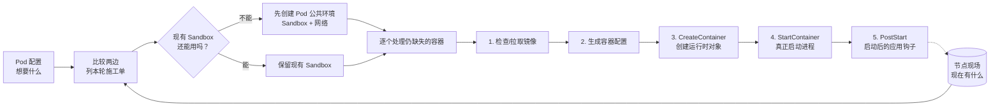
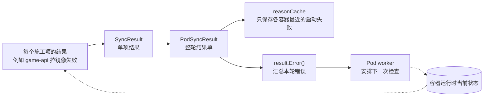
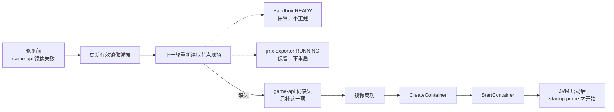

# 第 12 课：`game-api` 已有 Pod IP 却没有 Java 日志——kubelet 为什么先造 Pod 公共环境（Sandbox），再逐个启动容器

> 先用一句人话说清本课：**Pod 的“公共运行环境”已经好了，不代表里面每个容器都已经启动。** 本课就用一次 Spring Boot 私有镜像认证失败，追清 kubelet 为什么保留已经成功的部分，只重试失败的 `game-api`。

第 11 课结束时，同一个 `prod/game-api-new-x` 已经完成调度、节点接单、ConfigMap 卷恢复，并越过：

```text
Kubelet.SyncPod（kubelet 处理这个 Pod 的一轮工作）
  -> WaitForAttachAndMount（先等卷挂载完成）
  -> kl.containerRuntime.SyncPod(...)（再进入本课的容器运行阶段）
```

现在值班现场出现了一个更容易误判的画面：

```text
PodReadyToStartContainers=True
PodIP=192.0.2.41
jmx-exporter=Running
game-api=ImagePullBackOff
game-api containerID=""
```

先只翻译两个关键状态：`PodReadyToStartContainers=True` 是“Pod 公共运行环境已具备启动容器的条件”；`ImagePullBackOff` 是“镜像拉取失败后正在等待下一次尝试”。它们同时出现并不矛盾。

很多平台同学会先去查 JVM、Spring Boot、startup probe（启动探针：容器进程启动后，给慢启动应用留时间并判断它是否完成启动），甚至怀疑 `-Xmx` 或应用启动太慢。但这个现场真正说明的是：**Java 进程还没有被创建，120 秒 startup probe 预算连计时资格都没有。**

本章只讲清一件事：

> **kubelet 每次都会先看“配置里想要什么”和“节点上现在有什么”，然后只补差的那一块。** 所以 `game-api` 拉镜像失败时，已经可用的 Pod 网络和已经运行的 `jmx-exporter` 不会被一起推倒；修好镜像凭据后，下一轮只需继续启动 `game-api`。

先把开头出现的几个词翻成人话：

- `PodSandbox`：一个 Pod 里所有容器共用的“房间”，主要承载 Pod 的网络等公共环境；下文简称 Sandbox。
- runtime manager：kubelet 里负责和容器运行时对账的那部分代码，可以先理解成“节点施工负责人”。
- desired / actual：desired 是 Pod 配置里**想要的样子**，actual 是 containerd 等运行时里**现在真实的样子**。
- action：比较两边以后列出的“本轮施工项”，例如建 Sandbox、启动 `game-api`。
- CRI：kubelet 与 containerd、CRI-O 等容器运行时之间的标准接口，像统一的办事窗口。
- Event：本章默认指 `kubectl get events` 看到的诊断记录；不是控制器通过 Watch/Informer（监听 API 对象变化的机制）收到的“对象变了”通知。
- reconcile：再次对比“想要”和“现状”，只补差距；本章统一叫“重新对账”。

先不要执行命令。带着五个问题读本章：

1. 为什么 `PodReadyToStartContainers=True` 仍然可能没有 Java container ID？
2. `game-api` 镜像失败后，为什么同一轮仍会尝试 `jmx-exporter`？
3. 为什么 `CreateContainer` 成功不等于进程已经运行？
4. 为什么 `PostStart`（用户声明的进程启动后动作）失败后要 kill（停止）container，却不删除整个 PodSandbox？
5. 下一轮重试靠什么知道 Sandbox、`jmx-exporter` 这个辅助容器已经成功，不必从零开始？

## 0. 本课定位、深度和两遍阅读路线

这是 kubelet 节点执行主线的第二篇 **S3 深读**。这里的 S3 不是要求你背完所有源码，而是要求你最后能画出主流程、能根据现场状态反查关键分支。你已经有多年 Kubernetes 运维经验，本课不会重新讲 Pod、containerd、CNI 或镜像仓库怎么用；重点是解释它们在 kubelet 源码里的责任边界。

本课读深：

- 为什么 Pod 级环境和业务 container 要分成两层生命周期；
- 为什么 kubelet先算 `podActions`，再执行 kill / sandbox / container 动作；
- `NetworkNotReady` 为什么位于 runtime manager 外层，而单 Pod CNI（给 Pod 配网络的插件接口）错误位于 `RunPodSandbox` 下游；
- `PodSandboxChanged` 怎样根据 runtime actual state 判断复用还是重建；
- `createPodSandbox` 为什么依次经过 config、日志目录、RuntimeClass（选择哪套 runtime 配置）、CRI 四道门；
- kubelet为什么只调用 CRI，而不在核心仓库直接绑定 containerd 或 CNI 实现；
- Sandbox ready 以后，为什么 image、config、Create、Start、PostStart 仍是不同失败阶段，以及 internal PreStart（kubelet启动前的内部登记点）防御分支为什么不能直接当成当前上游原版 kubelet 的生产故障点；
- 一个普通容器失败后，为什么另一个普通容器仍可成功；
- “本轮施工结果单 -> 最近失败原因缓存 -> 汇总错误 -> 安排下一轮”怎样闭合重试；
- 正常 no-op（检查后发现什么都不用做）、等待、业务失败、内部 Error、非致命通知失败和显式补偿怎样区分。

本课只建立边界、不展开：

- containerd 的 CRI 插件怎样创建隔离空间、调用 CNI、生成 OCI bundle（容器运行时使用的一套启动文件）；
- CNI/IPAM、iptables 或 eBPF datapath（数据包在节点里真正经过的路径）内部实现；
- PLEG（节点上发现容器状态变化的组件）、probe 和 statusManager（把节点状态整理并写回 API 的组件）怎样更新 Running、Ready、restartCount，留到第 13 课；
- Device Plugin、DeviceManager、GPU UUID、checkpoint（kubelet保存在本地的设备分配记录）与 CDI（把设备信息交给容器的标准格式）分配，留到第 15～17 课；这些都是 GPU 设备分配细节，本课不要求掌握；
- GC（garbage collection，后台清理不用的旧对象）怎样清理由 Create/Start 失败留下的 runtime 对象，本课只说明责任边界。

不要按 26 个小节从头硬啃。按下面两个短路线读，蓝色标题可以直接点击跳转：

- **首遍抓主线：** [看事故快照](#ch12-case) -> [看两张总图](#ch12-map) -> [先读最关键的两段源码](#ch12-core-source) -> [回到 Java 现场](#ch12-java-recovery) -> [做首遍验收](#ch12-first-check)。首遍只要说清“Sandbox 成功不等于 Java 启动、两个普通容器可以部分成功、修复后为什么不用全量重建”。
- **二遍补边界：** [看 CRI 责任边界](#ch12-cri-boundary) -> [看错误怎样进入下一轮](#ch12-retry-loop) -> [看反事实分支](#ch12-counterfactual) -> [做二遍加深题](#ch12-second-check)。RuntimeClass、DRA（动态资源分配）、回调、Event 时差和测试限制都放在第二遍，不是进入下一课的门槛。

全章阅读约定：**表格按同一行从左往右读，每一行是一个独立对照；流程图按箭头读。** 图中的实线表示当前这一轮直接调用，虚线表示状态稍后才传回来或下一轮才继续。

## 1. 当前源码基线与阅读约定

```text
源码目录：D:\datou\devops\kubernetes-master\kubernetes
commit：301946d15e67a4a2e8a5fb8292eb836acd366d78
describe：v1.37.0-alpha.0-280-g301946d15e6
源码 go.mod / go.work：go 1.26.0
本机 Go：go1.19.4 windows/amd64
```

本机 Go 低于当前源码要求。本课完成的是固定提交下的静态源码核对、官方资料核对、三路独立审校和讲义机械校验；不能把它写成“相关 Go 单测已经在本机通过”。生产排障必须切换到目标集群对应 tag、发行分支和 CRI/CNI 版本，重新核对 feature gate（功能开关）、Event 文本、日志级别、超时和行号。

主文件：

```text
kubernetes/pkg/kubelet/kubelet.go
kubernetes/pkg/kubelet/kuberuntime/util/util.go
kubernetes/pkg/kubelet/kuberuntime/kuberuntime_manager.go
kubernetes/pkg/kubelet/kuberuntime/kuberuntime_sandbox.go
kubernetes/pkg/kubelet/kuberuntime/kuberuntime_container.go
kubernetes/pkg/kubelet/kuberuntime/instrumented_services.go
kubernetes/pkg/kubelet/cm/internal_container_lifecycle.go
kubernetes/pkg/kubelet/container/sync_result.go
kubernetes/pkg/kubelet/reason_cache.go
kubernetes/pkg/kubelet/pod_workers.go
kubernetes/pkg/kubelet/images/image_manager.go
kubernetes/staging/src/k8s.io/cri-client/pkg/remote_runtime.go
kubernetes/staging/src/k8s.io/cri-client/pkg/remote_image.go
```

> **源码阅读约定：** 标有“教学注释版”的 Go 代码，控制流、变量名、判断顺序和返回关系来自本课固定提交；中文 `//` 是讲义新增，不是 Kubernetes 上游原注释。每条影响控制或业务语义的语句都会就地解释，多行调用只解释一次，单独括号不机械标注。每个代码块会说明是完整函数、连续摘录还是非连续检查点；不会用孤立省略号冒充被删除的源码。小语法演示会明确标成“Go 示例”。

## 2. 先不执行命令：固定同一个 Java 发布现场

以下是为了教学整理的脱敏现场，不是某个真实集群的原始事故记录。对象、数字和 UID 沿用第 11 课，不在中途偷偷换题。

### 2.1 Deployment 仍然保护 3 个旧 Ready 副本

```yaml
apiVersion: apps/v1
kind: Deployment
metadata:
  name: game-api
  namespace: prod
spec:
  replicas: 3
  strategy:
    type: RollingUpdate
    rollingUpdate:
      maxSurge: 1
      maxUnavailable: 0
```

旧版本 3 个 Pod 都是 `Ready=True`，继续承接流量。新 Pod `game-api-new-x` 是滚动发布期间临时多出来的第 4 个 Pod，源码里常叫 surge Pod；只要它还没有 Available（Ready 后又稳定了一段最短时间），Deployment 就不会主动缩掉旧副本。

### 2.2 同一个 Pod、两个普通容器

```yaml
metadata:
  namespace: prod
  name: game-api-new-x
  uid: 3f5f4a90-1111-2222-3333-444444444444
spec:
  nodeName: worker-05
  hostNetwork: false
  containers:
  - name: game-api
    image: registry.example.com/game/game-api:2026.07.18-1
    env:
    - name: JAVA_TOOL_OPTIONS
      value: -Xms1g -Xmx1536m
    startupProbe:
      httpGet:
        path: /actuator/health/startup
        port: 8080
      periodSeconds: 5
      failureThreshold: 24
  - name: jmx-exporter
    image: registry.example.com/ops/jmx-exporter:1.0
```

参与本章推理的 Java 事实：

- Spring Boot 完成类加载、连接池建立、JIT（运行时即时编译）预热和 readiness 大约需要 45 秒；
- startup probe 理论宽限是 `5 秒 × 24 次 = 120 秒`；
- 但 probe 只能在 container 被 runtime 启动以后开始；
- `game-api` 私有镜像不在 `worker-05` 本地，引用的 registry credential（镜像仓库认证凭据）已过期；
- `jmx-exporter` 镜像已在节点缓存中；
- 两个 container 都是普通容器，没有 init container；
- `hostNetwork=false`，表示它要建立自己的 Pod 网络空间，不是直接使用 Node 网络；
- `runtimeClassName` 未设置，使用默认 runtime handler；handler 就是告诉 runtime “这次用哪套运行配置”的名字；
- 没有 ResourceClaim（特殊设备资源申请单），经典 Java 主案不走 DRA（动态资源分配）准备分支；
- 第 11 课的 ConfigMap 卷已经挂载完成。

<a id="ch12-case"></a>

### 2.3 事故快照：部分成功已经发生

```text
时间：2026-07-18 14:02:20 +08:00

namespace: prod
pod:       game-api-new-x
uid:       3f5f4a90-1111-2222-3333-444444444444
nodeName:  worker-05

Deployment:
  desired replicas = 3
  old Ready         = 3
  new Pod Ready     = 1/2

Pod API snapshot:
  phase                         = Pending
  PodScheduled                  = True
  PodReadyToStartContainers     = True
  podIP                         = 192.0.2.41（教学文档地址）

containerStatuses:
  game-api:
    state.waiting.reason = ImagePullBackOff
    containerID          = ""
    restartCount         = 0
  jmx-exporter:
    state.running        = true
    ready                = true
    containerID          = containerd://jmx-001

目标 Node 当前 CRI 事实：
  最新 sandbox attempt = 0
  最新 sandbox state   = READY
  最新 sandbox IP      = 192.0.2.41
  game-api container   = 不存在
  jmx-exporter         = RUNNING
```

`attempt=0` 表示这是该 Pod 第 1 次 Sandbox 创建尝试；如果以后重建 Sandbox，attempt 会递增。它不是容器的 restartCount。

这五个状态先这样读，不要急着背字段：

| 你看到的词 | 大白话意思 | 此刻还不能证明什么 |
| --- | --- | --- |
| `PodReadyToStartContainers=True` | Pod 的公共运行环境和网络已经具备启动容器的条件 | 不代表业务容器已经创建 |
| `PodIP` | Pod 的公共网络身份已经出现 | 不代表 JVM 已监听端口 |
| `ImagePullBackOff` | 上一次拉镜像失败，现在先等一会再试；backoff 就是“失败后别立刻狂重试” | 不代表容器启动后又崩了 |
| `containerID=""` | API 当前没有记录 `game-api` 的运行时对象编号 | 单凭 API 快照还不能断言运行时此刻绝对没有对象 |
| `jmx-exporter=RUNNING` | 这个辅助容器已经启动成功 | 不代表 `game-api` 也成功 |

本章先提出一个**可证伪假设**，意思是“先给出当前最合理的判断，同时明确什么证据一出现就必须推翻它”：

```text
game-api 失败在 EnsureImageExists；
尚未进入 CRI CreateContainer；
所以 JVM、Spring Boot 和 startup probe 都没有开始。
```

以下任一证据出现，就必须推翻这个假设，重新定位：

- 当前 UID 下已有 `game-api` 的 CRI container，状态为 `CREATED` 或 `RUNNING`；
- API 已出现本次 `game-api` container ID；
- 同一 UID、同一 container 已有可信的 `Created` 或 `Started` Event；
- 已有这一次 container attempt 对应的 Java stdout/stderr；
- waiting reason 已从 image 类错误变成 `RunContainerError`、`CrashLoopBackOff` 或 probe 相关状态。

### 2.4 先写下你的预测

1. Sandbox 已经 READY，`game-api` 镜像失败时，kubelet应不应该删掉 Sandbox？
2. `game-api` 是 Pod spec 中第一个普通容器，它失败后，`jmx-exporter` 还会不会被尝试？
3. 修复 registry credential 后，下一轮是否还会重新执行 `RunPodSandbox`？
4. `Created` Event 出现时，Java 进程是否一定已经运行？
5. `Started` Event 出现时，startup probe 是否一定已经成功？

答案要从不变量和源码中推出，而不是凭 `kubectl STATUS` 猜。

## 3. Kubernetes 在这里解决的不是“调用 containerd”，而是失败后怎样接着做

后文会把网络、镜像、Create、Start 叫作不同“失败域”，意思是它们可以各自成功、各自失败。所谓“收敛”，就是不管中间失败几次，后面经过重新对账，现场最终尽量回到 Pod 配置想要的样子。

### 3.1 错误方案一：kubelet收到 Pod 后执行一个 `CreatePod` 大 RPC

假设接口只有：

```text
CreatePod(fullPodSpec) -> success / failure
```

网络、镜像、container create、进程 start、hook 分属不同外部系统。hook 是容器启动前后额外执行的“钩子动作”。RPC 就是一次跨进程请求；可以先把它理解成 kubelet 向 containerd 发出的一张办事单。大 RPC 超时以后，kubelet无法知道：

- Sandbox 是否已经创建；
- CNI 是否已经分配 IP；
- 哪个镜像已经拉好；
- 哪个 container 只有 runtime object、哪个进程已经运行；
- `jmx-exporter` 这类辅助容器是否成功、主容器是否失败；
- 重试会不会重复创建第二套环境。

Kubernetes 选择把过程拆成可观察的资源与 RPC，并在下一轮重新读取 actual state。收益是可恢复、可诊断和 runtime 可替换；代价是状态可能部分成功，运维必须理解多个时间点，而不是期待一次调用要么全成功、要么什么都没发生。

### 3.2 错误方案二：每个 container 各建一套 Pod 网络

同一个 Pod 中的 container 需要共享 Pod IP、网络 namespace（Linux 用来隔离网络、进程等资源的“隔间”）、hostname 和 Pod 级资源边界。如果每个 container 各自创建网络：

- `localhost` 不再天然指向同一个 Pod；
- container 重启会改变 Pod 网络身份；
- 辅助容器与主进程无法共享稳定的 Pod 地址；
- Service 后端、探针和日志关联都更难保持 Pod 级语义。

CRI 因此把 Pod 级运行环境抽象成 `PodSandbox`，再让多个 container 依附于它。Sandbox 在 containerd 上常由 infra/pause（负责占住 Pod 网络等公共空间的基础容器）相关实现承载，但 CRI 故意不把接口语义限定成“必须是 pause 容器”；虚拟机型 runtime 可以用不同实现。

### 3.3 错误方案三：任何一步失败都全量 rollback

rollback 就是回滚：把前面已经做成的事情也撤掉，试图退回开始前的状态。

本案中 Sandbox、Pod IP、`jmx-exporter` 这个辅助容器都已经成功。辅助容器常被叫作 sidecar；它陪着主容器提供监控、代理等能力。如果 `game-api` image pull 失败就全部推倒：

- 会重复调用 CNI/IPAM，制造地址与网络抖动；
- 会反复停止已经正常运行的 sidecar；
- 会丢掉已完成镜像与 runtime 状态；
- 会把一个 registry credential 问题放大成整 Pod 网络重建；
- 多容器 Pod 的一个局部故障会变成全局抖动。

runtime manager 选择保留还能用的成果。下一轮重新比较 desired 与 actual，只补缺口。代价是要维护现场快照、本轮施工单、单项结果、最近失败原因缓存、后台清理和重试逻辑。

### 3.4 错误方案四：kubelet核心代码直接依赖 containerd 和 CNI

如果 `kubelet` 直接 import containerd、CRI-O、每一种 CNI 的客户端：

- runtime 会和 kubelet 绑得更紧：runtime 一升级，kubelet 也更可能要改代码、重新编译和发布；
- 新 runtime 必须修改 Kubernetes 核心；
- PodSandbox 在 namespace 型和 VM 型 runtime 中无法保留统一接口；
- runtime 与 image service 的超时、错误和观测难以统一。

官方 CRI 设计让 kubelet作为 gRPC client，只依赖 CRI v1 契约（双方约定好的请求和返回格式）。gRPC 是 CRI 这扇标准窗口实际使用的通信方式；具体 runtime 再解释 `RunPodSandbox`、网络 setup 和 container 生命周期。好处是更换 runtime 时不用把它的实现塞进 kubelet；代价是 Kubernetes 核心源码走到 CRI client 后就到达责任边界，继续追 CNI 必须切换到具体 runtime 仓库。

### 3.5 错误方案五：Create 和 Start 合并，只有一个成功点

container runtime object 的创建和进程真正运行是两个不同事实。分开以后，kubelet可以：

- 先生成完整 `ContainerConfig`，也就是交给 runtime 的单容器启动参数单；
- 在 Create 前执行 internal PreCreate，对配置做最后的内部检查或补充；
- Create 成功拿到 container ID；
- 在 Start 前调用 internal PreStart；它是 kubelet内部的启动前登记点，当前 stock（这里指 Kubernetes 上游原版）Linux 实现只登记 CPU、内存和 NUMA 拓扑（硬件资源靠近关系）等内部状态，然后固定返回 nil（没有错误）；
- 把 `Created` 与 `Started` 作为不同证据；
- Start 成功后再执行应用 PostStart，也就是用户声明的“进程启动后动作”；失败时 kill 已启动 container。

代价是可能留下 `CREATED` 但没有 RUNNING 的部分状态；当前 stock 实现里最直接的可达路径是 `StartContainer` 失败，而不是 internal PreStart 返回 error。这类状态不靠同步全量 rollback，而由后续对账和 runtime GC 收敛。

## 4. 先弄清“谁管哪份记录”，再记十条不会轻易破坏的规则

源码里常说 owner、contract、invariant。这里分别理解成：**谁负责这份状态、两边约定怎样交接、代码无论怎么分支都要守住什么规则。**

### 4.1 谁拥有哪本账

先记住：这里不是有九套互相打架的数据库，而是同一件事在不同阶段留下的九种记录。表格每一行从左到右读：**这份记录是什么 -> 谁负责它 -> 排障时拿它判断什么。**

| 状态 | 主要所有者 | 本章作用 |
| --- | --- | --- |
| `v1.Pod` desired spec | API Server / 控制面 | 用户想要两个什么容器、什么镜像、资源和卷 |
| `kubecontainer.PodStatus` | kubelet 从容器运行时读到的现场快照 / podCache | 节点上现在有哪些 Sandbox、容器、IP 和退出状态 |
| `podActions` | `computePodActions` 本轮临时生成 | 比较前两行以后得到的“本轮施工单”：杀什么、建什么、启动什么 |
| `PodSyncResult` | runtime manager 本轮执行 | “本轮施工结果单”：每个动作成功还是失败；`SyncError` 是无法归到某一个具体动作的整轮错误 |
| `PodSandboxConfig` | kubelet生成、CRI runtime 消费 | “建 Pod 公共环境的参数单”：Pod 身份、网络隔离、DNS、日志目录、runtime handler 等 |
| `ContainerConfig` | kubelet生成、CRI runtime 消费 | “建单个容器的参数单”：镜像、命令、环境变量、挂载、资源、设备、安全和日志路径 |
| Sandbox/container actual state | CRI runtime | READY/NOTREADY、CREATED/RUNNING/EXITED、ID 与 IP |
| per-container latest failure | kubelet `reasonCache` | 一小块“最近启动失败原因缓存”，把 `ImagePullBackOff` 等原因带到容器状态 |
| Pod worker 重试时机 | `podWorkers` / workQueue | Pod worker 是按 UID 串行推进 Pod 的后台工人；workQueue 是它的待办队列，决定何时再试 |

### 4.2 十条设计不变量

1. **非 hostNetwork Pod 在节点级 `NetworkReady=false` 时，不进入 runtime manager。**
2. **业务 container 只能依附于一个当前可用的 PodSandbox。**
3. **Sandbox 是否复用由 runtime actual state 决定，不由 Event 字符串决定。**
4. **多个 READY Sandbox、最新 Sandbox 非 READY、namespace 不匹配，或者非 hostNetwork 且 `Network` 对象存在但主 IP 为空，都需要重建；当前源码的无 IP 分支有 `Network != nil` 前提。**
5. **健康 Sandbox 不因单个普通 container 失败而自动删除。**
6. **同一轮多个普通 container 可以部分成功；一个失败不会终止普通 container 循环。**
7. **image 成功是 Create 的前置，Create 成功是 Start 的前置，Start 成功不是 Ready。**
8. **普通 init container 启动失败会阻断普通 container；restartable init 是可持续运行、行为更像辅助容器的 init，本章二遍再看。**
9. **PostStart 失败发生在 Start 成功之后，必须显式 kill 作为补偿。**
10. **本轮 Error 不要求回滚全部成果；下一轮重新读取 actual state，只执行仍有差距的动作。**

### 4.3 收益与代价

| 设计选择 | 得到什么 | 付出什么 |
| --- | --- | --- |
| Sandbox 与 container 分层 | 稳定 Pod IP、共享 namespace、多容器独立重启 | 多一层状态与失败域 |
| 先计算施工单，再按单执行 | 可以安全重做、容易测试、避免看到 Event 就盲目创建 | 施工单计算分支复杂 |
| CRI 接口 | runtime 可替换，kubelet 核心代码不用跟着每种 runtime 改 | 追具体 CNI/OCI 时必须跨仓库 |
| 分步 RPC | 失败可定位、可保留部分成功 | 不能保证“要么全部成功、要么一点也没做”，会出现中间态 |
| 每个施工项单独记结果 | 多容器部分成功与错误可分别记录 | 外层必须汇总 Error 并安排重试 |

<a id="ch12-map"></a>

## 5. 白板总图：先看状态流，再进入函数

### 5.1 主执行链

**读法：从左往右。** 实线是本轮同步调用；最后的虚线表示结果要等状态刷新或下一轮重试后，才会再次成为“节点现场”。首遍只跟粗体问题走：**Sandbox 能不能复用 -> 缺哪个容器 -> 卡在哪一道门。**



图里故意先不放 RuntimeClass、DRA、CNI 内部和各种回调。它们是某一道门里的细节，不应遮住主线。

### 5.2 结果与反馈链

**仍然从左往右读。** 实线表示本轮记账，虚线表示“稍后再来一轮”，不是当前函数原地死循环。



这张图最重要的边界是：`game-api` 的失败可以留在结果单里，同时 `jmx-exporter` 的成功已经留在容器运行时里。整轮有错误，不等于整轮做过的事都回滚。

### 5.3 本章的停止线

本章走到：

```text
CRI StartContainer 成功或失败
  + PostStart 成功或补偿 kill
  + Pod worker 已知道是否需要重试
```

本章不继续展开：

```text
PLEG / runtime event（kubelet 内部的状态变化通知，不是上面的 Kubernetes Event）
  -> podCache
  -> probe result
  -> statusManager
  -> API Running / Ready / restartCount
```

这条状态回传链留给第 13 课。

<a id="ch12-core-source"></a>

### 5.4 先读最关键的两段源码：为什么主容器失败，辅助容器还能成功

不要先钻进 NetworkReady、RuntimeClass 或 DRA。先看直接解释本案的源码。

本案的待启动清单来自按 `pod.Spec.Containers` 顺序逐个加入下标，所以这里是 `[game-api index 0, jmx-exporter index 1]`；第 7.3 节会再手算这张清单。

源码：`pkg/kubelet/kuberuntime/kuberuntime_manager.go:1790-1793`，`SyncPod` 启动普通容器循环的**连续完整摘录，教学注释版**。

```go
// 按本轮施工单，遍历所有“还缺少、需要启动”的普通容器下标。
for _, idx := range podContainerChanges.ContainersToStart {
	// 逐个尝试启动；metrics.Container 只是“普通容器”指标标签。
	// 这里故意不接住 start 返回的 error，也没有 return。
	// 单个失败已经写入本轮结果单，因此循环仍会继续尝试下一个普通容器。
	start(ctx, "container", metrics.Container, containerStartSpec(&pod.Spec.Containers[idx]))
}
```

**大白话总结：** `game-api` 在列表里排第一也没关系。它失败后，这里不会退出整个 `SyncPod`，所以还能继续尝试 `jmx-exporter`。

**顺手学 Go：** `for _, idx := range ...` 表示依次遍历列表；`_` 是“不使用当前位置编号”，`idx` 才是容器在 Pod 配置中的下标。函数有返回值却不接住，在 Go 里是允许的；这里是有意忽略直接返回，不是源码忘了处理错误。

再看 `game-api` 为什么连 JVM 都没启动。源码：`pkg/kubelet/kuberuntime/kuberuntime_container.go:212-219`，`startContainer` 镜像失败分支的**连续完整摘录，教学注释版**。

```go
// CreateContainer 之前，先保证镜像在节点上可用；需要时会去镜像仓库拉取。
imageRef, msg, err := m.imagePuller.EnsureImageExists(ctx, ref, pod, container.Image, pullSecrets, podSandboxConfig, podRuntimeHandler, container.ImagePullPolicy)
// 镜像检查或拉取失败，就在这里结束当前这个容器的启动尝试。
if err != nil {
	// 把底层错误整理成适合 Event 展示的文字。
	s, _ := grpcstatus.FromError(err)
	// 记录 Warning Event；这一步没有创建容器运行时对象。
	m.recordContainerEvent(ctx, pod, container, "", v1.EventTypeWarning, events.FailedToCreateContainer, "Error: %v", s.Message())
	// 把错误交回上面的 start；后面的 CreateContainer 和 StartContainer 都不会执行。
	return msg, err
}
```

**大白话总结：** 本案卡在镜像这道门，而 `CreateContainer` 在后面。因此 `game-api` 没有 container ID、没有 JVM、也还没有开始 startup probe；这和“Java 启动慢”是两个完全不同的阶段。

**顺手学 Go：** `imageRef, msg, err := ...` 一次接住三个返回值；`err != nil` 就是“这一步失败了”。`return msg, err` 只结束当前容器的 `startContainer`，外面的普通容器循环仍会处理下一个容器。

到这里，首遍已经拿到本章最关键的源码证据。后面的第 6～13 节，是把“为什么能这样设计、每种失败怎么记账和重试”逐层补齐。

## 6. 第一层源码：为什么节点级网络错误会挡在 runtime manager 外面

### 6.1 `NetworkReady=false` 为什么不是“某个 Pod 的 CNI ADD 已失败”

源码：`pkg/kubelet/kubelet.go:2103-2107`，`Kubelet.SyncPod` **连续摘录**。前面已经生成并缓存本轮 API status；后面才进入 Secret/ConfigMap、cgroup、volume 和 runtime 调用。本段只保留会改变本章入口的网络门。

```go
// 从 kubelet 的节点级 runtimeState 读取最近一次 NetworkReady 错误。
// hostNetwork Pod 不需要新的 Pod network namespace，因此不受这道门阻挡。
if err := kl.runtimeState.networkErrors(); err != nil && !kubecontainer.IsHostNetworkPod(pod) {
	// 给当前 Pod 记录 Warning Event；reason 的字面值是 NetworkNotReady。
	kl.recorder.WithLogger(logger).Eventf(
		pod, // Event 归属当前正在同步的 Pod。
		v1.EventTypeWarning,
		events.NetworkNotReady,
		"%s: %v",
		NetworkNotReadyErrorMsg,
		err,
	)
	// 本轮在进入 kl.containerRuntime.SyncPod 之前结束。
	// false 表示 Pod 尚未进入结束状态；nil postSync 表示没有“成功后再做的小函数”。
	// relist 指请求 PLEG 再扫描一次容器运行时现场；本分支连这个请求也没有。
	return false, nil, fmt.Errorf("%s: %v", NetworkNotReadyErrorMsg, err)
}
```

**大白话总结：** 这道门读取的是 runtime 周期上报的节点级网络条件。它说明“当前不适合让普通 Pod 进入 runtime manager”，不能证明某个 Pod 的 `RunPodSandbox` 已经调用 CNI，更不能证明某次 CNI ADD 的具体错误。

**顺手学 Go：** `if err := call(); condition` 会先声明局部 `err`，再判断分号后的条件；这个 `err` 只在当前 `if` 作用域可见。`&&` 有短路语义：前半段为 false 时，不再计算后半段。

### 6.2 节点级 `NetworkReady` 从哪里来

源码：`pkg/kubelet/kubelet.go:3245-3277`，`updateRuntimeUp` **非连续检查点**。两段来自同一函数，中间省略了日志等级选择和 `RuntimeReady` 之外的初始化；代码块不可独立编译。

```go
// 通过 CRI Status 读取 runtime 的整体状态，而不是查询某一个 Pod。
s, err := kl.containerRuntime.Status(ctx)
if err != nil {
	// Status RPC 失败时，只能记录 runtime sanity check 失败，本轮无法更新条件。
	logger.Error(err, "Container runtime sanity check failed")
	return
}
// runtime 返回 nil status 同样不能继续解释 NetworkReady。
if s == nil {
	logger.Error(nil, "Container runtime status is nil")
	return
}

// 从 runtime status 中取名为 NetworkReady 的聚合 condition。
networkReady := s.GetRuntimeCondition(kubecontainer.NetworkReady)
if networkReady == nil || !networkReady.Status {
	// condition 缺失或为 false，都写进 kubelet 的 runtimeState 网络错误槽。
	kl.runtimeState.setNetworkState(fmt.Errorf("container runtime network not ready: %v", networkReady))
} else {
	// condition 为 true 时清空错误；后续普通 Pod 才能越过 6.1 的门。
	kl.runtimeState.setNetworkState(nil)
}
```

**大白话总结：** `NetworkReady` 是 runtime 对节点网络能力的聚合报告。节点整体 ready 后，单个 Pod 的 `RunPodSandbox` 仍可能因为 IPAM、配置或网络插件故障失败；两者是不同层级。

**顺手学 Go：** `s == nil` 在这里检查接口返回的指针对象是否缺失。`a == nil || !a.Status` 利用 `||` 短路，确保 `a` 为 nil 时不会继续访问字段而 panic。

### 6.3 回到本案：为什么可以排除外层网络门

本案同时具备：

```text
PodReadyToStartContainers=True
最新 Sandbox=READY
PodIP=192.0.2.41
```

因此当前实际状态已经越过 `NetworkReady` 外层门和本次 Sandbox 网络创建。若值班时只有 `Node Ready=True`，仍不能做同样结论；Node Ready 是更大的聚合条件，必须继续看 Pod condition 与 CRI Sandbox。

## 7. 第二层源码：为什么先算 `podActions`，而不是看到 Pod 就直接创建

### 7.1 `PodSandboxChanged` 先判断有没有可复用的 Pod 级环境

源码：`pkg/kubelet/kuberuntime/util/util.go:30-68`，`PodSandboxChanged` 的 **业务分支连续摘录**。原函数开头创建 `context` 和 `logger` 的两行不影响状态判断，因此不放进代码块；下方保留全部业务分支，代码块不可独立编译。

```go
func PodSandboxChanged(pod *v1.Pod, podStatus *kubecontainer.PodStatus) (bool, uint32, string) {
	// 原函数在这里之前已经创建 logger；本课从第一个状态判断开始。
	// runtime actual state 中一个 Sandbox 都没有：新 Pod 必须从 attempt=0 开始创建。
	if len(podStatus.SandboxStatuses) == 0 {
		logger.V(2).Info("No sandbox for pod can be found. Need to start a new one", "pod", klog.KObj(pod))
		return true, 0, ""
	}

	// 统计 READY Sandbox 数量，防止同一 Pod 同时保留多个可用 Pod 级环境。
	readySandboxCount := 0
	for _, s := range podStatus.SandboxStatuses {
		if s.State == runtimeapi.PodSandboxState_SANDBOX_READY {
			readySandboxCount++
		}
	}

	// podStatus 把最新 Sandbox 放在第 0 个位置；后续 attempt 基于它递增。
	sandboxStatus := podStatus.SandboxStatuses[0]
	// 多个 READY Sandbox 违反“只保留一个当前 Pod 环境”的期望，需要重建并收敛。
	if readySandboxCount > 1 {
		logger.V(2).Info("Multiple sandboxes are ready for Pod. Need to reconcile them", "pod", klog.KObj(pod))
		return true, sandboxStatus.Metadata.Attempt + 1, sandboxStatus.Id
	}
	// 最新 Sandbox 不是 READY，不能承载新的业务 container。
	if sandboxStatus.State != runtimeapi.PodSandboxState_SANDBOX_READY {
		logger.V(2).Info("No ready sandbox for pod can be found. Need to start a new one", "pod", klog.KObj(pod))
		return true, sandboxStatus.Metadata.Attempt + 1, sandboxStatus.Id
	}

	// desired Pod 的网络 namespace 模式与实际 Sandbox 不一致，旧环境不能复用。
	if sandboxStatus.GetLinux().GetNamespaces().GetOptions().GetNetwork() != NetworkNamespaceForPod(pod) {
		logger.V(2).Info("Sandbox for pod has changed. Need to start a new one", "pod", klog.KObj(pod))
		return true, sandboxStatus.Metadata.Attempt + 1, ""
	}

	// 非 hostNetwork Pod 的 READY Sandbox 没有 IP，也不满足继续启动业务 container 的条件。
	if !kubecontainer.IsHostNetworkPod(pod) && sandboxStatus.Network != nil && sandboxStatus.Network.Ip == "" {
		logger.V(2).Info("Sandbox for pod has no IP address. Need to start a new one", "pod", klog.KObj(pod))
		return true, sandboxStatus.Metadata.Attempt + 1, sandboxStatus.Id
	}

	// 所有检查都通过：复用当前 Sandbox，不创建新 attempt。
	return false, sandboxStatus.Metadata.Attempt, sandboxStatus.Id
}
```

**大白话总结：** 这个函数不是看 Event，也不是看 `kubectl STATUS`。它直接检查 runtime actual state：没有 Sandbox、多 READY、最新不 READY、namespace 不符，或者非 hostNetwork 且 `Network` 对象存在但主 IP 为空，才要求重建；否则健康 Sandbox 是应该保留的成果。

**顺手学 Go：** 返回值 `(bool, uint32, string)` 是三个独立位置：是否重建、新 attempt、供后续使用的 Sandbox ID；network namespace 不匹配分支即使已有旧 Sandbox，也会故意返回空 ID。`for _, s := range slice` 中 `_` 表示不需要索引，只使用元素。链式 `GetLinux().GetNamespaces()` 来自 protobuf getter，通常对 nil 嵌套对象返回零值，降低直接解引用风险。

### 7.2 `computePodActions` 把判断结果翻译成施工单

源码：`pkg/kubelet/kuberuntime/kuberuntime_manager.go:1175-1187`，`computePodActions` 开头的 **连续摘录**。后续 RestartPolicy、init、probe、resize 分支留在二遍阅读；本段只建立 action 初值。

```go
// 同时取得“是否重建、下一 attempt、当前 Sandbox ID”。
createPodSandbox, attempt, sandboxID := runtimeutil.PodSandboxChanged(pod, podStatus)
// 创建本轮 action 计划；这里只是列单，还没有执行 CRI RPC。
changes := podActions{
	// Sandbox 需要重建时，旧 runtime 现场必须先清理。
	KillPod: createPodSandbox,
	// 同一个判断决定后面是否创建新 Sandbox。
	CreateSandbox: createPodSandbox,
	// 保存可复用或待清理的 Sandbox ID。
	SandboxID: sandboxID,
	// 新 Sandbox config 使用的 attempt。
	Attempt: attempt,
	// 普通容器待启动列表先初始化为空 slice，后续分支按 index 加入。
	ContainersToStart: []int{},
	// 待停止容器按 container ID 建 map，避免同一对象重复列入。
	ContainersToKill: make(map[kubecontainer.ContainerID]containerToKillInfo),
}
```

**大白话总结：** `podActions` 是“这一轮准备做什么”，不是实际 runtime 状态，也不是成功承诺。把判断与执行分开后，同一组 desired/actual 输入可以测试出明确计划，后续执行失败也能知道失败发生在哪个 action。

**顺手学 Go：** `:=` 在当前作用域声明并赋值；左边三个变量按返回位置接值。`podActions{Field: value}` 是 struct literal，冒号不是 YAML。`make(map[K]V)` 创建一张可写 map。

### 7.3 用本案手算两轮 action

第一次进入 runtime manager、还没有 Sandbox 时：

```text
PodSandboxChanged
  -> create=true
  -> attempt=0
  -> sandboxID=""

podActions
  -> KillPod=true
  -> CreateSandbox=true
  -> ContainersToStart=[game-api index 0, jmx-exporter index 1]
```

这里 `KillPod=true` 不等于“真的有一个健康 Pod 被杀”。对一个全新的 runtime 空现场，kill 是清理旧对象的安全步骤，通常没有实际 container 可停。

事故快照中的下一轮：

```text
最新 Sandbox attempt=0 READY，IP 非空，namespace 匹配
  -> create=false
  -> sandboxID=当前 ID

game-api 不存在
  -> ContainersToStart 加入 index 0

jmx-exporter 已 RUNNING、spec 未变、probe 未失败
  -> keep
```

这已经白板推导出核心答案：修复镜像认证后，下一轮应该复用 Sandbox 和 sidecar，只补 `game-api`。

## 8. 第三层源码：Sandbox 怎样被清理、创建，并在失败时停止本轮

### 8.1 需要重建 Sandbox 时，为什么先清理旧 runtime 现场

源码：`pkg/kubelet/kuberuntime/kuberuntime_manager.go:1467-1484`，`kubeGenericRuntimeManager.SyncPod` **连续摘录**。后面的“逐个 kill container”属于不重建 Sandbox 的另一分支，本段省略。

```go
// podActions 判断 Sandbox 变化时，先处理整个 Pod 的旧 runtime 现场。
if podContainerChanges.KillPod {
	// 把 runtime PodStatus 转成 RunningPod 视图，交给统一 kill 路径停止 container 和 Sandbox。
	killResult := m.killPodWithSyncResult(
		ctx,
		pod,
		kubecontainer.ConvertPodStatusToRunningPod(m.runtimeName, podStatus),
		nil,
	)
	// 把 kill 子结果并入本轮 PodSyncResult，外层才能统一聚合错误。
	result.AddPodSyncResult(killResult)
	// 清理失败时不继续创建新 Sandbox，避免新旧环境交叉。
	if killResult.Error() != nil {
		logger.Error(killResult.Error(), "killPodWithSyncResult failed")
		return
	}

	// 只有计划重建 Sandbox 时，才额外清理旧 init container 记录。
	if podContainerChanges.CreateSandbox {
		m.purgeInitContainers(ctx, pod, podStatus)
	}
}
```

**大白话总结：** 重建 Pod 级环境前必须先让旧环境退出，防止两个 Sandbox 和两套 container 同时承载一个 Pod UID。kill 失败是硬停止线；不会一边清不干净旧现场，一边继续创建新现场。

**顺手学 Go：** `return` 没写值，是因为 `SyncPod` 使用命名返回值 `result`；裸 `return` 会返回当前已经累积的 `PodSyncResult`。这不是“返回空结果”。

### 8.2 DRA 准备失败为什么与 `FailedCreatePodSandBox` 不同

**这一节属于二遍。** DRA 是 Dynamic Resource Allocation，直译是“动态资源分配”：Pod 先用 ResourceClaim（可以先理解成“我要一份特殊设备资源的申请单”）申请设备，再由对应驱动准备资源。Java 主案没有这种申请单，所以首遍跳过不影响主线。

源码：`pkg/kubelet/kuberuntime/kuberuntime_manager.go:1572-1599`，Sandbox 创建分支的 **连续摘录**。本段只用于划清以后 GPU/DRA 的前置边界。feature gate 就是 Kubernetes 的“功能开关”，关闭时整段 DRA 分支不会进入。

```go
// 先建立一个 CreatePodSandbox 子结果，后续真正的 Sandbox 错误会写进它。
createSandboxResult := kubecontainer.NewSyncResult(kubecontainer.CreatePodSandbox, format.Pod(pod))
result.AddSyncResult(createSandboxResult)

// 只有 DynamicResourceAllocation feature gate 开启时才进入 DRA 准备调用。
if utilfeature.DefaultFeatureGate.Enabled(features.DynamicResourceAllocation) {
	// 在 createPodSandbox 和 RunPodSandbox 之前准备 Pod 的动态资源。
	if err := m.runtimeHelper.PrepareDynamicResources(ctx, pod); err != nil {
		// 生成 Event 所需的 Pod reference；失败只记录日志。
		ref, referr := ref.GetReference(legacyscheme.Scheme, pod)
		if referr != nil {
			logger.Error(referr, "Couldn't make a ref to pod", "pod", klog.KObj(pod))
			return
		}
		// DRA 准备失败使用独立 reason，不伪装成 Sandbox/CNI 失败。
		m.recorder.WithLogger(logger).Eventf(
			ref,
			v1.EventTypeWarning,
			events.FailedPrepareDynamicResources,
			"Failed to prepare dynamic resources: %v",
			err,
		)
		logger.Error(err, "Failed to prepare dynamic resources", "pod", klog.KObj(pod))
		// 当前实现直接结束本轮，没有调用 createPodSandbox。
		return
	}
}

// 只有前置资源准备成功，才进入 Sandbox config / RuntimeClass / CRI。
podSandboxID, msg, err = m.createPodSandbox(ctx, pod, podContainerChanges.Attempt)
```

**大白话总结：** DRA 失败发生在建 Sandbox 之前。它会记一条专门 Event，然后提前 `return`（结束本轮），不会伪装成 CNI 或 Sandbox 创建失败。当前代码还有一个容易忽略的特殊点：这条分支没有把本轮结果标成 error，所以外层会通过 `postSync`（成功路径结束后要执行的小函数）请求 PLEG 再刷新一次运行时现场。这个细节到 13.3～13.4 再看，首遍不要求记。

**顺手学 Go：** `if err := call(); err != nil` 把 `err` 限定在当前 `if`。内部再次写 `ref, referr :=` 时，`referr` 是新变量，`ref` 在当前更内层作用域被重新声明；读 Go 时要特别留意作用域，而不是只看变量名相同。

### 8.3 `createPodSandbox` 的四道门

源码：`pkg/kubelet/kuberuntime/kuberuntime_sandbox.go:38-75`，`createPodSandbox` **完整函数，教学注释版**。

```go
func (m *kubeGenericRuntimeManager) createPodSandbox(ctx context.Context, pod *v1.Pod, attempt uint32) (string, string, error) {
	logger := klog.FromContext(ctx) // 日志继承本轮 SyncPod 的上下文。
	// 第一道门：把 v1.Pod 转成 CRI PodSandboxConfig。
	podSandboxConfig, err := m.generatePodSandboxConfig(ctx, pod, attempt)
	if err != nil {
		// message 给上层 SyncResult/Event 使用；error 保留原始错误链。
		message := fmt.Sprintf("Failed to generate sandbox config for pod %q: %v", format.Pod(pod), err)
		logger.Error(err, "Failed to generate sandbox config for pod", "pod", klog.KObj(pod)) // 节点日志保留原错误。
		return "", message, err // 空 ID 表示 Sandbox 尚未创建成功。
	}

	// 第二道门：创建 Pod 级日志目录，尚未发出 CRI RunPodSandbox。
	err = m.osInterface.MkdirAll(podSandboxConfig.LogDirectory, 0755) // 先准备 Pod 级日志目录。
	if err != nil {
		message := fmt.Sprintf("Failed to create log directory for pod %q: %v", format.Pod(pod), err)
		logger.Error(err, "Failed to create log directory for pod", "pod", klog.KObj(pod))
		return "", message, err
	}

	// 默认 handler 为空字符串，表示让 runtime 使用默认配置。
	runtimeHandler := "" // 空字符串代表使用 runtime 默认 handler。
	if m.runtimeClassManager != nil {
		// 第三道门：把 Pod 的 runtimeClassName 解析成 CRI handler。
		runtimeHandler, err = m.runtimeClassManager.LookupRuntimeHandler(pod.Spec.RuntimeClassName)
		if err != nil {
			message := fmt.Sprintf("Failed to create sandbox for pod %q: %v", format.Pod(pod), err)
			return "", message, err
		}
		if runtimeHandler != "" {
			logger.V(2).Info("Running pod with runtime handler", "pod", klog.KObj(pod), "runtimeHandler", runtimeHandler)
		}
	}

	// 第四道门：通过 CRI 请求 runtime 创建并启动 Pod 级 Sandbox。
	podSandBoxID, err := m.runtimeService.RunPodSandbox(ctx, podSandboxConfig, runtimeHandler)
	if err != nil {
		message := fmt.Sprintf("Failed to create sandbox for pod %q: %v", format.Pod(pod), err)
		logger.Error(err, "Failed to create sandbox for pod", "pod", klog.KObj(pod))
		return "", message, err
	}

	// 成功只返回 Sandbox ID；业务 container 此时还没有创建。
	return podSandBoxID, "", nil
}
```

**大白话总结：** `FailedCreatePodSandBox` 是 Sandbox 总入口失败，不是 CNI 专属。错误可能发生在 CRI 前的 config、节点日志目录、RuntimeClass lookup，也可能发生在 CRI `RunPodSandbox` 及 runtime 下游网络实现。

**顺手学 Go：** 函数返回 `(string, string, error)`：第一个是 ID，第二个是面向人的 message，第三个是程序 error。成功返回 `id, "", nil`；失败通常返回 `"", message, err`。不要把两个 string 的位置记反。

### 8.4 删除并发为什么可能不记录普通 Sandbox 失败 Event

源码：`pkg/kubelet/kuberuntime/kuberuntime_manager.go:1599-1620`，`SyncPod` 的 **连续摘录**。`createSandboxResult`、`podSandboxID`、`msg` 已在前文声明。

```go
// 执行 Sandbox 创建四道门。
podSandboxID, msg, err = m.createPodSandbox(ctx, pod, podContainerChanges.Attempt) // 返回 ID、可读消息和原始错误。
if err != nil { // 只有四道门任一道失败才进入这里。
	// Sandbox 创建期间若 Pod 已进入终止请求，这个错误被视为删除竞态。
	if m.podStateProvider.IsPodTerminationRequested(pod.UID) {
		logger.V(4).Info(
			"Pod was deleted and sandbox failed to be created",
			"pod", klog.KObj(pod),
			"podUID", pod.UID,
		)
		// 不再制造一个容易误导值班人员的普通创建失败 Event。
		return
	}
	// 非终止竞态才统计 StartedPods error，并标记 CreatePodSandbox 子结果失败。
	metrics.StartedPodsErrorsTotal.Inc() // 仅非终止竞态计入启动失败指标。
	createSandboxResult.Fail(kubecontainer.ErrCreatePodSandbox, msg) // 把失败写回聚合结果。
	logger.Error(err, "CreatePodSandbox for pod failed", "pod", klog.KObj(pod))
	// 尝试生成 Event reference；失败不改变前面已经记录的 SyncResult。
	ref, referr := ref.GetReference(legacyscheme.Scheme, pod)
	if referr != nil {
		logger.Error(referr, "Couldn't make a ref to pod", "pod", klog.KObj(pod))
	}
	// 对外记录总入口 reason，具体责任域必须继续读 message。
	m.recorder.WithLogger(logger).Eventf(
		ref,
		v1.EventTypeWarning,
		events.FailedCreatePodSandBox,
		"Failed to create pod sandbox: %v",
		err,
	)
	return
}
```

**大白话总结：** 同一个 error 在“Pod 仍想运行”和“Pod 已要求终止”两个上下文中语义不同。前者是应重试、应告警的创建失败；后者可能只是创建与删除并发，不应继续把它包装成普通运行故障。

**顺手学 Go：** `createSandboxResult.Fail(...)` 修改的是指针指向的 `SyncResult`，因为它已被加入 `result.SyncResults`，外层稍后能看到同一对象的 Error/Message。`ref, referr :=` 位于当前 `if` 作用域，不会影响函数外变量。

### 8.5 RuntimeClass 只决定 handler，不是 GPU Pod 的必填开关

本案 `runtimeClassName` 为空，因此 handler 为空字符串，runtime 使用默认配置。二遍阅读只需分清三层：

| 失败层 | 发生位置 | 是否已经发出 `RunPodSandbox` |
| --- | --- | --- |
| RuntimeClass API/admission（API 接收 Pod 时的校验和补全） | Pod 进入 kubelet之前 | 否 |
| kubelet `LookupRuntimeHandler` | `createPodSandbox` 第三道门 | 否 |
| runtime 不认识 handler | CRI `RunPodSandbox` | 是 |

RuntimeClass 是“选择 runtime 配置”的机制，不是所有 GPU Pod 的必填字段。很多 GPU 集群仍使用默认 runc handler，通过 NVIDIA Container Toolkit、经典 Device Plugin 或 CDI 注入设备；是否需要 RuntimeClass 必须以具体平台配置为准。

<a id="ch12-cri-boundary"></a>

## 9. 第四层源码：CRI 为什么是一条契约边界，而不是 containerd 的别名

### 9.1 `PodSandboxConfig` 把 API Pod 翻译成 runtime 能消费的 Pod 级参数

源码：`pkg/kubelet/kuberuntime/kuberuntime_sandbox.go:82-98`，`generatePodSandboxConfig` 的 **连续摘录**。后续 hostname、port mapping、Linux/Windows security 与 sandbox resource 字段留给二遍阅读。

```go
// API Pod 的 UID 要转成 CRI protobuf（接口传输用的数据结构）使用的 string。
podUID := string(pod.UID)
// 创建 Pod 级 CRI config；它不是把完整 v1.Pod 原样传给 runtime。
podSandboxConfig := &runtimeapi.PodSandboxConfig{
	// Metadata 用于 runtime 侧标识 name、namespace、UID 与 Sandbox attempt。
	Metadata: &runtimeapi.PodSandboxMetadata{
		Name:      pod.Name,
		Namespace: pod.Namespace,
		Uid:       podUID,
		Attempt:   attempt,
	},
	// kubelet选择需要透传的 labels/annotations，而不是让 runtime 接管控制面逻辑。
	Labels:      newPodLabels(pod),
	Annotations: newPodAnnotations(pod),
}

// DNS 由 RuntimeHelper 根据 Pod DNSPolicy、DNSConfig 和节点配置生成。
dnsConfig, err := m.runtimeHelper.GetPodDNS(ctx, pod)
if err != nil {
	// DNS config 生成失败发生在 CRI RunPodSandbox 之前。
	return nil, err
}
// 生成成功后写入 CRI Sandbox config。
podSandboxConfig.DnsConfig = dnsConfig
```

**大白话总结：** runtime 收到的是 CRI `PodSandboxConfig`，不是完整 Kubernetes `v1.Pod`。kubelet保留 Kubernetes 语义的解释权，只把 runtime 真正需要的 Pod 级身份、DNS、namespace、security、日志和资源参数翻译出去。

**顺手学 Go：** `&runtimeapi.PodSandboxConfig{}` 创建结构体后取地址，得到 `*PodSandboxConfig`。内层 `Metadata: &Type{}` 是嵌套指针字段。`string(pod.UID)` 是显式类型转换，不是函数调用远端服务。

### 9.2 指标包装层为什么不负责真正创建 namespace

这里的 instrumented service 没有神秘含义，就是“在真正调用前后顺手记耗时、记成功失败，再把请求原样转发”的包装层。

源码：`pkg/kubelet/kuberuntime/instrumented_services.go:180-192`，`instrumentedRuntimeService.RunPodSandbox` **完整函数，教学注释版**。

```go
func (in instrumentedRuntimeService) RunPodSandbox(ctx context.Context, config *runtimeapi.PodSandboxConfig, runtimeHandler string) (string, error) {
	// 固定 operation label，供 kubelet runtime operation 指标聚合。
	const operation = "run_podsandbox"
	// 记录本次包装层调用开始时间。
	startTime := time.Now()
	// 无论下面成功还是错误返回，函数退出时都记录通用 operation 耗时。
	defer recordOperation(operation, startTime)
	// 额外按 runtimeHandler 记录 RunPodSandbox 专项耗时。
	defer metrics.RunPodSandboxDuration.ObserveSince(startTime, runtimeHandler)()

	// 真正工作转发给被包装的 RuntimeService；本层不创建 Linux namespace。
	out, err := in.service.RunPodSandbox(ctx, config, runtimeHandler)
	// 记录通用 operation error 计数。
	recordError(operation, err)
	if err != nil {
		// 专项错误指标按 handler 增加一次。
		metrics.RunPodSandboxErrors.WithLabelValues(runtimeHandler).Inc()
	}
	// 原样把 Sandbox ID 和 error 交还上层。
	return out, err
}
```

**大白话总结：** instrumented service 是“记账后转发”的装饰层。它能证明 kubelet为哪类 CRI 操作记了耗时和错误，却不拥有 CNI、namespace 或 container 创建逻辑。

**顺手学 Go：** `defer f()` 把调用安排到当前函数返回前执行，多个 defer 按后进先出执行。`const` 定义编译期常量。`in.service` 是 interface（只约定要有哪些方法）字段；底层可以放真正的远端客户端，也可以放测试用的 fake（假实现），上层调用方式不变。

### 9.3 remote CRI client 为什么只发一次 RPC，不在本函数内部重试

remote client 就是“负责把请求发到容器运行时的客户端”；它不是另一套控制器。

源码：`staging/src/k8s.io/cri-client/pkg/remote_runtime.go:220-253`，`remoteRuntimeService.RunPodSandbox` **完整函数，教学注释版**。

```go
func (r *remoteRuntimeService) RunPodSandbox(ctx context.Context, config *runtimeapi.PodSandboxConfig, runtimeHandler string) (string, error) {
	// Sandbox 操作使用普通 runtime request timeout 的两倍；当前注释写的是默认约 4 分钟。
	timeout := r.timeout * 2

	logger := klog.FromContext(ctx)
	logger.V(10).Info("[RemoteRuntimeService] RunPodSandbox", "config", config, "runtimeHandler", runtimeHandler, "timeout", timeout)

	// 在外层 context 上增加本次 gRPC 请求截止时间。
	ctx, cancel := context.WithTimeout(ctx, timeout)
	// 函数退出时释放 timer 等资源。
	defer cancel()

	// 只发出一次 CRI v1 RunPodSandbox RPC；本函数内部没有重试循环。
	resp, err := r.runtimeClient.RunPodSandbox(ctx, &runtimeapi.RunPodSandboxRequest{
		Config:         config,
		RuntimeHandler: runtimeHandler,
	})

	if err != nil {
		// gRPC/runtime error 原样返回，由上层本轮 SyncPod 记录并在以后重新对账。
		logger.Error(err, "RunPodSandbox from runtime service failed")
		return "", err
	}

	// CRI response 必须提供非空 Sandbox ID。
	podSandboxID := resp.PodSandboxId

	if podSandboxID == "" {
		// RPC 没报错但返回空 ID，仍被视为契约失败。
		errorMessage := fmt.Sprintf("PodSandboxId is not set for sandbox %q", config.Metadata)
		err := errors.New(errorMessage)
		logger.Error(err, "RunPodSandbox failed")
		return "", err
	}

	logger.V(10).Info("[RemoteRuntimeService] RunPodSandbox Response", "podSandboxID", podSandboxID)

	// 返回可供后续 PodSandboxStatus 与 CreateContainer 使用的 ID。
	return podSandboxID, nil
}
```

**大白话总结：** remote client 的职责是加 request timeout、组装 protobuf request、发一次 gRPC、校验 response。RPC 失败后的“重试”不在这里原地循环，而是回到 kubelet的下一轮 Pod sync；这样重试前能重新观察 runtime 是否其实已经产生部分状态。

**顺手学 Go：** `ctx, cancel := context.WithTimeout(ctx, timeout)` 左边的 `ctx` 是新变量与外层同名遮蔽，后续代码使用带 deadline（最晚必须结束的时间点）的新 context。`err := errors.New(...)` 位于 `if` 内，只在该块中可见。

### 9.4 kubelet为什么不直接调用 CNI

当前 Kubernetes 核心仓库的责任链到这里为止：

```text
kubelet runtime manager
  -> CRI RunPodSandbox
  -> 具体 runtime implementation
  -> runtime 按自己的实现建立 Pod 级环境
  -> 对普通 Linux 非 hostNetwork Pod，常见实现再调用 CNI/IPAM
```

IPAM 是 CNI 里负责“从地址池挑一个 IP 给 Pod”的环节。

因此 `FailedCreatePodSandBox` 的 message 若明确出现 `plugin type=... failed (add)`、IPAM、网桥或网络 agent 错误，才进入具体 runtime/CNI 责任域。不能从 kubelet源码虚构一条固定的 `kubelet -> libcni.AddNetworkList` 调用，因为 containerd、CRI-O、VM 型 runtime 和 hostNetwork 的内部路径并不相同。

### 9.5 RuntimeService 与 ImageService 可以配置为不同 endpoint

endpoint 就是服务连接地址，例如某个 containerd socket。这里要分清两个窗口：RuntimeService 管 Sandbox 和容器生命周期，ImageService 管镜像。

源码：`pkg/kubelet/kubelet.go:403-415`，`PreInitRuntimeService` 的 **连续摘录**。函数后面的 cAdvisor 兼容判断与本章无关，未摘录。

```go
// 优先读取独立 image service endpoint。
remoteImageEndpoint := kubeCfg.ImageServiceEndpoint
// 未单独配置时，才回退复用 container runtime endpoint。
if remoteImageEndpoint == "" && kubeCfg.ContainerRuntimeEndpoint != "" {
	remoteImageEndpoint = kubeCfg.ContainerRuntimeEndpoint
}
var err error
// 当前 feature gate 决定 list 类 CRI 是否启用 streaming（把结果分批传回）能力。
useStreaming := utilfeature.DefaultFeatureGate.Enabled(features.CRIListStreaming)
// 创建 RuntimeService client，供 Sandbox、container 与 status RPC 使用。
if kubeDeps.RemoteRuntimeService, err = remote.NewRemoteRuntimeService(ctx, kubeCfg.ContainerRuntimeEndpoint, kubeCfg.RuntimeRequestTimeout.Duration, kubeDeps.TracerProvider, useStreaming); err != nil {
	return err
}
// 创建 ImageService client，endpoint 可能与 RuntimeService 相同，也可能不同。
if kubeDeps.RemoteImageService, err = remote.NewRemoteImageService(ctx, remoteImageEndpoint, kubeCfg.RuntimeRequestTimeout.Duration, kubeDeps.TracerProvider, useStreaming); err != nil {
	return err
}
```

**大白话总结：** 很多节点两个 service 最终指向同一个 containerd socket，但这是配置选择，不是接口上“只有一个 service”。排 `ImagePullBackOff` 时，不能只验证 `RunPodSandbox` 可用就结束。

**顺手学 Go：** `if target, err = call(); err != nil` 使用已有变量赋值，所以是 `=` 而不是 `:=`。同一个 `err` 被两次初始化调用复用；每次失败都立即返回。

## 10. 第五层源码：Sandbox 成功后，为什么还不能说业务容器已经开始

### 10.1 `RunPodSandbox` 成功后，状态查询仍是独立失败域

源码：`pkg/kubelet/kuberuntime/kuberuntime_manager.go:1622-1657`，`SyncPod` **连续摘录**。前面已经拿到非空 `podSandboxID`；后面才进入 container 启动。

```go
// RunPodSandbox 已成功返回非空 ID；这里只写 V(4) 日志，没有对称的 Normal Event。
logger.V(4).Info("Created PodSandbox for pod", "podSandboxID", podSandboxID, "pod", klog.KObj(pod))

// 立刻再查询该 Sandbox 的详细状态，确认 runtime actual state 可读取。
resp, err := m.runtimeService.PodSandboxStatus(ctx, podSandboxID, false)
if err != nil {
	// RPC error 时尝试记录 FailedPodSandBoxStatus Event。
	ref, referr := ref.GetReference(legacyscheme.Scheme, pod)
	if referr != nil {
		logger.Error(referr, "Couldn't make a ref to pod", "pod", klog.KObj(pod))
	}
	m.recorder.WithLogger(logger).Eventf(
		ref,
		v1.EventTypeWarning,
		events.FailedStatusPodSandBox,
		"Unable to get pod sandbox status: %v",
		err,
	)
	logger.Error(err, "Failed to get pod sandbox status; Skipping pod", "pod", klog.KObj(pod))
	// 这是未绑定到某个 StartContainer action 的 SyncError。
	result.Fail(err)
	return
}
// RPC 本身没报错，但 response 中没有 status，仍然违反契约并结束本轮。
if resp.GetStatus() == nil {
	// 这个分支没有记录 FailedPodSandBoxStatus Event，所以“无 Event”不能证明没有失败。
	result.Fail(errors.New("pod sandbox status is nil"))
	return
}

// 非 hostNetwork Pod 从刚创建的 Sandbox status 重新确定 Pod IP 列表。
if !kubecontainer.IsHostNetworkPod(pod) {
	podIPs = m.determinePodSandboxIPs(ctx, pod.Namespace, pod.Name, resp.GetStatus())
	logger.V(4).Info("Determined the ip for pod after sandbox changed", "IPs", podIPs, "pod", klog.KObj(pod))
}

// Sandbox、network、volume 与 DRA 前置已满足，通知 kubelet尽快更新 condition。
logger.V(4).Info("Pod sandbox and network ready, invoking callback", "pod", klog.KObj(pod), "podIPs", podIPs)
if err := m.runtimeHelper.OnPodSandboxReady(ctx, pod); err != nil {
	// callback 是“这一步完成后，再通知另一个函数”的回调；这里只负责状态通知。
	// 通知失败只记录，不阻断后续 image/container 创建。
	logger.Error(err, "Failed to invoke sandbox ready callback, continuing with pod creation", "pod", klog.KObj(pod))
}
```

**大白话总结：** `RunPodSandbox` 成功只是“runtime 声称创建成功”。kubelet还要查 status 和 IP。RPC error 会有 Event；status=nil 没有同样 Event，但仍让本轮失败。callback 就是“Sandbox 好了以后顺手通知 kubelet 更新 Pod 条件”。即使这个通知报错，容器创建也继续，因为状态展示不应反过来卡住真正的容器启动。

**顺手学 Go：** `resp.GetStatus()` 是 protobuf 自动生成的取值方法；可以先把它当成“安全读取 response 里的 status”。`result.Fail(err)` 写的是整轮错误，某个 `SyncResult.Fail` 写的是单项错误。两者最后都会汇总，但 reasonCache 只读取“启动某个容器”的单项结果。

### 10.2 当前 Kubelet 的 callback 为什么异步，而且始终返回 nil

异步的意思是：先让另一个小任务去更新状态，当前启动容器的主线不站在原地等待。`nil` 在 Go 里表示“没有错误”。

源码：`pkg/kubelet/kubelet.go:3546-3578`，`Kubelet.OnPodSandboxReady` **完整函数，教学注释版**。

```go
func (kl *Kubelet) OnPodSandboxReady(ctx context.Context, pod *v1.Pod) error {
	// feature gate 关闭时正常 no-op，不是错误。
	if !utilfeature.DefaultFeatureGate.Enabled(features.PodReadyToStartContainersCondition) {
		return nil
	}

	logger := klog.FromContext(ctx)
	logger.V(3).Info("OnPodSandboxReady callback invoked", "pod", klog.KObj(pod), "podUID", pod.UID)

	// 异步更新 status，避免阻塞 runtime SyncPod 的 container 创建主线。
	go func() {
		// 优先读取 statusManager 的缓存；没有时退回 Pod 当前 status。
		existingStatus, ok := kl.statusManager.GetPodStatus(pod.UID)
		if !ok {
			existingStatus = pod.Status
		}

		// DeepCopy 避免直接修改共享的 status 对象。
		cachedStatus := existingStatus.DeepCopy()

		// 构造 True condition，并记录对应 Pod generation。
		readySandboxCondition := v1.PodCondition{
			Type:               v1.PodReadyToStartContainers,
			Status:             v1.ConditionTrue,
			ObservedGeneration: podutil.CalculatePodConditionObservedGeneration(cachedStatus, pod.Generation, v1.PodReadyToStartContainers),
		}

		// 替换已有 condition，或在不存在时追加。
		cachedStatus.Conditions = utilpod.ReplaceOrAppendPodCondition(cachedStatus.Conditions, &readySandboxCondition)

		// 把更新交给 statusManager；它以后异步同步到 apiserver。
		kl.statusManager.SetPodStatus(logger, pod, *cachedStatus)

		logger.V(3).Info(
			"Successfully updated PodReadyToStartContainers condition after sandbox creation",
			"pod", klog.KObj(pod),
			"podUID", pod.UID,
		)
	}()

	// 当前 Kubelet 实现启动 goroutine 后始终返回 nil。
	return nil
}
```

**大白话总结：** runtime manager 的 interface 允许 callback 返回 error，并规定 error 只记录后继续；但当前真正的 Kubelet 实现不会把异步 `SetPodStatus` 结果作为 error 返回。API condition 可能稍后才可见，缺少 condition 也不能单独反推 Sandbox 未成功。

**顺手学 Go：** `go func() { ... }()` 立即启动一个匿名函数 goroutine；调用方不等待它完成。`DeepCopy()` 返回独立对象，避免并发修改共享缓存。goroutine 只表示并发执行，不保证 API 立刻看到结果。

### 10.3 Sandbox READY 后还有两个“提前结束本轮”的前置检查

这一节属于二遍。`early return` 没有特殊机制，就是条件不满足时提前执行 `return`。image volume 是“把镜像内容作为卷使用”的功能，不是本案 `game-api` 的普通业务镜像；本案可先跳过它。

源码：`pkg/kubelet/kuberuntime/kuberuntime_manager.go:1667-1680`，`SyncPod` **连续摘录**。

```go
// 为后续 CreateContainer 再生成一次 Sandbox config 上下文；这不会再次创建 Sandbox。
podSandboxConfig, err := m.generatePodSandboxConfig(ctx, pod, podContainerChanges.Attempt)
if err != nil {
	logger.Error(err, "GeneratePodSandboxConfig for pod failed", "pod", klog.KObj(pod))
	// Sandbox 可能已经 READY，但本轮尚未建立任何 StartContainer 子结果。
	result.Fail(fmt.Errorf("GeneratePodSandboxConfig for pod %q failed: %w", format.Pod(pod), err))
	return
}

// image volume 是独立前置；普通镜像拉取尚未开始。
imageVolumePullResults, err := m.getImageVolumes(ctx, pod, podSandboxConfig, pullSecrets) // 结果供后续每个 container 生成配置。
if err != nil { // image volume 失败时停止本轮 container 启动。
	logger.Error(err, "Get image volumes for pod failed", "pod", klog.KObj(pod))
	result.Fail(err)
	return
}
```

**大白话总结：** “Sandbox READY 但没有 Pulling/Created”不只一种原因。第二次 config 或 image volume 失败会走 `SyncError`，没有 `FailedCreatePodSandBox`，也还没有 per-container reasonCache。取证必须允许这种中间断点。

**顺手学 Go：** `%w` 在 `fmt.Errorf` 中包装原始 error，后续可用 `errors.Is/As` 沿错误链识别类型；它不同于只拼接 `%v` 文本。

### 10.4 `PodReadyToStartContainers=True` 到底能证明什么

在当前固定提交、feature gate 开启且状态已传播时，最稳妥的解释是：

```text
kubelet认为当前不需要创建新 Sandbox；
存在可复用的 READY Sandbox；
Pod network namespace 条件满足；
本轮新建路径中，volume 与 DRA 前置已完成。
```

它不能单独证明：

- 普通镜像已经存在或拉取成功；
- `ContainerConfig` 已生成；
- CRI `CreateContainer` / `StartContainer` 已成功；
- Java 已开始执行；
- startup/readiness probe 已通过；
- API snapshot 与目标 Node 当前 CRI 状态完全同步。

`PodReadyToStartContainersCondition` 从 Kubernetes 1.29 起是 Beta 且默认开启；旧版本或显式关闭时 condition 可能缺失。生产版本必须重新核对。

## 11. 第六层源码：为什么 `game-api` 失败后，`jmx-exporter` 仍能成功

### 11.1 共用的 `start` 小函数先检查重启等待，再进入单容器流水线

源码里这个小函数属于 closure（闭包）：它能直接使用外层的 `pod`、`result` 等变量。先把它理解成“为每个容器重复使用的一段启动模板”就够了。

源码：`pkg/kubelet/kuberuntime/kuberuntime_manager.go:1687-1741`，`SyncPod` 内局部 `start` 的 **完整 closure，教学注释版**。

```go
start := func(ctx context.Context, typeName, metricLabel string, spec *startSpec) error {
	// 每个待启动 container 都建立独立 StartContainer action result。
	startContainerResult := kubecontainer.NewSyncResult(kubecontainer.StartContainer, spec.container.Name)
	// 先加入 PodSyncResult；后续失败会修改同一指针对象。
	result.AddSyncResult(startContainerResult)

	// 这里处理已经退出过的 container 的 CrashLoop 重启退避，不是 image pull 退避。
	isInBackOff, msg, err := m.doBackOff(ctx, pod, spec.container, podStatus, backOff)
	if isInBackOff {
		// 把 ErrCrashLoopBackOff 与到期时间写入该 container 的 action result。
		startContainerResult.Fail(err, msg)
		logger.V(4).Info(
			"Backing Off restarting container in pod",
			"containerType", typeName,
			"container", spec.container.Name,
			"pod", klog.KObj(pod),
		)
		return err
	}

	// 只有真正准备尝试启动时才增加 started container 尝试指标。
	metrics.StartedContainersTotal.WithLabelValues(metricLabel).Inc()
	if sc.HasWindowsHostProcessRequest(pod, spec.container) {
		metrics.StartedHostProcessContainersTotal.WithLabelValues(metricLabel).Inc()
	}
	logger.V(4).Info("Creating container in pod", "containerType", typeName, "container", spec.container.Name, "pod", klog.KObj(pod))

	// image volume 的错误故意延迟到这里，便于向用户呈现正确的 image waiting reason。
	imageVolumes, err := m.toKubeContainerImageVolumes(ctx, imageVolumePullResults, spec.container, pod, startContainerResult)
	if err != nil {
		return err
	}

	// 进入单个 container 的 image -> config -> Create -> Start -> PostStart 流水线。
	msg, err = m.startContainer(ctx, podSandboxID, podSandboxConfig, spec, pod, podStatus, pullSecrets, podIP, podIPs, imageVolumes)
	// 根据结果记录 image volume 挂载指标。
	incrementImageVolumeMetrics(err, msg, spec.container, imageVolumes)
	if err != nil {
		// 错误码作为低基数 label：错误类别只有有限几种，不会因 Pod 名不断产生新标签。
		// 这样指标系统可以安全地区分 image、config、create、start、hook 等失败。
		metrics.StartedContainersErrorsTotal.WithLabelValues(metricLabel, err.Error()).Inc()
		if sc.HasWindowsHostProcessRequest(pod, spec.container) {
			metrics.StartedHostProcessContainersErrorsTotal.WithLabelValues(metricLabel, err.Error()).Inc()
		}
		// 写入该 container 的 StartContainer action result。
		startContainerResult.Fail(err, msg)
		switch {
		case err == images.ErrImagePullBackOff:
			// image backoff 已在 image manager 记录，降低本处日志级别避免重复刷屏。
			logger.V(3).Info("Container start failed in pod", "containerType", typeName, "container", spec.container.Name, "pod", klog.KObj(pod), "containerMessage", msg, "err", err)
		default:
			// 其他错误交给统一 runtime error handler 记录。
			utilruntime.HandleError(fmt.Errorf("%v %v start failed in pod %v: %w: %s", typeName, spec.container.Name, format.Pod(pod), err, msg))
		}
		return err
	}

	// init container 的启动时间指标在成功后记录；普通 container 不走本分支。
	if typeName == "init container" {
		if !podutil.IsRestartableInitContainer(spec.container) {
			if m.podInitContainerTimeRecorder != nil {
				m.podInitContainerTimeRecorder.RecordInitContainerStarted(pod.UID, time.Now())
			}
		}
	}

	// 当前 container 本轮启动流水线全部成功。
	return nil
}
```

**大白话总结：** 这个 `start` 小函数为每个 container 单独记一份结果。它把两种“先等一会再试”分开：`CrashLoopBackOff` 是容器启动后退出太多次，`ImagePullBackOff` 是镜像还没拉下来。一个 container 返回 error，只代表这一次启动失败；是否停止后面的容器，要看外层循环。

**顺手学 Go：** closure 会捕获外层 `pod`、`podStatus`、`result`、`backOff` 等变量。`switch { case condition: }` 是无表达式 switch，相当于按顺序判断多个布尔条件。`err.Error()` 这里作为指标 label，依赖上游定义的低基数错误常量。

### 11.2 三类 container 的失败传播规则并不相同

源码：`pkg/kubelet/kuberuntime/kuberuntime_manager.go:1743-1762,1790-1793`，同一 `SyncPod` 的 **非连续检查点**。两段之间省略 init 完成时间与 resize；代码块不可独立编译。ephemeral container 是排障时临时加进 Pod 的容器；restartable init 是可以持续运行的 init 容器，行为更像辅助容器。这两类都属于二遍内容。

```go
// ephemeral container 的 start 返回值没有用于中止循环；失败已写进 result，后续动作继续。
for _, idx := range podContainerChanges.EphemeralContainersToStart {
	start(ctx, "ephemeral container", metrics.EphemeralContainer, ephemeralContainerStartSpec(&pod.Spec.EphemeralContainers[idx]))
}

// init container 按顺序处理。
for _, idx := range podContainerChanges.InitContainersToStart {
	container := &pod.Spec.InitContainers[idx]
	// 当前 init 启动失败时，根据它是不是 restartable init 决定 continue 还是终止本轮。
	if err := start(ctx, "init container", metrics.InitContainer, containerStartSpec(container)); err != nil {
		if podutil.IsRestartableInitContainer(container) {
			// restartable init 类似 sidecar，失败不阻断后续候选动作。
			logger.V(4).Info("Failed to start the restartable init container for the pod, skipping", "initContainerName", container.Name, "pod", klog.KObj(pod))
			continue
		}
		// 普通 init 是初始化门；失败后本轮不进入普通 container。
		logger.V(4).Info("Failed to initialize the pod, as the init container failed to start, aborting", "initContainerName", container.Name, "pod", klog.KObj(pod))
		return
	}
	logger.V(4).Info("Completed init container for pod", "containerName", container.Name, "pod", klog.KObj(pod))
}

// 普通 container 循环故意忽略每次 start 的返回值。
// 错误已经写入各自 SyncResult，因此一个失败不会阻止下一个普通 container 被尝试。
for _, idx := range podContainerChanges.ContainersToStart {
	start(ctx, "container", metrics.Container, containerStartSpec(&pod.Spec.Containers[idx]))
}
```

**大白话总结：** 普通 init 是严格前置，所以失败会 return；普通 container 彼此是同级 workload，所以每个都尝试，并把成功或失败分别记账。本案 `game-api` image pull 失败后，循环仍走到 index 1，缓存中的 `jmx-exporter` 镜像因此可以成功启动。

**顺手学 Go：** 调用函数但不接返回值在 Go 中是允许的。这里不是“没有 error”，而是调用方有意忽略直接返回，因为 error 已经通过闭包写入共享 `result`。`continue` 只跳到下一次当前循环，`return` 则结束整个 `SyncPod`。

### 11.3 把失败传播规则压成一张表

| 对象类型 | 单个 start 失败后的控制流 | 失败是否留在 `PodSyncResult` | 是否继续普通 container |
| --- | --- | --- | --- |
| ephemeral container | 继续下一项 | 是 | 是 |
| restartable init | `continue` | 是 | 视后续 action 而定 |
| 普通 init | `return` | 是 | 否 |
| 普通 container | 外层忽略直接 error，继续下一项 | 是 | 是 |

这张表比背“ephemeral -> init -> regular”更重要，因为真正决定生产现象的是失败是否中止后续动作。

## 12. 第七层源码：单个 Java container 怎样跨过 image、Create、Start 和 PostStart

### 12.1 image 失败为什么能证明 JVM 尚未开始

源码：`pkg/kubelet/kuberuntime/kuberuntime_container.go:199-219`，`startContainer` 开头的 **连续摘录**。`spec.container` 来自前面的 `startSpec`；本段结束在 image 阶段，尚未计算 restartCount 和 ContainerConfig。

```go
// 从 startSpec 取得当前要处理的 v1.Container；本案第一次是 game-api。
container := spec.container

// 先解析 Pod 对应的 runtime handler；这可能再次读取 RuntimeClass。
podRuntimeHandler, err := m.getPodRuntimeHandler(pod)
if err != nil {
	// handler 解析失败时还没有进入 image pull。
	return "", err
}

// 构造 Event 使用的 container reference；失败只记日志，不阻断主流程。
ref, err := kubecontainer.GenerateContainerRef(pod, container)
if err != nil {
	logger.Error(err, "Couldn't make a ref to pod", "pod", klog.KObj(pod), "containerName", container.Name)
}

// 确认镜像是否存在；需要时通过 CRI ImageService 拉取。
// 这里成功之前不会调用 CreateContainer。
imageRef, msg, err := m.imagePuller.EnsureImageExists(
	ctx,
	ref,
	pod,
	container.Image,
	pullSecrets,
	podSandboxConfig,
	podRuntimeHandler,
	container.ImagePullPolicy,
)
if err != nil {
	// 把 gRPC/custom error 转成适合 Event 展示的 message。
	s, _ := grpcstatus.FromError(err)
	// 当前常量名是 FailedToCreateContainer，但 Event reason 字面值是 Failed。
	m.recordContainerEvent(ctx, pod, container, "", v1.EventTypeWarning, events.FailedToCreateContainer, "Error: %v", s.Message())
	// 返回 image manager 给出的 ErrImagePull 或 ImagePullBackOff 等错误。
	return msg, err
}
```

**大白话总结：** `EnsureImageExists` 位于 `CreateContainer` 之前。`game-api waiting=ImagePullBackOff`、container ID 为空、CRI 也没有 app container 时，最合理结论是 Java runtime object 都没创建，更不可能执行 JVM、Spring 或 probe。

**顺手学 Go：** `s, _ := grpcstatus.FromError(err)` 丢弃第二个返回值；这里调用方只需要 status message。函数返回的 `imageRef` 是 runtime/image service 识别的镜像引用，后续写入 ContainerConfig。

image backoff 还有一条独立账：`pkg/kubelet/images/image_manager.go:317-381` 的 `pullImage` 使用 `<podUID>_<image>` 作为 key。首次 pull 失败会 `backOff.Next` 并保存原错误；退避期内返回 `ErrImagePullBackOff`，不会每一轮都重新向 registry 发完整 pull。它与容器退出后的 `CrashLoopBackOff` 不是同一本 backoff。

当前 `remoteImageService.PullImage` 使用 `context.WithCancel`，不像 `RunPodSandbox/CreateContainer/StartContainer` 在同一函数里增加 `r.timeout`。镜像 pull 是长操作，实际取消与超时还受上游 image puller、runtime 和发行版配置影响；不能把普通 runtime request timeout 机械套成镜像下载 SLA（服务承诺或期望的完成时限）。

### 12.2 Config、PreCreate、CRI Create 与接口级 PreStart 防御分支

源码：`pkg/kubelet/kuberuntime/kuberuntime_container.go:246-288`，`startContainer` 的 **连续摘录**。restartCount 的计算在前一段，后面的 CRI Start 尚未摘录。

```go
// ephemeral container 可能指定 target container；普通 container 通常得到 nil target。
target, err := spec.getTargetID(podStatus)
if err != nil {
	// target 解析失败属于 config 阶段，尚未创建 runtime container。
	s, _ := grpcstatus.FromError(err)
	m.recordContainerEvent(ctx, pod, container, "", v1.EventTypeWarning, events.FailedToCreateContainer, "Error: %v", s.Message())
	return s.Message(), ErrCreateContainerConfig
}

// 把 imageRef、env、command、mount、resource、security、device/CDI 等汇总成 CRI ContainerConfig。
containerConfig, cleanupAction, err := m.generateContainerConfig(
	ctx, // 沿用当前这轮 Pod 同步上下文。
	container,
	pod,
	restartCount,
	podIP,
	imageRef, // 镜像已经由 EnsureImageExists 确认或拉取。
	podIPs,
	target,
	imageVolumes, // 把 image volume 的准备结果写入容器配置。
)
// 部分 run options 会返回临时资源清理函数；当前 startContainer 退出时执行。
if cleanupAction != nil {
	defer cleanupAction()
}
if err != nil {
	// config 生成失败映射成 CreateContainerConfigError。
	s, _ := grpcstatus.FromError(err)
	m.recordContainerEvent(ctx, pod, container, "", v1.EventTypeWarning, events.FailedToCreateContainer, "Error: %v", s.Message())
	return s.Message(), ErrCreateContainerConfig
}

// 在真正创建 container 前，更新 kubelet内部“这些资源马上要生效”的记录。
if err := m.setActuatedContainerResources(pod, container); err != nil {
	m.recordContainerEvent(ctx, pod, container, "", v1.EventTypeWarning, events.FailedToCreateContainer, "Error: %v", err)
	return err.Error(), ErrCreateContainerConfig
}

// internal PreCreate 可以继续修改/校验 CRI config；设备和资源管理实现可在这里参与。
err = m.internalLifecycle.PreCreateContainer(logger, pod, container, containerConfig)
if err != nil {
	s, _ := grpcstatus.FromError(err)
	m.recordContainerEvent(ctx, pod, container, "", v1.EventTypeWarning, events.FailedToCreateContainer, "Internal PreCreateContainer hook failed: %v", s.Message())
	return s.Message(), ErrPreCreateHook
}

// 第一次 container CRI：创建 runtime object，成功后取得 container ID。
containerID, err := m.runtimeService.CreateContainer(ctx, podSandboxID, containerConfig, podSandboxConfig)
if err != nil {
	s, _ := grpcstatus.FromError(err)
	m.recordContainerEvent(ctx, pod, container, containerID, v1.EventTypeWarning, events.FailedToCreateContainer, "Error: %v", s.Message())
	return s.Message(), ErrCreateContainer
}
// Create 成功后、Start 之前调用 internal PreStart。
// startContainer 按接口契约保留 error 分支；固定提交的 stock 实现实际固定返回 nil。
err = m.internalLifecycle.PreStartContainer(logger, pod, container, containerID)
if err != nil {
	// 只有非标准实现或未来实现返回 error 时才会进入；此时已经有 container ID。
	// 本函数不会在这个防御分支里立即 Remove/Kill 已创建对象。
	s, _ := grpcstatus.FromError(err)
	m.recordContainerEvent(ctx, pod, container, containerID, v1.EventTypeWarning, events.FailedToStartContainer, "Internal PreStartContainer hook failed: %v", s.Message())
	return s.Message(), ErrPreStartHook
}
// stock 实现会走到这里；随后尝试记录 Normal Created，再调用 CRI Start。
m.recordContainerEvent(ctx, pod, container, containerID, v1.EventTypeNormal, events.CreatedContainer, "Container created")
```

**大白话总结：** 看到 `CreateContainerConfigError` 时，CRI container 不存在；看到 PreCreate error 也还没调用 CRI Create。源码顺序上确实有 internal PreStart error guard，但“代码写了错误分支”不等于“当前标准实现会产生这个错误”。固定提交的 stock Linux 实现固定返回 nil，因此生产上看到 `CREATED` 且缺少 Normal `Created`，不能先把锅甩给 internal PreStart；要优先检查 Event 延迟/丢失、kubelet在 Create 后的进程窗口、Start 调用与 CRI 当前态。

**顺手学 Go：** `cleanupAction` 的类型是函数；非 nil 时用 `defer cleanupAction()` 保证任一返回路径都清理临时资源。`err =` 表示复用已有 `err`，`containerID, err :=` 至少声明了新变量 `containerID`，因此允许使用 `:=`。

#### 12.2.1 stock internal PreStart 为什么不会返回 error

源码：`pkg/kubelet/cm/internal_container_lifecycle.go:41-52`，`internalContainerLifecycleImpl.PreStartContainer` **完整函数，教学注释版**。

```go
func (i *internalContainerLifecycleImpl) PreStartContainer(logger klog.Logger, pod *v1.Pod, container *v1.Container, containerID string) error {
	// CPU manager 启用时登记 container ID；AddContainer 本身没有 error 返回值。
	if i.cpuManager != nil {
		i.cpuManager.AddContainer(logger, pod, container, containerID)
	}

	// Memory manager 启用时做同类登记；这里同样没有失败返回通道。
	if i.memoryManager != nil {
		i.memoryManager.AddContainer(logger, pod, container, containerID)
	}

	// Topology manager 记录 container；当前调用也不返回 error。
	i.topologyManager.AddContainer(pod, container, containerID)

	// 所有 stock 路径最终都明确返回 nil。
	return nil
}
```

**大白话总结：** `startContainer` 面向接口编程，所以防御性地处理 error；但这个固定提交真正注入的标准实现没有任何 `return err` 路径。除非发行版替换了实现、代码以后改变，或者你在读非标准分支，否则 `ErrPreStartHook` 不能作为当前 stock Kubelet 的常规生产断点。

**顺手学 Go：** 接口方法声明“可以返回 error”，具体实现仍然可以永远返回 nil。读源码必须同时看调用点和运行时注入的实现；只看 interface 或调用方的 `if err != nil`，会把理论分支误当成实际可达分支。

还要避免一个 GPU 方向最常见的同名混淆：经典 Device Plugin 的 `PreStartContainer` RPC 不是这里的 `internalLifecycle.PreStartContainer`。它位于：

```text
generateContainerConfig
  -> RuntimeHelper.GenerateRunContainerOptions
  -> containerManager.GetResources
  -> deviceManager.GetDeviceRunContainerOptions
  -> callPreStartContainerIfNeeded
  -> Device Plugin PreStartContainer RPC
```

这条路径发生在 CRI `CreateContainer` **之前**。固定提交中可对照 `pkg/kubelet/kuberuntime/kuberuntime_container.go:342-346`、`pkg/kubelet/kubelet_pods.go:626-635`、`pkg/kubelet/cm/container_manager_linux.go:754-778` 和 `pkg/kubelet/cm/devicemanager/manager.go:955-971`。Device Plugin PreStart 失败会从 `generateContainerConfig` 返回，最终表现为 ContainerConfig 阶段失败；不要把它诊断成“CRI 已创建 container 后的 internal PreStart 失败”。

### 12.3 `Created`、`Started` 和 PostStart 为什么不能混成一个成功点

源码：`pkg/kubelet/kuberuntime/kuberuntime_container.go:290-338`，`startContainer` 尾部的 **连续摘录**。日志兼容 symlink（符号链接，可以先理解成文件快捷方式）逻辑完整保留，因为它解释了 Start 成功后仍可能没有预期文件日志；中文注释只强调本章相关边界。

```go
// 第二次 container CRI：让已经创建的 runtime object 真正启动进程。
err = m.runtimeService.StartContainer(ctx, containerID)
if err != nil {
	// Start error 时，本函数不会立即 Remove/Kill 已创建 container。
	s, _ := grpcstatus.FromError(err)
	m.recordContainerEvent(ctx, pod, container, containerID, v1.EventTypeWarning, events.FailedToStartContainer, "Error: %v", s.Message())
	return s.Message(), kubecontainer.ErrRunContainer
}
// 只有 StartContainer 成功返回，才记录 Normal Started。
m.recordContainerEvent(ctx, pod, container, containerID, v1.EventTypeNormal, events.StartedContainer, "Container started")

// 为旧式容器日志路径准备 symlink；这不是容器是否运行的主判断。
containerMeta := containerConfig.GetMetadata() // 读取 container 名称等元数据。
sandboxMeta := podSandboxConfig.GetMetadata() // 读取 Pod 名称与 namespace。
legacySymlink := legacyLogSymlink(
	containerID, // 链接名中包含 runtime container ID。
	containerMeta.Name, // 链接名中同时包含容器名。
	sandboxMeta.Name,
	sandboxMeta.Namespace,
)
containerLog := filepath.Join(podSandboxConfig.LogDirectory, containerConfig.LogPath) // 拼出当前 container 的实际日志文件路径。
// 日志文件不存在时不创建悬空链接；其他 Stat 结果下尝试建立 symlink。
if _, err := m.osInterface.Stat(containerLog); !os.IsNotExist(err) {
	if err := m.osInterface.Symlink(containerLog, legacySymlink); err != nil {
		// symlink 失败只记日志，不把已经运行的 container 判成 Start 失败。
		logger.Error(
			err,
			"Failed to create legacy symbolic link",
			"path", legacySymlink,
			"containerID", containerID,
			"containerLogPath", containerLog,
		)
	}
}

// 应用声明了 PostStart 时，在进程已经启动之后执行 hook。
if container.Lifecycle != nil && container.Lifecycle.PostStart != nil {
	// 把 runtimeName 与 containerID 组合成 kubelet内部 ContainerID。
	kubeContainerID := kubecontainer.ContainerID{
		Type: m.runtimeName,
		ID:   containerID,
	}
	// 执行 exec/http/sleep 等具体 PostStart handler。
	msg, handlerErr := m.runner.Run(ctx, kubeContainerID, pod, container, container.Lifecycle.PostStart)
	if handlerErr != nil {
		logger.Error(
			handlerErr,
			"Failed to execute PostStartHook",
			"pod", klog.KObj(pod),
			"podUID", pod.UID,
			"containerName", container.Name,
			"containerID", kubeContainerID.String(),
		)
		// Event 故意不带 handler 原始 message，避免把 secret 泄漏给 API Event。
		m.recordContainerEvent(ctx, pod, container, kubeContainerID.ID, v1.EventTypeWarning, events.FailedPostStartHook, "PostStartHook failed")
		// 显式尝试 kill 已启动 container，作为 PostStart 失败补偿。
		if err := m.killContainer(ctx, pod, kubeContainerID, container.Name, "FailedPostStartHook", reasonFailedPostStartHook, nil, nil); err != nil {
			// kill 失败只记录二次错误，不覆盖主返回值 ErrPostStartHook。
			logger.Error(
				err,
				"Failed to kill container",
				"pod", klog.KObj(pod),
				"podUID", pod.UID,
				"containerName", container.Name,
				"containerID", kubeContainerID.String(),
			)
		}
		return msg, ErrPostStartHook
	}
}

// image、config、Create、stock internal PreStart、Start、PostStart 全部通过。
return "", nil
```

**大白话总结：** 观察到 `Created` Event，说明代码已经越过 CRI Create 和 stock internal PreStart 的 nil 返回，并调用了 Event recorder；它仍不等于进程已运行。`Started` 才说明 CRI Start 成功；PostStart 之后仍可能失败。反过来，缺少 Event 不能证明相应代码没执行，因为 Event 是 best-effort（尽力记录，但允许延迟、合并或丢失）的诊断信息。

**顺手学 Go：** `if container.Lifecycle != nil && ...` 用短路保护嵌套指针访问。`kubecontainer.ContainerID{Type: ..., ID: ...}` 是按字段构造值。内层 `if err := m.killContainer(...); err != nil` 的 `err` 不会覆盖外层 `handlerErr`。

### 12.4 Create/Start 失败为什么可能留下 CRI 中间态

当前 `startContainer` 在 stock 可达的 Start 失败路径不会同步 Remove/Kill 已创建 container；调用方另外还保留一个面向接口的 internal PreStart 防御分支：

```text
CRI CreateContainer 成功
  -> stock internal PreStart 返回 nil
  -> 尝试记录 Normal Created
  -> CRI StartContainer 失败
  -> 返回 RunContainerError
  -> CREATED container 可能仍在

仅接口级反事实：
CRI CreateContainer 成功
  -> 非标准或未来 internal PreStart 实现返回 error
  -> 返回 PreStartHookError
  -> 已创建 runtime object 可能仍在
```

下一轮 kubelet会重新观察 CRI actual state并规划动作；旧对象最终由后续 reconcile/GC 处理。于是生产上完全可能出现：

- CRI `crictl ps -a` 有 `CREATED` container；
- API 还没有稳定的 running container status；
- Normal `Created` 可能存在，也可能因 Event 延迟/丢失、kubelet在 Create 后中断而暂时看不到；只有非标准 internal lifecycle 实现才应考虑 PreStart error guard；
- 没有 `Started`。

这正是为什么不能只凭 Event reason 做全链路判断。

<a id="ch12-retry-loop"></a>

## 13. 第八层源码：错误怎样进入 status，又怎样决定下一轮

### 13.1 `PodSyncResult` 为什么既有 per-action error，也有 SyncError

源码：`pkg/kubelet/container/sync_result.go:149-185`，`PodSyncResult` 数据结构及方法的 **连续摘录**。

```go
type PodSyncResult struct {
	// 每个 kill、Sandbox、StartContainer、resize 等动作各自的结果。
	SyncResults []*SyncResult
	// 无法归属到某个已有 action 的函数级错误，例如 PodSandboxStatus=nil、第二次 config 失败。
	SyncError error
}

// 把一个或多个 action result 追加进本轮结果。
func (p *PodSyncResult) AddSyncResult(result ...*SyncResult) {
	p.SyncResults = append(p.SyncResults, result...)
}

// 把另一个 PodSyncResult 合并进来，例如 kill 整个 Pod 的多个子结果。
func (p *PodSyncResult) AddPodSyncResult(result PodSyncResult) {
	p.AddSyncResult(result.SyncResults...)
	p.SyncError = result.SyncError
}

// 标记函数级 SyncError，而不是某个具体 action 失败。
func (p *PodSyncResult) Fail(err error) {
	p.SyncError = err
}

// 聚合本轮所有错误；没有错误时返回 nil。
func (p *PodSyncResult) Error() error {
	errlist := []error{}
	if p.SyncError != nil {
		// 保留函数级错误链。
		errlist = append(errlist, fmt.Errorf("failed to SyncPod: %w", p.SyncError))
	}
	for _, result := range p.SyncResults {
		if result.Error != nil {
			// 每个 action 的 Action、Target、Error、Message 都进入聚合错误。
			errlist = append(
				errlist,
				fmt.Errorf(
					"failed to %q for %q with %w: %q",
					result.Action,
					result.Target,
					result.Error,
					result.Message,
				),
			)
		}
	}
	// 把多个错误汇总成一个 aggregate；列表为空时得到 nil。
	return utilerrors.NewAggregate(errlist)
}
```

**大白话总结：** `PodSyncResult` 不是一个 bool。它能同时表达“game-api image 失败、jmx-exporter 成功”，也能表达“Sandbox status response 为 nil”这种函数级错误。外层最后把所有失败聚成一个 error，供 Pod worker 决定下一轮。

**顺手学 Go：** `result ...*SyncResult` 是真实 variadic 参数，表示可传入任意数量的 `*SyncResult`；调用 `p.AddSyncResult(result.SyncResults...)` 时，末尾三个点把 slice 展开成多个实参，不是讲义省略号。`%w` 保留 error chain。

### 13.2 reasonCache 为什么只传播每个 container 最近的 StartContainer 失败

源码：`pkg/kubelet/reason_cache.go:67-81`，`ReasonCache.Update` **完整函数，教学注释版**。

```go
func (c *ReasonCache) Update(uid types.UID, result kubecontainer.PodSyncResult) {
	// 遍历本轮所有 action result。
	for _, r := range result.SyncResults {
		// 只有 StartContainer action 会改变 per-container reason cache。
		// Sandbox、kill、resize 与 SyncError 不在这里传播成 container waiting reason。
		if r.Action != kubecontainer.StartContainer {
			continue
		}
		// StartContainer 的 Target 按约定是 container name。
		name := r.Target.(string)
		if r.Error != nil {
			// 失败时缓存 error 与 message，例如 ImagePullBackOff。
			c.add(uid, name, r.Error, r.Message)
		} else {
			// 当前 container 启动成功时，清除旧失败原因。
			c.Remove(uid, name)
		}
	}
}
```

**大白话总结：** `game-api` 的 image failure 会进入 reasonCache，`jmx-exporter` 成功会清掉自己的旧 reason。DRA、Sandbox status=nil、第二次 config 等错误不会自动变成某个 container waiting reason；它们要靠 Event、日志和函数级 error 取证。

**顺手学 Go：** `r.Target.(string)` 是类型断言。这里代码依赖内部契约：StartContainer action 的 Target 一定是 string。若动态类型不是 string，不带 `ok` 的断言会 panic。

### 13.3 外层 `Kubelet.SyncPod` 怎样把结果变成 error 或成功后的 relist

源码：`pkg/kubelet/kubelet.go:2216-2232,2270-2277`，同一函数的 **非连续检查点**。中间省略 RestartAllContainers 与 resize 专属分支；代码块不可独立编译。

```go
// 当前版本不把 Pod worker context 的 cancel 继续传进 runtime SyncPod，
// 但保留 trace/value；remote CRI client 会再增加自己的 request deadline。
sctx := context.WithoutCancel(ctx)
// 本案没有 RestartAllContainers condition，因此保持 false。
restartingAllContainers := false
// 调用 runtime manager，取得包含多个 action 的本轮结果。
result := kl.containerRuntime.SyncPod(
	sctx,
	pod,
	podStatus,
	pullSecrets,
	kl.crashLoopBackOff,
	restartingAllContainers,
)
// 只把 StartContainer 子结果传播到 per-container reason cache。
kl.reasonCache.Update(pod.UID, result)

// 聚合 SyncError 与所有失败 action。
err = result.Error()
// 只有本轮确实做过 action 且全部成功，才返回一个立即请求 pod relist 的 postSync closure。
if len(result.SyncResults) > 0 && err == nil {
	postSync = func() {
		kl.RequestPodRelist(pod.UID)
	}
}

// error 交给 Pod worker；postSync 由 worker 在成功路径调用。
return false, postSync, err
```

**大白话总结：** 本案一轮中 `game-api` 失败、`jmx-exporter` 成功，`result.Error()` 仍非 nil，所以不会走“全部成功后的立即 relist closure”；但成功的 sidecar 已留在 runtime。Pod worker按 error 安排下一轮，PLEG/runtime 事件也可能带来更早更新。

**顺手学 Go：** `context.WithoutCancel` 保留 context value，但不继承父 context 的 Done、deadline 或 cancel cause。`postSync = func() { ... }` 把一个函数作为返回值交给调用者，当前函数并不立即执行它。

### 13.4 Pod worker 为什么对不同 error 使用不同重试节奏

源码：`pkg/kubelet/pod_workers.go:1508-1534`，`completeWork` 的 **连续摘录**。后面的 pending update 立即唤醒逻辑留在第 11 课，本段只看 workQueue 时间。

```go
// 根据上一轮阶段变化与 sync error，决定下一次把同 UID 放回 workQueue 的时间。
switch {
case phaseTransition:
	// phase 刚变化时立即再同步，尽快推进下一阶段。
	p.workQueue.Enqueue(podUID, 0)
case syncErr == nil:
	// 无 error 时按正常 resync interval 再检查；DRA early return 当前会落入这一类。
	// 若本轮 result 已有 action，postSync 请求 PLEG relist 已在进入 completeWork 前执行。
	p.workQueue.Enqueue(podUID, wait.Jitter(p.resyncInterval, workerResyncIntervalJitterFactor))
case strings.Contains(syncErr.Error(), NetworkNotReadyErrorMsg):
	// 节点网络未就绪使用较短的临时错误退避。
	p.workQueue.Enqueue(podUID, wait.Jitter(backOffOnTransientErrorPeriod, workerBackOffPeriodJitterFactor))
default:
	// 普通 error 默认使用 worker backoff。
	backoff := p.backOffPeriod
	// CrashLoop 等 BackoffError 若携带准确到期时间，则优先等到那个时间。
	if backoffAt, isBackoffErr := kubecontainer.MinBackoffExpiration(syncErr); isBackoffErr {
		backoff = backoffAt.Sub(p.clock.Now())
	}
	// 过期时间已到就立即；过长则不超过正常 resync interval。
	if backoff < 0 {
		backoff = 0
	} else if backoff > p.resyncInterval {
		backoff = p.resyncInterval
	}
	// 加少量 jitter，避免大量 Pod 同时重试形成尖峰。
	p.workQueue.Enqueue(podUID, wait.Jitter(backoff, workerBackOffPeriodJitterFactor))
}
```

**大白话总结：** 重试不在 CRI client 内部原地狂打 RPC，而是在 Pod worker 层重新排队。下一轮开始前会重新读 actual state，因此能保留 Sandbox 和 sidecar，只补失败的主容器。DRA prepare 的特殊 early return 当前没有聚合 error，所以不走 error backoff：Pod worker 会执行外层返回的 `postSync` 请求 PLEG relist，同时 `completeWork` 仍安排正常 resync；后续 PLEG/cache 或其他 Pod update 也可能更早触发同步。

**顺手学 Go：** 无表达式 `switch` 按顺序匹配第一个为 true 的 case。`backoffAt, isBackoffErr :=` 是多返回值。`wait.Jitter` 在基础时间上加随机扰动，减少同步重试风暴。

### 13.5 清理为什么分成 Stop、Remove 和终止期 Unprepare

当 Sandbox 需要重建时，`killPodWithSyncResult`：

```text
先停止各 container
  -> 对每个 Sandbox 调 CRI StopPodSandbox
  -> 不在这里 RemovePodSandbox
  -> 上游注释明确：Sandbox 由 GarbageCollect 后续 Remove
```

所以“KillPod=true”不等于同步把 runtime 所有对象彻底删除。Stop 负责终止运行，Remove/GC 负责清理对象记录。

DRA 也采用保留准备结果的边界：`PrepareDynamicResources` 成功后，后续 Sandbox、image 或 container 失败时，本条运行路径不会立刻 `Unprepare`；`UnprepareDynamicResources` 位于 Pod 终止链，并要求在所有 container 停止后、API terminal status 更新前执行。它说明可恢复启动失败不等于 Pod 生命周期结束。

<a id="ch12-java-recovery"></a>

## 14. 回到 Java 现场：为什么只修镜像凭据，不重建 Pod

### 14.1 事故这一轮实际发生了什么

按源码顺序代入本案：

```text
1. Kubelet.SyncPod
   runtime NetworkReady=True，越过节点级网络门

2. computePodActions
   Sandbox attempt=0 READY、IP 非空、namespace 匹配
   -> CreateSandbox=false
   -> KillPod=false

3. container plan
   game-api 不存在 -> ContainersToStart 加 index 0
   jmx-exporter 起初也不存在 -> ContainersToStart 加 index 1

4. 普通 container 循环 index 0
   game-api -> EnsureImageExists
   registry credential 失败
   -> StartContainer action=ImagePullBackOff
   -> 没有 CreateContainer

5. 普通 container 循环不 return，继续 index 1
   jmx-exporter image 已缓存
   -> CreateContainer 成功
   -> stock internal PreStart 登记状态并返回 nil
   -> Normal Created
   -> StartContainer 成功
   -> Normal Started

6. PodSyncResult
   game-api=error
   jmx-exporter=success
   -> 聚合 result.Error 非 nil

7. reasonCache
   缓存 game-api 的 ImagePullBackOff
   清除 jmx-exporter 的旧启动错误

8. Pod worker
   按 error backoff 安排下一轮
```

这解释了事故快照为什么是：

```text
Sandbox READY
PodIP 已有
jmx-exporter RUNNING
game-api container 不存在
Pod 1/2
```

### 14.2 为什么 startup probe 的 120 秒还没有开始

startup probe 需要一个已经运行的 container 作为探测目标。本案停在 `EnsureImageExists`：

```text
没有 CreateContainer
  -> 没有 container ID
  -> 没有 StartContainer
  -> 没有 JVM 进程
  -> 没有 8080 监听
  -> startup probe 尚未开始
```

因此“再等 120 秒看看 Spring Boot 能不能起来”不是本阶段的正确动作。应先修复镜像认证或 registry 可达性。

### 14.3 修复 credential 后，下一轮为什么只补 `game-api`

credential 就是访问私有镜像仓库的认证凭据。现在只改变这一个输入：有效凭据已经可用，其他状态保持不变。

**变化图从左往右读。** 实线表示修复后下一轮需要执行的动作；虚线表示前一轮已经成功、这一轮只复用不重做的成果。



下一轮重新观察：

```text
Sandbox READY -> 复用
jmx-exporter RUNNING 且 spec 未变 -> keep
game-api 仍不存在 -> start index 0
```

随后：

```text
EnsureImageExists 成功
  -> generateContainerConfig
  -> PreCreate
  -> CRI CreateContainer
  -> stock internal PreStart 返回 nil
  -> Normal Created
  -> CRI StartContainer
  -> Normal Started
  -> startup probe 开始计算 120 秒预算
  -> Spring Boot 约 45 秒完成预热
  -> 第 13 课继续 Running / Ready / status
```

不需要：

- 删除 Pod 换 UID；
- 重新调度到其他 Node；
- 删除 READY Sandbox；
- 重启已经运行的 `jmx-exporter`；
- 把问题归因给 startup probe 或 JVM。

### 14.4 这条恢复结论的证据边界

同 UID、同 Node 最终恢复，能证明 kubelet具备原地继续收敛能力；但仅凭 API 最终状态，不能区分每一次内部 retry 的精确时间，也不能证明 registry pull 只调用了一次。要重建时间线，必须组合 Event series（同类重复 Event 合并后的记录）、kubelet/runtime 日志与 CRI 当前/历史数据。

<a id="ch12-counterfactual"></a>

## 15. 改一个输入，源码会走哪条反事实分支

“反事实”不是玄学，就是把现场里的一个条件改掉，再预测代码会改走哪条分支。这样能检查你是真的理解控制流，还是只记住了本案答案。

### 15.1 节点 runtime 上报 `NetworkReady=false`

```text
Kubelet.SyncPod 外层返回 NetworkNotReady
  -> 不进入 kubeGenericRuntimeManager.SyncPod
  -> 没有本轮 RunPodSandbox
  -> podWorkers 对该错误使用较短临时退避
```

这与某一个 Pod 的 CNI ADD 失败不是同一结论。

### 15.2 节点整体 NetworkReady，但本 Pod 的 `RunPodSandbox` 因 IPAM 失败

```text
进入 createPodSandbox
  -> config/logdir/RuntimeClass 都通过
  -> CRI RunPodSandbox error
  -> CreatePodSandbox SyncResult 失败
  -> FailedCreatePodSandBox Event
  -> 不进入 image/container
```

完整 Event message 才能把它继续收窄到 runtime、CNI、IPAM 或其他实现。

### 15.3 Sandbox 已创建，但 `PodSandboxStatus` RPC 失败

runtime 中可能已经留下 Sandbox。kubelet记录 `FailedPodSandBoxStatus`、写 `SyncError` 并结束本轮；它不会在这个分支同步 Stop/Remove 刚创建的 Sandbox。下一轮必须重新观察 actual state。

### 15.4 Sandbox status RPC 成功，但 response status 为 nil

当前源码写 `SyncError` 后返回，却不记录 `FailedPodSandBoxStatus` Event。这是“没有对应 Event，但本轮仍失败”的典型反例。

### 15.5 `game-api` image 已在节点本地

`EnsureImageExists` 的 precheck（正式拉取前的本地检查）可以直接返回 imageRef，不走远端 pull。它仍必须继续经过 ContainerConfig、PreCreate、Create、stock internal PreStart、Start；“镜像已缓存”不等于容器已运行。

### 15.6 `game-api` runtime 状态为 Unknown

`computePodActions` 会同时把它加入 `ContainersToKill` 和 `ContainersToStart`：先尝试 kill，再创建新实例。它守住的安全不变量是“实际状态不确定时，不能冒险让同名 container 同时运行两份”。单独 kill 失败会直接结束本轮，不继续 start。

### 15.7 RestartPolicy 表示已完成 Pod 不应重建

即使 Sandbox 坏了，`computePodActions` 也不是永远 `CreateSandbox=true`。对于 `RestartPolicy=Never`，或 OnFailure 下相关容器已经成功，当前实现可能保留 `KillPod=true`、把 `CreateSandbox=false` 后返回，避免给已经完成的 run-once Pod 无意义地建一个新 Sandbox。

### 15.8 所有 container 都不需要保留，也没有待启动对象

当 `keepCount==0 && ContainersToStart==0`，`computePodActions` 会把 `KillPod=true`，并清空 restartable init 的启动计划。因此 `KillPod` 不只由 Sandbox changed 触发。

### 15.9 源码里的 internal PreStart error guard 真能在 stock Kubelet 触发吗

固定提交的答案是：**标准实现不能。** `internalContainerLifecycleImpl.PreStartContainer` 固定返回 nil。下列状态只属于“发行版替换实现或未来代码改变”的接口级反事实：

```text
CRI 中可能已有 CREATED container
Normal Created 还没记录
CRI StartContainer 尚未调用
本函数不立即 Remove/Kill 该对象
```

stock 现场看到 CRI 已有 `CREATED`、却没有 Normal `Created` 时，仍必须承认 Create 已发生；先查 Event best-effort/异步边界、kubelet是否在 Create 后中断、Start 调用与 runtime current state，不要把这个组合直接诊断成 internal PreStart error。

### 15.10 CRI Start 成功，PostStart 失败

```text
Normal Started 已可能出现
  -> PostStart error
  -> FailedPostStartHook
  -> kubelet尝试 kill container
  -> kill 二次失败只记日志
```

这时看到短暂进程、Started Event 后又退出，是符合源码顺序的，不是证据冲突。

### 15.11 DRA Prepare 成功，后续 Sandbox 或 container 失败

DRA 资源不会在这条可恢复启动路径立刻 Unprepare；它们为后续重试保留。只有 Pod 进入终止链、container 全部停止后，才进入 `UnprepareDynamicResources`。经典 Device Plugin 与 DRA 是两套不同资源准备路径，不能混写。

## 16. 统一失败语义：no-op、等待、Error 和补偿不是一回事

这里的 no-op 是“检查后发现已经符合期望，所以正常地什么也不做”；它不是漏执行，也不是失败。补偿则是前一步已经产生影响后，再做一个动作尽量收拾现场，例如 PostStart 失败后尝试 kill。

| 类型 | 本章示例 | 当前轮含义 | 主要后续 |
| --- | --- | --- | --- |
| 正常 no-op | Sandbox 可复用、container 已符合期望 | 不需要重复 Create/Start | 正常 resync 或事件再次对账 |
| 节点前置 Error | `NetworkNotReady` | 未进入 runtime manager | 短退避后重试 |
| 已记录但不返回聚合 Error | DRA Prepare 失败 | Event + early return；当前 `result.Error()` 可为 nil | `postSync` 请求 PLEG relist，同时安排正常 resync |
| Sandbox action Error | RunPodSandbox 失败 | CreatePodSandbox 子结果失败 | worker error backoff；下一轮重读 runtime |
| 函数级 SyncError | PodSandboxStatus=nil、第二次 config 失败 | 不属于 per-container Start action | worker error backoff；不进 reasonCache |
| image 等待/backoff | `ImagePullBackOff` | 当前 container 尚未 Create | image manager 与 worker 各自控制重试节奏 |
| container action Error | Config/PreCreate/Create/Start error；非标准实现还可能命中 internal PreStart guard | 对应 container 的 Start action 失败 | reasonCache + worker error backoff |
| 非致命通知失败 | `OnPodSandboxReady` helper error | 只记录，继续 image/container | status 以后继续收敛 |
| 显式补偿 | PostStart 失败后尝试 kill | Start 已成功，应用 hook 失败 | kill 后下轮重建；kill 失败另记日志 |
| 删除竞态 | 创建 Sandbox 失败时 termination 已请求 | 不当成正常运行故障 | 转入终止链 |

## 17. 现在才用命令验证：每条证据对应哪一个源码变量

以下默认是只读取证。命令输出可能包含内部镜像仓库、环境变量、annotation、路径、IP、container 参数和凭据来源；只在受控终端采集，外发前脱敏。不要把 Secret YAML、完整 `crictl inspect` 或原始 kubelet日志直接粘贴到公开工单。

### 17.1 第一步先固定目标版本，避免拿 v1.37 alpha 套生产

要验证的变量：目标 Node 运行的 kubelet、runtime、CRI client 和 CNI 是否与讲义基线相同。

```powershell
$ns = 'prod'
$pod = 'game-api-new-x'
$node = kubectl get pod $pod -n $ns -o jsonpath='{.spec.nodeName}'

kubectl get node $node -o jsonpath='{.status.nodeInfo.kubeletVersion}{"\n"}{.status.nodeInfo.containerRuntimeVersion}{"\n"}'
kubectl get node $node -o jsonpath='{range .status.conditions[*]}{.type}{"="}{.status}{" reason="}{.reason}{" message="}{.message}{"\n"}{end}'
```

目标 Node 上再记录：

```bash
sudo crictl version
sudo crictl info
```

还要从平台清单或网络 agent 获取 CNI 实现与版本。`crictl info` 的字段随 runtime 变化，不能假定所有发行版格式相同。

### 17.2 API 侧：确认 Sandbox 门之后，还是 container 门之后

要验证的变量：UID、Node、Pod condition、Pod IP、每个 container 的 ID/state/restartCount。

```powershell
$uid = kubectl get pod $pod -n $ns -o jsonpath='{.metadata.uid}'

kubectl get pod $pod -n $ns -o jsonpath='{.metadata.uid}{"\n"}{.spec.nodeName}{"\n"}{.status.phase}{"\n"}{.status.podIP}{"\n"}{range .status.conditions[*]}{.type}{"="}{.status}{" reason="}{.reason}{" message="}{.message}{"\n"}{end}{range .status.containerStatuses[*]}{.name}{" id="}{.containerID}{" waiting="}{.state.waiting.reason}{" running="}{.state.running.startedAt}{" terminated="}{.state.terminated.reason}{" restart="}{.restartCount}{"\n"}{end}'
```

| 观察值 | 能证明 | 不能单独证明 |
| --- | --- | --- |
| `spec.nodeName` 有值 | 调度结果已持久化 | kubelet已成功创建 Sandbox |
| `PodReadyToStartContainers=True` | 当前版本/能力下，Sandbox/网络可继续启动 container | image/Create/Start/Java Ready |
| `podIP` 有值 | API 已收到 Pod 网络身份 | API 与 CRI 此刻完全同步 |
| `game-api containerID=""` | API 当前未记录该 container ID | runtime 当前一定没有 CREATED 对象 |
| `jmx-exporter Running` | sidecar 已越过 Start | 主容器也成功 |
| `restartCount=0` | API 尚未记录一次完成的重启计数 | JVM 一定从未短暂启动，仍需 CRI/Event 交叉验证 |

API PodStatus 是异步快照，可能落后于目标 Node 当前 runtime。它适合建立假设，不适合单独证明精确 RPC 时间线。

### 17.3 Event 侧：reason、message、series 和报告者一起看

series 是 Kubernetes 把同一种重复 Event 合并后的计数和最近发生时间；它能减少刷屏，所以不能只看 Event 对象第一次创建的时间。

要验证的变量：失败属于 Sandbox、image、Create、Start 还是 hook，以及由哪个 Node 报告。

```powershell
kubectl get events -n $ns `
  --field-selector "involvedObject.uid=$uid" `
  -o custom-columns='FIRST:.metadata.creationTimestamp,EVENT-TIME:.eventTime,LAST:.lastTimestamp,SERIES-LAST:.series.lastObservedTime,COUNT:.count,SERIES-COUNT:.series.count,TYPE:.type,REASON:.reason,REPORTING:.reportingComponent,INSTANCE:.reportingInstance,SOURCE:.source.component,SOURCE-HOST:.source.host,MESSAGE:.message'
```

这里明确查询的是 **core/v1 Event**：目标对象字段是 `involvedObject`，报告控制器的 JSON 字段名是 `reportingComponent`，不是 Go 结构体字段名 `ReportingController`，也不是 `events.k8s.io/v1` 使用的 `reportingController`。旧式 Event 还可能主要填写 `source.component/source.host`，所以两组报告者字段一起看。若改查 `events.k8s.io/v1`，必须同步改用 `regarding.uid`、`reportingController`、`note` 及那套 deprecated 时间字段，不能把两套 API 拼成一条命令。

时间边界：

- Event 是 best-effort 诊断信息，可能被聚合、限流或按 TTL（保留期限）清理；缺失不证明分支没执行。
- `metadata.creationTimestamp` 是 Event 对象创建时间，不一定是聚合 series 最近发生时间。
- 新旧 Event API 字段可能使用 `eventTime`、`lastTimestamp`、`series.lastObservedTime` 与不同 count。
- 当前 `FailedToCreateContainer`、`FailedToStartContainer` 常量的字面 reason 都是 `Failed`，必须继续读 message 和 waiting reason。

### 17.4 日志侧：缺少 V(4) 日志不能反推没有执行

要验证的变量：kubelet是否进入 Sandbox、image、Create、Start，runtime 是否收到对应 RPC。

```bash
journalctl -u kubelet --since "20 min ago" --no-pager \
  | grep -E '<POD_UID>|game-api-new-x|Creating PodSandbox|Created PodSandbox|CreatePodSandbox|ImagePull|CreateContainer|StartContainer'

journalctl -u containerd --since "20 min ago" --no-pager \
  | grep -E '<POD_UID>|game-api-new-x|RunPodSandbox|PullImage|CreateContainer|StartContainer|cni|network'
```

当前固定提交中的 `Creating PodSandbox` 和 `Created PodSandbox` 都是 V(4) 日志。默认 verbosity 下看不到它们，不能据此判断源码没走。服务名、日志位置、字段和 runtime 实现也因发行版不同。

### 17.5 CRI 侧：按 UID 找候选，再按 attempt、时间和状态确认最新对象

要验证的变量：当前 runtime 里是否有 Sandbox、container object 以及它们的真实状态。

只在目标 Node、明确 endpoint 后执行：

```bash
sudo crictl pods --label io.kubernetes.pod.uid=<POD_UID>
sudo crictl inspectp <SANDBOX_ID>
sudo crictl ps -a --pod <SANDBOX_ID>
sudo crictl inspect <CONTAINER_ID>
```

注意：

- `crictl` 展示的是当前态，不是完整历史。
- Sandbox 重建后，同一 UID 可能有多个记录；要核对 attempt、createdAt、state、ID 和 IP。
- `READY` Sandbox 下没有 `game-api` container，才支持“停在 image/config/Create 前”的假设。
- 有 `CREATED` container 时，继续区分 Start、状态刷新、Event 异步和 kubelet进程窗口，不要再说“尚未 Create”；stock 实现不要优先归因 internal PreStart error。
- name/namespace 只用于找候选，UID 才能避免同名重建串案。

### 17.6 指标侧：只能看 Node/handler 趋势，不能定位单个 Pod

```promql
rate(kubelet_runtime_operations_errors_total{
  operation_type=~"run_podsandbox|create_container|start_container|pull_image"
}[5m])

histogram_quantile(
  0.99,
  sum by (le, operation_type) (
    rate(kubelet_runtime_operations_duration_seconds_bucket{
      operation_type=~"run_podsandbox|create_container|start_container|pull_image"
    }[5m])
  )
)

rate(kubelet_run_podsandbox_errors_total[5m])
rate(kubelet_started_containers_errors_total[5m])
```

这些指标通常没有 Pod UID label。它们能说明节点、operation 或 runtime handler 趋势，不能证明 `game-api-new-x` 的某次 RPC。`StartedPodsTotal` 在 DRA prepare 前就加一，而 `StartedPodsErrorsTotal` 只覆盖 `createPodSandbox` error，不是所有 Pod 启动错误的对称分子分母。

## 18. 值班决策表：从状态组合切责任域

| 证据组合 | 最可能断点 | 首查 |
| --- | --- | --- |
| `NetworkNotReady`，无 Sandbox | runtime manager 外层门 | CRI Status、CNI 初始化、runtime 日志 |
| `FailedCreatePodSandBox`，无 READY Sandbox | config/logdir/RuntimeClass/RunPodSandbox | 完整 Event message、kubelet/runtime 日志 |
| Sandbox 可能存在，`FailedPodSandBoxStatus` | 创建后 status RPC | Sandbox ID、runtime status API |
| Sandbox READY，但无 container waiting reason、无 Pulling | 第二次 config/image volume/动作计划 | kubelet error、PodSyncResult 对应日志 |
| Sandbox READY，`ImagePullBackOff`，无 app container | ImageService / registry | image endpoint、DNS/TLS/auth、节点出口 |
| CRI 无 container，waiting=`CreateContainerConfigError` | kubelet生成 ContainerConfig | env、Secret/ConfigMap、mount、security、device message |
| CRI 有 CREATED，无 Normal Created | Event 延迟/丢失、kubelet在 Create 后中断；仅非标准实现才考虑 internal PreStart error | kubelet/runtime 日志、Event 报告者与时间、CRI current state |
| Normal Created，有 `RunContainerError`，无 Started | CRI StartContainer | runtime log、CREATED container |
| Started 后 `FailedPostStartHook` | 应用 PostStart | hook 定义、kill 结果、后续 restart |
| app RUNNING，Ready=False | probe/status | 第 13 课 |
| app EXITED、restartCount 增长 | 进程退出/kill/CrashLoop | previous log、lastState、PLEG/probe |

## 19. GPU 短映射：通用 Sandbox 不变，新增的是设备准备与 container 注入账

GPU Pod 仍然走本章通用主线：

```text
Kubelet.SyncPod
  -> PodSandbox / network
  -> image
  -> ContainerConfig
  -> CRI CreateContainer / StartContainer
```

这里只先认三个角色：经典 Device Plugin 是“向 kubelet报告有哪些 GPU、分配时返回哪些设备信息”的插件；DeviceManager 是 kubelet内部保存和使用这份分配结果的模块；DRA 是另一套较新的动态资源申请路径。三者的源码以后专讲，本课只看它们插入容器启动链的哪个位置。

| 本章 Java 维度 | GPU 迁移后新增/替换 | 哪条逻辑不变 |
| --- | --- | --- |
| 私有业务镜像 | CUDA/runtime/model image 可能更大、拉取更慢 | image 仍在 CreateContainer 前 |
| env/mount/resource | device env、mount、CDI device、annotation | 最终都汇入 ContainerConfig |
| 无 ResourceClaim | DRA Pod 可在 Sandbox 前 PrepareDynamicResources | DRA 失败仍不等于 CNI/Sandbox error |
| CPU/memory 运行条件 | 经典 Device Plugin 的 device ID 与 DeviceManager 注入 | 普通 Sandbox/network 主线不跳过 |
| JVM/probe | CUDA context（GPU 程序运行时环境）、模型加载、推理 server probe | Start 成功仍不等于业务 Ready |

必须分清：

- **经典 Device Plugin / DeviceManager** 与 **DRA** 不是同一条资源准备分支；
- `FailedCreatePodSandBox` 时，GPU app container 通常还没创建，不应先用“`nvidia-smi` 没进程”当根因；
- GPU device/env/mount/CDI 最终进入 container config，但选卡、UUID、Allocate、checkpoint 和恢复留到第 15～17 课；
- driver、CUDA 与模型问题位于 container 真正 Start 之后，不应提前吞掉 Sandbox/image/Create 的证据。

## 20. 对你的目标，哪些必须读深，哪些先略读

### 20.1 必须达到能画图、能反查源码的 S3

- `Kubelet.SyncPod -> kubeGenericRuntimeManager.SyncPod`；
- desired Pod、runtime PodStatus、podActions、PodSyncResult 四本账；
- `PodSandboxChanged` 的复用/重建不变量；
- `NetworkNotReady` 与单 Pod `RunPodSandbox` 网络失败的边界；
- Sandbox config/logdir/RuntimeClass/CRI 四道门；
- Sandbox status、Pod IP、`PodReadyToStartContainers` 的证据边界；
- image -> config -> Create -> 上游原版 internal PreStart 内部登记 -> Start -> PostStart，并能识别“调用方写了防御分支”不等于“当前标准实现真会报这个错”；
- 普通 container 部分成功与普通 init 阻断的差异；
- reasonCache 只处理 StartContainer action；
- `result.Error -> completeWork` 的重试闭环；
- PostStart 失败后尝试 kill 的补偿，并知道这次 kill 也不保证成功。

### 20.2 首遍知道边界，二遍再看实现

- RuntimeClass 在 API 接入时的校验、kubelet查询 handler、runtime 不认识 handler；
- Sandbox attempt 与多 Sandbox 收敛；
- 只负责计时和转发的指标包装层；
- CRI request timeout 与 PullImage 取消边界；
- DRA prepare/unprepare；
- image volume、user namespace、in-place resize（不重建 Pod 的原地资源调整）；
- restartable init 与 ephemeral container；
- StopPodSandbox 与 GC Remove 的分工。

### 20.3 现在可以一笔带过

- containerd CRI plugin 完整实现；
- CNI/IPAM 具体算法与 datapath；
- runc/OCI bundle 内部；
- Windows HostProcess；
- image credential provider 插件内部；
- container/sandbox GC 完整算法；
- probe、PLEG、statusManager 完整源码；
- DeviceManager、DRA driver 和 GPU checkpoint 细节。

## 21. 验收题：改变输入，预测源码分支

<a id="ch12-first-check"></a>

### 21.1 首遍验收：这是进入第 13 课的门槛

1. `PodReadyToStartContainers=True`、Pod IP 已有，但 `game-api containerID=""` 且为 `ImagePullBackOff`，为什么不该先查 JVM 和 startup probe？
2. `game-api` 拉镜像失败后，为什么 `jmx-exporter` 仍可能 Running？
3. Normal `Created` 和 Normal `Started` 分别能证明到哪一步？
4. `Started` 已出现、随后 `FailedPostStartHook`，kubelet会怎样补偿？补偿一定成功吗？
5. 修复 imagePullSecret 后，为什么不应该删除 READY Sandbox 和 Running 的辅助容器？
6. 请不用函数名，只用人话画出“想要的 Pod -> 节点现场 -> 本轮施工单 -> 逐个启动容器 -> 记录结果 -> 安排下一轮”。

首遍通过标准：前 5 题至少答对 4 题，并能画出第 6 题；回答必须说清“卡在哪一步、后一步有没有发生、已成功的部分是否保留”。做到这里就可以进入第 13 课，不要求先掌握 DRA、callback 和 context。

<a id="ch12-second-check"></a>

### 21.2 二遍加深：检查边界，不作为进入下一课的门槛

1. `NetworkReady=false` 时，为什么查不到新 Sandbox 不能直接证明 `RunPodSandbox` 失败？
2. 最新 Sandbox READY、network object 非 nil、IP 非空时，`PodSandboxChanged` 返回什么？
3. DRA Prepare 失败为什么可能有 Warning Event，但 `result.Error()` 仍为 nil？
4. `PodSandboxStatus` RPC 成功但 status=nil，会不会记录 `FailedPodSandBoxStatus`？
5. 有 CRI CREATED container、没有 Normal Created，能不能直接判断上游原版 kubelet 的 internal PreStart 失败？应先查什么？
6. `context.WithoutCancel` 是否意味着删除 Pod 能立刻取消所有正在进行的 CRI 调用？

### 21.3 折叠答案

<details>
<summary>展开首遍参考答案</summary>

1. `ImagePullBackOff` 发生在 `CreateContainer` 之前；没有 container ID 就没有运行时容器，更没有 JVM 进程。startup probe 要等容器真正 Start 后才开始。
2. 普通容器循环会逐个调用 `start`。单个错误已经记进自己的结果，不会让循环 `return`，所以还会继续尝试 `jmx-exporter`。
3. `Created` 说明 CRI 已经创建容器对象并拿到 ID，不保证进程已经运行；`Started` 说明 CRI Start 成功，但仍不保证 PostStart 和业务 Ready 成功。
4. kubelet记录 `FailedPostStartHook`，并尝试 kill 已启动容器；kill 本身也可能失败，失败时另记日志，不能写成“一定清理成功”。
5. 下一轮看到 Sandbox 和 `jmx-exporter` 仍符合期望，只把缺失的 `game-api` 放进启动清单。全量删除会把一个镜像凭据故障放大成网络和健康容器重建。
6. 一条合格主线是：“读取 Pod 配置和节点现场 -> 比较差距 -> 保留可用 Sandbox -> 逐个启动缺失容器 -> 分别记录成功失败 -> 有错误就安排下一轮 -> 下一轮重新读现场，只补缺口。”

</details>

<details>
<summary>展开二遍参考答案</summary>

1. 节点级网络门在 runtime manager 外；非 hostNetwork Pod 会在调用 `containerRuntime.SyncPod` 前返回，因此可能根本没有发出 `RunPodSandbox`。
2. 返回 `false、当前 attempt、当前 Sandbox ID`，表示复用；完整判断还会检查 READY 数量与 namespace 模式。
3. 当前 DRA 分支记 `FailedPrepareDynamicResources` 后提前返回，却没有给 `createSandboxResult` 或整轮结果写 error，因此聚合结果仍可能为 nil。
4. 不会。RPC error 分支记录 Event；response 的 status=nil 分支只写整轮错误后返回。
5. 不能。固定提交的上游原版 internal PreStart 固定返回 nil；应先查 Event 可能延迟或丢失、kubelet 是否在 Create 后中断、Start 调用日志和 CRI 当前状态。只有替换过实现时才把 internal PreStart error 当候选。
6. 不能。当前 runtime SyncPod 不继承 Pod worker 的取消信号；远端 Run/Create/Start 使用各自超时。删除竞态只在特定 Sandbox 失败分支有额外判断。

</details>

二遍通过标准：6 题至少答对 5 题，并能指出每个结论来自 API 快照、CRI 当前态、Event、日志还是源码分支；二遍没通过不影响继续第 13 课，可以以后回补。

## 22. 本章 Go 语法快速索引

| 语法 | 本章例子 | 先这样理解 | 不要误解 |
| --- | --- | --- | --- |
| receiver | `func (m *kubeGenericRuntimeManager) ...` | 类似方法的 `this` 接收者 | Go 没有 Java class 继承体系 |
| 多返回值 | `changed, attempt, id := ...` | 按位置同时接多个结果 | `nil`/空字符串要按各返回槽解释 |
| struct literal | `podActions{KillPod: true}` | 按字段创建结构体值 | 不是 YAML |
| 指针 | `&runtimeapi.PodSandboxConfig{}` | 创建值后取地址 | 指针不自动等于并发安全 |
| slice/range | `for _, idx := range list` | 遍历元素，`_` 丢弃不用的值 | 顺序是否有语义要看构造来源 |
| map/make | `make(map[K]V)` | 创建可写 map | 读零值不能代替存在性判断 |
| closure | `start := func(...) error` | 函数捕获外层 result/pod 等变量 | 捕获共享变量仍需理解并发边界 |
| named return | `(result PodSyncResult)` | 返回槽在入口已有名字 | 裸 return 不等于返回零值 |
| variadic | `AddSyncResult(result ...*SyncResult)` | 可接多个参数；slice 用尾部三个点展开 | 这里是真实 Go 语法，不是省略源码 |
| type assertion | `r.Target.(string)` | 从 interface 取动态 string | 不带 `ok`，契约错误会 panic |
| defer | `defer cancel()` | 当前函数退出前执行清理 | 不是立即调用 |
| goroutine | `go func() { ... }()` | 并发启动匿名函数 | 不保证 API 立刻更新 |
| context | `WithTimeout` / `WithoutCancel` | 控制 deadline、cancel/value 传播边界 | context 不是强制杀线程 |
| error wrapping | `%w` | 保留 error chain | 只解析 message 不可靠 |
| short-circuit | `a != nil && a.Field != nil` | 左边不满足时不访问右边 | 不能随意交换条件顺序 |

遇到 Go 看不懂时，先问：这行读哪本账、写哪本账、失败后是否 return/continue、下一轮由谁触发。语法只服务控制流，不要求先学完整 Go 教程。

## 23. 源码断点、测试锚点与验证强度

### 23.1 首遍断点

```text
pkg/kubelet/kubelet.go
  Kubelet.SyncPod: network gate、runtime call、reasonCache、result.Error/postSync

pkg/kubelet/kuberuntime/util/util.go
  PodSandboxChanged

pkg/kubelet/kuberuntime/kuberuntime_manager.go
  computePodActions:1175-1386
  kubeGenericRuntimeManager.SyncPod:1450-1796

pkg/kubelet/kuberuntime/kuberuntime_sandbox.go
  createPodSandbox:38-75
  generatePodSandboxConfig:78-156

pkg/kubelet/kuberuntime/kuberuntime_container.go
  startContainer:199-339
  generateContainerConfig:342 起

pkg/kubelet/reason_cache.go
  ReasonCache.Update

pkg/kubelet/pod_workers.go
  completeWork
```

### 23.2 二遍断点

```text
pkg/kubelet/kuberuntime/instrumented_services.go
  RunPodSandbox / CreateContainer / StartContainer wrappers

staging/src/k8s.io/cri-client/pkg/remote_runtime.go
  RunPodSandbox:220-253
  CreateContainer:393-423
  StartContainer:426-441

pkg/kubelet/images/image_manager.go
  EnsureImageExists:164 起
  pullImage / image backoff:317-381

staging/src/k8s.io/cri-client/pkg/remote_image.go
  PullImage:235-273

pkg/kubelet/container/sync_result.go
  SyncResult / PodSyncResult

pkg/kubelet/kuberuntime/kuberuntime_manager.go
  killPodWithSyncResult:1953-1971
```

### 23.3 当前仓库已有测试锚点

| 主题 | 测试 |
| --- | --- |
| 新 Pod 两个普通 container 启动 | `TestSyncPod` |
| Sandbox 重建判断 | `TestPodSandboxChanged` |
| Sandbox config / 日志目录 | `TestGeneratePodSandboxConfig`、`TestCreatePodSandbox` |
| RuntimeClass handler | `TestCreatePodSandbox_RuntimeClass` |
| DRA 与 callback 顺序/失败 | `TestOnPodSandboxReadyInvocation` |
| callback 位于 Sandbox 后、container 前 | `TestOnPodSandboxReadyTiming` |
| container restart backoff | `TestDoBackOff` |

测试也有边界：

- `TestSyncPod` 证明 fake runtime 下两个普通 container 都能成功，不等于覆盖本章私有 registry 的完整现场；
- callback tests 使用 fake RuntimeHelper，能制造真实 Kubelet实现不会返回的 callback error，用于验证 runtime manager 的接口契约；
- 固定提交的 stock 与 fake internal lifecycle `PreStartContainer` 都返回 nil，现有 kuberuntime 测试没有把 `ErrPreStartHook` 驱动成生产可达失败；调用点的 error guard 只能证明接口契约，不能证明标准实现会报这个错；
- fake runtime 不等于 containerd/CNI 的具体实现；
- 没有一个现成单测完整覆盖“第一个普通 container image 失败、第二个普通 container 成功、reasonCache 与 worker 重试”的端到端组合。

本章计划尝试的局部命令：

```powershell
go test ./pkg/kubelet/kuberuntime -run 'TestSyncPod|TestPodSandboxChanged|TestCreatePodSandbox|TestOnPodSandboxReady' -count=1
go test ./pkg/kubelet -run 'TestReasonCache|TestCompleteWork' -count=1
```

实际执行结果：**两组命令都在读取 `go.work` 时停止，尚未进入 package 编译，更没有运行到任何测试函数。** 本机是 `go1.19.4`，当前源码工作区要求 `go 1.26.0`，旧工具链无法识别该版本声明和 `godebug` 指令：

```text
reading go.work: D:\datou\devops\kubernetes-master\kubernetes\go.work:3: invalid go version '1.26.0': must match format 1.23
D:\datou\devops\kubernetes-master\kubernetes\go.work:5: unknown directive: godebug
```

因此本章的验证强度应准确写成：

```text
已完成：固定 commit 静态源码核对、现有测试代码核对、三路独立审校、严格讲义校验
已尝试：两组定向 go test
未完成：使用 Go 1.26.0 编译并实际运行这些测试
阻塞点：本机 Go 工具链过旧，不是上述测试已经失败，也不能据此判断 Kubernetes 源码有缺陷
```

若后续升级到与源码匹配的 Go 版本，应重新执行同一组命令，并把“是否通过、失败用例、实际 commit”补回本节；不要只删除这段限制说明。

## 24. 最小练习：验证变量，不先制造大规模故障

### 24.1 首选：观察已有非生产 Pod

找一个已经绑定、正在拉镜像或启动的非生产 Pod，只完成四件事：

1. 固定 UID、Node、kubelet/runtime/CNI 版本。
2. 记录 `PodReadyToStartContainers`、Pod IP、每个 container ID/state/restartCount。
3. 在目标 Node 按 UID 对齐最新 Sandbox attempt 和 container actual state。
4. 写一张“能证明 / 不能证明 / 时间边界”表，并判断停在 image、config、Create、Start 还是 probe 之后。

不需要删 Pod、停 runtime、改 CNI 或提高全节点日志级别。

### 24.2 可选 lab：只构造镜像失败，不破坏 Node

只在专用测试集群执行，并且先由管理员准备一个带 `lesson.k8s.io/runtime-lab=true` 标签的专用 Node。不要为了做本章练习临时给生产 Node 打这个标签。每次实验必须换一个唯一 ID；下面用 `chapter12-20260718-153000` 作格式示例，执行前替换成你自己的 UTC/本地时间戳。无效镜像会产生 registry/DNS 请求、Event 和重试流量。

```yaml
apiVersion: v1
kind: Namespace
metadata:
  name: chapter12-20260718-153000
  labels:
    lesson.k8s.io/owner: chapter12-20260718-153000
---
apiVersion: v1
kind: Pod
metadata:
  name: chapter12-image-bad
  namespace: chapter12-20260718-153000
  labels:
    lesson.k8s.io/owner: chapter12-20260718-153000
spec:
  nodeSelector:
    lesson.k8s.io/runtime-lab: "true"
  containers:
  - name: game-api
    image: registry.example.invalid/game-api:never
    imagePullPolicy: Always
  - name: jmx-exporter
    image: registry.k8s.io/pause:3.10
```

验收不是“看到 ContainerCreating”，而是：

```text
最新 Sandbox READY
PodReadyToStartContainers=True（目标版本启用时）
game-api waiting=ErrImagePull 或 ImagePullBackOff，且无 container ID
jmx-exporter 已被尝试并可 Running
```

清理前先核对 namespace owner，只有值与本次唯一 ID 完全一致才允许删除整个 namespace；然后确认资源确实消失：

```powershell
$labId = 'chapter12-20260718-153000' # 必须与本次 manifest 完全一致
$labNs = $labId
$actualOwner = kubectl get namespace $labNs -o jsonpath='{.metadata.labels.lesson\.k8s\.io/owner}'
if ($actualOwner -ne $labId) { throw "拒绝清理：namespace owner 与本次实验 ID 不一致" }

kubectl get pod -n $labNs -l "lesson.k8s.io/owner=$labId" -o wide
kubectl delete namespace $labNs --wait=true
kubectl get namespace $labNs
```

最后一条应返回 NotFound。若你所在环境只允许使用共享 namespace，就只能删除本次 owner label 命中的 Pod，**禁止删除共享 namespace**。不要在主课里创建 cluster-scoped RuntimeClass、停止 containerd、删除 `/etc/cni/net.d` 或制造磁盘故障；那些只能在独占环境另做有恢复预案的专项演练。

## 25. 参考资料：官方概念、历史设计和固定提交源码分开

### 25.1 官方概念

- [Container Runtime Interface (CRI)](https://kubernetes.io/docs/concepts/containers/cri/)
- [Pod lifecycle：PodReadyToStartContainers](https://kubernetes.io/docs/concepts/workloads/pods/pod-lifecycle/)
- [RuntimeClass](https://kubernetes.io/docs/concepts/containers/runtime-class/)
- [Container runtimes](https://kubernetes.io/docs/setup/production-environment/container-runtimes/)

### 25.2 历史设计资料

- [Introducing Container Runtime Interface (CRI) in Kubernetes](https://kubernetes.io/blog/2016/12/container-runtime-interface-cri-in-kubernetes/)
- [PodReadyToStartContainers condition moves to Beta](https://kubernetes.io/blog/2023/12/19/pod-ready-to-start-containers-condition-now-in-beta/)

历史文章用于理解当时的问题和接口动机；当前行为仍以固定提交源码与目标生产版本为准。

### 25.3 本课固定提交源码

- [`Kubelet.SyncPod`](https://github.com/kubernetes/kubernetes/blob/301946d15e67a4a2e8a5fb8292eb836acd366d78/pkg/kubelet/kubelet.go)
- [`PodSandboxChanged`](https://github.com/kubernetes/kubernetes/blob/301946d15e67a4a2e8a5fb8292eb836acd366d78/pkg/kubelet/kuberuntime/util/util.go)
- [`kubeGenericRuntimeManager.SyncPod`](https://github.com/kubernetes/kubernetes/blob/301946d15e67a4a2e8a5fb8292eb836acd366d78/pkg/kubelet/kuberuntime/kuberuntime_manager.go)
- [`createPodSandbox`](https://github.com/kubernetes/kubernetes/blob/301946d15e67a4a2e8a5fb8292eb836acd366d78/pkg/kubelet/kuberuntime/kuberuntime_sandbox.go)
- [`startContainer`](https://github.com/kubernetes/kubernetes/blob/301946d15e67a4a2e8a5fb8292eb836acd366d78/pkg/kubelet/kuberuntime/kuberuntime_container.go)
- [`internalContainerLifecycleImpl.PreStartContainer`](https://github.com/kubernetes/kubernetes/blob/301946d15e67a4a2e8a5fb8292eb836acd366d78/pkg/kubelet/cm/internal_container_lifecycle.go)
- [`DeviceManager.GetDeviceRunContainerOptions`](https://github.com/kubernetes/kubernetes/blob/301946d15e67a4a2e8a5fb8292eb836acd366d78/pkg/kubelet/cm/devicemanager/manager.go)
- [`PodSyncResult`](https://github.com/kubernetes/kubernetes/blob/301946d15e67a4a2e8a5fb8292eb836acd366d78/pkg/kubelet/container/sync_result.go)
- [`ReasonCache`](https://github.com/kubernetes/kubernetes/blob/301946d15e67a4a2e8a5fb8292eb836acd366d78/pkg/kubelet/reason_cache.go)
- [`podWorkers.completeWork`](https://github.com/kubernetes/kubernetes/blob/301946d15e67a4a2e8a5fb8292eb836acd366d78/pkg/kubelet/pod_workers.go)
- [`remoteRuntimeService`](https://github.com/kubernetes/kubernetes/blob/301946d15e67a4a2e8a5fb8292eb836acd366d78/staging/src/k8s.io/cri-client/pkg/remote_runtime.go)
- [`remoteImageService`](https://github.com/kubernetes/kubernetes/blob/301946d15e67a4a2e8a5fb8292eb836acd366d78/staging/src/k8s.io/cri-client/pkg/remote_image.go)

### 25.4 版本提醒

- 本提交是 v1.37 alpha 开发快照，不代表你的生产发行版。
- `PodReadyToStartContainersCondition`、CRI streaming、DRA、image volume、restartable init 和 container restart rules 都可能存在版本/feature gate 差异。
- Event reason/message、日志 verbosity、metrics stability、request timeout 和函数行号都必须按目标版本重核。
- runtime 内部怎样调用 CNI、生成 OCI bundle、处理 image pull，必须继续查看目标 runtime 固定版本源码。

## 26. 全章收束：你真正要记住的不是一串 CRI 方法

把本章压回一条因果链：

```text
第 11 课让 game-api-new-x 越过 volume 门
  -> Kubelet.SyncPod 检查节点级 NetworkReady
  -> runtime manager 比较 desired Pod 与 runtime PodStatus
  -> PodSandboxChanged 判断复用当前 READY Sandbox
  -> podActions 只列出缺失的两个普通 container
  -> game-api 在 EnsureImageExists 失败
  -> 错误写入 game-api 的 StartContainer SyncResult
  -> 普通 container 循环继续
  -> jmx-exporter Create/Start 成功并被保留
  -> reasonCache 记录 game-api ImagePullBackOff
  -> result.Error 返回给 Pod worker
  -> worker 安排下一轮
  -> credential 修复后重新读取 actual state
  -> Sandbox 与 jmx-exporter no-op 保留
  -> 只补 game-api 的 image/Create/Start
  -> startup probe 才开始
  -> 第 13 课继续 Running、Ready、PLEG 与 status
```

如果只能记五句话，就记这五句：

1. **PodSandbox 是 Pod 级运行环境，container 是其中可独立失败和重启的工作负载。**
2. **runtime manager 先比较 desired/actual，再执行 action；它不是一次性 CreatePod 命令。**
3. **image、Create、Start、PostStart 是四道不同的门，Created、Started、Ready 也不是同一个事实。**
4. **一个普通 container 失败不会自动回滚健康 Sandbox 和已经成功的其他普通 container。**
5. **重试发生在下一轮对账前，kubelet会重新观察 runtime 事实，只补仍然缺失的部分。**

下一课从这里继续：

```text
CRI StartContainer 已经成功或失败
  -> runtime 状态怎样变化
  -> PLEG 怎样发现变化并更新 podCache
  -> probe result 怎样触发新一轮 sync
  -> statusManager 怎样写回 Running / Ready / restartCount
```

到第 13 课，我们再回答：`game-api` 进程明明已经 Running，为什么仍可能不接流量；liveness 失败后为什么会重启；PLEG、probe 与 statusManager 又怎样把节点事实变成 API 状态。
