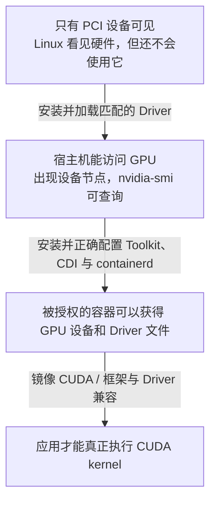
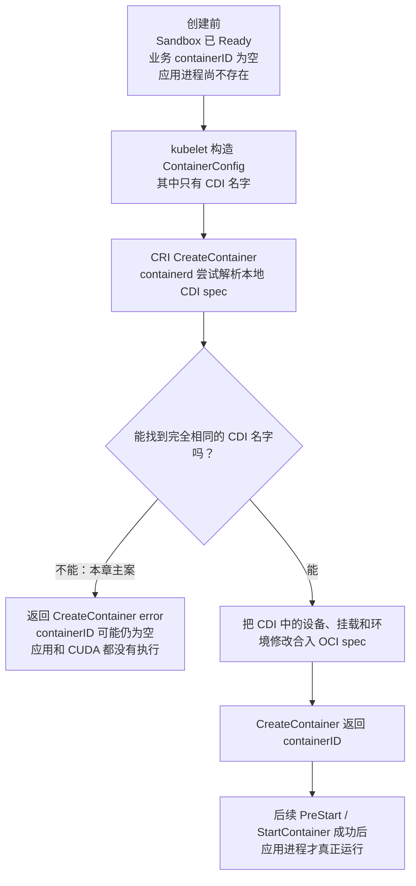

# 第 14 课：`game-infer` 已调度到 Ready GPU Node，为什么仍然 `CreateContainerError`——Driver、CUDA、Toolkit、containerd 与 CDI 怎样分账

> 这一课只追一个问题：**Pod 已经调到 GPU 节点，为什么仍可能连业务容器都创建不出来？** 我们用同一个 Pod UID（Pod对象不会重复的身份证）和一次 `unknown CDI device` 故障，把每一层到底负责什么说清楚。

先直接回答：

> **调度成功，只说明 scheduler 在 Kubernetes 的资源账里为 Pod 找到了一台“承诺有 GPU 配额”的节点。它还没有证明这台节点的驱动能用、容器运行时能把指定 GPU 放进容器、镜像里的 CUDA 与驱动兼容，更没有证明模型已经执行。**

因此，`PodScheduled=True` 和“容器真的能用 GPU”之间，至少还有三道门：

```text
节点的 Driver 能不能控制这块卡
  -> containerd 能不能按 CDI 说明把这块卡交给当前容器
  -> 镜像里的 CUDA / PyTorch 能不能真正执行 GPU 计算
```

## 0. 先把五个最容易混的名字翻成人话

| 名字 | 先这样理解 | 它所在的层 | 它不负责什么 |
|---|---|---|---|
| **NVIDIA Driver（驱动）** | Linux 控制 GPU 的“司机和翻译员”；它提供内核模块、`/dev/nvidia*` 设备入口、`libcuda`，以及 NVML（`nvidia-smi` 常用的 GPU 管理/监控库） | 节点操作系统 | 不替 scheduler 分配 GPU，也不保证容器能拿到 GPU |
| **CUDA** | 应用使用 NVIDIA GPU 做计算的一套编程和运行环境；PyTorch 最终会通过它调用驱动 | 主要在应用镜像，底层再连接宿主机 Driver | 不是 Driver 的另一个名字；装了 Driver 不等于镜像 CUDA 一定兼容 |
| **NVIDIA Container Toolkit** | 帮容器运行时找到应该注入的 GPU 设备节点和 Driver 文件的工具箱 | 节点容器运行时集成层 | 不替代 Driver，也不决定这个 Pod 应拿哪块 GPU |
| **containerd** | kubelet 请求它创建 Pod 沙箱和业务容器；它把最终容器配置交给更底层运行程序 | 节点容器运行时 | 不参与 scheduler 的选 Node 计算 |
| **CDI** | 一份“设备名字对应哪些容器修改”的标准说明书；例如这个名字需要加入哪些设备节点、挂载和环境变量 | 节点本地配置与运行时解析层 | CDI 文件不是 GPU 本身，也不是 Kubernetes 的 GPU 数量账 |

再认几个辅助词：`Device Plugin` 是 NVIDIA 提供的 Kubernetes 设备插件，负责上报可分配 GPU 并返回注入信息；`CRI` 是 kubelet 调用 containerd 等运行时的标准接口；CRI `ContainerConfig` 是 kubelet 交给runtime的“一份业务容器创建单”；`OCI spec` 是运行时真正创建 Linux 容器前使用的最终配置说明；`Sandbox` 是同一个 Pod 中各容器共用的基础运行环境，可以先理解成“业务容器开工前的地基”。Driver 里的 `kernel module` 是加载进 Linux 内核的驱动代码，`device node` 则是进程可以打开的 `/dev/nvidia*` 设备入口。

本文单写 `Event` 时，指 `kubectl describe pod` 能看到的 Kubernetes 诊断记录；Device Plugin 的 `ListAndWatch` 更新是设备状态通知，不是这种公开 Event，也不是一条“创建一次容器”的命令。

### 0.1 安装前后到底多了什么

下面**从上往下读**。每个箭头表示“增加一层前置能力”，不是安装命令，也不是组件之间的一次同步 RPC（程序 A 直接远程调用程序 B 并等待返回）。



最容易犯的错误，是看到第二格成功就直接宣布第四格成功。宿主机 `nvidia-smi` 能工作，只证明 Driver/NVML 这段大体可用；它没有经过当前 Pod 的设备分配、CDI 解析和应用 CUDA 路径。

### 0.2 首遍只走六站

首遍不要从 3000 多行第 1 行硬读到最后。按下面六站走，每站只回答一个问题：

| 站点 | 阅读位置 | 这一站只学会什么 |
|---:|---|---|
| 1 | 第 1 节，重点 1.1～1.2 | 固定 `game-infer` 的失败阶段；用第一段 Kubernetes 源码确认 kubelet只是复制 CDI 名字 |
| 2 | 第 2～3 节 | 为什么资源分配账、Driver 账、CDI 账和容器实际状态必须拆开 |
| 3 | 第 4～8 节只看每节结论 | Driver、CUDA 和 `nvidia-smi` 分别能证明到哪里 |
| 4 | 第 9～13 节只看大白话总结 | Toolkit、CDI、containerd 和 kubelet怎样在容器创建边界交接 |
| 5 | 第 15～17 节 | 用同一 Pod、同一 Node、同一时间窗的只读证据找到第一处矛盾 |
| 6 | 第 21～29 节与 30.1 | 改一个故障输入预测责任层，并完成首遍验收 |

**首遍源码规则：** 第 1.1 节完整逐行读；第 13 节先只看每段“这段只回答什么”和“大白话总结”。如果你能说清“谁给名字、谁只转交、谁负责解析”，就已经抓住本课主线。

**二遍再读：** 精读第 4～14 节的版本和实现边界、第 16 节的取证细节、第 18～20 节的隔离实验设计、第 26～27 节的节点变更与安全，以及第 30.2 节二遍验收。DRA（Kubernetes 动态资源分配）、NRI（runtime 给外部插件提供的容器调整接口）、MIG（一块 GPU 切成多个硬件隔离实例）、containerd CDI cache（runtime 内存里已加载的 CDI 名单）和完整 DeviceManager（kubelet内部管理传统设备分配的模块）算法都不是首遍门槛。

### 0.3 源码基线、外部仓库与阅读约定

```text
本地 Kubernetes 源码：D:\datou\devops\kubernetes-master\kubernetes
commit：301946d15e67a4a2e8a5fb8292eb836acd366d78
describe：v1.37.0-alpha.0-280-g301946d15e6
Kubernetes 源码深度：定位交接入口，不提前深读设备分配算法
GPU 节点运维深度：要能按责任层独立取证，并设计安全的变更与回退
```

文中的 `pkg/...`、`staging/...` 路径都属于上面这份本地 Kubernetes 仓库。NVIDIA Driver、NVIDIA Container Toolkit、NVIDIA Device Plugin 和 containerd 是**外部项目**，不在 Kubernetes 仓库里；涉及它们的代码会明确写“外部仓库证据”，并锁定 tag 或文档版本，不能把它们冒充 Kubernetes 源码。

> **源码阅读约定：** 标有“教学注释版”的 Go 代码，变量名、判断顺序和返回关系来自标明的固定版本；中文 `//` 是讲义新增，不是上游注释。每块会说明是完整函数、连续摘录还是非连续检查点，不用孤立的 `...` 冒充删掉的代码。源码后用“大白话总结”回答整段作用，再只解释确实挡住阅读的 Go 语法。

本机是 `go1.19.4 windows/amd64`，当前 Kubernetes 源码要求 Go `1.26.0`。本课完成的是固定 commit 的静态源码与测试代码核对；不能写成相关 `go test` 已在本机通过。表格默认逐行从左往右读；没有“时间/阶段”列时，各行通常是并列关系。

### 0.4 本课停止线

本课回答“这台机器和这个容器是否具备使用 GPU 的底座”，但不会提前读完后面三章：

- 第 15 课：GPU 怎样注册并变成 Node Capacity/Allocatable（节点容量总账/可分配账）；
- 第 16 课：kubelet 怎样选择 device ID、调用 Allocate 并组装注入参数；
- 第 17 课：checkpoint（kubelet落盘保存的设备分配快照）、健康变化、PodResources（查询Pod实际分到哪些设备的接口）与 CDI 怎样形成可恢复账本。

---

## 1. 固定同一个可证伪现场：Sandbox 已经 Ready，业务容器却没有 ID

以下是脱敏教学现场，贯穿本章：

```text
Deployment: prod/game-infer
Pod:        prod/game-infer-new-x
UID:        7c67b840-1111-2222-3333-555555555555
Node:       gpu-node-07

image:      registry.example.com/ai/game-infer@sha256:<教学digest>
framework:  PyTorch + CUDA 12.x（实际版本以镜像SBOM为准）
limits:     nvidia.com/gpu: 1

资源路径：传统NVIDIA Device Plugin v0.17.1 + cdi-cri策略
Device Plugin配置：DEVICE_LIST_STRATEGY=cdi-cri，DEVICE_ID_STRATEGY=uuid
DRA映射：已确认没有匹配nvidia.com/gpu的DeviceClass
runtimeClassName: 未设置，使用默认handler原生消费CDI

Node Ready=True
Node status.capacity.nvidia.com/gpu=4
Node status.allocatable.nvidia.com/gpu=4
PodScheduled=True
PodReadyToStartContainers=True
Sandbox attempt=0 / READY
业务containerID=""（尚未创建成功）
container waiting.reason=CreateContainerError
```

这几行里几个词先翻一下：

- `digest` 是镜像内容的固定指纹，比会漂移的 tag 更能锁定“当时究竟跑了哪份镜像”；`SBOM` 是镜像里实际有哪些软件和版本的清单；`framework` 在本案就是 PyTorch 这类调用 CUDA 的应用框架。
- `cdi-cri` 表示 Device Plugin 把完整 CDI 名字直接写进 CRI 的 `CDIDevices` 字段；`UUID` 是设备的唯一编号，本案不用容易随环境变化的序号 `0/1` 当身份。
- `DRA` 是 Kubernetes 新的动态资源分配机制；`DeviceClass` 是其中描述某类设备和分配方式的集群对象。本案已经用现场对象排除这条路径。
- `RuntimeClass` 是 Pod 用来选择哪套容器运行配置的 Kubernetes 对象；`handler` 是这套配置交给CRI的名字。未设置就走默认handler。
- `attempt=0` 表示这是这个 Sandbox 的第一次创建尝试；CDI名字里的`vendor`可以先理解为“这类说明书由谁定义和维护的命名前缀”。

同一 UID的 Event/kubelet-runtime错误给出：

```text
CreateContainer无法解析CDI device：k8s.device-plugin.nvidia.com/gpu=GPU-aaaa
```

目标 Node 同一时间窗：

```text
host nvidia-smi -L：能够看到 GPU-aaaa
Device Plugin日志：本轮没有成功生成 k8s.device-plugin.nvidia.com/gpu spec 的完成证据
/var/run/cdi中的Device Plugin自生成spec：没有GPU-aaaa，或mtime（文件最后修改时间）早于最近一次Driver/MIG相关变更
nvidia-ctk cdi list（聚合视图）：也没有 k8s.device-plugin.nvidia.com/gpu=GPU-aaaa
```

本章先提出一个可被推翻的假设：

> Kubernetes已经把设备注入意图推进到CRI ContainerConfig；但目标Node的runtime无法在本地CDI账中解析`k8s.device-plugin.nvidia.com/gpu=GPU-aaaa`，所以失败发生在业务container创建阶段，应用进程、容器内`nvidia-smi`和CUDA framework都还没有执行资格。这里的vendor、device name和spec所有者都属于NVIDIA Device Plugin v0.17.1，不属于`nvidia-cdi-refresh`。

下面任一证据都会推翻或改写这个假设：

- Pod没有绑定Node，说明还在scheduler责任域；
- Node根本没有`nvidia.com/gpu`，说明先回到第15课注册/ListAndWatch；
- Sandbox也没创建且错误是unknown runtime handler，说明失败在RuntimeClass/RunPodSandbox；
- host `nvidia-smi`也失败，说明更底层Driver/PCI账已经坏；
- 已存在业务container ID且进程Running，说明CreateContainer链已经越过，应转向容器注入或CUDA应用；
- Device Plugin自生成spec与runtime聚合清单都包含完全相同的name，说明还要查runtime加载目录/cache、spec内容和其他CreateContainer输入。

值班同学若只在宿主机执行：

```bash
nvidia-smi
```

看到 GPU后就判断“驱动没问题，应该是 Kubernetes问题”，仍然过早。宿主机 `nvidia-smi` 成功只证明责任栈中的一部分：

```text
PCI设备可见
  + 当前内核能使用匹配的NVIDIA驱动
  + nvidia-smi能装载NVML并查询设备
```

它没有证明：

- containerd 已启用正确的 NVIDIA 注入路径；
- CDI spec 存在且包含目标 device；
- Device Plugin 已把 `nvidia.com/gpu` 上报给 kubelet；
- kubelet 已给该 container 分配目标 device ID；
- CRI/OCI runtime 已把设备节点、库、环境变量或 hook（容器进程启动前后调用的辅助程序）注入容器；
- 镜像中的 CUDA runtime/framework 与宿主机 Driver兼容；
- 应用真的成功执行过 CUDA kernel。

反过来，Node `Ready=True` 只说明 kubelet的通用节点健康条件已满足，也不证明 GPU 栈健康。MIG 是把一块受支持的 GPU 硬件切成多个隔离实例的能力；本案不展开它，只把“最近切过 MIG”当作可能让旧设备名单过期的输入。

### 1.1 第一段核心源码：kubelet 会不会自己打开 CDI 文件

先只回答一个问题：**Device Plugin 已经给出 `k8s.device-plugin.nvidia.com/gpu=GPU-aaaa` 后，kubelet 会不会在这里打开本地 CDI 文件、验证这个名字并直接挂载 `/dev/nvidia0`？**

不会。先看本课第一段 Kubernetes 源码。

源码：`kubernetes/pkg/kubelet/kuberuntime/kuberuntime_container.go:470-480`，固定 commit `301946d15e67a4a2e8a5fb8292eb836acd366d78`。

摘录类型：**完整函数，教学注释版**。`opts` 是前面资源管理代码已经组装好的容器运行参数；这段函数没有被省略的错误分支或文件读取分支。

```go
// makeCDIDevices 把 kubelet 内部的 CDI 名单转换成 CRI 协议对象。
func makeCDIDevices(opts *kubecontainer.RunContainerOptions) []*runtimeapi.CDIDevice {
	// 输出列表与输入名单一样长；这里只准备放指针的位置，没有打开任何 CDI 文件。
	devices := make([]*runtimeapi.CDIDevice, len(opts.CDIDevices))

	// 逐个读取 kubelet 已经拿到的 CDI 设备名字；i 是当前下标，device 是当前项。
	for i, device := range opts.CDIDevices {
		// 在同一个下标创建一个 CRI CDIDevice 对象。
		devices[i] = &runtimeapi.CDIDevice{
			// 唯一复制的业务字段就是名字字符串；本案中就是完整的 GPU 选择名（selector）。
			Name: device.Name,
		}
	}

	// 把转换后的名单交给 ContainerConfig 构造逻辑，稍后随 CreateContainer 发给 runtime。
	return devices
}
```

按“输入、判断、动作、结果”收束：

| 项目 | 本案中的意思 |
|---|---|
| 输入 | `opts.CDIDevices` 已含 `k8s.device-plugin.nvidia.com/gpu=GPU-aaaa` |
| 判断 | 这里只按输入长度和下标循环，没有“文件是否存在”“UUID 是否有效”的判断 |
| 动作 | 为每个名字创建一个 CRI `CDIDevice`，原样复制 `Name` |
| 结果 | 名字进入后续 `ContainerConfig`；能否解析，要等目标 Node 的 containerd/CDI 实现回答 |

**大白话总结：** kubelet在这里像“把设备取货码抄到快递单上”。它不打开货柜，也不检查货柜里是否真有这件货。主案的 Kubernetes 侧可以已经正确拿到取货码，但目标 Node 的 runtime 本地没有同名 CDI 说明书，`CreateContainer` 仍会失败。

**顺手学 Go：** receiver 是函数名前面用于表示“这个方法属于哪个类型”的接收者；本函数没有 receiver，所以是普通函数。`*T` 是指向一个 `T` 对象的指针（地址引用），`[]*T` 是“元素都是指针的可变长度列表”，Go把这种列表叫 slice。`make([]*T, n)` 先创建长度为 `n` 的位置；`for i, device := range ...` 同时取得下标和值；`&runtimeapi.CDIDevice{...}` 创建结构体并取地址。这里没有返回 `error`，所以“CDI 名字无法解析”也不可能从这个函数返回。

这段源码已经钉住本章最重要的责任断点：

> **Kubernetes 仓库能证明 kubelet怎样转交 CDI 名字；至于 NVIDIA spec 怎样生成、containerd 怎样扫描和缓存它，必须去对应的外部项目和目标 Node 取证。**

### 1.2 容器创建前后到底变了什么

下面**从上往下读**。菱形是 runtime 必须回答的是/否问题；实线表示同一次容器创建流程中的先后，`CreateContainer` 是 kubelet通过 CRI 发给 runtime 并等待结果的一次调用。



这张图也说明为什么“Sandbox 已经 Ready”与“业务容器创建失败”不矛盾：Sandbox 是 Pod 的地基；CDI 名字属于具体业务容器的 `ContainerConfig`，要到后面的 `CreateContainer` 才消费。

---

## 2. 全栈责任图：从一块卡到一次 CUDA kernel

在看组件之前，先回答“为什么不能更简单”。

### 2.1 错误设计一：kubelet直接硬编码 `/dev/nvidia0` 和Driver library

这会让 Kubernetes核心代码绑定单一厂商、GPU代际、MIG形态、device node和library布局。每次Driver/Toolkit变化都要升级 kubelet，而且 kubelet仍不知道租户应该拿哪一个device ID。正确做法是让厂商插件/资源管理器给出注入意图，让CRI/runtime消费通用device、mount、env、annotation或CDI结构。

### 2.2 错误设计二：只要Node有GPU，就默认暴露给所有container

这会绕过scheduler和kubelet的资源账：

- 未请求GPU的Pod也能占卡；
- 资源配额、成本归属和PodResources失真；
- 多租户隔离被破坏；
- 同一GPU可能被非预期进程竞争或修改管理状态。

因此“宿主机可见设备”与“这个container被授权获得设备”必须分开。

### 2.3 错误设计三：用一个 `GPUHealthy=true` 同时代表所有层

PCI可见、Driver/NVML可查询、Device Plugin上报、CDI name可解析、container成功注入、CUDA kernel可执行，是不同所有者和不同时钟下的事实。把它们压成一个bool，任何失败都只能得到“GPU坏了”，既无法定位，也无法安全决定重启Pod、刷新CDI、重启runtime还是下线Node。

### 2.4 错误设计四：让 RuntimeClass同时承担资源分配

RuntimeClass选择的是PodSandbox使用哪个CRI runtime handler；它不创建 `nvidia.com/gpu` Capacity，也不决定哪个租户拿哪块卡。把两者混在一起，会让“unknown handler”和“Insufficient GPU”被当成同一种故障。

### 2.5 错误设计五：让CDI spec同时当scheduler资源账

CDI描述“给定一个fully qualified name，runtime应怎样修改OCI spec”。它不保证：

- 设备仍然健康；
- 这个device应该分配给当前Pod；
- Node有多少可调度GPU；
- 另一个Pod是否已经占用该device。

所以 Kubernetes分配账与Node本地CDI解析账必须分开，代价是两本账可能漂移；本章主案正是这种漂移。

### 2.6 错误设计六：host `nvidia-smi` 成功就宣布全栈通过

它绕过了Device Plugin分配、kubelet注入、CRI/containerd/CDI、container namespace和应用CUDA runtime。它是Driver/NVML层的强证据，却不是整个链的终点。

### 2.7 五本账和十条不变量

| 本地/集群账 | 主要所有者 | 主案中的key/事实 |
|---|---|---|
| 物理与Driver账 | 云平台/OS/NVIDIA Driver | PCI BDF（设备在总线上的地址）、GPU UUID、module、device node、NVML（`nvidia-smi`常用的管理库） |
| Kubernetes分配账 | scheduler、Device Plugin/DRA、kubelet | Pod UID、resource name、device allocation |
| Toolkit/CDI解析账 | NVIDIA Toolkit、CDI refresh、runtime | fully qualified CDI name（完整查找名） -> OCI edits（对最终容器配置的修改） |
| CRI/runtime实际结果账 | containerd/CRI/OCI runtime | Sandbox ID、container ID、CreateContainer结果 |
| CUDA应用与服务账 | 镜像/framework/业务 | library版本、compute capability（GPU架构能力版本）、显存、kernel与推理结果 |

本章保持十条不变量：

1. **Node Ready不等于GPU栈Ready。**
2. **Node出现`nvidia.com/gpu`只证明资源上报，不证明目标container已注入。**
3. **host `nvidia-smi`成功不证明CDI/runtime或CUDA应用成功。**
4. **container内`nvidia-smi`成功仍不证明目标framework/kernel成功。**
5. **RuntimeClass选择sandbox handler，不创造GPU资源。**
6. **CDI spec描述OCI edits，不拥有scheduler分配权。**
7. **kubelet复制CDI name，不负责解析Node本地spec。**
8. **CreateContainer之前失败时，可能根本没有container ID可inspect。**
9. **配置文件、`config dump`与daemon（常驻运行的containerd进程）实际运行证据是三种不同证据。**
10. **Driver/Toolkit/containerd变更是Node级变更，必须canary、摘流量、验证和回退。**

这些分层带来的收益是可移植、可扩展和责任清晰；代价是跨账本的最终一致性、版本兼容和节点漂移必须由运维证据与变更治理承担。这里的 canary 是“先只改一台或很小一批测试节点，验证稳定后再扩大”。

下面**从上往下读**。箭头表示“上一层是下一层工作的前提，或把配置交给下一层”，不是说整条链是一串同步 RPC。

```text
物理卡 / 云平台PCI透传 / vGPU
  |
  | lspci、云平台设备挂载
  v
Linux内核 + NVIDIA kernel modules
  |
  | nvidia、nvidia_uvm（统一虚拟内存模块）、按平台需要的其他模块
  | /dev/nvidia0、/dev/nvidiactl、/dev/nvidia-uvm...
  v
NVIDIA Driver 用户态组件
  |
  | libcuda.so：CUDA Driver API
  | libnvidia-ml.so：NVML，nvidia-smi和DCGM（NVIDIA GPU监控与诊断工具）常用
  v
容器镜像中的 CUDA 用户态
  |
  | libcudart.so、CUDA libraries、framework、业务应用
  v
NVIDIA Container Toolkit
  |
  | 发现设备和驱动文件
  | 标准workload优先走runtime原生CDI；锁定版本也可能使用NVIDIA runtime cdi/jit-cdi或legacy
  | 特定GPU管理容器可能另由NRI调整
  v
containerd CRI plugin -> container runtime -> OCI runtime
  |
  | 消费CRI ContainerConfig中的device/mount/env/CDI信息
  v
容器内进程
  |
  | CUDA Driver API -> kernel driver -> GPU
  v
CUDA kernel真正执行
```

Kubernetes 位于其中的上层编排位置，但要先分清两本资源账。下面两条分支都**从上往下读**；它们是两种资源管理方案，不表示一个 Pod 会先走左边再走右边：

```text
传统Device Plugin：
  Pod limits: nvidia.com/gpu
    -> Node Capacity/Allocatable扩展资源
    -> scheduler按扩展资源账本选Node
    -> kubelet DeviceManager选具体device并取得注入参数

原生DRA：
  DeviceClass（设备类别）/ ResourceSlice（可用设备清单）/ ResourceClaim（Pod的设备申请与分配结果）
    -> scheduler与DRA controller/driver完成claim allocation
    -> kubelet DRA manager取得CDI等注入信息

两条路径最终都可能：
  -> CRI把容器配置交给runtime
```

所以本章出现的`nvidia.com/gpu`、Node Capacity/Allocatable和第15～16章 DeviceManager，特指**传统 Device Plugin扩展资源路径**。原生 DRA 不要求Node上一定存在`nvidia.com/gpu`；它的可调度性与分配事实要看DeviceClass、ResourceSlice、ResourceClaim及其allocation，不能拿扩展资源字段代替。

还要加一个当前源码例外：本仓库`DRAExtendedResource`（把传统扩展资源请求桥接成DRA申请的功能）已是Beta（默认可用，但接口仍可能继续演进）且默认开启。若某个`DeviceClass.spec.extendedResourceName`匹配`nvidia.com/gpu`，看起来仍是传统extended resource的container limit，也可能被scheduler转换成DRA ResourceClaim。因此“YAML写了`nvidia.com/gpu: 1`”本身不再足以证明走传统DeviceManager；还要查匹配的DeviceClass和Pod `status.extendedResourceClaimStatus`。

Kubernetes 不会替你：

- 把一块未透传的 PCI 设备“变出来”；
- 编译一个不匹配当前内核的 NVIDIA kernel module；
- 自动修复镜像里的 CUDA library ABI（应用与底层库必须共同遵守的二进制接口约定）；
- 仅凭 `limits: nvidia.com/gpu: 1` 安装 Driver；
- 仅凭 RuntimeClass 创建 `nvidia.com/gpu` 资源；
- 仅凭 CDI spec 判断一块 GPU 是否应该被 scheduler分配。

---

## 3. 用你熟悉的 Java 容器栈做类比

| Java平台层 | GPU平台对应层 | 共同排障思想 |
|---|---|---|
| 物理机/VM有CPU | 物理机/VM透传出GPU | 先证明硬件在宿主机责任域存在 |
| Linux kernel/cgroup（限制进程资源的内核机制） | NVIDIA kernel module/device node | 先证明内核能管理资源 |
| glibc/JDK native库 | `libcuda.so`、NVML | 用户态入口必须能装载 |
| JRE/JDK与应用bytecode | CUDA runtime/framework与模型程序 | 应用依赖与底层兼容 |
| containerd/runc 的mount与namespace（把文件挂入容器，并隔离进程视图） | Toolkit + containerd/OCI/CDI | runtime负责把宿主机能力交给容器 |
| Deployment request/limit | `nvidia.com/gpu` limit | Kubernetes只消费资源账本 |

这里的 `runc` 是 containerd 常用的底层OCI运行程序，负责按最终spec真正创建Linux容器；它不负责Kubernetes调度。

最重要的迁移不是记新命令，而是保持原来的证据纪律：

```text
不要因为Java进程存在就断言readiness健康
同样，不要因为nvidia-smi成功就断言CUDA业务健康

不要因为Node Ready就断言所有节点插件健康
同样，不要因为Pod Scheduled就断言GPU已经注入容器
```

---

## 4. 第一层：GPU 是否真的出现在这台 Node

### 4.1 裸金属与云主机先看 PCI/平台分配

查询意图的证据（通常不改变管理配置）：

```bash
lspci -nn | grep -i -E 'nvidia|3d controller|vga'
```

这一步回答：

```text
Linux PCI层是否看到了设备
```

它还没有回答：

```text
NVIDIA驱动是否绑定成功
设备是否健康
是否能执行CUDA
```

在云平台、VM（虚拟机）、vGPU（把一块物理 GPU 的能力切给多个虚机）或裸金属直通环境，还要保留控制面证据：

- 实例规格/虚机型号；
- PCI passthrough（把整块 PCI 设备交给虚机）、vGPU profile（虚机拿到的 GPU 规格）或 SR-IOV（把一个 PCI 设备暴露成多个虚拟功能）分配；
- 宿主机与 guest（虚机里的操作系统）的 IOMMU（限制设备能访问哪些内存区域）/直通状态；
- 云厂商维护、热迁移、宿主机故障记录。

如果 `lspci` 根本没有 NVIDIA设备，优先回到硬件、BIOS、PCIe、云平台分配或虚拟化层；此时修改 Kubernetes YAML没有意义。

### 4.2 设备存在不等于驱动绑定

可补充查看：

```bash
lspci -nnk -d 10de:
```

重点区分：

```text
Kernel driver in use
Kernel modules
```

前者才是当前绑定使用的 driver。设备可能被 `vfio-pci`（常用于把PCI设备交给虚机或用户态程序的通用驱动）占用、驱动未加载，或绑定状态与预期不一致。

---

## 5. 第二层：kernel module 与 device node

### 5.1 模块证据

```bash
uname -r
lsmod | grep -E '^nvidia'
modinfo nvidia 2>/dev/null | head
cat /proc/driver/nvidia/version 2>/dev/null
```

这些证据分别回答：

| 证据 | 回答什么 | 不能证明什么 |
|---|---|---|
| `uname -r` | 当前正在运行的kernel | NVIDIA模块已为该kernel构建 |
| `lsmod` | 模块当前已加载 | 每块卡都健康 |
| `modinfo` | 系统上模块文件及元数据 | 此模块就是当前加载版本 |
| `/proc/driver/nvidia/version` | 当前driver版本/构建信息 | 容器能看到driver库 |

生产中常见的升级事故：

```text
OS更新安装了新kernel
  -> Node尚未重启，当前kernel仍旧
  -> 或Node重启进入新kernel
  -> DKMS（随kernel变化自动重编驱动模块）/precompiled module（厂商预先编好的模块）没有为新kernel准备好
  -> nvidia module加载失败
  -> /dev/nvidia*消失
  -> Device Plugin上报容量下降或启动失败
```

所以 Driver升级不是单独升级一个用户态命令。要把下面内容作为一个变更单元：

- kernel版本；
- 对应 kernel headers/devel包；
- NVIDIA driver branch（发布维护线）/package；
- open/proprietary kernel module flavor（开源版或闭源版驱动模块实现）；
- Secure Boot（只允许可信代码启动）与 module signing（内核模块签名）；
- NVSwitch多卡机器上的 Fabric Manager（管理GPU高速互联结构的服务）等平台组件；
- 重启与回退路径。

### 5.2 open 与 proprietary kernel modules

当前 NVIDIA 官方安装文档同时提供 open 与 proprietary kernel module路径；支持范围和推荐会随 GPU代际、driver branch、操作系统变化。

本课不要求你背“某个版本以后永远用哪一种”。生产做法是：

1. 记录 GPU型号/架构；
2. 记录目标 driver branch；
3. 查该 branch 的官方支持矩阵；
4. 使用发行版包管理器或平台统一交付方式；
5. 在测试节点完成 reboot、CUDA workload、监控和回滚验证。

不要混装 runfile（厂商提供的一体化安装文件）、发行版包、GPU Operator容器化driver（由Operator在Node上维护驱动）等多种安装方式。文件来自不同包时，kernel module和用户态library很容易出现版本漂移。

### 5.3 device node 是内核能力交给进程的门

常见只读检查：

```bash
ls -l /dev/nvidia* 2>/dev/null
```

常见但不是每台机器都完全相同的节点：

```text
/dev/nvidia0、/dev/nvidia1 ... 具体GPU
/dev/nvidiactl                  控制设备
/dev/nvidia-uvm                 UVM，统一虚拟内存；帮助CPU与GPU协同访问内存
/dev/nvidia-uvm-tools           UVM辅助工具接口
/dev/nvidia-modeset             显示/模式相关，compute-only场景未必是主证据
/dev/nvidia-caps/*              某些能力/MIG相关节点
```

不要写死“必须正好有这五个”。设备代际、driver、MIG和工作负载能力不同，所需节点也不同。

容器里只有 `nvidia-smi` 二进制但没有正确 device node/driver library，仍然不能访问 GPU。

---

## 6. 第三层：Driver 并不只是一个 kernel module

在 Linux 上，NVIDIA driver package通常同时交付：

```text
kernel-mode components
  +
CUDA user-mode driver（典型为 libcuda.so）
  +
管理库（典型为 libnvidia-ml.so / NVML）
  +
相关工具和辅助组件
```

### 6.1 三个库不要混

| 名称 | 大白话职责 | 通常来自哪里 |
|---|---|---|
| `libnvidia-ml.so` | 管理和监控GPU；`nvidia-smi`大量能力基于NVML | 宿主机Driver |
| `libcuda.so` | 应用通过CUDA Driver API进入宿主机Driver | 宿主机Driver |
| `libcudart.so` | CUDA Runtime API实现，应用常直接链接 | 通常在应用/CUDA镜像中 |

这解释了为什么：

```text
容器内 nvidia-smi 成功
  -> device + NVML utility 路径大体可用

但应用仍报：
  libcudart.so not found
  CUDA driver version is insufficient
  no kernel image is available
  undefined symbol
```

因为监控路径与实际应用的 CUDA runtime、framework、编译架构路径并不完全相同。

### 6.2 host 通常不需要完整 CUDA Toolkit

GPU Node 只负责**运行**已经构建好的容器化应用时，宿主机通常需要：

```text
兼容的 NVIDIA Driver
NVIDIA Container Toolkit / runtime集成
```

而不必安装完整的 CUDA Toolkit、编译器 `nvcc`、cuDNN（深度学习常用的GPU算子加速库）、PyTorch等开发依赖。这些通常随应用镜像交付。

官方 NVIDIA Data Center Driver工作流也明确区分：

- CUDA Toolkit：用于构建应用的用户态 SDK、runtime、libraries和工具；
- CUDA driver：用户态 `libcuda.so`；
- GPU device driver：kernel-mode component。

如果应用镜像动态链接某个 CUDA library，它仍必须在镜像或明确的兼容注入路径中存在；“宿主机装了 Toolkit”不是合理的镜像依赖管理方案。

---

## 7. 第四层：CUDA Toolkit、runtime、Driver 兼容关系

### 7.1 最稳定的心智模型

下面**从上往下读**。箭头表示运行依赖逐层落到底座，不代表这些组件在启动时按顺序做一串同步调用。

```text
应用/框架由某个CUDA Toolkit构建
  -> 镜像带相应CUDA runtime/libraries
  -> 运行时调用宿主机提供的CUDA Driver
  -> Driver必须满足该应用路径的兼容要求
```

常见兼容方向：

```text
较新的Driver运行较旧CUDA应用
  -> 通常走backward compatibility

同一major内较旧Driver运行较新minor Toolkit应用
  -> 可能走minor version compatibility
  -> 有最低Driver和特性限制

跨major让较旧Driver运行较新Toolkit
  -> 只有受支持平台/GPU下的forward compatibility路径
  -> 需要cuda-compat包等额外条件
```

这里的 `major` 是大版本号，`minor` 是小版本号。`backward compatibility` 可以先理解为“新 Driver 尽量兼容旧应用”；`minor version compatibility` 是“同一大版本内，在满足最低 Driver 要求时允许一定的小版本跨度”；`forward compatibility` 则是“较旧 Driver 借助额外兼容包承接较新应用”，限制最多，不能默认存在。

这里的minor version compatibility模型从CUDA 11开始适用；CUDA 10.x每个minor release仍有各自最低Driver要求，不能直接套用“同major即可”的简化句。即便是CUDA 11+，PTX、需要新Driver配合的新特性和目标架构编译参数仍可能打破兼容预期。

不能简化成“Driver版本比CUDA数字大就一定行”。还要核对：

- 官方 Toolkit release notes 的最低 Driver；
- GPU architecture/compute capability（GPU代际及它支持的计算指令能力）；
- 应用是否带 PTX（可由Driver再编译的中间代码）或只带对应 SASS（已经针对某代GPU编好的机器码）；
- framework、cuDNN、TensorRT（推理优化运行库）、NCCL（多GPU通信库）版本；
- 容器中实际装载的 library，而不是镜像标签想象值。

### 7.2 真正验证应用路径要执行 CUDA workload

这里的 CUDA kernel 是“交给 GPU 执行的一小段计算函数”，不是第 5 节说的 Linux kernel（操作系统内核）。

证据强度从弱到强：

```text
lspci发现GPU
  <
nvidia-smi -L
  <
容器内nvidia-smi
  <
deviceQuery识别设备并PASS
  <
vectorAdd/受控CUDA sample执行成功
  <
目标framework能分配显存并完成一次真实推理/训练
```

任何一级成功都不能自动替代更上一级。

---

## 8. `nvidia-smi` 到底证明什么

NVIDIA 官方文档说明，`nvidia-smi` 的大量能力由 NVML 提供；其输出中的 `CUDA Version` 是**当前 Driver支持的最新 CUDA 版本**，不是“宿主机已安装 CUDA Toolkit版本”的可靠证明。

### 8.1 宿主机成功

下面两条是**查询意图**，通常不会修改 persistence mode（持续保持驱动初始化）、MIG、clock（频率）、power（功耗上限）等管理配置。这里仍不把它们承诺成“严格零状态变化”：NVIDIA 官方说明，以 root 运行 `nvidia-smi` 时可能调整 NVIDIA device file。生产取证优先使用有读取权限的非 root 身份，并记录执行身份、时间和命令。

```bash
nvidia-smi -L
nvidia-smi --query-gpu=index,uuid,name,pci.bus_id,driver_version --format=csv,noheader
```

可以支持：

- driver/NVML能枚举GPU；
- UUID、PCI bus ID、Driver版本等管理信息可查询；
- 当前调用时设备没有完全从Driver视角消失。

不能单独支持：

- Toolkit安装版本；
- 某个容器已拿到GPU；
- 某个CUDA应用兼容；
- Device Plugin资源账本正确；
- GPU没有Xid（NVIDIA Driver记录的GPU错误编号）、ECC（显存纠错）或链路历史/间歇性故障；
- 一次多卡通信/NCCL拓扑健康。

### 8.2 容器内成功

容器内 `nvidia-smi` 成功，比宿主机成功多证明了：

```text
该容器获得了足够的device/NVML utility注入
```

它仍不等于：

```text
libcudart/framework版本正确
应用能执行目标kernel
显存足够
NCCL跨卡通信健康
```

### 8.3 不把人类表格输出当稳定API

NVIDIA 文档提示 `nvidia-smi` 人类可读输出不保证跨版本向后兼容。自动采集时：

- 优先 `--query-gpu=... --format=csv,noheader,nounits`；
- 长期维护程序优先使用NVML或官方稳定binding；
- 不用 `awk '{print $9}'` 解析整张动态表格；
- 保留命令版本、字段名、时间与Node身份。

---

## 9. 第五层：NVIDIA Container Toolkit 做了什么

NVIDIA Container Toolkit位于“宿主机Driver已经可用”和“容器真正获得GPU能力”之间。

它的工作不是替代Driver，也不是替代Kubernetes调度。大白话说：

```text
容器runtime已经会创建普通Linux容器
Toolkit告诉runtime：
  这次还要把哪些GPU设备节点
  哪些Driver用户态library/工具
  哪些环境变量、mount、hook或OCI edit
  交给这个容器
```

当前 Toolkit文档中的主要组件包括：

- `libnvidia-container` / `nvidia-container-cli`；
- `nvidia-ctk`；
- NVIDIA container runtime hook；
- 兼容场景中的 `nvidia-container-runtime`包装层；
- CDI以及NRI等生态集成能力（适用对象不同，见下文）。

历史文章经常让你安装独立 `nvidia-docker2`、把 `nvidia`设成所有容器默认 runtime。当前文档已经把一些旧包标为 deprecated/兼容用途；不能照抄旧博客。

### 9.1 先拆成两根轴：Device Plugin写什么，runtime最后怎样兑现

这是本章最容易混淆、也最值得背下来的设计边界：

这里的 `AllocateResponse` 是 Device Plugin 在“这次给容器分到了哪些设备”之后交回 kubelet 的结果信封；`strategy` 就是插件选择把结果装进信封哪个字段的策略。

```text
轴A：NVIDIA Device Plugin的deviceListStrategy
  -> 只决定AllocateResponse写入env、mount、annotation还是CDIDevices

轴B：目标Node最终采用哪种注入实现
  -> 决定谁把输入兑现成OCI device node、mount、library、env或hook
```

**轴A不是轴B的别名。** 例如`envvar`只说明插件写了`NVIDIA_VISIBLE_DEVICES`，并不能证明NVIDIA runtime最后一定用了legacy hook；Toolkit v1.18后的NVIDIA runtime也可能在`cdi/jit-cdi` mode里消费这个输入。反过来，`cdi-cri`明确说明插件把fully qualified name（能唯一查找设备说明的完整名字）放进CRI字段，却不等于CDI spec一定由`nvidia-cdi-refresh`生成。

#### 9.1.1 轴A：v0.17.1的四种Device Plugin输出

v0.17.1 README明确允许多个strategy用逗号组合，因此下面各行可以同时出现；生产必须先读实际ConfigMap、Pod env和插件启动日志，不能只看chart默认值。

| `DEVICE_LIST_STRATEGY` | Device Plugin实际写入 | 直接消费者 | 不能据此推出 |
|---|---|---|---|
| `envvar` | `AllocateResponse.Envs`中的`NVIDIA_VISIBLE_DEVICES=<UUID或index列表>` | NVIDIA Container Runtime | 不能推出内部一定是legacy；也没有产生CRI `CDIDevices` |
| `volume-mounts` | 特殊env哨兵 + `/var/run/nvidia-container-devices/<ID>`形式的mount | 开启相应识别能力的NVIDIA Container Runtime | 不能当成runtime原生CDI；也不能只看mount就猜具体runtime mode |
| `cdi-annotations` | `AllocateResponse.Annotations`中的CDI annotation | 支持该annotation约定的CDI-enabled engine；v0.17.1源码注释也保留兼容NVIDIA runtime的可能 | 不能当成CRI `CDIDevices`字段；annotation前缀与消费者能力必须锁版本 |
| `cdi-cri` | `AllocateResponse.CDIDevices`中的fully qualified name | Kubernetes转发后，由CDI-enabled runtime/engine消费 | 不要求NVIDIA runtime包装层；本案的spec由Device Plugin自己生成 |

下面是**外部仓库证据**，来自 `NVIDIA/k8s-device-plugin` 的固定 tag `v0.17.1`，不在本地 Kubernetes 仓库中。源码位置：`internal/plugin/server.go:401,470`；摘录类型是**两个非连续检查点，教学注释版**，只用来比较两种 strategy 写入的字段：

```go
// envvar 策略把选中 ID 拼成 NVIDIA_VISIBLE_DEVICES 的值。
response.Envs[deviceListEnvVar] = strings.Join(deviceIDs, ",")
// cdi-cri 策略则把 CDI 对象指针追加到 AllocateResponse.CDIDevices。
response.CDIDevices = append(response.CDIDevices, &cdiDevice)
```

**顺手学 Go：** `map[key] = value`是在map中写入键值；`strings.Join(slice, ",")`把字符串slice按逗号连接。`&cdiDevice`取得struct地址，`append`再把这个指针追加到`[]*CDIDevice`，不是把整个对象复制成另一个字段。

**大白话总结：** strategy决定的是“插件把名单写在哪个信封里”。env、mount、annotation和CRI字段是四种不同信封；真正拆信并改OCI spec的是下一根轴。

#### 9.1.2 轴B：四类最终注入实现

先把几个词翻成人话：`native CDI` 是 containerd 自己读 CDI 说明书；`jit-cdi` 是 NVIDIA runtime 临时生成并使用说明书；`legacy` 是老式兼容路径；`prestart hook` 是业务进程启动前由运行时调用的一段注入程序。`NRI` 则是 runtime 在容器生命周期节点回调外部插件的接口。本段属于二遍，首遍只记“最终是谁把设备和库放进容器”。

| 最终实现 | 典型输入与处理者 | 是否用legacy prestart hook | 本课定位 |
|---|---|---|---|
| runtime原生CDI | CRI `CDIDevices`，或该engine明确支持的CDI annotation -> containerd/CRI原生读取CDI spec | 否 | 标准Device Plugin/DRA workload的主方向；本章主案 |
| NVIDIA runtime `cdi/jit-cdi` | NVIDIA runtime被选中，并消费其支持的设备选择输入；`cdi`使用现有spec，`jit-cdi`即时构造spec | 否 | NVIDIA runtime内部也可用CDI，但它不等于CRI原生`CDIDevices`链 |
| legacy mode | NVIDIA runtime消费env/volume选择信息 -> OCI prestart hook | 是 | 存量路径；Toolkit v1.18起已deprecated，不再是NVIDIA runtime默认mode |
| NRI plugin | runtime生命周期回调 + GPU管理容器的`NVIDIA_VISIBLE_DEVICES` | 不等同于legacy hook | 绕过Device Plugin/DRA分配的管理容器旁路，不是标准workload的AllocateResponse下游 |

把两根轴交叉起来，边界才清楚：

| 轴A输出 \ 轴B实现 | runtime原生CDI | NVIDIA runtime `cdi/jit-cdi` | NVIDIA runtime `legacy` | NRI |
|---|---|---|---|---|
| `envvar` | 不是CRI原生CDI输入 | 可以；具体mode由锁定Toolkit配置决定 | 可以；这是传统组合 | 不是同一条链；NRI管理容器虽也看同名env，但不是Device Plugin分配结果 |
| `volume-mounts` | 不是CRI原生CDI输入 | 只能按目标Toolkit版本与配置验证，不可凭插件strategy保证 | 常见存量兼容组合 | 不是标准映射 |
| `cdi-annotations` | 可以，但engine必须支持annotation约定 | v0.17.1源码保留兼容可能，必须锁定annotation prefix和runtime版本 | 不是legacy选择信号 | 不是标准映射 |
| `cdi-cri` | **主路径：CRI字段 -> native CDI -> 插件自生成spec** | 不需要靠NVIDIA runtime把env翻译成CDI；即使Pod另选named runtime（通过handler点名选择的runtime配置），也要分清是谁先消费CRI字段 | 不是legacy链 | 不是标准映射 |

四条简图都**从上往下读**。箭头表示输入被下一层消费，不表示四条路径会同时执行：

```text
原生CDI（本案）：
Device Plugin cdi-cri
  -> CRI CDIDevices
  -> containerd/CRI原生CDI消费者
  -> Device Plugin自生成spec中的OCI edits

NVIDIA runtime cdi/jit-cdi：
Device Plugin envvar/兼容输入
  -> NVIDIA runtime
  -> 使用现有或即时生成的CDI edits

legacy：
Device Plugin envvar/volume-mounts
  -> NVIDIA runtime prestart hook
  -> nvidia-container-cli修改容器

NRI：
GPU管理容器自行带NVIDIA_VISIBLE_DEVICES
  -> runtime生命周期调用NRI plugin
  -> 绕过Device Plugin/DRA的管理容器注入
```

原生CDI与legacy OCI hook同时作用还可能发生冲突。官方CDI文档明确提醒：若host仍有legacy hook配置，又给同一container设置`NVIDIA_VISIBLE_DEVICES`，必须确认不会发生双重注入；不能把“两个机制都打开”当作更保险。

### 9.2 GPU Operator v25.10+ 的 RuntimeClass/NRI矩阵

| 场景 | `runtimeClassName: nvidia` | 关键前提 |
|---|---|---|
| 标准Device Plugin/DRA workload + runtime原生CDI | 通常不需要 | CDI在runtime启用，资源由Device Plugin/DRA分配 |
| CDI启用、NRI未启用的GPU管理容器 | 需要 | 管理容器用`NVIDIA_VISIBLE_DEVICES`绕过Kubernetes GPU分配 |
| CDI + NRI启用的GPU管理容器 | 不需要 | Operator会删除/不依赖该RuntimeClass，由NRI处理 |
| legacy或旧版部署 | 按锁定版本确认 | 不能把v25.10默认值倒推到旧集群 |

GPU Operator可以先理解成“替平台统一安装和维护NVIDIA驱动、插件、Toolkit等GPU组件的控制器套件”。当前文档要求NRI与CDI一起启用，并列出的runtime范围是containerd `1.7.30`、`2.1.x`、`2.2.x`，或CRI-O（另一种Kubernetes容器运行时）`1.34+`；不能笼统写成“所有containerd 2.x”，尤其不能自动包含2.0.x。启用Operator NRI后，也不再需要Operator为这条管理容器路径修改containerd `config.toml`。官方当前还明确标注 **containerd NRI Plugin 尚未 GA（尚未达到官方承诺稳定可普遍使用的阶段）**，因此它必须按目标版本、发行说明和canary结果评估，不能当作跨版本无条件默认。

所以不能把NRI画成与Device Plugin、DRA等价的第三套资源分配账本。它可以改变容器配置，却不替scheduler/kubelet决定“这个租户应拿哪块GPU”。必须用锁定版本、Pod输入、RuntimeClass、runtime配置、CDI selector和运行日志确认现场究竟走哪条路径。

---

## 10. containerd、CRI、OCI runtime：谁负责哪一步

第 12 课已经建立通用链：

```text
kubelet
  -> CRI RuntimeService.CreateContainer
  -> containerd CRI plugin
  -> containerd task/runtime
  -> OCI runtime
  -> Linux namespaces/cgroups/mount/device
```

加上 GPU 后，主链变成：

下面两条链都**从上往下读**；其中 kubelet 调用 CRI `CreateContainer` 是一次真实接口调用，其余箭头主要表示配置交接或前置关系。

```text
传统DeviceManager或DRA manager取得GPU注入信息
  -> kubelet生成CRI ContainerConfig
  -> Devices / Mounts / Envs / Annotations / CDIDevices
  -> containerd CRI plugin消费
  -> runtime原生CDI、NVIDIA runtime cdi/jit-cdi、存量legacy hook，或管理容器专用NRI按现场路径处理
  -> OCI spec获得device node、mount、env、hook等edits
  -> OCI runtime创建容器
```

### 10.1 containerd 1.x 与 2.x 配置不要混抄

containerd官方当前文档明确区分：

```text
containerd 1.x：配置version 2，CRI配置主要位于 io.containerd.grpc.v1.cri
containerd 2.x：推荐配置version 3；runtime配置拆到 io.containerd.cri.v1.runtime，
               image配置拆到 io.containerd.cri.v1.images；
               io.containerd.grpc.v1.cri 仍承载部分gRPC/streaming配置
```

config version 2由containerd 1.3引入，containerd 2.x仍能读取并自动转换为version 3语义；所以“2.x推荐version 3”不等于“2.x拒绝version 2”。这也不是“整个CRI plugin统一改了一个新ID”，而是配置职责被拆分；具体字段、imports和默认值也可能不同。

生产排障先采：

```bash
systemctl show containerd -p ExecStart -p FragmentPath -p DropInPaths
systemctl cat containerd
ps -ef | grep '[c]ontainerd'
# 确认实际binary和--config后，再用同一binary、同一config执行config dump
containerd --version
containerd --config /path/from/ExecStart/config.toml config dump
```

`/etc/containerd/config.toml` 只是可能的输入之一：

- service参数可能指定其他路径；
- `imports`可能加载drop-in（被主配置继续引用的小配置片段）；
- GPU Operator/Toolkit可能管理额外配置；
- 文件已修改但daemon尚未reload/restart；
- `config dump` 只是解析命令行所选配置文件及imports；它不会向正在运行的daemon查询“内存中的真实配置”。

因此应先从 service `ExecStart`/实际进程确认 binary 和 `--config`，再用相同输入执行 `config dump`，并把结果称为“解析后的配置证据”。最后还要与 `ctr plugins ls`、`crictl info`、containerd日志及受控容器创建结果交叉验证。不要只 `grep config.toml`，也不要只凭一次 `config dump` 就宣布运行路径已经生效。

### 10.2 `nvidia-ctk runtime configure` 是变更命令

当前 NVIDIA Toolkit安装文档给出类似：

```bash
sudo nvidia-ctk runtime configure --runtime=containerd
```

该命令会修改或创建 containerd配置/drop-in，随后通常还需要重启containerd。

因此本课只把它放进**变更窗口章节**，不放进日常只读取证脚本。在线节点不能为了“看看会发生什么”直接执行。

---

## 11. CDI：不是设备，而是一份标准化“容器修改说明”

### 11.1 大白话定义

CDI（Container Device Interface）是一份开放规范。厂商用 spec（结构化说明文件）描述：

```text
当容器请求 vendor.com/class=device-name 时
runtime 应给OCI spec加哪些：
  device nodes（容器可打开的/dev设备入口）
  mounts（要挂进容器的宿主机文件或目录）
  environment variables（环境变量）
  hooks（容器进程启动前后调用的辅助程序）
  net devices（网络设备，新版spec能力）
  Intel RDT（CPU缓存/内存带宽控制）、additional GIDs（额外用户组ID）等新版修改项
```

首遍只记前三项就够了：CDI把一个设备名字翻译成“容器要增加哪些设备入口、文件和环境变量”。后面的 hook、网络设备和资源控制属于二遍扩展。

CDI的`Spec.Annotations`和`Device.Annotations`只是CDI消费者可读取的元数据，规范明确说明它们**不改变container metadata**，不能把它们列成OCI/container annotation注入。还要与另一条链分开：

```text
Device Plugin AllocateResponse.Annotations
  -> RunContainerOptions.Annotations
  -> CRI ContainerConfig.Annotations

CDI Spec/Device Annotations
  -> CDI自身元数据
  -> 不是ContainerConfig或OCI annotations
```

CDI spec不是：

- 一块真实GPU；
- NVIDIA Driver；
- kubelet Device Plugin；
- scheduler资源模型；
- `nvidia.com/gpu` Capacity/Allocatable；
- GPU健康检查器；
- 自动选择“哪块GPU”的算法。

### 11.2 fully qualified device name

形式：

```text
vendor.com/class=device-name
```

把它拆开读：`vendor.com` 是命名所有者，`class` 是设备类别，等号右边的 `device-name` 才是这一类设备中的具体选择名。CDI spec里的`kind`就是前两段组成的“所有者/类别”。

NVIDIA场景至少要先区分两个producer（负责生成这份 CDI spec 的组件）：

```text
# NVIDIA Container Toolkit / nvidia-cdi-refresh常见kind
nvidia.com/gpu=all
nvidia.com/gpu=0
nvidia.com/gpu=GPU-...

# NVIDIA Device Plugin v0.17.1启用CDI策略时的kind
k8s.device-plugin.nvidia.com/gpu=GPU-...
k8s.device-plugin.nvidia.com/gpu=0
```

两组名字都可以被CDI工具聚合列出，但**vendor不同就代表spec所有者与上游契约不同**。本案`DEVICE_ID_STRATEGY=uuid`，所以插件写入CRI的是`k8s.device-plugin.nvidia.com/gpu=GPU-aaaa`；不能拿Toolkit生成的`nvidia.com/gpu=<ID>`冒充同一个key。具体可用名字必须同时以目标producer日志、实际spec和runtime加载结果为准，不要把示意值直接写进生产Pod。

### 11.3 一个缩小后的 spec

```yaml
cdiVersion: "0.8.0"
kind: "vendor.example/gpu"
devices:
  - name: "gpu0"
    containerEdits:
      deviceNodes:
        - path: /dev/example-gpu0
      mounts:
        - hostPath: /opt/vendor/lib/libexample.so
          containerPath: /usr/lib/libexample.so
      env:
        - EXAMPLE_VISIBLE_DEVICE=gpu0
```

这里的`0.8.0`只是合法的教学schema（文件结构规则）示例，不代表当前NVIDIA组件一定生成这个版本。真实spec使用的字段会决定最低CDI schema版本，目标runtime也必须支持；生产应同时记录对应producer生成结果、spec `cdiVersion`与runtime/CDI实现版本。

容器请求：

```text
vendor.example/gpu=gpu0
```

runtime解析后才把 edits 合并进 OCI spec。

这也解释一个重要失败：

```text
kubelet/CRI给出一个CDI名字
  -> runtime本地spec里不存在
  -> CreateContainer失败
```

这不一定是scheduler错，也不一定是Driver不可见；它可以是“分配账本与runtime本地CDI目录漂移”。

---

## 12. 当前 NVIDIA CDI 的版本事实：先认spec所有者，再谈刷新

以下是**外部 NVIDIA 仓库和官方文档证据**，不属于本地 Kubernetes 源码。事实于 **2026-07-18** 按 NVIDIA Device Plugin `v0.17.1` 核对；生产仍要换成你们实际锁定 tag 复查，尤其不能把两个 CDI producer（生成说明书的组件）混成一个服务。

### 12.1 本案producer：NVIDIA Device Plugin v0.17.1

主案启用`DEVICE_LIST_STRATEGY=cdi-cri`后，Device Plugin并非只返回一个CDI字符串。v0.17.1会同时承担三件事：

1. 用`DEVICE_ID_STRATEGY`决定device name采用UUID还是index，默认是UUID；
2. 用固定vendor `k8s.device-plugin.nvidia.com`和class `gpu`生成CDI spec；
3. 在Allocate时把同一qualified name写进`CDIDevices`。

外部源码锚点一：`NVIDIA/k8s-device-plugin@v0.17.1/cmd/nvidia-device-plugin/plugin-manager.go:55,75-77` 中的两个 **非连续检查点，教学注释版**：

```go
// 创建 CDI handler 时，把 Device Plugin 自生成 spec 的 vendor 固定下来。
cdi.WithVendor("k8s.device-plugin.nvidia.com"),
// 插件集合返回前先尝试生成 CDI spec；生成失败就让本轮插件创建失败。
if err := cdiHandler.CreateSpecFile(); err != nil {
	// 包装具体原因并返回，后面的正常 return plugins 不会执行。
	return nil, fmt.Errorf("unable to create cdi spec file: %v", err)
}
```

两处检查点在真实文件中并不连续：中间还构造了其他CDI option与Device Plugin对象；这里保留完整错误分支，只省略与本结论无关的初始化代码。

外部源码锚点二：`NVIDIA/k8s-device-plugin@v0.17.1/internal/cdi/cdi.go:39-41,170,198,234` 中的四个 **非连续检查点，教学注释版**。后三行分别位于 `CreateSpecFile` 与 `QualifiedName` 内，不能把这块当成一个可独立编译的函数：

```go
const (
	// Device Plugin 进程把 spec 写到容器内这个路径；DaemonSet 还要把 Node 同名目录正确挂进来。
	cdiRoot = "/var/run/cdi"
)
// CreateSpecFile 的检查点：日志直接给出本轮正在生成的 vendor/class。
cdi.logger.Infof("Generating CDI spec for resource: %s/%s", cdi.vendor, class)
// CreateSpecFile 的检查点：由插件把生成结果保存成 CDI spec 文件。
err = spec.Save(filepath.Join(cdiRoot, specName+".json"))
// QualifiedName 的检查点：Allocate 使用同一 vendor、class 与 ID 拼出完整名字。
return cdiparser.QualifiedName(cdi.vendor, class, id)
```

**顺手学 Go：** `const (...)`是分组常量声明。`if err := call(); err != nil`表示“先调用并临时保存错误；`nil`代表没有错误对象，非`nil`才进入失败分支”，这个`err`只在当前`if`及其分支内有效；而`err = ...`是给已经存在的变量重新赋值。`filepath.Join`按目标操作系统拼路径；多返回值函数中`return value`所在位置必须与函数签名匹配。`cdi.vendor`是struct字段访问，不是package名。

**大白话总结：** 这四个检查点把“谁生成spec、spec放哪里、日志看什么、CRI name怎样拼”闭成了一条链。本案请求的key必须是：

```text
k8s.device-plugin.nvidia.com/gpu=GPU-aaaa
```

它不是：

```text
nvidia.com/gpu=<同一物理ID>
```

后者属于另一个vendor契约。即使两个spec最终都描述同一块物理GPU，runtime查找时也会把它们当成两个不同的fully qualified name。

### 12.2 本案修复证据也必须跟着producer走

主案的证据顺序应固定为：

下面**从上往下读**。箭头表示前一份证据为后一份证据限定身份和范围，不是一串同步 RPC。

```text
Device Plugin实际tag与启动配置
  -> DEVICE_LIST_STRATEGY包含cdi-cri
  -> DEVICE_ID_STRATEGY=uuid
  -> Device Plugin Pod把Node的/var/run/cdi正确mount到容器内cdiRoot
  -> 插件日志出现Generating CDI spec for resource: k8s.device-plugin.nvidia.com/gpu
  -> /var/run/cdi中插件自生成spec的kind与devices包含GPU-aaaa
  -> kubelet/CRI请求完全相同的k8s.device-plugin.nvidia.com/gpu=GPU-aaaa
  -> runtime加载并解析这份spec
```

若插件日志显示生成失败，先修正它看见Driver/NVML、`NVIDIA_CTK_PATH`、driver/dev root、CDI hostPath mount、目录权限或配置的根因；在受控节点上让Device Plugin Pod按平台发布方式重新拉起，才会重新进入`CreateSpecFile()`。若日志显示生成成功而Node目录没有文件，优先查容器内路径是否真正映射到host；若host spec存在而runtime仍报unknown，再查spec内容、runtime扫描目录/cache与Node镜像漂移。

`nvidia-ctk cdi list`可以作为**聚合读取视图**帮助确认runtime常见目录里最终有哪些name，但它不是主案spec所有者；仅重启`nvidia-cdi-refresh`也不会替Device Plugin修复`k8s.device-plugin.nvidia.com/gpu`这份契约。

### 12.3 旁支producer：NVIDIA Container Toolkit / `nvidia-cdi-refresh`

另一条独立事实链是：

- NVIDIA Container Toolkit从v1.12起支持生成CDI spec；
- 从v1.18起，当前文档描述`nvidia-cdi-refresh`自动生成/刷新`/var/run/cdi/nvidia.yaml`；
- 这份默认spec常见kind是`nvidia.com/gpu`；
- driver卸载、MIG重新配置等场景可能需要显式触发Toolkit refresh；
- `nvidia-ctk cdi list`会聚合读取标准目录，因此可能同时列出Toolkit与Device Plugin两种vendor。

这条旁支适用于直接请求`nvidia.com/gpu=...`、NVIDIA runtime `cdi` mode或其他明确依赖Toolkit spec的场景。它可以和Device Plugin自生成spec同时存在，却不能替代本案的producer责任。

此外，GPU Operator v25.10文档把CDI作为标准workload的重要默认路径；标准 Device Plugin/DRA workload在该模式下通常不要求每个Pod写`runtimeClassName`。某些GPU管理容器、NVIDIA runtime cdi/jit-cdi、legacy或特定集成模式仍可能需要RuntimeClass；启用Operator NRI后管理容器通常又不需要。

因此不能用两个绝对句：

```text
错误1：GPU Pod 永远必须 runtimeClassName: nvidia
错误2：GPU Pod 永远不需要 RuntimeClass
```

正确问法：

```text
你们锁定的GPU Operator/Toolkit/containerd版本是什么？
标准workload走runtime原生CDI、NVIDIA runtime cdi/jit-cdi还是存量legacy？管理容器是否另用NRI？
Device Plugin采用什么deviceListStrategy？
containerd有效runtime/CDI配置是什么？
这个Pod的CRI ContainerConfig实际带了什么？
```

---

## 13. 回到当前 Kubernetes 源码：它只把“注入意图”交给 CRI

本课源码深度是 S1：读懂入口、数据结构转换和责任边界，不进入设备选择算法。下面用几段当前仓库代码钉住主案。

### 13.0 kubelet先向containerManager要设备资源参数

源码：`pkg/kubelet/kubelet_pods.go:628-635`，`GenerateRunContainerOptions` 开头的 **连续摘录，教学注释版**。后文还会合并hostname、volume、普通环境变量和mount，本段只钉住设备资源入口。

```go
func (kl *Kubelet) GenerateRunContainerOptions(ctx context.Context, pod *v1.Pod, container *v1.Container, podIP string, podIPs []string, imageVolumes kubecontainer.ImageVolumes) (*kubecontainer.RunContainerOptions, func(), error) { // 为一个具体container生成全部运行参数。
	logger := klog.FromContext(ctx) // 取得本轮调用logger。
	supportsRRO := kl.runtimeClassSupportsRecursiveReadOnlyMounts(logger, pod) // 先计算与RuntimeClass相关的递归只读mount能力。

	opts, err := kl.containerManager.GetResources(ctx, pod, container) // 设备/DRA结果从这里进入统一RunContainerOptions。
	if err != nil { // 资源参数无法取得时不能继续拼普通mount/env。
		return nil, nil, err // 返回空options、空cleanup和原始error。
	}
```

**大白话总结：** 第12课的runtime helper并不是自己猜GPU device node。它先调用`containerManager.GetResources`取得资源管理组件给出的参数，再继续拼普通volume/env。主案的CDI selector必须先经过这个入口，才可能进入CRI配置。

**顺手学 Go：** 函数返回三个值：options指针、cleanup函数和error。`opts, err := ...`只接收被调用函数的两个返回值；外层函数最终可以把它们与第三个cleanup位置重新组合。

### 13.1 DeviceManager/DRA 的结果汇合到 `RunContainerOptions`

源码：`pkg/kubelet/cm/container_manager_linux.go:754-779`，`GetResources` **完整函数，教学注释版**。调用方已经确定当前Pod与container；第15～17课再解释DeviceManager内部怎样形成缓存分配结果。

```go
func (cm *containerManagerImpl) GetResources(ctx context.Context, pod *v1.Pod, container *v1.Container) (*kubecontainer.RunContainerOptions, error) { // 汇总当前container的设备运行参数。
	logger := klog.FromContext(ctx) // 从调用上下文取得logger。
	opts := &kubecontainer.RunContainerOptions{} // 先创建一份空的统一结果对象。
	if utilfeature.DefaultFeatureGate.Enabled(kubefeatures.DynamicResourceAllocation) { // DRA gate开启时先读取DRA分配结果。
		resOpts, err := cm.draManager.GetResources(pod, container) // 按Pod/container取得DRA侧资源参数。
		if err != nil { // DRA结果读取失败时不能继续创建container。
			return nil, err // 把error交给上层，避免带半份注入参数继续。
		}
		logger.V(5).Info("Determined CDI devices for pod", "pod", klog.KObj(pod), "cdiDevices", resOpts.CDIDevices) // 详细日志记录DRA给出的CDI names。
		opts.CDIDevices = append(opts.CDIDevices, resOpts.CDIDevices...) // 把DRA CDI结果追加到统一slice。
	}
	// Device Plugin的Allocate通常已在Pod admit阶段完成；这里主要读取DeviceManager缓存的运行参数。
	devOpts, err := cm.deviceManager.GetDeviceRunContainerOptions(ctx, pod, container) // 取得传统Device Plugin侧结果。
	if err != nil { // 缓存读取或资源恢复失败时停止。
		return nil, err // 不能用不完整设备信息创建container。
	} else if devOpts == nil { // 当前container没有传统Device Plugin运行参数。
		return opts, nil // 保留前面可能已有的DRA CDI结果并返回。
	}
	opts.Devices = append(opts.Devices, devOpts.Devices...) // 合并传统Linux device映射。
	opts.Mounts = append(opts.Mounts, devOpts.Mounts...) // 合并host到container的mount。
	opts.Envs = append(opts.Envs, devOpts.Envs...) // 合并插件给出的环境变量。
	opts.Annotations = append(opts.Annotations, devOpts.Annotations...) // 合并runtime可消费的annotation。
	opts.CDIDevices = append(opts.CDIDevices, devOpts.CDIDevices...) // 合并传统插件给出的CDI names。
	return opts, nil // 向kuberuntime返回一份统一RunContainerOptions。
}
```

**大白话总结：** Kubernetes没有在这里解析NVIDIA CDI spec。它只把DRA和传统Device Plugin两条资源路径的结果汇合成一份`RunContainerOptions`。主案已经明确走传统Device Plugin v0.17.1 + `cdi-cri`，所以关键变量是`devOpts.CDIDevices`中出现`k8s.device-plugin.nvidia.com/gpu=GPU-aaaa`；这个字符串来自插件自己的vendor与ID策略，DRA分支只是本章二遍边界。

**顺手学 Go：** `(*RunContainerOptions, error)` 是两个返回值；成功时返回指针和`nil`。`append(dst, src...)`中的`...`是把slice逐项展开，是真实Go语法，不是省略源码。`else if devOpts == nil`区分“调用失败”与“当前container本来没有这类参数”。

本课只取结论：

```text
传统Device Plugin路径
  -> 可以给出device/mount/env/annotation/CDI

DRA路径
  -> 主要给出CDI devices

两条路径的结果
  -> 汇合到RunContainerOptions
```

“谁选中 device、为什么有这些结果”留到第 15～17 课。

#### 13.1.1 两本账不能互相替代

| 对比 | 传统 Device Plugin | 原生 DRA |
|---|---|---|
| workload声明 | container `limits: nvidia.com/gpu: 1`等扩展资源 | ResourceClaim/claim template等DRA声明 |
| 集群资源发现 | Node `status.capacity/allocatable`中的扩展资源 | DeviceClass、ResourceSlice等DRA对象 |
| 分配事实 | kubelet DeviceManager内部设备账与checkpoint | ResourceClaim `status.allocation`及DRA组件账本 |
| kubelet执行者 | DeviceManager | DRA manager |
| 常见注入输出 | devices、mounts、env、annotations或CDI | 主要是CDI device names |
| 是否必有`nvidia.com/gpu` | 这条路径需要对应扩展资源 | 不一定，也不应据此判断DRA健康 |

`DRAExtendedResource`是两栏之间的桥：它允许相同extended resource请求被匹配的DeviceClass转换为DRA claim。本章第19节对照实验只有在明确排除这个映射后才验证左栏；它既不能只凭`nvidia.com/gpu: 1`断言传统路径，也不能拿该Pod宣称“DRA已通过”。

### 13.2 kubelet只复制 CDI name 到 CRI

第 1.1 节已经完整读过 `makeCDIDevices`，这里不重复粘贴。现在只看它的返回值怎样放进最终 CRI 配置。

源码：`pkg/kubelet/kuberuntime/kuberuntime_container.go:367-385`，`generateContainerConfig` 中构造 CRI 配置的 **连续摘录，教学注释版**。前文已经生成 `opts`、command、args 与 log path；后文继续处理 stop signal、环境变量和平台安全配置，本块不可独立编译。

```go
config := &runtimeapi.ContainerConfig{ // 创建最终传给CRI CreateContainer的协议对象。
	Metadata: &runtimeapi.ContainerMetadata{ // CRI container自己的metadata。
		Name:    container.Name, // 使用PodSpec中的container name。
		Attempt: restartCountUint32, // 把restart count转换成CRI attempt。
	},
	Image:       &runtimeapi.ImageSpec{Image: imageRef, UserSpecifiedImage: container.Image}, // 同时保存runtime image ref和用户原始镜像名。
	Command:     command, // 已按Kubernetes规则展开后的entrypoint命令。
	Args:        args, // 已展开后的参数。
	WorkingDir:  container.WorkingDir, // PodSpec声明的工作目录。
	Labels:      newContainerLabels(container, pod), // 写入Pod UID等CRI label。
	Annotations: newContainerAnnotations(ctx, container, pod, restartCount, opts), // 合并Kubernetes与插件annotation。
	Devices:     makeDevices(opts), // 把传统device映射转换成CRI Device。
	CDIDevices:  makeCDIDevices(opts), // 把CDI selector转换成CRI CDIDevice。
	Mounts:      m.makeMounts(opts, container), // 合并volume与设备插件mount。
	LogPath:     containerLogsPath, // 设置该attempt日志相对路径。
	Stdin:       container.Stdin, // 复制标准输入配置。
	StdinOnce:   container.StdinOnce, // 复制一次性stdin配置。
	Tty:         container.TTY, // 复制是否分配交互终端的配置。
}
```

**大白话总结：** 主案中的`k8s.device-plugin.nvidia.com/gpu=GPU-aaaa`到这里仍然只是一个字符串。kubelet把它放进`runtimeapi.ContainerConfig.CDIDevices`后调用CRI；这里没有打开任何CDI spec，也没有把`/dev/nvidia0`直接mount进去。目标Node的runtime何时、从哪个目录、用哪份cache解析插件自生成spec，属于CRI/runtime/CDI边界。

**顺手学 Go：** `&runtimeapi.ContainerConfig{...}` 是“创建一个结构体并取它的地址”。冒号左边是字段名，右边是已经算好的值或函数返回值；写成一大组字段不代表这些函数在 runtime 里执行，它们仍在 kubelet 进程内构造同一个 Go 对象。

#### 13.2.1 真正跨进CRI的是`CreateContainer`

源码：`pkg/kubelet/kuberuntime/kuberuntime_container.go:276-280`，`startContainer`中的 **连续摘录，教学注释版**。前文已经生成`containerConfig`并执行内部PreCreate hook（创建前扩展点）；后文只有Create成功才进入PreStart（启动前扩展点）和Start。

```go
containerID, err := m.runtimeService.CreateContainer(ctx, podSandboxID, containerConfig, podSandboxConfig) // 把sandbox ID与完整ContainerConfig交给CRI。
if err != nil { // runtime解析CDI name或其他配置失败时进入。
	s, _ := grpcstatus.FromError(err) // 尝试把Go error转换成gRPC status。
	m.recordContainerEvent(ctx, pod, container, containerID, v1.EventTypeWarning, events.FailedToCreateContainer, "Error: %v", s.Message()) // 为同一Pod/container记录Failed Event。
	return s.Message(), ErrCreateContainer // 返回CreateContainer阶段错误，不继续PreStart/Start。
}
```

**大白话总结：** 主案的`CreateContainerError`正对应这条返回路径。runtime可以在失败时返回空container ID，因此“业务containerID为空”不是缺证据，而是说明失败发生得足够早；没有container对象就不能要求`crictl inspect <containerID>`一定有结果。

**顺手学 Go：** `:=`表示第一次声明并赋值；`err != nil`表示确实拿到了错误对象。`ctx`是context，用来沿调用链传取消和超时信号。`s, _ := grpcstatus.FromError(err)`把普通Go错误转成gRPC结构化状态，并用空白标识符`_`明确丢弃第二个返回值；函数仍会执行，只是不保存那个位置的结果。

这里没有：

```text
打开任意CDI spec
解析spec
检查hostPath
把/dev/nvidia0 mount进容器
```

这些工作属于 CRI/runtime/CDI实现边界。kubelet在这里主要完成数据结构转换。

### 13.3 CRI 协议只要求 fully qualified name

`protobuf` 是定义跨进程消息字段的格式；CRI用它约定kubelet与runtime之间传什么数据。这里读字段含义即可，不需要先学会生成代码。

```text
staging/src/k8s.io/cri-api/pkg/apis/runtime/v1/api.proto:1224-1292
```

```protobuf
message CDIDevice {
    // Fully qualified CDI device name
    // for example: vendor.com/gpu=gpudevice1
    string name = 1;
}

// ContainerConfig中的两个非连续字段检查点：传统Device与CDI selector分别保存。
repeated Device devices = 8;
repeated CDIDevice CDI_devices = 17;
```

**大白话总结：** CRI协议也没有把NVIDIA device node、library和hook写死，只规定container配置可以携带零个或多个`CDIDevice`，每个对象核心就是fully qualified name。runtime必须自己实现CDI解析；主案中的失败正发生在“协议已经带name，但Node本地无法解析”这一边界。

**顺手读 protobuf：** `string name = 1`中的`1`是协议字段编号，不是默认值；`repeated CDIDevice`表示可重复列表，生成Go代码后通常表现为slice。字段编号属于兼容协议，不能随意复用。

由此可反推：

```text
CreateContainer报 unknown CDI device
  -> 先核对CRI传入的name
  -> 再核对目标Node runtime的CDI cache/spec
  -> 不是先去改scheduler
```

### 13.4 RuntimeClass是另一条选择 runtime handler 的链

第 12 课读过：

源码：`pkg/kubelet/kuberuntime/kuberuntime_sandbox.go:55-74`，`createPodSandbox` 尾部的 **连续摘录，教学注释版**。前文已经生成sandbox config与日志目录；本块使用前文的`err/logger/podSandboxConfig`，并在错误分支声明`message`，因此不可独立编译。

```go
runtimeHandler := "" // 默认空字符串表示使用CRI默认handler。
if m.runtimeClassManager != nil { // kubelet配置了RuntimeClass manager才做API名称解析。
	runtimeHandler, err = m.runtimeClassManager.LookupRuntimeHandler(pod.Spec.RuntimeClassName) // 把Pod中的RuntimeClassName翻译成CRI handler字符串。
	if err != nil { // RuntimeClass不存在或lookup失败时，sandbox还没有创建。
		message := fmt.Sprintf("Failed to create sandbox for pod %q: %v", format.Pod(pod), err) // 生成Pod级失败message。
		return "", message, err // 返回空sandbox ID并停止。
	}
	if runtimeHandler != "" { // 非空handler才记录选择结果。
		logger.V(2).Info("Running pod with runtime handler", "pod", klog.KObj(pod), "runtimeHandler", runtimeHandler) // 日志绑定Pod与handler。
	}
}

podSandBoxID, err := m.runtimeService.RunPodSandbox(ctx, podSandboxConfig, runtimeHandler) // 把handler作为第三个参数交给CRI创建sandbox。
if err != nil { // runtime拒绝unknown handler等错误时进入。
	message := fmt.Sprintf("Failed to create sandbox for pod %q: %v", format.Pod(pod), err) // 生成RunPodSandbox失败message。
	logger.Error(err, "Failed to create sandbox for pod", "pod", klog.KObj(pod)) // kubelet日志记录runtime error。
	return "", message, err // 没有可用sandbox ID，业务container更不可能创建。
}

return podSandBoxID, "", nil // sandbox成功才返回真实ID。
```

**大白话总结：** RuntimeClass影响的是`RunPodSandbox`。主案已经有READY sandbox，且`runtimeClassName`为空，因此`unknown CDI device`发生在后续业务container的`CreateContainer`，不能回头把它解释成`runtimeClassName: nvidia`缺失。反事实里若连sandbox都失败且message是unknown handler，才切换到这条链。

**顺手学 Go：** `runtimeHandler, err = ...`使用普通赋值，因为两个变量都已在外层声明；若写`:=`会创建新的局部变量或因无新变量而编译失败。`return "", message, err`的三个位置分别对应sandbox ID、给Event/状态看的message和Go error。

两条链不要混成一条：

```text
RuntimeClass
  -> 为PodSandbox选择CRI runtime handler

CDIDevice
  -> 为具体container给出标准化device selector
```

某种部署可以把二者组合使用；另一个部署可以用默认handler原生消费CDI。`runtimeClassName: nvidia` 不是创建 GPU扩展资源的开关。

S2旁注：固定commit中的`RuntimeClassInImageCriAPI`仍是Alpha、默认关闭；开启后，runtime handler还可参与镜像服务CRI请求。它不改变本课主创建链结论，但也说明“RuntimeClass只在RunPodSandbox出现”不能写成跨feature的绝对句。

---

## 14. 源码现场 Go 语法索引

本章不展开Go课程，只解释刚才会挡住读源码的三点。

### 14.1 `append(dst, src...)`

```go
opts.CDIDevices = // 把合并后的slice重新赋回统一结果字段。
	append(opts.CDIDevices, devOpts.CDIDevices...) // 展开devOpts中的每一个元素并追加。
```

**大白话总结：**

```text
把devOpts.CDIDevices这整个slice逐个追加到opts.CDIDevices
```

末尾的 `...` 是“把 slice展开为多个参数”，不是“省略代码”。

例子：

```go
a := []string{"gpu-a"} // 创建长度为1的string slice。
b := []string{"gpu-b", "gpu-c"} // 创建另一个长度为2的slice。
a = append(a, b...) // 把b的两个元素依次追加到a。
// a = ["gpu-a", "gpu-b", "gpu-c"]
```

**顺手学 Go：** variadic（可变数量参数）调用位置的`slice...`表示“把slice展开成多个实参”。若写成`append(a, b)`，类型不匹配，因为`append`此处需要一个或多个`string`，不是一个`[]string`。

### 14.2 `make([]*T, len(...))`

```go
devices := make( // 调用内建make创建slice。
	[]*runtimeapi.CDIDevice, // 元素类型是CDIDevice指针。
	len(opts.CDIDevices), // 长度与输入CDI列表完全相同。
)
```

创建一个长度已经确定的 slice。后面 `devices[i] = ...` 按下标填充。

它与下面写法不同：

```go
devices := []*runtimeapi.CDIDevice{} // 创建长度为0的空slice。
devices = append(devices, oneDevice) // 每次append让长度逐步增长。
```

前者已分配长度、按位置写；后者长度从0开始、逐个追加。

**大白话总结：** `make(..., len(src))`适合已经知道输出元素数量、后面按相同下标逐项转换的场景；它不表示已经创建了每一个`CDIDevice`对象，只是先创建可容纳这些指针的位置。

**顺手学 Go：** slice有“当前已有多少项”的长度和“底层空间最多先容纳多少项”的容量。这里传一个整数设置长度；每个元素先是该指针类型的零值`nil`（还没有指向真实对象），随后循环用真实对象指针覆盖。

### 14.3 `&runtimeapi.CDIDevice{...}`

```go
devices[i] = &runtimeapi.CDIDevice{ // 构造struct后取地址，赋给第i个指针位置。
	Name: device.Name, // 复制fully qualified CDI name字符串。
}
```

- `{Name: ...}` 构造 struct；
- `&` 取得这个struct的指针；
- 目标slice类型是 `[]*runtimeapi.CDIDevice`，元素必须是指针。

这段转换没有偷偷解析 CDI。它只把同一个字符串放进另一个协议struct。

**大白话总结：** `&runtimeapi.CDIDevice{Name: device.Name}`只是创建一个CRI协议对象；它既不打开CDI文件，也不验证GPU UUID。主案的name是否能解析，要等目标Node runtime处理CRI请求。

**顺手学 Go：** `T{Field: value}`是struct literal（按字段创建结构体的写法），`&T{...}`取得它的指针。由于`devices`类型是`[]*runtimeapi.CDIDevice`，右侧必须产生`*runtimeapi.CDIDevice`。

---

## 15. 六层证据矩阵：先定位层，再决定命令

| 层 | 最小正向证据 | 典型失败 | 首要责任域 |
|---|---|---|---|
| 物理/虚拟化 | `lspci`或云平台清单有目标GPU | 完全没有PCI设备 | 硬件/云平台/虚拟化 |
| kernel/Driver | 模块加载、device node存在、host `nvidia-smi -L`成功 | module load失败、driver/library mismatch | Node OS/Driver |
| Toolkit | 版本可查，能发现driver/device，CDI可列出 | hook/toolkit缺失、spec生成失败 | Node镜像/Toolkit |
| containerd/OCI | 配置与plugin/CRI运行证据一致，受控创建能解析CDI | unknown runtime、unknown CDI device、hook错误 | container runtime |
| Kubernetes设备账本 | Node有`nvidia.com/gpu` Capacity/Allocatable | Device Plugin未上报或资源为0 | kubelet/Device Plugin |
| 应用 | CUDA sample/framework真实执行 | driver insufficient、library/arch、OOM（内存或显存不足）、NCCL错误 | 镜像/框架/模型/应用 |

### 15.1 一个更实用的“从现象反查”

| 现象 | 先查 | 不要先做 |
|---|---|---|
| Node无`nvidia.com/gpu` | host Driver -> Device Plugin日志/ListAndWatch -> Node status | 重建业务Deployment |
| Pod `NODE=<none>`、Insufficient GPU | Capacity/Allocatable、已有requests、taint/affinity | 查容器内`nvidia-smi` |
| Pod已绑定、CreateContainerError | Event完整message、kubelet/runtime日志、CDI name/spec | 扩GPU节点数 |
| 容器Running但`nvidia-smi`不存在 | 镜像是否含工具、utility capability（允许注入GPU管理工具与库的能力开关）、注入策略 | 直接判定GPU不可见 |
| 容器`nvidia-smi`成功，framework不可用 | 镜像CUDA库、Driver兼容、framework实际错误 | 重装Device Plugin |
| 一段时间后GPU掉卡 | Xid/内核日志/DCGM（NVIDIA GPU监控与诊断工具）/PCIe/硬件 | 只重启Pod后关闭工单 |

---

## 16. 生产证据采集：四个快照必须同一时刻、同一 Node

这一节是生产事故的安全边界：只读 Kubernetes 对象、宿主机状态、配置解析结果和日志，不重启 runtime、不重载 Driver、不删除 CDI spec，也不重建业务 Pod。第 19～20 节会创建测试对象，只能放到批准的实验节点，不能冒充生产取证步骤。

### 16.1 快照 A：Kubernetes对象

从管理端：

```powershell
$approvedContext = '__APPROVED_KUBE_CONTEXT__'
$ns = '__NAMESPACE__'
$pod = '__POD__'

if ($approvedContext -like '__*' -or $approvedContext -notmatch '\A\S+\z') {
  throw '先填写经过批准且不含空白的精确kubectl context'
}

$actualContext = kubectl config current-context 2>&1
if ($LASTEXITCODE -ne 0 -or -not $actualContext) {
  throw '读取current-context失败'
}
if ((($actualContext | Out-String).TrimEnd()) -cne $approvedContext) {
  throw '当前context与批准context不一致'
}

$uid = kubectl --context $approvedContext get pod $pod -n $ns -o jsonpath='{.metadata.uid}'
if ($LASTEXITCODE -ne 0 -or -not $uid) {
  throw '读取Pod失败'
}

$node = kubectl --context $approvedContext get pod $pod -n $ns -o jsonpath='{.spec.nodeName}'
if ($LASTEXITCODE -ne 0) {
  throw '读取spec.nodeName失败'
}

kubectl --context $approvedContext get pod $pod -n $ns -o yaml
kubectl --context $approvedContext get events -n $ns `
  --field-selector "involvedObject.uid=$uid" `
  -o custom-columns='FIRST:.firstTimestamp,LAST:.lastTimestamp,COUNT:.count,TYPE:.type,REASON:.reason,MESSAGE:.message'

if ($node) {
  kubectl --context $approvedContext get node $node `
    -o custom-columns='NAME:.metadata.name,READY:.status.conditions[?(@.type=="Ready")].status,GPU_CAP:.status.capacity.nvidia\.com/gpu,GPU_ALLOC:.status.allocatable.nvidia\.com/gpu'
  kubectl --context $approvedContext describe node $node
} else {
  Write-Host 'Pod尚未绑定Node；先回第08～10课调度责任域'
}
```

生产输出可能含：

- image地址；
- annotation；
-环境变量引用；
- Node label/taint；
- 内部域名与IP。

保存到受控工单前按制度脱敏；不要把Secret值、registry credential或完整业务配置粘进公开聊天。

### 16.2 快照 B：宿主机 Driver

在**上一步确认的目标 Node**上执行查询意图命令。优先使用有读取权限的非 root 身份；若制度要求提权，记录审批、身份与时间。它们通常不改变 GPU 管理配置，但不能被描述成绝对“零状态变化”：

```bash
date -Is
hostname -f
uname -r
cat /etc/os-release

lspci -nn | grep -i -E 'nvidia|3d controller|vga' || true
lspci -nnk -d 10de: || true

lsmod | grep -E '^nvidia' || true
cat /proc/driver/nvidia/version 2>/dev/null || true
find /dev -maxdepth 2 -name 'nvidia*' -ls 2>/dev/null

nvidia-smi -L
nvidia-smi \
  --query-gpu=index,uuid,name,pci.bus_id,driver_version,pstate,temperature.gpu,memory.total,memory.used \
  --format=csv,noheader
```

这里故意不用：

```bash
nvidia-smi --gpu-reset
nvidia-smi -pm 1
nvidia-smi -mig 1
modprobe -r nvidia
```

它们会改状态、影响在跑任务，不能混进取证脚本。

### 16.3 快照 C：Toolkit、CDI、containerd

```bash
set -o pipefail

containerd --version 2>&1 || true
runc --version 2>&1 | head -n 3 || true
nvidia-ctk --version 2>&1 || true
nvidia-container-cli --version 2>&1 || true

systemctl show containerd \
  -p FragmentPath -p DropInPaths -p ExecStart -p ActiveState -p SubState
systemctl cat containerd
ps -ef | grep '[c]ontainerd'

# 先从上面三份证据确认实际binary与--config。
# 然后人工替换占位符，使用同一binary、同一配置输入：
__ACTUAL_CONTAINERD_BINARY__ \
  --config __ACTUAL_CONTAINERD_CONFIG__ config dump

ctr plugins ls 2>&1 | grep -E 'cri|runtime|images' || true
crictl info 2>&1

# 不能把“命令失败/spec解析失败”伪装成“CDI清单为空”。
nvidia-ctk --debug cdi list 2>&1
cdi_list_rc=$?
printf 'nvidia_ctk_cdi_list_exit_code=%s\n' "$cdi_list_rc"

# 省略--output只把候选spec写到stdout；PIPESTATUS[0]保存generate本身的退出码。
nvidia-ctk cdi generate 2>&1 | sed -n '1,160p'
cdi_generate_status=("${PIPESTATUS[@]}")
printf 'nvidia_ctk_cdi_generate_exit_code=%s sed_exit_code=%s\n' \
  "${cdi_generate_status[0]}" "${cdi_generate_status[1]}"

if [ "$cdi_list_rc" -ne 0 ] || \
   [ "${cdi_generate_status[0]}" -ne 0 ] || \
   [ "${cdi_generate_status[1]}" -ne 0 ]; then
  printf '%s\n' 'CDI_EVIDENCE_INCOMPLETE：list/generate失败，不能下结论为“清单为空”' >&2
fi

systemctl status nvidia-cdi-refresh.path \
  nvidia-cdi-refresh.service --no-pager 2>&1 || true
journalctl -u nvidia-cdi-refresh.service \
  --since '-2 hours' --no-pager 2>&1 || true

# 区分spec来源时先看kind，而不是只猜文件名；不要cat完整spec。
while IFS= read -r -d '' cdi_spec; do
  printf 'cdi_spec_path=%s\n' "$cdi_spec"
  stat -c 'owner=%U group=%G mode=%a mtime=%y size=%s' "$cdi_spec"
  sha256sum "$cdi_spec"

  cdi_kind="$(awk -F: '
    /^[[:space:]]*kind[[:space:]]*:/ {
      value=$2
      gsub(/^[[:space:]\"]+|[[:space:]\",]+$/, "", value)
      print value
      exit
    }
  ' "$cdi_spec")"
  if [ -z "$cdi_kind" ]; then
    cdi_kind="$(sed -nE 's/.*"kind"[[:space:]]*:[[:space:]]*"([^"]+)".*/\1/p' "$cdi_spec" | head -n 1)"
  fi
  printf 'cdi_spec_kind=%s\n' "${cdi_kind:-UNREADABLE_OR_MISSING}"
done < <(find /etc/cdi /var/run/cdi -maxdepth 2 -type f -print0 2>/dev/null)
```

说明：

- `nvidia-ctk cdi generate` 省略 `--output` 时把预期spec写到stdout，不直接覆盖文件；
- `nvidia-ctk --debug cdi list`会同时报告默认spec目录中的加载错误；退出码非0时只能记录“证据采集失败”，不能改写成“没有目标device”；
- `kind=nvidia.com/gpu`通常来自Toolkit/`nvidia-cdi-refresh`默认spec；`kind=k8s.device-plugin.nvidia.com/gpu`通常来自启用CDI策略的NVIDIA Device Plugin自生成spec。实际归属仍要用锁定版本、文件hash、Pod镜像和组件日志确认，不能只凭文件名猜；
- 某些版本/发行包没有 `nvidia-cdi-refresh` unit，不能仅凭unit不存在判Toolkit坏；
- `config dump`解析的是命令所选配置，不是向daemon读取内存状态；必须先确认实际binary与`--config`，再和plugin清单、`crictl info`、日志及受控创建交叉验证；
- `config dump`、`crictl info`、`systemctl cat`和CDI证据可能暴露私有registry、代理、环境变量、GPU/MIG UUID、hostPath、device node、hook路径/参数和Node内部目录，外发前必须脱敏；
- 不要为了看日志临时重启containerd；
- 命令是否存在、参数是否支持，要以目标版本 `--help`为准。

### 16.4 快照 D：同一个 Pod 的 sandbox/container runtime事实

```bash
crictl pods --name '__POD__'
crictl ps -a --label io.kubernetes.pod.uid='__POD_UID__'
```

先分清两种对象：

```bash
# 已创建成功的sandbox：handler属于PodSandboxStatus这一侧
crictl inspectp '__SANDBOX_ID__'

# 只有container已经创建出ID，才有对象可inspect
crictl inspect '__CONTAINER_ID__'
```

标准 CRI 边界不要混写：

- `PodSandboxStatus`一侧可核对sandbox状态和runtime handler；
- `ContainerStatus`一侧可核对container状态、reason/message、mounts、annotations、log path等；
- 标准`ContainerStatus`没有承诺返回handler、完整devices/env/CDI输入；某些runtime的verbose `info`可能暴露额外内部字段，但字段不稳定，不能写成CRI通用事实；
- `CreateContainer`若在创建对象前失败，通常根本没有container ID，这是正常边界，不要反复找一个不存在的inspect对象；
- 对`CreateContainerError`，以Pod UID、sandbox ID和严格时间窗关联Event、kubelet日志、containerd日志；只对确实创建成功的container做inspect。

#### 原始 inspect 可能泄露 Secret，默认不能外发

runtime-specific verbose输出可能含已展开的环境变量、参数、registry/auth信息或敏感annotation。**禁止把原始`crictl inspect/inspectp`直接上传工单、群聊或公开聊天。**

默认只提取故障所需字段，例如：对象ID、状态、reason/message、handler、必要的mount/CDI线索；删除环境变量值、args、registry/auth和无关annotation。只有在目标Node已获授权时，才可把原始JSON临时写进受控目录，权限设为`0600`，在Node本地完成复核与脱敏，并按取证制度及时销毁原件。字段随CRI/runtime版本变化，提取规则也必须按现场JSON复核。

---

## 17. 回到 `prod/game-infer-new-x`：第一处自相矛盾在哪里

把主案按身份与阶段重新排一遍：

下面**从上往下读**，描述同一个 Pod 的阶段变化；不是每一行都代表一次组件间 RPC。

```text
同一Pod UID = 7c67b840-1111-2222-3333-555555555555
  -> 已绑定gpu-node-07
  -> Node扩展资源账有4块GPU
  -> Sandbox attempt=0已经READY
  -> 业务containerID仍为空
  -> CreateContainer请求携带k8s.device-plugin.nvidia.com/gpu=GPU-aaaa

同一Node、同一时间窗
  -> host NVML能枚举GPU-aaaa
  -> Device Plugin自生成spec/runtime本地CDI清单却没有这个fully qualified name
```

这里第一处真正冲突不是“Node Ready但Pod不Ready”，而是：

```text
Kubernetes/插件交给CRI的device selector
  !=
目标Node runtime当前能解析的CDI selector集合
```

源码已经证明kubelet只复制name；因此主案最小修复方向应先核对：

- 目标Node上的Device Plugin是否真是v0.17.1，实际配置是否为`cdi-cri` + `uuid`；
- 插件日志是否出现`Generating CDI spec for resource: k8s.device-plugin.nvidia.com/gpu`，其后是否有GetSpec/Save错误；
- `/var/run/cdi`中插件自生成spec的`kind`、device name、mtime与GPU-aaaa是否一致；
- kubelet/CRI请求的fully qualified name是否与这份spec逐字相同；
- containerd/CDI cache是否观察到插件新spec，节点是否存在镜像、Toolkit或配置漂移。

如果根因是插件未生成或生成失败，修复目标是Device Plugin配置、Driver/NVML可见性、root path、`NVIDIA_CTK_PATH`或spec目录写入条件；在受控节点按平台发布方式重新拉起Device Plugin Pod，让它重新执行`CreateSpecFile()`并留下新日志/spec证据。这里不能把“重启`nvidia-cdi-refresh`”写成主案修复，因为该服务管理的是另一vendor的Toolkit spec。

此时不应先重建Deployment、修改scheduler score、给Pod补`runtimeClassName: nvidia`，更不应重装应用CUDA library。业务container尚未创建，应用层没有执行资格。

最强反证是：目标runtime已经能列出并解析完全相同的`k8s.device-plugin.nvidia.com/gpu=GPU-aaaa`，但CreateContainer仍失败。那就要继续检查插件spec内hostPath/device node、OCI edits、权限或其他ContainerConfig字段，而不是继续坚持“name缺失”。

下面四句话是主案最容易出现的错误推理。

### 17.1 “Node Ready，所以 GPU Ready”

错。Node Ready是通用kubelet/runtime/node status边界；GPU资源可能因为 Device Plugin未注册而是0，Driver也可能在Node Ready之后异常。

### 17.2 “host `nvidia-smi` 成功，所以容器runtime没问题”

错。host路径不经过 containerd、CDI/hook、OCI spec和容器namespace。

### 17.3 “容器内`nvidia-smi`成功，所以模型能跑”

错。它主要验证device + NVML utility路径，不覆盖所有CUDA runtime/framework/library/显存/算子架构路径。

### 17.4 “Pod写了`nvidia.com/gpu: 1`，Kubernetes就会注入GPU”

不完整。这个声明先参与资源账本；真正注入还依赖：

```text
Device Plugin注册/健康
  -> DeviceManager分配device
  -> AllocateResponse或CDI selector
  -> CRI ContainerConfig
  -> runtime应用注入
```

第 15～17 课会把这条链读穿。

---

## 18. 【二遍】安全实验 1：查询取证，不做 GPU 管理变更

### 18.1 前置条件

这份仓库当前没有连接真实 GPU实验环境，因此下面是**可执行实验设计**，不是已在你的集群跑出的 PASS。

执行前必须满足：

- 目标是实验节点或经过批准的生产查询取证；
- 查询优先用非 root 身份；若必须提权，记录审批与执行身份；
- 已由 Pod的 `spec.nodeName`确认目标Node；
- 不运行reset、MIG切换、module unload、runtime restart；
- 输出进入受控目录，外发前脱敏；
- 命令缺失时记录“工具未安装”，不临时在线安装。

### 18.2 采集并建立因果表

把第 16.2、16.3 的命令输出按下面格式保存：

| 时间 | Node | 检查 | 结果 | 能证明 | 不能证明 |
|---|---|---|---|---|---|
| T0 | gpu-node-07 | `lspci` | 有2块NVIDIA设备 | PCI可见 | driver健康 |
| T0 | gpu-node-07 | `/proc/driver/nvidia/version` | 记录实际值 | 当前加载driver信息 | CUDA app兼容 |
| T0 | gpu-node-07 | `nvidia-smi -L` | 记录实际值 | NVML枚举 | 容器注入 |
| T0 | gpu-node-07 | `nvidia-ctk cdi list` | 记录实际值 | Toolkit看到的CDI names | K8s已分配 |
| T0 | gpu-node-07 | 同binary/同`--config`的`config dump` | 记录/脱敏 | 配置文件被解析后的结果 | daemon已应用、当前Pod必然走该路径 |

实验验收不是“所有命令都输出固定字符串”，而是你能回答：

1. 失败从哪一层首次出现？
2. 上一层有哪些硬证据仍正常？
3. 下一层为什么必然受影响？
4. 修复动作属于哪支团队/哪个变更窗口？

---

## 19. 【二遍，仅限测试环境】安全实验 2：普通容器与 GPU 容器做对照

### 19.1 为什么要对照

只跑一个GPU Pod时，看到 `nvidia-smi`成功，你无法确认：

```text
是Kubernetes按资源请求精确注入
还是该Node把GPU默认暴露给所有容器
```

所以在**隔离实验GPU节点**上，用同一个镜像、同一个Node做：

```text
negative control（负对照）：不请求GPU
positive control（正对照）：limits请求1个GPU
```

预期：

```text
negative control不能枚举GPU
positive control能枚举恰当范围的GPU并执行CUDA smoke（最小但真实的计算验证）
```

如果平台明确设计为给所有容器暴露GPU，这个预期不成立；但那必须是有文档、有安全评审的显式设计，不能当作默认合理。

### 19.2 先限定实验适用范围

本实验只验证这一条传统路径：

```text
NVIDIA Device Plugin
  -> 扩展资源 nvidia.com/gpu: 1
  -> 一次独占、完整GPU分配
  -> deviceListStrategy=cdi-cri
  -> 默认CRI handler原生消费CDIDevices
  -> runtime注入
```

它**不适用于**原生 DRA、`envvar`、`volume-mounts`、`cdi-annotations`、named NVIDIA runtime、legacy hook、MIG资源、time-slicing（按时间片轮流使用GPU）、MPS（让多个CUDA进程共享GPU执行能力）或“默认向所有容器暴露GPU”的平台。实验Node必须由平台预先打上“允许GPU实验”“exclusive-full-gpu”“Device Plugin使用cdi-cri”和“默认handler原生CDI”四类受保护治理标签；这些标签必须由平台根据实际Device Plugin配置、containerd `enable_cdi/cdi_spec_dirs`和受控创建结果签发，不能由实验执行人临时补标签。脚本只读标签并拒绝任何`runtimeClassName`。此外必须确认没有`DeviceClass.spec.extendedResourceName=nvidia.com/gpu`的DRA映射，并在Pod创建后复核`status.extendedResourceClaimStatus`为空。

运行前替换：

```powershell
$approvedContext = '__APPROVED_KUBE_CONTEXT__'
$approvedNode = '__APPROVED_GPU_LAB_NODE__'
$gpuImage = '__INTERNAL_VALIDATED_GPU_IMAGE_BY_DIGEST__'
$keepArtifacts = $false
```

镜像必须：

- 使用digest锁定，不能写漂移的`latest`；
- 已由安全扫描和镜像治理批准；
- 固定包含`/opt/gpu-lab/cuda-smoke`，不允许把任意shell命令从变量拼入YAML；
- 该脚本已经代码评审，至少申请device memory并真实launch、同步一个CUDA kernel；不能只打印版本；
- 成功返回0，失败返回非0；
- 能以非root UID/GID `65532`、只读root filesystem和`RuntimeDefault` seccomp（使用runtime默认的系统调用过滤规则）运行，临时文件只写受限`/tmp`；
- 不下载模型、不访问外网、不长时间占用GPU。

示例治理标签名是：

```text
ops.example.com/gpu-lab-approved=true
ops.example.com/gpu-allocation-mode=exclusive-full-gpu
ops.example.com/gpu-device-list-strategy=cdi-cri
ops.example.com/gpu-runtime-injection=default-handler-native-cdi
```

请由平台团队把示例域名改成内部正式标签键；**先完成Node准入流程，再运行实验**。

### 19.3 二遍附录：完整受控实验脚本（首遍跳过）

> 只在有空闲GPU的测试池运行。若Node有专用taint，先由平台方把经评审的精确toleration固化进实验模板；不要为实验删除Node taint。下面脚本故意不自动猜测或放宽toleration。

首遍只需要掌握“同镜像、同Node、negative不请求GPU、positive请求1块GPU、固定CUDA smoke”这个对照设计。下面的context校验、治理标签、随机namespace、DRA排除和清理保护属于平台级执行附录。

<details>
<summary>展开完整PowerShell实验脚本</summary>

```powershell
$ErrorActionPreference = 'Stop'

$approvedContext = '__APPROVED_KUBE_CONTEXT__'
$approvedNode = '__APPROVED_GPU_LAB_NODE__'
$gpuImage = '__INTERNAL_VALIDATED_GPU_IMAGE_BY_DIGEST__'
$keepArtifacts = $false

$approvalLabelKey = 'ops.example.com/gpu-lab-approved'
$modeLabelKey = 'ops.example.com/gpu-allocation-mode'
$strategyLabelKey = 'ops.example.com/gpu-device-list-strategy'
$runtimePathLabelKey = 'ops.example.com/gpu-runtime-injection'
$dnsSubdomain = '\A(?=.{1,253}\z)(?:[a-z0-9](?:[-a-z0-9]{0,61}[a-z0-9])?\.)*[a-z0-9](?:[-a-z0-9]{0,61}[a-z0-9])?\z'

function Invoke-KubectlText {
  param([Parameter(Mandatory=$true)][string[]]$KubectlArgs)

  $output = & kubectl --context $approvedContext @KubectlArgs 2>&1
  if ($LASTEXITCODE -ne 0) {
    throw ('kubectl失败：kubectl --context <approved> ' + ($KubectlArgs -join ' '))
  }
  return (($output | Out-String).TrimEnd())
}

if (
  $approvedContext -like '__*' -or
  $approvedNode -like '__*' -or
  $gpuImage -like '__*'
) {
  throw '先替换集群context、Node和镜像digest'
}
if ($approvedContext -notmatch '\A\S+\z') {
  throw 'approvedContext必须是无空白、无换行的精确context名称'
}
if ($approvedNode -notmatch $dnsSubdomain) {
  throw 'approvedNode必须是合法DNS subdomain，且不能含空白或换行'
}
if ($gpuImage -notmatch '\A[^@\s]+@sha256:[0-9a-fA-F]{64}\z') {
  throw 'GPU实验镜像必须是无空白、单个@、sha256 digest锁定的引用'
}
if ($gpuImage -notmatch '\A[A-Za-z0-9._:/-]+@sha256:[0-9a-fA-F]{64}\z') {
  throw '镜像引用含模板不接受的字符；只允许常见registry/repository字符'
}
$actualContextOutput = & kubectl config current-context 2>&1
if ($LASTEXITCODE -ne 0 -or -not $actualContextOutput) {
  throw '读取current-context失败或返回空值'
}
$actualContext = (($actualContextOutput | Out-String).TrimEnd())
if ($actualContext -cne $approvedContext) {
  throw "当前context=$actualContext，不是批准的context=$approvedContext"
}

$nodeJsonText = Invoke-KubectlText -KubectlArgs @(
  'get','node',$approvedNode,'-o','json'
)
if (-not $nodeJsonText) { throw 'Node JSON为空' }
$nodeObject = $nodeJsonText | ConvertFrom-Json
if ($nodeObject.metadata.name -cne $approvedNode) {
  throw 'API返回的Node名称与批准名称不一致'
}
$approvalValue = $nodeObject.metadata.labels.PSObject.Properties[$approvalLabelKey].Value
$modeValue = $nodeObject.metadata.labels.PSObject.Properties[$modeLabelKey].Value
$strategyValue = $nodeObject.metadata.labels.PSObject.Properties[$strategyLabelKey].Value
$runtimePathValue = $nodeObject.metadata.labels.PSObject.Properties[$runtimePathLabelKey].Value
if ($approvalValue -cne 'true') {
  throw "Node缺少预先审批标签：$approvalLabelKey=true"
}
if ($modeValue -cne 'exclusive-full-gpu') {
  throw "Node不是exclusive-full-gpu实验池：$modeLabelKey"
}
if ($strategyValue -cne 'cdi-cri') {
  throw "Node没有平台签发的cdi-cri证据：$strategyLabelKey=cdi-cri"
}
if ($runtimePathValue -cne 'default-handler-native-cdi') {
  throw "Node没有平台签发的默认handler原生CDI证据：$runtimePathLabelKey=default-handler-native-cdi"
}

$gpuAlloc = Invoke-KubectlText -KubectlArgs @(
  'get','node',$approvedNode,
  '-o','jsonpath={.status.allocatable.nvidia\.com/gpu}'
)
if (-not $gpuAlloc -or $gpuAlloc -notmatch '\A[1-9][0-9]*\z') {
  throw '目标Node没有正整数nvidia.com/gpu allocatable；先进入第15课责任域排障'
}

# 当前commit的DRAExtendedResource可能把同名extended resource转换成DRA claim。
# 查询失败（API不存在、RBAC权限控制不足、网络错误）时一律停止，不能猜“应该没有”。
$deviceClassesText = Invoke-KubectlText -KubectlArgs @(
  'get','deviceclasses.resource.k8s.io','-o','json'
)
if (-not $deviceClassesText) { throw 'DeviceClass JSON为空，无法排除DRA映射' }
$deviceClasses = @(
  ($deviceClassesText | ConvertFrom-Json).items
)
$mappedClasses = @(
  $deviceClasses | Where-Object {
    $_.spec.extendedResourceName -ceq 'nvidia.com/gpu'
  }
)
if ($mappedClasses.Count -gt 0) {
  $mappedNames = ($mappedClasses.metadata.name -join ',')
  throw "存在把nvidia.com/gpu映射到DRA的DeviceClass：$mappedNames"
}

$owner = [guid]::NewGuid().ToString()
$suffix = [guid]::NewGuid().ToString('N').Substring(0,8)
$ns = 'gpu-stack-lab-' + $suffix
$expiresAt = (Get-Date).ToUniversalTime().AddMinutes(20).ToString('o')
$createdNamespace = $false
$namespaceUid = ''

try {
  $createNamespaceJson = Invoke-KubectlText -KubectlArgs @(
    'create','namespace',$ns,'-o','json'
  )
  if (-not $createNamespaceJson) { throw '创建namespace返回空输出' }
  $createdNamespace = $true

  $createdNamespaceObject = $createNamespaceJson | ConvertFrom-Json
  if ($createdNamespaceObject.metadata.name -cne $ns) {
    throw '创建返回的namespace名称与随机名称不一致；停止且不自动删除'
  }
  $namespaceUid = [string]$createdNamespaceObject.metadata.uid
  if (-not $namespaceUid -or $namespaceUid -notmatch '\A\S+\z') {
    throw '创建成功但未取得namespace UID；停止且不按名称自动删除'
  }

  $labelResult = Invoke-KubectlText -KubectlArgs @(
    'label','namespace',$ns,"studyowner=$owner",'--overwrite'
  )
  if (-not $labelResult) { throw '写namespace owner label返回空输出' }
  $annotationResult = Invoke-KubectlText -KubectlArgs @(
    'annotate','namespace',$ns,
    "study.example.com/expires-at=$expiresAt",'--overwrite'
  )
  if (-not $annotationResult) { throw '写namespace过期时间返回空输出' }

  $manifest = @'
apiVersion: v1
kind: Pod
metadata:
  name: gpu-negative
  namespace: __NAMESPACE__
  labels:
    app: gpu-stack-lab
    control: negative
spec:
  automountServiceAccountToken: false
  enableServiceLinks: false
  restartPolicy: Never
  activeDeadlineSeconds: 120
  securityContext:
    runAsNonRoot: true
    runAsUser: 65532
    runAsGroup: 65532
    seccompProfile:
      type: RuntimeDefault
  affinity:
    nodeAffinity:
      requiredDuringSchedulingIgnoredDuringExecution:
        nodeSelectorTerms:
        - matchFields:
          - key: metadata.name
            operator: In
            values:
            - __NODE__
  containers:
  - name: check
    image: __IMAGE__
    imagePullPolicy: IfNotPresent
    env:
    - name: HOME
      value: /tmp
    - name: CUDA_CACHE_PATH
      value: /tmp/cuda-cache
    securityContext:
      allowPrivilegeEscalation: false
      capabilities:
        drop: ["ALL"]
      readOnlyRootFilesystem: true
    command: ["/bin/sh", "-c"]
    args:
    - |
      set -eu
      if find /dev -maxdepth 1 -type c -name 'nvidia[0-9]*' -print -quit | grep -q .; then
        echo "unexpected_gpu_device_node"
        exit 41
      fi
      if nvidia-smi --query-gpu=uuid --format=csv,noheader; then
        echo "unexpected_nvidia_smi_success"
        exit 42
      fi
      if /opt/gpu-lab/cuda-smoke; then
        echo "unexpected_cuda_smoke_success"
        exit 43
      fi
      echo "GPU_NEGATIVE_PASS"
    resources:
      requests:
        cpu: 25m
        memory: 64Mi
        ephemeral-storage: 16Mi
      limits:
        cpu: 250m
        memory: 256Mi
        ephemeral-storage: 128Mi
    volumeMounts:
    - name: tmp
      mountPath: /tmp
  volumes:
  - name: tmp
    emptyDir:
      sizeLimit: 128Mi
---
apiVersion: v1
kind: Pod
metadata:
  name: gpu-positive
  namespace: __NAMESPACE__
  labels:
    app: gpu-stack-lab
    control: positive
spec:
  automountServiceAccountToken: false
  enableServiceLinks: false
  restartPolicy: Never
  activeDeadlineSeconds: 180
  securityContext:
    runAsNonRoot: true
    runAsUser: 65532
    runAsGroup: 65532
    seccompProfile:
      type: RuntimeDefault
  affinity:
    nodeAffinity:
      requiredDuringSchedulingIgnoredDuringExecution:
        nodeSelectorTerms:
        - matchFields:
          - key: metadata.name
            operator: In
            values:
            - __NODE__
  containers:
  - name: check
    image: __IMAGE__
    imagePullPolicy: IfNotPresent
    env:
    - name: HOME
      value: /tmp
    - name: CUDA_CACHE_PATH
      value: /tmp/cuda-cache
    securityContext:
      allowPrivilegeEscalation: false
      capabilities:
        drop: ["ALL"]
      readOnlyRootFilesystem: true
    command: ["/bin/sh", "-c"]
    args:
    - |
      set -eu
      uuid_count="$(nvidia-smi --query-gpu=uuid --format=csv,noheader | awk 'NF {n++} END {print n+0}')"
      echo "gpu_uuid_count=$uuid_count"
      test "$uuid_count" -eq 1
      /opt/gpu-lab/cuda-smoke
      echo "CUDA_SMOKE_PASS"
    resources:
      requests:
        cpu: 50m
        memory: 128Mi
        ephemeral-storage: 32Mi
        nvidia.com/gpu: 1
      limits:
        cpu: "1"
        memory: 1Gi
        ephemeral-storage: 256Mi
        nvidia.com/gpu: 1
    volumeMounts:
    - name: tmp
      mountPath: /tmp
  volumes:
  - name: tmp
    emptyDir:
      sizeLimit: 256Mi
'@

  $rendered = $manifest.
    Replace('__NAMESPACE__', $ns).
    Replace('__NODE__', $approvedNode).
    Replace('__IMAGE__', $gpuImage)

  $createPodsOutput = $rendered |
    & kubectl --context $approvedContext create -f - 2>&1
  if ($LASTEXITCODE -ne 0) { throw '创建对照Pod失败' }
  if (-not (($createPodsOutput | Out-String).Trim())) {
    throw '创建对照Pod返回空输出'
  }

  $deadline = (Get-Date).AddMinutes(4)
  do {
    $negativePhase = Invoke-KubectlText -KubectlArgs @(
      'get','pod','gpu-negative','-n',$ns,
      '-o','jsonpath={.status.phase}'
    )
    $positivePhase = Invoke-KubectlText -KubectlArgs @(
      'get','pod','gpu-positive','-n',$ns,
      '-o','jsonpath={.status.phase}'
    )
    if (-not $negativePhase -or -not $positivePhase) {
      throw '读取Pod phase返回空值'
    }
    if (
      $negativePhase -in @('Succeeded','Failed') -and
      $positivePhase -in @('Succeeded','Failed')
    ) {
      break
    }
    Start-Sleep -Seconds 3
  } while ((Get-Date) -lt $deadline)

  $podTable = Invoke-KubectlText -KubectlArgs @(
    'get','pod','-n',$ns,'-o','wide'
  )
  if (-not $podTable) { throw 'Pod列表输出为空' }
  Write-Host $podTable

  $negativeNode = Invoke-KubectlText -KubectlArgs @(
    'get','pod','gpu-negative','-n',$ns,
    '-o','jsonpath={.spec.nodeName}'
  )
  $positiveNode = Invoke-KubectlText -KubectlArgs @(
    'get','pod','gpu-positive','-n',$ns,
    '-o','jsonpath={.spec.nodeName}'
  )
  if (
    $negativeNode -cne $approvedNode -or
    $positiveNode -cne $approvedNode
  ) {
    throw "Pod实际落点不符合批准Node：negative=$negativeNode positive=$positiveNode"
  }

  foreach ($name in @('gpu-negative','gpu-positive')) {
    $podStatusText = Invoke-KubectlText -KubectlArgs @(
      'get','pod',$name,'-n',$ns,'-o','json'
    )
    if (-not $podStatusText) { throw "读取$name JSON返回空值" }
    $podStatusObject = $podStatusText | ConvertFrom-Json
    if ($null -ne $podStatusObject.status.extendedResourceClaimStatus) {
      throw "$name出现extendedResourceClaimStatus；请求已走DRA映射，不能验收传统Device Plugin路径"
    }
    if ($podStatusObject.spec.runtimeClassName) {
      throw "$name意外出现runtimeClassName=$($podStatusObject.spec.runtimeClassName)；本实验只允许默认handler原生CDI"
    }
  }

  $negativeLog = Invoke-KubectlText -KubectlArgs @(
    'logs','gpu-negative','-n',$ns,'-c','check'
  )
  $positiveLog = Invoke-KubectlText -KubectlArgs @(
    'logs','gpu-positive','-n',$ns,'-c','check'
  )
  if (-not $negativeLog -or -not $positiveLog) {
    throw 'kubectl logs成功但返回空内容，不能验收'
  }
  Write-Host $negativeLog
  Write-Host $positiveLog

  foreach ($name in @('gpu-negative','gpu-positive')) {
    $uid = Invoke-KubectlText -KubectlArgs @(
      'get','pod',$name,'-n',$ns,
      '-o','jsonpath={.metadata.uid}'
    )
    if (-not $uid) { throw "读取$name UID返回空值" }
    $events = Invoke-KubectlText -KubectlArgs @(
      'get','events','-n',$ns,
      '--field-selector',"involvedObject.uid=$uid",
      '-o','custom-columns=FIRST:.firstTimestamp,LAST:.lastTimestamp,COUNT:.count,TYPE:.type,REASON:.reason,MESSAGE:.message'
    )
    Write-Host $events
  }

  if ($negativePhase -ne 'Succeeded') {
    throw "negative control phase=$negativePhase；先看完整状态与Event"
  }
  if ($negativeLog -notmatch '(?m)^GPU_NEGATIVE_PASS\r?$') {
    throw 'negative没有同时证明：无GPU编号设备、nvidia-smi失败、固定CUDA smoke失败'
  }
  if ($positivePhase -ne 'Succeeded') {
    throw "positive control phase=$positivePhase；不能宣布GPU栈通过"
  }
  if ($positiveLog -notmatch '(?m)^gpu_uuid_count=1\r?$') {
    throw 'positive可见GPU UUID数量不是恰好1'
  }
  if ($positiveLog -notmatch '(?m)^CUDA_SMOKE_PASS\r?$') {
    throw 'positive缺少固定CUDA kernel smoke的机器可判定PASS行'
  }

  Write-Host 'PASS：两个Pod实际落在批准Node；negative未获GPU；positive仅见1个UUID并完成固定CUDA kernel smoke'
}
finally {
  if ($createdNamespace) {
    if ($approvedContext -notmatch '\A\S+\z') {
      throw '清理保护失败：approvedContext已不是合法精确值'
    }
    if ($ns -notmatch '\Agpu-stack-lab-[0-9a-f]{8}\z') {
      throw "清理保护失败：namespace名称不符合实验前缀和随机后缀：$ns"
    }
    if (-not $namespaceUid -or $namespaceUid -notmatch '\A\S+\z') {
      throw "清理保护失败：没有创建时记录的namespace UID；禁止只按名称删除 $ns"
    }

    $namespaceJsonOutput = & kubectl --context $approvedContext get namespace $ns `
      -o json 2>$null
    $namespaceReadExit = $LASTEXITCODE
    if ($namespaceReadExit -ne 0 -or -not $namespaceJsonOutput) {
      throw "清理保护失败：无法在固定context读取namespace；请人工核对残留 $ns"
    }

    $namespaceObject = (($namespaceJsonOutput | Out-String) | ConvertFrom-Json)
    $actualOwner = [string]$namespaceObject.metadata.labels.studyowner
    $actualNamespaceUid = [string]$namespaceObject.metadata.uid
    if (
      $namespaceObject.metadata.name -cne $ns -or
      $actualOwner -cne $owner -or
      $actualNamespaceUid -cne $namespaceUid
    ) {
      throw "清理保护失败：namespace名称、owner或UID与创建记录不一致；禁止删除 $ns"
    }

    if ($keepArtifacts) {
      Write-Warning "按显式keepArtifacts保留 $ns；UID=$namespaceUid；到期时间UTC：$expiresAt"
      Write-Warning '人工清理必须重新核对固定context、gpu-stack-lab前缀、studyowner和metadata.uid，并使用DeleteOptions preconditions.uid；禁止只按namespace名称删除。'
    } else {
      $deleteOptions = [ordered]@{
        apiVersion = 'v1'
        kind = 'DeleteOptions'
        propagationPolicy = 'Foreground'
        preconditions = [ordered]@{
          uid = $namespaceUid
        }
      } | ConvertTo-Json -Depth 4 -Compress

      $deleteOutput = $deleteOptions |
        & kubectl --context $approvedContext delete `
          --raw "/api/v1/namespaces/$ns" -f - 2>&1
      if ($LASTEXITCODE -ne 0) {
        throw "带UID precondition的namespace删除失败，存在残留风险：$ns"
      }

      $cleanupDeadline = (Get-Date).AddSeconds(90)
      do {
        $residualOutput = & kubectl --context $approvedContext get namespace $ns `
          --ignore-not-found -o name 2>&1
        if ($LASTEXITCODE -ne 0) {
          throw "无法确认namespace是否残留（API查询失败）：$ns"
        }
        if (-not (($residualOutput | Out-String).Trim())) { break }
        Start-Sleep -Seconds 2
      } while ((Get-Date) -lt $cleanupDeadline)

      if (($residualOutput | Out-String).Trim()) {
        throw "namespace在90秒内未消失，或同名对象被重新创建：$ns"
      }
      Write-Host "CLEANUP_PASS：namespace已确认不存在：$ns"
    }
  }
}
```

</details>

### 19.4 这个实验能证明与不能证明的边界

能支持：

- 当前kubectl context与人工批准值精确一致；
- Node已经由平台预授权为传统 Device Plugin、exclusive full-GPU、`cdi-cri`和默认handler原生CDI实验池；
- 两个Pod通过scheduler落到同一个、精确批准的Node，且创建后再次核对了`spec.nodeName`；
- 两个Pod均未设置`runtimeClassName`，关闭ServiceAccount token和service links，并使用受限资源、非root、只读root filesystem、`RuntimeDefault` seccomp与drop-all capabilities（去掉Linux额外特权能力）；
- 未请求GPU的container既没有`/dev/nvidia[0-9]*`，也无法通过`nvidia-smi`和同一固定CUDA smoke；
- 请求`nvidia.com/gpu: 1`的container恰好枚举1个UUID；
- 固定、已评审的smoke真实launch并同步CUDA kernel，返回机器可判定的`CUDA_SMOKE_PASS`；
- 所有验收用的`kubectl get/logs`均检查了退出码和必要的非空输出；
- 默认使用namespace UID precondition（只有UID仍与创建时一致才允许删除）并轮询确认不存在；显式保留时有owner、namespace UID与20分钟到期证据。

不能支持：

- 原生DRA路径正确；
- MIG、time-slicing、MPS或多租户隔离正确；
- 所有GPU型号都兼容；
- 多卡/NVLink（GPU之间的高速互联）/NCCL健康；
- 长时间负载稳定；
- Driver升级后仍必然正常；
- 推理模型的吞吐、延迟、显存峰值满足SLO（服务目标，例如“99%的请求在多少毫秒内完成”）。

这些在第 17～21 课逐步补齐。

---

## 20. 【二遍，仅限测试环境】安全实验 3：不存在的 CDI name 应在 runtime 边界失败

### 20.1 实验目的

验证：

```text
CDI selector不是一个随便写的字符串
runtime必须能在本地CDI cache/spec中解析它
```

这不是 Kubernetes Pod实验。只在已经安装并批准使用 `podman`或`nerdctl`、且该客户端明确支持 CDI 的隔离实验节点执行。`run`仍会尝试创建本地container/runtime元数据，所以必须使用预置镜像、断网、随机名称、`--rm`和执行后残留检查；不能把它称为纯查询命令。

先记录真实清单：

```bash
set +e
cdi_list_output="$(nvidia-ctk --debug cdi list 2>&1)"
cdi_list_rc=$?
set -e

printf '%s\n' "$cdi_list_output"
printf 'nvidia_ctk_cdi_list_exit_code=%s\n' "$cdi_list_rc"
if [ "$cdi_list_rc" -ne 0 ]; then
  printf '%s\n' 'CDI list或spec加载失败；停止实验，不能猜某个name不存在' >&2
  exit 65
fi
```

再构造一个清单中确定不存在的名字：

```bash
cdi_name='__CONFIRMED_ABSENT_FULLY_QUALIFIED_CDI_NAME__'
if [ "$cdi_name" = '__CONFIRMED_ABSENT_FULLY_QUALIFIED_CDI_NAME__' ]; then
  printf '%s\n' '先按实际spec kind填写一个已确认不存在的fully qualified CDI name' >&2
  exit 64
fi
if printf '%s\n' "$cdi_list_output" | grep -Fqx -- "$cdi_name"; then
  printf '拒绝实验：目标name实际存在：%s\n' "$cdi_name" >&2
  exit 66
fi
```

使用你们批准的本地容器客户端，示意：

```bash
lab_image='__APPROVED_PRELOADED_MINIMAL_IMAGE_BY_DIGEST__'
cdi_name='__CONFIRMED_ABSENT_FULLY_QUALIFIED_CDI_NAME__'
lab_owner="$(cat /proc/sys/kernel/random/uuid)"
lab_name="cdi-negative-$(date +%s)-$$"

if [ "$cdi_name" = '__CONFIRMED_ABSENT_FULLY_QUALIFIED_CDI_NAME__' ]; then
  printf '%s\n' '先填写已由前一步清单证明不存在的CDI name' >&2
  exit 64
fi
if ! printf '%s\n' "$lab_image" | grep -Eq '@sha256:[0-9a-fA-F]{64}$'; then
  printf '%s\n' '镜像必须用sha256 digest锁定' >&2
  exit 64
fi
if ! podman image exists "$lab_image"; then
  printf '%s\n' '镜像未预置；禁止在实验中拉取' >&2
  exit 67
fi
if podman ps -a --format '{{.Names}}' | grep -Fqx -- "$lab_name"; then
  printf '随机container名称发生碰撞：%s\n' "$lab_name" >&2
  exit 68
fi

set +e
run_output="$(podman run --rm \
  --pull=never \
  --network=none \
  --name "$lab_name" \
  --label "studyowner=$lab_owner" \
  --read-only \
  --cap-drop=ALL \
  --security-opt=no-new-privileges \
  --device "$cdi_name" \
  "$lab_image" \
  true 2>&1)"
run_rc=$?
set -e

printf '%s\n' "$run_output"
printf 'podman_run_exit_code=%s\n' "$run_rc"
residual_id="$(podman ps -a --filter "name=^${lab_name}$" --format '{{.ID}}')"
if [ -n "$residual_id" ]; then
  printf '发现实验container残留；停止并按owner人工清理：name=%s id=%s owner=%s\n' \
    "$lab_name" "$residual_id" "$lab_owner" >&2
  exit 69
fi
if [ "$run_rc" -eq 0 ]; then
  printf '%s\n' '不存在的CDI name竟然创建成功；实验失败' >&2
  exit 70
fi
```

或：

```bash
lab_image='__APPROVED_PRELOADED_MINIMAL_IMAGE_BY_DIGEST__'
cdi_name='__CONFIRMED_ABSENT_FULLY_QUALIFIED_CDI_NAME__'
nerdctl_namespace='__APPROVED_NERDCTL_NAMESPACE__'
lab_owner="$(cat /proc/sys/kernel/random/uuid)"
lab_name="cdi-negative-$(date +%s)-$$"

if [ "$cdi_name" = '__CONFIRMED_ABSENT_FULLY_QUALIFIED_CDI_NAME__' ]; then
  printf '%s\n' '先填写已由前一步清单证明不存在的CDI name' >&2
  exit 64
fi
if ! printf '%s\n' "$lab_image" | grep -Eq '@sha256:[0-9a-fA-F]{64}$'; then
  printf '%s\n' '镜像必须用sha256 digest锁定' >&2
  exit 64
fi
if [ "$nerdctl_namespace" = '__APPROVED_NERDCTL_NAMESPACE__' ] || \
   ! printf '%s\n' "$nerdctl_namespace" | grep -Eq '^[^[:space:]]+$'; then
  printf '%s\n' '先填写经过批准且无空白的containerd namespace' >&2
  exit 64
fi
if ! nerdctl --namespace "$nerdctl_namespace" image inspect "$lab_image" >/dev/null 2>&1; then
  printf '%s\n' '镜像未在批准的containerd namespace预置；禁止在实验中拉取' >&2
  exit 67
fi
if nerdctl --namespace "$nerdctl_namespace" ps -a --format '{{.Names}}' | grep -Fqx -- "$lab_name"; then
  printf '随机container名称发生碰撞：%s\n' "$lab_name" >&2
  exit 68
fi

set +e
run_output="$(nerdctl --namespace "$nerdctl_namespace" run --rm \
  --pull=never \
  --network=none \
  --name "$lab_name" \
  --label "studyowner=$lab_owner" \
  --read-only \
  --cap-drop=ALL \
  --security-opt=no-new-privileges \
  --device "$cdi_name" \
  "$lab_image" \
  true 2>&1)"
run_rc=$?
set -e

printf '%s\n' "$run_output"
printf 'nerdctl_run_exit_code=%s\n' "$run_rc"
residual_id="$(nerdctl --namespace "$nerdctl_namespace" ps -a \
  --filter "name=$lab_name" -q)"
if [ -n "$residual_id" ]; then
  printf '发现实验container残留；停止并按owner人工清理：name=%s id=%s owner=%s\n' \
    "$lab_name" "$residual_id" "$lab_owner" >&2
  exit 69
fi
if [ "$run_rc" -eq 0 ]; then
  printf '%s\n' '不存在的CDI name竟然创建成功；实验失败' >&2
  exit 70
fi
```

验收：

```text
exit code != 0
错误明确落在CDI device无法解析/不存在
没有遗留container
镜像在执行前已经预置，命令没有pull
network=none且没有放宽capability/SELinux/AppArmor
没有修改spec
没有重启runtime
```

错误文本随客户端/runtime版本变化，不把某一句英文写成唯一签名；保存完整命令、版本、stderr和exit code。原始stderr、CDI list和spec线索可能包含GPU/MIG UUID、hostPath、device node、hook路径/参数及Node内部目录，只能进入受控证据目录，外发前逐项脱敏。

如果客户端根本不支持该参数，实验结论只能是“客户端能力不满足”，不能当成 CDI解析失败。

### 20.2 为什么不用删除真实 CDI spec 来制造故障

删除或移动 `/var/run/cdi/nvidia.yaml` 会影响同Node其他GPU workload，而且自动refresh可能又把它生成回来，实验不可控。

不存在的selector：

- 不改配置；
- 不碰真实device；
- 不重启daemon；
- `--pull=never`避免新增镜像层，`--network=none`避免实验访问外部网络；
- runtime仍会短暂尝试创建container元数据，所以必须使用随机名称、owner label、`--rm`并检查无残留；
- 失败范围只在新建的测试container；
- 更符合生产安全。

---

## 21. 故障推演 A：host `nvidia-smi` 就失败

第21～25节不是五张互不相干的故障清单，而是以主案为基线，每次只改变一个前提：

| 只改变的条件 | 原假设为何失效 | 最先回看的责任账 |
|---|---|---|
| A：host `nvidia-smi`也失败 | CDI漂移不再是最底层首错，Driver/NVML已坏 | 物理/Driver账 |
| B：host正常，但CDI list为空/过期 | 与主案一致，继续证明生成/刷新/加载边界 | Toolkit/CDI解析账 |
| C：Sandbox报unknown handler | 失败早于CreateContainer，CDI container selector尚未消费 | RuntimeClass/RunPodSandbox |
| D：CDI name unknown | 资源意图与Node本地解析集合冲突 | CRI/runtime/CDI账 |
| E：container已Running、NVML成功但CUDA失败 | CreateContainer链已越过，转向镜像/framework/显存/架构 | CUDA应用账 |

每一节都要回答：哪个身份不变、哪个阶段最先变化、原主案中的哪条证据失效，以及下一份最小证据是什么。

### 21.1 分层

```text
lspci无设备
  -> 硬件/云平台/虚拟化

lspci有设备，但nvidia module未加载
  -> kernel headers、module build/signing、冲突driver、版本/安装方式

module加载，但nvidia-smi找不到NVML
  -> 用户态library/package/loader路径

nvidia-smi报告driver/library version mismatch
  -> kernel module与用户态driver组件漂移

GPU fell off bus / Xid
  -> PCIe、电源、硬件、driver、平台健康事件
```

### 21.2 NVIDIA SMI return code是线索，不是完整根因

当前官方文档列出的部分返回码包括：

```text
9   NVIDIA driver未加载
12  NVML shared library无法找到或加载
15  GPU已从总线掉线或不可访问
255  其他内部错误
```

自动化可记录return code，但最终仍要关联：

```bash
journalctl -k --since '-2 hours'
dmesg -T
journalctl -u nvidia-persistenced --since '-2 hours'
```

生产中内核日志可能含硬件序列、拓扑和内部信息，外发前脱敏。

---

## 22. 故障推演 B：Toolkit生成的`nvidia.com/gpu` CDI list为空或过期（非主案producer）

这一节专门排查Toolkit / `nvidia-cdi-refresh`负责的`nvidia.com/gpu` spec。若错误name是本案的`k8s.device-plugin.nvidia.com/gpu=...`，应直接转到第24节的Device Plugin producer分支，不要重启错误的服务。

调用链：

```text
host Driver/NVML可枚举
  -> Toolkit发现device
  -> 生成kind=nvidia.com/gpu的CDI spec
  -> runtime加载spec
```

逐项核对：

1. `nvidia-ctk --version`；
2. `nvidia-ctk cdi generate`（省略`--output`，由stdout预览）是否能生成预期内容；
3. `nvidia-ctk cdi list`；
4. `/etc/cdi`、`/var/run/cdi`真实文件、mtime、owner、mode；
5. `nvidia-cdi-refresh.path/service`状态与日志；
6. 最近是否卸载/re装Driver、切换MIG、改变device topology；
7. containerd是否加载目标spec目录；
8. runtime cache是否观察到刷新。

不能因为 `/var/run/cdi/nvidia.yaml` 文件存在就宣布Toolkit这条链正常：

- YAML可能无目标device；
- name与上游分配值不一致；
- hostPath已失效；
- runtime没有扫描这个目录；
- spec生成时间早于最近Driver/MIG变化；
- spec语法版本超出runtime支持范围。

---

## 23. 故障推演 C：`RuntimeClass not found` 与 `unknown runtime handler`

区分两层：

```text
API admission/RuntimeClass lookup失败
  -> 可能是对象确实不存在，也可能是lookup/cache/live GET或其他读取错误

RuntimeClass对象存在，handler=nvidia
但目标Node containerd没有这个handler
  -> RunPodSandbox在CRI/runtime边界失败
```

取证：

```bash
APPROVED_CONTEXT='__APPROVED_KUBE_CONTEXT__'
test "$APPROVED_CONTEXT" != '__APPROVED_KUBE_CONTEXT__' || {
  printf '%s\n' '先填写经过批准的精确kubectl context' >&2
  exit 64
}

kubectl --context "$APPROVED_CONTEXT" get runtimeclass
kubectl --context "$APPROVED_CONTEXT" get runtimeclass '__NAME__' -o yaml
```

目标Node：

```bash
systemctl show containerd -p ExecStart -p FragmentPath -p DropInPaths
ps -ef | grep '[c]ontainerd'
# 确认实际binary与--config后，再用相同输入执行config dump
ctr plugins ls | grep -E 'cri|runtime|images'
crictl info
systemctl cat containerd
journalctl -u containerd --since '-30 minutes'
journalctl -u kubelet --since '-30 minutes'
```

修复前先问：

```text
这个workload按当前部署模式真的需要named NVIDIA runtime吗？
还是应该删除从旧模板继承的runtimeClassName并走默认handler + CDI？
```

不要为了让一个旧YAML跑起来，未经评审把 `nvidia`设为所有容器的默认runtime。

---

## 24. 故障推演 D：`unknown CDI device`

第一步不是先找“CDI服务”，而是从错误字符串反推producer：

| 错误中的kind | 首要spec所有者 | 第一组日志/文件证据 |
|---|---|---|
| `k8s.device-plugin.nvidia.com/gpu=...` | NVIDIA Device Plugin v0.17.1 CDI handler | Device Plugin启动配置与日志、`/var/run/cdi`中的插件自生成spec |
| `nvidia.com/gpu=...` | NVIDIA Container Toolkit CDI generator | `nvidia-cdi-refresh`/`nvidia-ctk cdi generate`日志、Toolkit spec |
| 其他vendor | 对应vendor的CDI producer | 该producer的发布配置、日志与spec |

硬证据链：

```text
Pod UID/container attempt
  -> kubelet日志/CRI CreateContainer错误
  -> 请求的完全限定CDI name
  -> 按vendor锁定spec producer
  -> producer配置、生成日志、目标Nodespec内容/mtime
  -> nvidia-ctk cdi list等聚合视图
  -> runtime版本和CDI目录
```

本案`k8s.device-plugin.nvidia.com/gpu=...`最常见方向：

- Device Plugin的`DEVICE_ID_STRATEGY`发出UUID，而插件spec按index生成，或反过来；
- `DEVICE_LIST_STRATEGY`并未实际包含`cdi-cri`，却根据错误现场错误地假设它已启用；
- 插件启动时GetSpec/Save失败，日志中有生成尝试但`/var/run/cdi`没有对应kind/device；
- Driver/MIG变化后插件尚未重新进入`CreateSpecFile()`，旧spec仍描述变化前的device集合；
- `/var/run/cdi`被临时文件系统清空后，Device Plugin Pod没有按平台机制重新拉起生成spec；
- containerd版本/配置未启用或未扫描正确目录；
- 节点镜像不一致，只有部分GPU Node缺配置；
- kubelet/Device Plugin账本恢复值与当前物理device集合漂移。

只有错误kind属于`nvidia.com/gpu`时，才把`nvidia-cdi-refresh`列为对应producer的主修复证据。两类vendor可以同时加载，但修复动作不能串台。

不能做的跳跃：

```text
unknown CDI device
  -> 直接结论“GPU坏了”
```

它首先是一个**名字到OCI edits无法解析**的问题。

---

## 25. 故障推演 E：容器内 `nvidia-smi` 成功，CUDA应用失败

### 25.1 `CUDA driver version is insufficient`

核对：

- 宿主机实际Driver；
- 容器实际CUDA runtime/library；
- framework构建版本；
- 官方最低Driver要求；
- 是否误装载镜像内/compat目录中的另一份 `libcuda.so`；
- `LD_LIBRARY_PATH`和loader实际选择。

不要只看镜像名中的 `cuda12.x`。

### 25.2 `libcudart.so` / cuDNN / TensorRT找不到

更偏镜像依赖：

```text
Driver注入解决的是host Driver能力
不自动为任意应用镜像补齐所有CUDA开发/运行库
```

用受控方式检查：

```bash
ldconfig -p | grep -E 'libcuda|libcudart|libnvidia-ml'
```

对具体二进制：

```bash
ldd /path/to/application
```

注意不要把 `ldd` 用在不可信二进制上；生产安全流程可改用 `readelf -d`等静态手段。

### 25.3 `no kernel image is available for execution`

常见方向是应用binary没有为当前GPU compute capability构建合适SASS/PTX，而不是 Device Plugin分配失败。

### 25.4 OOM

区分：

```text
Linux cgroup memory OOM
CUDA out of memory / GPU显存不足
模型框架allocator碎片/缓存
GPU共享策略造成的争用
```

`kubectl describe pod`中的 `OOMKilled` 不能覆盖所有GPU显存OOM；应用日志和第 19～20 课的GPU指标也要关联。

---

## 26. Driver/Toolkit/containerd 升级必须当节点变更

### 26.1 标准变化顺序

下面**从上往下读**，表示一个节点变更应按这个顺序推进；每个箭头都是一个必须验收后才能继续的关口。`cordon`是禁止新Pod调到该Node，`drain`是把允许迁移的现有Pod安全移走，`PDB`限制同一时间最多能中断多少副本，`uncordon`才是重新开放调度。

```text
确认兼容矩阵和回退包
  -> 选择canary GPU Node
  -> cordon
  -> 按PDB/任务语义安全drain或迁移GPU workload
  -> 保存基线：kernel/driver/toolkit/containerd/CDI/allocatable
  -> 变更Driver/kernel（如需要）
  -> reboot并验证host
  -> 变更Toolkit/containerd集成
  -> 验证CDI/runtime
  -> Device Plugin重新上报
  -> negative/positive/CUDA smoke
  -> 监控观察窗
  -> uncordon
  -> 小批量扩展
```

GPU训练Job、在线推理Deployment、daemon型监控组件的迁移语义不同：

- 无checkpoint训练任务可能不能随便evict；
- 推理服务要先确认剩余副本、PDB和流量摘除；
- Device Plugin/DCGM等DaemonSet会随Node生命周期恢复；
- MIG/NVSwitch节点还可能有额外平台依赖。

### 26.2 回退不是只降一个RPM

回退包至少关联：

| 层 | 要记录 |
|---|---|
| kernel | 旧kernel是否仍可启动、boot entry |
| Driver | branch、package集合、module flavor、签名 |
| userspace | `libcuda`/NVML实际版本 |
| Toolkit | package版本、配置格式 |
| containerd | version、config version、drop-in |
| CDI | spec vendor/所有者、schema版本、生成方式、producer生命周期 |
| K8s | Device Plugin/Operator版本和策略 |

如果同binary/同配置输入的解析结果、plugin运行状态、Driver包和节点镜像都没有基线，事后很难区分是升级引入还是原有漂移。

### 26.3 禁止把这些命令放进普通巡检

```text
systemctl restart containerd
systemctl restart kubelet
modprobe -r nvidia*
nvidia-smi --gpu-reset
nvidia-smi -mig ...
删除 /var/run/cdi/nvidia.yaml
修改默认runtime
直接执行 nvidia-ctk runtime configure
```

它们不是“多看一眼”，而是变更动作。

---

## 27. 安全与多租户边界

### 27.1 CDI spec目录是信任边界

runtime会按spec把host device、mount、env、hook等加入容器。因此：

- spec目录必须由受信任组件写；
- owner/mode不能允许普通租户篡改；
- spec producer进程/服务身份和产物要审计；
- 不把任意租户输入直接拼成hostPath/hook；
- 节点镜像与配置需要完整性管理。

### 27.2 不请求GPU的Pod不应意外获得所有GPU

若默认runtime/hook配置把全部GPU暴露给任意Pod，会造成：

- 绕过scheduler资源账本；
- 多租户隔离失效；
- 利用率/成本归属错误；
- 一个容器可以干扰其他GPU workload；
- PodResources与实际可见设备不一致。

这就是第 19 课对照实验必须有negative control的原因。

### 27.3 `nvidia-smi` 有查询也有变更能力

同一个工具包含reset、compute mode、MIG、clock、power等管理动作。RBAC（Kubernetes API权限控制）只能管API调用，不能自动限制容器内进程通过ioctl（向设备驱动发送控制命令的系统调用）操作device node。

因此还要考虑：

- 容器securityContext；
- privileged/hostPID/hostPath；
- 注入哪些 driver capability；
- device cgroup/runtime策略；
- Node访问权限；
- GPU硬件与driver支持的隔离能力。

MIG和time-slicing不是同等强度的隔离方案，第 21 课单独讲。

---

## 28. 这章哪些要学深，哪些一笔带过

### 必须运维学深（O3）

- 六层责任栈和证据强弱；
- Driver/kernel/device node/NVML边界；
- host Toolkit通常不是应用CUDA依赖仓库；
- `nvidia-smi`能与不能证明什么；
- CUDA Driver与镜像runtime兼容模型；
- Device Plugin四种`deviceListStrategy`输出与最终runtime实现必须按两轴识别；
- runtime原生CDI、NVIDIA runtime cdi/jit-cdi、存量legacy与NRI四类实现边界；
- containerd配置输入、解析结果、运行证据与1.x/2.x差异；
- RuntimeClass与CDI的不同职责；
- 安全取证、canary升级、回退；
- 容器内真实CUDA smoke。

### 只读边界（S0）

- NVIDIA Driver内部源码；
- CUDA kernel实现；
- `libnvidia-container`完整代码；
- containerd CDI cache内部实现；
- OCI runtime全部namespace/cgroup源码。

你只需能从错误定位到这些组件的责任边界，必要时再按真实事故窄读。

### 留到后章

- Device Plugin注册、ListAndWatch：第 15 课 S3；
- DeviceManager device选择与Allocate：第 16 课 S3；
- checkpoint、PodResources、健康变化/CDI账本：第 17 课 S3；
- Operator自动管理这些组件：第 18 课；
- Xid/ECC/DCGM：第 19 课；
- vLLM应用SLO：第 20 课；
- MIG/time-slicing/队列/成本：第 21 课。

---

## 29. 生产排障口述模板

面试或事故会上，不要说：

> GPU不可用，我先重装驱动。

应该说：

```text
1. 先用Pod UID、nodeName和Event确认故障在调度前、Sandbox、CreateContainer还是应用运行期。
2. 在同一个目标Node验证PCI -> module/device node -> host NVML。
3. 对照错误中的CDI vendor先锁定spec producer：Device Plugin自生成spec看插件配置/生成日志，Toolkit spec才看nvidia-cdi-refresh。
4. 再验证Toolkit版本、CDI聚合清单与containerd配置输入、解析结果、plugin/CRI运行证据，确认runtime能否解析完全相同的name。
5. Node扩展资源异常时转到Device Plugin/ListAndWatch账本；容器已注入但应用失败时转到CUDA/framework兼容。
6. 修复走cordon/drain/canary/真实CUDA smoke/观察窗/回退，不在线盲改runtime。
```

这套表达能把“会跑命令”提升为“能划分责任并控制变更风险”。

---

## 30. 本章自测

### 30.1 首遍验收：先确认主线真的懂了

先不要翻答案，用大白话回答：

1. Pod 已经调到 GPU Node，为什么仍可能完全用不了 GPU？调度以后还有哪三道门？
2. Driver、CUDA、NVIDIA Container Toolkit、containerd、CDI 各负责什么？谁都不能替谁做什么？
3. 第 1.1 节的 `makeCDIDevices` 做了什么、没有做什么？真正读取 CDI spec 的责任在哪一侧？
4. 宿主机 `nvidia-smi` 成功能证明什么？不能证明什么？其中显示的 `CUDA Version` 又是什么？
5. 真实 GPU、CDI spec 和 fully qualified name 是什么关系？
6. RuntimeClass 与 CDIDevice 分别影响 Sandbox 还是业务 container？
7. 为什么 `unknown CDI device` 应先查“请求的名字”和“Node 本地可解析名字”是否一致，而不是先怪 scheduler？
8. 为什么容器内 `nvidia-smi` 成功后，还要跑固定 CUDA kernel 或真实框架 smoke？

### 30.2 二遍验收：再检查版本、实现和安全边界

1. `libcuda.so`、`libnvidia-ml.so`、`libcudart.so`各来自哪里？为什么运行节点通常不靠宿主机完整 CUDA Toolkit 给镜像补依赖？
2. CUDA 的大版本、小版本、PTX、SASS和最低Driver要求，为什么不能压成“Driver数字更大就一定兼容”？
3. containerd 1.x/2.x配置为什么不能互抄？为什么`config dump`也不能单独证明运行中的daemon和当前Pod真的走了该路径？
4. 为什么`DEVICE_LIST_STRATEGY=envvar`不能直接等同于legacy？为什么`cdi-cri`也不能直接等同于`nvidia-cdi-refresh`？
5. 为什么生产取证不能删除真实 CDI spec、重启 runtime 或重载 Driver？安全负向实验怎样只伤到测试对象？
6. Driver/Toolkit/containerd升级为什么要按canary、cordon、迁移或排空、验证、观察、回退的顺序做？

### 30.3 现场题

给你以下证据：

```text
Node Ready=True
Node allocatable nvidia.com/gpu=4
Pod Scheduled=True
FailedCreatePodSandBox:
  no runtime for "nvidia" is configured
host nvidia-smi -L 成功
```

回答：

- 失败发生在Sandbox还是业务container？
- `nvidia.com/gpu=4`能否证明named handler存在？
- 是修RuntimeClass模板、还是修containerd handler，要先核对什么？
- 为什么此时还没必要检查应用的`libcudart.so`？

再给一组：

```text
PodSandbox已Ready
CreateContainer失败：
  unresolvable CDI device k8s.device-plugin.nvidia.com/gpu=GPU-abc
host nvidia-smi -L 有GPU-abc
Device Plugin自生成spec没有GPU-abc
nvidia-ctk cdi list聚合视图也没有这个fully qualified name
```

回答：

- 哪两本账发生了漂移？
- 下一步应查Device Plugin生成日志/spec、MIG/Driver变更还是scheduler score？
- 为什么host NVML成功不能替代runtime CDI解析？

### 30.4 参考答案

<details>
<summary>展开查看首遍、二遍与现场题参考答案</summary>

#### 首遍题

1. 调度只完成“选Node和占资源账”。后面还要过 Driver 能控制GPU、runtime能按CDI注入GPU、镜像CUDA能真正计算三道门。
2. Driver控制GPU；CUDA供应用计算；Toolkit准备容器注入所需设备和Driver文件；containerd接收kubelet请求并创建容器；CDI把设备名字翻成容器修改说明。它们分属不同责任层，任何一个成功都不能替其他层验收。
3. `makeCDIDevices`只把已有名字逐个包装成CRI `CDIDevice`；它不打开spec、不验证名字、不直接mount设备。Kubernetes源码到这里完成交接，解析责任在CRI/runtime/CDI一侧。
4. host `nvidia-smi`支持“Driver/NVML当前能枚举设备”，通常也间接支持必要kernel/device路径可用；它不证明Device Plugin分配、CRI/CDI注入和CUDA应用健康。其`CUDA Version`是Driver支持的CUDA能力上限，不是宿主机Toolkit安装版本。
5. 真实GPU由PCI/Driver管理；CDI spec是“名字对应哪些OCI修改”的Node本地说明书；fully qualified name是交给runtime的查找键。三者需要对应，但不是同一个东西。
6. RuntimeClass在创建PodSandbox前选择CRI runtime handler；CDIDevice放在业务container配置里，告诉runtime要解析哪个设备说明。前者不分配GPU，后者不选择Sandbox handler。
7. `unknown CDI device`表示runtime拿到名字后无法在本地说明书中解析。scheduler可能早已正确选完Node；下一步应比对同一个vendor、完整名字、producer日志、spec和runtime加载结果。
8. 容器内`nvidia-smi`主要验证设备入口和NVML管理路径；应用仍可能败在`libcudart`、框架、Driver兼容、GPU代际、显存或多卡通信，所以还要执行真实计算。

#### 二遍题

1. `libcuda.so`和`libnvidia-ml.so`来自宿主机Driver能力；`libcudart.so`通常由CUDA应用镜像提供。把宿主机Toolkit当镜像依赖仓库，会让同一镜像在不同Node偷偷使用不同依赖。
2. 兼容还受最低Driver、GPU代际、应用带PTX还是只带特定SASS、所用框架库和功能影响；只比较两个版本数字会漏掉真正的执行条件。
3. containerd 1.x与2.x推荐的配置版本和plugin路径不同，互抄可能把字段写到无人读取的位置。`config dump`只说明指定binary如何解析指定输入，不会查询正在运行daemon的内存状态，也不证明当前Pod实际走过这条路径。
4. `DEVICE_LIST_STRATEGY`只决定Device Plugin把结果放进env、mount、annotation还是CRI `CDIDevices`；native CDI、NVIDIA runtime `cdi/jit-cdi`或legacy才是最终兑现方式。v0.17.1的`cdi-cri` spec由Device Plugin自己的producer生成，不归Toolkit的`nvidia-cdi-refresh`所有。
5. Driver、runtime和CDI目录都是Node共享底座，直接修改会影响别的Pod。生产先停在第16～17节的只读取证；负向实验用隔离测试Node和不存在的测试selector，只让新测试容器失败，不删除共享spec。
6. 这些升级会改变整台Node的共享能力。先小范围canary，停止新调度，再按任务语义迁移或排空，逐层验证Driver、runtime和真实CUDA，观察稳定后扩大；失败则按预先准备的版本和配置回退。

#### 现场题

现场题一：错误是`FailedCreatePodSandBox`，发生在Sandbox；`allocatable=4`只证明资源上报，不证明containerd有`nvidia` handler。先核对Pod在当前平台模式下是否真的需要RuntimeClass、RuntimeClass对象指向哪个handler，以及目标Node运行中的containerd是否配置了同名handler。业务container尚未创建，检查`libcudart`没有执行前提。

现场题二：Device Plugin分配出的`k8s.device-plugin.nvidia.com/gpu=GPU-abc`与目标Node runtime可解析的CDI名字集合发生漂移。先查插件实际`cdi-cri/uuid`配置、生成日志、插件自生成spec的时间和内容、runtime加载目录/cache，以及最近Driver/MIG变化；scheduler score已经完成职责，不是下一步。host NVML能看见GPU UUID，不等于Device Plugin已经生成、runtime已经加载相同selector。`nvidia-cdi-refresh`属于`nvidia.com/gpu` producer，不是本题第一修复点。

</details>

### 30.5 分级通过标准

**首遍通过：** 你能不看讲义画出“调度账 -> Driver -> CDI/runtime注入 -> CUDA执行”，能用第1.1节源码说明kubelet只转交CDI名字，并能根据主案把`unknown CDI device`定位到业务container创建边界。做到这些，就可以进入下一章，不必先背containerd版本表和所有NVIDIA兼容路径。

**二遍通过：** 你还能区分两根strategy/实现轴、两个NVIDIA CDI producer、containerd配置输入与运行证据，能设计不重启runtime、不删除共享spec的受控实验，并说清节点升级的canary和回退方案。

暂时没有GPU环境时，首遍和二遍都可以先通过口述、源码边界和实验设计验收；实际实验必须明确记为“未执行”，不能写假PASS。

---

## 31. 官方资料与版本校准

> 本节链接于 2026-07-18核对。`latest`页面会随版本更新；生产变更必须改查你们锁定版本的文档与release notes。

### 源码与测试锚点

| 结论 | 固定commit中的文件/测试 |
|---|---|
| DRA与传统Device Plugin结果汇合 | `pkg/kubelet/cm/container_manager_linux.go`：`GetResources` |
| DRA返回CDI names | `pkg/kubelet/cm/dra/manager.go`；`manager_test.go::TestGetResources` |
| DeviceManager返回device/mount/env/CDI | `pkg/kubelet/cm/devicemanager/pod_devices.go`；`pod_devices_test.go::TestDeviceRunContainerOptions` |
| CDI name进入CRI ContainerConfig | `pkg/kubelet/kuberuntime/kuberuntime_container.go`：`generateContainerConfig`、`makeCDIDevices`；`kuberuntime_container_linux_test.go::TestGenerateContainerConfig`可锚定整体配置生成，但不单独覆盖非空CDI输入 |
| RuntimeClass翻译成handler | `pkg/kubelet/runtimeclass/runtimeclass_manager.go`；`runtimeclass_manager_test.go::TestLookupRuntimeHandler` |
| handler进入RunPodSandbox | `pkg/kubelet/kuberuntime/kuberuntime_sandbox.go`：`createPodSandbox` |
| CRI协议CDIDevice字段 | `staging/src/k8s.io/cri-api/pkg/apis/runtime/v1/api.proto`：`CDIDevice`、`ContainerConfig` |

真正直接构造并核对非空CDI结果的现有测试，主要是 `pod_devices_test.go::TestDeviceRunContainerOptions` 与 `dra/manager_test.go::TestGetResources`；不要只看到 `TestGenerateContainerConfig` 的名字，就误以为它已经独立证明CDI selector内容正确。

本次实际尝试四组聚焦测试：

```bash
go test ./pkg/kubelet/kuberuntime \
  -run 'TestGenerateContainerConfig$' -count=1

go test ./pkg/kubelet/runtimeclass \
  -run 'TestLookupRuntimeHandler$' -count=1

go test ./pkg/kubelet/cm/dra \
  -run 'TestGetResources$' -count=1

go test ./pkg/kubelet/cm/devicemanager \
  -run 'TestDeviceRunContainerOptions$' -count=1
```

四组均在编译测试前失败：本机`go1.19.4`无法解析仓库要求的Go`1.26.0`与`godebug` directive。共同错误是：

```text
reading go.work: ...\go.work:3:
invalid go version '1.26.0': must match format 1.23

...\go.work:5:
unknown directive: godebug
```

所以本课完成的是固定commit静态源码/测试代码核对，不宣称本机单元测试通过。安装匹配工具链后应原样重跑。

### NVIDIA Driver与CUDA

- [NVIDIA Driver Installation Guide](https://docs.nvidia.com/datacenter/tesla/driver-installation-guide/latest/): kernel headers、安装方法、module与发行版支持。
- [Kernel Modules](https://docs.nvidia.com/datacenter/tesla/driver-installation-guide/kernel-modules.html): open/proprietary module及当前支持说明。
- [Software Deployment Workflow](https://docs.nvidia.com/datacenter/tesla/drivers/latest/software-deployment-workflow.html): Toolkit、CUDA user-mode driver、kernel-mode driver三层；运行节点通常无需完整Toolkit。
- [CUDA Compatibility](https://docs.nvidia.com/deploy/cuda-compatibility/latest/): backward、minor version、forward compatibility边界。
- [NVIDIA SMI](https://docs.nvidia.com/deploy/nvidia-smi/): NVML关系、字段语义、return code；`CUDA Version`是Driver支持上限。

### NVIDIA Container Toolkit与CDI

- [NVIDIA Device Plugin v0.17.1 README](https://github.com/NVIDIA/k8s-device-plugin/blob/v0.17.1/README.md): `envvar`、`volume-mounts`、`cdi-annotations`、`cdi-cri`与`uuid/index`的锁定版本定义。
- [Device Plugin v0.17.1 plugin-manager.go](https://github.com/NVIDIA/k8s-device-plugin/blob/v0.17.1/cmd/nvidia-device-plugin/plugin-manager.go): 固定`k8s.device-plugin.nvidia.com` vendor，并在插件创建阶段调用`CreateSpecFile()`。
- [Device Plugin v0.17.1 internal/cdi/cdi.go](https://github.com/NVIDIA/k8s-device-plugin/blob/v0.17.1/internal/cdi/cdi.go): `/var/run/cdi`、生成日志、spec保存与fully qualified name构造。
- [Device Plugin v0.17.1 internal/plugin/server.go](https://github.com/NVIDIA/k8s-device-plugin/blob/v0.17.1/internal/plugin/server.go): 四种strategy怎样分别写入AllocateResponse的env、mount、annotation与`CDIDevices`。
- [Container Toolkit Architecture Overview](https://docs.nvidia.com/datacenter/cloud-native/container-toolkit/latest/arch-overview.html): Toolkit组件与legacy runtime/hook架构。
- [Installing NVIDIA Container Toolkit](https://docs.nvidia.com/datacenter/cloud-native/container-toolkit/latest/install-guide.html): 当前安装与runtime configure方法；其中配置命令属于变更动作。
- [Container Toolkit CDI Support](https://docs.nvidia.com/datacenter/cloud-native/container-toolkit/latest/cdi-support.html): spec生成、`nvidia-cdi-refresh`、list/debug及已知刷新边界。
- [Container Toolkit 1.18.2 Release Notes](https://docs.nvidia.com/datacenter/cloud-native/container-toolkit/1.18.2/release-notes.html): `jit-cdi`默认mode与legacy deprecation的锁定版本证据。
- [GPU Operator CDI/NRI（latest）](https://docs.nvidia.com/datacenter/cloud-native/gpu-operator/latest/cdi.html): Operator当前CDI/NRI模式、runtime版本与RuntimeClass适用边界；生产还要切到实际Operator tag。
- [GPU Operator 25.10 CDI/NRI](https://docs.nvidia.com/datacenter/cloud-native/gpu-operator/25.10/cdi.html): 本课v25.10矩阵的版本化页面。
- [CNCF CDI Specification](https://github.com/cncf-tags/container-device-interface/blob/main/SPEC.md): fully qualified device与OCI edits标准。
- [CDI `specs-go` 类型定义](https://pkg.go.dev/tags.cncf.io/container-device-interface/specs-go): `ContainerEdits`与CDI annotations元数据边界。

### containerd

- [containerd CRI Configuration](https://github.com/containerd/containerd/blob/main/docs/cri/config.md): containerd 1.x/2.x配置version和CRI plugin ID差异。`main`会变化，现场必须再切到`containerd --version`对应tag。

---

## 32. 一页收口

下面**从上往下读**。它是责任与前置能力链，不是一条由同一个进程从头调用到底的 RPC 链。

```text
GPU物理/透传
  -> kernel module
  -> /dev/nvidia*
  -> Driver用户态：libcuda/NVML
  -> 镜像CUDA runtime/framework
  -> NVIDIA Container Toolkit
  -> Device Plugin先按strategy写env/mount/annotation/CDIDevices
  -> 标准workload：cdi-cri优先runtime原生CDI，也可能按锁定版本走NVIDIA runtime cdi/jit-cdi或存量legacy
  -> 特定GPU管理容器：可能另走NRI
  -> containerd CRI / OCI runtime
  -> 容器真正执行CUDA
```

五个必须记住的否定句：

```text
Node Ready != GPU Ready
host nvidia-smi成功 != 容器注入成功
容器nvidia-smi成功 != CUDA业务成功
CDI spec存在 != Node扩展资源nvidia.com/gpu已上报
runtimeClassName=nvidia != GPU资源已分配
```

下一课从本章的这个断点继续：

```text
宿主机GPU栈已经可用
  -> NVIDIA Device Plugin进程怎样被kubelet发现
  -> Register/GetInfo/PluginConnected
  -> ListAndWatch上报opaque device ID（Kubernetes只保存、不解释格式的设备编号）与Healthy
  -> DeviceManager如何形成Capacity/Allocatable
  -> Node status为什么出现或失去nvidia.com/gpu
```

这会第一次进入 GPU 专项的 Kubernetes S3源码深读。
