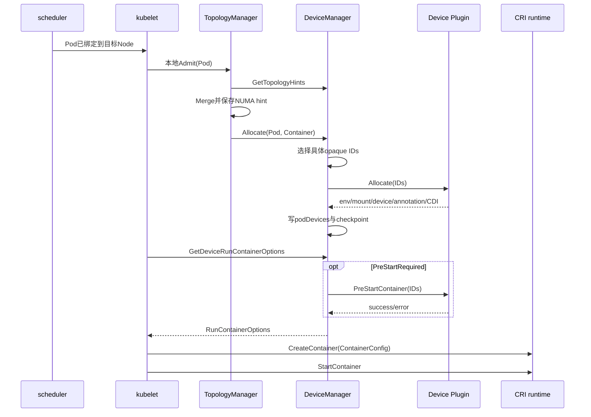

# 第 16 课：DeviceManager——具体 device ID、Allocate 与容器注入

> 主案例：GPU Pod已经被scheduler放到一台GPU Node，Node也显示 `nvidia.com/gpu=8`，但容器到底拿到哪个device ID、为什么启动失败，不能再靠Node数量猜  
> 主线源码：`pkg/kubelet/cm/topologymanager/*`、`pkg/kubelet/cm/devicemanager/{manager.go,endpoint.go,pod_devices.go}`、`pkg/kubelet/cm/container_manager_linux.go`、`pkg/kubelet/kuberuntime/*`  
> 源码基线：`301946d15e67a4a2e8a5fb8292eb836acd366d78`（`v1.37.0-alpha.0-280-g301946d15e6`）  
> 本课深度：S3，读穿“数量请求 -> 具体opaque ID -> AllocateResponse -> RunContainerOptions -> CRI ContainerConfig”  
> 前置断点：第 15 课已经证明Device Plugin怎样把逻辑设备条目变成Node Capacity/Allocatable；本课从Pod已到目标Node继续

---

## 0. 生产现场：Node有8个GPU资源单位，容器却没创建出来

先看这组生产证据：

```text
Pod:
  nodeName: gpu-node-07
  phase: Pending
  container state:
    waiting:
      reason: CreateContainerError

Pod spec:
  limits:
    nvidia.com/gpu: 1

Node:
  status.capacity:
    nvidia.com/gpu: "8"
  status.allocatable:
    nvidia.com/gpu: "8"

Event:
  FailedToCreateContainer

host:
  nvidia-smi -L正常

Device Plugin:
  Pod Running/Ready
```

平台值班同学最容易给出三个判断：

1. “Node还有8张卡，所以不是资源问题。”
2. “Pod已经调度成功，所以GPU已经分配成功。”
3. “应该是containerd没有把 `/dev/nvidia0` 挂进去。”

这三句都可能错。

第 15 课已经说明：

```text
Node Allocatable=8
  != 还剩8个未分配单位
  != 这次容器已经拿到具体device ID
  != runtime注入已经成功
```

本课要把故障继续切成六道闸门：

| 闸门 | 要回答的问题 | 主要证据 |
|---|---|---|
| scheduler数量账 | 为什么选中这个Node | Pod requests、Node资源、FailedScheduling历史 |
| kubelet本地准入 | TopologyManager是否接纳 | Pod Event、status reason、kubelet准入日志 |
| ID选择 | kubelet选了哪些opaque ID | DeviceManager日志、checkpoint/PodResources边界 |
| Allocate RPC | 插件是否接受这些ID并返回配置 | kubelet与插件同时间窗日志、RPC耗时指标 |
| 运行参数汇总 | env/mount/device/annotation/CDI是否进入缓存 | 源码、受控调试证据 |
| CRI创建 | runtime是否接受最终ContainerConfig | kubelet/runtime日志、已创建对象的脱敏inspect |

只证明前一闸门，不等于后一闸门成功。

---

## 1. 本课先钉死十二个结论

1. scheduler默认只为扩展资源做**数量级节点选择**，不会给Pod挑节点内的GPU UUID。
2. `nvidia.com/gpu: 1` 表示一个插件广告的**逻辑设备单位**，不必然等于一张物理卡。
3. 默认主路径下，具体device ID由目标Node上的kubelet DeviceManager在**本地Pod准入阶段**选择；当前commit还有一个默认关闭的 `PodLevelResourceManagers` 例外，见 8.2。
4. device ID是插件定义的opaque string；kubelet不把它解释成固定物理卡号。
5. ID选择先识别当前container的旧分配；除“kubelet初始化且runtime确认container仍在运行”的提前返回外，会校验resource重新注册和旧ID健康。需要新增时，先尝试普通init复用，不足部分再从 `healthy - allocated` 中挑候选。
6. TopologyManager只把候选按NUMA亲和约束；它不理解NVLink/NVSwitch拓扑。
7. `GetPreferredAllocation` 是插件建议，不是最终裁决。
8. 当前选择大量使用set/map和 `UnsortedList`，没有“默认GPU0”或稳定字典序保证。
9. 当某个container/resource确实需要新增ID时，kubelet为这一对组合单独发一次 `Allocate` RPC；已有正式分配、kubelet初始化恢复等“不需要新增ID”的分支会跳过RPC。多资源分配不是原子事务。
10. AllocateResponse不只是“分配成功”，还携带env、mount、device、annotation、CDI等容器注入意图。
11. kubelet对AllocateResponse的验证比较浅，插件属于节点高信任组件。
12. Device Plugin的 `PreStartContainer` 与kubelet内部同名hook不是同一个调用，而且前者发生在CRI `CreateContainer` 之前。

如果还不能独立解释这十二句，遇到GPU容器启动失败时就很容易把scheduler、kubelet、插件和runtime混成一个组件。

---

## 2. 旧材料怎样复用，哪些结论必须按当前commit纠正

仓库已有这些拆分材料：

- `study/90_主线复盘与进阶/158_进阶专题_kubelet_DeviceManager与设备插件分配链路.md`
- `study/90_主线复盘与进阶/460_进阶专题_devicemanager_devicesToAllocate与GetPreferredAllocation设备选择链路.md`
- `study/90_主线复盘与进阶/461_进阶专题_devicemanager_PreStartContainer与RunContainerOptions设备注入链路.md`
- `study/90_主线复盘与进阶/1000_进阶专题_DeviceManager_allocate设备分配与podDevices状态链路.md`

这些材料仍值得复用的部分：

- `healthyDevices`、`allocatedDevices`、`podDevices` 三本账的类比；
- init container复用；
- `sets.Set[string]` 的集合运算；
- NUMA hint与PreferredAllocation的职责分层；
- AllocateResponse进入RunContainerOptions；
- checkpoint不仅保存ID，也保存AllocateResponse。

但正式讲义不能原样拼接，当前commit需要纠正：

| 旧材料容易形成的说法 | 当前源码校准 |
|---|---|
| “DeviceManager在容器启动前选ID并Allocate” | 主路径发生在kubelet本地Pod准入；创建容器时通常只是读缓存 |
| “PreStart就是容器即将Start前调用” | Device Plugin RPC在生成ContainerConfig时调用，早于CRI CreateContainer |
| “Allocate失败都会回滚临时占用” | 只有部分分支显式整表重算；partial reuse后数量不足、Preferred error、空response和并发in-flight都要单独看 |
| “response会做冲突检查” | 多数冲突只记日志并保留先进入项，不会让准入失败 |
| “同样数量下会稳定选同一个ID” | set/map/UnsortedList无稳定顺序保证 |
| “没缓存返回空结构或error” | 当前实现可能返回 `nil, nil`；注释和旧测试注释还有不一致 |
| “CDI与传统Devices二选一” | kubelet允许两者同时继续传给CRI |
| “NUMA topology就是GPU互联拓扑” | 标准字段只有NUMA node ID，不表达NVLink/NVSwitch |

因此本课会复用旧材料的教学类比，但源码事实全部重新落到当前commit。

---

## 3. 先用Java平台经验建立正确类比

你熟悉的Java平台应用通常会经历：

```text
Deployment写cpu/memory request
  -> scheduler选Node
  -> kubelet准入
  -> 生成容器配置
  -> CRI创建容器
  -> JVM启动
```

GPU Pod多了一本“具体设备账”：

```text
Pod写nvidia.com/gpu数量
  -> scheduler只按数量选Node
  -> Node kubelet选具体device ID
  -> Device Plugin按ID返回注入要求
  -> kubelet拼成CRI ContainerConfig
  -> runtime执行device/CDI注入
  -> CUDA进程才可能看到设备
```

可以类比为：

| Java平台概念 | GPU设备链概念 |
|---|---|
| request 2 CPU | request 1个逻辑GPU资源单位 |
| scheduler选Node | scheduler仍只选Node |
| CPUManager选cpuset | DeviceManager选opaque device ID |
| JVM env/volume | 插件返回env/mount/device/CDI |
| CRI ContainerConfig | 两类应用最终都交给CRI |

类比只帮助理解控制链，不表示GPU能像CPU那样随意切分或超卖。MIG、time-slicing和DRA分别有自己的资源模型，留到第 21 课继续。

---

## 4. 完整源码地图：不要从manager.go第一行硬读

建议按下面顺序跳读：

```text
Pod进入kubelet
  pkg/kubelet/kubelet.go
    HandlePodAdditions

本地准入
  pkg/kubelet/cm/topologymanager/topology_manager.go
    manager.Admit

计算并保存hint
  pkg/kubelet/cm/topologymanager/scope_container.go
  pkg/kubelet/cm/topologymanager/scope_pod.go

调用各provider分配
  pkg/kubelet/cm/topologymanager/scope.go
    allocateAlignedResources

DeviceManager入口
  pkg/kubelet/cm/devicemanager/manager.go
    Allocate
    allocateContainerResources
    devicesToAllocate
    filterByAffinity
    callGetPreferredAllocationIfAvailable

插件RPC
  pkg/kubelet/cm/devicemanager/endpoint.go
    allocate
    getPreferredAllocation
    preStartContainer

保存正式账
  pkg/kubelet/cm/devicemanager/pod_devices.go
    insert
    deviceRunContainerOptions

容器创建阶段
  pkg/kubelet/cm/container_manager_linux.go
    GetResources

  pkg/kubelet/kubelet_pods.go
    GenerateRunContainerOptions

  pkg/kubelet/kuberuntime/kuberuntime_container.go
    generateContainerConfig
    makeDevices
    makeCDIDevices
```

一张时序图：



这张图最重要的时间边界：

```text
选ID和Allocate：默认主路径主要在kubelet本地准入
取回注入参数和Device Plugin PreStart：生成CRI配置时
CRI Create/Start：更后面
```

这张图画的是当前默认 `PodLevelResourceManagers=false` 的container级路径；8.2会单列默认关闭的Alpha例外，避免把主路径误写成所有feature组合的绝对时序。

---

## 5. scheduler为什么不需要知道GPU UUID

scheduler处理的是Pod request与Node资源数量。

比如：

```text
Node A:
  nvidia.com/gpu allocatable=8
  已有Pod request总账=6

新Pod:
  request nvidia.com/gpu=1
```

scheduler只需判断：

```text
8 - 6 >= 1
```

它不需要把：

```text
GPU-aaaaaaaa
GPU-bbbbbbbb
GPU-cccccccc
```

中的某一个写回Pod spec。

原因包括：

- 具体设备健康是Node本地快速变化事实；
- device ID由插件定义；
- NUMA信息由目标Node的TopologyManager掌握；
- ID分配与本地checkpoint需要和kubelet容器生命周期一致；
- scheduler缓存看到的是Node对象，不是DeviceManager全部内存账。

所以生产排障必须区分：

```text
FailedScheduling
  -> 数量/约束阶段

UnexpectedAdmissionError
  -> Node本地准入/Allocate阶段

FailedToCreateContainer
  -> 生成配置、PreStart或CRI创建阶段
```

---

## 6. device ID是opaque string，不等于物理卡编号

API定义：

```text
staging/src/k8s.io/kubelet/pkg/apis/deviceplugin/v1beta1/api.proto:91-99
```

```protobuf
message Device {
    // A unique ID assigned by the device plugin.
    // Max length of this field is 63 characters.
    string ID = 1;
    string health = 2;
    TopologyInfo topology = 3;
}
```

大白话：

> kubelet只把ID当成某种resource下面的唯一字符串。这个字符串实际代表整卡、MIG实例还是其他逻辑entry，由插件策略定义。

因此以下推理都不安全：

```text
ID里含0 -> 一定是/dev/nvidia0
resource request=1 -> 一定独占整张物理卡
Node Capacity=8 -> 一定有8块物理卡
ID相同 -> 所有插件版本下物理含义都不变
```

升级NVIDIA Device Plugin、切换MIG strategy、修改runtime侧device ID传递策略或sharing策略时，要同时记录：

- 插件image digest；
- 插件配置；
- resource name；
- device ID；
- MIG/sharing模式；
- Node与时间窗。

只把 `nvidia.com/gpu` 数字截图留下，无法还原ID语义。

---

## 7. DeviceManager内部五张关键账

`ManagerImpl`：

```text
pkg/kubelet/cm/devicemanager/manager.go:61-116
```

重点字段：

```go
type ManagerImpl struct {
    allDevices       ResourceDeviceInstances
    healthyDevices   map[string]sets.Set[string]
    unhealthyDevices map[string]sets.Set[string]
    allocatedDevices map[string]sets.Set[string]
    podDevices       *podDevices
    devicesToReuse   PodReusableDevices

    topologyAffinityStore topologymanager.Store
}
```

职责表：

| 账本 | key/value | 用途 | 是否等于物理GPU |
|---|---|---|---|
| `allDevices` | resource -> ID -> Device | 当前插件清单与topology | 不一定 |
| `healthyDevices` | resource -> Healthy ID set | 形成Allocatable、作为候选 | 不一定 |
| `unhealthyDevices` | resource -> Unhealthy ID set | 容量与健康收敛 | 不一定 |
| `allocatedDevices` | resource -> 已占用/预留ID set | 防止重复选择 | 不等于Node Allocatable |
| `podDevices` | Pod/container/resource -> IDs+response | 正式分配账与运行参数 | 最关键 |
| `devicesToReuse` | Pod/resource -> 可复用ID set | 普通init生命周期复用 | 不是共享池 |

### 7.1 `allocatedDevices`不是持久化权威源

它是快速聚合和预留表。

在多处代码中会从：

```go
m.podDevices.devices()
```

重新生成。

### 7.2 `podDevices`为什么更重要

结构：

```text
PodUID
  -> containerName
    -> resourceName
      -> device IDs按NUMA保存
      -> ContainerAllocateResponse
```

它同时回答：

- 哪个container拿了哪些ID；
- 这些ID属于哪个resource；
- 插件当时要求注入哪些env/mount/device/annotation/CDI；
- kubelet重启后怎样恢复。

checkpoint细节在第 17 课展开，本课先把它看作“已确认分配的正式账”。

---

## 8. 真正分配发生在kubelet本地准入

新Pod进入：

```text
pkg/kubelet/kubelet.go:2861-2879
```

```go
if ok, reason, message :=
    kl.allocationManager.AddPod(
        kl.GetActivePods(),
        pod,
    ); !ok {
    kl.rejectPod(ctx, pod, reason, message)
    continue
}
```

TopologyManager：

```text
pkg/kubelet/cm/topologymanager/topology_manager.go:262-275
```

```go
func (m *manager) Admit(
    attrs *lifecycle.PodAdmitAttributes,
) lifecycle.PodAdmitResult {
    ctx := context.TODO()
    podAdmitResult := m.scope.Admit(
        ctx,
        attrs.Pod,
    )
    return podAdmitResult
}
```

container scope：

```text
pkg/kubelet/cm/topologymanager/scope_container.go:52-83
```

核心顺序：

```text
收集所有HintProvider的hints
  -> policy.Merge得到bestHint
  -> 保存到topology affinity store
  -> allocateAlignedResources
```

`allocateAlignedResources`：

```text
pkg/kubelet/cm/topologymanager/scope.go:155-162
```

```go
func (s *scope) allocateAlignedResources(
    pod *v1.Pod,
    container *v1.Container,
) error {
    for _, provider := range s.hintProviders {
        err := provider.Allocate(pod, container)
        if err != nil {
            return err
        }
    }
    return nil
}
```

Linux当前注册HintProvider的顺序：

```text
pkg/kubelet/cm/container_manager_linux.go:309-358

DeviceManager
  -> CPUManager
  -> MemoryManager
```

这解释两个现象：

1. Pod已经被scheduler绑定，仍可能被目标kubelet本地拒绝。
2. 各provider的分配不是一个跨组件事务；前一个成功后，后一个仍可能失败。

第二点在当前注册顺序下尤其要具体化：DeviceManager可能已经选ID、调用插件、写入 `podDevices` 甚至完成checkpoint，随后CPUManager或MemoryManager才返回error。`allocateAlignedResources` 只是立即返回该error，没有反向逐个调用前序provider做rollback。Pod会被准入拒绝，DeviceManager状态后续再依赖active Pod清理/重算路径收敛。生产看到“最终是CPU/Memory准入error”时，仍要保留同时间窗GPU Allocate与checkpoint证据；不能因为最后一层error不叫GPU就删除设备账。

### 8.1 policy none也仍会分配

`TopologyManager policy=none` 不表示跳过DeviceManager。

`noneScope.Admit`仍调用：

```text
admitPolicyNone
  -> 对init/app containers
  -> allocateAlignedResources
```

区别只是没有可用的NUMA affinity约束；设备仍需被选ID并Allocate。

### 8.2 当前commit的例外：`PodLevelResourceManagers`

“Allocate主要发生在本地准入”是当前默认配置的主路径，但不能删掉这个源码例外。

当前feature表：

```text
pkg/features/kube_features.go
  PodLevelResourceManagers
  -> 1.36起Alpha
  -> Default: false
  -> 依赖PodLevelResources
```

当且仅当下面条件同时成立时：

- 显式启用 `PodLevelResourceManagers`；
- Pod设置了pod-level resources；
- TopologyManager走pod scope的pod-level resource分支；

`scope_pod.go` 不再逐container调用 `Allocate`，而是：

```text
admitUsingPodResources
  -> allocatePodAlignedResources
  -> 对每个HintProvider调用AllocatePod(pod)
```

而当前DeviceManager实现是：

```go
func (m *ManagerImpl) AllocatePod(
    pod *v1.Pod,
) error {
    // Device Manager does not support
    // pod level resource allocation.
    return nil
}
```

位置：

```text
pkg/kubelet/cm/topologymanager/scope_pod.go:52-112
pkg/kubelet/cm/topologymanager/scope.go:165-172
pkg/kubelet/cm/devicemanager/manager.go:1125-1129
```

因此在这个**默认关闭的Alpha组合**下，传统Device Plugin的container级ID分配不会在这次 `AllocatePod` 中完成。创建container时，`GetDeviceRunContainerOptions` 可能通过“缓存缺失 -> `m.Allocate`”补偿；但如果插件声明 `PreStartRequired`，当前顺序会先因本地ID缓存缺失而返回error，尚未走到reAllocate判断。

运维含义：

- 不要把默认主路径写成所有feature组合下的绝对时序；
- 启用该Alpha feature前，要在与生产相同的TopologyManager scope下覆盖传统Device Plugin、restartable init和 `PreStartRequired` 回归；
- 现场若发现Allocate落到创建配置阶段，先核feature gate和Pod的pod-level resources，不要立刻判断“准入代码没有执行”；
- 本课后续若无特别说明，仍以当前默认 `PodLevelResourceManagers=false` 的传统container级主路径为准。

---

## 9. `DRAExtendedResource`：同名扩展资源可能不走传统DeviceManager

当前代码在遍历container limits时先检查：

```text
pkg/kubelet/cm/devicemanager/manager.go:849-860
```

当前commit的feature表把 `DRAExtendedResource` 标为1.36起Beta、默认开启，并声明依赖 `DynamicResourceAllocation`。但“gate默认开启”不等于某个resource已经自动分流；真正跳过仍要求Pod status中出现下面这组精确container/resource映射。

```go
if utilfeature.DefaultFeatureGate.Enabled(
    features.DRAExtendedResource,
) && isDRAExtendedResource(
    pod,
    container.Name,
    resource,
) {
    logger.V(3).Info(
        "Skipping allocation for DRA-backed extended resource",
        "resourceName", resource,
    )
    continue
}
```

`isDRAExtendedResource`读取：

```go
pod.Status.ExtendedResourceClaimStatus.
    RequestMappings
```

并匹配：

```text
containerName
resourceName
```

还要注意检查放置的位置。当前整个 `pkg/kubelet/cm/devicemanager` 下，`isDRAExtendedResource(...)` 只在 `allocateContainerResources` 这一处分流；`GetTopologyHints` 和 `GetDeviceRunContainerOptions` 没有重复同一项status匹配。正常DRA迁移应避免同一个extended resource同时还被传统Device Plugin登记为active resource；否则后两条路径仍可能因为 `isDevicePluginResource(resource)==true` 把它当成传统resource观察或执行PreStart/reAllocate。这个边界要靠实际feature、Pod status和节点注册状态共同取证，不能只看resource name。

边界：

| 资源路径 | 分配权威 | 容器注入来源 |
|---|---|---|
| 传统Device Plugin extended resource | DeviceManager | AllocateResponse |
| DRA原生claim | DRA Manager | claim allocation/CDI |
| DRAExtendedResource映射 | 根据feature/status分流 | 不应再由传统DeviceManager重复分配 |

因此排障 `nvidia.com/gpu` 不能永远假设它一定走传统Device Plugin。

必须同时取证：

- feature gate/版本；
- 是否存在匹配的 `DeviceClass.spec.extendedResourceName`；
- Pod `status.extendedResourceClaimStatus`；
- kubelet DRA与DeviceManager日志。

查询失败、API不存在或RBAC不足时，应写“未确认”，不能猜“集群肯定没启用DRA”。

本课后续主线明确限定：

> 传统Device Plugin extended-resource路径；若现场已分流到DRA，只复用CRI/CDI汇合部分，不套用传统ID选择账本。

---

## 10. `ManagerImpl.Allocate`：先处理init生命周期，再进入资源循环

源码：

```text
pkg/kubelet/cm/devicemanager/manager.go:364-403
```

缩小后：

```go
func (m *ManagerImpl) Allocate(
    pod *v1.Pod,
    container *v1.Container,
) error {
    ctx := context.TODO()

    if _, ok := m.devicesToReuse[
        string(pod.UID)
    ]; !ok {
        m.devicesToReuse[string(pod.UID)] =
            make(map[string]sets.Set[string])
    }

    for podUID := range m.devicesToReuse {
        if podUID != string(pod.UID) {
            delete(m.devicesToReuse, podUID)
        }
    }

    // init/app container分支
    ...
}
```

`devicesToReuse` 虽然按Pod UID分层，但每次 `Allocate` 都会删除当前Pod之外的entry。它是服务于“当前Pod按init -> app顺序准入”的短期scratch state，不是所有Pod共享的长期复用池，也不是checkpoint权威账。真正已确认的container分配仍在 `podDevices`。

### 10.1 普通init container

分配完成后：

```go
m.podDevices.addContainerAllocatedResources(
    string(pod.UID),
    container.Name,
    m.devicesToReuse[string(pod.UID)],
)
```

大白话：

> 普通init退出后，这批ID可以被同一个Pod后续容器再次使用。

例如：

```text
init-a request 2个GPU逻辑单位
  -> 拿到ID A、B
  -> init-a结束

app-a request 1
  -> 可以从A、B中复用一个

app-b request 1
  -> 可以复用另一个
```

这不是两个同时运行的app container共享同一个ID。测试明确验证两个app的ID集合不相交：

```text
pkg/kubelet/cm/devicemanager/manager_test.go
TestInitContainerDeviceAllocation
```

### 10.2 restartable init container

restartable init相当于Pod sidecar，会继续运行。

源码反而把它的ID从reuse集合移除：

```go
m.podDevices.removeContainerAllocatedResources(
    string(pod.UID),
    container.Name,
    m.devicesToReuse[string(pod.UID)],
)
```

含义：

```text
常驻init仍然占着设备
  -> 后续app不能把它当成已释放设备
```

测试：

```text
TestRestartableInitContainerDeviceAllocation
```

### 10.3 app container

app分配后也把自身ID从reuse集合移除，避免后续并发app再拿同一个ID。

### 10.4 不能把reuse讲成GPU sharing

| 机制 | 目的 | 谁决定 |
|---|---|---|
| init reuse | 生命周期不重叠时复用同一个ID | kubelet DeviceManager |
| time-slicing | 多workload共享GPU时间 | NVIDIA插件/配置 |
| MPS | 进程级并发与隔离策略 | NVIDIA MPS及平台治理 |
| MIG | 硬件分区为逻辑实例 | GPU/MIG配置与插件 |

`devicesToReuse`只解决第一行。

---

## 11. `allocateContainerResources`：为什么遍历Limits

源码：

```text
pkg/kubelet/cm/devicemanager/manager.go:835-940
```

```go
for k, v := range container.Resources.Limits {
    resource := string(k)
    needed := int(v.Value())

    if !m.isDevicePluginResource(resource) {
        continue
    }

    if !allocatedDevicesUpdated {
        m.UpdateAllocatedDevices()
        allocatedDevicesUpdated = true
    }

    allocDevices, err := m.devicesToAllocate(
        ctx,
        podUID,
        contName,
        resource,
        needed,
        devicesToReuse[resource],
    )
    ...
}
```

Device Plugin暴露的是extended resource。API规则使这类资源不能像普通CPU那样超卖；当只写limit时，request会按规则等于limit，若同时写request/limit则不能表达request小于limit的超卖关系。

因此当前实现遍历Limits。

不能机械推广成：

```text
所有资源都只看Limits
```

这里只有DeviceManager的extended-resource路径。

### 11.1 map顺序是本章第一个Go陷阱

`container.Resources.Limits` 是Go map。

```go
for k, v := range container.Resources.Limits
```

不保证：

- YAML书写顺序；
- resource name字典序；
- 每次运行顺序相同。

如果一个container同时请求：

```yaml
limits:
  vendor-a.example/foo: 1
  vendor-b.example/bar: 1
```

两个插件谁先Allocate不是稳定API。

这也意味着多资源部分成功时，不能预设“永远先分GPU再分网卡”。

---

## 12. `UpdateAllocatedDevices`：分配前先清理已终止Pod

源码：

```text
pkg/kubelet/cm/devicemanager/manager.go:556-578
```

主逻辑：

```go
activePods := m.activePods()
if !m.sourcesReady.AllReady() {
    return
}

podsToBeRemoved := m.podDevices.pods()
for _, pod := range activePods {
    podsToBeRemoved.Delete(string(pod.UID))
}

m.podDevices.delete(
    sets.List(podsToBeRemoved),
)
m.allocatedDevices = m.podDevices.devices()
```

两条保护：

1. 配置源没ready时不贸然删除旧账；
2. 只删除已经不在activePods里的Pod UID。

运维含义：

```text
kubelet刚启动时看见旧checkpoint
  != 可以立刻判断哪些Pod已经不存在
```

要等apiserver/static pod等来源准备好，才有资格清理。

### 12.1 它不会按 `nvidia-smi` 利用率释放资源

只要Pod仍在activePods，哪怕CUDA利用率是0，ID仍属于该Pod账本。

资源分配依据是声明与生命周期，不是瞬时硬件利用率。

---

## 13. `devicesToAllocate`：先处理恢复，再做新选择

源码：

```text
pkg/kubelet/cm/devicemanager/manager.go:580-736
```

函数签名：

```go
func (m *ManagerImpl) devicesToAllocate(
    ctx context.Context,
    podUID,
    contName,
    resource string,
    required int,
    reusableDevices sets.Set[string],
) (sets.Set[string], error)
```

### 13.1 已经分过：继续使用原ID

```go
devices := m.podDevices.containerDevices(
    podUID,
    contName,
    resource,
)
if devices != nil {
    needed = needed - devices.Len()
    if needed != 0 {
        return nil, fmt.Errorf(
            "pod ... changed request ...",
        )
    }
}
```

适用：

- container重启；
- kubelet从checkpoint恢复；
- 重复进入分配路径但正式账仍在。

如果已分配数量与当前required不同，当前代码直接报错，不偷偷补一块或释放一块。

### 13.2 kubelet restart且runtime容器仍在跑

```go
if !m.sourcesReady.AllReady() &&
    m.isContainerAlreadyRunning(
        logger,
        podUID,
        contName,
    ) {
    return nil, nil
}
```

意思：

> runtime已经报告这个container在运行，它已经拥有创建时的设备配置；kubelet初始化期间不要重复调用Allocate。

这里返回的 `nil, nil` 表示“不需要新增ID”，不是“没有设备”。

### 13.3 先检查插件注册和旧ID健康

```go
healthyDevices, hasRegistered :=
    m.healthyDevices[resource]

if !hasRegistered {
    return nil, fmt.Errorf(
        "cannot allocate unregistered device %s",
        resource,
    )
}

if healthyDevices.Len() == 0 {
    return nil, fmt.Errorf(
        "no healthy devices present...",
    )
}

if !healthyDevices.IsSuperset(devices) {
    return nil, fmt.Errorf(
        "previously allocated devices are no longer healthy...",
    )
}
```

为什么在**没有走13.2运行中container提前返回**的路径里，`needed==0` 前仍检查健康和注册？

源码注释明确说明，这是为了覆盖节点重启与历史问题：只要没有被“初始化期间runtime确认仍在运行”这一保护分支短路，已有分配就不应绕过“resource已经重新注册、旧ID仍健康”的校验。

### 13.4 最后才处理 `needed==0`

```go
if needed == 0 {
    return nil, nil
}
```

说明正式账已经完整，不必再次向插件Allocate。

---

## 14. `allocateRemainingFrom`：真正RPC前先在内存占座

缩小代码：

```go
allocated := sets.New[string]()

allocateRemainingFrom :=
    func(devices sets.Set[string]) bool {
        if m.allocatedDevices[resource] == nil {
            m.allocatedDevices[resource] =
                sets.New[string]()
        }

        for device := range devices.Difference(
            allocated,
        ) {
            m.allocatedDevices[resource].
                Insert(device)
            allocated.Insert(device)
            needed--

            if needed == 0 {
                return true
            }
        }
        return false
    }
```

这个闭包同时修改：

- 外层 `allocated`；
- 外层 `needed`；
- Manager共享状态 `m.allocatedDevices`。

### 14.1 为什么RPC前就标记占用

假设两个container并发请求最后一个GPU ID：

```text
container-a选ID X
  -> 插件Allocate耗时2秒

container-b同时进入
```

如果a等RPC成功后才占座，b也可能选到X。

当前做法：

```text
锁内选X并插入allocatedDevices
  -> 释放锁
  -> 调插件RPC
```

b会看到X已经占用。

### 14.2 为什么看到RPC时锁已经释放

外部插件可能慢、异常或卡住。kubelet不能把DeviceManager全局mutex一直带进gRPC。

这也是阅读并发代码的原则：

```text
锁内：读写共享账、做最小预留
锁外：外部RPC、慢操作
```

### 14.3 `defer Unlock` 中间又手动解锁

`devicesToAllocate`开始：

```go
m.mutex.Lock()
defer m.mutex.Unlock()
```

`callGetPreferredAllocationIfAvailable`内部却会：

```go
m.mutex.Unlock()
resp, err := eI.e.getPreferredAllocation(...)
m.mutex.Lock()
```

这个helper依赖调用者已经持锁。它不是可以任意单独调用的普通函数。

RPC期间其他goroutine可能重算map，所以闭包每次还检查：

```go
if m.allocatedDevices[resource] == nil {
    m.allocatedDevices[resource] =
        sets.New[string]()
}
```

测试 `TestDevicesToAllocateConflictWithUpdateAllocatedDevices` 覆盖了“Preferred RPC期间 `UpdateAllocatedDevices` 删除map entry后，本次仍能返回所选ID”这一种情况。但它没有覆盖更深的一种组合：

```text
Preferred之前已经选择reusable/aligned ID
  -> RPC期间allocatedDevices被podDevices.devices()整表重算
  -> 外层allocated set仍记得旧选择
  -> RPC后allocateRemainingFrom只遍历
     devices.Difference(allocated)
```

已经存在于外层 `allocated` 的ID会被Difference跳过，不会因为map刚被重算而自动重新插回 `m.allocatedDevices`。若后续Allocate RPC成功且response非空，`podDevices.insert` 才会保存完整返回集合；从整表重算到正式insert之间存在reservation不可见窗口。若重算后只插入了Preferred新增部分，聚合表还可能暂时缺少前面那部分，直到后续其他重算收敛。当前测试只断言函数返回set，没有断言“带预选ID时共享reservation始终保留”。这应作为并发fake测试补齐，不能用现有测试名证明已经完整覆盖。

---

## 15. 候选公式：`healthy - allocated`

```go
devicesInUse := m.allocatedDevices[resource]
available := m.healthyDevices[resource].
    Difference(devicesInUse)
```

若数量不够：

```go
if available.Len() < needed {
    return nil, fmt.Errorf(
        "requested number of devices unavailable...",
    )
}
```

先钉死适用范围：

```text
普通init reusableDevices
  早于
available = healthy - allocated
```

所以 `healthy - allocated` 是**普通init复用仍不足之后的新ID候选公式**，不是整个函数所有ID来源的总公式。

### 15.1 一个容易漏掉的健康边界：reuse没有先与Healthy取交集

前面的健康检查是：

```go
if healthyDevices.Len() == 0 {
    return nil, fmt.Errorf(...)
}

if !healthyDevices.IsSuperset(devices) {
    return nil, fmt.Errorf(...)
}
```

这里的 `devices` 是**当前目标container已经分配过的ID**，不是参数 `reusableDevices`。

后面代码直接先做：

```go
if allocateRemainingFrom(reusableDevices) {
    return allocated, nil
}
```

当前函数没有先执行：

```go
reusableDevices.Intersection(healthyDevices)
```

因此要非常精确地说：

- resource连一个Healthy ID都没有：前面的 `Len()==0` 会拒绝；
- 当前目标container的旧ID不再Healthy：`IsSuperset(devices)` 会拒绝；
- 普通init留下的某个reusable ID变为Unhealthy，但同resource仍有其他Healthy ID：当前选择代码没有在复用前把该ID过滤掉，后续插件Allocate仍可能报错。

这不是建议生产制造Unhealthy来测试，而是一个值得用fake manager补单测的源码边界。不要把“检查了旧ID健康”扩大成“所有reuse ID都已经过Healthy交集”。

四个数字不要混：

| 数字 | 示例 | 含义 |
|---|---:|---|
| Node Allocatable | 8 | 插件当前Healthy逻辑entry总量 |
| scheduler剩余账 | 2 | 8减去已调度Pod requests |
| DeviceManager available | 2 | 本地healthy ID减allocated ID |
| CUDA利用率 | 0% | 瞬时使用率，不参与这里的集合公式 |

正常收敛时scheduler账与DeviceManager available应该相容，但它们来自不同时间、不同状态源：

- scheduler用apiserver对象与Pod缓存；
- DeviceManager用Node本地内存和checkpoint；
- 传播延迟、重启恢复、绕过scheduler或插件健康变化都可能造成短暂分叉。

因此本地准入仍需要自己的可用性校验。

---

## 16. NUMA：TopologyManager先定范围，DeviceManager再选ID

Topology hints生成：

```text
pkg/kubelet/cm/devicemanager/topology_hints.go
  GetTopologyHints
  GetPodTopologyHints
  generateDeviceTopologyHints
```

container scope大致是：

```text
DeviceManager提供某resource可以满足request的NUMA masks
CPUManager提供CPU masks
MemoryManager提供内存masks
  -> TopologyManager policy.Merge
  -> 保存bestHint
```

到真正选择ID时：

```go
aligned, unaligned, noAffinity :=
    m.filterByAffinity(
        podUID,
        contName,
        resource,
        available,
    )
```

`filterByAffinity`：

```text
pkg/kubelet/cm/devicemanager/manager.go:738-832
```

### 16.1 没有hint时

```go
hint := m.topologyAffinityStore.GetAffinity(
    podUID,
    contName,
)

if !m.deviceHasTopologyAlignment(resource) ||
    hint.NUMANodeAffinity == nil {
    return empty, empty, available
}
```

所有候选落入 `noAffinity`。

这不表示设备不可用，只表示本次没有NUMA约束可应用。

### 16.2 有hint时分三类

| 集合 | 含义 |
|---|---|
| `aligned` | 设备至少匹配best hint内的NUMA node |
| `unaligned` | 有topology，但落在hint外 |
| `noAffinity` | Device没有NUMA信息 |

特殊常量：

```go
const nodeWithoutTopology = -1
```

它只是内部分类标记，不是真实机器NUMA node。

### 16.3 一个Device可以关联多个NUMA node

API的 `TopologyInfo.Nodes` 是repeated字段。

当前过滤逻辑会避免把同一device重复加入多个结果集合。

### 16.4 NUMA不是GPU fabric

标准TopologyInfo不包含：

- NVLink边；
- NVSwitch域；
- PCIe带宽；
- P2P可达性；
- HBM容量；
- GPU代际。

TopologyManager能做的是：

```text
CPU、内存、设备尽量落在一致NUMA范围
```

插件若懂更多GPU拓扑，要通过自身选择策略或 `GetPreferredAllocation` 提供建议。

---

## 17. `GetPreferredAllocation`：建议集合，不是强制结果

API：

```text
staging/src/k8s.io/kubelet/pkg/apis/deviceplugin/v1beta1/api.proto:50-55
```

协议自己就写明：

> resulting preferred allocation is not guaranteed to be the allocation ultimately performed by the devicemanager

endpoint请求：

```text
pkg/kubelet/cm/devicemanager/endpoint.go:85-99
```

```go
return e.api.GetPreferredAllocation(
    ctx,
    &pluginapi.PreferredAllocationRequest{
        ContainerRequests: []*pluginapi.
            ContainerPreferredAllocationRequest{
            {
                AvailableDeviceIDs: available,
                MustIncludeDeviceIDs: mustInclude,
                AllocationSize: int32(size),
            },
        },
    },
)
```

三个参数：

| 参数 | 大白话 |
|---|---|
| `AvailableDeviceIDs` | 插件可从哪些合法候选中建议 |
| `MustIncludeDeviceIDs` | kubelet已经选中、结果必须容纳的ID |
| `AllocationSize` | 该container最终需要的总数量 |

### 17.1 aligned足够

若：

```go
needed < aligned.Len()
```

kubelet先让插件只在aligned范围内给建议。

为什么是小于，不是小于等于？

如果剩余所需刚好等于aligned数量，就必须全拿，没有让插件二选一的空间。

### 17.2 aligned不够

kubelet先把aligned全部拿走，以满足TopologyManager承诺；再把：

```text
available + 已经选中的ID
```

交给插件建议剩余组合。

### 17.3 插件结果仍要取交集

```go
preferred.Intersection(aligned)
```

或：

```go
preferred.Intersection(available)
```

所以：

- 返回未知ID：被交集过滤；
- 返回别的container已占用ID：不在available，过滤；
- 返回数量不足：kubelet继续fallback；
- 不实现Preferred：直接fallback；
- RPC报错：本次分配失败。

### 17.4 当前没有显式Preferred RPC截止时间

`ManagerImpl.Allocate`使用 `context.TODO()`，`getPreferredAllocation`本身没有再包 `context.WithTimeout`。

不要把插件连接时的10秒dial timeout误写成所有RPC timeout。

生产上插件Preferred处理卡住可能拉长kubelet本地准入；需要同时看：

- kubelet goroutine/日志；
- Device Plugin服务端日志；
- RPC开始时间；
- Pod准入时间；
- 节点上其他Pod是否也被同类请求阻塞。

不要为了验证猜想在生产直接kill插件或删除socket。

### 17.5 当前测试有一个断言缺口

`TestGetPreferredAllocationParameters` 计划校验：

- available；
- mustInclude；
- size。

但当前：

```text
pkg/kubelet/cm/devicemanager/topology_hints_test.go:659-661
```

第二次仍比较 `actualAvailable`，没有真正比较 `actualMustInclude`。

因此讲义结论来自生产代码本身，不能因为测试名存在就夸大mustInclude已经被完整单测锁死。

---

## 18. 没有稳定ID顺序：为什么不能说“默认GPU0”

当前选择链反复使用：

```go
sets.Set[string]
for device := range devices
UnsortedList()
```

Go map/set遍历顺序不是稳定API。

即使：

- Pod request不变；
- healthy IDs不变；
- 没有NUMA约束；
- 插件不实现Preferred；

也不能从源码承诺总是选择：

- 字典序最小ID；
- ListAndWatch第一项；
- `/dev/nvidia0`；
- `nvidia-smi -L`第一行；
- 上一次另一个Pod使用的ID。

`GetPreferredAllocationResponse.DeviceIDs` 也会先转成set，返回顺序不会作为优先级保留。

运维上如果业务要求：

```text
必须选同一GPU型号
必须在同一NVSwitch域
必须避开某个GPU UUID
```

不能依赖默认集合顺序。需要：

- 正确resource建模；
- MIG/profile/resource name；
- DRA或厂商策略；
- Topology/Preferred实现；
- Node label/taint等平台约束；
- 经过验证的GPU调度扩展。

---

## 19. 选出ID后，才真正调用Device Plugin `Allocate`

回到：

```text
pkg/kubelet/cm/devicemanager/manager.go:839-940
```

核心片段：

```go
allocDevices, err := m.devicesToAllocate(
    ctx,
    podUID,
    contName,
    resource,
    needed,
    devicesToReuse[resource],
)
if err != nil {
    return err
}

if allocDevices == nil ||
    len(allocDevices) <= 0 {
    continue
}

devs := allocDevices.UnsortedList()

resp, err := eI.e.allocate(ctx, devs)
```

endpoint：

```text
pkg/kubelet/cm/devicemanager/endpoint.go:101-110
```

```go
func (e *endpointImpl) allocate(
    ctx context.Context,
    devs []string,
) (*pluginapi.AllocateResponse, error) {
    if e.isStopped() {
        return nil, fmt.Errorf(
            errEndpointStopped,
            e,
        )
    }

    return e.api.Allocate(
        ctx,
        &pluginapi.AllocateRequest{
            ContainerRequests: []*pluginapi.
                ContainerAllocateRequest{
                {DevicesIds: devs},
            },
        },
    )
}
```

结论：

```text
某container的某种Device Plugin resource
  + 本轮确实选出了需要Allocate的新/复用ID
  = 一次独立Allocate RPC

已有正式分配、初始化期runtime确认仍在运行、
或其他“不需要新增ID”的返回
  = 本轮不发Allocate RPC
```

不是：

- 整个Pod只发一次；
- 一个container的所有厂商资源合成一次；
- scheduler直接调用插件；
- runtime自己挑ID。

### 19.1 Allocate做两件事

API注释：

```text
staging/src/k8s.io/kubelet/pkg/apis/deviceplugin/v1beta1/api.proto:142-188
```

插件可以：

1. 对请求ID执行设备特定准备；
2. 告诉kubelet怎样让container访问设备。

响应：

```protobuf
message ContainerAllocateResponse {
    map<string, string> envs = 1;
    repeated Mount mounts = 2;
    repeated DeviceSpec devices = 3;
    map<string, string> annotations = 4;
    repeated CDIDevice cdi_devices = 5;
}
```

所以：

```text
device ID
  != /dev路径
  != 最终env
  != CDI name
```

ID是请求插件的输入；ContainerAllocateResponse才是运行时注入意图。

### 19.2 当前Allocate也没有函数级显式timeout

`endpoint.allocate`直接使用传入context。

主路径来自：

```go
ctx := context.TODO()
```

没有像Device Plugin PreStart那样再包30秒deadline。

如果服务端Allocate卡住，可能拉长kubelet本地准入。

治理要求：

- 为插件自身RPC实现与健康监控设预算；
- 观察kubelet和插件同一时窗；
- 使用canary Node先验证插件升级；
- 不在生产用kill/delete socket作为常规“探活”；
- 出现集体卡顿时先隔离新调度，再按变更流程处置节点。

### 19.3 Allocate duration指标

源码：

```text
pkg/kubelet/metrics/metrics.go
```

指标：

```text
kubelet_device_plugin_alloc_duration_seconds{
  resource_name="nvidia.com/gpu"
}
```

观察点在RPC返回后：

```go
metrics.DevicePluginAllocationDuration.
    WithLabelValues(resource).
    Observe(...)
```

这是一个只带 `resource_name` label的Alpha Histogram。若同一kubelet上该resource的 `_count` 在目标时间窗发生增量，它能证明：

- 这个resource至少有一次Allocate调用已经返回；
- 聚合bucket/sum/count记录了这类调用的耗时；
- resource label是什么。

它不能单独证明：

- 增量对应目标Pod、container或device ID；
- RPC成功；
- response合法；
- checkpoint成功；
- CRI CreateContainer成功；
- GPU workload能跑kernel。

当前这段没有独立的Allocate error counter，也没有Pod UID/container name/device ID label。必须用目标Pod日志与插件请求日志建立身份关联；不能因为同一时间窗指标增加，就把另一个Pod的Allocate归给当前故障。

---

## 20. AllocateResponse验证边界：远比很多人想象得浅

RPC返回后，Manager只显式检查：

```go
if len(resp.ContainerResponses) == 0 {
    return fmt.Errorf(
        "no containers return in allocation response %v",
        resp,
    )
}
```

随后直接使用：

```go
resp.ContainerResponses[0]
```

当前请求只有一份container request，但代码行为是：

| response数量 | 当前处理 |
|---:|---|
| 0 | 返回error |
| 1 | 使用第0份 |
| 大于1 | 仍只使用第0份，额外项不进入缓存 |

### 20.1 kubelet没有在这里验证的内容

这段主链没有深度检查：

- response必须恰好一份；
- host path是否存在；
- device permissions是否合法；
- mount host path是否存在；
- container path是否与Pod volume冲突；
- env key/value是否合理；
- annotation是否会碰kubelet内部key；
- CDI fully-qualified name语法；
- CDI spec文件是否存在；
- runtime能否解析CDI；
- 插件准备动作是否真的对应请求ID。

API response本身也没有再次回显“这份配置对应哪些request IDs”的字段。

这不是说系统完全没有任何下游验证，而是：

> DeviceManager本层把注册该resource的Device Plugin当作高信任节点组件；很多无效内容要到CRI/runtime创建时才失败。

### 20.2 Device Plugin为什么是高风险节点组件

它能够为请求该resource的container提供：

- host device路径；
- host mount路径；
- environment；
- runtime annotation；
- CDI device name。

一个被篡改或错误配置的插件，影响的不只是自己的Pod日志，而是业务container的创建配置。

治理边界：

- 插件镜像锁digest并做供应链扫描；
- 配置走审计和发布审批；
- socket目录、CDI spec目录限制写权限；
- 插件DaemonSet不允许普通租户修改；
- canary Node验证后再滚动；
- raw CRI inspect可能含env、args、认证信息，不能直接发到群聊或工单；
- 不把“插件是开源项目”当作节点信任审查的替代。

### 20.3 插件内部部分失败应该怎样表达

API注释约定：

```text
若请求dev1和dev2
  dev1准备成功
  dev2准备失败

插件应：
  发送ListAndWatch健康更新
  并让Allocate请求失败
```

kubelet不会替插件猜哪个设备准备了一半。

---

## 21. 非原子边界：多resource可能部分成功

`allocateContainerResources`逐resource循环。

假设container同时请求：

```yaml
limits:
  nvidia.com/gpu: 1
  example.com/rdma: 1
```

可能时间线：

```text
resource A:
  选ID gpu-a
  Allocate成功
  写入podDevices内存

resource B:
  选ID rdma-b
  Allocate失败
  函数返回error
```

源码注释明确承认：

```text
allocation failure may leave container resources
partially allocated for the failed container
```

位置：

```text
pkg/kubelet/cm/devicemanager/manager.go:877-889
```

### 21.1 RPC error分支会重算 `allocatedDevices`

```go
if err != nil {
    m.mutex.Lock()
    m.allocatedDevices =
        m.podDevices.devices()
    m.mutex.Unlock()
    return err
}
```

大白话：

```text
撤销没有进入正式账的临时占座
保留前面已经进入podDevices的成功分配
```

但这不是“只从set中删除本次失败的IDs”。代码把**整张** `allocatedDevices` 替换为当时 `podDevices` 的聚合。如果另一个container正处于：

```text
已经在allocatedDevices占座
  -> Allocate RPC仍在flight
  -> 尚未podDevices.insert
```

那么它的临时reservation也不在重建来源里，可能被这次整表替换一起抹掉。随后第三次选择就可能暂时看不到该in-flight占座。

当前默认Pod新增准入通过 `pkg/kubelet/allocation/allocation_manager.go:521-527` 中 `Manager.AddPod` 的 `allocationMutex` 串行化，降低了普通AddPod之间的风险；但 `GetDeviceRunContainerOptions -> m.Allocate` 的恢复补偿并不由这里的全局准入mutex包住，DeviceManager自身也会在外部RPC期间释放mutex。因此不能把该整表重算描述成并发事务安全的“精确回滚”。

所以旧材料中的“Allocate失败全部回滚”不够精确；更准确的是“回到当时已经进入 `podDevices` 的正式聚合”，同时要审计其他in-flight reservation。

### 21.2 unknown endpoint也有显式重算

endpoint不存在时：

```go
m.allocatedDevices = m.podDevices.devices()
```

然后返回：

```text
unknown Device Plugin <resource>
```

这里同样是整表替换，因此与21.1共享“可能抹掉其他in-flight reservation”的并发边界，不是只释放当前resource/当前container。

### 21.3 没有同样立即回滚的不止两个分支

必须从“第一次调用 `allocateRemainingFrom` 后是否已经占座”开始审计，而不能只数外层RPC return。当前需要单独看到：

1. reusable数量不足时，函数已把这部分ID插入 `allocatedDevices`；若随后 `available.Len() < needed`，`devicesToAllocate` 直接返回error；
2. `GetPreferredAllocation` 在前面已有reusable和/或aligned ID被预留后返回error；即使某次调用前尚未预留，Preferred error分支本身也没有统一重算；
3. 两个“unexpectedly allocated less resources than required”防御性error若在已经选过ID后触发，也没有本地重算；
4. Allocate RPC返回成功，但 `ContainerResponses` 长度为0。

这些路径没有在紧邻error return前统一执行和RPC error分支一样的：

```go
m.allocatedDevices = m.podDevices.devices()
```

准确表述应该是：

> 当前函数内没有立即显式重算，后续需要依赖状态更新、Pod清理或其他重算路径观察是否收敛；不能直接宣称所有错误都原地完整回滚。

不要在生产人为让插件返回空response来验证这一点。正确方法是：

- 源码/单测环境构造fake endpoint；
- 隔离测试集群；
- 插件维护方增加异常response测试；
- 生产只做证据采集和止损。

### 21.4 checkpoint不是每个resource成功后立刻写

代码先：

```go
m.podDevices.insert(...)
```

全部资源循环结束后才：

```go
if needsUpdateCheckpoint {
    return m.writeCheckpoint(logger)
}
```

因此：

- 前一个resource内存成功、后一个失败：本轮末尾checkpoint不会执行；
- 全部RPC成功但checkpoint写失败：内存账已经更新，函数仍返回error；
- “Allocate RPC成功”不等于“持久化成功”。

第 17 课会专门读：

- checkpoint schema；
- checksum；
- readCheckpoint；
- kubelet restart；
- allocated response恢复；
- PodResources。

---

## 22. `podDevices.insert`：正式缓存ID与完整注入response

源码：

```text
pkg/kubelet/cm/devicemanager/pod_devices.go:32-89
```

```go
type deviceAllocateInfo struct {
    deviceIds checkpoint.DevicesPerNUMA
    allocResp *pluginapi.ContainerAllocateResponse
}
```

插入：

```go
pdev.devs[podUID][contName][resource] =
    deviceAllocateInfo{
        deviceIds: devices,
        allocResp: resp,
    }
```

### 22.1 为什么ID还要按NUMA保存

选出的ID会根据 `allDevices[resource][id].Topology.Nodes` 形成：

```text
NUMA node -> []device ID
```

无topology时放到内部 `-1` 桶。

这使：

- checkpoint保留分配当时的device ID与NUMA关系；
- PodResources可从这份 `DevicesPerNUMA` 暴露已分配设备topology；
- kubelet重启后能从 `podDevices` 识别“这些ID已经分过”，再参与TopologyManager恢复判断。

但不能进一步说“checkpoint里的NUMA桶会原样生成同一个hint”。当前 `generateDeviceTopologyHints` 对已分配ID仍查询重新注册后 `m.allDevices[resource][id].Topology`；`deviceHasTopologyAlignment` 也看当前 `allDevices`。只有插件重新上报并保持同样的ID/topology映射时，才可能重新得到同样的hint。checkpoint中的 `DevicesPerNUMA` 与插件当前清单是两份需要对齐的证据，这一恢复边界在第 17 课继续展开。

### 22.2 为什么要缓存 `allocResp`

容器真正创建时可能已经离准入阶段有一段时间，甚至kubelet重启过。

如果只记：

```text
container拿了GPU ID X
```

但不记插件当时返回：

```text
env/mount/device/annotation/CDI
```

kubelet就无法重新构建相同ContainerConfig。

因此checkpoint保存的不只是“谁拿了谁”，还保存插件的容器注入结果。

---

## 23. 创建container时：`GetDeviceRunContainerOptions`

Linux container manager：

```text
pkg/kubelet/cm/container_manager_linux.go:753-778
```

```go
func (cm *containerManagerImpl) GetResources(
    ctx context.Context,
    pod *v1.Pod,
    container *v1.Container,
) (*kubecontainer.RunContainerOptions, error) {
    opts := &kubecontainer.RunContainerOptions{}

    // DRA CDI先汇入
    ...

    devOpts, err :=
        cm.deviceManager.
            GetDeviceRunContainerOptions(
                ctx,
                pod,
                container,
            )
    ...

    opts.Devices = append(
        opts.Devices,
        devOpts.Devices...,
    )
    opts.Mounts = append(...)
    opts.Envs = append(...)
    opts.Annotations = append(...)
    opts.CDIDevices = append(...)

    return opts, nil
}
```

源码注释直接写：

```text
Allocate should already be called during predicateAdmitHandler.Admit()
```

这再次校准：

```text
正常主路径：
  准入阶段已经Allocate
  创建阶段只是取缓存
```

### 23.1 `GetDeviceRunContainerOptions`顺序

```text
pkg/kubelet/cm/devicemanager/manager.go:955-991
```

```text
遍历container limits
  -> 识别Device Plugin resource且数量非0
  -> callPreStartContainerIfNeeded
  -> 若Pod不active，不做reAllocate
  -> 若active且本地无resource cache，标记needsReAllocate

循环结束
  -> 必要时m.Allocate
  -> 从podDevices汇总DeviceRunContainerOptions
```

注意顺序：

```text
PreStart检查
  在
缺缓存reAllocate检查
  之前
```

如果插件要求PreStart但缓存里根本没有IDs，会先返回：

```text
no devices found allocated in local cache
```

不会先走reAllocate。

### 23.2 reAllocate是恢复补偿，不是日常重复分配

只有：

- resource属于Device Plugin；
- request非0；
- Pod仍active；
- `podDevices`缺少该container/resource；

才把 `needsReAllocate=true`。

然后：

```go
if needsReAllocate {
    if err := m.Allocate(
        pod,
        container,
    ); err != nil {
        return nil, err
    }
}
```

这条补偿的主注释指向节点重启竞态；当前commit还要加上8.2的feature组合：pod scope的 `AllocatePod` 对DeviceManager是no-op时，也可能在创建阶段看到传统container级缓存缺失。两者的日志解释不同，因此不能把每一次 `needsReAllocate` 都直接等同为“节点刚重启”。

### 23.3 当前实际可能返回 `nil, nil`

`podDevices.deviceRunContainerOptions`在：

- Pod UID不存在；
- container name不存在；

时返回 `nil`。

外层仍返回：

```go
return nil, nil
```

接口注释中的“empty struct”和 `manager_test.go` 中一条“should return error”旧注释都与实际断言不完全一致。

生产代码调用方已经显式处理 `devOpts == nil`。

---

## 24. 两个同名 `PreStartContainer` 必须彻底分开

### 24.1 Device Plugin gRPC PreStart

判断：

```text
pkg/kubelet/cm/devicemanager/manager.go:994-1025
```

```go
if eI.opts == nil ||
    !eI.opts.PreStartRequired {
    return nil
}

devices := m.podDevices.containerDevices(
    podUID,
    contName,
    resource,
)
if devices == nil {
    return fmt.Errorf(
        "no devices found allocated in local cache...",
    )
}

_, err := eI.e.preStartContainer(
    ctx,
    devices.UnsortedList(),
)
```

请求：

```protobuf
message PreStartContainerRequest {
    repeated string devices_ids = 1;
}
```

response为空结构，只用success/error表达结果。

endpoint给它单独加30秒超时：

```go
ctx, cancel := context.WithTimeout(
    ctx,
    pluginapi.
        KubeletPreStartContainerRPCTimeoutInSecs *
        time.Second,
)
defer cancel()
```

当前常量：

```text
30 seconds
```

### 24.2 它发生在CRI CreateContainer之前

真实顺序：

```text
pkg/kubelet/kuberuntime/kuberuntime_container.go

generateContainerConfig
  -> GenerateRunContainerOptions
  -> GetResources
  -> Device Plugin PreStartContainer

runtimeService.CreateContainer

internalLifecycle.PreStartContainer

runtimeService.StartContainer
```

所以Device Plugin PreStart失败时，经常表现为：

```text
FailedToCreateContainer
ErrCreateContainerConfig
```

不是因为containerd已经Create成功后才失败。

### 24.3 kubelet内部同名hook

CRI CreateContainer成功后：

```go
m.internalLifecycle.PreStartContainer(
    logger,
    pod,
    container,
    containerID,
)
```

实现：

```text
pkg/kubelet/cm/internal_container_lifecycle.go:41-52
```

它主要：

- CPUManager记录container ID；
- MemoryManager记录container ID；
- TopologyManager建立container映射。

它不是Device Plugin gRPC，也不向NVIDIA插件发请求。

### 24.4 为什么Device Plugin PreStart还叫“PreStart”

API语义是“每次container启动前做设备特定准备”，但当前kubelet实现把它放进生成创建配置的阶段，因此时间上早于CRI Create。

讲义应同时保留：

- API目的：每次启动前准备；
- 当前调用位置：CRI Create之前。

不能只靠函数名猜精确时序。

### 24.5 安全边界

插件可能在PreStart里做设备reset等操作。具体实现由厂商插件决定。

运维不要：

- 在生产直接手工调用插件Unix socket；
- 对已被业务占用的GPU执行reset验证；
- 把30秒timeout当作允许重试30次；
- 看到timeout就立即删除checkpoint；
- 把internal lifecycle错误当成NVIDIA插件错误。

---

## 25. `deviceRunContainerOptions`：合并多个resource response

源码：

```text
pkg/kubelet/cm/devicemanager/pod_devices.go:246-371
```

目标结构：

```go
type DeviceRunContainerOptions struct {
    Envs        []kubecontainer.EnvVar
    Mounts      []kubecontainer.Mount
    Devices     []kubecontainer.DeviceInfo
    Annotations []kubecontainer.Annotation
    CDIDevices  []kubecontainer.CDIDevice
}
```

同一个container可能同时请求多种设备resource，函数遍历该container的resource map，把所有response汇总。

### 25.1 Envs

按env key去重：

```go
if existing, ok := envsMap[k]; ok {
    if existing != v {
        logger.Error(
            nil,
            "Environment variable has conflicting setting",
            ...,
        )
    }
    continue
}
```

冲突：

- 记录日志；
- 不返回error；
- 保留先进入汇总的值。

但resource是map，谁“先进入”不应被当成稳定优先级。

### 25.2 Devices

按 `ContainerPath` 去重：

```go
devsMap[dev.ContainerPath] = dev.HostPath
```

转换：

```text
DeviceSpec.HostPath       -> DeviceInfo.PathOnHost
DeviceSpec.ContainerPath  -> DeviceInfo.PathInContainer
DeviceSpec.Permissions    -> DeviceInfo.Permissions
```

若同container path指向不同host path：

- 记录冲突日志；
- 保留先进入项；
- 不让Allocate阶段失败。

更深边界：

> 去重map只保存host path。如果container path与host path都相同，但permissions不同，后来的项也会被跳过，却不会被识别成permissions冲突。

### 25.3 Mounts

同样按 `ContainerPath` 去重，只把host path放进冲突map。

因此同container/host path但 `ReadOnly` 不同，也不会作为ReadOnly冲突单独报错。

Device Plugin mount转换时：

```go
SELinuxRelabel: false
```

它不是普通Kubernetes volume完整语义的替代。

### 25.4 Annotations

按key去重；值冲突只记日志。

这些annotations进入container runtime config，不会写回Pod API的 `metadata.annotations`。

后续 `newContainerAnnotations` 会再写入kubelet自己的：

- container hash；
- restart count；
- termination message；
- Pod deletion相关字段。

源码明确让kubelet内部annotation在key冲突时覆盖插件值。

### 25.5 CDI devices

按完整 `Name` 去重：

```go
if knownCDIDevices.Has(cdiDevice.Name) {
    continue
}
```

这里只做字符串精确去重，不校验：

- fully-qualified name语法，例如 `vendor.example/class=device-name`；
- spec是否存在；
- spec内容；
- runtime支持情况。

### 25.6 DeviceManager内部去重不等于最终全局去重

后续kubelet还会追加：

- DRA CDI；
- block volume devices；
- Pod env；
- 普通volume mounts；
- termination message mount。

当前所示链路没有在DeviceManager层统一检查这些跨来源冲突。

---

## 26. RunContainerOptions怎样进入CRI ContainerConfig

`Kubelet.GenerateRunContainerOptions`：

```text
pkg/kubelet/kubelet_pods.go:626-676
```

顺序：

```text
containerManager.GetResources
  -> DRA与DeviceManager资源参数

追加block volume devices
追加Pod/Service env
追加普通volume mounts
追加termination message目录
```

`generateContainerConfig`：

```text
pkg/kubelet/kuberuntime/kuberuntime_container.go:341-406
```

```go
config := &runtimeapi.ContainerConfig{
    Annotations: newContainerAnnotations(
        ctx,
        container,
        pod,
        restartCount,
        opts,
    ),
    Devices: makeDevices(opts),
    CDIDevices: makeCDIDevices(opts),
    Mounts: m.makeMounts(opts, container),
    ...
}

config.Envs = envs
```

最终映射：

| kubelet内部 | CRI |
|---|---|
| `RunContainerOptions.Envs` | `ContainerConfig.Envs` |
| `RunContainerOptions.Mounts` | `ContainerConfig.Mounts` |
| `RunContainerOptions.Devices` | `ContainerConfig.Devices` |
| `RunContainerOptions.Annotations` | `ContainerConfig.Annotations` |
| `RunContainerOptions.CDIDevices` | `ContainerConfig.CDIDevices` |

### 26.1 传统Device转换

```go
devices[idx] = &runtimeapi.Device{
    HostPath: device.PathOnHost,
    ContainerPath: device.PathInContainer,
    Permissions: device.Permissions,
}
```

runtime再把host device映射进container并配置设备访问。

### 26.2 CDI只复制fully-qualified name

```go
devices[i] = &runtimeapi.CDIDevice{
    Name: device.Name,
}
```

kubelet不在这里：

- 读取CDI spec；
- 展开device nodes；
- 展开mounts/env/hooks；
- 判断NVIDIA_VISIBLE_DEVICES；
- 验证spec与ID是否一致。

这些由支持CDI的runtime按CDI spec处理。

### 26.3 DRA与传统Device Plugin在这里汇合

Linux `GetResources`：

```text
先append DRA Manager的CDIDevices
再append DeviceManager的CDIDevices
```

传统Device Plugin也可以在AllocateResponse里返回CDI。CDI不是DRA专属。

当前代码没有在这两次append之间做跨来源CDI去重。

### 26.4 传统字段与CDI可以同时存在

如果插件同时返回：

```text
Devices
Mounts
Envs
CDIDevices
```

kubelet不会强制二选一，而是继续把它们都放进ContainerConfig。

插件必须保证策略一致。否则可能：

- 重复注入同一设备；
- 出现路径冲突；
- runtime报错；
- 表面能启动但环境不一致。

### 26.5 Windows边界

当前Windows `container_manager_windows.go` 合并传统：

- Devices；
- Mounts；
- Envs；
- Annotations。

没有像Linux路径一样追加DeviceManager/DRA CDI。

本课程NVIDIA GPU生产主线限定Linux，不能把Linux CDI路径直接复制到Windows结论。

---

## 27. 错误怎样变成Pod Status和Event

### 27.1 本地准入阶段Allocate失败

DeviceManager普通error会被：

```text
pkg/kubelet/cm/admission/errors.go
```

包装成：

```text
Reason:
  UnexpectedAdmissionError

Message:
  Allocate failed due to <具体错误>,
  which is unexpected
```

`kubelet.rejectPod`：

```text
pkg/kubelet/kubelet.go:2587-2596
```

会：

- 发Warning Event；
- 把Pod phase设为 `Failed`；
- 写reason/message。

这类Pod已经被scheduler绑定过，但被目标Node的kubelet拒绝。

对于Deployment/ReplicaSet，controller可能再创建新Pod；不要只盯着已经Failed的旧Pod name。

### 27.2 GetResources/PreStart/reAllocate失败

创建container配置时：

```text
generateContainerConfig
  -> GenerateRunContainerOptions
  -> GetResources
```

若失败，当前路径记录：

```text
FailedToCreateContainer
ErrCreateContainerConfig
```

此时可能还没有CRI container ID。

不要要求值班同学必须提供：

```text
crictl inspect <container-id>
```

因为CreateContainer之前失败时，container对象根本不存在。

应改用：

- Pod UID；
- sandbox ID；
- container name；
- Node；
- 同一时间窗kubelet日志；
- Device Plugin日志；
- Event。

### 27.3 CRI CreateContainer失败

若ContainerConfig已经生成，但runtime拒绝：

```text
runtimeService.CreateContainer
  -> error
  -> FailedToCreateContainer
```

常见方向：

- host device不存在；
- mount source不存在；
- permissions/runtime校验失败；
- CDI name无法解析；
- CDI spec不存在或失效；
- OCI runtime hook/NVIDIA runtime链失败；
- 路径冲突。

只有container已经创建出ID后，才有标准container status可inspect。

### 27.4 raw inspect的安全边界

runtime的verbose/raw inspect可能包含：

- 展开的env；
- command/args；
- annotation；
- registry/auth相关字段；
- 内部路径；
- Secret值或引用后的结果。

生产默认：

1. 不把raw inspect直接粘到聊天、工单或公开文档；
2. 只在授权Node本地保存；
3. 文件权限限制为owner；
4. 只提取status、device/CDI/mount等必要字段；
5. 删除env值、args、认证字段；
6. 按证据保留策略销毁原始文件。

---

## 28. 生产证据矩阵：每条证据最多证明一层

| 证据 | 能证明 | 不能证明 |
|---|---|---|
| Pod limit `nvidia.com/gpu:1` | 声明需要1个逻辑单位 | 具体ID |
| Pod `spec.nodeName` | 已绑定目标Node | kubelet准入成功 |
| Node Capacity/Allocatable | Capacity是插件已知逻辑entry总量，Allocatable是其中Healthy entry总量 | 当前剩余、本Pod分配 |
| FailedScheduling | scheduler数量/约束失败 | Device Plugin Allocate失败 |
| UnexpectedAdmissionError | kubelet本地准入失败 | 一定是硬件坏 |
| `Making allocation request...` | kubelet准备向插件发某IDs | RPC成功 |
| Allocate duration Histogram的时间窗增量 | 同resource至少有Allocate返回且耗时进入聚合 | 是否为目标Pod/ID、是否成功、response合法、CRI成功 |
| 插件Allocate日志 | 服务端收到请求 | kubelet已写checkpoint |
| `podDevices`/checkpoint | kubelet正式账有IDs与response | runtime当前仍使用相同状态 |
| `Issuing a PreStartContainer...` | 插件要求并开始PreStart | CRI Create已经发生 |
| CRI ContainerConfig中的Devices | kubelet传了传统device mapping | runtime成功创建 |
| CRI ContainerConfig中的CDI name | kubelet传了CDI意图 | spec存在、runtime成功解析 |
| 容器内 `nvidia-smi -L` | NVML可见设备 | CUDA workload正确 |
| CUDA smoke kernel成功 | 当前容器能执行最小kernel | 模型性能/SLA一定正常 |

### 28.1 必须统一四个身份

一次有效取证至少统一：

```text
cluster context
Node name
Pod UID/container name
时间窗
```

DaemonSet每个Node都有插件Pod。拿错Node日志，即使内容看起来一样也不能形成因果链。

### 28.2 device ID属于敏感基础设施信息

GPU UUID、PCI bus、socket path、host mount path可能暴露节点资产结构。

外发前：

- 按组织策略脱敏；
- 保留同一事件内的一致映射，例如 `GPU-A`；
- 不破坏用于关联的唯一性；
- 不连同Node内网地址、Secret和完整runtime config一起外发。

---

## 29. 只读取证实验：把一个现有GPU Pod定位到正确阶段

> 仓库当前未连接GPU实验集群。以下脚本未执行，不写假PASS。  
> 它只读取Kubernetes API对象，不创建、删除、重启或修改任何资源。  
> 运行前必须由操作者填写并复核context、namespace、Pod和Node。

```powershell
$ErrorActionPreference = 'Stop'

$ApprovedContext = '__KUBE_CONTEXT__'
$Namespace = '__NAMESPACE__'
$PodName = '__GPU_POD__'
$ApprovedNode = '__GPU_NODE__'
$ResourceName = 'nvidia.com/gpu'

$Inputs = @(
  $ApprovedContext,
  $Namespace,
  $PodName,
  $ApprovedNode
)

foreach ($Value in $Inputs) {
  if (
    [string]::IsNullOrWhiteSpace($Value) -or
    $Value -like '__*' -or
    [regex]::IsMatch($Value, '\s')
  ) {
    throw '输入为空、仍是占位符或包含空白字符'
  }
}

$CurrentContext = kubectl config current-context
if (
  $LASTEXITCODE -ne 0 -or
  [string]::IsNullOrWhiteSpace($CurrentContext)
) {
  throw '读取current-context失败'
}

if ($CurrentContext.Trim() -cne $ApprovedContext) {
  throw "context不匹配：$($CurrentContext.Trim())"
}

function Invoke-KubectlJson {
  param(
    [Parameter(Mandatory = $true)]
    [string[]]$Arguments
  )

  $Output = & kubectl --context $ApprovedContext @Arguments
  if ($LASTEXITCODE -ne 0) {
    throw "kubectl失败：$($Arguments -join ' ')"
  }

  $Text = [string]::Join(
    [Environment]::NewLine,
    @($Output)
  )
  if ([string]::IsNullOrWhiteSpace($Text)) {
    throw "kubectl输出为空：$($Arguments -join ' ')"
  }

  try {
    return $Text | ConvertFrom-Json
  }
  catch {
    throw "JSON解析失败：$($Arguments -join ' ')"
  }
}

$Pod = Invoke-KubectlJson -Arguments @(
  'get',
  'pod',
  $PodName,
  '-n',
  $Namespace,
  '-o',
  'json'
)

if ($Pod.spec.nodeName -cne $ApprovedNode) {
  throw "Pod实际Node不是批准Node：$($Pod.spec.nodeName)"
}

$Node = Invoke-KubectlJson -Arguments @(
  'get',
  'node',
  $ApprovedNode,
  '-o',
  'json'
)

$CapacityProperty =
  $Node.status.capacity.PSObject.Properties[
    $ResourceName
  ]
$AllocatableProperty =
  $Node.status.allocatable.PSObject.Properties[
    $ResourceName
  ]

$ContainersToInspect = @()

if ($Pod.spec.initContainers) {
  foreach ($Container in @($Pod.spec.initContainers)) {
    $ContainersToInspect += [pscustomobject]@{
      Kind = 'init'
      Spec = $Container
    }
  }
}

foreach ($Container in @($Pod.spec.containers)) {
  $ContainersToInspect += [pscustomobject]@{
    Kind = 'app'
    Spec = $Container
  }
}

$Requests = foreach ($Entry in $ContainersToInspect) {
  $Container = $Entry.Spec
  $LimitProperty = $null

  if (
    $null -ne $Container.resources -and
    $null -ne $Container.resources.limits
  ) {
    $LimitProperty =
      $Container.resources.limits.PSObject.Properties[
        $ResourceName
      ]
  }

  [pscustomobject]@{
    Kind = $Entry.Kind
    Container = $Container.name
    Limit = if ($LimitProperty) {
      $LimitProperty.Value
    }
    else {
      '<absent>'
    }
  }
}

$StatusEntries = @()

if ($Pod.status.initContainerStatuses) {
  foreach (
    $Status in @($Pod.status.initContainerStatuses)
  ) {
    $StatusEntries += [pscustomobject]@{
      Kind = 'init'
      Status = $Status
    }
  }
}

if ($Pod.status.containerStatuses) {
  foreach ($Status in @($Pod.status.containerStatuses)) {
    $StatusEntries += [pscustomobject]@{
      Kind = 'app'
      Status = $Status
    }
  }
}

$Waiting = foreach ($Entry in $StatusEntries) {
  $Status = $Entry.Status

  [pscustomobject]@{
    Kind = $Entry.Kind
    Container = $Status.name
    Ready = $Status.ready
    RestartCount = $Status.restartCount
    WaitingReason = if ($Status.state.waiting) {
      $Status.state.waiting.reason
    }
    else {
      '<not-waiting>'
    }
    WaitingMessage = if ($Status.state.waiting) {
      $Status.state.waiting.message
    }
    else {
      '<not-waiting>'
    }
  }
}

$Events = Invoke-KubectlJson -Arguments @(
  'get',
  'events',
  '-n',
  $Namespace,
  '--field-selector',
  "involvedObject.uid=$($Pod.metadata.uid)",
  '-o',
  'json'
)

[pscustomobject]@{
  Context = $ApprovedContext
  Namespace = $Pod.metadata.namespace
  Pod = $Pod.metadata.name
  UID = $Pod.metadata.uid
  Node = $Pod.spec.nodeName
  Phase = $Pod.status.phase
  NodeCapacity = if ($CapacityProperty) {
    $CapacityProperty.Value
  }
  else {
    '<absent>'
  }
  NodeAllocatable = if ($AllocatableProperty) {
    $AllocatableProperty.Value
  }
  else {
    '<absent>'
  }
} | Format-List

$Requests | Format-Table -AutoSize
$Waiting | Format-Table -AutoSize

$EventRows = foreach ($Event in $Events.items) {
  [pscustomobject]@{
    Type = $Event.type
    Reason = $Event.reason
    Message = $Event.message
    EventTime = $Event.eventTime
    LastTimestamp = $Event.lastTimestamp
  }
}

$EventRows |
  Sort-Object EventTime, LastTimestamp |
  Format-Table -Wrap
```

脚本输出后按顺序判断：

1. 是否曾有 `FailedScheduling`；
2. 是否已绑定正确Node；
3. 是否出现 `UnexpectedAdmissionError`；
4. 是否是 `FailedToCreateContainer`；
5. container是否已经产生ID；
6. Node字段是否只证明总量而非剩余。

它不能证明具体device ID。要获得ID，需要：

- 目标Node上已批准的kubelet高verbosity日志；
- 第 17 课PodResources API；
- 受控读取checkpoint；
- runtime已创建对象的脱敏证据。

不要通过在业务container中打印全部env来“找GPU ID”，因为那可能同时泄露业务Secret。

---

## 30. 安全本地实验：手算三本账，不接触集群

下面脚本只是帮助理解集合，不模拟Go map的真实无序选择，也不会访问cluster。

> 未在本轮执行；不要把输出写成源码测试PASS。

场景故意让 `gpu-b` 仍在allocated/reuse账里、但已经不在Healthy账里；同时放入3个reuse ID而只请求2个，用来暴露“未先做Healthy交集”和“set选择无稳定顺序”这两个边界。

```powershell
$Healthy = @(
  'gpu-a',
  'gpu-c',
  'gpu-d',
  'gpu-e'
)

$AllocatedLedger = @(
  'gpu-a',
  'gpu-b',
  'gpu-e'
)

$ReusableFromCompletedInit = @(
  'gpu-a',
  'gpu-b',
  'gpu-e'
)

$Required = 2

$ReusableChosen = @(
  $ReusableFromCompletedInit |
    Select-Object -First $Required
)

$UnhealthyReusableRisk = @(
  $ReusableChosen |
    Where-Object {
      $_ -notin $Healthy
    }
)

$StillNeeded = $Required - $ReusableChosen.Count

$Available = @(
  $Healthy |
    Where-Object {
      $_ -notin $AllocatedLedger
    }
)

$NewCandidates = @(
  $Available |
    Where-Object {
      $_ -notin $ReusableChosen
    }
)

[pscustomobject]@{
  Healthy = $Healthy -join ','
  AllocatedLedger = (
    $AllocatedLedger -join ','
  )
  Reusable = (
    $ReusableFromCompletedInit -join ','
  )
  Required = $Required
  ReusableChosenForIllustration = (
    $ReusableChosen -join ','
  )
  StillNeeded = $StillNeeded
  UnhealthyReusableRisk = (
    $UnhealthyReusableRisk -join ','
  )
  RemainingCandidates = (
    $NewCandidates -join ','
  )
  Warning = (
    'SIMULATION_ONLY: ' +
    'PowerShell顺序不是Go set选择保证；' +
    'reuse分支按当前源码未先与Healthy取交集'
  )
} | Format-List
```

要回答：

1. 为什么 `gpu-a` 已在allocated里却可能也出现在普通init reuse语义中？
2. 为什么app之间不能继续共享同一个ID？
3. 为什么脚本的数组顺序不能证明kubelet会选 `gpu-b`？
4. 若 `gpu-b` 已变Unhealthy，但同resource仍有其他Healthy ID，当前代码会不会先自动把它从reuse候选过滤掉？

第4题答案：不会。当前健康超集检查针对目标container已有的 `devices`，而不是 `reusableDevices`；reuse分支也没有先与Healthy取交集。插件后续Allocate可能拒绝该ID，这个边界应在fake manager单测验证。

---

## 31. 源码实验：建议跑哪些单测

当前工作区：

```text
go.mod要求Go 1.26
本地已知Go工具链为1.19.4
```

因此本轮没有执行以下测试，也不写虚假成功结论。

在匹配工具链、依赖已准备的隔离开发环境中，先进入包含 `go.mod` 的 `kubernetes/` 源码根目录，再运行：

```powershell
go test ./pkg/kubelet/cm/devicemanager -run 'TestPodContainerDeviceAllocation' -count=1
go test ./pkg/kubelet/cm/devicemanager -run 'TestPodContainerDeviceToAllocate' -count=1
go test ./pkg/kubelet/cm/devicemanager -run 'TestInitContainerDeviceAllocation' -count=1
go test ./pkg/kubelet/cm/devicemanager -run 'TestRestartableInitContainerDeviceAllocation' -count=1
go test ./pkg/kubelet/cm/devicemanager -run 'TestDevicePreStartContainer' -count=1
go test ./pkg/kubelet/cm/devicemanager -run 'TestTopologyAlignedAllocation' -count=1
go test ./pkg/kubelet/cm/devicemanager -run 'TestDeviceRunContainerOptions' -count=1
```

测试前要求：

- 在源码工作树确认当前commit；
- 不自动改写 `go.mod/go.sum`；
- 依赖下载遵守网络与供应链策略；
- 不在生产Node编译或跑单测；
- 保留完整失败输出，不只截图最后一行；
- `-run`正则没有命中任何测试时，不能误报通过。

建议额外补的单测：

- Preferred在部分aligned预留后返回error；
- 普通init reusable ID变Unhealthy、但同resource仍有其他Healthy ID；
- reusable只满足一部分request、随后available不足；
- 一个RPC error整表重算时，另一个Allocate仍在flight；
- Preferred前已有reusable/aligned预选，RPC期间触发 `UpdateAllocatedDevices` 整表重算；
- Allocate返回0个ContainerResponses；
- Allocate返回2个ContainerResponses；
- 同container path、相同host path但不同permissions；
- 相同mount path但ReadOnly冲突；
- DRA CDI与Device Plugin CDI同名；
- `GetDeviceRunContainerOptions`无缓存的nil语义。

---

## 32. 七个生产故障推演

### 32.1 Node显示8，kubelet说available=0

可能证据：

```text
Node status:
  allocatable=8

kubelet:
  requested number of devices unavailable
  Requested: 1, Available: 0
```

不要说字段自相矛盾。

排查：

1. Node对象resourceVersion与日志时间；
2. 本地allocated账与active Pods；
3. 是否绕过scheduler指定nodeName；
4. kubelet是否刚重启/恢复checkpoint；
5. 插件health是否刚变化；
6. 是否存在DRA分流；
7. scheduler缓存与Node本地事实是否短暂不同步。

禁止动作：

- 删除checkpoint“重算一下”；
- 手工修改Node Capacity；
- kill业务Pod验证；
- 直接reset GPU。

### 32.2 Preferred RPC卡住

现象：

- Pod已绑定；
- 长时间没有Allocate completion；
- 同resource新Pod本地准入变慢；
- 插件服务端日志停在Preferred。

源码断点：

```text
devicesToAllocate
  -> callGetPreferredAllocationIfAvailable
  -> endpoint.getPreferredAllocation
```

当前没有函数级显式deadline。

先做：

- 暂停向异常Node新增GPU工作负载；
- 对齐kubelet/plugin日志；
- 检查插件版本与最近配置变更；
- 只在批准的canary复现；
- 准备节点排空与回退，而不是在线改socket。

### 32.3 Allocate RPC返回error

现象：

```text
UnexpectedAdmissionError
Allocate failed due to <plugin error>
```

代码会对 `allocatedDevices` 做显式重算，但如果该container还请求其他resource，前面已经写入 `podDevices` 的成功项可能保留。

要取：

- resource name；
- 请求IDs，脱敏后关联；
- 插件服务端错误；
- 同时是否有其他resource Allocate；
- checkpoint是否写过；
- Pod是否由controller重建。

### 32.4 Allocate成功但response为空

现象：

```text
no containers return in allocation response
```

这是插件协议实现问题，不是“GPU数量不足”。

当前error分支旁没有RPC error同款的显式重算。

不要在生产构造空response；在fake plugin/单测修复。

### 32.5 PreStartRequired但本地无设备缓存

现象：

```text
no devices found allocated in local cache
```

由于PreStart在reAllocate检查之前，不能简单说“kubelet应该自动再分一次”。

检查：

- checkpoint读取；
- Pod UID/container name；
- resource name；
- 插件是否重新注册并上报同ID；
- endpoint options；
- kubelet/node restart时间线。

禁止先删checkpoint。先保存证据并判断是否需要节点恢复流程。

### 32.6 CDI name传给CRI但runtime报unknown

链路：

```text
AllocateResponse.CdiDevices
  -> podDevices
  -> RunContainerOptions
  -> CRI ContainerConfig.CDIDevices
  -> runtime解析CDI spec失败
```

检查：

- plugin的device-list-strategy；
- CDI name；
- runtime是否支持CDI；
- CDI spec目录与权限；
- spec生成时间是否早于container创建；
- Node上的actual runtime binary/config；
- Toolkit与runtime日志。

不要删除真实CDI spec制造故障；可以在隔离环境使用不存在的测试name。

### 32.7 传统device与Pod volume发生路径冲突

DeviceManager内部只去重多个Device Plugin response。

后续普通volume mount会追加到同一个RunContainerOptions。

若插件和Pod都想占：

```text
/usr/local/vendor
```

错误可能下沉到runtime。

排查时把来源分开：

- 插件AllocateResponse；
- Pod volumeMount；
- DRA/CDI展开；
- runtime最终spec。

不要用raw inspect外发；本地提取必要mount path并脱敏。

---

## 33. NVIDIA落地：配置决定AllocateResponse长什么样

Kubernetes核心只定义协议，不规定NVIDIA插件必须返回哪一种注入形式。

NVIDIA Device Plugin的 `DEVICE_LIST_STRATEGY` 可以影响设备列表怎样交给runtime，例如：

- `envvar`；
- `volume-mounts`；
- `cdi-annotations`；
- `cdi-cri`。

还可能配置多个strategy。

`DEVICE_ID_STRATEGY` 可影响NVIDIA插件在Allocate结果中交给底层runtime的设备标识是：

- UUID；
- index。

它不应被简单等同为“改变kubelet从ListAndWatch看到的opaque ID”。要分别记录：

- DeviceManager选择并发给Allocate的ID；
- 插件在env/mount/CDI等结果中交给runtime的标识。

因此不能把讲义示例：

```text
NVIDIA_VISIBLE_DEVICES=GPU-...
```

写成所有版本、所有部署的固定事实。

生产证据必须记录：

- NVIDIA插件版本/digest；
- 实际flags/env/config file；
- `deviceListStrategy`；
- `deviceIDStrategy`；
- `migStrategy`；
- `passDeviceSpecs`；
- Toolkit/runtime/CDI模式。

两个集群都请求 `nvidia.com/gpu:1`，AllocateResponse完全可能不同。

### 33.1 `passDeviceSpecs`不要凭名字随便开

它会让插件返回设备路径/permissions，并可能要求更高权限，常用于与CPUManager配合的特定场景。

变更它会改变信任面和ContainerConfig，必须：

- 在canary Node验证；
- 审查DaemonSet权限；
- 审查driver root；
- 验证CPU/NUMA目标；
- 准备回退；
- 不作为“容器看不到GPU”的万能开关。

---

## 34. 本章Go语法集中复习

### 34.1 `sets.Set[string]`

大白话：

> 一个字符串只能出现一次的集合。

本课关键运算：

```go
healthy.Difference(allocated)
aligned.Union(alreadyChosen)
preferred.Intersection(available)
```

分别是：

- 差集；
- 并集；
- 交集。

### 34.2 closure捕获外层变量

```go
allocateRemainingFrom := func(...) bool {
    needed--
    allocated.Insert(device)
}
```

`needed`和 `allocated`不是函数参数，是从外层捕获并修改。

看到闭包时要问：

- 改了哪些外部变量；
- 是否持锁；
- error后谁回滚；
- 是否可能被并发重算。

### 34.3 `defer`与锁

```go
m.mutex.Lock()
defer m.mutex.Unlock()
```

保证函数各种return最终解锁。

但本章helper中间会手动Unlock/Lock做RPC，说明仅看 `defer` 不能推断整段始终持锁。

### 34.4 map迭代

```go
for k, v := range someMap
```

不能推断稳定顺序。

直接影响：

- 多resource Allocate顺序；
- 冲突项谁先进入；
- 无preferred时具体ID选择。

### 34.5 `UnsortedList()`

名字已经明确表示：

```text
把set转slice，但不承诺排序
```

不要在日志对比工具中把数组顺序变化直接判成设备重新分配；先按集合比较。

### 34.6 nil与空集合/空结构

| 值 | 可能语义 |
|---|---|
| `nil` device set | 没有缓存entry |
| 空set | entry存在但没有ID |
| `nil` run options | Pod/container缓存不存在 |
| 空 `&DeviceRunContainerOptions{}` | 有缓存但没有注入项 |

Go里它们不完全相同，源码分支也不同。

### 34.7 `append(dst, src...)`

```go
opts.CDIDevices = append(
    opts.CDIDevices,
    devOpts.CDIDevices...,
)
```

`...`把slice中的每一项展开追加。

它不会自动去重，也不会自动验证。

### 34.8 指针slice

```go
[]*runtimeapi.CDIDevice
```

表示slice里放的是对象指针。

```go
&runtimeapi.CDIDevice{
    Name: device.Name,
}
```

`&`取新结构体地址。

### 34.9 `context.TODO()`

它不是timeout，也不是永远安全。

大白话：

> 当前调用链还没有把合适的生命周期context传进来，先用一个不会自动取消的占位context。

所以要继续看下游是否自己 `WithTimeout`：

- Allocate：没有；
- Preferred：没有；
- Device Plugin PreStart：有30秒；
- plugin dial：另有10秒建连timeout。

---

## 35. 哪些必须学深，哪些只看边界

### 必须学深：S3/O3

- scheduler数量选择与kubelet具体ID选择的分界；
- `healthyDevices`、`allocatedDevices`、`podDevices`；
- init与restartable init复用；
- `devicesToAllocate`恢复/健康/数量分支；
- `healthy - allocated`；
- NUMA aligned/unaligned/noAffinity；
- Preferred只是建议；
- set/map无稳定顺序；
- 每resource独立Allocate；
- 部分成功和checkpoint时机；
- response验证与插件信任；
- PreStart两条同名链；
- RunContainerOptions到CRI Devices/CDI；
- admission、config、runtime三类失败表现。

### 只需读到边界：S1/S2

- TopologyManager bitmask枚举的全部数学证明；
- NUMA距离policy option所有版本差异；
- gRPC HTTP/2底层帧；
- protobuf生成代码；
- NVIDIA插件内部NVML实现；
- containerd CDI解析器内部实现；
- DRA完整调度与allocation协议；
- Windows Device Plugin细节。

### 本课一笔带过

- CUDA kernel、cuDNN、TensorRT；
- DCGM/Xid/ECC根因；
- GPU Operator控制器；
- vLLM执行引擎；
- MIG/time-slicing/队列公平性。

它们分别在第 18～21 课进入。

---

## 36. 本章自测

### 36.1 十八个必须口述的问题

1. scheduler为什么不直接选择GPU UUID？
2. `nvidia.com/gpu:1`为什么不必然等于一张物理GPU？
3. 当前主路径中DeviceManager Allocate发生在哪个阶段？
4. `podDevices`与 `allocatedDevices`分别是什么账？
5. 普通init与restartable init的设备复用有什么不同？
6. 为什么容器已经运行且kubelet刚重启时可能不再Allocate？
7. 除哪个提前返回分支外，为什么needed为0前仍检查resource注册与旧ID健康？
8. 本地available公式是什么？
9. Node Allocatable与DeviceManager available为什么不是同一字段？
10. TopologyInfo能表达NVLink/NVSwitch吗？
11. PreferredAllocation为什么不是强制结果？
12. 为什么不能说默认选GPU0？
13. 一个container请求两种Device Plugin resource时，RPC是否原子？
14. Allocate RPC error会怎样重算 `allocatedDevices`？
15. 哪几类“已经占座后失败”没有紧邻的同款显式重算？
16. kubelet对AllocateResponse做了哪些检查、没做哪些检查？
17. 两个PreStartContainer分别在什么位置、做什么？
18. CDI name最终由谁解析成OCI设备注入？

### 36.2 现场题一：scheduler成功、kubelet拒绝

```text
Pod已绑定gpu-node-07
Node Allocatable=8
Event:
  UnexpectedAdmissionError
  requested number of devices unavailable
  Requested: 1, Available: 0
```

回答：

- 哪个组件已经成功？
- 哪个组件拒绝？
- Allocatable=8为什么不能推翻本地available=0？
- 下一步取哪四类同时间窗证据？
- 为什么不能直接改Node status为0或8？

### 36.3 现场题二：Allocate成功，CRI失败

```text
kubelet:
  Making allocation request...
  Allocate duration的_count在时间窗有增量

containerd:
  unknown CDI device nvidia.com/gpu=...
```

回答：

- Allocate duration证明到哪一步？
- 为什么它不能单独证明就是这个Pod的Allocate？
- CDI name经过哪三个结构？
- kubelet是否已经展开CDI spec？
- 首查plugin strategy、spec还是CUDA应用？
- raw inspect如何脱敏？

### 36.4 现场题三：init复用

```text
普通init request=2
restartable init request=1
app-a request=1
app-b request=1
```

回答：

- 哪些ID允许生命周期复用？
- restartable init的ID为什么不能复用？
- app-a与app-b能否拿同一个传统Device Plugin ID？
- 这和time-slicing有什么不同？

### 36.5 现场题四：两个PreStart

```text
FailedToCreateContainer
device plugin PreStart timeout
没有CRI container ID
```

回答：

- 为什么没有container ID是合理的？
- 这是不是internalLifecycle.PreStartContainer？
- timeout是多少、来自哪里？
- 能否通过crictl inspect container证明？
- 应用什么身份锚点取日志？

### 36.6 通过标准

你能够：

- 画出scheduler到CRI的完整时序；
- 用三本账解释具体ID；
- 手算reuse/available/aligned；
- 不依赖ID顺序；
- 分辨准入、配置、CRI失败；
- 解释response信任面；
- 正确区分传统Devices与CDI；
- 给出不破坏生产的证据计划；

才算通过第 16 课。

---

## 37. 官方资料与版本校准

> 链接于 2026-07-13核对。网页会变化；源码结论以本地commit为准。

- [Kubernetes Device Plugins](https://kubernetes.io/docs/concepts/extend-kubernetes/compute-storage-net/device-plugins/)：Device Plugin工作流、Allocate、Preferred、PreStart和AllocateResponse字段。
- [Kubernetes Topology Manager](https://kubernetes.io/docs/tasks/administer-cluster/topology-manager/)：Hint Provider、scope、policy与NUMA对齐。
- [当前commit的Device Plugin API](https://github.com/kubernetes/kubernetes/blob/301946d15e67a4a2e8a5fb8292eb836acd366d78/staging/src/k8s.io/kubelet/pkg/apis/deviceplugin/v1beta1/api.proto)：本课协议事实。
- [当前commit的DeviceManager](https://github.com/kubernetes/kubernetes/blob/301946d15e67a4a2e8a5fb8292eb836acd366d78/pkg/kubelet/cm/devicemanager/manager.go)：ID选择、Allocate、PreStart与恢复。
- [当前commit的podDevices](https://github.com/kubernetes/kubernetes/blob/301946d15e67a4a2e8a5fb8292eb836acd366d78/pkg/kubelet/cm/devicemanager/pod_devices.go)：response缓存与运行参数汇总。
- [当前commit的CRI ContainerConfig](https://github.com/kubernetes/kubernetes/blob/301946d15e67a4a2e8a5fb8292eb836acd366d78/staging/src/k8s.io/cri-api/pkg/apis/runtime/v1/api.proto)：Device与CDI字段。
- [CDI Specification](https://github.com/cncf-tags/container-device-interface/blob/main/SPEC.md)：fully-qualified name与runtime注入规范。
- [NVIDIA Kubernetes Device Plugin](https://github.com/NVIDIA/k8s-device-plugin)：device list strategy、device ID strategy、MIG与sharing配置。

版本提醒：

- Kubernetes官方概念页描述协议通用语义；本课精确时序以当前commit实现为准。
- NVIDIA插件默认值、strategy名字和支持矩阵会变化，生产必须核实际image/config。
- CDI处理已在Kubernetes较早版本逐步毕业；当前commit代码中没有旧的 `DevicePluginCDIDevices` feature gate判断，不能照抄旧版本排障手册。
- DRAExtendedResource仍需按实际feature/status校准，不能和传统Device Plugin混讲。

---

## 38. 一页收口

```text
Pod:
  limits nvidia.com/gpu=1

scheduler:
  只按数量与约束选Node

目标Node kubelet:
  TopologyManager收集hints
  保存NUMA bestHint
  默认container级主路径调用DeviceManager.Allocate
  PodLevelResourceManagers Alpha例外见8.2

DeviceManager:
  识别传统Device Plugin resource
  DRA-backed则分流跳过
  清理旧Pod账
  复用普通init IDs
  available = healthy - allocated
  aligned / unaligned / noAffinity
  optional GetPreferredAllocation
  set/map不保证稳定ID顺序
  RPC前预留ID

Device Plugin:
  Allocate(opaque IDs)
  -> env
  -> mounts
  -> devices
  -> annotations
  -> CDI names

kubelet:
  podDevices保存IDs + AllocateResponse
  若本轮有新分配且resource循环正常结束，再写checkpoint

创建container:
  GetDeviceRunContainerOptions
  optional Device Plugin PreStart
  汇总RunContainerOptions
  转CRI ContainerConfig

runtime:
  传统Device mapping
  或解析CDI spec
  CreateContainer
  StartContainer
```

五个“不等于”：

```text
Pod已调度
  != 具体ID已分配

Node Allocatable=8
  != 本地available=8

Preferred返回ID
  != kubelet必然全部采用

Allocate RPC成功
  != checkpoint与CRI创建成功

Device Plugin PreStart
  != kubelet internal lifecycle PreStart
```

下一课从两类问题继续：

```text
kubelet重启后怎样恢复：
  PodUID/container/resource
  device IDs
  AllocateResponse

运行中的Pod怎样被观测：
  checkpoint
  device health
  PodResources API
  CDI devices
```

第 17 课会把“已经分给container的设备账”继续读成可恢复、可观测、可排障的节点事实。
