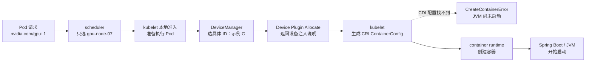
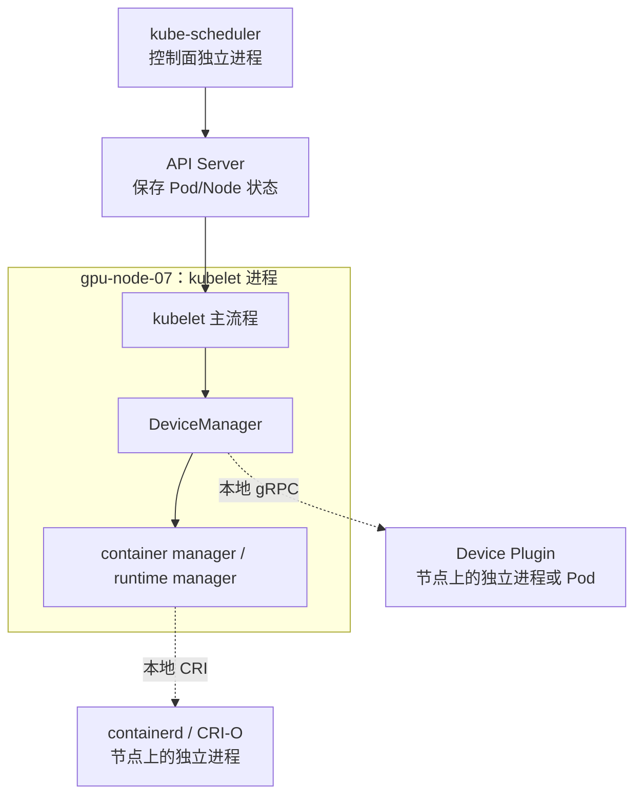
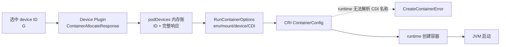
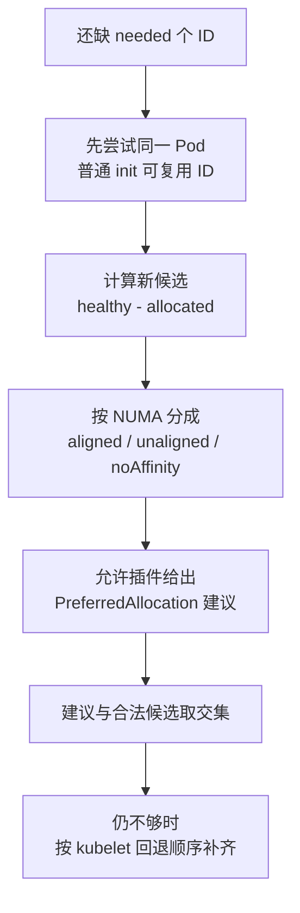

# 第 16 课：scheduler 只选了节点，具体 GPU 到底是谁交给 Java 容器的

> 主案例：Spring Boot 推理服务 `recommend-infer` 已经被调度到 `gpu-node-07`，却停在 `CreateContainerError`。  
> 本章只追一条主线：**scheduler 选 Node 之后，kubelet 怎样选具体 device ID、调用 Device Plugin 的 Allocate，并把设备配置交给 container runtime。**  
> 源码基线：`301946d15e67a4a2e8a5fb8292eb836acd366d78`（`v1.37.0-alpha.0-280-g301946d15e6`）。  
> 学习方式：分两遍。首遍只看懂生产主线；第二遍再读恢复、NUMA、复用和非原子边界。

---

## 0. 先说最终答案：调度成功，不等于 GPU 已经进了容器

假设公司的 Java 推理服务是下面这样：

```yaml
apiVersion: v1
kind: Pod
metadata:
  namespace: ai-prod
  name: recommend-infer
spec:
  containers:
    - name: inference
      image: registry.example.com/recommend-infer:2026.08
      resources:
        limits:
          nvidia.com/gpu: 1
```

它使用 Spring Boot 提供接口，在进程里通过 ONNX Runtime 的 GPU 后端调用 GPU。**ONNX Runtime** 是执行机器学习模型的运行库；**CUDA** 是 NVIDIA 提供的 GPU 计算平台和编程接口。现在看到的现场是：

```text
Pod.spec.nodeName = gpu-node-07
Pod.phase = Pending
inference 容器 = CreateContainerError
Node.status.allocatable[nvidia.com/gpu] = 8
设备插件 Pod = Running
宿主机 nvidia-smi -L = 正常
```

新手最容易把它理解成：

```text
Node 显示 8
  -> scheduler 已经选中 Node
  -> 容器一定拿到了 GPU
```

真正的链路是：

```text
Node 显示可调度上限为 8
  -> scheduler 只判断“这个 Node 数量上能不能再放 1 个”
  -> kubelet 再从本机设备账里选具体 ID
  -> Device Plugin 再返回怎样把设备交给容器
  -> container runtime 真正创建容器并执行注入
  -> 最后才轮到 JVM 启动
```

所以，本章最重要的一句话是：

> **scheduler 只负责把 Pod 送到哪台 Node；目标 Node 上的 kubelet DeviceManager 才负责选具体 device ID。插件负责给出设备注入说明，container runtime 负责真正创建容器。**

这里的 `Allocatable=8` 也不是“眼下还空着 8 张卡”。**Allocatable（可分配上限）**是这台 Node 最多允许 Pod 申请多少个该资源单位。scheduler 还要减去已经被其他 Pod 请求的数量，才能判断本次请求是否放得下。

`Capacity` 是 Node 上报的资源总量；`Allocatable` 是扣除系统预留等部分后，允许 Pod 使用的上限。两者都不是实时空闲数。对 `nvidia.com/gpu` 这类扩展资源，只写 `limits` 时，调度请求按同样数量处理。

### 0.1 第一遍只走六站

下面这张表按行从上往下读。每一行是一站，不要横向跳着背术语。

| 站点 | 谁在做 | 大白话动作 | 成功只证明什么 |
|---|---|---|---|
| 1. 选 Node | scheduler | 看数量，把 Pod 放到一台机器 | 机器在调度账上放得下 |
| 2. 本地准入 | kubelet | 开工前做本机检查 | kubelet愿意继续准备这个 Pod |
| 3. 选具体 ID | DeviceManager | 从健康且未占用的 ID 中挑够数量 | 具体设备候选已选出 |
| 4. 要注入说明 | Device Plugin | 接收 ID，返回 env、mount、device 或 CDI | 插件同意并返回了配置意图 |
| 5. 拼创建单 | kubelet | 把插件结果装进 `ContainerConfig` | 创建容器所需参数已准备好 |
| 6. 真正创建 | container runtime | 按创建单注入设备并创建容器 | 成功后才可能启动 Java 进程 |

这一遍先略过这些词：NUMA、PreferredAllocation（插件选ID建议）、DRA（另一套动态设备分配框架）、restartable init container（可重启的初始化容器）、并发回收。它们都放到第二遍，因为不影响你先回答“谁选卡、谁注入、错在哪一站”。

### 0.2 一张图看清状态怎么变化

读图方向：从左往右。实线箭头表示正常交接；虚线箭头表示本章案例可能失败的位置。



图例：

- `A --> B`：上一步的结果成为下一步的输入。
- `F -.-> X`：创建阶段失败，后面的 JVM 和 readinessProbe 都不会发生。
- 图里的 `G` 是教学案例中被选中的 ID，不代表 Kubernetes 总会优先选择叫 G 的设备。

---

## 1. 先认清角色：每个人只负责哪一段

下面出现的专业词，先只记住“它是谁、在本章有什么用”。

| 名词 | 大白话解释 | 本章职责 | 它不负责什么 |
|---|---|---|---|
| scheduler | Kubernetes 的“选机器的人” | 按资源数量等条件给 Pod 选 Node | 不选 Node 内的 GPU UUID |
| kubelet | 每台 Node 上的“现场负责人” | 接收已调度 Pod，准备并启动容器 | 不替厂商解释 GPU 的专有配置 |
| 扩展资源 | 由设备插件等组件提供、名字通常带斜杠的自定义资源，例如 `nvidia.com/gpu` | 让Pod按整数申请逻辑设备单位 | 名字本身不保证一个单位就是一整张物理卡 |
| TopologyManager | kubelet里协调CPU、内存和设备位置关系的模块 | 在本地准入时调用各资源提供者 | 不理解完整NVLink/NVSwitch拓扑 |
| DeviceManager | kubelet 进程里的设备管理模块 | 维护设备账、选具体 ID、调用插件 | 不是单独的一套微服务 |
| Device Plugin | 厂商或设备方案提供的节点插件 | 上报逻辑设备，按 ID 返回注入说明 | 不直接调用 CRI 创建业务容器 |
| device ID | 插件给一个逻辑设备起的字符串名字 | 让 kubelet 和插件指向同一个设备单位 | 不一定等于 `/dev/nvidia0` 或物理卡序号 |
| Allocate | kubelet 向插件发起的一次远程函数调用 | 把选中的 ID 交给插件，取回注入说明 | 不是“容器已经创建成功” |
| RPC | “调用另一个进程里的函数并等结果” | kubelet 用它调用 Device Plugin | 不是 Kubernetes API 对象 |
| CRI | kubelet 调用容器运行时的标准接口 | 把最终创建单交给 containerd、CRI-O 等 | 不决定选哪张 GPU |
| container runtime | 真正创建和启动容器的程序 | 执行 mount、device、CDI 等注入 | 不替 scheduler 选择 Node |
| CDI | 一种标准化设备注入方式 | kubelet传设备名字，runtime查本机 CDI 配置并完成注入 | 不是 Kubernetes 自己的设备清单 |
| cache | 进程内存里的临时账本 | 快速保存“某 Pod/容器拿了什么” | 进程重启后不能单靠它恢复 |
| checkpoint | 写在本机磁盘上的恢复账本 | kubelet重启时恢复分配记录 | 不是 API Server 里的对象 |
| readinessProbe | kubelet用来判断容器是否可以接收流量的就绪探针 | JVM启动后检查服务是否Ready | 容器尚未创建时不会执行 |

`device ID` 常被称为 **opaque ID（不透明 ID）**。大白话就是：kubelet把它当标签使用，不猜它内部含义。它可能像 `GPU-3af...`，也可能是厂商自定义字符串。

### 1.1 API Server 在这条链里做什么

API Server 像共享账本，保存 Pod、Node 等 API 对象。它能保存：

- Pod 请求了 `nvidia.com/gpu: 1`；
- scheduler 最终写入的 `spec.nodeName`；
- kubelet回报的 Pod 状态和事件；
- Device Plugin 通过 kubelet间接体现到 Node 上的 Capacity/Allocatable。

但在传统 Device Plugin 主路径里，API Server **不负责**：

- 从本机健康 ID 中选出 G；
- 调用 Device Plugin 的 Allocate；
- 保存完整 AllocateResponse；
- 让 containerd 解析 CDI 配置。

这些都是目标 Node 上的本地动作。

### 1.2 这不是六个微服务互相绕着调用

Kubernetes 把职责拆开，确实会形成较长链路。但这条链并不等于六次跨网络微服务调用：

| 边界 | 实际形态 |
|---|---|
| kubelet -> DeviceManager | 同一个 kubelet 进程里的 Go 函数调用 |
| DeviceManager -> Device Plugin | 同一台 Node 上通常通过 Unix socket 做 gRPC |
| kubelet -> container runtime | 同一台 Node 上通过 CRI 调用独立 runtime 进程 |
| scheduler -> kubelet | 不直接互调；通过 API Server 中的 Pod 状态完成交接 |

**Unix socket** 是同一台机器上进程通信的一种本地“插座”；**gRPC** 是 RPC 的一种实现。第一次看源码时，只需把它理解为“kubelet通过本机连接向插件问问题”。

读图方向：从上往下。实线表示同进程函数调用；虚线表示跨进程但通常仍在同一 Node。



图例：

- kubelet框内的箭头是进程内部调用，不是网络微服务链。
- 虚线只表示跨进程边界，不代表一定跨机器。
- API Server传递的是期望和状态，不参与本地 ID 选择。

---

## 2. 为什么要拆成这几层：复杂度换来了什么

如果让 scheduler 一次完成“选 Node + 选 GPU ID + 生成厂商注入配置”，看起来调用链短了，实际上会带来三个问题。

### 2.1 设备状态变化太快，Node 本地看得最准

GPU 健康状态、插件注册状态、容器实际占用情况都可能在秒级变化。scheduler在控制面看到的是汇总后的数量账，不适合持有每台 Node 的全部设备细节。

把具体 ID 选择放到 kubelet，本质上是：

```text
全局决策：哪台 Node 数量上放得下
本地决策：这台 Node 此刻哪几个 ID 真能用
```

### 2.2 Kubernetes 不应该写死 NVIDIA 的注入规则

NVIDIA GPU、FPGA、网卡、MIG 实例的注入方式不同。若 kubelet硬编码所有厂商规则，每增加一种设备都要修改 Kubernetes 核心代码。

所以边界被定成：

```text
kubelet：我选中了这些 ID
插件：这些 ID 要用哪些 env、mount、device 或 CDI
runtime：我按标准容器配置真正执行
```

这里的 **env** 是环境变量，**mount** 是把宿主机路径放进容器，**device** 是把设备文件交给容器。

### 2.3 拆分也付出了代价

好处是职责清楚、厂商可扩展、Node 本地状态更及时；代价是故障点变多：

- 调度成功，但本地没有健康 ID；
- ID 选好了，但插件 Allocate 报错；
- 插件返回成功，但 CDI 配置在 runtime 侧不存在；
- 容器创建成功，但 Java 进程里的 CUDA 库仍加载失败。

设计的重点不是消灭复杂度，而是让每段复杂度有明确负责人和证据。排障时必须先判断失败在哪一站，不能只看最后一条错误就猜。

---

## 3. 用三本账把案例算一遍

假设 `gpu-node-07` 的调度账和本地设备账如下。

### 3.1 scheduler 看的是数量账

```text
Node 的 nvidia.com/gpu Allocatable = 8
已有 Pod 请求总量                 = 6
recommend-infer 本次请求          = 1

8 - 6 >= 1
所以 scheduler 认为数量上放得下
```

这只说明 Node 通过了数量判断。

### 3.2 DeviceManager 看的是 ID 账

```text
healthyDevices  = {A, B, C, D, E, F, G, H}
allocatedDevices = {A, B, C, D, E, F}

available = healthyDevices - allocatedDevices
          = {G, H}
```

- `healthyDevices`：插件报告为健康的 ID 集合。
- `allocatedDevices`：DeviceManager认为已经被占用的 ID 集合。
- `available`：健康集合减去占用集合后，本次还能继续考虑的候选。

**集合（set）**可以理解成“不重复的名单”。集合相减不是数字相减，而是从第一份名单里删掉第二份名单出现的成员。

### 3.3 源码阅读约定

从这里开始进入真实 Go 源码。

- 固定提交：`301946d15e67a4a2e8a5fb8292eb836acd366d78`。
- 标为 `go` 的代码保留当前提交中的真实业务语句；中文注释是教学新增。
- 为了聚焦，会省去相邻日志或英文注释，但不会用省略号冒充真实 Go 代码。
- 标为 `text` 的内容只是流程图、账本或伪代码，不能当成可编译源码。
- 行号只对这个固定提交有效；升级 Kubernetes 后要重新定位。

源码里的 `ctx context.Context` 是一次调用随身携带的“取消、截止时间和上下文信息”。首遍先把它看成调用链的通行证；第 12 节再看超时。

### 3.4 第一段核心源码：候选 ID 到底怎样算

文件：`pkg/kubelet/cm/devicemanager/manager.go:677-686`  
函数：`devicesToAllocate`

这是 `manager.go:677-686` 的**连续摘录**；函数前后的恢复、复用和最终挑选分支没有包含，所以它用于证明候选公式，不能单独编译。

```go
// 取出这个扩展资源已经被占用的设备 ID 集合。
devicesInUse := m.allocatedDevices[resource]
// 用健康 ID 集合减去已占用集合，得到还能参与本次选择的候选。
available := m.healthyDevices[resource].Difference(devicesInUse)
// 候选数量小于还需要的数量时，不能硬凑，直接返回错误。
if available.Len() < needed {
	// 错误里同时记录资源名、需要数和可用数，方便定位数量缺口。
	return nil, fmt.Errorf("requested number of devices unavailable for %s. Requested: %d, Available: %d", resource, needed, available.Len())
}

// 候选够用后，再按 NUMA 位置把它们分组；具体含义第二遍再学。
aligned, unaligned, noAffinity := m.filterByAffinity(podUID, contName, resource, available)
```

**大白话总结：** scheduler没有把某个 GPU ID 塞给 kubelet。DeviceManager到了目标 Node 后，自己拿“健康名单”减去“占用名单”，先得到候选。只有候选数量够，才继续选具体 ID。

把本章数字代进去：

```text
健康 = {A, B, C, D, E, F, G, H}
占用 = {A, B, C, D, E, F}
候选 = {G, H}
需要 = 1
```

教学案例后面假设最终选中 G。但源码大量使用 set、map 和 `UnsortedList`，所以不能据此承诺“永远先选 G”或“永远先选 GPU0”。

**顺手学 Go：**

- `:=` 表示“第一次声明变量并赋值”，可以先类比 Java 的局部变量初始化。
- `m.allocatedDevices[resource]` 是从 map 里按 `resource` 取值，类似 Java 的 `map.get(resource)`。
- `Difference` 是集合差集：左边有、右边没有的成员留下。
- `if available.Len() < needed` 就是普通条件判断。
- `return nil, err` 表示函数返回两个值：第一个结果没有，第二个结果是错误。这是 Go 常见的显式错误处理。

这一段只回答“新 ID 的候选从哪里来”。旧分配恢复、init container复用和 NUMA 顺序放在第二遍。

---

## 4. 第二站从哪里开始：kubelet 本地准入触发分配

**本地准入（local admission）**不是 API Server 的 Admission Webhook。这里指：Pod 已经分到这台 Node 后，kubelet在真正启动容器前做一次“本机能不能兑现这些资源”的检查。

主路径可以先压缩成四个函数：

```text
TopologyManager.Admit
  -> scope.admitPolicyNone
  -> scope.allocateAlignedResources
  -> DeviceManager.Allocate
```

即使 TopologyManager 的策略叫 `none`，也不是“什么都不做”。它仍然会让各个资源提供者执行 Allocate；`none` 只是表示不因为 NUMA 对齐而拒绝 Pod。

### 4.1 为什么要在 Node 上再检查一次

scheduler做决定时看的是集群里的汇总状态。等 Pod 真到 Node 上时，插件可能刚好重启、某个 ID 可能刚变成不健康，本地账也可能正在恢复。因此 scheduler先完成全局粗筛，再由 kubelet用最新本地事实做最后检查。

代价是：Pod 可能已经写入 `nodeName`，却仍在 Node 本地准备阶段失败。

### 4.2 源码：谁调用了 DeviceManager 的 Allocate

文件：`pkg/kubelet/cm/topologymanager/scope.go:143-162`

```go
// policy 为 none 时，仍然逐个处理普通 init container 和业务 container。
func (s *scope) admitPolicyNone(pod *v1.Pod) lifecycle.PodAdmitResult {
	// 把两类 container 拼成一份列表，然后逐个准入。
	for _, container := range append(pod.Spec.InitContainers, pod.Spec.Containers...) {
		// 为当前 container 调用资源提供者的 Allocate。
		err := s.allocateAlignedResources(pod, &container)
		// 任意一个资源提供者失败，本次本地准入就失败。
		if err != nil {
			// 把普通错误转换成 kubelet 能回报的准入结果。
			return admission.GetPodAdmitResult(err)
		}
	}
	// 所有 container 都处理成功，返回接纳结果。
	return admission.GetPodAdmitResult(nil)
}

// 这个函数负责逐个调用已经注册的资源提供者。
func (s *scope) allocateAlignedResources(pod *v1.Pod, container *v1.Container) error {
	// hintProviders 是资源提供者列表，DeviceManager 是其中之一。
	for _, provider := range s.hintProviders {
		// 通过接口调用具体提供者的 Allocate 实现。
		err := provider.Allocate(pod, container)
		// 某个提供者无法兑现资源时，立即把错误往上传。
		if err != nil {
			// 返回原错误，停止后面的准入流程。
			return err
		}
	}
	// 所有提供者都成功，当前 container 的资源分配结束。
	return nil
}
```

**大白话总结：** kubelet先遍历 Pod 里的 container，再遍历本机资源管理模块。轮到 DeviceManager 时，才进入设备 ID 分配。它不是 scheduler 直接远程调用 Device Plugin。

**顺手学 Go：**

- `func (s *scope)` 中的 `(s *scope)` 叫接收者，可先类比 Java 的 `this`。
- `for _, container := range ...` 是遍历；下划线表示这一个返回值不需要。
- `&container` 取得变量地址，传的是指针。
- `if err != nil` 就是“如果发生错误”；Go习惯立刻返回。
- `provider.Allocate` 是接口调用，运行时落到不同资源提供者的实现。

### 4.3 主路线边界

当前固定提交还有一个默认关闭的 `PodLevelResourceManagers` 功能开关。它会引出 Pod 级资源分配接口，而传统 DeviceManager 的 `AllocatePod` 当前直接返回成功。首遍不要让这个例外打断主线，第二遍第 12 节再看。

---

## 5. 第四站：选出 ID 后，kubelet 怎样调用 Device Plugin

上一节进入 `ManagerImpl.Allocate` 后，DeviceManager会检查旧分配、健康状态和占用状态，再挑出需要新增的 ID。

在主案例中，我们假设：

```text
候选 ID = {G, H}
本次需要 = 1
本次观察到最终选择 = {G}
```

“观察到选择 G”只是这次结果，不是顺序保证。

### 5.1 先解释三个新词

- **endpoint**：DeviceManager里代表某个已注册插件连接的对象。大白话就是“拨号簿里这个插件的联系入口”。
- **AllocateRequest**：kubelet交给插件的请求单，核心内容是选中的 device ID。
- **AllocateResponse**：插件返回的设备使用说明，告诉 kubelet容器需要哪些环境变量、挂载、设备文件、注解或 CDI 名称。

`Allocate` 是一次 gRPC 调用。这里的“分配”容易误导：它并不直接创建容器，而是让插件确认这些 ID，并返回怎样把设备交给容器。

### 5.2 源码：请求里真正传了什么

文件：`pkg/kubelet/cm/devicemanager/endpoint.go:102-111`

```go
// endpointImpl 的 allocate 方法接收已经选好的 ID 列表。
func (e *endpointImpl) allocate(ctx context.Context, devs []string) (*pluginapi.AllocateResponse, error) {
	// 插件连接已经停止时，不再继续调用。
	if e.isStopped() {
		// 返回空响应和明确错误。
		return nil, fmt.Errorf(errEndpointStopped, e)
	}
	// 通过 gRPC 客户端调用插件的 Allocate。
	return e.api.Allocate(ctx, &pluginapi.AllocateRequest{
		// 当前请求只构造一个 container 的分配项。
		ContainerRequests: []*pluginapi.ContainerAllocateRequest{
			// 把 DeviceManager 选中的 ID 原样放进请求。
			{DevicesIds: devs},
		},
	})
}
```

**大白话总结：** DeviceManager已经选好 G 后，这段代码只是把 `["G"]` 装进请求并调用插件。插件不负责替 scheduler 换 Node；它只处理这台 Node 上这些 ID 的设备配置。

**顺手学 Go：**

- `devs []string` 表示字符串切片，可先类比 Java 的 `List<String>`。
- `(*pluginapi.AllocateResponse, error)` 表示函数返回“响应指针 + 错误”两个值。
- `&pluginapi.AllocateRequest{...}` 是创建结构体并取地址。
- `[]*T{...}` 是“元素类型为 `*T` 的切片字面量”。

### 5.3 请求与响应长什么样

下面是教学化的结构，不是抓包原文：

```json
{
  "request": {
    "container": "inference",
    "deviceIDs": ["G"]
  },
  "response": {
    "envs": {},
    "mounts": [],
    "devices": [],
    "annotations": {},
    "cdiDevices": [
      {"name": "nvidia.com/gpu=GPU-G"}
    ]
  }
}
```

这里用 CDI 模式举例。不同 NVIDIA Device Plugin 版本和配置可能返回传统 device/mount/env，也可能返回 CDI 名称，不能把示例字段当成所有环境的固定结果。

| 响应字段 | 大白话作用 | 最后由谁执行 |
|---|---|---|
| `Envs` | 给容器增加环境变量 | kubelet装入配置，runtime应用 |
| `Mounts` | 把宿主机路径挂进容器 | runtime |
| `Devices` | 把宿主机设备文件映射到容器 | runtime |
| `Annotations` | 给容器配置附加键值信息 | kubelet交给runtime |
| `CdiDevices` | 给出标准设备名字，让runtime查本机CDI配置 | 支持CDI的runtime |

**annotation（注解）**就是一组键值对，供后续组件读取。它不是 Java 代码里的 `@Annotation`。

**CDI（Container Device Interface）**可以先理解成“设备注入说明书的索引”。插件返回名字，runtime再去本机 CDI 配置目录里找到这个名字对应的详细注入规则。

### 5.4 Allocate 成功，只证明插件返回了配置

Allocate成功不能证明 containerd已经找到 CDI 配置、设备文件真的进入容器、CUDA库兼容、JVM已经启动。它只证明第四站完成。

---

## 6. 第五站前半段：为什么必须把 ID 和响应一起记住

DeviceManager收到插件响应后，会把两类内容一起写进 `podDevices`：

```text
定位键：Pod UID + container 名 + resource 名
保存值：device IDs + ContainerAllocateResponse
```

`podDevices` 是 kubelet内存中的正式分配账。它回答：“这个 Pod 的这个 container，对这个设备资源，已经拿过哪些 ID；插件当时要求怎样注入？”

如果只保存 ID，不保存响应，创建容器时就得再次调用插件才能找回 env、mount、device、CDI。那会让重启和恢复更脆弱。

### 6.1 源码：正式账怎样写入

文件：`pkg/kubelet/cm/devicemanager/pod_devices.go:76-89`

```go
// insert 按 Pod、container、resource 三层键保存一次正式分配。
func (pdev *podDevices) insert(podUID, contName, resource string, devices checkpoint.DevicesPerNUMA, resp *pluginapi.ContainerAllocateResponse) {
	// 写账前拿写锁，避免并发读写 map。
	pdev.Lock()
	// 函数结束时一定释放写锁。
	defer pdev.Unlock()
	// 第一层还没有这个 Pod 时，先创建 Pod 对应的 map。
	if _, podExists := pdev.devs[podUID]; !podExists {
		// 第一层键是 Pod UID。
		pdev.devs[podUID] = make(containerDevices)
	}
	// 第二层还没有这个 container 时，再创建 container 对应的 map。
	if _, contExists := pdev.devs[podUID][contName]; !contExists {
		// 第二层键是 container 名。
		pdev.devs[podUID][contName] = make(resourceAllocateInfo)
	}
	// 第三层以资源名为键，同时保存 ID 和插件响应。
	pdev.devs[podUID][contName][resource] = deviceAllocateInfo{
		// deviceIds 保存按 NUMA 分组的具体 ID。
		deviceIds: devices,
		// allocResp 保存这个资源对应的完整容器分配响应。
		allocResp: resp,
	}
}
```

**大白话总结：** 这不是只写“G 已占用”。它还把插件对 G 返回的注入说明一起存下来，后面创建容器时再读。

**顺手学 Go：**

- `map[key]value` 是 Go 的映射；这里连续三层 map 类似 Java 的嵌套 `Map`。
- `if _, ok := m[key]; !ok` 是“查 map 并判断键是否存在”。
- `make(containerDevices)` 创建一个可写的 map。
- `defer pdev.Unlock()` 表示函数返回前执行解锁。
- 结构体字段 `deviceIds: devices` 是按字段名赋值。

### 6.2 cache 和 checkpoint 不要混为一谈

- **cache（内存缓存）**：`podDevices` 在 kubelet进程内，读取快。
- **checkpoint（本地检查点）**：把关键分配账写到 Node 磁盘，供 kubelet重启后恢复。

正常分配中，DeviceManager不是每成功一个资源就立刻写 checkpoint，而是在当前 container 的设备资源循环完成后再写。若中间失败，要结合内存重算和后续垃圾回收理解，第二遍第 11 节展开。

---

## 7. 第五站后半段到第六站：怎样交给 container runtime

创建业务容器时，kubelet通常不会重新选 ID，而是读取 `podDevices` 中保存的响应，把它变成 `RunContainerOptions`，再拼成 CRI 的 `ContainerConfig`。

- **RunContainerOptions**：kubelet内部的“容器运行参数篮子”。
- **ContainerConfig**：交给 container runtime 的最终“创建申请单”。
- **runtime**：这里指 containerd、CRI-O 等负责真正创建容器的进程。

### 7.1 整体状态变化

读图方向：从左往右。实线表示数据被保存或转换；虚线表示外部组件执行时可能失败。



图例：

- 每向右一步，信息的格式会变化，但设备注入意图会继续传递。
- 虚线失败发生在 runtime 执行阶段，不应倒推成 scheduler 一定选错了 Node。

### 7.2 源码：创建容器时先从 DeviceManager 取缓存

文件：`pkg/kubelet/cm/container_manager_linux.go:765-778`

```go
// 正常主路径中，Allocate 应该已在本地准入阶段完成；这里读取缓存。
devOpts, err := cm.deviceManager.GetDeviceRunContainerOptions(ctx, pod, container)
// 读取或恢复设备运行参数失败时，停止生成容器配置。
if err != nil {
	// 把空结果和原错误返回给上层。
	return nil, err
// 当前 Pod/container 没有传统 DeviceManager 结果时，保留已有选项并返回。
} else if devOpts == nil {
	// 这里的 opts 仍可能含有 DRA 提供的 CDI 设备。
	return opts, nil
}
// 把传统设备文件映射追加到统一运行参数。
opts.Devices = append(opts.Devices, devOpts.Devices...)
// 把设备插件要求的挂载追加进去。
opts.Mounts = append(opts.Mounts, devOpts.Mounts...)
// 把设备插件要求的环境变量追加进去。
opts.Envs = append(opts.Envs, devOpts.Envs...)
// 把设备插件要求的注解追加进去。
opts.Annotations = append(opts.Annotations, devOpts.Annotations...)
// 把设备插件要求的 CDI 名称追加进去。
opts.CDIDevices = append(opts.CDIDevices, devOpts.CDIDevices...)
// 返回汇总完成的容器运行参数。
return opts, nil
```

**大白话总结：** 创建容器时，kubelet把先前缓存的插件响应拆成几类运行参数，装进同一个篮子。正常情况下，这一步不是重新挑 GPU。

**顺手学 Go：**

- `devOpts, err := ...` 一次接收函数的两个返回值。
- `append(slice, other...)` 中的 `...` 是真实 Go 展开语法，不是省略源码。
- `nil` 可先类比 Java 的 `null`，但它只能用于特定类型。

### 7.3 源码：运行参数怎样进入 CRI 创建单

文件：`pkg/kubelet/kuberuntime/kuberuntime_container.go:367-385`

```go
// 创建 CRI 要接收的 ContainerConfig。
config := &runtimeapi.ContainerConfig{
	// Metadata 保存 container 名和重试次数。
	Metadata: &runtimeapi.ContainerMetadata{
		// 使用 Pod spec 中的 container 名。
		Name: container.Name,
		// 记录这是第几次创建尝试。
		Attempt: restartCountUint32,
	},
	// Image 告诉 runtime 使用哪个镜像。
	Image: &runtimeapi.ImageSpec{Image: imageRef, UserSpecifiedImage: container.Image},
	// Command 是容器入口命令。
	Command: command,
	// Args 是入口命令参数。
	Args: args,
	// WorkingDir 是容器工作目录。
	WorkingDir: container.WorkingDir,
	// Labels 是要交给 runtime 的标签。
	Labels: newContainerLabels(container, pod),
	// Annotations 会包含前面合并得到的设备注解。
	Annotations: newContainerAnnotations(ctx, container, pod, restartCount, opts),
	// Devices 把传统设备文件映射转换为 CRI 格式。
	Devices: makeDevices(opts),
	// CDIDevices 把 CDI 设备名称转换为 CRI 格式。
	CDIDevices: makeCDIDevices(opts),
	// Mounts 汇总普通挂载和设备插件挂载。
	Mounts: m.makeMounts(opts, container),
	// LogPath 指定容器日志路径。
	LogPath: containerLogsPath,
	// Stdin 决定是否保持标准输入。
	Stdin: container.Stdin,
	// StdinOnce 决定标准输入是否只附加一次。
	StdinOnce: container.StdinOnce,
	// Tty 决定是否分配终端。
	Tty: container.TTY,
}
```

环境变量在同一函数稍后被转换：

```go
// 预先创建和运行参数里环境变量数量相同的 CRI 切片。
envs := make([]*runtimeapi.KeyValue, len(opts.Envs))
// 按下标遍历 kubelet 内部环境变量。
for idx := range opts.Envs {
	// 取出当前位置的内部环境变量。
	e := opts.Envs[idx]
	// 转成 CRI 的 KeyValue 结构。
	envs[idx] = &runtimeapi.KeyValue{
		// Name 转成 Key。
		Key: e.Name,
		// Value 保持原值。
		Value: e.Value,
	}
}
// 把转换完成的环境变量放进最终创建单。
config.Envs = envs
```

**大白话总结：** 到这里，device、CDI、mount、annotation、env 已经进入 runtime 能看懂的创建单。kubelet只是做格式转换和汇总，真正注入还没有发生。

**顺手学 Go：**

- `&runtimeapi.ContainerConfig{...}` 创建结构体并返回指针。
- 大括号里的 `字段名: 值` 类似 Java builder 给各字段赋值。
- `make([]*T, n)` 创建长度为 n 的切片。
- `for idx := range opts.Envs` 只取下标，再用下标取元素。

### 7.4 源码：真正越过 CRI 边界

文件：`pkg/kubelet/kuberuntime/kuberuntime_container.go:276-291`

```go
// 把最终 ContainerConfig 交给 container runtime 创建容器。
containerID, err := m.runtimeService.CreateContainer(ctx, podSandboxID, containerConfig, podSandboxConfig)
// runtime 返回错误时，创建阶段失败。
if err != nil {
	// 把 gRPC 错误转换成便于记录的状态。
	s, _ := grpcstatus.FromError(err)
	// 为 Pod 记录 FailedToCreateContainer 事件。
	m.recordContainerEvent(ctx, pod, container, containerID, v1.EventTypeWarning, events.FailedToCreateContainer, "Error: %v", s.Message())
	// 返回创建失败；这时业务进程还没有启动。
	return s.Message(), ErrCreateContainer
}
// 容器对象创建成功后，才调用 kubelet 内部的 PreStart hook。
err = m.internalLifecycle.PreStartContainer(logger, pod, container, containerID)
// 内部 PreStart hook 失败时，容器仍不能进入 Start。
if err != nil {
	// 把错误转换成 gRPC 状态。
	s, _ := grpcstatus.FromError(err)
	// 为 Pod 记录 FailedToStartContainer 事件。
	m.recordContainerEvent(ctx, pod, container, containerID, v1.EventTypeWarning, events.FailedToStartContainer, "Internal PreStartContainer hook failed: %v", s.Message())
	// 返回启动前 hook 失败。
	return s.Message(), ErrPreStartHook
}
// 所有创建和内部 hook 都成功后，才调用 runtime StartContainer。
err = m.runtimeService.StartContainer(ctx, containerID)
```

**大白话总结：** `CreateContainer` 成功之前，JVM没有机会运行。主案例若因为本机 CDI 配置缺失而在这里报错，Java 日志为空、readinessProbe没有执行都是正常现象。

**顺手学 Go：**

- `containerID, err :=` 同时接收创建结果和错误。
- `s, _ :=` 中下划线表示忽略第二个返回值。
- `err =` 是给已存在的变量重新赋值；它和首次声明用的 `:=` 不同。

### 7.5 主案例闭环

假设插件返回 `nvidia.com/gpu=GPU-G`，但 runtime 找不到对应 CDI 配置，那么事实链是：

```text
scheduler 数量判断成功
  -> kubelet 选 ID 成功
  -> Device Plugin Allocate 成功
  -> kubelet 缓存和转换成功
  -> runtime CreateContainer 解析 CDI 失败
  -> Pod 显示 CreateContainerError
  -> JVM 从未启动
```

因此，这时反复查看 Spring Boot 日志没有意义。应先看 kubelet和 container runtime 在同一时间窗的错误。

---

## 8. 首遍排障：先判断停在哪一站，再看命令

到这里，第一遍源码主线已经完整。现在才开始看现场命令，因为你已经知道每条证据能证明什么。

### 8.1 一条错误属于哪一站

| 看到的现象 | 更可能停在哪一站 | 优先看谁 | 不能直接推出什么 |
|---|---|---|---|
| `FailedScheduling` | scheduler数量判断 | Pod Event、Node请求账 | 不能推出某个GPU坏了 |
| Pod已有 `nodeName`，本地准入失败 | kubelet本地检查或ID选择 | kubelet日志、插件注册与健康 | 不能推出容器已经创建 |
| `Allocate` RPC error | 插件调用 | kubelet与Device Plugin同时间窗日志 | 不能推出runtime有问题 |
| `CreateContainerError` 且提到CDI | CRI创建 | kubelet、containerd/CRI-O日志、CDI配置 | 不能推出scheduler选错Node |
| `FailedToStartContainer` | 已创建但启动前后失败 | runtime和kubelet hook | 不等于Java已对外服务 |
| 容器Running但Java报CUDA错误 | 业务进程/用户态库 | Java日志、驱动与CUDA兼容性 | 不等于DeviceManager没选到ID |

**用户态库**就是容器进程使用的普通软件库，例如 CUDA runtime、cuDNN、ONNX Runtime GPU 版本。它们出错发生在 JVM 已经启动之后，和容器创建失败不是同一层。

### 8.2 安全只读检查

下面的命令只读取 Kubernetes 对象和节点日志，不修改工作负载。先把命名空间和 Pod 名换成现场值。

```bash
NS=ai-prod
POD=recommend-infer

kubectl -n "$NS" get pod "$POD" -o wide
kubectl -n "$NS" describe pod "$POD"
kubectl -n "$NS" get pod "$POD" -o jsonpath='{.spec.nodeName}{"\n"}'
kubectl -n "$NS" get pod "$POD" -o jsonpath='{range .status.containerStatuses[*]}{.name}{"\t"}{.state.waiting.reason}{"\t"}{.state.waiting.message}{"\n"}{end}'
```

先从输出回答三个问题：

1. `spec.nodeName` 是否已经存在？
2. waiting reason 是 `CreateContainerError`、`RunContainerError`，还是别的值？
3. message 里提到的是插件、device ID、mount、CDI，还是镜像和普通 volume？

然后在目标 Node 上按同一时间窗读取日志。服务名和日志访问方式因发行版而异：

```bash
journalctl -u kubelet --since "20 minutes ago"
journalctl -u containerd --since "20 minutes ago"
```

若使用 CRI-O，把第二条换成对应服务日志。日志可能含镜像地址、Pod UID 或节点路径，贴到外部前先脱敏。

### 8.3 怎样验证数量账，而不误读 Allocatable

```bash
NODE=gpu-node-07

kubectl get node "$NODE" -o jsonpath='{.status.capacity.nvidia\.com/gpu}{"\n"}'
kubectl get node "$NODE" -o jsonpath='{.status.allocatable.nvidia\.com/gpu}{"\n"}'
kubectl get pods -A --field-selector "spec.nodeName=$NODE" -o wide
```

前两条只能确认 Node 广告上限。第三条列出这台 Node 上的 Pod，但仍需汇总各 Pod 的 GPU requests/limits，才能接近 scheduler当时的数量账。不要把 `Allocatable=8` 直接翻译成“空闲8张”。

宿主机 `nvidia-smi -L` 正常，只能证明驱动此刻能列出物理设备；它不能证明：

- Device Plugin已经向 kubelet注册；
- 插件把这些设备报告为 Healthy；
- DeviceManager没有把 ID 分给别的 Pod；
- runtime能解析 CDI；
- Java容器已经拿到设备。

### 8.4 首遍验收：五个问题答不出来就先别进第二遍

1. **scheduler为什么不选具体GPU UUID？**  
   因为它做的是全局数量级节点选择；本地ID和健康状态由目标Node上的kubelet掌握。

2. **具体ID从哪里来？**  
   DeviceManager以插件报告的健康ID集合为基础，排除已占用ID，再结合后续本地约束选择。

3. **Allocate成功等于容器创建成功吗？**  
   不等于。Allocate只取得插件的设备注入说明。

4. **插件响应保存在哪里，为什么要保存？**  
   保存到 `podDevices`，包含ID和完整响应；创建容器时需要重新读取这些注入参数。

5. **`CreateContainerError` 时为什么可能没有Java日志？**  
   因为runtime创建容器尚未成功，JVM根本没有启动。

只要能不用术语堆砌、用自己的话讲清这五题，首遍就通过。

---

## 9. 第二遍：重启、旧分配和 init container 复用

第二遍开始读那些不会改变主线、但会影响生产边界的分支。

### 9.1 旧分配为什么不能随便换 ID

容器重启时，如果它原来已经拿到 G，Kubernetes希望继续使用 G，而不是每次都随机换一张设备。否则容器的设备环境可能和已保存状态不一致。

文件：`pkg/kubelet/cm/devicemanager/manager.go:586-598`。下面连续保留这个区间的业务语句，只把上游英文说明注释换成中文教学注释。

```go
// needed 先等于容器声明需要的设备数量。
needed := required
// 从正式分配账里查询这个 Pod/container/resource 以前拿过的 ID。
devices := m.podDevices.containerDevices(podUID, contName, resource)
// 找到旧分配时，先扣掉已经拥有的数量。
if devices != nil {
	// 记录发现旧分配的调试信息。
	logger.V(3).Info("Found pre-allocated devices for resource on pod", "resourceName", resource, "containerName", contName, "podUID", podUID, "devices", sets.List(devices))
	// 用请求数减去旧 ID 数，得到还缺多少。
	needed = needed - devices.Len()
	// 已准入 Pod 的资源请求不应在原地改变。
	if needed != 0 {
		// 数量对不上时直接报错，避免静默换账。
		return nil, fmt.Errorf("pod %q container %q changed request for resource %q from %d to %d", podUID, contName, resource, devices.Len(), required)
	}
}
```

**大白话总结：** 原来已经分过1个ID，现在仍请求1个，`needed` 会变成0；如果请求数量突然变了，源码宁愿报错，也不偷偷补卡或删卡。

**顺手学 Go：**

- `needed := required` 会复制整数值。
- `devices != nil` 表示确实查到了旧集合。
- `needed = needed - devices.Len()` 是重新赋值。
- `fmt.Errorf` 生成带上下文的错误，类似 Java 中构造带详细消息的异常。

### 9.2 为什么 `needed==0` 前仍检查注册和健康

容易误解成：“既然不缺新ID，直接返回就行。”当前源码不是这样。正常或节点重启恢复路径会先检查：

1. 这个资源的插件是否已经重新注册；
2. 注册后是否至少有健康设备；
3. 旧分配的所有ID是否仍属于健康集合；
4. 最后才在 `needed == 0` 时返回。

这样设计是为了避免拿着一份陈旧账就宣布恢复成功。

但有一个更早的特殊分支：kubelet正在初始化，并且 runtime明确告诉 kubelet这个容器仍在运行。源码认为运行中的容器已经拥有所需设备，于是直接返回，不等待插件注册。

文件：`pkg/kubelet/cm/devicemanager/manager.go:610-612`，连续摘录。

```go
// kubelet的数据源尚未全部就绪，但runtime确认这个容器仍在运行。
if !m.sourcesReady.AllReady() && m.isContainerAlreadyRunning(logger, podUID, contName) {
	// 运行中的旧容器不用重新选ID，也不用重新调用Allocate。
	return nil, nil
}
```

**大白话总结：** kubelet自己重启，不代表节点上的业务容器也重启。若容器还在跑，kubelet先承认现实，不重复折腾设备。

**顺手学 Go：**

- `!` 表示逻辑取反。
- `&&` 表示两个条件都成立。
- `return nil, nil` 在这里不是失败，而是“没有新增ID，也没有错误”；要结合函数契约理解。

### 9.3 普通 init container 的 reuse 不是 GPU sharing

普通 init container 顺序执行，结束后不再和业务 container同时运行。DeviceManager可以把它用过的设备放入同一 Pod 的可复用集合，供后续 container使用。

这不是“两个运行中的容器共享一张卡”：

```text
允许复用：
init-A 使用 G -> init-A 结束 -> app 使用 G

不等同于：
init-A 运行中 + app 运行中 -> 同时使用 G
```

**restartable init container（可重启的初始化容器）**可能和业务 container长期并存，所以它的设备不能按普通 init 的方式放回复用集合。

### 9.4 三本账在恢复场景各做什么

| 账本 | 大白话含义 | 主要来源 |
|---|---|---|
| `healthyDevices` | 插件当前说哪些ID健康 | ListAndWatch |
| `allocatedDevices` | 当前内存里哪些ID被占用或已预留 | 从正式账重算，并在选择中更新 |
| `podDevices` | 哪个Pod/container/resource正式拿过哪些ID及响应 | Allocate成功后写入，checkpoint可恢复 |

`allocatedDevices` 不是永久权威账。Pod终止后，`UpdateAllocatedDevices` 会删除不再活跃的 Pod 分配，再从 `podDevices` 重算占用集合。它按 Pod 生命周期回收，不看 `nvidia-smi` 的利用率是否为0。

**ListAndWatch** 是 Device Plugin 持续向 kubelet发送设备列表和健康变化的长连接，可以理解成“插件不停更新健康名单”。

---

## 10. 第二遍：NUMA、插件建议和“为什么不是固定 GPU0”

首遍只需要记住 `healthy - allocated`。第二遍要补上：候选集合出来后，DeviceManager还会考虑同一 Pod 内可复用设备、NUMA位置和插件建议。

### 10.1 NUMA 是什么，不是什么

**NUMA（Non-Uniform Memory Access）**可以先理解成：一台服务器内部可能有多个 CPU/内存“区域”，某些 PCIe 设备离某个区域更近。**PCIe** 是服务器内部连接 GPU 等设备的高速总线。跨区域访问可能更慢。

DeviceManager会把候选分成：

- `aligned`：符合 TopologyManager给出的本地区域提示；
- `unaligned`：有NUMA信息，但不符合提示；
- `noAffinity`：插件没有提供可用NUMA信息。

这里的NUMA只表达“设备靠近哪个NUMA节点”，不等于：

- GPU之间是否有NVLink；
- NVSwitch怎样连接；
- 哪两张卡通信最快；
- GPU fabric的完整拓扑。

**NVLink/NVSwitch**是NVIDIA GPU互联技术；标准Device Plugin的NUMA字段没有表达这整套关系。

### 10.2 选择顺序画成一张图

读图方向：从上往下。实线是正常选择顺序；右侧说明是每一步的职责。



图例：

- “取交集”表示只保留同时出现在两份名单里的 ID。
- 插件只能在 kubelet给出的合法范围内影响选择，不能凭空塞入不健康或已占用 ID。
- 可复用ID只发生在同一 Pod 的特定生命周期，不是跨 Pod 借卡。

### 10.3 PreferredAllocation 为什么只是建议

**GetPreferredAllocation** 是插件的可选接口。它允许插件说“如果可以，我更希望你选这些ID”，例如厂商可能掌握额外拓扑信息。

但最终决定权仍在 kubelet：

```text
插件返回 preferred
  -> kubelet 与 aligned 或 available 取交集
  -> 交集够数才采用
  -> 不够就从合法候选继续补
```

文件：`pkg/kubelet/cm/devicemanager/manager.go:690-705`，这是 aligned 候选多于需求时的连续摘录。

```go
// aligned 候选比还需要的数量更多时，插件才有挑选空间。
if needed < aligned.Len() {
	// 把合法候选、必须包含项和总需求交给插件，请它给建议。
	preferred, err := m.callGetPreferredAllocationIfAvailable(ctx, podUID, contName, resource, aligned.Union(allocated), allocated, required)
	// 插件建议调用失败时，当前分配失败。
	if err != nil {
		// 把插件错误直接往上传。
		return nil, err
	}
	// 只采用同时属于 preferred 和 aligned 的 ID。
	if allocateRemainingFrom(preferred.Intersection(aligned)) {
		// 数量已经凑齐，返回本次选中的集合。
		return allocated, nil
	}
	// 插件没给够合法建议时，从 aligned 集合继续补齐。
	if allocateRemainingFrom(aligned) {
		// 数量凑齐后返回。
		return allocated, nil
	}

	// 走到这里说明算法没有按预期凑够数量，返回内部一致性错误。
	return nil, fmt.Errorf("unexpectedly allocated less resources than required. Requested: %d, Got: %d", required, required-needed)
}
```

**大白话总结：** 插件可以推荐“选谁”，但 kubelet会把推荐名单重新放进合法范围过滤。推荐不合法或数量不够时，kubelet不会照单全收。

**顺手学 Go：**

- `Union` 是并集，把两份集合成员合起来。
- `Intersection` 是交集，只保留两份集合共有成员。
- `if allocateRemainingFrom(...) {` 直接把函数返回的布尔值当判断条件。
- `required-needed` 是原始需求减去仍缺数量，得到已经选中的数量。

### 10.4 为什么不能承诺“默认选 GPU0”

当前实现大量使用 `sets.Set[string]`、Go map 和 `UnsortedList`。Go语言不保证 map 每次遍历顺序固定，因此：

```text
候选 = {G, H}
需要 = 1
```

只能得出“会从合法候选里取1个”，不能只凭源码承诺每次先取G。

如果生产要求稳定、可预测的拓扑选择，应依赖明确策略、插件能力和可观测证据，不能把一次日志里出现的顺序当接口契约。

### 10.5 第二遍此处应掌握的边界

- `healthy - allocated` 是新增ID的基础候选，不包含前面已成功取到的可复用ID。
- NUMA约束由kubelet掌握，插件建议不能越过合法集合。
- `GetPreferredAllocation` 可选；没有建议时仍有kubelet回退选择。
- 设备ID是字符串标签，默认顺序不是Kubernetes承诺。
- NUMA不是NVLink/NVSwitch拓扑模型。

---

## 11. 第二遍：Allocate 失败、部分成功和 checkpoint 边界

这一节回答一个生产上很重要的问题：如果一个 container请求多种设备资源，第一种成功、第二种失败，会不会自动全部回滚？

答案是：**不能把它当成数据库事务。**

**事务（transaction）**在这里指“要么全部成功，要么任何一步失败就恢复到开始前”。当前 DeviceManager 的多资源循环没有提供这种完整的全有或全无保证。

### 11.1 为什么调用插件前先在内存占座

`devicesToAllocate` 选中一个ID时，会先把它加入 `allocatedDevices`，再离开锁去调用插件。关键业务语句是：

```go
// 把当前 ID 先记为已占用，防止另一个并发分配也选中它。
m.allocatedDevices[resource].Insert(device)
// 把当前 ID 放进本次函数最终要返回的集合。
allocated.Insert(device)
// 本次还缺的数量减一。
needed--
```

**大白话总结：** 这像窗口先把座位标成“处理中”，再去外部系统出票。否则两个同时来的请求可能都看到同一座位空闲。

**顺手学 Go：**

- `Insert` 修改集合内容。
- `needed--` 表示整数减一。
- 这三行在闭包 `allocateRemainingFrom` 内；**闭包**就是能使用外层变量的小函数。

### 11.2 Allocate RPC error 会怎样重算

文件：`pkg/kubelet/cm/devicemanager/manager.go:900-917`。这是连续业务区间，省去了其中两段上游英文说明注释，但保留了全部业务语句。

```go
// 把选中集合转成字符串切片；顺序没有稳定保证。
devs := allocDevices.UnsortedList()
// 记录本次准备调用插件的调试日志。
logger.V(4).Info("Making allocation request for device plugin", "devices", devs, "resourceName", resource, "pod", klog.KObj(pod), "containerName", container.Name)
// 调用当前资源对应的 Device Plugin Allocate。
resp, err := eI.e.allocate(ctx, devs)
// 记录 Allocate 调用耗时指标。
metrics.DevicePluginAllocationDuration.WithLabelValues(resource).Observe(metrics.SinceInSeconds(startRPCTime))
// 插件RPC返回错误时进入恢复分支。
if err != nil {
	// 加锁后重建内存占用账。
	m.mutex.Lock()
	// 以正式 podDevices 账重新计算 allocatedDevices，去掉尚未正式落账的占座。
	m.allocatedDevices = m.podDevices.devices()
	// 重算结束后释放锁。
	m.mutex.Unlock()
	// 把插件错误返回给上层。
	return err
}

// 插件返回对象里没有任何 container response 时也算失败。
if len(resp.ContainerResponses) == 0 {
	// 返回“没有container响应”的错误。
	return fmt.Errorf("no containers return in allocation response %v", resp)
}
```

**大白话总结：** 明确的RPC error会让 DeviceManager用正式账重算内存占用；但“响应对象存在、内部列表却为空”的错误分支没有在这里做同样的立即重算，后续仍要靠清理路径收敛。

**顺手学 Go：**

- `UnsortedList()` 把集合转为切片，但名字已经提醒“未排序”。
- `resp, err :=` 同时接收响应和错误。
- `len(slice)` 取得切片长度。
- `metrics...Observe(...) ` 是记录耗时，不改变分配结果。

### 11.3 多资源为什么可能部分成功

`allocateContainerResources` 会遍历当前 container 的 `Limits`。如果它同时请求资源 A 和资源 B：

```text
资源 A：
  选ID -> Allocate成功 -> 写入podDevices

资源 B：
  选ID -> Allocate失败 -> 函数返回error
```

资源A已经完成的插件侧动作和内存正式账，不会被一个跨插件的统一事务自动撤销。源码注释也明确承认可能留下部分分配，后续依赖 `UpdateAllocatedDevices` 做垃圾回收。

**垃圾回收（garbage collection）**在这里不是Java GC，而是清理已经不再属于活跃 Pod 的设备分配记录。

### 11.4 checkpoint 为什么在资源循环后写

成功的ID和响应先写 `podDevices`。只有当前 container 的设备资源循环走完，`needsUpdateCheckpoint` 为真时，才执行：

文件：`pkg/kubelet/cm/devicemanager/manager.go:933-940`。下面并列展示“循环内写内存账”和“循环后写磁盘账”；没有包含外层循环，不能单独编译。

```go
// 把本次ID和插件响应写入正式内存账。
m.podDevices.insert(podUID, contName, resource, allocDevicesWithNUMA, resp.ContainerResponses[0])
// 所有资源遍历结束后，判断是否发生过新分配。
if needsUpdateCheckpoint {
	// 把当前设备分配状态写到本机checkpoint。
	return m.writeCheckpoint(logger)
}

// 没有新分配时直接成功返回。
return nil
```

**大白话总结：** checkpoint不是每个资源一成功就写一次。这样减少磁盘写入，但也意味着中间失败时要分清“插件做过什么、内存账写了什么、磁盘账写到哪里”。

**顺手学 Go：**

- `resp.ContainerResponses[0]` 取切片第一个元素；前面只检查了长度不为0。
- `if needsUpdateCheckpoint` 判断布尔变量。
- `return m.writeCheckpoint(logger)` 把写盘错误直接交给上层。

### 11.5 kubelet 对 AllocateResponse 的信任边界

当前这段主路径明确检查“`ContainerResponses` 是否为空”，但不会在这里完整验证每个：

- host path 是否真的存在；
- CDI名称是否能被runtime解析；
- mount是否和别的资源冲突；
- env值是否符合业务预期；
- 插件内部准备动作是否完全成功。

这不是说完全没有后续检查，而是说明 Device Plugin属于 Node 上的高信任组件。插件返回成功后，很多问题要到runtime执行时才暴露。

因此生产上安装或升级 Device Plugin，应像变更 kubelet、runtime一样谨慎：控制版本、灰度Node、校验回滚和日志。

---

## 12. 第二遍：PreStart、DRA 和当前版本例外

### 12.1 两个 PreStartContainer 不是一回事

源码里有两个名字相近的动作：

| 名称 | 谁调用谁 | 发生时间 | 作用 |
|---|---|---|---|
| Device Plugin `PreStartContainer` | kubelet -> Device Plugin | 生成容器配置时，因此早于CRI CreateContainer | 让插件做设备启动前准备 |
| kubelet内部 `PreStartContainer` hook | kubelet内部生命周期模块 | CRI CreateContainer成功后、StartContainer前 | 做kubelet内部启动前动作 |

**hook（钩子）**可以理解为主流程预留的一个调用点，让另一个模块在规定时机执行动作。

不要被“PreStart”三个字误导成两个函数在同一时刻执行。时间线是：

```text
读取设备运行参数
  -> 如果插件声明需要，调用 Device Plugin PreStartContainer
  -> 生成 CRI ContainerConfig
  -> runtime CreateContainer
  -> kubelet内部 PreStartContainer hook
  -> runtime StartContainer
```

### 12.2 Device Plugin PreStart 的源码

文件：`pkg/kubelet/cm/devicemanager/endpoint.go:114-123`

```go
// 调用某个 Device Plugin 的 PreStartContainer。
func (e *endpointImpl) preStartContainer(ctx context.Context, devs []string) (*pluginapi.PreStartContainerResponse, error) {
	// 插件连接已经停止时直接失败。
	if e.isStopped() {
		// 返回空响应和endpoint停止错误。
		return nil, fmt.Errorf(errEndpointStopped, e)
	}
	// 为这次PreStart调用设置固定超时时间，避免无限等待。
	ctx, cancel := context.WithTimeout(ctx, pluginapi.KubeletPreStartContainerRPCTimeoutInSecs*time.Second)
	// 函数结束时释放超时上下文相关资源。
	defer cancel()
	// 把这个container已经分到的ID交给插件做启动前准备。
	return e.api.PreStartContainer(ctx, &pluginapi.PreStartContainerRequest{
		// 请求只携带设备ID列表。
		DevicesIds: devs,
	})
}
```

**大白话总结：** 只有插件注册时声明需要PreStart，kubelet才会调用它。它有明确超时，失败会阻止后续容器配置和创建。

**顺手学 Go：**

- `context.WithTimeout` 生成带截止时间的新上下文和取消函数。
- `ctx, cancel :=` 左侧两个变量一起接收返回值。
- `defer cancel()` 确保退出时释放计时器等资源。
- `time.Second` 把数字换算成时间长度。

相比之下，本章前面看到的 Allocate包装函数本身没有再创建一个 `WithTimeout`；它直接使用传入的context。当前 `ManagerImpl.Allocate` 主入口构造的是 `context.TODO()`。因此不要把PreStart的固定超时误套到Allocate上。

### 12.3 DRA 是另一条资源管理路线

**DRA（Dynamic Resource Allocation，动态资源分配）**是较新的 Kubernetes 设备资源框架。它使用 `ResourceClaim` 等对象表达分配需求；`ResourceClaim` 可以先理解成“Pod对某类设备提出的一张申请单”。DRA driver 是兑现这张申请单的设备侧组件。它和传统“扩展资源 + Device Plugin”不是同一套状态链。

当前 `GetResources` 可以先加入 DRA 提供的 CDI 设备，再追加传统 DeviceManager缓存的设备参数。这说明两类结果可能在创建容器前汇合，并不是简单二选一。

同时，`DRAExtendedResource` 功能可能让某个扩展资源由DRA管理。命中这个映射时，传统 `allocateContainerResources` 会跳过它。排障前必须先确认现场资源走哪条路线。

### 12.4 PodLevelResourceManagers 为什么是首遍略过项

**feature gate（功能开关）**是Kubernetes用来控制某项能力是否启用的开关。当前固定提交中，`PodLevelResourceManagers` 默认关闭。

传统 DeviceManager 对 Pod 级分配入口的实现是：

文件：`pkg/kubelet/cm/devicemanager/manager.go:1125-1129`

```go
// AllocatePod 是资源提供者的Pod级分配入口。
func (m *ManagerImpl) AllocatePod(pod *v1.Pod) error {
	// 传统DeviceManager当前不支持Pod级资源分配，所以直接成功返回。
	return nil
}
```

**大白话总结：** 默认主线仍是逐个container调用 `Allocate`。看到框架里出现 `AllocatePod`，不能凭函数名就推断传统DeviceManager会在这里选ID。

**顺手学 Go：**

- 函数虽然接收 `pod`，函数体可以暂时不用它。
- 返回类型只有 `error`；`return nil` 表示没有错误。
- 这是一个真实的空实现边界，不是省略的伪代码。

### 12.5 传统 Device Plugin 与 DRA 的排障分岔

```text
Pod申请设备
  -> 先确认资源由谁管理
     -> 传统扩展资源：读 DeviceManager / Device Plugin / checkpoint
     -> DRA：读 ResourceClaim / DRA driver / CDI 结果
  -> 两条路线最终都可能把 CDI 名称交给 CRI runtime
```

首遍案例明确采用传统 Device Plugin 路线。若现场已经转到DRA，不能照搬 `healthyDevices - allocatedDevices` 解释整个分配过程。

---

## 13. 生产证据：每条证据最多证明一层

排障最容易犯的错，是拿一条证据跨越三四层下结论。下面这张表专门限制证据的解释范围。

| 证据 | 它能证明什么 | 它不能证明什么 |
|---|---|---|
| Pod有 `spec.nodeName` | scheduler绑定已经发生 | kubelet准入、Allocate、容器创建成功 |
| Node `Allocatable=8` | Node广告的资源上限是8 | 当前还空闲8、具体ID健康 |
| Device Plugin Pod Running | 插件容器在运行 | 已注册成功、ListAndWatch持续正常、Allocate响应正确 |
| 宿主机 `nvidia-smi -L` 正常 | 驱动能列出物理GPU | 传统Device Plugin账和CDI配置正确 |
| kubelet日志显示选中ID | DeviceManager完成了本地选择 | 插件响应和runtime注入成功 |
| Allocate RPC无错误 | 插件返回了响应 | CDI可解析、设备已进入容器 |
| runtime CreateContainer成功 | 容器对象已创建 | StartContainer成功、JVM健康 |
| Pod Running | 至少主容器处于运行态 | 推理接口正常、GPU计算一定成功 |
| Java打印CUDA provider加载成功 | 用户态库完成了对应初始化 | 调度与设备链未来一直健康 |

### 13.1 主案例应该怎样写事故时间线

不要写成：

```text
GPU调度失败，containerd报CDI错误
```

这把不同阶段混在了一句话里。更准确的时间线是：

```text
10:01:02  scheduler 把 recommend-infer 绑定到 gpu-node-07
10:01:03  kubelet 本地准入，DeviceManager 为 inference 选择 ID G
10:01:03  Device Plugin Allocate 返回 CDI 名称 nvidia.com/gpu=GPU-G
10:01:03  kubelet 将 CDI 名称写入 CRI ContainerConfig
10:01:03  containerd 解析 CDI 名称失败，CreateContainer 返回错误
10:01:03  kubelet 记录创建失败事件；JVM没有启动
```

这是教学化时间线。真实现场必须用同一时区、同一 Pod UID 和相近时间窗把 scheduler、kubelet、插件、runtime日志对齐，不能只凭一条日志补全故事。

### 13.2 为什么 Java 日志在不同阶段含义不同

| 失败阶段 | Java日志通常是什么样 | 原因 |
|---|---|---|
| scheduler之前 | 没有新容器日志 | Pod还没到Node |
| kubelet准入/Allocate | 没有新JVM日志 | 容器创建尚未开始 |
| runtime CreateContainer | 没有新JVM日志 | 容器对象没创建成功 |
| runtime StartContainer | 可能没有或极少 | 进程未成功启动 |
| JVM加载CUDA库 | 有Spring/JVM日志 | 进程已经启动，失败转到用户态 |
| readinessProbe | 应用日志与探针事件都可能有 | 容器已运行，服务尚未Ready |

这能帮助你判断“该不该去应用日志平台找答案”。如果故障停在CreateContainer，Java侧没有日志不是采集系统一定坏了，而是进程根本没出现。

### 13.3 现场记录最少包含什么

一次可复盘的GPU启动故障，至少记录：

- namespace、Pod名、Pod UID；
- Node名；
- container名和镜像摘要；
- 资源名与请求数量；
- waiting reason、message、Pod Event；
- kubelet、Device Plugin、runtime 的同时间窗日志；
- 插件版本、runtime版本、CDI相关配置模式；
- 是否为传统 Device Plugin 路线或 DRA 路线；
- 时间戳和时区。

不要直接贴完整 `inspect`、环境变量或私有镜像凭据到公共渠道。先保留排障必要字段，再脱敏。

### 13.4 一条最小决策树

```text
Pod有没有nodeName？
  没有 -> 先查scheduler数量账
  有
    waiting是否发生在CreateContainer之前？
      是 -> 查kubelet本地准入、插件注册、健康ID、Allocate
      否
        runtime是否返回device/CDI/mount错误？
          是 -> 查ContainerConfig交接与runtime本机配置
          否
            JVM是否已经有日志？
              没有 -> 查Create/Start边界
              有 -> 查驱动、CUDA库、应用初始化和探针
```

它不是自动诊断脚本，而是防止你越层猜测的问诊顺序。

---

## 14. 怎样按仓库源码继续读，而不是只记本章结论

建议按“问题 -> 文件 -> 函数”跳读，不要从 `manager.go` 第一行顺序啃到最后。

| 你要回答的问题 | 文件 | 先看函数 |
|---|---|---|
| 本地准入怎样调用资源提供者 | `pkg/kubelet/cm/topologymanager/scope.go` | `admitPolicyNone`、`allocateAlignedResources` |
| DeviceManager总入口 | `pkg/kubelet/cm/devicemanager/manager.go` | `Allocate` |
| 具体候选怎样计算 | 同上 | `devicesToAllocate` |
| 每个资源怎样调用插件并落账 | 同上 | `allocateContainerResources` |
| gRPC请求怎样构造 | `pkg/kubelet/cm/devicemanager/endpoint.go` | `allocate`、`preStartContainer` |
| ID和响应怎样缓存 | `pkg/kubelet/cm/devicemanager/pod_devices.go` | `insert`、`deviceRunContainerOptions` |
| 创建容器时怎样取设备参数 | `pkg/kubelet/cm/container_manager_linux.go` | `GetResources` |
| 参数怎样进入CRI | `pkg/kubelet/kuberuntime/kuberuntime_container.go` | `generateContainerConfig`、`makeDevices`、`makeCDIDevices` |
| runtime调用发生在哪里 | 同上 | `CreateContainer` 和 `StartContainer` 附近 |

### 14.1 固定版本再读

本章所有源代码事实基于：

```text
commit: 301946d15e67a4a2e8a5fb8292eb836acd366d78
describe: v1.37.0-alpha.0-280-g301946d15e6
```

`alpha` 表示这是开发阶段版本标签附近的源码，不应自动当成你们生产集群版本的行为保证。学习设计和调用链可以使用本章；落到生产判断时，仍要对照实际集群版本。

下面是只读定位命令：

```powershell
git -C kubernetes rev-parse HEAD
git -C kubernetes describe --tags --always
rg -n "func \(m \*ManagerImpl\) devicesToAllocate" kubernetes/pkg/kubelet/cm/devicemanager/manager.go
rg -n "func \(e \*endpointImpl\) allocate" kubernetes/pkg/kubelet/cm/devicemanager/endpoint.go
rg -n "func \(cm \*containerManagerImpl\) GetResources" kubernetes/pkg/kubelet/cm/container_manager_linux.go
rg -n "func \(m \*kubeGenericRuntimeManager\) generateContainerConfig" kubernetes/pkg/kubelet/kuberuntime/kuberuntime_container.go
```

这些命令只确认版本和函数位置，不会修改源码或集群。

### 14.2 本章验证到什么程度

本章完成了：

- 当前HEAD与标签核对；
- 关键函数和行段逐项回读；
- 候选公式、Allocate请求、缓存写入、CRI交接与创建顺序交叉核对；
- 讲义中的Go业务语句与固定提交对照；
- Markdown结构和代码围栏机械校验。

本机现有Go工具链是 `go1.19.4`，而当前仓库 `go.mod` 声明 `go 1.26.0`。因此本章**没有声称已运行Kubernetes单元测试**。源码阅读材料不应把“看过测试名”写成“测试已通过”。

如果以后使用匹配的官方构建环境，再针对这些包运行测试：

```text
./pkg/kubelet/cm/devicemanager
./pkg/kubelet/cm/topologymanager
./pkg/kubelet/kuberuntime
```

这里用 `text` 展示测试范围，不直接给出跨平台构建命令，避免把不匹配的Windows工具链结果当成Kubernetes官方验证。

---

## 15. 用五个生产场景检查自己有没有真正分层

### 15.1 Node 数量够，但插件尚未重新注册

```text
现象：
  Pod已有nodeName
  kubelet报 cannot allocate unregistered device

判断：
  scheduler数量账曾经允许放置
  当前Node本地插件注册事实不足

优先处理：
  查Device Plugin注册、socket、kubelet与插件日志
```

不要因为Node对象还显示资源数量，就断言插件此刻一定可用。Node状态传播和本地注册可能存在时间差。

### 15.2 旧ID变成不健康

```text
现象：
  container重建
  podDevices里有旧ID G
  插件当前Healthy集合不再包含G

判断：
  当前源码拒绝把不健康旧ID当作恢复成功
```

正确方向是处理设备健康与工作负载恢复，不是手工改本地checkpoint让它“看起来一致”。

### 15.3 Allocate RPC 明确失败

```text
现象：
  DeviceManager已经选中ID
  插件Allocate返回error

判断：
  scheduler和ID候选阶段已经越过
  插件没有成功返回注入说明
```

应把kubelet请求时间和插件日志对齐。只看containerd通常太晚，因为CRI创建可能还没发生。

### 15.4 Allocate 成功，但 CDI 名称无法解析

```text
现象：
  插件日志显示Allocate成功
  kubelet生成ContainerConfig
  runtime报CDI device unresolved
  Pod为CreateContainerError

判断：
  问题在插件响应与runtime本机CDI配置的交接
  JVM没有启动
```

优先核对runtime是否支持当前CDI路径、配置文件是否存在、设备名称是否匹配，以及插件或 GPU Operator 的部署模式。**GPU Operator** 是自动安装和管理驱动、Device Plugin 等GPU节点组件的一组控制器。不要先改Java参数。

### 15.5 容器 Running，但 ONNX Runtime CUDA 初始化失败

```text
现象：
  容器已Running
  Java日志出现CUDA provider加载失败

判断：
  scheduler、DeviceManager、Allocate和CRI创建至少已经走得更远
  当前焦点转到镜像内用户态库、宿主机驱动兼容和应用初始化
```

这时才适合深入Java日志、镜像依赖和CUDA兼容矩阵。

### 15.6 本章 Go 语法翻译表

| Go写法 | 大白话 | Java类比或注意点 |
|---|---|---|
| `x := value` | 第一次创建局部变量并赋值 | 类似局部变量声明，类型由右侧推断 |
| `x = value` | 给已有变量重新赋值 | 普通赋值 |
| `*T` | 指向T的指针类型 | 可先理解成对象引用，但语义不完全相同 |
| `&value` | 取得value的地址 | 把可被修改的对象位置传下去 |
| `map[K]V` | 键到值的映射 | `Map<K,V>` |
| `[]string` | 字符串切片 | 可变长度视图，先类比 `List<String>` |
| `value, ok := m[key]` | 查值并同时知道键是否存在 | 类似 `containsKey` 加 `get` |
| `for k, v := range m` | 遍历map或切片 | map遍历顺序不保证固定 |
| `_ ` | 明确忽略一个返回值 | Java通常不需要这种占位 |
| `return value, err` | 同时返回结果和错误 | Go不依赖异常做普通错误传递 |
| `defer f()` | 函数结束前执行f | 常用于解锁、关闭、取消 |
| `append(a, b...)` | 把b的所有元素追加到a | `...` 是真实展开语法 |
| `func (m *T) f()` | T类型的方法，m像this | 接收者写在函数名前 |
| `interface` 调用 | 通过共同方法契约调用不同实现 | 类似Java接口多态 |
| `nil` | 没有值 | 类似null，但适用类型有限 |
| `sets.Set[string]` | 不重复的字符串集合 | 类似 `Set<String>` |

### 15.7 还容易误解的词，再翻一次

| 词 | 不要误解成 | 本章正确意思 |
|---|---|---|
| allocate | GPU已进入容器并可计算 | 插件确认ID并返回注入说明 |
| healthy | GPU利用率低或性能正常 | 插件通过ListAndWatch报告的健康状态 |
| allocated | GPU此刻有计算负载 | DeviceManager账上已分配或预留 |
| available | Node对象显示的Allocatable | 本地健康ID减去占用ID后的候选 |
| cache | 可随时丢掉的无关数据 | 创建容器仍要读取的重要内存账 |
| checkpoint | API Server对象 | Node本地的恢复文件 |
| affinity | Kubernetes所有亲和规则 | 本节特指NUMA位置对齐结果 |
| runtime | JVM | 创建Linux/Windows容器的containerd、CRI-O等 |
| resource | 一定是一张物理GPU | 插件广告的逻辑设备单位 |
| reuse | 两个活跃容器共享GPU | 普通init结束后，同一Pod后续container复用ID |
| atomic | 多线程安全 | 这里指多步操作是否全有或全无 |
| reconcile | Java重试任务 | 控制器或管理器不断让实际状态靠近期望状态；本章只少量涉及 |

到这里，专业词不要求背英文全称，但必须能说清“它在这条链里做什么”和“它不能证明什么”。

---

## 16. 学到什么程度：主线必须会，旁支知道边界

| 内容 | 学习深度 | 你要达到的程度 |
|---|---|---|
| scheduler只选Node，不选具体ID | 必须讲清 | 能用数量账解释 |
| `healthy - allocated` | 必须读懂源码 | 能手算候选集合 |
| DeviceManager -> Device Plugin Allocate | 必须读懂源码 | 能说出请求传ID、响应传注入说明 |
| `podDevices` 保存ID和响应 | 必须读懂源码 | 能解释为什么创建阶段通常读缓存 |
| RunContainerOptions -> CRI ContainerConfig | 必须读懂源码 | 能追踪env/mount/device/CDI |
| CreateContainer与JVM启动边界 | 必须用于排障 | 能解释为什么没有Java日志 |
| 旧分配和kubelet重启 | 第二遍掌握 | 能解释 `needed==0` 和运行中容器特例 |
| 普通init设备复用 | 第二遍掌握 | 不把reuse说成共享 |
| NUMA与PreferredAllocation | 第二遍掌握边界 | 知道建议要与合法候选取交集 |
| map/set顺序 | 必须知道 | 不承诺默认GPU0 |
| 多资源非原子与checkpoint时机 | 第二遍掌握 | 能解释部分成功和后续清理 |
| DRA、Pod级资源开关 | 先认分岔 | 现场先判断走哪条资源路线 |
| 细粒度并发锁与竞态测试 | 后续深读 | 本章不要求独立证明全部竞态 |
| 厂商插件内部实现 | 专项再学 | 先守住Kubernetes与插件契约 |

这张表的目的，是防止两种极端：

- 只会背“Device Plugin负责GPU”，却追不到具体源码；
- 一上来钻锁和Alpha旁支，反而说不清Java容器为什么没启动。

---

## 17. 分两遍验收

### 17.1 首遍验收：能解决日常平台问题

请不用看答案，自己画出六站并回答：

1. `nvidia.com/gpu: 1` 到底表示什么？
2. scheduler为什么能选中Node，却不知道GPU UUID？
3. DeviceManager用哪两份集合计算新增候选？
4. AllocateRequest和AllocateResponse各自装什么？
5. 为什么 `podDevices` 同时保存ID和响应？
6. env、mount、device、CDI最后怎样进入CRI？
7. runtime CreateContainer失败时，JVM有没有启动？
8. 哪三类日志要按同一时间窗对齐？

首遍合格答案应能连成一句话：

> scheduler按数量选Node；目标Node上的DeviceManager从本地健康且未占用的ID中选择，Device Plugin按这些ID返回注入说明，kubelet缓存并转换成CRI配置，runtime真正创建容器，之后JVM才可能启动。

### 17.2 第二遍验收：能处理恢复和复杂边界

1. 容器原来拿过1个ID、现在仍请求1个时，`needed` 为什么变成0？
2. 为什么正常恢复仍要检查插件注册和旧ID健康？
3. kubelet初始化时，运行中的旧容器为什么可以提前返回？
4. 普通init复用与两个活跃容器共享有什么区别？
5. PreferredAllocation为什么不能越过kubelet候选集合？
6. 为什么不能承诺默认选择GPU0？
7. RPC error、空response、多资源第二项失败的收敛方式有什么不同？
8. checkpoint为什么可能落后于某次内存变化？
9. 两个PreStartContainer分别发生在什么时候？
10. 怎样先判断传统Device Plugin路线还是DRA路线？

第二遍不是要求背行号，而是能在现场把分支映射到正确组件、账本和证据。

---

## 18. 参考资料与固定源码

本章以本地固定提交为准，下面链接也固定到同一个commit，避免 `main` 分支后续变化导致行意漂移。

- [DeviceManager：Allocate、devicesToAllocate、allocateContainerResources](https://github.com/kubernetes/kubernetes/blob/301946d15e67a4a2e8a5fb8292eb836acd366d78/pkg/kubelet/cm/devicemanager/manager.go)
- [Device Plugin endpoint：Allocate 与 PreStartContainer](https://github.com/kubernetes/kubernetes/blob/301946d15e67a4a2e8a5fb8292eb836acd366d78/pkg/kubelet/cm/devicemanager/endpoint.go)
- [podDevices：ID 与 AllocateResponse 缓存](https://github.com/kubernetes/kubernetes/blob/301946d15e67a4a2e8a5fb8292eb836acd366d78/pkg/kubelet/cm/devicemanager/pod_devices.go)
- [TopologyManager scope：本地准入调用资源提供者](https://github.com/kubernetes/kubernetes/blob/301946d15e67a4a2e8a5fb8292eb836acd366d78/pkg/kubelet/cm/topologymanager/scope.go)
- [ContainerManager：汇总设备运行参数](https://github.com/kubernetes/kubernetes/blob/301946d15e67a4a2e8a5fb8292eb836acd366d78/pkg/kubelet/cm/container_manager_linux.go)
- [kubeGenericRuntimeManager：生成ContainerConfig并调用CRI](https://github.com/kubernetes/kubernetes/blob/301946d15e67a4a2e8a5fb8292eb836acd366d78/pkg/kubelet/kuberuntime/kuberuntime_container.go)
- [Kubernetes官方文档：Device Plugins](https://kubernetes.io/docs/concepts/extend-kubernetes/compute-storage-net/device-plugins/)
- [Kubernetes官方文档：Dynamic Resource Allocation](https://kubernetes.io/docs/concepts/scheduling-eviction/dynamic-resource-allocation/)
- [CDI规范](https://github.com/cncf-tags/container-device-interface)

### 18.1 最后一页收口

```text
Pod写：
  nvidia.com/gpu: 1

scheduler做：
  按数量选Node
  不选具体device ID

目标Node上的DeviceManager做：
  恢复旧账和检查健康
  新增候选 = healthy - allocated
  结合复用、NUMA和插件建议选ID
  调用Device Plugin Allocate
  保存ID + ContainerAllocateResponse

Device Plugin做：
  接收选中ID
  返回env / mount / device / annotation / CDI
  不直接创建业务容器

kubelet创建链做：
  podDevices
    -> RunContainerOptions
    -> CRI ContainerConfig

container runtime做：
  真正执行设备注入
  CreateContainer
  StartContainer

Java应用最后才做：
  JVM启动
  加载CUDA用户态库
  Spring Boot启动
  readinessProbe通过
```

遇到GPU Pod问题时，始终先问：

> **现在已经走过哪一站？我手里的证据最多能证明到哪一站？**

这比先猜“是不是GPU坏了”更接近Kubernetes源码真正提供的排障方法。
