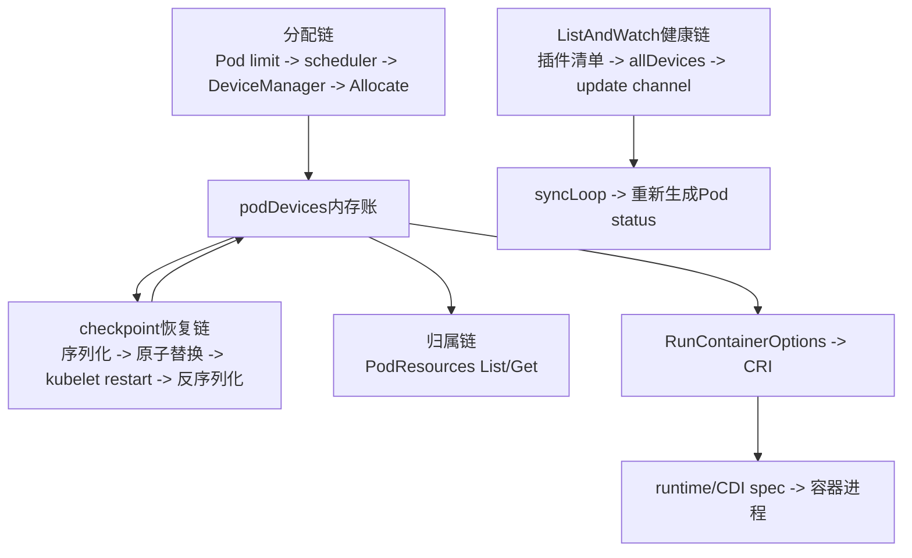

# 第 17 课：checkpoint、健康状态、PodResources 与 CDI 恢复账本

> 主案例：GPU 训练 Pod 仍在运行，kubelet 重启后 Node 的 GPU 数量短暂归零，PodResources、Pod status 与容器内实际状态又给出了不同答案  
> 主线源码：`pkg/kubelet/cm/devicemanager/{manager.go,pod_devices.go,checkpoint/*}`、`pkg/kubelet/checkpointmanager/*`、`pkg/kubelet/apis/podresources/*`、`pkg/kubelet/cm/container_manager*.go`、`pkg/kubelet/cm/dra/*`  
> 源码基线：`301946d15e67a4a2e8a5fb8292eb836acd366d78`（`v1.37.0-alpha.0-280-g301946d15e6`）  
> 本课深度：S3，读穿“内存分配账 -> 磁盘恢复账 -> 健康投影 -> PodResources 暴露 -> CDI/DRA 分流”  
> 前置断点：第 16 课已经读到 `podDevices.insert` 保存 device IDs 与完整 `ContainerAllocateResponse`，本课从“为什么还必须落盘、重启后怎样恢复”继续

---

## 0. 生产现场：四份证据为什么能同时成立

凌晨 02:03，`gpu-node-07` 上的 kubelet 因配置变更重启。值班同学在几分钟内看到：

```text
02:02
  训练Pod: Running
  Node: nvidia.com/gpu Capacity=8, Allocatable=8

02:03
  kubelet重启
  训练容器没有立即退出

02:03:20
  Node: nvidia.com/gpu Capacity=0, Allocatable=0
  旧训练Pod仍然Running

02:04
  Device Plugin重新注册并发送第一份ListAndWatchResponse
  Node: nvidia.com/gpu Capacity=8, Allocatable=8

02:05
  PodResources仍能查到训练容器与一个device ID的归属
  Pod status中的allocatedResourcesStatus显示Healthy
  但训练日志出现CUDA访问错误
```

这组现象并不自相矛盾，因为它混合了四套不同事实：

1. API Server 中的 Node 数量账；
2. kubelet DeviceManager 当前内存账；
3. Node 本地 checkpoint 恢复账；
4. runtime 与进程当前实际使用设备的运行事实。

`PodResources` 和 `allocatedResourcesStatus` 还是从 kubelet 内存账投影出来的接口，不是重新进入容器验证 CUDA。

因此：

```text
checkpoint恢复成功
  != Device Plugin已经重注册
  != 设备当前健康
  != CDI spec当前仍可解析
  != 运行中的CUDA进程一定还能访问GPU
```

本课的任务不是背一个文件名，而是学会回答：

- kubelet 重启后到底恢复了什么；
- checkpoint 为什么既重要又不能被当作数据库；
- 设备健康变化怎样进入 Pod status，又在哪些分支不会及时进入；
- PodResources 能证明哪一层、不能证明哪一层；
- 传统 Device Plugin 与 DRA 的 CDI、checkpoint、健康语义为什么不能混讲；
- 怎样在生产上只读取证，而不通过删除 checkpoint“试试看”。

---

## 1. 先排除三个同名概念

GPU 场景里“checkpoint”至少可能指三件事。

| 名称 | 保存什么 | 本课是否深入 |
|---|---|---|
| DeviceManager checkpoint | Pod/container/resource 到 device IDs、AllocateResponse 的节点本地分配账 | 是 |
| 训练任务 checkpoint | 模型权重、优化器状态、训练步数等应用数据 | 否 |
| container checkpoint | CRIU 等机制保存容器进程状态 | 否 |

`kubelet_internal_checkpoint` 不保存：

- 模型权重；
- CUDA context；
- 显存内容；
- 训练进度；
- 容器进程内存；
- GPU 驱动内部状态。

它解决的是“kubelet 重启后不要把同一个逻辑设备又分给另一个 Pod”，不是“训练任务从第 4000 step 恢复”。

后面说“不能随便 drain 长训练 Pod”时，检查的是**应用训练 checkpoint**；本课说“不能随便删除”的是**DeviceManager 分配 checkpoint**。两者必须在口头表达中加前缀。

---

## 2. 四套事实源：先确定谁在回答什么

### 2.1 四本账

| 账本 | 主要载体 | 回答的问题 | 不回答的问题 |
|---|---|---|---|
| 调度数量账 | Pod spec、Node Capacity/Allocatable、scheduler cache | 这个 Pod 请求几个资源单位，Node 是否能按数量接收 | 具体 ID、runtime 注入、当前 CUDA 可用性 |
| kubelet 实时设备账 | `allDevices`、`healthyDevices`、`unhealthyDevices`、`podDevices`、`allocatedDevices` | 当前插件清单、健康集合、谁占了哪些 ID | 跨重启持久性、容器进程是否真的可用 |
| 磁盘恢复账 | `kubelet_internal_checkpoint` 或 DRA state | kubelet 重启后如何恢复已经确认的本地分配关系 | 最新硬件健康、当前 CDI spec、runtime 实际状态 |
| 运行与暴露证据 | Pod status、PodResources、CRI inspect、容器内 CUDA、DCGM | 对外看到了什么、runtime 与进程现在怎样 | 任意一份证据都不能单独覆盖另外三账 |

“四本账”不表示四个都同等权威：

- Node status 对 scheduler 数量判断权威；
- `podDevices` 对传统 DeviceManager 当前已确认分配权威；
- checkpoint 对下一次 kubelet 启动的恢复输入权威；
- runtime/进程证据对“容器此刻能否使用 GPU”更接近最终事实；
- PodResources 与 Pod status 是投影接口，不是第五个分配器。

### 2.2 四条证据链



排障时必须先说自己正在验证哪条链。

例如：

- `Node Allocatable=8` 属于调度数量链；
- checkpoint 中有一个 ID 属于恢复链；
- `allocatedResourcesStatus=Healthy` 属于健康投影链；
- PodResources 查到 ID 属于归属链；
- 容器内 CUDA kernel 成功才接近运行事实链。

把不同链上的成功证据直接连成因果，是 GPU 运维最常见的误诊来源。

---

## 3. 源码阅读地图：按状态流读，不从 JSON 开始猜

建议按下面顺序跳读：

```text
1. checkpoint schema
   pkg/kubelet/cm/devicemanager/checkpoint/checkpoint.go
     PodDevicesEntry
     checkpointData
     Data

2. 内存账与protobuf转换
   pkg/kubelet/cm/devicemanager/pod_devices.go
     toCheckpointData
     fromCheckpointData
     deviceRunContainerOptions
     getContainerDevices

3. 写入、读取、启动恢复
   pkg/kubelet/cm/devicemanager/manager.go
     writeCheckpoint
     readCheckpoint
     Start
     GetCapacity
     ShouldResetExtendedResourceCapacity

4. 通用checkpoint落盘
   pkg/kubelet/checkpointmanager/checkpoint_manager.go
   pkg/kubelet/util/store/filestore.go
   pkg/kubelet/checkpointmanager/checksum/checksum.go

5. 健康投影
   pkg/kubelet/cm/devicemanager/manager.go
     genericDeviceUpdateCallback
     UpdateAllocatedResourcesStatus
   pkg/kubelet/cm/container_manager_linux.go
   pkg/kubelet/kubelet.go
   pkg/kubelet/kubelet_pods.go

6. PodResources
   pkg/kubelet/apis/podresources/server_v1.go
   pkg/kubelet/apis/podresources/server_v1alpha1.go
   pkg/kubelet/server/server.go
   staging/src/k8s.io/kubelet/pkg/apis/podresources/v1/api.proto

7. DRA边界
   pkg/kubelet/cm/dra/manager.go
   pkg/kubelet/cm/dra/claiminfo.go
   pkg/kubelet/cm/dra/healthinfo.go
```

这条顺序先回答“数据从哪里来、怎样恢复”，再回答“怎样被看见”。如果先从 API 输出倒推，很容易误以为 PodResources 自己维护了一份设备数据库。

---

## 4. 三种本地路径不要写成同一个 `root-dir`

### 4.1 传统 DeviceManager checkpoint 是硬编码路径

`NewManagerImpl` 先使用 Device Plugin API 常量：

```go
socketPath := pluginapi.KubeletSocket
```

当前 Linux 常量是：

```go
DevicePluginPath = "/var/lib/kubelet/device-plugins/"
KubeletSocket    = DevicePluginPath + "kubelet.sock"
```

`newManagerImpl` 再从 socket path 拆出 `checkpointdir`：

```go
manager.checkpointdir, _ = filepath.Split(server.SocketPath())
```

所以默认传统 checkpoint 是：

```text
/var/lib/kubelet/device-plugins/kubelet_internal_checkpoint
```

即使 kubelet 使用非默认 `--root-dir=/data/kubelet`，当前传统 DeviceManager 路径仍不是：

```text
/data/kubelet/device-plugins/kubelet_internal_checkpoint
```

这是生产取证很容易找错目录的地方。

### 4.2 PodResources 跟随 kubelet root

`getPodResourcesDir` 使用：

```go
filepath.Join(kl.getRootDir(), "pod-resources")
```

socket 因此是：

```text
KubeletRootDir/pod-resources/kubelet.sock
```

默认 root 下通常为：

```text
/var/lib/kubelet/pod-resources/kubelet.sock
```

### 4.3 DRA state 也跟随 kubelet root

ContainerManager 构造 DRA manager 时直接传入：

```go
dra.NewManager(logger, kubeClient, nodeConfig.KubeletRootDir)
```

当前主要文件是：

```text
KubeletRootDir/dra_manager_state
KubeletRootDir/dra_health_state
```

最终路径表：

| 数据 | 当前路径来源 | 是否跟随 `--root-dir` |
|---|---|---:|
| 传统 Device Plugin checkpoint | Device Plugin 固定 socket 目录 | 否 |
| PodResources socket | `kl.getRootDir()` | 是 |
| DRA allocation state | `KubeletRootDir` | 是 |
| DRA health state | `KubeletRootDir` | 是 |

不能只执行一次 `find /var/lib/kubelet` 就断言“没有 DRA 或没有 PodResources”；必须先确认 kubelet 实际 root。

---

## 5. checkpoint schema：一条记录不是“一个 GPU”

当前 schema 的核心是：

```go
type DevicesPerNUMA map[int64][]string

type PodDevicesEntry struct {
    PodUID        string
    ContainerName string
    ResourceName  string
    DeviceIDs     DevicesPerNUMA
    AllocResp     []byte
}

type checkpointData struct {
    PodDeviceEntries  []PodDevicesEntry
    RegisteredDevices map[string][]string
}

type Data struct {
    Data     checkpointData
    Checksum checksum.Checksum
}
```

一条 `PodDevicesEntry` 的身份是：

```text
PodUID
  + ContainerName
  + ResourceName
```

它下面可以有多个 NUMA key，每个 key 又可以有多个 opaque device IDs。

例如概念上可能是：

```text
PodUID: 7d9f-demo
ContainerName: trainer
ResourceName: nvidia.com/gpu
DeviceIDs:
  NUMA 0:
    GPU-opaque-id-a
AllocResp:
  protobuf bytes
```

需要注意：

- `DeviceIDs` 的 key 是 NUMA node ID，不是 GPU index；
- 无 topology 的设备使用 DeviceManager 内部保留 key；
- device ID 仍由插件定义，可能是 GPU UUID、MIG UUID 或其他逻辑 ID；
- JSON 中 `[]byte` 会编码成字符串，不能把它当作可直接阅读的嵌套 JSON；
- schema 当前源码仍没有显式版本字段，兼容性依赖实现与测试。

### 5.1 `RegisteredDevices` 的名字容易让人误解

写 checkpoint 时：

```go
for resource, devices := range m.healthyDevices {
    registeredDevs[resource] = devices.UnsortedList()
}
```

所以 value 当时确实是 healthy IDs。

但读取时：

```go
for resource := range registeredDevs {
    m.healthyDevices[resource] = sets.New[string]()
    m.unhealthyDevices[resource] = sets.New[string]()
    m.endpoints[resource] = endpointInfo{
        e: newStoppedEndpointImpl(resource),
        opts: nil,
    }
}
```

读取逻辑只用 resource key，旧 value 并没有恢复为 healthy 集合。

大白话：

```text
checkpoint记得：
  “这个Node以前注册过nvidia.com/gpu”

checkpoint不敢声称：
  “上次那8个ID现在仍然健康”
```

这就是 kubelet 重启后容量先归零、等待插件首包的源码原因。

---

## 6. `AllocResp []byte`：恢复的不只是 device ID

### 6.1 写入前把 protobuf 序列化

`podDevices.toCheckpointData` 对每个已确认分配执行：

```go
allocResp, err := proto.Marshal(devices.allocResp)
```

保存的对象是完整 `ContainerAllocateResponse`，可能包含：

- `Envs`；
- `Mounts`；
- `Devices`；
- `Annotations`；
- `CdiDevices`。

第 16 课已经读过：创建或重建容器配置时，`deviceRunContainerOptions` 会重新聚合这些字段。因此只保存 ID 不够；如果 kubelet 重启后不再调用一次新的 Allocate RPC，它还需要知道原插件要求怎样注入容器。

### 6.2 CDI 恢复的精确边界

假设 AllocateResponse 中有：

```text
nvidia.com/gpu=GPU-opaque-id-a
```

checkpoint 会保留这个 fully-qualified CDI name。恢复后，DeviceManager 能再次把这个 name 放入 `RunContainerOptions.CDIDevices`，再交给 CRI。

但 checkpoint 不保存：

- `/etc/cdi` 或 `/var/run/cdi` 中的 CDI spec；
- spec 展开后的 mounts/devices/hooks；
- containerd 当前 CDI cache；
- runtime 已经创建的 OCI bundle；
- 容器内最终看到的 `/dev/nvidia*`。

所以：

```text
checkpoint中有CDI name
  + runtime当前找不到对应CDI spec
  = 新建/重建container时仍可能unknown CDI device
```

运行中的旧容器可能暂时不受影响，因为它的 OCI 配置早已生成；同一个 Pod 后续 container restart 却可能失败。这是典型的“同 Pod 前后两次创建结果不同”。

### 6.3 原文件属于敏感节点数据

原始 checkpoint 可能间接包含：

- GPU UUID 或 MIG UUID；
- host device path；
- host mount path；
- 插件注入环境变量；
- annotation；
- CDI names；
- Pod UID 与 container 映射。

因此生产规则是：

- 不把原文件贴到工单、聊天群或公共仓库；
- 不通过普通应用 Pod 挂载；
- 不用在线 JSON 格式化网站解析；
- 取证优先记录 owner、mode、size、mtime 和相关日志；
- 确需内容级分析时，在批准的 Node 本地、受控 root 会话中做脱敏派生，原件不外发。

---

## 7. 写 checkpoint 的三个真实触发点

当前 `manager.go` 中 `writeCheckpoint` 只有三类调用点。

| 触发点 | 为什么写 | 备注 |
|---|---|---|
| `genericDeviceUpdateCallback` | 插件发来一份 ListAndWatch 设备清单 | 即使没有新分配，也会刷新 registered resources |
| `allocateContainerResources` 末尾 | 本轮至少有新 device IDs 完成 Allocate 并插入 `podDevices` | 多 resource 全部循环完成后才写 |
| `GetCapacity` 清理过期 stopped endpoint | 删除已经失活超过宽限期的 resource | 只有后续调用 `GetCapacity` 才实际清理并写 |

以下动作本身不立即写：

- `PluginConnected`；
- `PluginDisconnected`；
- 仅调用 `UpdateAllocatedDevices` 清掉终止 Pod；
- 容器复用已有 ID、没有新 Allocate；
- 只读取 PodResources `Get`；
- 从 checkpoint 恢复本身。

### 7.1 `UpdateAllocatedDevices` 的隐藏一致性窗口

它会：

```text
读取activePods
  -> 从podDevices删除已终止Pod
  -> 用剩余podDevices重建allocatedDevices
```

但函数末尾没有 `writeCheckpoint`。

于是可能出现：

```text
内存账：已删除终止Pod
磁盘账：仍保留终止Pod
```

直到下一次 ListAndWatch、新分配或过期 resource 清理触发写盘，磁盘才收敛。

如果恰好在这个窗口 kubelet 再重启，旧条目会被重新读回；后续 active Pod 清理还能再次纠正，但不能把这个过程描述成实时强一致。

### 7.2 多 resource 分配仍不是事务

第 16 课已经看到：

```text
resource A Allocate成功并insert
resource B Allocate失败
  -> 函数提前return
  -> 本轮末尾writeCheckpoint没执行
```

反过来：

```text
所有Allocate成功并insert
writeCheckpoint失败
  -> Allocate函数返回error
  -> 内存podDevices仍有记录
  -> 插件外部副作用也可能已经发生
```

checkpoint 不是回滚日志，也不是两阶段提交记录。

---

## 8. 落盘过程：哪里原子，哪里不保证

### 8.1 DeviceManager 先做内存快照

`writeCheckpoint` 先锁住 Manager：

```go
m.mutex.Lock()
registeredDevs := make(map[string][]string)
for resource, devices := range m.healthyDevices {
    registeredDevs[resource] = devices.UnsortedList()
}
data := checkpoint.New(
    m.podDevices.toCheckpointData(logger),
    registeredDevs,
)
m.mutex.Unlock()
```

然后才进入 checkpoint manager 写盘。这样避免持有 DeviceManager 大锁做磁盘 I/O。

代价是：

- 快照完成后，内存可能继续变化；
- 文件代表某一个时刻的快照，不是持续同步镜像；
- 快照没有 generation 或 timestamp；
- 不能仅凭文件 mtime 精确还原每个内存事件的先后。

进一步的源码推论：checkpoint manager 的 mutex 只串行化实际文件操作，没有给 DeviceManager 快照编号。并发写请求的落盘顺序取决于它们何时获得 checkpoint manager 的锁，不应把整个过程宣称为可线性化数据库事务。

### 8.2 CheckpointManager 只提供进程内互斥

`CreateCheckpoint`：

```go
manager.mutex.Lock()
defer manager.mutex.Unlock()

blob, err := checkpoint.MarshalCheckpoint()
if err != nil {
    return err
}
return manager.store.Write(checkpointKey, blob)
```

这把锁能防止同一个 manager 实例同时写同一 store，但没有：

- 跨 kubelet 进程文件锁；
- 多主写入协议；
- WAL；
- 版本冲突检测；
- 自动 backup/rollback。

同一 Node 不应有两个 kubelet 同时管理同一 Device Plugin 目录。

### 8.3 FileStore 的替换顺序

`writeFile` 做：

```text
在目标目录CreateTemp
  -> Write全部bytes
  -> 临时文件Sync
  -> Close
  -> Rename到正式文件
```

临时文件和正式文件在同一目录，因此 Linux/POSIX 常规语义下 `Rename` 能降低“读到半个正式文件”的概率。

但边界必须说完整：

- 源码没有对父目录做 `fsync`；
- 没有保留上一版 checkpoint；
- 没有跨进程锁；
- 底层文件系统、磁盘、断电语义仍会影响 durability；
- `Rename` 成功不等于所有外部副作用已事务提交；
- Windows 与非常规文件系统不能直接套用 Linux 本地 ext4/xfs 经验。

所以正确说法是“使用临时文件加原子替换模式”，不是“永远不会损坏”。

---

## 9. 权限与 checksum：不要把默认值说成安全保证

### 9.1 文件 mode

DefaultFs 的 `TempFile` 最终调用 `os.CreateTemp`。在常见 Unix 上，新临时文件通常以仅 owner 可读写的权限创建，再通过 rename 变成正式文件。

但 Kubernetes 这里没有对最终 checkpoint 显式执行 `Chmod`。生产结论应写成：

```text
预期通常较严格
  != 源码显式保证最终mode永远是0600
```

必须现场检查：

```bash
stat -Lc '%A %a %U:%G %s %y %n' \
  /var/lib/kubelet/device-plugins/kubelet_internal_checkpoint
```

还要考虑：

- 进程 umask；
- 目录是否早已存在；
- ACL；
- SELinux label；
- 容器运行时与 hostPath 暴露；
- 节点镜像初始化脚本。

### 9.2 目录 mode 的细节

`NewFileStore` 先调用：

```go
fs.MkdirAll(path, 0755)
```

Device Plugin server 后续创建目录时可能使用更严格 mode，但 `MkdirAll` 对已存在目录不会自动改权限。

因此不能只看某一处 `0750` 就承诺最终目录一定是 `0750`。安全基线必须用 `stat`、`getfacl` 与 SELinux 工具核实实际节点。

### 9.3 checksum 不是安全签名

`checksum.New` 使用：

```go
hash := fnv.New32a()
hashutil.DeepHashObject(hash, data)
```

最后把 32 位结果放进 `uint64` 类型。

它适合发现：

- 截断；
- 随机 bit flip；
- 数据与 checksum 不匹配。

它不能提供：

- 身份认证；
- 防恶意重写；
- 防碰撞安全；
- 机密性；
- 防重放。

拥有文件写权限的人可以同时修改 data 与 checksum。真正的安全边界仍是 Node root、目录权限、hostPath、MAC 策略与运维流程。

---

## 10. kubelet 重启恢复：只恢复“已分配”，不恢复“仍健康”

### 10.1 启动顺序

`ManagerImpl.Start` 的关键顺序：

```go
err := m.readCheckpoint(logger)
if err != nil {
    logger.Error(
        err,
        "Continue after failing to read checkpoint file. Device allocation info may NOT be up-to-date",
    )
}

return m.server.Start(logger)
```

也就是：

```text
先读checkpoint
  -> 再启动Device Plugin注册server
  -> 再等待插件注册和ListAndWatch首包
```

### 10.2 读回内存

`readCheckpoint`：

```go
podDevices, registeredDevs := cp.GetData()
m.podDevices.fromCheckpointData(logger, podDevices)
m.allocatedDevices = m.podDevices.devices()
```

恢复结果：

| 内存结构 | 是否从传统 checkpoint 恢复 |
|---|---:|
| `podDevices` 的 Pod/container/resource/IDs | 是 |
| 完整 AllocateResponse | 是，单条 protobuf 成功时 |
| `allocatedDevices` | 是，由 `podDevices.devices()` 重算 |
| resource name 曾经存在 | 是 |
| `healthyDevices` 的旧 IDs | 否，只建空 set |
| `unhealthyDevices` 的旧 IDs | 否，只建空 set |
| `allDevices` 与 topology/health | 否 |
| 活跃 plugin client | 否，使用 stopped endpoint 占位 |

### 10.3 为什么 Node 数量暂时为 0

对 checkpoint 中曾注册的 resource，恢复只创建：

```text
healthyDevices[resource]   = empty
unhealthyDevices[resource] = empty
endpoint                   = stopped placeholder
```

`GetCapacity` 因此会先返回 0/0。等插件重新注册并发来第一份 ListAndWatchResponse，才重建：

- `allDevices`；
- healthy set；
- unhealthy set；
- Capacity；
- Allocatable。

这个窗口的目标是保守：

```text
旧Pod的已分配ID继续被记住
新Pod暂时不要按旧健康数量进入Node
```

### 10.4 旧 Pod 为什么仍可能继续通过本地准入

`UpdatePluginResources` 发现 Pod 已在 `podDevices` 中时，会调用 `sanitizeNodeAllocatable`，保证本地 NodeInfo 至少能覆盖已经分配给旧 Pod 的资源。

因此：

- API 上短暂 0/0 会阻止 scheduler 继续放新 GPU Pod；
- kubelet 本地又不会仅因为暂时 0/0 就把已知旧分配当作全新请求；
- 这不代表旧容器一定健康，只是避免恢复窗口误拒绝已确认分配。

### 10.5 stopped endpoint 的五分钟不是定时删除任务

`endpointStopGracePeriod` 当前是五分钟。

但过期 resource 真正被删除发生在后续 `GetCapacity` 调用中：

```text
endpoint记录stopTime
  -> 时间超过五分钟
  -> 某次GetCapacity观察到过期
  -> 删除endpoint和健康集合
  -> 写checkpoint
```

所以“断连五分钟整就一定删完”不精确。五分钟是阈值，清理还需要后续容量收敛调用。

---

## 11. checkpoint 读取和写入失败矩阵

| 故障 | 当前传统 DeviceManager 行为 | 风险 |
|---|---|---|
| 文件不存在 | `readCheckpoint` 记录错误后返回 nil | 以空分配账启动 |
| 文件不可读 | 错误返回 `Start`，`Start` 记录后继续 | 以空分配账启动 |
| 外层 JSON 非法 | 解码失败，`Start` 继续 | 同上 |
| checksum 不匹配 | 校验失败，`Start` 继续 | 同上 |
| 某条 `AllocResp` protobuf 非法 | 跳过该条，其余条继续恢复 | 单个 Pod/container/resource 分配丢失 |
| 内存条目的 `allocResp=nil` | 写快照时跳过该条，其他条仍可写 | 文件可能“成功写入但少一条” |
| protobuf marshal 失败 | 跳过该条，其他条仍可写 | 同上 |
| 磁盘满或只读 | 写 checkpoint 返回 error | 内存分配和插件副作用未自动回滚 |
| rename 失败 | 正式文件保留旧版或写失败 | 下一次重启可能恢复旧账 |

### 11.1 为什么说传统路径是 fail-open

“fail-open”在这里特指：

```text
checkpoint读取错误
  -> 不阻止Device Plugin manager启动
  -> 继续等待插件注册
```

它不表示：

- 所有 Pod 一定继续正常；
- 所有 GPU 一定可用；
- kubelet 完全忽略错误；
- checkpoint 可以随便删。

真正风险是：空 `podDevices` 无法保留旧占用关系。随后插件第一份 ListAndWatchResponse 又会触发 `writeCheckpoint`，可能用当前空分配账覆盖损坏文件，导致原始证据和旧映射进一步丢失。

### 11.2 `ShouldResetExtendedResourceCapacity` 也不是完整校验

当前实现只是：

```go
checkpoints, err := m.checkpointManager.ListCheckpoints()
if err != nil {
    return false
}
return len(checkpoints) == 0
```

它检查“store 中是否一个 checkpoint 文件都没有”，并不会：

- 确认特定文件名存在；
- 读取并验证 checksum；
- 判断内容能否恢复；
- 比较 Node UID；
- 判断文件是不是传统 DeviceManager checkpoint。

所以：

```text
目录中有一个损坏文件
  != checkpoint有效

目录中有其他checkpoint
  != DeviceManager恢复账存在
```

### 11.3 生产恢复顺序

遇到读取损坏或写盘失败，默认顺序应是：

1. 固定 cluster context 与 Node；
2. cordon Node，阻止新增 workload；
3. 记录 kubelet、Device Plugin、runtime 同时间窗日志；
4. 只记录 checkpoint metadata，原件不外发；
5. 核对运行中 Pod、Pod UID、container、resource、runtime device 事实；
6. 评估是否有不可驱逐长训练任务和应用训练 checkpoint；
7. 由节点恢复流程决定 drain、离线备份和重建；
8. 只有在 kubelet 停止、Node 已隔离且恢复方案批准后，才可能处理原文件。

本课的安全实验不会删除、移动、改权限或编辑 checkpoint。

---

## 12. `ResourceHealthStatus` 在 API 中长什么样

当前字段位于：

```text
Pod.status.containerStatuses[]
  .allocatedResourcesStatus[]
    .name
    .resources[]
      .resourceID
      .health
      .message
```

概念示例：

```yaml
status:
  containerStatuses:
  - name: trainer
    allocatedResourcesStatus:
    - name: nvidia.com/gpu
      resources:
      - resourceID: GPU-opaque-id-a
        health: Healthy
```

当前基线中 `ResourceHealthStatus`：

- 1.31 Alpha，默认关闭；
- 1.36 Beta，默认开启；
- feature dependency 当前还要求 `DynamicResourceAllocation`；
- 还不是“发现 Unhealthy 就自动修复 Pod”的控制器。

API 类型允许：

```text
Healthy
Unhealthy
Unknown
```

但传统 Device Plugin 的当前实现并没有完整利用三态。

---

## 13. 传统 Device Plugin 健康投影的真实实现缺口

### 13.1 只更新普通 `ContainerStatuses`

`UpdateAllocatedResourcesStatus` 当前循环：

```go
for i, containerStatus := range status.ContainerStatuses {
    // 当前实现只遍历普通container status
}
```

它没有同时遍历：

- `status.InitContainerStatuses`；
- `status.EphemeralContainerStatuses`。

所以不能笼统说“所有 container 的设备健康都进入 Pod status”。

### 13.2 未找到当前设备时默认 Healthy

对 checkpoint 恢复出来的 ID，代码先设：

```go
health := pluginapi.Healthy
```

只有 `m.allDevices[resourceName][id]` 当前存在时，才用插件上报的 Health 覆盖。

于是：

```text
podDevices仍记得ID
allDevices暂时没有这个ID
  -> 当前传统实现会投影Healthy
```

这与很多人的直觉“查不到就 Unknown”相反。

### 13.3 任何非精确 Healthy 都变成 Unhealthy

后续转换：

```go
health := v1.ResourceHealthStatusHealthy
if d.Health != pluginapi.Healthy {
    health = v1.ResourceHealthStatusUnhealthy
}
```

传统实现只有二分：

```text
插件字符串精确等于Healthy -> Healthy
其他值                    -> Unhealthy
```

它不会产生 `Unknown`，也没有在这里填健康 message。

### 13.4 插件断连不会刷新 `allDevices` 或通知 Pod

`PluginDisconnected` 只做：

```text
healthy IDs移入unhealthy set
endpoint记录stopTime
```

它没有：

- 修改 `allDevices[resource][id].Health`；
- 找出受影响 Pod；
- 向 health update channel 发送通知。

结果可能是：

```text
Node Allocatable已经变成0
Pod allocatedResourcesStatus仍显示旧Healthy
```

Capacity 在宽限期内仍可能保留总设备数，因为 unhealthy 仍计入 Capacity；Allocatable 只数 healthy，所以归零。

### 13.5 设备从完整清单中“消失”也有缺口

`genericDeviceUpdateCallback` 每次重建整个 `allDevices[resource]`，但健康变化通知只遍历**新 response 中出现的 ID**。

如果旧 ID：

- 没有以 `Unhealthy` 再上报；
- 而是从新完整清单中直接省略；

那么它不会在本轮被加入 `podsToUpdate`。之后 Pod status 查询这个缺失 ID，又会走“默认 Healthy”分支。

正确的插件行为和运维判断是：

```text
明确上报Unhealthy
  与
从清单直接消失
```

不能当作健康投影完全等价。

### 13.6 raw device ID 跨 resource 碰撞

健康变化定位 Pod 时调用：

```go
m.podDevices.getPodAndContainerForDevice(deviceID)
```

参数没有 resource name。函数会遍历所有 resource，找到第一个包含相同 raw ID 的条目就返回。

如果两个不同 Device Plugin resource 恰好都使用 `device-0` 这种 ID，理论上可能把健康通知归到错误 Pod。GPU UUID 通常降低碰撞概率，但 kubelet 协议允许 opaque string，平台不能依赖“肯定全局唯一”。

这是当前实现的边界，不是建议人为构造碰撞做生产实验。

---

## 14. 健康变化怎样真正触发 Pod status 重算

完整链路：

```text
Device Plugin ListAndWatchResponse
  -> genericDeviceUpdateCallback
  -> 比较oldDevices与新Devices的Health
  -> 找到使用这些ID的PodUID
  -> m.update <- resourceupdates.Update
  -> ContainerManager fan-in
  -> kubelet syncLoopIteration
  -> HandlePodSyncs
  -> generateAPIPodStatus
  -> UpdateAllocatedResourcesStatus
  -> statusManager再推动API状态更新
```

### 14.1 DeviceManager channel 是 best effort 通知

DeviceManager 初始化：

```go
update: make(chan resourceupdates.Update, 100)
```

发送使用：

```go
select {
case m.update <- resourceupdates.Update{PodUIDs: podsToUpdate.UnsortedList()}:
default:
    logger.Error(
        errors.New("device update channel is full"),
        "discard pods info",
    )
}
```

channel 满时不会阻塞 ListAndWatch 处理，而是丢弃本次 Pod UID 通知。

必须区分两件事：

- 新设备清单与 Health 已经先写入 `allDevices`；
- “立刻重新同步这些 Pod status”这个触发信号可能丢失。

后续其他 Pod sync 可能再次生成正确状态，所以它不一定永久错误；但即时性没有保证。

### 14.2 ContainerManager 还有一层 fan-in

ContainerManager 把 DeviceManager、DRA manager 等更新合并到一个 buffer 为 10 的 channel。fan-in goroutine 向该 channel 发送时没有 `default`，下游慢会形成背压。

这与 DeviceManager 自己“buffer 100、满则丢”的语义不同。排障日志要区分：

- DeviceManager 明确记录 `device update channel is full`；
- ContainerManager fan-in 堵塞；
- kubelet syncLoop 是否消费；
- Pod status 写 API 是否延迟。

### 14.3 健康只是可观测状态，不是自动动作

当前传统链路不会因为 `Unhealthy` 自动：

- 重启 container；
- 驱逐 Pod；
- 迁移训练任务；
- 隔离 Node；
- 重启 Device Plugin；
- reset GPU；
- 清理 checkpoint。

平台若要基于它自动化，必须另做策略，并处理：

- 瞬态抖动；
- stale status；
- missing-ID 默认 Healthy；
- disconnect 不通知；
- channel 丢通知；
- 不可驱逐训练任务；
- 应用训练 checkpoint 是否可用。

在没有这些保护前，把 `allocatedResourcesStatus=Unhealthy` 直接接自动 drain 风险很高。

---

## 15. PodResources 服务：它是 Node 本地资源归属接口

### 15.1 socket 与服务注册

当前 kubelet 启动：

```text
KubeletRootDir/pod-resources/kubelet.sock
```

同一个 gRPC server 同时注册：

- `v1alpha1.PodResourcesLister`；
- `v1.PodResourcesLister`。

限流默认值：

```text
QPS   = 100
Burst = 10
```

它主要供 Node 本地的监控、拓扑与资源归属组件查询：

```text
Pod namespace/name
  -> container
  -> traditional device IDs / CPU IDs / memory blocks
  -> DRA dynamic resource metadata
```

### 15.2 本地 socket 不等于低风险

当前 server：

- 监听 Unix socket；
- 没有 gRPC TLS；
- 没有 Kubernetes ServiceAccount token 校验；
- 没有 SubjectAccessReview；
- 不经过 API Server RBAC；
- 没有按 namespace 隔离返回结果。

所以：

```text
有权限连接socket
  = 可能查看这台Node上跨namespace的Pod资源归属
```

即使 hostPath 以 read-only 挂载，客户端仍然可以连接 socket 并调用只读 RPC。read-only 只阻止修改目录项，不会把 socket 查询变成无权限。

### 15.3 目录和 socket mode 不能靠猜

kubelet setup 会以 `0750` 创建 PodResources 目录；通用 Unix listener 创建 socket 后没有看到显式 `chmod` 到固定 mode。

最终访问能力仍受：

- 目录 owner/group/mode；
- socket 实际 mode 与 umask；
- ACL；
- SELinux/AppArmor；
- hostPath mount；
- Pod privilege；
- Node root 权限。

生产应检查实际 `stat`，而不是在文档里写死“socket 一定 0660”或“一定只有 root 可读”。

### 15.4 推荐暴露模型

只允许经过审查的 Node agent 使用：

- 明确 ServiceAccount 与 workload identity；
- 最小 hostPath，只挂 PodResources 目录；
- 尽量 read-only；
- 不共享给普通业务 sidecar；
- 禁止经 TCP 反向代理暴露；
- 输出先聚合/脱敏，再送到中心监控；
- 记录 agent image、版本和消费 API 版本。

PodResources socket 是节点资源拓扑的信任边界，不是“反正只读，谁都能挂”。

---

## 16. v1alpha1 与 v1：不是只差版本号

| 能力 | v1alpha1 | v1 |
|---|---|---|
| RPC | 只有 `List` | `List`、`Get`、`GetAllocatableResources` |
| Pod 集合 | `GetPods`，包含 kubelet 当前 Pod manager 中更多条目 | `List` 当前默认 `GetActivePods`；`Get` 也过滤 inactive Pod |
| 普通 app container | 有 | 有 |
| restartable init container | 无 | 有 |
| 普通 init container | 无 | 无 |
| ephemeral container | 无 | 无 |
| traditional device resource name/IDs | 有 | 有 |
| NUMA topology | 无 | 有 |
| exclusive CPU IDs | 无 | 有 |
| memory/hugepage blocks | 无 | 有 |
| DRA DynamicResources | 无 | 有，依赖 DRA 当前状态 |

生产新消费者应优先 v1。v1alpha1 保留兼容，不应据其输出断言“Node 上不存在 sidecar init 的设备占用”。

---

## 17. v1 `List`：一个查询为什么会改内存账

关键顺序：

```go
if p.useActivePods {
    pods = p.podsProvider.GetActivePods()
} else {
    pods = p.podsProvider.GetPods()
}

p.devicesProvider.UpdateAllocatedDevices()
```

然后才逐 Pod、container 读取资源。

### 17.1 当前默认 active Pods

`KubeletPodResourcesListUseActivePods` 在当前基线默认开启。List 因此排除 terminal/inactive Pods，减少过期 CPU/memory/device 映射。

旧消费者若依赖“已经终止但尚未从 pod manager 清理的 Pod”，升级后会看到行为变化。

### 17.2 List 的副作用

`UpdateAllocatedDevices` 会在 sources ready 时：

- 读取 active Pods；
- 删除 `podDevices` 中不再 active 的 Pod；
- 重建 `allocatedDevices`。

所以：

```text
调用PodResources List
  -> 可能触发传统DeviceManager内存GC
```

但它不立即写 checkpoint，于是 List 之后可能形成：

```text
PodResources投影：旧Pod已经不见
DeviceManager内存：旧条目已经删除
磁盘checkpoint：旧条目暂时还在
```

这正是四账模型的实际价值。

### 17.3 List 返回哪些 container

v1 当前返回：

1. restartable init containers，也就是 sidecar-style init；
2. 普通 app containers。

不返回：

- 已结束的普通 init container；
- ephemeral containers。

这不是遗漏一行代码的小差别，而是 API 的生命周期选择。GPU 初始化容器如果是普通 init，用过设备后允许生命周期复用，其历史占用不应被当作当前长期占用继续展示。

### 17.4 不是原子快照

List 会分别读取：

- active Pods；
- DeviceManager；
- CPUManager；
- MemoryManager；
- DRA manager。

没有统一 generation、timestamp 或全局锁。设备健康、Pod 生命周期、CPU pinning 可在调用期间变化。

另外 map/set 输出顺序不稳定，消费者应：

- 按 namespace/name/container/resource/deviceID 排序后比较；
- 不用数组下标当身份；
- 不把两次顺序变化当作设备迁移；
- 用采集时间窗而不是假设单点强一致。

---

## 18. v1 `Get`：单 Pod 查询仍不是 runtime inspect

请求只带：

```text
pod_namespace
pod_name
```

kubelet provider：

1. 从 pod manager 按 namespace/name 查 Pod；
2. 对 inactive Pod 返回不存在；
3. 内部使用真实 Pod UID 查询 DeviceManager/CPUManager/MemoryManager；
4. 返回 restartable init 与 app containers。

### 18.1 `Get` 不会先调用 `UpdateAllocatedDevices`

这与 List 不同。

因此在极短窗口内可能出现：

- List 已清理某旧映射；
- Get 读到当前活跃 Pod 的映射；
- 或 Pod 生命周期刚变化，Get 直接返回 not found。

不要假设 Get 是 List 的事务性子查询。

### 18.2 not found 是普通 error

当前实现：

```go
return nil, fmt.Errorf(
    "pod %s in namespace %s not found",
    req.PodName,
    req.PodNamespace,
)
```

它没有在这里显式构造 gRPC `codes.NotFound`。客户端应以实际返回行为兼容，不能硬编码“必然收到 NotFound status code”。

### 18.3 名字定位，UID 取账

API 请求没有 Pod UID，但内部最终以 Pod manager 返回对象的真实 UID 查设备。

这能避免同 namespace/name 重建后直接复用旧 UID 账。但采集端仍应同时记录：

- namespace；
- Pod name；
- Pod UID；
- Node name；
- container name；
- 采集时间。

只保存 Pod name 的 GPU 归属历史，在 rollout 或 Job 重建后会串账。

---

## 19. `GetAllocatableResources`：名字最容易骗人

当前 v1 返回：

```go
Devices: p.devicesProvider.GetAllocatableDevices()
CpuIds:  p.cpusProvider.GetAllocatableCPUs()
Memory:  p.memoryProvider.GetAllocatableMemory()
```

对于传统 DeviceManager：

```go
allDevices.Filter(healthyDevices)
```

它没有减去 `allocatedDevices`。

所以传统设备部分表示：

```text
当前已知且Healthy的设备全集
```

不是：

```text
当前还没有分给任何Pod的空闲设备
```

手算例子：

```text
插件上报8个Healthy IDs
其中6个已经分给Pod

GetAllocatableResources.devices:
  仍可返回8个Healthy IDs

DeviceManager本地可新分配候选:
  healthy - allocated = 2
```

这和 CPUManager 的 `GetAllocatableCPUs` 语义不能简单类比为同一个“free”概念。

### 19.1 MIG 与 time-slicing

返回的是插件广告的逻辑 device entries：

- MIG 模式可能是 MIG device IDs；
- time-slicing 可能是逻辑副本 ID；
- `nvidia.com/gpu` 也不保证每条都是整卡。

不能用返回 entry 数直接推导：

- 物理卡数量；
- 剩余显存；
- SM 利用率；
- NVLink 拓扑；
- 可再接纳的模型副本数。

### 19.2 这里没有 DRA DynamicResources 字段

当前 `AllocatableResourcesResponse` proto 只有：

- devices；
- cpu_ids；
- memory。

DRA claim/device 归属出现在每个 container 的 `DynamicResources`，不是这个 RPC。

---

## 20. PodResources 到底能证明什么

| PodResources 证据 | 可以证明 | 不能证明 |
|---|---|---|
| List 有 Pod/container/device ID | kubelet 当前传统分配账把该 ID 归给该 container | 容器此刻能访问设备 |
| topology 有 NUMA ID | checkpoint/DeviceManager 保存了 NUMA 关联 | NVLink/NVSwitch 拓扑 |
| Get 返回 CPU IDs | CPUManager 当前有 exclusive CPU 归属 | 容器 CPU 利用率 |
| GetAllocatable 返回 8 个设备 | 当前 DeviceManager 认为 8 个 ID Healthy | 还有 8 个空闲 |
| DynamicResources 有 claim | DRA manager 当前能映射该 container 与 claim/device | driver 已成功完成所有运行时动作 |
| List 没有某 terminal Pod | active-Pod 过滤或内存 GC 已生效 | checkpoint 磁盘中一定没有旧条目 |

PodResources 不返回传统设备的：

- AllocateResponse env；
- host mounts；
- device mappings；
- annotations；
- CDI names；
- 当前 Health；
- runtime container ID；
- CUDA 可用性。

因此它适合做“GPU 指标归属的一个输入”，不能独立做最终健康判定。

---

## 21. 一个旧材料校准：DynamicResources 现在由谁控制

仓库旧笔记可能把 `KubeletPodResourcesDynamicResources` 描述成“是否在 PodResources 中返回 DRA”的直接运行时开关。

当前 commit 中：

- 这个 feature 仍在 `pkg/features/kube_features.go` 定义和注册；
- 已进入 GA、锁定默认值的生命周期；
- 除 feature 定义/注册外，当前源码没有运行路径再读取它；
- `GetDynamicResources` 实际检查的是 `DynamicResourceAllocation`；
- 然后从 `draManager.GetContainerClaimInfos` 读取 claim state。

因此当前精确说法是：

```text
PodResources是否出现DynamicResources
  主要取决于：
    DynamicResourceAllocation是否启用
    DRA manager是否存在
    container与ResourceClaim是否有关联
    claim info state是否可读取

  不是当前代码里再单独if KubeletPodResourcesDynamicResources
```

学习旧版本或排查混合版本集群时，必须回到目标 kubelet 的实际 commit，不能只看 feature 名字推断调用点。

---

## 22. 传统 Device Plugin 与 DRA：两套恢复与暴露链

| 维度 | 传统 Device Plugin | DRA |
|---|---|---|
| Pod 请求模型 | extended resource limit，例如 `nvidia.com/gpu: 1` | ResourceClaim、ResourceClaimTemplate，或受控的 extended-resource 转换 |
| 节点内分配主账 | `podDevices`、`allocatedDevices` | claim info cache、driver/device state |
| 分配 checkpoint | 固定 Device Plugin 目录下 `kubelet_internal_checkpoint` | `KubeletRootDir/dra_manager_state` |
| health state | Device Plugin ListAndWatch 的 Device.Health | DRA health stream 与 `dra_health_state` |
| 分配 state 读取损坏 | DeviceManager `Start` 记录后继续空账 | `NewManager` 返回错误，ContainerManager 构造失败 |
| health state 读取损坏 | 不单独持久化最新传统 Health | 记录错误并以空 health cache 继续 |
| 是否依赖 Node extended-resource Capacity | 是，传统 scheduler 数量路径 | 原生 DRA 不要求用同名 Node Capacity 表示设备 |
| CDI 持久化 | CDI names 在序列化 AllocateResponse 中 | CDI device IDs 在 claim/driver/device state 中 |
| PodResources 暴露 | `ContainerDevices`：resource name、IDs、NUMA | `DynamicResources`：claim、driver、pool、device、share ID、CDI names |
| Pod status ResourceID | 传统 opaque device ID | 优先第一个 CDI ID，否则 `driver/pool/device` |
| Health 三态 | 当前实现只产出 Healthy/Unhealthy | 可映射 Healthy/Unhealthy/Unknown |
| health message | 传统路径当前不填 | feature 开启时 DRA 可填并截断到 API 限制 |

### 22.1 两种“失败策略”不能互相套用

传统 DeviceManager：

```text
checkpoint损坏
  -> log
  -> 继续启动Device Plugin server
  -> 空分配账
```

DRA allocation state：

```text
newClaimInfoCache
  -> GetOrCreate读取dra_manager_state失败
  -> NewManager返回error
  -> ContainerManager构造返回error
```

所以不能写成“Kubernetes 的设备 checkpoint 损坏都 fail-open”。

DRA 自己又分成两本文件：

- `dra_manager_state`：分配/claim 恢复，读取失败会阻断 manager 构造；
- `dra_health_state`：健康缓存，读取失败记录后空缓存继续。

同样是 DRA，也不是一个统一策略。

### 22.2 DRA 原生设备不要求伪装成 Node 数量

传统路径必须把 resource 数量写进 Node Capacity/Allocatable，scheduler 才能按 extended resource 过滤。

原生 DRA 以 ResourceClaim、DeviceClass 和 ResourceSlice 等对象描述供给与请求。它的设备归属不需要再额外制造一个 `nvidia.com/gpu=8` 才能成立。

`DRAExtendedResource` 是兼容与迁移边界，不能反过来得出“所有 DRA 都仍靠传统 DeviceManager checkpoint”。

---

## 23. CDI 的三段生命：持久化、暴露、解析

### 23.1 传统 Device Plugin

```text
AllocateResponse.CdiDevices[].Name
  -> podDevices.allocResp
  -> protobuf写入传统checkpoint
  -> kubelet重启后反序列化
  -> deviceRunContainerOptions
  -> RunContainerOptions.CDIDevices
  -> CRI ContainerConfig.CDIDevices
  -> runtime查CDI spec并展开
```

但传统 PodResources 转换来自：

```text
podDevices.getContainerDevices
  -> resource name
  -> device IDs
  -> NUMA topology
```

它不读取 `allocResp.CdiDevices`。因此传统 checkpoint 中有 CDI name，不等于 PodResources `ContainerDevices` 会返回 CDI name。

### 23.2 DRA

DRA 的 claim info state 直接保存：

- driver name；
- pool name；
- device name；
- optional share ID；
- CDI device IDs。

`GetDynamicResources` 再转换为：

```text
DynamicResource
  claimName
  claimNamespace
  ClaimResource[]
    driverName
    poolName
    deviceName
    shareId
    cdiDevices[]
```

所以 PodResources 中看到 CDI names，首先要确认它位于：

```text
containers[].dynamicResources[].claimResources[].cdiDevices[]
```

不能去传统 `containers[].devices[]` 里找。

### 23.3 当前 DRA 转换还有一个累计边界

当前 `container_manager_linux.go` 的循环大意是：

```go
for driverName, driverState := range containerClaimInfo.DriverState {
    var cdiDevices []*podresourcesapi.CDIDevice
    for _, device := range driverState.Devices {
        for _, cdiDeviceID := range device.CDIDeviceIDs {
            cdiDevices = append(cdiDevices, &podresourcesapi.CDIDevice{
                Name: cdiDeviceID,
            })
        }
        resources := &podresourcesapi.ClaimResource{
            CdiDevices: cdiDevices,
            DriverName: driverName,
            PoolName:   device.PoolName,
            DeviceName: device.DeviceName,
        }
        claimResources = append(claimResources, resources)
    }
}
```

`cdiDevices` 在同一 driver 的 device 循环外创建。于是同一个 driver 有多个 device 时，后一个 `ClaimResource` 当前可能携带前面 device 已累计的 CDI names。

这是根据当前代码结构得出的实现边界；现有定向测试没有单独锁定“多个 device 的 CDI 列表必须逐 device 隔离”。消费者不要仅凭数组位置把每个 CDI name 反向归因到唯一 device，应同时保留 driver/pool/device 三元组并校准目标版本。

### 23.4 Pod status 的 DRA ResourceID 也不总是 device name

当前 `buildResourceHealth`：

```go
if len(device.CDIDeviceIDs) > 0 {
    resourceHealth.ResourceID = v1.ResourceID(device.CDIDeviceIDs[0])
} else {
    resourceHealth.ResourceID = v1.ResourceID(
        fmt.Sprintf("%s/%s/%s", driverName, device.PoolName, device.DeviceName),
    )
}
```

所以 DRA health 的 `resourceID`：

- 有 CDI ID 时优先第一个 CDI ID；
- 没有时才回退到 driver/pool/device。

做跨 API join 时不能默认 `resourceID == deviceName`。

---

## 24. 全链证据矩阵：每份证据只证明一层

| 证据 | 主要事实源 | 能证明 | 不能直接证明 |
|---|---|---|---|
| Pod spec limit/claim | API 调度账 | 请求模型 | 已经分配 |
| Node Capacity/Allocatable | kubelet到API的数量投影 | 当前可调度数量视图 | 空闲 ID、容器可见 |
| Device Plugin first ListAndWatch 日志 | 插件与 kubelet | 插件给了完整清单 | Node status已发布、Pod已分配 |
| Allocate RPC 日志 | kubelet与插件 | 请求/响应到该 RPC | checkpoint成功、CRI成功 |
| checkpoint metadata | 文件系统 | 文件存在、owner/mode/mtime/size | 内容有效、checksum通过 |
| checkpoint 内容级离线分析 | 恢复账 | 分配映射与 AllocateResponse | 当前 Health、runtime实际状态 |
| Pod `allocatedResourcesStatus` | kubelet健康投影 | 最近一次生成的分配健康状态 | 即时硬件健康、自动修复发生 |
| PodResources List/Get | kubelet内存账投影 | Pod/container资源归属 | runtime已应用、设备空闲 |
| PodResources GetAllocatable | 当前 manager 资源视图 | healthy traditional IDs 等 | `healthy - allocated` |
| CRI inspect | runtime metadata | runtime对象与配置 | CUDA kernel一定能成功 |
| CDI spec/list | Node runtime配置 | name当前可解析 | 已运行容器使用的实时状态 |
| 容器内 `nvidia-smi` | 容器用户态到driver的一部分链路 | 管理库能查询设备 | 训练 kernel、显存容量、模型兼容 |
| 最小 CUDA workload | 应用运行链 | 该 workload 能提交并完成 kernel | 长时间稳定、所有卡健康 |
| DCGM/Xid/ECC | 监控/驱动健康证据 | 特定故障与指标 | kubelet分配账一定正确 |

### 24.1 四个身份锚点

采证前必须固定：

1. cluster context；
2. Node name；
3. namespace、Pod name、Pod UID；
4. container name、resource name 与同一时间窗。

device ID 属于敏感基础设施标识，中心记录若不需要原值，应保存不可逆 hash 或聚合计数。不要为了“以后可能有用”把所有 GPU UUID、CDI names 和 host path 原样汇总到普通日志平台。

---

## 25. 安全只读实验一：固定 context 与 Node 采 Kubernetes 证据

### 25.1 实验目标

只回答：

- 目标 Pod 是否真的在指定 Node；
- Node 的 GPU Capacity/Allocatable 是多少；
- Pod status 是否有 `allocatedResourcesStatus`；
- 相关 Event 时间线怎样。

不做：

- cordon/drain；
- restart；
- debug Pod；
- exec 进入业务容器；
- 修改 Node status；
- 读取 checkpoint 内容。

下面脚本所有集群请求都显式带 `--context`；它会同时校验 Node name/UID、Pod name/UID 与 Pod 的 `spec.nodeName`，任一身份不一致就停止。

### 25.2 PowerShell 只读脚本

```powershell
param(
    [Parameter(Mandatory = $true)]
    [ValidateNotNullOrEmpty()]
    [string]$Context,

    [Parameter(Mandatory = $true)]
    [ValidateNotNullOrEmpty()]
    [string]$Node,

    [Parameter(Mandatory = $true)]
    [ValidateNotNullOrEmpty()]
    [string]$NodeUID,

    [Parameter(Mandatory = $true)]
    [ValidateNotNullOrEmpty()]
    [string]$Namespace,

    [Parameter(Mandatory = $true)]
    [ValidateNotNullOrEmpty()]
    [string]$Pod,

    [Parameter(Mandatory = $true)]
    [ValidateNotNullOrEmpty()]
    [string]$PodUID
)

Set-StrictMode -Version Latest
$ErrorActionPreference = 'Stop'

function Invoke-KubectlJson {
    param(
        [Parameter(Mandatory = $true)]
        [string[]]$Arguments
    )

    $raw = & kubectl --context $Context @Arguments
    if ($LASTEXITCODE -ne 0) {
        throw "kubectl failed: $($Arguments -join ' ')"
    }
    $text = $raw -join [Environment]::NewLine
    return ($text | ConvertFrom-Json)
}

$capturedAt = Get-Date -Format 'yyyy-MM-ddTHH:mm:ss.fffK'
$nodeObject = Invoke-KubectlJson -Arguments @(
    'get', 'node', $Node, '-o', 'json'
)

if ($nodeObject.metadata.name -ne $Node) {
    throw "Node identity mismatch"
}
if ([string]$nodeObject.metadata.uid -ne $NodeUID) {
    throw "Node UID mismatch: expected $NodeUID, got $($nodeObject.metadata.uid)"
}

$podObject = Invoke-KubectlJson -Arguments @(
    '--namespace', $Namespace, 'get', 'pod', $Pod, '-o', 'json'
)

if ([string]$podObject.metadata.namespace -ne $Namespace) {
    throw "Pod namespace mismatch: expected $Namespace, got $($podObject.metadata.namespace)"
}
if ([string]$podObject.metadata.name -ne $Pod) {
    throw "Pod name mismatch: expected $Pod, got $($podObject.metadata.name)"
}
if ([string]$podObject.metadata.uid -ne $PodUID) {
    throw "Pod UID mismatch: expected $PodUID, got $($podObject.metadata.uid)"
}
if ($podObject.spec.nodeName -ne $Node) {
    throw "Pod is on node $($podObject.spec.nodeName), not fixed node $Node"
}

$capacityProperty = $nodeObject.status.capacity.PSObject.Properties['nvidia.com/gpu']
$allocatableProperty = $nodeObject.status.allocatable.PSObject.Properties['nvidia.com/gpu']

[pscustomobject]@{
    CapturedAt = $capturedAt
    Context = $Context
    Node = $Node
    NodeUID = $nodeObject.metadata.uid
    GpuCapacity = if ($null -eq $capacityProperty) { 'absent' } else { $capacityProperty.Value }
    GpuAllocatable = if ($null -eq $allocatableProperty) { 'absent' } else { $allocatableProperty.Value }
}

[pscustomobject]@{
    Namespace = $Namespace
    Pod = $Pod
    PodUID = $podObject.metadata.uid
    Phase = $podObject.status.phase
    Node = $podObject.spec.nodeName
}

foreach ($containerStatus in @($podObject.status.containerStatuses)) {
    $allocatedProperty = $containerStatus.PSObject.Properties['allocatedResourcesStatus']
    if ($null -eq $allocatedProperty) {
        [pscustomobject]@{
            Container = $containerStatus.name
            Resource = 'none-reported'
            ResourceCount = 0
            HealthSummary = 'none-reported'
        }
        continue
    }

    foreach ($resourceStatus in @($allocatedProperty.Value)) {
        $resources = @($resourceStatus.resources)
        $healthSummary = $resources |
            Group-Object -Property health |
            ForEach-Object { "$($_.Name)=$($_.Count)" }

        [pscustomobject]@{
            Container = $containerStatus.name
            Resource = $resourceStatus.name
            ResourceCount = $resources.Count
            HealthSummary = $healthSummary -join ','
        }
    }
}

& kubectl --context $Context --namespace $Namespace get events `
    --field-selector "involvedObject.uid=$($podObject.metadata.uid)" `
    --sort-by='.metadata.creationTimestamp'

if ($LASTEXITCODE -ne 0) {
    throw 'kubectl get events failed'
}
```

调用示例：

```powershell
.\Collect-GpuLedger.ps1 `
    -Context 'prod-shanghai-readonly' `
    -Node 'gpu-node-07' `
    -NodeUID '11111111-1111-4111-8111-111111111111' `
    -Namespace 'ml-prod' `
    -Pod 'trainer-a-0' `
    -PodUID '22222222-2222-4222-8222-222222222222'
```

示例值只是演示参数形状。真实执行前必须把六个值改成已批准对象，并由第二人复核 context、Node name/UID 与 Pod name/UID。脚本先按名字读取，再强制比较预期 UID；同名对象已经重建时会停止，而不会把新对象证据记到旧对象名下。

脚本刻意不打印 `resourceID`，只统计数量和 Health，避免在普通终端记录 GPU UUID/CDI ID。若故障确实需要原 ID，应在受控证据系统中单独采集。

### 25.3 如何解释输出

| 组合 | 优先判断 |
|---|---|
| Node GPU absent，Pod status有旧 Healthy | 先查 kubelet/plugin重启窗口，不能宣布GPU健康 |
| Node 0/0，Pod仍Running | 可能是checkpoint恢复旧分配、插件尚未首包 |
| Pod status无字段 | 检查 feature、目标版本、container scope，不能直接说设备未分配 |
| Pod status Unhealthy，Node Allocatable下降 | 查 ListAndWatch 明确健康变化、插件日志和硬件证据 |
| Pod在别的Node | 立即停止本 Node 取证，重新固定身份 |

---

## 26. 安全只读实验二：Node 本地只看 metadata 与脱敏 PodResources

### 26.1 前置条件

只有同时满足以下条件才执行：

- 已有批准的 Node 只读取证会话；
- 已用上一实验固定并记录目标 Node name/UID 与 Pod name/UID，且已确认当前会话就是 `gpu-node-07`；
- 不临时创建 `kubectl debug node` Pod；
- 不新挂载 host root；
- 不安装软件；
- 节点已有 `grpcurl`、`jq` 与匹配 proto 时才查询 gRPC；
- 输出只留在批准的证据终端。

脚本不会 `cat`、`cp`、`mv`、`rm`、`chmod` checkpoint，也不会 restart kubelet/plugin。

### 26.2 只读脚本

```bash
set -euo pipefail

EXPECTED_NODE='gpu-node-07'
KUBELET_ROOT='/var/lib/kubelet'
DM_CHECKPOINT='/var/lib/kubelet/device-plugins/kubelet_internal_checkpoint'
PODRES_SOCKET="$KUBELET_ROOT/pod-resources/kubelet.sock"
PODRES_PROTO='/opt/kubernetes-protos/podresources/v1/api.proto'

ACTUAL_NODE="$(hostname -s)"
if [ "$ACTUAL_NODE" != "$EXPECTED_NODE" ]; then
  echo "node mismatch: expected=$EXPECTED_NODE actual=$ACTUAL_NODE" >&2
  exit 2
fi

echo 'DeviceManager directory metadata'
stat -c '%A %a %U:%G %y %n' /var/lib/kubelet/device-plugins

echo 'DeviceManager checkpoint metadata only'
if [ -e "$DM_CHECKPOINT" ]; then
  stat -c '%A %a %U:%G %s %y %n' "$DM_CHECKPOINT"
else
  echo 'checkpoint is absent'
fi

echo 'PodResources directory and socket metadata'
stat -c '%A %a %U:%G %y %n' "$KUBELET_ROOT/pod-resources"
if [ -S "$PODRES_SOCKET" ]; then
  stat -c '%A %a %U:%G %y %n' "$PODRES_SOCKET"
else
  echo 'podresources socket is absent or not a Unix socket'
  exit 3
fi

if ! command -v grpcurl >/dev/null 2>&1; then
  echo 'grpcurl is not preinstalled; stop before PodResources query'
  exit 0
fi

if ! command -v jq >/dev/null 2>&1; then
  echo 'jq is not preinstalled; stop before PodResources query'
  exit 0
fi

GRPCURL_HELP="$(grpcurl -help 2>&1 || true)"
case "$GRPCURL_HELP" in
  *'-unix'*) ;;
  *)
    echo 'approved grpcurl does not expose -unix; stop before PodResources query'
    exit 0
    ;;
esac

if [ ! -r "$PODRES_PROTO" ]; then
  echo "approved local proto is unavailable: $PODRES_PROTO"
  exit 0
fi

echo 'Traditional healthy device count, IDs redacted'
grpcurl \
  -plaintext \
  -unix \
  -max-time 10 \
  -import-path "$(dirname "$PODRES_PROTO")" \
  -proto "$(basename "$PODRES_PROTO")" \
  -d '{}' \
  "$PODRES_SOCKET" \
  v1.PodResourcesLister/GetAllocatableResources |
jq '
  [.devices[]? | {resourceName, deviceIds}] |
  group_by(.resourceName) |
  map({
    resourceName: .[0].resourceName,
    uniqueDeviceCount: ([.[].deviceIds[]] | unique | length)
  })
'

echo 'Single Pod attribution, device and CDI IDs redacted'
REQUEST='{"podName":"trainer-a-0","podNamespace":"ml-prod"}'
grpcurl \
  -plaintext \
  -unix \
  -max-time 10 \
  -import-path "$(dirname "$PODRES_PROTO")" \
  -proto "$(basename "$PODRES_PROTO")" \
  -d "$REQUEST" \
  "$PODRES_SOCKET" \
  v1.PodResourcesLister/Get |
jq '
  {
    pod: (.podResources | {namespace, name}),
    containers: [
      .podResources.containers[]? |
      {
        name,
        devices: [
          .devices[]? |
          {
            resourceName,
            deviceCount: (.deviceIds | length)
          }
        ],
        dynamicResources: [
          .dynamicResources[]? |
          {
            claimNamespace,
            claimName,
            resourceCount: (.claimResources | length)
          }
        ]
      }
    ]
  }
'
```

`KUBELET_ROOT` 必须先从目标 kubelet 的实际配置确认；本例使用默认值。`PODRES_PROTO` 是预先审批的本地 proto 位置，不存在就停止，不能临时从互联网下载。当前官方 `grpcurl` CLI 的 Unix Socket 形式是 `-unix /absolute/path/to.sock`，因此 address 参数传纯 socket 路径；脚本也先确认批准版本确实暴露 `-unix`，并给 RPC 设置 10 秒总超时。若批准版本不支持这一参数，应停止并按本地已审核手册调整，不能临时安装、改成未经验证的 `unix://` 变体或在生产节点上试错。

还要注意：PodResources v1 `Get` 的请求与响应都没有 Pod UID 字段。上面的单 Pod 查询只能紧跟上一实验已经通过 UID 校验的 namespace/name 使用，并限定在同一采集时间窗；如果 Pod 可能已经同名重建，必须停止并重新做 Kubernetes 身份校验，不能让 `REQUEST` 里的名字替代 UID 锚点。

### 26.3 为什么只看 checkpoint metadata

metadata 可以回答：

- 文件是否存在；
- owner/group；
- mode；
- size 是否为 0；
- mtime 是否接近故障时间。

它不能验证：

- JSON；
- checksum；
- 条目；
- AllocateResponse。

安全实验故意停在这里。内容级检查属于隔离节点后的恢复/取证流程，不属于日常巡检。

### 26.4 socket 查询的安全说明

虽然 RPC 是只读的，输出仍可能包含跨 namespace 的：

- Pod/container 名；
- device IDs；
- claim 名；
- CDI names；
- topology。

脚本通过 `jq` 只输出计数和身份摘要。不要移除脱敏 filter 后把原始响应送入普通日志平台。

---

## 27. 一致性窗口练习：同一分钟内怎样解释四账

假设时间线：

| 时间 | API 数量账 | 内存设备账 | 磁盘恢复账 | runtime 事实 |
|---|---|---|---|---|
| T0 | 8/8 | 8 healthy，Pod A 占 ID-a | Pod A -> ID-a | A 正常运行 |
| T1 kubelet停止 | API仍暂存旧值 | 进程内存消失 | 文件仍有 A -> ID-a | A 容器可能仍运行 |
| T2 kubelet启动、未收到插件首包 | 逐步变0/0 | 恢复 A -> ID-a；health清单空 | 文件仍有旧快照 | A 是否可用未知 |
| T3 PodResources Get | 可能0/0 | 可从 `podDevices` 投影 A -> ID-a | 无变化 | 未被验证 |
| T4 插件首包 | 稍后回8/8 | 重建设备与Health | 触发新快照 | 未被验证 |
| T5 CDI spec缺失、A容器重建 | 仍可能8/8 | 仍记得ID与CDI name | 仍有name | CRI创建可能失败 |

从这张表应得出：

1. API 数量变化可以落后于内存变化；
2. PodResources 可以在 Node 0/0 时仍返回旧 Pod 分配；
3. checkpoint 有 CDI name 不能替代 CDI spec；
4. 运行中的旧容器与即将重建的新容器可能表现不同；
5. 任何一列都不能单独宣布“GPU 恢复完成”。

生产恢复完成的口径至少要包含：

```text
插件首包已处理
  + Node数量已收敛
  + 旧Pod分配没有冲突
  + PodResources/Pod status解释一致
  + runtime/CDI证据正常
  + 受控CUDA验证通过或业务指标恢复
```

---

## 28. 本课针对性的 Go 语法

你不需要先学完整 Go，再读本章。只补下面七个语法点。

### 28.1 嵌套 map：类型从右向左读

```go
type DevicesPerNUMA map[int64][]string
```

读作：

```text
key: int64 NUMA node ID
value: string slice，也就是多个device IDs
```

再看：

```go
type resourceAllocateInfo map[string]deviceAllocateInfo
type containerDevices map[string]resourceAllocateInfo
```

从外到内：

```text
container name
  -> resource name
  -> deviceAllocateInfo
```

源码里 map 迭代顺序不稳定，所以 checkpoint 条目、PodResources entry 和 health resource 的数组顺序都不能被当作稳定身份。

### 28.2 `[]byte` 不是字符串

```go
AllocResp []byte
```

表示原始 bytes。写盘前：

```go
proto.Marshal(resp)
```

读回后：

```go
proto.Unmarshal(entry.AllocResp, allocResp)
```

`string(entry.AllocResp)` 不会自动把 protobuf 变成可读 JSON。生产上也不应为了“看懂”就把敏感 bytes 在线解码外发。

### 28.3 interface：checkpoint manager 不关心具体 schema

```go
type Checkpoint interface {
    MarshalCheckpoint() ([]byte, error)
    UnmarshalCheckpoint(blob []byte) error
    VerifyChecksum() error
}
```

只要具体类型实现这三个方法，就能交给通用 CheckpointManager。

DeviceManager 的 `checkpoint.Data` 自己知道字段；FileStore 只知道 bytes。这是“业务 schema”和“通用持久化”分层。

### 28.4 多返回值

```go
func (cp *Data) GetData() (
    []PodDevicesEntry,
    map[string][]string,
)
```

调用：

```go
podDevices, registeredDevs := cp.GetData()
```

左边两个变量按顺序接收。看到 `_` 时表示显式忽略某个返回值，例如：

```go
manager.checkpointdir, _ = filepath.Split(server.SocketPath())
```

### 28.5 `range` 值是副本，写回要靠下标

```go
for i, containerStatus := range status.ContainerStatuses {
    // containerStatus用于读
    status.ContainerStatuses[i].AllocatedResourcesStatus =
        append(status.ContainerStatuses[i].AllocatedResourcesStatus, resourceStatus)
}
```

`containerStatus` 是本轮值副本。真正修改 slice 中元素时，代码用 `status.ContainerStatuses[i]`。

这也是为什么阅读健康更新时要看最终写回对象，不能只看到局部变量就认为 API status 已改变。

### 28.6 非阻塞 channel send

```go
select {
case ch <- update:
default:
    // channel不能立即接收时走这里
}
```

有 `default` 的 send 不等待。它保护 ListAndWatch 主处理不被拖住，代价是通知可丢。

如果没有 `default`：

```go
target <- update
```

就可能阻塞，直到下游接收或 goroutine 被终止。

### 28.7 map 查找的 `value, ok` 与默认 Healthy

```go
if r, ok := m.allDevices[resourceName]; ok {
    if _, ok := r[id]; ok {
        health = m.allDevices[resourceName][id].Health
    }
}
```

`ok=false` 只表示 key 不存在。这里局部 `health` 在查找前被设为 Healthy，所以 key 缺失不会自动变 Unknown。

读 Go 时必须同时看：

1. 查找前默认值；
2. `ok` 分支；
3. 分支不进入时保留什么。

---

## 29. 源码测试证据：存在什么，缺什么

### 29.1 当前仓库已有的定向测试

| 包 | 测试 | 主要覆盖 |
|---|---|---|
| devicemanager | `TestCheckpoint` | 基本 checkpoint 写读 |
| devicemanager | `TestUpdateCapacityAllocatable` | 健康数量到 Capacity/Allocatable |
| devicemanager | `TestResetExtendedResource` | checkpoint 是否存在与 reset 判断 |
| devicemanager | `TestUpdateAllocatedResourcesStatus` | 传统设备健康写入 container status |
| devicemanager | `TestFeatureGateResourceHealthStatus` | feature 开关相关更新 |
| devicemanager | `TestEndpointSyncOnDisconnect` | endpoint 断连同步 |
| pod_devices | `TestDeviceRunContainerOptions` | AllocateResponse 合并到运行参数 |
| pod_devices | `TestGetContainerDevices` | ID/topology 暴露 |
| pod_devices | `TestGetPodAndContainerForDevice` | raw ID 反查 Pod/container |
| checkpointmanager | `TestCheckpointManager` | 通用 create/get/remove/list |
| podresources | `TestListPodResourcesV1` | v1 List |
| podresources | `TestListPodResourcesUsesOnlyActivePodsV1` | active Pod 过滤 |
| podresources | `TestListPodResourcesWithInitContainersV1` | restartable init |
| podresources | `TestAllocatableResources` | allocatable API |
| podresources | `TestGetPodResourcesV1` | v1 Get |
| podresources | `TestGetPodResourcesWithInitContainersV1` | Get 与 init scope |
| podresources | `TestListPodResourcesV1alpha1` | 旧 API |

### 29.2 不能由现有测试过度推导

当前没有看到专门锁定以下组合的测试：

- 传统 checkpoint 的 CDI name 完整 round trip；
- 损坏传统 checkpoint 经过 `ManagerImpl.Start` 后的全链行为；
- plugin disconnect 后 Pod status 必须立刻变化；
- 已分配 ID 从新清单消失时必须变 Unknown；
- DRA 同一 driver 多 device 时 CDI names 逐 device 隔离；
- 并发 checkpoint 快照的 generation 顺序。

没有测试不等于一定有 bug；它表示这些结论不能用“单测已经保证”来背书。

### 29.3 建议命令与本次执行状态

在匹配当前仓库 Go toolchain 的隔离开发环境中，可执行：

```powershell
Set-Location '<KUBERNETES_SRC>'

go test ./pkg/kubelet/cm/devicemanager `
    -run 'TestCheckpoint|TestUpdateCapacityAllocatable|TestResetExtendedResource|TestUpdateAllocatedResourcesStatus|TestFeatureGateResourceHealthStatus|TestEndpointSyncOnDisconnect' `
    -count=1

go test ./pkg/kubelet/checkpointmanager `
    -run 'TestCheckpointManager' `
    -count=1

go test ./pkg/kubelet/apis/podresources `
    -run 'TestListPodResourcesV1|TestListPodResourcesUsesOnlyActivePodsV1|TestListPodResourcesWithInitContainersV1|TestAllocatableResources|TestGetPodResourcesV1|TestGetPodResourcesWithInitContainersV1|TestListPodResourcesV1alpha1' `
    -count=1
```

本次写作环境实测 `go version` 为 `go1.19.4 windows/amd64`，而当前 `kubernetes/go.mod` 要求 `go 1.26.0`。因此本章**没有执行这些 Go 测试，也不声称 PASS**；本次校准来自静态源码与测试代码存在性检查。

---

## 30. GPU 指标归属：PodResources 是 join 输入，不是监控终点

你熟悉的 Java 平台要把请求指标归到 Pod，常用：

```text
Service/EndpointSlice
  + namespace/Pod UID
  + application labels
  + Prometheus target
```

GPU 平台要把 DCGM 指标归到 Pod，也需要一条 join 链：

```text
PodResources归属快照
  + Pod UID/namespace/container
  + Device Plugin的ID策略
  + DCGM或驱动侧设备标识
  + 同一Node与时间窗
```

### 30.1 传统 Device Plugin 的常见 join

```text
PodResources:
  Node
  namespace
  Pod name
  Pod UID（由采集端从Pod对象补）
  container
  resourceName
  deviceID

DCGM:
  Node/instance
  GPU UUID或MIG标识
  utilization/memory/Xid/ECC

配置事实:
  device ID strategy
  MIG strategy
  time-slicing配置
```

只有 device ID 与 DCGM label 的命名体系能对上，才能直接 join。若插件使用 index 而 DCGM 使用 UUID，必须有 Node 本地、同时间窗的受控 index-to-UUID 映射，不能把 `0` 永久绑定某块卡。

### 30.2 DRA 的 join

DRA PodResources 提供：

- claim namespace/name；
- driver；
- pool；
- device；
- share ID；
- CDI names。

监控系统要以 driver 定义的标识语义为准。CDI name 可能是 runtime 注入标识，不一定等于 DCGM 的物理 GPU UUID。

### 30.3 五个必须处理的漂移

1. Pod 同名重建：必须以 Pod UID 区分。
2. container restart：归属可能相同，runtime container ID 已变化。
3. kubelet restart：PodResources 恢复来自 checkpoint，Health 清单还未收敛。
4. MIG 重配置：device ID、resource name、监控实体都可能变化。
5. time-slicing：多个逻辑分配可共享物理 GPU，物理利用率不能简单平均归因。

### 30.4 推荐的数据模型

中心系统保存短生命周期映射：

| 字段 | 用途 |
|---|---|
| cluster/context identity | 防跨集群串账 |
| Node name/UID | 锚定节点生命周期 |
| namespace/Pod name/Pod UID | 锚定 workload |
| container name | 锚定容器 |
| resource name | 区分整卡、MIG profile、其他插件资源 |
| device ID hash | 在不暴露原 ID 时稳定 join |
| source API/version | 区分 v1alpha1、v1、DRA |
| observedAt/expiresAt | 表达 eventual consistency |
| confidence/reason | 表达当前是否处在 restart/health gap |

不要把一次 PodResources 响应写成永不过期的 CMDB。Pod 删除、设备重配、checkpoint 恢复都能使旧映射失效。

### 30.5 Health 仍需另一条链

PodResources 没有传统 device Health。指标归属成功只说明：

```text
“这条DCGM指标大概率属于这个Pod/container”
```

不说明：

```text
“kubelet认为它Healthy”
“应用一定正常”
“应该自动迁移”
```

健康判断仍要组合 Pod status、Device Plugin/DRA health、DCGM/Xid/ECC、runtime 与应用 SLO。

---

## 31. 八个生产故障推演

### 31.1 推演 A：kubelet 重启后 Node GPU 变成 0/0

已知：

```text
旧GPU Pod仍Running
Node nvidia.com/gpu从8/8变0/0
checkpoint文件存在
Device Plugin Pod也刚重启
```

先解释：

1. checkpoint 恢复旧 Pod 分配；
2. healthy/unhealthy/allDevices 没从文件恢复；
3. 插件首包前 `GetCapacity` 只能给 0/0；
4. 旧 runtime container 可能继续运行。

按顺序取证：

- kubelet Starting 时间；
- checkpoint metadata mtime；
- Device Plugin 注册与 first ListAndWatch 时间；
- Node status 收敛时间；
- 旧 Pod UID 与 PodResources 归属；
- runtime/业务是否正常。

不能做：

- 删除 checkpoint“让它重算”；
- 因 0/0 立即删除旧训练 Pod；
- 把 Pod status Healthy 当作插件已重连。

如果首包和 Node 数量在预期窗口内收敛，这是恢复窗口；如果长时间不收敛，cordon 后进入插件注册/Driver/Toolkit 排障。

### 31.2 推演 B：传统 checkpoint checksum 损坏

kubelet 日志：

```text
Continue after failing to read checkpoint file.
Device allocation info may NOT be up-to-date
```

随后插件又报告 8 个 Healthy。

风险：

- Node 数量可能恢复 8/8；
- `podDevices` 却是空；
- 旧运行容器仍可能占着真实 GPU；
- 新分配有重复占用风险；
- 第一份 ListAndWatch 还可能把空分配账写回正式文件。

处置优先级：

1. 立即固定 Node 并 cordon；
2. 不反复 restart kubelet；
3. 保留本地文件与日志证据；
4. 枚举旧运行容器与设备实际占用；
5. 评估 drain 代价；
6. 按批准的节点重建流程恢复。

“Capacity 已回 8”不能解除隔离，因为它只恢复了设备清单，不代表恢复了旧分配映射。

### 31.3 推演 C：Allocate 成功后 checkpoint 写失败

证据：

```text
Device Plugin日志显示Allocate成功
kubelet随后记录failed to write checkpoint
Pod准入返回error
磁盘接近满或filesystem只读
```

源码解释：

```text
插件RPC副作用可能已发生
  -> podDevices内存已经insert
  -> checkpoint写失败
  -> Allocate返回error
  -> 没有自动回滚插件与内存
```

下一步：

- 先处理 Node 磁盘/文件系统健康；
- 查目标 Pod 是否仍 active；
- 查 `UpdateAllocatedDevices` 何时能回收；
- 查插件是否需要显式释放语义；
- 观察下一次 checkpoint 写是否成功；
- 在状态不清前 cordon，避免扩大分配。

不能只重提 Pod 或重启 kubelet。后者可能把尚未落盘的内存账直接丢掉。

### 31.4 推演 D：一个 ID 明确变 Unhealthy

新 ListAndWatchResponse 仍包含该 ID，但 Health 从 Healthy 变为 Unhealthy。

预期链：

```text
old/new Health比较
  -> 找到使用ID的Pod
  -> update channel
  -> syncLoop
  -> allocatedResourcesStatus=Unhealthy
```

同时：

- Capacity 仍包含 unhealthy 数；
- Allocatable 减少；
- 已运行 Pod 不会自动被杀；
- checkpoint `RegisteredDevices` 下一次只保存 healthy IDs，但旧 Pod 分配条目仍可保留该 ID。

排障要继续查 DCGM/Xid/ECC、驱动日志与应用，而不是把 Pod status 当成完整硬件诊断。

### 31.5 推演 E：ID 从新清单直接消失

现象：

```text
Node Capacity从8变7
旧Pod仍记得缺失ID
Pod status仍可能Healthy
```

当前缺口：

- 新 response 不包含 ID，健康变化循环不会处理它；
- `allDevices` 已经不再有 ID；
- status lookup 缺失时又默认 Healthy。

因此“Pod status Healthy + Node 少一个设备”不是不可能。要比较完整清单、旧分配、插件日志，确认插件为什么省略而没有显式上报 Unhealthy。

### 31.6 推演 F：Device Plugin socket 断连

现象：

```text
Node Allocatable变0
Capacity在宽限期内仍保留
Pod status继续Healthy
```

源码解释：

- disconnect 把 healthy set 移入 unhealthy set；
- `allDevices` 中旧 Health 没改；
- 没发 Pod update；
- 五分钟后还要等 `GetCapacity` 才清理 endpoint/resource。

这时首查：

- 插件容器退出原因；
- socket；
- kubelet disconnect/reconnect 日志；
- 是否在宽限期；
- 运行中 Pod 的 runtime/业务事实。

不要用 Pod status Healthy 否认 plugin disconnect。

### 31.7 推演 G：PodResources 有 ID，容器却看不到 GPU

PodResources 证明 `podDevices` 有归属，不证明：

- Device Plugin PreStart 成功；
- RunContainerOptions 全部正确；
- CRI 接受 device/CDI；
- CDI spec 可解析；
- 容器内权限正确；
- Driver/CUDA 可用。

分叉：

| 证据 | 下一层 |
|---|---|
| 没有 runtime container ID | 查 PreStart、GetResources、CRI CreateContainer |
| 有 container ID，CRI config缺设备 | 查 kubelet到CRI转换和插件 response |
| CRI config有CDI name，runtime报unknown | 查 CDI spec/runtime |
| 设备节点存在，CUDA失败 | 查 Driver、用户态库、模型/架构 |

PodResources 成功只是把排障起点推进到“kubelet分配账存在”。

### 31.8 推演 H：DRA state 与 health state 分别损坏

分两种：

```text
dra_manager_state损坏
  -> claim cache创建失败
  -> DRA manager创建失败
  -> ContainerManager构造返回error

dra_health_state损坏
  -> 记录health checkpoint读取错误
  -> 空health cache继续
```

不能照搬传统 DeviceManager 的“日志后继续等待插件”处理 DRA allocation state，也不能把 DRA health 文件损坏说成一定阻止 kubelet 初始化。

恢复时先明确：

- 哪个文件；
- 哪套 manager；
- 分配 state 还是 health state；
- 目标 kubelet feature；
- ResourceClaim 与运行 Pod；
- driver 当前是否注册。

---

## 32. 安全与变更红线

### 32.1 checkpoint 红线

生产在线状态禁止：

- `rm kubelet_internal_checkpoint`；
- 手工编辑 JSON；
- 重新计算 checksum 后伪造条目；
- `chmod 777`；
- 把文件移走再观察；
- 一边 kubelet 运行一边替换文件；
- 把原文件复制到个人电脑、公共对象存储或聊天工具；
- 用未经审查的脚本批量解码 AllocateResponse。

这些动作可能：

- 破坏旧分配恢复；
- 让新 Pod 重复占用设备；
- 覆盖关键取证；
- 暴露 host path、GPU UUID、CDI names；
- 使故障从单 Pod 扩大为整 Node。

### 32.2 PodResources socket 红线

禁止：

- 挂给普通业务 Pod；
- 通过 hostNetwork TCP proxy 对外暴露；
- 认为 read-only hostPath 就没有数据泄露；
- 让一个 namespace 的 agent 直接获得跨 namespace 原始映射；
- 采集原始 device IDs 后无限期保留；
- 无退避高频轮询直到撞限流；
- 使用 v1alpha1 输出做完整 sidecar/init 归属。

正确边界：

- 进程内已有 QPS 100、burst 10 的限流；
- 访问控制主要靠宿主目录/socket权限、ACL/MAC、hostPath与容器权限；
- 限流不是身份认证；
- socket 能连通就是需要被审计的能力。

### 32.3 健康自动化红线

没有完整抑制策略时，禁止：

- 一次 Unhealthy 就自动 drain；
- Pod status 没字段就自动重启 kubelet；
- Node 0/0 就自动删训练 Pod；
- disconnect 时以 Pod Healthy 解除告警；
- missing-ID 默认 Healthy 时自动宣布恢复；
- channel 丢通知后把 stale status 当最终结果；
- 混用传统 DP 与 DRA 的 health ResourceID。

至少需要：

- 连续窗口；
- Node 与 Pod 身份校验；
- DCGM/驱动交叉证据；
- 应用训练 checkpoint readiness；
- workload 允许中断等级；
- 自动动作速率限制；
- 失败回退与人工接管。

### 32.4 日志与 inspect 红线

kubelet 高 verbosity、原始 checkpoint 和 CRI inspect 都可能暴露：

- env；
- annotation；
- host path；
- device ID；
- CDI name；
- image/runtime metadata。

采集应：

1. 先限定 Node、Pod UID、时间窗；
2. 只取需要字段；
3. 本地脱敏；
4. 避免全量 `journalctl` 与全量 inspect 外发；
5. 设置证据保留期限；
6. 审计访问人和用途。

---

## 33. 生产排障 SOP：从“异常”走到可执行结论

### 33.1 第一步：给异常分类

先选一种，不能一上来全查：

| 类别 | 典型现象 |
|---|---|
| 数量异常 | Node GPU absent、0/0、数量变少 |
| 分配异常 | Allocate失败、旧ID冲突、checkpoint报错 |
| 健康异常 | Unhealthy、Xid/ECC、Pod status漂移 |
| 归属异常 | PodResources缺Pod、指标串Pod |
| 注入异常 | unknown CDI、容器无设备 |
| 应用异常 | 设备可见但CUDA/模型失败 |

### 33.2 第二步：固定身份和时钟

记录：

```text
context
Node name/UID
namespace/Pod name/Pod UID
container name
resource name
kubelet start time
Device Plugin start time
采集开始/结束时间
```

如果任何证据不在同一个 Node 和时间窗，先停止比较。

### 33.3 第三步：按四账补证据

```text
调度数量账:
  Pod request/claim
  Node Capacity/Allocatable

kubelet内存投影:
  PodResources
  allocatedResourcesStatus
  kubelet/plugin日志

磁盘恢复账:
  checkpoint metadata
  读取/写入错误

运行事实:
  runtime状态
  CDI list/spec
  容器内查询
  DCGM/驱动/应用SLO
```

### 33.4 第四步：明确“不一致是窗口还是损坏”

恢复窗口通常具备：

- kubelet/plugin 刚重启；
- 旧 Pod 仍在；
- checkpoint 无读取错误；
- first ListAndWatch 随后到达；
- Node 数量能在预期时间收敛；
- 没有重复设备占用证据。

状态损坏更可能具备：

- checksum/JSON/protobuf 错误；
- checkpoint 写盘持续失败；
- 旧运行容器与空分配账并存；
- 同一 device ID 出现在冲突归属；
- 数量恢复但旧映射消失；
- 多次重启后现象扩大。

### 33.5 第五步：输出可执行结论

合格结论应是：

```text
在context prod-shanghai-readonly的gpu-node-07，
kubelet于02:03重启，传统checkpoint读取无错误；
02:03:20到02:04:05处于插件首包前窗口，
Node Allocatable从0恢复8。
Pod UID 7d9f的归属仍能从PodResources投影，
但该证据不证明CUDA健康。
当前runtime与DCGM证据正常，因此不删除checkpoint、不驱逐训练Pod，
继续观察一个收敛窗口。
```

不合格结论是：

```text
GPU好像恢复了，应该是kubelet缓存问题。
```

前者可审计、可复查、能限制动作范围；后者会诱导破坏性尝试。

---

## 34. 这章哪些必须学深，哪些只读边界

### 34.1 必须学深：S3/O3

你以后做 GPU 平台值班，必须能独立解释：

- 四账与四证据链；
- 传统 checkpoint 的路径、schema、`AllocResp`；
- 写入触发点和不触发点；
- 临时文件/Sync/Close/Rename 的原子边界；
- checksum 与权限边界；
- fail-open 的精确定义和风险；
- kubelet restart 后为什么 0/0；
- `podDevices`、`allocatedDevices`、`allDevices` 恢复差异；
- ResourceHealthStatus 的通知链和实现缺口；
- disconnect、missing ID、channel full 三种不同问题；
- PodResources v1 List/Get/GetAllocatable；
- List 的内存 GC 副作用；
- socket 无 RBAC 的安全模型；
- traditional DP 与 DRA checkpoint/CDI/health 分栏；
- PodResources 到 DCGM 的归属 join。

达到这个深度，才能在事故中决定“观察、cordon、drain、节点重建”哪一个动作合理。

### 34.2 只需掌握边界：S1/S2

本阶段不需要逐行深挖：

- JSON encoder 内部实现；
- protobuf wire format 每个 field number；
- FNV hash 算法数学细节；
- gRPC rate limiter token 实现；
- Unix socket netpoll；
- checkpointmanager fake filesystem 全部测试；
- DRA health stream 全状态机；
- Windows named pipe 行为；
- CRIU container checkpoint。

知道它们的职责、故障边界和下一跳文件即可。

### 34.3 一笔带过

- 自己实现 checkpoint 数据库；
- 给 checkpoint 加分布式一致性；
- 修改 PodResources proto；
- 为传统 DeviceManager 补三态 Health；
- 修 DRA 多 device CDI 累计行为。

这些属于二开专题。先把当前行为读准，再决定是否提 issue、写测试或做补丁。

### 34.4 留到后章

| 主题 | 章节 |
|---|---|
| GPU Operator 怎样部署/升级 Driver、Toolkit、Device Plugin、DCGM | 第 18 课 |
| DCGM 指标、Xid、ECC、健康告警 | 第 19 课 |
| vLLM 模型加载、显存、探针、吞吐/延迟 | 第 20 课 |
| MIG、time-slicing、队列、多租户、配额与成本 | 第 21 课 |

---

## 35. 本章自测

### 35.1 二十四个必须口述的问题

1. DeviceManager checkpoint 与训练任务 checkpoint 有什么区别？
2. Linux 上传统 checkpoint 当前精确路径是什么，是否跟随 `--root-dir`？
3. PodResources socket 和 DRA state 为什么又跟随 `--root-dir`？
4. `PodDevicesEntry` 的五个字段分别解决什么问题？
5. 为什么必须持久化 `AllocResp`，不能只存 device IDs？
6. checkpoint 中的 CDI name 与 CDI spec 有什么区别？
7. `RegisteredDevices` 写入时保存什么，读取时真正使用什么？
8. checkpoint 有哪些三个写入触发点？
9. 为什么 `UpdateAllocatedDevices` 会造成内存和磁盘短暂不一致？
10. 临时文件、Sync、Close、Rename 能保证什么，不能保证什么？
11. FNV checksum 为什么不是安全签名？
12. 传统 checkpoint 不存在、外层损坏、单条 protobuf 损坏分别怎样处理？
13. 为什么传统 checkpoint 读取失败叫 fail-open，它的风险是什么？
14. kubelet 重启后 Node GPU 为什么可能先显示 0/0？
15. `podDevices`、`allocatedDevices`、`allDevices` 哪些能恢复？
16. stopped endpoint 五分钟后为什么不一定已经立即删除？
17. 传统 ResourceHealthStatus 为什么没有 Unknown？
18. ID 从新 ListAndWatch 清单消失为什么可能仍被投影 Healthy？
19. plugin disconnect 为什么可能出现 Node Allocatable=0、Pod status=Healthy？
20. health channel 满时丢的是什么，已经更新的又是什么？
21. PodResources socket 为什么不受 Kubernetes RBAC 保护？
22. v1 List 为什么不是严格无副作用查询？
23. GetAllocatableResources 为什么不是空闲 GPU 列表？
24. traditional DP 与 DRA 的 checkpoint、CDI 暴露和损坏策略有何不同？

### 35.2 现场题一：重启窗口

```text
02:00 Node GPU=8/8
02:03 kubelet重启
02:03:30 Node GPU=0/0
Pod A仍Running
PodResources Get返回Pod A有一个device ID
02:04:10 Node GPU恢复8/8
```

回答：

- 0/0 来自哪张账？
- PodResources 又来自哪张账？
- checkpoint 恢复了什么、没有恢复什么？
- 02:03:30 能否调度新 GPU Pod？
- 能否宣布 Pod A GPU 健康？
- 哪条证据证明插件首包已经处理？
- 什么条件下只观察，什么条件下 cordon？

### 35.3 现场题二：健康状态冲突

```text
Device Plugin socket已断
Node Capacity=8
Node Allocatable=0
Pod A allocatedResourcesStatus=Healthy
Pod A业务指标暂时正常
```

回答：

- Capacity 为什么还可能是 8？
- Pod status 为什么没变？
- `allDevices` 与 healthy/unhealthy sets 各是什么状态？
- 五分钟阈值意味着什么？
- 当前是否会自动重启/迁移 Pod A？
- 你会设置怎样的告警抑制与升级条件？

### 35.4 现场题三：PodResources 安全

某监控团队要求把：

```text
/var/lib/kubelet/pod-resources
```

挂给所有 namespace 的业务 sidecar，并解释“只是 read-only”。

回答：

- read-only 为什么仍能调用 socket？
- API 会暴露哪些跨 namespace 信息？
- Kubernetes RBAC 能否挡住？
- QPS/burst 能解决身份问题吗？
- 推荐的 Node agent 与脱敏输出模型是什么？

### 35.5 现场题四：传统 CDI 与 DRA CDI

```text
传统GPU Pod的checkpoint里有CDI name
PodResources ContainerDevices里没有CDI name

DRA Pod的DynamicResources里能看到CDI name
```

回答：

- 为什么两者都合理？
- 传统 CDI name 从哪里恢复？
- 传统 `getContainerDevices` 返回哪些字段？
- DRA `ClaimResource` 返回哪些身份？
- runtime 最终还需要什么本地文件？
- 为什么任何一边都不能独立证明容器能运行 CUDA？

### 35.6 现场题五：损坏策略

```text
Node A:
  kubelet_internal_checkpoint checksum mismatch

Node B:
  dra_manager_state cannot be decoded

Node C:
  dra_health_state contains invalid JSON
```

分别回答：

- manager 是否继续构造；
- 分配账是否为空；
- 健康账是否为空；
- 是否需要立即隔离 Node；
- 为什么不能使用同一个“删文件重建”脚本？

### 35.7 Go 阅读题

解释下面代码为什么会丢通知而不阻塞：

```go
select {
case m.update <- update:
default:
}
```

再解释下面默认值为什么使 missing ID 变 Healthy：

```go
health := pluginapi.Healthy
if resource, ok := m.allDevices[resourceName]; ok {
    if device, ok := resource[id]; ok {
        health = device.Health
    }
}
```

最后说明 `range` 中为什么使用下标写回：

```go
for i, containerStatus := range status.ContainerStatuses {
    status.ContainerStatuses[i].AllocatedResourcesStatus =
        append(status.ContainerStatuses[i].AllocatedResourcesStatus, resourceStatus)
}
```

### 35.8 通过标准

你能够：

- 不看文档画出四账和四条链；
- 口述 checkpoint schema 与重启时序；
- 把 atomic replace 与数据库事务分开；
- 解释五种不一致窗口；
- 分辨 explicit Unhealthy、missing ID、disconnect；
- 用 v1 List/Get/GetAllocatable 做正确结论；
- 设计不暴露原 ID 的 PodResources 采集；
- 清楚分栏 traditional DP 与 DRA；
- 给出固定 context/Node 的只读证据计划；
- 明确说出哪些测试本次没有运行；

才算通过第 17 课。

---

## 36. 官方资料与版本校准

> 当前实现事实钉在本地 commit `301946d15e67a4a2e8a5fb8292eb836acd366d78`。概念网页和 feature 生命周期会继续变化，排查目标集群时应重新核对对应 kubelet 版本。

- [Kubernetes Device Plugins](https://kubernetes.io/docs/concepts/extend-kubernetes/compute-storage-net/device-plugins/)：注册、ListAndWatch、Allocate、Health 与 PodResources 概念入口。
- [Monitoring Device Plugin Resources](https://kubernetes.io/docs/concepts/extend-kubernetes/compute-storage-net/device-plugins/#monitoring-device-plugin-resources)：PodResources 官方使用边界。
- [grpcurl 官方仓库](https://github.com/fullstorydev/grpcurl)：只读实验所用 gRPC 命令行客户端的参数与版本入口；当前 Unix Socket CLI 使用 `-unix` 加纯 socket path，仍须以现场批准版本的 `-help` 为准。
- [KEP 4680：Resource Health Status](https://kep.k8s.io/4680)：Pod status 暴露已分配资源健康的设计背景。
- [Dynamic Resource Allocation](https://kubernetes.io/docs/concepts/scheduling-eviction/dynamic-resource-allocation/)：ResourceClaim、ResourceSlice 与 DRA 总体模型。
- [当前 commit 的 checkpoint schema](https://github.com/kubernetes/kubernetes/blob/301946d15e67a4a2e8a5fb8292eb836acd366d78/pkg/kubelet/cm/devicemanager/checkpoint/checkpoint.go)：`PodDevicesEntry`、`RegisteredDevices`、checksum 外层。
- [当前 commit 的 DeviceManager](https://github.com/kubernetes/kubernetes/blob/301946d15e67a4a2e8a5fb8292eb836acd366d78/pkg/kubelet/cm/devicemanager/manager.go)：写读触发、restart、Capacity 与 health status。
- [当前 commit 的 podDevices](https://github.com/kubernetes/kubernetes/blob/301946d15e67a4a2e8a5fb8292eb836acd366d78/pkg/kubelet/cm/devicemanager/pod_devices.go)：protobuf round trip、CDI 恢复、PodResources 设备投影。
- [当前 commit 的 FileStore](https://github.com/kubernetes/kubernetes/blob/301946d15e67a4a2e8a5fb8292eb836acd366d78/pkg/kubelet/util/store/filestore.go)：临时文件、Sync、Close、Rename。
- [当前 commit 的 PodResources v1 server](https://github.com/kubernetes/kubernetes/blob/301946d15e67a4a2e8a5fb8292eb836acd366d78/pkg/kubelet/apis/podresources/server_v1.go)：List/Get/GetAllocatable 实现。
- [当前 commit 的 PodResources v1 proto](https://github.com/kubernetes/kubernetes/blob/301946d15e67a4a2e8a5fb8292eb836acd366d78/staging/src/k8s.io/kubelet/pkg/apis/podresources/v1/api.proto)：正式 RPC 与字段。
- [当前 commit 的 DRA manager](https://github.com/kubernetes/kubernetes/blob/301946d15e67a4a2e8a5fb8292eb836acd366d78/pkg/kubelet/cm/dra/manager.go)：claim state、health 与 DRA ResourceID。
- [CDI Specification](https://github.com/cncf-tags/container-device-interface/blob/main/SPEC.md)：fully-qualified CDI name 与 runtime 注入规范。

版本提醒：

- 当前仓库是 v1.37 alpha 开发基线，不代表用户所有生产集群都已具备相同行为。
- `ResourceHealthStatus` 在当前 feature 表中从 1.36 起 Beta/默认开启，并依赖 `DynamicResourceAllocation`。
- 传统 Device Plugin 当前 Health 投影缺口是**实现事实**；API/KEP 的三态设计不能替代源码验证。
- `KubeletPodResourcesDynamicResources` 当前仍有 feature 定义，但运行路径不再读取它；旧文档可能描述旧版本。
- v1alpha1 与 v1 同时注册不表示消费者应该继续新写 v1alpha1。
- DRA、NVIDIA Device Plugin 和 CDI 的版本组合必须按目标集群重新校准。

---

## 37. 一页收口

```text
第一本：调度数量账
  Pod request/claim
  Node Capacity/Allocatable

第二本：kubelet实时设备账
  allDevices
  healthy/unhealthy
  podDevices
  allocatedDevices

第三本：磁盘恢复账
  traditional:
    /var/lib/kubelet/device-plugins/kubelet_internal_checkpoint
  DRA:
    KubeletRootDir/dra_manager_state
    KubeletRootDir/dra_health_state

第四本：运行与暴露证据
  Pod status
  PodResources
  CRI/runtime
  CDI spec
  CUDA/DCGM/application
```

传统 checkpoint：

```text
PodUID + container + resource
  -> device IDs per NUMA
  -> full ContainerAllocateResponse protobuf
  -> env/mount/device/annotation/CDI names

写入:
  ListAndWatch update
  new allocation completed
  expired endpoint cleanup

落盘:
  temp -> write -> file Sync -> close -> rename

不是:
  database transaction
  current Health
  CDI spec
  runtime truth
  training checkpoint
```

重启：

```text
read checkpoint
  -> restore podDevices
  -> rebuild allocatedDevices
  -> create empty health sets/stopped endpoints
  -> Node temporarily 0/0
  -> wait plugin register + first ListAndWatch
```

健康：

```text
explicit Health change
  -> best-effort channel
  -> syncLoop
  -> allocatedResourcesStatus

current gaps:
  traditional only Healthy/Unhealthy
  missing ID defaults Healthy
  disconnect does not notify Pod
  channel full drops immediate notification
  no automatic restart/evict/migrate
```

PodResources：

```text
local Unix gRPC
  QPS=100, burst=10
  no TLS/auth/Kubernetes RBAC
  access controlled by directory/socket/mount/MAC

v1 List:
  active Pods
  restartable init + app containers
  calls UpdateAllocatedDevices

v1 Get:
  namespace/name -> active Pod -> UID lookup

v1 GetAllocatable:
  traditional healthy IDs
  includes already allocated IDs
  not free GPU list
```

traditional DP 与 DRA：

```text
traditional:
  AllocateResponse持久化CDI names
  PodResources ContainerDevices不暴露CDI names
  checkpoint read failure continues

DRA:
  claim state持久化CDI IDs
  PodResources DynamicResources暴露CDI names
  allocation state损坏阻断manager构造
  health state损坏以空cache继续
```

六个最后必须记住的“不等于”：

```text
checkpoint存在
  != checkpoint有效

checkpoint恢复
  != 设备当前Healthy

Pod status Healthy
  != plugin已连接或CUDA正常

PodResources有ID
  != runtime已注入

GetAllocatable返回8
  != 空闲8

CDI name已持久化
  != CDI spec当前存在
```

下一课进入 GPU Operator：

```text
第17课已经知道Node上必须维护哪些真实组件和账本
  -> Driver
  -> Container Toolkit/CDI
  -> Device Plugin
  -> DCGM
  -> checkpoint/socket

第18课继续回答：
  GPU Operator用哪些CR、controller、DaemonSet管理这些组件
  安装/升级时怎样逐Node收敛
  为什么Operator Pod Ready不等于GPU链路Ready
  怎样把本课的四账证据用于Operator故障定位
```

第 17 课到这里完成的是“节点设备分配账怎样恢复和被观测”；第 18 课才开始读“谁把整套 NVIDIA 节点组件持续安装、升级并修复到期望状态”。
