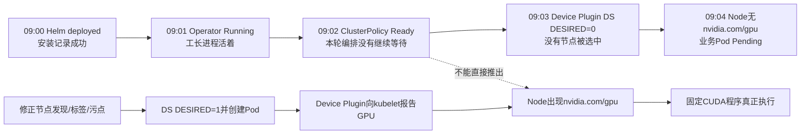
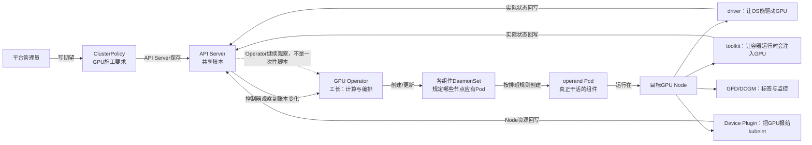
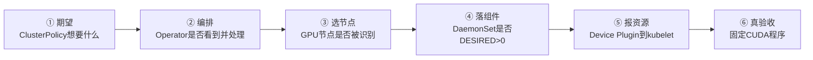
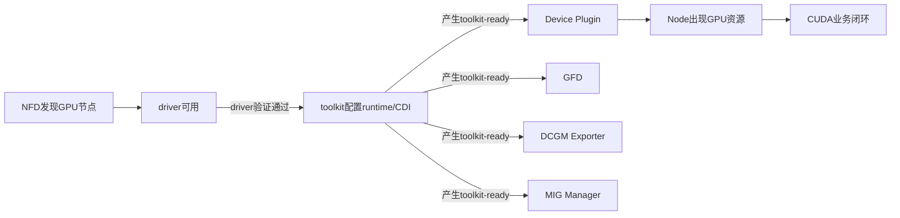
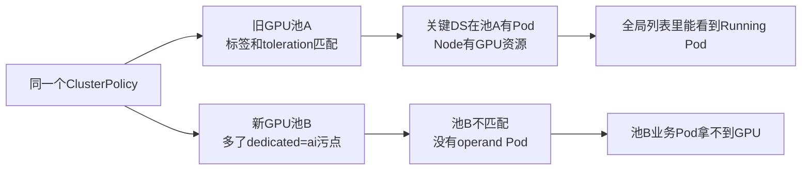
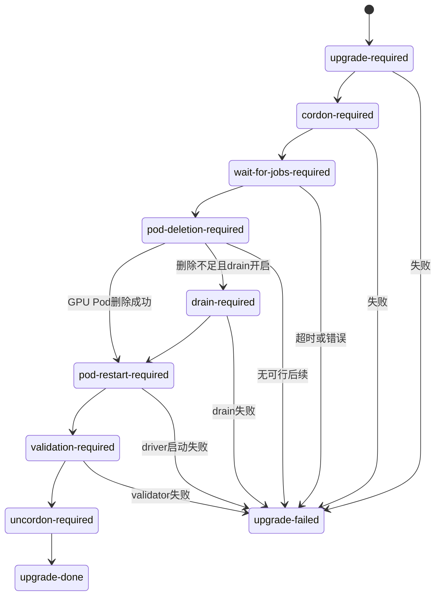

# 第 18 课：GPU Operator——为什么控制器 `Ready`，业务仍可能用不了 GPU

> 一句话定位：GPU Operator 是“长期盯着 GPU 节点软件栈的 Kubernetes 控制器”，不是一个包办所有事情的万能 Pod。  
> 主案例：平台看到安装成功、Operator Pod 正常、`ClusterPolicy` 也显示 `Ready`，但 Java 推理服务仍然因为拿不到 `nvidia.com/gpu` 而 `Pending`。  
> 固定源码：NVIDIA GPU Operator `v26.3.3`，对应提交 `b0a49c0e7b2e061dcd83f2bb2fe4fe960c5d0338`。文中的源码判断都以这个快照为准。  
> 阅读目标：第一遍先学会沿六个检查站定位问题；第二遍再学习安装、升级、安全和特殊运行时。这里不要求把每个 NVIDIA 组件的源码全部读完。

---

## 0. 先进入一个真实故障：三处都“绿了”，为什么还没有 GPU

周一上午，平台刚给一批新节点接入 GPU。一个 Java 推理服务申请 1 张卡后一直 `Pending`，也就是 Pod 还没被放到任何节点上。

值班同事看到：

```text
Helm release: deployed
gpu-operator Pod: Running
ClusterPolicy: Ready
Java推理Pod: Pending
目标Node的status.allocatable: 没有nvidia.com/gpu
```

这里先把五个第一次出现的词翻成大白话：

- **Helm release**：一次安装记录。`deployed` 只说明 Helm 把安装清单交给了 Kubernetes。
- **Operator**：持续巡检和编排的控制器，像“工长”。它看见配置变化后，会计算接下来该创建或修改什么。
- **ClusterPolicy**：GPU 软件栈的“施工要求”，也就是期望状态。例如要不要安装驱动、设备登记插件和监控组件。
- **Device Plugin**：GPU“设备登记员”。它把健康 GPU 报给 kubelet（每台 Node 上管理 Pod 和设备的 Kubernetes 组件），并在业务 Pod 获得 GPU 时参与分配。
- **`nvidia.com/gpu`**：Device Plugin 报给 kubelet 的 GPU 资源名。节点没有这个资源，调度器（负责给 Pod 选 Node 的组件）就不能把申请 GPU 的业务 Pod 放上去。

第一反应往往是：三个地方都成功了，GPU 应该好了。问题恰恰出在这里：这三个状态分别只证明了三小段，不是整条链路。



读图规则：从左往右按时间看；实线表示现场状态继续向后变化；虚线只表示“很多人会误以为能直接推出”，实际上不能。

这个事故中，Operator Pod 确实活着，ClusterPolicy 也确实是 `Ready`。但 Device Plugin 的 DaemonSet 显示 `DESIRED=0`。

**DaemonSet** 可以先理解成“每个符合条件的节点都应运行一个 Pod”的 Kubernetes 控制器；`DESIRED=0` 的大白话是：按当前标签、选择条件和污点规则计算，一个应当运行的节点也没有。既然 Pod 根本没被创建，就不存在“先看这个 Pod 日志”这条路。

这就是本课先回答的核心问题：

> Operator Pod 的 `Running/Ready` 只说明“工长这个程序活着、健康检查通过”；ClusterPolicy 的 `Ready` 是控制器对本轮编排的判断。GPU 可用还要求目标 Node 上的实际组件都工作，并且最后真的跑通 CUDA。这三者不是同一个状态。

---

<a id="first-source-proof"></a>

## 1. 第一段就读关键源码：`DESIRED=0` 为什么也可能被判为 `Ready`

先不背架构。我们直接看造成上面现象的判断。

固定位置：GPU Operator `v26.3.3`（提交 `b0a49c0e7b2e061dcd83f2bb2fe4fe960c5d0338`）的 `controllers/object_controls.go:3998-4001`。下面是 `isDaemonSetReady()` 中“目标数为 0”分支的**连续摘录、教学注释版**；为方便逐行解释，只把上游单行 `Info(...)` 调用排成多行，变量、参数、判断和返回顺序没有改变。函数的其他分支不在这段摘录里，本块不用 `...` 冒充它们：

```go
if ds.Status.DesiredNumberScheduled == 0 { // 如果DaemonSet算出的“应该运行Pod数”是0
    n.logger.V(2).Info(                      // 记录一条较详细的调试日志
        "Daemonset has desired pods of 0",  // 日志内容：这个DaemonSet目标Pod数为0
        "name",                             // 下一项是字段名name
        name,                               // 字段值是当前DaemonSet名字
    )                                       // 日志调用结束
    return gpuv1.Ready                      // 当前步骤直接返回Ready，不继续等Pod
}                                           // 这个if分支结束
```

**大白话总结：** 目标 Pod 数为 0 时，这个函数把当前 DaemonSet 步骤当成已处理，而不是证明 GPU 已经可用。

**Go 语法提示：** `if` 判断数量是否等于 0；`return` 立刻交回一个 `Ready` 枚举值。下面 1.1、1.2 再分别拆业务含义和语法。

源码链接：[object_controls.go 固定提交第 3998～4001 行](https://github.com/NVIDIA/gpu-operator/blob/b0a49c0e7b2e061dcd83f2bb2fe4fe960c5d0338/controllers/object_controls.go#L3998-L4001)。本课判断固定在这个提交，不跟随 `main` 漂移。

### 1.1 大白话总结

这段代码没有说“GPU 已经可用”。它只说：

> 这个 DaemonSet 当前一个 Pod 都不需要创建，所以没有“还差几个 Pod 才就绪”可等待；在 Operator 这一步里，把它当成已经处理完。

因此可能出现：

```text
节点标签或taint不匹配
  -> DaemonSet认为应运行0个Pod
  -> isDaemonSetReady()返回Ready
  -> ClusterPolicy最后可能显示Ready
  -> Device Plugin并没有在目标节点运行
  -> Node没有nvidia.com/gpu
  -> Java推理Pod继续Pending
```

这里的 **taint（污点）** 可以理解成节点门口的“禁止进入”牌；Pod 必须有匹配的 **toleration（容忍）**，才允许被放上该节点。标签选择不匹配或污点不被容忍，都可能让 `DESIRED` 变成 0。

### 1.2 这几行 Go 怎么读

- `if 条件 { ... }`：条件成立才执行大括号里的代码。
- `ds.Status.DesiredNumberScheduled`：用点号一层层取字段；这里取的是 DaemonSet 控制器观察到的目标数量。
- `== 0`：判断是否等于 0，不是赋值。
- `return gpuv1.Ready`：立刻结束函数，并把枚举值 `Ready` 交给上层。
- 多行 `Info(...)`：仍然只是一次函数调用；Go 允许把参数分行写，最后一个参数后面的逗号不能漏。

### 1.3 先分清五个角色

先记一条最短关系：`ClusterPolicy 工单 → Operator 工长 → DaemonSet 排班表 → operand Pod 工人 → Node/CUDA 验收结果`。

**operand** 就是“Operator 实际管理的工作组件”，例如 driver、toolkit、Device Plugin、GFD 和 DCGM Exporter。**DaemonSet 不是干活的工人**；它更像“哪些 Node 应该安排工人”的排班规则，真正到 Node 上干活的是它创建的 operand Pod。

| 层次 | 大白话 | 主要看什么 | 它不能单独证明什么 |
|---|---|---|---|
| ClusterPolicy 的期望 | “我想把 GPU 栈配成什么样” | `spec.driver`、`spec.toolkit`、`spec.devicePlugin` 等 | 不能证明节点已经照做 |
| Operator 的编排状态 | “工长这一轮计算到哪了” | Operator Pod、日志、condition（状态原因和说明） | 不能证明每台 GPU 节点都覆盖到了 |
| DaemonSet 的排班状态 | “哪些 Node 应该有这个组件” | DESIRED/CURRENT/READY、选择器和污点规则 | 不能证明实际 Pod 已把节点配置好 |
| operand Pod 的实际状态 | “驱动、工具链、插件这些工人有没有到岗” | Pod 和初始化容器状态 | 不能证明 kubelet 已有资源、CUDA 已执行 |
| Node/GPU 的真实结果 | “这台节点最后能不能交付 GPU” | Node 资源、分配结果、固定 CUDA 程序 | 这是最终要闭环的结果，不可由前面状态替代 |

---

## 2. 为什么不是一个万能 Pod：Operator 只做编排，各组件各干一件事

新手最容易形成的错误画面是：

```text
gpu-operator Pod
  -> 在自己容器里装驱动
  -> 在自己容器里给每台Node配置runtime
  -> 在自己容器里上报GPU
  -> 在自己容器里采集监控
```

真实设计不是这样。Operator 在逻辑上属于控制器一侧，不要求每台 GPU 节点各跑一份；它读取 ClusterPolicy 和节点事实，创建或更新 DaemonSet、ConfigMap（保存普通配置的 Kubernetes 对象）等资源。真正修改 GPU 节点、注册设备和采集指标的是各自的 operand Pod。



读图规则：主线从左往右；指向 API Server 的回箭头表示实际状态被保存；虚线表示控制器会继续观察新状态并再次计算。API Server 只是“共享账本”，不会主动派工，也不会自己安装驱动。

### 2.1 为什么要拆开

这不是为了把架构故意做复杂，而是四个现实约束逼出来的：

1. **运行位置不同**：驱动和 toolkit 必须在每台 GPU 节点动宿主机；Operator 不需要在每台节点都跑。
2. **权限不同**：driver 需要加载内核模块，Device Plugin 只需要向 kubelet 注册。全部塞进一个 Pod，会让每个功能都拿到最高权限。
3. **失败范围不同**：监控失败不应顺便重装驱动；Device Plugin 重启也不应让 Operator 控制循环消失。
4. **升级节奏不同**：Operator、Device Plugin 和内核 driver 的升级风险完全不同。尤其 driver 需要处理正在使用 GPU 的业务进程。

拆开的代价也真实存在：组件多、状态多、排障链更长。Kubernetes 的取舍不是“组件越碎越好”，而是按清晰责任边界拆开，再用统一 API 对象、标签、对象归属记录、状态和控制循环把它们连起来。

### 2.2 一张责任表先记住“谁不负责什么”

| 角色 | 它负责什么 | 它不负责什么 |
|---|---|---|
| Helm chart | 第一次把 CRD、Operator、ClusterPolicy 和相关安装资源放进集群 | 不长期保证每台节点健康 |
| CRD | 规定 ClusterPolicy 这种对象有哪些字段 | 不执行安装动作 |
| ClusterPolicy | 保存平台想要的 GPU 软件栈配置 | 不是会主动工作的程序 |
| GPU Operator | 比较期望与现状，创建/更新 operand 对象 | 不直接向 kubelet上报 GPU，也不亲自执行 CUDA |
| Kubernetes 的 DaemonSet controller | 按 selector、taint/toleration 等排班规则计算目标 Node，并为它们创建 Pod | 不决定 GPU 栈要装哪些组件，也不亲自在 Node 上安装驱动 |
| 各 operand Pod | 在目标节点做驱动、runtime、注册、标签、监控等具体工作 | 单个组件不代表整条链路成功 |
| kubelet | 管本节点 Pod 和设备账，把资源写进 Node 状态 | 不负责安装 GPU driver |
| scheduler | 根据 Node 可分配资源选择节点 | 不验证容器里 CUDA 能否执行 |

**CRD（CustomResourceDefinition）** 就是“给 Kubernetes 增加一种新对象的字段说明书”。**selector（选择器）** 就是用标签筛节点的条件。

---

<a id="six-stops"></a>

## 3. 第一遍只走六个检查站：从配置一直走到真实 CUDA

第一遍不要试图记住所有 NVIDIA 组件。以后看到“Operator 正常但业务拿不到 GPU”，固定从左往右走这六站：



读图规则：只能从左往右逐站证明；任一站失败就先停在那里。不要越过失败站去重装后面的组件。

快速跳转：[①期望](#stop-1-desired) → [②编排](#stop-2-reconcile) → [③选节点](#stop-3-node) → [④落组件](#stop-4-operands) → [⑤报资源](#stop-5-resource) → [⑥真验收](#stop-6-cuda)。

<a id="stop-1-desired"></a>

### 3.1 第一站：ClusterPolicy 到底要求什么

先回答：driver、toolkit、Device Plugin 是否启用，由谁管理，版本是什么。这里看的 `spec` 是 **期望状态**，也就是“平台希望如此”，不是“现场已经如此”。

还要看 `status.conditions`。**condition（条件记录）** 是控制器写回的一组说明，通常包含类型、原因和消息；它比单独一个 `Ready` 单词信息更多。

<a id="stop-2-reconcile"></a>

### 3.2 第二站：Operator 有没有处理这次变化

**reconcile（调谐）** 的大白话是：控制器再算一遍“想要什么、现在有什么、还差什么”，然后只做必要动作。它不是只在安装时运行一次。

这里要把三件事分开：Operator Pod 是否活着、是否看到了最新 ClusterPolicy、这轮处理是否报错。Pod `Running/Ready` 只回答第一件事：控制器容器在运行并通过自身健康检查，不回答 Node 上的 GPU 链是否完整。

<a id="stop-3-node"></a>

### 3.3 第三站：目标 GPU 节点有没有被选中

NFD 先根据 PCI 设备识别 NVIDIA 硬件；Operator 再补充 `nvidia.com/gpu.present` 和 `nvidia.com/gpu.deploy.*` 标签。随后 DaemonSet 用这些标签筛选节点。

**NFD（Node Feature Discovery）** 可以理解成“节点硬件信息普查员”；PCI 是主板上设备的身份信息，NVIDIA 的厂商编号是 `10de`。

这一站还要看 taint/toleration。节点有额外污点但组件没有对应容忍时，标签即使正确，也可能没有 Pod。

<a id="stop-4-operands"></a>

### 3.4 第四站：每个组件是否真的落到目标节点

不要只看 namespace 里“有一些 Pod”。要按目标节点检查关键 DaemonSet：

```text
DESIRED > 0          至少选中了节点
CURRENT == DESIRED  应创建的Pod已经创建
READY == DESIRED    创建出的Pod都通过就绪判断
Pod.spec.nodeName    Pod确实落在这台目标GPU节点
```

如果多个组件一起卡在 `Init`，**init container（初始化容器）** 就是主容器启动前必须先成功的小步骤。先查共同上游：driver，再查 toolkit，不要把下游四个 Pod 分别重启一遍。

<a id="stop-5-resource"></a>

### 3.5 第五站：kubelet 的设备账有没有 GPU

Device Plugin 成功注册并持续上报健康设备后，kubelet 才会把 `nvidia.com/gpu` 写进 Node 的 `capacity/allocatable`。

- `capacity`：kubelet 报给 Kubernetes 的逻辑 GPU 总量。
- `allocatable`：调度器允许在这台 Node 上分配的逻辑 GPU 上限。对 Device Plugin 上报的 GPU 来说，它通常和 `capacity` 相同；它不是“当前还剩几张空闲卡”，已有 Pod 占用 GPU 后这个字段也不会跟着减。

有 GFD 标签不等于 Device Plugin 注册成功；“能描述这是什么 GPU”和“能把 GPU 当资源分配”是两个进程的职责。

<a id="stop-6-cuda"></a>

### 3.6 第六站：固定 CUDA 程序是否真的执行

`nvidia-smi` 能查询驱动信息，但不能代替 CUDA 程序真正分配显存、启动 kernel 并校验结果。**CUDA kernel** 是实际在 GPU 上执行的计算函数；只有固定测试程序成功，才把调度、分配、运行时注入、驱动和硬件连成闭环。

### 3.7 第一遍学完的合格线

现在先闭卷说清楚四句话：

1. Operator 是工长，不是所有 GPU 功能的集合。
2. ClusterPolicy 写期望，各 operand 才在节点做具体工作。
3. `Ready` 必须结合 condition、DaemonSet 覆盖和 Node 资源看。
4. 最终通过标准是真实 CUDA，不是“Pod 看起来都绿了”。

这四句说不清，先不要进入升级参数。

### 3.8 Java GPU Pod 值班时，从哪一站进入

先看 Pod 状态和 Event（Kubernetes 写在 Pod 旁边的失败说明），再进入对应检查站，不要一上来就翻 Operator 日志：

| Java Pod 现象 | 先从哪一站查 | 大白话原因 |
|---|---|---|
| `Pending`，Event 是 `Insufficient nvidia.com/gpu` | ③选节点 → ④落组件 → ⑤报资源 | 调度器没看到可分配 GPU，Java 进程还没启动 |
| `FailedCreatePodSandBox` | ④落组件 → ⑥真验收 | Pod 的基础运行环境都没建好，先查 toolkit 和 RuntimeClass（Pod 选择哪套容器运行方式的规则） |
| `CreateContainerError` | ⑤报资源 → ⑥真验收 | 已选中 Node，但可能卡在设备分配、CDI（把分到的 GPU 注入容器的标准机制）或创建容器 |
| Pod 已运行，Java 报 `UnsatisfiedLinkError` 或 CUDA 初始化失败 | ⑥真验收 | `UnsatisfiedLinkError` 是 JVM 找不到或载入不了本地动态库；要区分 Java/JNI 依赖缺失，还是 GPU 设备没有正确注入 |
| Pod Ready，但推理很慢或错误率高 | GPU 主链通过后转查业务与监控 | 这时不应先重装 Operator，要继续看 Java 指标、GPU 指标和模型服务日志 |

**JNI** 是 Java 调用 C/C++ 本地库的桥；**CUDA 初始化** 是业务程序开始连接已分配 GPU 的步骤。取证时固定 Pod 的 namespace、名字、UID 和时间窗；Pod 已调度时再记下 Node，避免把重建前后的两个 Pod 当成同一次故障。

---

## 4. 组件责任与依赖：每个组件坏了，现场会少哪一块

这里把组件按“输入—动作—输出”排开。表格按行从左往右读，一行只讲一个组件。

| 组件 | 它收到什么 | 它真正做什么 | 成功后留下什么证据 | 它坏了最像什么 |
|---|---|---|---|---|
| NFD | Node 的 PCI、OS、kernel 信息 | 发现节点基础特征并打标签 | `feature.node.kubernetes.io/pci-10de.present=true` | Operator 认不出 GPU 节点，多个 DS 可能都是 0 |
| Operator | ClusterPolicy、Node 标签、已存在对象 | 计算差异，创建/更新各类资源 | DaemonSet/ConfigMap 等对象和 ClusterPolicy condition | 期望变化后资源不更新，日志出现 reconcile 错误 |
| driver | GPU 硬件、OS/kernel、驱动配置 | 安装或挂接内核模块和用户态库 | 驱动验证通过，节点能访问 GPU | driver validation 失败，下游一起卡住 |
| Container Toolkit | 已可用的 driver、容器运行时 | 配置容器访问 GPU 的注入链和 CDI | toolkit validation/ready 文件 | Pod 已分到 GPU，但容器创建或注入失败 |
| Device Plugin | 可用设备、插件配置 | 向 kubelet 注册、上报健康设备、处理分配 | Node 出现 `nvidia.com/gpu` | 组件可能 Running，但 Node 没资源 |
| GFD | driver/toolkit 可读取的 GPU 信息 | 打型号、显存、MIG 等细标签 | `nvidia.com/gpu.*` 特性标签 | 亲和性和资产标签缺失，但不等于资源一定消失 |
| DCGM Exporter | GPU 遥测数据 | 转成 Prometheus 可采集指标 | GPU 指标 | 监控缺失，不负责 Node Capacity |
| MIG Manager | 管理员给出的 MIG 策略和 Node 标签 | 改变支持 MIG 的 GPU 切分方式 | MIG 配置标签与实例状态 | MIG 资源形态不符合预期 |
| Operator Validator | driver/toolkit/CUDA/plugin 各阶段结果 | 逐段验证并设置上游闸门 | 各 init container 成功 | 一批下游组件可能同时卡 `Init` |

这里的 **CDI（Container Device Interface）** 是“容器运行时按标准清单把 GPU 设备、挂载和环境注入容器”的接口。**GFD（GPU Feature Discovery）** 是 GPU 特征发现；**DCGM** 是 NVIDIA 的 GPU 管理和遥测组件；**MIG** 是把支持的物理 GPU 切成隔离实例的能力。

### 4.1 依赖变化图：上游没过，为什么下游一起卡住



读图规则：从左往右是依赖先后；一条实线表示右边要依赖左边提供的条件。它不表示所有 Pod 必须严格一个接一个创建，而是说右侧即使先创建，也可能在 init container 等待左侧。

### 4.2 三类标签不要混在一起

1. NFD 的 `feature.node.kubernetes.io/*`：先说明节点有什么基础硬件、OS 和 kernel 特征。
2. Operator 的 `nvidia.com/gpu.present`、`nvidia.com/gpu.deploy.*`：决定哪些组件应该部署到这个节点。
3. GFD 的 `nvidia.com/gpu.*`：在驱动可用后补 GPU 型号、显存、MIG 等细节。

一句话记忆：NFD 先认出“这是一台有 NVIDIA 设备的机器”，Operator 决定“派哪些工人过去”，GFD 再描述“这张卡具体是什么”。

---

## 5. 阅读地图：第一遍走主线，第二遍再补专项

### 5.1 本课为什么固定版本

GPU Operator 的默认开关、CRD 字段和升级行为会变化。本课固定为 `v26.3.3`：

| 关键项 | 本课快照 | 大白话 |
|---|---:|---|
| GPU Operator | `v26.3.3` | 本课读取的控制器版本 |
| Device Plugin / GFD | `v0.19.3` | 负责设备分配 / GPU细标签 |
| Container Toolkit | `v1.19.1` | 负责容器运行时注入链 |
| CDI | 默认启用 | 默认使用标准设备注入接口 |
| NVIDIA NRI Plugin | 默认关闭 | 不要把 CDI 开启误认为 NRI 也开启 |
| driver 自动升级 | 默认启用 | 生产必须先审查升级策略 |
| driver 最大并行升级 | 1 个 Node | 默认一次推进一台 |
| NFD | chart 默认安装 | 集群已有 NFD 时要关闭重复安装 |

**NRI（Node Resource Interface）** 是容器运行时的一种扩展接口，本课默认路径不开启。**chart** 是 Helm 的安装包；**CRD** 是自定义对象的字段说明书。排障时先取得现场精确版本，再使用本课结论。

### 5.2 第一遍只读这些文件

```text
controllers/object_controls.go
  -> isDaemonSetReady：先理解Ready的边界

controllers/clusterpolicy_controller.go
  -> Reconcile：控制器一轮怎样开始

controllers/state_manager.go
  -> init / step / labelGPUNodes：状态顺序和节点选择

assets/state-driver/*
assets/state-container-toolkit/*
assets/state-device-plugin/*
  -> DaemonSet的selector、init container和hostPath

deployments/gpu-operator/templates/clusterpolicy.yaml
  -> Helm values怎样变成ClusterPolicy
```

这里的 `assets` 不是抽象概念，就是 Operator 仓库内置的 Kubernetes 资源清单目录；控制器会读取、按现场配置加工，再创建成集群对象。

第一遍的目标不是背函数，而是能把每个文件放回六个检查站。

### 5.3 第二遍再读这些分支

```text
controllers/upgrade_controller.go
github.com/NVIDIA/k8s-operator-libs/pkg/upgrade/*
  -> driver升级状态机

cmd/nvidia-validator/main.go
validator/manifests/*
  -> 各验证闸门

deployments/gpu-operator/crds/*
  -> CRD升级与兼容边界
```

Device Plugin 的 gRPC、kubelet DeviceManager、checkpoint、PodResources 和 CDI 恢复已在第 15～17 课展开；本课只把它们接到 Operator 主线上。DCGM 指标细节留到第 19 课。

### 5.4 两遍验收标准

| 阅读遍次 | 你应该能回答 | 暂时不用做到 |
|---|---|---|
| 第一遍 | 谁写期望、谁编排、谁在节点工作；为什么 Ready 不等于 GPU 可用；六站如何定位 `Pending`/`DESIRED=0`/批量 `Init` | 背全部 values、升级状态、CDI/NRI 版本门槛 |
| 第二遍 | managed/preinstalled 如何划责；chart/CRD 与 driver 升级为何分开；如何 canary、暂停、回退和安全审计 | 逐行读 driver 安装脚本、NFD 内部实现、所有 OpenShift/vGPU/Kata 分支 |

源码入口：

- [clusterpolicy_controller.go](https://github.com/NVIDIA/gpu-operator/blob/b0a49c0e7b2e061dcd83f2bb2fe4fe960c5d0338/controllers/clusterpolicy_controller.go)
- [state_manager.go](https://github.com/NVIDIA/gpu-operator/blob/b0a49c0e7b2e061dcd83f2bb2fe4fe960c5d0338/controllers/state_manager.go)
- [object_controls.go](https://github.com/NVIDIA/gpu-operator/blob/b0a49c0e7b2e061dcd83f2bb2fe4fe960c5d0338/controllers/object_controls.go)
- [upgrade_controller.go](https://github.com/NVIDIA/gpu-operator/blob/b0a49c0e7b2e061dcd83f2bb2fe4fe960c5d0338/controllers/upgrade_controller.go)
- [固定提交快照](https://github.com/NVIDIA/gpu-operator/tree/b0a49c0e7b2e061dcd83f2bb2fe4fe960c5d0338)

---

## 6. Helm 到 ClusterPolicy：不要把 values 当成现场真相

Chart template（安装包里的渲染模板）中有这样的逻辑。行尾中文注释是讲义补充，帮助第一次看模板的人把每一层对上：

```yaml
spec:                                                        # ClusterPolicy的期望配置从这里开始
  cdi:                                                       # 容器设备注入接口的配置
    enabled: {{ .Values.cdi.enabled }}                       # 把values里的CDI开关填到这里
    {{- if and (.Values.cdi.enabled) (.Values.cdi.nriPluginEnabled) }} # 两个开关同时为真才渲染下一行
    nriPluginEnabled: {{ .Values.cdi.nriPluginEnabled }}     # 把NRI插件开关填到ClusterPolicy
    {{- end }}                                               # 上面的条件块结束
  driver:                                                    # 驱动组件配置
    enabled: {{ .Values.driver.enabled }}                    # 是否让Operator管理容器化driver
  toolkit:                                                   # 容器工具链配置
    enabled: {{ .Values.toolkit.enabled }}                   # 是否让Operator配置runtime/CDI链
  devicePlugin:                                              # Device Plugin配置
    enabled: {{ .Values.devicePlugin.enabled }}              # 是否部署向kubelet报告GPU的插件
```

大白话总结：`values.yaml` 是安装时给 Helm 的输入；模板把其中一部分填进 ClusterPolicy。Operator 后续读取的是集群里真正保存的 ClusterPolicy，不会天天回头读你电脑上的 values 文件。

### 6.1 Helm 语法现场补

#### `.Values.cdi.enabled`

大白话：

> 从安装时的 values 树里取 `cdi.enabled`。

#### `{{- if ... }}`

这是 Go template 条件。

前面的 `-` 会裁掉相邻空白；它只影响渲染排版，不是逻辑取反。

#### `and(a, b)`

只有 CDI 开启且 NRI 开启时，才把 `nriPluginEnabled` 字段写进 ClusterPolicy。

#### `toYaml | nindent 8`

常见写法：

```yaml
tolerations: {{ toYaml .Values.daemonsets.tolerations | nindent 8 }}
```

含义：把结构转成 YAML，再整体缩进 8 格。

缩进错了会让渲染结果无效或字段落错层级，所以升级前必须 `helm template`，不能只肉眼看 values。

### 6.2 四份配置证据

生产上至少比对：

```text
安装记录：helm get values --all
普通模板结果：helm get manifest / helm template
运行对象：kubectl get clusterpolicy cluster-policy -o yaml
CRD证据：helm show crds <chart> --version <version> + kubectl get crd <name> -o yaml
```

它们可能不同：

- Helm values 变过但 release 未成功升级；
- 有人直接 `kubectl edit clusterpolicy`；
- chart 新版本增加了默认值；
- admission/defaulting 改写了对象；这里 **admission（准入）** 是对象保存前的检查或改写，**defaulting（补默认值）** 是没写字段时由系统填值；
- Operator 的 transform 又根据 runtime、OS、OpenShift、CDI/NRI 改变了 DaemonSet；**transform** 在这里就是“把通用清单按现场条件加工成最终清单”。

另外，`helm get manifest` 不能替代 CRD 取证：首次安装时来自 `crds/` 的定义不属于普通模板 manifest，而 pre-upgrade hook 又可能已经修改 live CRD。升级时必须分别保存 chart 内目标 CRD 和 apiserver 中现存 CRD。

不能拿 Git 仓库中的 `values-prod.yaml` 就断言现场一定如此。

---

## 7. `Reconcile`：Operator怎样持续收敛

主入口如下。先说明：下面是从 `v26.3.3` 完整函数中压缩出的**控制流阅读骨架**，删掉了状态聚合、condition 更新、日志和各返回分支，因此不能当成可编译源码直接复制；精确实现应回到上面的固定 commit。每一行都补了中文说明：

```go
func (r *ClusterPolicyReconciler) Reconcile( // 定义ClusterPolicy控制器的一轮调谐方法
    ctx context.Context,                     // ctx携带取消信号、超时等本轮上下文
    req ctrl.Request,                        // req告诉控制器这次要处理哪个对象
) (ctrl.Result, error) {                     // 返回“是否再排队”和“有没有错误”
    instance := &gpuv1.ClusterPolicy{}       // 先准备一个空对象，用来装API Server里的ClusterPolicy
    if err := r.Get(                         // 从API Server读取目标对象，同时把错误放进err
        ctx,                                 // 本轮上下文
        req.NamespacedName,                  // 对象名字；ClusterPolicy虽是集群级对象，框架仍用这个键
        instance,                            // 把读取结果写入instance
    ); err != nil {                          // 如果读取失败，就进入这个分支
        // 完整源码会区分对象不存在和其他读取错误；这里省略具体返回
    }                                        // 读取错误分支结束

    if err := clusterPolicyCtrl.init(        // 根据最新对象和节点事实初始化这轮状态计算
        ctx,                                 // 继续传递本轮上下文
        r,                                   // 把当前reconciler能力交给状态控制器
        instance,                            // 把刚读到的ClusterPolicy交进去
    ); err != nil {                          // 初始化失败时进入错误分支
        return ctrl.Result{}, err             // 结束本轮并把错误交给框架重试
    }                                        // 初始化错误分支结束

    for {                                    // 循环处理已登记的每个状态步骤
        status, statusError := clusterPolicyCtrl.step() // 执行下一步，并得到状态与错误
        _ = status                           // 阅读骨架省略了真实的状态聚合，避免未使用变量
        _ = statusError                      // 阅读骨架省略了真实的错误聚合，避免未使用变量
        if clusterPolicyCtrl.last() {         // 如果已经走到最后一个状态步骤
            break                            // 跳出for循环
        }                                    // 是否最后一步的判断结束
    }                                        // 状态步骤循环结束
    return ctrl.Result{}, nil                 // 骨架表示本轮正常结束；完整源码有更多返回分支
}                                            // Reconcile方法结束
```

大白话总结：每次有相关变化，Operator 都重新读取 ClusterPolicy，准备本轮状态，再逐个处理组件步骤。它的核心不是“执行一次安装脚本”，而是反复比较并纠偏。

### 7.1 Go 语法现场补：pointer receiver

```go
func (r *ClusterPolicyReconciler) Reconcile(ctx context.Context, req ctrl.Request) (ctrl.Result, error) // 完整写出输入和两个返回值
```

`r *ClusterPolicyReconciler` 是指针接收者。

**大白话总结：**

> 方法操作的是这个 reconciler 实例本身，可以使用里面的 client、logger、scheme 和 condition updater，不是在复制一个新对象。

**Go 语法提示：** 方法名左边括号中的 `r *ClusterPolicyReconciler` 是接收者；星号表示指针。

### 7.2 `if err := ...; err != nil`

```go
if err := r.Get(ctx, req.NamespacedName, instance); err != nil { // 调用Get并声明err；err不为空说明读取失败
    // 完整源码会在这里按错误类型返回或重试
}                                  // 错误分支结束
```

**大白话总结：** 先读取对象；只要读取有错误，就进入大括号处理，后面的正常路径不会假装读取成功。

**Go 语法提示：** 这叫短变量声明加条件。

`err` 的作用域只在这个 `if/else` 内，避免后面误用旧错误。

### 7.3 `(ctrl.Result, error)` 怎么读

**大白话总结：** 两个返回值分别回答“控制器何时再看”和“本轮有没有程序错误”。

**Go 语法提示：** `(ctrl.Result, error)` 是多返回值声明；`nil` 表示没有错误。

控制器有三种常见返回：

```go
return ctrl.Result{}, nil // 不主动指定再次排队时间，并且本轮没有Go错误
```

本轮正常结束，不主动要求重排。

```go
return ctrl.Result{RequeueAfter: 5 * time.Second}, nil // 没有Go错误，但要求5秒后再调谐
```

本轮没有程序错误，但状态尚未收敛，5 秒后再看。

```go
return ctrl.Result{}, err // 把真实错误交回控制器框架，由队列和限速器安排重试
```

本轮失败，由 controller-runtime 的队列/限速器重试。

这和 Java 方法返回一个业务结果再抛异常的思路相似，但这里返回值同时表达“何时再 reconcile”。

### 7.4 它监听什么

`SetupWithManager()` 主要监听：

- ClusterPolicy generation 变化；**generation** 是期望配置每次被修改后递增的版本号，可用来判断控制器看到的是不是最新配置；
- 相关 Node label 变化；
- ClusterPolicy 拥有的 DaemonSet 变化。

所以 Operator 不是 Helm 安装时只跑一次脚本，而是事件驱动加周期补偿的控制循环。

---

## 8. 状态顺序：为什么一批 Pod 会一起卡 `Init`

`state_manager.go` 当前注册的主要状态顺序：

```text
pre-requisites
state-operator-metrics
state-driver
state-container-toolkit
state-operator-validation
state-device-plugin
state-mps-control-daemon
state-dcgm
state-dcgm-exporter
gpu-feature-discovery
state-mig-manager
state-node-status-exporter
...sandbox/vGPU/Kata/CC states
```

`pre-requisites` 是前置条件检查。最后一行是特殊环境分支：sandbox/Kata 是更强隔离的容器运行方式，vGPU 是把 GPU 能力虚拟化给虚拟机或租户，CC 是 Confidential Containers（机密容器）。MPS 是让多个 CUDA 进程更高效共享 GPU 的服务。普通 Linux + containerd + Device Plugin 主线第一遍直接跳过这些特殊分支，不要被它们打断。

注意两点：

1. 这是控制器处理资源状态的顺序，不等于每个 Pod 完全串行创建。
2. 真正的运行期依赖还通过 init container 和 `/run/nvidia/validations` 文件建立。

### 8.1 典型依赖

Driver DaemonSet：

```yaml
nodeSelector:
  nvidia.com/gpu.deploy.driver: "true"
hostPID: true
initContainers:
- name: k8s-driver-manager
containers:
- name: nvidia-driver-ctr
  securityContext:
    privileged: true
```

Toolkit DaemonSet：

```yaml
nodeSelector:
  nvidia.com/gpu.deploy.container-toolkit: "true"
initContainers:
- name: driver-validation
containers:
- name: nvidia-container-toolkit-ctr
```

Device Plugin DaemonSet：

```yaml
nodeSelector:
  nvidia.com/gpu.deploy.device-plugin: "true"
initContainers:
- name: toolkit-validation
  args:
  - until [ -f /run/nvidia/validations/toolkit-ready ]; do ...; done
```

GFD、DCGM Exporter、MIG Manager 也有等待 toolkit validation 的 init container。

因此看到：

```text
device-plugin Init:0/1
gfd Init:0/1
dcgm-exporter Init:0/1
mig-manager Init:0/1
```

不要并行深挖四个主容器；先确认：

```text
driver是否通过
  -> toolkit是否通过
  -> /run/nvidia/validations/toolkit-ready是否产生
```

### 8.2 Validator的四段主闸门

默认 Operator Validator DaemonSet 主要包含：

```text
driver-validation init container
toolkit-validation init container
cuda-validation init container
plugin-validation init container
nvidia-operator-validator主容器
```

其主容器的长时间 Running，本质上是在前面的 init validations 成功后保持 Pod 存活。

排障应读取精确 init container。下面是命令模板，先把占位符替换成现场精确 Pod 名，不能原样执行：

```text
kubectl logs -n gpu-operator <validator-pod> -c driver-validation
kubectl logs -n gpu-operator <validator-pod> -c toolkit-validation
kubectl logs -n gpu-operator <validator-pod> -c cuda-validation
kubectl logs -n gpu-operator <validator-pod> -c plugin-validation
```

若容器已经重启，还要按现场状态考虑 `--previous`；查询失败必须显式记录，不能把空输出当成成功。

---

## 9. NFD、Operator标签与GFD：三阶段发现链

### 9.1 第一阶段：NFD发现PCI设备

默认 GPU Node 的初始锚点是：

```text
feature.node.kubernetes.io/pci-10de.present=true
```

`0x10de` 是 NVIDIA PCI vendor ID。

NFD 还提供 OS、kernel 等标签，Operator 会用它们选择 driver 镜像/路径，尤其是预编译 driver 或 OpenShift Driver Toolkit 场景。

### 9.2 第二阶段：Operator补公共和deploy标签

`labelGPUNodes()` 会根据 NFD/GPU 标签维护：

```text
nvidia.com/gpu.present=true
nvidia.com/gpu.deploy.driver=true
nvidia.com/gpu.deploy.container-toolkit=true
nvidia.com/gpu.deploy.device-plugin=true
nvidia.com/gpu.deploy.gpu-feature-discovery=true
nvidia.com/gpu.deploy.dcgm-exporter=true
nvidia.com/gpu.deploy.operator-validator=true
...
```

DaemonSet 再用这些标签做 `nodeSelector`。

### 9.3 第三阶段：GFD产生GPU语义标签

GFD 在 toolkit/driver 可用后识别：

- GPU 产品与架构；
- 显存；
- MIG capability/strategy；
- sharing 配置等。

这些标签用于：

- workload 的 nodeAffinity（业务 Pod 按 Node 标签选节点的规则）；
- 节点池治理；
- MIG/sharing 策略；
- 可观测性和资产盘点。

GFD 不是 Device Plugin：它打标签，不向 kubelet 执行 Allocate。

### 9.4 一个常见循环依赖误解

错误说法：

```text
GFD没起来，所以Operator发现不了GPU Node
```

更准确的主路径：

```text
NFD先发现PCI 10de
  -> Operator识别GPU Node并部署driver/toolkit
  -> GFD才能进一步读取GPU能力并打细标签
```

若连 PCI 10de 标签都没有，先查 NFD、PCI passthrough（把物理 PCI 设备直通给虚拟机，使虚拟机能直接看见它）、Node 可见性，不要先查 GFD 主容器。

---

## 10. Node deploy标签与taint：`DESIRED=0`先查什么

### 10.1 全部operand开关

官方支持在 Node 上设置：

```text
nvidia.com/gpu.deploy.operands=false
```

控制器看到后会移除一组 GPU state/deploy 标签，从而让 operand DaemonSet 不再匹配该 Node。

这适合：

- 节点维修；
- 特殊镜像/宿主机自管；
- 分阶段纳管；

但它是变更动作，必须有恢复步骤和到期时间。

### 10.2 单独driver开关

也可设置：

```text
nvidia.com/gpu.deploy.driver=false
```

用于特定 Node 不部署容器化 driver。

不要仅改 DaemonSet `nodeSelector`；Operator 下一轮可能按 ClusterPolicy 和 Node 标签重新收敛。

### 10.3 默认toleration不是万能通行证

Chart 默认 operand toleration 包含：

```yaml
- key: nvidia.com/gpu
  operator: Exists
  effect: NoSchedule
```

这只容忍指定 key/effect。

若企业 Node 有：

```text
dedicated=ai:NoSchedule
maintenance=true:NoSchedule
node-role.example/gpu=true:NoExecute
```

默认 toleration 不一定匹配。

### 10.4 `DESIRED=0`排查顺序

```text
1. DaemonSet nodeSelector是什么
2. 目标Node是否有全部selector标签和值
3. 是否有gpu.deploy.operands=false或单组件false
4. Node taints是什么
5. DaemonSet tolerations是否逐条匹配
6. Node是否Ready、是否被删除/隔离
7. 才看scheduler event
```

只要 `DESIRED=0`，就没有 operand Pod，当然也没有可看的该 Pod 容器日志。

只读证据。下面是命令模板，先把占位符替换成现场精确对象名，不能原样执行：

```text
kubectl get ds -n gpu-operator -o wide
kubectl get ds -n gpu-operator <ds-name> -o jsonpath='{.spec.template.spec.nodeSelector}'
kubectl get ds -n gpu-operator <ds-name> -o jsonpath='{.spec.template.spec.tolerations}'
kubectl get node <node-name> --show-labels
kubectl get node <node-name> -o jsonpath='{.spec.taints}'
```

任何一条命令失败都应保留错误；不要继续写“Node没有taint”。

---

## 11. 再补两种 `Ready`：没有 GPU 节点，也可能表示“当前不用做”

### 11.1 没有GPU Node时

固定位置仍是 `v26.3.3` 的 `controllers/object_controls.go`。`DaemonSet()` 中有下面的提前返回；行尾中文是讲义补的注释：

```go
if !n.hasGPUNodes { // 如果这轮没有发现任何GPU节点；!表示“不是/没有”
    logger.Info(    // 记日志，解释为什么不会创建DaemonSet
        "No GPU node in the cluster, do not create DaemonSets", // 日志正文：集群里没有GPU节点
    )              // 日志调用结束
    return gpuv1.Ready, nil // 返回Ready且没有程序错误：当前没有目标节点需要处理
}                   // 无GPU节点分支结束
```

**大白话总结：**

> 集群当前没有可识别 GPU Node，控制器不创建这些 DaemonSet，但把该步骤视为“当前没有工作要做”，不是“GPU 已经交付”。

**Go 语法提示：** `!n.hasGPUNodes` 是对布尔值取反；`return gpuv1.Ready, nil` 返回两个值，前者是业务状态，后者 `nil` 表示没有 Go 错误。

随后主 Reconcile 会写条件：

```text
No GPU node found, watching for new nodes to join the cluster.
```

并把 ClusterPolicy 这个自定义对象的汇总状态更新为 `Ready`。所以条件里的 `reason`（简短原因码）和 `message`（给人看的说明）不能省略。

### 11.2 没有NFD标签时

主循环会记录：

```text
WARNING: NFD labels missing in the cluster, GPU nodes cannot be discovered.
```

然后每 45 秒再检查一次；但当前代码仍把 ClusterPolicy 汇总状态写成 `Ready`，条件的 `reason` 会写 `NFDLabelsMissing`。**轮询** 就是“隔一段时间主动再看一次”，防止没有新事件时永远不再处理。

所以只看：

```text
kubectl --context <approved-context> get clusterpolicy
```

不够；必须读完整 conditions/message。

### 11.3 `DESIRED=0`不再重复背源码

这一分支已经在[第 1 节](#first-source-proof)逐行读过。这里只记三个不同原因：

```text
没有GPU节点       -> 当前无对象可部署
缺NFD标签         -> 控制器看不出谁是GPU节点
DESIRED=0         -> 某个DaemonSet按选择规则没有匹配节点
```

三者都可能让表面汇总状态看起来不阻塞，但现场含义不同。排障必须读 condition、节点标签和 DaemonSet 数量，不能只截图一个 `Ready`。

### 11.4 正确验收矩阵

| 证据 | 能证明 | 不能证明 |
|---|---|---|
| Helm `deployed` | release记录存在且Helm事务完成 | operand健康 |
| Operator Pod Running/Ready | 控制器进程存活并通过自身健康检查 | GPU Node存在或节点GPU链可用 |
| ClusterPolicy Ready | 当前controller状态步骤未阻塞 | 每个GPU Node有operand |
| DaemonSet Ready | 已匹配的Pod满足DS判定 | DESIRED一定大于0 |
| Validator通过 | 内置验证在该Node通过 | 业务镜像/模型一定兼容 |
| Node有`nvidia.com/gpu` | scheduler看见逻辑资源 | runtime注入一定成功 |
| `nvidia-smi`成功 | driver/NVML查询可用 | CUDA kernel一定执行 |
| 固定CUDA smoke PASS | 当前Node/镜像/runtime链真正可用 | 长期性能与SLO一定健康 |

表里的 **NVML** 是 NVIDIA 提供给管理程序查询 GPU/driver 状态的库；**smoke test（冒烟测试）** 是快速验证关键主链能否跑通的小测试；**SLO** 是平台承诺的服务目标，例如可用率或故障恢复时间。它们验证的层次不同。

---

## 12. 托管边界：managed与preinstalled必须先选清楚

> 从这里进入第二遍。第一遍六站还没走顺时，可以先跳到[第 36 节第一遍自测](#first-pass-check)。

标题里的两个词先翻译：

- **managed（Operator 托管）**：由 Operator 安装、更新并持续纠偏。
- **preinstalled（宿主机预装）**：在节点镜像或 OS 流程里提前装好，Operator 不拥有它的升级和回退责任。

选择的本质不是“开关怎么写”，而是出了问题以后到底由哪套自动化负责。

### 12.1 模式A：Operator管理driver和toolkit

```yaml
driver:
  enabled: true
toolkit:
  enabled: true
```

Operator负责：

- 部署 driver container；
- 安装/加载内核模块和用户态组件；**内核模块**是装进 Linux 内核、让操作系统直接驱动 GPU 的代码，不是普通 Java 依赖包；
- 配置 toolkit/runtime/CDI；
- 运行 validator；
- 容器化 driver 的升级状态机。

平台仍负责：

- OS/kernel 支持矩阵；
- Secure Boot/module signing 策略；大白话是机器只允许加载受信任签名的内核模块；
- 内核头/包仓库；
- runtime自身生命周期；
- 容量、PDB、业务迁移和变更窗口；**PDB** 是 Pod 中断预算，用来限制自愿维护时最多同时少掉多少业务 Pod；
- 供应链与镜像审批。

### 12.2 模式B：宿主机预装driver

```yaml
driver:
  enabled: false
toolkit:
  enabled: true
```

适合：

- 云厂商/OS镜像管理 driver；
- 不允许容器加载内核模块；
- 不同 GPU Node OS 由镜像流水线维护；
- 组织已有内核驱动补丁和重启流程。

关键边界：

> GPU Operator driver upgrade controller 不管理宿主机预装 driver。

若发生 driver CVE 或 kernel 升级，责任在 OS/镜像/节点管理流水线，不应等 Operator 自动处理。**CVE** 是公开漏洞编号，方便确认某个具体安全漏洞影响哪些版本。

### 12.3 模式C：driver和toolkit都预装

```yaml
driver:
  enabled: false
toolkit:
  enabled: false
```

此时 Operator 仍可管理 Device Plugin、GFD、DCGM Exporter 等，但前提是平台已经保证：

- driver与kernel兼容；
- NVML/CUDA driver库路径正确；
- runtime识别 CDI/legacy NVIDIA runtime；
- toolkit配置在重启后持久；
- CDI spec/刷新机制正确；
- 变更与回滚归属明确。

### 12.4 不要依赖“driver init会自动检测预装”代替显式所有权

官方说明：若未设置 `driver.enabled=false`，driver Pod init 可能检测到预装 driver 后打标并退出，不再重复安装。

这是一种保护，不是推荐的责任模型。

企业配置应显式表达所有权：

```text
谁安装
谁升级
谁验证
谁回滚
谁处理kernel变更
谁维护runtime配置
```

否则故障时两条自动化链互相覆盖，最难排查。

上面的 `legacy NVIDIA runtime` 指较早的 NVIDIA 专用 RuntimeClass/运行时路径；`CDI spec` 则是 CDI 标准使用的设备注入清单文件。两者并存或切换时，必须明确哪条才是现场主路径。

---

## 13. CDI与NRI当前边界

这一节很容易把新手绕晕，先按现场选读：

```text
普通业务Pod申请nvidia.com/gpu
  -> 先看13.1和13.2的“传统Device Plugin路径”

平台明确使用DRA/ResourceClaim
  -> 才看13.2的DRA分支

容器不申请GPU资源却要看见全部GPU
  -> 它是受控管理容器，再看13.3和NRI
```

CDI 已在第 4 节解释为“运行时按标准清单注入设备”。NRI 则是运行时额外开放给节点插件的接口；两者有关联，但不是同一个开关。

### 13.1 当前默认

`v26.3.3` chart：

```yaml
cdi:
  enabled: true
  nriPluginEnabled: false
```

因此：

```text
CDI默认开启
NRI Plugin默认关闭
```

### 13.2 标准GPU workload

**workload** 就是业务工作负载，这里通常指业务 Pod。它获得 GPU 有两条不同入口：

- 传统主线：通过 NVIDIA Device Plugin 申请 `nvidia.com/gpu` 这种 **extended resource（扩展资源）**；扩展资源就是设备插件给 Kubernetes 增加的资源名。
- DRA 主线：通过 NVIDIA DRA Driver 使用 `ResourceClaim`；**DRA（Dynamic Resource Allocation，动态资源分配）** 是较新的设备申请框架，`ResourceClaim` 可以先理解为“一个单独保存设备需求和分配结果的申请单”。

获得 GPU 分配时，当前 runtime（containerd 或 CRI-O 这类容器运行时）原生 CDI 路径可以透明完成注入，通常不要求业务 YAML 显式写 `runtimeClassName: nvidia`。**RuntimeClass** 是 Pod 用来选择某种容器运行方式的 Kubernetes 对象。

但不要由此误判安装职责：`v26.3.3` 的 GPU Operator chart 会配置 driver/CDI/NFD/GFD 等前置条件，NVIDIA DRA Driver `v0.4.1` 本身仍由独立的 `nvidia/dra-driver-nvidia-gpu` Helm chart 安装，不是 `ClusterPolicy` 状态机中的默认 operand。现场没有 DRA 和 ResourceClaim 时，这个分支先跳过。现场选择 DRA 时，再按 [DRA Driver for NVIDIA GPUs](https://docs.nvidia.com/datacenter/cloud-native/gpu-operator/26.3/dra-intro-install.html) 核对传统 Device Plugin 是否关闭，以及共存功能是否明确启用并验证。

### 13.3 GPU管理容器

有些管理组件使用：

```text
NVIDIA_VISIBLE_DEVICES=all
```

这是一个环境变量，意思是让容器直接看见全部 GPU，会绕过 Device Plugin/DRA 的业务分配。

这类容器是高权限管理例外，不应推广给普通业务 Pod。

当前官方边界：

- CDI开启、NRI未开启时，管理容器通常仍需要 `runtimeClassName: nvidia`；
- NRI Plugin开启后，这类容器可以不再依赖显式 RuntimeClass；
- NRI要求 CDI 同时开启；当前 `26.3` 支持的门槛是 containerd `v1.7.30`、`v2.1.x`、`v2.2.x`，或 CRI-O `v1.34+`。

### 13.4 NRI不是“更高级所以必须开”

是否启用取决于：

- runtime版本与配置；
- 现有RuntimeClass兼容；
- 管理容器需求；
- 安全审查；
- 回滚能力；
- 厂商支持矩阵。

标准 Device Plugin workload 已可用时，不要为了追新在生产无验证切换 NRI。

当前 `26.3` 还要记住两个版本边界：

- NVIDIA 文档明确提示 containerd 项目的 NRI Plugin 尚未发布 GA 版本；**GA** 是厂商宣布面向生产普遍可用的正式阶段，未 GA 表示接口实现仍可能变化；
- `spec.hostUsers: false` 的 Kubernetes user namespace Pod 目前不受支持。**user namespace（用户命名空间）** 会把容器内用户 ID 映射成宿主机上的另一组 ID；此时 `nvidia-cdi-hook` 无法读取 OCI bundle 的 `config.json`，容器会创建失败。**OCI bundle** 可以理解成运行时创建容器时读取的标准配置目录。此类 GPU Pod 应省略该字段或显式使用 `hostUsers: true`，并在升级后重新核对官方 Known Issues（官方已知问题清单）。

官方边界见 [CDI 与 NRI 支持](https://docs.nvidia.com/datacenter/cloud-native/gpu-operator/26.3/cdi.html)。

---

## 14. 安装前检查：先确定平台事实，再运行Helm

### 14.1 支持矩阵

**支持矩阵** 不是性能表，而是厂商明确测试并支持的“GPU 型号 + OS + kernel + Kubernetes + runtime + driver”组合。组合不在表里，即使偶尔能启动，也不能直接当成生产可支持方案。

确认：

- Kubernetes版本；
- OS发行版和版本；
- kernel版本；
- GPU型号；
- containerd/CRI-O版本；
- driver版本和kernel module type；
- MIG/GPUDirect/Secure Boot 需求；**GPUDirect** 是让 GPU 更直接访问网卡或存储等数据路径的能力，没用到就先不展开；
- 是否使用 OpenShift/K3s/MicroK8s 等特殊发行版。

不要先安装再用 CrashLoop 试出兼容性。

`ClusterPolicy` 管理容器化 driver 时还有一个硬边界：官方要求承载 GPU workload 的 worker Node/Node group 使用相同 OS 版本。混合 OS 不能靠同一份 `ClusterPolicy.spec.driver` 猜测兼容；要么让宿主机镜像预装 driver，要么从新集群设计阶段选择互斥的 `NVIDIADriver` CRD 架构，并逐项核对其限制。

### 14.2 NFD所有权

如果集群已有 NFD，应显式：

```yaml
nfd:
  enabled: false
```

并核对现有 NFD 版本和标签。

同一集群重复部署 NFD，可能造成：

- 标签竞争；
- RBAC/端口冲突；
- Node label短暂删除和operand重建；
- 升级责任不清。

### 14.3 Namespace与PSA

GPU Operator 的 driver/toolkit 等 operand 需要 privileged、hostPID、hostIPC、hostPath 和内核/服务操作。

这些词的共同点是“容器能碰宿主机”：`privileged` 给容器很高权限，`hostPID/hostIPC` 让它共享宿主机进程或进程通信空间，`hostPath` 把宿主机目录挂进容器。

如果启用 **PSA（Pod Security Admission，Pod 安全准入）**，官方安装前要求为专用 namespace 设置 privileged enforcement，也就是只在受控 namespace 放行这类高权限 Pod。

这不是说“整个业务集群放开 privileged”，而是：

```text
专用gpu-operator namespace
  + 严格限制谁能创建/修改该namespace对象
  + 审计RBAC（谁能对哪些Kubernetes对象做什么）
  + 禁止普通租户访问
```

### 14.4 Taint与容量

预先列出 GPU Node 的 taint，并把必要 toleration 写进 values。

还要保证 Operator Deployment 本身有可调度位置；单节点集群尤其要防止升级/排空时把控制器一起赶走。

### 14.5 网络与包仓库

容器化 driver 可能在启动时下载 deb/rpm 或依赖内核头。

要确认：

- DNS；
- registry；
- package mirror；
- HTTP/HTTPS proxy；
- `NO_PROXY`；
- TLS CA；
- imagePullSecret；
- OS/kernel对应的driver镜像。

其中 registry 是容器镜像仓库，package mirror 是 deb/rpm 软件包的企业镜像站，proxy 是代替节点访问外部网络的代理，`NO_PROXY` 列出不走代理的内部地址，TLS CA 是用来验证 HTTPS 证书是否可信的根证书，imagePullSecret 是拉取私有镜像所需的凭据引用。

“镜像已拉到本地仓库”不等于 driver 安装全程不需要外部包仓库。

### 14.6 所有权决策表

| 项目 | Operator托管 | 宿主机/其他系统托管 | 现场决定 |
|---|---|---|---|
| driver | `driver.enabled=true` | `false` | 只能明确一种主责任 |
| toolkit | `toolkit.enabled=true` | `false` | runtime配置归属要清楚 |
| NFD | `nfd.enabled=true` | `false` | 集群只保留一套责任链 |
| Device Plugin | 通常Operator | 外部部署时关闭 | 避免双注册/双配置 |
| DCGM Exporter | 通常Operator | 平台监控栈 | 避免端口/指标重复 |
| MIG Manager | 按需Operator | 外部GPU管理 | 变更必须排空与恢复 |

---

## 15. 安装命令不是实验：先渲染、审计，再变更

先划清安全边界。下面不是让学习者连到生产“边看边试”：

| 动作 | 是否改变集群 | 本课要求 |
|---|---|---|
| `helm show`、`helm template` | 不改变；只下载/本地渲染 | 可以先做，仍要固定版本和来源 |
| `kubectl get/describe/logs` | 通常只读取 API 或日志 | 使用批准 context，失败要保留，不把空结果当成功 |
| `kubectl apply --dry-run=server` | 不持久化对象，但会访问 API Server 并经过准入检查 | 只能当格式和准入预检，不是 GPU 验收 |
| `helm upgrade --install`、`kubectl apply/delete/label/cordon/drain` | 会改变集群或节点调度状态 | 必须有授权、变更窗口、停止条件和恢复步骤 |

**context** 是 kubectl 当前要连接的集群和身份组合。**dry-run** 是“让服务端检查但不真正保存”。任何占位符没有换成现场批准值时，都不能执行。

### 15.1 只读/本地渲染阶段

固定版本：

```powershell
$release = 'v26.3.3'
helm show chart nvidia/gpu-operator --version $release
helm show values nvidia/gpu-operator --version $release
helm show crds nvidia/gpu-operator --version $release
```

使用企业 values 渲染：

```powershell
helm template gpu-operator nvidia/gpu-operator `
  --namespace gpu-operator `
  --version $release `
  --include-crds `
  --values .\values-gpu-operator.yaml
```

这里要审计：

- 所有 image repository/tag；
- imagePullPolicy；
- privileged/hostPID/hostIPC；
- hostPath；
- ServiceAccount/RBAC；
- NodeSelector/toleration；
- driver/toolkit/NFD所有权；
- CDI/NRI；
- driver upgrade policy；
- CRD hook；
- proxy和secret引用。

### 15.2 server-side dry-run不是完整预演

可把渲染结果交给 API server dry-run 校验 schema/admission：

```text
kubectl apply --dry-run=server -f <rendered-manifest>
```

这里的 **schema** 是字段结构和类型规则，**admission** 是 API Server 保存对象前执行的准入检查。它能发现：

- API版本不存在；
- admission拒绝；
- CRD schema问题；
- namespace/RBAC一部分问题。

它不能证明：

- driver能加载；
- runtime配置能生效；
- GPU硬件健康；
- DaemonSet能调度；
- CUDA能执行。

还有一个 CRD 顺序边界：server-side dry-run 不会把本轮 CRD 真正保存，因此“新 CRD + 依赖该新 schema 的 CR”放在同一次 dry-run 中，不能等价模拟 pre-upgrade hook 先升级 CRD、再提交 CR 的真实顺序。**hook（钩子）** 是 Helm 在正式升级前后额外执行的 Job。目标集群仍是旧 CRD 时，新的 ClusterPolicy 字段也可能先按旧 schema 被拒绝；这正是 hook 路径需要 `--disable-openapi-validation`、并且生产升级仍要在隔离测试集群演练的原因。

### 15.3 真实安装是变更动作

官方示例：

```powershell
$ErrorActionPreference = 'Stop'
$ApprovedContext = 'REPLACE_WITH_APPROVED_CONTEXT'

$actualContext = kubectl config current-context
if ($LASTEXITCODE -ne 0 -or [string]::IsNullOrWhiteSpace($actualContext)) {
  throw '读取current-context失败'
}
if ($actualContext.Trim() -cne $ApprovedContext) {
  throw "context不匹配：expected=$ApprovedContext actual=$actualContext"
}

helm upgrade --install gpu-operator nvidia/gpu-operator `
  --kube-context $ApprovedContext `
  --namespace gpu-operator `
  --create-namespace `
  --version v26.3.3 `
  --values .\values-gpu-operator.yaml `
  --wait `
  --timeout 15m

if ($LASTEXITCODE -ne 0) {
  throw "GPU Operator Helm变更失败，exitCode=$LASTEXITCODE"
}
```

生产执行前必须具备：

- 精确 kube context；
- 变更单和批准时间窗；
- 可用 GPU canary Node；
- 业务容量余量；
- 预装/托管边界确认；
- 镜像与包仓库可达；
- 失败停止条件；
- CRD/ClusterPolicy/values备份；
- driver/runtime/Node恢复方案。

`--wait` 只等待 Helm 认定的资源就绪，不是 GPU 业务验收。

如果集群启用了 PSA 限制，应先按第 14.3 节创建并标记 `gpu-operator` namespace，再执行安装并去掉 `--create-namespace`；该参数只负责创建 namespace，不会替你添加 `pod-security.kubernetes.io/enforce=privileged` 标签。

---

## 16. 安装后六层验证

### 16.1 第一层：Helm与控制器

```powershell
$Context = 'REPLACE_WITH_APPROVED_CONTEXT'
helm status gpu-operator -n gpu-operator --kube-context $Context
helm get values gpu-operator -n gpu-operator --all --kube-context $Context
kubectl --context $Context get deployment -n gpu-operator -l app=gpu-operator -o wide
kubectl --context $Context get pod -n gpu-operator -l app=gpu-operator `
  -o jsonpath='{range .items[*]}{.metadata.name}{"\t"}{range .status.containerStatuses[*]}{.name}{"="}{.imageID}{" "}{end}{"\n"}{end}'
kubectl --context $Context logs -n gpu-operator deployment/gpu-operator --tail=300
```

命令里的 `jsonpath` 是“从 Kubernetes 返回的 JSON 对象中只挑指定字段输出”的表达式；它不会修改对象，但字段路径写错时可能输出空字符串，所以仍要检查命令退出码和原始对象。

回答：

- release版本是什么；
- Operator image digest 是什么；**digest** 是镜像内容的 sha256 指纹，比可被覆盖的 tag 更适合证明“实际运行的是哪一份镜像”；
- 控制器是否反复重启；
- 是否有CRD/RBAC/reconcile error。

### 16.2 第二层：ClusterPolicy完整状态

```powershell
$Context = 'REPLACE_WITH_APPROVED_CONTEXT'
kubectl --context $Context get clusterpolicy
kubectl --context $Context get clusterpolicy cluster-policy -o yaml
```

必须读：

```text
metadata.generation
status.state
status.conditions[*].type
status.conditions[*].reason
status.conditions[*].message
status.conditions[*].observedGeneration（若现场版本提供）
```

`metadata.generation` 是当前期望配置的版本号；`observedGeneration` 是控制器声明自己已经处理到的版本号。两者不相等时，旧的 `Ready` 可能只是上一版配置的结果。

若 message 是 `No GPU node found` 或 `No NFD labels found`，就不能把 `Ready` 写成“GPU栈可用”。

### 16.3 第三层：DaemonSet是否实际匹配目标Node

```powershell
$Context = 'REPLACE_WITH_APPROVED_CONTEXT'
kubectl --context $Context get ds -n gpu-operator -o wide
kubectl --context $Context get pods -n gpu-operator -o wide
```

对每种目标 Node 类型校验：

```text
DESIRED > 0
CURRENT == DESIRED
READY == DESIRED
UP-TO-DATE == DESIRED
Pod.spec.nodeName确实是批准的GPU Node
```

多节点池不能只随机看一个 Pod。

### 16.4 第四层：Node标签与扩展资源

下面是命令模板，必须先把 `<node-name>` 替换为批准的精确 Node 名，不能原样执行：

```text
kubectl get node <node-name> -o yaml
kubectl get node <node-name> `
  -o jsonpath='{.status.capacity.nvidia\.com/gpu}{"\t"}{.status.allocatable.nvidia\.com/gpu}{"\n"}'
```

检查：

```text
NFD PCI标签
nvidia.com/gpu.present
各gpu.deploy.*标签
GFD特性标签
nvidia.com/gpu Capacity/Allocatable
MIG资源名（若启用）
```

这里的数量是 Device Plugin 广告的逻辑设备单位，不必然等于物理卡数；MIG/time-slicing 会改变语义。**time-slicing（时间片共享）** 是多个 Pod 轮流使用同一张 GPU 的配置方式，资源数字可能是可分配份额，不再等于物理卡数。

### 16.5 第五层：validator与插件

下面包含 Pod 名占位符，是命令模板，不能原样执行：

```text
kubectl get pods -n gpu-operator -l app=nvidia-operator-validator -o wide
kubectl get pods -n gpu-operator -l app=nvidia-device-plugin-daemonset -o wide
kubectl logs -n gpu-operator <device-plugin-pod> -c nvidia-device-plugin --tail=300
```

要求：

- validator全部init container成功；
- Device Plugin没有反复注册/退出；
- ListAndWatch有健康设备；
- Node资源与预期逻辑设备单位一致。

### 16.6 第六层：固定CUDA workload

最后才运行真实工作负载：

```text
request 1个明确资源
  -> 绑定到明确canary Node
  -> DeviceManager Allocate成功
  -> runtime/CDI注入成功
  -> 固定程序启动
  -> 实际执行CUDA kernel
  -> 输出唯一机器可判定PASS
```

不能用下面这些作为最终验收：

```text
sleep
只有nvidia-smi
只加载libcuda.so
只打印CUDA_VISIBLE_DEVICES
随意允许操作员输入任意命令
```

---

## 17. 只读取证脚本：先生成节点×组件矩阵

下面脚本不修改集群。它要求操作员先给出批准 context，避免从错误集群采集“证据”。

这是第二遍的可选工具，不是第一遍的背诵题。第一次阅读只需知道：它把 ClusterPolicy、Node、DaemonSet、目标节点上的 Pod 拼成一张表；不要求现在逐行掌握 PowerShell、正则表达式和 JSON 解析。

```powershell
param(
  [Parameter(Mandatory=$true)]
  [string]$ApprovedContext,

  [Parameter(Mandatory=$true)]
  [string]$OperatorNamespace,

  [Parameter(Mandatory=$true)]
  [string]$ClusterPolicyName,

  [Parameter(Mandatory=$true)]
  [string]$ApprovedNode
)

$ErrorActionPreference = 'Stop'

$actualContext = kubectl config current-context
if ($LASTEXITCODE -ne 0 -or [string]::IsNullOrWhiteSpace($actualContext)) {
  throw '读取current-context失败'
}
if ($actualContext.Trim() -cne $ApprovedContext) {
  throw "context不匹配：expected=$ApprovedContext actual=$actualContext"
}

$dnsLabel = '\A[a-z0-9](?:[-a-z0-9]*[a-z0-9])?\z'
$dnsSubdomain = '\A(?=.{1,253}\z)(?:[a-z0-9](?:[-a-z0-9]*[a-z0-9])?\.)*[a-z0-9](?:[-a-z0-9]*[a-z0-9])?\z'

if ($OperatorNamespace.Length -gt 63 -or $OperatorNamespace -notmatch $dnsLabel) {
  throw 'OperatorNamespace格式非法'
}
if ($ClusterPolicyName -notmatch $dnsSubdomain) {
  throw 'ClusterPolicyName格式非法'
}
if ($ApprovedNode -notmatch $dnsSubdomain) {
  throw 'ApprovedNode格式非法'
}

$nodeName = kubectl --context $ApprovedContext get node $ApprovedNode -o jsonpath='{.metadata.name}'
if ($LASTEXITCODE -ne 0 -or $nodeName -cne $ApprovedNode) {
  throw '无法精确读取批准Node'
}

$cp = kubectl --context $ApprovedContext get clusterpolicy $ClusterPolicyName -o json
if ($LASTEXITCODE -ne 0 -or [string]::IsNullOrWhiteSpace($cp)) {
  throw '读取ClusterPolicy失败'
}

$node = kubectl --context $ApprovedContext get node $ApprovedNode -o json
if ($LASTEXITCODE -ne 0 -or [string]::IsNullOrWhiteSpace($node)) {
  throw '读取Node失败'
}

$daemonSets = kubectl --context $ApprovedContext get ds -n $OperatorNamespace -o json
if ($LASTEXITCODE -ne 0 -or [string]::IsNullOrWhiteSpace($daemonSets)) {
  throw '读取DaemonSet失败'
}

$pods = kubectl --context $ApprovedContext get pods -n $OperatorNamespace `
  --field-selector "spec.nodeName=$ApprovedNode" -o json
if ($LASTEXITCODE -ne 0 -or [string]::IsNullOrWhiteSpace($pods)) {
  throw '读取目标Node上的operand Pod失败'
}

$cpText = $cp -join [Environment]::NewLine
$nodeText = $node -join [Environment]::NewLine
$dsText = $daemonSets -join [Environment]::NewLine
$podText = $pods -join [Environment]::NewLine

$cpObj = ConvertFrom-Json -InputObject $cpText
$nodeObj = ConvertFrom-Json -InputObject $nodeText
$dsObj = ConvertFrom-Json -InputObject $dsText
$podObj = ConvertFrom-Json -InputObject $podText

[pscustomobject]@{
  Context = $actualContext.Trim()
  ClusterPolicyState = $cpObj.status.state
  ClusterPolicyConditions = @($cpObj.status.conditions | ForEach-Object {
    "$($_.type):$($_.reason):$($_.message)"
  }) -join ' | '
  Node = $nodeObj.metadata.name
  NfdPciPresent = $nodeObj.metadata.labels.'feature.node.kubernetes.io/pci-10de.present'
  GpuPresent = $nodeObj.metadata.labels.'nvidia.com/gpu.present'
  Capacity = $nodeObj.status.capacity.'nvidia.com/gpu'
  Allocatable = $nodeObj.status.allocatable.'nvidia.com/gpu'
  NamespacePodsOnNode = @($podObj.items).Count
}

$dsObj.items | Sort-Object { $_.metadata.name } | ForEach-Object {
  $daemonSet = $_
  $ownedPods = @($podObj.items | Where-Object {
    @($_.metadata.ownerReferences | Where-Object {
      $_.kind -ceq 'DaemonSet' -and $_.uid -ceq $daemonSet.metadata.uid
    }).Count -gt 0
  })

  [pscustomobject]@{
    DaemonSet = $daemonSet.metadata.name
    Desired = $daemonSet.status.desiredNumberScheduled
    Current = $daemonSet.status.currentNumberScheduled
    Ready = $daemonSet.status.numberReady
    Updated = $daemonSet.status.updatedNumberScheduled
    Unavailable = $daemonSet.status.numberUnavailable
    NodeSelector = ($daemonSet.spec.template.spec.nodeSelector | ConvertTo-Json -Compress)
    PodsOnApprovedNode = @($ownedPods | ForEach-Object { $_.metadata.name }) -join ','
  }
}

$podObj.items | Sort-Object { $_.metadata.name } | ForEach-Object {
  [pscustomobject]@{
    Pod = $_.metadata.name
    Phase = $_.status.phase
    Node = $_.spec.nodeName
    Init = @($_.status.initContainerStatuses | ForEach-Object {
      "$($_.name):ready=$($_.ready):restart=$($_.restartCount):image=$($_.image):imageID=$($_.imageID)"
    }) -join ';'
    Containers = @($_.status.containerStatuses | ForEach-Object {
      "$($_.name):ready=$($_.ready):restart=$($_.restartCount):image=$($_.image):imageID=$($_.imageID)"
    }) -join ';'
  }
}
```

### 17.1 这段脚本能证明什么

它把四类证据连起来：

```text
ClusterPolicy条件
Node发现/资源
DaemonSet总体状态
目标Node实际Pod
```

它不能证明：

- 节点内 driver kernel module 细节；
- CDI spec 内容；
- runtime最终ContainerConfig；
- CUDA kernel执行；
- GPU长期健康。

所以输出是排障入口，不是最终 PASS。

---

## 18. 受控CUDA验收实验：真正闭环但不允许任意命令

这是有状态实验，只能在批准的 lab namespace 和 canary GPU Node 执行。

### 18.1 实验前置保护

必须满足：

```text
current-context与批准值精确一致
lab namespace预先存在且有平台约定标签
canary Node预先有平台约定lab标签
GPU image使用批准digest
脚本路径固定，不接受任意command参数
资源路径限定传统nvidia.com/gpu:1
不在MIG/DRA/time-slicing语义不明环境直接套用
默认立即清理
```

建议平台自建验收镜像，固定包含：

```text
/opt/gpu-lab/cuda-smoke
  -> 枚举恰好一个分配设备
  -> 分配device memory
  -> 启动一个真实CUDA kernel
  -> 同步并校验结果
  -> 成功只输出CUDA_SMOKE_PASS
  -> 失败非0退出
```

### 18.2 Pod模板

```yaml
apiVersion: v1
kind: Pod
metadata:
  name: gpu-operator-e2e
  namespace: __LAB_NAMESPACE__
  labels:
    gpu-lab.example.com/owner: __OWNER__
spec:
  restartPolicy: Never
  affinity:
    nodeAffinity:
      requiredDuringSchedulingIgnoredDuringExecution:
        nodeSelectorTerms:
        - matchFields:
          - key: metadata.name
            operator: In
            values:
            - __APPROVED_NODE__
  containers:
  - name: cuda-smoke
    image: __APPROVED_IMAGE_AT_SHA256__
    imagePullPolicy: IfNotPresent
    command:
    - /opt/gpu-lab/cuda-smoke
    resources:
      limits:
        nvidia.com/gpu: 1
```

### 18.3 PASS条件

全部成立才算通过：

```text
Pod.spec.nodeName == ApprovedNode
Pod phase == Succeeded
container exitCode == 0
kubectl logs调用成功
日志非空
日志精确包含单一CUDA_SMOKE_PASS
程序确认只看到1个已分配逻辑设备
创建后的Node资源语义与实验前一致
实验Pod被清理并确认不存在
```

### 18.4 清理

默认：

下面是清理命令模板；先把 `<lab-ns>` 替换为已批准的实验 namespace，不能原样执行：

```text
kubectl --context <approved-context> delete pod gpu-operator-e2e -n <lab-ns> --wait=true --timeout=120s
kubectl --context <approved-context> get pod gpu-operator-e2e -n <lab-ns>
```

第二条应返回 NotFound；其他错误要人工确认。

若因工单要求保留：

- 显式 `KeepArtifacts=true`；
- 标记 owner、ticket、expiry；
- 输出精确删除命令；
- 到期自动清理；
- 不使用无限 `Read-Host` 挂住流水线。

---

## 19. 故障树一：Operator Pod自己CrashLoop

### 19.1 先看容器为什么退出

```powershell
$Context = 'REPLACE_WITH_APPROVED_CONTEXT'
kubectl --context $Context describe pod -n gpu-operator -l app=gpu-operator
kubectl --context $Context logs -n gpu-operator deployment/gpu-operator --previous --tail=500
kubectl --context $Context get events -n gpu-operator --sort-by='.lastTimestamp'
```

分支：

| 现象 | 优先检查 |
|---|---|
| OOMKilled | Operator request/limit、集群Node规模、对象数量 |
| Forbidden | ClusterRole/Binding、ServiceAccount、admission |
| no matches for kind | CRD未安装/升级失败 |
| ImagePullBackOff | registry、secret、digest、proxy/DNS |
| panic/invalid spec | ClusterPolicy字段、版本兼容、controller日志 |
| leader election失败 | RBAC、Lease、重复Operator实例 |

大白话翻译：`OOMKilled` 是容器内存超过限制后被系统杀掉；`Forbidden` 是当前身份没有权限；`ImagePullBackOff` 是镜像反复拉取失败后进入退避等待；`panic` 是 Go 程序遇到无法继续的严重错误；`leader election` 是多个控制器副本选出唯一主实例，`Lease` 是它们用来续约“谁是主”的对象。

官方 troubleshooting 提到大集群（例如 300+ Node）可能因 Operator memory limit 太低 CrashLoop；不要把所有 CrashLoop 都归咎于 GPU driver。

### 19.2 Operator日志中看哪个controller

常见 logger：

```text
controllers.ClusterPolicy
controllers.Upgrade
```

要带时间窗、ClusterPolicy generation、Node/DaemonSet一起分析，不能只截一行 error。

---

## 20. 故障树二：ClusterPolicy NotReady

### 20.1 找未就绪state

控制器会聚合类似：

```text
ClusterPolicy is not ready, states not ready: [...]
```

把 state 映射到组件：

| state | 主要组件 |
|---|---|
| `state-driver` | driver DaemonSet |
| `state-container-toolkit` | toolkit DaemonSet |
| `state-operator-validation` | validator |
| `state-device-plugin` | Device Plugin |
| `state-dcgm-exporter` | DCGM Exporter |
| `gpu-feature-discovery` | GFD |
| `state-mig-manager` | MIG Manager |

### 20.2 generation证据

如果刚改 ClusterPolicy：

```text
metadata.generation已增加
  但controller日志没有新reconcile
```

查：

- Operator是否活着；
- controller cache/RBAC；
- 是否修改了被忽略的第二个 ClusterPolicy；
- webhook/CRD conversion；
- event queue/rate limit。

这里的 `cache` 是控制器在内存里保存的对象副本，`webhook/conversion` 是 API Server 保存或转换对象版本时调用的服务，`event queue` 是等待处理的事件队列，`rate limit` 是失败后逐渐放慢重试速度。第一遍只需知道：配置版本已经增加，但控制器没处理，问题还在“编排站”，不是 GPU 硬件站。

### 20.3 不要直接编辑生成的DaemonSet治标

Operator采用期望状态收敛。

手工改：

下面这条是“不要这样改”的反例，不是可执行 runbook：

```text
kubectl edit ds nvidia-device-plugin-daemonset
```

可能下一轮就被恢复。

正确顺序：

```text
确认生成来源
  -> 修改Helm values或ClusterPolicy受支持字段
  -> 观察generation和reconcile
  -> 检查最终DaemonSet
```

紧急临时变更也要记录偏离和恢复动作。

---

## 21. 故障树三：一批operand卡在Init

### 21.1 先看共同上游

如果 Device Plugin、GFD、DCGM Exporter、MIG Manager 同时卡 init：

```text
共同等待toolkit-ready
  -> 查toolkit

toolkit又等待driver validation
  -> 查driver
```

### 21.2 Driver分支

检查：

- driver pod主容器日志；
- `k8s-driver-manager` init日志；
- Node `dmesg`/journal中的 NVRM、Xid、module load；
- kernel headers和包仓库；
- nouveau冲突；
- Secure Boot/module signing；
- OS/driver支持矩阵；
- NVSwitch/Fabric Manager状态；
- driver image是否匹配Node OS/kernel。

这些节点侧词先翻译：`dmesg/journal` 是 Linux 内核和系统服务日志；`NVRM` 是 NVIDIA 驱动在内核日志里的常见标识；`Xid` 是 NVIDIA GPU/驱动报告的一类错误编号；`nouveau` 是 Linux 开源 NVIDIA 驱动，可能与官方驱动冲突；`NVSwitch` 是多 GPU 高速互连交换芯片；`Fabric Manager` 是某些 NVSwitch 系统必须运行的管理服务。

查询型 `nvidia-smi` 通常不改变管理配置，但官方提示 root 调用可能影响 device file；生产上仍应优先非 root、记录执行人和时间，不把它宣传成绝对零状态操作。

### 21.3 Toolkit分支

检查：

- driver validation是否成功；
- toolkit container日志；
- containerd/CRI-O实际配置路径和socket；
- runtime服务是否成功reload/restart；
- CDI目录与spec；
- NRI开关和runtime版本；
- host root/安装目录挂载。

错误：

```text
no runtime for "nvidia" is configured
```

说明 RuntimeClass handler 与 runtime配置不一致；不要先重装 Device Plugin。

### 21.4 Validator分支

| 卡点 | 说明 |
|---|---|
| driver-validation | driver/NVML/附加driver未就绪 |
| toolkit-validation | runtime/toolkit/CDI链未就绪 |
| cuda-validation | CUDA workload启动/执行失败 |
| plugin-validation | Device Plugin资源/测试Pod失败 |

NVSwitch系统如果报 `system not yet initialized`，要检查 Fabric Manager，而不是无限重启 validator。

---

## 22. 故障树四：一个 GPU 节点池漏装，为什么全局看起来还绿

第 1、10、11 节已经解释过 `DESIRED=0` 的单节点原因，这里不重复背四类根因。生产更危险的是：旧节点池正常，新节点池因为新 taint 或标签差异完全没有 operand，而全局界面仍能看到很多绿色 Pod。



读图规则：从左往右看同一份期望分叉到两个节点池；两条分支并行存在。A 池成功不会自动证明 B 池也成功。

因此告警不能只写：

```text
ClusterPolicy state != ready
```

还应按节点池、OS 和预期覆盖数检查：

```text
预期GPU Node数量 > 0
  且某关键operand在该节点池的实际覆盖数 == 0
```

DaemonSet 自带的 `DESIRED` 是全局总数，不能直接告诉你每个自定义节点池是否都覆盖。平台需要把 Node 标签、Pod 的 `spec.nodeName` 和节点池清单拼起来验证；这正是第 17 节节点×组件矩阵存在的原因。

---

## 23. 故障树五：Device Plugin Running但Node没有资源

这时回到第 15 课的证据链：

```text
plugin Pod Running
  -> socket监听？
  -> kubelet Register成功？
  -> GetOptions成功？
  -> first ListAndWatch snapshot到达？
  -> 健康entry数量？
  -> kubelet Node Status patch？
  -> apiserver Node对象？
```

GPU Operator层重点补充：

- plugin DaemonSet实际Pod是否在目标Node；
- init `toolkit-ready`是否曾通过；
- Device Plugin配置 ConfigMap；
- `nvidia.com/device-plugin.config` Node label；
- MIG/sharing策略；
- CDI/device list strategy；
- 插件image digest是否就是预期 `v0.19.3`；
- 是否部署了第二套外部 Device Plugin。

不要因为 GFD 标签存在就断言 Device Plugin 注册成功；二者是不同进程和状态链。

---

## 24. 故障树六：Validator失败或GPU workload仍启动失败

### 24.1 `FailedCreatePodSandBox`

**PodSandbox** 可以先理解成 Pod 共享网络等基础环境。它创建失败，说明通常还没走到业务容器本身。

优先看：

- runtime handler/CDI/NRI；
- toolkit日志；
- containerd/CRI-O日志；
- RuntimeClass；
- nouveau/driver加载；
- sandbox runtime。

CreateContainer前失败时通常还没有container ID；不要强行跑 `crictl inspect <container>`。

`runtime handler` 是 RuntimeClass 最终选中的运行时配置名；`crictl inspect` 是读取容器运行时对象详情的命令，不是修复动作。

用：

```text
Pod UID
PodSandbox ID（若已创建）
Node
精确时间窗
kubelet/runtime日志
Event
```

关联。

### 24.2 `CreateContainerError`

可能已越过sandbox，但在：

- Device Plugin PreStart；
- CDI解析；
- OCI hook；
- device node/mount；
- runtime create；

失败。

只对成功创建、有ID的对象做 inspect；runtime-specific verbose输出可能包含环境变量、参数、registry auth或annotation，不能原样贴工单。

### 24.3 只在本地脱敏inspect

安全要求：

```text
原始inspect只在授权Node临时文件
文件权限600
默认只提取status、mount/device/CDI必要字段
删除env值、args、registry/auth、secret annotation
上传前人工复核
按策略销毁原始文件
```

### 24.4 `nvidia-smi`通过但CUDA失败

分支：

- 业务镜像CUDA runtime与driver兼容；
- libcuda/libnvidia-ml挂载；
- CDI spec；
- driver capabilities；
- Device Plugin AllocateResponse；
- MIG实例/资源名；
- 容器securityContext/seccomp/SELinux；
- GPU硬件Xid/ECC；
- Fabric Manager/NVLink环境。

`OCI hook` 是容器创建过程中的扩展程序；`seccomp/SELinux` 是限制容器系统调用或文件访问的安全机制；`ECC` 是显存纠错能力及其错误计数；`NVLink` 是 NVIDIA GPU 之间的高速互连。只有现场证据落到这些分支时再深入，不需要第一遍背。

这就是为什么最终验收必须运行真实 kernel。

---

## 25. Chart与CRD升级：为什么要分成两个风险面

这一节里的 **diff** 是比较新旧内容差异，**rollback** 是回退，**runbook** 是经过评审、包含步骤和停止条件的运维操作手册。它们不是“执行一条命令”的同义词。

### 25.1 Helm不会自动安全升级已有CRD

官方升级页明确：Helm 本身不会自动升级已经存在的 CRD。

GPU Operator提供两种方法：

1. 先手工 apply 新版 ClusterPolicy、NVIDIADriver、NFD CRD，再 `helm upgrade`。
2. 使用 pre-upgrade hook；从 `v24.9.0` 起 chart 默认启用 CRD upgrade hook。

当前 values：

```yaml
operator:
  upgradeCRD: true
```

启用 hook 升级时，官方命令要求考虑：

```text
--disable-openapi-validation
```

因为 Helm 渲染的新 CR 可能无法通过旧 CRD schema 的客户端验证，而 hook 尚未先运行。

### 25.2 升级前证据包

至少备份：

```powershell
$Context = 'REPLACE_WITH_APPROVED_CONTEXT'
helm get values gpu-operator -n gpu-operator --all --kube-context $Context
helm get manifest gpu-operator -n gpu-operator --kube-context $Context
kubectl --context $Context get crd clusterpolicies.nvidia.com -o yaml
kubectl --context $Context get crd nvidiadrivers.nvidia.com -o yaml
kubectl --context $Context get clusterpolicy cluster-policy -o yaml
kubectl --context $Context get ds,pod -n gpu-operator -o wide
kubectl --context $Context get node -l nvidia.com/gpu.present=true -o yaml
```

注意脱敏和访问控制；Node/Pod YAML可能含内部地址、镜像、annotation和配置引用。

### 25.3 先做版本跨度检查

官方生命周期说明：升级只支持同一 major release 内或到下一个 major release。

不要从多个大版本前直接跳到 `26.3.3`，除非当前官方矩阵明确支持。

### 25.4 先diff defaults

下面是版本对比命令模板；必须先把 `<old>` 替换为当前生产 release 的精确 chart 版本，不能原样执行：

```text
helm show values nvidia/gpu-operator --version <old> > values-old.yaml
helm show values nvidia/gpu-operator --version v26.3.3 > values-new.yaml
```

重点：

- 新增/废弃字段；
- CDI/NRI默认；
- driver/module type；
- operand版本；
- RBAC；
- hostPath和privilege；
- CRD schema；
- upgrade policy；
- Node label和selector；
- image repository。

不要把旧 release 的全部 `helm get values --all` 原样喂给新 chart；其中包含旧默认值，可能覆盖新安全默认。

### 25.5 `helm rollback`的边界

它主要回退 Helm 管理的 Kubernetes manifest revision。

它不会可靠自动完成：

- CRD schema降级；
- 已写入新字段的CR迁移；
- 宿主机driver回退；
- 已加载内核模块回退；
- runtime配置恢复；
- CDI文件恢复；
- MIG几何恢复；
- 被驱逐业务恢复。

所以 GPU Operator rollback 必须是组件化 runbook，不是一条 `helm rollback`。

“两类状态机分开”也不等于两者永远互不触发。Chart 中的 ClusterPolicy 模板会把 values 写回现有 CR；若新 chart/defaults 或企业 values 改变了 `spec.driver.version`、driver image 或相关模板，Helm upgrade 完成后可能立即让 driver upgrade controller 进入升级流程。企业变更应把它拆成两个批准闸门：第一阶段固定 driver 期望值，只升级 chart/CRD/Operator 并验收；第二阶段再单独修改 driver 期望值、按 canary 状态机推进。若厂商升级说明要求联动，则也要在同一窗口中明确两个停止条件，而不是假设 `helm --wait` 会替 driver 升级兜底。

---

## 26. Driver升级为什么是独立状态机

**状态机** 的大白话是：把升级拆成若干有名字的阶段，只允许按规则从当前阶段走到下一阶段；失败时能看出卡在哪一步，而不是一条大脚本从头跑到尾。

Driver Pod重建涉及：

```text
停止所有driver客户端
卸载旧内核模块
启动新driver Pod
安装/加载新driver模块
验证
恢复客户端
```

这和 Java Deployment：

```text
起新Pod -> readiness -> 删旧Pod
```

完全不同。

内核模块仍被 CUDA、DCGM、Device Plugin、Fabric Manager 或业务进程占用时，driver不能安全卸载。

### 26.1 当前配置

```yaml
driver:                         # driver相关期望
  upgradePolicy:               # driver升级策略
    autoUpgrade: true          # 检测到期望版本变化后自动推进
    maxParallelUpgrades: 1     # 最多同时推进1台Node
    maxUnavailable: 25%        # 整体不可用Node达到25%时不再扩大影响
    waitForCompletion:         # 是否先等待指定工作负载自然完成
      timeoutSeconds: 0        # 0表示不设置这一步的等待超时
      podSelector: ""          # 空值表示没有指定一类需要等待的Pod
    gpuPodDeletion:            # 处理仍在使用GPU的Pod
      force: false             # 默认不强制删除
      timeoutSeconds: 300      # 最多等待300秒
      deleteEmptyDir: false    # 默认不允许顺带删除使用emptyDir数据的Pod
    drain:                     # 是否执行更完整的节点排空
      enable: false            # 默认不开启drain
      force: false             # 默认不强制越过部分保护
      timeoutSeconds: 300      # drain最多等待300秒
      deleteEmptyDir: false    # 默认保护使用emptyDir临时数据的Pod
```

大白话总结：默认一次只动一台，并且不会自动完整排空节点；它也不会为了升级驱动不加判断地强删业务。`emptyDir` 是跟随 Pod 生命周期的节点临时目录，删 Pod 时数据也会消失。

### 26.2 控制器源码入口

`controllers/upgrade_controller.go`：

```go
state, err := r.StateManager.BuildState(      // 先读取现场，构造本轮升级快照
    ctx,                                      // 传入本轮上下文
    clusterPolicyCtrl.operatorNamespace,      // 告诉它driver等对象所在namespace
    driverLabel,                              // 用driver标签找到相关Node和Pod
)                                             // BuildState调用结束，得到state和err

err = r.StateManager.ApplyState(              // 再按策略推进允许前进的Node
    ctx,                                      // 继续传入本轮上下文
    state,                                    // 使用刚刚构造的现场快照
    clusterPolicy.Spec.Driver.UpgradePolicy,  // 使用ClusterPolicy里的升级策略
)                                             // ApplyState调用结束，错误重新赋给err
```

大白话总结：第一步只拍“现场快照”，第二步才决定本轮允许哪些节点往前走。这样判断和动作分开，便于限制并行数，也便于失败后知道依据是什么。

Go 语法：`state, err :=` 用 `:=` 同时声明两个变量；后面的 `err =` 用 `=` 给已经存在的变量重新赋值。`r.StateManager.BuildState` 用点号调用字段中对象的方法。

实际状态机由：

```text
github.com/NVIDIA/k8s-operator-libs/pkg/upgrade
```

提供。

`v26.3.3` 的 `go.mod` 固定到伪版本提交 `a0a0256b9c5e`。

**Go 伪版本** 是 Go 模块在没有普通语义版本 tag 可用时，用时间和提交号组成的版本字符串；作用是把依赖精确固定到某次提交，而不是模糊地跟随最新代码。

### 26.3 Go 语法现场补：interface

共享库通过 interface 隔离“构造状态”和“应用状态”的能力。为了只讲语法，下面是等价的最小例子，不是 NVIDIA 仓库原文：

```go
type ExampleStateManager interface { // 定义一个能力合同，不在这里给出具体实现
    BuildState() error               // 实现者必须提供BuildState方法并返回错误
    ApplyState() error               // 实现者必须提供ApplyState方法并返回错误
}                                    // interface定义结束
```

**大白话总结：**

> GPU Operator controller只依赖“能构建状态快照、能应用状态”的能力，不必在这个文件里知道每个cordon/drain/validation细节。

这样测试可以替换实现，多个 NVIDIA Operator 也能复用升级库。

**Go 语法提示：** interface 里只列方法签名；某个类型把这些方法都实现了，就满足这个接口，不需要写 Java 式的 `implements`。

### 26.4 Build与Apply为什么分开

```text
BuildState
  -> 读取某一时刻driver DS、Pod、Node label
  -> 形成集群升级快照

ApplyState
  -> 根据policy和快照
  -> 决定哪些Node可以前进
  -> 执行幂等动作/更新状态label
```

这和平台做批次发布很像：先算“谁处于什么状态”，再按并发/不可用预算推进。

---

## 27. Driver upgrade state machine逐状态解释

先翻译三个运维动作：

- **cordon**：把 Node 标成“不要再调度新 Pod”，但不会自动赶走已经运行的 Pod。
- **drain**：按规则把可驱逐的 Pod 从 Node 迁走，影响面比 cordon 大。
- **uncordon**：解除禁止调度，让新 Pod 可以再次进入。

所以升级不是“删掉 driver Pod 等它重建”，而是先阻止新业务进入，再处理正在占用驱动的进程，最后验证并恢复调度。

标准 in-place 路径。**in-place（原地升级）** 指在同一台 Node 上替换 driver，而不是新建一台已经装好新驱动的节点再迁移业务：



读图规则：从上往下看正常升级主线；箭头表示“当前状态满足条件后允许进入的下一状态”，不是时间一到就自动跳转；指向 `upgrade-failed` 的分支表示任一步失败都要停住取证。`pod-deletion-required` 有两条出口：GPU Pod 处理成功就直接重启 driver，处理不完且策略允许时才进入 drain。

Node label：

```text
nvidia.com/gpu-driver-upgrade-state
```

| state | 大白话 | 主要风险/证据 |
|---|---|---|
| 空/unknown | 未处理或控制器关闭 | autoUpgrade、controller日志 |
| `upgrade-required` | 发现driver Pod版本/模板需要更新 | desired与current image/hash |
| `cordon-required` | 先禁止新Pod进入 | Node unschedulable、原始状态 |
| `wait-for-jobs-required` | 等指定任务完成 | selector、timeout、Job状态 |
| `pod-deletion-required` | 删除使用GPU的Pod | owner、PDB、grace、force策略 |
| `drain-required` | 必要时完整drain | 非GPU Pod、emptyDir、PDB、DaemonSet |
| `pod-restart-required` | 重启driver Pod并加载新driver | 模块占用、Pod日志、kernel日志 |
| `validation-required` | 运行validator验证新driver | validator init日志 |
| `uncordon-required` | 恢复调度 | Node初始是否本来就cordon |
| `upgrade-done` | 当前driver已更新且运行 | 版本、validator、workload smoke |
| `upgrade-failed` | 某阶段失败 | Event、state label、controller日志 |

表里的 `unschedulable` 是 Node 当前禁止新 Pod 调度；`grace` 是给 Pod 正常退出的宽限时间；`force` 是越过部分正常保护强制推进；image/hash 是用镜像或模板指纹判断新旧版本是否相同。

共享库源码还包含外部 maintenance operator 模式的 `node-maintenance-required`、`post-maintenance-required` 等状态；不要把它们误当成标准默认 in-place 文档链。

### 27.1 `maxParallelUpgrades`与`maxUnavailable`

`maxParallelUpgrades` 是“本轮最多同时推进几台”；`maxUnavailable` 是“整个 GPU 节点池最多允许多少台当前不可用”。前者管动作速度，后者管总风险，两道门都通过才能继续。

两者共同限制推进：

```text
maxParallelUpgrades=1
maxUnavailable=25%
```

表示最多同时推进1个，但如果集群当前不可用/cordon Node已达到 `maxUnavailable`，升级仍不会启动。

所以“卡在 upgrade-required”不一定是bug；可能是不可用预算没有空位。

### 27.2 drain不是默认必走

默认：

```yaml
drain:
  enable: false
```

只有 GPU Pod deletion不足，且明确启用 drain，才进入 `drain-required`。

不能向业务承诺“Operator升级driver一定会遵守所有Java Pod PDB做完整drain”；默认流程主要处理 GPU 客户端，具体行为要看 policy。

---

## 28. Canary、暂停与回滚：不要虚构一个不存在的按钮

**canary（金丝雀/小流量试点）** 是先挑少量低风险节点升级，观察通过后再扩大范围。它是一套平台发布方法，不是 GPU Operator 内置的单一布尔开关。

### 28.1 没有独立“canary=true”原语

官方提供的是：

- `maxParallelUpgrades`；
- `maxUnavailable`；
- `nvidia.com/gpu-driver-upgrade.skip=true`；
- `autoUpgrade`暂停；
- Node state label；
- 可选 NVIDIADriver CR 按 NodeSelector 管理不同版本。

所谓 canary 是平台用这些原语组合出的变更策略，不是一个保证固定首节点的按钮。

这里的 `skip` 标签就是“暂时跳过这台节点”；它适合控制批次，但要有清理时间，否则以后新版本也可能一直绕开这台机器。

这里还有一个必须写进变更评审的边界：`NVIDIADriver` CRD 不是现有 `ClusterPolicy` 安装的“原地灰度开关”。当前 26.3 官方文档把它定位为新安装路径，明确不支持把已经由 `ClusterPolicy` 管理的 driver 直接切换成 `NVIDIADriver` 管理，而且同一集群不能同时用两者管理 driver。只有平台最初就选择了该架构、版本支持矩阵和厂商支持口径都允许时，才能用多个 `NVIDIADriver` CR 的 NodeSelector 做版本分组。

### 28.2 推荐批次

```text
阶段0：离线/测试集群同OS同kernel验证
阶段1：专用canary GPU Node池，maxParallel=1
阶段2：少量非关键节点
阶段3：每批固定数量，观察窗口
阶段4：全量完成后保留回归窗口
```

若使用 skip label 隔离非 canary Node：

- 明确列出所有目标Node；
- 执行前后核对；
- 设置解除时间；
- 防止新加入Node漏标；
- 不把 label 当永久配置源；
- 每批都重新验收 GPU workload。

### 28.3 暂停

官方支持把：

```yaml
driver:
  upgradePolicy:
    autoUpgrade: false
```

用于暂停整个状态机。

注意当前 controller 源码在 autoUpgrade 关闭时会清理 upgrade state label；暂停前必须先理解现场版本行为和恢复runbook，不能只盯着旧label。

### 28.4 失败后不要立即把label强改成done

`upgrade-failed` 处理顺序：

```text
1. 保持Node隔离
2. 采集state label、Event、operator/driver/validator/kernel日志
3. 确认driver Pod和kernel module实际版本
4. 修复根因
5. 经批准把state设回upgrade-required重试
```

官方给出的重试入口：

```text
nvidia.com/gpu-driver-upgrade-state=upgrade-required
```

直接写 `upgrade-done` 会绕过修复与验证。

### 28.5 回退driver

回退不是简单重打旧Pod：

```text
暂停继续扩散
  -> 确认旧driver仍受当前OS/kernel/GPU支持
  -> 确认当前Operator版本与NVIDIA支持矩阵允许该目标driver，不把任意降级当成受支持操作
  -> 将期望version改回批准版本
  -> 让状态机按同样的cordon/删除/restart/validate流程推进
  -> 固定CUDA smoke
```

若 driver 是宿主机预装，Operator不负责回退，必须走节点镜像/OS驱动runbook。

---

## 29. Driver升级观测：label、Event、metrics三条线

三条线各回答一个问题：Node label 告诉你“哪台机器处在哪一步”，Event（事件）告诉你“何时发生了什么切换”，metrics（指标）告诉监控系统“各状态现在有多少台”。任何一条都不能单独代替另外两条。

### 29.1 Node state

```powershell
$Context = 'REPLACE_WITH_APPROVED_CONTEXT'
kubectl --context $Context get node -l nvidia.com/gpu.present=true `
  -o jsonpath='{range .items[*]}{.metadata.name}{"\t"}{.metadata.labels.nvidia\.com/gpu-driver-upgrade-state}{"\n"}{end}'
```

### 29.2 Event

状态切换会产生 `GPUDriverUpgrade` Event。

Node是cluster-scoped对象，Event保存位置可能受实现/版本影响；排障时优先全局检索：

```powershell
$Context = 'REPLACE_WITH_APPROVED_CONTEXT'
$events = kubectl --context $Context get events -A `
  --field-selector 'reason=GPUDriverUpgrade' `
  --sort-by='.lastTimestamp'
if ($LASTEXITCODE -ne 0) {
  throw "读取Event失败，exitCode=$LASTEXITCODE"
}
$events
```

保留：

- reason；
- involvedObject；
- first/last timestamp；
- count；
- message。

### 29.3 Metrics

官方列出：

```text
gpu_operator_auto_upgrade_enabled
gpu_operator_nodes_upgrades_in_progress
gpu_operator_nodes_upgrades_done
gpu_operator_nodes_upgrades_failed
gpu_operator_nodes_upgrades_available
gpu_operator_nodes_upgrades_pending
```

告警思路：

```text
failed > 0
pending持续且available=0
in_progress持续超过变更SLO
auto_upgrade与批准策略不一致
```

metrics只告诉你“有几个”，Node label/Event/日志才告诉你“哪台、卡在哪一步”。

---

## 30. 安全：GPU Operator为什么应被视为节点级高权限软件

官方安全页明确部分 operand 需要：

```text
privileged: true
hostPID: true
hostIPC: true
```

原因包括：

- 访问 host filesystem和GPU设备；
- 重启 containerd 等系统服务；
- 加载/卸载 kernel module。

源码资产还能看到：

```text
/host
/sys
/run/nvidia
/run/nvidia/driver
/var/run/cdi
/var/lib/kubelet/device-plugins
/var/lib/kubelet/pod-resources
```

等 hostPath。

所以威胁模型不是普通业务 DaemonSet。**威胁模型** 就是先列清楚“谁一旦获得什么权限，能够影响哪些资产”：

> 能修改 GPU Operator namespace 工作负载的人，可能间接获得影响 Node runtime、内核模块、host filesystem 和GPU设备的能力。

### 30.1 Namespace治理

- 只允许集群管理员；
- 禁止租户创建 Pod；
- 审计 RoleBinding/ClusterRoleBinding；
- admission限制镜像仓库和hostPath；
- Secret只授予必需ServiceAccount；
- 记录所有 ClusterPolicy/Node label 变更；
- 不把调试shell当常规运维手段。

### 30.2 RBAC不能只看Operator一个ServiceAccount

还要分别检查：

- Operator；
- Validator；
- Driver Manager；
- Device Plugin；
- GFD；
- MIG Manager；
- DCGM Exporter；
- NFD。

例如 `v26.3.2+` 可选择让 DCGM Exporter读取全局 Pod metadata，这会新增 cluster-scoped `get/list/watch pods` 权限，并可能把 Pod label/UID变成Prometheus标签。启用前要审计权限和标签基数/敏感性。

### 30.3 CVE与组件矩阵

不要只扫描 `gpu-operator` 主镜像。

扫描对象包括：

- Operator；
- Toolkit；
- Device Plugin/GFD；
- Driver Manager；
- DCGM/DCGM Exporter；
- MIG Manager；
- driver container；
- NFD；
- validator实际使用镜像。

官方 [Security Considerations](https://docs.nvidia.com/datacenter/cloud-native/gpu-operator/26.3/security.html) 会列 GPU Operator/Toolkit 相关已知 CVE 和修复版本。

---

## 31. 供应链与Air-Gap：镜像齐全还不等于能安装driver

**供应链** 在这里指从源码、chart、镜像、软件包到生产部署的整条制品来源；**Air-Gap（隔离网络）** 指生产环境不能直接访问公网。Air-Gap 不是“只把镜像复制进来”这么简单。

### 31.1 固定chart与所有镜像

生产制品清单至少包含：

```text
chart tgz + checksum/signature
CRD manifest hash
Operator image digest
validator image digest
driver image digest（按OS/kernel）
toolkit image digest
device-plugin/GFD image digest
DCGM/DCGM exporter image digest
MIG manager image digest
NFD image digest
```

Chart默认多处使用 tag + `IfNotPresent`。tag 是可读但可能被重新指向的版本标签，digest 是内容指纹；企业应由制品流程把 tag 解析为批准 digest、完成镜像扫描，再复制到受控 registry。

### 31.2 Air-gap有两类依赖

```text
容器镜像
OS包/内核头/证书/driver安装依赖
```

官方 air-gap 文档强调把所有镜像放进 Node 可达的本地 registry，并为 driver 使用正确的 OS 后缀。

但 driver 容器运行时仍可能访问包仓库。要根据模式准备：

- 本地deb/rpm mirror；
- precompiled driver；
- 自定义 repo ConfigMap；
- 企业CA；
- proxy/NO_PROXY；
- 对应 kernel headers。

这套准备清单不等于“所有平台都受支持”。当前 `26.3` Getting Started 对 RHEL 场景明确写有 network-restricted environment 不受支持；OpenShift 的 disconnected/air-gapped 部署又有独立流程。正式设计必须先以目标 OS/发行版的 platform-specific 支持页为准，再决定本地仓库方案，不能用通用 air-gap 页面覆盖平台限制。

### 31.3 hook镜像也要可拉

GPU Operator CRD upgrade/cleanup hook 使用 Operator image。

如果 image pull、NGC secret 或网络失败；NGC 是 NVIDIA 的软件/镜像分发服务，这里的 secret 是访问私有制品时使用的 Kubernetes 凭据：

- upgrade hook可能失败；
- delete可能卡住；
- CRD状态与chart状态可能分叉。

不要在未确认 hook Job 状态时反复 `helm upgrade/rollback/delete`。

### 31.4 must-gather也要当敏感制品

官方 troubleshooting（故障排查文档）推荐 `must-gather.sh` 收集 manifest 和日志。**must-gather** 可以理解成“一键打包现场证据”，它方便，但也可能把内部地址、标签和配置一起带走。

上传前检查：

- registry地址；
- internal IP/hostname；
- Node label/annotation；
- imagePullSecret引用；
- ConfigMap；
- Pod env/args；
- runtime日志；
- 用户/业务标识。

按工单最小化、脱敏和到期销毁。

---

## 32. 常见错误说法校准表

| 错误说法 | 正确说法 |
|---|---|
| Operator Running所以GPU好了 | 只证明控制器进程活着 |
| ClusterPolicy Ready所以每台GPU Node都好了 | 当前源码允许无GPU、无NFD、DS desired 0场景Ready |
| NFD和GFD是同一个东西 | NFD做基础发现；GFD做GPU语义标签 |
| Driver Pod Running就有`nvidia.com/gpu` | 还要toolkit、Device Plugin注册/ListAndWatch/Node Status |
| CDI默认就等于NRI默认 | v26.3.3 CDI true，NRI false |
| CDI必须写`runtimeClassName: nvidia-cdi` | 当前标准allocation路径通常透明使用runtime原生CDI |
| 普通业务可以用`NVIDIA_VISIBLE_DEVICES=all` | 那会绕过Kubernetes分配，只应给受控管理容器 |
| `DESIRED=0`是镜像拉取失败 | 还没有Pod；先查selector/label/taint |
| 所有Init卡住就逐个重启 | 先找driver/toolkit共同上游闸门 |
| Helm升级会处理driver风险 | chart/CRD升级和driver状态机要分开 |
| `helm rollback`能恢复一切 | 不自动回退CRD、内核模块、runtime/CDI、MIG和业务 |
| `upgrade-done`就可以立刻全量 | 仍要Node资源、validator、固定CUDA smoke和观察窗 |
| 预装driver也由Operator升级 | Operator只管理容器化driver生命周期 |
| `nvidia-smi`是最终验收 | 还要真实CUDA kernel |

---

## 33. 六个检查站的企业版：不要到后面又换一套顺序

前面是学习版，这里只是把同样六站展开成生产证据，不另造“九步法”。表格按行从上往下，站内证据按从左往右看：

| 检查站 | 先问什么 | 如果失败，停在哪里 |
|---|---|---|
| ① 期望 | ClusterPolicy 是否启用正确组件，托管边界、版本和最新 generation 是否正确 | values/template/live ClusterPolicy、准入改写 |
| ② 编排 | Operator 是否处理到最新 generation，condition 是否有明确 reason/message | Operator 日志、RBAC、cache、第二个被忽略的 ClusterPolicy |
| ③ 选节点 | PCI `10de`、NFD、`gpu.present`、deploy 标签是否齐；taint 是否有对应 toleration | 硬件透传、NFD、标签计算和选择规则 |
| ④ 落组件 | 关键 DaemonSet 是否 `DESIRED>0`；Pod 在哪台 Node、卡在哪个 init container | driver → toolkit → validator/plugin 的共同上游 |
| ⑤ 报资源 | Device Plugin 是否注册并上报健康设备；Node Capacity/Allocatable 是否符合逻辑资源预期 | 第 15～17 课的 Register、ListAndWatch、Allocate、checkpoint/CDI |
| ⑥ 真验收 | 业务 Pod 是否调度并创建容器；固定 CUDA kernel 是否精确 PASS | scheduler 约束、runtime/CDI、镜像与 driver 兼容、硬件健康 |

这套顺序的价值是：每一站只问该层能够回答的问题；证据断在哪一站，就先修哪一站，不用“重装 Operator”碰运气。

第五站里的几个词在第 15～17 课已细讲，这里快速复习：Register 是插件向 kubelet 报到；ListAndWatch 是持续把设备清单和健康变化推给 kubelet；Allocate 是 Pod 获得设备后生成注入信息；checkpoint 是 kubelet 保存在本机的设备分配记录。

---

## 34. Go源码阅读补充：本章只掌握五种写法

### 34.1 `range`遍历Node

```go
for _, node := range list.Items {       // 逐个遍历list.Items；_表示不使用序号，只要当前Node
    labels := node.GetLabels()          // 读取当前Node的标签map，并声明局部变量labels
    // 固定源码中这里会继续判断或修改标签，讲义省略具体分支
}                                       // 当前Node处理结束，再进入下一个Node
```

**大白话总结：** 逐个检查 Node，并读取每个 Node 的标签。

**Go 语法提示：** `range` 遍历集合；`_` 丢掉不需要的序号；`:=` 声明并赋值局部变量。

`node := node` 这类写法常用于避免循环变量被后续闭包错误复用；读到时知道它是在创建当前迭代副本即可。

### 34.2 map读写标签

```go
labels[key] = value             // 用key作为标签名，把value写进去
value, exists := labels[key]    // 同时取值和“这个key是否存在”的布尔值
delete(labels, key)             // 从map里删除这个key；key不存在也不会报错
```

**大白话总结：** 三行分别是设置标签、读取标签并确认是否存在、删除标签。

**Go 语法提示：** `map[key]` 按键访问；读取 map 可同时接住值和布尔值；`delete` 是 Go 内置函数。

Node label 本质就是 `map[string]string`。

### 34.3 slice追加未就绪状态

```go
statesNotReady := []string{}                         // 创建一个空的字符串切片，用来装未就绪步骤名
statesNotReady = append(statesNotReady, stateName)  // 把当前步骤名追加到切片末尾，并接住新切片
```

**大白话总结：** 把所有没准备好的步骤收集起来，最后一次性写进条件和日志。

**Go 语法提示：** `[]string{}` 创建空字符串切片；`append` 可能返回新的切片头，所以必须重新赋给 `statesNotReady`。

### 34.4 interface隔离实现

```go
type StateManagerExample interface { // 定义名为StateManagerExample的能力合同
    BuildState() error               // 实现者必须提供“构造现场状态”的方法
    ApplyState() error               // 实现者必须提供“按规则推进状态”的方法
}                                    // interface定义结束
```

**大白话总结：** 控制器只依赖能力合同，具体状态机由共享库实现。

**Go 语法提示：** 方法签名只写名字、参数和返回值；实现类型不需要显式声明 `implements`。

### 34.5 `client.Patch`与`client.Update`

Node label常用 Patch，只提交差异；某些对象/代码路径使用 Update，提交完整 `resourceVersion` 下的新对象。`resourceVersion` 是 API Server 给对象版本的并发编号，用来防止你拿旧副本覆盖别人刚写的新内容。

运维含义：并发控制器可能出现 `conflict`（版本冲突），reconcile 必须幂等重试。**幂等** 的意思是同一轮动作重复执行，最终结果仍然一样，不会每重试一次就多创建一份或多改一次。

---

## 35. 深浅边界：GPU运维需要掌握到什么程度

本课先达到“能沿源码找到关键判断，并用于日常运维取证”；只有现场开发或复杂故障需要时，才继续追完整调用链和主要数据结构。

### 35.1 必须掌握（能独立值班）

- Chart -> ClusterPolicy -> controller -> assets -> DaemonSet完整链；
- NFD、Operator deploy label、GFD的区别；
- 每个核心operand职责；
- managed/preinstalled所有权；
- driver -> toolkit -> validator -> plugin依赖；
- `ClusterPolicy Ready`、`DS desired=0`陷阱；
- Node Capacity/Allocatable和真实CUDA验收；
- Chart/CRD升级与driver升级分离；
- driver upgrade state label、并发和不可用预算；
- privileged/hostPath/RBAC/供应链风险；
- air-gap不只镜像，还有driver包/内核头。

### 35.2 能沿源码定位即可，不要求现在实现控制器

- `Reconcile/init/step/isStateEnabled`；
- `labelGPUNodes`；
- `DaemonSet/isDaemonSetReady`；
- Helm template条件；
- Validator各component入口；
- `BuildState/ApplyState`；
- DaemonSet asset中的selector、init、hostPath。

### 35.3 可以一笔带过

- controller-runtime内部cache/workqueue实现；
- 每个transform函数的全部发行版分支；
- OpenShift SCC细节（除非现场使用）；
- vGPU/KubeVirt/Kata/Confidential Container全套状态；
- driver容器内部每个发行版的包安装脚本；
- NFD内部source实现；
- DCGM字段协议细节（第19课）；
- MIG/time-slicing策略细节（第21课）。

### 35.4 不应跳过但可后查

如果现场启用：

- NVIDIADriver CRD；
- DRA Driver；
- NRI；
- MIG；
- GPUDirect RDMA/GDS；
- NVSwitch/Fabric Manager；
- Secure Boot；
- OpenShift Driver Toolkit；

就必须回到该分支官方文档和对应版本源码，不能套默认路径。

这里的 RDMA 是远程直接内存访问，GDS 是 GPUDirect Storage（GPU 更直接访问存储的数据通路）。它们是网络/存储专项，不是学会 Operator 六站主线的前置条件。

---

<a id="first-pass-check"></a>

## 36. 第一遍验收：先证明你会走主线

第一遍不考升级参数。先合上答案，用自己的话回答下面 10 题：

1. 为什么 GPU Operator 不是一个“万能 Pod”？
2. ClusterPolicy、Operator、operand、Node/GPU 真实状态分别是哪一层？
3. Helm `deployed`、Operator `Running`、ClusterPolicy `Ready` 各自只能证明什么？
4. `isDaemonSetReady()` 遇到 `DesiredNumberScheduled == 0` 会怎么返回？为什么这不等于 GPU 可用？
5. 六个检查站从左往右是什么？在哪一站失败就应该先停在哪里？
6. NFD、Operator deploy 标签、GFD 三者有什么区别？
7. 为什么 `DESIRED=0` 时先看 selector、标签和 taint/toleration，而不是容器日志？
8. driver、toolkit、Device Plugin 各自解决哪一段？
9. 为什么一批 operand 同时卡 `Init` 时，先查 driver 和 toolkit？
10. 为什么 Node 有 `nvidia.com/gpu` 仍不能作为最终验收？

### 36.1 第一遍通过标准

- 第 1、2、4、5、7、10 题必须答对；这是主线，不能靠猜。
- 其余题至少答对 3 题。
- 能把“Java 推理 Pod Pending + ClusterPolicy Ready + Device Plugin DESIRED=0”从第一站口述到第六站。

若没通过，只回看第 0～11 节，不要靠背后面的升级表补分。

### 36.2 第一遍参考答案

1. Operator 只负责观察与编排；各 DaemonSet/operand 才在目标节点执行驱动、runtime、注册、标签和监控工作。
2. ClusterPolicy 是期望；Operator 是编排过程；operand 是实际组件；Node 资源和 CUDA 是最终结果。
3. 分别只证明安装事务完成、控制器进程存活、本轮控制步骤没有继续阻塞；都不能单独证明 GPU 业务可用。
4. 当前固定版本直接返回 `Ready`。它表示当前没有匹配 Pod 需要等待，可能只是没有节点被选中。
5. 期望配置 → Operator 编排 → 选中目标节点 → operand 落地 → kubelet 出现设备资源 → 固定 CUDA 程序；哪一站断了就先查那一站与它的直接上游。
6. NFD 发现基础硬件；Operator 标签决定派哪些组件；GFD 在驱动可读后补 GPU 细特征。
7. `DESIRED=0` 说明 Pod 尚未创建，当然没有这个 Pod 的容器日志。
8. driver 让 OS 驱动 GPU；toolkit 配置容器运行时/CDI 注入；Device Plugin 向 kubelet 报告并分配逻辑设备。
9. 多个下游 init container 共同等待 driver/toolkit 的验证闸门，重启下游不会制造缺失的上游条件。
10. Node 资源只证明调度器看得到逻辑设备；后面仍可能在 Allocate、runtime/CDI、业务镜像或真实 GPU 执行阶段失败。

---

## 37. 第二遍验收：再证明你能管生产变更

第二遍才检查专项能力：

1. `driver.enabled=false` 和 `toolkit.enabled=false` 分别把责任交给谁？
2. 为什么 Git 中的 values、Helm 渲染结果、现场 ClusterPolicy 和最终 DaemonSet 可能不同？
3. 本课版本中 CDI 与 NRI 默认分别是什么？普通业务 Pod 和绕过资源分配的管理容器有什么区别？
4. 传统 Device Plugin 路径与 DRA/ResourceClaim 路径为什么不能混为一句话？
5. Validator 的 driver、toolkit、CUDA、plugin 四段各验证哪一层？
6. chart/CRD 升级与 driver 升级为什么必须设两个批准闸门？
7. `maxParallelUpgrades` 与 `maxUnavailable` 怎样共同限制升级？
8. cordon 和 drain 有什么不同？为什么 `drain-required` 不是每次必走？
9. `upgrade-failed` 后为什么不能直接把标签改成 `upgrade-done`？
10. 为什么 `helm rollback` 不是完整回滚？
11. 为什么 Operator namespace 只能给少量集群管理员？
12. Air-Gap 为什么不仅要同步容器镜像？
13. 哪些内容本课只要求会定位，不要求深挖？

### 37.1 第二遍通过标准

- 13 题至少答对 10 题。
- 第 1、6、8、9、10、11 题必须答对；它们直接关系到生产责任和变更风险。
- 能写出一个 canary driver 升级的“前置证据、停止条件、验证、回退责任”，才算完成第二遍。

### 37.2 第二遍参考答案

1. 交给宿主机镜像、OS 或另一套节点管理系统；Operator 不会替外部所有者升级或回退。
2. values 只是输入；模板渲染、准入默认值、人工修改和 Operator transform 都可能继续改变对象。
3. `CDI=true`、`NRI Plugin=false`。标准资源分配可透明走 CDI；绕过 Kubernetes 分配并访问全部 GPU 的管理容器是高权限例外，未启 NRI 时通常仍依赖 NVIDIA RuntimeClass。
4. 前者请求扩展资源并由 Device Plugin/kubelet 记设备账；后者用 ResourceClaim 表达动态设备需求，并且 NVIDIA DRA Driver 是独立安装组件。
5. 分别验证内核驱动、容器运行时注入链、真实 CUDA、Device Plugin 资源链。
6. 前者改变 API 和 Kubernetes 对象，后者还改变宿主机内核模块并影响正在使用 GPU 的业务；失败面和回退方式不同。
7. 并行数限制本轮最多动几台；不可用预算还把升级前已经不可用的节点计算在内，两者都允许才推进。
8. cordon 只禁止新 Pod，drain 会迁走可驱逐 Pod。只有 GPU Pod 删除不足且策略显式开启 drain 才进入该阶段。
9. 直接写完成会绕过根因修复、driver 重启和 validator，标签会与真实节点状态分叉。
10. Helm 主要回退自己管理的对象版本，不自动回退 CRD schema、已加载内核模块、runtime/CDI、MIG 和被迁走的业务。
11. operand 有 privileged、hostPath、宿主机 runtime 和内核操作能力；能改这些对象的人可能间接控制节点。
12. driver 启动还可能需要 OS 包、kernel headers、CA、包仓库和正确的 OS 后缀镜像。
13. controller-runtime 内部队列、所有发行版 transform 分支、driver 各 OS 安装脚本，以及未启用的 OpenShift/vGPU/Kata/MIG/DRA 特殊分支。

---

## 38. 运维演练题

### 演练A：ClusterPolicy Ready但所有operand DS desired 0

写出证据顺序：

```text
ClusterPolicy conditions
  -> NFD PCI标签
  -> gpu.present/deploy标签
  -> operands=false
  -> DS selector
  -> Node taint
  -> DS toleration
```

禁止第一步就重装 Operator。

### 演练B：driver Running，其余组件Init

回答：

- driver主容器是否真正Ready；
- driver-validation日志；
- toolkit init/main日志；
- `toolkit-ready`依赖；
- runtime/CDI配置；
- 为什么重启Device Plugin不能修复上游。

### 演练C：升级卡 `upgrade-required`

检查：

```text
autoUpgrade
skip label
maxParallel
maxUnavailable
已有cordon/unavailable Node
driver DS desired/current revision
controllers.Upgrade日志
GPUDriverUpgrade Event
```

### 演练D：升级到validation-required后失败

要求输出：

- canary Node；
- driver Pod/image/module实际版本；
- validator精确init container；
- kernel/NVRM/Xid证据；
- 是否保持cordon；
- 修复后如何回到upgrade-required；
- 为什么不能直接写upgrade-done。

### 演练E：Air-gap安装ImagePull都成功但driver失败

继续检查：

- OS后缀driver image；
- kernel headers；
- deb/rpm mirror；
- proxy/NO_PROXY；
- CA；
- precompiled支持；
- Node OS/kernel差异。

---

## 39. 官方资料与本课事实边界

核心官方资料：

- [About GPU Operator](https://docs.nvidia.com/datacenter/cloud-native/gpu-operator/26.3/index.html)
- [Installing GPU Operator v26.3](https://docs.nvidia.com/datacenter/cloud-native/gpu-operator/26.3/getting-started.html)
- [Upgrading GPU Operator](https://docs.nvidia.com/datacenter/cloud-native/gpu-operator/26.3/upgrade.html)
- [GPU Driver Upgrades](https://docs.nvidia.com/datacenter/cloud-native/gpu-operator/26.3/gpu-driver-upgrades.html)
- [Troubleshooting GPU Operator](https://docs.nvidia.com/datacenter/cloud-native/gpu-operator/26.3/troubleshooting.html)
- [CDI and NRI Support](https://docs.nvidia.com/datacenter/cloud-native/gpu-operator/26.3/cdi.html)
- [Security Considerations](https://docs.nvidia.com/datacenter/cloud-native/gpu-operator/26.3/security.html)
- [Air-Gapped Installation](https://docs.nvidia.com/datacenter/cloud-native/gpu-operator/26.3/install-gpu-operator-air-gapped.html)
- [Platform Support and Component Matrix](https://docs.nvidia.com/datacenter/cloud-native/gpu-operator/26.3/platform-support.html)
- [GPU Operator 固定提交源码](https://github.com/NVIDIA/gpu-operator/tree/b0a49c0e7b2e061dcd83f2bb2fe4fe960c5d0338)
- [NVIDIA k8s-operator-libs](https://github.com/NVIDIA/k8s-operator-libs)

### 39.1 本课明确限定

本课主路径是：

```text
Linux GPU Node
containerd/CRI-O
ClusterPolicy管理的传统Device Plugin栈
CDI默认启用
NRI默认关闭
容器化driver（升级章节）
```

以下场景不能直接照抄：

- OpenShift OLM/Driver Toolkit；
- KubeVirt/vGPU；
- Kata/Confidential Containers；
- DRA-only；
- 多NVIDIADriver CR；
- Jetson/IGX；
- 云厂商强托管GPU Node镜像；
- 第三方Device Plugin；
- 特殊MIG/MPS/time-slicing。

遇到这些分支，先取现场版本和官方平台页，再改 runbook。

---

## 40. 本课收束：把Operator当“持续节点变更系统”

GPU Operator最值得掌握的，不是 Helm 参数数量，而是这套控制逻辑：

```text
NFD发现Node事实
  -> ClusterPolicy声明期望
  -> controller给Node和资源建立选择关系
  -> driver/toolkit/validator/plugin按依赖收敛
  -> kubelet得到逻辑设备
  -> runtime完成CDI注入
  -> CUDA workload才真正可用
```

排障时始终坚持：

```text
控制器状态
  != Node覆盖
Node覆盖
  != 设备资源
设备资源
  != 容器注入
容器注入
  != CUDA执行
```

升级时始终坚持：

```text
Chart/CRD变更
  != driver内核变更
driver Pod更新
  != kernel module和业务恢复成功
upgrade-done
  != 全量发布资格
```

到这里，第 14～18 课已经把：

```text
单Node NVIDIA软件栈
  -> Device Plugin注册与资源广告
  -> kubelet选择device ID和Allocate
  -> checkpoint/健康/PodResources/CDI恢复
  -> GPU Operator集群级编排和升级
```

连成一条完整运维主线。

下一课进入 DCGM：不再只问“GPU能不能用”，而是开始回答“GPU现在是否健康、性能是否异常、Xid/ECC意味着什么、告警如何避免误报和漏报”。
