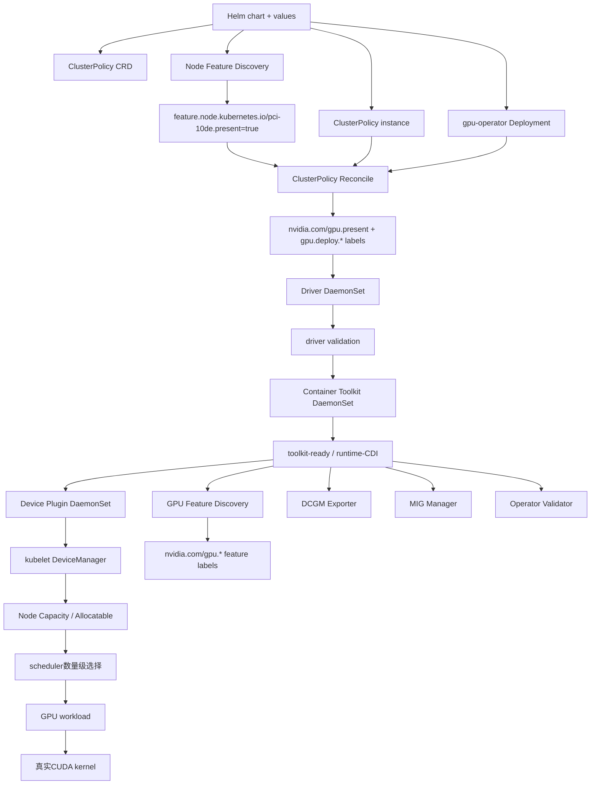
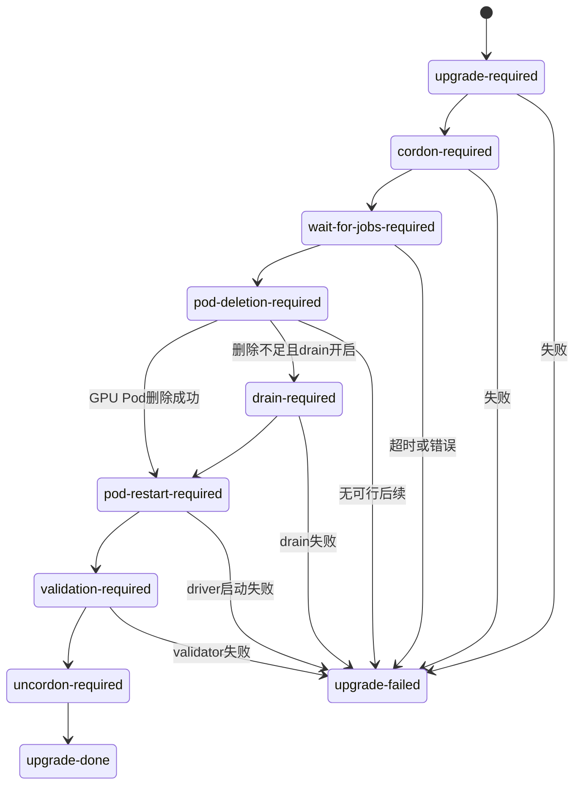

# 第 18 课：GPU Operator——组件编排、安装升级与故障定位

> 主案例：Helm 显示 `deployed`，`gpu-operator` Pod 是 `Running`，`ClusterPolicy` 甚至是 `Ready`，但业务 GPU Pod 仍然拿不到 `nvidia.com/gpu`，或者卡在 `Init`、`CreateContainerError`、`FailedCreatePodSandBox`  
> 主线源码：NVIDIA GPU Operator `v26.3.3` 的 `controllers/{clusterpolicy_controller.go,state_manager.go,object_controls.go,upgrade_controller.go}`、`deployments/gpu-operator/*`、`assets/*`、`cmd/nvidia-validator/main.go`  
> 版本基线：GPU Operator `v26.3.3`，GitHub release tag 指向提交 `b0a49c0e7b2e061dcd83f2bb2fe4fe960c5d0338`；事实核对日期 `2026-07-14`  
> 本课深度：S1。必须读懂 Operator 的控制链、资产编排、状态和升级状态机；不要求逐行读完每个 NVIDIA operand 的内部实现  
> 前置断点：第 14～17 课已经分别拆开节点软件栈、Device Plugin、kubelet DeviceManager、checkpoint/健康/PodResources/CDI；本课回答“企业为什么用 Operator 把这些组件持续装对、升级对、恢复对”

---

## 0. 生产现场：为什么 `Ready` 还不能结案

先看一组很典型的生产证据：

```text
Helm:
  STATUS: deployed

gpu-operator Deployment:
  AvailableReplicas: 1

ClusterPolicy:
  status.state: ready

gpu-operator namespace:
  大部分Pod Running或Completed

业务Pod:
  limits:
    nvidia.com/gpu: 1
  phase: Pending

Node:
  status.allocatable里没有nvidia.com/gpu
```

如果沿用普通 Java 平台应用的直觉，很容易说：

```text
Operator已经Running
  -> Helm部署成功
  -> ClusterPolicy Ready
  -> GPU环境已经可用
```

这个推理不成立。

正确的证据链是：

```text
Helm release存在
  -> Operator控制器能运行
  -> ClusterPolicy被接受并完成一次reconcile
  -> 目标GPU Node被正确发现和打标
  -> 每个需要的operand在目标Node上实际有Pod
  -> driver/toolkit/validator依赖链通过
  -> Device Plugin向kubelet注册并持续上报健康设备
  -> Node status出现正确的GPU逻辑资源
  -> scheduler能选择Node
  -> kubelet能Allocate并让runtime完成注入
  -> 固定的CUDA smoke真正执行GPU kernel
```

前一项通过，不代表后一项自动通过。

### 0.1 本课最反直觉的源码事实

当前 `v26.3.3` 源码中有三个非常重要的边界：

1. 集群没有 GPU Node 时，ClusterPolicy 可以写成 `Ready`，条件消息只是说明正在等待 GPU Node。
2. 集群没有 NFD 标签时，控制器会周期轮询，但也可以把 ClusterPolicy 状态写成 `Ready`。
3. `isDaemonSetReady()` 遇到 `DesiredNumberScheduled == 0` 时直接返回 `Ready`。

所以：

```text
ClusterPolicy Ready
  != 集群一定存在GPU Node
  != operand一定在GPU Node上有Pod
  != Device Plugin一定已广告nvidia.com/gpu
  != CUDA workload一定能运行
```

这不是“文档措辞问题”，而是本课会直接读到的当前控制器语义。

---

## 1. 本课先钉死二十个结论

1. GPU Operator 不是 GPU driver，也不是 Device Plugin；它是持续编排这些组件的 Kubernetes Operator。
2. Helm chart 先安装 Operator、CRD 和一个 ClusterPolicy 实例；真正的 operand 主要由 ClusterPolicy controller 持续创建和更新。
3. `values.yaml` 不是运行时唯一真相；Helm 渲染出的 ClusterPolicy、集群中现存的 ClusterPolicy、控制器最终生成的 DaemonSet 三者都要取证。
4. NFD 先发现 NVIDIA PCI 设备并提供基础标签；Operator 再补 `nvidia.com/gpu.present` 和各 operand 的 deploy 标签。
5. GFD 在驱动/工具链可用后产生 GPU 型号、MIG、显存等更细的 GPU 语义标签；它不能替代 NFD 的初始硬件发现职责。
6. Driver、Toolkit、Device Plugin、GFD、DCGM Exporter、MIG Manager、Validator 是不同 operand，故障责任边界不同。
7. 默认 chart 会启用 driver、toolkit、Device Plugin、GFD、DCGM Exporter、MIG Manager；独立 DCGM hostengine 默认关闭。
8. `driver.enabled=false` 表示 driver 生命周期归宿主机或其他系统管理，不代表 Operator 会替你升级宿主机 driver。
9. `toolkit.enabled=false` 同理：必须先由平台保证 runtime/CDI/toolkit 已正确安装和持久化。
10. CDI 从 GPU Operator `v25.10.0` 起默认启用；`v26.3.3` chart 中 `cdi.enabled=true`。
11. NRI Plugin 在 `v26.3.3` 默认仍关闭；不能把“CDI 默认”误讲成“NRI 默认”。
12. 标准 Device Plugin 或 DRA 分配的 GPU workload 在当前默认 CDI 路径下通常不要求显式写 `runtimeClassName: nvidia`。
13. 通过 `NVIDIA_VISIBLE_DEVICES` 绕过 Kubernetes 分配的 GPU 管理容器属于另一条边界；未启用 NRI 时通常仍需 `runtimeClassName: nvidia`。
14. Operator Validator 有 driver、toolkit、CUDA、plugin 等多段验证；`nvidia-operator-validator` 主容器 Running 不等于每一段历史上都从未失败。
15. operand 大量依赖 `/run/nvidia/validations/*-ready` 和 init container；一批 Pod 同时卡 `Init` 时应先找最上游闸门。
16. DaemonSet `DESIRED=0` 首先应查 NodeSelector、deploy 标签、`gpu.deploy.operands=false` 和 taint/toleration，不应先查容器日志。
17. Helm 升级和 driver 升级是两类状态机；driver 涉及卸载/加载内核模块，风险显著高于普通 Java Deployment 滚动发布。
18. Helm 不会替你安全回滚已经升级的 CRD，`helm rollback` 也不会自动撤销宿主机 driver、runtime 配置和已加载内核模块。
19. Driver upgrade controller 只管理容器化 driver；预装在宿主机的 driver 不在它的生命周期管理范围内。
20. 企业验收必须以“固定镜像、固定脚本、真实 CUDA kernel、精确 Node 和资源断言”为终点，不能只看 `nvidia-smi` 或 Pod Running。

---

## 2. 版本事实：为什么本课把版本写在正文最前面

GPU Operator 的 chart、CRD、operand 版本、CDI/NRI 默认值和升级行为变化很快。脱离版本讲“GPU Operator 就是这样”很危险。

### 2.1 本课快照

| 项目 | 本课基线 | 证据 |
|---|---:|---|
| GPU Operator | `v26.3.3` | 官方 26.3 安装页与 GitHub release |
| Device Plugin | `v0.19.3` | 26.3.3 release notes、chart values |
| GFD | `v0.19.3` | 26.3.3 release notes、chart values |
| Container Toolkit | `v1.19.1` | chart values、component matrix |
| Driver Manager | `v0.11.0` | chart values、component matrix |
| MIG Manager | `v0.14.2` | chart values、component matrix |
| DCGM Exporter | `v4.5.3-4.8.2` | chart values、component matrix |
| CDI | 默认启用 | `cdi.enabled: true` |
| NVIDIA NRI Plugin | 默认关闭 | `cdi.nriPluginEnabled: false` |
| Driver auto upgrade | 默认启用 | `driver.upgradePolicy.autoUpgrade: true` |
| 并行 driver upgrade | 默认 1 Node | `maxParallelUpgrades: 1` |
| 独立 DCGM hostengine | 默认关闭 | `dcgm.enabled: false` |
| NFD | chart 默认安装 | `nfd.enabled: true` |

官方版本入口：

- [GPU Operator 26.3 安装页](https://docs.nvidia.com/datacenter/cloud-native/gpu-operator/26.3/getting-started.html)
- [GPU Operator 26.3.3 release](https://github.com/NVIDIA/gpu-operator/releases/tag/v26.3.3)
- [GPU Operator 26.3 release notes](https://docs.nvidia.com/datacenter/cloud-native/gpu-operator/26.3/release-notes.html)
- [GPU Operator component matrix](https://docs.nvidia.com/datacenter/cloud-native/gpu-operator/26.3/platform-support.html)

### 2.2 生产上不要只记录 `26.3`

版本应至少记录：

```text
chart version
operator image digest
ClusterPolicy generation
每个operand image digest
driver version + kernel module type
Node OS + kernel
container runtime version
Device Plugin/GFD配置
CDI/NRI开关
MIG/sharing策略
```

原因很现实：`v26.3.3` 就修复过一个 Device Plugin feature flag 回归；错误行为会把不应暴露的 `ibverbs` device node 注入 GPU workload，影响 RDMA/NCCL。只写“我们用 26.3”无法判断是否包含修复。

### 2.3 易过时结论清单

下面这些话不能脱离版本复述：

```text
CDI默认关闭                     # 25.10+已不是
CDI启用就必须用nvidia-cdi RuntimeClass
NRI默认启用                     # v26.3.3不是
GFD是独立旧仓库里的单独镜像实现
Operator Ready一定代表有GPU Node
所有operand Ready都要求DESIRED>0
升级driver就是重建DaemonSet Pod
Helm会自动升级和回滚CRD
```

正式排障必须先取现场版本，再套结论。

---

## 3. 先把五个名词分开：Chart、Operator、CRD、ClusterPolicy、operand

### 3.1 Helm chart

Helm chart 是安装和初始配置包。这里要先分清两条 Helm 路径：普通 `templates/` 资源会经过 Go template 渲染；`crds/` 目录中的 CRD 在首次安装时由 Helm 预先安装，但不走普通模板渲染，也不会由普通 Helm 升级自动更新。

典型输入：

```yaml
driver:
  enabled: true
toolkit:
  enabled: true
devicePlugin:
  enabled: true
cdi:
  enabled: true
  nriPluginEnabled: false
```

它会处理：

- 从 `crds/` 安装 ClusterPolicy、NVIDIADriver 等 CRD；
- 从 `templates/` 渲染 GPU Operator Deployment；
- RBAC、ServiceAccount；
- ClusterPolicy 自定义资源；
- NFD 相关资源；
- CRD 升级/清理 hook 等 chart 资源。

### 3.2 Operator

Operator 是运行中的控制器进程。

大白话：

> Helm 负责把“物业公司”装进集群；Operator 负责以后不断巡检并让各 GPU Node 上的 driver、toolkit、plugin、monitor 等设施回到期望状态。

Operator 自己 Running，只证明控制器进程能启动，不证明它已经把所有 Node 配好。

### 3.3 CRD

CRD 扩展 Kubernetes API，让 apiserver 接受：

```yaml
apiVersion: nvidia.com/v1
kind: ClusterPolicy
```

CRD 定义“字段长什么样、如何校验和存储”。

它不自动安装 driver；真正执行的是 controller。

### 3.4 ClusterPolicy

ClusterPolicy 是“这套 GPU 软件栈希望长成什么样”的期望状态。

例如：

```yaml
apiVersion: nvidia.com/v1
kind: ClusterPolicy
metadata:
  name: cluster-policy
spec:
  driver:
    enabled: true
    version: "580.126.20"
  toolkit:
    enabled: true
  devicePlugin:
    enabled: true
  dcgmExporter:
    enabled: true
  cdi:
    enabled: true
    nriPluginEnabled: false
```

当前控制器按 singleton 模式工作：源码保留一个主 ClusterPolicy；不同名字的额外实例可能被标记 `Ignored`。不要把它当成可随意创建多份的普通 namespaced 应用 CR。

### 3.5 operand

operand 是 ClusterPolicy controller 持续管理的实际工作组件。为方便排障，下表也把 NFD 放在同一张责任表中，但严格说 NFD 是 Helm chart 的依赖组件，不是 `state_manager.go` 中由 ClusterPolicy 状态机编排的 operand；`nfd.enabled` 的开关和升级归 chart 层。

| operand | 最核心职责 | 不负责什么 |
|---|---|---|
| NVIDIA driver | 内核模块、用户态 driver 库、NVML/CUDA driver 接口 | 不向 scheduler 广告扩展资源 |
| Container Toolkit | 配置 runtime、CDI spec/注入链 | 不做 Kubernetes 设备数量分配 |
| Device Plugin | 注册扩展资源、健康、Allocate | 不安装内核 driver |
| GFD | 生成 GPU 特性标签 | 不分配 GPU |
| DCGM Exporter | 暴露 GPU 指标 | 不决定 Node Capacity |
| DCGM hostengine | 集中/独立 DCGM 服务；默认不单独启用 | 不是 exporter 本身 |
| MIG Manager | 按 Node 标签应用 MIG 几何配置 | 不等于 Device Plugin 的 MIG 资源广告 |
| Operator Validator | 验证 driver/toolkit/CUDA/plugin 闸门 | 不是长期业务 CUDA SLO 探针 |
| NFD（chart依赖，非ClusterPolicy operand） | 发现 Node 硬件/OS/kernel 等基础特征并打标签 | 不安装 NVIDIA 栈 |

---

## 4. 从 Helm 到 Node 的完整依赖图



这张图有三条不同的“标签链”：

1. NFD 的 `feature.node.kubernetes.io/*`：基础硬件/OS/kernel发现。
2. Operator 的 `nvidia.com/gpu.present` 与 `nvidia.com/gpu.deploy.*`：选择哪些 Node 部署哪些 operand。
3. GFD 的 `nvidia.com/gpu.*`：GPU 型号、能力、MIG 等更细特征。

不要把三者混成“都是 NFD 标签”。

---

## 5. 源码地图：S1 应该读哪些文件

版本固定为 `v26.3.3`，并以该 tag 指向的提交 `b0a49c0e7b2e061dcd83f2bb2fe4fe960c5d0338` 为不可漂移快照：

```text
Helm默认值
  deployments/gpu-operator/values.yaml

Helm把values渲染成ClusterPolicy
  deployments/gpu-operator/templates/clusterpolicy.yaml

CRD与Go类型
  deployments/gpu-operator/crds/nvidia.com_clusterpolicies.yaml
  api/nvidia/v1/clusterpolicy_types.go

ClusterPolicy主循环
  controllers/clusterpolicy_controller.go
    Reconcile
    SetupWithManager

状态顺序、Node发现、deploy标签
  controllers/state_manager.go
    init
    labelGPUNodes
    step
    isStateEnabled

创建/更新对象与DaemonSet Ready判定
  controllers/object_controls.go
    DaemonSet
    isDaemonSetReady

内置资源清单
  assets/state-driver/*
  assets/state-container-toolkit/*
  assets/state-operator-validation/*
  assets/state-device-plugin/*
  assets/gpu-feature-discovery/*
  assets/state-dcgm-exporter/*
  assets/state-mig-manager/*

Validator实现
  cmd/nvidia-validator/main.go
  validator/manifests/*

Driver升级控制器
  controllers/upgrade_controller.go
    Reconcile
    SetupWithManager

共享升级状态机
  github.com/NVIDIA/k8s-operator-libs/pkg/upgrade/*
```

源码链接：

- [clusterpolicy_controller.go](https://github.com/NVIDIA/gpu-operator/blob/v26.3.3/controllers/clusterpolicy_controller.go)
- [state_manager.go](https://github.com/NVIDIA/gpu-operator/blob/v26.3.3/controllers/state_manager.go)
- [object_controls.go](https://github.com/NVIDIA/gpu-operator/blob/v26.3.3/controllers/object_controls.go)
- [upgrade_controller.go](https://github.com/NVIDIA/gpu-operator/blob/v26.3.3/controllers/upgrade_controller.go)
- [v26.3.3 values.yaml](https://github.com/NVIDIA/gpu-operator/blob/v26.3.3/deployments/gpu-operator/values.yaml)
- [ClusterPolicy template](https://github.com/NVIDIA/gpu-operator/blob/v26.3.3/deployments/gpu-operator/templates/clusterpolicy.yaml)
- [本课不可漂移的 commit 快照](https://github.com/NVIDIA/gpu-operator/tree/b0a49c0e7b2e061dcd83f2bb2fe4fe960c5d0338)

### 5.1 为什么不要求读每个 operand 的全部源码

本课问题是：

```text
Operator如何从期望状态收敛出一套GPU节点栈？
如何证明收敛到了正确节点？
升级为什么停在某个状态？
```

因此读到：

- controller 的输入；
- 状态顺序；
- Node 标签选择；
- DaemonSet 资产；
- readiness 判定；
- upgrade state machine；

就已达到 S1。

Device Plugin 的 gRPC 和 kubelet 分配账在第 15～17 课已经 S3 深读；DCGM 内部指标留到第 19 课。

---

## 6. Helm 到 ClusterPolicy：不要把 values 当成现场真相

Chart template 中有这样的逻辑：

```yaml
spec:
  cdi:
    enabled: {{ .Values.cdi.enabled }}
    {{- if and (.Values.cdi.enabled) (.Values.cdi.nriPluginEnabled) }}
    nriPluginEnabled: {{ .Values.cdi.nriPluginEnabled }}
    {{- end }}
  driver:
    enabled: {{ .Values.driver.enabled }}
  toolkit:
    enabled: {{ .Values.toolkit.enabled }}
  devicePlugin:
    enabled: {{ .Values.devicePlugin.enabled }}
```

### 6.1 Helm 语法现场补

#### `.Values.cdi.enabled`

大白话：

> 从安装时的 values 树里取 `cdi.enabled`。

#### `{{- if ... }}`

这是 Go template 条件。

前面的 `-` 会裁掉相邻空白；它只影响渲染排版，不是逻辑取反。

#### `and(a, b)`

只有 CDI 开启且 NRI 开启时，才把 `nriPluginEnabled` 字段写进 ClusterPolicy。

#### `toYaml | nindent 8`

常见写法：

```yaml
tolerations: {{ toYaml .Values.daemonsets.tolerations | nindent 8 }}
```

含义：把结构转成 YAML，再整体缩进 8 格。

缩进错了会让渲染结果无效或字段落错层级，所以升级前必须 `helm template`，不能只肉眼看 values。

### 6.2 四份配置证据

生产上至少比对：

```text
安装记录：helm get values --all
普通模板结果：helm get manifest / helm template
运行对象：kubectl get clusterpolicy cluster-policy -o yaml
CRD证据：helm show crds <chart> --version <version> + kubectl get crd <name> -o yaml
```

它们可能不同：

- Helm values 变过但 release 未成功升级；
- 有人直接 `kubectl edit clusterpolicy`；
- chart 新版本增加了默认值；
- admission/defaulting 改写了对象；
- Operator 的 transform 又根据 runtime、OS、OpenShift、CDI/NRI改变了 DaemonSet。

另外，`helm get manifest` 不能替代 CRD 取证：首次安装时来自 `crds/` 的定义不属于普通模板 manifest，而 pre-upgrade hook 又可能已经修改 live CRD。升级时必须分别保存 chart 内目标 CRD 和 apiserver 中现存 CRD。

不能拿 Git 仓库中的 `values-prod.yaml` 就断言现场一定如此。

---

## 7. `Reconcile`：Operator怎样持续收敛

主入口如下。先说明：下面是从 `v26.3.3` 完整函数中压缩出的**控制流阅读骨架**，删掉了状态聚合、condition 更新、日志和各返回分支，因此不能当成可编译源码直接复制；精确实现应回到上面的固定 commit：

```go
func (r *ClusterPolicyReconciler) Reconcile(
    ctx context.Context,
    req ctrl.Request,
) (ctrl.Result, error) {
    instance := &gpuv1.ClusterPolicy{}
    if err := r.Get(ctx, req.NamespacedName, instance); err != nil {
        // not found或读取失败
    }

    if err := clusterPolicyCtrl.init(ctx, r, instance); err != nil {
        return ctrl.Result{}, err
    }

    for {
        status, statusError := clusterPolicyCtrl.step()
        // 聚合各state状态
        if clusterPolicyCtrl.last() {
            break
        }
    }
}
```

### 7.1 Go 语法现场补：pointer receiver

```go
func (r *ClusterPolicyReconciler) Reconcile(...)
```

`r *ClusterPolicyReconciler` 是指针接收者。

大白话：

> 方法操作的是这个 reconciler 实例本身，可以使用里面的 client、logger、scheme 和 condition updater，不是在复制一个新对象。

### 7.2 `if err := ...; err != nil`

```go
if err := r.Get(...); err != nil {
    ...
}
```

这叫短变量声明加条件。

`err` 的作用域只在这个 `if/else` 内，避免后面误用旧错误。

### 7.3 `(ctrl.Result, error)` 怎么读

控制器有三种常见返回：

```go
return ctrl.Result{}, nil
```

本轮正常结束，不主动要求重排。

```go
return ctrl.Result{RequeueAfter: 5 * time.Second}, nil
```

本轮没有程序错误，但状态尚未收敛，5 秒后再看。

```go
return ctrl.Result{}, err
```

本轮失败，由 controller-runtime 的队列/限速器重试。

这和 Java 方法返回一个业务结果再抛异常的思路相似，但这里返回值同时表达“何时再 reconcile”。

### 7.4 它监听什么

`SetupWithManager()` 主要监听：

- ClusterPolicy generation 变化；
- 相关 Node label 变化；
- ClusterPolicy 拥有的 DaemonSet 变化。

所以 Operator 不是 Helm 安装时只跑一次脚本，而是事件驱动加周期补偿的控制循环。

---

## 8. 状态顺序：为什么一批 Pod 会一起卡 `Init`

`state_manager.go` 当前注册的主要状态顺序：

```text
pre-requisites
state-operator-metrics
state-driver
state-container-toolkit
state-operator-validation
state-device-plugin
state-mps-control-daemon
state-dcgm
state-dcgm-exporter
gpu-feature-discovery
state-mig-manager
state-node-status-exporter
...sandbox/vGPU/Kata/CC states
```

注意两点：

1. 这是控制器处理资源状态的顺序，不等于每个 Pod 完全串行创建。
2. 真正的运行期依赖还通过 init container 和 `/run/nvidia/validations` 文件建立。

### 8.1 典型依赖

Driver DaemonSet：

```yaml
nodeSelector:
  nvidia.com/gpu.deploy.driver: "true"
hostPID: true
initContainers:
- name: k8s-driver-manager
containers:
- name: nvidia-driver-ctr
  securityContext:
    privileged: true
```

Toolkit DaemonSet：

```yaml
nodeSelector:
  nvidia.com/gpu.deploy.container-toolkit: "true"
initContainers:
- name: driver-validation
containers:
- name: nvidia-container-toolkit-ctr
```

Device Plugin DaemonSet：

```yaml
nodeSelector:
  nvidia.com/gpu.deploy.device-plugin: "true"
initContainers:
- name: toolkit-validation
  args:
  - until [ -f /run/nvidia/validations/toolkit-ready ]; do ...; done
```

GFD、DCGM Exporter、MIG Manager 也有等待 toolkit validation 的 init container。

因此看到：

```text
device-plugin Init:0/1
gfd Init:0/1
dcgm-exporter Init:0/1
mig-manager Init:0/1
```

不要并行深挖四个主容器；先确认：

```text
driver是否通过
  -> toolkit是否通过
  -> /run/nvidia/validations/toolkit-ready是否产生
```

### 8.2 Validator的四段主闸门

默认 Operator Validator DaemonSet 主要包含：

```text
driver-validation init container
toolkit-validation init container
cuda-validation init container
plugin-validation init container
nvidia-operator-validator主容器
```

其主容器的长时间 Running，本质上是在前面的 init validations 成功后保持 Pod 存活。

排障应读取精确 init container。下面是命令模板，先把占位符替换成现场精确 Pod 名，不能原样执行：

```text
kubectl logs -n gpu-operator <validator-pod> -c driver-validation
kubectl logs -n gpu-operator <validator-pod> -c toolkit-validation
kubectl logs -n gpu-operator <validator-pod> -c cuda-validation
kubectl logs -n gpu-operator <validator-pod> -c plugin-validation
```

若容器已经重启，还要按现场状态考虑 `--previous`；查询失败必须显式记录，不能把空输出当成成功。

---

## 9. NFD、Operator标签与GFD：三阶段发现链

### 9.1 第一阶段：NFD发现PCI设备

默认 GPU Node 的初始锚点是：

```text
feature.node.kubernetes.io/pci-10de.present=true
```

`0x10de` 是 NVIDIA PCI vendor ID。

NFD 还提供 OS、kernel 等标签，Operator 会用它们选择 driver 镜像/路径，尤其是预编译 driver 或 OpenShift Driver Toolkit 场景。

### 9.2 第二阶段：Operator补公共和deploy标签

`labelGPUNodes()` 会根据 NFD/GPU 标签维护：

```text
nvidia.com/gpu.present=true
nvidia.com/gpu.deploy.driver=true
nvidia.com/gpu.deploy.container-toolkit=true
nvidia.com/gpu.deploy.device-plugin=true
nvidia.com/gpu.deploy.gpu-feature-discovery=true
nvidia.com/gpu.deploy.dcgm-exporter=true
nvidia.com/gpu.deploy.operator-validator=true
...
```

DaemonSet 再用这些标签做 `nodeSelector`。

### 9.3 第三阶段：GFD产生GPU语义标签

GFD 在 toolkit/driver 可用后识别：

- GPU 产品与架构；
- 显存；
- MIG capability/strategy；
- sharing 配置等。

这些标签用于：

- workload nodeAffinity；
- 节点池治理；
- MIG/sharing 策略；
- 可观测性和资产盘点。

GFD 不是 Device Plugin：它打标签，不向 kubelet 执行 Allocate。

### 9.4 一个常见循环依赖误解

错误说法：

```text
GFD没起来，所以Operator发现不了GPU Node
```

更准确的主路径：

```text
NFD先发现PCI 10de
  -> Operator识别GPU Node并部署driver/toolkit
  -> GFD才能进一步读取GPU能力并打细标签
```

若连 PCI 10de 标签都没有，先查 NFD、PCI passthrough、Node 可见性，不要先查 GFD 主容器。

---

## 10. Node deploy标签与taint：`DESIRED=0`先查什么

### 10.1 全部operand开关

官方支持在 Node 上设置：

```text
nvidia.com/gpu.deploy.operands=false
```

控制器看到后会移除一组 GPU state/deploy 标签，从而让 operand DaemonSet 不再匹配该 Node。

这适合：

- 节点维修；
- 特殊镜像/宿主机自管；
- 分阶段纳管；

但它是变更动作，必须有恢复步骤和到期时间。

### 10.2 单独driver开关

也可设置：

```text
nvidia.com/gpu.deploy.driver=false
```

用于特定 Node 不部署容器化 driver。

不要仅改 DaemonSet `nodeSelector`；Operator 下一轮可能按 ClusterPolicy 和 Node 标签重新收敛。

### 10.3 默认toleration不是万能通行证

Chart 默认 operand toleration 包含：

```yaml
- key: nvidia.com/gpu
  operator: Exists
  effect: NoSchedule
```

这只容忍指定 key/effect。

若企业 Node 有：

```text
dedicated=ai:NoSchedule
maintenance=true:NoSchedule
node-role.example/gpu=true:NoExecute
```

默认 toleration 不一定匹配。

### 10.4 `DESIRED=0`排查顺序

```text
1. DaemonSet nodeSelector是什么
2. 目标Node是否有全部selector标签和值
3. 是否有gpu.deploy.operands=false或单组件false
4. Node taints是什么
5. DaemonSet tolerations是否逐条匹配
6. Node是否Ready、是否被删除/隔离
7. 才看scheduler event
```

只要 `DESIRED=0`，就没有 operand Pod，当然也没有可看的该 Pod 容器日志。

只读证据。下面是命令模板，先把占位符替换成现场精确对象名，不能原样执行：

```text
kubectl get ds -n gpu-operator -o wide
kubectl get ds -n gpu-operator <ds-name> -o jsonpath='{.spec.template.spec.nodeSelector}'
kubectl get ds -n gpu-operator <ds-name> -o jsonpath='{.spec.template.spec.tolerations}'
kubectl get node <node-name> --show-labels
kubectl get node <node-name> -o jsonpath='{.spec.taints}'
```

任何一条命令失败都应保留错误；不要继续写“Node没有taint”。

---

## 11. 最关键源码：为什么 `ClusterPolicy Ready` 可能没有GPU可用

### 11.1 没有GPU Node时

`DaemonSet()` 中：

```go
if !n.hasGPUNodes {
    logger.Info("No GPU node in the cluster, do not create DaemonSets")
    return gpuv1.Ready, nil
}
```

大白话：

> 集群当前没有可识别 GPU Node，控制器不创建这些 DaemonSet，但把该步骤视为“当前无需继续等待”。

随后主 Reconcile 会写条件：

```text
No GPU node found, watching for new nodes to join the cluster.
```

并把 CR state 更新为 Ready。

### 11.2 没有NFD标签时

主循环会记录：

```text
WARNING: NFD labels missing in the cluster, GPU nodes cannot be discovered.
```

然后每 45 秒轮询；但当前代码仍更新 CR state 为 `Ready`，条件 reason 表达 `NFDLabelsMissing`。

所以只看：

```text
kubectl --context <approved-context> get clusterpolicy
```

不够；必须读完整 conditions/message。

### 11.3 DaemonSet `DESIRED=0`时

`isDaemonSetReady()`：

```go
if ds.Status.DesiredNumberScheduled == 0 {
    n.logger.V(2).Info("Daemonset has desired pods of 0", "name", name)
    return gpuv1.Ready
}
```

这解释了：

```text
Node有不匹配的taint
  -> DaemonSet DESIRED=0
  -> 此函数仍把该DaemonSet步骤视为Ready
  -> ClusterPolicy可能Ready
  -> 但Node没有任何GPU operand
```

### 11.4 正确验收矩阵

| 证据 | 能证明 | 不能证明 |
|---|---|---|
| Helm `deployed` | release记录存在且Helm事务完成 | operand健康 |
| Operator Pod Running | 控制器进程存活 | GPU Node存在 |
| ClusterPolicy Ready | 当前controller状态步骤未阻塞 | 每个GPU Node有operand |
| DaemonSet Ready | 已匹配的Pod满足DS判定 | DESIRED一定大于0 |
| Validator通过 | 内置验证在该Node通过 | 业务镜像/模型一定兼容 |
| Node有`nvidia.com/gpu` | scheduler看见逻辑资源 | runtime注入一定成功 |
| `nvidia-smi`成功 | driver/NVML查询可用 | CUDA kernel一定执行 |
| 固定CUDA smoke PASS | 当前Node/镜像/runtime链真正可用 | 长期性能与SLO一定健康 |

---

## 12. 托管边界：managed与preinstalled必须先选清楚

### 12.1 模式A：Operator管理driver和toolkit

```yaml
driver:
  enabled: true
toolkit:
  enabled: true
```

Operator负责：

- 部署 driver container；
- 安装/加载内核模块和用户态组件；
- 配置 toolkit/runtime/CDI；
- 运行 validator；
- 容器化 driver 的升级状态机。

平台仍负责：

- OS/kernel 支持矩阵；
- Secure Boot/module signing策略；
- 内核头/包仓库；
- runtime自身生命周期；
- 容量、PDB、业务迁移和变更窗口；
- 供应链与镜像审批。

### 12.2 模式B：宿主机预装driver

```yaml
driver:
  enabled: false
toolkit:
  enabled: true
```

适合：

- 云厂商/OS镜像管理 driver；
- 不允许容器加载内核模块；
- 不同 GPU Node OS 由镜像流水线维护；
- 组织已有内核驱动补丁和重启流程。

关键边界：

> GPU Operator driver upgrade controller 不管理宿主机预装 driver。

若发生 driver CVE 或 kernel 升级，责任在 OS/镜像/节点管理流水线，不应等 Operator 自动处理。

### 12.3 模式C：driver和toolkit都预装

```yaml
driver:
  enabled: false
toolkit:
  enabled: false
```

此时 Operator 仍可管理 Device Plugin、GFD、DCGM Exporter 等，但前提是平台已经保证：

- driver与kernel兼容；
- NVML/CUDA driver库路径正确；
- runtime识别 CDI/legacy NVIDIA runtime；
- toolkit配置在重启后持久；
- CDI spec/刷新机制正确；
- 变更与回滚归属明确。

### 12.4 不要依赖“driver init会自动检测预装”代替显式所有权

官方说明：若未设置 `driver.enabled=false`，driver Pod init 可能检测到预装 driver 后打标并退出，不再重复安装。

这是一种保护，不是推荐的责任模型。

企业配置应显式表达所有权：

```text
谁安装
谁升级
谁验证
谁回滚
谁处理kernel变更
谁维护runtime配置
```

否则故障时两条自动化链互相覆盖，最难排查。

---

## 13. CDI与NRI当前边界

### 13.1 当前默认

`v26.3.3` chart：

```yaml
cdi:
  enabled: true
  nriPluginEnabled: false
```

因此：

```text
CDI默认开启
NRI Plugin默认关闭
```

### 13.2 标准GPU workload

标准 workload 通过：

- NVIDIA Device Plugin 的 extended resource；或
- NVIDIA DRA Driver 的 ResourceClaim；

获得 GPU 分配时，当前 runtime 原生 CDI 路径可以透明完成注入，通常不要求业务 YAML 显式写 `runtimeClassName: nvidia`。

但不要由此误判安装职责：`v26.3.3` 的 GPU Operator chart 会配置 driver/CDI/NFD/GFD 等前置条件，NVIDIA DRA Driver `v0.4.1` 本身仍由独立的 `nvidia/dra-driver-nvidia-gpu` Helm chart 安装，不是 `ClusterPolicy` 状态机中的默认 operand。选 DRA GPU allocation 主路径时，官方步骤还要求关闭传统 `devicePlugin.enabled`，或在明确启用并验证 `DRAExtendedResource` 的共存方案下单独设计。见 [DRA Driver for NVIDIA GPUs](https://docs.nvidia.com/datacenter/cloud-native/gpu-operator/26.3/dra-intro-install.html)。

### 13.3 GPU管理容器

有些管理组件使用：

```text
NVIDIA_VISIBLE_DEVICES=all
```

直接访问全部 GPU，并绕过 Device Plugin/DRA 的业务分配。

这类容器是高权限管理例外，不应推广给普通业务 Pod。

当前官方边界：

- CDI开启、NRI未开启时，管理容器通常仍需要 `runtimeClassName: nvidia`；
- NRI Plugin开启后，这类容器可以不再依赖显式 RuntimeClass；
- NRI要求 CDI 同时开启；当前 `26.3` 支持的门槛是 containerd `v1.7.30`、`v2.1.x`、`v2.2.x`，或 CRI-O `v1.34+`。

### 13.4 NRI不是“更高级所以必须开”

是否启用取决于：

- runtime版本与配置；
- 现有RuntimeClass兼容；
- 管理容器需求；
- 安全审查；
- 回滚能力；
- 厂商支持矩阵。

标准 Device Plugin workload 已可用时，不要为了追新在生产无验证切换 NRI。

当前 `26.3` 还要记住两个版本边界：

- NVIDIA 文档明确提示 containerd 项目的 NRI Plugin 尚未发布 GA 版本，接口实现仍可能变化；
- `spec.hostUsers: false` 的 Kubernetes user namespace Pod 目前不受支持：`nvidia-cdi-hook` 会因用户映射后无法读取 OCI bundle 的 `config.json` 而使容器创建失败。此类 GPU Pod 应省略该字段或显式使用 `hostUsers: true`，并在升级后重新核对官方 Known Issues。

官方边界见 [CDI 与 NRI 支持](https://docs.nvidia.com/datacenter/cloud-native/gpu-operator/26.3/cdi.html)。

---

## 14. 安装前检查：先确定平台事实，再运行Helm

### 14.1 支持矩阵

确认：

- Kubernetes版本；
- OS发行版和版本；
- kernel版本；
- GPU型号；
- containerd/CRI-O版本；
- driver版本和kernel module type；
- MIG/GPUDirect/Secure Boot需求；
- 是否使用 OpenShift/K3s/MicroK8s 等特殊发行版。

不要先安装再用 CrashLoop 试出兼容性。

`ClusterPolicy` 管理容器化 driver 时还有一个硬边界：官方要求承载 GPU workload 的 worker Node/Node group 使用相同 OS 版本。混合 OS 不能靠同一份 `ClusterPolicy.spec.driver` 猜测兼容；要么让宿主机镜像预装 driver，要么从新集群设计阶段选择互斥的 `NVIDIADriver` CRD 架构，并逐项核对其限制。

### 14.2 NFD所有权

如果集群已有 NFD，应显式：

```yaml
nfd:
  enabled: false
```

并核对现有 NFD 版本和标签。

同一集群重复部署 NFD，可能造成：

- 标签竞争；
- RBAC/端口冲突；
- Node label短暂删除和operand重建；
- 升级责任不清。

### 14.3 Namespace与PSA

GPU Operator 的 driver/toolkit 等 operand 需要 privileged、hostPID、hostIPC、hostPath 和内核/服务操作。

如果启用 Pod Security Admission，官方安装前要求为专用 namespace 设置 privileged enforcement。

这不是说“整个业务集群放开 privileged”，而是：

```text
专用gpu-operator namespace
  + 严格限制谁能创建/修改该namespace对象
  + 审计RBAC
  + 禁止普通租户访问
```

### 14.4 Taint与容量

预先列出 GPU Node 的 taint，并把必要 toleration 写进 values。

还要保证 Operator Deployment 本身有可调度位置；单节点集群尤其要防止升级/排空时把控制器一起赶走。

### 14.5 网络与包仓库

容器化 driver 可能在启动时下载 deb/rpm 或依赖内核头。

要确认：

- DNS；
- registry；
- package mirror；
- HTTP/HTTPS proxy；
- `NO_PROXY`；
- TLS CA；
- imagePullSecret；
- OS/kernel对应的driver镜像。

“镜像已拉到本地仓库”不等于 driver 安装全程不需要外部包仓库。

### 14.6 所有权决策表

| 项目 | Operator托管 | 宿主机/其他系统托管 | 现场决定 |
|---|---|---|---|
| driver | `driver.enabled=true` | `false` | 只能明确一种主责任 |
| toolkit | `toolkit.enabled=true` | `false` | runtime配置归属要清楚 |
| NFD | `nfd.enabled=true` | `false` | 集群只保留一套责任链 |
| Device Plugin | 通常Operator | 外部部署时关闭 | 避免双注册/双配置 |
| DCGM Exporter | 通常Operator | 平台监控栈 | 避免端口/指标重复 |
| MIG Manager | 按需Operator | 外部GPU管理 | 变更必须排空与恢复 |

---

## 15. 安装命令不是实验：先渲染、审计，再变更

### 15.1 只读/本地渲染阶段

固定版本：

```powershell
$release = 'v26.3.3'
helm show chart nvidia/gpu-operator --version $release
helm show values nvidia/gpu-operator --version $release
helm show crds nvidia/gpu-operator --version $release
```

使用企业 values 渲染：

```powershell
helm template gpu-operator nvidia/gpu-operator `
  --namespace gpu-operator `
  --version $release `
  --include-crds `
  --values .\values-gpu-operator.yaml
```

这里要审计：

- 所有 image repository/tag；
- imagePullPolicy；
- privileged/hostPID/hostIPC；
- hostPath；
- ServiceAccount/RBAC；
- NodeSelector/toleration；
- driver/toolkit/NFD所有权；
- CDI/NRI；
- driver upgrade policy；
- CRD hook；
- proxy和secret引用。

### 15.2 server-side dry-run不是完整预演

可把渲染结果交给 API server dry-run 校验 schema/admission：

```text
kubectl apply --dry-run=server -f <rendered-manifest>
```

它能发现：

- API版本不存在；
- admission拒绝；
- CRD schema问题；
- namespace/RBAC一部分问题。

它不能证明：

- driver能加载；
- runtime配置能生效；
- GPU硬件健康；
- DaemonSet能调度；
- CUDA能执行。

还有一个 CRD 顺序边界：server-side dry-run 不会把本轮 CRD 真正持久化，因此“新 CRD + 依赖该新 schema 的 CR”放在同一次 dry-run 中，不能等价模拟 pre-upgrade hook 先升级 CRD、再渲染/提交 CR 的真实顺序。目标集群仍是旧 CRD 时，新的 ClusterPolicy 字段也可能先按旧 schema 被拒绝；这正是 hook 路径需要 `--disable-openapi-validation`、并且生产升级仍要在隔离测试集群演练的原因。

### 15.3 真实安装是变更动作

官方示例：

```powershell
$ErrorActionPreference = 'Stop'
$ApprovedContext = 'REPLACE_WITH_APPROVED_CONTEXT'

$actualContext = kubectl config current-context
if ($LASTEXITCODE -ne 0 -or [string]::IsNullOrWhiteSpace($actualContext)) {
  throw '读取current-context失败'
}
if ($actualContext.Trim() -cne $ApprovedContext) {
  throw "context不匹配：expected=$ApprovedContext actual=$actualContext"
}

helm upgrade --install gpu-operator nvidia/gpu-operator `
  --kube-context $ApprovedContext `
  --namespace gpu-operator `
  --create-namespace `
  --version v26.3.3 `
  --values .\values-gpu-operator.yaml `
  --wait `
  --timeout 15m

if ($LASTEXITCODE -ne 0) {
  throw "GPU Operator Helm变更失败，exitCode=$LASTEXITCODE"
}
```

生产执行前必须具备：

- 精确 kube context；
- 变更单和批准时间窗；
- 可用 GPU canary Node；
- 业务容量余量；
- 预装/托管边界确认；
- 镜像与包仓库可达；
- 失败停止条件；
- CRD/ClusterPolicy/values备份；
- driver/runtime/Node恢复方案。

`--wait` 只等待 Helm 认定的资源就绪，不是 GPU 业务验收。

如果集群启用了 PSA 限制，应先按第 14.3 节创建并标记 `gpu-operator` namespace，再执行安装并去掉 `--create-namespace`；该参数只负责创建 namespace，不会替你添加 `pod-security.kubernetes.io/enforce=privileged` 标签。

---

## 16. 安装后六层验证

### 16.1 第一层：Helm与控制器

```powershell
$Context = 'REPLACE_WITH_APPROVED_CONTEXT'
helm status gpu-operator -n gpu-operator --kube-context $Context
helm get values gpu-operator -n gpu-operator --all --kube-context $Context
kubectl --context $Context get deployment -n gpu-operator -l app=gpu-operator -o wide
kubectl --context $Context get pod -n gpu-operator -l app=gpu-operator `
  -o jsonpath='{range .items[*]}{.metadata.name}{"\t"}{range .status.containerStatuses[*]}{.name}{"="}{.imageID}{" "}{end}{"\n"}{end}'
kubectl --context $Context logs -n gpu-operator deployment/gpu-operator --tail=300
```

回答：

- release版本是什么；
- Operator image digest是什么；
- 控制器是否反复重启；
- 是否有CRD/RBAC/reconcile error。

### 16.2 第二层：ClusterPolicy完整状态

```powershell
$Context = 'REPLACE_WITH_APPROVED_CONTEXT'
kubectl --context $Context get clusterpolicy
kubectl --context $Context get clusterpolicy cluster-policy -o yaml
```

必须读：

```text
metadata.generation
status.state
status.conditions[*].type
status.conditions[*].reason
status.conditions[*].message
status.conditions[*].observedGeneration（若现场版本提供）
```

若 message 是 `No GPU node found` 或 `No NFD labels found`，就不能把 `Ready` 写成“GPU栈可用”。

### 16.3 第三层：DaemonSet是否实际匹配目标Node

```powershell
$Context = 'REPLACE_WITH_APPROVED_CONTEXT'
kubectl --context $Context get ds -n gpu-operator -o wide
kubectl --context $Context get pods -n gpu-operator -o wide
```

对每种目标 Node 类型校验：

```text
DESIRED > 0
CURRENT == DESIRED
READY == DESIRED
UP-TO-DATE == DESIRED
Pod.spec.nodeName确实是批准的GPU Node
```

多节点池不能只随机看一个 Pod。

### 16.4 第四层：Node标签与扩展资源

下面是命令模板，必须先把 `<node-name>` 替换为批准的精确 Node 名，不能原样执行：

```text
kubectl get node <node-name> -o yaml
kubectl get node <node-name> `
  -o jsonpath='{.status.capacity.nvidia\.com/gpu}{"\t"}{.status.allocatable.nvidia\.com/gpu}{"\n"}'
```

检查：

```text
NFD PCI标签
nvidia.com/gpu.present
各gpu.deploy.*标签
GFD特性标签
nvidia.com/gpu Capacity/Allocatable
MIG资源名（若启用）
```

这里的数量是 Device Plugin 广告的逻辑设备单位，不必然等于物理卡数；MIG/time-slicing 会改变语义。

### 16.5 第五层：validator与插件

下面包含 Pod 名占位符，是命令模板，不能原样执行：

```text
kubectl get pods -n gpu-operator -l app=nvidia-operator-validator -o wide
kubectl get pods -n gpu-operator -l app=nvidia-device-plugin-daemonset -o wide
kubectl logs -n gpu-operator <device-plugin-pod> -c nvidia-device-plugin --tail=300
```

要求：

- validator全部init container成功；
- Device Plugin没有反复注册/退出；
- ListAndWatch有健康设备；
- Node资源与预期逻辑设备单位一致。

### 16.6 第六层：固定CUDA workload

最后才运行真实工作负载：

```text
request 1个明确资源
  -> 绑定到明确canary Node
  -> DeviceManager Allocate成功
  -> runtime/CDI注入成功
  -> 固定程序启动
  -> 实际执行CUDA kernel
  -> 输出唯一机器可判定PASS
```

不能用下面这些作为最终验收：

```text
sleep
只有nvidia-smi
只加载libcuda.so
只打印CUDA_VISIBLE_DEVICES
随意允许操作员输入任意命令
```

---

## 17. 只读取证脚本：先生成节点×组件矩阵

下面脚本不修改集群。它要求操作员先给出批准 context，避免从错误集群采集“证据”。

```powershell
param(
  [Parameter(Mandatory=$true)]
  [string]$ApprovedContext,

  [Parameter(Mandatory=$true)]
  [string]$OperatorNamespace,

  [Parameter(Mandatory=$true)]
  [string]$ClusterPolicyName,

  [Parameter(Mandatory=$true)]
  [string]$ApprovedNode
)

$ErrorActionPreference = 'Stop'

$actualContext = kubectl config current-context
if ($LASTEXITCODE -ne 0 -or [string]::IsNullOrWhiteSpace($actualContext)) {
  throw '读取current-context失败'
}
if ($actualContext.Trim() -cne $ApprovedContext) {
  throw "context不匹配：expected=$ApprovedContext actual=$actualContext"
}

$dnsLabel = '\A[a-z0-9](?:[-a-z0-9]*[a-z0-9])?\z'
$dnsSubdomain = '\A(?=.{1,253}\z)(?:[a-z0-9](?:[-a-z0-9]*[a-z0-9])?\.)*[a-z0-9](?:[-a-z0-9]*[a-z0-9])?\z'

if ($OperatorNamespace.Length -gt 63 -or $OperatorNamespace -notmatch $dnsLabel) {
  throw 'OperatorNamespace格式非法'
}
if ($ClusterPolicyName -notmatch $dnsSubdomain) {
  throw 'ClusterPolicyName格式非法'
}
if ($ApprovedNode -notmatch $dnsSubdomain) {
  throw 'ApprovedNode格式非法'
}

$nodeName = kubectl --context $ApprovedContext get node $ApprovedNode -o jsonpath='{.metadata.name}'
if ($LASTEXITCODE -ne 0 -or $nodeName -cne $ApprovedNode) {
  throw '无法精确读取批准Node'
}

$cp = kubectl --context $ApprovedContext get clusterpolicy $ClusterPolicyName -o json
if ($LASTEXITCODE -ne 0 -or [string]::IsNullOrWhiteSpace($cp)) {
  throw '读取ClusterPolicy失败'
}

$node = kubectl --context $ApprovedContext get node $ApprovedNode -o json
if ($LASTEXITCODE -ne 0 -or [string]::IsNullOrWhiteSpace($node)) {
  throw '读取Node失败'
}

$daemonSets = kubectl --context $ApprovedContext get ds -n $OperatorNamespace -o json
if ($LASTEXITCODE -ne 0 -or [string]::IsNullOrWhiteSpace($daemonSets)) {
  throw '读取DaemonSet失败'
}

$pods = kubectl --context $ApprovedContext get pods -n $OperatorNamespace `
  --field-selector "spec.nodeName=$ApprovedNode" -o json
if ($LASTEXITCODE -ne 0 -or [string]::IsNullOrWhiteSpace($pods)) {
  throw '读取目标Node上的operand Pod失败'
}

$cpText = $cp -join [Environment]::NewLine
$nodeText = $node -join [Environment]::NewLine
$dsText = $daemonSets -join [Environment]::NewLine
$podText = $pods -join [Environment]::NewLine

$cpObj = ConvertFrom-Json -InputObject $cpText
$nodeObj = ConvertFrom-Json -InputObject $nodeText
$dsObj = ConvertFrom-Json -InputObject $dsText
$podObj = ConvertFrom-Json -InputObject $podText

[pscustomobject]@{
  Context = $actualContext.Trim()
  ClusterPolicyState = $cpObj.status.state
  ClusterPolicyConditions = @($cpObj.status.conditions | ForEach-Object {
    "$($_.type):$($_.reason):$($_.message)"
  }) -join ' | '
  Node = $nodeObj.metadata.name
  NfdPciPresent = $nodeObj.metadata.labels.'feature.node.kubernetes.io/pci-10de.present'
  GpuPresent = $nodeObj.metadata.labels.'nvidia.com/gpu.present'
  Capacity = $nodeObj.status.capacity.'nvidia.com/gpu'
  Allocatable = $nodeObj.status.allocatable.'nvidia.com/gpu'
  NamespacePodsOnNode = @($podObj.items).Count
}

$dsObj.items | Sort-Object { $_.metadata.name } | ForEach-Object {
  $daemonSet = $_
  $ownedPods = @($podObj.items | Where-Object {
    @($_.metadata.ownerReferences | Where-Object {
      $_.kind -ceq 'DaemonSet' -and $_.uid -ceq $daemonSet.metadata.uid
    }).Count -gt 0
  })

  [pscustomobject]@{
    DaemonSet = $daemonSet.metadata.name
    Desired = $daemonSet.status.desiredNumberScheduled
    Current = $daemonSet.status.currentNumberScheduled
    Ready = $daemonSet.status.numberReady
    Updated = $daemonSet.status.updatedNumberScheduled
    Unavailable = $daemonSet.status.numberUnavailable
    NodeSelector = ($daemonSet.spec.template.spec.nodeSelector | ConvertTo-Json -Compress)
    PodsOnApprovedNode = @($ownedPods | ForEach-Object { $_.metadata.name }) -join ','
  }
}

$podObj.items | Sort-Object { $_.metadata.name } | ForEach-Object {
  [pscustomobject]@{
    Pod = $_.metadata.name
    Phase = $_.status.phase
    Node = $_.spec.nodeName
    Init = @($_.status.initContainerStatuses | ForEach-Object {
      "$($_.name):ready=$($_.ready):restart=$($_.restartCount):image=$($_.image):imageID=$($_.imageID)"
    }) -join ';'
    Containers = @($_.status.containerStatuses | ForEach-Object {
      "$($_.name):ready=$($_.ready):restart=$($_.restartCount):image=$($_.image):imageID=$($_.imageID)"
    }) -join ';'
  }
}
```

### 17.1 这段脚本能证明什么

它把四类证据连起来：

```text
ClusterPolicy条件
Node发现/资源
DaemonSet总体状态
目标Node实际Pod
```

它不能证明：

- 节点内 driver kernel module 细节；
- CDI spec 内容；
- runtime最终ContainerConfig；
- CUDA kernel执行；
- GPU长期健康。

所以输出是排障入口，不是最终 PASS。

---

## 18. 受控CUDA验收实验：真正闭环但不允许任意命令

这是有状态实验，只能在批准的 lab namespace 和 canary GPU Node 执行。

### 18.1 实验前置保护

必须满足：

```text
current-context与批准值精确一致
lab namespace预先存在且有平台约定标签
canary Node预先有平台约定lab标签
GPU image使用批准digest
脚本路径固定，不接受任意command参数
资源路径限定传统nvidia.com/gpu:1
不在MIG/DRA/time-slicing语义不明环境直接套用
默认立即清理
```

建议平台自建验收镜像，固定包含：

```text
/opt/gpu-lab/cuda-smoke
  -> 枚举恰好一个分配设备
  -> 分配device memory
  -> 启动一个真实CUDA kernel
  -> 同步并校验结果
  -> 成功只输出CUDA_SMOKE_PASS
  -> 失败非0退出
```

### 18.2 Pod模板

```yaml
apiVersion: v1
kind: Pod
metadata:
  name: gpu-operator-e2e
  namespace: __LAB_NAMESPACE__
  labels:
    gpu-lab.example.com/owner: __OWNER__
spec:
  restartPolicy: Never
  affinity:
    nodeAffinity:
      requiredDuringSchedulingIgnoredDuringExecution:
        nodeSelectorTerms:
        - matchFields:
          - key: metadata.name
            operator: In
            values:
            - __APPROVED_NODE__
  containers:
  - name: cuda-smoke
    image: __APPROVED_IMAGE_AT_SHA256__
    imagePullPolicy: IfNotPresent
    command:
    - /opt/gpu-lab/cuda-smoke
    resources:
      limits:
        nvidia.com/gpu: 1
```

### 18.3 PASS条件

全部成立才算通过：

```text
Pod.spec.nodeName == ApprovedNode
Pod phase == Succeeded
container exitCode == 0
kubectl logs调用成功
日志非空
日志精确包含单一CUDA_SMOKE_PASS
程序确认只看到1个已分配逻辑设备
创建后的Node资源语义与实验前一致
实验Pod被清理并确认不存在
```

### 18.4 清理

默认：

下面是清理命令模板；先把 `<lab-ns>` 替换为已批准的实验 namespace，不能原样执行：

```text
kubectl --context <approved-context> delete pod gpu-operator-e2e -n <lab-ns> --wait=true --timeout=120s
kubectl --context <approved-context> get pod gpu-operator-e2e -n <lab-ns>
```

第二条应返回 NotFound；其他错误要人工确认。

若因工单要求保留：

- 显式 `KeepArtifacts=true`；
- 标记 owner、ticket、expiry；
- 输出精确删除命令；
- 到期自动清理；
- 不使用无限 `Read-Host` 挂住流水线。

---

## 19. 故障树一：Operator Pod自己CrashLoop

### 19.1 先看容器为什么退出

```powershell
$Context = 'REPLACE_WITH_APPROVED_CONTEXT'
kubectl --context $Context describe pod -n gpu-operator -l app=gpu-operator
kubectl --context $Context logs -n gpu-operator deployment/gpu-operator --previous --tail=500
kubectl --context $Context get events -n gpu-operator --sort-by='.lastTimestamp'
```

分支：

| 现象 | 优先检查 |
|---|---|
| OOMKilled | Operator request/limit、集群Node规模、对象数量 |
| Forbidden | ClusterRole/Binding、ServiceAccount、admission |
| no matches for kind | CRD未安装/升级失败 |
| ImagePullBackOff | registry、secret、digest、proxy/DNS |
| panic/invalid spec | ClusterPolicy字段、版本兼容、controller日志 |
| leader election失败 | RBAC、Lease、重复Operator实例 |

官方 troubleshooting 提到大集群（例如 300+ Node）可能因 Operator memory limit 太低 CrashLoop；不要把所有 CrashLoop 都归咎于 GPU driver。

### 19.2 Operator日志中看哪个controller

常见 logger：

```text
controllers.ClusterPolicy
controllers.Upgrade
```

要带时间窗、ClusterPolicy generation、Node/DaemonSet一起分析，不能只截一行 error。

---

## 20. 故障树二：ClusterPolicy NotReady

### 20.1 找未就绪state

控制器会聚合类似：

```text
ClusterPolicy is not ready, states not ready: [...]
```

把 state 映射到组件：

| state | 主要组件 |
|---|---|
| `state-driver` | driver DaemonSet |
| `state-container-toolkit` | toolkit DaemonSet |
| `state-operator-validation` | validator |
| `state-device-plugin` | Device Plugin |
| `state-dcgm-exporter` | DCGM Exporter |
| `gpu-feature-discovery` | GFD |
| `state-mig-manager` | MIG Manager |

### 20.2 generation证据

如果刚改 ClusterPolicy：

```text
metadata.generation已增加
  但controller日志没有新reconcile
```

查：

- Operator是否活着；
- controller cache/RBAC；
- 是否修改了被忽略的第二个 ClusterPolicy；
- webhook/CRD conversion；
- event queue/rate limit。

### 20.3 不要直接编辑生成的DaemonSet治标

Operator采用期望状态收敛。

手工改：

下面这条是“不要这样改”的反例，不是可执行 runbook：

```text
kubectl edit ds nvidia-device-plugin-daemonset
```

可能下一轮就被恢复。

正确顺序：

```text
确认生成来源
  -> 修改Helm values或ClusterPolicy受支持字段
  -> 观察generation和reconcile
  -> 检查最终DaemonSet
```

紧急临时变更也要记录偏离和恢复动作。

---

## 21. 故障树三：一批operand卡在Init

### 21.1 先看共同上游

如果 Device Plugin、GFD、DCGM Exporter、MIG Manager 同时卡 init：

```text
共同等待toolkit-ready
  -> 查toolkit

toolkit又等待driver validation
  -> 查driver
```

### 21.2 Driver分支

检查：

- driver pod主容器日志；
- `k8s-driver-manager` init日志；
- Node `dmesg`/journal中的 NVRM、Xid、module load；
- kernel headers和包仓库；
- nouveau冲突；
- Secure Boot/module signing；
- OS/driver支持矩阵；
- NVSwitch/Fabric Manager状态；
- driver image是否匹配Node OS/kernel。

查询型 `nvidia-smi` 通常不改变管理配置，但官方提示 root 调用可能影响 device file；生产上仍应优先非 root、记录执行人和时间，不把它宣传成绝对零状态操作。

### 21.3 Toolkit分支

检查：

- driver validation是否成功；
- toolkit container日志；
- containerd/CRI-O实际配置路径和socket；
- runtime服务是否成功reload/restart；
- CDI目录与spec；
- NRI开关和runtime版本；
- host root/安装目录挂载。

错误：

```text
no runtime for "nvidia" is configured
```

说明 RuntimeClass handler 与 runtime配置不一致；不要先重装 Device Plugin。

### 21.4 Validator分支

| 卡点 | 说明 |
|---|---|
| driver-validation | driver/NVML/附加driver未就绪 |
| toolkit-validation | runtime/toolkit/CDI链未就绪 |
| cuda-validation | CUDA workload启动/执行失败 |
| plugin-validation | Device Plugin资源/测试Pod失败 |

NVSwitch系统如果报 `system not yet initialized`，要检查 Fabric Manager，而不是无限重启 validator。

---

## 22. 故障树四：DaemonSet `DESIRED=0`

### 22.1 四类根因

```text
Node没有被Operator识别为GPU Node
  -> NFD/PCI标签缺失

deploy标签缺失或false
  -> operands被禁用/状态标签未收敛

nodeSelector不匹配
  -> Node池/自定义配置/标签值错误

taint未容忍
  -> DS controller计算不出应调度Pod
```

### 22.2 为什么ClusterPolicy可能仍Ready

回到第 11 节：当前源码对 `DesiredNumberScheduled == 0` 返回 Ready。

所以正确告警不能只写：

```text
ClusterPolicy state != ready
```

还应包含：

```text
预期GPU Node数量 > 0
  且关键operand DS desired == 0
```

并按节点池/OS分组，防止一个正常Node掩盖另一个Node池完全未覆盖。

---

## 23. 故障树五：Device Plugin Running但Node没有资源

这时回到第 15 课的证据链：

```text
plugin Pod Running
  -> socket监听？
  -> kubelet Register成功？
  -> GetOptions成功？
  -> first ListAndWatch snapshot到达？
  -> 健康entry数量？
  -> kubelet Node Status patch？
  -> apiserver Node对象？
```

GPU Operator层重点补充：

- plugin DaemonSet实际Pod是否在目标Node；
- init `toolkit-ready`是否曾通过；
- Device Plugin配置 ConfigMap；
- `nvidia.com/device-plugin.config` Node label；
- MIG/sharing策略；
- CDI/device list strategy；
- 插件image digest是否就是预期 `v0.19.3`；
- 是否部署了第二套外部 Device Plugin。

不要因为 GFD 标签存在就断言 Device Plugin 注册成功；二者是不同进程和状态链。

---

## 24. 故障树六：Validator失败或GPU workload仍启动失败

### 24.1 `FailedCreatePodSandBox`

优先看：

- runtime handler/CDI/NRI；
- toolkit日志；
- containerd/CRI-O日志；
- RuntimeClass；
- nouveau/driver加载；
- sandbox runtime。

CreateContainer前失败时通常还没有container ID；不要强行跑 `crictl inspect <container>`。

用：

```text
Pod UID
PodSandbox ID（若已创建）
Node
精确时间窗
kubelet/runtime日志
Event
```

关联。

### 24.2 `CreateContainerError`

可能已越过sandbox，但在：

- Device Plugin PreStart；
- CDI解析；
- OCI hook；
- device node/mount；
- runtime create；

失败。

只对成功创建、有ID的对象做 inspect；runtime-specific verbose输出可能包含环境变量、参数、registry auth或annotation，不能原样贴工单。

### 24.3 只在本地脱敏inspect

安全要求：

```text
原始inspect只在授权Node临时文件
文件权限600
默认只提取status、mount/device/CDI必要字段
删除env值、args、registry/auth、secret annotation
上传前人工复核
按策略销毁原始文件
```

### 24.4 `nvidia-smi`通过但CUDA失败

分支：

- 业务镜像CUDA runtime与driver兼容；
- libcuda/libnvidia-ml挂载；
- CDI spec；
- driver capabilities；
- Device Plugin AllocateResponse；
- MIG实例/资源名；
- 容器securityContext/seccomp/SELinux；
- GPU硬件Xid/ECC；
- Fabric Manager/NVLink环境。

这就是为什么最终验收必须运行真实 kernel。

---

## 25. Chart与CRD升级：为什么要分成两个风险面

### 25.1 Helm不会自动安全升级已有CRD

官方升级页明确：Helm 本身不会自动升级已经存在的 CRD。

GPU Operator提供两种方法：

1. 先手工 apply 新版 ClusterPolicy、NVIDIADriver、NFD CRD，再 `helm upgrade`。
2. 使用 pre-upgrade hook；从 `v24.9.0` 起 chart 默认启用 CRD upgrade hook。

当前 values：

```yaml
operator:
  upgradeCRD: true
```

启用 hook 升级时，官方命令要求考虑：

```text
--disable-openapi-validation
```

因为 Helm 渲染的新 CR 可能无法通过旧 CRD schema 的客户端验证，而 hook 尚未先运行。

### 25.2 升级前证据包

至少备份：

```powershell
$Context = 'REPLACE_WITH_APPROVED_CONTEXT'
helm get values gpu-operator -n gpu-operator --all --kube-context $Context
helm get manifest gpu-operator -n gpu-operator --kube-context $Context
kubectl --context $Context get crd clusterpolicies.nvidia.com -o yaml
kubectl --context $Context get crd nvidiadrivers.nvidia.com -o yaml
kubectl --context $Context get clusterpolicy cluster-policy -o yaml
kubectl --context $Context get ds,pod -n gpu-operator -o wide
kubectl --context $Context get node -l nvidia.com/gpu.present=true -o yaml
```

注意脱敏和访问控制；Node/Pod YAML可能含内部地址、镜像、annotation和配置引用。

### 25.3 先做版本跨度检查

官方生命周期说明：升级只支持同一 major release 内或到下一个 major release。

不要从多个大版本前直接跳到 `26.3.3`，除非当前官方矩阵明确支持。

### 25.4 先diff defaults

下面是版本对比命令模板；必须先把 `<old>` 替换为当前生产 release 的精确 chart 版本，不能原样执行：

```text
helm show values nvidia/gpu-operator --version <old> > values-old.yaml
helm show values nvidia/gpu-operator --version v26.3.3 > values-new.yaml
```

重点：

- 新增/废弃字段；
- CDI/NRI默认；
- driver/module type；
- operand版本；
- RBAC；
- hostPath和privilege；
- CRD schema；
- upgrade policy；
- Node label和selector；
- image repository。

不要把旧 release 的全部 `helm get values --all` 原样喂给新 chart；其中包含旧默认值，可能覆盖新安全默认。

### 25.5 `helm rollback`的边界

它主要回退 Helm 管理的 Kubernetes manifest revision。

它不会可靠自动完成：

- CRD schema降级；
- 已写入新字段的CR迁移；
- 宿主机driver回退；
- 已加载内核模块回退；
- runtime配置恢复；
- CDI文件恢复；
- MIG几何恢复；
- 被驱逐业务恢复。

所以 GPU Operator rollback 必须是组件化 runbook，不是一条 `helm rollback`。

“两类状态机分开”也不等于两者永远互不触发。Chart 中的 ClusterPolicy 模板会把 values 写回现有 CR；若新 chart/defaults 或企业 values 改变了 `spec.driver.version`、driver image 或相关模板，Helm upgrade 完成后可能立即让 driver upgrade controller 进入升级流程。企业变更应把它拆成两个批准闸门：第一阶段固定 driver 期望值，只升级 chart/CRD/Operator 并验收；第二阶段再单独修改 driver 期望值、按 canary 状态机推进。若厂商升级说明要求联动，则也要在同一窗口中明确两个停止条件，而不是假设 `helm --wait` 会替 driver 升级兜底。

---

## 26. Driver升级为什么是独立状态机

Driver Pod重建涉及：

```text
停止所有driver客户端
卸载旧内核模块
启动新driver Pod
安装/加载新driver模块
验证
恢复客户端
```

这和 Java Deployment：

```text
起新Pod -> readiness -> 删旧Pod
```

完全不同。

内核模块仍被 CUDA、DCGM、Device Plugin、Fabric Manager 或业务进程占用时，driver不能安全卸载。

### 26.1 当前配置

```yaml
driver:
  upgradePolicy:
    autoUpgrade: true
    maxParallelUpgrades: 1
    maxUnavailable: 25%
    waitForCompletion:
      timeoutSeconds: 0
      podSelector: ""
    gpuPodDeletion:
      force: false
      timeoutSeconds: 300
      deleteEmptyDir: false
    drain:
      enable: false
      force: false
      timeoutSeconds: 300
      deleteEmptyDir: false
```

### 26.2 控制器源码入口

`controllers/upgrade_controller.go`：

```go
state, err := r.StateManager.BuildState(
    ctx,
    clusterPolicyCtrl.operatorNamespace,
    driverLabel,
)

err = r.StateManager.ApplyState(
    ctx,
    state,
    clusterPolicy.Spec.Driver.UpgradePolicy,
)
```

实际状态机由：

```text
github.com/NVIDIA/k8s-operator-libs/pkg/upgrade
```

提供。

`v26.3.3` 的 `go.mod` 固定到伪版本提交 `a0a0256b9c5e`。

### 26.3 Go 语法现场补：interface

共享库定义：

```go
type ClusterUpgradeStateManager interface {
    BuildState(...) (*ClusterUpgradeState, error)
    ApplyState(...) error
}
```

大白话：

> GPU Operator controller只依赖“能构建状态快照、能应用状态”的能力，不必在这个文件里知道每个cordon/drain/validation细节。

这样测试可以替换实现，多个 NVIDIA Operator 也能复用升级库。

### 26.4 Build与Apply为什么分开

```text
BuildState
  -> 读取某一时刻driver DS、Pod、Node label
  -> 形成集群升级快照

ApplyState
  -> 根据policy和快照
  -> 决定哪些Node可以前进
  -> 执行幂等动作/更新状态label
```

这和平台做批次发布很像：先算“谁处于什么状态”，再按并发/不可用预算推进。

---

## 27. Driver upgrade state machine逐状态解释

标准 in-place 路径：



Node label：

```text
nvidia.com/gpu-driver-upgrade-state
```

| state | 大白话 | 主要风险/证据 |
|---|---|---|
| 空/unknown | 未处理或控制器关闭 | autoUpgrade、controller日志 |
| `upgrade-required` | 发现driver Pod版本/模板需要更新 | desired与current image/hash |
| `cordon-required` | 先禁止新Pod进入 | Node unschedulable、原始状态 |
| `wait-for-jobs-required` | 等指定任务完成 | selector、timeout、Job状态 |
| `pod-deletion-required` | 删除使用GPU的Pod | owner、PDB、grace、force策略 |
| `drain-required` | 必要时完整drain | 非GPU Pod、emptyDir、PDB、DaemonSet |
| `pod-restart-required` | 重启driver Pod并加载新driver | 模块占用、Pod日志、kernel日志 |
| `validation-required` | 运行validator验证新driver | validator init日志 |
| `uncordon-required` | 恢复调度 | Node初始是否本来就cordon |
| `upgrade-done` | 当前driver已更新且运行 | 版本、validator、workload smoke |
| `upgrade-failed` | 某阶段失败 | Event、state label、controller日志 |

共享库源码还包含外部 maintenance operator 模式的 `node-maintenance-required`、`post-maintenance-required` 等状态；不要把它们误当成标准默认 in-place 文档链。

### 27.1 `maxParallelUpgrades`与`maxUnavailable`

两者共同限制推进：

```text
maxParallelUpgrades=1
maxUnavailable=25%
```

表示最多同时推进1个，但如果集群当前不可用/cordon Node已达到 `maxUnavailable`，升级仍不会启动。

所以“卡在 upgrade-required”不一定是bug；可能是不可用预算没有空位。

### 27.2 drain不是默认必走

默认：

```yaml
drain:
  enable: false
```

只有 GPU Pod deletion不足，且明确启用 drain，才进入 `drain-required`。

不能向业务承诺“Operator升级driver一定会遵守所有Java Pod PDB做完整drain”；默认流程主要处理 GPU 客户端，具体行为要看 policy。

---

## 28. Canary、暂停与回滚：不要虚构一个不存在的按钮

### 28.1 没有独立“canary=true”原语

官方提供的是：

- `maxParallelUpgrades`；
- `maxUnavailable`；
- `nvidia.com/gpu-driver-upgrade.skip=true`；
- `autoUpgrade`暂停；
- Node state label；
- 可选 NVIDIADriver CR 按 NodeSelector 管理不同版本。

所谓 canary 是平台用这些原语组合出的变更策略，不是一个保证固定首节点的按钮。

这里还有一个必须写进变更评审的边界：`NVIDIADriver` CRD 不是现有 `ClusterPolicy` 安装的“原地灰度开关”。当前 26.3 官方文档把它定位为新安装路径，明确不支持把已经由 `ClusterPolicy` 管理的 driver 直接切换成 `NVIDIADriver` 管理，而且同一集群不能同时用两者管理 driver。只有平台最初就选择了该架构、版本支持矩阵和厂商支持口径都允许时，才能用多个 `NVIDIADriver` CR 的 NodeSelector 做版本分组。

### 28.2 推荐批次

```text
阶段0：离线/测试集群同OS同kernel验证
阶段1：专用canary GPU Node池，maxParallel=1
阶段2：少量非关键节点
阶段3：每批固定数量，观察窗口
阶段4：全量完成后保留回归窗口
```

若使用 skip label 隔离非 canary Node：

- 明确列出所有目标Node；
- 执行前后核对；
- 设置解除时间；
- 防止新加入Node漏标；
- 不把 label 当永久配置源；
- 每批都重新验收 GPU workload。

### 28.3 暂停

官方支持把：

```yaml
driver:
  upgradePolicy:
    autoUpgrade: false
```

用于暂停整个状态机。

注意当前 controller 源码在 autoUpgrade 关闭时会清理 upgrade state label；暂停前必须先理解现场版本行为和恢复runbook，不能只盯着旧label。

### 28.4 失败后不要立即把label强改成done

`upgrade-failed` 处理顺序：

```text
1. 保持Node隔离
2. 采集state label、Event、operator/driver/validator/kernel日志
3. 确认driver Pod和kernel module实际版本
4. 修复根因
5. 经批准把state设回upgrade-required重试
```

官方给出的重试入口：

```text
nvidia.com/gpu-driver-upgrade-state=upgrade-required
```

直接写 `upgrade-done` 会绕过修复与验证。

### 28.5 回退driver

回退不是简单重打旧Pod：

```text
暂停继续扩散
  -> 确认旧driver仍受当前OS/kernel/GPU支持
  -> 确认当前Operator版本与NVIDIA支持矩阵允许该目标driver，不把任意降级当成受支持操作
  -> 将期望version改回批准版本
  -> 让状态机按同样的cordon/删除/restart/validate流程推进
  -> 固定CUDA smoke
```

若 driver 是宿主机预装，Operator不负责回退，必须走节点镜像/OS驱动runbook。

---

## 29. Driver升级观测：label、Event、metrics三条线

### 29.1 Node state

```powershell
$Context = 'REPLACE_WITH_APPROVED_CONTEXT'
kubectl --context $Context get node -l nvidia.com/gpu.present=true `
  -o jsonpath='{range .items[*]}{.metadata.name}{"\t"}{.metadata.labels.nvidia\.com/gpu-driver-upgrade-state}{"\n"}{end}'
```

### 29.2 Event

状态切换会产生 `GPUDriverUpgrade` Event。

Node是cluster-scoped对象，Event保存位置可能受实现/版本影响；排障时优先全局检索：

```powershell
$Context = 'REPLACE_WITH_APPROVED_CONTEXT'
$events = kubectl --context $Context get events -A `
  --field-selector 'reason=GPUDriverUpgrade' `
  --sort-by='.lastTimestamp'
if ($LASTEXITCODE -ne 0) {
  throw "读取Event失败，exitCode=$LASTEXITCODE"
}
$events
```

保留：

- reason；
- involvedObject；
- first/last timestamp；
- count；
- message。

### 29.3 Metrics

官方列出：

```text
gpu_operator_auto_upgrade_enabled
gpu_operator_nodes_upgrades_in_progress
gpu_operator_nodes_upgrades_done
gpu_operator_nodes_upgrades_failed
gpu_operator_nodes_upgrades_available
gpu_operator_nodes_upgrades_pending
```

告警思路：

```text
failed > 0
pending持续且available=0
in_progress持续超过变更SLO
auto_upgrade与批准策略不一致
```

metrics只告诉你“有几个”，Node label/Event/日志才告诉你“哪台、卡在哪一步”。

---

## 30. 安全：GPU Operator为什么应被视为节点级高权限软件

官方安全页明确部分 operand 需要：

```text
privileged: true
hostPID: true
hostIPC: true
```

原因包括：

- 访问 host filesystem和GPU设备；
- 重启 containerd 等系统服务；
- 加载/卸载 kernel module。

源码资产还能看到：

```text
/host
/sys
/run/nvidia
/run/nvidia/driver
/var/run/cdi
/var/lib/kubelet/device-plugins
/var/lib/kubelet/pod-resources
```

等 hostPath。

所以威胁模型不是普通业务 DaemonSet：

> 能修改 GPU Operator namespace 工作负载的人，可能间接获得影响 Node runtime、内核模块、host filesystem 和GPU设备的能力。

### 30.1 Namespace治理

- 只允许集群管理员；
- 禁止租户创建 Pod；
- 审计 RoleBinding/ClusterRoleBinding；
- admission限制镜像仓库和hostPath；
- Secret只授予必需ServiceAccount；
- 记录所有 ClusterPolicy/Node label 变更；
- 不把调试shell当常规运维手段。

### 30.2 RBAC不能只看Operator一个ServiceAccount

还要分别检查：

- Operator；
- Validator；
- Driver Manager；
- Device Plugin；
- GFD；
- MIG Manager；
- DCGM Exporter；
- NFD。

例如 `v26.3.2+` 可选择让 DCGM Exporter读取全局 Pod metadata，这会新增 cluster-scoped `get/list/watch pods` 权限，并可能把 Pod label/UID变成Prometheus标签。启用前要审计权限和标签基数/敏感性。

### 30.3 CVE与组件矩阵

不要只扫描 `gpu-operator` 主镜像。

扫描对象包括：

- Operator；
- Toolkit；
- Device Plugin/GFD；
- Driver Manager；
- DCGM/DCGM Exporter；
- MIG Manager；
- driver container；
- NFD；
- validator实际使用镜像。

官方 [Security Considerations](https://docs.nvidia.com/datacenter/cloud-native/gpu-operator/26.3/security.html) 会列 GPU Operator/Toolkit 相关已知 CVE 和修复版本。

---

## 31. 供应链与Air-Gap：镜像齐全还不等于能安装driver

### 31.1 固定chart与所有镜像

生产制品清单至少包含：

```text
chart tgz + checksum/signature
CRD manifest hash
Operator image digest
validator image digest
driver image digest（按OS/kernel）
toolkit image digest
device-plugin/GFD image digest
DCGM/DCGM exporter image digest
MIG manager image digest
NFD image digest
```

Chart默认多处使用 tag + `IfNotPresent`。企业应由制品流程把 tag 解析为批准 digest、镜像扫描并镜像到受控 registry。

### 31.2 Air-gap有两类依赖

```text
容器镜像
OS包/内核头/证书/driver安装依赖
```

官方 air-gap 文档强调把所有镜像放进 Node 可达的本地 registry，并为 driver 使用正确的 OS 后缀。

但 driver 容器运行时仍可能访问包仓库。要根据模式准备：

- 本地deb/rpm mirror；
- precompiled driver；
- 自定义 repo ConfigMap；
- 企业CA；
- proxy/NO_PROXY；
- 对应 kernel headers。

这套准备清单不等于“所有平台都受支持”。当前 `26.3` Getting Started 对 RHEL 场景明确写有 network-restricted environment 不受支持；OpenShift 的 disconnected/air-gapped 部署又有独立流程。正式设计必须先以目标 OS/发行版的 platform-specific 支持页为准，再决定本地仓库方案，不能用通用 air-gap 页面覆盖平台限制。

### 31.3 hook镜像也要可拉

GPU Operator CRD upgrade/cleanup hook 使用 Operator image。

如果 image pull、NGC secret或网络失败：

- upgrade hook可能失败；
- delete可能卡住；
- CRD状态与chart状态可能分叉。

不要在未确认 hook Job 状态时反复 `helm upgrade/rollback/delete`。

### 31.4 must-gather也要当敏感制品

官方 troubleshooting 推荐 `must-gather.sh` 收集 manifest和日志。

上传前检查：

- registry地址；
- internal IP/hostname；
- Node label/annotation；
- imagePullSecret引用；
- ConfigMap；
- Pod env/args；
- runtime日志；
- 用户/业务标识。

按工单最小化、脱敏和到期销毁。

---

## 32. 常见错误说法校准表

| 错误说法 | 正确说法 |
|---|---|
| Operator Running所以GPU好了 | 只证明控制器进程活着 |
| ClusterPolicy Ready所以每台GPU Node都好了 | 当前源码允许无GPU、无NFD、DS desired 0场景Ready |
| NFD和GFD是同一个东西 | NFD做基础发现；GFD做GPU语义标签 |
| Driver Pod Running就有`nvidia.com/gpu` | 还要toolkit、Device Plugin注册/ListAndWatch/Node Status |
| CDI默认就等于NRI默认 | v26.3.3 CDI true，NRI false |
| CDI必须写`runtimeClassName: nvidia-cdi` | 当前标准allocation路径通常透明使用runtime原生CDI |
| 普通业务可以用`NVIDIA_VISIBLE_DEVICES=all` | 那会绕过Kubernetes分配，只应给受控管理容器 |
| `DESIRED=0`是镜像拉取失败 | 还没有Pod；先查selector/label/taint |
| 所有Init卡住就逐个重启 | 先找driver/toolkit共同上游闸门 |
| Helm升级会处理driver风险 | chart/CRD升级和driver状态机要分开 |
| `helm rollback`能恢复一切 | 不自动回退CRD、内核模块、runtime/CDI、MIG和业务 |
| `upgrade-done`就可以立刻全量 | 仍要Node资源、validator、固定CUDA smoke和观察窗 |
| 预装driver也由Operator升级 | Operator只管理容器化driver生命周期 |
| `nvidia-smi`是最终验收 | 还要真实CUDA kernel |

---

## 33. 一套企业故障定位顺序

```text
第1问：目标Node是否真的有PCI 10de/NFD标签？
  否 -> 硬件透传/NFD/Node发现

第2问：Operator是否给Node补了gpu.present和deploy标签？
  否 -> ClusterPolicy reconcile/operands禁用/Node workload config

第3问：关键DaemonSet DESIRED是否>0？
  否 -> selector/label/taint/toleration

第4问：Pod在哪个init container卡住？
  driver -> kernel/OS/package/硬件
  toolkit -> runtime/CDI/NRI
  cuda/plugin -> 分配/注入/测试workload

第5问：Device Plugin是否向kubelet提供健康entry？
  否 -> 第15课注册/ListAndWatch

第6问：Node Capacity/Allocatable是否正确？
  否 -> kubelet设备账/Node Status

第7问：业务Pod是否已调度？
  否 -> scheduler数量/约束

第8问：kubelet Allocate/CRI是否成功？
  否 -> 第16～17课device ID/checkpoint/CDI/PodResources

第9问：固定CUDA kernel是否通过？
  否 -> driver-runtime-image-hardware兼容
```

这条顺序的价值是：每一步都只问一个组件能回答的问题。

---

## 34. Go源码阅读补充：本章只掌握五种写法

### 34.1 `range`遍历Node

```go
for _, node := range list.Items {
    labels := node.GetLabels()
    ...
}
```

大白话：逐个检查 Node。

`node := node` 这类写法常用于避免循环变量被后续闭包错误复用；读到时知道它是在创建当前迭代副本即可。

### 34.2 map读写标签

```go
labels[key] = value
value, exists := labels[key]
delete(labels, key)
```

分别是：设置、带存在性读取、删除。

Node label 本质就是 `map[string]string`。

### 34.3 slice追加未就绪状态

```go
statesNotReady := []string{}
statesNotReady = append(statesNotReady, stateName)
```

大白话：把所有没准备好的步骤收集起来，最后一次性写进条件和日志。

### 34.4 interface隔离实现

```go
type ClusterUpgradeStateManager interface {
    BuildState(...)
    ApplyState(...)
}
```

控制器只依赖能力合同，具体状态机由共享库实现。

### 34.5 `client.Patch`与`client.Update`

Node label常用 Patch，只提交差异；某些对象/代码路径使用 Update，提交完整resourceVersion下的新对象。

运维含义：并发控制器可能冲突，reconcile必须幂等重试，不能把一次 conflict 当永久失败。

---

## 35. 深浅边界：GPU运维需要掌握到什么程度

### 35.1 必须掌握（S1实战）

- Chart -> ClusterPolicy -> controller -> assets -> DaemonSet完整链；
- NFD、Operator deploy label、GFD的区别；
- 每个核心operand职责；
- managed/preinstalled所有权；
- driver -> toolkit -> validator -> plugin依赖；
- `ClusterPolicy Ready`、`DS desired=0`陷阱；
- Node Capacity/Allocatable和真实CUDA验收；
- Chart/CRD升级与driver升级分离；
- driver upgrade state label、并发和不可用预算；
- privileged/hostPath/RBAC/供应链风险；
- air-gap不只镜像，还有driver包/内核头。

### 35.2 能沿源码定位即可（S1～S2）

- `Reconcile/init/step/isStateEnabled`；
- `labelGPUNodes`；
- `DaemonSet/isDaemonSetReady`；
- Helm template条件；
- Validator各component入口；
- `BuildState/ApplyState`；
- DaemonSet asset中的selector、init、hostPath。

### 35.3 可以一笔带过

- controller-runtime内部cache/workqueue实现；
- 每个transform函数的全部发行版分支；
- OpenShift SCC细节（除非现场使用）；
- vGPU/KubeVirt/Kata/Confidential Container全套状态；
- driver容器内部每个发行版的包安装脚本；
- NFD内部source实现；
- DCGM字段协议细节（第19课）；
- MIG/time-slicing策略细节（第21课）。

### 35.4 不应跳过但可后查

如果现场启用：

- NVIDIADriver CRD；
- DRA Driver；
- NRI；
- MIG；
- GPUDirect RDMA/GDS；
- NVSwitch/Fabric Manager；
- Secure Boot；
- OpenShift Driver Toolkit；

就必须回到该分支官方文档和对应版本源码，不能套默认路径。

---

## 36. 自测：先不看答案

1. Helm `deployed` 能证明哪些事实，不能证明哪些？
2. Operator、CRD、ClusterPolicy、operand分别是什么？
3. 为什么 Git 中的 values 不一定等于现场有效配置？
4. NFD和GFD各自负责什么？
5. `feature.node.kubernetes.io/pci-10de.present=true` 在链路中的作用是什么？
6. `nvidia.com/gpu.deploy.operands=false` 会影响什么？
7. 为什么 `DESIRED=0` 时先看 selector/taint，而不是容器日志？
8. 当前源码为什么可能在无GPU Node时让ClusterPolicy Ready？
9. 当前 `isDaemonSetReady()` 对 desired 0 怎么处理？
10. Driver、Toolkit、Device Plugin之间如何分工？
11. 为什么一批operand一起卡Init时先查driver/toolkit？
12. `driver.enabled=false` 后谁负责升级driver？
13. `toolkit.enabled=false` 前平台必须保证什么？
14. v26.3.3中CDI和NRI默认分别是什么？
15. 普通GPU workload与GPU管理容器的RuntimeClass/NRI边界有什么不同？
16. Validator的driver/toolkit/cuda/plugin四段分别说明什么？
17. 为什么Node有`nvidia.com/gpu`还不能证明CUDA一定可用？
18. Chart/CRD升级与driver升级为什么必须拆开？
19. `maxParallelUpgrades`与`maxUnavailable`如何共同限制升级？
20. `drain-required`为什么不是每次driver升级都经过？
21. `upgrade-failed` 后为什么不能手工改成 `upgrade-done`？
22. 为什么 `helm rollback` 不是GPU Operator完整回滚？
23. Operator namespace为什么应只允许集群管理员？
24. Air-gap为什么不仅要同步容器镜像？
25. 最终GPU验收为什么必须运行固定真实CUDA kernel？

---

## 37. 自测参考答案

### 37.1 控制链

1. Helm deployed只证明Helm release事务完成；不证明GPU Node/operand/资源/CUDA。
2. Operator是控制器，CRD定义API，ClusterPolicy是期望状态，operand是实际组件。
3. 现场可能被Helm升级、直接patch、defaulting和Operator transform改变。
4. NFD做基础Node硬件/OS/kernel发现；GFD做GPU语义标签。
5. 它是Operator识别NVIDIA PCI设备并建立GPU Node标签链的初始锚点。
6. 它会让Operator移除/不部署该Node上的一组operand。
7. desired 0说明还没创建Pod，先解决匹配和容忍。

### 37.2 Ready边界

8. 无GPU Node时控制器不创建DaemonSet并把步骤返回Ready，CR条件说明等待Node。
9. 当前函数直接返回Ready。
10. Driver提供内核/用户态接口，Toolkit配置runtime/CDI，Device Plugin向kubelet广告/分配逻辑设备。
11. 多个下游init共同等待driver/toolkit validation文件。

### 37.3 所有权与CDI

12. 宿主机镜像/OS/其他节点管理系统。
13. runtime/toolkit/CDI配置、driver根目录、持久化和升级回滚。
14. CDI=true，NRI Plugin=false。
15. 标准allocation可透明走原生CDI；绕过Kubernetes分配的管理容器未启NRI时通常需nvidia RuntimeClass。

### 37.4 验证与升级

16. 分别验证driver、runtime/toolkit、真实CUDA、Device Plugin资源链。
17. 还可能在调度、ID Allocate、runtime/CDI注入、镜像兼容或硬件执行失败。
18. CRD/API/Kubernetes对象与宿主机内核模块生命周期风险不同。
19. 并行数是上限，不可用预算还会因已有不可用Node进一步限制。
20. 只有GPU Pod删除不足且显式启用drain才进入。
21. 会绕过根因修复和validator。
22. 它不自动回退CRD、内核模块、runtime/CDI、MIG和业务状态。

### 37.5 安全与最终验收

23. operand拥有privileged、hostPID/IPC、hostPath、runtime和内核操作能力。
24. driver可能需要OS包、kernel headers、CA和package mirror。
25. 只有真实kernel能同时证明分配、注入、driver/runtime和执行链。

---

## 38. 运维演练题

### 演练A：ClusterPolicy Ready但所有operand DS desired 0

写出证据顺序：

```text
ClusterPolicy conditions
  -> NFD PCI标签
  -> gpu.present/deploy标签
  -> operands=false
  -> DS selector
  -> Node taint
  -> DS toleration
```

禁止第一步就重装 Operator。

### 演练B：driver Running，其余组件Init

回答：

- driver主容器是否真正Ready；
- driver-validation日志；
- toolkit init/main日志；
- `toolkit-ready`依赖；
- runtime/CDI配置；
- 为什么重启Device Plugin不能修复上游。

### 演练C：升级卡 `upgrade-required`

检查：

```text
autoUpgrade
skip label
maxParallel
maxUnavailable
已有cordon/unavailable Node
driver DS desired/current revision
controllers.Upgrade日志
GPUDriverUpgrade Event
```

### 演练D：升级到validation-required后失败

要求输出：

- canary Node；
- driver Pod/image/module实际版本；
- validator精确init container；
- kernel/NVRM/Xid证据；
- 是否保持cordon；
- 修复后如何回到upgrade-required；
- 为什么不能直接写upgrade-done。

### 演练E：Air-gap安装ImagePull都成功但driver失败

继续检查：

- OS后缀driver image；
- kernel headers；
- deb/rpm mirror；
- proxy/NO_PROXY；
- CA；
- precompiled支持；
- Node OS/kernel差异。

---

## 39. 官方资料与本课事实边界

核心官方资料：

- [About GPU Operator](https://docs.nvidia.com/datacenter/cloud-native/gpu-operator/26.3/index.html)
- [Installing GPU Operator v26.3](https://docs.nvidia.com/datacenter/cloud-native/gpu-operator/26.3/getting-started.html)
- [Upgrading GPU Operator](https://docs.nvidia.com/datacenter/cloud-native/gpu-operator/26.3/upgrade.html)
- [GPU Driver Upgrades](https://docs.nvidia.com/datacenter/cloud-native/gpu-operator/26.3/gpu-driver-upgrades.html)
- [Troubleshooting GPU Operator](https://docs.nvidia.com/datacenter/cloud-native/gpu-operator/26.3/troubleshooting.html)
- [CDI and NRI Support](https://docs.nvidia.com/datacenter/cloud-native/gpu-operator/26.3/cdi.html)
- [Security Considerations](https://docs.nvidia.com/datacenter/cloud-native/gpu-operator/26.3/security.html)
- [Air-Gapped Installation](https://docs.nvidia.com/datacenter/cloud-native/gpu-operator/26.3/install-gpu-operator-air-gapped.html)
- [Platform Support and Component Matrix](https://docs.nvidia.com/datacenter/cloud-native/gpu-operator/26.3/platform-support.html)
- [GPU Operator v26.3.3 source](https://github.com/NVIDIA/gpu-operator/tree/v26.3.3)
- [NVIDIA k8s-operator-libs](https://github.com/NVIDIA/k8s-operator-libs)

### 39.1 本课明确限定

本课主路径是：

```text
Linux GPU Node
containerd/CRI-O
ClusterPolicy管理的传统Device Plugin栈
CDI默认启用
NRI默认关闭
容器化driver（升级章节）
```

以下场景不能直接照抄：

- OpenShift OLM/Driver Toolkit；
- KubeVirt/vGPU；
- Kata/Confidential Containers；
- DRA-only；
- 多NVIDIADriver CR；
- Jetson/IGX；
- 云厂商强托管GPU Node镜像；
- 第三方Device Plugin；
- 特殊MIG/MPS/time-slicing。

遇到这些分支，先取现场版本和官方平台页，再改 runbook。

---

## 40. 本课收束：把Operator当“持续节点变更系统”

GPU Operator最值得掌握的，不是 Helm 参数数量，而是这套控制逻辑：

```text
NFD发现Node事实
  -> ClusterPolicy声明期望
  -> controller给Node和资源建立选择关系
  -> driver/toolkit/validator/plugin按依赖收敛
  -> kubelet得到逻辑设备
  -> runtime完成CDI注入
  -> CUDA workload才真正可用
```

排障时始终坚持：

```text
控制器状态
  != Node覆盖
Node覆盖
  != 设备资源
设备资源
  != 容器注入
容器注入
  != CUDA执行
```

升级时始终坚持：

```text
Chart/CRD变更
  != driver内核变更
driver Pod更新
  != kernel module和业务恢复成功
upgrade-done
  != 全量发布资格
```

到这里，第 14～18 课已经把：

```text
单Node NVIDIA软件栈
  -> Device Plugin注册与资源广告
  -> kubelet选择device ID和Allocate
  -> checkpoint/健康/PodResources/CDI恢复
  -> GPU Operator集群级编排和升级
```

连成一条完整运维主线。

下一课进入 DCGM：不再只问“GPU能不能用”，而是开始回答“GPU现在是否健康、性能是否异常、Xid/ECC意味着什么、告警如何避免误报和漏报”。
