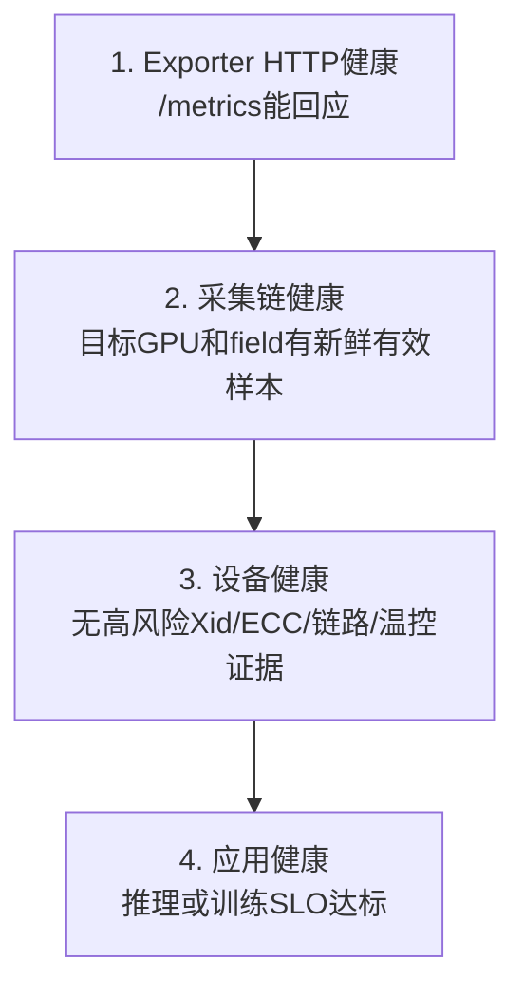
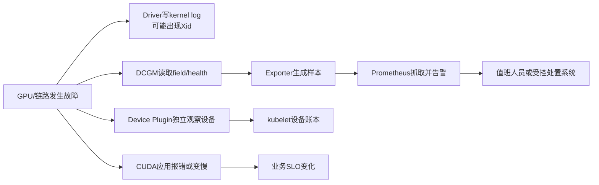

# 第 19 课：有 `/metrics` 为什么还不能说 GPU 健康——DCGM、Exporter、Xid 与 ECC 怎样分账

> 这一课只追一个主问题：**`nvidia-dcgm-exporter` 正在运行，Prometheus 抓取成功，为什么仍不能宣布 GPU 健康？** 我们从一次推理P99（最慢那1%请求的延迟边界）抖动和Xid错误事件出发，沿“设备事实 → 采集 → 暴露 → 告警 → 业务影响”逐层找证据。

先直接回答：

> **HTTP 200只说明exporter的网页接口成功回应了这一次请求。它没有自动证明目标GPU被发现、目标field（采集项）能采、样本是新鲜有效值、设备没有Xid错误或ECC显存错误，也没有证明推理延迟符合SLO（业务服务目标）。**

---

## 0. 生产现场：有 `/metrics`，为什么还不能说 GPU 健康

先看一组很像“监控已经正常”的证据：

```text
nvidia-dcgm-exporter Pod: Running
ServiceMonitor: 已创建
Prometheus target: UP
GET /metrics: HTTP 200
Grafana: GPU利用率有曲线
```

与此同时，业务现场是：

```text
推理P99突然升高
某个Node上的GPU利用率曲线间歇消失
kernel log出现NVRM: Xid
Pod没有退出
Node仍然Ready
nvidia.com/gpu仍在Allocatable中
```

把这里几句先翻成人话：

- `ServiceMonitor已创建`、`target: UP`、`HTTP 200`只说明“Prometheus找得到这个exporter，而且这次网页请求成功了”；
- `kernel log`是Linux内核日志，`NVRM`是NVIDIA驱动写日志时使用的标记，后面的`Xid`才是GPU错误编号；
- `Node Ready`只说明kubelet仍把节点报告为可用，不等于节点里的每块GPU都健康；
- `Allocatable`是kubelet对外公布的“可分配资源账面值”，不等于这块GPU已经做完设备体检；
- `P99突然升高`表示最慢那1%的请求更慢了，它是业务现象，不会自动告诉你根因在应用、GPU还是采集链。

如果只看最外层，很容易得到：

```text
exporter活着
  -> 指标能抓
  -> GPU健康
  -> 业务慢一定是应用代码问题
```

这条推理是错的。

任意一段断掉，都可能出现“页面看起来有图，但结论是错的”。

### 0.1 先把会反复出现的词翻成人话

| 名字 | 大白话作用 | 它不能单独证明什么 |
|---|---|---|
| **NVIDIA Driver** | 操作系统与GPU之间的“翻译和控制层”；应用、NVML、DCGM最终都要依赖它与设备交互 | 驱动进程/模块存在，不等于GPU和业务都正常 |
| **NVML** | NVIDIA Driver提供的GPU管理/查询库，`nvidia-smi`和DCGM会用到 | 不证明Prometheus采集正常，也不证明业务快 |
| **DCGM** | NVIDIA的数据中心GPU管理器，负责读取设备遥测（温度、功耗、错误等远程测量数据）、健康和诊断信息 | 不是Prometheus，也不替Kubernetes调度GPU |
| **hostengine / `nv-hostengine`** | 承载DCGM核心能力的“设备数据服务”；可嵌在exporter进程里，也可独立运行 | 进程活着不等于每个field都有有效值 |
| **exporter** | 把DCGM结果翻译成Prometheus能抓取的文本，并通过HTTP暴露 | 网页接口活着不等于GPU健康 |
| **field** | DCGM中的一个采集项目，例如温度、功耗、最近Xid | 配置里写了field不等于当前GPU支持它 |
| **sample / series** | sample是一时刻的“标签+数值”；同一组标签随时间形成一条series（时间序列） | 某条series缺失不等于数值为0 |
| **gauge** | 可升可降的当前值，例如温度、利用率、最近Xid | 不能默认用`rate()`算增长速度 |
| **counter** | 通常只累计增加、重启时可能归零的值，例如累计错误数 | 不能只盯绝对值判断“刚发生事故” |
| **Xid** | NVIDIA Driver写入内核日志的GPU错误编号，是排查路线提示 | 单凭编号不能直接判定进入RMA（厂商返修/换卡流程） |
| **ECC** | 显存的纠错能力与错误计数；单比特通常可纠正，双比特风险更高 | 历史累计非零不等于刚发生新故障 |
| **MIG** | 把一块支持的GPU切成多个硬件隔离实例 | 不能把父卡指标重复算给每个实例 |
| **per-process** | 按宿主机进程进一步拆分GPU用量，再尝试归属到Pod | 不是所有GPU模式、所有field都能拆到进程 |
| **SLO / P99** | SLO是业务服务目标；P99表示99%的请求不超过这个延迟，也就是观察最慢那1%的边界 | GPU指标正常不等于SLO一定达标 |

`Prometheus scrape` 可以先理解成“Prometheus定时来抄一次`/metrics`”；Grafana只是把Prometheus里的数据画成图。Device Plugin则是另一条Kubernetes设备分配链，负责向kubelet报告可分配设备和健康状态，不读取Prometheus告警。

GPU性能讨论里还会看到`SM`：它是GPU上真正调度和执行大量计算线程的核心单元，不是“显存使用率”的另一个名字。

### 0.2 必须分开的四种“健康”

下面**从上往下读**。箭头表示“想下更强结论，必须再补下一层证据”，不是一次同步RPC（一个程序立刻远程调用另一个程序并等待结果）。



`HTTP 200`只到第一层。即使第二层也通过，仍可能发生：设备刚报Xid但样本尚未刷新；设备没有明显硬件错，但业务因为CPU喂不满、队列拥塞或模型配置而变慢。

和Java平台类比：`/actuator/prometheus`能访问，不等于订单接口P99达标；JVM线程数有曲线，也不等于没有死锁。GPU只是把中间证据层增加了。

### 0.3 四种看似“没有异常”的值，含义完全不同

| 现场看到什么 | 真正含义 | 正确处理 |
|---|---|---|
| 数值确实是`0` | exporter采到了这个field，当前值是0 | 仍核对type、时间戳和身份标签 |
| series缺失 | 根本没有这条时间序列 | 查CSV、设备发现、采集、relabel（抓取前重写或丢弃标签/series的规则）和Prometheus |
| blank/sentinel | 底层返回“空值”或特殊占位数；sentinel就是“这个数字不是业务值”的暗号 | 不能画成0；核对版本、日志与原始输出 |
| unsupported | 该GPU/DCGM组合明确不支持这个field | 换受支持证据或调整监控契约，不能伪造0 |

所以“ECC图是0”和“根本没有ECC series”必须分开；“一个极大的温度整数”也可能是sentinel，不是GPU真的热到那个数。

### 0.4 故障怎样传播：DCGM与Device Plugin不是同一条链

下面**从左往右读**。实线表示事实被下一层观察或转交；两条分支各自异步更新，不表示Prometheus会调用Device Plugin。



这张图解释了为什么会出现“DCGM先告警，但Device Plugin仍是Healthy”，也解释了为什么`Node Ready`与GPU健康不能画等号。

### 0.5 首遍只走六站

首遍不要把三千多行一次读完。按六站走，每站只回答一个问题：

| 站点 | 阅读位置 | 这一站只学会什么 |
|---:|---|---|
| 1 | 第0～1节 | `/metrics` 200为什么只证明HTTP层；用第一段源码钉住空响应也可成功 |
| 2 | 第3～5节 | DCGM、hostengine、exporter、Prometheus各负责什么，HTTP/采集/设备健康为何不能混成一件事 |
| 3 | 第6～8节 | 会读metric name、label、gauge/counter，并分清0、缺失、sentinel、unsupported |
| 4 | 第9～10节 | 设备series怎样映射Pod；MIG/time-slicing为什么会重复统计 |
| 5 | 第11、14～17、20节 | Xid/ECC/温控/链路怎样传播，生产事故怎样先只读取证再止损 |
| 6 | 第12～13、21～23节与第31.1节 | 在已有模型和源码之后读PromQL、告警和只读证据，完成首遍验收 |

**二遍再读：** 第2、4节的完整版本与启动链，第8.3节扩展health字段，第10.3节per-process，第18～19节性能/安全，第24～25节主动诊断和Go并发语法，以及第31.2节二遍验收。首遍不要求背所有Xid编号、DCGM field或Go并发类型。

### 0.6 源码基线与阅读边界

```text
外部项目：NVIDIA/dcgm-exporter
固定tag：4.5.3-4.8.2
完整commit：691c92762eb551313c825f6efe4ceeee20982801
事实核对日期：2026-07-14
阅读深度：本章不深挖Kubernetes仓库源码；会逐行读懂回答主问题的Exporter关键函数；GPU运维部分要求能独立判断、取证和制定安全处置顺序
```

本章第一段代码来自**外部 NVIDIA 仓库**，不在本地 `D:\datou\devops\kubernetes-master\kubernetes` 源码树里。讲义按固定commit逐行核对；中文`//`是教学注释，不是上游原注释。本机没有拉取并构建这份外部仓库，因此只能写“静态源码核对完成”，不能写对应`go test`已经通过。

表格默认逐行从左往右读；流程图会单独写方向。后面的命令与PromQL都放在责任模型和源码之后；第21～23节只读，第24节是维护窗口主动诊断，不能混用。

---

## 1. 第一段核心源码：为什么空 `/metrics` 也可能是 HTTP 200

先只回答主问题：**exporter没有拿到任何GPU样本时，HTTP handler（接收并处理网页请求的函数）是否一定报错？**

答案是：不一定。当前版本在热重载或GPU bind/unbind（GPU被重新加入或移出监控）期间，会用一个空registry（collector登记表）代替暂时不存在的registry；只要“收集空结果、渲染空结果、写响应”这三步都没有返回error（函数报告的失败），HTTP请求仍正常完成。

源码位置：`internal/pkg/server/server.go:162-171,249-272`，固定tag `4.5.3-4.8.2`，完整commit `691c92762eb551313c825f6efe4ceeee20982801`。

摘录类型：**两个非连续的完整函数，教学注释版**。先读`GetRegistry`，再读`Metrics`；两段之间还有reload状态和HTTP server生命周期代码，这里没有用`...`伪装成连续源码。

```go
// GetRegistry 取得当前用于采集指标的registry（collector登记表）。
func (s *MetricsServer) GetRegistry() *registry.Registry { // 定义MetricsServer对象的取登记表方法。
	// 原子读取（一次完整读取，不会读到一半状态）当前指针，避免与热重载并发冲突。
	reg := s.registry.Load() // 把读取结果保存到reg。
	// nil表示重载或GPU重新绑定期间，旧registry已清掉、新registry还没装上。
	if reg == nil { // 判断当前是否暂时没有可用登记表。
		// 不返回错误，而是新建一个没有collector的空registry。
		return registry.NewRegistry() // 返回一个空登记表，调用者不会在这里收到错误。
	} // “当前登记表为空”的分支结束。
	// 正常时返回当前真实registry。
	return reg // 返回已存在的登记表。
} // GetRegistry函数结束。

// Metrics处理一次HTTP /metrics请求。
func (s *MetricsServer) Metrics(w http.ResponseWriter, _ *http.Request) { // 定义/metrics的HTTP处理函数。
	// 加一个浏览器安全响应头；它和GPU健康无关。
	w.Header().Set("X-Content-Type-Options", "nosniff") // 写入响应头。

	// 取得当前registry；重载窗口里可能拿到上面的空registry。
	currentRegistry := s.GetRegistry() // 把当前登记表保存到currentRegistry。

	// 调用已登记的collectors采集；空registry会得到空结果，而不一定得到error。
	metricGroups, err := currentRegistry.Gather() // 同时接收采集结果和错误。
	// 只有Gather明确失败时才返回HTTP 500。
	if err != nil { // 判断采集是否明确失败。
		// 把collector失败原因写入exporter日志。
		slog.Error("Failed to gather metrics from collectors", slog.String(logging.ErrorKey, err.Error())) // 记录采集错误。
		// 向HTTP客户端返回500和通用错误文本。
		http.Error(w, internalServerError, http.StatusInternalServerError) // 返回HTTP 500。
		// 立即结束本次请求。
		return // 不再继续渲染和写正常响应。
	} // 采集错误分支结束。
	// 在内存中准备Prometheus文本响应；空结果时buffer也可以为空。
	var buf bytes.Buffer // 声明一个暂为空的内存缓冲区。
	// 把内部metric结果渲染成Prometheus文本。
	err = s.render(&buf, metricGroups) // 把采集结果写成Prometheus文本。
	// 只有渲染明确失败时才返回HTTP 500。
	if err != nil { // 判断文本渲染是否失败。
		http.Error(w, internalServerError, http.StatusInternalServerError) // 渲染失败就返回HTTP 500。
		return // 立即结束请求。
	} // 渲染错误分支结束。
	// 把结果写回客户端；若前面没设置错误状态，Go HTTP会按成功响应处理，空内容也不等于GPU健康。
	_, err = w.Write(buf.Bytes()) // 写响应；_表示不关心实际写出的字节数。
	// 连响应都写失败时才记录并尝试返回HTTP 500。
	if err != nil { // 判断向客户端写数据是否失败。
		slog.Error("Failed to write response.", slog.String(logging.ErrorKey, err.Error())) // 记录写响应错误。
		http.Error(w, "failed to write response", http.StatusInternalServerError) // 尝试返回HTTP 500。
		return // 结束本次请求。
	} // 写响应错误分支结束。
} // Metrics函数结束；若前面都成功，HTTP请求正常完成。
```

按“输入、判断、动作、结果”收束：

| 项目 | 这段源码真正做什么 |
|---|---|
| 输入 | 一次HTTP请求和当前registry |
| 判断 | Gather、render、Write有没有返回error |
| 动作 | 收集现有collector、渲染文本、写HTTP响应 |
| 结果 | 没有error就完成请求；代码没有逐块GPU做“适合承载业务”的总健康判定 |

**大白话总结：** `/metrics` handler像“把仓库当前登记的货物清单打印出来”。打印机工作正常，只说明网页能回；仓库登记表可能暂时是空的，也可能没有你关心的温度/ECC field。HTTP 200不是“每张GPU体检合格证”。

**顺手学 Go：** `func (s *MetricsServer)`里的`s`叫receiver（接收者），表示这个函数属于`MetricsServer`；`*MetricsServer`是对象指针。`:=`表示第一次声明并赋值；`err != nil`表示拿到了错误对象。`_ *http.Request`里的`_`表示本函数明确不使用request参数。`bytes.Buffer`是内存缓冲区。`w.Write`返回“写了多少字节”和`error`两个值；左边的`_`丢掉字节数。这里没有调用“GPU是否健康”的函数，也没有要求结果至少包含一条GPU sample。

---

## 2. 版本快照与官方证据：先确定自己读的是哪一代 exporter

### 2.1 本课固定快照

GPU Operator可以先理解成“在Kubernetes中统一安装和维护NVIDIA Driver、Device Plugin、Toolkit、Exporter等组件的控制器套件”；它管理的每个实际运行组件常被称为operand（被Operator管理的工作部件）。镜像`digest`是内容固定指纹，比可能漂移的tag更能证明现场版本。`pprof`是Go程序的性能/运行状态调试接口，默认关闭就是“必须明确打开才会暴露”。

| 项目 | 本课基线 | 为什么重要 |
|---|---:|---|
| GPU Operator | `v26.3.3` | 第 18 课的安装与 operand 基线 |
| DCGM Exporter image/tag | `4.5.3-4.8.2` | Operator `26.3.2/26.3.3` 组件矩阵中的 exporter |
| Git commit | `691c92762eb551313c825f6efe4ceeee20982801` | 防止网页 `main` 分支继续变化 |
| release date | `2026-05-07` | 表明本课不是沿用多年前的 exporter 行为 |
| 内含 DCGM | `4.5.3` | field、health、诊断能力与 DCGM 版本相关 |
| exporter | `4.8.2` | Go 层行为、labels、HTTP、安全开关与此版本相关 |
| 默认 listen | `:9400` | Service、抓取与暴露面基线 |
| 默认 collection interval | `30000ms` | scrape 频率不能凭空制造更高分辨率的 DCGM 样本 |
| 默认 PodResources socket | `/var/lib/kubelet/pod-resources/kubelet.sock` | Pod归属链路的本地Unix socket（同一台机器上两个进程通过特殊文件通信的接口） |
| pprof | 默认关闭 | `4.5.3-4.8.2`起要求显式opt-in（默认不开，必须主动开启） |

官方固定入口：

- [DCGM Exporter `4.5.3-4.8.2` release](https://github.com/NVIDIA/dcgm-exporter/releases/tag/4.5.3-4.8.2)
- [DCGM Exporter 固定 commit 源码](https://github.com/NVIDIA/dcgm-exporter/tree/691c92762eb551313c825f6efe4ceeee20982801)
- [固定 commit 的 `internal/pkg/server/server.go`](https://github.com/NVIDIA/dcgm-exporter/blob/691c92762eb551313c825f6efe4ceeee20982801/internal/pkg/server/server.go)
- [固定 commit 的 `pkg/cmd/app.go`](https://github.com/NVIDIA/dcgm-exporter/blob/691c92762eb551313c825f6efe4ceeee20982801/pkg/cmd/app.go)
- [固定 commit 的默认 counters](https://github.com/NVIDIA/dcgm-exporter/blob/691c92762eb551313c825f6efe4ceeee20982801/etc/default-counters.csv)
- [NVIDIA DCGM 最新官方文档](https://docs.nvidia.com/datacenter/dcgm/latest/)
- [GPU Operator 26.3 release notes](https://docs.nvidia.com/datacenter/cloud-native/gpu-operator/26.3/release-notes.html)

### 2.2 当前 release 不能忽略的新增行为

`4.5.3-4.8.2` release（版本发布说明）明确列出。这里的hot reload是“进程不停，重新加载采集配置”；pprof是Go程序的性能/运行状态调试接口；informer cache是把apiserver对象事件保存在本进程的本地缓存：

- 更新到 DCGM `4.5.3`、Exporter `4.8.2`；
- 改进GPU health metrics，包括fallen-off-bus（GPU从PCIe总线上失联）Xid这类GPU-wide health incident（影响整块物理GPU的健康事件）；
- `/debug/pprof` 改为显式 `--enable-pprof` 或环境变量开启；
- PodMapper 引入 informer cache；
- 新增 time-sharing（也常写time-slicing，多个任务轮流共享同一物理GPU）/MIG 的 per-process GPU metrics；
- MIG 设备支持 HPC（高性能计算）job label；
- 更新field metadata（字段名称、类型、单位等说明）、deprecated alias（仍兼容但不建议继续使用的旧名字）、health constants（代码中固定的健康状态值）等。

所以本课不会复述这些旧结论：

```text
time-slicing只能把整卡值复制给每个Pod，永远无法细分
MIG共享时永远没有per-process显存
pprof默认一定公开
fallen-off-bus只能从kernel log看到，exporter绝不可能产生health指标
PodMapper每次scrape都必然全量直查apiserver
```

但新能力也不能被夸大：

```text
有GPU-wide health metric
  != 自动把Device Plugin设备改成Unhealthy
有per-process路径
  != 默认开启
有per-process显存
  != MIG下也一定有per-process SM利用率
有Pod informer cache
  != PodResources与实际进程映射强一致
```

### 2.3 生产快照最少记录什么

下面几个配置词先翻一下：`checksum`是文件内容指纹；`relabel`是在Prometheus接收前重写或丢弃标签/series；`retention`是指标保留多久；`scrapeTimeout`是一次抓取最多等多久；`external labels`是Prometheus给所有样本补的集群身份标签；`UID`是Kubernetes对象本次生命的唯一编号；`virtual GPU`是共享策略下对同一物理GPU暴露出的逻辑份额；`hostPID`表示容器共享宿主机进程编号视图；`capabilities`是Linux拆分出来的额外特权；DRA是Kubernetes动态资源分配机制。

```text
ClusterPolicy.spec.dcgmExporter
dcgm-exporter image digest
dcgm-exporter --version
DCGM版本
NVIDIA driver版本
GPU型号与MIG mode
Device Plugin sharing/MIG配置
exporter命令行和环境变量
实际挂载的CSV内容与checksum
ServiceMonitor interval/scrapeTimeout/relabel
Prometheus external labels与retention
PodResources socket路径
是否启用Pod labels/UID/virtual GPUs/DRA
是否启用TLS（加密传输）/basic auth（用户名密码认证）/pprof
securityContext、hostPID、capabilities
```

只记录“我们装了 GPU Operator 26.3”不够定位遥测差异。

---

## 3. 五个组件的责任边界

### 3.1 DCGM

DCGM，Data Center GPU Manager，是 NVIDIA 面向数据中心 GPU 的管理与观测能力集合。它可以提供：

- GPU field 采样；
- health watch；
- diagnostics；
- accounting/process statistics；
- topology；
- policy；
- NVSwitch 等实体的部分监控能力。

这里的health watch是持续观察设备子系统，diagnostics是主动运行检查/压力测试，accounting是进程用量统计，topology是GPU与PCIe/NVLink连接关系，policy是按设备事件触发回调的规则。entity就是DCGM监控对象，可以是一整块GPU、MIG实例或NVSwitch（多GPU高速互联交换芯片）。

大白话：

> DCGM 是靠近 GPU 和 driver 的“设备体检与遥测层”，不是 Prometheus exporter，也不是 Kubernetes 调度器。

### 3.2 `nv-hostengine`

DCGM 能以内嵌library方式运行，也能由独立`nv-hostengine`进程提供服务。内嵌（embedded）表示DCGM能力就在exporter进程里；独立模式则由exporter连接另一个hostengine进程。

两种常见形态如下，均**从上往下读**。箭头表示exporter从下一层取得GPU数据；形态B中的连接才跨进程/网络，形态A不是一次远端RPC：

```text
形态A：默认Operator方式
dcgm-exporter Pod
  -> 本地DCGM能力/embedded hostengine
  -> driver/GPU

形态B：独立hostengine
dcgm-exporter Pod
  -> TCP或Unix连接nv-hostengine
  -> driver/GPU
```

形态 B 多了这些故障面：

- 远端地址是否正确；
- `5555` 可达性；
- Service endpoint（Service实际转发到的Pod地址）是否落到正确Node；
- exporter 与 hostengine/DCGM 版本兼容；
- 一个 Node 的 exporter 是否误连另一个 Node 的 hostengine；
- 网络断开时 exporter 的表现。

第 18 课已经说明：GPU Operator 默认 `dcgm.enabled=false`，只启用 exporter。只有现场明确启用独立 `dcgm` operand 时，才沿远端 hostengine 方向排。

远端模式还有一个容易写反的硬约束：**exporter 容器里的 DCGM client（`libdcgm.so`）版本必须大于或等于远端 `nv-hostengine` 的 DCGM 版本，不能更低。** 这里比较的是两端实际运行的 DCGM 版本，不是只比较 Operator chart 版本或镜像仓库名；升级任一端前都要把两端版本和连接目标一起写入变更证据。

### 3.3 DCGM Exporter

Exporter 是 Go 程序，主要做四件事：

1. 读取配置和 counters CSV；
2. 通过 DCGM provider 采样实体与 field；
3. 可选地用 PodResources/Pod informer/进程 cgroup 补 Kubernetes 归属；
4. 把结果渲染成 Prometheus text exposition，通过 HTTP 提供。

源码里常把这四步叫provider、collector、transformation和registry：provider是“连接DCGM的数据适配层”，collector是“按field取样的采集器”，transformation是“给样本补Pod等属性的转换步骤”，registry是“登记了哪些collector的清单”。text exposition就是Prometheus规定的文本输出格式。

它不是：

- GPU workload的admission webhook（Pod创建前做准入检查/修改的回调）；
- Device Plugin；
- kubelet DeviceManager；
- 自动隔离坏卡的控制器；
- GPU reset控制器；reset是让目标GPU重新初始化设备状态，比重启一个业务Pod影响更大；
- RMA 判定系统。

### 3.4 Prometheus 与 Alertmanager

Prometheus 定时pull（主动抓取）`/metrics`、存储series、执行规则。Alertmanager做分组、抑制、路由和通知。

Prometheus 不知道：

- 某个 Xid 是否由当前 Pod 触发；
- 某型号 GPU 的安全温度阈值；
- 这个 Node 是否可以自动 drain；
- 业务正处于不可中断训练checkpoint（训练已保存、可从中恢复的进度点）前；
- 某次 counter 下降是重启、替换 GPU 还是 exporter bug。

这些语义要由平台规则和runbook（经过评审的故障处置步骤）补齐。长训练不能为了排障随便丢掉尚未保存的进度。

### 3.5 Grafana

Grafana 是观察与关联界面，不是事实源本身。

Dashboard 常见误导：

- 查询用 `sum` 把多卡相加，得到超过 100% 的“利用率”；
- 时间窗口太大，把瞬时热问题平均掉；
- `or vector(0)` 把采集缺失画成 0；
- 按 Pod 聚合时把同一物理 GPU 的值复制多份；
- 变量只显示活跃 series，故障 GPU 从下拉框消失；
- 面板的单位与原始 field 不一致。

因此告警和排障要能回到raw series（未经面板聚合和补零的原始时间序列）与原始来源。

---

## 4. 从 GPU 到一行 Prometheus 指标：源码主线

### 4.1 源码地图

固定 tag `4.5.3-4.8.2` 里，先读这些路径：

| 路径 | 作用 | 本课阅读深度 |
|---|---|---|
| `pkg/cmd/app.go` | CLI（命令行）/env（环境变量）默认值、启动、provider、registry、server、hot reload | 深读 |
| `internal/pkg/appconfig/*` | 配置结构与 CLI 到运行时配置 | 读字段 |
| `internal/pkg/counters/*` | 解析 CSV、选择 DCGM fields | 读主线 |
| `internal/pkg/dcgmprovider/*` | DCGM client/provider 边界 | 读接口 |
| `internal/pkg/devicewatchlistmanager/*` | 要监控的 GPU/MIG/NVSwitch 等实体 | 读主线 |
| `internal/pkg/collector/*` | 采样 field，形成内部 metric | 深读主线 |
| `internal/pkg/registry/registry.go` | 注册 collectors，并发 gather | 深读 |
| `internal/pkg/transformation/kubernetes.go` | PodResources 与 Pod metadata 映射 | 深读 |
| `internal/pkg/transformation/process_metrics.go` | time-sharing/MIG per-process 指标 | 按需深读 |
| `internal/pkg/transformation/pidmapper.go` | PID 经 cgroup 映射到 Pod | 按需深读 |
| `internal/pkg/nvmlprovider/*` | per-process NVML 能力 | 读接口 |
| `internal/pkg/server/server.go` | `/metrics`、`/health`、TLS/basic auth | 深读 |
| `etc/default-counters.csv` | 默认 field/type/help | 必须读 |
| `deployment/values.yaml` | Service、9400、ServiceMonitor、权限与挂载 | 必须读现场对应值 |

### 4.2 `NewApp()`：默认值不是猜出来的

下面仍是**外部 NVIDIA 仓库证据**。`pkg/cmd/app.go:123-143,281-286`的`NewApp()`注册了当前版本的CLI flags（命令行参数）。摘录类型是**四个非连续配置检查点，教学注释版**：每个真实struct中还含`Aliases`或`Usage`等字段，故本块不能独立编译，只用于核对默认值。

```go
&cli.StringFlag{ // 定义“采哪些field”的文件参数。
    Name: CLIFieldsFile, // 参数内部名称是collectors。
    Value: "/etc/dcgm-exporter/default-counters.csv", // 默认读取这份CSV。
    EnvVars: []string{"DCGM_EXPORTER_COLLECTORS"}, // 也允许用环境变量覆盖。
} // “采哪些field”的参数定义结束。

&cli.StringFlag{ // 定义HTTP监听地址参数。
    Name: CLIAddress, // 参数内部名称是address。
    Value: ":9400", // 默认在9400端口监听。
    EnvVars: []string{"DCGM_EXPORTER_LISTEN"}, // 环境变量也能覆盖监听地址。
} // HTTP监听地址参数定义结束。

&cli.IntFlag{ // 定义DCGM采集周期参数，类型是整数。
    Name: CLICollectInterval, // 参数内部名称是collect-interval。
    Value: 30000, // 默认30000毫秒，也就是30秒采一次。
    EnvVars: []string{"DCGM_EXPORTER_INTERVAL"}, // 环境变量也能覆盖采集周期。
} // 采集周期参数定义结束。

&cli.StringFlag{ // 定义kubelet PodResources socket路径参数。
    Name: CLIPodResourcesKubeletSocket, // 参数内部名称是pod-resources-kubelet-socket。
    Value: "/var/lib/kubelet/pod-resources/kubelet.sock", // 默认读Node本地这个Unix socket。
    EnvVars: []string{"DCGM_POD_RESOURCES_KUBELET_SOCKET"}, // 环境变量也能覆盖路径。
} // PodResources socket参数定义结束。
```

**大白话总结：** 这四小段只是在登记“默认采什么、监听哪里、多久采一次、从哪里找Pod分配账本”，还没有开始判断GPU健康。

- CLI flag 与环境变量都能设置同一个配置；
- `:9400`表示监听所有本地地址族对应的端口，是否能从集群外访问还取决于Pod网络、Service、Ingress（集群入口）/LB（负载均衡器）和防火墙；
- 默认 30 秒 collection interval 不等于 Prometheus 一定 30 秒 scrape；两套周期要分别取证；
- PodResources socket 是 Node 本地路径，不是 apiserver URL。

### 4.3 启动主线

当前源码的启动链可以压缩为：

下面**从上往下读**。这些箭头主要是同一个exporter进程里的函数调用/初始化顺序；只有provider选择远端hostengine时才跨进程连接。

```text
NewApp
  -> action
  -> StartDCGMExporterWithSignalSource
      -> configureLogger
      -> contextToConfig
      -> prerequisites.Validate
      -> dcgmprovider.Initialize
      -> Kubernetes模式下初始化nvmlprovider
      -> queryDCPMetrics
      -> buildRegistry
          -> getCounters
          -> startDeviceWatchListManager
          -> collector.InitCollectorFactory
          -> Registry.Register
      -> server.NewMetricsServer
      -> MetricsServer.Run
      -> config file watcher / optional GPU bind-unbind watcher
```

这里的`prerequisites.Validate`是在启动前检查必要条件；`queryDCPMetrics`虽然函数名带DCP，作用是查询当前环境可用的DCGM profiling指标；`watcher`就是持续观察配置文件或GPU变化的任务；GPU topology是“当前有哪些GPU/MIG/NVSwitch实体及其组织关系”。

这条链给排障一个很实用的顺序：

```text
进程启动失败
  -> 看prerequisite/provider/config

进程启动成功但无目标field
  -> 看CSV、field支持、watch list（待监控设备清单）、collector

设备metric有但Pod标签空
  -> 看transformation/PodResources/informer

内部metric有但Prometheus无series
  -> 看server/Service/ServiceMonitor/relabel/Prometheus
```

### 4.4 `buildRegistry()`：采样对象和 HTTP 不是一回事

外部源码：`pkg/cmd/app.go:594-617`，固定commit `691c92762eb551313c825f6efe4ceeee20982801`。摘录类型：**完整函数，教学注释版**。

```go
// buildRegistry根据当前配置和GPU拓扑创建一整套采集登记表。
func buildRegistry( // 定义“按当前配置重建采集登记表”的函数。
    ctx context.Context, // 传递取消信号和调用范围。
    _ *cli.Context, // 当前函数不用CLI对象，所以用_明确丢弃。
    config *appconfig.Config, // 已解析好的运行配置。
) (*registry.Registry, devicewatchlistmanager.Manager, error) { // 函数返回登记表、设备清单管理器和错误。
    slog.Info("Building registry for current GPU topology") // 记录开始按当前拓扑重建。

    cs := getCounters(ctx, config) // 从CSV/配置得到要采集的field清单。

    deviceWatchListManager := startDeviceWatchListManager(cs, config) // 决定监控哪些GPU/MIG等实体。

    hostName, err := hostname.GetHostname(config) // 取得要写进metric label的主机名。
    if err != nil { // 判断读取主机名是否失败。
        return nil, nil, fmt.Errorf("failed to get hostname: %w", err) // 主机名失败就返回错误，不继续建表。
    } // 主机名错误分支结束。

    cf := collector.InitCollectorFactory(cs, deviceWatchListManager, hostName, config) // 准备各类collector工厂。

    cRegistry := registry.NewRegistry() // 先创建一个空登记表。
    for _, entityCollector := range cf.NewCollectors() { // 遍历工厂按实体生成的collector。
        cRegistry.Register(entityCollector) // 把每个collector登记进去，供/metrics请求时Gather。
    } // collector遍历结束。

    slog.Info("Registry built successfully", // 记录本轮登记表创建成功。
        slog.Int("collector_count", len(cf.NewCollectors()))) // 日志带上collector数量。

    return cRegistry, deviceWatchListManager, nil // 同时返回登记表、实体管理器和空错误。
} // buildRegistry函数结束。
```

**大白话总结：**

> 先决定采哪些 field、监控哪些实体，再为不同实体建 collector，最后注册到 registry。HTTP server 只是后来把 registry 的结果端出去。

所以看到端口监听，不代表 registry 中一定有你以为的 collector。

**顺手学 Go：** 函数最后的`(..., ..., error)`表示有三个返回值；成功时第三个值是`nil`（没有错误）。`for _, entityCollector := range ...`遍历collector列表，`_`丢掉下标。`%w`把底层error包进新错误，方便上层保留根因。

### 4.5 hot reload 的 200 空窗

当前 `pkg/cmd/app.go` 对 hot reload 有非常重要的注释：重载时会先清旧 registry，再建新 registry；这段约 2～3 秒的窗口内，`/metrics` 会返回 HTTP 200 但没有 metrics。

触发方式里的`SIGHUP`是Linux给进程的一种信号，很多服务把它约定为“重新加载配置”；GPU bind/unbind则是设备与Driver重新绑定/解绑，可能导致GPU拓扑变化。

下面**从上往下读**，表示一次配置热重载的状态变化；不是五个独立服务互相RPC：

```text
配置文件变化或SIGHUP
  -> SetReloadInProgress(true)
  -> ClearRegistry
  -> 旧registry等待在途scrape并cleanup
  -> buildRegistry
  -> SetRegistry(newRegistry)
```

运维含义：

- `up == 1` 只表示 Prometheus 能完成 HTTP scrape；
- 单次空payload（HTTP响应正文）可能是受控hot reload，也可能是真故障；
- 应用 absent 告警要有 `for`，并结合 exporter reload 日志；
- 不要把配置热更新做成每秒抖动；源码有最小 reload 间隔保护，但不等于外部配置系统可以无限改。

---

## 5. `/metrics`、`/health`、GPU health：三个同名感觉、三个边界

### 5.1 `/metrics`

`/metrics` 是 Prometheus exposition endpoint（指标文本接口）。结合第1节源码，它回答的是：

> exporter 此刻愿意暴露哪些样本？

它不直接回答：

> 每块 GPU 是否适合继续承载生产 workload？

### 5.2 exporter `/health`

固定commit的`internal/pkg/server/server.go:342-367`明确把`/health`设计成exporter进程/服务层检查：重载中registry为`nil`时，它仍写`OK - reload in progress`并保持200，另外用`X-Registry-Available: false`响应头告诉监控“采集登记表暂不可用”。这样做是为了避免Kubernetes在正常重载窗口误杀Pod，不是在替GPU签健康证明。

所以即使`/health`返回成功，也可能发生：

- 某个特定 GPU field 缺失；
- 某块 GPU 从 watch list 消失；
- Pod mapping 失败；
- Prometheus relabel 丢弃全部 GPU series；
- 指标仍在但样本陈旧；
- GPU 对 CUDA workload 已不可用。

不要把 exporter 的 HTTP health endpoint 用成 GPU 硬件总健康判定。

### 5.3 DCGM health

DCGM health 是设备/子系统层的健康监控能力，可能覆盖 PCIe、memory、NVLink 等领域。当前 exporter release 还改进了 GPU-wide health incident 的呈现。

下面两段都**从上往下读**。第一段表示观测结果怎样到达告警；第二段列的是不会自动发生的动作，不是被省略的RPC调用：

```text
DCGM health发现异常
  -> exporter可能暴露相应metric
  -> Prometheus可能触发告警

并不自动执行：
  Device Plugin ListAndWatch把device改成Unhealthy
  kubelet减少Allocatable
  scheduler停止向Node分配GPU Pod
  已运行Pod自动退出
  Node自动cordon/drain
  GPU自动reset
```

如果企业希望自动闭环，需要额外实现和审批：

```text
告警事件
  -> 关联Node/GPU UUID/Pod
  -> 去抖与多证据确认
  -> 自动或人工cordon
  -> 工作负载感知的drain/checkpoint
  -> 诊断/reset/reboot
  -> 验证
  -> uncordon
```

这属于平台控制面，不是 exporter 自带语义。

---

## 6. 一条 metric 到底由什么组成

看一条示意样本：

```text
# HELP DCGM_FI_DEV_GPU_TEMP GPU temperature (in C).
# TYPE DCGM_FI_DEV_GPU_TEMP gauge
DCGM_FI_DEV_GPU_TEMP{gpu="0",UUID="GPU-7d2...",device="nvidia0",Hostname="gpu-a100-07",pod="inference-6c9...",namespace="ai-prod",container="server"} 74
```

分成四层：

1. metric name：`DCGM_FI_DEV_GPU_TEMP`；
2. Prometheus type：`gauge`；
3. labels：GPU、UUID、Node、Pod 等维度；
4. sample value：`74`。

任何一层读错，结论都可能错。

### 6.1 metric name 不等于自然语言含义

例如：

```text
GPU_UTIL
```

不是“模型有效计算效率”，而是特定采样定义下 GPU busy 比例。

```text
FB_USED
```

不是“业务真正不可回收的内存泄漏量”，而是 framebuffer memory（GPU板载显存）使用量。

```text
XID_ERRORS
```

不是单调递增的“错误总数”，当前默认 CSV 把它定义为最近遇到的 Xid 值的 gauge。

### 6.2 label 是身份，不是装饰

最少保留这些关联键：

```text
Hostname或标准化node label
UUID
gpu/device
MIG instance相关label
namespace
pod
container
```

为什么 UUID 很关键：

UUID是GPU的稳定唯一编号；PCI BDF则是设备当时所在的PCI总线地址。前者更适合跨重启/维修关联，后者更适合和kernel日志、插槽与链路现场对齐。

- `gpu="0"` 只在某个 Node 的当前枚举内有意义；
- Node 维修、PCIe 枚举变化后 index 可能变化；
- Xid kernel log常带PCI BDF/GPU GUID（全局唯一硬件标识）；
- RMA、换卡、历史趋势都需要稳定硬件身份。

但 UUID 也不能单独当“业务 owner”：还要经 Node/Pod/时间窗口关联。

### 6.3 label cardinality 是生产成本

cardinality（基数）就是“不同label组合会生成多少条独立series”。GPU数、Pod数、field数和高变化label会相乘，而不是简单相加。

启用所有 Pod labels 可能把下列高变维度带进每条 GPU series：

```text
pod-template-hash
controller-revision-hash
随机run-id
git-sha
request-id
用户提交的任意标签
```

如果每个 Pod、每块 GPU、每个 field、每个 label 组合都变成新 series，Prometheus内存、WAL（先写磁盘的时序日志）、remote write（把样本转发到远端存储）和查询成本会迅速上升。TSDB head series就是当前时序数据库内存中活跃的series数量。

GPU Operator `26.3.2+` 提供 `enablePodLabels`、`enablePodUID` 和 `podLabelAllowlistRegex` 一类配置。生产建议：

- 默认只保留稳定 owner/team/workload/service 标签；
- Pod UID 只在确实需要跨同名 Pod 精确关联时启用；
- 用allowlist（只允许明确列出的标签），而不是事后靠metric relabel大量删除；
- 变更前估算 series 数量；
- 观察 Prometheus TSDB head series 与 remote-write 成本。

### 6.4 不要假定所有环境 label 名完全一致

固定 tag 示例中常见 `UUID`、`Hostname`、`gpu`、`pod`、`namespace`、`container`，但 chart、relabel 和遥测平台可能把 `Hostname` 复制成 `node`，或增加 `cluster`。

写告警前先在现场执行：

```promql
count by (__name__) ({job=~".*dcgm.*"})
```

并检查某条 raw series 的真实 labels。不要从网上复制一条 PromQL 就直接上线。

---

## 7. Gauge、Counter、Label、Blank：先学会读类型

### 7.1 Gauge

Gauge 可以升也可以降，适合当前值：

- 温度；
- 功耗；
- 时钟；
- GPU utilization；
- framebuffer used/free；
- 最近 Xid 值。

常见查询：

```promql
max_over_time(DCGM_FI_DEV_GPU_TEMP[5m])
avg_over_time(DCGM_FI_DEV_GPU_UTIL[5m])
DCGM_FI_DEV_FB_USED
```

不要对一般 gauge 直接 `rate()`。

### 7.2 Counter

Counter 代表累计量，理想情况下只增加，在进程、Node 或设备重置时归零/下降。

常见 GPU counter：

- 累计能耗；
- PCIe replay（链路校验没通过后发生的重传）；
- ECC error 累计；
- NVLink error/replay（GPU高速互联错误/重传）；
- thermal/power violation（因温度/功耗限制而降速）累计时长。

下面metric名里的DBE是double-bit ECC error（双比特显存错误，通常不可纠正）；`VOL`表示本次运行周期视图。

常见查询：

```promql
increase(DCGM_FI_DEV_PCIE_REPLAY_COUNTER[10m])
# 原始rate单位是mJ/s；除以1000才是W。counter会在driver reload后重置
rate(DCGM_FI_DEV_TOTAL_ENERGY_CONSUMPTION[5m]) / 1000
increase(DCGM_FI_DEV_ECC_DBE_VOL_TOTAL[5m])
```

### 7.3 `rate()` 与 `increase()` 的区别

```text
rate(counter[5m])
  -> 每秒平均增长速度

increase(counter[5m])
  -> 该窗口估算增长总量
```

告警“最近是否新发生一次双比特 ECC”更接近 `increase() > 0`。

看“每秒 PCIe 数据/错误增长速率”更适合 `rate()`。

Prometheus 会对窗口内常见 counter reset 做外推修正，但仍要注意：

- scrape 少于两个有效点时无结果；
- series label 变化会形成新时间序列；
- GPU replacement/Node reboot 的业务语义不会自动写进结果；
- field 本身若并非真正单调，CSV 写成 counter 也救不了错误语义。

### 7.4 Blank、sentinel 与 unsupported

DCGM field 可能出现 blank、not supported、not permissioned 或特殊 sentinel。Exporter 会做转换，但生产不能假定所有异常值都被统一变成 0。

看到离谱数值时，例如极大的温度整数，先查：

1. 当前 exporter/DCGM 版本；
2. field 是否被该 GPU 型号支持；
3. exporter 是否正确处理 blank；
4. raw `/metrics`（未经Grafana加工的原始指标文本）；
5. exporter log；
6. 同时刻`dcgmi dmon`（DCGM命令行连续打印设备采样）/`nvidia-smi`与driver log。

不要给Grafana加一个`clamp_max`（把超过上限的值强行压到上限）就宣布修复；那只是在隐藏证据。

### 7.5 缺失 series 不等于 0

这是一条必须形成肌肉记忆的规则：

```text
没有温度series
  可能是CSV没启用
  可能是型号不支持
  可能是GPU从watch list消失
  可能是exporter重载空窗
  可能是Prometheus抓取失败
  可能是relabel丢弃
  可能是Pod标签发生变化
  绝不自动等于温度0摄氏度
```

同理：没有 Xid series 不等于“确认没有 Xid”。

---

## 8. 默认 CSV：你以为有的指标，可能根本没启用

固定 tag 的 `etc/default-counters.csv` 格式是：

```text
DCGM FIELD, Prometheus metric type, help message
```

以 `#` 开头的是注释，不采集。

CSV可以先理解成“逗号分隔的采集清单”：第一列选DCGM field，第二列声明Prometheus类型，第三列生成`# HELP`说明；exporter还会输出`# TYPE`告诉Prometheus这是gauge还是counter。

### 8.1 当前默认启用的代表性指标

表里几个硬件词先翻一下：SM是GPU执行计算线程的核心单元；HBM是GPU常用的高带宽显存；encoder/decoder是视频编解码单元；NVLink lane是GPU高速互联的一条通道；row remap是GPU发现显存坏行后把地址改映射到备用位置；profiling field用于看GPU内部执行单元活跃度，主要服务性能分析。

| 类别 | metric | type | 运维含义 |
|---|---|---|---|
| clock | `DCGM_FI_DEV_SM_CLOCK` | gauge | 当前 SM clock |
| clock | `DCGM_FI_DEV_MEM_CLOCK` | gauge | 当前 memory clock |
| temperature | `DCGM_FI_DEV_MEMORY_TEMP` | gauge | 显存温度，需型号支持 |
| temperature | `DCGM_FI_DEV_GPU_TEMP` | gauge | GPU 温度 |
| power | `DCGM_FI_DEV_POWER_USAGE` | gauge | 当前功耗 |
| energy | `DCGM_FI_DEV_TOTAL_ENERGY_CONSUMPTION` | counter | 自 driver 最近一次 reload 以来累计能耗，单位 mJ；exporter CSV 的 `since boot` help 不能覆盖 field 定义的 reset 边界 |
| PCIe | `DCGM_FI_DEV_PCIE_REPLAY_COUNTER` | counter | PCIe replay 累计 |
| utilization | `DCGM_FI_DEV_GPU_UTIL` | gauge | GPU busy 比例 |
| utilization | `DCGM_FI_DEV_MEM_COPY_UTIL` | gauge | 采样期内 device/global memory 正在读写的时间占比；不是 HBM 带宽 |
| codec | `DCGM_FI_DEV_ENC_UTIL` | gauge | encoder utilization |
| codec | `DCGM_FI_DEV_DEC_UTIL` | gauge | decoder utilization |
| Xid | `DCGM_FI_DEV_XID_ERRORS` | gauge | 最后一个 Xid 值，可能长期保留；不是“本窗口新事件” |
| framebuffer | `DCGM_FI_DEV_FB_FREE` | gauge | 空闲 framebuffer memory |
| framebuffer | `DCGM_FI_DEV_FB_USED` | gauge | 已用 framebuffer memory |
| framebuffer | `DCGM_FI_DEV_FB_RESERVED` | gauge | reserved framebuffer memory |
| NVLink | `DCGM_FI_DEV_NVLINK_BANDWIDTH_TOTAL` | counter | 所有 lane 的 NVLink bandwidth counter |
| row remap | `DCGM_FI_DEV_UNCORRECTABLE_REMAPPED_ROWS` | counter | 不可纠正错误 remapped rows |
| row remap | `DCGM_FI_DEV_CORRECTABLE_REMAPPED_ROWS` | counter | 可纠正错误 remapped rows |
| row remap | `DCGM_FI_DEV_ROW_REMAP_FAILURE` | gauge | row remapping 是否失败 |
| label | `DCGM_FI_DRIVER_VERSION` | label | driver version 作为其他 metric label |
| profiling | `DCGM_FI_PROF_GR_ENGINE_ACTIVE` | gauge | graphics engine active ratio |
| profiling | `DCGM_FI_PROF_PIPE_TENSOR_ACTIVE` | gauge | tensor pipe active ratio |
| profiling | `DCGM_FI_PROF_DRAM_ACTIVE` | gauge | device memory interface active ratio |
| profiling | `DCGM_FI_PROF_PCIE_TX_BYTES` | gauge | PCIe TX bytes/s |
| profiling | `DCGM_FI_PROF_PCIE_RX_BYTES` | gauge | PCIe RX bytes/s |

表格只是阅读入口，最终以现场挂载 CSV 和 raw exposition 为准。

### 8.2 默认被注释的代表性指标

这里的SBE是单比特可纠正错误，DBE是双比特、通常不可纠正错误；volatile是本次启动/运行周期视图，aggregate是设备累计历史视图；retired page是停止继续使用的显存页；thermal/power violation是因温度或功耗限制而被节流的累计时间；CRC error是链路数据校验发现传输内容不一致。

固定 tag 的默认文件中，下列很多指标行前有 `#`：

- power violation；
- thermal violation；
- reliability/board/sync boost/low-util violation；
- volatile/aggregate ECC SBE/DBE；
- retired pages；
- NVLink CRC/replay/recovery error；
- 部分 profiling fields；
- exporter 扩展 health/Xid count/clock events fields。

还有一个固定文件里的特殊陷阱：`DCGM_FI_DEV_RETIRED_PENDING` 的 field 值是“是否存在 pending retirement”的 `0/1` 状态，但默认 CSV 的注释行把它写成 `counter`，help 也写成 pages 总数。若现场需要它，应在受控 custom CSV 中改成 `gauge`，用 `== 1` 判断；不要直接取消注释后对它用 `increase()`。

这意味着：

> 你写了告警规则，不代表 exporter 一定产出这条 metric。

上线告警前必须做“metric contract（指标契约）”验证，也就是把预期的名字、类型、标签、值和缺失行为逐项对上：

```text
CSV中非注释
  -> exporter启动无field错误
  -> raw /metrics出现TYPE和series
  -> Prometheus target收到series
  -> 规则表达式有预期结果
  -> 人为安全触发或回放数据能验证规则
```

### 8.3 当前 exporter 扩展 health fields 怎么读

这一节的P2P是peer-to-peer，指GPU之间直接通信；clock event是功耗、温度等原因触发的时钟限制事件；health枚举是“用固定数字代表不同健康状态”的对照表，数字含义必须以当前版本源码为准。

固定 tag 的默认 CSV 还列出但默认注释了这些 exporter 自己扩展的名字：

```text
DCGM_EXP_CLOCK_EVENTS_COUNT
DCGM_EXP_XID_ERRORS_COUNT
DCGM_EXP_GPU_HEALTH_STATUS
DCGM_EXP_P2P_STATUS
```

`pkg/cmd/app.go` 同时提供：

```text
--xid-count-window-size
  默认5分钟

--clock-events-count-window-size
  默认5分钟
```

当前 release 对 GPU-wide health incident 做了改进，包括 fallen-off-bus Xid 一类事件。但这些扩展 field 需要按当前 tag 做三步确认：

1. CSV 中是否实际启用；
2. raw exposition 的 `# TYPE`、HELP、labels 和值映射；
3. 窗口结束、exporter 重启、GPU bind/unbind 时值怎样变化。

固定 tag 的默认 CSV 把这些注释行声明成 `counter`，但这**不是可以原样取消注释的类型保证**：

- `DCGM_EXP_XID_ERRORS_COUNT` 与 `DCGM_EXP_CLOCK_EVENTS_COUNT` 的实现统计各自滑动窗口内的事件数；事件移出窗口、exporter 重启或实体重建后，值都可能下降。它们在 Prometheus 语义上不是单调 counter；
- `DCGM_EXP_GPU_HEALTH_STATUS` 按 GPU 与 `health_watch` 输出当前 health 枚举，并带 `health_error_code`；`DCGM_EXP_P2P_STATUS` 也是状态。状态可以双向变化，都不是单调 counter；
- exporter 会按 CSV 类型生成 `# TYPE`，所以直接取消注释会把上述实现语义错误地暴露为 `counter`。

生产应复制固定tag CSV，经过评审后把这四个field都声明为`gauge`，先在canary（只选少量测试节点试运行）上核对raw `# TYPE`、labels和窗口/状态行为，再推广。窗口数直接比较或用`max_over_time()`；**不得**对它用`rate()`/`increase()`。Health/P2P status也只能按固定版本的枚举常量和实际labels解码，不能自行发明`0=坏、1=好`，更不能对状态值求速率。

即使 health field 准确触发，也只进入“DCGM exporter → Prometheus”链，不会自动改变 NVIDIA Device Plugin 的 `ListAndWatch.Health`。

### 8.4 为什么不要直接复制 `main` 分支 CSV

`main` 会继续变化，可能包含当前生产镜像不认识的新 field。正确做法：

1. 从与镜像完全匹配的 tag 取 CSV；
2. 根据 GPU/DCGM 支持矩阵选择 field；
3. 存入版本化 ConfigMap；
4. 记录 checksum；
5. 通过 canary Node 验证；
6. 再滚动到全量 GPU Node。

---
## 9. PodResources 归属链：为什么 GPU metric 才能带上 Pod 名

### 9.1 先复用第 17 课的账本模型

[第 17 课](17_checkpoint_健康状态_PodResources与CDI恢复账本.md) 已经讲过：kubelet PodResources API 是 Node 本地的分配视图，它可以列出 Pod、container、resource name 和已分配 device IDs。

Exporter 的基本归属链是：

下面两路都**从上往下读**，最后在PodMapper汇合。箭头表示“提供身份数据”，不是DCGM同步调用kubelet：

```text
DCGM样本
  -> GPU UUID / device / MIG实体

kubelet PodResources List
  -> namespace / pod / container / resourceName / deviceIDs

PodMapper（设备样本与Pod账本的对照器）按device ID匹配
  -> 给样本追加pod、namespace、container等属性
```

这不是 scheduler 提供的。

Scheduler 只决定 Node，并不决定传统 Device Plugin 路径中的具体 GPU ID。具体 ID 是 kubelet DeviceManager 在 Node 上分配，再通过 PodResources 暴露本地账本。

### 9.2 当前源码入口

固定 tag 里重点看：

```text
pkg/cmd/app.go
  CLIKubernetes
  CLIKubernetesEnablePodLabels
  CLIKubernetesEnablePodUID
  CLIKubernetesGPUIDType
  CLIPodResourcesKubeletSocket
  CLIKubernetesVirtualGPUs
  CLIKubernetesEnableDRA

internal/pkg/transformation/kubernetes.go
  PodMapper
  PodResources读取
  device到Pod的映射
  Pod informer cache
  label allowlist/cache

internal/pkg/transformation/dra.go
  DRA ResourceSlice映射
```

`NewApp()` 中当前默认值直接说明：

```text
--kubernetes=false
--kubernetes-enable-pod-labels=false
--kubernetes-enable-pod-uid=false
--kubernetes-gpu-id-type=uuid
--pod-resources-kubelet-socket=/var/lib/kubelet/pod-resources/kubelet.sock
--kubernetes-virtual-gpus=false
--kubernetes-enable-dra=false
```

GPU Operator 会为 Kubernetes 场景注入相应配置和 socket mount；独立运行 exporter 时不能假定这些自动存在。

### 9.3 两个数据源，不是一次原子快照

Pod 归属至少涉及：

```text
数据源A：kubelet PodResources本地socket
数据源B：apiserver Pod对象/informer cache
数据源C：DCGM当前device samples
```

三者没有跨系统事务，也就没有“某一毫秒同时冻结三份数据”的原子快照。下面**从上往下读**，`t0`到`t5`表示时间推进：

```text
t0 旧Pod结束
t1 新Pod获得同一GPU
t2 PodResources账本更新
t3 informer收到Pod事件
t4 exporter采样
t5 Prometheus scrape
```

如果 t2、t3、t4、t5 顺序交错，短时间内可能看到：

- device metric 没有 Pod label；
- Pod 名还指向旧对象；
- 新 Pod 已运行但 series 尚未出现；
- 同名重建 Pod 的 UID 已变化；
- Pod series 消失后设备总量 series 仍存在。

这就是“一致性窗口”。它不一定是 bug，但告警要能容忍合理窗口，并保留设备级兜底规则。

### 9.4 Pod label 为空的排查顺序

不要直接说“DCGM 坏了”，按下面顺序排：

```text
1. 这条是否本来就是device总量series
2. GPU当前是否真的分配给Pod
3. exporter是否启用Kubernetes模式
4. PodResources socket是否挂载且可访问
5. socket路径是否与kubelet --root-dir匹配
6. PodResources List是否包含目标resource/device ID
7. Device Plugin使用UUID还是device-name策略
8. exporter kubernetes-gpu-id-type是否匹配
9. MIG ID格式是否被当前版本支持
10. informer是否只watch本Node且已同步
11. Pod label/UID开关与RBAC是否正确
12. exporter、kubelet或Pod是否刚重启
```

### 9.5 `GetAllocatableResources` 不是 free GPU

第 17 课已经从 kubelet 源码证明：PodResources 的 GetAllocatable 返回健康、可分配资源集合，不会从中减去已经分给 Pod 的设备。

所以：

```text
GetAllocatable返回8个GPU ID
  != 当前有8张空闲GPU
```

想计算传统独占分配下的“未分配设备”，至少要：

```text
allocatable device ID集合
  - PodResources List中所有已分配device ID集合
```

即便如此，time-slicing、MIG、DRA 和 PodResources 一致性窗口还会改变含义。DCGM utilization 更不能直接替代 Kubernetes allocation 状态：

```text
利用率0
  可能GPU已分配但应用在等数据
  不等于可调度
```

### 9.6 Pod metadata 与 RBAC

仅用 Node 本地 PodResources 得到 Pod 名/namespace/container/device ID，不代表能得到任意 Pod labels。RBAC是Kubernetes API权限控制；当前 Operator `26.3.2+` 在开启 Pod labels 或 UID 时，会创建cluster-scoped（集群范围）RBAC，让exporter ServiceAccount能跨集群get/list/watch Pods，并设置相应环境变量。

风险边界：

- exporter compromise（进程或容器被攻击者控制）后可读取Pod metadata；
- 所有 Pod labels 可能含有内部租户、模型、版本和 owner 信息；
- label 进入 `/metrics` 后又会复制到 Prometheus、远端存储和 Grafana；
- RBAC 撤销后旧 series 仍可能在 retention 窗口内存在。

所以要用`podLabelAllowlistRegex`做allowlist（只允许明确列出的Pod标签进入指标），并把Prometheus数据面纳入安全审计。

### 9.7 DRA 版本陷阱

固定 exporter 有 `--kubernetes-enable-dra` 与 ResourceSlice（DRA发布可用设备清单的对象）映射代码；但 GPU Operator `26.3.2` release notes 明确指出：上游 DCGM Exporter Helm chart 暴露的 DRA `resourceSlices` enrichment（把DRA归属信息补进metric），在该 Operator release 中还不能通过 Operator 配置支持。

因此必须分开说：

```text
Exporter二进制具备某开关
  != 当前GPU Operator CRD/chart已把开关完整暴露
```

现场若用 NVIDIA DRA，先核对 Operator patch、ClusterPolicy CRD、operand args/env 和 exporter raw output，不要只看独立 chart 文档。

---

## 10. MIG 与 time-slicing：最容易把“设备总量”误算成“Pod 用量”的地方

### 10.1 独占整卡时的简单模型

假设一张 GPU 只分给一个 Pod：

```text
GPU UUID A
  -> PodResources显示Pod P使用A
  -> DCGM设备级GPU_UTIL(A)=80%
```

这时把设备级 80% 归属给 Pod P 通常能表达“P 所在 GPU 当前 80% busy”。

注意仍不能说“P 的有效模型计算效率是 80%”，但 owner 归属相对清楚。

### 10.2 time-slicing 的复制陷阱

假设四个 Pod 共享同一物理 GPU：

```text
物理GPU A总利用率=99%
Pod P1、P2、P3、P4都持有A的逻辑共享份额
```

旧式简单映射如果给每个 Pod 都复制设备级值：

```text
P1=99%
P2=99%
P3=99%
P4=99%
```

再 `sum by (namespace)` 就会得到 396%。这不是 GPU 超过物理极限，而是同一个设备总量被重复归属。

### 10.3 当前 release 的 per-process 路径

`4.5.3-4.8.2` 合入了 per-process GPU metrics，用于 time-sharing 和 MIG。对应源码重点：

```text
internal/pkg/transformation/process_metrics.go
internal/pkg/transformation/pidmapper.go
internal/pkg/transformation/kubernetes.go
internal/pkg/nvmlprovider/provider.go
```

这里的PID是宿主机进程编号，cgroup是Linux给进程分组并限制/统计资源的机制。下面条件中的`privileged=true`表示容器取得接近宿主机root的高权限。主线**从上往下读**；箭头表示一步步补充身份，不是一串网络RPC：

```text
NVML查询GPU上的compute processes
  -> 得到PID、process memory、可用的process utilization
  -> 读取主机cgroup信息把PID关联到Pod UID
  -> 结合PodMapper metadata
  -> 产生device total与per-pod/per-vgpu样本
```

它只在显式启用 virtual GPU 路径时生效。release 对应变更给出的关键条件包括：

```text
KUBERNETES_VIRTUAL_GPUS=true
DCGM_EXPORTER_KUBERNETES=true
DCGM_EXPORTER_KUBERNETES_ENABLE_POD_UID=true
hostPID=true
securityContext.privileged=true
GPU ID type与云平台/Device Plugin格式匹配
```

这里的`hostPID=true`表示容器能看到宿主机进程编号。它与`privileged=true`是该上游per-process功能给出的Pod前提，不是通用exporter默认值。生产绝不能为了“面板更细”未经评审就开启；如果平台以更小capabilities（拆细后的Linux特权）、只读hostPath（只读挂载宿主机目录）或其他硬化方案替代，也必须用目标镜像、cgroup版本和GPU模式实测等效能力，不能把“Pod能启动”当成映射完整。第16、17课的device ID语义、第18课的Operator配置与本课安全边界要一起评审。

### 10.4 整卡 time-slicing 能看到什么

当前 per-process 路径对普通整卡 time-sharing 可提供代表性分解：

```text
DCGM_FI_DEV_GPU_UTIL
  device total一条
  per-pod/per-vgpu多条

DCGM_FI_DEV_FB_USED
  device total一条
  per-pod/per-vgpu多条
```

查询时必须区分 device total 与 pod series。例如：

```promql
# 候选设备总量：PromQL里pod=""也会匹配根本没有pod label的series
DCGM_FI_DEV_GPU_UTIL{pod=""}

# per-pod：只看真正带pod的series
DCGM_FI_DEV_GPU_UTIL{pod!=""}
```

`{pod=""}` 本身不能证明这条一定是设计中的 device-total：映射失败、尚未归属或没有该 label 的其他 series 也会被选中。必须结合 raw exposition、`vgpu`/Pod UID labels、每个物理 UUID 的预期 series 数量和 exporter 日志验证；PromQL 选择器需现场验证。

### 10.5 MIG + time-slicing 的能力边界

MIG 下要先分清：

GPU Instance（GI）是一块父GPU切出的硬件资源片；Compute Instance（CI）是在GI内部进一步切出的计算执行单元。

```text
父物理GPU
  -> GPU Instance
      -> Compute Instance
          -> workload process
```

当前 release 的 per-process 路径能为 MIG sharing 提供 per-process framebuffer memory；但其变更说明明确指出，受 NVML 能力约束，MIG 下没有同等的 per-process SM utilization。

所以不能制造一条不存在的“每个 MIG 共享 Pod 精确 SM 百分比”。可用证据是：

- MIG instance 级总量；
- per-process/per-Pod FB memory；
- 业务吞吐/延迟；
- 作业 runtime；
- 必要时应用框架自己的请求/批处理指标。

### 10.6 `vgpu` 是逻辑映射维度，不是物理隔离证明

per-process 样本可带 `vgpu` 等 label，用于区分共享份额。但它不证明：

- 显存被强隔离；
- SM 时间有固定保证；
- 一个 Pod 崩溃不会影响同卡其他 Pod；
- 性能无抖动；
- GPU fault domain 被拆开。

time-slicing仍共享物理故障域；故障域就是“一次硬件故障会一起影响哪些任务”的范围。第21课会把共享、MIG、多租户和成本模型单独展开。

### 10.7 防止重复统计的三条规则

1. 设备容量/健康告警优先按 `Hostname + UUID + MIG实体` 去重，不按 Pod 求和。
2. Pod 成本/利用率只有在确认是 per-process series 后才按 Pod 聚合。
3. 同一面板不要把 device total 和 per-Pod series 混在一个 `sum()` 中。

---

## 11. 指标分类：每一类回答什么，不回答什么

### 11.1 利用率与活跃度

先翻几个性能词：FLOPS是每秒浮点运算能力；Tensor Core是GPU里专门加速矩阵计算的单元；DRAM/HBM active描述显存接口有多忙，不是显存用了多少容量。

| 指标 | 回答 | 不回答 |
|---|---|---|
| `DCGM_FI_DEV_GPU_UTIL` | 采样窗口内 GPU busy 比例 | 模型 FLOPS 效率、吞吐、Tensor Core 占用 |
| `DCGM_FI_DEV_MEM_COPY_UTIL` | 采样期内 device/global memory 正在被读写的时间占比 | copy engine（GPU专门搬运数据的引擎）精确占用、HBM带宽是否饱和 |
| `DCGM_FI_PROF_GR_ENGINE_ACTIVE` | graphics/compute engine active ratio | 每个 Pod 的有效业务贡献 |
| `DCGM_FI_PROF_PIPE_TENSOR_ACTIVE` | tensor pipe active ratio | 模型质量或端到端性能 |
| `DCGM_FI_PROF_DRAM_ACTIVE` | memory interface active ratio | 当前显存使用容量 |

判断瓶颈至少要组合：

应用侧的TTFT是“从收到请求到吐出第一个token的时间”，ITL是“后续token之间的间隔”，KV cache是大模型推理为复用注意力中间结果占用的显存，QPS是每秒处理多少请求。

```text
GPU_UTIL
tensor/SM active
DRAM active
PCIe/NVLink throughput
FB_USED
功耗/时钟/throttle
应用batch size/queue/TTFT/ITL/吞吐
```

第 20 课会把这些和 vLLM 的队列、KV cache、TTFT/ITL 对起来。

### 11.2 显存

```text
FB_USED高 + GPU_UTIL高
  可能模型和KV cache正常占满

FB_USED高 + GPU_UTIL低
  可能预分配、等待请求、碎片、泄漏或驻留模型

FB_FREE低
  不等于下一次分配必然OOM

Pod OOM/CUDA OOM
  也不一定在30秒采样点上留下峰值
```

显存告警应更偏向：

- 与模型配置/实例规格比较；
- 持续时间；
- CUDA OOM 日志；
- 请求队列和业务 SLO；
- 重启前后的趋势；
- MIG profile 容量。

### 11.3 温度、功耗、时钟

P-state是GPU当前的功耗/性能档位；throttling是GPU因为温度、功耗等限制主动降速。它们都可能让时钟下降，但“降频”本身还不能直接等于硬件坏。

| 证据 | 解释 |
|---|---|
| GPU temp 高 | 当前热状态，需要和型号阈值/环境温度比 |
| memory temp 高 | HBM/显存热状态，依赖型号支持 |
| power usage 高 | 当前做功，满载时可能正常 |
| power violation 增长 | 因 power constraint 被节流的累计时长增加 |
| thermal violation 增长 | 因 thermal constraint 被节流的累计时长增加 |
| SM clock 下降 | 可能是空闲、P-state、功耗/温度限制或治理策略 |

不能只用“温度大于 80”作为所有型号统一故障线。阈值必须来自：

- GPU 型号官方规格；
- 数据中心环境基线；
- 厂商支持合同；
- 业务负载历史；
- throttling counter 与时钟证据。

### 11.4 PCIe 与 NVLink

PCIe是GPU连接CPU/主板的总线，NVLink是GPU之间或GPU到交换芯片的高速互联。CRC/replay/recovery分别可先理解成“校验发现传输错、重传、链路恢复”；AER是PCIe的高级错误报告；SXid是NVSwitch侧错误编号；NCCL是多GPU通信库，collective timeout表示一次多卡集体通信超时。

PCIe replay、NVLink CRC/replay/recovery error 的增量提示链路质量或传输问题，但要结合：

- 是否刚重启/重新训练link（让物理链路重新协商连接参数）；
- 同机其他 GPU/同一 switch 是否同时异常；
- `nvidia-smi topo -m`；
- Fabric Manager（管理NVSwitch互联网络的NVIDIA服务）/NVSwitch日志；
- Xid/SXid；
- NCCL 错误与 collective timeout；
- 物理连接和主板/插槽维护史。

单一 counter 增加不自动等于 GPU core 坏。

### 11.5 ECC 与 row remap

先区分四组词：

```text
SBE：single-bit，可纠正
DBE：double-bit，通常不可纠正，风险更高
volatile：本次运行/启动周期相关
aggregate：设备累计/持久视图
```

再看：

- recovery action是NVIDIA针对某类错误给出的建议恢复动作等级；
- retired pages；
- pending retirement；
- correctable/uncorrectable remapped rows；
- row remap failure；
- Xid 48、63、64 等上下文；
- 对照NVIDIA recovery action；
- 重启/reset 后状态。

retired page是被停止继续使用的显存页；row remap是把出错显存行的地址映射到备用行。

原则：

```text
新DBE增量或row remap failure
  -> 高优先级止损与调查

历史aggregate值非零但长期无新增
  -> 不能每分钟重复发“新事故”
```

### 11.6 Xid

Xid 是 driver 报到 kernel log 的 GPU error report。它可能指向：

- 应用非法访问；
- driver/firmware（运行在GPU设备内部的底层控制程序）；
- framebuffer/ECC；
- PCIe “fallen off bus”；
- NVLink；
- GSP（GPU内部运行管理固件的处理器）timeout；
- 硬件问题。

Xid编号用于分类和选择下一步，不是完整root cause（根因）。

---

## 12. PromQL 基础：先保证数学没写错

### 12.1 设备级去重键

整卡常用：

```promql
max by (cluster, Hostname, UUID) (
  DCGM_FI_DEV_GPU_TEMP
)
```

MIG 场景还要加入现场实际的 GI/CI labels。不能只按 `gpu`，因为每个 Node 都可能有 `gpu="0"`。

### 12.2 当前值与窗口最大值

```promql
# 当前温度
DCGM_FI_DEV_GPU_TEMP

# 最近5分钟最高温度
max_over_time(DCGM_FI_DEV_GPU_TEMP[5m])

# 最近15分钟平均GPU利用率
avg_over_time(DCGM_FI_DEV_GPU_UTIL[15m])
```

热告警常用窗口最大值或持续条件；容量/成本趋势更常用平均值和分位分析。

### 12.3 Counter 增量

```promql
# 最近10分钟是否新增DBE
increase(DCGM_FI_DEV_ECC_DBE_VOL_TOTAL[10m]) > 0

# 最近10分钟PCIe replay增量
increase(DCGM_FI_DEV_PCIE_REPLAY_COUNTER[10m])

# 最近5分钟thermal throttling累计时长的每秒增长
rate(DCGM_FI_DEV_THERMAL_VIOLATION[5m])
```

这些 metric 可能默认未启用；规则上线前必须先验证 series contract。

### 12.4 Xid gauge 不能 `rate`

错误写法：

```promql
rate(DCGM_FI_DEV_XID_ERRORS[5m]) > 0
```

因为它是“最近 Xid 编号”的 gauge，编号从 79 变成 13 不代表 counter reset，也不是负错误率。

如果只是查询“窗口内是否出现过非零 last-Xid 状态”，可以写：

```promql
max_over_time(DCGM_FI_DEV_XID_ERRORS[5m]) > 0
```

但这不是“窗口内新事件”检测：last-Xid 可能长期保留，窗口不断滑动仍会一直为真。生产事件告警优先使用按 8.3 节修成 gauge 的 `DCGM_EXP_XID_ERRORS_COUNT`，并组合：

- exporter Xid/health metric；
- kernel log pipeline（把内核日志收集到日志平台的链路）；
- Alert annotation（告警附加说明）中的GPU UUID/Node；
- 官方 Xid catalog/recovery action。

### 12.5 `absent()` 是采集完整性告警，不是 GPU 利用率告警

这里的fresh就是“最近仍有新样本”，不是历史上曾经出现过。

例如期望每个 GPU Node 都有温度 series，可以设计：

```promql
absent_over_time(
  DCGM_FI_DEV_GPU_TEMP{Hostname="gpu-a100-07"}[5m]
)
```

但企业规则不能为每个 Node 手写 hostname。更常见做法是把 Kubernetes 期望 GPU Node 集合与 DCGM 实际 series 做向量关联，找“期望存在但实际不存在”。

概念式：

```promql
gpu_node_expected
unless on (cluster, node)
gpu_node_with_fresh_dcgm_series
```

这里的 `gpu_node_expected` 可以来自kube-state-metrics/NFD（Node Feature Discovery，给Node标记硬件特征）label录制规则。它回答“监控覆盖缺失”，不是“温度为0”。

### 12.6 谨慎使用 `or vector(0)`

错误习惯：

```promql
DCGM_FI_DEV_ECC_DBE_VOL_TOTAL or vector(0)
```

它只会补一条没有原 label 维度的 0，无法证明每个预期 GPU 都是 0，还可能让大盘显示绿色。

若确实要为预期设备补 0，必须以库存向量为骨架，保留 `cluster/node/UUID`，并把“series missing”作为独立告警。

### 12.7 Scrape 与 collect interval

假设 exporter 每 30 秒采样一次，Prometheus 每 5 秒 scrape：

```text
Prometheus会多次读到同一批采样值
  != GPU遥测分辨率变成5秒
```

反过来，exporter 5 秒采样、Prometheus 60 秒 scrape，也会丢掉 scrape 间的细节。

配置时要一起考虑：

- exporter collection interval；
- ServiceMonitor interval；
- scrape timeout；
- 规则evaluation interval（多久重新计算一次告警表达式）；
- 业务异常持续时间；
- profiling 开销；
- Prometheus series 数量。

---

## 13. 告警设计：分成“采集坏了、设备异常、业务受损”三层

一套生产 GPU 告警如果只盯 GPU 温度，基本不够用。建议拆三层。

### 13.1 第一层：遥测链路健康

回答：我们还能可靠观察 GPU 吗？

代表性检查：

```text
exporter Pod是否Ready/重启
Prometheus target是否UP
scrape duration是否接近timeout
目标GPU Node是否有fresh device series（最近仍在更新的设备时间序列）
每个预期GPU UUID是否仍有基础metric
PodResources socket/PodMapper是否报错
CSV hot reload是否频繁
Prometheus是否因cardinality或remote-write（向远端存储转发样本）积压
```

示例规则片段里的job label是Prometheus给一组抓取目标起的名字，必须按现场修改：

```yaml
groups:
  - name: gpu-telemetry
    rules:
      - alert: DCGMExporterScrapeDown
        expr: up{job=~".*dcgm-exporter.*"} == 0
        for: 3m
        labels:
          severity: critical
          layer: telemetry
        annotations:
          summary: "DCGM Exporter scrape failed"
          description: "Prometheus cannot scrape the exporter; GPU health is unknown, not zero."
```

为什么 `for: 3m`：

- 避免一次网络抖动；
- 容忍受控滚动更新；
- 但不能长到让严重设备事故完全失明。

具体时长要和scrape interval、Pod rollout（Pod滚动替换所需时间）、SLO对齐。

这条 `up == 0` 只覆盖“Prometheus 仍发现该 target、但 scrape 失败”。如果 ServiceMonitor/relabel/Pod 消失导致 target 本身不再被发现，`up` series 也会消失；必须另配 12.5 节的“预期 GPU Node 集合 `unless` fresh DCGM series”覆盖该盲区。

### 13.2 第二层：设备与链路异常

回答：GPU、HBM、PCIe、NVLink、温度/功耗是否出现风险证据？

示例：用经过类型修正的 exporter Xid 滚动窗口 gauge 发现事件。该 field 默认未启用；必须先按 8.3 节把 custom CSV 的类型改成 `gauge` 并完成 canary contract 验证。

```yaml
      - alert: NVIDIAGPUXidObserved
        expr: |
          max by (cluster, Hostname, UUID) (
            DCGM_EXP_XID_ERRORS_COUNT
          ) > 0
        for: 0m
        labels:
          severity: critical
          layer: device
        annotations:
          summary: "NVIDIA GPU Xid observed"
          description: "Treat the metric as a trigger to collect kernel logs and recovery action; do not RMA from the number alone."
```

`DCGM_EXP_XID_ERRORS_COUNT` 是 `--xid-count-window-size` 窗口内计数，会随事件移出窗口而回落；上式读当前窗口状态，不对它做 `rate()`/`increase()`。`max by (cluster, Hostname, UUID)` 先消除 time-slicing/per-process 可能产生的 Pod/vGPU 副本，一块物理 GPU 不因归属副本产生多条同类告警。具体 Xid、原始顺序和事件时间仍以 kernel log 为事实源。

默认的`DCGM_FI_DEV_XID_ERRORS`是last-Xid gauge，可能长期保留非零值。`max_over_time(DCGM_FI_DEV_XID_ERRORS[5m]) > 0`只能表示“窗口里看到了会黏住一段时间的非零状态”，**不能**证明最近5分钟新发生了Xid；用它做告警必须另有事件去重和日志游标（记录日志已经处理到哪里），否则告警会持续处于firing（正在触发）状态或反复通知。

示例：新 DBE 增量。该 field 默认可能未启用。

```yaml
      - alert: NVIDIAGPUDoubleBitECCIncreased
        expr: |
          max by (cluster, Hostname, UUID) (
            increase(DCGM_FI_DEV_ECC_DBE_VOL_TOTAL[10m])
          ) > 0
        for: 0m
        labels:
          severity: critical
          layer: device
        annotations:
          summary: "GPU volatile double-bit ECC increased"
          description: "Preserve UUID, node, kernel log and row-remap evidence; follow the approved drain and diagnostics runbook."
```

示例：温度高且 thermal violation 在增加。阈值 `85` 只是某企业对特定SKU（具体产品型号）的演示值，不能当NVIDIA全型号通用值。

```yaml
      - alert: NVIDIAGPUThermalPressure
        expr: |
          max by (cluster, Hostname, UUID) (
            max_over_time(DCGM_FI_DEV_GPU_TEMP[5m])
          ) > 85
          and on (cluster, Hostname, UUID)
          max by (cluster, Hostname, UUID) (
            increase(DCGM_FI_DEV_THERMAL_VIOLATION[5m])
          ) > 0
        for: 5m
        labels:
          severity: warning
          layer: device
        annotations:
          summary: "GPU is hot and thermal throttling is increasing"
          description: "Verify the threshold against this GPU model and inspect fan, airflow, power and neighboring GPUs."
```

三条设备规则都先按 `cluster + Hostname + UUID` 去重，不按 Pod 求和。上线前先确认这些 labels 在所有相关 series 上都存在且稳定，并确认 Xid count、DBE 与 `THERMAL_VIOLATION` 已在 custom CSV 以正确类型启用；MIG 需要按实际 entity labels 把 GI/CI 维度纳入去重键。

### 13.3 第三层：业务 SLO 与效率

回答：设备状态是否已经影响训练/推理？

代表性证据：

- vLLM TTFT/ITL、queue、KV cache；
- 训练 step time、checkpoint、NCCL collective timeout；
- GPU utilization/SM/Tensor/DRAM active；
- 应用QPS/token throughput（每秒处理的请求数/生成的token数）；
- Pod restart、OOM、CUDA error；
- Node/GPU UUID 维度的异常聚集。

一个低 GPU utilization 告警若没有“Pod 已分配、队列有负载、业务吞吐低”的条件，通常噪声很大：

```text
夜间无请求
  -> GPU_UTIL低是正常

在线请求堆积 + GPU_UTIL低 + CPU满
  -> 可能CPU/tokenization（把文本切成模型token的预处理）瓶颈

在线请求堆积 + GPU_UTIL高 + TTFT高
  -> 可能算力/批处理/显存压力

训练等待数据 + GPU_UTIL呈锯齿
  -> 可能数据加载/存储瓶颈
```

### 13.4 告警不要直接做 RMA 判定

推荐告警输出：

```text
发生了什么：metric、变化、窗口
在哪里：cluster、node、GPU UUID、MIG实体
影响谁：namespace、workload、pod（如果映射可信）
证据质量：device级/Pod级、是否series缺失
第一动作：收集kernel log、阻止新调度、通知owner
runbook：固定版本链接
```

不推荐：

```text
Xid 79，GPU已损坏，请立刻RMA
```

告警不是维修结论。

### 13.5 抑制与聚合

一个 Node 掉电时，可能同时触发：

- exporter down；
- 全部 GPU metric absent；
- Pod unavailable；
- Node NotReady；
- 业务 SLO；
- remote hostengine connection failed。

Alertmanager 应按 `cluster/node` 聚合，并用 NodeNotReady 抑制其下大量“单 GPU series 缺失”噪声；但保留设备事故的原始事件用于事后分析。

同理，一次 Xid 可能让多个同卡共享 Pod 都告警。应以 `Node + GPU UUID + Xid event window` 为主事件，Pod 列表作为影响范围。

---

## 14. Xid：从 kernel log 开始，不从 Grafana 颜色开始

### 14.1 Xid 的事实源

NVIDIA 官方定义中，Xid 是 driver 写入操作系统 kernel/event log 的 GPU error report。Linux 常见位置：

```text
journalctl -k
dmesg
/var/log/messages
/var/log/syslog
```

典型格式包含：

`NVRM`是NVIDIA Driver内核日志常见前缀；PCI BDF定位GPU当时所在总线位置；GUID/UUID在这里都是用于稳定识别具体GPU的唯一标识。

```text
NVRM: GPU at 0000:03:00: GPU-...
NVRM: Xid (PCI:0000:03:00): 79, ...
```

关键关联键：

- 时间；
- Node；
- PCI BDF；
- GPU GUID/UUID；
- Xid 编号；
- 后续 payload；
- 前后其他 Xid/SXid；
- 同时刻应用、NCCL、kubelet、driver 日志。

官方入口：

- [Xid Errors：Introduction](https://docs.nvidia.com/deploy/xid-errors/introduction.html)
- [Working with Xid Errors](https://docs.nvidia.com/deploy/xid-errors/working-with-xid-errors.html)
- [Xid Catalog](https://docs.nvidia.com/deploy/xid-errors/analyzing-xid-catalog.html)
- [NVIDIA GPU Debug Guidelines](https://docs.nvidia.com/deploy/gpu-debug-guidelines/index.html)

### 14.2 为什么 metric 仍然有价值

Kernel log 更接近原始事实，但 metric 便于：

- 跨数百 Node 集中发现；
- 按 GPU UUID 关联时间序列；
- Alertmanager 路由；
- 与温度/ECC/NVLink/业务 SLO 同图；
- 统计复发模式。

正确关系：

```text
metric触发发现
  -> kernel log确认原始事件
  -> 官方catalog决定恢复/调查路径
  -> diag与现场证据缩小根因
```

### 14.3 常见 Xid 只能作为路由提示

下表是“先去哪一类证据”，不是自动维修脚本：

表中FIFO是GPU提交任务的队列，MMU负责虚拟地址到物理内存的转换，GSP是GPU内部运行部分管理固件的处理器；firmware就是运行在设备上的固件。contained/uncontained表示错误影响是否被限制在局部；Immediate Action是先恢复/止损，Investigatory Action是后续调查。`RESTART_BM`表示重启裸金属机器，不是重启Pod。

先确认你读的是**目标GPU架构与现场driver/DCGM对应的目录**。Ampere、Volta都是NVIDIA GPU架构代际名称；当前官方Xid Catalog主表面向Ampere及更新架构，Volta及更早架构要进入页面链接的旧版目录，不能把新架构动作机械套用。目录还把动作分为`Immediate Action`与`Investigatory Action`两个resolution bucket（处置分类）：前者用于先恢复/止损，后者用于后续根因调查；两者都不是Alertmanager可直接执行的命令，也不是单凭一个Xid自动RMA的依据。

| Xid | 常见方向 | 初始动作 |
|---:|---|---|
| 13 | Graphics Engine Exception | 保存应用/CUDA上下文，跑适当诊断；诊断通过后重点查应用 |
| 31 | FIFO/MMU fault | 查应用非法访问、地址空间与复发模式；必要时诊断硬件 |
| 43 | Channel reset/应用终止相关 | 查更早的首个 Xid 和应用日志，不把它孤立成根因 |
| 45 | Preemptive channel removal | 常为伴随/信息性事件，先找同时间的主事件 |
| 48 | DBE ECC | 高风险；进入 `WORKFLOW_XID_48`，结合是否随后出现 63/64、row remap 与适用目录的 recovery action |
| 63/64 | ECC page retirement/row remap | 查 retired/remapped rows、reset后状态与官方流程 |
| 74 | NVLink error | 查链路、对端、NVSwitch/Fabric Manager、NCCL 和物理连接 |
| 79 | GPU fallen off bus | 查 PCIe、供电、插槽、AER/kernel log；当前 Ampere+ 目录的 immediate bucket 是 `RESTART_BM`，再按 investigatory bucket 联系支持，不能简化成“重启 Pod”或“自动 RMA” |
| 94/95 | contained/uncontained error | 按 recovery action 和影响范围处理，95 风险更高 |
| 119/120 | GSP RPC timeout/error | 查 driver/GSP/firmware、复发与官方支持材料 |

表中的文字只做证据路由；每次处置都应把目标架构、Xid 行、Immediate/Investigatory 两列及目录版本一起固化到 incident。

### 14.4 “先出现的 Xid”通常比“最后一个”更重要

事故可能是：

```text
Xid A：最初故障
  -> driver清理channel
  -> Xid 45等伴随事件
  -> workload退出
  -> exporter只保留最近Xid值
```

只看 `DCGM_FI_DEV_XID_ERRORS` 当前值，可能看到伴随事件而错过最初原因。Kernel log 的完整时间序列不可替代。

### 14.5 Xid 48 为什么要看 63/64

GPU Debug Guidelines 对常见 DBE 场景给出更具体的恢复路线：如果 Xid 48 后面跟着 63 或 64，需要 drain/cordon、等待工作完成，并在支持条件下 reset 报错 GPU。

注意：

- “等待工作完成”不等于强杀不可恢复训练；
- GPU reset受型号、NVLink/NVSwitch、MIG、peer（与目标GPU直接互联或共同工作的其他GPU）使用和driver状态限制；
- 运行 reset 前仍需要审批；
- reset 后必须重新验证 ECC、row remap、CUDA 和业务；
- 复发才进一步按支持流程判断硬件/firmware/环境。

### 14.6 Xid 79 不能只重启 Pod

如果 GPU 已 fallen off bus：

```text
重启业务Pod
  -> 仍可能拿到同一个失联GPU
  -> CreateContainer或CUDA init再次失败
  -> Device Plugin Health可能尚未同步
```

更合理：

```text
保留kernel/AER（PCIe高级错误报告）/driver证据
  -> 经审批标记Node不再接新业务
  -> 确认影响GPU与Pod
  -> 经审批安全排空
  -> 检查供电/PCIe/机械连接/维护史
  -> 按目标架构目录执行Immediate Action
     （当前Ampere+目录Xid 79为RESTART_BM）
  -> dcgmi diag/CUDA smoke（最小功能冒烟测试）复验
  -> 按Investigatory Action观察复发/联系支持
```

### 14.7 `nvidia-bug-report.sh`

NVIDIA 官方建议在 driver 疑难问题中收集 `nvidia-bug-report.sh` 输出。它包含 driver/kernel 等诊断材料。

安全注意：

- 输出可能含主机、路径、进程和日志信息；
- 存储位置要加密、限权和设置保留期；
- 上传供应商前走数据出境/安全审查；
- 极少数场景可能运行较久，官方提供 safe mode 选项；
- 先保留事故时刻的 journal，再做可能改变状态的 reset/reboot。

---

## 15. ECC、温度、功耗与链路：怎样从“有值”走到“可操作”

### 15.1 ECC 证据矩阵

| 证据 | 低风险解释 | 高风险解释 | 下一步 |
|---|---|---|---|
| SBE volatile 增量 | 可纠正的偶发位错误 | 高频增长、同卡聚集 | 看增长率、环境、diag |
| DBE volatile 增量 | 不能轻率忽略 | 不可纠正错误 | 立即止损，查Xid/row remap |
| aggregate 非零 | 历史发生过 | 持续新增/跨重启累积 | 区分历史与新事件 |
| pending retirement | 等待处理 | 容量/可靠性风险 | 按官方reset/maintenance流程 |
| row remap failure | 无 | remap能力失败 | 高优先级隔离与厂商支持 |

不要把所有 counter 的绝对值相加。单位、生命周期和 reset 语义不同。

### 15.2 温度事故的关联证据

```text
GPU_TEMP升高
  + MEMORY_TEMP升高
  + THERMAL_VIOLATION增加
  + SM_CLOCK下降
  + 同机多卡同时升温
  + 风扇/机房环境异常
```

这比单一 `GPU_TEMP > 85` 更能说明冷却或 airflow 问题。

如果只有某一张卡热：

- 查该卡功耗/负载；
- 查相邻槽位和风道；
- 查散热器、风扇、积尘、安装；
- 查 GPU 型号/功率上限是否与其他卡不同。

如果整台 Node 同时热：

- 查机房 inlet 温度；
- 查风扇策略/BMC（服务器带外管理控制器）；
- 查机箱门、挡风板；
- 查同机 CPU/NVSwitch 温度；
- 查是否刚统一提高 power limit。

### 15.3 功耗高不等于异常

满载训练中：

```text
GPU_UTIL高
Tensor/SM active高
Power usage接近limit
业务吞吐正常
无violation增长
```

这可能是健康的高利用率。

真正要关注：

```text
power violation持续增长
clock下降
业务吞吐下降
同型号同负载中该卡明显偏离
供电/Xid/PCIe错误伴随
```

### 15.4 PCIe replay 的基线法

不要只看“counter 非零”，而要看：

- 新增速度；
- 是否只集中某 GPU/slot；
- 是否在高吞吐时增加；
- 是否伴随 AER、Xid 79；
- 维护/重启后是否继续；
- 同型号/同主板的 peer baseline。

示例录制规则：

```yaml
      - record: gpu:pcie_replay_increase_10m
        expr: increase(DCGM_FI_DEV_PCIE_REPLAY_COUNTER[10m])
```

然后按 Node/UUID 做基线与异常检测，而不是给所有环境一个不可解释的固定绝对值。

### 15.5 NVLink/NVSwitch 不是单卡问题

NVLink 拓扑中的一条故障可能影响两端 GPU 或 NVSwitch fabric。需要关联：

```text
本端GPU UUID
对端GPU/port
NVSwitch entity
Fabric Manager日志
SXid
NCCL communicator错误
拓扑矩阵
```

只把一个 `NVLINK_REPLAY_ERROR_COUNT_TOTAL` 告警派给“该 Pod owner”往往不够，平台硬件/网络团队也要参与。

---

## 16. Device Plugin Health 与 DCGM 告警为什么不会自动一致

### 16.1 两条独立链

下面两条都**从上往下读**。箭头表示各自内部的状态上报/采集方向；两条链异步工作，彼此之间没有一条“DCGM告警后自动改Device Plugin Health”的标准箭头。

Device Plugin 链：

```text
NVIDIA Device Plugin观察设备
  -> ListAndWatch(Device{ID, Health})
  -> kubelet DeviceManager
  -> Capacity/Allocatable与已分配资源健康状态
```

DCGM 监控链：

```text
DCGM/NVML/driver field
  -> dcgm-exporter
  -> Prometheus alert
```

没有 Kubernetes 标准机制规定：

```text
Prometheus某规则firing
  -> 自动调用Device Plugin把同一ID改Unhealthy
```

### 16.2 可能出现的四种组合

| Device Plugin | DCGM/业务 | 含义 |
|---|---|---|
| Healthy | 正常 | 常态 |
| Healthy | DCGM告警/业务异常 | 监控先发现，资源仍可被调度；需要止损 |
| Unhealthy | DCGM指标正常或缺失 | plugin/driver事件先发生，或观测链失明 |
| Unhealthy | DCGM严重异常 | 多证据一致，高优先级处理 |

### 16.3 为什么不能直接让告警脚本改 Node label

直接自动 `kubectl label node ...` 有这些风险：

- Xid gauge 重复触发；
- 一次短期 scrape 错误造成误隔离；
- Node 上仍有不可中断训练；
- 多个控制器争用 label；
- label 只阻止某类 workload，未必阻止所有 Pod；
- 不知道哪个 GPU UUID 对应哪个逻辑资源；
- time-slicing/MIG 下影响范围复杂；
- 恢复后无人负责清 label。

可靠自动化至少需要：

```text
事件去重
多证据确认
Node/GPU稳定身份
工作负载类型与checkpoint感知
变更审批
幂等状态机（重复执行不会不断产生额外副作用，而且每一步状态明确）
超时/失败回滚
审计记录
恢复验证
```

这更像一个专门的GPU remediation controller（按状态、审批、重试和审计执行修复的控制器），不是一段Alertmanager webhook shell（收到告警就运行几条命令的脚本）。

---

## 17. 安全止损 Runbook：先只读，后变更

第17节按A→E顺序读：先保存会消失的证据，再控制影响范围，然后才允许排空、诊断和恢复。阶段标题表示状态推进顺序，不表示每起事故都能跳过审批自动执行。

### 17.1 阶段 A：只读取证

目标：不改变 Node/GPU 状态，保存事故现场。

先固定一组不会轻易串台的身份键：`cluster/context + Node name/UID + GPU UUID/PCI BDF + exporter Pod UID + 业务Pod UID + 时间窗`。不要只用`gpu="0"`、Pod名字或一张Grafana截图跨系统关联；Node/Pod可能重建，GPU index也可能重新编号。

```text
1. 记录告警开始/结束时间
2. 记录cluster/context/node/GPU UUID/PCI BDF
3. 保存raw /metrics相关series
4. 保存Prometheus窗口数据与规则结果
5. 获取kernel NVRM/Xid/AER日志
6. 获取exporter/Device Plugin/driver/validator日志
7. 获取Node、Pod、PodResources与事件
8. 记录GPU Operator/driver/DCGM/exporter版本
9. 获取nvidia-smi -q与拓扑
10. 关联业务SLO和应用CUDA/NCCL错误
```

### 17.2 阶段 B：停止扩大影响

以下是变更，必须经过生产流程：

```text
cordon Node
暂停队列向该Node派发
暂停共享GPU的新租户
通知训练/推理owner
决定等待checkpoint、迁移还是终止
```

`cordon` 只阻止新的普通调度，不会赶走现有 Pod，也不会阻止所有绕过 scheduler 的 Pod。

### 17.3 阶段 C：安全排空

GPU workload 可能有：

- 长训练 checkpoint；
- local NVMe dataset/cache；
- PDB（限制同一时间可中断多少Pod副本）；
- StatefulSet；
- 手工创建 Pod；
- daemon/静态 Pod；
- time-slicing 同卡多个租户；
- MIG 重配影响整个父卡。

所以 drain 前要列出受影响 workload，确认恢复点与数据持久性。不要用 `--force --delete-emptydir-data` 作为默认模板。

### 17.4 阶段 D：主动诊断/reset/reboot

这是最高风险阶段：

```text
dcgmi diag
nvidia-smi --gpu-reset
卸载/重载driver module
重启Node
更改MIG mode/profile
更改power/clock
```

必须确认：

- Node 已排空；
- GPU/NVLink/NVSwitch reset 支持条件；
- 没有 peer GPU/process 使用；
- 诊断等级和预计时长；
- 维护窗口；
- 有控制台/BMC 兜底；
- 已保存 reset 前证据。

### 17.5 阶段 E：恢复验收

至少通过：

```text
Node Ready与关键系统Pod
driver module / nvidia-smi
DCGM/exporter metric完整性
Xid/ECC/row remap状态
适当等级dcgmi diag
固定CUDA kernel smoke
Device Plugin注册与Allocatable
PodResources映射
真实业务canary
观察窗口内无复发
```

最后才 uncordon。不能因为 `nvidia-smi` 能列卡就直接恢复流量。

---

## 18. Custom CSV、采样周期与 profiling：更多指标不是免费午餐

### 18.1 CSV 的三列

固定 tag 的格式：

```csv
# DCGM FIELD, Prometheus metric type, help message
DCGM_FI_DEV_GPU_TEMP, gauge, GPU temperature (in C).
DCGM_FI_DEV_ECC_DBE_VOL_TOTAL, counter, Total number of double-bit volatile ECC errors.
DCGM_FI_DEV_THERMAL_VIOLATION, counter, Throttling duration due to thermal constraints (in ns).
```

第一列必须是当前 DCGM 能识别的 field 名；第二列影响 Prometheus 查询语义；第三列进入 HELP。

错误示例：把温度写成 counter。

```csv
DCGM_FI_DEV_GPU_TEMP, counter, GPU temperature.
```

Exporter 可能照配置暴露 `TYPE counter`，但温度会下降，所有 `rate()` 结论都会荒谬。CSV 是监控 contract，不是随便写的展示配置。

### 18.2 最小可用指标集

建议先保证每块设备都有：

```text
身份：UUID、Hostname、GPU/MIG entity
利用率：GPU_UTIL
容量：FB_USED、FB_FREE、FB_RESERVED
温度：GPU_TEMP；支持时加MEMORY_TEMP
功耗：POWER_USAGE
时钟：SM_CLOCK、MEM_CLOCK
错误入口：XID_ERRORS
链路基线：PCIE_REPLAY_COUNTER
```

再根据产品和 SLO 增加：

```text
ECC/retired/remapped rows
thermal/power violation
NVLink error/throughput
profiling fields
health/clock events扩展字段
NVSwitch/CPU entity fields
```

### 18.3 采样越快，代价越高

缩短 interval 可能增加：

- DCGM/NVML 查询开销；
- exporter CPU；
- hostengine 负载；
- Prometheus samples/s；
- 网络与 remote write；
- TSDB/WAL；
- 告警抖动。

但采样太慢又会错过：

- 短时热峰；
- 瞬时 GPU utilization 波谷；
- 训练 step 间歇；
- OOM 前显存峰值。

正确方式是按用途分层：

| 用途 | 倾向 | 说明 |
|---|---|---|
| 硬件错误 counter/Xid | 中等周期、事件日志补充 | 错误事件不能只靠采样 |
| 容量/成本趋势 | 15～60 秒常见 | 不需毫秒级 |
| 性能调优 | 更细采样、短期启用 | 控制范围和时长 |
| 安全/稳定性基线 | 可靠完整优先 | 缺失告警比伪高频重要 |

### 18.4 Profiling fields 的能力边界

`DCGM_FI_PROF_*` 能帮助理解 SM、Tensor、DRAM、PCIe 等活跃度，但要注意：

- GPU 代际与产品支持不同；
- 某些profiling group不能同时watch，DCGM会multiplex（在多组指标之间轮流采样）；
- 同时启用过多 profiling fields 会影响有效采样频率；
- Ampere 及更早代际的 profiling package/driver 依赖需核对；
- MIG 实体与父卡支持不同；
- virtual GPU/per-process 不等于所有 profiling field 都能拆到 Pod；
- 指标适合性能分析，不自动等于硬件健康。

上线前从 [DCGM Field Identifiers](https://docs.nvidia.com/datacenter/dcgm/latest/dcgm-api/dcgm-api-field-ids.html) 核对 field scope、entity、type 和支持条件。

### 18.5 `SYS_ADMIN`、privileged 与 profiling 不是同一个开关

NVIDIA quickstart 容器示例常见 `--cap-add SYS_ADMIN`。当前独立 chart 也提示，在满足条件时可运行 non-root 并移除 `SYS_ADMIN`。具体能否降权取决于：

- embedded 还是 remote hostengine；
- 需要哪些 DCGM 功能；
- driver/device mounts；
- per-process/hostPID 路径；
- GPU Operator 生成的 securityContext；
- OpenShift SCC（容器安全约束）、SELinux/AppArmor（Linux强制访问控制）与seccomp（系统调用过滤）。

不能推理：

```text
只采温度
  -> 一定必须privileged
```

也不能推理：

```text
exporter能启动
  -> 已经具有所有profiling/diag权限
```

安全评审要做最小权限canary：逐项去capability、去privileged、设read-only rootfs（容器根文件系统只读）、non-root（不用root用户运行），验证目标field和升级路径，而不是一次性授予宿主机级权限。

### 18.6 配置变更流程

```text
固定tag官方CSV
  -> 建企业基线CSV
  -> 注明每个新增field的告警/面板消费者
  -> 校验三列和type
  -> canary GPU Node
  -> raw /metrics确认
  -> Prometheus series/cardinality确认
  -> 告警回放
  -> GitOps分批发布
  -> 观察exporter/DCGM与业务开销
```

删除 field 也要看消费者：否则 Grafana/告警会从“0”变成空，可能静默失效。

---

## 19. 9400 暴露面：TLS、basic auth、NetworkPolicy 与 RBAC

### 19.1 默认 `:9400` 的含义

源码默认：

```text
--address=:9400
```

这通常表示进程在Pod网络接口上监听9400，不是只绑定loopback（只有本机能访问的回环地址）。

是否暴露到哪里，由这些层叠加决定：

```text
Pod listen address
  -> containerPort
  -> Service type/selector
  -> NetworkPolicy/CNI（实现Pod网络的插件）
  -> Ingress/Gateway/LoadBalancer
  -> Node firewall/security group
  -> Prometheus所在网络
```

GPU Operator 正常只需让授权 Prometheus 抓取，不应把它做成公网 NodePort。

### 19.2 `/metrics` 会泄露什么

可能包含：

- Node hostname；
- GPU UUID/型号/driver version；
- Pod/namespace/container；
- Pod UID；
- owner/team/model labels；
- workload 活跃时间和利用率；
- 错误与维护状态；
- HPC job ID。

即使没有密码，这些也是基础设施与租户情报。

### 19.3 TLS 与 basic auth

固定 tag 使用 Prometheus exporter-toolkit，通过：

```text
--web-config-file=/etc/dcgm-exporter/web-config.yaml
```

可配置 TLS/basic auth。当前 `pkg/cmd/app.go` 中 `CLIWebConfigFile` 默认空，意味着需要显式配置。

注意：

- TLS 保护传输，不代替网络访问控制；
- basic auth 密码不能明文放 ConfigMap/Git；
- Prometheus 的 scrape config/ServiceMonitor 要同步CA（签发/校验证书的信任机构）、证书或认证secret；
- 证书轮换要验证 exporter-toolkit 是否热加载以及 Operator 如何 rollout；
- 不要在 troubleshooting 时长期 `insecureSkipVerify`；
- basic auth 不提供细粒度 metric 授权，授权后通常能看整个 endpoint。

### 19.4 NetworkPolicy 基线

下面是需要经 GitOps/网络团队审批的设计示意，不要直接在未知 CNI 上应用：

```yaml
apiVersion: networking.k8s.io/v1
kind: NetworkPolicy
metadata:
  name: dcgm-exporter-ingress
  namespace: gpu-operator
spec:
  podSelector:
    matchLabels:
      app: nvidia-dcgm-exporter
  policyTypes:
    - Ingress
  ingress:
    - from:
        - namespaceSelector:
            matchLabels:
              kubernetes.io/metadata.name: monitoring
          podSelector:
            matchLabels:
              app.kubernetes.io/name: prometheus
      ports:
        - protocol: TCP
          port: 9400
```

上线前确认：

- 真实 Pod labels；
- Prometheus 所在 namespace/labels；
- CNI 是否实施 NetworkPolicy；
- hostNetwork 模式下策略行为；
- ServiceMonitor 是否跨 namespace；
- HA（高可用、多副本）Prometheus 的所有来源 Pod；
- debug/运维访问通道。

### 19.5 pprof 必须保持显式、临时、受控

`4.5.3-4.8.2`将`/debug/pprof`设为opt-in（默认不开，必须主动开启）：

```text
--enable-pprof
DCGM_EXPORTER_ENABLE_PPROF=true
```

pprof 可能暴露：

- goroutine stack（并发任务一路调用了哪些函数）；
- 内存对象；
- 内部路径/参数；
- 运行状态；
- CPU profile（采样程序把CPU时间花在哪里的记录）导致的额外开销。

生产排障流程：

```text
审批
  -> 限定单个canary/故障Pod
  -> 保持NetworkPolicy/TLS/auth
  -> 采集最短必要时间
  -> 安全保存profile
  -> 关闭开关并验证
```

不要为了“以后可能有用”永久开启。

### 19.6 Pod labels 与 RBAC 最小化

GPU Operator 在开启 Pod labels/UID 时扩大 exporter 对 Pods 的 list/watch 权限。安全和性能要一起看：

- 只启用真正需要的 metadata；
- 用 allowlist 限制 labels；
- 不把 secret/token 值放 Pod label；
- 审计 ClusterRoleBinding；
- 确认 informer 只缓存需要的 Node/对象范围；
- 评估大型集群 apiserver watch 与 exporter 内存；
- 删除开关时同步清理不再需要的 RBAC。

### 19.7 Remote hostengine 的网络边界

独立 `nv-hostengine` 常用 `5555`。若 exporter 跨网络连接：

- 只允许同 Node/受控 exporter 来源；
- 防止 exporter 误连其他 Node；
- 不公开到租户网络；
- 核对该协议的认证/加密能力与网络补偿控制；
- 监控连接失败、错误路由和版本不兼容；
- GPU Operator 默认无需启用这条额外链路。

---

## 20. 三个完整事故推演

### 20.1 案例 A：推理 P99 升高，GPU utilization 只有 20%

#### 案例A现场

```text
vLLM P99升高
request queue增长
GPU_UTIL约20%
FB_USED接近模型启动后基线
无Xid/ECC
CPU接近100%
```

#### 错误结论

```text
GPU只用20%，应该把time-slicing replicas再翻倍
```

#### 正确证据链

1. 确认 GPU_UTIL 是 device total 还是 per-process；
2. 确认 PodResources owner 与 series label；
3. 看 vLLM TTFT/ITL/queue/KV cache；
4. 看 CPU/tokenization、数据预处理、网络；
5. 看 Tensor/SM/DRAM active；
6. 看 batch size 与请求形状；
7. 排除 exporter 30 秒采样把短 burst 平均掉。

可能根因是 CPU/tokenization 喂不满 GPU。再增加共享 Pod 反而让 CPU 和上下文切换更差。

#### 结论

GPU utilization 是症状维度，不是扩容公式。第 20 课会把 vLLM 指标接入同一证据链。

### 20.2 案例 B：Xid 79，但 Device Plugin 仍是 Healthy

#### 案例B现场

```text
kernel log: Xid 79
DCGM health/Xid告警
Node Ready
nvidia.com/gpu Allocatable未立即变化
业务Pod出现CUDA init失败
```

#### 为什么并不矛盾

```text
driver/kernel先报告设备失联
  -> exporter先发现
  -> Device Plugin事件监听/health更新尚未完成或能力边界不同
  -> kubelet仍保留旧capacity/allocatable窗口
```

#### 止损

```text
保留日志
cordon/暂停队列
列出该Node全部GPU Pod与共享关系
安全排空
查PCIe/AER/供电/机械连接
按批准流程reset或reboot
diag与CUDA smoke
观察复发后再恢复
```

#### 禁止动作

```text
只重启业务Pod
只删exporter Pod
凭Xid编号直接提交RMA
在仍有训练任务时强制gpu-reset
```

### 20.3 案例 C：Grafana 显示所有 GPU ECC 都是 0

#### 案例C现场

```text
面板绿色
查询用了metric or vector(0)
默认CSV里ECC field仍是注释
raw /metrics没有ECC series
```

#### 真相

不是“所有 GPU 确认无 ECC”，而是“没有采到该 metric，被面板补成 0”。

#### 修复

1. 把监控覆盖缺失设为独立告警；
2. 评审并在 canary CSV 启用目标 ECC fields；
3. 核对型号/DCGM 支持；
4. raw `/metrics` 验证；
5. 在 Prometheus 验证 series 与 labels；
6. 用测试/回放数据验证 `increase()` 规则；
7. 删除会隐藏 absent 的无维度 `vector(0)`。

---

## 21. 【生产只读取证】固定context、namespace、Node做证据盘点

这段 PowerShell 只读 Kubernetes 对象，不执行 label、cordon、drain、exec、diag、reset。三个定位参数必须由调用者显式传入；默认只输出去敏摘要，只有显式传 `-IncludeLogs` 才读取日志。Pod 名、UID、Node、namespace 和日志都属于基础设施敏感信息，输出必须进入 incident 批准的受控位置。

```powershell
param(
    [Parameter(Mandatory = $true)]
    [ValidateNotNullOrEmpty()]
    [string]$Context,

    [Parameter(Mandatory = $true)]
    [ValidateNotNullOrEmpty()]
    [string]$Namespace,

    [Parameter(Mandatory = $true)]
    [ValidateNotNullOrEmpty()]
    [string]$Node,

    [switch]$IncludeLogs
)

Set-StrictMode -Version Latest
$ErrorActionPreference = 'Stop'

function Assert-FixedValue {
    param(
        [string]$Name,
        [string]$Value
    )

    if ([string]::IsNullOrWhiteSpace($Value)) {
        throw "$Name must not be empty"
    }
    if ($Value -match 'CHANGE_ME|REPLACE_ME|example|placeholder|[<>]') {
        throw "$Name contains a placeholder: $Value"
    }
}

function Get-OptionalValue {
    param(
        [object]$InputObject,
        [string]$Name
    )

    if ($null -eq $InputObject) {
        return $null
    }
    $property = $InputObject.PSObject.Properties[$Name]
    if ($null -eq $property) {
        return $null
    }
    return $property.Value
}

Assert-FixedValue -Name 'Context' -Value $Context
Assert-FixedValue -Name 'Namespace' -Value $Namespace
Assert-FixedValue -Name 'Node' -Value $Node

$nodeJson = & kubectl --context $Context get node $Node -o json
if ($LASTEXITCODE -ne 0) {
    throw "Failed to read exact node: $Node"
}
$nodeObject = $nodeJson | ConvertFrom-Json
if ($nodeObject.metadata.name -ne $Node) {
    throw 'Returned node does not match the requested node'
}
$nodeUid = [string]$nodeObject.metadata.uid
if ([string]::IsNullOrWhiteSpace($nodeUid)) {
    throw 'Exact node has no UID; refusing to continue with name-only identity'
}

Write-Host '=== Exact node GPU capacity and allocatable ==='
& kubectl --context $Context get node $Node `
    -o 'custom-columns=NAME:.metadata.name,CAP_GPU:.status.capacity.nvidia\.com/gpu,ALLOC_GPU:.status.allocatable.nvidia\.com/gpu'
if ($LASTEXITCODE -ne 0) {
    throw 'Failed to read node GPU resources'
}

$podsJson = & kubectl --context $Context -n $Namespace get pods `
    --field-selector "spec.nodeName=$Node" -o json
if ($LASTEXITCODE -ne 0) {
    throw 'Failed to list namespace pods on the exact node'
}
$pods = ($podsJson | ConvertFrom-Json).items
$exporterPods = @($pods | Where-Object {
    ($_.metadata.name -like 'nvidia-dcgm-exporter-*') -and
    ($null -eq $_.metadata.PSObject.Properties['deletionTimestamp']) -and
    (@('Succeeded', 'Failed') -notcontains [string]$_.status.phase)
})

if ($exporterPods.Count -ne 1) {
    throw "Expected exactly one DCGM Exporter pod on $Node, found $($exporterPods.Count)"
}

$exporterObject = $exporterPods[0]
$exporterPod = [string]$exporterObject.metadata.name
$exporterPodUid = [string]$exporterObject.metadata.uid
if ([string]$exporterObject.spec.nodeName -ne $Node) {
    throw 'Selected exporter pod is not on the requested node'
}

$containerObjects = @($exporterObject.spec.containers | Where-Object {
    $_.name -like '*dcgm-exporter*'
})
if ($containerObjects.Count -ne 1) {
    throw "Expected exactly one exporter container, found $($containerObjects.Count)"
}
$containerObject = $containerObjects[0]
$containerName = [string]$containerObject.name

$arguments = @(Get-OptionalValue -InputObject $containerObject -Name 'args')
$argumentNames = @($arguments |
    Where-Object { [string]$_ -match '^-' } |
    ForEach-Object { ([string]$_ -split '=')[0] } |
    Sort-Object -Unique)
$envEntries = @(Get-OptionalValue -InputObject $containerObject -Name 'env')
$envNames = @($envEntries | ForEach-Object { $_.name } | Sort-Object -Unique)
$mountEntries = @(Get-OptionalValue -InputObject $containerObject -Name 'volumeMounts')
$mountNamesAndPaths = @($mountEntries | ForEach-Object { "$($_.name):$($_.mountPath)" })
$securityContext = Get-OptionalValue -InputObject $containerObject -Name 'securityContext'
$capabilities = Get-OptionalValue -InputObject $securityContext -Name 'capabilities'

Write-Host '=== Redacted exporter identity and configuration summary ==='
[pscustomobject]@{
    Context = $Context
    Namespace = $Namespace
    Node = $Node
    NodeUid = $nodeUid
    ExporterPod = $exporterPod
    ExporterPodUid = $exporterPodUid
    Container = $containerName
    Image = [string]$containerObject.image
    ArgumentNames = $argumentNames -join ','
    EnvironmentVariableNames = $envNames -join ','
    MountNamesAndContainerPaths = $mountNamesAndPaths -join ','
    Privileged = Get-OptionalValue -InputObject $securityContext -Name 'privileged'
    RunAsNonRoot = Get-OptionalValue -InputObject $securityContext -Name 'runAsNonRoot'
    AllowPrivilegeEscalation = Get-OptionalValue -InputObject $securityContext -Name 'allowPrivilegeEscalation'
    AddedCapabilities = (@(Get-OptionalValue -InputObject $capabilities -Name 'add') -join ',')
} | Format-List

if ($IncludeLogs) {
    $currentJson = & kubectl --context $Context -n $Namespace get pod $exporterPod -o json
    if ($LASTEXITCODE -ne 0) {
        throw 'Failed to re-read exporter pod before logs'
    }
    $currentObject = $currentJson | ConvertFrom-Json
    if ([string]$currentObject.metadata.uid -ne $exporterPodUid -or
        [string]$currentObject.spec.nodeName -ne $Node -or
        $null -ne $currentObject.metadata.PSObject.Properties['deletionTimestamp']) {
        throw 'Exporter pod identity changed; refusing to read logs by a reused name'
    }

    [Console]::Error.WriteLine('WARNING: exporter logs may contain infrastructure identifiers or error payloads; handle as sensitive incident evidence.')
    & kubectl --context $Context -n $Namespace logs "pod/$exporterPod" `
        -c $containerName --tail=100 --timestamps
    if ($LASTEXITCODE -ne 0) {
        throw 'Failed to read exporter logs'
    }
}

$currentNodeJson = & kubectl --context $Context get node $Node -o json
if ($LASTEXITCODE -ne 0) {
    throw 'Failed to re-read exact node before final inventory'
}
$currentNodeObject = $currentNodeJson | ConvertFrom-Json
if ([string]$currentNodeObject.metadata.uid -ne $nodeUid) {
    throw 'Node identity changed; refusing to mix evidence from a reused name'
}

$allPodsJson = & kubectl --context $Context get pods --all-namespaces `
    --field-selector "spec.nodeName=$Node" -o json
if ($LASTEXITCODE -ne 0) {
    throw 'Failed to list all pods on the exact node'
}
$allPods = @($allPodsJson | ConvertFrom-Json).items
[pscustomobject]@{
    ExactNodePodCount = $allPods.Count
    NamespaceCount = @($allPods.metadata.namespace | Sort-Object -Unique).Count
}
```

预期结果不是固定的 `PASS`，而是得到可审计现场输出。任何命令失败都应保留 stderr 并停止，不要把空输出解释为“没有问题”。

### 21.1 为什么要断言恰好一个 exporter Pod

DaemonSet 正常情况下每个匹配 Node 一个 exporter。找到 0 个：

- NodeSelector/deploy label 不匹配；
- operand 未就绪；
- Pod Pending/被驱逐；
- namespace 错；
- Node 名错。

找到多个：

- 可能同时安装 Operator 与独立 chart；
- 两套 exporter 重复抓同一 GPU；
- Prometheus 可能产生重复/冲突 series；
- hostengine/端口/权限也可能冲突。

不要随便取数组第一个。

---

## 22. 【生产只读取证】经Kubernetes API读取准确exporter Pod的`/metrics`

这段脚本不创建 port-forward，不暴露新端口；它通过 apiserver Pod proxy 读取已确定 Pod 的 9400 endpoint。需要相应 `pods/proxy` 权限，企业 RBAC 可能禁止。脚本在代理前复核 Pod UID/Node，避免 Pod 名复用；raw metrics 只在内存中解析，默认只输出 metric 名、TYPE 是否存在、样本数和 label **键名**，不打印 UUID/hostname/Pod 等 label 值。

```powershell
param(
    [Parameter(Mandatory = $true)]
    [ValidateNotNullOrEmpty()]
    [string]$Context,

    [Parameter(Mandatory = $true)]
    [ValidateNotNullOrEmpty()]
    [string]$Namespace,

    [Parameter(Mandatory = $true)]
    [ValidateNotNullOrEmpty()]
    [string]$Node
)

Set-StrictMode -Version Latest
$ErrorActionPreference = 'Stop'

foreach ($entry in @{
    Context = $Context
    Namespace = $Namespace
    Node = $Node
}.GetEnumerator()) {
    if ([string]::IsNullOrWhiteSpace([string]$entry.Value)) {
        throw "$($entry.Key) must not be empty"
    }
    if ([string]$entry.Value -match 'CHANGE_ME|REPLACE_ME|example|placeholder|[<>]') {
        throw "$($entry.Key) contains a placeholder"
    }
}

$nodeJson = & kubectl --context $Context get node $Node -o json
if ($LASTEXITCODE -ne 0) {
    throw "Failed to read exact node: $Node"
}
$nodeObject = $nodeJson | ConvertFrom-Json
if ([string]$nodeObject.metadata.name -ne $Node) {
    throw 'Returned node does not match the requested node'
}
$nodeUid = [string]$nodeObject.metadata.uid
if ([string]::IsNullOrWhiteSpace($nodeUid)) {
    throw 'Exact node has no UID; refusing to continue with name-only identity'
}

$podsJson = & kubectl --context $Context -n $Namespace get pods `
    --field-selector "spec.nodeName=$Node" -o json
if ($LASTEXITCODE -ne 0) {
    throw 'Failed to list exporter candidates'
}

$items = ($podsJson | ConvertFrom-Json).items
$matches = @($items | Where-Object {
    ($_.metadata.name -like 'nvidia-dcgm-exporter-*') -and
    ($null -eq $_.metadata.PSObject.Properties['deletionTimestamp']) -and
    (@('Succeeded', 'Failed') -notcontains [string]$_.status.phase)
})
if ($matches.Count -ne 1) {
    throw "Expected one exporter pod on $Node, found $($matches.Count)"
}

$podObject = $matches[0]
$pod = [string]$podObject.metadata.name
$podUid = [string]$podObject.metadata.uid
if ([string]$podObject.spec.nodeName -ne $Node) {
    throw 'Selected exporter pod is not on the requested node'
}

$currentNodeJson = & kubectl --context $Context get node $Node -o json
if ($LASTEXITCODE -ne 0) {
    throw 'Failed to re-read exact node before proxy request'
}
$currentNodeObject = $currentNodeJson | ConvertFrom-Json
if ([string]$currentNodeObject.metadata.uid -ne $nodeUid) {
    throw 'Node identity changed; refusing to proxy by a reused name'
}

$currentJson = & kubectl --context $Context -n $Namespace get pod $pod -o json
if ($LASTEXITCODE -ne 0) {
    throw 'Failed to re-read exporter pod before proxy request'
}
$currentObject = $currentJson | ConvertFrom-Json
if ([string]$currentObject.metadata.uid -ne $podUid -or
    [string]$currentObject.spec.nodeName -ne $Node -or
    $null -ne $currentObject.metadata.PSObject.Properties['deletionTimestamp']) {
    throw 'Exporter pod identity changed; refusing to proxy by a reused name'
}

$path = "/api/v1/namespaces/$Namespace/pods/$($pod):9400/proxy/metrics"
$metrics = & kubectl --context $Context get --raw $path
if ($LASTEXITCODE -ne 0) {
    throw 'Failed to read the exporter metrics endpoint through pod proxy'
}
$metricsText = @($metrics) -join "`n"
$metricLines = @($metricsText -split "`n")

[pscustomobject]@{
    Context = $Context
    Namespace = $Namespace
    Node = $Node
    NodeUid = $nodeUid
    ExporterPod = $pod
    ExporterPodUid = $podUid
} | Format-List

$requiredNames = @(
    'DCGM_FI_DEV_GPU_TEMP',
    'DCGM_FI_DEV_GPU_UTIL',
    'DCGM_FI_DEV_FB_USED',
    'DCGM_FI_DEV_XID_ERRORS'
)

foreach ($name in $requiredNames) {
    $typeSeen = $metricsText -match "(?m)^# TYPE $([regex]::Escape($name)) "
    $sampleLines = @($metricLines | Where-Object {
        $_ -match "^$([regex]::Escape($name))(\{|\s)"
    })
    $labelKeys = @()
    foreach ($line in $sampleLines) {
        if ($line -match '\{([^}]*)\}') {
            foreach ($labelMatch in [regex]::Matches($Matches[1], '([A-Za-z_][A-Za-z0-9_]*)=')) {
                $labelKeys += $labelMatch.Groups[1].Value
            }
        }
    }
    [pscustomobject]@{
        Metric = $name
        TypeLinePresent = $typeSeen
        SampleCount = $sampleLines.Count
        LabelKeys = (@($labelKeys | Sort-Object -Unique) -join ',')
    }
}
```

脚本故意没有写：

```powershell
if (-not $sampleSeen) { $value = 0 }
```

因为缺失必须作为缺失报告。

### 22.1 如何读输出

| TYPE | sample | 解释 |
|---|---|---|
| 有 | 有 | 该 endpoint 当前暴露该 metric |
| 有 | 无 | collector 定义存在但当前无目标实体样本，需查原因 |
| 无 | 无 | 很可能未启用、未支持或 registry/endpoint 异常 |
| 无 | 有 | exposition contract 异常，需核对 raw text/版本 |

不要只 grep 样本值，不看 `# TYPE`。

---

## 23. 【生产只读取证】验证Pod归属，不把空label当正常

raw series 仍只在内存中分类；脚本输出身份与计数，不打印含 Pod/UUID/hostname label 值的样本。身份摘要本身也是基础设施敏感信息，按 incident 证据管理。

```powershell
param(
    [Parameter(Mandatory = $true)]
    [ValidateNotNullOrEmpty()]
    [string]$Context,

    [Parameter(Mandatory = $true)]
    [ValidateNotNullOrEmpty()]
    [string]$Namespace,

    [Parameter(Mandatory = $true)]
    [ValidateNotNullOrEmpty()]
    [string]$Node
)

Set-StrictMode -Version Latest
$ErrorActionPreference = 'Stop'

$values = @($Context, $Namespace, $Node)
if ($values | Where-Object { [string]::IsNullOrWhiteSpace($_) -or $_ -match 'CHANGE_ME|REPLACE_ME|[<>]' }) {
    throw 'Context, namespace and node must be fixed non-placeholder values'
}

$nodeJson = & kubectl --context $Context get node $Node -o json
if ($LASTEXITCODE -ne 0) {
    throw "Exact node validation failed: $Node"
}
$nodeObject = $nodeJson | ConvertFrom-Json
if ([string]$nodeObject.metadata.name -ne $Node) {
    throw 'Returned node does not match the requested node'
}
$nodeUid = [string]$nodeObject.metadata.uid
if ([string]::IsNullOrWhiteSpace($nodeUid)) {
    throw 'Exact node has no UID; refusing to continue with name-only identity'
}

$podsJson = & kubectl --context $Context -n $Namespace get pods `
    --field-selector "spec.nodeName=$Node" -o json
if ($LASTEXITCODE -ne 0) {
    throw 'Failed to list namespace pods'
}
$items = ($podsJson | ConvertFrom-Json).items
$matches = @($items | Where-Object {
    ($_.metadata.name -like 'nvidia-dcgm-exporter-*') -and
    ($null -eq $_.metadata.PSObject.Properties['deletionTimestamp']) -and
    (@('Succeeded', 'Failed') -notcontains [string]$_.status.phase)
})
if ($matches.Count -ne 1) {
    throw "Exporter pod count is not one: $($matches.Count)"
}

$podObject = $matches[0]
$pod = [string]$podObject.metadata.name
$podUid = [string]$podObject.metadata.uid
if ([string]$podObject.spec.nodeName -ne $Node) {
    throw 'Selected exporter pod is not on the requested node'
}

$currentNodeJson = & kubectl --context $Context get node $Node -o json
if ($LASTEXITCODE -ne 0) {
    throw 'Failed to re-read exact node before proxy request'
}
$currentNodeObject = $currentNodeJson | ConvertFrom-Json
if ([string]$currentNodeObject.metadata.uid -ne $nodeUid) {
    throw 'Node identity changed; refusing to proxy by a reused name'
}

$currentJson = & kubectl --context $Context -n $Namespace get pod $pod -o json
if ($LASTEXITCODE -ne 0) {
    throw 'Failed to re-read exporter pod before proxy request'
}
$currentObject = $currentJson | ConvertFrom-Json
if ([string]$currentObject.metadata.uid -ne $podUid -or
    [string]$currentObject.spec.nodeName -ne $Node -or
    $null -ne $currentObject.metadata.PSObject.Properties['deletionTimestamp']) {
    throw 'Exporter pod identity changed; refusing to proxy by a reused name'
}

$path = "/api/v1/namespaces/$Namespace/pods/$($pod):9400/proxy/metrics"
$metrics = & kubectl --context $Context get --raw $path
if ($LASTEXITCODE -ne 0) {
    throw 'Failed to fetch exporter metrics'
}
$metricsText = @($metrics) -join "`n"

$podSeries = @($metricsText -split "`n" | Where-Object {
    $_ -match '^DCGM_FI_DEV_(GPU_UTIL|FB_USED)\{' -and
    $_ -match 'pod="[^"]+"'
})

$withoutNonEmptyPodLabelSeries = @($metricsText -split "`n" | Where-Object {
    $_ -match '^DCGM_FI_DEV_(GPU_UTIL|FB_USED)\{' -and
    $_ -notmatch 'pod="[^"]+"'
})

[pscustomobject]@{
    Context = $Context
    Namespace = $Namespace
    Node = $Node
    NodeUid = $nodeUid
    ExporterPod = $pod
    ExporterPodUid = $podUid
    PodAttributedSeries = $podSeries.Count
    WithoutNonEmptyPodLabelSeries = $withoutNonEmptyPodLabelSeries.Count
}
```

如果 `PodAttributedSeries` 为 0，不要直接判 exporter 故障：该 Node 可能此刻没有已分配 GPU workload。`WithoutNonEmptyPodLabelSeries` 也只是“没有非空 pod label”的候选集合，包含 device-total、label 缺失和映射失败，不能直接命名为设备总量。下一步要同时查看：

- 该 Node 的 GPU Pod；
- PodResources List；
- exporter Kubernetes mode；
- socket mount；
- device ID strategy；
- time-sharing/MIG/DRA 模式。

---

## 24. 【维护窗口主动操作】`dcgmi diag`必须经过审批

### 24.1 DCGM diagnostics 等级

当前DCGM文档按Hopper（NVIDIA GPU架构代际）系统给出的基准如下；这些是文档中的上界参考，不是所有SKU、插件和现场配置的SLA（服务等级承诺）：

| level | 官方定位与基准时长 | 代表性内容 |
|---|---|---|
| r1 Short | `< 2.5s`；readiness（能否开始工作） | software（软件环境检查） |
| r2 Medium | 4 GPU `< 2.5m`，8 GPU `< 10.5m`；failure epilogue（失败后追加检查） | r1 + PCIe/NVLink、GPU memory、memory bandwidth |
| r3 Long | 4 GPU `< 10m`，8 GPU `< 35m`；管理员post-mortem（事后诊断） | r2 + diagnostic、targeted stress/power（定向压力/功耗测试）、nvbandwidth（NVIDIA带宽测试）、NCCL tests |
| r4 Extra Long | 4 GPU `< 45m`，8 GPU `< 2.25h`；管理员post-mortem | r3 + memtest（显存测试）、pulse（让GPU功耗/电流快速变化，用来暴露供电不稳定） |

高编号原则上包含低编号测试，但插件可能因 SKU、依赖、配置或支持状态被禁用/跳过；不能仅凭“r3 PASS”推断表中每个插件都实际运行。`--run` 也接受具名测试，`--parameters test_name.variable_name=value` 会改变测试行为；任何自定义都要把完整命令和结果中的实际 test 清单固化到变更记录。

DCGM Diagnostics **不是**全面硬件诊断，不会主动修复问题，不能替代 NVIDIA field diagnostics，也不负责 RMA 流程。PASS/FAIL 都只是证据之一，不能直接转换成“硬件健康”或“应当换卡”。

### 24.2 为什么仍要审批

r1 只做 software/readiness 检查，风险明显低于主动 workload，但仍需要固定实体、权限、版本和结果保存位置，避免把环境失败误判成设备失败。r2-r4 还增加以下生产风险：

- 主动测试可能与业务争抢 GPU 或改变性能状态；
- 故障 GPU 可能在压力下进一步失效；
- Node 上可能有同卡 time-sharing/MIG 租户；
- PCIe/NVLink/NVSwitch/NCCL 测试的影响不只一块卡；
- 结果/统计文件需要持久化与权限；
- 诊断账号、依赖或工作目录权限可能导致假失败。

### 24.3 审批门槛

只有全部满足才执行主动 diag：

```text
incident/change ID已创建
Node与GPU UUID已固定
本地DCGM entity ID与目标UUID映射已复核
证据已保存
Node已cordon
相关GPU workload已安全排空
训练checkpoint已确认
诊断等级与预计时长已批准
结果目录可写且受控
有超时/卡死处置
有reset/reboot/BMC兜底
有恢复验收清单
```

### 24.4 命令只作为受控维护窗口参考

以下不是日常只读脚本，不得在承载业务的 Node 上直接执行：

```bash
# 只读列出本机实体；先确认GPU entity 0就是变更单里的目标UUID
dcgmi discovery -l

# 已审批的r1；裸数字0表示GPU entity ID 0，只作用于这一实体
dcgmi diag --run 1 --entity-id 0 --json

# 已审批、已排空后的r3；仍显式限制到同一目标实体
dcgmi diag --run 3 --entity-id 0 --json
```

`--entity-id` 与 `--group` 不能同时使用；裸数字按 GPU ID 解释。运行前必须用本机 discovery 输出把示例 `0` 替换为已核对的 entity ID，不能把 Kubernetes resource index、容器内 `CUDA_VISIBLE_DEVICES` 序号或告警里的 UUID 想当然地当作 DCGM entity ID。不要把这些命令包装进 Prometheus 告警自动执行。

### 24.5 诊断失败也要先判断“环境失败”还是“设备失败”

可能的环境原因：

- diagnostic service account 无权写工作目录；
- `nvvs` 路径错误；
- driver/DCGM 版本不匹配；
- GPU 正被进程占用；
- MIG/NVSwitch/Fabric Manager 状态不满足；
- 容器缺少 device/capability；
- hostengine 连接错误。

必须保存每个 test 的详细结果，不能只截取“FAIL”一行。

---

## 25. 源码里的 Go 语法：只学本课会遇到的部分

你不需要先学完 Go 才能读 exporter。按生产问题去学这几种语法就够。

### 25.1 `:=`：声明并赋值

源码常见：

```go
config, err := contextToConfig(c) // 调用函数；把正常结果放进config，把错误放进err。
```

**大白话总结：** 一行代码同时接住“正常配置”和“失败原因”，不用先手写变量类型。

```text
调用contextToConfig
把第一个返回值放进config
把第二个返回值放进err
并由编译器推断类型
```

Go 经常用多返回值把结果和错误一起返回。

### 25.2 `if err != nil`

```go
hostName, err := hostname.GetHostname(config) // 尝试取得主机名，同时接住可能返回的错误。
if err != nil { // nil表示“没有错误”；不是nil就说明上一步失败了。
    return nil, nil, fmt.Errorf("failed to get hostname: %w", err) // 停止当前函数，把两个空结果和包装后的错误交给上层。
} // 错误分支到这里结束。
```

**大白话总结：** Go把“有没有出错”作为普通返回值交给调用者检查；这里主机名取不到就停止建registry，把原始原因继续往上交。

Go 不把 Java 式 exception（抛出后沿调用栈寻找捕获者）作为普通错误主线，而是让函数直接返回一个`error`，调用者显式检查`err`。

`%w` 会包装原错误，使上层还能用 `errors.Is/As` 判断错误链。运维阅读时要看：

- 错误是否被返回；
- 只是 log 后继续；
- panic（程序遇到无法继续的异常后，开始中止当前调用链；若无人恢复，进程可能退出）；
- 进程退出；
- 某个 collector 被跳过。

这些决定“一个 field 失败”会不会拖垮整个 exporter。

### 25.3 `defer`：函数返回前执行

当前启动代码有类似：

```go
defer sigSource.Cleanup() // 当前函数结束前，停止信号监听。
defer nvmlprovider.Client().Cleanup() // 当前函数结束前，释放NVML客户端。
defer serverCleanup() // 当前函数结束前，关闭HTTP server等资源。
```

**大白话总结：**

> 现在登记清理动作，等当前函数结束时逆序执行。

`defer` 常用于关闭连接、停止 signal、释放 provider。但要注意参数/闭包何时求值。

当前源码特意用：

```go
dcgmCleanup := func() { // 定义一个暂不执行的匿名函数，并把它保存到dcgmCleanup变量。
    dcgmprovider.Client().Cleanup() // 真正执行时，再取得“当时最新的”DCGM client并清理。
} // 匿名函数定义到这里结束。
```

**大白话总结：** 这里先保存一段“以后再清理”的动作；真正清理时再拿最新client，避免GPU变化后仍清理旧对象。这个匿名函数又叫closure（闭包），它可以在以后执行，并使用执行那一刻能取得的对象。

### 25.4 `interface`：只依赖能力，不依赖具体实现

transformation 层可抽象成：

```go
type Transform interface { // 声明一种“必须具备哪些方法”的能力清单。
    Process(metrics collector.MetricsByCounter, deviceInfo deviceinfo.Provider) error // 必须能处理指标，并返回成功或错误。
    Name() string // 必须能返回自己的名字。
} // interface定义到这里结束。
```

**大白话总结：** interface只规定“必须会做什么”，不限定“具体是哪种对象”；任何类型只要实现这些方法，就可以作为`Transform`。

运维意义：

- PodMapper 是采样后的 enrichment；
- collector 本身和 Kubernetes metadata 映射是可分离阶段；
- Pod mapping 失败不等于 DCGM 完全采不到设备事实；
- 测试可以注入fake/mock provider（行为可控的假实现），不用真的连接GPU。

Java 类比：Go interface 更像“只按方法集合匹配的接口”，实现类型不必显式写 `implements`。

### 25.5 `for _, x := range slice`

```go
for _, entityCollector := range cf.NewCollectors() { // 逐个取出当前工厂新建的collector；下标用_明确丢弃。
    reg.Register(entityCollector) // 把当前collector登记到registry。
} // 所有collector处理完后结束循环。
```

**大白话总结：** 逐个拿collector并登记；这里只关心元素，不关心它排第几个。

- `range` 遍历 slice；
- 第一个返回值是 index，这里用 `_` 丢弃；
- 第二个是元素；
- 每个 collector 注册进 registry。

读源码时看到 `_`，就是“这个返回值我明确不要”。

### 25.6 `go func()`：启动 goroutine

当前 server 启动主线有类似：

```go
serverWg.Add(1) // 先登记：即将多出一个需要等待的并发任务。
go func() { // 启动一个goroutine，异步运行下面的匿名函数。
    defer serverWg.Done() // 该任务退出时，把“未完成任务数”减一。
    metricsServer.Run(ctx, stop) // 在这个并发任务里运行HTTP metrics server。
}() // 末尾()表示“匿名函数定义完立刻调用”。
```

**大白话总结：** 先登记一个并发任务，再让HTTP server在这个任务里运行，退出时把计数减回去。goroutine可以先理解成“Go运行时管理的轻量任务”；主goroutine因此还能继续启动watcher（持续观察变化的任务）并等待signal（停止或重载信号）。

对应 Java 类比：像提交一个 Runnable 到轻量并发执行单元，但 goroutine 由 Go runtime 调度，不等同于“一 goroutine 一 OS thread”。

### 25.7 `sync.WaitGroup`

三步：

```go
wg.Add(1) // 未完成任务数加一。
defer wg.Done() // 当前任务退出时，未完成任务数减一。
wg.Wait() // 阻塞在这里，直到未完成任务数变成零。
```

**大白话总结：** `WaitGroup`就是“并发任务计数牌”；计数没归零，主流程就继续等。`shutdown`就是进程按顺序停止，Exporter停止时先取消watcher，再`Wait`，再关server。这关系到：

- Pod 滚动更新是否干净退出；
- scrape 是否被突然截断；
- provider 是否在 handler 仍使用时被 cleanup。

### 25.8 Channel

```go
stop := make(chan interface{}) // 创建一条进程内通知通道，并把它命名为stop。
close(stop) // 关闭通道；等待这条通道的goroutine都会收到“该停止了”的信号。
```

**大白话总结：** Channel可以理解成goroutine之间的进程内通知管道；这里不传业务数据，只用`close(stop)`向等待者广播“该停了”。

不要把 channel 想成 Kafka；它是进程内 goroutine 通信原语。

### 25.9 `context.Context`

```go
watcherCtx, watcherCancel := context.WithCancel(context.Background()) // 创建一个可取消的上下文，并得到对应取消函数。
defer watcherCancel() // 当前函数退出时广播取消，避免watcher继续泄漏运行。
```

**大白话总结：** `Context`可以理解成沿调用链传递的“终止通知单”；调用`watcherCancel()`后，所有主动检查它的watcher都应该停。它还能携带deadline（最晚必须结束的时刻）和少量请求范围信息。

排障要问：

- 阻塞调用是否真的检查 context；
- HTTP scrape 有无 timeout；
- shutdown 是主动取消还是进程强杀；
- remote hostengine 卡住是否能及时返回。

### 25.10 `sync/atomic`

当前 hot reload 用 atomic 值记录：

- reload counter；
- last reload time；
- pending GPU topology change。

```go
reloadID := hotReloadCounter.Add(1) // 以并发安全方式把重载序号加一，并取得新序号。
pendingGPUTopologyChange.Store(true) // 以并发安全方式写入“GPU拓扑待处理”状态。
if pendingGPUTopologyChange.Load() { /* 满足条件后进入处理分支 */ } // 以并发安全方式读状态；为true时进入处理逻辑。
```

**大白话总结：** atomic（原子操作）可以先理解成“这一次简单读或写不会被另一个并发任务从中间拆开”。它能避免data race（多个任务同时读写同一内存，导致结果不可预测），但不能自动保证一串操作要么全部成功、要么全部失败；后者才接近事务。

### 25.11 `defer` + `recover`

启动和 hot reload 路径对 panic 做了恢复：

```go
defer func() { // 登记一个当前函数退出前执行的保护函数。
    if r := recover(); r != nil { // recover尝试接住panic；接到后r保存panic内容。
        // 这里记录stack（函数一路调用到出错点的路径），并把panic转成可返回的error。
    } // panic处理分支结束。
}() // 匿名保护函数定义完成；因为前面有defer，所以会在当前函数退出前运行。
```

**大白话总结：** `recover`像接住程序即将摔出去的异常，让进程有机会记录调用路径并返回错误；它不是修复。看到日志中的`PANIC RECOVERED`仍应视为代码/输入异常，并检查重载后registry是否恢复。

### 25.12 Generic `atomic.Uint64` 不是业务计数器

源码里的 `hotReloadCounter` 是进程内 reload 次数，不是 Prometheus counter。不要因为名字都叫 counter 就混为一谈：

```text
Go atomic counter
  -> 程序内并发状态

Prometheus counter
  -> 暴露到时序数据库的metric类型

DCGM硬件累计field
  -> 设备/driver定义的原始语义
```

---

## 26. 沿源码做一次完整推理：为什么 Pod 标签错，不该先改 DCGM field

现场：

```text
DCGM_FI_DEV_GPU_TEMP有设备series
GPU UUID正确
pod/namespace为空
业务Pod明确申请了nvidia.com/gpu
```

源码路径推理：

```text
collector已经拿到field
  -> DCGM/provider/device watch主线基本成立

server已经渲染样本
  -> HTTP主线基本成立

只有Kubernetes属性缺失
  -> 优先看transformation.PodMapper
      -> Kubernetes开关
      -> PodResources socket
      -> resource/device ID匹配
      -> informer metadata
      -> label allowlist
```

因此不该先做：

```text
换DCGM_FI_DEV_GPU_TEMP field
提高温度采样频率
重装driver
重建Prometheus
```

这就是源码阅读对运维的价值：不是为了背函数，而是缩小故障域。

---

## 27. 故障树：从现象快速决定读哪一层

下面每棵树都**从上往下读**：顶行是你看到的现象，分支是互相并列的候选原因，不是依次执行的函数调用。先用只读证据排除分支，不要看到第一项就直接改生产。

```text
Exporter CrashLoopBackOff
├─ 配置/CSV解析失败
├─ prerequisite失败
├─ DCGM/driver/provider初始化失败
├─ remote hostengine地址/网络/版本
├─ device/capability/securityContext
└─ panic/不兼容

Exporter Running，/metrics连不上
├─ listen address
├─ Service selector/port/targetPort
├─ NetworkPolicy
├─ TLS/basic auth
├─ Prometheus RBAC/ServiceMonitor
└─ Pod/Node网络

/metrics 200，但没有GPU series
├─ hot reload短空窗
├─ CSV无field
├─ watch list无GPU/MIG entity
├─ unsupported/blank field
├─ provider/collector错误
└─ GPU bind/unbind/reload

设备series有，Pod label没有
├─ 当前没有GPU workload
├─ Kubernetes mode关闭
├─ PodResources socket/path/permission
├─ device ID策略不匹配
├─ MIG/time-slicing格式
├─ informer/RBAC/cache窗口
└─ DRA配置边界

Prometheus有series，告警不触发
├─ metric name/labels不匹配
├─ gauge/counter函数用错
├─ range window内样本不足
├─ relabel后维度变化
├─ rule未加载/评估错误
├─ for状态未满足
└─ absent被or vector(0)隐藏

告警触发，业务无感
├─ 设备有冗余/错误被contained
├─ 历史counter被当新事件
├─ 阈值不适合SKU
├─ time-slicing重复归属
├─ 伴随Xid被当根因
└─ 规则缺少去抖/关联条件
```

---

## 28. 平台生产规则：哪些动作可以自动，哪些必须人工

### 28.1 适合自动

- 抓取与录制规则；
- target/series 缺失检测；
- 告警去重与路由；
- 自动附加 Node/GPU UUID/Pod 影响清单；
- 在预批准 RBAC、字段 allowlist、去敏和受控存储范围内保存必要的 metric/metadata 摘要；
- 创建 incident ticket；
- 请求 workload owner checkpoint；
- 基于多证据给出“建议 cordon”，但通知链本身不执行变更。

Kernel/AER 日志、raw `/metrics`、完整 Pod spec 和 `nvidia-bug-report.sh` 可能包含基础设施、进程或业务信息，不应被无边界 webhook 自动归档；需要单独的最小权限、去敏、加密、保留期和审计设计。

### 28.2 默认需要人工/审批

- cordon/drain 生产 GPU Node；
- 删除训练/推理 Pod；
- `dcgmi diag` 主动测试；
- GPU reset；
- driver module reload；
- Node reboot；
- MIG profile 重配；
- power/clock 修改；
- 替换硬件/RMA；
- 关闭可能承载安全审计的 metric。

### 28.3 为什么“自动修复”不是越快越好

本课的 Prometheus/Alertmanager 自动化边界只到**检测、去重、通知、建单和去敏摘要**。告警不得直接触发 cordon、drain、Pod 删除/重启、exporter/driver 重启、GPU reset、Node/BMC reboot、硬件替换或 RMA；这些动作必须进入独立的人工审批或经过企业验证的 remediation controller 状态机。

一个 8 卡训练可能已经跑了数天，最后 checkpoint 在数小时前。一次误报触发强制 drain，业务损失可能大于硬件风险。

反过来，Xid 95/79、DBE/row remap failure 一类高风险事件又不能等数小时人工看群消息。

真正的自动化需要把事件分级：

```text
P0：立即叫醒值班 + 发出停止新调度建议 + 启动人工变更流程
P1：短窗口多证据确认后提出隔离变更
P2：创建维护任务，观察复发
P3：容量/效率优化建议
```

---

## 29. 学习深度边界：哪些必须深读，哪些可以一笔带过

### 29.1 必须深读

1. DCGM、hostengine、exporter、Prometheus、Grafana 的责任边界。
2. `/metrics`/HTTP health/DCGM health/Device Plugin Health 的四层区别。
3. `pkg/cmd/app.go` 的默认值、启动链、hot reload 空窗。
4. `etc/default-counters.csv` 的 field/type/help 和注释语义。
5. gauge/counter、`rate/increase`、reset、absent。
6. PodResources → PodMapper → labels 的归属链与一致性窗口。
7. MIG/time-slicing device total 与 per-process 的统计边界。
8. Xid kernel log、官方 catalog、恢复动作和证据保存。
9. ECC/thermal/power/NVLink 的关联证据。
10. 诊断的侵入性、cordon/drain/审批顺序。
11. 9400、TLS/basic auth、NetworkPolicy、RBAC、cardinality。

这些直接决定你能否安全值班。

### 29.2 需要理解接口，不必逐行

- `internal/pkg/dcgmprovider` 的所有 wrapper；
- collector factory 如何为每类 entity 建 collector；
- registry 的并发 gather；
- Pod informer cache 和 label filter cache 的数据结构；
- NVML per-process query 与 PID cgroup 映射；
- exporter-toolkit server 初始化。

目标是能画出输入输出和失败边界，不要求默写实现。

### 29.3 可以一笔带过

- 每个 DCGM C struct 字段；
- 所有 GPU 代际的全部 field ID；
- Grafana dashboard JSON；
- exporter build/release pipeline；
- mock 生成代码；
- 与当前企业无关的 HPC job mapping 细节；
- NVSwitch/CPU entity 的全部 collector 实现。

等实际职责涉及再专项补。

### 29.4 现阶段不要钻的坑

- 为了读 exporter 先系统学完全部 Go；
- 背诵所有 Xid 编号；
- 背所有 `DCGM_FI_*`；
- 追求一张“大而全”Grafana 图；
- 在无 GPU lab 里伪造“诊断 PASS”；
- 用一个统一温度阈值覆盖所有 GPU SKU。

---

## 30. 本课安全实验清单

### 30.1 无 GPU 集群也能完成

- 阅读固定 tag `pkg/cmd/app.go` flags；
- 比较固定 tag 与企业 CSV；
- 给现有 PromQL 标注 gauge/counter；
- 找出所有 `or vector(0)`；
- 设计 expected inventory vs actual series 的 absent 规则；
- 审计 Service/NetworkPolicy/TLS/RBAC；
- 对 PowerShell 只读脚本做静态语法检查；
- 用录制样本回放 counter reset。

### 30.2 有 GPU 测试 Node 可以完成

- 固定 Node 读取 raw `/metrics`；
- 对照 `nvidia-smi`/DCGM field；
- 启停一个 GPU test Pod，观察 Pod label 一致性窗口；
- canary 修改 CSV 并观察 hot reload 空窗；
- 对比 exporter collect interval 与 scrape interval；
- 在独占模式验证 device total；
- 在批准的 time-slicing lab 验证 per-process series；
- 测试 series missing 告警，不伪造设备错误。

### 30.3 只在维护窗口

- 主动 `dcgmi diag`；
- error injection；
- GPU reset；
- driver reload/reboot；
- MIG mode/profile 变化；
- 拔插/PCIe/供电测试；
- 真实 Xid/ECC 故障注入。

### 30.4 实验报告不能写假 PASS

本课文档没有访问你的真实 GPU 集群，因此实验结果只能写：

```text
未执行：缺少目标集群/审批
静态检查通过：脚本语法/围栏/链接
待现场验证：metric、label、阈值与诊断结果
```

不能写：

```text
所有GPU健康，实验PASS
```

---

## 31. 分两遍验收：先会值班，再学扩展能力

### 31.1 首遍验收

先合上答案，用自己的话回答。首遍不考所有Xid编号，也不考Go并发细节。

1. `/metrics`返回HTTP 200到底证明了什么？至少还有哪三层健康没有被证明？
2. Driver/DCGM、hostengine、exporter、Prometheus、Device Plugin各自只负责什么？
3. 第1节源码里，`GetRegistry()`为何可能返回空registry？为什么空结果仍可能得到HTTP 200？
4. 指标值为0、series缺失、blank/sentinel、unsupported四种情况有什么不同？
5. gauge与counter该怎样读？为什么“最近一次Xid编号”是gauge，不能直接`rate()`？
6. 为什么DCGM已经告警时，Device Plugin仍可能报告`Healthy`？
7. Xid和ECC分别提供什么证据？为什么单个Xid编号或历史ECC非零都不能直接等于RMA？
8. 生产事故第一阶段为什么必须只读取证？至少说出Node UID、GPU UUID/PCI BDF、Pod UID、时间窗四类身份信息。

### 31.2 二遍验收

1. 为什么现场必须同时保存image digest、exporter/DCGM版本、固定源码commit和CSV校验值？
2. custom CSV与hot reload怎样造成“接口还活着，但目标field短暂或长期缺失”？
3. PodResources、MIG、time-slicing和per-process分别解决哪一段归属问题？为什么device total不能按Pod直接相加？
4. 启用扩展health field前，为什么要核对支持范围、实际值变化、`# TYPE`和告警函数？
5. DCGM采样周期、Prometheus抓取周期和label cardinality分别影响新鲜度、重复样本与存储成本的哪一部分？
6. `:9400`暴露和`dcgmi diag`主动诊断各有哪些边界？哪些可以只读，哪些必须进入维护窗口？

### 31.3 现场题

1. Grafana显示某Node全部GPU利用率为0，但`up=1`。你怎样先证明它是真0，而不是缺失被面板补0？
2. time-slicing下四个Pod都显示GPU利用率98%，namespace面板变成392%。这张图错在哪里？
3. 某卡出现Xid 79，DBE最近有增量，但Device Plugin仍为`Healthy`。你先保存哪些证据、怎样停止扩大影响，又为什么不能只重启Pod或立刻判RMA？

---

## 32. 自测答案与通过标准

### 32.1 首遍答案

1. HTTP 200只证明exporter成功回应请求；采集链、GPU设备、业务SLO仍需各自证据。
2. Driver/DCGM读取设备事实；hostengine承载DCGM服务；exporter把结果变成Prometheus文本；Prometheus抓取、存储和算规则；Device Plugin独立向kubelet报告可分配设备及健康。
3. 热重载或GPU重新绑定时，旧registry已清、新registry未装，`GetRegistry()`会给一个空registry；`Gather/render/Write`都没报错时，空响应照样可以成功。
4. 0是采到的有效数值；缺失是没有这条series；blank/sentinel是“此值不可按普通数字解释”的占位；unsupported是当前设备/版本不支持该field。
5. gauge看当前值或窗口最大/平均；counter看`increase/rate`并考虑重置。Xid gauge保存的是错误编号，不是只增不减的事件总数。
6. 两者是独立异步链：DCGM/exporter/Prometheus不会按Kubernetes标准自动调用Device Plugin改Health。
7. Xid是驱动给出的错误路线提示，ECC是显存纠错状态/计数；都要结合时间、增量、伴随日志、设备身份、恢复建议和复发情况，不能单证据判返修。
8. reset、reboot、删Pod会改变甚至抹掉现场。先固定cluster/context、Node name/UID、GPU UUID/PCI BDF、exporter与业务Pod UID、时间窗，再保存raw metrics、日志、对象和版本。

### 32.2 二遍答案

1. 这些信息共同回答“现场究竟运行哪份代码和采集契约”；只记tag或Pod名无法稳定复现。
2. CSV可能未启用或写错field/type；重载窗口可能暂时换成空registry。两者都不要求HTTP接口一定失败。
3. PodResources提供Kubernetes分配关系，MIG表示硬件切片，time-slicing表示轮流共享，per-process尝试把宿主机进程用量归到Pod；父卡device total复制给多个Pod后相加会重复计算。
4. 配置里有名字不代表硬件支持；CSV声明的类型也可能与实现行为不符。必须用固定版本源码、raw输出和值变化证明该规则真能工作。
5. DCGM周期决定底层多久产生一次新样本；Prometheus周期决定多久来抄一次；抓得更快不能制造新底层事实。label组合越多，series和存储成本越高。
6. `:9400`只应让授权采集方访问，并保护Pod/设备信息；`21～23`是只读取证。`dcgmi diag`会占用或扰动GPU，必须确认身份、排空业务、审批并在维护窗口执行。

### 32.3 现场题答案

1. 先查raw `/metrics`中目标UUID的series、值和样本新鲜度；再查面板是否用`or vector(0)`补零。若series缺失，继续查CSV、watch list、collector、重载、relabel与Prometheus接收链，不能用`up=1`结案。
2. 四条很可能是同一物理GPU的device total被复制给四个Pod，求和后重复四次。应按GPU UUID去重；只有经验证的per-process指标才能用于Pod级归属。
3. 固定Node UID、GPU UUID/PCI BDF、Pod UID和时间窗，保存kernel Xid/AER、raw metrics、ECC增量、Device Plugin/driver/exporter日志与业务错误；经审批阻止新调度并工作负载感知地排空。Xid 79可能是PCIe链路失联，重启Pod修不好链路；Xid与DBE仍要结合官方恢复建议、复发和诊断结果，不能直接判RMA。

### 32.4 分级通过标准

- **首遍通过：** 不看答案，能把31.1的8题都用自己的话讲清，并能在场景1中先区分“0”和“缺失”。若第1～4题说不清，回到第0～8节；若第5～8题说不清，回到第11、14～17和20～23节。
- **二遍通过：** 能答清31.2的6题，并能解释三个只读脚本为什么要反复校验Node UID和Pod UID；不要求背全部field、Xid或命令参数。
- **还不算通过：** 只会说“exporter是UP的”“面板是0”“Xid等于坏卡”，却说不出证据在哪一层、身份如何固定、下一步是否会改变现场。

---

## 33. 值班一页纸

下面从“一”读到“十”，是一次事故的推荐推进顺序；斜杠分隔的是同一步要一起核对的证据，不是网络调用关系。

```text
一、先判断是不是观测链坏了
  exporter Pod / target / raw metrics / fresh series / CSV / relabel

二、固定身份
  cluster / context / node / GPU UUID / PCI BDF / MIG entity

三、区分层次
  device total / Pod attribution / per-process / business SLO

四、读对类型
  gauge看当前与窗口；counter看rate/increase；missing不是0

五、Xid回kernel log
  找首个事件、前后事件、payload、recovery action

六、多证据关联
  ECC / row remap / temp / power / clocks / PCIe / NVLink / app

七、先保留证据
  reset、reboot、删Pod之前先保存现场

八、停止扩大影响
  审批后cordon/暂停队列，工作负载感知地排空

九、主动诊断有侵入性
  dcgmi diag必须维护窗口、等级明确、结果留存

十、恢复要验收
  DCGM + Device Plugin + CUDA smoke + real workload + observation window
```

---

## 34. 官方资料索引

### 34.1 固定源码与 release

- [DCGM Exporter `4.5.3-4.8.2` release](https://github.com/NVIDIA/dcgm-exporter/releases/tag/4.5.3-4.8.2)
- [DCGM Exporter固定commit源码树](https://github.com/NVIDIA/dcgm-exporter/tree/691c92762eb551313c825f6efe4ceeee20982801)
- [`internal/pkg/server/server.go`](https://github.com/NVIDIA/dcgm-exporter/blob/691c92762eb551313c825f6efe4ceeee20982801/internal/pkg/server/server.go)
- [`pkg/cmd/app.go`](https://github.com/NVIDIA/dcgm-exporter/blob/691c92762eb551313c825f6efe4ceeee20982801/pkg/cmd/app.go)
- [`etc/default-counters.csv`](https://github.com/NVIDIA/dcgm-exporter/blob/691c92762eb551313c825f6efe4ceeee20982801/etc/default-counters.csv)
- [`deployment/values.yaml`](https://github.com/NVIDIA/dcgm-exporter/blob/691c92762eb551313c825f6efe4ceeee20982801/deployment/values.yaml)
- [Per-process time-sharing/MIG implementation PR](https://github.com/NVIDIA/dcgm-exporter/pull/594)
- [PodMapper informer cache PR](https://github.com/NVIDIA/dcgm-exporter/pull/626)

### 34.2 DCGM 与 exporter 官方文档

- [DCGM Documentation](https://docs.nvidia.com/datacenter/dcgm/latest/)
- [DCGM Overview](https://docs.nvidia.com/datacenter/dcgm/latest/user-guide/index.html)
- [DCGM Feature Overview](https://docs.nvidia.com/datacenter/dcgm/latest/user-guide/feature-overview.html)
- [DCGM Diagnostics](https://docs.nvidia.com/datacenter/dcgm/latest/user-guide/dcgm-diagnostics.html)
- [DCGM Exporter](https://docs.nvidia.com/datacenter/dcgm/latest/gpu-telemetry/dcgm-exporter.html)
- [DCGM Field Identifiers](https://docs.nvidia.com/datacenter/dcgm/latest/dcgm-api/dcgm-api-field-ids.html)
- [NVIDIA GPU Telemetry](https://docs.nvidia.com/datacenter/cloud-native/gpu-telemetry/latest/)

### 34.3 Xid 与调试

- [Xid Errors Introduction](https://docs.nvidia.com/deploy/xid-errors/introduction.html)
- [Working with Xid Errors](https://docs.nvidia.com/deploy/xid-errors/working-with-xid-errors.html)
- [Xid Catalog](https://docs.nvidia.com/deploy/xid-errors/analyzing-xid-catalog.html)
- [NVIDIA GPU Debug Guidelines](https://docs.nvidia.com/deploy/gpu-debug-guidelines/index.html)

### 34.4 GPU Operator 对应版本

- [GPU Operator 26.3 release notes](https://docs.nvidia.com/datacenter/cloud-native/gpu-operator/26.3/release-notes.html)
- [GPU Operator 26.3 platform support/component matrix](https://docs.nvidia.com/datacenter/cloud-native/gpu-operator/26.3/platform-support.html)
- [GPU Operator 26.3 troubleshooting](https://docs.nvidia.com/datacenter/cloud-native/gpu-operator/26.3/troubleshooting.html)

---

## 35. 本课结束后你应该能做到什么

不是“会看一个 GPU dashboard”，而是：

1. 能从一条 GPU 告警回到 DCGM field、exporter CSV 和固定 tag 源码。
2. 能解释为什么 `/metrics` 200 不等于 GPU health。
3. 能写对 gauge/counter/absent 的基础 PromQL。
4. 能区分 device total、Pod attribution 与 time-sharing/MIG per-process。
5. 能解释 PodResources 一致性窗口与 GetAllocatable 非 free 的原因。
6. 能把 Xid 当诊断入口，而不是自动 RMA 结论。
7. 能组合 ECC、row remap、温度、功耗、时钟、PCIe、NVLink 和业务 SLO。
8. 能执行“先取证、再止损、后诊断、再验收”的生产流程。
9. 能审计 9400、TLS/basic auth、NetworkPolicy、RBAC、Pod labels、pprof 与权限。
10. 能读懂本课涉及的 Go interface、goroutine、WaitGroup、context、atomic 和 error 主线。

下一课进入 vLLM。那里会把本课的 GPU 设备事实与应用层 TTFT、ITL、queue、KV cache、batching 接起来，回答“GPU 看起来忙或不忙，为什么用户请求仍然慢”。
