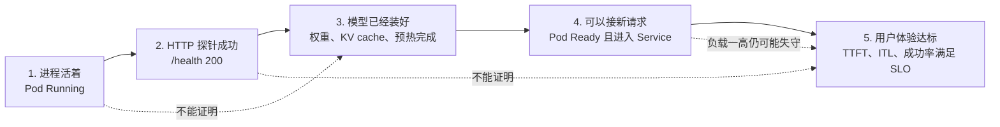
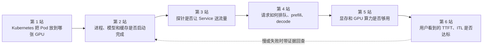
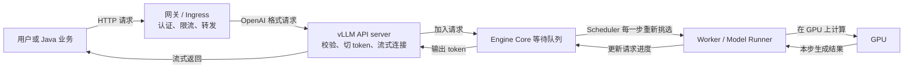
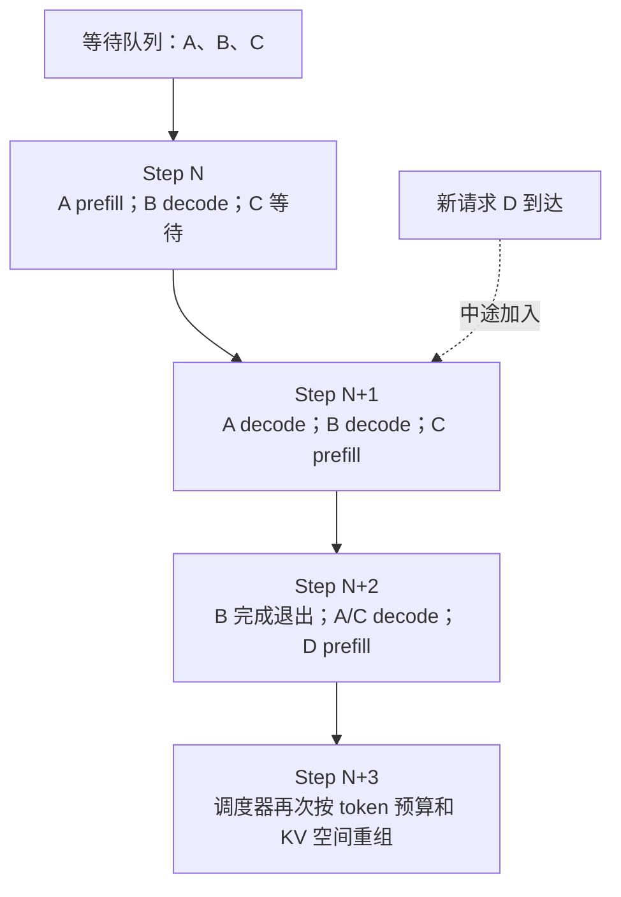
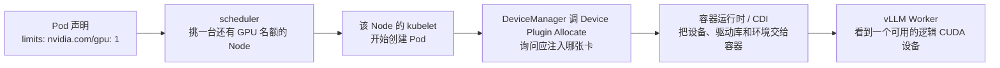
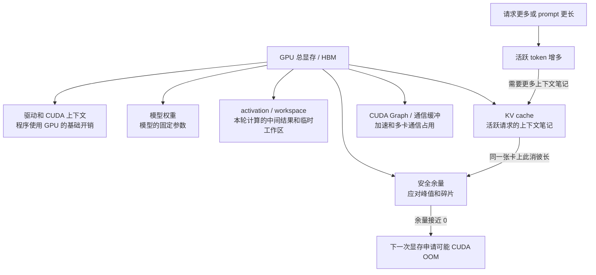
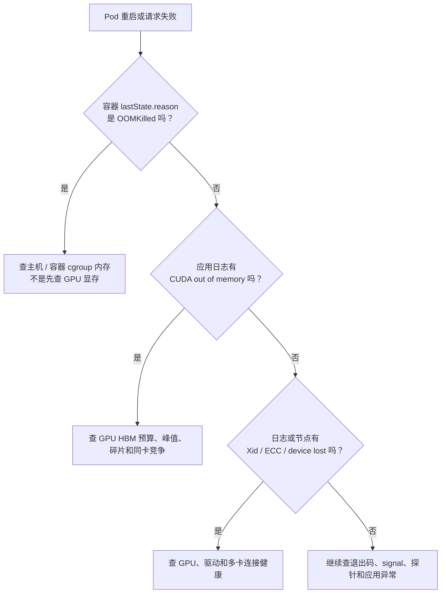
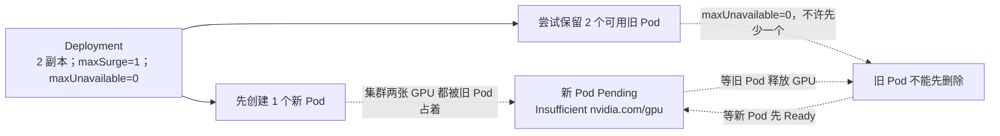

# 第 20 课：vLLM 在线推理——Pod 都 Ready 了，为什么还是不能交付

> 主案例：Pod 是 `Running`，就绪状态是 `Ready`，`/health` 也返回 `200`，可是用户第一句话迟迟出不来。  
> Kubernetes 源码基线：本地仓库提交 `301946d15e67a4a2e8a5fb8292eb836acd366d78`。  
> vLLM 源码基线：项目 `vllm-project/vllm`，版本 `v0.25.0`，完整提交 `702f4814fe54fabff350d43cb753ae3e47c0c276`，主要语言是 Python。  
> 学习边界：先学会用 Kubernetes 状态、vLLM 队列、GPU 显存和用户延迟判断故障在哪一层；暂时不钻 CUDA kernel、注意力算子和复杂分布式实现。  
> 前置内容：第 13 课讲过 kubelet 探针；第 14～19 课讲过 GPU 节点、Device Plugin、GPU Operator 和 DCGM（NVIDIA GPU 监控与健康检查组件）。本课把这些知识接到一个真实的在线推理服务上。

---

## 0. 先看事故：三个绿灯都亮了，用户为什么还在等

先不要急着看参数。把自己放到值班现场：

```text
10:00:08  容器进程启动，Pod 进入 Running
10:06:47  /health 开始返回 200
10:06:48  readinessProbe 成功，Pod 进入 Ready，Service 开始送请求
10:07:20  新请求越来越多，vLLM 的等待队列开始增长
10:07:35  /health 仍然是 200，但用户等第一段文字已经明显变慢
10:08:02  长 prompt 抢占了大量计算和 KV cache，尾部请求更慢
```

最先要明白的一句话是：

> `Running` 只说明容器里的进程已经启动；`Ready` 只说明 Kubernetes 的就绪探针成功；`/health 200` 只说明这个 HTTP 健康检查成功。三者都不等于“当前流量下，用户能按承诺速度拿到正确答案”。

### 0.1 这一课会反复出现的词，先翻成大白话

| 词 | 大白话 | 它在生产里回答什么问题 |
|---|---|---|
| vLLM | 一个把大模型变成在线接口的推理服务程序；它不是模型本身。它可提供 OpenAI-compatible 接口，也就是沿用常见的 OpenAI 请求/响应格式 | 请求怎样排队、怎样使用 GPU、怎样把 token 流式返回 |
| token | 模型处理文字时切出来的小单位，不一定等于一个汉字或单词 | 输入、输出和显存成本通常都按 token 计算 |
| prompt | 用户交给模型的输入内容，包括问题和系统提示词 | 输入越长，第一次计算通常越重 |
| 模型权重 | 模型训练后留下的大量数字参数；在线服务启动时要把它们读出来并放到 GPU | 模型能不能装下、冷启动要多久 |
| prefill | 模型第一次把整段 prompt 读进去，并为后续生成准备上下文 | 主要影响多久能看到第一个 token |
| decode | 模型在已有上下文上一个接一个地产生新 token | 主要影响后续文字出来得是否流畅 |
| continuous batching | 每跑一步都重新拼一批可以一起算的请求；有人完成就退出，新人可加入 | 为什么队列、长短请求和吞吐会互相影响 |
| KV cache | GPU 显存里保存的“上下文计算笔记”，避免每生成一个 token 都从头重算 | 能同时服务多少请求、能接多长上下文 |
| waiting queue | 请求已经进了 vLLM，但还在等本轮计算机会的队列 | 是否开始供不应求 |
| warm-up | 正式接流量前先跑几轮，把编译、缓存和执行路径准备好 | 为什么进程起来后还要等一段时间 |
| TTFT | 从请求到达，到用户收到第一个 token 的时间 | 用户是否“等半天还没看到开头” |
| ITL | 相邻两个输出 token 之间的间隔 | 文字流出来时是否一卡一卡 |
| TPOT | 第一个 token 以后，平均生成一个输出 token 花多久 | 单个请求的持续生成速度 |
| SLO | 团队对用户承诺的服务目标，例如“99% 请求 2 秒内出首字” | 到底什么才算真正可交付 |

`p99` 也顺便解释一下：把 100 个请求从快到慢排好，第 99 个附近的耗时就是 p99。它关注最慢的那一小批用户，而不是平均值。

### 0.2 五道门：前一扇打开，不代表后一扇也打开

读图规则：实线箭头表示正常情况下继续向右走；虚线箭头表示“前面的绿灯不能证明后面也绿”。



这里故意把“HTTP 探针成功”和“模型已经装好”拆开。某些 vLLM 版本和启动方式会在模型初始化后才开放 `/health`，因此两者在你的现场可能紧挨着；但它们仍不是同一个判断。`/health` 没有替用户完成一次真实推理，也没有检查排队后的 p99。

Java 平台经验只能当辅助类比：Spring Boot 的 `/actuator/health` 返回 `UP`，也不等于线程池没排队、数据库没变慢、接口 p99 一定达标。vLLM 只是把线程池、堆内存等问题，换成了请求调度、KV cache 和 GPU 显存等新对象。

---

## 1. 第一遍只走六站，先把故障放对地方

这一遍不求你背参数，只求你以后看到“Ready 但慢”时，能按固定顺序排查。

读图规则：从左往右是一个请求真正经过的方向；每个方框是一站；红色回箭头表示用户现象可能迫使我们回到前面找根因。



| 站点 | 先问一句话 | 本课深入位置 |
|---|---|---|
| 1. GPU 放置 | Pod 真拿到 GPU 了吗，发布时还有空卡吗？ | [第 4 节](#4-kubernetes-如何把一个-gpu-交给-vllm)、[第 11 节](#11-扩缩容与发布gpu-稀缺资源下不能照搬普通-deployment) |
| 2. 启动 | 权重、KV cache 和预热走到哪一步？ | [第 5 节](#5-模型启动从进程创建到真正-ready) |
| 3. 接流量 | Kubernetes 为什么认为它 Ready？ | 本节源码、[第 5 节](#53-health-的真实边界) |
| 4. 排队与生成 | 请求是在等，还是已经在 GPU 上算？ | [第 3 节](#3-从-http-请求到-gpu-token一条完整生产链) |
| 5. GPU 容量 | 权重、KV cache 和临时计算分别吃了多少显存？ | [第 6 节](#6-显存账本权重只是第一行)、[第 7 节](#7-oom-故障树先分-gpu主机内存与硬件故障) |
| 6. 用户结果 | 首 token、后续 token、成功率是否满足承诺？ | [第 10 节](#101-五个时间边界不能混) |

### 1.1 先读第一段 Kubernetes Go 源码：`200` 到底被判成了什么

下面是本地 Kubernetes 固定提交 `301946d15e67a4a2e8a5fb8292eb836acd366d78` 中的连续源码，文件是 `pkg/probe/http/http.go`，第 111～117 行。这里属于 **Kubernetes 项目的 Go 代码**，不是 vLLM 的 Python 代码。

```go
if res.StatusCode >= http.StatusOK && res.StatusCode < http.StatusBadRequest { // 如果状态码在 200 到 399 之间，就进入“探针可接受”的分支。
	if res.StatusCode >= http.StatusMultipleChoices { // 如果是 300～399，也就是重定向，不把它当普通成功，而是给出 Warning。
		klog.V(4).Infof("Probe terminated redirects for %s, Response: %v", url.String(), *res) // 记录一条较详细的调试日志。
		return probe.Warning, fmt.Sprintf("Probe terminated redirects, Response body: %v", body), nil // 返回 Warning；最后的 nil 表示执行 HTTP 请求本身没有报 Go 错误。
	}
	klog.V(4).Infof("Probe succeeded for %s, Response: %v", url.String(), *res) // 走到这里说明状态码是 200～299，记录“探针成功”。
	return probe.Success, body, nil // 把结果交回 kubelet：探针成功，同时返回响应体，没有额外错误。
}
```

大白话总结：kubelet 在这里看到 `200`，只会得出“我访问的这个地址返回了成功状态码”。这段代码没有读取 vLLM 的等待队列，没有发一条真实模型请求，也没有计算 TTFT、ITL 或 SLO。所以 `/health 200` 和“用户体验达标”本来就是两个问题。

再补最后一跳。`pkg/kubelet/prober/prober.go` 第 111～119 行把底层探测结果交给上层：

```go
switch result { // 根据刚才得到的探测结果，选择接下来返回什么。
case probe.Success: // 如果底层结果是 Success。
	logger.V(3).Info("Probe succeeded", "probeType", probeType, "pod", klog.KObj(pod), "podUID", pod.UID, "containerName", container.Name) // 记录“探针成功”日志和 Pod、容器信息。
	return results.Success, nil // 告诉 kubelet 上层：本次探测成功，没有错误。

case probe.Warning: // 如果是重定向一类的 Warning。
	pb.recordContainerEvent(ctx, pod, &container, v1.EventTypeWarning, events.ContainerProbeWarning, "%s probe warning: %s", probeType, output) // 给 Pod 记录一条 Warning 事件。
	logger.V(3).Info("Probe succeeded with a warning", "probeType", probeType, "pod", klog.KObj(pod), "podUID", pod.UID, "containerName", container.Name, "output", output) // 日志说明：有警告，但探测仍算成功。
	return results.Success, nil // 上层仍收到 Success。
}
```

大白话总结：readinessProbe 使用 HTTP 探测时，这条链判断的是“这一次探测成功没有”。它不懂你的业务承诺。真正决定 Pod 是否加入 Service 流量的后续状态链，第 13 课已经讲过；本课只抓住和事故直接相关的判断边界。

### 1.2 不熟 Go：只补这段源码真正用到的 Go 语法

| 写法 | 大白话 |
|---|---|
| `if 条件 { ... }` | 条件成立才执行大括号里的代码；Go 不要求给条件加小括号 |
| `&&` | “而且”。状态码既要大于等于 200，又要小于 400 |
| `switch result` / `case` | 根据 `result` 的不同值走不同分支，类似 Java 的 `switch` |
| `:=` | 第一次创建局部变量并自动推断类型；本段截取里没有出现，但读前后文会看到 |
| `return a, b, c` | Go 函数可以一次返回多个值；这里依次是探测结论、响应内容、错误 |
| `nil` | “没有对象/没有错误”的空值；这里的 `nil` 表示没有额外 Go 错误，不代表业务一定健康 |

### 1.3 第一遍学完，只先记住六个判断

1. `Running` 不是“模型可用”，它只说明容器进程已经起来。
2. `Ready` 不是“性能达标”，它只说明你配置的 readiness 条件通过。
3. `/health 200` 不是一次真实推理成功，更不是 p99 达标。
4. 请求慢时，要分清它在等待队列、prefill，还是 decode。
5. 显存不能只看模型权重，KV cache 和临时计算也会占显存。
6. 真正的交付标准在第 6 站：用户看到的成功率、TTFT、ITL 和输出是否达到 SLO。

### 1.4 这章很长，正确读法是两遍

- 第一遍只读第 0～7 节中的主线、图和“大白话总结”，然后做第 20.1 节。目标是能讲清六站，不背参数和命令。
- 第二遍再读第 8～18 节的配置、指标、发布、安全和取证，然后做第 20.3 节。目标才是独立值班。
- 某个英文词忘了，先回看它第一次出现处的翻译；不要为了一个词跳进 CUDA 或调度算法深处。

---

## 2. 冻结版本、证据层级与当前默认实现

### 2.1 本课版本账本

为什么先记版本？因为你在博客里看到的函数名、默认参数和指标，换一个 vLLM 版本就可能变。`tag` 是人容易读的发布标签，例如 `v0.25.0`；`commit` 是唯一指向一份源码快照的完整编号；镜像 `digest` 是容器镜像内容的指纹；模型 `revision` 是模型仓库里的固定版本。排障时同时固定这四类身份，才不会把不同工件混成一个问题。

| 项目 | 冻结值 | 运维意义 |
|---|---|---|
| vLLM release | `v0.25.0` | 参数、指标、源码函数以该 tag 为准 |
| 发布时间 | `2026-07-11` | 本课核对日只晚三天，仍不得把 main 分支混入 |
| tag commit | `702f4814fe54fabff350d43cb753ae3e47c0c276` | 人读版本认 tag，源码链接固定完整 commit，避免 tag 漂移或短号撞车 |
| 核对日期 | `2026-07-14` | 后续读者必须主动检查是否已有行为变化 |
| dense 默认 runner | Model Runner V2 | 源码入口是 `vllm/v1/worker/gpu/model_runner.py` |
| `gpu_memory_utilization` 默认 | `0.92` | 只是默认，不是所有生产模型的推荐值 |
| 示例服务镜像 | `vllm/vllm-openai@sha256:e1c1ff1af9a15921bfa11d1d95047258c1797392cdbfa296e7639da446b23f97`（amd64） | 固定示例工件；落地前仍验证架构、driver、CUDA 和 SBOM |
| 示例模型 | `Qwen/Qwen3-0.6B`，revision `9d4bfd9a94aa5f2ab18d77fa457c306da0b8e439` | 用于讲部署结构，不代表生产容量或质量基线 |

release 入口：

- [vLLM v0.25.0 release](https://github.com/vllm-project/vllm/releases/tag/v0.25.0)
- [vLLM v0.25.0 固定提交源码树](https://github.com/vllm-project/vllm/tree/702f4814fe54fabff350d43cb753ae3e47c0c276)

### 2.2 证据优先级

本课遇到冲突时按以下顺序裁决：

```text
固定tag源码
  > 同版本官方API/source文档
  > 同版本官方使用文档
  > release notes
  > 实际镜像/Pod运行证据
  > 未固定版本的博客、示例和经验
```

“实际运行证据”并不是永远高于源码。它可能来自不同镜像、不同 architecture manifest、额外 patch 或错误参数，所以必须先确认：

```text
镜像digest
模型ID与revision
tokenizer revision
vLLM版本输出
启动参数
GPU产品与driver
并行度
指标抓取样本
```

### 2.3 Model Runner V2 与旧资料的断点

`v0.25.0` release 明确：

- Model Runner V2 成为所有 dense model 的默认 runner。
- legacy PagedAttention 实现已移除。

这里先翻译三个词：`dense model` 是每次计算基本都会经过整套主要参数的稠密模型，与只挑部分专家参与的 MoE 模型相对；`Model Runner` 是 Worker 内真正准备输入并执行模型的一层；`legacy` 是为了旧版本兼容而保留的老实现。

`PagedAttention` 是某一套历史注意力实现的名字；`paged KV cache` 则是把 KV cache 分成一块一块来管理的思路。**删掉旧实现，不等于“分块管理 KV cache”这个思路消失。** 可以类比：换掉旧版文件系统驱动，不等于磁盘不再分块管理。

这两句话要精确理解：

| 正确说法 | 错误说法 |
|---|---|
| 当前 dense 默认执行源码从 `vllm/v1/worker/gpu/model_runner.py` 进入 | vLLM 再也没有 KV block 或 paged KV cache |
| 调度器/KV cache manager 仍做块化容量与映射管理 | 文档里出现“Paged Attention”就说明旧实现仍是默认 |
| 旧 `gpu_model_runner.py` 路径仍可能服务 legacy/兼容代码，不能据此判断默认 | 找到旧文件就证明 v0.25.0 没切换 MRv2 |

阅读旧博客时，先问三个问题：

1. 它对应哪个 tag？
2. 它讲的是概念、公共 API，还是某个已删除的内部类？
3. 当前 default path 的调用链是否仍会到达它？

---

## 3. 从 HTTP 请求到 GPU token：一条完整生产链

### 3.1 组件分层

先消除一个容易混淆的名字：本节的 **API server 是 vLLM 接收 HTTP 请求的入口**，不是 Kubernetes API Server。

读图规则：从左往右是请求进入系统的方向；从右往左是生成结果返回用户的方向；“等待队列”是还没拿到本轮 GPU 计算机会的请求集合。



整条链可以先记成：**HTTP 入口收件 → Engine Core 排队和派活 → Worker 使用 GPU 计算 → 结果再流回用户**。

责任边界：

| 层 | 主要职责 | 常见瓶颈/故障 |
|---|---|---|
| 网关 / Ingress | 做认证、限流和转发；可以把它看成服务门口 | 5xx、被限流、连接在门口排队 |
| vLLM API server | 校验参数，把文字切成 token，并保持流式连接 | CPU 忙、模板错误、返回流被堵住 |
| Engine Core | 维护请求的一生，协调调度和执行 | 核心进程死亡、内部通信中断 |
| Scheduler / KV manager | Scheduler 是“派活的人”；KV manager 是“上下文显存账本管理员” | 等待队列增长、KV cache 不够、请求被暂停让路 |
| Executor / Worker | Executor 组织一个或多个 Worker；Worker 是真正使用 GPU 的工作进程 | CUDA、跨卡通信或 Worker 崩溃 |
| Model Runner | 在 Worker 内准备输入、执行模型、选出下一个 token | 临时显存峰值、编译或计算异常 |
| GPU / driver / fabric | GPU 负责算，driver 负责让程序使用设备，fabric 是卡间连接 | Xid/ECC 硬件错误、带宽或拓扑问题 |

上表中的 `CUDA` 是程序使用 NVIDIA GPU 的计算平台；`NCCL` 是多张 GPU 之间传数据常用的通信库；`HBM` 就是 GPU 上的高速显存。它们先认识作用即可，本课不要求读实现。

### 3.2 关键源码入口

读函数名前先认对象：`AsyncLLM` 是 API 进程里的异步外壳，负责提交请求和接收流式结果；`EngineCore` 是不断调度和执行的核心循环；`Scheduler` 是派活者；`Executor` 是协调 Worker 的执行层；`GPUModelRunner` 是 Worker 里真正准备并执行模型的部分。`renderer/tokenizer/input processor` 则负责把用户输入模板化、切成 token，并整理成引擎能接收的结构。

| 调用点 | 固定源码 | 阅读时要回答的问题 |
|---|---|---|
| `run_server()` / `build_and_serve()` | `vllm/entrypoints/openai/api_server.py` | server 如何构建 app 和 engine client |
| `build_async_engine_client_from_engine_args()` | 同上 | 配置如何进入 `AsyncLLM`，退出时如何 shutdown |
| `AsyncLLM.add_request()` | `vllm/v1/engine/async_llm.py` | 输入何时被处理、何时提交到 Engine Core |
| `AsyncLLM.generate()` | 同上 | 为什么它是 async generator，输出如何逐步返回 |
| `EngineCore.__init__()` | `vllm/v1/engine/core.py` | executor、KV cache、scheduler 的初始化顺序 |
| `EngineCore.add_request()` | 同上 | request 如何交给 scheduler |
| `EngineCore.step()` | 同上 | `schedule -> execute_model -> update_from_output` 主循环 |
| `Scheduler.add_request()` / `schedule()` | `vllm/v1/core/sched/scheduler.py` | waiting/running 如何变化，token budget 如何使用 |
| `Worker.init_device()` / `load_model()` | `vllm/v1/worker/gpu_worker.py` | device、权重和 memory profiler 边界 |
| `determine_available_memory()` | 同上 | 可给 KV cache 的预算如何得出 |
| `initialize_from_config()` / `compile_or_warm_up_model()` | 同上 | KV cache 何时分配，warm-up/graph 何时发生 |
| `GPUModelRunner.load_model()` | `vllm/v1/worker/gpu/model_runner.py` | MRv2 如何选择 loader 并记录权重显存 |

固定源码：

- [api_server.py @ 固定提交](https://github.com/vllm-project/vllm/blob/702f4814fe54fabff350d43cb753ae3e47c0c276/vllm/entrypoints/openai/api_server.py)
- [async_llm.py @ 固定提交](https://github.com/vllm-project/vllm/blob/702f4814fe54fabff350d43cb753ae3e47c0c276/vllm/v1/engine/async_llm.py)
- [core.py @ 固定提交](https://github.com/vllm-project/vllm/blob/702f4814fe54fabff350d43cb753ae3e47c0c276/vllm/v1/engine/core.py)
- [scheduler.py @ 固定提交](https://github.com/vllm-project/vllm/blob/702f4814fe54fabff350d43cb753ae3e47c0c276/vllm/v1/core/sched/scheduler.py)
- [gpu_worker.py @ 固定提交](https://github.com/vllm-project/vllm/blob/702f4814fe54fabff350d43cb753ae3e47c0c276/vllm/v1/worker/gpu_worker.py)
- [MRv2 gpu/model_runner.py @ 固定提交](https://github.com/vllm-project/vllm/blob/702f4814fe54fabff350d43cb753ae3e47c0c276/vllm/v1/worker/gpu/model_runner.py)

### 3.3 第一段 vLLM Python 源码：一次 `step` 到底做什么

从这里开始切换项目：下面不是 Kubernetes Go，而是 **`vllm-project/vllm` 项目的 Python 源码**。固定版本为 `v0.25.0`，完整提交为 `702f4814fe54fabff350d43cb753ae3e47c0c276`，文件为 `vllm/v1/engine/core.py` 第 486～508 行。摘录保持连续，只增加逐行中文注释。

```python
# Check for any requests remaining in the scheduler - unfinished,  # 先看调度器里是否还有没结束的请求，
# or finished and not yet removed from the batch.  # 也包括已经结束但尚未从当前批次移走的请求。
if not self.scheduler.has_requests():  # 如果一个请求都没有，GPU 本轮不需要工作。
    return {}, False  # 返回空结果；False 表示本轮没有执行模型。
scheduler_output = self.scheduler.schedule(self._should_throttle_prefills())  # 调度器决定本轮让哪些请求算多少 token。
future = self.model_executor.execute_model(scheduler_output, non_block=True)  # 把本轮任务交给模型执行器；先拿到一个“稍后给结果”的 Future。
grammar_output = self.scheduler.get_grammar_bitmask(scheduler_output)  # 准备结构化输出可能需要的约束；普通请求也会经过这个接口。
with (  # 进入两个保护范围：出错时留细节，同时记录本轮耗时和请求数量。
    self.log_error_detail(scheduler_output),  # 第一个保护范围负责补充错误证据。
    self.log_iteration_details(scheduler_output),  # 第二个保护范围负责记录本轮执行详情。
):  # 两个保护范围从这里开始生效。
    model_output = future.result()  # 等 Worker/GPU 把本轮模型计算结果交回来。
    if model_output is None:  # 某些执行方式先完成模型计算，但还没有完成选 token。
        model_output = self.model_executor.sample_tokens(grammar_output)  # 再根据模型分数和输出约束选出 token。
# Before processing the model output, process any aborts that happened  # 处理模型结果前，先处理计算期间发生的请求取消，
# during the model execution.  # 避免把已经取消的请求继续当作活跃请求。
self._process_aborts_queue()  # 从取消队列中取出并终止这些请求。
engine_core_outputs = self.scheduler.update_from_output(  # 用本轮输出更新每个请求的进度、状态和下一轮资格。
    scheduler_output, model_output  # 同时交给它“本轮安排”和“本轮实际结果”。
)  # 更新完成。
return engine_core_outputs, scheduler_output.total_num_scheduled_tokens > 0  # 返回可向上游发送的结果，并说明本轮是否真的安排了 token。
```

大白话总结：Engine Core 不是让一个 HTTP 请求独占 GPU 一直跑到结束。它不断重复四件事：**挑本轮工作 → 交给 GPU → 收回本轮结果 → 更新队列**。因此，请求可以在到达 GPU 前排队；而且 GPU 很忙也不代表每个用户都很快。

这一段只补会用到的 Python 语法：

| 写法 | 大白话 |
|---|---|
| `self.xxx` | 当前这个 `EngineCore` 对象里保存的成员，类似 Java 的 `this.xxx` |
| `if not ...` | 如果后面的条件不成立 |
| `a, b = ...` 或一次 `return a, b` | Python 可以一次接收或返回多个值 |
| `Future` | 先给你一张“结果稍后回来”的取件单；`future.result()` 才真正取结果 |
| `with (...)` | 临时进入一个受管理的范围，结束时自动做收尾；这里用于错误和耗时记录 |
| `None` | 没有值，作用接近 Java 的 `null`，但要结合该函数约定理解 |

`sample_tokens` 的意思是“从模型给出的候选分数里选出接下来输出的 token”。`grammar bitmask` 是结构化输出限制用的一张允许/禁止表；它不是本课主线，知道作用即可。

### 3.4 prefill、decode 与 continuous batching

对产品和容量工程，仍要区分：

| 工作 | 输入 | 主要产出 | 常见敏感项 |
|---|---|---|---|
| prefill | 整段 prompt tokens | 首次可用于生成的上下文/KV | prompt 长度、注意力计算、TTFT |
| decode | 已有上下文 + 新生成 token | 下一 token | 并发序列、KV 访问、ITL/TPOT |

这里的“注意力计算”，可以先理解为模型把当前 token 和前文关系算一遍；它不是“监控告警”的注意力。

但当前 Scheduler 内部不是“先把所有人的 prefill 都做完，再统一 decode”这两个互斥大阶段。它每一步都会重新看请求进度。读图规则：从上到下是时间推进；实线箭头表示同一个请求进入下一步；虚线箭头表示新请求中途加入。



源码注释的核心含义是：

```text
每个请求记录num_computed_tokens
目标包含prompt token、output token和可能的spec token
每一步计算“还差多少token”
调度器在本步预算内分配token
因此同一步可以包含多个请求、不同工作形态和chunked prefill
```

`token budget` 是“本轮最多允许计算多少 token”的额度；`chunked prefill` 是把很长的 prompt 拆成几轮处理，避免一个长请求一次吃掉整轮预算。

continuous batching 不是：

```text
凑齐8个请求
  -> 8个请求形成永久batch
  -> 等最慢请求完成才换下一批
```

而更接近：

```text
step N:
  running A/B/C + admit D的一部分prompt

step N+1:
  A完成，B/C继续decode，D继续prefill，admit E

step N+2:
  B/C/D/E按token budget和KV可用性重组
```

这也是吞吐与延迟调优不能只看 `max_num_seqs` 或一个 batch size 的原因。

---

## 4. Kubernetes 如何把一个 GPU 交给 vLLM

### 4.1 从 Pod 资源声明到进程可见设备

这一节是在把第 14～16 课的 GPU 分配链接到 vLLM，不重新深挖那些源码。读图规则：从左往右是 Pod 从“声明要卡”到“进程能用卡”的顺序；每条箭头表示前一步把结果交给下一步，并不是组件之间都直接互相调用。



这几个名字只要先记作用：

| 名字 | 大白话 |
|---|---|
| `nvidia.com/gpu` | NVIDIA Device Plugin 向 Kubernetes 登记的一种“GPU 名额” |
| 扩展资源 | 不属于内置 CPU、内存，由设备插件额外登记的资源名 |
| DeviceManager | kubelet 里面管设备分配的模块 |
| Device Plugin | 厂商在节点上运行的设备管家，报告可用设备并回答如何分配 |
| `Allocate` | Device Plugin 的“请告诉我怎样把已选设备交给容器”接口 |
| 容器运行时 | 真正创建容器的程序，例如 containerd |
| CDI | 一种标准设备描述方式，让运行时知道要加入哪些设备节点、库或环境 |
| 逻辑 CUDA 设备 | 容器自己能看到的 GPU 编号集合，不等于宿主机原始编号 |

关键边界：

1. `nvidia.com/gpu` 是扩展资源；通常写 `limits` 即可，Kubernetes 会使 request 与 limit 一致。
2. 容器内 `cuda:0` 是“此容器可见设备集合中的第 0 个”，不保证等于宿主机物理 index 0。
3. 不要在普通工作负载中手工写死 `CUDA_VISIBLE_DEVICES=0` 来绕过 kubelet 分配。
4. Pod 内所有普通容器位于同一 Node；一个 Pod 申请多个 GPU，也只能拿该 Node 上可分配的设备。
5. Device Plugin 分配成功只证明设备注入链通过，不证明模型能装下、NCCL 能通信或 SLO 能满足。

### 4.2 Pod、进程、GPU 与 parallel rank

`parallel` 是“并行”，也就是多张 GPU 一起工作；`rank` 是每个参与进程在这个团队里的编号，类似“1 号工位、2 号工位”。官方架构对默认进程拓扑给出一个重要关系：每个 Engine Core 的 Worker 数通常与 `TP × PP` 对应，DP 则有多个 Engine Core/rank。

生产上可用下面的近似映射理解：

| 模式 | 主要目标 | GPU/进程关系 | Kubernetes 常见承载 |
|---|---|---|---|
| 单 GPU | 最简单、模型能放下 | 1 worker / 1 GPU | 1 Pod 请求 1 GPU |
| TP（张量并行） | 把同一层的大计算切给多张卡，常用来解决单卡放不下 | 同一个请求需要多卡频繁一起通信 | 常见为 1 Pod 请求同节点多 GPU |
| PP（流水线并行） | 把模型的不同层放到不同卡，像流水线工位 | 上一段要把中间结果传给下一段 | 可以跨节点，但启动、网络和调度更复杂 |
| DP（数据并行） | 放多份模型副本，让不同副本处理不同请求 | 每份副本有自己的 Engine Core | 多 Pod 或受控的分布式拓扑 |

普通 `Deployment replicas: 4` 只会产生四个独立 Pod。它不会自动：

- 选出 Ray head；
- 建立 TP/PP process group；
- 分配 rank；
- 保证 gang scheduling；
- 等待全部成员后一起 Ready；
- 建立安全的跨节点内部通信。

跨节点 vLLM 必须显式设计 launcher/cluster runtime、head/worker 生命周期、服务发现、端口、RBAC、NetworkPolicy、failure domain 和整体回滚。本课部署模板故意采用独立单 GPU 副本。

上面这一句里的高级词先翻译，不要求现在实现：`launcher/cluster runtime` 是负责拉起和协调多机进程的总管；`head` 是协调者，`worker` 是执行者；`process group` 是需要一起通信的一组 GPU 进程；`gang scheduling` 是“所需成员要么一起拿到资源，要么先都别启动”；`failure domain` 是可能一起故障的范围，例如同一节点或同一机架。`RBAC` 控制谁能调用 Kubernetes API，`NetworkPolicy` 控制 Pod 之间哪些网络连接被允许。

### 4.3 GPU 之外的资源也能卡死在线推理

| 资源 | 不足时的现象 | 证据 |
|---|---|---|
| CPU | tokenizer/JSON/stream 慢，GPU util 低，TTFT 高 | CPU throttling、run queue、API server profile |
| 容器内存 | tokenizer/cache/pinned memory 触发 cgroup OOM | `lastState.reason=OOMKilled`、memory events |
| ephemeral storage/inode | 模型下载、编译 cache、日志写失败 | eviction、`df`/inode、容器日志 |
| PVC/对象存储 | 冷启动慢、I/O 抖动、校验失败 | volume events、I/O latency、下载日志 |
| `/dev/shm` | multiprocessing/NCCL/IPC 异常或性能差 | mount size、worker/collective error |
| 网络 | 模型下载慢、跨节点 NCCL 慢、stream 阻塞 | flow、retransmit、NCCL logs |
| GPU fabric | TP collective 慢 | topology、NVLink/PCIe、DCGM/NCCL tests |

`emptyDir.medium: Memory` 提供的 `/dev/shm` 会计入 Pod/容器的内存使用，不能把它当免费 GPU 显存。

读这张表需要的翻译：CPU `throttling` 是容器用完 CPU 配额后被迫放慢；`run queue` 是等 CPU 的任务队列；`pinned memory` 是为 GPU 传输固定住的主机内存；`cgroup OOM` 是容器越过主机内存限制后被内核杀掉；`ephemeral storage` 是 Pod 的临时磁盘；`inode` 是文件系统记录文件的名额；PVC 是挂给 Pod 的持久卷；`/dev/shm` 是进程间共享内存区；`IPC` 是进程间通信；GPU `fabric/topology` 是多卡之间通过 PCIe、NVLink 等怎样连接；`retransmit` 是网络丢包后重传。

---

## 5. 模型启动：从进程创建到真正 Ready

### 5.1 启动阶段账本

一个可用于探针与故障定位的阶段表。表格从上往下读：上一步完成后才进入下一步；最早失败在哪一行，排查就先停在哪一行。

| 阶段 | 主要动作 | 典型资源 | 常见失败 |
|---|---|---|---|
| S0 容器准备 | image pull、volume mount、Secret/config | registry、PVC、runtime | ImagePull、Mount、权限 |
| S1 CLI/config | 解析参数、加载 model/tokenizer config | CPU、网络/cache | 参数不兼容、revision 不存在 |
| S2 device init | CUDA device、distributed/NCCL 初始化 | driver、GPU、网络 | driver/CUDA/NCCL、设备不可见 |
| S3 权重读取 | 下载/读取 shards、反序列化 | 网络、磁盘、CPU memory | 401、超时、磁盘满、损坏 |
| S4 权重装载 | 将 shard 放到目标 device | HBM、PCIe | CUDA OOM、dtype/quant 不支持 |
| S5 memory profile | profile activation/non-KV/graph 峰值 | GPU、CPU | profile OOM、配置过激 |
| S6 KV 规划/分配 | 计算可用 KV，分配 block | HBM | max len/并发不成立 |
| S7 compile/warm-up | 编译、kernel warm-up、graph capture | GPU、CPU、cache | compile 慢、graph OOM、cache 权限 |
| S8 server ready | Engine Core handshake 完成，路由可响应 | IPC/ZMQ、HTTP | core dead、port/bind |
| S9 首个真实请求 | tokenization、schedule、prefill、decode | 全链路 | SLO/模型模板/输出异常 |

表里第一次出现的词，先翻译：`image pull` 是拉容器镜像，`volume mount` 是挂载存储，`registry` 是镜像仓库；`CLI/config` 是启动命令和配置；`revision` 是固定的模型版本号；`shard` 是权重分片；`compile` 是把某些计算准备成机器更容易执行的形式；`warm-up` 是正式接流量前先跑几次，把懒加载和准备动作做完；`handshake` 是两个进程先互相确认“我已就绪”；`ZMQ` 是 vLLM 进程之间使用的一种消息通信工具；`bind` 是程序占用并监听端口。

源码中的 `EngineCore.__init__()` 先构造 executor，再通过 `_initialize_kv_caches()`：

```text
worker报告KV cache规格
  -> determine_available_memory()
  -> get_kv_cache_configs()
  -> 计算KV token capacity / max concurrency
  -> initialize_from_config()
  -> profile、创建KV cache、warm-up/compile完成
  -> scheduler与引擎进入可工作状态
```

启动日志必须和阶段对齐。只搜最后一个 `Ready` 字样，会丢失“下载慢”还是“graph capture 慢”的主要矛盾。

### 5.2 冷缓存、热缓存与发布预算

至少建立四类启动基线：

| 维度 | 取值示例 |
|---|---|
| 模型缓存 | miss / hit |
| 编译缓存 | miss / hit |
| GPU/Node 类别 | A10 / L40S / A100；不同 CPU/磁盘 |
| 并行模式 | single / TP2 / TP4 / PP |

每次记录：

```text
T_schedule
T_image_ready
T_process_start
T_model_config
T_weights_loaded
T_profile_done
T_kv_ready
T_compile_warmup_done
T_health_200
T_readiness_true
T_first_real_request_first_token
```

探针不是隐藏不稳定的工具。合理预算应类似：

```text
startup budget
  = 对应模型+revision+节点类别+缓存状态的启动高分位
  + 可解释的抖动余量
  + 观测和发布决策余量
```

不要把“PVC 热缓存 p50 40 秒”直接设成所有节点的 60 秒 startup window。首次调度到新节点时可能需要下载数十或数百 GB，并重新编译。

### 5.3 `/health` 的真实边界

固定版本的 health handler 调用 engine client 的 `check_health()`。`AsyncLLM.check_health()` 的核心语义是：如果 engine 已进入 errored 状态则抛错，否则返回。

直接看证据。下面仍是 **`vllm-project/vllm` 项目的 Python 源码**，版本 `v0.25.0`，完整提交 `702f4814fe54fabff350d43cb753ae3e47c0c276`。第一段来自 `vllm/entrypoints/serve/instrumentator/health.py` 第 22～33 行，保持连续并逐行加中文注释：

```python
@router.get("/health", response_class=Response)  # 把下面这个函数注册成 HTTP GET /health 接口。
async def health(raw_request: Request) -> Response:  # 定义异步健康检查函数，输入是 HTTP 请求，输出是 HTTP 响应。
    """Health check."""  # 原源码说明：这是健康检查。
    client = engine_client(raw_request)  # 从 Web 应用状态里取出 Engine Client。
    if client is None:  # 如果这是只有渲染功能、没有推理引擎的特殊服务。
        # Render-only servers have no engine; they are always healthy.  # 原源码说明：这类服务没有引擎，直接视为健康。
        return Response(status_code=200)  # 直接返回 HTTP 200。
    try:  # 尝试检查引擎健康；若抛出指定异常，就走下面的 except。
        await client.check_health()  # 等待 Engine Client 完成它定义的健康检查。
        return Response(status_code=200)  # 没抛出 EngineDeadError，就返回 200。
    except EngineDeadError:  # 只有捕获到“引擎已死”这类异常时进入这里。
        return Response(status_code=503)  # 返回 503，表示服务当前不可用。
```

`check_health()` 本身更短，来自 `vllm/v1/engine/async_llm.py` 第 900～903 行：

```python
async def check_health(self) -> None:  # 定义异步健康检查；正常结束时不返回业务数据。
    logger.debug("Called check_health.")  # 只记录一次调用日志。
    if self.errored:  # 如果 AsyncLLM 已经记录为错误/死亡状态。
        raise self.dead_error  # 抛出死亡异常，让上面的 /health 返回 503。
```

大白话总结：这两段源码只问“vLLM 已经知道引擎死了吗”。它没有构造 prompt，没有进入 Scheduler，没有占用 KV cache，也没有等首 token。因此它不可能单独证明“模型答案正确”“现在还能接多少请求”或“TTFT 达标”。

这里的 `@router.get(...)` 是装饰器，可以先理解成“给函数贴上 `/health` 路由标签”；`async def` 表示异步函数；`await` 表示等一个异步结果回来；`try/except` 类似 Java 的 `try/catch`。完整 Python 补课在第 16 节。

所以 `/health 200` 可以支持：

- server 路由能响应；
- engine client 尚未报告已知死亡状态；
- 初始化通常已经走到 server 可接受 health 的阶段。

它不能支持：

- 发送一个固定 prompt 后能产出正确 token；
- 当前 waiting queue 为零；
- TTFT、ITL、TPOT 或 E2E 达标；
- 所有 DP/TP/PP rank 的性能都正常；
- 模型 revision、chat template 和业务语义正确；
- 网关、鉴权、配额和流式客户端路径正常；
- GPU 没有潜在 Xid/ECC 或即将发生的容量故障。

固定源码：

- [health.py @ 固定提交](https://github.com/vllm-project/vllm/blob/702f4814fe54fabff350d43cb753ae3e47c0c276/vllm/entrypoints/serve/instrumentator/health.py)
- [AsyncLLM.check_health() @ 固定提交](https://github.com/vllm-project/vllm/blob/702f4814fe54fabff350d43cb753ae3e47c0c276/vllm/v1/engine/async_llm.py)

### 5.4 startup、readiness、liveness 的正确分工

| Probe | 失败动作 | 本课建议语义 | 错用后果 |
|---|---|---|---|
| startup（启动探针） | 达阈值后重启容器 | 冷启动是否在预算内完成 | 下载/编译未完成就循环重启 |
| readiness（就绪探针） | 从 Service endpoint 摘流量 | 当前实例是否允许接新请求 | 把容量问题变成流量抖动或雪崩 |
| liveness（存活探针） | 达阈值后重启容器 | 引擎失活且重启有恢复价值 | 队列高时杀进程，放大失败 |

startup probe 成功前，Kubernetes 会抑制 liveness/readiness；因此它适合保护长启动。

probe 窗口的粗略估算：

```text
最短连续失败窗口 ≈ failureThreshold × periodSeconds
```

但实际动作还受这些因素影响：

- `initialDelaySeconds`；
- 单次 `timeoutSeconds`；
- probe 执行和 kubelet worker 调度；
- success/failure 阈值；
- kubelet sync 与 runtime 重启；
- termination grace；
- API server/网络路径；
- 容器是否在 probe 开始前就退出。

完整 kubelet 源码链已经在[第 13 课](./13_kubelet_JavaPod_Running不Ready与重启_probe_statusManager_PLEG.md)讲过。本课只记：

```text
prober worker产生结果
  -> startup/liveness/readiness manager保存
  -> readiness影响Pod Ready
  -> startup/liveness失败进入sync决策
  -> kubelet runtime manager计算容器动作
  -> 需要时重启容器
```

当前本地 Kubernetes 快照的关键入口：

- `pkg/kubelet/prober/worker.go`：`(*worker).doProbe`
- `pkg/kubelet/kubelet.go`：probe manager updates、`handleProbeSync`
- `pkg/kubelet/kuberuntime/kuberuntime_manager.go`：`computePodActions`

不要误讲成“probe worker 直接调用 CRI kill”。

这里的 `endpoint` 是 Service 可以转发到的 Pod 地址；“摘流量”就是暂时从这个地址列表中移除。`threshold` 是连续成功/失败次数门槛；`termination grace` 是给进程优雅退出的宽限时间；CRI 是 kubelet 调用容器运行时的接口。

### 5.5 readiness 不是容量自动控制器

以下条件不应默认让 readiness 失败：

- waiting queue 短暂大于零；
- GPU utilization 高；
- KV usage 暂时高；
- 单个请求超时；
- 业务 SLO 在 1 分钟窗口轻微波动。

否则会形成：

```text
流量升高
  -> readiness失败
  -> endpoint减少
  -> 剩余Pod负载更高
  -> 更多readiness失败
  -> 服务雪崩
```

readiness 更适合表达“实例不能安全接新流量”的离散状态，例如：

- engine 已死或 worker 集合不完整；
- 必需模型没有加载；
- 发布/排空控制明确把实例置为不接新流量；
- 关键内部连接不可恢复。

容量过载主要应由网关限流/排队、扩缩容和 SLO 告警处理。

---

## 6. 显存账本：权重只是第一行

### 6.1 一张卡上的主要显存科目

先别算公式，把一张 GPU 显存想成一个固定大小的仓库。模型权重只是仓库里最大的一批固定货物，运行时还要留出工作台、上下文笔记和安全通道。

读图规则：上半部分的箭头表示“总显存被分给哪些用途”；下半部分的箭头表示“请求变长或变多后，KV cache 如何挤掉安全余量”。



再用预算式建立边界：

```text
M_GPU_total
  =
    M_driver_and_context
  + M_weight_shard
  + M_peak_activation_and_workspace
  + M_KV_cache
  + M_CUDA_graph_pools
  + M_collective_buffers
  + M_allocator_reserved_and_fragmentation
  + M_multimodal_or_other_features
  + M_safety_headroom
```

这不是 vLLM 内部真的执行的一条公式，而是运维人员用来防漏项的容量账本。每项的意义：

| 科目 | 大白话作用 | 为什么常被漏掉 |
|---|---|---|
| driver / context | 驱动和 CUDA 为这个进程准备的基础环境 | 它不属于模型参数，却照样占显存 |
| weight shard | 当前 GPU 保存的那一份模型权重；`shard` 就是“分片” | 只用“参数量 × 每个参数字节数”会漏掉额外数据和未切分部分 |
| activation / workspace | 本轮计算产生的中间结果和临时工作台 | 通常到 profile 或大请求时才出现峰值 |
| KV cache | 为活跃请求保存的上下文计算笔记 | 请求越多、上下文越长，通常占得越多 |
| CUDA Graph | 把常用 GPU 执行路径预先录下来，后面少做重复准备 | 多在 warm-up 时申请，所以只看权重加载日志会漏掉 |
| collective buffer | 多 GPU 交换数据时使用的缓冲区；`collective` 是多卡一起参加的一类通信 | 单卡测试里没有，多卡上线后才出现 |
| allocator reserve / fragmentation | 显存分配器预留的空间和“有空位却拼不出所需连续形状”的碎片 | 已分配值不等于已预留值，历史分配也会影响结果 |
| multimodal / feature cache | 图片、语音、LoRA 等额外功能需要的缓存 | 纯文本基线测不到 |
| safety headroom | 故意不分完的安全余量 | 一味追求“显存吃满”会把它挤掉 |

几个容易卡住的新词：`dtype` 是每个数字用什么数据格式保存，决定大约占几个字节；`quantization`（量化）是用更低精度保存或计算以节省资源；`profile` 是用一次受控运行测出峰值；`kernel` 在这里是 GPU 上执行的一小段计算程序，不是 Linux 内核。

权重的第一阶估算：

```text
M_weights_rough
  ≈ parameter_count
    × bytes_per_stored_weight
    ÷ effective_sharding_factor
```

但这些会让估算偏离：

- 量化还要保存 scale、zero point 和 metadata，也就是还原数值所需的比例、零点和说明数据；
- 未被切分或被复制的层；
- 词表、把 token 变成向量的 embedding、输出层 lm head 的特殊处理；
- 为方便硬件计算而补齐的 padding、对齐空间，以及多处共用的一份 tied weights；
- offload（把部分数据放到主机内存）与 host staging（主机侧中转区）；
- loader（权重加载器）装载时的临时峰值；
- PP 的不均匀层切分；
- MoE 模型把不同专家层放到哪些 GPU 上。

KV cache 的一阶关系：

```text
M_KV_rough
  ∝ live_cached_tokens
    × layers
    × key_and_value
    × kv_heads
    × head_dim
    × kv_dtype_bytes
    ÷ effective_KV_sharding
```

这里的 `KV heads` 和 `head dim` 是模型结构决定的“有多少组上下文信息、每组多宽”，运维不需要推导算法；只需知道它们会影响每个 token 的 KV 成本。这个粗略关系适合回答“什么变量会增大显存”，不适合替代固定模型、固定版本上的 profile 和压测。

### 6.2 `gpu_memory_utilization` 的准确语义

`v0.25.0` `CacheConfig` 中：

```python
gpu_memory_utilization: float = Field(default=0.92, gt=0, le=1)
```

官方字段说明强调：

- 这是当前 vLLM instance 的 GPU memory utilization 比例；
- 它不与同一 GPU 上的另一个 vLLM instance 协调；
- 如果明确要同卡运行两个 instance，可以分别配置类似 `0.5`，但这仍只是配置，不是硬隔离保证。

因此：

```text
--gpu-memory-utilization 0.80
```

不能翻译为：

- “KV cache 占卡的 80%”；
- “容器最多只能用 80%”；
- “另一个进程一定能安全使用剩余 20%”；
- “运行时无论什么请求都不会 OOM”；
- “MIG/time-slicing 已提供资源隔离”。

更准确的理解：

```text
目标executor预算
  -> 扣除profile得到的非KV峰值等部分
  -> 剩余预算用于规划KV cache
  -> 运行时仍可能受到未覆盖峰值、fragmentation和其他进程影响
```

固定官方 API：

- [CacheConfig @ v0.25.0](https://docs.vllm.ai/en/v0.25.0/api/vllm/config/cache/)
- [cache.py @ 固定提交](https://github.com/vllm-project/vllm/blob/702f4814fe54fabff350d43cb753ae3e47c0c276/vllm/config/cache.py)

### 6.3 `kv_cache_memory_bytes` 的覆盖关系

当 `kv_cache_memory_bytes` 非空时，官方说明是它覆盖自动推导的 KV cache 大小，`gpu_memory_utilization` 对 KV cache 推导被忽略。

这意味着：

| 配置 | 行为 |
|---|---|
| 只给 `gpu_memory_utilization` | worker profile 非 KV 使用后推导可分配 KV |
| 显式给 `kv_cache_memory_bytes` | 使用明确的 KV 字节预算 |
| 两者都给 | 不能把二者解释成“取更小者”；KV 配置走显式字节值 |

显式字节值适合可重复实验，但风险也更直接：

- 换 GPU 型号后总显存不同；
- 换模型/dtype/runner 后非 KV 峰值不同；
- CUDA Graph 配置变化；
- TP/PP shard 变化；
- 同卡出现额外进程；
- 数值可分配但运行峰值仍 OOM。

每次版本、模型或硬件变化都要重新 profile。

### 6.4 `max_model_len`、上下文与容量

`max_model_len` 限制模型处理的上下文长度。`v0.25.0` 支持 `-1` 或 `auto` 让系统在 GPU memory 约束下自动选择可容纳的最大值：如果完整模型上下文能放下则使用完整值，否则选择能够容纳的较大值。

自动适配不等于：

- 自动得到业务所需上下文；
- 自动保证指定并发；
- 自动限制用户 prompt；
- 自动避免单请求耗尽队列；
- 自动得到最佳 TTFT/吞吐。

生产更稳妥的顺序：

1. 产品定义真正需要的 prompt + output 上限。
2. 网关限制 body、prompt、`max_tokens`、`n` 等请求放大项。
3. vLLM 用明确 `max_model_len` 建立硬边界。
4. 按 prompt/output 分布压测并发与尾延迟。
5. 只有在接受自动选择及其版本变化时才用 `auto`。

固定源码：

- [ModelConfig @ v0.25.0](https://docs.vllm.ai/en/v0.25.0/api/vllm/config/model/)
- [model.py @ 固定提交](https://github.com/vllm-project/vllm/blob/702f4814fe54fabff350d43cb753ae3e47c0c276/vllm/config/model.py)
- [KV cache auto-fit implementation @ 固定提交](https://github.com/vllm-project/vllm/blob/702f4814fe54fabff350d43cb753ae3e47c0c276/vllm/v1/core/kv_cache_utils.py)

### 6.5 为什么两实例各 `0.5` 仍不是隔离方案

假设同一完整 GPU 上运行 A/B 两个 Pod，每个 `gpu_memory_utilization=0.5`：

```text
静态规划:
  A目标50%
  B目标50%

现实:
  driver/context各有一份
  warm-up峰值时间可能重叠
  graph/collective/allocator保留量不同
  GPU compute和memory bandwidth仍竞争
  kubelet扩展资源默认不会把一张整卡同时分给两个普通Pod
```

只有在平台显式配置 time-slicing、MPS、MIG 或其他共享机制时，多个工作负载才可能看到同一物理 GPU。此时还必须分别确认：

- 显存隔离是否存在；
- fault domain 是否隔离；
- compute fairness；
- 监控能否按实例归因；
- Device Plugin 暴露的是整卡、MIG profile 还是共享 replica；
- vLLM 参数是否按逻辑切片容量重测。

`time-slicing` 是让多个任务轮流使用同一张卡；`MPS` 是 NVIDIA 提供的多进程并发共享机制；`MIG` 是把支持的 GPU 划成带独立资源边界的硬件切片。三者隔离能力不同，本课只提醒不能把它们混成“共享 GPU”，下一课再深入。

不要把一个 vLLM 参数当作硬件多租户隔离。

---

## 7. OOM 故障树：先分 GPU、主机内存与硬件故障

### 7.1 第一刀：容器为什么结束

`OOM` 是 Out Of Memory，也就是“申请内存时已经没有合适空间”。但要先问清楚：缺的是 **GPU 显存**，还是 **容器使用的主机内存**。这两个根因、证据和处理方式都不同。

读图规则：从上往下逐个看证据；“是”箭头直接进入对应排查方向；不是就继续看下一种证据。



三类不能混写：

| 类别 | 典型证据 | Kubernetes 表现 | 第一责任域 |
|---|---|---|---|
| GPU OOM | `torch.cuda.OutOfMemoryError`、CUDA allocation failure | 进程可捕获、请求失败，也可能退出/CrashLoop | 模型/runner/显存配置/同卡竞争 |
| cgroup OOM | `lastState.reason=OOMKilled`、exit 137、memory events | kubelet 看到容器被内核杀死 | Pod memory limit、CPU-side cache/pinned memory |
| GPU/driver fault | Xid、ECC、device lost、NCCL async error | Pod 可能挂死、失败或重启 | GPU Node/driver/fabric，衔接第 19 课 |

CUDA OOM 最终导致进程退出时，Pod 可能进入 `CrashLoopBackOff`。这仍不把根因改成 Kubernetes `OOMKilled`。

词语翻译：`cgroup` 是 Linux 给容器记账和限额的机制；exit `137` 通常表示进程收到强制终止信号，但必须结合 `reason` 判断；`Xid` 是 NVIDIA 驱动报告的一类 GPU 错误编号；`ECC` 是显存纠错相关事件；`CrashLoopBackOff` 是容器连续启动失败后，Kubernetes 延长重试间隔的状态，不是根因名称。

### 7.2 CUDA OOM 出现在不同阶段，含义不同

| 阶段 | 更可能的原因 | 优先证据 |
|---|---|---|
| 权重加载 | 模型/quant/dtype/TP shard 放不下；同卡已有进程 | loader memory log、GPU process inventory、模型配置 |
| memory profile | activation/workspace 峰值；配置太激进 | `determine_available_memory` 前后日志 |
| KV 分配 | KV bytes/context/token capacity 不成立 | CacheConfig、KV capacity log |
| graph capture/warm-up | capture shape/graph pool 额外显存 | compile/capture 阶段日志 |
| 运行 prefill | 超长 prompt、大 token budget、activation 峰值 | prompt bucket、running/waiting、request params |
| 运行 decode | 活跃 cached token 过多、KV 压力、并发 | KV usage、preemption、running/waiting |
| TP/PP | rank 不均、collective buffer、某卡有额外进程 | 每 rank 日志与每 GPU process/memory |

### 7.3 CUDA OOM 的处置顺序

不要只做“把 utilization 从 `0.92` 改成 `0.99`”。建议顺序：

1. 固定镜像、模型 revision、启动参数、GPU UUID/逻辑设备和并行 rank。
2. 确认是否有额外 GPU 进程或共享机制。
3. 定位 OOM 阶段。
4. 记录权重、非 KV profile、KV、graph capture 的日志数值。
5. 降低允许上下文或请求放大项。
6. 降低并发/token budget，观察是否从运行峰值恢复。
7. 留出更大 headroom，而不是榨满预算。
8. 评估 dtype/quant，但必须重新做质量和 kernel 支持验收。
9. 模型单卡确实放不下时，再评估 TP/PP。
10. 固定工作负载重新跑吞吐与尾延迟，防止“无 OOM 但 SLO 更差”。

### 7.4 cgroup OOM 的常见来源

即使权重主要在 GPU，CPU memory 仍可能被这些占用：

- model shard 下载与反序列化 staging；
- tokenizer、chat template 和输入对象；
- pinned host memory；
- Ray/worker/IPC；
- Python heap 与输出队列；
- 多模态 decode；
- page cache 与 memory-backed `emptyDir`；
- profiler trace；
- 并发请求 body 和流式缓冲。

证据必须包含：

```text
Pod resources.requests/limits.memory
containerStatuses.lastState
Node memory pressure
cgroup memory.current / memory.events（若平台允许）
working set与RSS时间线
/dev/shm类型和sizeLimit
请求并发、body与多模态大小
```

`working set` 是近期真正在用、较难马上回收的内存近似值；`RSS` 是进程当前驻留在物理内存里的页面；`page cache` 是 Linux 用主机内存缓存文件内容；`profiler trace` 是性能分析记录，本身也可能很大。

### 7.5 allocator 碎片的判断纪律

看到 “reserved but unallocated” 不应立刻把所有 OOM 归为碎片。先比较：

- total capacity；
- 当前进程 allocated/reserved；
- 其他进程使用；
- OOM 申请大小；
- 发生阶段；
- 请求/shape 是否突然变化；
- 重启后相同固定负载能否复现。

碎片可能是放大因素，但模型与 KV 预算本身超限时，调 allocator 配置不会创造显存。

---

## 8. 一个可审计的 Kubernetes 基线模板

### 8.1 模板目标与非目标

下面模板用于讲清：

- 镜像 digest 与模型 revision 双固定；
- 独立单 GPU 副本；
- 两副本、`maxSurge: 0` 的稀缺 GPU 发布；
- startup/readiness 分工，以及 liveness 只在固定负载验证后的 opt-in 边界；
- API key 从 Secret 注入；
- 每个 Pod 使用独立可写 cache；共享只读模型工件与持久 cache 另行验收；
- 只调度到已验收 GPU 产品/driver/节点池；
- `/dev/shm` 与容器内存的边界；
- 默认只允许 render 或 dry-run，不授权实际变更。

它不是：

- 任何 GPU 上都能直接运行的“黄金参数”；
- 性能基线；
- 完整租户鉴权；
- 跨节点 vLLM 集群；
- 自动创建 Secret 或持久模型 cache 的脚本；
- 对生产执行 apply 的授权。

示例镜像 digest 是 Docker Hub 上 `v0.25.0` 的 amd64 manifest：

```text
sha256:e1c1ff1af9a15921bfa11d1d95047258c1797392cdbfa296e7639da446b23f97
```

部署前必须再次验证目标 Node 是 amd64，镜像标签/label/SBOM、CUDA 用户态与 host driver 兼容。digest 固定镜像工件，不证明其 build commit 就等于 GitHub release tag commit。

### 8.2 基线 YAML

```yaml
apiVersion: apps/v1
kind: Deployment
metadata:
  name: vllm-qwen3-06b
  namespace: inference
  labels:
    app.kubernetes.io/name: vllm
    app.kubernetes.io/instance: qwen3-06b
    app.kubernetes.io/version: "0.25.0"
    platform.example.com/change-mode: dry-run-only
spec:
  replicas: 2
  revisionHistoryLimit: 3
  progressDeadlineSeconds: 1800
  strategy:
    type: RollingUpdate
    rollingUpdate:
      maxSurge: 0
      maxUnavailable: 1
  selector:
    matchLabels:
      app.kubernetes.io/name: vllm
      app.kubernetes.io/instance: qwen3-06b
  template:
    metadata:
      labels:
        app.kubernetes.io/name: vllm
        app.kubernetes.io/instance: qwen3-06b
        app.kubernetes.io/version: "0.25.0"
        platform.example.com/model-revision: r9d4bfd9
    spec:
      automountServiceAccountToken: false
      terminationGracePeriodSeconds: 120
      nodeSelector:
        nvidia.com/gpu.product: NVIDIA-A10
        platform.example.com/vllm-baseline: qwen3-06b-v0250
      securityContext:
        seccompProfile:
          type: RuntimeDefault
      topologySpreadConstraints:
        - maxSkew: 1
          minDomains: 2
          topologyKey: kubernetes.io/hostname
          whenUnsatisfiable: DoNotSchedule
          labelSelector:
            matchLabels:
              app.kubernetes.io/name: vllm
              app.kubernetes.io/instance: qwen3-06b
      containers:
        - name: server
          image: vllm/vllm-openai@sha256:e1c1ff1af9a15921bfa11d1d95047258c1797392cdbfa296e7639da446b23f97
          imagePullPolicy: IfNotPresent
          args:
            - Qwen/Qwen3-0.6B
            - --revision
            - 9d4bfd9a94aa5f2ab18d77fa457c306da0b8e439
            - --tokenizer-revision
            - 9d4bfd9a94aa5f2ab18d77fa457c306da0b8e439
            - --served-model-name
            - qwen3-0.6b-r9d4bfd9
            - --host
            - 0.0.0.0
            - --port
            - "8000"
            - --max-model-len
            - "4096"
            - --max-num-seqs
            - "32"
            - --gpu-memory-utilization
            - "0.80"
          env:
            - name: VLLM_API_KEY
              valueFrom:
                secretKeyRef:
                  name: vllm-api-auth
                  key: api-key
            - name: HF_HOME
              value: /root/.cache/huggingface
            - name: VLLM_CACHE_ROOT
              value: /root/.cache/vllm
          ports:
            - name: http
              containerPort: 8000
              protocol: TCP
          startupProbe:
            httpGet:
              path: /health
              port: http
            timeoutSeconds: 2
            periodSeconds: 10
            failureThreshold: 90
          readinessProbe:
            httpGet:
              path: /health
              port: http
            timeoutSeconds: 2
            periodSeconds: 5
            failureThreshold: 3
            successThreshold: 1
          resources:
            requests:
              cpu: "4"
              memory: 12Gi
              ephemeral-storage: 10Gi
            limits:
              cpu: "8"
              memory: 16Gi
              ephemeral-storage: 20Gi
              nvidia.com/gpu: "1"
          securityContext:
            allowPrivilegeEscalation: false
            readOnlyRootFilesystem: true
            capabilities:
              drop:
                - ALL
          volumeMounts:
            - name: cache
              mountPath: /root/.cache
            - name: tmp
              mountPath: /tmp
            - name: dshm
              mountPath: /dev/shm
      volumes:
        - name: cache
          emptyDir:
            sizeLimit: 10Gi
        - name: tmp
          emptyDir:
            sizeLimit: 2Gi
        - name: dshm
          emptyDir:
            medium: Memory
            sizeLimit: 1Gi
---
apiVersion: v1
kind: Service
metadata:
  name: vllm-qwen3-06b
  namespace: inference
spec:
  selector:
    app.kubernetes.io/name: vllm
    app.kubernetes.io/instance: qwen3-06b
  ports:
    - name: http
      port: 8000
      targetPort: http
---
apiVersion: policy/v1
kind: PodDisruptionBudget
metadata:
  name: vllm-qwen3-06b
  namespace: inference
spec:
  minAvailable: 1
  selector:
    matchLabels:
      app.kubernetes.io/name: vllm
      app.kubernetes.io/instance: qwen3-06b
```

### 8.3 模板逐项解释

#### 镜像和模型是两个供应链对象

固定镜像 digest 只固定 server 工件。模型与 tokenizer 还要分别固定：

```text
image digest
model ID + model revision
tokenizer revision
可选 code revision
chat template / generation config
```

模板没有 `--trust-remote-code`。公开模型不需要 HF token，因此也没有无意义地挂载一个长效仓库凭证。

#### Service 只能作为内部示例

模板中的 ClusterIP Service 和 `VLLM_API_KEY` 不能构成生产暴露方案。`VLLM_API_KEY` 只保护固定版本中的一部分路由，同一 server 仍有未受它保护的 inference、operational 和 health 类路由。

片段没有创建 NetworkPolicy 或 gateway policy，是因为 namespace label、gateway identity 和允许路由属于现场配置，而不是因为它们可选。上线前置条件：

```text
vLLM Service不直接对外
  + gateway只转发批准的endpoint allowlist
  + NetworkPolicy只允许gateway/monitoring/必要管理来源
  + 租户认证、授权、配额和限流在gateway
```

任一项未验证，模板只能留在隔离测试环境。

#### GPU 产品与已验收节点池不能漂移

模板的两个 `nodeSelector` 是有意设置的“默认不通用”护栏：

- `nvidia.com/gpu.product: NVIDIA-A10` 固定本示例的 GPU 产品；
- `platform.example.com/vllm-baseline: qwen3-06b-v0250` 表示平台已验收池，该组织标签默认不会天然存在。

实际集群必须先只读查看 GFD/平台标签、GPU 显存、driver、taint 和 NodePool，再把 selector 改成自己的已验收值。不可照抄示例标签，也不可删除约束后让同一性能基线漂移到任意 GPU。

如果换 GPU 产品/driver/池，显存 profile、启动分位数、吞吐和 SLO 全部重测。

#### 为什么 writable cache 不共享 PVC

模板改用每 Pod 独立 `emptyDir`：

- 不会让两个副本并发写同一 Hugging Face/compile cache；
- 不会让跨 Node Pod 争用单个 RWO volume；
- 代价是 Pod 重建后 cache miss，startup budget 必须覆盖下载和编译；
- 10 GiB 只适合本示例小模型，仍受 20 GiB ephemeral-storage limit 约束。

生产大模型可选：

| 方案 | 模型工件 | compile/runtime cache | 前置验收 |
|---|---|---|---|
| 预制只读 snapshot/镜像/CSI | 多 Pod 只读共享、revision 固定 | 每 Pod 独立可写 | 工件完整性、mount topology |
| 每 Pod RWO PVC | 每 Pod 独立 | 同一 Pod 独立 | StorageClass、回收、容量、冷启动 |
| RWX cache | 可共享 | 最好仍把 compile/tmp 分离 | CSI 一致性、锁、并发 writer、性能 |

把同一个 RWO claim 挂给跨 Node 两副本可能出现 Multi-Attach；换成 RWX 也不会自动解决 Hugging Face lock、半写 shard 或 compile cache 并发风险。共享模型工件应优先只读，per-Pod compile/tmp 应独立可写。

`RWO` 表示卷通常只能被一个节点读写挂载；`RWX` 表示允许多个节点读写；`Multi-Attach` 是同一卷不允许按当前方式同时挂到多节点时的冲突；`writer` 就是会向缓存写数据的进程。

#### 为什么示例显存比例是 `0.80`

`0.80` 只是在小模型基线中显式展示“留 headroom 并测量”的原则，不是推荐默认。真正上线要由：

- 目标 GPU；
- 模型和 dtype/quant；
- max model len；
- max sequences/token budget；
- graph/compile 配置；
- workload 分布；
- 同卡进程；
- 容错余量

共同决定。读者不得把 `0.80` 复制成大模型生产标准。

#### 为什么不默认启用 per-request metrics

`--enable-per-request-metrics` 会增加请求级 timing 处理，官方文档明确提示高并发下 CPU overhead 可能不可忽略。基线先保留 server aggregate metrics；在受控压测证明开销可接受后，再通过独立 overlay 开启。

#### 为什么 `maxSurge: 0`

两副本每个申请一张 GPU：

```text
maxSurge=1
  -> rollout峰值需要3张可放置GPU

maxSurge=0,maxUnavailable=1
  -> controller先减少1个旧副本
  -> 旧Pod真正终止并释放GPU后，新Pod才能稳定拿卡
  -> 终止未完成时，新Pod仍可能Pending等待GPU
  -> 发布期间容量降到1副本
```

这不是免费选择。必须在发布前确认单副本能承载发布窗口流量，必要时先预留额外 GPU 或调低入口配额。PDB 主要约束 eviction，不替代 Deployment 的 rollingUpdate 策略。

#### `topologySpreadConstraints` 可能让第二副本 Pending

示例用 hostname topology、`maxSkew: 1`、`minDomains: 2` 和 `DoNotSchedule`，目的是让两个副本避免落在同一 Node 故障域。`minDomains: 2` 才把“至少两个合格 hostname 域”变成明确约束；只写 `maxSkew` 和 `DoNotSchedule` 不能等价地保证跨 Node。目标集群还必须支持该字段。

它要求 scheduler 能找到至少两个满足 GPU 资源、label/affinity、taint/toleration、storage 等全部条件的可用 hostname 拓扑域。

如果集群只有一个合格 GPU Node/单一可用域，第二副本可能长期 `Pending`。这不是 vLLM 故障，而是反亲和式可用性约束在生效。

现场选择：

| 选择 | 调度结果 | 接受的风险 |
|---|---|---|
| 保持 `DoNotSchedule` | 不满足跨 Node 分布就 Pending | 容量暂时不足，但不伪造跨故障域 HA |
| 改 `ScheduleAnyway` | 尽量 spread，必要时同 Node | Node 故障可能同时损失两个副本 |
| 去除约束 | scheduler 自由放置 | 不保证副本故障域 |

必须由 SLO 和 GPU Node 供给决定，不能把示例约束当通用模板。

#### 为什么基线不默认配置 liveness

startup 成功后，`/health` 请求仍经过 server/event loop。若 CPU 瞬时饥饿、GC/调度停顿或高负载让连续 2 秒 timeout，激进 liveness 会重启一个仍可恢复的实例，随后付出完整模型冷启动并把流量压到剩余副本。

因此模板默认只有 startup/readiness。只有在固定模型、CPU limit、目标/过载 workload 下证明：

- health failure 能可靠代表“必须重启才能恢复”；
- timeout/threshold 不会被合法尾延迟触发；
- 重启比等待恢复更快；
- 冷启动期间剩余容量足够

后，才通过受审 overlay 添加 liveness。不能直接复制 `timeoutSeconds: 2, failureThreshold: 3`。

#### `progressDeadlineSeconds` 必须覆盖合法冷启动

模板的 startup probe 粗略失败窗口是：

```text
90 × 10 seconds ≈ 900 seconds
```

Deployment 默认 `progressDeadlineSeconds` 通常是 600 秒。如果保留默认值，controller 可能在合法 startup budget 尚未结束时就把 rollout 标为 `ProgressDeadlineExceeded`。因此模板显式给出 `1800` 作为演示值；它不是通用推荐，必须由下列实测阶段派生：

```text
调度与GPU等待
+ image pull
+ storage/cache准备
+ 模型cache miss高分位
+ profile/KV/compile/warm-up
+ minReadySeconds（若配置）
+ controller观测与合理抖动
```

这些阶段可能重叠，实际应从 rollout 时间线取保守高分位，而不是机械相加。还要确保 deadline 大于 `minReadySeconds`。

Deployment 超过期限只会在 status condition 写入 `Progressing=False, reason=ProgressDeadlineExceeded`；它不会自动回滚。GitOps/企业发布平台（或具体现场控制器）可能读取该 condition、判定失败并执行自己的中止/回退策略，所以必须按现场控制器的真实行为，把 Pod probe、Deployment deadline 与上层发布超时一起设计。

#### 为什么没有 `preStop: sleep`

固定睡眠不等于排空。安全发布需要：

1. endpoint 摘除/网关停止送新请求；
2. 允许已接收流式请求在限定时间完成；
3. 超过产品上限的请求被取消并可观察；
4. SIGTERM 与 server shutdown 行为在固定版本验证；
5. `terminationGracePeriodSeconds` 覆盖允许的最长排空时间；
6. 客户端重试有幂等/重复 token 语义。

未验证这些之前，加入 `sleep 20` 只是在隐藏竞态。

`SIGTERM` 是 Kubernetes 删除容器时通常先发送的“请优雅退出”信号；如果进程在宽限时间内没有退出，之后可能被强制结束。

#### `readOnlyRootFilesystem` 需要验证

模板把已知写目录挂为 volume，但第三方库、compile backend 或驱动工具仍可能尝试写其他路径。server 必须在同一 digest 上先做只读根文件系统 smoke；若失败，应该定位并显式挂载最小写目录，而不是直接把整个 rootfs 改回可写。

### 8.4 只允许 render/dry-run 的操作边界

本课不授权执行以下真实变更：

```text
kubectl apply
kubectl patch
kubectl rollout restart
kubectl scale
helm upgrade
创建或修改Secret/PVC/NetworkPolicy
对生产发送压测流量
```

安全的默认验证顺序：

```text
1. 保存模板到变更分支
2. kubeconform/kubeval或API schema校验
3. kubectl apply --dry-run=client -o yaml
4. 在已授权测试集群执行--dry-run=server
5. 检查diff、GPU峰值需求、Secret/PVC前置条件
6. 变更审批
7. 才允许真实apply
```

示意命令故意放在 `text` 而不是可直接执行的 shell fence：

```text
只读/本地渲染：
kubectl --context vllm-lab-shanghai apply --dry-run=client -f .\vllm-qwen3-06b.yaml -o yaml

需要测试集群API访问但不持久化：
kubectl --context vllm-lab-shanghai apply --dry-run=server -f .\vllm-qwen3-06b.yaml -o yaml

真实apply：
必须有明确变更审批、目标context/namespace确认、容量与回滚检查，本课不授权。
```

---

## 9. 生产指标：先分 Counter、Gauge、Histogram

先把三种指标想成三种仪表：

| 类型 | 大白话 | 典型读法 |
|---|---|---|
| Counter（累计计数器） | 像汽车总里程，只会增加，进程重启才从头计 | 用 `rate()` 看每秒速率，用 `increase()` 看一段时间增加多少 |
| Gauge（当前值仪表） | 像当前车速，可以升也可以降 | 看现在是多少，也看是否持续过高 |
| Histogram（分桶直方图） | 把请求耗时分别放进“≤0.1 秒、≤0.5 秒……”的桶 | 用桶重建 p95、p99，不能只看平均值 |

这里的 `preemption` 是调度器为了让系统继续前进，暂时把某些请求移出运行集合，之后再恢复或重算；它意味着额外工作和延迟风险。`metric` 是指标，`label` 是指标上的分类标签，`series` 是一组标签固定后的时间序列。

### 9.1 固定版本的核心指标清单

`v0.25.0` 官方 Production Metrics 与 `vllm/v1/metrics/loggers.py` 中，本课必须掌握：

| 文档基名 | 类型 | 主要含义 | 正确问题 |
|---|---|---|---|
| `vllm:num_preemptions` | Counter | scheduler preemption 累计 | 最近 5 分钟每秒/每分钟增加多少 |
| `vllm:request_success` | Counter | 按 `finished_reason` 记录完成事件；历史名字容易误导 | 各结束原因速率，不是天然“成功数”或全部 HTTP 请求 |
| `vllm:prompt_tokens` | Counter | 已处理 prompt token 累计 | 输入 token/s |
| `vllm:generation_tokens` | Counter | 已生成 token 累计 | 输出 token/s |
| `vllm:kv_cache_usage_perc` | Gauge | KV cache 使用比例；`1` 代表 100% | 当前/窗口最大压力 |
| `vllm:num_requests_running` | Gauge | 当前 running 请求数 | 当前并发执行水平 |
| `vllm:num_requests_waiting` | Gauge | 当前 waiting 请求数 | 排队是否形成 |
| `vllm:num_requests_waiting_by_reason` | Gauge | waiting 按 `capacity` / `deferred` 拆分 | 是容量不足还是暂时约束 |
| `vllm:e2e_request_latency_seconds` | Histogram | 服务端请求 E2E 分布 | p50/p95/p99，必须认清测量边界 |
| `vllm:time_to_first_token_seconds` | Histogram | 首 token 时间分布 | 服务端 TTFT 尾部 |
| `vllm:inter_token_latency_seconds` | Histogram | token 间隔分布 | 生成流畅度 |
| `vllm:request_queue_time_seconds` | Histogram | queue time 分布 | 排队尾部 |
| `vllm:request_prefill_time_seconds` | Histogram | prefill time 分布 | prompt 计算成本 |
| `vllm:request_decode_time_seconds` | Histogram | decode time 分布 | 生成阶段总耗时 |
| `vllm:request_inference_time_seconds` | Histogram | inference 时间分布 | 引擎计算时间 |
| `vllm:request_time_per_output_token_seconds` | Histogram | 每输出 token 的请求级时间 | 不应不加定义地叫 ITL |
| `vllm:request_prompt_tokens` | Histogram | 每请求 prompt token 分布 | 流量输入长度画像 |
| `vllm:request_generation_tokens` | Histogram | 每请求生成 token 分布 | 输出长度画像 |

固定入口：

- [Production Metrics v0.25.0](https://docs.vllm.ai/en/v0.25.0/usage/metrics/)
- [loggers.py @ 固定提交](https://github.com/vllm-project/vllm/blob/702f4814fe54fabff350d43cb753ae3e47c0c276/vllm/v1/metrics/loggers.py)

### 9.2 文档基名与实际 exposition 名

Python Prometheus client 的 `Counter` 通常会在 exposition 中增加 `_total`。因此：

| 官方文档/构造器基名 | 实际 `/metrics` 常见名字 |
|---|---|
| `vllm:num_preemptions` | `vllm:num_preemptions_total` |
| `vllm:request_success` | `vllm:request_success_total` |
| `vllm:prompt_tokens` | `vllm:prompt_tokens_total` |
| `vllm:generation_tokens` | `vllm:generation_tokens_total` |

不要凭表直接写告警。上线时必须保存一份固定实例的原始 `/metrics` 样本并核对：

```text
metric name
type/help
labels
unit
是否有_total/_bucket/_sum/_count
实例启动后何时出现
无流量时是否存在
```

Prometheus metric name 允许冒号，所以 `vllm:...` 可以直接用于 PromQL。adapter/KEDA/外部指标系统若不支持冒号，应在 recording rule 或适配层提供稳定的低基数名字，而不是随手改 dashboard。

### 9.3 Counter：只能看区间增量

错误：

```promql
vllm:generation_tokens_total
```

上式只显示进程自启动以来累计值；Pod 重启会归零。正确的输出 token/s：

```promql
sum by (model_name) (
  rate(vllm:generation_tokens_total[5m])
)
```

最近 15 分钟 preemption 次数：

```promql
sum by (model_name) (
  increase(vllm:num_preemptions_total[15m])
)
```

所有完成原因速率：

```promql
sum by (model_name, finished_reason) (
  rate(vllm:request_success_total[5m])
)
```

`request_success` 这个历史名字并不只描述成功完成，也不能单独构造：

```text
错误率 = 1 - request_success
```

上面的公式错误有两层：

1. `request_success` 源码会对 `stop`、`length`、`abort`、`error`、`repetition` 等 FinishReason 计数；名字不能解释成成功。
2. 它缺少所有 eligible 请求、网关拒绝、认证失败、连接中断、server 5xx 等统一分母。

如果产品明确把 `stop` 和 `length` 都视为正常完成，才可以建立一个内部“正常结束速率”辅助查询：

```promql
sum by (model_name) (
  rate(vllm:request_success_total{
    finished_reason=~"stop|length"
  }[5m])
)
```

`abort`、`error`、`repetition` 必须单列，`length` 是否算产品成功也要由 API 契约决定。可用性总分母仍来自 gateway/client；这个 Counter 只做 engine completion breakdown。

### 9.4 Gauge：看当前值，也看窗口持续性

当前 waiting：

```promql
sum by (model_name) (
  vllm:num_requests_waiting
)
```

按原因拆分：

```promql
sum by (model_name, reason) (
  vllm:num_requests_waiting_by_reason
)
```

`v0.25.0` 中：

- `reason="capacity"`：当前可用计算额度或 KV 空间不足，也就是“现在装不下/排不过来”；
- `reason="deferred"`：受 LoRA 额度、KV 传输或其他临时条件限制，也就是“不是总容量不足，而是某个前置条件还没好”；
- 两个 reason 的和应与总 waiting 对齐。

只看总 queue 会把两种处置混在一起。capacity 持续升高更像需要降载/扩容/调优；deferred 持续升高要先查对应特性和传输/预算，未必增加副本就能解决。

KV 使用的 5 分钟最大值：

```promql
max by (model_name, pod) (
  max_over_time(vllm:kv_cache_usage_perc[5m])
)
```

KV ratio 高不是故障本身。只有与 queue、preemption、TTFT/ITL 和请求长度一起，才能判断是有效高利用还是容量风险。

### 9.5 Histogram：分位数必须从 bucket 重建

TTFT p99：

```promql
histogram_quantile(
  0.99,
  sum by (le, model_name) (
    rate(vllm:time_to_first_token_seconds_bucket[5m])
  )
)
```

E2E p95：

```promql
histogram_quantile(
  0.95,
  sum by (le, model_name) (
    rate(vllm:e2e_request_latency_seconds_bucket[5m])
  )
)
```

queue p99：

```promql
histogram_quantile(
  0.99,
  sum by (le, model_name) (
    rate(vllm:request_queue_time_seconds_bucket[5m])
  )
)
```

三条纪律：

1. 聚合时保留 `le`。
2. 不同 bucket layout 不得盲目合并；版本升级先比 schema。
3. `histogram_quantile` 是桶内插值，尾部精度受 bucket 边界影响；SLO 阈值附近必须确认有合适 bucket。

`le` 是 less than or equal，表示“耗时小于等于这个桶上界”；`bucket layout/schema` 是这组桶的边界设计；“插值”是根据相邻桶估算桶内位置，所以它不是逐条请求精确排序后的真值。

平均值：

```promql
sum(rate(vllm:e2e_request_latency_seconds_sum[5m]))
/
sum(rate(vllm:e2e_request_latency_seconds_count[5m]))
```

只能回答平均耗时，不能替代 p99。少量极慢请求可能被平均数完全掩盖。

### 9.6 “没有指标”不等于零

缺 series 的可能原因：

- Prometheus 没 scrape 到 Pod；
- `/metrics` 被 NetworkPolicy、ServiceMonitor、TLS 或 RBAC 挡住；
- label selector 选错；
- Pod 尚未 Ready/尚未产生该指标；
- fixed version 与 dashboard name 不一致；
- Counter 实际带 `_total`；
- 进程重启；
- metric 被版本弃用/重命名；
- 查询聚合丢掉了 label。

显式检查缺失：

```promql
absent(vllm:num_requests_waiting)
```

清点实际目标：

```promql
count by (namespace, pod) (
  up{job="vllm"}
)
```

不要无条件在所有告警后加 `or vector(0)`。它会把“采集坏了”伪装成“业务为零”，还可能丢失 model/pod 标签。

---

## 10. 从指标到 SLO：TTFT、ITL、TPOT、E2E 与吞吐

先区分三个词：`SLI` 是实际测到的服务指标，例如“99% 请求多久出首 token”；`SLO` 是团队承诺要达到的目标；`E2E` 是 end to end，也就是从用户发请求到完整结果结束的端到端时间。`throughput`（吞吐）是单位时间完成了多少请求或 token。

### 10.1 五个时间边界不能混

以 `streaming request`（服务端不是等全部生成完才返回，而是一段一段把 token 推给客户端）为例：

```text
client send
  -> gateway receive/auth/rate-limit
  -> API server parse/render/tokenize
  -> request queued
  -> scheduled
  -> prefill
  -> first output token
  -> decode token gaps
  -> final token
  -> stream flush/client receive
```

| 指标 | 推荐边界 | 主要体验 |
|---|---|---|
| client-observed TTFT | client 发出到收到首 token | 用户“多久看到第一字” |
| queue time | engine 接收/入队到被调度 | 容量等待 |
| server TTFT | 必须按固定版本定义核对 | server 内部首 token 时间 |
| ITL | 相邻输出 token 之间 | 流式是否卡顿 |
| TPOT | 请求级每输出 token 时间的约定公式 | decode 速度概括 |
| E2E | 请求开始到最终 token/响应完成 | 总体验 |

常用请求级 TPOT 近似：

```text
TPOT
  = (E2E - TTFT) / (output_tokens - 1)
  仅对output_tokens >= 2有定义
```

但它不是每一个 token 间隔的分布。一个请求可能平均 TPOT 正常，却在中间卡住数秒；ITL 才能暴露这种不平滑。

不要把不同观测点的数值直接相加。client TTFT 可能包含网络、gateway、tokenization、queue、prefill 和 stream flush；server 某个 timing 可能只从 scheduled 开始。

### 10.2 v0.25.0 per-request metrics

`v0.25.0` 可通过：

```text
--enable-per-request-metrics
```

在 OpenAI-compatible response 的顶层扩展字段 `metrics` 中返回请求级 timing；它与 `usage` 同级，Python client 通常从 `response.model_extra.get("metrics")` 读取。字段：

`per-request metrics` 就是“每个请求自己带一份耗时小票”，不同于 Prometheus 汇总后的全局统计。它更适合查某一次慢请求，但收集和返回这些数据也会增加 CPU 工作。

| 字段 | v0.25.0 语义 |
|---|---|
| `time_to_first_token_ms` | 从 scheduled 到 first output；不含 queue |
| `generation_time_ms` | first output 到 last output；不含 queue，也不含 prefill/TTFT |
| `queue_time_ms` | 请求等待被调度的时间 |
| `mean_itl_ms` | 平均 inter-token latency；只生成 1 token 时为 null |
| `tokens_per_second` | 从 scheduled 到 last output 的生成 token/s；包含 prefill 时间 |

这些字段在 timing 不可用时都可能为 null。

固定官方页：

- [Per-Request Metrics v0.25.0](https://docs.vllm.ai/en/v0.25.0/features/per_request_metrics/)

#### 重要限制

1. 高并发下 CPU overhead 可能不可忽略，必须 A/B benchmark。
2. `n > 1` 时 request-level metrics object 被抑制为 null，但 token usage 仍准确。
3. Completions API 一次包含多个 prompts 时也不会提供单一请求 timing。
4. streaming 只在最终 usage chunk 同一响应对象的顶层扩展字段附带 metrics，client 通常从 `chunk.model_extra.get("metrics")` 读取。
5. client 要设置 `stream_options.include_usage: true`，或 server 显式启用强制 include usage。
6. 它依赖 server log stats，不能与 `--disable-log-stats` 组合。

示例响应结构仅展示字段，不承诺数值：

```json
{
  "usage": {
    "prompt_tokens": 128,
    "completion_tokens": 64,
    "total_tokens": 192
  },
  "metrics": {
    "time_to_first_token_ms": 84.2,
    "generation_time_ms": 511.7,
    "queue_time_ms": 12.1,
    "mean_itl_ms": 8.1,
    "tokens_per_second": 107.4
  }
}
```

请求级指标适合：

- 受控压测输出；
- 客户端/网关按安全维度分桶；
- 单次慢请求调查；
- 对比新旧版本。

它不应被直接打上 request ID、user ID、prompt hash 等高基数标签送入 Prometheus。

这里的 `overhead` 是为了收集指标额外付出的开销；`A/B benchmark` 是在相同负载下对比“开启”和“关闭”两组；`opt-in` 是默认不开、需要显式启用；“高基数标签”是可能产生海量不同值的标签，例如每个请求一个 ID，会让 Prometheus 时间序列数量爆炸。

### 10.3 server aggregate 与 client SLI 各自回答什么

| 数据源 | 优点 | 盲区 |
|---|---|---|
| vLLM aggregate histograms | 低基数、直接看 engine 行为 | 不含完整 gateway/client 网络；长度分桶有限 |
| per-request metrics | 可与该响应 token usage 关联 | opt-in/CPU 成本/部分场景为 null |
| Gateway metrics | 完整请求分母、HTTP/租户级策略 | 不知道内部 queue/KV/preemption |
| Client telemetry | 最接近用户体验 | 采样、SDK、网络环境差异 |
| Offline benchmark | workload 可重复、可做长度分桶 | 不等于生产真实分布 |

最佳实践不是选一个，而是关联：

```text
client/gateway SLI发现违约
  -> server histogram确认TTFT/ITL/E2E阶段
  -> queue/running/KV/preemption解释容量
  -> CPU/GPU/DCGM/NCCL/Node证据定位资源
```

### 10.4 在线推理的 SLI 定义

#### 可用性

```text
Availability
  = eligible requests that complete successfully
    / all eligible requests
```

必须先定义：

- 认证失败是否 eligible；
- 用户参数非法是否排除；
- 网关限流是否算失败；
- client cancel 是否算失败；
- streaming 收到首 token 但中途断开是否成功；
- server stop/length 完成原因怎样计；
- 重试后的成功是否掩盖首请求失败。

#### TTFT SLI

```text
good_TTFT
  = successful eligible requests
    whose client-observed TTFT <= class budget
```

按这些维度分层：

- model/revision；
- endpoint/task；
- streaming/non-streaming；
- prompt length bucket；
- priority/tenant tier；
- cache hit/miss（若可靠可观测）；
- region/cluster。

#### decode 流畅度

可以同时定义：

- ITL p95/p99；
- “任一 ITL 超阈值的请求比例”；
- request-level TPOT p99；
- streaming 中断率。

只报 aggregate output token/s 无法证明交互体验。

#### E2E

E2E 强依赖输出长度，所以至少按 output token bucket 分层。把 1 token 分类请求与 2000 token 生成请求混成一个 p99，没有可行动意义。

### 10.5 不给所有模型一个万能阈值

本课不写“TTFT p99 必须 1 秒”之类的万能数值。正确过程：

1. 产品定义交互/批处理等级和容忍度。
2. 固定模型、硬件、请求长度分布。
3. 测空载基线、目标负载和过载拐点。
4. 选择用户可感知且系统可守的 objective。
5. 留出发布、节点故障、流量增长和模型变化余量。
6. 把阈值写入版本化 SLO 文档与 recording rules。

形式化表达：

```text
For each (model_revision, traffic_class, prompt_bucket, output_bucket):
  availability >= approved target
  client_TTFT_p99 <= approved budget
  ITL_p99 <= approved budget
  E2E_p99 <= approved budget
```

### 10.6 Error budget 与 burn rate

`error budget`（错误预算）是 SLO 允许出现的那一点失败空间；`burn rate`（预算燃烧速度）表示现在消耗这份空间有多快。它们的作用不是美化报表，而是决定“当前退化是否严重到要叫醒人或停止发布”。

```text
error_budget_fraction = 1 - SLO_target

burn_rate
  = observed_bad_event_fraction
    / error_budget_fraction
```

例如 target、窗口和告警阈值都必须由产品/平台审批。本课只规定：

- 快窗口发现剧烈故障；
- 慢窗口发现持续退化；
- availability 与 latency bad events 分开；
- 发布标签进入告警上下文；
- 低流量时设置最小事件数，避免一个请求制造假 p99。

### 10.7 throughput 的四种口径

| 口径 | 公式 | 容易被什么误导 |
|---|---|---|
| request/s | completed requests / second | 请求长度差异 |
| prompt token/s | prompt tokens / second | 不代表生成能力 |
| output token/s | generated tokens / second | 可能牺牲单请求延迟 |
| per-request token/s | 某请求 tokens / elapsed | 并发与调度公平性 |

一次调优后：

```text
aggregate output token/s +25%
TTFT p99 +80%
ITL p99 +40%
```

对离线批处理可能是胜利，对交互聊天可能是事故。优化目标必须由服务等级决定。

### 10.8 “GPU util 低但 TTFT 高”的故障矩阵

| 组合 | 可能解释 | 先查 |
|---|---|---|
| GPU util 低、queue 高、CPU 高 | tokenizer/API CPU 饥饿 | CPU throttle、event loop、prompt 长度 |
| GPU util 低、queue 高、preemption 高 | KV/admission 约束，GPU 采样未覆盖 burst | KV、waiting reason、采样粒度 |
| GPU util 低、queue 低、TTFT 高 | 网络/stream flush/小而稀疏流量 | client/gateway 分段 timing |
| GPU util 低、TP 慢 | NCCL/fabric/同步等待 | rank logs、NCCL、topology |
| GPU util 低、Pod 频繁重启 | probe/oom/hardware | restart/lastState/events |
| GPU util 高、queue 低、SLO 正常 | 有效高利用 | 保持 headroom 与故障余量 |
| GPU util 高、queue/TTFT 同升 | 到达容量拐点 | admission、扩容、length buckets |

GPU utilization 是采样后的忙碌比例，不是“模型效率”的完整定义。短 kernel、同步等待、CPU gap 和采样窗口都能让它失真。

---

## 11. 扩缩容与发布：GPU 稀缺资源下不能照搬普通 Deployment

### 11.1 先测“单个 Ready 副本能做多少”

扩容公式需要一个固定容量单位。`workload class` 是“把消耗特征相近的请求分成一类”；`arrival rate` 是每秒来了多少请求；`arrival pattern` 是请求平稳到来还是一阵一阵到来；`burst` 就是短时间突发；`capacity point` 是在一组固定条件下测到的一个容量数据点。至少按下列请求类别建基线：

| 类别 | prompt tokens | output tokens | arrival pattern | 必测结果 |
|---|---:|---:|---|---|
| short interactive | 固定分布 | 固定分布 | Poisson/生产回放 | TTFT/ITL/E2E、token/s |
| long prompt | 固定长分布 | 中等 | 同上 | prefill、TTFT、KV |
| long generation | 中等 | 固定长分布 | 同上 | ITL/TPOT、KV |
| burst | 生产 burst envelope | 生产分布 | 突发 | queue 恢复时间 |

`Poisson` 在这里是一种常用的随机到达模型，用来避免“每秒整齐地同时来 10 个请求”这种不真实节奏；`生产回放` 是把脱敏后的真实请求长度和到达节奏用于受控测试；`burst envelope` 是产品允许的突发范围，例如“10 秒内最多涌入多少请求”。

每个 capacity point 必须记录：

```text
model image/revision
GPU/driver/node class
CPU/memory/storage
max_model_len/max_num_seqs/token budget
parallel config
request distribution
arrival rate
output token/s
TTFT/ITL/E2E p50/p95/p99
waiting/running/KV/preemption
error rate
```

容量不是“GPU util 到 90%”一个数字。真正的拐点是：

```text
在目标workload下
  随arrival rate上升
  queue开始持续增长
  或任一SLO先违约
```

### 11.2 queue 为什么适合作为扩容前导信号

Little's Law 的稳态近似：

```text
L ≈ λ × W

L: 系统内平均请求数
λ: 到达/完成速率
W: 平均停留时间
```

别被公式吓住：在流量大致稳定时，**系统里平均有多少请求 ≈ 每秒进来多少请求 × 每个请求平均待多久**。如果进来的速度长期超过处理速度，等待队列只能越来越长。“稳态”只是说观察窗口内没有一直积压或清空，不代表系统永远不变。

当 arrival 超过可服务速率，waiting 会在 latency 全面爆炸前增长。因此 queue 可以作为前导信号。但它有局限：

- 瞬时 burst 不一定需要新 GPU；
- 模型冷启动可能比 burst 更长；
- deferred queue 未必是副本不足；
- 客户端重试会放大 queue；
- queue 为零可能是 server 已死或 scrape 缺失；
- 不同 prompt/output 长度对应不同工作量。

正确设计是：

```text
capacity waiting持续
  + arrival/token rate
  + Ready副本数
  + SLO guardrail
  + GPU Node可供给性
```

### 11.3 一个低基数的 scaler 指标

scaler 的 numerator 和 denominator 必须精确指向同一组 `qwen3-06b` Pod。示例查询：

`scaler` 是自动决定副本增减的控制器；`numerator` 是分子，这里是等待请求数；`denominator` 是分母，这里是 Ready 副本数；“低基数”表示标签组合数量可控，不会因为每个请求或用户都产生一条新时间序列。

```promql
sum(
  vllm:num_requests_waiting_by_reason{
    namespace="inference",
    pod=~"vllm-qwen3-06b-.*",
    model_name="qwen3-0.6b-r9d4bfd9",
    reason="capacity"
  }
)
/
clamp_min(
  sum(
    kube_pod_status_ready{
      namespace="inference",
      condition="true",
      pod=~"vllm-qwen3-06b-.*"
    } == 1
  ),
  1
)
```

不能用未过滤的全局 waiting 作 numerator，也不能用裸 `count(kube_pod_status_ready{...})` 作 denominator：kube-state-metrics 通常同时暴露值为 `0` 和 `1` 的 condition series，`count` 会把 `Ready=0` 也计入；`sum(... == 1)` 才计 Ready Pod。

`model_name` 是 vLLM logger 的业务标签；`namespace`、`pod` 通常是 Prometheus Kubernetes service discovery/relabel 添加的 scrape target labels，并非 vLLM 原生 metric 永远保证。如果 raw series 没有它们，不能为了让查询“有数”而删掉 scope。应先：

1. 在 scrape/relabel 层稳定附加 namespace 与 Pod identity；
2. 核对 `model_name=qwen3-0.6b-r9d4bfd9` 与 Deployment 的 served model；
3. 再用 recording rule 映射成固定 workload series；
4. 最后把低基数结果交给 HPA adapter/KEDA。

将其发布为不含冒号的稳定 external metric，例如：

```text
vllm_capacity_waiting_per_ready_replica
```

零 Ready 告警必须限定 Deployment 期望副本大于 0，避免计划 scale-to-zero 时误报：

```promql
(
  sum(
    kube_pod_status_ready{
      namespace="inference",
      condition="true",
      pod=~"vllm-qwen3-06b-.*"
    } == 1
  ) == 0
)
and on()
(
  max(
    kube_deployment_spec_replicas{
      namespace="inference",
      deployment="vllm-qwen3-06b"
    }
  ) > 0
)
```

`clamp_min(...,1)` 只防止 scaler 除零，不得把零 Ready 解释成健康。

missing 也不能解释成零。至少单独建立 target 与 metric 两类采集健康告警；`job` 名称按本集群 scrape 配置固定：

```promql
absent(
  up{
    job="vllm",
    namespace="inference",
    pod=~"vllm-qwen3-06b-.*"
  }
)
and on()
(
  max(
    kube_deployment_spec_replicas{
      namespace="inference",
      deployment="vllm-qwen3-06b"
    }
  ) > 0
)
```

```promql
absent(
  vllm:num_requests_waiting_by_reason{
    namespace="inference",
    pod=~"vllm-qwen3-06b-.*",
    model_name="qwen3-0.6b-r9d4bfd9",
    reason="capacity"
  }
)
and on()
(
  max(
    kube_deployment_spec_replicas{
      namespace="inference",
      deployment="vllm-qwen3-06b"
    }
  ) > 0
)
```

还要告警 `up == 0` 的现存 target。`absent`、`up` 与业务 gauge 分开，才能区分“真的没有排队”和“采集链不存在/失败”。

标准 HPA（Kubernetes 水平自动扩缩容器）使用 Prometheus 指标通常需要 custom/external metrics adapter；KEDA Prometheus scaler 则执行查询并把标量用于触发。无论用哪一个，先验证：

- 查询在 no traffic/no series/Pod restart 时的值；
- label 不会跨模型聚合；
- adapter 对冒号和单位的处理；
- metrics lag；
- 多个 scaler 的合并规则；
- scale-up/scale-down 边界；
- 控制器失效时的 fallback。

这里的 `recording rule` 是 Prometheus 预先算好并保存的新指标；`adapter` 是把 Prometheus 数值翻译给 HPA 的适配器；KEDA 是根据外部指标伸缩工作负载的控制器；`metrics lag` 是指标从发生到被伸缩器看到的延迟；`fallback` 是指标系统坏掉时采用的保底行为。

### 11.4 扩容与缩容要用不同节奏

#### Scale up

扩容需要：

```text
Node已有空闲GPU:
  schedule + image/cache + model load + profile + warm-up + readiness

Node不存在:
  node provision + driver/operator/device plugin ready
  + 上述全部冷启动
```

所以 scale-up 不是即时反馈。配置：

- 快速但有上限的 scale-up；
- 合理 `maxReplicas`，不超过 GPU 配额/节点池能力；
- 提前量而不是等 p99 已烧穿；
- min replicas 覆盖稳定基础流量；
- GPU 节点池 autoscaler 的额外分钟级延迟；
- admission/backpressure 保护冷启动窗口。

`admission` 是入口决定“这个请求现在接不接”；`backpressure` 是下游忙时主动让上游减速或拒绝，避免无限排队。

#### Scale down

缩容更危险：

- 流式请求可能持续很久；
- endpoint 摘除不保证已建立连接立即迁移；
- 删 Pod 会丢失其 KV cache；
- scale-in 后剩余副本 queue 可能瞬间上升；
- 频繁缩放会反复加载权重和编译。

需要：

- scale-down stabilization window；
- cooldown 大于短 burst；
- 明确 drain timeout；
- readiness 与连接排空协作；
- 最小副本；
- 把长请求最大时长纳入 termination grace；
- 对取消请求有可观察结果。

`stabilization window` 是在一段时间里先不轻易缩容，防止来回抖动；`cooldown` 是一次缩放后等待系统稳定的冷静期；`drain` 是先停止接新请求，再等正在处理的请求完成；`termination grace` 是 Kubernetes 给进程优雅退出的时间。

### 11.5 为什么不建议交互服务直接 scale-to-zero

scale-to-zero 的首请求可能承担：

```text
GPU Node启动
+ driver/operand就绪
+ image pull
+ 模型下载
+ 权重加载
+ profile/KV
+ compile/warm-up
+ readiness
```

这通常不是交互式 TTFT 能接受的“冷启动”。只有当产品明确接受异步排队或分钟级等待、并有 durable queue/超时语义时，才评估 scale-to-zero。

`scale-to-zero` 是空闲时把副本缩到 0；`durable queue` 是即使服务或节点重启也不会丢请求的持久队列。

### 11.6 RollingUpdate 的 GPU 峰值公式

设：

- `R`：期望副本；
- `G`：每 Pod GPU 数；
- `S`：`maxSurge` 换算后的 Pod 数；
- `U`：`maxUnavailable` 换算后的 Pod 数；
- `T`：已经有 `deletionTimestamp`、但尚未真正释放 GPU 的 terminating Pod 数。

`R + S` 是 Deployment controller 对非 terminating 活动副本的计划上界/基础，不等于任意瞬间实际占卡 Pod 的严格上界：

```text
non_terminating_active <= R + S

GPU_controller_plan_upper ≈ (R + S) × G
```

终止中的旧 Pod 可能仍在执行 preStop、排空长 stream、等待 grace period 或等待 runtime 完成 teardown；只要设备尚未释放，它仍占 GPU。实际瞬时占用上界应把这部分加入：

```text
GPU_instantaneous_held ≈ (R + S + T) × G

T = terminating Pods that still hold their assigned GPU
```

可用容量下界近似：

```text
ready_old_and_new >= R - U
```

Kubernetes 对百分比有取整规则；变更评审必须看 controller 最终换算值，不凭心算。取证时检查 Pod `deletionTimestamp`、container/runtime 终止完成时间、Node 上设备是否真正释放；在当前 API/feature gate 暴露时，也查看 Deployment `status.terminatingReplicas`，但不能只凭 ReplicaSet desired 数认为 GPU 已空闲。

即使 `maxSurge=0`，controller 也可能先标记旧 Pod 删除并创建/推进新 Pod，而旧 Pod 尚在 terminating 且仍持卡；新 Pod 会因 `Insufficient nvidia.com/gpu` 暂时 Pending，直到旧设备真正释放。这是 GPU 生命周期延迟，不等于 scheduler 错误。

#### 典型死锁

读图规则：实线表示 Deployment controller 想推进发布；红色虚线表示资源或可用性约束把动作挡住；两边互相等待就形成卡住。



#### 两种选择

| 策略 | GPU 峰值 | 发布容量 | 风险 |
|---|---:|---:|---|
| 预留 surge GPU，`maxSurge>0` | 高 | 可保持 | 成本/配额/放置 |
| `maxSurge=0,maxUnavailable=1` | 不增加 | 暂时下降 | 单副本过载、可用性余量下降 |

没有第三种魔法能同时做到“零额外 GPU、零容量下降、零风险”。

### 11.7 Canary、blue/green 与模型版本

推理发布的变更单元应是：

```text
server image digest
+ model revision
+ tokenizer revision
+ chat template/generation config
+ engine args
+ driver/CUDA/GPU class
+ traffic policy
```

只写“vLLM 从 0.24 升到 0.25”不够。

#### Canary

`Canary`（金丝雀发布）是先让极少量新版本副本接一小部分流量，观察没问题再扩大。

一个 GPU canary 适合验证：

- 启动阶段；
- memory profile/KV capacity；
- 固定 smoke；
- 低比例真实 workload；
- TTFT/ITL/E2E；
- 输出质量/格式；
- error/oom/preemption；
- API compatibility。

但单 canary 的 cache、流量和并发与全量不同，不能仅凭“canary 低流量很快”证明全量容量。

#### Blue/green

blue/green 可以让新旧模型完整并存并快速切流，但 GPU 峰值接近双倍，模型 cache、PVC、网关路由和长连接切换也要双份规划。

`blue/green`（蓝绿发布）是新旧两套完整环境同时存在，验证后一次切换流量。它回切快，但对 GPU 最贵。

### 11.8 发布门禁

```text
Gate 0 供应链:
  digest/revision/SBOM/signature/漏洞与许可证

Gate 1 render:
  schema、dry-run、diff、Secret/PVC、GPU峰值

Gate 2 cold start:
  cache miss启动、probe窗口、只读rootfs、权限

Gate 3 engine:
  /health、固定模型清单、固定smoke

Gate 4 performance:
  workload buckets、TTFT/ITL/E2E、token/s、queue/KV

Gate 5 canary:
  真实小流量、质量与SLO、无新错误

Gate 6 rollout:
  GPU放置、容量余量、drain、progress

Gate 7 rollback:
  旧digest/revision/cache仍可用，回退时间已测
```

`/health` 只属于 Gate 3 的一小部分，不是所有门禁。

门禁里的 `digest` 是镜像内容的不可变指纹；`SBOM` 是镜像包含哪些软件和版本的清单；`signature` 是证明工件来自可信发布方的签名；`render` 是先把模板渲染成最终 YAML；`smoke` 是用最小真实请求确认主链能跑通；`drain` 是排空正在处理的请求。

### 11.9 回滚也需要 GPU 与 cache

回滚失败的常见原因：

- 旧镜像已被 registry policy 清理；
- 旧模型 revision 没有本地 cache，重新下载超时；
- schema/chat template 已改变；
- rollback 仍被 `maxSurge` 卡住；
- GPU driver/CUDA 已变化，旧工件不再兼容；
- autoscaler 正在同时改变副本；
- 新旧 model served name 让路由/指标混淆；
- PVC 被新版本写入不兼容 cache。

回滚演练必须测“从当前真实状态回去”，不能只保留一个 Deployment revision 数字。

---

## 12. TP、PP、DP：先问要解决哪一个问题

第 4.2 节已经用大白话介绍三种并行。本节只做第二遍深入。再补几个底词：`tensor` 是模型里承载数字的多维数组；`stage` 是流水线中的一段模型层；`collective` 是一组 GPU 都要参加的通信；`topology` 是 GPU、CPU 和网卡实际怎样连接；NVLink/NVSwitch 是 NVIDIA GPU 之间的高速连接，通常比绕普通 PCIe 或跨节点网络更快。

### 12.1 决策表

| 问题 | 首选起点 | 原因 |
|---|---|---|
| 模型单 GPU 能放下，目标是简单可靠 | 单 GPU + 多独立副本 | 最少 collective 和故障域 |
| 单 GPU 放不下，单节点多 GPU | TP | shard tensor/权重，常利用 NVLink |
| 跨节点或模型层适合分 stage | PP，可能与 TP 组合 | layer stages 跨设备/节点 |
| 模型能放下，要提高多请求吞吐 | DP/独立副本 | 请求分散到多个副本 |
| 大模型跨多节点，且需多副本 | TP × PP × DP | 最复杂，必须专门平台化 |

官方 scaling 指南给出的实用起点：

1. 模型能放单 GPU，先单 GPU。
2. 单节点单卡放不下，使用该节点内 TP。
3. 多节点时，常把 TP 设为每节点 GPU 数、PP 设为节点数。
4. 没有 NVLink 或模型不能均匀切分时，PP 可能比 TP 更合适。

固定官方页：

- [Parallelism and Scaling v0.25.0](https://docs.vllm.ai/en/v0.25.0/serving/parallelism_scaling/)
- [Architecture Overview v0.25.0](https://docs.vllm.ai/en/v0.25.0/design/arch_overview/)

### 12.2 Tensor Parallelism

TP 把同一层的 tensor/计算分到多 GPU。优点：

- 单卡放不下的权重可分片；
- 合适模型/硬件上可提高计算能力；
- 同节点 NVLink/NVSwitch 可降低 collective 成本。

代价：

- 每层或频繁 collective；
- 对 GPU 拓扑、NCCL 和同步最敏感；
- 最慢 rank 拖住所有 rank；
- 每卡仍有复制项和 buffer；
- 小 batch/小模型可能通信大于收益；
- 一个 rank 失败常让整个实例失败。

Kubernetes 单节点常见结构：

```yaml
resources:
  limits:
    nvidia.com/gpu: "4"
```

这保证一个 Pod 的四张卡来自同一 Node，但不自动保证 Device Plugin 选择的 GPU 拓扑是最优 NVLink clique。还要核对：

- Node GPU topology；
- NUMA/CPU pinning；
- Topology Manager policy；
- Device Plugin allocation；
- `NCCL_TOPO_FILE` 等平台约束；
- 每 rank 逻辑设备映射。

`clique` 是彼此都有高速直连的一组 GPU；`NUMA` 是一台服务器内部 CPU、内存和 PCIe 设备有“近”和“远”的布局；CPU pinning 是把进程固定到指定 CPU；Topology Manager 是 kubelet 协调 CPU、内存和设备亲和性的模块；`NCCL_TOPO_FILE` 是显式描述多卡连接布局的文件。它们的共同作用是避免“虽然拿到四张卡，但卡和 CPU/网卡之间走了很慢的路径”。

### 12.3 Pipeline Parallelism

PP 把模型层分成 stage。优点：

- 可跨节点；
- stage 间通信频度/形态与 TP 不同；
- 在无 NVLink 或某些不均匀切分场景可能更合适。

代价：

- pipeline bubble；
- stage 不均衡；
- activation 传输；
- batch/并发不足时利用率差；
- 任一 stage 故障影响整体；
- 启动/就绪必须等待完整 world。

`pipeline bubble` 是某些流水线工位在等前后工位而空闲的时间；`world` 是这次分布式任务的全部成员集合，`world size` 就是成员总数；master address/port 是成员最初汇合的协调地址。

“两台机器，每台四卡”不等于随便启动两个 Pod 就得到 `TP=4, PP=2`。需要同一个分布式作业定义 rank、master address/port、world size、成员发现和整体失败语义。

### 12.4 Data Parallelism

DP 为不同请求提供多个模型副本/Engine Core rank。它主要增加吞吐和故障隔离，但：

- 每个 DP rank 需要权重与自己的 KV capacity；
- 总 GPU 消耗按副本增长；
- load balancing 必须理解 queue；
- cache 命中可能因请求散列变化；
- 每 rank 指标需可区分又不能高基数；
- 内部、混合或外部 LB 模式的语义不同。

独立 Deployment replicas 与 vLLM 内部 DP 可以都实现“多个服务单元”，但生命周期和路由不同：

| 独立 Pod 副本 | 内部 DP |
|---|---|
| Kubernetes 单独调度/重启 | 一个分布式配置管理 rank |
| Service/Gateway 负载均衡 | vLLM coordinator/internal LB 可参与 |
| 故障域较清晰 | rank/coordinator 故障语义更耦合 |
| 容易滚动发布 | 需整体 world 与内部端口 |

没有内部 DP 需求时，先用独立 Pod 副本通常更易运维。

`LB` 是 load balancer（负载均衡器），负责把不同请求分给不同服务单元；`coordinator` 是协调多个 rank 状态的进程。

### 12.5 进程数量与 GPU 数

官方架构给出的概念关系：

```text
per Engine Core:
  worker count ≈ TP_size × PP_size

DP:
  one Engine Core per DP rank
```

所以总 worker 近似：

```text
workers_total ≈ DP × TP × PP
```

这有助于估算：

- GPU 数；
- process/context overhead；
- log 数；
- health handshake；
- NCCL group；
- CPU core；
- shared memory；
- startup 并发 I/O。

不要只按 GPU 数给 CPU。多进程 tokenization、IPC、Ray 和 log/metrics 都需要主机资源。

### 12.6 跨节点为什么不只是“网络通”

至少核对：

| 维度 | 证据 |
|---|---|
| world/rank | 每 rank 启动日志、master、world size |
| GPU mapping | Pod UID、Node UID、rank、logical device、GPU UUID |
| fabric | NIC、RDMA、NVLink、PCIe topology |
| NCCL transport | NCCL debug summary、是否错误回落到 Socket |
| MTU/routing | 节点间接口、丢包、重传 |
| ports | Ray/PyTorch/KV/DP 内部端口清单 |
| security | 专用可信网络、NetworkPolicy/防火墙 |
| scheduling | gang/placement group、反亲和/拓扑 |
| failure | 少一个成员时如何退出与重建 |
| storage/cache | 所有成员看到相同 revision 与工件 |

官方文档特别提醒，`NET/Socket` 可能是低效路径。能建立 TCP 不代表 collective 达到预期带宽。

`NIC` 是网卡；`RDMA` 让数据以较少 CPU 参与在机器间高速搬运；`MTU` 是单个网络包允许的最大尺寸；TCP 是常见可靠传输协议；NCCL 日志里的 `Socket` 表示走普通网络套接字路径，能通但可能不够快。

### 12.7 更多 GPU 不保证线性加速

理想：

```text
4 GPUs -> 4× throughput
```

现实受限于：

```text
serial frontend/tokenization
+ collective communication
+ pipeline bubble
+ load imbalance
+ memory bandwidth
+ kernel shape/occupancy
+ batch不足
+ queue与输出消费
```

`serial frontend` 是无法被多张 GPU 同时加速的前端串行工作；`occupancy` 是 GPU 计算单元被有效占用的程度；`speedup` 是加卡后快了几倍，`efficiency` 是这份加速相对理想线性加速还剩多少。

扩卡后至少比较：

```text
speedup(N) = throughput(N GPUs) / throughput(1 GPU)
efficiency(N) = speedup(N) / N
```

同时比较 TTFT/ITL/E2E；TP 可能让模型放下，却让交互延迟因 collective 变坏。

### 12.8 分布式配置的停损线

出现以下任一条件，先停止扩大规模：

- rank 数与可见 GPU 不一致；
- 任一 rank 使用错误 Node/GPU；
- NCCL 退化路径未解释；
- 冷启动不能稳定完成；
- 一个 worker 死亡后整体不收敛；
- metrics 无法区分 rank/模型；
- 内部端口暴露到不可信网络；
- 单 GPU/单节点基线尚未建立；
- 扩卡 efficiency 低且 SLO 无改善。

---

## 13. 安全边界：模型服务不是“加一个 API key”就结束

### 13.1 先画攻击面

```text
Untrusted client
  -> Gateway / Ingress
      -> vLLM HTTP API
      -> optional gRPC
      -> operational/dev/profiler endpoints
      -> remote media fetch
      -> tool server / dynamic LoRA
      -> model/tokenizer/cache
      -> distributed TP/PP/DP network
      -> GPU/driver/host filesystem
```

每条边都可能同时消耗 GPU、CPU、内存、磁盘和网络。推理 API 的安全问题不只是不当输出，还包括资源耗尽、SSRF、供应链代码执行、内部控制面暴露和模型/提示词泄漏。

`攻击面` 是外部输入能够碰到的所有入口；`Untrusted client` 是不能默认相信的调用方；`SSRF` 是攻击者让服务端替他访问本来不该访问的内网地址；`供应链代码执行` 是镜像、模型仓库、依赖或缓存中夹带的代码在服务里运行；`控制面` 是管理服务状态的接口，不是普通用户推理接口。

固定官方页：

- [Security v0.25.0](https://docs.vllm.ai/en/v0.25.0/usage/security/)

### 13.2 `--api-key` 的保护范围有限

`--api-key` 或 `VLLM_API_KEY` 为部分 HTTP API 提供 Bearer authentication，但官方安全页明确：主要保护 `/v1`、`/v2`、`/inference` 等指定前缀的 endpoints；同一 server 上仍有许多不受它保护的 endpoint。

`Bearer authentication` 是客户端在请求头中携带一段令牌来证明身份；`endpoint` 是一个具体接口地址；`allowlist` 是只允许明确列出的地址，其余默认不开放；`reverse proxy` 是站在 vLLM 前面代它接收和转发请求的网关。

`v0.25.0` 官方列出的重要未保护面包括：

- `/invocations` 等替代 inference endpoint；
- `/pause`、`/resume`、`/scale_elastic_ep` 等操作 endpoint；
- `/health`、`/ping`、`/version`、`/load`；
- dev mode 下的 cache reset、sleep/wake、collective RPC；
- profiler start/stop；
- 某些 tokenize/detokenize、score/rerank 变体。

所以：

```text
VLLM_API_KEY configured
  != 整个HTTP server都受认证
  != 租户授权
  != rate limit
  != request cost limit
  != TLS
```

生产控制：

1. 只通过 gateway/reverse proxy 暴露批准的 endpoint allowlist。
2. vLLM Pod 不直接暴露 LoadBalancer/NodePort。
3. NetworkPolicy 只允许 gateway、monitoring 和必要管理来源。
4. gateway 承担租户身份、授权、配额、限流和审计。
5. API key 仍从 Secret 注入并轮换，但作为纵深防御。
6. 对 `/health`、`/metrics` 等运维接口使用独立路径和网络策略。

### 13.3 gRPC 默认不安全

只有传 `--grpc-port` 才启动 gRPC listener。`v0.25.0` 官方说明它默认没有：

- authentication；
- authorization；
- encryption。

它只能位于受信私网，并由防火墙/NetworkPolicy/segmentation 保护。不要把 gRPC port 加进面向互联网的 Service。

`gRPC` 是服务之间调用接口的一种通信方式；authentication 是“你是谁”，authorization 是“你能做什么”，encryption 是“网络中别人看不懂内容”；`segmentation` 是把不同网络区域隔开。

### 13.4 多节点内部通信默认也不可信

PyTorch Distributed、KV transfer、TP/PP/DP 通信默认缺少面向不可信网络的认证和加密。官方安全页强调：

- PyTorch Distributed 是内部通信；
- 没有 authorization protocol；
- 消息不加密；
- 某些连接会监听可达接口。

控制要求：

- 专用 GPU backend network；
- 精确 `VLLM_HOST_IP`/接口选择；
- 只开放固定成员与端口；
- 不把内部 port 复用到 public Service；
- 需要加密合规时由 mTLS sidecar、IPsec 或合规网络层提供；
- Network isolation 不是 cryptographic encryption。

`mTLS` 是通信双方都用证书互相验证并加密；`IPsec` 是在网络层加密；“网络隔离”只是限制谁能连进来，不等于报文自身已经加密。

### 13.5 `trust_remote_code` 是代码执行决策

有些 Hugging Face 模型要求：

```text
--trust-remote-code
```

其含义不是“信任权重数值”，而是允许加载模型仓库提供的 Python code。风险包括：

- 读取挂载的 Secret；
- 访问 service account token；
- 发起网络请求；
- 写 cache/PVC；
- 影响 host/GPU runtime；
- 通过依赖安装或 import 扩大供应链。

默认策略：

1. 不启用。
2. 优先使用 vLLM/Transformers 原生支持模型。
3. 必须启用时做 code review、恶意代码扫描和隔离评审。
4. 同时固定 model `revision`、tokenizer revision 与 `code_revision`。
5. 禁止默认 service account token。
6. 最小 egress、只读 root、独立 cache、最小 Secret。
7. 在隔离构建环境预取并产出受信模型工件。

固定 revision 只减少漂移，不自动证明代码安全。

### 13.6 模型、tokenizer 与 cache 是供应链

cache 不是“纯性能数据”。`v0.25.0` 安全文档明确指出：vLLM 假定 cache directory 私有且可信；其中某些内容加载时没有 cryptographic integrity verification，并可能使用支持代码执行的格式。

`cryptographic integrity verification` 是用哈希或签名验证文件有没有被替换；`safetensors` 是一种主要保存张量数据、避免普通 Python pickle 任意反序列化路径的权重格式，但它也不能证明模型来源可信。

因此：

- cache PVC 不与不可信租户共享写权限；
- 不从未知快照恢复 cache；
- 构建流水线记录来源、digest/hash、revision；
- model/tokenizer/config/chat template 一起审计；
- 容器只访问其模型 cache；
- 权限只给运行 UID；
- 清 cache 是状态变更，需审批且先评估冷启动；
- model weight 使用 safetensors 可降低某些反序列化风险，但不能替代整体供应链审查。

`VLLM_CACHE_ROOT`、Hugging Face cache、Triton/compile cache 需要分别清点；不要只保护一个目录。

### 13.7 HF token 与 API key

| Secret | 用途 | 最小权限 |
|---|---|---|
| `HF_TOKEN` | 读取 private/gated model | read-only、限定组织/仓库、短期轮换 |
| `VLLM_API_KEY` | vLLM 指定 HTTP endpoints Bearer auth | 独立服务 key、定期轮换 |
| gateway credentials | 租户认证/授权 | 不应下发给 vLLM worker |

禁止：

- 把 token 写进 image layer；
- 放在 CLI args 里让进程列表/日志暴露；
- 写入 ConfigMap；
- 在故障包中导出完整 env；
- 多环境共用长效 token；
- 为公开模型无意义地挂私有仓库高权限 token。

Secret 挂载/注入仍可能被进程读取；需要配合最小 code trust、egress 和 Pod isolation。

### 13.8 远程多模态 URL：SSRF 与解压炸弹

如果允许 client 提供 image/audio/video URL，server 会成为网络 fetcher。官方建议：

- 用 `--allowed-media-domains` 限定域；
- `VLLM_MEDIA_URL_ALLOW_REDIRECTS=0` 阻止 redirect 绕过 allowlist；
- 保持 image pixels、audio filesize、decode duration 上限；
- egress firewall 禁止 cloud metadata 与内网管理面；
- gateway 限 body、URL 数、超时和并发；
- 下载 cache 有空间和租户边界。

allowlist 不能只检查字符串后缀；还要考虑 DNS rebinding、redirect、解析后的私网地址和压缩内容膨胀。

`egress` 是服务主动向外发出的网络访问；`cloud metadata` 是云主机上的敏感实例信息地址；`DNS rebinding` 是同一个域名在不同时间解析到不同地址来绕过检查；`解压炸弹` 是下载文件很小、解码后却膨胀得巨大，从而耗尽内存或 CPU。

### 13.9 请求本身就是资源分配请求

攻击者或误用客户端可以放大：

- prompt tokens；
- `max_tokens`；
- `n`/best-of 类输出数；
- logprobs；
- 多模态数量/尺寸；
- structured output grammar；
- 并发与连接时长；
- tools/LoRA；
- stream 消费速度。

控制层：

```text
gateway hard limits
  -> tenant quota/rate
  -> vLLM server/engine limits
  -> queue/admission
  -> SLO overload policy
```

仅在 engine 最深处拒绝，已经消耗了网络、JSON/tokenization 和 queue 资源。

### 13.10 dev、profiler、动态 LoRA 与 tool server

| 功能 | 风险 | 生产策略 |
|---|---|---|
| `VLLM_SERVER_DEV_MODE=1` | 暴露 cache reset、sleep、collective RPC 等 | 禁止 |
| profiler endpoint | 高开销、trace 含敏感信息、可控服务状态 | 默认关闭；隔离环境、审批、限时 |
| dynamic LoRA | 运行时改变模型行为和加载内容 | 不对不可信 client；管理面隔离 |
| `--tool-server demo` | 模型驱动 Python/browser 等外部能力 | 生产禁用 demo；专门 sandbox |
| tokenizer info | 暴露 template/config | 默认关闭或严格保护 |

“endpoint 没写进文档导航”也不能当作不存在；以固定 tag route 源码和实际 OpenAPI/路由清单为准。

`profiler` 是性能分析器；`trace` 是它记录的详细执行轨迹；`LoRA` 是在基础模型上叠加的小型适配权重；`tool server` 让模型调用浏览器、Python 等外部工具；`sandbox` 是限制这些工具权限和影响范围的隔离环境。

### 13.11 日志、指标与 prompt 隐私

故障排查常想记录完整 prompt，但这可能含：

- 用户 PII；
- 游戏账号/支付信息；
- 商业策略；
- system prompt；
- API key 或工具返回；
- 安全攻击 payload。

`PII` 是能识别个人身份的信息；`payload` 是请求携带的实际内容；“脱敏”是删除或替换其中的 Secret、账号、正文等敏感数据。

生产策略：

- 默认不记录 prompt/body；
- request ID 使用无业务含义随机值；
- 只记录 token length bucket、status、timing 等必要字段；
- debug log 限时、审批、脱敏；
- profiler/trace 单独保管；
- metrics endpoint 不公开；model name、queue 与拓扑本身也可能敏感；
- 故障包先做 Secret/URL/query/header 清洗。

### 13.12 安全基线验收

```text
[ ] image digest和SBOM已固定
[ ] model/tokenizer/code revision已固定
[ ] trust_remote_code默认关闭
[ ] API只经gateway暴露
[ ] endpoint allowlist已验证
[ ] vLLM API key不被当成完整授权
[ ] gRPC未启用或仅可信私网可达
[ ] internal distributed ports隔离
[ ] serviceAccount token未挂载
[ ] Secret最小权限且可轮换
[ ] cache来源可信且写权限隔离
[ ] remote media domain/redirect/decode/egress受限
[ ] dev/profiler/dynamic LoRA/demo tools关闭
[ ] request cost和租户quota受限
[ ] logs/metrics/profiles有隐私策略
```

---

## 14. 只读取证：固定 Pod UID 与 Node UID 后再看证据

### 14.1 为什么 Pod 名不够

Deployment 重新创建后，Pod name 可能相似但 UID 已变；Node 重装后，Node name 也可能相同但 UID 已变。故障时间线必须绑定：

```text
cluster context
+ namespace
+ Pod name
+ Pod UID
+ Node name
+ Node UID
+ container name
+ image ID/digest
+ restart attempt
```

否则容易把：

- 新 Pod 的健康状态；
- 旧 Pod 的 previous log；
- 同名重建 Node 的 event；
- 不同 replica 的 metrics

拼成一条不存在的故事。

### 14.2 只读脚本的边界

下面脚本只执行：

- `kubectl config current-context`；
- `kubectl get`；
- `kubectl logs`；
- Kubernetes API Pod proxy 的 `GET /metrics`。

明确不执行：

- `kubectl exec`；
- `port-forward`；
- `apply/patch/delete/scale/rollout`；
- Node shell；
- `nvidia-smi`；
- profiler；
- 压测请求；
- 文件写入。

事件单必须预先提供精确的五个输入。脚本会把它们 trim 后冻结为只读变量，并在输出业务证据前校验 Pod UID 与 Node UID。

```powershell
param(
    [Parameter(Mandatory = $true)]
    [ValidateNotNullOrEmpty()]
    [string]$Context,

    [Parameter(Mandatory = $true)]
    [ValidatePattern('^[a-z0-9]([-a-z0-9_.]*[a-z0-9])?$')]
    [string]$Namespace,

    [Parameter(Mandatory = $true)]
    [ValidatePattern('^[a-z0-9]([-a-z0-9.]*[a-z0-9])?$')]
    [string]$Pod,

    [Parameter(Mandatory = $true)]
    [ValidatePattern('^[0-9a-fA-F]{8}-[0-9a-fA-F]{4}-[0-9a-fA-F]{4}-[0-9a-fA-F]{4}-[0-9a-fA-F]{12}$')]
    [string]$NodeUID,

    [Parameter(Mandatory = $true)]
    [ValidatePattern('^[0-9a-fA-F]{8}-[0-9a-fA-F]{4}-[0-9a-fA-F]{4}-[0-9a-fA-F]{4}-[0-9a-fA-F]{12}$')]
    [string]$PodUID
)

Set-StrictMode -Version Latest
$ErrorActionPreference = 'Stop'

if (-not (Get-Command kubectl -ErrorAction SilentlyContinue)) {
    throw 'kubectl is not available in PATH.'
}

$Context = $Context.Trim()
$Namespace = $Namespace.Trim()
$Pod = $Pod.Trim()
$NodeUID = $NodeUID.Trim().ToLowerInvariant()
$PodUID = $PodUID.Trim().ToLowerInvariant()

foreach ($Name in @('Context', 'Namespace', 'Pod', 'NodeUID', 'PodUID')) {
    Set-Variable -Name $Name -Scope Script -Option ReadOnly -Force
}

function Invoke-KubectlReadOnly {
    param(
        [Parameter(Mandatory = $true)]
        [string[]]$Arguments
    )

    $Output = & kubectl --context $Context @Arguments 2>&1
    if ($LASTEXITCODE -ne 0) {
        $Rendered = $Arguments -join ' '
        $Message = 'Read-only kubectl call failed: kubectl --context {0} {1}{2}{3}' -f
            $Context, $Rendered, [Environment]::NewLine,
            ($Output -join [Environment]::NewLine)
        throw $Message
    }

    return ($Output -join [Environment]::NewLine)
}

$CurrentContext = (& kubectl config current-context 2>&1 | Out-String).Trim()
if ($LASTEXITCODE -ne 0) {
    throw 'Unable to read the current kubectl context.'
}
if ($CurrentContext -cne $Context) {
    throw "Context mismatch. Current='$CurrentContext'; expected='$Context'."
}

$PodRaw = Invoke-KubectlReadOnly -Arguments @(
    '--namespace', $Namespace,
    'get', 'pod', $Pod,
    '--output', 'json'
)
$PodObject = $PodRaw | ConvertFrom-Json

if ([string]$PodObject.metadata.namespace -cne $Namespace) {
    throw 'Namespace identity validation failed.'
}
if ([string]$PodObject.metadata.name -cne $Pod) {
    throw 'Pod name identity validation failed.'
}
if ([string]$PodObject.metadata.uid -ine $PodUID) {
    throw "Pod UID mismatch. Live='$($PodObject.metadata.uid)'; expected='$PodUID'."
}

$NodeName = [string]$PodObject.spec.nodeName
if ([string]::IsNullOrWhiteSpace($NodeName)) {
    throw 'The fixed Pod is not assigned to a Node.'
}

$NodeRaw = Invoke-KubectlReadOnly -Arguments @(
    'get', 'node', $NodeName,
    '--output', 'json'
)
$NodeObject = $NodeRaw | ConvertFrom-Json

if ([string]$NodeObject.metadata.uid -ine $NodeUID) {
    throw "Node UID mismatch. Node='$NodeName'; live='$($NodeObject.metadata.uid)'; expected='$NodeUID'."
}

$ServerContainer = @($PodObject.spec.containers) |
    Where-Object { $_.name -eq 'server' } |
    Select-Object -First 1
if ($null -eq $ServerContainer) {
    throw "Container 'server' is absent from the fixed Pod."
}

$ServerStatus = @($PodObject.status.containerStatuses) |
    Where-Object { $_.name -eq 'server' } |
    Select-Object -First 1
if ($null -eq $ServerStatus) {
    throw "ContainerStatus for 'server' is absent."
}

$Conditions = [ordered]@{}
foreach ($Condition in @($PodObject.status.conditions)) {
    $Conditions[[string]$Condition.type] = [ordered]@{
        status             = [string]$Condition.status
        reason             = [string]$Condition.reason
        message            = [string]$Condition.message
        lastTransitionTime = [string]$Condition.lastTransitionTime
    }
}

$RestartState = $null
if ($null -ne $ServerStatus.lastState.terminated) {
    $RestartState = [ordered]@{
        reason     = [string]$ServerStatus.lastState.terminated.reason
        exitCode   = [int]$ServerStatus.lastState.terminated.exitCode
        signal     = [int]$ServerStatus.lastState.terminated.signal
        startedAt  = [string]$ServerStatus.lastState.terminated.startedAt
        finishedAt = [string]$ServerStatus.lastState.terminated.finishedAt
    }
}

$Summary = [ordered]@{
    identity = [ordered]@{
        context   = $Context
        namespace = $Namespace
        pod       = $Pod
        podUID    = $PodUID
        node      = $NodeName
        nodeUID   = $NodeUID
    }
    pod = [ordered]@{
        phase             = [string]$PodObject.status.phase
        qosClass          = [string]$PodObject.status.qosClass
        podIP             = [string]$PodObject.status.podIP
        startTime         = [string]$PodObject.status.startTime
        deletionTimestamp = [string]$PodObject.metadata.deletionTimestamp
        conditions        = $Conditions
        owners            = @($PodObject.metadata.ownerReferences)
    }
    server = [ordered]@{
        image        = [string]$ServerContainer.image
        imageID      = [string]$ServerStatus.imageID
        ready        = [bool]$ServerStatus.ready
        started      = [bool]$ServerStatus.started
        restartCount = [int]$ServerStatus.restartCount
        currentState = $ServerStatus.state
        lastExit     = $RestartState
        resources    = $ServerContainer.resources
        probes       = [ordered]@{
            startup   = $ServerContainer.startupProbe
            readiness = $ServerContainer.readinessProbe
            liveness  = $ServerContainer.livenessProbe
        }
    }
    node = [ordered]@{
        allocatable = [ordered]@{
            cpu       = [string]$NodeObject.status.allocatable.cpu
            memory    = [string]$NodeObject.status.allocatable.memory
            nvidiaGpu = [string]$NodeObject.status.allocatable.'nvidia.com/gpu'
        }
        conditions = @($NodeObject.status.conditions)
    }
}

'=== IDENTITY-VALIDATED SNAPSHOT ==='
$Summary | ConvertTo-Json -Depth 15

'=== POD EVENTS BY FIXED UID ==='
Invoke-KubectlReadOnly -Arguments @(
    '--namespace', $Namespace,
    'get', 'events',
    '--field-selector', "involvedObject.uid=$PodUID",
    '--sort-by=.metadata.creationTimestamp',
    '--output', 'wide'
)

'=== SERVER LOGS: CURRENT, FILTERED ==='
$CurrentLogs = Invoke-KubectlReadOnly -Arguments @(
    '--namespace', $Namespace,
    'logs', $Pod,
    '--container', 'server',
    '--timestamps',
    '--tail', '600'
)
$CurrentLogs -split [Environment]::NewLine |
    Where-Object {
        $_ -match '(?i)(error|exception|traceback|oom|out of memory|cuda|nccl|loading|loaded|memory|kv cache|warm|compile|capture|health|ready|preempt)'
    } |
    ForEach-Object {
        $_ -replace '(?i)(authorization:\s*bearer\s+)\S+', '$1[REDACTED]'
    }

if ([int]$ServerStatus.restartCount -gt 0) {
    '=== SERVER LOGS: PREVIOUS, FILTERED ==='
    try {
        $PreviousLogs = Invoke-KubectlReadOnly -Arguments @(
            '--namespace', $Namespace,
            'logs', $Pod,
            '--container', 'server',
            '--previous',
            '--timestamps',
            '--tail', '600'
        )
        $PreviousLogs -split [Environment]::NewLine |
            Where-Object {
                $_ -match '(?i)(error|exception|traceback|oom|out of memory|cuda|nccl|loading|loaded|memory|kv cache|warm|compile|capture|health|ready|preempt)'
            } |
            ForEach-Object {
                $_ -replace '(?i)(authorization:\s*bearer\s+)\S+', '$1[REDACTED]'
            }
    }
    catch {
        "Previous logs unavailable: $($_.Exception.Message)"
    }
}

'=== VLLM METRICS: SELECTED RAW SERIES ==='
$MetricsPath = "/api/v1/namespaces/$Namespace/pods/$($Pod):8000/proxy/metrics"
try {
    $Metrics = Invoke-KubectlReadOnly -Arguments @(
        'get', '--raw', $MetricsPath
    )
    $Metrics -split [Environment]::NewLine |
        Where-Object {
            $_ -match '^# (HELP|TYPE) vllm:' -or
            $_ -match '^vllm:(num_requests_running|num_requests_waiting|num_requests_waiting_by_reason|kv_cache_usage_perc|num_preemptions|request_success|prompt_tokens|generation_tokens)'
        }
}
catch {
    "Pod proxy metrics unavailable: $($_.Exception.Message)"
}
```

### 14.3 如何读脚本输出

按顺序，而不是按感觉：

1. identity block 五个输入全部匹配。
2. image 是声明值，imageID 才是 runtime 实际工件标识。
3. Pod conditions 区分 Scheduled、Initialized、ContainersReady、Ready。
4. `lastExit.reason/exitCode` 先分 OOMKilled、Error、signal。
5. event 按固定 Pod UID，不把同名历史对象混入。
6. current 与 previous logs 分开；previous 只对应上一次容器实例。
7. metrics 是 raw series，先看实际名字和 label，再写 PromQL。
8. proxy 失败只说明这条读取路径/RBAC/endpoint 有问题，不证明 vLLM 没指标。

日志过滤只是降低噪声，不是可靠脱敏。授权终端仍不得复制未审查日志到工单或聊天。

### 14.4 这份脚本仍不能证明什么

- GPU UUID 与 rank 映射；
- host 上其他 GPU 进程；
- Xid/ECC；
- NCCL 实际 transport；
- cgroup memory.events；
- client-observed TTFT；
- 模型输出质量；
- PVC/storage latency；
- 网关请求分母。

这些需要各责任域的只读 connector/telemetry。不要为补证据直接在生产 Pod `exec` 或到 Node 开 shell。

---

## 15. 受控实验：不在生产上“边试边调”

`benchmark` 是用固定方法测性能；`受控实验` 是先固定大多数条件，每次只改变一个主要变量，这样结果才知道是谁造成的。它不是在生产上随手改参数看曲线。

### 15.1 任何压测都是有影响操作

即使只发 HTTP request，压测也会改变：

- queue；
- KV cache；
- GPU/CPU/memory；
- prefix cache；
- autoscaler；
- 日志与指标；
- 成本；
- 其他租户的 SLO。

因此以下动作全部需要明确审批：

```text
发送benchmark流量
改变并发/到达率
清理模型或编译cache
删除/重建Pod
调整gpu_memory_utilization/max_model_len/max_num_seqs
开关per-request metrics
启用profiler
改变TP/PP/DP
改变副本或滚动发布
制造OOM/NCCL/Node故障
```

生产集群默认不允许。实验目标应是隔离测试集群或专用 namespace/NodePool，且测试流量不得经生产入口。

### 15.2 实验契约

每次实验先填满：

| 项目 | 必填内容 |
|---|---|
| approval | ticket、owner、开始/结束时间 |
| environment | context、namespace、NodePool、是否与生产共享 |
| identity | image digest、model/tokenizer revision |
| hardware | GPU product/count/topology、driver、CPU、memory、disk/network |
| engine | 完整 args、env name、parallel config |
| workload | dataset hash、prompt/output 分布、streaming、arrival model |
| variable | 本轮唯一主变量 |
| control | 对照组配置 |
| duration/repeat | warm-up、steady、重复次数、随机顺序 |
| stop conditions | error/OOM/Xid/Node pressure/SLO/queue 上限 |
| evidence | raw metrics、client results、events/logs、timestamps |
| rollback | 恢复对象、cache 处理、验证 |

一次只改一个主变量；否则即使更快，也不知道是哪个因素。

表里的 `control` 是对照组，保持原配置；后文的 `treatment` 是实验组，只打开要验证的变化；`dataset hash` 是数据集内容指纹，用来确认两次测试用了同一份数据；`rollback` 是恢复到实验前状态。

### 15.3 固定 workload 而不是固定一句 prompt

最小 workload corpus 应有：

| Bucket | Prompt tokens | Output cap | 比例 | 目的 |
|---|---:|---:|---:|---|
| P1/O1 | 128 | 64 | 30% | 短交互 |
| P2/O1 | 512 | 64 | 25% | 中等 prefill |
| P2/O2 | 512 | 256 | 25% | 常规生成 |
| P3/O2 | 2048 | 256 | 15% | 长 prompt |
| P3/O3 | 2048 | 1024 | 5% | 长尾生成 |

这些只是实验示例分布，不是生产假设。真实基线应来自脱敏 token length histogram，并固定：

- tokenizer revision；
- random seed；
- temperature/top-p；
- stop conditions；
- streaming；
- output cap；
- 请求体功能；
- 是否 prefix 重复。

不能复制真实 prompt 到测试集。合成 prompt 也要避免所有请求共享同一 prefix，否则 prefix cache 会把结果“优化”成不真实。

`corpus` 是一组测试请求；`bucket` 是按长度等特征分组；`random seed` 是固定随机结果的种子；`temperature/top-p` 是控制生成随机性的参数；`prefix cache` 会复用相同输入前缀的计算结果。

### 15.4 两种负载模型

#### Closed loop concurrency

```text
固定N个并发client
每个请求完成后立刻发下一个
```

适合测不同 concurrency 下的最大吞吐，但系统变慢时发包率会自动降低，可能掩盖 overload。

#### Open loop arrival

```text
按独立arrival process发送
不等待上一请求完成
```

更接近生产到达率，能看 queue 发散与恢复；必须设 client 连接/内存上限，避免 load generator 先崩。

两者都做，不能互相替代。

### 15.5 实验 A：冷启动与探针

目标：为 startup probe 和 rollout timeout 建证据。

分组：

| 组 | Model cache | Compile cache | Node | 说明 |
|---|---|---|---|---|
| A1 | hit | hit | warm | 最快路径 |
| A2 | hit | miss | warm | compile/capture 成本 |
| A3 | miss | miss | existing | 下载 + compile |
| A4 | miss | miss | new Node | 最坏冷启动 |

记录第 5.1 节的全部时间戳，至少重复到能估计高分位。不要在生产清 cache 来制造 A3/A4；使用审批的隔离 PVC/Node。

验收：

- startup window 高于已批准的高分位与余量；
- 各阶段日志可区分；
- 超时能收敛为明确失败，不无限挂起；
- readiness 不提前；
- cache miss 不循环重启。

### 15.6 实验 B：并发/到达率扫描

固定 model/hardware/config，按预先定义阶梯增加 load：

```text
warm-up
  -> low steady
  -> medium steady
  -> target steady
  -> controlled overload
  -> recovery
```

每级采集：

```text
arrival/completion request rate
prompt/output/total token rate
client TTFT/ITL/E2E
server queue/prefill/decode/E2E
running/waiting by reason
KV usage/preemption
GPU util/memory/power
CPU/throttle/memory/network
error/cancel/retry
```

得到三点：

1. SLO-safe capacity；
2. saturation knee；
3. overload recovery time。

`SLO-safe capacity` 是仍能守住 SLO 的最大安全负载；`saturation knee` 是负载继续增加后，队列和延迟开始明显陡升的拐点；`overload recovery time` 是停止过载后，队列和延迟恢复正常要多久。

不要以 GPU 100% 作为成功标准。

### 15.7 实验 C：显存与上下文矩阵

可控变量：

- `gpu_memory_utilization`；
- `max_model_len`；
- `max_num_seqs`；
- prompt/output length；
- KV dtype/quant（若模型/硬件支持）；
- eager/graph/compile 配置。

每个 cell 先测启动，再测固定 workload。结果表至少有：

这里的 `cell` 是实验矩阵中的一个参数组合；`eager` 表示按普通方式即时执行，与预先 capture 的 CUDA Graph 路径相对。

| Cell | Start | Weight | Non-KV/Profile | KV capacity | Graph | OOM stage | SLO | Throughput |
|---|---:|---:|---:|---:|---:|---|---|---:|

不要故意把生产 GPU 推到 OOM。OOM 边界实验只允许在可隔离的测试实例，并设置 stop condition。

### 15.8 实验 D：per-request metrics 开销

对照：

```text
Control:
  per-request metrics disabled

Treatment:
  --enable-per-request-metrics
```

其余 digest、revision、args、workload 完全相同。比较：

- API server CPU；
- event loop/queue；
- TTFT/ITL/E2E；
- request/output token throughput；
- response bytes；
- metrics null 比例；
- client parsing overhead。

同时覆盖：

- non-streaming；
- streaming with include_usage；
- `n=1`；
- `n>1` 返回 metrics null；
- multiple prompts 返回 metrics null；
- single output token 的 `mean_itl_ms=null`。

### 15.9 实验 E：TP/PP/DP scaling

顺序：

```text
1 GPU baseline
  -> same-node TP2
  -> same-node TP4
  -> approved PP/multi-node
  -> DP replicas
```

每一步计算 speedup 与 efficiency，并记录：

- 每 rank GPU memory；
- NCCL transport/bandwidth；
- worker startup；
- 最慢 rank；
- TTFT/ITL；
- failure recovery；
- total cost/token。

如果 single GPU 放不下，可用最小能运行配置作为 baseline，但仍要明确它不是 `N=1`。

### 15.10 实验 F：发布与排空

必须用可取消的合成流式请求验证：

1. 旧 Pod 正在生成。
2. 新 Pod 启动且尚未 Ready。
3. 新 Pod Ready 后接收新请求。
4. 旧 Pod endpoint 摘除。
5. 已有 stream 是完成、被取消还是中断。
6. grace 到期后进程如何退出。
7. rollback 是否能重新拉起旧 digest/revision。

记录 client 看到的重复、缺 token、HTTP status、终止原因。只看 Deployment `Successfully rolled out` 不足。

### 15.11 停损条件

实验开始前把数值写入审批单。至少包含：

- 任一 Xid/ECC critical；
- CUDA OOM；
- container OOMKilled；
- Node Memory/Disk/PID pressure；
- error rate 超批准值；
- queue 超批准上限或持续发散；
- client TTFT/ITL/E2E 超安全上限；
- GPU temperature/power/fabric 告警；
- load generator 自身饱和；
- 指标缺失或时钟不同步；
- 非测试流量进入目标。

命中后：

```text
停止新增负载
  -> 保留现状证据
  -> 等待已接受请求按计划收敛
  -> 只读收集
  -> 按审批回滚
```

不要为了“把曲线跑完”越过停损线。

`PID pressure` 是节点可用进程编号接近耗尽；`critical` 表示达到需要立即停止实验和升级处理的严重级别；`load generator` 是负责发测试请求的压测客户端，它自己也可能先成为瓶颈。

### 15.12 结果可复现清单

```text
[ ] image digest
[ ] vLLM tag/commit
[ ] model/tokenizer/code revision
[ ] full effective args
[ ] GPU/driver/topology
[ ] Kubernetes resources/probes
[ ] dataset hash/seed/distribution
[ ] client version and clocks
[ ] warm-up/steady duration
[ ] concurrency/arrival model
[ ] raw result and metric schema
[ ] null/missing/retry policy
[ ] experiment start/end
[ ] control/treatment order
[ ] stop condition outcome
```

---

## 16. 定向 Python 语法：只学读这条源码链需要的部分

本节目标不是把 Kubernetes/SRE 工程师变成 Python 开发者，而是让你能回答：

```text
这个函数何时阻塞？
资源何时创建/释放？
None代表什么？
装饰器改了什么？
类型标注有没有运行时校验？
异常会怎样穿过请求链？
```

### 16.1 `async def`、`await` 与事件循环

化简示意：

```python
async def run_server(args) -> None:
    await run_server_worker(args)
```

- `async def` 定义 coroutine function。
- 调用它先得到 coroutine object（协程对象，也就是“这项异步工作怎样执行”的对象），不会自动跑完。
- `await` 在等待结果时把控制权交回 event loop（事件循环，也就是轮流推进很多异步任务的调度者）。
- 等待 socket（网络连接）、ZMQ 消息或 queue（队列）时，事件循环可以先处理其他请求。

它不等于：

- GPU kernel 自动并行；
- CPU-bound tokenization（主要受 CPU 计算速度限制的分词）不占 CPU；
- Python GIL（同一进程中限制多个 Python 线程同时执行某些代码的锁）消失；
- 一个 event loop 可以承受无限请求；
- `await` 之后一定切换线程。

运维映射：

| 现象 | 可能层 |
|---|---|
| GPU 空闲但 API TTFT 高 | event loop/CPU/tokenizer/queue |
| 一个慢 client 拖累输出 | stream backpressure/output consumer |
| engine 正常但 API 卡住 | frontend async task/IPC |

### 16.2 async generator 与 `yield`

在线生成不是等所有 token 完成才返回。等价化简：

```python
async def generate(request) -> AsyncIterator[RequestOutput]:
    stream = await add_request(request)
    async for output in stream:
        yield output
```

`yield` 的意思是“先交出一个结果，但函数还没结束，下次可以从这里继续”；带 `yield` 的函数叫 generator（生成器），`async def + yield` 就是 async generator（异步生成器）。client 可以：

```python
async for output in engine.generate(...):
    send_to_client(output)
```

运维意义：

- first yield 对应首输出时机；
- generator 尚未结束表示请求仍占生命周期资源；
- client cancel 必须向下游传播，释放 scheduler/KV 状态；
- output consumer 慢可能制造 backpressure；
- E2E 结束点是 generator 完成，不是 first yield。

固定入口：

- [AsyncLLM API/source v0.25.0](https://docs.vllm.ai/en/v0.25.0/api/vllm/v1/engine/async_llm/)

### 16.3 `@asynccontextmanager` 与 `async with`

`api_server.py` 使用 `@asynccontextmanager` 管理 Engine Client 生命周期。`context manager`（上下文管理器）可以理解为“进入时准备资源，退出时保证收尾”的结构。等价化简：

```python
from contextlib import asynccontextmanager

@asynccontextmanager
async def build_engine(config):
    engine = create_engine(config)
    try:
        yield engine
    finally:
        engine.shutdown()

async with build_engine(config) as engine:
    await serve(engine)
```

控制流：

```text
进入async with
  -> 运行yield之前：创建/握手
  -> yield engine：server使用
  -> 正常退出或异常
  -> finally：shutdown/清理
```

运维上要看：

- 初始化异常发生在 yield 前还是后；
- SIGTERM 时是否走 finally；
- shutdown 是否等待 worker；
- engine core/ZMQ/GPU memory 是否清理；
- server 先停流量还是先销毁 engine。

固定源码：

- [api_server.py @ 固定提交](https://github.com/vllm-project/vllm/blob/702f4814fe54fabff350d43cb753ae3e47c0c276/vllm/entrypoints/openai/api_server.py)

### 16.4 普通 context manager：`with`

`gpu_worker.py` 在模型加载和 memory profiling 中使用 context manager。这里的 `snapshot` 是某一时刻的内存快照，`peak` 是观察窗口内的最高值。等价化简：

```python
with memory_profiling(snapshot, weights_memory=weight_bytes) as result:
    model_runner.profile_run()
```

`with` 协议保证：

```text
__enter__()
  -> 被测代码
  -> __exit__()，即使发生异常也会调用
```

这允许 profiler 在前后读取 snapshot、计算 peak/non-KV。不要只看 with block 里面一行而忽略上下文管理器的 enter/exit 逻辑。

模型加载还组合多个 context manager：

```python
with (
    weight_memory_pool,
    current_vllm_config,
    allocator_split_policy,
):
    model_runner.load_model()
```

其中一个 enter 失败，后续未必执行；已进入的 manager 会按逆序退出。阶段日志因此很重要。

### 16.5 decorator：函数外面的行为

`decorator`（装饰器）像在不改函数主体的情况下给它套一层包装，可以增加日志、计时、权限或运行模式。

固定源码中可见：

```python
@instrument(span_name="Init device")
def init_device(...):
    ...

@torch.inference_mode()
def determine_available_memory(...):
    ...
```

语法：

```python
@decorator
def f():
    ...
```

大致等价于：

```python
f = decorator(f)
```

所以读函数不能忽略上方装饰器：

- `@instrument` 可能创建 trace/span，也就是一条调用轨迹和其中一小段，并记录异常；
- `@torch.inference_mode()` 关闭训练才需要的 autograd（自动求导）状态，适合只做推理和测量；
- 其他 decorator 可能加锁、重试、同步或改参数。

decorator 名称只是入口；性能与异常语义要继续读它的实现。

### 16.6 union type：`A | None`

固定源码示例：

```python
async_llm: AsyncLLM | None = None
client_config: dict[str, Any] | None = None
```

`A | None` 表示值可以是 A 或 None。它主要帮助：

- IDE/static checker；
- 读者理解状态；
- 文档生成。

普通 Python type hint（类型提示）主要给读者和工具看，本身通常不做运行时校验。下面仍可能在运行时传错：

```python
def f(x: int) -> None:
    ...

f("not an int")
```

只有函数自己、Pydantic（常用的数据校验库）或其他框架真正检查，才会拒绝。

这解释了为什么 `CacheConfig` 的：

```python
Field(default=0.92, gt=0, le=1)
```

不只是 type hint；`gt/le` 提供运行时配置约束。

### 16.7 generics：`list[T]`、`dict[K, V]`、`tuple[...]`

`generics`（泛型标注）是在容器类型后继续写清“里面装什么”。

示例：

```python
comm_handles: list[Handle] | None
tensors: dict[str, torch.Tensor]
def step() -> tuple[dict[int, EngineCoreOutputs], bool]:
    ...
```

读法：

- `list[Handle]`：Handle 列表；
- `dict[str, Tensor]`：字符串到 Tensor；
- `tuple[X, bool]`：返回两个位置固定的值；
- `dict[int, EngineCoreOutputs]`：按 engine/rank key 的输出。

它能帮助判断“这是单对象还是每 rank 一份”，但仍不是运行时容量限制。

### 16.8 walrus operator：`:=`

`EngineCore.add_request()` 与 `Worker.determine_available_memory()` 有类似写法：

```python
if kv_cache_memory_bytes := cache_config.kv_cache_memory_bytes:
    ...
```

它同时赋值并判断 truthiness（真值，也就是这个值放进 `if` 后算真还是假），近似：

```python
kv_cache_memory_bytes = cache_config.kv_cache_memory_bytes
if kv_cache_memory_bytes:
    ...
```

读代码时要注意它判断的不是严格 `is not None`，而是真值。配置字段自身的验证通常排除不合理的 0，但仍应读 schema（字段结构和校验规则）。

### 16.9 comprehension、`any` 与短路

`EngineCore._initialize_kv_caches()` 类似：

```python
has_kv_cache = any(
    kv_cache_spec
    for worker_specs in kv_cache_specs
    for kv_cache_spec in worker_specs
)
```

这类把循环写在一行表达式里的语法叫 comprehension（推导式）。`any` 找到第一个真值就短路，也就是立刻停止继续检查。嵌套生成器顺序：

```text
for each worker_specs
  for each kv_cache_spec
    test truthiness
```

它不是把所有对象先复制成 list，因此通常更省临时内存。

### 16.10 `try/finally`、`raise` 与异常边界

```python
try:
    yield engine
finally:
    engine.shutdown()
```

`finally` 无论正常或异常都会尝试执行。另一个模式：

```python
try:
    execute_model()
except Exception as error:
    dump_evidence()
    raise error
```

`raise` 把异常继续向上传播。运维要问：

- 哪一层首次产生异常；
- 哪一层只记录后 re-raise；
- 哪一层把异常转换成 HTTP status；
- 哪一层把 engine 标记 errored；
- liveness 何时能看到；
- 是否存在 catch 后继续运行的降级。

`traceback` 是异常从哪里一路传上来的调用记录。重复 traceback 不代表有多个根因，可能是同一异常跨层记录。

### 16.11 class、state 与进程边界

`EngineCore`、`Scheduler`、`Worker`、`GPUModelRunner` 是不同对象，也可能位于不同进程。看到：

```python
self.scheduler.add_request(request)
```

只说明当前对象调用成员，不证明它是本地函数还是跨进程 RPC 的最终落点。`RPC` 是“像调用本地函数一样，请另一个进程执行动作”的通信方式。架构文档说明 API server 与 Engine Core 之间可经 ZMQ；Executor 又协调 Workers。

读源码时建立表：

| Object | Process | Owns state | Communication |
|---|---|---|---|
| API server | frontend | HTTP/request/output | HTTP/ZMQ |
| AsyncLLM/client | frontend | streams/errors | ZMQ/queue |
| EngineCore | core process | scheduler/KV logical state | executor RPC |
| Worker | worker process | device/model runner | distributed/IPC |
| GPUModelRunner | worker process | model/KV physical execution | CUDA |

不要把 Python `self` 当成整个系统都在一个进程。

### 16.12 本课 Python 停止线

必须会：

- 找固定 tag 文件和函数；
- 看 async/await/yield；
- 看 context manager/decorator；
- 看类型与 None；
- 看异常传播；
- 把对象映射到进程和资源。

本课不要求：

- 实现新的 attention backend；
- 修改 CUDA/Triton kernel；
- 证明 scheduler 算法；
- 重写 Model Runner；
- 深入 CPython event loop internals。

---

## 17. 十个完整故障复盘

### 17.1 场景一：第二个副本一直 Pending

**现象**

```text
Deployment desired=2
ready=1
另一个Pod Pending
event: 0/N nodes are available
```

**证据链**

1. 固定 Pending Pod UID。
2. event 拆 `Insufficient nvidia.com/gpu`、taint、affinity、PVC。
3. 看 Node `allocatable/allocated` GPU，不只看物理卡数。
4. 检查 hostname topology spread `DoNotSchedule`。
5. 核对第一个 Pod 所在 Node 和其余合格拓扑域。

**错误结论**

“vLLM 起不来。”Pod 还没有容器，vLLM 尚未执行。

**根因示例**

集群只有一个合格 GPU Node；第二个副本被 `DoNotSchedule` 拒绝放到同 Node。

**止血与修复**

按 SLO 选择增加合格 GPU Node、等待节点池扩容，或审批后改 `ScheduleAnyway`/移除约束并接受同 Node 故障域。不能通过删除第一个健康 Pod 反复碰运气。

**预防**

发布前模拟 `replicas + maxSurge` 的 GPU 与 topology domain 数。

### 17.2 场景二：ContainerCreating，不是模型加载慢

**现象**

```text
Pod已Scheduled
container state=Waiting
reason=ContainerCreating
没有vLLM日志
```

**证据链**

- Pod UID event；
- image pull status；
- PVC attach/mount；
- sandbox/runtime event；
- Device Plugin Allocate/runtime/CDI；
- Node driver/operator 健康。

**错误结论**

“模型太大，所以五分钟没 Ready。”进程还没创建，模型阶段尚未开始。

**根因示例**

cache PVC 未能跨可用域挂载，或者 runtime 无法完成 GPU device injection。

**止血与修复**

在 storage/runtime/GPU 注入责任域修复；不要盲目增大 startup probe，它尚未运行。

**预防**

Gate 1 验证 PVC topology、image pull 权限和真实 GPU smoke。

### 17.3 场景三：cache miss 被 startup probe 反复杀死

**现象**

```text
每次都从下载权重开始
接近固定时间后容器重启
restartCount递增
previous log停在download/load阶段
```

**证据链**

1. container `lastState` 显示 probe-driven restart 时间。
2. event 有 startup probe failed。
3. current/previous log 阶段时间每次相似。
4. cache PVC 是否持久化、是否有写权限。
5. `failureThreshold × periodSeconds` 与 cold-start 分位数比较。

**错误结论**

“模型仓库不稳定。”固定时刻被终止更像 probe budget。

**根因**

探针按热 cache 的 90 秒设置，cache miss 实际需要 7 分钟；重启又丢弃 emptyDir 下载进度。

**止血与修复**

经变更审批扩大 startup budget，使用受信持久 cache，并先验证下载最终能完成。不得简单关闭所有探针。

**预防**

分开测 cache hit/miss、新 Node 和 compile miss 的 p99。

### 17.4 场景四：权重加载 CUDA OOM，却被写成 OOMKilled

**现象**

```text
log: torch.cuda.OutOfMemoryError
container exit reason=Error
lastState.reason不是OOMKilled
Pod CrashLoopBackOff
```

**证据链**

- OOM 发生在 `load_model`；
- GPU total/free 与其他 process；
- model/dtype/quant/TP；
- vLLM requested memory 与权重加载日志；
- Pod cgroup memory 没有 OOMKilled 证据。

**错误结论**

“把 Kubernetes memory limit 从 16Gi 调到 32Gi。”这不增加 HBM。

**根因示例**

模型 BF16 权重单卡放不下，或共享 GPU 上已有另一个进程。

**止血与修复**

移除未授权同卡进程；选择已验证 quant/dtype；模型确实放不下时评估 TP/PP。`gpu_memory_utilization` 主要影响 executor/KV 预算，不能让过大的权重凭空装下。

**预防**

模型工件进入发布前先做固定 GPU 的 load-only gate。

### 17.5 场景五：真正的 cgroup OOMKilled

**现象**

```text
lastState.reason=OOMKilled
exitCode=137
GPU memory尚有余量
Node可能没有MemoryPressure
```

**证据链**

- container memory limit/working set；
- `memory.events`（通过批准的节点 telemetry）；
- `/dev/shm` 是否 memory-backed；
- tokenizer/input/body/output buffer；
- model download staging；
- profiler/多模态 decode；
- 同 Pod sidecar。

**错误结论**

“CUDA OOM。”GPU 剩余显存与 host cgroup 是两套资源。

**根因示例**

`/dev/shm` 1 GiB、模型 staging 和高并发 request body 一起越过 16 GiB container limit。

**止血与修复**

入口限 body/并发；减少 host cache/staging；按证据调整 memory request/limit 与 `/dev/shm`。变更前验证 Node 可承载，防止把 Pod OOM 转成 Node pressure。

**预防**

压测同时采 CPU memory，不只采 HBM。

### 17.6 场景六：`/health 200`，TTFT p99 仍爆炸

**现象**

```text
readiness=Ready
/health=200
HTTP成功率尚可
client TTFT p99持续升高
```

**证据链**

- client/gateway TTFT；
- server queue time/TTFT；
- waiting capacity/deferred；
- running/KV/preemption；
- prompt length bucket；
- arrival/completion token rate；
- Ready replicas。

**错误结论**

“探针坏了。”health 本来就不验证 SLO。

**根因示例**

arrival token rate 超过 SLO-safe capacity，capacity waiting 持续增长。

**止血与修复**

入口背压/限流；使用已准备好的副本扩容；保护高优流量。不要让 readiness 因 queue 短暂升高而失败，否则 endpoint 减少会放大过载。

**预防**

queue leading signal、SLO burn alert 和容量余量联动。

### 17.7 场景七：GPU utilization 低，TTFT 却高

**现象**

```text
GPU util 20%~35%
queue和TTFT高
CPU throttling明显
```

**证据链**

- API server/Pod CPU usage 与 CFS throttle；
- prompt token histogram；
- tokenizer/renderer timing；
- GPU kernel timeline 的批准采样；
- queue time 与 prefill time；
- Node CPU NUMA/oversubscription。

**错误结论**

“再增加更多 GPU。”frontend 供不上 GPU，可能让更多 GPU 一起空闲。

**根因示例**

CPU limit 太低，高并发 JSON/tokenization 阻塞；GPU 在等 input。

**止血与修复**

按 benchmark 提高 CPU request/limit 或拆分 frontend；限制异常长 prompt；优化入口处理。变更后同时看 GPU util、TTFT 和 token/s，避免只把 CPU 问题推到 queue 后面。

**预防**

容量基线必须包含 CPU 配置与 throttle。

### 17.8 场景八：RollingUpdate 卡在新 Pod Pending

**现象**

```text
old replicas=2 Ready
new replicas=1 Pending
rollout不前进
event=Insufficient nvidia.com/gpu
```

**证据链**

- effective `maxSurge/maxUnavailable`；
- 当前/峰值 GPU 需求；
- Node allocatable/allocated；
- quota；
- topology/PVC；
- rollout revision 与 progress。

**错误结论**

“scheduler 有 bug。”`2 + surge 1` 本来就需要第三张可放置 GPU。

**止血与修复**

选择预留 surge GPU，或在确认单副本容量后审批 `maxSurge=0,maxUnavailable=1`。不要同时手工删 Pod、scale 和让 autoscaler 竞态。

**预防**

发布单同时记录 `GPU_controller_plan_upper`、含 terminating 持卡数 `T` 的 `GPU_instantaneous_held`，以及最小可用容量。

### 17.9 场景九：共享 GPU 上两个实例都配 `0.92`

**现象**

```text
单独启动A正常
单独启动B正常
同时启动时profile或运行随机OOM
```

**证据链**

- 平台是否启用 time-slicing/MPS/其他共享；
- 同一 GPU UUID 的 process/memory inventory；
- A/B `gpu_memory_utilization`；
- 启动重叠时间；
- 每实例 weight/KV/graph；
- Device Plugin 逻辑资源语义。

**错误结论**

“0.92 是默认，所以两个都安全。”参数不会跨实例协调。

**根因**

A/B 各自把同卡 92% 当成自己的预算。

**止血与修复**

优先恢复整卡独占或 MIG 隔离；若业务明确接受共享，按总显存、峰值与干扰重新分配预算并压测，不承诺硬隔离。

**预防**

把共享策略与 vLLM 配置放进同一个 capacity contract。下一课会继续展开。

### 17.10 场景十：TP4 能启动，但比 TP2 更慢

**现象**

```text
所有rank Ready
无CUDA OOM
TP4 output token/s低于预期
TTFT/ITL更差
```

**证据链**

- rank/device/GPU UUID 映射；
- NVLink/PCIe topology；
- NCCL transport；
- 是否回落 `NET/Socket`；
- 每 rank 时间与最慢 rank；
- CPU/NUMA/NIC affinity；
- 同一 workload 的 TP2 基线。

**错误结论**

“四张卡必然是两张卡的两倍。”

**根因示例**

四卡跨两个弱互联 topology group，collective 成本和同步等待吞掉计算收益。

**止血与修复**

恢复 TP2 容量；调整 GPU placement/topology；评估 PP 或独立 DP。不要仅以模型能启动验收 TP。

**预防**

发布门禁包含 scaling efficiency、NCCL transport 与 tail latency。

---

## 18. 值班一页纸

### 18.1 前五分钟：冻结身份，不做变更

```text
1. 固定Context/Namespace/Pod/PodUID/Node/NodeUID
2. 固定imageID、model/tokenizer revision、effective args
3. 标记故障起止、发布/扩缩容/Node事件
4. 停止并行手工操作
5. 运行第14节只读脚本
```

### 18.2 仍按本课六站分流，不发明第二套顺序

六站是请求正常前进的顺序；排障不必每次从第 1 站查到第 6 站，而是先根据最早异常状态落到对应站，再向相邻站找证据。

| 站点 | 现场信号 | 先查 | 不要先做 |
|---|---|---|---|
| 第 1 站：GPU 放置 | Pod `Pending` | scheduler event、GPU allocatable、拓扑、配额、PVC | 查还没启动的 vLLM 日志 |
| 第 2 站：启动 | `ContainerCreating`，或 `Running` 但模型仍在初始化 | image、mount、Device Plugin/runtime、启动阶段日志 | 盲目加大 probe |
| 第 3 站：接流量 | 模型似乎装好，但不 Ready；或 Endpoint 不对 | `/health`、readiness 结果、EndpointSlice、启动预算 | 直接放大流量 |
| 第 4 站：排队与生成 | waiting 增长、prefill/decode 变慢 | 请求长度、到达率、waiting reason、preemption | 让 readiness 跟着 queue 抖 |
| 第 5 站：GPU 容量 | CUDA OOM、OOMKilled、Xid/ECC、TP/PP 卡住 | 对应内存域、每卡进程、rank、NCCL、节点健康 | 混改 Pod 内存和 GPU 参数 |
| 第 6 站：用户 SLO | Ready 且 `/health 200`，但用户慢或失败 | 客户端/网关 TTFT、ITL、E2E、成功率，再回查第 4～5 站 | 只看 `/health` 下结论 |

### 18.3 Ready 但慢：从第 6 站带着证据向前回查

```text
第6站：确认client/gateway成功率、TTFT、ITL、E2E到底哪项坏了
  -> 第4站：核对request长度/到达率、queue time、waiting reason、prefill/decode
  -> 第5站：核对running、KV、preemption、CPU、内存、GPU、DCGM/NCCL
  -> 第3站：确认Ready与Endpoint只是在正确放流，不是错误摘流或流量集中
  -> 第2站：若发布后才发生，回查模型、参数、缓存和启动基线变化
  -> 第1站：若副本不足或发布卡住，回查GPU供给和放置
```

### 18.4 四个停手条件

立即停止新增负载或发布动作，并走事件升级：

- Xid/ECC/device lost；
- queue 持续发散且 overload policy 失效；
- CUDA OOM/OOMKilled 重复；
- 身份、指标或时钟无法确认。

### 18.5 交接最小字段

```text
incident window
fixed five-part identity
image/model/tokenizer revision
GPU/driver/node class
first failing layer
lastState + restart count
startup stage
client and server SLI
waiting reason/KV/preemption
approved actions already taken
current risk and next evidence
```

没有证据的判断写“假设”，不能写“根因”。

---

## 19. 学习深度与源码停损线

`停损线` 的意思是：先学到足以解决当前运维问题的深度，到这里就停；只有生产证据指向更底层时才继续钻，避免一上来掉进算法细节。

### 19.1 第一遍：先能讲清六站，不要求独立值班

第一遍只掌握：

- `Running`、HTTP health、模型加载、Ready、SLO 是五个不同判断；
- vLLM、prefill、decode、continuous batching、KV cache 的大白话含义；
- 请求怎样从 waiting 经过 Scheduler、Worker 和 GPU 再返回；
- TTFT、ITL、TPOT 分别看哪段等待；
- 显存除了权重还有哪些主要科目；
- CUDA OOM 与 Kubernetes `OOMKilled` 不能混；
- 六站排查路线和每站第一证据。

第一遍不要求背完整指标名、发布公式和安全清单。验收在第 20.1～20.2 节。

### 19.2 第二遍：定向读源码并达到独立值班

第二遍必须亲自打开并追：

```text
api_server.build_async_engine_client*
  -> AsyncLLM.add_request/generate/check_health
  -> EngineCore.add_request/step/_initialize_kv_caches
  -> Scheduler.add_request/schedule/update_from_output
  -> Worker.init_device/load_model/determine_available_memory
  -> GPUModelRunner.load_model/profile/capture
  -> PrometheusStatLogger
```

读完要能解释：

1. request 何时进入 waiting；
2. 一个 engine step 做哪三件事；
3. 可用 KV memory 从哪几项扣出；
4. health 为什么不等于 SLO；
5. metric name/type/label 从哪里定义。

同时掌握：

- `gpu_memory_utilization`、`kv_cache_memory_bytes` 和 `max_model_len` 的边界；
- startup/readiness/liveness 的动作差异；
- Counter/Gauge/Histogram、TTFT/ITL/TPOT/E2E 和缺失指标；
- queue scaler、GPU rollout 峰值、TP/PP/DP 选择；
- API、cache、remote code 和内部网络安全。

第二遍验收：能对第 17 节任一场景给出“证据、非证据、止血、根修、预防”，并通过第 20.3～20.4 节。

### 19.3 第三层：本课允许略读

可以后续再深挖：

- CUDA/Triton kernel；
- attention backend；
- MRv2 内部 batch descriptor；
- speculative decoding 算法；
- disaggregated prefill/KV connector；
- expert parallel/MoE；
- Ray 内部调度。

它们只有在生产配置实际启用或证据指向时，才升级为第二遍必学内容。

### 19.4 Java 经验的使用边界

可以迁移：

- 线程池 queue/active/reject 的饱和思路；
- JVM warm-up 对应“探针来自实测”；
- Deployment rollout、drain、error budget；
- 指标类型与尾延迟。

不可迁移：

- 把 vLLM scheduler 当固定线程池；
- 把 GPU HBM 当 Java heap；
- 把 `/health` 当业务 transaction；
- 假设加副本不受 GPU/模型冷启动限制；
- 假设更多 GPU 线性加速。

---

## 20. 自测题

### 20.1 第一遍验收：先确认主线真的懂了

先合上文档，用自己的话回答：

1. Pod `Running`、`Ready`、`/health 200` 分别只证明什么？为什么都不能证明 SLO 达标？
2. vLLM、prefill、decode、continuous batching 和 KV cache 分别是做什么的？
3. TTFT、ITL、TPOT 各描述用户等待的哪一段？
4. 本课六站排查路线是什么？“Ready 但首 token 很慢”应该从哪几站找证据？
5. Kubernetes 的 HTTP probe 源码收到 `200` 时做了什么，又完全没有做什么？
6. `EngineCore.step()` 为什么可以概括成“挑工作、交给 GPU、收结果、更新队列”？
7. continuous batching 为什么不是“凑满固定一批后一起跑到底”？
8. 为什么模型权重能装进 GPU，运行时仍可能 CUDA OOM？
9. CUDA OOM 和 Kubernetes `OOMKilled` 的第一证据分别是什么？
10. 为什么等待队列增长，比只看 GPU utilization 更早暴露容量风险？

### 20.2 第一遍参考答案与通过标准

1. `Running` 说明进程已启动；`Ready` 说明就绪探针通过；`/health 200` 说明健康接口返回可接受状态码。它们都没有替用户完成真实推理，也没有判断尾延迟。
2. vLLM 是在线推理服务；prefill 先读完整 prompt；decode 逐个生成 token；continuous batching 每一步重新组合请求；KV cache 保存上下文计算笔记。
3. TTFT 看首 token 等多久，ITL 看相邻 token 是否卡顿，TPOT 概括首 token 以后平均每个输出 token 的时间。
4. 六站是 GPU 放置、启动、探针接流量、排队与生成、GPU 容量、用户 SLO。Ready 但慢，至少联查第 4～6 站，并根据证据回查启动或资源。
5. kubelet 把 200～299 判为 `probe.Success`；它没有看 vLLM 队列、没有发模型请求、没有算 TTFT 或 SLO。
6. 源码依次调用调度、模型执行、取回结果和更新 Scheduler 状态；一个请求不会独占整个循环。
7. 每个 step 都允许完成者退出、等待者加入，并按 token 预算和 KV 空间重新选择工作集合。
8. 权重之外还有驱动、activation/workspace、KV cache、CUDA Graph、通信缓冲、分配器预留和安全余量。
9. CUDA OOM 先看应用里的 CUDA/PyTorch 错误和发生阶段；`OOMKilled` 先看容器 `lastState.reason`、退出码和 cgroup 主机内存证据。
10. 到达速度长期超过处理速度时，等待队列会先持续积累；GPU utilization 只是采样到的忙碌比例，解释不了 CPU、队列、同步和流式返回。

第一遍通过标准：你能在 3 分钟内不看文档讲清六站；能指着两段 Go 源码解释“200 为什么只等于探针成功”；能指着 Python `step()` 说清队列怎样变化。做不到时先回看第 0、1、3、6、7 节，不要急着背参数。

### 20.3 第二遍验收：再检查能否独立值班

1. 本课冻结的 vLLM tag、完整 commit 和 Kubernetes 本地 commit 是什么？
2. `v0.25.0` dense model 默认 runner 有什么变化？“PagedAttention removed”应怎样解释？
3. `gpu_memory_utilization=0.8` 能否解释成“KV cache 占 80%”？同时设置 `kv_cache_memory_bytes` 后又怎样？
4. `max_model_len=auto` 为什么不能替代产品请求上限与容量规划？
5. startup、readiness、liveness 的失败动作和适用语义分别是什么？
6. 文档写 `vllm:num_preemptions`，原始指标为什么可能是 `vllm:num_preemptions_total`？
7. 为什么 `vllm:request_success_total` 不能直接叫成功请求数？
8. `waiting_by_reason` 的 `capacity` 与 `deferred` 分别说明什么？
9. TTFT p99 的 PromQL 为什么必须保留 `le`？一个指标不存在时为什么不能当作零？
10. 请求级 `metrics` 在响应哪里？它的 TTFT 与客户端 TTFT 边界有什么不同？
11. 为什么 aggregate output token/s 上升，不一定代表交互服务优化成功？
12. queue scaler 为什么要除以 Ready 副本数？零 Ready 应怎样处理？
13. 两副本、两张 GPU、`maxSurge=1,maxUnavailable=0` 为什么可能卡住？
14. TP、PP、DP 分别优先解决什么问题？
15. `VLLM_API_KEY`、`trust_remote_code` 和共享 cache 各有什么关键安全边界？
16. 为什么只读取证也要固定 Pod UID 与 Node UID，而不能只记名字？

### 20.4 第二遍参考答案与通过标准

1. vLLM `v0.25.0`，完整提交 `702f4814fe54fabff350d43cb753ae3e47c0c276`；Kubernetes 本地提交 `301946d15e67a4a2e8a5fb8292eb836acd366d78`。
2. dense 默认 MRv2，主入口为 `vllm/v1/worker/gpu/model_runner.py`。删除旧 PagedAttention 实现，不等于块化的 KV cache 管理概念消失。
3. 不能。它是单实例目标显存预算比例，不是 KV 百分比或硬隔离；显式 KV 字节值会覆盖 KV 自动推导，不能解释成两个值取小。
4. `auto` 只按显存约束适配长度；产品仍要限制 prompt、output、并发和请求放大项，并按真实分布压测。
5. startup 超阈值后重启，用来保护有限冷启动；readiness 失败会摘流量；liveness 失败会重启，只应用在重启有恢复价值的失活。
6. Python Prometheus Counter 展示时通常加 `_total`；最终以目标实例 `/metrics` 为准。
7. 它按多种 FinishReason 记录完成事件，名字有历史误导，而且没有网关和客户端侧的完整请求分母。
8. `capacity` 表示当前计算或 KV 容量装不下；`deferred` 表示某个临时前置条件未满足，不一定靠加副本解决。
9. 直方图需要保留桶上界 `le` 才能重建分布；指标缺失可能是采集链坏了，和观测值为 0 不是一回事。
10. `metrics` 与 `usage` 同在响应顶层扩展字段；其中 TTFT 从 scheduled 算到 first output，不包含客户端网络、网关和 queue 等完整等待。
11. 调度器可能用更大工作集合换总吞吐，却让 TTFT、ITL 或 E2E 尾部变差。
12. 总 queue 要按实际可服务单元归一；零 Ready 要独立高优告警，`clamp_min` 只能防除零，不能伪装健康。
13. 新 Pod 等第三张 GPU，旧 Pod 又因为不能降低可用数而不能先删，双方互相等待。
14. TP 切同一层的大计算；PP 切模型层形成流水线；DP 放多份副本处理不同请求。
15. API key 不保护全部路由；remote code 允许模型仓库 Python 代码执行；cache 被视为可信输入，不能给不可信写入者共享。
16. Pod 或 Node 可以同名重建，UID 才绑定这一次真实对象，否则日志、事件和指标可能串到不同实例。

第二遍通过标准：你能拿一个真实 Pod 的只读证据，判断最早失败站点；能解释至少一个指标查询的分母和缺失语义；能在发布评审中算出 GPU 峰值并指出安全停手条件。达到这里才算“能独立值班”，不是把所有命令背下来。

---

## 21. 固定版本官方资料索引

### 21.1 Release、架构与配置

- [vLLM v0.25.0 release](https://github.com/vllm-project/vllm/releases/tag/v0.25.0)
- [vLLM v0.25.0 fixed source tree](https://github.com/vllm-project/vllm/tree/702f4814fe54fabff350d43cb753ae3e47c0c276)
- [Architecture Overview v0.25.0](https://docs.vllm.ai/en/v0.25.0/design/arch_overview/)
- [Optimization and Tuning v0.25.0](https://docs.vllm.ai/en/v0.25.0/configuration/optimization/)
- [Conserving Memory v0.25.0](https://docs.vllm.ai/en/v0.25.0/configuration/conserving_memory/)
- [CacheConfig API v0.25.0](https://docs.vllm.ai/en/v0.25.0/api/vllm/config/cache/)
- [ModelConfig API v0.25.0](https://docs.vllm.ai/en/v0.25.0/api/vllm/config/model/)
- [Parallelism and Scaling v0.25.0](https://docs.vllm.ai/en/v0.25.0/serving/parallelism_scaling/)

### 21.2 指标、请求与安全

- [Production Metrics v0.25.0](https://docs.vllm.ai/en/v0.25.0/usage/metrics/)
- [Per-Request Metrics v0.25.0](https://docs.vllm.ai/en/v0.25.0/features/per_request_metrics/)
- [Security v0.25.0](https://docs.vllm.ai/en/v0.25.0/usage/security/)
- [AsyncLLM API/source v0.25.0](https://docs.vllm.ai/en/v0.25.0/api/vllm/v1/engine/async_llm/)
- [Scheduler API/source v0.25.0](https://docs.vllm.ai/en/v0.25.0/api/vllm/v1/core/sched/scheduler/)
- [GPU Worker API/source v0.25.0](https://docs.vllm.ai/en/v0.25.0/api/vllm/v1/worker/gpu_worker/)
- [MRv2 GPU Model Runner API/source v0.25.0](https://docs.vllm.ai/en/v0.25.0/api/vllm/v1/worker/gpu/model_runner/)

### 21.3 本课主线固定源码

以下链接都固定到完整提交 `702f4814fe54fabff350d43cb753ae3e47c0c276`，不会随着 vLLM 主分支变化。

- [api_server.py @ 固定提交](https://github.com/vllm-project/vllm/blob/702f4814fe54fabff350d43cb753ae3e47c0c276/vllm/entrypoints/openai/api_server.py)
- [health.py @ 固定提交](https://github.com/vllm-project/vllm/blob/702f4814fe54fabff350d43cb753ae3e47c0c276/vllm/entrypoints/serve/instrumentator/health.py)
- [async_llm.py @ 固定提交](https://github.com/vllm-project/vllm/blob/702f4814fe54fabff350d43cb753ae3e47c0c276/vllm/v1/engine/async_llm.py)
- [core.py @ 固定提交](https://github.com/vllm-project/vllm/blob/702f4814fe54fabff350d43cb753ae3e47c0c276/vllm/v1/engine/core.py)
- [scheduler.py @ 固定提交](https://github.com/vllm-project/vllm/blob/702f4814fe54fabff350d43cb753ae3e47c0c276/vllm/v1/core/sched/scheduler.py)
- [gpu_worker.py @ 固定提交](https://github.com/vllm-project/vllm/blob/702f4814fe54fabff350d43cb753ae3e47c0c276/vllm/v1/worker/gpu_worker.py)
- [MRv2 gpu/model_runner.py @ 固定提交](https://github.com/vllm-project/vllm/blob/702f4814fe54fabff350d43cb753ae3e47c0c276/vllm/v1/worker/gpu/model_runner.py)
- [metrics/loggers.py @ 固定提交](https://github.com/vllm-project/vllm/blob/702f4814fe54fabff350d43cb753ae3e47c0c276/vllm/v1/metrics/loggers.py)
- [config/cache.py @ 固定提交](https://github.com/vllm-project/vllm/blob/702f4814fe54fabff350d43cb753ae3e47c0c276/vllm/config/cache.py)
- [config/model.py @ 固定提交](https://github.com/vllm-project/vllm/blob/702f4814fe54fabff350d43cb753ae3e47c0c276/vllm/config/model.py)
- [kv_cache_utils.py @ 固定提交](https://github.com/vllm-project/vllm/blob/702f4814fe54fabff350d43cb753ae3e47c0c276/vllm/v1/core/kv_cache_utils.py)

### 21.4 示例工件与模型

- [vllm/vllm-openai v0.25.0 Docker Hub artifact page](https://hub.docker.com/layers/vllm/vllm-openai/v0.25.0)
- [Qwen3-0.6B fixed model revision](https://huggingface.co/Qwen/Qwen3-0.6B/tree/9d4bfd9a94aa5f2ab18d77fa457c306da0b8e439)
- [Qwen3-0.6B fixed safetensors object](https://huggingface.co/Qwen/Qwen3-0.6B/blob/9d4bfd9a94aa5f2ab18d77fa457c306da0b8e439/model.safetensors)

示例 artifact 只服务于本章结构演示。后续复现必须重新核对 registry manifest、architecture、SBOM、driver/CUDA compatibility 和模型许可。

### 21.5 本地 Kubernetes probe 链固定快照

本地 `kubernetes` 源码快照：

```text
301946d15e67a4a2e8a5fb8292eb836acd366d78
```

- [prober/worker.go @ 301946d](https://github.com/kubernetes/kubernetes/blob/301946d15e67a4a2e8a5fb8292eb836acd366d78/pkg/kubelet/prober/worker.go)
- [probe/http/http.go @ 301946d](https://github.com/kubernetes/kubernetes/blob/301946d15e67a4a2e8a5fb8292eb836acd366d78/pkg/probe/http/http.go)
- [kubelet/prober/prober.go @ 301946d](https://github.com/kubernetes/kubernetes/blob/301946d15e67a4a2e8a5fb8292eb836acd366d78/pkg/kubelet/prober/prober.go)
- [kubelet.go @ 301946d](https://github.com/kubernetes/kubernetes/blob/301946d15e67a4a2e8a5fb8292eb836acd366d78/pkg/kubelet/kubelet.go)
- [kuberuntime_manager.go @ 301946d](https://github.com/kubernetes/kubernetes/blob/301946d15e67a4a2e8a5fb8292eb836acd366d78/pkg/kubelet/kuberuntime/kuberuntime_manager.go)

完整 probe 讲义见[第 13 课](./13_kubelet_JavaPod_Running不Ready与重启_probe_statusManager_PLEG.md)。

---

## 22. 章末能力与下一课

学完本课，应该能独立完成：

```text
[ ] 固定vLLM image、tag、model和tokenizer revision
[ ] 从HTTP请求追到EngineCore、Scheduler、Worker和MRv2
[ ] 解释prefill/decode/continuous batching
[ ] 建立权重、activation、KV、graph、buffer与headroom账本
[ ] 分流CUDA OOM、OOMKilled与GPU硬件故障
[ ] 用实测冷启动设计startup/readiness，谨慎opt-in liveness
[ ] 正确查询Counter/Gauge/Histogram和missing series
[ ] 定义client TTFT、ITL/TPOT、E2E、吞吐与error budget
[ ] 用queue/SLO/GPU供给设计扩缩容
[ ] 算出rolling update GPU峰值与容量下界
[ ] 选择单GPU、TP、PP或DP并验证scaling efficiency
[ ] 识别API key、remote code、cache、media与内部网络风险
[ ] 用固定PodUID/NodeUID做只读取证
[ ] 在审批的隔离环境做可复现实验
```

本课最终证据链：

```text
固定工件与身份
  -> GPU被正确分配
  -> 模型按阶段加载
  -> 显存profile/KV/graph成立
  -> startup后readiness接流量
  -> request进入waiting并被逐step调度
  -> worker/MRv2执行并流式输出
  -> client与server指标共同证明SLO
  -> queue、GPU供给和冷启动约束扩缩容/发布
```

下一课进入资源共享与经济性：同一物理 GPU 如何通过 MIG 或 time-slicing 暴露不同逻辑资源，queue、多租户 quota、隔离、SLO 和成本怎样重新计算。继续阅读[第 21 课：MIG、time-slicing、队列、多租户、配额与成本](./21_MIG_time-slicing_队列_多租户_配额与成本.md)。
