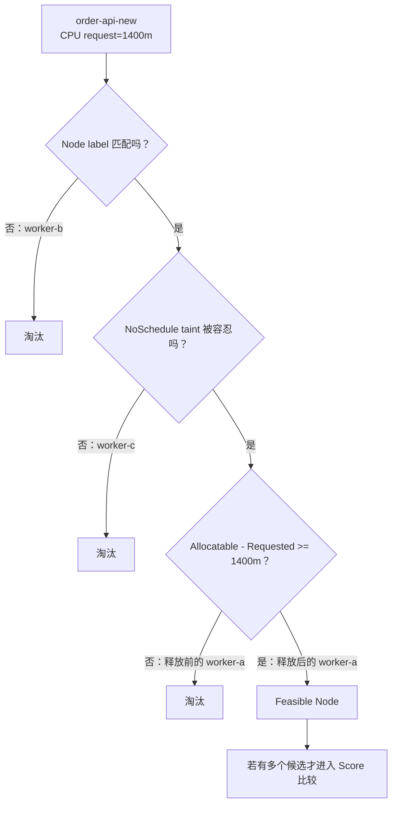

# Kubernetes Scheduler 全景：从一个 Pending Pod 到业务平台、GPU 与源码

> 新手独立篇：写给会维护 Kubernetes、但第一次系统学习 scheduler 和 Go 源码的运维工程师

这篇讲义不要求你先读本目录的第 01 篇，也不要求你已经掌握 Go。你只需要知道 Pod、Node、Deployment、request、taint 这些日常运维概念。

本文只抓住一条中心因果链：

> 一个尚未绑定 Node 的 Pod，怎样进入 kube-scheduler，经过排队、硬条件筛选、软偏好打分、内存预占和绑定，最终把选中的 Node 持久化到 `Pod.spec.nodeName`；如果没有可行 Node，它又怎样等待真正可能改变结果的事实。普通业务 Pod 与 GPU Pod 共用这条主线，但 GPU 还多出设备发现、节点内设备分配、拓扑、共享、队列和成本等账本。

---

## 0. 先说学习结果：读完后你应该能做什么

第一遍读完，你应该能做到：

1. 看到 `Pending` 时，先判断问题是否真的还在 scheduler 责任域。
2. 不看源码也能手算一个 Pod 为什么被某些 Node 过滤掉。
3. 用大白话解释 `PreFilter -> Filter -> Score -> Assume -> Reserve -> Permit -> Bind`。
4. 说清楚 `NODE=<none>`、`SuggestedHost`、`nominatedNodeName` 和 `spec.nodeName` 的区别。
5. 解释为什么 CPU 使用率很低，仍可能出现 `Insufficient cpu`。
6. 解释为什么 priority 很高，也不能绕过硬约束。
7. 解释为什么 scheduler 选了 GPU Node，却不知道容器最后拿到哪个 GPU UUID。
8. 区分 kube-scheduler、Device Plugin、kubelet DeviceManager、Kueue 和 Volcano 的职责。

第二遍再追这些实现细节：

- informer cache 与 scheduler cache 的时间差；
- `activeQ`、`backoffQ`、`unschedulablePods` 和 in-flight 事件补偿；
- QueueingHint、并行 Filter、候选 Node 早停；
- Reserve/Unreserve、Permit Wait、Bind 失败补偿；
- 抢占候选、PDB best effort 和异步驱逐；
- 多 profile、extender、DRA、PodGroup 与当前源码中的实验性分支。

如果你第一遍只想抓主线，按这个顺序读：

```text
第 2 节：scheduler 到底管什么
  -> 第 3 节：手算生产案例
  -> 第 4 节：对象和状态所有者
  -> 第 5 节：为什么这样设计
  -> 第 6 节：Framework 流水线
  -> 第 7 节：源码调用链
  -> 第 8 节：request 账本
  -> 第 11 节：选中 Node 后怎样绑定
  -> 第 12 节：失败为什么不会空转
  -> 第 15 节：GPU 迁移
  -> 第 19 节：值班排障树
```

---

## 1. 当前源码基线、事实边界与阅读约定

### 1.1 固定版本

| 项目 | 本文使用的事实 |
|---|---|
| 本地源码目录 | `D:\datou\devops\kubernetes-master\kubernetes` |
| 完整 commit | `301946d15e67a4a2e8a5fb8292eb836acd366d78` |
| `git describe` | `v1.37.0-alpha.0-280-g301946d15e6` |
| commit 日期 | `2026-04-24T23:06:46+05:30` |
| 验证强度 | 当前 checkout 静态阅读、调用关系核对、定向机械检查；第 1.4 节如实记录已执行与未执行项 |

这份 checkout 是上游开发快照，不是某个生产发行版。它已经包含一些较新的分支，例如：

- `GangScheduling` / PodGroup；
- `GenericWorkload`；
- `OpportunisticBatching`；
- `NominatedNodeNameForExpectation`；
- DRA 及 extended resource 到 DRA 的委托路径；
- Topology-aware workload scheduling 的实验性代码。

所以本文分成两层：

- **稳定主线**：单 Pod 的排队、Filter、Score、Assume、Bind、失败重试。这是生产排障必须掌握的骨架。
- **当前快照增强**：受 feature gate、API 版本和发行版影响的功能。它们会单独标出，不能直接套到你的集群。

生产排障时，第一件事不是相信本文行号，而是先确认目标集群的 Kubernetes 版本、kube-scheduler 配置和 feature gates，再切到对应 tag 重新核对。

### 1.2 三类表述不要混

| 标签 | 含义 |
|---|---|
| **源码事实** | 能在上述固定 commit 的文件、函数和控制流中直接验证 |
| **官方语义** | 由 Kubernetes、NVIDIA、Kueue 或 Volcano 官方文档定义 |
| **教学模型** | 为了让新手快速建立因果关系所做的简化；它不能替代版本核验 |

### 1.3 源码阅读约定

本文 Go 代码块中的中文 `//` 注释是讲义新增，不是上游原注释。

- 标成“完整函数”的代码保留该函数全部业务分支，只增加中文解释。
- 标成“连续摘录”的代码来自同一连续区间；区间外内容会在代码块前交代。
- 标成“非连续检查点”的代码不能复制后独立编译，只用于对照控制流。
- 教学伪代码一律使用 `text`，不伪装成真实 Go。
- 每段真实源码后都按“输入、判断、动作、结果”收束，并只补当前真正需要的 Go 语法。

### 1.4 本文这次真正执行了哪些验证

截至本次落盘，实际完成的是：

```text
通过：固定 commit 的静态源码逐函数核对
通过：核心调度、GPU/DRA、平台运维三路独立只读审校并回修
通过：validate_lesson.py --self-test
通过：validate_lesson.py --require-java --require-gpu --strict
结果：errors=0，warnings=0

未执行：Kubernetes Go 单元测试
原因：本机 go version 为 1.19.4，而当前 go.work 要求 go 1.26.0；
      Go 1.19 在读取 go.work 时即因版本格式和 godebug 指令退出，测试尚未开始编译。

未执行：真实集群 apply、抢占、GPU 或 DRA 实验
原因：本文编写过程没有获得一套明确隔离的测试集群与设备环境。
```

因此，“讲义覆盖并通过静态审校”不等于“读者已完成实验”，也不等于当前开发快照已在本机通过全部测试。第 22 节是实验设计与验收思路，必须在隔离环境另行执行并保存证据。

---

## 2. 先用一句人话说清楚：scheduler 到底干什么

最短答案：

> kube-scheduler 给“还没有 Node 的 Pod”挑一台 Node，并通过 Binding 把结果持久化为 `Pod.spec.nodeName`。

这里有四个关键词。

### 2.1 “还没有 Node”

对普通 kube-scheduler 管理的 Pod，最直观的入口条件是：

```text
Pod.spec.nodeName == ""
Pod.spec.schedulerName 能匹配当前 scheduler 的某个 profile
```

如果用户或其他组件直接设置了 `spec.nodeName`，这个 Pod 已经被视为“已分配”，会绕过普通选点流程。静态 Pod 也不走这条普通调度主线。

### 2.2 “挑一台”

scheduler 不是找“宇宙中绝对最优”的 Node。它做的是：

1. 先排除绝对不能放的 Node；
2. 再给剩下的 Node 打分；
3. 在本轮评估集合里选择得分最高的候选；
4. 大集群还可能在找到足够数量的可行 Node 后提前停止继续扫描。

因此，“被选中”表示它通过了当前规则并在本轮候选里胜出，不表示它永远是全局最优，也不表示运行后性能一定最好。

### 2.3 “持久化”

在 Filter/Score 结束时，源码里先得到的是 `SuggestedHost`。它只是 scheduler 进程内的建议结果。

真正完成跨组件交接的是 Binding：API Server 接受绑定请求后，Pod 的 `spec.nodeName` 才成为其他组件可观察的持久事实。随后目标 Node 上的 kubelet通过 watch 看到这个 Pod，进入节点本地准入、挂卷、Sandbox、拉镜像、创建容器等流程。

### 2.4 “只负责选 Node”

scheduler 不负责：

- 拉镜像；
- 创建 Pod Sandbox；
- 调 CNI 配网络；
- 调 CSI 挂载卷的节点侧动作；
- 启动 Java 进程；
- 执行 readiness/liveness probe；
- 给 GPU Pod 选择具体 GPU UUID；
- 把 `/dev/nvidia*`、CDI device、驱动库注入容器；
- 保证应用真正达到延迟或吞吐 SLO。

这张图从左往右读。实线是本轮主动作，虚线是 watch/informer 驱动的异步传播；方框是组件或动作，箭头文字是交接事实。


注意：图里的“对象变化通知”不是 `kubectl get events` 看到的 Kubernetes Event 对象。前者是 informer/watch 接收的对象变化；后者是组件额外写入 API 的可观察记录。

### 2.5 四个名字最容易混

| 名字 | 在哪里 | 大白话 | 是否已经正式绑定 |
|---|---|---|---|
| `NODE=<none>` | `kubectl get pod` 的展示 | API 中还看不到 `spec.nodeName` | 否 |
| `SuggestedHost` | scheduler 本轮内存结果 | Filter/Score 选出的建议 Node | 否 |
| `status.nominatedNodeName` | Pod status | 抢占等流程认为“未来很可能去这里” | 否 |
| `spec.nodeName` | Pod spec | 已经持久化的节点交接结果 | 是 |

`nominatedNodeName` 不是预绑定，也不是资源锁。被提名的 Pod 下一轮仍要重新通过 Filter。

---

## 3. 先不敲命令：手算一次 Java 生产发布

这是教学整理后的生产型案例，不是某个真实公司的原始事故记录。数字会贯穿整篇，不会在中途偷偷换题。

### 3.1 业务背景

- namespace：`prod`
- Deployment：`order-api`
- 应用：Spring Boot；启动阶段有类加载、JIT 和缓存预热，readiness 通过后才接流量
- 滚动策略：`maxSurge: 1`、`maxUnavailable: 0`
- 当前已有 4 个旧 Pod；发布新版本时多创建第 5 个 surge Pod
- 新 Pod 包含业务容器和 service-mesh sidecar
- 最终保存到 API Server 的 request：

| 容器 | CPU request | memory request |
|---|---:|---:|
| `order-api` | `1200m` | `1536Mi` |
| `mesh-proxy` | `200m` | `256Mi` |
| **整个 Pod 常驻阶段合计** | **`1400m`** | **`1792Mi`** |

这里故意使用 request，而不是 Java 进程此刻的 CPU 使用率。scheduler 做的是容量承诺：只要 Pod 还被视为占用该 Node，这份 request 就在账上。readiness 为 False 也不会自动把 request 从 scheduler 账本里减掉。

Pod 的相关约束可以简化成：

```yaml
apiVersion: v1
kind: Pod
metadata:
  name: order-api-new-7f8d9
  namespace: prod
  labels:
    app: order-api
spec:
  schedulerName: default-scheduler
  nodeSelector:
    workload-tier: online
  containers:
    - name: order-api
      image: registry.example.invalid/order-api:v2
      resources:
        requests:
          cpu: 1200m
          memory: 1536Mi
    - name: mesh-proxy
      image: registry.example.invalid/mesh-proxy:v1
      resources:
        requests:
          cpu: 200m
          memory: 256Mi
```

镜像地址是教学占位值，不需要执行。

### 3.2 三台 Node 的当前调度账

只列与本案有关的事实：

| Node | `workload-tier` | taint | CPU Allocatable | 已计入 Requested | CPU 余额 | 对本 Pod 的结论 |
|---|---|---|---:|---:|---:|---|
| `worker-a` | `online` | 无 | `4000m` | `3200m` | `800m` | 资源不足 |
| `worker-b` | `batch` | 无 | `8000m` | `5000m` | `3000m` | label 不匹配 |
| `worker-c` | `online` | `dedicated=gpu:NoSchedule` | `8000m` | `5500m` | `2500m` | Pod 没有对应 toleration |

把本 Pod 的 `1400m` 代进去：

```text
worker-a: 1400m > 4000m - 3200m = 800m     -> NodeResourcesFit 拒绝
worker-b: CPU 足够，但 workload-tier != online -> NodeAffinity 拒绝
worker-c: CPU 足够、label 匹配，但不容忍 NoSchedule taint -> TaintToleration 拒绝
```

结果是 0 个可行 Node。正确动作不是“挑一个差不多的”，而是保持 Pod 未绑定并记录失败原因。

### 3.3 先预测，再往下读

请先自己回答：

1. `worker-b` CPU 很富余，scheduler 能不能忽略 nodeSelector？
2. `worker-c` 资源足够，scheduler 能不能因为发布着急就绕过 taint？
3. `worker-a` 此刻 `kubectl top node` 只显示 15% CPU，能不能据此判定它放得下？
4. 把 Pod priority 调到最高，能不能解决 label 或 taint 不匹配？
5. 失败一次后，scheduler 应不应该每毫秒重试一次？

答案全部是否定的。

### 3.4 唯一改变题目的事实

一分钟后，`worker-a` 上一个无关的批处理 Pod 完成并被删除，它原来占 `1000m` request。

```text
删除前：worker-a Requested = 3200m，余额 = 800m
删除后：worker-a Requested = 2200m，余额 = 1800m
本 Pod：request = 1400m
结论：1400m <= 1800m，资源条件现在通过
```

因为 `worker-a` 的 label 匹配且没有拒绝本 Pod 的 taint，它成为唯一可行 Node。当前源码在 `len(feasibleNodes) == 1` 时直接使用这个 Node，不需要再运行 Score 来比较多个候选。

### 3.5 过滤矩阵图

这张图从上往下读。菱形是必须回答“是/否”的硬条件；任何一项失败都会淘汰当前 Node。Score 只会接收全部硬条件都通过的 Node。



### 3.6 这个现场真正暴露的不是“scheduler 坏了”

它暴露的是发布容量与平台策略共同作用：

- `maxSurge: 1` 允许临时多出一个 Pod，但不凭空创造 Node 容量；
- `maxUnavailable: 0` 保护业务可用性，也使平台更需要预留发布余量；
- nodeSelector 把在线业务限制到特定节点池；
- GPU 节点 taint 防止普通业务误占昂贵资源；
- request 决定 scheduler 的容量承诺；
- readiness 决定业务能否接流量，但不替代 scheduler request 账。

正确的平台问题不是“怎么让 scheduler 强行选一台”，而是：发布冗余、节点池规模、request 基线和隔离策略是不是一起设计过。

---

## 4. 一张全景图：Pod 从创建到应用运行

这张图按时序从上往下读。实线是函数调用或 API 动作；虚线是异步对象传播。左侧是控制面，右侧是目标节点。

```mermaid
sequenceDiagram
    participant C as Deployment/用户
    participant A as API Server
    participant I as Informer/Cache
    participant Q as SchedulingQueue
    participant S as ScheduleOne
    participant F as Framework plugins
    participant B as Binding API
    participant K as kubelet
    participant D as DeviceManager/Runtime

    C->>A: 创建最终 Pod，spec.nodeName 为空
    A-->>I: watch 到 Pod 对象变化
    I->>Q: 未绑定且 schedulerName 匹配，尝试入队
    Q->>S: Pop 一个待调度㝼��$z{-���jםFW'6�j��K����.x+�y�B7FGW2yK�K�~yI����"�F�v��6�2���FUF�7FGW6�V�66�VGV�&�U�Vv��6�ZK�J^��.x+�K��h�.{��h�.K�nh�j~k~h����2�f�DW'&�&�K��X������FRZh.K�^[�.h��>[�nZK�JR���B��7Df��FW"�FVfV�E&VV�F�����7Df��FW&�j�>[��ZK�J^Y�i��Y
nZَYʎh�.X�iˮKɢ���R���F�U66�VGVƖ�tf��W&V�WfV�N86��F�F���8��֖�F���K��x�h�.h�j~X�n[����b�66�VGVƖ�rVWVRFEV�66�VGV�&�T�d��E&W6V�F��BX�7F�fR�&6��fb�V�66�VGV�&�RY:�K�����X�r���r�h�.K�bWfV�G5F�&Vv�7FW&�VWVV��t���B�K�K��X��X�nX�[�~YJN�i.��R�B������ZK�J^�;�i{n���{��j��K��7FGW2j~K�����ɦ6�FV8&V6��68f��VE�Vv��8.K�ފhX��Yʎiz^[�~�x�i	�{J.Z�~z�nK�.8 ��222#B�2z��K�����ɮX�����K�K��h�.K�ny�Nh�iȒW�FV�6������@��[������[���ɠ�����FU&W6�W&6W4f�F�ɮi��KN��iz^[��&WVW7B����6F&�^�ɰ�"���FTff��G��ɮh�����6V�V7F�"�FW&�2X��h���nY�X�Nij��ɰ�2�F��EF��W&F����ɮY�i{n�x.Z��f��FW"K��66�&^�ɰ�B�f��V�T&��F��v�ɮZ�nK�7�6�U7FF^8&W6W'fR�&T&��BK��ZIn�:�Z����ɰ�R�FVfV�E&VV�F����ɮZ�nK��7Df��FW.8j�h����FT��f�Y(�X	���h�.[���ɰ�b�G��֖5&W6�W&6W6�ɮi�Y�Xh�Z�n���Y�K��Z���8[�.j�^X�n�X�Y(�x��h
~x�nh�;�i�NZH�i�.8 ��Z��j��K��h�.K�nZ�Xi�Y�K�[�X��ɠ��FW�@�h�.K�nY��ɠ�k:�Xh�YʎY:�K��W�FV�6������N�ɠ�&Tf��FW"Xi�K�nK�K��7�6�U7FF^�ɠ�f��FW"X�����Y:�K��Z����ɠ�h�X��i{n��NY��K�K���ɠ�ZK�J^i{b6�FR�&V6���f��VE�Vv���ɠ�y�Y
�K�K��6�W7FW$WfV�N�ɠ�VWVV��t���BK��K�K����NK��K��K�niȞyJ��ɠ�&W6W'fRY�h�jrV�&W6W'f^�ɠ�iȞY:�K��fVGW&RvFR�6��f�r&w>�ɠ�Z��[�NY:�i�yI�K�~iX^����ɠ���222#B�Bikh�����v�X���^K�>K�����k9^x+����v����k9R�jh.[�R�Yʂ66�VGV�W"K��K��K�K��[�^��hx"�Z����{�Ny�N{�j�B�������������������FW&f6R�g&�Wv�&��	���~h�^X�>�>yJ�K��Y�h�.K�b�Y�K�h��[^x+�y�Nj~Xxnh�.j{����7G'V7BK��h�~�(���D��f�8��FT��f�87�6�U7FF^87FGW2�;�K�^{�>i�NK�>K��	"�Z���[��xZr�x�nh���K�2���6Ɩ6R�����.x+�X�~��8X�ni[8�XNk�Y�8���ijޙ�nY��k�^X�^K��{J.[�R���FVfW&�K�ފ�F��V8�WG&�7>8k�^ynYʎX{�i[�X{�i{nh�~���f���ǒ�iKn[�*�Z����v�&�WF��R�6���V��f��FW"[�n��8[�.j�R&��F��~8W&֗Bz؞[�R�[�nX�v�&�W"K��kh�h�X���2���6��FW�B�6��FW�F�X�nkh�8G&6^8�h^i{nk+��>yJ��;�K�i*��K�j���~k.y�NyI�Y�Y�i��K�Nx�����W'&�&K���g&�Wv�&��7FGW6�XˮX�bv�Xh^�:��I����Y(΋>[�n���K��x�nh�[�.[��g2X���z>�x�K��X�{�>i�����k�z�x�yȾ�xv�&�WF��Ri{nY��Z鮙z�Y��X�^�ɠ��FW�@��Y
�X��Z�>���z؞[�^Z�>���ZK�J^h�j~Y��K����Z�>���Xi�y�NZ���i��Y
nK��iȞiX������K�Zh"66�VGV�T��U�Fy�N�>[�b7�6�RY�j�^h�~����Έ�&��F��r7�6�RX��[�.j�^������ɾ���[i��K��K�K��66�R77V�R[�^��XX�X�yI����K��K�K��{�Z�ZK�J^����hi��[��Y��k��Y(�YJN�i.X[nK�b�N8 ��222#B�Rij�x+�K��iz^[�~�x.Z��x+���i��Y��>��^[�����KɎXX�Yʎ���K��K��{��h�>ij�x+�h�nX�K�Ni{n8X�~h�~iz^[�~�ɠ��FW�@�66�VGV�T��R��yȲ�X{�y�B�D��f��GFV�G0�66�VGV�U�B��yȲfV6�&�T��FW2i[�x�f��D��FW5F�E74f��FW'2��yȾj����.x+�ZK�J^h�.K�nY(�7FGW0�&��&�F��T��FW2��yȾYNh�.K�b��FU66�&TƗ7BK��h�X�`�77V�T�E&W6W'fR��yȲ66�R77V�RX��Y�&WVW7FV@�&��F��t7�6�R��yȲW&֗B�&T&��B�&��B7FGW0���F�T&��F��t7�6�TW'&�"��yȲV�&W6W'fR�f�&vWB�YJN�i ���F�U66�VGVƖ�tf��W&R��yȲ�FW7B�BT�BK��x�h�.y��jp���K�ފhYʎyI�K�~K�΋��X�nK�Ni{niK�iz^[�~8.hꎈ�i��Y����B���nh�kX���^8�z�Z�K��i�N[��h�nx�iȞ{�>i�NX�niz^[�~���[�nh�~X�nZ���i[h��y�NiX�hI�h
~8 ��222#B�bk�z��Ί�y�Ni�[�kX���^{�NY���k�zZ�nK�K��i��X�����X{�i[Y�8.j��K��{�>�뮈{>[	h��K�zx�X��ZH�i�^��h���ɠ��FW�@��ٞh�ɮX{�i[���{��K�>z8h�^X�>ZY{�n8�X�{����NX��X�^kX��ɮh�.K�n��>XZR��7FGW2�66�&R�VWVV��t���@���nh��ɮy��Z���Z�����66�VGV�W"��&��F��r�WfV�@�yI�K�~X������ɮZ����h�~jr�iz^[�~i{n�{N{����X��K��[���>Y�NkX���^[�Zx����K�Zh.�ɠ���vW'6�V���v�FW7B���r�66�VGV�W"�g&�Wv�&���Vv��2���FW&W6�W&6W2�'V�uFW7Df�Br�6�V�C��v�FW7B���r�66�VGV�W"�g&�Wv�&���Vv��2�FVfV�G&VV�F����'V�uFW7E�DVƖv�&�UF�&VV�D�F�W'2r�6�V�C��v�FW7B���r�66�VGV�W"�'V�uFW7B�66�VGVƖ�rr�6�V�C����kX���^Y�Kɮ���k�zX��X�n8.XX�yJ�v�FW7B�Ɨ7Fh�b&ru�gV�2FW7Bvj�Z��[�>X��h�K�N��Θ�XX�h��(	�k*iȞX˞�X�X�kX���^8�X{�h�X��(	ފ��[�>h�y��y�N��Ί��	���~8 ����Р�22#R�K��^yI�K�~�	�i�^X���222#R�h�X���;ࠦFW�@�iʮ{�Z��@���66�VGVƖ�uVWVP�����F��RyI�Y�Y�i����6�6��@���&Tf��FW ���[�n��f��FW"��.x+����K���ɤf�DW'&�"��7Df��FW.�ɳK���ɮy�N���ɾZI�K���ɥ66�&P���77V�R66�VGV�W"66�P���&W6W'fP���W&֗@���[�.j�R&��F��r7�6�P���v�D��W&֗B�&T&��B�&��B��7D&��@����K��7V2���FT��P����V&V�WB�54��FWf�6R�Vv���E$�'V�F��P���Z�Y��K��[�NyJ����222#R�"ZK�J^�;ࠦFW�@�h�.K�b7FGW0���F�v��6�2K��Zَ��.x+�ZK�J^K��h�.K�n��nY����f�DW'&�"h�nXh^�:�W'&� ���f��W&T��F�W"j�Z��i�ik�BK��T�@���WfV�B��E66�VGV�VB6��F�F�����7F�fU�&6��fe�V�66�VGV�&�U�G2�vFV@���iȞyJ�6�W7FW$WfV�B�VWVV��t���BYJN�i ���ikK����[�^���x�ik��Ί�XZ��:�z�i�K�`���222#R�2uR�;ࠦFW�@����ZH~h�.K�nX�x����ZHp����V&V�WBƗ7D�EvF6������FR66�G�����6F&�P���66�VGV�W"hȞh��[^�XNk�i[Ni[&WVW7B����FP���77V�RXX�X��J`���&��@����V&V�WB��X[~K�>���ZHr�@���FWf�6R�Vv�����6FP���'V�F��Rk:�XZP���5TD�[�NyJ���Ί����E$i��X�nK�i�i�NK�Z��y�N���ZH~Z;i���6����X�n�Xދz�[�N���K�ފhh��K�Ni���h��;�k{~yJ�8 ��222#R�BX�K��zhj�.k{~kx`���W6vRK��z؞K��&WVW7N�ɰ�"�66�G�K��z؞K�����6F&�^�ɰ�2����6F&�Rh�Y(�K��z؞K��X�^��.x+�X�����ɰ�B�F��W&F���K��z؞K��[�^��X뾊�^��.x+��ɰ�R�&VfW'&VBK��z؞K��K�ފ��ɰ�b���֖�FVD��FT��RK��z؞K����FT��^�ɰ�r�77V�RK��z؞K���[{.{�Z��ɰ���v�&���BF֗GFVBK��z؞K��j��K���B[{.�>[�n�ɰ���66�VGV�W"����FRK��z؞K��uR[{.X�n�X�85TD[{.h�X���ɰ�����z��ZَkK�K��z؞K��K��X�X���>[�nZ래x�X^[�~8 ��222#R�RK��iX^x�YˮK�>�zࠦFW�@�����i��Y:�K���BT�N���K�^i{nX��[�����"�7V2���FT��Ri��Y
n[{.{��iȞX����2�7V2�66�VGV�W$��R��I��J>���i��Y
niȒvFR�K��[.XxnXZ^���B��E66�VGV�VB6��F�F���K��WfV�By�Ni{n�{N{��i��K�K�����R�ZK�J^h�.K�nZ��[�NY:�K��z�{�ni����nY����b�&WVW7B����6F&�R�&WVW7FVBK��Z�RW6vRYNi��ZI�[	���i��Y
nk{~�Jn���r�Y:�K��K��Z��X��X�nh�ވ;ފ�{�>i��iK�X�����VWVV��t���Bi��Y
n[�N[�>YJN�i.�������Р�22#b��z�kX��)�K��z�Nj��ɮ�;ފ�.k�^Y�i�����h��z�~y��j�>yn�z0��222#b��z�)����K��K�K��66�VGV�W"K��y�Nh�^yȲ�V&V7F�F�Xk>Z鮈;�Y
niK��N���"�K��K�K��iȞZI�K��X���Έ�.x+�h�ޙ��h66�&^���2�K�K����.x+�f��FW"��NY��V�66�VGV�&�RK���NY��W'&�.���Z��i[N���>[�niȞK�K��K��Y����B�K��K�K��77V�R�hYʂ&��BX�����R�&W6W'fRK��77V�Ry�Nx�nhh�iȞ�^X�nX��i������b�W&֗B��NY��v�BY�����Bi��Y
n[{.{��{�Z����r�K��K�K����֖�FVD��FT��VK�ވ;�[�>K��i�{����x+�����K��K�K��h�.X�K�ވ;ފz>Xk>(	�K��K�^��.x+�i�ZI��u^8�B��~k"u^(	�����F��W&F���K��K�K��K�ވ;�K�ފ�uR�BX�uR��.x+�����FWf�6R�Vv���z�[�NK�ދ��h��X[~K�2uRUT�N����K��K�K�������Bf��FW"Kɮj8i�Ru^��ΈΛ����B66�&Riʮ[�^hȒuRX��Kٞ�x�h�.[�����"�ԔrY(�F��R�6Ɩ6��r�;ފꞋXNk�i[�x�yȾ�[~i�^i�NZI����Z�>K��y�N��Nzk����K��K��K�K��K��Y����2��VWVRv�&���B[{"F֗GFVN���K��K�K���BK��X���;�V�F��~���B�66�VGV�W%�V�F��u��G7�VWVS�&vFVB'�������[�N��^XX�i�^K�K�����R�K��K�K��WfV�Bih~i��K�ޘ.Y�K��K��YJ�K�z�>Z鮈z�X��X�nh�^X�>���b�{�Z�ZK�J^Y�K��K�K���hf�&vWB77V�VB�N��΋���hYJN�i.X��y�B�N���r���n{�Nh�X[X��B[�u^���K��K�K��B�uR�BK��X���;�iK�K��K�������K��K�K�����K��&WVW7BX���;�h���>[�n�z�)�X��h�����hK��iX^�����&�f��Ry�BFFVDff��G�K��K�K��i��[�>X�k+�yn�8����#�K�i�i�^k�K���7FW"y�N{�>�����h�j~Z�XZ�yJ�K��iz~yI�K�~x��i�����222#b�"z�Nj����66�VGV�W"�I��J>hȞ�XNk�h�����X�z�Z�h
~XxnXZ^���W6vRi��y��i{nK�Nk:.X��y�N�x.kX��ɾK�Έ^i��K��Y΋Jni��8 �"�X��iȞK�K��X���Έ�.x+�i{nh�.Y�k*iȞ��h��K�~X��ɾZI�K����.x+�h�ޙ��hj�N��>���X�Z[�8 �2�V�66�VGV�&�R�	�[��X��h�.��N��^��.x+�[�nyY�K��X���z>�x����ij��ɾXh^�:�W'&�"X��K��j�.i[N���[�nhȒ66�VGV�W"W'&�"�xފ�^8 �B�[�.j�R&��BiȞ[�n������77V�RXX�Yʂ66�RX��Jn��Ι�.j�.[�nX��>[�nY�i��Z��Y�K�Kٞ�)ޘx�ZH�h�����8 �R�77V�R[�K��66�VGV�W"�	�yJ�66�^�ɵ&W6W'fR[�K��YBg&�Wv�&�h�.K�ny�N�(nY��x�nh8 �b�k*iȞ8.Z�>X��i��Yʎ��x+�Y(Κ(NyY�Y�z؞[�^iK�����&��B[	�iʮZ��h�8 �r�Z�>i��h�.X��i��iɾ��x+�h�zK����X�~Z�>�^8��.x+�Y(�{�ni���;�X���;�{�~{��X��X�n�ɾi�{��yȲ7V2���FT��V8 ���X���NX[nK�b�BK��K�ވ;ފ�X�^��.x+�x��yb�����h��x�K���X��h����[�K��V�&W6��f&�Ry�N[�.x�n�z�)�8 ���F��W&F���X��X�nkh�i�i�F��By�Nh�.{���ɾ�����ff��G��6V�V7F�"h�n�XNk�&WVW7BX[YΙ�Z�y��j~k8 ��y��j~��.x+�y�B�V&V�WBFWf�6T��vW"K����ZH~h�.K�nX��K�Θ�h��[�b���6F^�ɷ66�VGV�W"K�{���z�[�NX������F^8 ��h��[^�XNk����XZR��FU&W6�W&6W4f�By�Nz�Kٞ�)�X�Nij����K�n[�>X�ޛ����B66�&��r&W6�W&6W2K���hi��5R��V��'��ɴuR��NX�n��i��[������h�nX[nK�nh�.K�nh�K�8 �"�Ԕri��z�K�nX�nXˮ�ɷF��R�6Ɩ6��ri��i{n�{NX[K������K�ޚ)����i��ZَY(�h
~�;ޙ�Nzk�h�����K��Y�8 �2�F֗76���i��{�N{�~�Xޚ)�[.��Έ�.x+�[.K��X�~z(�x�~8�&V�8F��N8X�~8X^[�~z؞{�ni��8 �B�XX�i�R66�VGVƖ�tvFW>8&TV�VWVR�XxnXZ^h�~X�nY��Y(�K��["v�&���Bx�nh���K�ފhXX�h����F^8 �R�WfV�BKɮ��Y�8��kX8��~i�����&V6����W76vR���X���;ޙ��x��i��iK�X���ɾ[�N{�>Y�{�>i�NX�b6��F�F���8Z���8h�~j~K��iz^[�~8 �b�f�&vWB�x�iK�I����y�Ni��Y�X��Jn�ɾX[nK�b�BX���;�j�>Y����z�B77V�VB�Jn�*�h�.{�����Y�j�N�����K��K�n��Z�>K�Θxފ�N8 �r�Y��[�X���;�X�niZ>YʎY��X���.x+����h�nK��5R�Xh^Zق�j~z��i�K�nK��YʎY�K�X�k��k>8 ���i�N[�&WVW7B��66�VGV�W"h�����i�NZI��N���y��Z��[;X�X���;ޘ
h�5RK��h�.8[�n���8���	Y(����8 ���Z�>{��&�f��RK��y�B�B���X�yJ�h�r���yȾK�ފxy�Nz�����K�.Y(����Z�i�>�
h�(	�i��i�����X˞�X�X�BV�F��~(	�y�N��h
~Y�Y�8 �#�XX�Y��Z�y��j~x��i�����h��Y�K�X{�i[��X�{���fVGW&RvF^��΋���Z��[�NkX���^h�nkX���^��n{�NZ���ɾh��K��X�Y�i�N��h��i{nj~��K��[�^��Ί����K�ވ;�y�Nh�^ZY~yJ�8 ����Р�22#r�Z�ik��XNii�8Y��Z�k�zXZ^X�>K��{�~{��Z�nK���[��222#r��V&W&�WFW2Z�ik�jh.[�^K��X�{�ࠢ��66�VGVƖ�rg&�Wv�&�҆�GG3����V&W&�WFW2���F�72�6��6WG2�66�VGVƖ�r�Wf�7F����66�VGVƖ�r�g&�Wv�&����66�VGV�W"6��f�wW&F���҆�GG3����V&W&�WFW2���F�72�&VfW&V�6R�66�VGVƖ�r�6��f�r���76�v��r�G2F���FW5҆�GG3����V&W&�WFW2���F�72�6��6WG2�66�VGVƖ�r�Wf�7F����76�v���B���FR����B&��&�G��B&VV�F���҆�GG3����V&W&�WFW2���F�72�6��6WG2�66�VGVƖ�r�Wf�7F�����B�&��&�G��&VV�F�������BF����w�7&VB6��7G&��G5҆�GG3����V&W&�WFW2���F�72�6��6WG2�66�VGVƖ�r�Wf�7F����F����w��7&VB�6��7G&��G2���FWf�6R�Vv��5҆�GG3����V&W&�WFW2���F�72�6��6WG2�W�FV�BַV&W&�WFW2�6��WFR�7F�&vR��WB�FWf�6R��Vv��2���G��֖2&W6�W&6R���6F���҆�GG3����V&W&�WFW2���F�72�6��6WG2�66�VGVƖ�r�Wf�7F����G��֖2�&W6�W&6R����6F������7F�&vR6�76W2�v�Df�$f�'7D6��7V�W%҆�GG3����V&W&�WFW2���F�72�6��6WG2�7F�&vR�7F�&vR�6�76W2򐠢222#r�"���X�~K��uRZ�ik��XNii������VWVR6��6WG5҆�GG3����VWVR�6�w2泇2���F�72�6��6WG2����VWVR6�W7FW%VWVU҆�GG3����VWVR�6�w2泇2���F�72�6��6WG2�6�W7FW%�VWVR����VWVRv�&���E҆�GG3����VWVR�6�w2泇2���F�72�6��6WG2�v�&���B����VWVRv�&���E&��&�G�6�75҆�GG3����VWVR�6�w2泇2���F�72�6��6WG2�v�&���E�&��&�G��6�72����VWVRF����w��v&R66�VGVƖ�u҆�GG3����VWVR�6�w2泇2���F�72�6��6WG2�F����w��v&U�66�VGVƖ�r���f��6��v�r�Vv��҆�GG3���f��6���6��F�72�66�VGV�W"��Vv��2�v�r���f��6��66�VGV�W"�fW'f�Wu҆�GG3���f��6���6��F�72�66�VGV�W"��fW'f�Wr����d�D�uR�W&F�%҆�GG3���F�72��f�F��6���FF6V�FW"�6��VB��F�fR�wR��W&F�"��FW7B���FW��F�����d�D�uR6�&��r�F��R�6Ɩ6��u҆�GG3���F�72��f�F��6���FF6V�FW"�6��VB��F�fR�wR��W&F�"��FW7B�wR�6�&��r�F�����d�D�Ԕr���V&W&�WFW5҆�GG3���F�72��f�F��6���FF6V�FW"�6��VB��F�fR��V&W&�WFW2��FW7B���FW��F���222#r�2i��ih~Y��Z�h�K�Ny�Nk�zXZ^X�0�����r�66�VGV�W"�66�VGV�U���R�v�҆�GG3���v�F�V"�6����V&W&�WFW2��V&W&�WFW2�&��"�3�CfCVScvF&S�Vf#�#�&V#�3f6C3cfCs���r�66�VGV�W"�66�VGV�U���R�v����r�66�VGV�W"�g&�Wv�&��'V�F��R�g&�Wv�&��v�҆�GG3���v�F�V"�6����V&W&�WFW2��V&W&�WFW2�&��"�3�CfCVScvF&S�Vf#�#�&V#�3f6C3cfCs���r�66�VGV�W"�g&�Wv�&��'V�F��R�g&�Wv�&��v����r�66�VGV�W"�&6�V�B�VWVR�66�VGVƖ�u�VWVR�v�҆�GG3���v�F�V"�6����V&W&�WFW2��V&W&�WFW2�&��"�3�CfCVScvF&S�Vf#�#�&V#�3f6C3cfCs���r�66�VGV�W"�&6�V�B�VWVR�66�VGVƖ�u�VWVR�v����r�66�VGV�W"�g&�Wv�&���Vv��2���FW&W6�W&6W2�f�B�v�҆�GG3���v�F�V"�6����V&W&�WFW2��V&W&�WFW2�&��"�3�CfCVScvF&S�Vf#�#�&V#�3f6C3cfCs���r�66�VGV�W"�g&�Wv�&���Vv��2���FW&W6�W&6W2�f�B�v����r�66�VGV�W"�g&�Wv�&���Vv��2�FVfV�G&VV�F����FVfV�E�&VV�F����v�҆�GG3���v�F�V"�6����V&W&�WFW2��V&W&�WFW2�&��"�3�CfCVScvF&S�Vf#�#�&V#�3f6C3cfCs���r�66�VGV�W"�g&�Wv�&���Vv��2�FVfV�G&VV�F����FVfV�E�&VV�F����v����r�66�VGV�W"�g&�Wv�&���Vv��2�G��֖7&W6�W&6W2�G��֖7&W6�W&6W2�v�҆�GG3���v�F�V"�6����V&W&�WFW2��V&W&�WFW2�&��"�3�CfCVScvF&S�Vf#�#�&V#�3f6C3cfCs���r�66�VGV�W"�g&�Wv�&���Vv��2�G��֖7&W6�W&6W2�G��֖7&W6�W&6W2�v����r��V&V�WB�6��FWf�6V��vW"���vW"�v�҆�GG3���v�F�V"�6����V&W&�WFW2��V&W&�WFW2�&��"�3�CfCVScvF&S�Vf#�#�&V#�3f6C3cfCs���r��V&V�WB�6��FWf�6V��vW"���vW"�v����r�66�VGV�W"��WG&�72��WG&�72�v�҆�GG3���v�F�V"�6����V&W&�WFW2��V&W&�WFW2�&��"�3�CfCVScvF&S�Vf#�#�&V#�3f6C3cfCs���r�66�VGV�W"��WG&�72��WG&�72�v򐠢222#r�Bhꎈ�{�~{��Z�nK���[��FW�@�z��K�����ɮh��z�~z��2��.j�K��yK�z��B��.XZ�i��Y��z��K�΋���ɮX�����66�VGV�U���R�v�h�X���;�z��K������ɮX�Z��K�X�Y����Έ;ފz>�x�j��K��7FGW0�z��Y������ɮ�����FU&W6�W&6W4f�BK����FTff��G��z��K�N����ɮh�^XZRuR���ZH~K�{���;����X�K�{��FWf�6R�Vv��Z���J`�z��XZދ���ɮZ�nK��VWV^8Ԕr�F��R�6Ɩ6��rK��Z래x�z(�x�p�z��K�>����ɮXhދ��XZRE$8h�.X�Y(Έz�Z�K��h�.K�`���i�Y�h��i[Nz�~X�h�K�X�^����ɠ����V&R�66�VGV�W"i��K�K��Y��K��{�>Zَ8h�.K�nX�n�xNX��Y(�K��x.�(NX�y�N��.x+�Xk>z�nh�~X�nY��8.Z�>h��K�K��[	�iʮ{�Z�y�B�BK��[�>X�ޙ�n{�NK��Z��X�z�{�ni��K�N��n���YʎX���Έ�.x+�K�ފ�z�~���X�Z[����xKnY�XX�YʎXh^Zَ�Jni��X�K��8Xhޘ	���r�h�K�^X�b��F^�ɾK��X�[�>X��I��J>h��hH�Y��X��h�X��k+�ynY�Y����uRK�{���;�I��J>h�����ZH~K��Z��K��h�^[�nYʎ��.x+�XYx���Ι��X�~{;�{���I��J>Xk>Z�i[N��[z^K��K�^i{nXZ^Yˮ8.h�.���y�NX[>�J�K��i���8�WfV�N��Έ�i��XX�h��x�nhh�iȞ�^���Xh�k+�K��Z��K�i*ޙ;Ί�Y:�i�΋Jn8Y:�K��{�ni��8Y:�K��i{n�{Nx+�X{�K�n�z�)�8 