# Kubernetes Scheduler 全景：从一个 Pending Pod 到业务平台、GPU 与源码

> 新手独立篇：写给会维护 Kubernetes、但第一次系统学习 scheduler 和 Go 源码的运维工程师

这篇讲义不要求你先读本目录的第 01 篇，也不要求你已经掌握 Go。你只需要知道 Pod、Node、Deployment、request、taint 这些日常运维概念。

本文只抓住一条中心因果链：

> 一个尚未绑定 Node 的 Pod，怎样进入 kube-scheduler，经过排队、硬条件筛选、软偏好打分、内存预占和绑定，最终把选中的 Node 持久化到 `Pod.spec.nodeName`；如果没有可行 Node，它又怎样等待真正可能改变结果的事实。普通业务 Pod 与 GPU Pod 共用这条主线，但 GPU 还多出设备发现、节点内设备分配、拓扑、共享、队列和成本等账本。

---

## 0. 先说学习结果：读完后你应该能做什么

第一遍读完，你应该能做到：

1. 看到 `Pending` 时，先判断问题是否真的还在 scheduler 责任域。
2. 不看源码也能手算一个 Pod 为什么被某些 Node 过滤掉。
3. 用大白话解释 `PreFilter -> Filter -> Score -> Assume -> Reserve -> Permit -> Bind`。
4. 说清楚 `NODE=<none>`、`SuggestedHost`、`nominatedNodeName` 和 `spec.nodeName` 的区别。
5. 解释为什么 CPU 使用率很低，仍可能出现 `Insufficient cpu`。
6. 解释为什么 priority 很高，也不能绕过硬约束。
7. 解释为什么 scheduler 选了 GPU Node，却不知道容器最后拿到哪个 GPU UUID。
8. 区分 kube-scheduler、Device Plugin、kubelet DeviceManager、Kueue 和 Volcano 的职责。

第二遍再追这些实现细节：

- informer cache 与 scheduler cache 的时间差；
- `activeQ`、`backoffQ`、`unschedulablePods` 和 in-flight 事件补偿；
- QueueingHint、并行 Filter、候选 Node 早停；
- Reserve/Unreserve、Permit Wait、Bind 失败补偿；
- 抢占候选、PDB best effort 和异步驱逐；
- 多 profile、extender、DRA、PodGroup 与当前源码中的实验性分支。

如果你第一遍只想抓主线，按这个顺序读：

```text
第 2 节：scheduler 到底管什么
  -> 第 3 节：手算生产案例
  -> 第 4 节：对象和状态所有者
  -> 第 5 节：为什么这样设计
  -> 第 6 节：Framework 流水线
  -> 第 7 节：源码调用链
  -> 第 8 节：request 账本
  -> 第 11 节：选中 Node 后怎样绑定
  -> 第 12 节：失败为什么不会空转
  -> 第 15 节：GPU 迁移
  -> 第 19 节：值班排障树
```

### 0.1 这次改成“案例卡”后，应该怎么读

后文不再要求你先把理论背完。每个主要知识小节都会尽量跟一张紧凑的“运维现场小案例”，固定回答六件事：

```text
现象：值班群里会怎样描述问题
先查：优先执行哪些与 scheduler 直接相关的命令
关键证据：输出里具体看哪个字段或数字
能证明：这份证据支持哪一个判断
不能证明：不要从这份证据越界推出什么
下一步：应该去哪个组件、对象或源码分支继续查
```

案例中的输出若没有明确写“本次真实执行”，都是**教学示例**。命令优先使用只读查询；凡是会创建 Pod、改 label/taint、驱逐或删除对象的操作，都只放在隔离实验段，并说明风险与清理方式。

如果你现在一看源码和机制就发懵，第一遍可以只读 `0.2`、`0.3`，然后在全文搜索标题 **“运维现场小案例”**。先顺着“现象 → 命令 → 证据 → 能证明/不能证明 → 下一步”把 128 张卡读完；遇到不懂的名词，再回到案例上方对应的小节补理论。第 24～27 节属于第二遍源码路线、速查与自测，不要求第一次连续通读。

### 0.2 值班开场：90 秒判断问题还在不在 scheduler

**运维现场小案例：** 发布平台报警 `prod/order-api-new-7f8d9` 一直 Pending。先不要重启 scheduler，也不要删 Pod。把名字换成现场值后执行：

```powershell
$Namespace = 'prod'
$PodName = 'order-api-new-7f8d9'

# 第一屏：对象身份、负责它的 scheduler、是否已经选定 Node、是否有 gate。
kubectl get pod -n $Namespace $PodName `
  -o custom-columns='NAME:.metadata.name,UID:.metadata.uid,PHASE:.status.phase,SCHEDULER:.spec.schedulerName,NODE:.spec.nodeName,GATES:.spec.schedulingGates[*].name'

# 第二屏：只看 PodScheduled Condition，不用从整份 describe 里猜。
kubectl get pod -n $Namespace $PodName `
  -o jsonpath='{range .status.conditions[?(@.type=="PodScheduled")]}status={.status}{" reason="}{.reason}{" message="}{.message}{" lastTransition="}{.lastTransitionTime}{"\n"}{end}'

# 第三屏：按这个 Pod 的 UID 查事件，避免同名重建对象混在一起。
$PodUid = kubectl get pod -n $Namespace $PodName -o jsonpath='{.metadata.uid}'
kubectl get events -n $Namespace `
  --field-selector "involvedObject.uid=$PodUid" `
  --sort-by='.metadata.creationTimestamp'
```

**怎样下第一结论：**

| 证据 | 先去哪里 | 此时不要误判什么 |
|---|---|---|
| Pod 不存在 | Deployment/Job 控制器、API admission、ResourceQuota、Kueue | 还不能怪 kube-scheduler，因为它可能从未收到 Pod |
| `NODE` 为空，存在 scheduling gate | 放置 gate 的控制器或上层准入 | gate 等待不是 NodeResourcesFit 资源不足 |
| `NODE` 为空，`PodScheduled=False` | scheduler 队列、Filter/PostFilter、profile | `FailedScheduling` 不等于 scheduler 进程崩溃 |
| `NODE` 已有值 | kubelet、CSI、CNI、Device Plugin/runtime、应用 | Pod phase 仍是 Pending 也不代表还卡在选 Node |

这三组命令能证明 API Server **当前保存的对象状态**，不能直接证明 scheduler 内存队列位置，也不能还原已经过期、被聚合或被限流的全部 Event 历史。后文会把这些边界逐项拆开。

### 0.3 全文反复使用的六个背景案例

下面都是根据常见生产问题整理的**教学复合案例**，不是某家公司的原始事故记录，也不是本次真实集群实验。后文会反复引用案例编号，不让你每读一节又重新认识一套对象。

| 编号 | 业务背景 | 初始矛盾 | 主要用来理解 |
|---|---|---|---|
| A：订单发布 | `prod/order-api`，4 个 Spring Boot 副本，`maxSurge=1`；单 Pod 常驻 request 为 `1400m CPU/1792Mi` | 老版本正常，新 surge Pod 因在线池只剩 `800m` 而 Pending | request、Filter、QueueingHint、发布容量 |
| B：支付抢占 | `prod/pay-api` 故障恢复副本，priority `100000`；目标池被低优先级报表 Pod 占满，受害者优雅退出 30 秒 | 高优先级 Pod 出现 nomination，但迟迟没有 `spec.nodeName` | PrioritySort、PostFilter、PDB、异步抢占 |
| C：账务存储 | `finance/ledger-close` 使用 `WaitForFirstConsumer` PVC，只允许进 `zone-a`，但可用 PV/CSI 容量主要在 `zone-b` | CPU 很充足，Pod 仍因卷拓扑无可行 Node | VolumeBinding、拓扑、绑定前后责任域 |
| D：A100 训练 | `ml/train-a100` 请求 `2 GPU/8 CPU/64Gi`，要求 A100 80GB；节点 `gpu-b` 从 4/8 张已占用开始 | 有节点 GPU 空闲，却还要同时满足型号、CPU、内存和卷 | GPU 标量、碎片、Assume、Device Plugin |
| E：团队队列 | 团队 `vision` 提交 8-Pod、每 Pod 1-GPU 的训练任务，进入 Kueue `vision-lq` | 有时 Workload 未 Admitted，另一次已 Admitted 但只有 6 个 Pod 可放 | Kueue 准入、Pod 调度、gang/Volcano 边界 |
| F：全局变慢 | 周一 10:00 多团队同时发布，`activeQ` 增长，自定义 Score 插件 p99 变慢，API Bind 也有抖动 | scheduler Pod Running，但业务等待 Node 的时间持续升高 | 队列、扩展点延迟、错误率和 SLO |

阅读案例卡时始终先问：“现在是哪一个对象、哪个 UID、哪个时刻、哪一层还没有完成？”同样写着 `Pending`，案例 A 可能卡在 Filter，案例 C 可能卡在卷协同，案例 E 可能连 Pod 都还没创建，案例 D 也可能已经绑定后才在设备兑现阶段失败。

---

## 1. 当前源码基线、事实边界与阅读约定

### 1.1 固定版本

| 项目 | 本文使用的事实 |
|---|---|
| 本地源码目录 | `D:\datou\devops\kubernetes-master\kubernetes` |
| 完整 commit | `301946d15e67a4a2e8a5fb8292eb836acd366d78` |
| `git describe` | `v1.37.0-alpha.0-280-g301946d15e6` |
| commit 日期 | `2026-04-24T23:06:46+05:30` |
| 验证强度 | 当前 checkout 静态阅读、调用关系核对、定向机械检查；第 1.4 节如实记录已执行与未执行项 |

这份 checkout 是上游开发快照，不是某个生产发行版。它已经包含一些较新的分支，例如：

- `GangScheduling` / PodGroup；
- `GenericWorkload`；
- `OpportunisticBatching`；
- `NominatedNodeNameForExpectation`；
- DRA 及 extended resource 到 DRA 的委托路径；
- Topology-aware workload scheduling 的实验性代码。

所以本文分成两层：

- **稳定主线**：单 Pod 的排队、Filter、Score、Assume、Bind、失败重试。这是生产排障必须掌握的骨架。
- **当前快照增强**：受 feature gate、API 版本和发行版影响的功能。它们会单独标出，不能直接套到你的集群。

生产排障时，第一件事不是相信本文行号，而是先确认目标集群的 Kubernetes 版本、kube-scheduler 配置和 feature gates，再切到对应 tag 重新核对。

### 1.2 三类表述不要混

| 标签 | 含义 |
|---|---|
| **源码事实** | 能在上述固定 commit 的文件、函数和控制流中直接验证 |
| **官方语义** | 由 Kubernetes、NVIDIA、Kueue 或 Volcano 官方文档定义 |
| **教学模型** | 为了让新手快速建立因果关系所做的简化；它不能替代版本核验 |

### 1.3 源码阅读约定

本文 Go 代码块中的中文 `//` 注释是讲义新增，不是上游原注释。

- 标成“完整函数”的代码保留该函数全部业务分支，只增加中文解释。
- 标成“连续摘录”的代码来自同一连续区间；区间外内容会在代码块前交代。
- 标成“非连续检查点”的代码不能复制后独立编译，只用于对照控制流。
- 教学伪代码一律使用 `text`，不伪装成真实 Go。
- 每段真实源码后都按“输入、判断、动作、结果”收束，并只补当前真正需要的 Go 语法。

### 1.4 本文这次真正执行了哪些验证

截至本次落盘，实际完成的是：

```text
通过：固定 commit 的静态源码逐函数核对
通过：核心调度、GPU/DRA、平台运维三路独立只读审校并回修
通过：validate_lesson.py --self-test
通过：validate_lesson.py --require-java --require-gpu --strict
结果：errors=0，warnings=0
通过：第 2～23 节逐小节案例覆盖检查；共 128 张案例卡，3.7 本身为命令案例
通过：65 个 PowerShell 代码块静态语法解析；parse failures=0

未执行：Kubernetes Go 单元测试
原因：本机 go version 为 1.19.4，而当前 go.work 要求 go 1.26.0；
      Go 1.19 在读取 go.work 时即因版本格式和 godebug 指令退出，测试尚未开始编译。

未执行：真实集群 apply、抢占、GPU 或 DRA 实验
原因：本文编写过程没有获得一套明确隔离的测试集群与设备环境。
```

因此，“讲义覆盖并通过静态审校”不等于“读者已完成实验”，也不等于当前开发快照已在本机通过全部测试。第 22 节是实验设计与验收思路，必须在隔离环境另行执行并保存证据。

---

## 2. 先用一句人话说清楚：scheduler 到底干什么

最短答案：

> kube-scheduler 给“还没有 Node 的 Pod”挑一台 Node，并通过 Binding 把结果持久化为 `Pod.spec.nodeName`。

这里有四个关键词。

### 2.1 “还没有 Node”

对普通 kube-scheduler 管理的 Pod，最直观的入口条件是：

```text
Pod.spec.nodeName == ""
Pod.spec.schedulerName 能匹配当前 scheduler 的某个 profile
```

如果用户或其他组件直接设置了 `spec.nodeName`，这个 Pod 已经被视为“已分配”，会绕过普通选点流程。静态 Pod 也不走这条普通调度主线。

#### 运维现场小案例：Pod Pending，却没有任何 FailedScheduling

**背景：** 案例 A 的一个测试副本把 `schedulerName` 误写成 `defaut-scheduler`。Node 很空，但两分钟内没有任何负责它的 scheduler。

```powershell
$Namespace = 'prod'; $PodName = 'order-api-typo'
kubectl get pod -n $Namespace $PodName `
  -o custom-columns='NAME:.metadata.name,SCHEDULER:.spec.schedulerName,NODE:.spec.nodeName,GATES:.spec.schedulingGates[*].name'

# 列出当前可从 API 看到的 scheduler Pod及其启动参数；托管集群可能不暴露控制面 Pod。
kubectl get pods -n kube-system -l component=kube-scheduler -o wide
```

示例第一行是 `SCHEDULER=defaut-scheduler`、`NODE=<none>`。这能证明 Pod 的责任路由名和当前尚未绑定；第二条若查不到控制面 Pod，**不能**反证云厂商没有 scheduler。下一步应核对真实 scheduler 配置/profile，而不是扩 Node。

### 2.2 “挑一台”

scheduler 不是找“宇宙中绝对最优”的 Node。它做的是：

1. 先排除绝对不能放的 Node；
2. 再给剩下的 Node 打分；
3. 在本轮评估集合里选择得分最高的候选；
4. 大集群还可能在找到足够数量的可行 Node 后提前停止继续扫描。

因此，“被选中”表示它通过了当前规则并在本轮候选里胜出，不表示它永远是全局最优，也不表示运行后性能一定最好。

#### 运维现场小案例：三台 Node，为什么不能“随便挑一台”

**背景：** 案例 A 中 `worker-a` CPU 不足，`worker-b` label 不匹配，`worker-c` 有未容忍污点。

```powershell
$Namespace = 'prod'; $PodName = 'order-api-new-7f8d9'
kubectl get pod -n $Namespace $PodName -o yaml
kubectl get nodes `
  -o custom-columns='NAME:.metadata.name,UNSCHEDULABLE:.spec.unschedulable,CPU:.status.allocatable.cpu,MEMORY:.status.allocatable.memory,POOL:.metadata.labels.workload-tier,TAINTS:.spec.taints[*].key'
kubectl describe pod -n $Namespace $PodName
```

Pod YAML 与 Node 列表让你手算约束交集；`describe` 末尾的 Event 提供 scheduler 某次诊断。它们不能证明 scheduler 扫描了全部 Node，也不能证明某个 Score 插件最终给了多少分。

### 2.3 “持久化”

在 Filter/Score 结束时，源码里先得到的是 `SuggestedHost`。它只是 scheduler 进程内的建议结果。

真正完成跨组件交接的是 Binding：API Server 接受绑定请求后，Pod 的 `spec.nodeName` 才成为其他组件可观察的持久事实。随后目标 Node 上的 kubelet通过 watch 看到这个 Pod，进入节点本地准入、挂卷、Sandbox、拉镜像、创建容器等流程。

#### 运维现场小案例：亲眼看见责任域切换

**背景：** 在隔离环境创建一个 request 很小、但镜像地址故意不存在的 Pod。它先完成调度，随后卡在拉镜像。

```powershell
$Namespace = 'scheduler-lab'; $PodName = 'bad-image-after-bind'
kubectl get pod -n $Namespace $PodName -w `
  -o custom-columns='CREATED:.metadata.creationTimestamp,PHASE:.status.phase,NODE:.spec.nodeName,REASON:.status.containerStatuses[0].state.waiting.reason'
```

看到 `NODE` 从空变成某节点，随后出现 `ErrImagePull/ImagePullBackOff`，能证明 API 中的节点交接已经完成而后续兑现失败。它不能证明 kubelet 为什么拉取失败；那要继续看目标节点 kubelet、镜像凭据和 registry 证据。

### 2.4 “只负责选 Node”

scheduler 不负责：

- 拉镜像；
- 创建 Pod Sandbox；
- 调 CNI 配网络；
- 调 CSI 挂载卷的节点侧动作；
- 启动 Java 进程；
- 执行 readiness/liveness probe；
- 给 GPU Pod 选择具体 GPU UUID；
- 把 `/dev/nvidia*`、CDI device、驱动库注入容器；
- 保证应用真正达到延迟或吞吐 SLO。

这张图从左往右读。实线是本轮主动作，虚线是 watch/informer 驱动的异步传播；方框是组件或动作，箭头文字是交接事实。

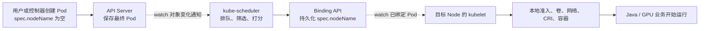

注意：图里的“对象变化通知”不是 `kubectl get events` 看到的 Kubernetes Event 对象。前者是 informer/watch 接收的对象变化；后者是组件额外写入 API 的可观察记录。

#### 运维现场小案例：业务把 `ContainerCreating` 也报成“调度失败”

**背景：** 案例 C 已经有 `spec.nodeName=worker-a`，但 Event 是 `FailedMount`。值班同学却先重启了 scheduler。

```powershell
$Namespace = 'finance'; $PodName = 'ledger-close-0'
kubectl get pod -n $Namespace $PodName `
  -o custom-columns='NAME:.metadata.name,PHASE:.status.phase,NODE:.spec.nodeName,SCHEDULED:.status.conditions[?(@.type=="PodScheduled")].status'
kubectl get events -n $Namespace `
  --field-selector "involvedObject.name=$PodName" `
  --sort-by='.metadata.creationTimestamp'
```

若 `NODE` 有值且 `SCHEDULED=True`，普通选点主线已经成功；`FailedMount` 应转向 kubelet/CSI。按名字查 Event 适合快速浏览，但同名重建时必须再加 UID 核对。

### 2.5 四个名字最容易混

| 名字 | 在哪里 | 大白话 | 是否已经正式绑定 |
|---|---|---|---|
| `NODE=<none>` | `kubectl get pod` 的展示 | API 中还看不到 `spec.nodeName` | 否 |
| `SuggestedHost` | scheduler 本轮内存结果 | Filter/Score 选出的建议 Node | 否 |
| `status.nominatedNodeName` | Pod status | 抢占等流程认为“未来很可能去这里” | 否 |
| `spec.nodeName` | Pod spec | 已经持久化的节点交接结果 | 是 |

`nominatedNodeName` 不是预绑定，也不是资源锁。被提名的 Pod 下一轮仍要重新通过 Filter。

#### 运维现场小案例：有 nomination，为什么还是不能宣告成功

**背景：** 案例 B 的 `pay-api-recovery` 已被提名到 `worker-a`，低优先级报表 Pod 仍在 30 秒优雅退出。

```powershell
$Namespace = 'prod'; $PodName = 'pay-api-recovery'
kubectl get pod -n $Namespace $PodName `
  -o jsonpath='uid={.metadata.uid}{" nominated="}{.status.nominatedNodeName}{" nodeName="}{.spec.nodeName}{" scheduled="}{range .status.conditions[?(@.type=="PodScheduled")]}{.status}{"/"}{.reason}{end}{"\n"}'
kubectl get pods -n $Namespace `
  -o custom-columns='NAME:.metadata.name,NODE:.spec.nodeName,DELETING:.metadata.deletionTimestamp,PRIORITY:.spec.priority' | Sort-Object
```

示例若是 `nominated=worker-a nodeName=`，只证明 scheduler 写了潜在落点；受害者是否真正退出、资源是否释放、下一轮全部 Filter 是否通过仍未确定。

---

## 3. 先不敲命令：手算一次 Java 生产发布

这是教学整理后的生产型案例，不是某个真实公司的原始事故记录。数字会贯穿整篇，不会在中途偷偷换题。

### 3.1 业务背景

- namespace：`prod`
- Deployment：`order-api`
- 应用：Spring Boot；启动阶段有类加载、JIT 和缓存预热，readiness 通过后才接流量
- 滚动策略：`maxSurge: 1`、`maxUnavailable: 0`
- 当前已有 4 个旧 Pod；发布新版本时多创建第 5 个 surge Pod
- 新 Pod 包含业务容器和 service-mesh sidecar
- 最终保存到 API Server 的 request：

| 容器 | CPU request | memory request |
|---|---:|---:|
| `order-api` | `1200m` | `1536Mi` |
| `mesh-proxy` | `200m` | `256Mi` |
| **整个 Pod 常驻阶段合计** | **`1400m`** | **`1792Mi`** |

这里故意使用 request，而不是 Java 进程此刻的 CPU 使用率。scheduler 做的是容量承诺：只要 Pod 还被视为占用该 Node，这份 request 就在账上。readiness 为 False 也不会自动把 request 从 scheduler 账本里减掉。

Pod 的相关约束可以简化成：

```yaml
apiVersion: v1
kind: Pod
metadata:
  name: order-api-new-7f8d9
  namespace: prod
  labels:
    app: order-api
spec:
  schedulerName: default-scheduler
  nodeSelector:
    workload-tier: online
  containers:
    - name: order-api
      image: registry.example.invalid/order-api:v2
      resources:
        requests:
          cpu: 1200m
          memory: 1536Mi
    - name: mesh-proxy
      image: registry.example.invalid/mesh-proxy:v1
      resources:
        requests:
          cpu: 200m
          memory: 256Mi
```

镜像地址是教学占位值，不需要执行。

#### 运维现场小案例：Helm 写的是 1000m，scheduler 为什么按 1400m 算

- **现象：** `order-api` 发布后 Pending，研发只拿业务容器的 request 解释容量，漏掉了 mesh sidecar。
- **只读命令：** `kubectl get pod -n prod order-api-new-7f8d9 -o jsonpath='{range .spec.containers[*]}{.name}{" cpu="}{.resources.requests.cpu}{" mem="}{.resources.requests.memory}{"\n"}{end}{"overhead="}{.spec.overhead}{"\n"}'`
- **关键输出（教学示意）：** `order-api cpu=1200m`、`mesh-proxy cpu=200m`，常驻容器 CPU 合计 `1400m`。
- **能证明：** API Server 最终保存的 Pod 合同包含哪些常驻容器及 request；这是 scheduler 实际读取的对象，而不是发布前的 values 文件。
- **不能证明：** 仅凭这条命令不能证明 Pod 已进入调度队列，也不能用 request 推出 Java 进程此刻真的用了多少 CPU。
- **源码映射：** `pkg/scheduler/framework/plugins/noderesources/fit.go` 的 `computePodResourceRequest`、`fitsRequest`。

### 3.2 三台 Node 的当前调度账

只列与本案有关的事实：

| Node | `workload-tier` | taint | CPU Allocatable | 已计入 Requested | CPU 余额 | 对本 Pod 的结论 |
|---|---|---|---:|---:|---:|---|
| `worker-a` | `online` | 无 | `4000m` | `3200m` | `800m` | 资源不足 |
| `worker-b` | `batch` | 无 | `8000m` | `5000m` | `3000m` | label 不匹配 |
| `worker-c` | `online` | `dedicated=gpu:NoSchedule` | `8000m` | `5500m` | `2500m` | Pod 没有对应 toleration |

把本 Pod 的 `1400m` 代进去：

```text
worker-a: 1400m > 4000m - 3200m = 800m     -> NodeResourcesFit 拒绝
worker-b: CPU 足够，但 workload-tier != online -> NodeAffinity 拒绝
worker-c: CPU 足够、label 匹配，但不容忍 NoSchedule taint -> TaintToleration 拒绝
```

结果是 0 个可行 Node。正确动作不是“挑一个差不多的”，而是保持 Pod 未绑定并记录失败原因。

#### 运维现场小案例：把三台 Node 的“余额、标签、污点”放到同一张证据桌上

- **现象：** 值班群说“集群总共还有 6 核”，但 `order-api` 仍是 Pending。
- **只读命令：** `kubectl get nodes worker-a worker-b worker-c -o custom-columns='NAME:.metadata.name,CPU:.status.allocatable.cpu,TIER:.metadata.labels.workload-tier,UNSCHED:.spec.unschedulable,TAINTS:.spec.taints'`; 再逐台执行 `kubectl describe node <node>` 看 `Allocated resources`。
- **关键输出（教学示意）：** `worker-a` 只余 `800m`；`worker-b` 是 `batch`；`worker-c` 有 `dedicated=gpu:NoSchedule`。
- **能证明：** Node API 的 allocatable、标签、污点，以及 `describe` 汇总的已绑定 Pod request，足以解释三个不同的硬拒绝方向。
- **不能证明：** `describe node` 看不到刚被 scheduler Assume、尚未 Bind 的瞬时占账，也不能证明三个拒绝原因按什么顺序执行。
- **源码映射：** `pkg/scheduler/framework/types.go` 的 `NodeInfo.Requested`，以及 `nodeaffinity`、`tainttoleration`、`noderesources` 三类 Filter 插件。

### 3.3 先预测，再往下读

请先自己回答：

1. `worker-b` CPU 很富余，scheduler 能不能忽略 nodeSelector？
2. `worker-c` 资源足够，scheduler 能不能因为发布着急就绕过 taint？
3. `worker-a` 此刻 `kubectl top node` 只显示 15% CPU，能不能据此判定它放得下？
4. 把 Pod priority 调到最高，能不能解决 label 或 taint 不匹配？
5. 失败一次后，scheduler 应不应该每毫秒重试一次？

答案全部是否定的。

#### 运维现场小案例：先写预测，再用 FailedScheduling 对答案

- **现象：** `order-api` 没有 `nodeName`，大家分别猜“CPU”“污点”“标签”，但没有人先保留原始证据。
- **只读命令：** `kubectl describe pod -n prod order-api-new-7f8d9`; `kubectl get events -n prod --field-selector involvedObject.name=order-api-new-7f8d9 --sort-by='.metadata.creationTimestamp'`
- **关键输出（教学示意）：** `0/3 nodes are available: 1 Insufficient cpu, 1 didn't match Pod's node affinity/selector, 1 had untolerated taint ...`。
- **能证明：** 本轮（或被聚合的若干轮）没有可行 Node，并给出 scheduler 对候选节点的拒绝摘要，可用来校正手算。
- **不能证明：** 原因计数不保证互斥，Event 还可能聚合、限流；它不能证明插件调用顺序，也不能证明实时 CPU 使用率。
- **源码映射：** `pkg/scheduler/schedule_one.go` 的 `schedulePod`、`findNodesThatFitPod`，以及 `framework.Diagnosis` 形成的 `FitError`。

### 3.4 唯一改变题目的事实

一分钟后，`worker-a` 上一个无关的批处理 Pod 完成并被删除，它原来占 `1000m` request。

```text
删除前：worker-a Requested = 3200m，余额 = 800m
删除后：worker-a Requested = 2200m，余额 = 1800m
本 Pod：request = 1400m
结论：1400m <= 1800m，资源条件现在通过
```

因为 `worker-a` 的 label 匹配且没有拒绝本 Pod 的 taint，它成为唯一可行 Node。当前源码在 `len(feasibleNodes) == 1` 时直接使用这个 Node，不需要再运行 Score 来比较多个候选。

#### 运维现场小案例：资源释放后，观察“值得重试”而不是宣称“必定成功”

- **现象：** `worker-a` 上的批处理 Pod 结束后，`order-api` 随后被绑定到该节点。
- **只读命令：** `kubectl get pod -n prod order-api-new-7f8d9 -w -o custom-columns='CREATED:.metadata.creationTimestamp,NAME:.metadata.name,NODE:.spec.nodeName,REASON:.status.conditions[?(@.type=="PodScheduled")].reason'`; 另窗查看 `kubectl get events -n prod --sort-by='.metadata.creationTimestamp' | Select-Object -Last 30`。这里的 `CREATED` 是 Pod 创建时间，不是每次 watch 更新发生的时间；精确时间线要结合 Event、带时间戳的组件日志或另行采样。
- **关键输出（教学示意）：** 先看到 `NODE=<none>`，资源释放事件之后变为 `NODE=worker-a`、`PodScheduled=True`。
- **能证明：** API 中最终发生了绑定，并能建立“资源事实变化在前、成功绑定在后”的时间线。
- **不能证明：** 时间相邻不等于已证明某个 QueueingHint 必然触发；即使被唤醒，释放量不足时下一轮仍会失败。
- **源码映射：** `pkg/scheduler/backend/queue/scheduling_queue.go` 的事件重排逻辑，以及 `pkg/scheduler/schedule_one.go` 中 `len(feasibleNodes) == 1` 的分支。

### 3.5 过滤矩阵图

这张图从上往下读。菱形是必须回答“是/否”的硬条件；任何一项失败都会淘汰当前 Node。Score 只会接收全部硬条件都通过的 Node。

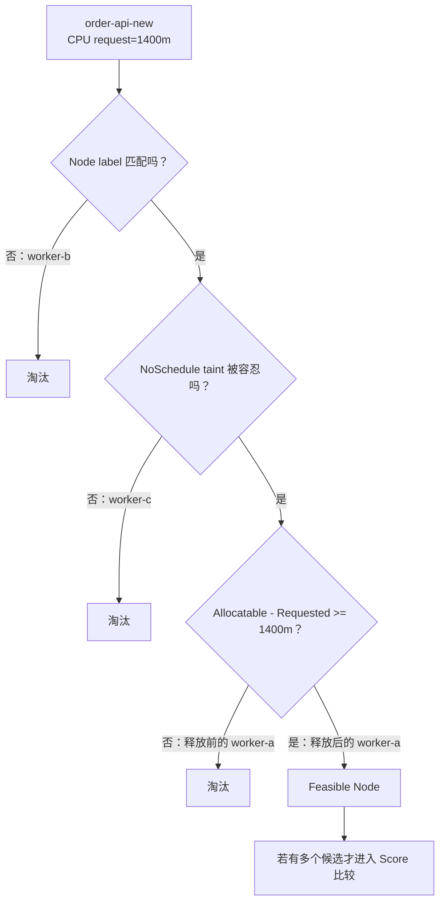

#### 运维现场小案例：用一张只读矩阵防止“看见空闲节点就拍脑袋”

- **现象：** 三台 Node 各自看起来都有优点，但没有一台同时满足全部合同。
- **只读命令：** `kubectl get pod -n prod order-api-new-7f8d9 -o yaml`; `kubectl get nodes worker-a worker-b worker-c -o custom-columns='NAME:.metadata.name,TIER:.metadata.labels.workload-tier,CPU:.status.allocatable.cpu,TAINTS:.spec.taints'`
- **关键输出（教学示意）：** Pod 要求 `workload-tier=online`、无 GPU taint toleration、CPU `1400m`；每台 Node 分别在资源、标签或污点一列失败。
- **能证明：** Pod 声明与 Node 事实可手工做硬条件交集，帮助复核为何可行集合为零。
- **不能证明：** 这张静态矩阵没有 scheduler cache 中 assumed Pod，也不能替代卷、端口、拓扑等其他 Filter 的检查。
- **源码映射：** `pkg/scheduler/schedule_one.go` 的 `findNodesThatPassFilters`，它对候选 Node 调 `RunFilterPluginsWithNominatedPods`。

### 3.6 这个现场真正暴露的不是“scheduler 坏了”

它暴露的是发布容量与平台策略共同作用：

- `maxSurge: 1` 允许临时多出一个 Pod，但不凭空创造 Node 容量；
- `maxUnavailable: 0` 保护业务可用性，也使平台更需要预留发布余量；
- nodeSelector 把在线业务限制到特定节点池；
- GPU 节点 taint 防止普通业务误占昂贵资源；
- request 决定 scheduler 的容量承诺；
- readiness 决定业务能否接流量，但不替代 scheduler request 账。

正确的平台问题不是“怎么让 scheduler 强行选一台”，而是：发布冗余、节点池规模、request 基线和隔离策略是不是一起设计过。

#### 运维现场小案例：一次 Pending 同时暴露发布策略和节点池容量

- **现象：** 平时 4 副本稳定，一到 `maxSurge: 1` 发布就出现第 5 个 Pod Pending，回滚后又“恢复正常”。
- **只读命令：** `kubectl get deploy -n prod order-api -o jsonpath='replicas={.spec.replicas}{" surge="}{.spec.strategy.rollingUpdate.maxSurge}{" unavailable="}{.spec.strategy.rollingUpdate.maxUnavailable}{" updated="}{.status.updatedReplicas}{" available="}{.status.availableReplicas}{"\n"}'`; `kubectl get rs,pod -n prod -l app=order-api -o wide`
- **关键输出（教学示意）：** `replicas=4 surge=1 unavailable=0`，旧、新 ReplicaSet 在发布窗口合计需要容纳 5 个 Pod。
- **能证明：** 发布控制器确实制造了瞬时第 5 份容量合同，Pending 与发布窗口相交，而不是 scheduler 凭空多算一只 Pod。
- **不能证明：** 仅凭副本数不能断定根因一定是 CPU；还要把最终 Pod request 与 label、taint、卷、拓扑一起核对。
- **源码映射：** scheduler 侧仍落到 `pkg/scheduler/schedule_one.go` 的 `schedulePod` Filter 结果；`maxSurge` 只是上游 Deployment 控制器改变待调度 Pod 数量。

### 3.7 把案例 A 的白板数字换成现场命令

**运维现场小案例：** 值班群只给出一句“发布后新 Pod Pending，节点 CPU 才 15%”。按下面顺序取证，不要先改单个 request。

```powershell
$Namespace = 'prod'
$Deployment = 'order-api'
$PodName = 'order-api-new-7f8d9'
$NodeName = 'worker-a'

# 1. 发布瞬时需求来自哪个滚动策略。
kubectl get deployment -n $Namespace $Deployment `
  -o jsonpath='replicas={.spec.replicas}{" maxSurge="}{.spec.strategy.rollingUpdate.maxSurge}{" maxUnavailable="}{.spec.strategy.rollingUpdate.maxUnavailable}{" updated="}{.status.updatedReplicas}{" available="}{.status.availableReplicas}{"\n"}'

# 2. 看 API Server 最终保存的每个容器 request；不要只看 Helm values。
kubectl get pod -n $Namespace $PodName `
  -o jsonpath='{range .spec.initContainers[*]}init/{.name}{" cpu="}{.resources.requests.cpu}{" mem="}{.resources.requests.memory}{"\n"}{end}{range .spec.containers[*]}app/{.name}{" cpu="}{.resources.requests.cpu}{" mem="}{.resources.requests.memory}{" gpu="}{.resources.requests.nvidia\.com/gpu}{"\n"}{end}{"overhead="}{.spec.overhead}{"\n"}'

# 3. 看节点的 Capacity/Allocatable、标签和污点。
kubectl get node $NodeName `
  -o jsonpath='capacityCPU={.status.capacity.cpu}{" allocatableCPU="}{.status.allocatable.cpu}{" pool="}{.metadata.labels.workload-tier}{" taints="}{.spec.taints}{"\n"}'

# 4. 快速浏览 API 中已绑定 Pod 的 request 汇总。
kubectl describe node $NodeName

# 5. usage 单独看，明确它不是 scheduler request 账。
kubectl top node $NodeName
```

第 1～4 组证据支持“surge 新增了多少 Pod、最终 request 是多少、Node 对外承诺多少、API 中已绑定 Pod 已申请多少”。`kubectl top` 只能回答采样窗口的实际使用。`describe node` 还看不到 scheduler 刚 Assume、尚未 Bind 的瞬时占账，所以账面临界时仍要结合 Pod/Event/scheduler 指标和时间线。

---

## 4. 一张全景图：Pod 从创建到应用运行

这张图按时序从上往下读。实线是函数调用或 API 动作；虚线是异步对象传播。左侧是控制面，右侧是目标节点。

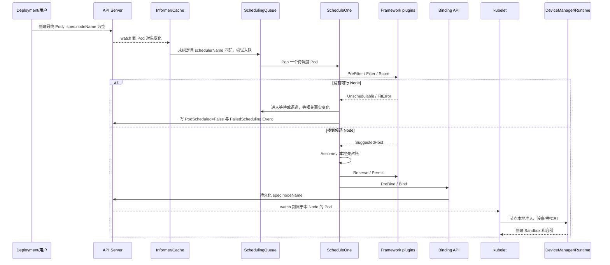

### 4.1 五个状态所有者

| 状态 | 主要所有者 | 谁读 | 谁写 | 是否持久化 |
|---|---|---|---|---|
| Pod 声明的 request/affinity/toleration | Pod spec | scheduler、kubelet、控制器 | 用户、控制器、admission | 是 |
| Node Capacity/Allocatable/labels/taints | Node API 状态与 spec/metadata | scheduler、平台控制器 | kubelet、节点/平台控制器 | 是 |
| 内部调度队列位置 | kube-scheduler | kube-scheduler | kube-scheduler | 否，进程内 |
| assumed Pod 与 NodeInfo Requested | scheduler cache | kube-scheduler | kube-scheduler + informer 事件 | 否，进程内 |
| 最终选中的 Node | `Pod.spec.nodeName` | kubelet、控制器、用户 | Binding 路径 | 是 |

#### 运维现场小案例：为什么只查 Pod YAML 会少一本账

**背景：** 案例 D 的 `train-a100-a` 已在 scheduler 内 Assume `gpu-b`，Binding 还没写入 API；紧接着 `train-a100-b` 被报 `Insufficient nvidia.com/gpu`。

```powershell
$Namespace = 'ml'
kubectl get pods -n $Namespace `
  -o custom-columns='NAME:.metadata.name,UID:.metadata.uid,NODE:.spec.nodeName,GPU:.spec.containers[*].resources.requests.nvidia\.com/gpu,CREATED:.metadata.creationTimestamp'
kubectl get events -n $Namespace --sort-by='.metadata.creationTimestamp' | Select-Object -Last 30
```

API 里短时间只看到 B 未绑定，并不能证明 scheduler 没把 A 计入内存 Requested。Assume 是进程内状态，没有通用 `kubectl get assumedpods`；要证明这段窗口，必须关联两个 Pod UID、精确时间、scheduler 日志/trace 或测试断点，不能只把 API 中已绑定 request 相加。

### 4.2 五条必须守住的不变量

1. **硬约束失败的 Node 不能靠高分翻盘。**
2. **同一份资源不能同时承诺给多个 Pod。** 所以 Bind 尚未完成时也要先 Assume 记账。
3. **内部 Error 不能伪装成业务资源不足。** 否则运维会朝错误方向扩容或改 YAML。
4. **失败不能变成热循环。** 只有退避到期或相关集群事实变化后才值得重试。
5. **只有持久化绑定才完成跨组件交接。** 内存里的候选、提名和预占都要允许失败后补偿。

#### 运维现场小案例：Binding 失败后，另一只 Pod 为什么突然成功

**背景：** 案例 A 中 Pod-A Assume 了 `worker-a` 的最后 `1400m`，API Binding 临时失败；Pod-B 曾因这笔账 Pending。A 被 Forget 后，B 被内部资源释放事件唤醒并成功绑定。

```powershell
$Namespace = 'prod'
kubectl get pods -n $Namespace -l app=order-api -w `
  -o custom-columns='NAME:.metadata.name,UID:.metadata.uid,NODE:.spec.nodeName,SCHEDULED:.status.conditions[*].reason'

# 有控制面日志权限时按两个 UID 和同一时间窗关联；托管集群可能需使用云平台控制面日志。
kubectl logs -n kube-system -l component=kube-scheduler --since=10m --prefix | `
  Select-String 'order-api|Binding|ForgetPod|FailedScheduling'
```

Pod-B 随后出现 `spec.nodeName` 能证明它最终成功绑定，不能单独证明就是 A 的 Forget 唤醒了它。后一个因果需要 scheduler 时间线或隔离实验。这个边界正对应“不重复承诺、失败可补偿、只有 Bind 才交接”三条不变量。

---

## 5. Kubernetes 为什么把 scheduler 设计成现在这样

### 5.1 为什么不直接看实时利用率

直觉方案是：“哪台机器 CPU 当前最闲，就把 Pod 放过去。”它的问题是：

- CPU 使用率是瞬时值，几秒后可能完全不同；
- 新 Pod 还没启动，实时指标里没有它未来的负载；
- Java 应用会经历启动、JIT、GC、流量峰值，当前低利用率不能代表未来安全；
- Metrics Server、Prometheus 与 scheduler cache 存在不同采样周期和延迟；
- GPU 利用率为 0 也不代表设备没有被某个长任务占用或保留。

所以默认资源 Fit 依据的是声明的 request 承诺：

```text
可调度条件：PodRequest <= NodeAllocatable - NodeRequested
```

收益是决策可重复、可手算、能做容量规划；代价是 request 填错时，调度结果也会跟着失真。

#### 运维现场小案例：`top` 15%，为什么仍报 CPU 不足

**背景：** 案例 A 的 `worker-a` 实际 CPU 只有 15%，但 Allocatable `4000m`、已请求 `3200m`，新 Pod 要 `1400m`。

```powershell
$NodeName = 'worker-a'
kubectl top node $NodeName
kubectl describe node $NodeName
kubectl get pods -A --field-selector "spec.nodeName=$NodeName" `
  -o custom-columns='NS:.metadata.namespace,POD:.metadata.name,CPU:.spec.containers[*].resources.requests.cpu,MEM:.spec.containers[*].resources.requests.memory'
```

`top` 证明采样时刻的 usage；Pod spec 与 Node Allocatable 才能近似复算 request 账。这里仍未包含 assumed Pod、完整 init/overhead 算法，不能拿简单列表冒充 scheduler 的精确 NodeInfo。

### 5.2 为什么 Filter 和 Score 不能混成一个总分

假设某 Node：

- CPU 很空闲，得 100 分；
- 但有一个 Pod 完全不能容忍的 `NoSchedule` taint。

如果所有规则都混成加减分，这台 Node 可能靠 CPU 高分抵消 taint 失败，最终得到一个根本不能接受的结果。

因此 scheduler 先做硬筛选：

```text
Filter：能不能放？任何硬条件失败就是不能。
Score：都能放时，更愿意放哪一台？
```

#### 运维现场小案例：CPU 最高分也救不了未容忍污点

**背景：** 案例 A 的 `worker-c` 最空，却有 `dedicated=gpu:NoSchedule`，普通订单 Pod 没有 toleration。

```powershell
$Namespace = 'prod'; $PodName = 'order-api-new-7f8d9'; $NodeName = 'worker-c'
kubectl get node $NodeName -o jsonpath='{.spec.taints}{"\n"}'
kubectl get pod -n $Namespace $PodName -o jsonpath='{.spec.tolerations}{"\n"}'
kubectl get events -n $Namespace --field-selector "involvedObject.name=$PodName" --sort-by='.metadata.creationTimestamp'
```

完整 taint/toleration 关系能支持 Filter 失败判断；节点 usage 或预计 Score 再高也不能让该 Node 回到可行集合。Event 文本只作版本相关旁证，自动化不要只解析一句 message。

### 5.3 为什么不每次直接读 API Server

一个大集群每秒可能有大量 Pod、Node、PVC、PV 和其他对象变化。如果每评估一台 Node 都同步请求 API Server：

- 延迟会很高；
- API Server 压力会很大；
- 同一轮决策读到的对象版本可能前后不一致；
- 网络抖动会把正常调度变成大面积失败。

所以 scheduler 通过 informer/watch 维护本地对象视图，再构建 scheduler cache 和本轮 snapshot。收益是吞吐和一致的本轮视图；代价是它与 API Server 之间存在短暂时间差，源码必须设计 Assume、Forget、事件补偿和失败重试。

#### 运维现场小案例：刚删掉占资源 Pod，新 Pod 为什么还短暂报旧结果

**背景：** 案例 A 的批处理 Pod 在 `10:00:05` 删除，新 Pod 在同一窗口仍收到一次旧 snapshot 计算出的 `Insufficient cpu`，随后重试成功。

```powershell
$Namespace = 'prod'; $PodName = 'order-api-new-7f8d9'
kubectl get pod -n $Namespace $PodName --watch-only --output-watch-events -o yaml

$PodUid = kubectl get pod -n $Namespace $PodName -o jsonpath='{.metadata.uid}'
kubectl get events -n $Namespace --field-selector "involvedObject.uid=$PodUid" `
  --sort-by='.metadata.creationTimestamp' -o custom-columns='TIME:.metadata.creationTimestamp,REASON:.reason,MESSAGE:.message'
```

这能建立 API 对象与 Event 的时间线，不能直接量出 informer/cache 落后多少毫秒。若只出现一次旧诊断后很快成功，先考虑异步传播；若长期不变，再查队列事件、QueueingHint、cache 和对象实际状态。

### 5.4 为什么选点串行、绑定并发

选点阶段会修改 scheduler 自己的资源承诺账。为了避免两个调度周期同时基于相同旧账做出冲突决定，普通主线的 scheduling cycle 按串行入口运行。

Binding 需要访问 API 或外部系统，延迟更不可控。Assume 已经在本地提前占账后，绑定可以放到 goroutine 并发执行，不必挡住下一个 Pod 的选点。

收益：提高吞吐。

代价：系统出现“已经 Assume、尚未 Bind”的中间状态，后续失败必须执行 Unreserve 和 Forget。

#### 运维现场小案例：选点很快，为什么 `nodeName` 还是写得慢

**背景：** 案例 F 中 Filter/Score 延迟正常，但 API Server 写延迟上升，异步 Bind 堆积；scheduler 主循环仍能继续计算后续 Pod。

下面是两条独立 PromQL，必须逐条执行；不能把整个代码块一次粘进 Prometheus 表达式框。

```promql
# 先看一次调度尝试整体延迟，再和扩展点延迟对照。
histogram_quantile(0.99,
  sum by (le, result, profile) (
    rate(scheduler_scheduling_attempt_duration_seconds_bucket[5m])
  )
)

histogram_quantile(0.99,
  sum by (le, extension_point, profile) (
    rate(scheduler_framework_extension_point_duration_seconds_bucket[5m])
  )
)
```

若 `Bind` 扩展点慢而 Filter/Score 正常，支持“后半程慢”的判断；仍需结合 API Server/etcd 指标和 scheduler error 日志。仅看到 `NODE=<none>` 无法判断 Pod 是尚未选出候选，还是已经 Assume、正在异步 Bind。

### 5.5 为什么做成 Framework 插件流水线

调度规则天然很多：资源、标签、污点、卷、端口、拓扑、亲和性、抢占、设备。把所有逻辑写进一个大函数会导致：

- 任意一条规则改动都影响核心；
- 很难替换企业策略；
- 很难单独测试和观测；
- 不同工作负载无法使用不同组合。

Framework 保留轻量主干，把具体规则放到扩展点。代价是插件顺序、状态码、回滚和性能都需要严格契约，平台团队不能只看插件名字就上线。

#### 运维现场小案例：升级后只有 GPU profile 调度变慢

**背景：** 案例 F 中 `default-scheduler` 正常，`gpu-binpack-scheduler` 的自定义 Score 插件 p99 从 20 ms 变成 800 ms。

```powershell
# 自管控制面可先确认 scheduler Pod、镜像、启动参数和挂载配置。
kubectl get pods -n kube-system -l component=kube-scheduler -o wide
$SchedulerPod = kubectl get pods -n kube-system -l component=kube-scheduler -o jsonpath='{.items[0].metadata.name}'
kubectl get pod -n kube-system $SchedulerPod -o yaml
```

再用 `scheduler_plugin_execution_duration_seconds{plugin,extension_point,status}` 按插件对比。Pod 清单能证明正在运行哪个镜像、参数和挂载，不能保证挂载文件内容就是进程实际成功加载的配置；托管控制面还可能完全不暴露这些对象，要改用云厂商控制面日志和配置接口。

### 5.6 为什么失败后要等“相关事实”变化

本案由 `NodeResourcesFit` 拒绝。真正可能改变结果的事实包括：

- 已绑定 Pod 删除，request 账释放；
- Node 新增；
- Node Allocatable 增加；
- 目标 Pod 自己的 request 变小。

一个无关 ConfigMap 更新通常不会让 CPU 余额增加。如果任何事件都唤醒所有失败 Pod，大集群会发生无效重算风暴。

QueueingHint 的核心思想是：

> 上轮由哪个插件拒绝，就优先问那个插件“这次变化是否可能让结果不同”。

#### 运维现场小案例：删了一个 1000m Pod，为什么 order-api 被重新尝试

**背景：** 案例 A 上轮由 `NodeResourcesFit` 拒绝。`worker-a` 的批任务自然结束后，删除事件可能释放 request；无关 Secret 更新则不该触发同样的全量重算。

```powershell
$Namespace = 'prod'; $PodName = 'order-api-new-7f8d9'
kubectl get pod -n $Namespace $PodName -w `
  -o custom-columns='CREATED:.metadata.creationTimestamp,NODE:.spec.nodeName,SCHEDULED:.status.conditions[?(@.type=="PodScheduled")].reason'

# 指标侧查看哪些对象变化把 Pod 送进了哪个队列。
# PromQL: sum by (queue, event) (rate(scheduler_queue_incoming_pods_total[5m]))
```

最终绑定能证明重试后成功，队列 incoming 指标能显示事件类别；二者仍不能单独证明某一个 Pod 的 QueueingHint 返回值。精确归因需要按 UID 的 scheduler 日志、trace 或单测。

---

## 6. 调度器内部不是一条队列，也不是一个算法

### 6.1 四类内部状态先翻成人话

对新手来说，最容易记错的是把所有 Pending Pod 都叫“在 scheduler 队列里”。API 里的 `Pending` 只是 Pod phase；scheduler 内部还要区分它现在为什么没有被处理。

| 内部位置/状态 | 大白话 | 典型进入原因 |
|---|---|---|
| `activeQ` | 现在就值得拿出来试一次 | 新 Pod、退避结束、相关事实变化 |
| `backoffQ` | 值得再试，但先冷静一下 | 连续失败或内部错误，防止热循环 |
| `unschedulablePods` | 暂时没有新证据，先别白算 | 某插件明确拒绝，等待相关对象变化 |
| in-flight | 已经 Pop，当前正被某轮调度处理 | 用于记录这段窗口里发生的集群变化 |

有些资料把前三者简称“三队列”，但当前实现中 `unschedulablePods` 更准确地说是不可调度 Pod 池；in-flight 还会配套保存事件历史。首遍记状态含义，第二遍再记具体数据结构。

默认 `PrioritySort` 不是简单 FIFO：先比较 Pod Priority；priority 相同时，更早进入队列的 Pod 优先。高优先级只改变“先轮到谁”和“是否可能抢占谁”，不改变 Node 的硬约束。

#### 运维现场小案例：都是 Pending，处置方向为什么完全不同

**背景：** 案例 F 同时出现 30 个 active、20 个 backoff、200 个 unschedulable 和 8 个 gated Pod。

```promql
sum by (queue) (scheduler_pending_pods)
```

如果 `active` 持续增长，优先查吞吐、leader、插件和 API；`unschedulable` 高要按拒绝插件查合同/容量；`gated` 高先查 schedulingGates 或上层控制器。这个聚合指标不含 Pod 名称，也不能告诉你某个 Pod 此刻一定在哪个内部结构里；个案仍要结合 Condition/Event。

### 6.2 队列状态机

这张图从左往右读。方框是内部位置，实线是正常迁移，虚线是事件或超时触发。箭头上的文字是迁移条件。

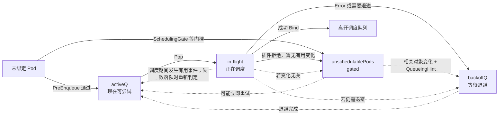

当前固定提交的默认参数是首次退避 1 秒、最大 10 秒；不可调度池还保留 5 分钟超时刷新。它们是版本和配置相关的实现事实，不是跨版本永恒常量。

#### 运维现场小案例：同一个 Pod 为什么不是每秒固定重试

**背景：** 案例 A 连续失败后，Event 时间看起来是 1、2、4、8 秒附近逐步拉开；中途节点变化又可能提前触发有价值的重试。

```powershell
$Namespace = 'prod'; $PodName = 'order-api-new-7f8d9'
$PodUid = kubectl get pod -n $Namespace $PodName -o jsonpath='{.metadata.uid}'
kubectl get events -n $Namespace --field-selector "involvedObject.uid=$PodUid" `
  --sort-by='.metadata.creationTimestamp' `
  -o custom-columns='FIRST:.metadata.creationTimestamp,LAST:.lastTimestamp,COUNT:.count,REASON:.reason,MESSAGE:.message'
```

Event 可能聚合、限流，时间字段也受 Event API/版本影响，所以它只能帮助观察节奏，不能精确反推每一次内部 queue transition。精确退避参数要核对本集群 scheduler 配置，而不是照抄本文默认值。

### 6.3 `Pop` 和 `Done` 不等于普通队列的取出与确认

当前源码里，`Pop` 还会：

- 增加调度尝试次数；
- 把 Pod UID 标记为 in-flight；
- 在事件链表中插入一个时间边界；
- 增加 scheduling cycle 计数。

`Done(uid)` 只表示：这次 in-flight 跟踪可以清理。它不表示 Binding 一定成功，不会删除 API Pod，也不会释放 scheduler cache 的资源账。

后面会把三个经常混淆的动作彻底拆开：

```text
Unreserve：撤销插件自己的预留状态
ForgetPod：撤销 scheduler cache 中的 assumed Pod 资源账
Done：结束调度队列的 in-flight 跟踪
```

#### 运维现场小案例：看到 `Done` 日志不等于 Pod 已绑定

**背景：** 案例 A 的一次调度已经结束 in-flight 跟踪，但后续异步 Bind 失败，API 仍是 `NODE=<none>`。

```powershell
$Namespace = 'prod'; $PodName = 'order-api-new-7f8d9'
kubectl get pod -n $Namespace $PodName `
  -o jsonpath='uid={.metadata.uid}{" nodeName="}{.spec.nodeName}{"\n"}'
kubectl get events -n $Namespace --field-selector "involvedObject.name=$PodName" --sort-by='.metadata.creationTimestamp'
```

最终是否交接只看 API 中 `spec.nodeName`。`Done`、`ForgetPod`、`Unreserve` 是三份不同的内部清理；普通 kubectl 看不到它们的完整状态，必须用源码、受控日志或测试断点区分。

### 6.4 Framework 扩展点：像一条有回滚能力的审批流水线

这张图从左往右读。绿色概念是“选 Node 前”，蓝色概念是“选出 Node 后”，红色虚线表示后续失败会触发补偿。

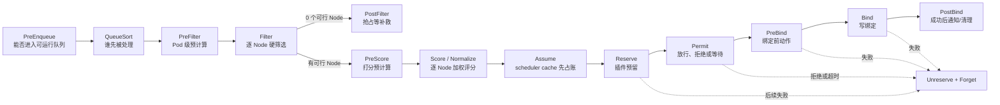

#### 运维现场小案例：PVC 为什么会从 Filter 一直参与到 PreBind

**背景：** 案例 C 的 `ledger-close` 使用 WFFC PVC。`worker-a` 的 CPU/label 都通过，但卷只能在 `zone-b` 供给。

```powershell
$Namespace = 'finance'; $PodName = 'ledger-close-0'
kubectl get pod -n $Namespace $PodName -o yaml
kubectl get pvc -n $Namespace -o wide
kubectl get storageclass -o custom-columns='NAME:.metadata.name,MODE:.volumeBindingMode,PROVISIONER:.provisioner'
kubectl get pv -o custom-columns='NAME:.metadata.name,CLAIM:.spec.claimRef.name,SC:.spec.storageClassName,AFFINITY:.spec.nodeAffinity'
```

这些对象能证明声明、binding mode、已有 PV 与节点拓扑合同，不能证明 CSI provisioner/attach/mount 已成功。VolumeBinding 在 Filter 选可行节点、Reserve 暂存选择、PreBind 持久化相关决定，后续失败才需要 Unreserve；它不是一个孤立“卷过滤器”。

### 6.5 每个扩展点到底回答什么

| 扩展点 | 新手问题 | 调用频率 | 失败后的大方向 |
|---|---|---:|---|
| PreEnqueue | 这个 Pod 现在允许进入 active/backoff 队列吗 | 每次准备入队前 | 门控在不可调度池等待相关变化 |
| QueueSort | 两个待调度 Pod 谁先出队 | 队列比较时 | 只能配置一个 QueueSort 实现 |
| PreFilter | 这个 Pod 能否先做一次公共计算，或缩小候选集合 | 每个 Pod 每轮一次 | 拒绝或 Error，停止正常选点 |
| Filter | 当前 Node 能不能运行这个 Pod | 每个候选 Node | 非 Success 淘汰该 Node；Error 可中断整轮 |
| PostFilter | 0 个可行 Node 后，能否为未来一轮创造条件 | 本轮无可行 Node 时 | 典型实现是抢占，不等于本轮直接 Bind |
| PreScore | 多个可行 Node 打分前，先算共享信息 | 每个 Pod 每轮一次 | Error 中断本轮 |
| Score | 当前可行 Node 有多符合偏好 | 每个可行 Node | 归一化、乘权重、求和 |
| Reserve | 选中 Node 后，插件要不要在内存中占位 | 每个建议 Node | 失败触发逆序 Unreserve 和 Forget |
| Permit | 能否绑定，还是等其他成员/外部条件 | 每个建议 Node | Success、Wait、Reject/Error |
| PreBind | 真正 Bind 前必须完成什么 | 每个待绑定 Pod | 失败触发回滚并重试 |
| Bind | 谁实际提交 Binding | 每个待绑定 Pod | 首个处理者结束链；Error 失败 |
| PostBind | 成功绑定后通知或清理什么 | 成功后一次 | 无 Status 返回，不能撤销已完成 Bind |
| EnqueueExtensions | 哪类对象变化值得唤醒被本插件拒绝的 Pod | scheduler 启动时注册，事件到来时判断 | 提高重入队准确度与吞吐 |

#### 运维现场小案例：先问“失败发生在哪一站”，再决定查什么

**背景：** 三个 Pod 都显示 Pending：案例 A 在 Filter 被拒，案例 B 在 Permit/抢占协调，案例 C 已绑定后 FailedMount。

```powershell
$Namespace = 'prod'
kubectl get pods -n $Namespace `
  -o custom-columns='NAME:.metadata.name,NODE:.spec.nodeName,SCHEDULED:.status.conditions[?(@.type=="PodScheduled")].status,REASON:.status.conditions[?(@.type=="PodScheduled")].reason'
```

`NODE`、PodScheduled Condition 和 Event 可以先把问题放到“选点前/选点后”大区间；它们通常不能直接展示 `PreFilter`、`Reserve` 或 `Permit` 的内部调用栈。系统性定位再看 `scheduler_framework_extension_point_duration_seconds` 和 scheduler 日志。

### 6.6 Status 不是一个简单布尔值

| Status Code | 大白话 | 运维理解 |
|---|---|---|
| `nil` / `Success` | 插件正常通过 | `nil` 在 Framework 里明确等价于成功 |
| `Unschedulable` | 当前条件不允许，但集群变化或 PostFilter 可能有帮助 | 业务拒绝，不代表 scheduler 崩溃 |
| `UnschedulableAndUnresolvable` | 当前连抢占通常也改变不了 | 仍可等待 Pod/Node/配置变化，不等于永久失败 |
| `Error` | 插件内部、输入或外部依赖发生非预期问题 | 通常按临时错误退避重试，需查日志和指标 |
| `Wait` | Permit 要暂缓绑定 | Pod 已有建议 Node，但仍未正式绑定 |
| `Skip` | 这个插件本轮不处理 | 不是报错，也不是普通业务拒绝 |
| `Pending` | 插件把本轮标成尚待外部事实，当前 cycle 结束 | 它属于 rejected 范围并记录进 PendingPlugins；相关 QueueingHint 再次放行时可跳过 backoff 直接进 activeQ |

最重要的区分：

```text
FitError / Unschedulable：规则正常工作，结论是“当前放不下”
Error：调度计算本身遇到非预期问题
```

`Wait` 与 `Pending` 不能混：`Wait` 是 Permit 专用的原地等待，Pod 留在 `waitingPods`，binding cycle 卡在 `WaitOnPermit` 等待 Allow、Reject 或超时；`Pending` 不会阻塞 binding goroutine，而是结束本次 cycle、进入失败与重排语义，等待相关事实变化后重新尝试。

不能看到 `FailedScheduling` Event 就说 kube-scheduler 进程出故障；这个 Event 同时可以承载正常的不可调度结论。

#### 运维现场小案例：同样是 FailedScheduling，处理动作为什么相反

**背景：** Pod-A message 是 `0/3 nodes are available: Insufficient cpu`；Pod-B 的 Condition reason 是 `SchedulerError`，scheduler 日志显示自定义插件调用失败。

```powershell
$Namespace = 'prod'
kubectl get pods -n $Namespace `
  -o jsonpath='{range .items[*]}{.metadata.name}{" node="}{.spec.nodeName}{range .status.conditions[?(@.type=="PodScheduled")]}{" scheduled="}{.status}{" reason="}{.reason}{" message="}{.message}{end}{"\n"}{end}'
kubectl get events -n $Namespace --sort-by='.metadata.creationTimestamp' | Select-Object -Last 40
```

`Unschedulable` 通常要求修合同或容量；`SchedulerError` 要查调度器、插件、snapshot/API 等内部链。Event 可能把二者都以 Warning/FailedScheduling 呈现，所以必须看 Condition reason、指标 `result` 和日志，而不是只按 Event reason 自动扩容。

### 6.7 当前快照默认插件，不要求背名单

当前固定 commit 的 `getDefaultPlugins()` 先用 `MultiPoint` 装配以下**基础列表**，再调用 `applyFeatureGates()` 按特性开关追加插件。表里只写运维最需要知道的责任：

| 规则领域 | 主要默认插件 | 大白话 |
|---|---|---|
| 入队门控 | `SchedulingGates` | Pod 还有 scheduling gate 时先不尝试选点 |
| 队列顺序 | `PrioritySort` | priority 高者先；同优先级较早者先 |
| 节点是否允许调度 | `NodeUnschedulable` | 处理 cordon/unschedulable 节点边界 |
| 显式节点与标签 | `NodeName`、`NodeAffinity` | 检查节点名、nodeSelector、required affinity；preferred affinity参与打分 |
| 污点 | `TaintToleration` | 不容忍的硬 taint 过滤；软偏好可参与打分 |
| 端口 | `NodePorts` | 防止 hostPort 等节点端口冲突 |
| 资源 | `NodeResourcesFit` | CPU、内存、Pod 数、临时存储、扩展资源的 Fit 与资源打分 |
| 卷 | `VolumeRestrictions`、`NodeVolumeLimits`、`VolumeBinding`、`VolumeZone` | 检查卷冲突、数量、延迟绑定和拓扑 |
| 拓扑与 Pod 关系 | `PodTopologySpread`、`InterPodAffinity` | 跨 zone/hostname 分布、Pod 亲和与反亲和 |
| 无可行 Node 后 | `DefaultPreemption` | 尝试通过驱逐较低优先级 Pod 为未来调度创造条件 |
| 打分 | `NodeResourcesBalancedAllocation`、`ImageLocality` 等 | 资源平衡、镜像本地性等偏好 |
| 绑定 | `DefaultBinder` | 调 Pod Binding 子资源 |

在本文固定快照的默认 feature-gate 状态下，`DynamicResourceAllocation` 已 GA 且锁定开启，`NodeDeclaredFeatures` 为 Beta 且默认开启，因此**当前有效默认集合**还会追加 `DynamicResources` 和 `NodeDeclaredFeatures`。`GangScheduling`、`TopologyPlacementGenerator` 等实验插件则仍取决于默认关闭的相关 feature gate。不要把这个 master 快照的有效集合反推到其他版本；目标集群必须同时核对 `getDefaultPlugins()`、`applyFeatureGates()` 与实际启动参数。

#### 运维现场小案例：文档说有插件，现场 profile 真的启用了吗

**背景：** 案例 D 预期使用 `gpu-binpack-scheduler`，但升级后 Pod 行为像默认 profile。先核对实际责任路由和进程配置来源。

```powershell
$Namespace = 'ml'; $PodName = 'train-a100'
kubectl get pod -n $Namespace $PodName -o jsonpath='{.spec.schedulerName}{"\n"}'

# 自管控制面：检查 scheduler 镜像、命令、参数、volumeMount；配置也可能来自节点本地文件。
$SchedulerPod = kubectl get pods -n kube-system -l component=kube-scheduler -o jsonpath='{.items[0].metadata.name}'
kubectl get pod -n kube-system $SchedulerPod -o yaml
```

这能证明 Pod 请求的 profile 以及可见 scheduler Pod 的启动规格，不能自动展开进程内最终插件集合。还要读取 `--config` 指向的真实配置、feature gates 和该版本默认装配；托管集群则使用厂商支持的配置/日志渠道。

---

## 7. 源码主线：一个 Pod 到底怎样选出 Node

### 7.1 先看最小调用地图

这张图从上往下读。实线是普通 Pod 主路径；虚线是失败和补偿；灰色概念是第二遍再追的优化。

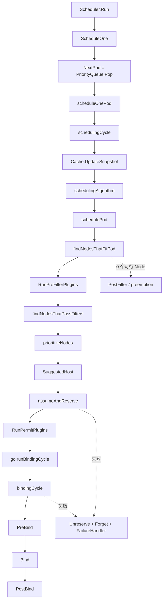

对应文件与符号：

| 问题 | 文件 | 关键符号 |
|---|---|---|
| scheduler 怎样持续工作 | `pkg/scheduler/scheduler.go` | `(*Scheduler).Run` |
| 一个实体怎样分流 | `pkg/scheduler/schedule_one.go` | `ScheduleOne` |
| 普通 Pod 总骨架 | 同上 | `scheduleOnePod` |
| 快照、算法、预占 | 同上 | `schedulingCycle` |
| 0/1/多个可行 Node | 同上 | `schedulePod` |
| PreFilter/Filter | 同上 | `findNodesThatFitPod`、`findNodesThatPassFilters` |
| Score | 同上 | `prioritizeNodes` |
| Assume/Reserve | 同上 | `assumeAndReserve`、`assume` |
| Permit/Bind | 同上 | `bindingCycle`、`bind` |
| 失败重排与 Condition/Event | 同上 | `handleSchedulingFailure` |
| 队列状态 | `pkg/scheduler/backend/queue/` | `PriorityQueue`、`activeQueue`、`backoffQueue` |
| Framework 调插件 | `pkg/scheduler/framework/runtime/framework.go` | `RunPreFilterPlugins` 等 |

#### 运维现场小案例：拿一个 Pod 实例串起“选点—占位—绑定”证据

- **现象：** `order-api` 最终调度成功，但团队只看到 `Scheduled` Event，不知道源码主线从哪开始追。
- **只读命令：** `$podKey='prod/order-api-new-7f8d9'; $uid=kubectl get pod -n prod order-api-new-7f8d9 -o jsonpath='{.metadata.uid}'; kubectl logs -n kube-system -l component=kube-scheduler --since=15m --tail=-1 --prefix | Select-String -SimpleMatch $podKey; kubectl get events -n prod --field-selector "involvedObject.uid=$uid" --sort-by='.metadata.creationTimestamp'`
- **关键输出（教学示意）：** 常规 scheduler 日志可能在同一 `namespace/name` 上出现 scheduling 或 `Successfully bound pod to node`；Event 再用 UID 隔离同名重建对象。
- **能证明：** 日志命中时可把该名字在限定时间窗内缩小到 scheduling/binding 线索；UID 能严格限定 API Event 属于哪一个 Pod 实例。
- **不能证明：** 固定源码的常规日志多用 `klog.KObj(pod)`，通常只打印 `namespace/name`，不能承诺搜索 UID 一定命中；同名快速重建还必须结合 UID、时间窗和 leader/实例前缀。普通日志缺行也不代表函数没执行。
- **源码映射：** `pkg/scheduler/schedule_one.go` 的 `ScheduleOne`、`scheduleOnePod`、`schedulingCycle`、`bindingCycle`。

### 7.2 第一组真实源码：0、1、多个可行 Node 为什么分叉

这段只回答一个问题：Filter 完成后，scheduler 怎样从可行 Node 数量得出下一步。

**摘录类型：完整函数。** 来自 `pkg/scheduler/schedule_one.go:570-624` 的 `schedulePod`。中文注释为讲义新增；所有业务分支都保留。`fwk` 是当前 profile 的 Framework，`state` 是本轮插件共享状态，`podInfo` 来自调度队列。

```go
// 这个方法只负责从当前快照计算建议节点，不在这里写 API Binding。
func (sched *Scheduler) schedulePod(
	ctx context.Context,
	fwk framework.Framework,
	state fwk.CycleState,
	podInfo *framework.QueuedPodInfo,
) (result ScheduleResult, err error) {
	// 从队列对象里取得本轮待调度 Pod。
	pod := podInfo.Pod

	// trace 只用于慢调度追踪，不改变选点结果。
	trace := utiltrace.New(
		"Scheduling",
		utiltrace.Field{Key: "namespace", Value: pod.Namespace},
		utiltrace.Field{Key: "name", Value: pod.Name},
	)
	defer trace.LogIfLong(100 * time.Millisecond)

	// 当前 placement 里一台 Node 都没有，直接返回特殊错误。
	if sched.nodeInfoSnapshot.NumNodesInPlacement() == 0 {
		return result, ErrNoNodesAvailable
	}

	// 运行 PreFilter、Filter 和 extender Filter，得到本轮可行 Node。
	feasibleNodes, diagnosis, nodeHint, err := sched.findNodesThatFitPod(ctx, fwk, state, podInfo)
	// 插件执行或内部基础设施异常会终止整轮，不伪装成普通节点不匹配。
	if err != nil {
		// 内部 Error 与“0 个可行 Node”分开返回。
		return result, err
	}
	// trace 的这个分段点只记录硬约束阶段耗时。
	trace.Step("Computing predicates done")

	// 规则正常运行，但所有 Node 都被拒绝：构造 FitError。
	if len(feasibleNodes) == 0 {
		return result, &framework.FitError{
			Pod:         pod,
			NumAllNodes: sched.nodeInfoSnapshot.NumNodesInPlacement(),
			Diagnosis:   diagnosis,
		}
	}

	// 只有一个可行 Node 时没有比较对象，直接选它，不运行 Score。
	if len(feasibleNodes) == 1 {
		node := feasibleNodes[0].Node().Name
		if utilfeature.DefaultFeatureGate.Enabled(features.OpportunisticBatching) {
			// 当前快照启用批处理优化时，缓存本轮结果供相同签名 Pod 复用。
			fwk.StoreScheduleResults(ctx, podInfo.PodSignature, nodeHint, node, nil, sched.CurrentCycle())
		}
		return ScheduleResult{
			SuggestedHost:  node,
			EvaluatedNodes: 1 + diagnosis.NodeToStatus.Len(),
			FeasibleNodes:  1,
		}, nil
	}

	// 多个 Node 都能放，才进入 PreScore/Score 和 extender Prioritize。
	priorityList, err := prioritizeNodes(ctx, sched.Extenders, fwk, state, pod, feasibleNodes)
	// 打分链任何内部异常都会让本轮无法安全选择节点。
	if err != nil {
		return result, err
	}

	// 建堆后弹出总分最高的 Node。
	// 把所有候选分数组织成可高效取最高分节点的堆。
	sortedPrioritizedNodes := newSortedNodeScores(priorityList)
	// 弹出的节点是当前参与评分候选集中的最高分者。
	node := sortedPrioritizedNodes.Pop()
	trace.Step("Prioritizing done")

	if utilfeature.DefaultFeatureGate.Enabled(features.OpportunisticBatching) {
		// 缓存已选 Node 和其余有序候选；这是当前版本优化旁支。
		fwk.StoreScheduleResults(ctx, podInfo.PodSignature, nodeHint, node, sortedPrioritizedNodes, sched.CurrentCycle())
	}

	// 注意这里只返回 SuggestedHost，API 中还没有 spec.nodeName。
	return ScheduleResult{
		SuggestedHost:  node,
		EvaluatedNodes: len(feasibleNodes) + diagnosis.NodeToStatus.Len(),
		FeasibleNodes:  len(feasibleNodes),
	}, err
}
```

**大白话总结：**

- 输入：一个 Pod、本轮 snapshot 和插件状态。
- 判断：先找可行 Node，再按 0、1、多个分叉。
- 动作：0 个返回 FitError；1 个直接选；多个运行 Score 后选最高分。
- 结果：得到的仍是 `SuggestedHost`，尚未完成 Binding。

代回本案：释放前 0 个可行 Node，返回 FitError；释放后只有 `worker-a` 可行，直接返回它，不会为了“流程完整”硬跑一次 Score。

**顺手学 Go：**

- `(result ScheduleResult, err error)` 是命名返回值；裸 `return` 才会隐式使用它们，本函数大部分分支仍显式写返回值。
- `:=` 在当前作用域创建变量；`feasibleNodes, diagnosis, nodeHint, err :=` 中的 `err` 与命名返回值属于同一函数作用域。
- `defer` 在函数返回前执行；这里无论走哪个 return，慢 trace 都有机会记录。
- `len(slice)` 返回 slice 元素数量。

#### 运维现场小案例：成功日志里的两个数字对应哪条源码分支

- **现象：** 大集群里同一类 Pod 有时很快绑定，有时 Score 延迟明显，想先确认本轮评估规模。
- **只读命令：** `kubectl logs -n kube-system -l component=kube-scheduler --since=15m --prefix | Select-String 'Successfully bound pod to node.*order-api-new.*evaluatedNodes.*feasibleNodes'`
- **关键输出（教学示意）：** `evaluatedNodes=3 feasibleNodes=1`；若 `feasibleNodes=1`，源码直接返回唯一节点，不运行多候选 Score。
- **能证明：** 在开启 V(2) 且日志未丢失时，可读出该次成功调度返回的评估节点数与可行节点数。
- **不能证明：** 只看到 `feasibleNodes>1` 不能知道每个 Score 插件的分数；`feasibleNodes=0` 也不会走“成功绑定”这条日志。
- **源码映射：** `pkg/scheduler/schedule_one.go` 的 `schedulePod` 三分支和 `ScheduleResult.EvaluatedNodes/FeasibleNodes`。

### 7.3 scheduling cycle 为什么同步，binding cycle 为什么异步

这段只回答：选点与绑定怎样在 `scheduleOnePod` 中拆开。

**摘录类型：连续摘录。** 来自 `pkg/scheduler/schedule_one.go:125-148`。函数前面的日志、profile 查找和 skip 判断已省略，因为不改变这里的“同步选点、异步绑定”结论。可见的 `podInfo`、`fwk`、`pod` 来自该函数参数和前置语句。

```go
// 同步寻找适合当前 Pod 的 Node。
start := time.Now()

// CycleState 是本轮插件共享的临时书包，不写入 API。
state := framework.NewCycleState()

// 当前实现只抽样记录一部分插件执行指标，降低观测开销。
state.SetRecordPluginMetrics(rand.Intn(100) < pluginMetricsSamplePercent)

// 插件可以把需要激活的其他 Pod 放入这个结构。
podsToActivate := framework.NewPodsToActivate()
state.Write(framework.PodsToActivateKey, podsToActivate)

// 给同步 scheduling cycle 建立可取消的子 context。
schedulingCycleCtx, cancel := context.WithCancel(ctx)
defer cancel()

// 选 Node、Assume、Reserve、Permit 都在这个同步调用里。
scheduleResult, assumedPodInfo, status := sched.schedulingCycle(
	schedulingCycleCtx,
	state,
	fwk,
	podInfo,
	start,
	podsToActivate,
)
if !status.IsSuccess() {
	// 失败统一进入失败分类、重排和 Condition/Event 更新。
	sched.FailureHandler(schedulingCycleCtx, fwk, assumedPodInfo, status, scheduleResult.nominatingInfo, start)
	return
}

// Assume 已经在内存占账，所以 Bind 可以放到 goroutine，不挡住下一 Pod 的选点。
go sched.runBindingCycle(ctx, state, fwk, scheduleResult, assumedPodInfo, start, podsToActivate)
```

**大白话总结：**

- 输入：已经从队列取出的一个 Pod。
- 判断：同步 scheduling cycle 是否成功。
- 动作：失败走 FailureHandler；成功后启动异步 binding cycle。
- 结果：主循环可以尽快处理下一个 Pod，但前一个 Pod 的 API Binding 仍可能失败并回滚。

一个很细的源码点：异步 `runBindingCycle` 接收外层 `ctx`，不是即将因 `defer cancel()` 被取消的 `schedulingCycleCtx`。否则同步函数一返回，后台绑定会被自己误取消。

**顺手学 Go：**

- `go f()` 启动 goroutine；它只表示并发执行，不保证何时完成。
- `context.WithCancel` 返回子 context 和取消函数。`defer cancel()` 保证当前函数结束时释放相关资源。
- `status.IsSuccess()` 对 `nil Status` 也按成功处理，这是 Framework 的明确契约。

#### 运维现场小案例：前一只 Pod 还在绑定，后一只为什么已开始选点

- **现象：** 同一秒内 `order-api-new-a` 的绑定链还在等待存储，日志里 `order-api-new-b` 已进入调度。
- **只读命令：** `kubectl logs -n kube-system -l component=kube-scheduler --since=10m --timestamps --prefix | Select-String 'order-api-new-a|order-api-new-b|Successfully bound|binding'`
- **关键输出（教学示意）：** B 的 scheduling 时间戳落在 A 的 binding 开始与完成之间。
- **能证明：** 有完整时间戳和相应日志时，能证明两个 Pod 的阶段发生了时间重叠，符合 binding cycle 异步执行。
- **不能证明：** API Event 的先后顺序不能单独证明 goroutine；异步也不表示同一 Pod 可以同时跑两个 scheduling cycle。
- **源码映射：** `pkg/scheduler/schedule_one.go` 的 `scheduleOnePod` 在同步 `schedulingCycle` 后以 goroutine 启动 `runBindingCycle`。

### 7.4 0 个可行 Node 后为什么先 PostFilter

`schedulingAlgorithm` 对返回错误做分类：

```text
ErrNoNodesAvailable
  -> UnschedulableAndUnresolvable

非 FitError
  -> 内部 Error

FitError 且有 PostFilter 插件
  -> 运行 PostFilter，例如 DefaultPreemption
  -> 当前这一轮仍返回 Unschedulable
```

PostFilter 的目标通常是为未来一轮创造条件，例如选择 victim 并发起驱逐。它不是“Filter 失败后偷偷绕过规则直接绑定”。

当前固定提交还有一个需要二遍知道的边界：PostFilter 自身若返回 Error，`schedulingAlgorithm` 会记录日志和诊断消息，但最后仍以原来的 FitError/Unschedulable 返回。不能用一句“所有 error 都原样逐层上抛”概括这里的真实控制流。

#### 运维现场小案例：出现 nominatedNodeName，为什么 Pod 仍然是 Pending

- **现象：** 高优先级 `order-api` 显示 `nominatedNodeName=worker-a`，但 `spec.nodeName` 仍为空。
- **只读命令：** `kubectl get pod -n prod order-api-new-7f8d9 -o jsonpath='node={.spec.nodeName}{" nominated="}{.status.nominatedNodeName}{" scheduled="}{.status.conditions[?(@.type=="PodScheduled")].status}{" reason="}{.status.conditions[?(@.type=="PodScheduled")].reason}{"\n"}'`; `kubectl get events -n prod --field-selector involvedObject.name=order-api-new-7f8d9 --sort-by='.metadata.creationTimestamp'`
- **关键输出（教学示意）：** `node=`、`nominated=worker-a`、`scheduled=False`，并可能仍有 `FailedScheduling`。
- **能证明：** scheduler 已记录一个未来优先尝试的提名节点，但 API 中尚未完成绑定。
- **不能证明：** nomination 不是锁、不是预留成功，也不保证下一轮能通过 Filter；更不能证明 victim 已全部退出。
- **源码映射：** `pkg/scheduler/schedule_one.go` 的 `schedulingAlgorithm`，以及 `pkg/scheduler/framework/preemption/preemption.go` 的 `Evaluator.Preempt`。

### 7.5 大集群为什么不保证扫描全部 Node

当前源码的 `numFeasibleNodesToFind` 有以下行为：

```text
本轮候选 Node 数 < 100：检查全部
显式配置 percentageOfNodesToScore：按配置计算
未显式配置：percentage = 50 - 本轮候选 Node 数 / 125，最低 5%
最终目标至少为 100 个可行 Node
没有 Score 和 extender Filter 时：找到 1 个可行 Node 就够
```

不同 Node 的 Filter 可以并行执行；找到足够数量的可行 Node 后，context 会被取消，剩余检查尽快停止。每轮还会旋转 `nextStartNodeIndex`，避免总从节点列表开头扫描。

这里传入计算的是 PreFilter 之后的候选 `nodes` 长度；若 PreFilter 已经缩小集合，它不一定等于集群 Node 总数。

平台含义：

- scheduler 的目标是可接受质量下的吞吐，不是每个 Pod 都做全局穷举；
- 降低 `percentageOfNodesToScore` 可能提高吞吐，也可能降低放置质量；
- 插件很慢时，扩容 scheduler 副本通常不能线性增加调度吞吐，因为同一 leader 仍承担主选点循环；
- 先用 extension point 和 plugin latency 指标定位，不能靠猜调参数。

#### 运维现场小案例：1000 台 Node，成功日志为什么只写评估了 100 多台

- **现象：** 集群有 1000 台 Node，成功绑定日志中的 `evaluatedNodes` 明显小于总节点数。
- **只读命令：** `(kubectl get nodes --no-headers | Measure-Object).Count`; `kubectl logs -n kube-system -l component=kube-scheduler --since=10m --prefix | Select-String 'Successfully bound pod to node.*evaluatedNodes.*feasibleNodes' | Select-Object -Last 10`
- **关键输出（教学示意）：** `nodeCount=1000`，某轮 `evaluatedNodes=137 feasibleNodes=100`。
- **能证明：** 在对应日志级别下，本次成功调度返回的评估数量少于 API 中当前 Node 总数，符合找到目标数量后提前停止的实现。
- **不能证明：** 未被本轮检查的 Node 不是“失败节点”；两条命令也不是原子快照，不能拿差值做精确审计。
- **源码映射：** `pkg/scheduler/schedule_one.go` 的 `numFeasibleNodesToFind`、`findNodesThatPassFilters`。

---

## 8. 最重要的一本账：Pod request 与 Node Requested 怎样相遇

### 8.1 scheduler 不是只看业务主容器

本案的 Java 主容器只写了 `1200m`，但 scheduler 看到的常驻阶段是：

```text
order-api 1200m + mesh-proxy 200m = 1400m
```

完整 Pod request 还可能受以下内容影响：

- 所有普通业务/sidecar 容器的 request 相加；
- 普通 init container 的阶段峰值；
- restartable init container 与后续阶段的并发关系；
- Pod-level resources（目标版本启用时）；
- RuntimeClass 定义的 Pod overhead；
- admission 注入或默认化后的最终 Pod spec。

因此排障必须看 API Server 最终保存的 Pod，不能只看 Deployment 模板，也不能只抽查第一个 container。

#### 运维现场小案例：主容器只要 1200m，整只 Pod 为什么算得更多

- **现象：** 研发只查 `containers[0]`，算出节点能放；scheduler 却报 `Insufficient cpu`。
- **只读命令：** `kubectl get pod -n prod order-api-new-7f8d9 -o jsonpath='{range .spec.initContainers[*]}init/{.name}{" cpu="}{.resources.requests.cpu}{"\n"}{end}{range .spec.containers[*]}app/{.name}{" cpu="}{.resources.requests.cpu}{"\n"}{end}{"overhead="}{.spec.overhead}{"\n"}'`
- **关键输出（教学示意）：** 同时列出业务容器、mesh sidecar、init container 和 Pod overhead。
- **能证明：** API 中最终参与资源计算的各组成项是什么，能发现 admission 注入的 sidecar 或 RuntimeClass overhead。
- **不能证明：** 逐项列出并不等于把 init 直接与常驻容器全相加；还必须按该资源的 Pod 级计算规则求值。
- **源码映射：** `pkg/scheduler/framework/plugins/noderesources/fit.go` 的 `computePodResourceRequest`。

### 8.2 为什么 init container 不是简单全部相加

教学版白板模型：

```text
常驻阶段：所有同时运行的 app/sidecar request 求和
初始化阶段：按可能同时存活的组合算每种资源峰值
整个 Pod：对每种资源取所有阶段中的最大值
最后再按 API 语义加入 Pod overhead 等项
```

CPU 与 memory 要分别算峰值，不是先找“最大的那个容器”再把整个资源向量照搬。

如果本案另有一个普通 init container 请求 `2000m CPU / 512Mi`：

```text
常驻阶段 CPU = 1400m
init 阶段 CPU = 2000m
Pod CPU request = max(1400m, 2000m) = 2000m
```

这时释放后的 `worker-a` 余额只有 `1800m`，仍然放不下。你不能因为 init 只跑几十秒就让 scheduler 忽略它的启动峰值。

#### 运维现场小案例：一个短命的迁移 init 让发布仍然放不下

- **现象：** `order-api` 常驻容器合计 `1400m`，新增 `db-migrate` init 请求 `2000m` 后仍报 CPU 不足。
- **只读命令：** `kubectl get pod -n prod order-api-new-7f8d9 -o jsonpath='{range .spec.initContainers[*]}{.name}{"="}{.resources.requests.cpu}{"\n"}{end}{range .spec.containers[*]}{.name}{"="}{.resources.requests.cpu}{"\n"}{end}'`; `kubectl describe node worker-a | Select-String -Pattern 'Allocatable:|Allocated resources:|cpu' -Context 0,8`
- **关键输出（教学示意）：** 常驻合计 `1400m`，最大 init 为 `2000m`，所以本案 Pod CPU request 取 `2000m`，大于节点余额 `1800m`。
- **能证明：** 最终 Pod spec 和节点 API 账支持这次手算，并解释短时 init 也必须有启动容量。
- **不能证明：** 该简式不能覆盖所有 restartable init/sidecar 与 Pod-level resources 组合；复杂 Pod 应以本提交实现和最终 spec 为准。
- **源码映射：** `staging/src/k8s.io/component-helpers/resource/helpers.go` 的 Pod request 计算，被 `computePodResourceRequest` 使用。

### 8.3 NodeInfo 不是 Node API 对象的别名

`Node` API 对象提供 Capacity、Allocatable、labels、taints 等节点事实；scheduler 的 `NodeInfo` 还汇总该 Node 上被认为占用资源的 Pod 信息，例如 Requested、端口和亲和性相关结构。

Node 侧核心账可以先记成：

```text
NodeInfo.Allocatable
  <- Node.status.allocatable

NodeInfo.Requested
  <- 已绑定 Pod 的 request
  + 已 Assume 但尚未完成 Bind 的 Pod request
```

Assumed Pod 必须马上进入 Requested。否则两个连续调度周期都可能看到同一份余额，各自认为能放，最后超卖。

#### 运维现场小案例：`describe node` 看似还有 1400m，下一只 Pod 却被拒绝

- **现象：** 第一只 Pod 已被 scheduler Assume、Bind 尚未被 informer 确认；第二只相同 Pod 紧接着选点失败。
- **只读命令：** `kubectl describe node worker-a`; `kubectl logs -n kube-system -l component=kube-scheduler --since=5m --timestamps --prefix | Select-String 'worker-a|Assume|order-api-new'`
- **关键输出（教学示意）：** API 汇总仍显示旧账，而 scheduler 日志时间线显示前一只 Pod 已进入 assume/binding 窗口。
- **能证明：** 两类证据可能存在短暂传播窗口；结合源码可解释 scheduler 为何先在内部 NodeInfo 占账防超卖。
- **不能证明：** 普通 `kubectl describe node` 无法直接列出 assumed Pod；缺少足够日志时不能凭“差了 1400m”断言一定是 Assume。
- **源码映射：** `pkg/scheduler/framework/types.go` 的 `NodeInfo.AddPod/update`，`pkg/scheduler/backend/cache/cache.go` 的 `AssumePod`。

### 8.4 第二组真实源码：资源不足的公式到底在哪里

这段只回答：CPU、内存和 extended resource 如何被判定不足。

**摘录类型：非连续检查点。** 来自 `pkg/scheduler/framework/plugins/noderesources/fit.go:647-733` 的同一个 `fitsRequest`。为了控制长度，代码块只拼接 CPU、memory 与 scalar/extended resource 三个真实判断区间；中间被省略的是 ephemeral-storage 等同层判断，因而这个代码块不能脱离原函数独立编译。函数输入 `podRequest` 来自 PreFilter 写入的 `CycleState`；`nodeInfo` 是当前候选 Node 在本轮评估中的视图。

```go
// CPU request 大于 Node 可分配量减去已请求量，记一条不足原因。
if podRequest.MilliCPU > 0 &&
	podRequest.MilliCPU > (nodeInfo.GetAllocatable().GetMilliCPU()-nodeInfo.GetRequested().GetMilliCPU()) {
	insufficientResources = append(insufficientResources, InsufficientResource{
		// ResourceName 让上层知道不足的是 CPU 这一维。
		ResourceName: v1.ResourceCPU,
		// Reason 最终可参与调度诊断和 Event 聚合。
		Reason:       "Insufficient cpu",
		// Requested 是本 Pod 本轮需要新增的毫核数。
		Requested:    podRequest.MilliCPU,
		// Used 是 NodeInfo 已经计入账本的毫核数。
		Used:         nodeInfo.GetRequested().GetMilliCPU(),
		// Capacity 取 Node 的可分配 CPU，而不是物理总 CPU。
		Capacity:     nodeInfo.GetAllocatable().GetMilliCPU(),
		// 单个 Pod 已大于 Node 总 Allocatable 时，抢占其他 Pod 也没有用。
		Unresolvable: podRequest.MilliCPU > nodeInfo.GetAllocatable().GetMilliCPU(),
	})
}

// memory 使用相同的“请求 > 可用余额”公式，但单独核算。
if podRequest.Memory > 0 &&
	podRequest.Memory > (nodeInfo.GetAllocatable().GetMemory()-nodeInfo.GetRequested().GetMemory()) {
	insufficientResources = append(insufficientResources, InsufficientResource{
		// 内存不足使用独立资源名，便于插件级诊断。
		ResourceName: v1.ResourceMemory,
		Reason:       "Insufficient memory",
		// 这里记录本 Pod 的内存请求字节数。
		Requested:    podRequest.Memory,
		// 这里记录 NodeInfo 已承诺的内存字节数。
		Used:         nodeInfo.GetRequested().GetMemory(),
		Capacity:     nodeInfo.GetAllocatable().GetMemory(),
		Unresolvable: podRequest.Memory > nodeInfo.GetAllocatable().GetMemory(),
	})
}

// ScalarResources 包含 GPU 等扩展资源；每种资源名独立核算。
for rName, rQuant := range podRequest.ScalarResources {
	// request 为 0 时不用做容量判断。
	if rQuant == 0 {
		continue
	}

	if v1helper.IsExtendedResourceName(rName) {
		// 命中 NodeResourcesFit 的忽略配置时，核心 Fit 在这里跳过检查。
		var rNamePrefix string
		if ignoredResourceGroups.Len() > 0 {
			rNamePrefix = strings.Split(string(rName), "/")[0]
		}
		if ignoredExtendedResources.Has(string(rName)) || ignoredResourceGroups.Has(rNamePrefix) {
			continue
		}
	}

	// 当前资源若映射到 DRA 且不由传统 Node scalar 资源提供，这里委托给 DRA 插件判断。
	if shouldDelegateResourceToDRA(rName, nodeInfo, draManager, opts) {
		continue
	}

	// 传统 extended resource 使用与 CPU 相同形状的整数余额公式。
	if rQuant > (nodeInfo.GetAllocatable().GetScalarResources()[rName] -
		nodeInfo.GetRequested().GetScalarResources()[rName]) {
		insufficientResources = append(insufficientResources, InsufficientResource{
			ResourceName: rName,
			Reason:       fmt.Sprintf("Insufficient %v", rName),
			Requested:    podRequest.ScalarResources[rName],
			Used:         nodeInfo.GetRequested().GetScalarResources()[rName],
			Capacity:     nodeInfo.GetAllocatable().GetScalarResources()[rName],
			Unresolvable: rQuant > nodeInfo.GetAllocatable().GetScalarResources()[rName],
		})
	}
}
```

这里的 `ignoredExtendedResources` / `ignoredResourceGroups` 只表示 NodeResourcesFit 不再核算该资源，并不天然证明 extender 已经正确接管。它们可以来自组件配置，也可能由 extender 的 `managedResources[].ignoredByScheduler` 注入；“跳过”不会创建容量、选择设备或保证 kubelet 能 Allocate，而且该忽略语义不等于 Score 也自动交给同一组件。若没有其他可信插件/extender 完整负责，Pod 甚至可能先绑定、再在节点兑现阶段失败。这类配置属于高风险平台契约，必须审计资源名、唯一责任方与失败语义。

原始完整函数在这些判断前还会检查 Node 可容纳 Pod 数，在 CPU/memory 后检查 ephemeral-storage；它们与本文资源余额结论使用同一种“逐维度记不足原因”的模型。

**大白话总结：**

- 输入：Pod 每种资源 request、Node Allocatable、NodeInfo Requested。
- 判断：每种资源独立比较 `request > allocatable - requested`。
- 动作：不足就追加结构化原因；单 Pod 大于总容量时标记抢占也无法解决。
- 结果：可能同时返回多个不足原因，而不是只报第一项。

代回本案：

```text
podRequest.MilliCPU = 1400
worker-a Allocatable = 4000
worker-a Requested = 3200
1400 > 4000 - 3200 = 800
=> Insufficient cpu
```

**顺手学 Go：**

- `for rName, rQuant := range map` 遍历 map；Go 不保证 map 的稳定顺序，所以不要依赖多个资源原因的内部遍历顺序做自动化判断。
- `append(slice, value)` 返回扩展后的 slice，必须接回原变量。
- `failureReasons...` 这类三个点若在实参位置，是合法的 variadic slice 展开，不是“省略了源码”。
- `fmt.Sprintf` 生成字符串；Event 文本可随版本变化，不应作为稳定 API 解析。

#### 运维现场小案例：把 `Insufficient cpu` 翻译成一条可复算的不等式

- **现象：** Event 只说 CPU 不足，值班人需要判断差多少，而不是立刻扩容。
- **只读命令：** `kubectl get pod -n prod order-api-new-7f8d9 -o yaml`; `kubectl describe node worker-a`; `kubectl get node worker-a -o jsonpath='allocatableCPU={.status.allocatable.cpu}{"\n"}'`
- **关键输出（教学示意）：** `PodRequest=1400m`、`Requested=3200m`、`Allocatable=4000m`，即 `1400m + 3200m > 4000m`。
- **能证明：** 在忽略本案无关维度后，API 中 request、已绑定账和 allocatable 能复核资源 Filter 的核心比较方向。
- **不能证明：** `describe` 仍不含 assumed Pod，且真实 Filter 还会处理标量资源、零 request、Pod-level resources 等版本细节。
- **源码映射：** `pkg/scheduler/framework/plugins/noderesources/fit.go` 的 `fitsRequest` 与 `InsufficientResource`。

### 8.5 request、limit、usage 与 OOM 的关系

| 数值 | 谁主要使用 | 它回答什么 | 不能回答什么 |
|---|---|---|---|
| request | scheduler、资源配额、容量规划等 | 我至少要为这个 Pod 承诺多少资源 | 应用此刻实际用了多少 |
| limit | kubelet/runtime/cgroup 相关路径 | 容器允许使用到什么上限（视资源类型语义而定） | Node 是否有调度余额 |
| usage | metrics/监控 | 某个采样窗口实际消耗多少 | scheduler 当初为何接受或拒绝 |
| working set / RSS / JVM heap 等 | 运行态排障 | 内存在哪里消耗 | Pod 调度 request 是否合理的唯一答案 |

常见错误直觉：

```text
kubectl top node 很低
  ≠ scheduler 的 Requested 很低
  ≠ 可以无风险降低 request
  ≠ GPU 设备当前没有被分配
```

#### 运维现场小案例：`top` 很低时，先并排三本账再讨论调参

- **现象：** `worker-a` CPU usage 15%，但 Pending Pod 报 CPU 不足，业务要求立刻把 request 减半。
- **只读命令：** `kubectl top node worker-a`; `kubectl top pod -n prod -l app=order-api --containers`; `kubectl get pod -n prod order-api-new-7f8d9 -o jsonpath='{range .spec.containers[*]}{.name}{" request="}{.resources.requests.cpu}{" limit="}{.resources.limits.cpu}{"\n"}{end}'`
- **关键输出（教学示意）：** usage 是采样值；Pod 合同仍是 `1200m+200m`，limit 可能又是另一组数字。
- **能证明：** usage、request、limit 是不同数据源和语义，低 usage 不会自动改写 scheduler 的容量承诺。
- **不能证明：** 一个低峰采样不能证明长期基线，更不能证明降低 request 后不会发生争用、限流、OOM 或发布抖动。
- **源码映射：** scheduler 的硬账仍在 `pkg/scheduler/framework/plugins/noderesources/fit.go` 的 `fitsRequest`；OOM 与运行态 usage 不由该函数判定。

### 8.6 QoS 不是独立的“调度优先级”

Guaranteed、Burstable、BestEffort 会影响 kubelet驱逐、cgroup 与运行态资源管理，但普通 NodeResourcesFit 的核心仍是最终 request 账。不能写成“Guaranteed Pod 会被 scheduler 自动优先挑 Node”或“BestEffort 永远排在队尾”。队列顺序主要由 PrioritySort 和 profile 决定。

#### 运维现场小案例：Guaranteed Pod 为什么仍可能排在高优先级 Burstable 后面

- **现象：** 两只 Pending Pod 中，Guaranteed 的 `order-api` 没有先被尝试，另一只 Burstable Pod 的 priority 更高。
- **只读命令：** `kubectl get pods -n prod -o custom-columns='NAME:.metadata.name,QOS:.status.qosClass,PRIORITY:.spec.priority,CLASS:.spec.priorityClassName,NODE:.spec.nodeName'`; `kubectl get priorityclass`
- **关键输出（教学示意）：** `order-api QOS=Guaranteed PRIORITY=0`，另一只 `QOS=Burstable PRIORITY=100000`。
- **能证明：** API 中 QoS 与调度 priority 是两组独立字段，不能用 QoS 名字推断队列先后。
- **不能证明：** 静态列表不能还原每次 Pop 顺序；同 priority 下还涉及入队时间和 profile 的 QueueSort 配置。
- **源码映射：** `pkg/scheduler/framework/plugins/queuesort/priority_sort.go` 的 `Less`，而 Node 资源可行性仍由 `NodeResourcesFit` 判断。

---

## 9. Filter：业务 YAML 怎样落到不同的硬规则

### 9.1 运维最常见的硬筛选

| 业务声明/节点事实 | 典型插件 | 常见失败 | 真正应该检查什么 |
|---|---|---|---|
| `nodeSelector` / required nodeAffinity | `NodeAffinity` | label 不匹配 | 最终 Pod 规则、Node label、布尔表达式 |
| Node `spec.unschedulable` | `NodeUnschedulable` | cordon 后普通 Pod 不进 | 是否维护窗口；Pod 是否有对应特殊 toleration |
| taint/toleration | `TaintToleration` | 不容忍 `NoSchedule` | key/value/effect/operator 全部匹配关系 |
| CPU/memory/ephemeral/extended resource | `NodeResourcesFit` | `Insufficient ...` | 最终 Pod request、Node Allocatable、已计 request |
| `hostPort` | `NodePorts` | 端口冲突 | 协议、hostIP、端口和同 Node 现有 Pod |
| PVC/PV/CSI | 卷相关插件 | 未绑定卷、拓扑不合、数量上限 | StorageClass、binding mode、PV nodeAffinity、CSI 限制 |
| podAffinity/antiAffinity | `InterPodAffinity` | 必需关系不成立 | labelSelector、namespace、topologyKey、现有 Pod 分布 |
| topologySpread 硬约束 | `PodTopologySpread` | skew 不满足 | topologyKey、domains、selector、whenUnsatisfiable |

`spec.nodeName` 不应放进普通 Filter 手算主线：正常 informer 路径会把 `spec.nodeName != ""` 的 Pod 当作已分配对象加入 cache，而不是再放进普通 scheduling queue。源码中虽然存在 `NodeName` 插件，但不要因此理解成“用户手填 nodeName 后，scheduler 还会替我完整检查目标节点”。手填 `nodeName` 会绕过 kube-scheduler，应只用于清楚理解其后果的特殊组件。

#### 运维现场小案例：一条 FailedScheduling 先拆成八类只读证据

- **现象：** `order-api` Event 同时出现 CPU、污点和标签原因，值班人想直接重启 scheduler。
- **只读命令：** `kubectl get pod -n prod order-api-new-7f8d9 -o yaml`; `kubectl describe pod -n prod order-api-new-7f8d9`; `kubectl get nodes -o custom-columns='NAME:.metadata.name,UNSCHED:.spec.unschedulable,LABELS:.metadata.labels,TAINTS:.spec.taints'`
- **关键输出（教学示意）：** Pod 最终约束、request、PVC/hostPort 与 Node 的 labels、taints、unschedulable 状态能够逐项对照。
- **能证明：** API 中有哪些硬合同，以及 FailedScheduling 摘要指向哪些规则领域，足以建立第一版排查清单。
- **不能证明：** YAML 静态对照不能重建当轮 snapshot、assumed Pod 或插件并发顺序；也不能覆盖未采集的 PV/现有 Pod 分布。
- **源码映射：** `pkg/scheduler/schedule_one.go` 的 `findNodesThatFitPod`、`findNodesThatPassFilters` 和 runtime 的 `RunFilterPluginsWithNominatedPods`。

### 9.2 required 和 preferred 一定分开

以 node affinity 为例：

```text
requiredDuringSchedulingIgnoredDuringExecution
  -> 硬条件，失败淘汰 Node

preferredDuringSchedulingIgnoredDuringExecution
  -> 软偏好，通过 Filter 的 Node 之间加权比较
```

名字里的 `IgnoredDuringExecution` 表示 Pod 运行后 Node label 再变化，Kubernetes 不会仅因此自动驱逐该 Pod。它不是“运行时忽略这条规则”的意思。

**布尔关系速记：**

```text
nodeSelector 中多个 key=value                    -> AND
一个 NodeSelectorTerm 内多个 matchExpressions   -> AND
多个 nodeSelectorTerms                           -> OR
Pod 的 nodeSelector 与 required nodeAffinity     -> 两者都要满足
required                                          -> Filter 硬条件
preferred                                         -> Score 软偏好
profile addedAffinity 与 Pod 自己的 affinity      -> 共同生效，用户 YAML 未必看得见前者
```

#### 运维现场小案例：偏好 online 不是“只能去 online”

- **现象：** 教学变体 `order-api-canary` 只写 preferred affinity 偏好 `workload-tier=online`，最后却绑定到 `batch` 节点，团队认为规则失效。
- **只读命令：** `kubectl get pod -n prod order-api-canary -o jsonpath='{.spec.affinity.nodeAffinity}{"\nnode="}{.spec.nodeName}{"\n"}'`; `kubectl get node worker-b -o jsonpath='{.metadata.labels.workload-tier}{"\n"}'`
- **关键输出（教学示意）：** 规则位于 `preferredDuringSchedulingIgnoredDuringExecution`，最终节点标签为 `batch`。
- **能证明：** Pod 声明的是软偏好而非硬门槛；没有 online 可行节点或其他插件总分更高时，去 batch 不违反该合同。
- **不能证明：** 只看 Pod YAML不能看到 profile 的 `addedAffinity`，也不能还原其他 Score 插件和权重为何压过此偏好。
- **源码映射：** `pkg/scheduler/framework/plugins/nodeaffinity/node_affinity.go` 的 `Filter` 处理 required、`Score` 处理 preferred。

### 9.3 taint、cordon 与 drain 不是同一件事

| 动作/事实 | 主要效果 |
|---|---|
| `kubectl cordon` | 把 Node 标记为不可调度，阻止普通新 Pod 进入；不主动删除已有 Pod |
| `NoSchedule` taint | 不容忍的普通新 Pod 不得调度到 Node；不等于删除既有 Pod |
| `NoExecute` taint | 还可能驱逐不容忍的既有 Pod，语义不同 |
| `kubectl drain` | 客户端工作流：cordon 后尝试通过 eviction/delete 迁走已有 Pod，受 PDB 等影响 |

值班时看到 Node cordoned，不要把“为什么旧 Pod 还在”误判为 scheduler 没工作。

对**新 Pod**，scheduler 的 `TaintToleration` 会把未容忍的 `NoExecute` 也当作硬拒绝；对**已经绑定的 Pod**，因 `NoExecute` 产生的驱逐不是 kube-scheduler 执行。当前架构中主要由独立的 taint-eviction controller 处理，并结合 toleration 的 `tolerationSeconds` 决定是否及何时驱逐。两条链不要混在一个“污点插件”里。

#### 运维现场小案例：Node 已 cordon，为什么上面的旧 Pod 还在跑

- **现象：** `worker-c` 显示 `SchedulingDisabled`，旧业务 Pod 仍 Running，新 `order-api` 却不再进入该节点。
- **只读命令：** `kubectl get node worker-c -o jsonpath='unschedulable={.spec.unschedulable}{" taints="}{.spec.taints}{"\n"}'`; `kubectl get pods -A --field-selector spec.nodeName=worker-c -o wide`
- **关键输出（教学示意）：** `unschedulable=true`，旧 Pod 仍有 `NODE=worker-c`。
- **能证明：** cordon 是 Node 的当前不可调度标记，不等于已执行 drain，也不会仅凭该字段删除既有 Pod。
- **不能证明：** 只读快照不能证明谁、何时 cordon；若有 `NoExecute`，既有 Pod 是否驱逐还要核对 toleration 与 taint-eviction controller。
- **源码映射：** 新 Pod 的硬检查分别在 `pkg/scheduler/framework/plugins/nodeunschedulable/node_unschedulable.go` 和 `pkg/scheduler/framework/plugins/tainttoleration/taint_toleration.go`。

### 9.4 卷为什么也是调度问题

Pod 还没去 Node，但本地盘、PV zone、CSI attach 上限、延迟绑定 StorageClass 等事实已经可能决定它能去哪里。`WaitForFirstConsumer` 的设计目的之一，就是让卷绑定和 Pod 选点协同，避免先绑定到错误拓扑的 PV 后再发现 Pod 无处可去。

两类 Pending 先区分：

```text
Immediate：PVC 通常先尝试绑定；没有合适 PV/动态供给失败时，Pod 可能在调度前受阻
WaitForFirstConsumer：等到 scheduler 有候选 Node，才把卷选择与 Node 拓扑一起决定
```

WFFC 场景不要手填 `spec.nodeName`：它会绕过 scheduler，PVC 可能因此一直等不到 scheduler 参与的消费者拓扑选择；若必须限制节点，应使用 node affinity/selector 等正常调度约束。

`VolumeBinding` 也不只是一个 Filter：它会跨 PreFilter、Filter、Reserve、PreBind 与 Unreserve 保存、假设、持久化或回滚卷选择。排障证据至少包括 PVC、PV、StorageClass、PV nodeAffinity、CSINode、CSIStorageCapacity；Binding 完成后还可能在 VolumeAttachment、attach 或 mount 阶段失败，那已经是控制器/kubelet/CSI 兑现链。

不过节点侧真正 mount/attach 仍可能在 Bind 后失败。看到 `PodScheduled=True` 但 `ContainerCreating`、`FailedMount`，责任域已从普通选点主线转向 kubelet/volume 路径。

#### 运维现场小案例：PVC Pending 到底是在等 Node，还是存储真的坏了

- **现象：** `order-api` 与 PVC 都 Pending，StorageClass 使用 `WaitForFirstConsumer`。
- **只读命令：** `kubectl get pvc -n prod -o wide`; `kubectl get pv`; `kubectl get storageclass -o custom-columns='NAME:.metadata.name,MODE:.volumeBindingMode,PROVISIONER:.provisioner'`; `kubectl get csinode,csistoragecapacity -A`
- **关键输出（教学示意）：** PVC 未绑定，SC 的 `MODE=WaitForFirstConsumer`，候选拓扑容量需要与 Pod 选点一起决定。
- **能证明：** 卷合同、binding mode、已有 PV/CSI 拓扑对象的 API 状态，可区分正常延迟绑定与明显缺对象。
- **不能证明：** 这些对象不能证明 provision、attach、mount 已成功；`PodScheduled=True` 后的 `FailedMount` 已不是普通 Filter 根因。
- **源码映射：** `pkg/scheduler/framework/plugins/volumebinding/volume_binding.go` 的 `PreFilter`、`Filter`、`Reserve`、`PreBind`、`Unreserve`。

### 9.5 topologySpread 是平台可靠性规则，不只是“尽量平均”

它可以表达：同一服务的 Pod 尽量或必须跨 zone/hostname 分散。平台要关注：

- Node 是否真的有相应 `topologyKey` label；
- selector 是否精确匹配本工作负载；
- `maxSkew` 与 `whenUnsatisfiable`；
- 新增一个 zone/Node 后 domain 集合如何变化；
- 与 podAntiAffinity、nodeSelector、GPU 型号标签组合后，交集是否变成空集。

先手算一个三 zone 例子。假设选择器匹配的现有 Pod 数是：

```text
zone-a = 3
zone-b = 2
zone-c = 2
maxSkew = 1
```

新 Pod 若放到 zone-a，放置后计数为 `4/2/2`，候选域与全局最小值的差为 `4-2=2`；若 `whenUnsatisfiable: DoNotSchedule`，这个节点会被硬过滤。放到 zone-b 后是 `3/3/2`，最大差仍为 1，可以通过。若使用 `ScheduleAnyway`，不满足理想分布不会硬淘汰，而会作为 Score 偏好影响排名。

还要知道五个细节：

- `maxSkew` 比的是假设放置后的目标域计数与 global minimum；
- eligible domain 数少于 `minDomains` 时，global minimum 按 0 处理；
- `nodeAffinityPolicy`、`nodeTaintsPolicy` 会改变哪些节点/域参与计算；
- selector 应明确匹配本工作负载的 Pod label，否则你以为统计“自己”，实际可能漏计自己；
- scale-to-zero 的 zone 若当前一台带该 topology label 的 Node 都没有，scheduler 不能凭云厂商未来可能创建它就把它当作现存可选域。

策略越多不是越安全。每加一条硬约束，都在缩小可行集合；多条单独合理的规则，组合后可能让整个业务无处可放。

#### 运维现场小案例：`3/2/2` 时为什么 zone-a 被硬过滤

- **现象：** `maxSkew=1`、`DoNotSchedule` 的 `order-api` 无法再落到 zone-a，却能落到 zone-b。
- **只读命令：** `kubectl get pod -n prod order-api-new-7f8d9 -o jsonpath='{.spec.topologySpreadConstraints}{"\n"}'`; `kubectl get pods -n prod -l app=order-api -o custom-columns='NAME:.metadata.name,NODE:.spec.nodeName'`; `kubectl get nodes -L topology.kubernetes.io/zone`
- **关键输出（教学示意）：** 现有分布 `zone-a=3, zone-b=2, zone-c=2`；假设放到 a 后变 `4/2/2`，skew 为 2。
- **能证明：** Pod 的约束、Node domain 标签和匹配 Pod 分布支持手算候选域是否违反硬 `maxSkew`。
- **不能证明：** 静态统计未必与 scheduler 当轮 snapshot 同时；还必须应用 `minDomains`、nodeAffinityPolicy、nodeTaintsPolicy 等完整语义。
- **源码映射：** `pkg/scheduler/framework/plugins/podtopologyspread/filtering.go` 的 `PreFilter`、`Filter`，软约束另在同目录 `scoring.go`。

---

## 10. Score：能放之后，scheduler 为什么更喜欢某台 Node

### 10.1 Score 不能复活被 Filter 淘汰的 Node

这个顺序必须刻进脑子：

```text
所有 Node
  -> Filter 后的 feasibleNodes
  -> 多个候选才运行 PreScore / Score
  -> 插件分数归一化
  -> 分数乘 weight
  -> 各插件 weighted score 求和
  -> 本轮候选中总分最高者
```

#### 运维现场小案例：100 分偏好为什么救不了未容忍污点

- **现象：** `worker-c` 很空、镜像也在本地，但有 `dedicated=gpu:NoSchedule`，普通 `order-api` 仍不能去。
- **只读命令：** `kubectl get pod -n prod order-api-new-7f8d9 -o yaml`; `kubectl get node worker-c -o jsonpath='taints={.spec.taints}{" labels="}{.metadata.labels}{"\n"}'`; `kubectl describe pod -n prod order-api-new-7f8d9`
- **关键输出（教学示意）：** FailedScheduling 包含 untolerated taint；任何镜像或资源偏好分都只对 feasibleNodes 生效。
- **能证明：** 该 Node 在硬 Filter 阶段被排除，因此不属于本轮 Score 候选集。
- **不能证明：** Event 不会展示“如果去掉污点它能得多少分”，也不能据此建议绕过 GPU 隔离合同。
- **源码映射：** `pkg/scheduler/schedule_one.go` 的 `schedulePod` 先 `findNodesThatFitPod`，仅在多个可行节点时才调用 `prioritizeNodes`。

### 10.2 当前默认资源打分是什么倾向

当前固定 commit 中，`NodeResourcesFitArgs` 未显式配置时默认使用 `LeastAllocated`，默认评分资源是 CPU 和 memory，权重各 1。它偏好 request 占比更低的 Node。

单个资源的直观公式是：

```text
resourceScore = (capacity - requestedAfterPod) / capacity * 100
```

多个配置资源再按资源权重求平均。真实代码使用整数运算，且 `requested` 包含当前准备放入的 Pod。

例如有两个已通过 Filter 的 Node，本 Pod 为 `1400m`：

| Node | CPU capacity | 放入前 requested | 放入后 requested | CPU 剩余比例 |
|---|---:|---:|---:|---:|
| `worker-d` | `8000m` | `2000m` | `3400m` | `57.5%` |
| `worker-e` | `8000m` | `4500m` | `5900m` | `26.25%` |

只看 CPU LeastAllocated，`worker-d` 分数更高。但最终还要叠加 memory、taint 软偏好、node affinity 偏好、拓扑分布、镜像本地性等插件分数和权重。

#### 运维现场小案例：手算 worker-d 与 worker-e，但不把手算冒充最终总分

- **现象：** 两台 Node 都能放 `1400m`，想验证默认资源倾向为何更喜欢 `worker-d`。
- **只读命令：** `kubectl describe node worker-d`; `kubectl describe node worker-e`; `kubectl get pod -n prod order-api-new-7f8d9 -o jsonpath='{range .spec.containers[*]}{.resources.requests.cpu}{"\n"}{end}'`
- **关键输出（教学示意）：** d 放入后 CPU request 占 `42.5%`，e 占 `73.75%`；只看 CPU，LeastAllocated 给 d 更高分。
- **能证明：** API 账支持按当前默认公式复算单个资源的相对倾向。
- **不能证明：** `describe node` 不含 assumed Pod，且最终总分还含 memory、其他 Score 插件、归一化与权重，不能仅凭 CPU 宣告最终节点。
- **源码映射：** `pkg/scheduler/framework/plugins/noderesources/least_allocated.go` 的 `leastResourceScorer` 和同目录 `fit.go` 的 `Score`。

### 10.3 三种常见资源策略

| 策略 | 倾向 | 适合的思路 | 风险 |
|---|---|---|---|
| `LeastAllocated` | 摊开，偏好更空的 Node | 通用在线业务、降低单点拥挤 | 可能产生资源碎片、更多 Node 被唤醒 |
| `MostAllocated` | 装箱，偏好已较满但仍放得下的 Node | 批处理、成本和集群缩容场景 | 故障域集中、热点和干扰风险 |
| `RequestedToCapacityRatio` | 自定义利用率到分数曲线 | 平台按资源类型塑造策略 | 曲线和权重错配时结果很反直觉 |

GPU 平台可能想对 GPU 采用装箱以减少碎片，却对 CPU/memory 或在线业务采用分散。不要只改一个总开关；要先定义资源池、工作负载类型和故障域目标。

#### 运维现场小案例：平台说“已经启用 GPU 装箱”，先找实际 profile 证据

- **现象：** GPU Pod 仍被摊开到很多节点，平台文档却写着 `MostAllocated`。
- **只读命令：** `kubectl get pod -n ml train-a100 -o jsonpath='scheduler={.spec.schedulerName}{"\n"}'`; `$sp=kubectl get pod -n kube-system -l component=kube-scheduler -o jsonpath='{.items[0].metadata.name}'; kubectl get pod -n kube-system $sp -o yaml`
- **关键输出（教学示意）：** Pod 使用哪个 schedulerName，以及 scheduler Pod 的 `--config`、镜像、挂载来源。
- **能证明：** 工作负载路由到哪个 profile，并能定位进程声称读取的配置入口。
- **不能证明：** Pod spec 本身不展开最终插件参数；仅看到 `--config` 路径也不能证明文件内容、热更新或托管控制面实际实现。
- **源码映射：** `pkg/scheduler/apis/config/types_pluginargs.go` 的 `NodeResourcesFitArgs.ScoringStrategy`，装配后由 `noderesources.NewFit` 选择 scorer。

### 10.4 打分平局与随机性

当前代码的最终 Node 堆先比较 `TotalScore`，总分相同时再比较 `Randomizer` 字段。但这不等于所有普通 in-tree Score 结果都会自动写随机值：本提交中，普通 Framework Score 路径并没有为每个节点填充随机数；当至少存在 extender 评分时，合并 extender 分数的路径才会给相关节点赋随机值。因此能否用随机值打破平局取决于实际评分链。无论如何，平分后的选择顺序都不应被当作跨版本稳定 API，更不要写依赖“永远选字典序第一台”的自动化。

#### 运维现场小案例：十只同模板 Pod 分布不同，不能直接归因于“随机打散”

- **现象：** 十只 `order-api` 被分到多个同规格 Node，团队断言 scheduler 在普通 Score 平局时必然随机。
- **只读命令：** `kubectl get pods -n prod -l app=order-api -o custom-columns='NAME:.metadata.name,NODE:.spec.nodeName,UID:.metadata.uid' --sort-by=.metadata.creationTimestamp`
- **关键输出（教学示意）：** Pod 分布在 `worker-d/e/f`，但各轮 NodeInfo、拓扑分、镜像状态可能都已变化。
- **能证明：** 最终 API 放置结果以及每个 Pod 实例的身份和顺序，可用于发现分布现象。
- **不能证明：** 结果分散不能证明 `Randomizer` 被赋值；本提交普通 Framework Score 路径与含 extender 的路径边界不同。
- **源码映射：** `pkg/scheduler/schedule_one.go` 的 `prioritizeNodes` 在 extender 合并路径设置 `Randomizer`，`nodeScoreHeap.Less` 才使用它破平局。

### 10.5 ImageLocality 不是“镜像一定不用拉”

它只是打分偏好之一。最终选中的 Node 即使已有相关镜像层，也可能因 tag、digest、垃圾回收、认证、runtime cache 等事实仍需要拉取或失败。它不能覆盖 Filter 硬约束，也不能保证启动时间。

#### 运维现场小案例：已经 Scheduled，为什么仍然 ImagePullBackOff

- **现象：** `order-api` 已有 `NODE=worker-d`，随后因私有仓库认证失败进入 `ImagePullBackOff`。
- **只读命令：** `kubectl get pod -n prod order-api-new-7f8d9 -o wide`; `kubectl describe pod -n prod order-api-new-7f8d9`; `kubectl get events -n prod --field-selector involvedObject.name=order-api-new-7f8d9 --sort-by='.metadata.creationTimestamp'`
- **关键输出（教学示意）：** `PodScheduled=True` 在前，随后出现 kubelet 的 `Failed to pull image`。
- **能证明：** scheduler 已完成节点持久化，当前失败位于节点侧镜像兑现链，而不是普通 Filter/Score 未完成。
- **不能证明：** 不能从最终 Node 反推出 ImageLocality 分数，更不能证明镜像层在选点时完整、可用且认证有效。
- **源码映射：** `pkg/scheduler/framework/plugins/imagelocality/image_locality.go` 的 `Score` 只产生偏好；拉取由 kubelet/runtime 路径负责。

---

## 11. Assume、Reserve、Permit、Bind：为什么选完 Node 还没结束

### 11.1 `SuggestedHost` 到 `spec.nodeName` 中间有一个故意保留的窗口

如果 scheduler 选中 `worker-a` 后，必须等 API Server 完成 Binding 才能处理下一个 Pod，那么一次慢 API 调用就会卡住整个选点主循环。

当前设计是：

```text
选中 SuggestedHost
  -> DeepCopy 当前 Pod
  -> 只在内存副本中设置 Spec.NodeName
  -> Cache.AssumePod，先把资源计入 NodeInfo.Requested
  -> Reserve / Permit
  -> 异步 PreBind / Bind
  -> informer 最终看见真实已绑定 Pod，assumed 状态收敛为正式状态
```

这张图从上往下读。左侧是 scheduler 内存，右侧是 API Server；虚线表示两边存在短暂时间差。

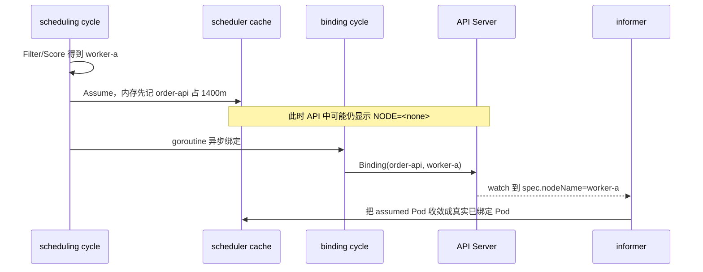

#### 运维现场小案例：API 只能看见窗口两端，看不见中间的 Assume

- **现象：** `order-api` 选点后短暂停留在 `NODE=<none>`，随后才变成 `worker-a`。
- **只读命令：** `kubectl get pod -n prod order-api-new-7f8d9 -w -o custom-columns='NAME:.metadata.name,NODE:.spec.nodeName,SCHEDULED:.status.conditions[?(@.type=="PodScheduled")].status,REASON:.status.conditions[?(@.type=="PodScheduled")].reason'`
- **关键输出（教学示意）：** 同一 Pod 先显示 `NODE=<none>`，之后显示 `NODE=worker-a`、`SCHEDULED=True`。
- **能证明：** API 中 `spec.nodeName` 从空到持久化值的责任交接；后续 kubelet 才能按该 Node 接手。
- **不能证明：** watch 看不到内存里的 `SuggestedHost`、Assume、Reserve 各自何时发生，也不能用轮询间隔精确测 binding 延迟。
- **源码映射：** `pkg/scheduler/schedule_one.go` 的 `assumeAndReserve`/`runBindingCycle`，以及 `pkg/scheduler/backend/cache/cache.go` 的 `AssumePod`。

### 11.2 第三组真实源码：Assume 与 Reserve 如何形成可回滚事务

这段只回答：为什么先 Assume，Reserve 失败后又怎样清理。

**摘录类型：完整函数。** 来自 `pkg/scheduler/schedule_one.go:313-359` 的 `assumeAndReserve`。中文注释为讲义新增。`podInfo` 是未绑定的队列对象；`scheduleResult.SuggestedHost` 是上一步选出的 Node。

```go
func (sched *Scheduler) assumeAndReserve(
	ctx context.Context,
	state fwk.CycleState,
	schedFramework framework.Framework,
	podInfo *framework.QueuedPodInfo,
	scheduleResult ScheduleResult,
) (*framework.QueuedPodInfo, *fwk.Status) {
	// 从 context 提取结构化 logger，后续错误能关联本轮上下文。
	logger := klog.FromContext(ctx)

	// DeepCopy，避免直接篡改来自队列/informer 视图的原 Pod。
	assumedPodInfo := podInfo.DeepCopy()
	assumedPod := assumedPodInfo.Pod

	// assume 会在内存副本写 NodeName，并把 Pod 加入 scheduler cache。
	err := sched.assume(logger, state, assumedPodInfo, scheduleResult.SuggestedHost)
	if err != nil {
		// Assume 失败按内部 Error 返回，让失败处理决定是否重试。
		return assumedPodInfo, fwk.AsStatus(err)
	}

	// 通知所有 Reserve 插件为这个 Pod/Node 预留自己的状态。
	if sts := schedFramework.RunReservePluginsReserve(
		ctx,
		state,
		assumedPod,
		scheduleResult.SuggestedHost,
	); !sts.IsSuccess() {
		// Reserve 失败必须先撤销插件预留，再从 scheduler cache 忘掉 assumed Pod。
		err := sched.unreserveAndForget(
			ctx,
			state,
			schedFramework,
			assumedPodInfo,
			scheduleResult.SuggestedHost,
		)
		if err != nil {
			// Forget 失败被记录；原 Reserve Status 仍决定本轮结果。
			utilruntime.HandleErrorWithContext(ctx, err, "ForgetPod failed")
		}

		if sts.IsRejected() {
			// 业务拒绝被包装成 FitError，记录拒绝插件和目标 Node。
			fitErr := &framework.FitError{
				// Reserve 已经针对唯一建议节点执行，所以这里只诊断一台节点。
				NumAllNodes: 1,
				// 保留原始未绑定 Pod，供上层生成失败诊断。
				Pod:         podInfo.Pod,
				// Diagnosis 收集目标节点的插件拒绝状态。
				Diagnosis: framework.Diagnosis{
					// 先创建节点到状态的可写映射。
					NodeToStatus: framework.NewDefaultNodeToStatus(),
				},
			}
			// 把 Reserve 拒绝挂到实际建议节点上。
			fitErr.Diagnosis.NodeToStatus.Set(scheduleResult.SuggestedHost, sts)
			fitErr.Diagnosis.AddPluginStatus(sts)
			return assumedPodInfo, fwk.NewStatus(sts.Code()).WithError(fitErr)
		}

		// 内部 Error 等非 rejected 状态原样返回。
		return assumedPodInfo, sts
	}

	// Assume 与全部 Reserve 都成功，交给 Permit 和 binding cycle。
	return assumedPodInfo, nil
}
```

**大白话总结：**

- 输入：一个未绑定 Pod 和已选中的 SuggestedHost。
- 判断：scheduler cache 能否 Assume；所有 Reserve 插件能否成功。
- 动作：成功就保留内存占账；失败就 Unreserve 并 Forget。
- 结果：为异步 Bind 建立了一份必须能撤销的临时资源承诺。

**顺手学 Go：**

- `(sched *Scheduler)` 是 pointer receiver，可暂时类比 Java 的 `this`，但 Go 没有 class 继承语义。
- `if sts := call(); !sts.IsSuccess()` 把 `sts` 的作用域限制在该 if/else 内。
- `*framework.QueuedPodInfo` 是指针；`DeepCopy()` 用新对象隔离修改。
- `nil` 在这里按返回位置理解：第二个返回值 `nil` 表示没有失败 Status，不是“对象不存在”。

#### 运维现场小案例：Reserve 插件拒绝后，为什么 Node 不能一直少 1400m

- **现象：** 自定义资源 Reserve 返回拒绝，`order-api` 未绑定；下一只 Pod 仍应能重新使用刚才的通用容量。
- **只读命令：** `kubectl get pod -n prod order-api-new-7f8d9 -o wide`; `kubectl logs -n kube-system -l component=kube-scheduler --since=10m --timestamps --prefix | Select-String 'order-api-new-7f8d9|Reserve|Unreserve|ForgetPod'`
- **关键输出（教学示意）：** `NODE=<none>`，受控高日志级别显示 Reserve 失败后进入 Unreserve/Forget 相关路径。
- **能证明：** API 未绑定；若日志完整，还能定位原始 Reserve 拒绝及随后补偿发生的时间关系。
- **不能证明：** `kubectl describe node` 不直接展示 assumed 账；缺少插件日志时不能仅凭容量恢复断言所有插件私有状态都已正确清理。
- **源码映射：** `pkg/scheduler/schedule_one.go` 的 `assumeAndReserve`、`unreserveAndForget`。

### 11.3 Assume 和 Reserve 不是同一件事

| 动作 | 谁维护 | 记的什么账 |
|---|---|---|
| `AssumePod` | scheduler cache | 这个 Pod 已暂时占用目标 Node 的通用 Pod/资源账 |
| `Reserve` | 各 Framework 插件 | 插件自己的预留，例如卷或动态资源内部状态 |
| `Unreserve` | 各 Reserve 插件 | 逆序、幂等地撤销插件状态 |
| `ForgetPod` | scheduler cache | 删除 assumed Pod，释放 NodeInfo 中的通用资源占用 |

Framework 契约要求 `Unreserve` 幂等，甚至可能在对应 Reserve 没有执行时被调用。它没有 error 返回值；插件必须自行处理清理中的问题，不能指望再用一个 Status 把已经开始的回滚逆转。

#### 运维现场小案例：节点通用账恢复了，PVC 选择为什么还要单独核对

- **现象：** 绑定失败后 CPU 余额恢复，但使用 WFFC 的 PVC 仍保留需要调查的卷对象状态。
- **只读命令：** `kubectl get pod -n prod order-api-new-7f8d9 -o wide`; `kubectl get pvc -n prod -o yaml`; `kubectl get pv -o wide`
- **关键输出（教学示意）：** Pod 没有 `nodeName`；PVC/PV 展示的是卷控制面事实，而不是 scheduler 通用 NodeInfo CPU 账。
- **能证明：** API 中 Pod 与卷对象当前各自处于什么状态，提醒值班人不要把“Forget 通用占账”误当成“所有插件状态都已撤销”。
- **不能证明：** kubectl 无法直接观察 `Unreserve` 是否被逆序调用或是否幂等；这需要源码、插件指标/日志或受控测试。
- **源码映射：** `pkg/scheduler/framework/runtime/framework.go` 的 `RunReservePluginsUnreserve` 负责插件清理，`pkg/scheduler/backend/cache/cache.go` 的 `ForgetPod` 负责通用账。

### 11.4 Permit 的三种回答

Permit 位于选好 Node、Reserve 成功之后，Bind 之前：

```text
Success：允许继续
Wait：进入 waitingPods，等插件 Allow、Reject 或超时
Reject/Error：Unreserve + Forget，回到失败处理
```

Wait 适合表达“单个 Pod 已选好位置，但必须等一个协调条件”。例如 gang 或外部资源协调可以使用它。不过当前源码中的原生 GangScheduling 仍是 alpha、默认关闭；不能因此假定所有集群的普通 Pod 都会走 Permit Wait。

当前固定 commit 的 Permit 等待时长有框架上限，属于版本实现细节。生产上真正要关注的是：谁在等、由哪个插件放行、超时后是否回滚，而不是死背分钟数。

#### 运维现场小案例：自定义 gang profile 的 Pod 选好位置后仍不 Bind

- **现象：** `train-a100` 使用自定义 schedulerName，Permit 插件等待同组成员到齐；API 中 `nodeName` 仍为空。
- **只读命令：** `kubectl get pod -n ml train-a100 -o jsonpath='scheduler={.spec.schedulerName}{" node="}{.spec.nodeName}{" nominated="}{.status.nominatedNodeName}{"\n"}'`; `kubectl logs -n kube-system -l component=kube-scheduler --since=10m --prefix | Select-String 'train-a100|Permit|waiting|reject|timeout'`
- **关键输出（教学示意）：** `scheduler=gpu-gang-scheduler node=`，插件日志明确记录 Permit Wait，稍后才 Allow 或 timeout。
- **能证明：** 只有在实际自定义 profile 日志明确时，才能把这次空 `nodeName` 定位为 Permit 等待而非普通 Filter 失败。
- **不能证明：** 普通默认 Pod 的空 `nodeName` 不代表 Permit Wait；本提交原生 GangScheduling 默认关闭，也不能靠 nomination 代替等待证据。
- **源码映射：** `pkg/scheduler/framework/runtime/framework.go` 的 `RunPermitPlugins`、`WaitOnPermit` 与 waitingPods；失败后回到 `pkg/scheduler/schedule_one.go` 的 `unreserveAndForget`。

### 11.5 Bind 最终写了什么

默认 `DefaultBinder` 构造 `v1.Binding`：

**摘录类型：连续摘录。** 来自 `pkg/scheduler/framework/plugins/defaultbinder/default_binder.go:53-56`；下面保留 Binding 对象的完整构造，随后真正的 API 调用和错误分支用文字解释。

```go
// Binding 同时写入 Pod 身份和目标 Node；后续会提交给 API Server。
binding := &v1.Binding{
	// ObjectMeta 精确标识要绑定的那个 Pod 对象。
	ObjectMeta: metav1.ObjectMeta{
		// 命名空间与名称定位 Pod；UID 防止同名新对象被误绑定。
		Namespace: p.Namespace,
		Name:      p.Name,
		UID:       p.UID,
	},
	// Target 只描述本轮已经选中的 Node。
	Target: v1.ObjectReference{
		Kind: "Node",
		Name: nodeName,
	},
}
```

**大白话总结：** Binding 明确携带 Pod 身份和目标 Node。API Server 接受后，最终效果是 Pod `spec.nodeName` 持久化；它不是 scheduler 直接 SSH 到节点通知 kubelet。

**顺手学 Go：** `&v1.Binding{}` 取得新 struct 的指针；嵌套 `{}` 是复合字面量，不是 JSON。

当前源码的 Bind 优先级是 extender binder 在前，Framework Bind 插件在后。平台使用 extender 时必须知道真正执行 Binding 的到底是谁。

#### 运维现场小案例：`Scheduled` 只证明写入 Node，不证明应用已经启动

- **现象：** `order-api` 出现 Normal `Scheduled`，但容器仍在 `ContainerCreating`。
- **只读命令：** `kubectl get pod -n prod order-api-new-7f8d9 -o jsonpath='uid={.metadata.uid}{" node="}{.spec.nodeName}{" phase="}{.status.phase}{"\n"}'`; `kubectl get events -n prod --field-selector involvedObject.name=order-api-new-7f8d9 --sort-by='.metadata.creationTimestamp'`
- **关键输出（教学示意）：** `node=worker-a phase=Pending`，Event 先有 `Scheduled`，后续可能是 `FailedMount` 或 `Pulling`。
- **能证明：** Binding 已使 API 中 `spec.nodeName` 持久化，普通 scheduler 选点责任完成。
- **不能证明：** 不证明 Sandbox、卷挂载、镜像拉取、GPU Allocate 或 readiness 已成功；这些属于节点兑现链。
- **源码映射：** `pkg/scheduler/framework/plugins/defaultbinder/default_binder.go` 的 `Bind` 构造 `v1.Binding` 并调用 Binding 子资源。

### 11.6 绑定失败为什么还要唤醒其他 Pod

假设 Pod A 已 Assume 了最后 `1400m` 余额，异步 Bind 很慢。这期间 Pod B 开始调度，它看到 A 的 assumed 账后因资源不足进入等待。随后 A Bind 失败：

```text
A: Unreserve + Forget，释放 1400m
B: 如果完全不知道这次释放，就可能继续睡在 unschedulablePods
```

所以 `handleBindingCycleError` 在 Forget 后产生 scheduler 内部的 `EventAssignedPodDelete`，让可能因此获益的 Pod 重新评估。

这仍然不是 Kubernetes Event 对象，而是 scheduler 内部 ClusterEvent。

#### 运维现场小案例：A 绑定失败后，B 为什么突然又被尝试

- **现象：** A 曾 Assume `worker-a` 最后 1400m，B 因 CPU 不足等待；A Bind 失败后，B 很快再次进入调度。
- **只读命令：** `kubectl logs -n kube-system -l component=kube-scheduler --since=10m --timestamps --prefix | Select-String 'pod-a|pod-b|Binding|Forget|FailedScheduling'`; `kubectl get pods -n prod pod-a pod-b -o wide`
- **关键输出（教学示意）：** A 的 binding error/清理在前，B 的新调度尝试或成功绑定在后。
- **能证明：** 在完整日志下可建立“失败释放临时账—另一 Pod 重新尝试”的时间线，与补偿唤醒设计一致。
- **不能证明：** `EventAssignedPodDelete` 是 scheduler 内部 ClusterEvent，`kubectl get events` 不会直接显示这个名字；时间相邻也不是单独的因果证明。
- **源码映射：** `pkg/scheduler/schedule_one.go` 的 `handleBindingCycleError` 在 Forget 后调用 `MoveAllToActiveOrBackoffQueue(EventAssignedPodDelete, ...)`。

### 11.7 `Done`、`Forget`、`Unreserve` 再对照一次

| 动作 | 清理什么 | 不清理什么 |
|---|---|---|
| `Done(uid)` | 队列的 in-flight Pod 与事件历史 | scheduler cache 资源、API Pod |
| `ForgetPod` | scheduler cache 中 assumed Pod 的 Node/资源账 | 插件自有预留、API Pod |
| `Unreserve` | Reserve 插件维护的自有状态 | 通用 NodeInfo、API Pod |

如果你能准确解释这张表，就已经抓住异步 Binding 最容易出错的地方。

#### 运维现场小案例：看到 Pod 又入队，先问漏清了哪一本账

- **现象：** 自定义 Reserve 失败后同一 Pod 重试，平台怀疑出现“幽灵占用”或重复 in-flight 记录。
- **只读命令：** `$podKey='prod/order-api-new-7f8d9'; $uid=kubectl get pod -n prod order-api-new-7f8d9 -o jsonpath='{.metadata.uid}'; kubectl logs -n kube-system -l component=kube-scheduler --since=15m --tail=-1 --prefix | Select-String -SimpleMatch $podKey; kubectl get events -n prod --field-selector "involvedObject.uid=$uid" --sort-by='.metadata.creationTimestamp'; kubectl get pod -n prod order-api-new-7f8d9 -o wide`
- **关键输出（教学示意）：** API 只给最终 nodeName/Condition，详细日志可能分别出现 queue completion、plugin rollback、cache forget 线索。
- **能证明：** `namespace/name` 日志、UID Event 与最终 API 状态在同一时间窗互相印证时，可判断应该深入队列、插件还是 cache；UID 负责对象身份，不能替代日志实际打印的键。
- **不能证明：** kubectl 没有 `Done/Forget/Unreserve` 状态字段；只有源码或可观测性明确记录时，才能断言具体哪个清理漏掉。
- **源码映射：** `pkg/scheduler/backend/queue/scheduling_queue.go:PriorityQueue.Done`、`pkg/scheduler/backend/cache/cache.go:ForgetPod`、`pkg/scheduler/framework/runtime/framework.go:RunReservePluginsUnreserve` 三个独立符号。

---

## 12. 失败之后：为什么 Pod 不空转，却也不会永远睡死

### 12.1 正常拒绝、内部错误、等待和 no-op

| 结果 | 例子 | scheduler 大方向 | 运维动作 |
|---|---|---|---|
| 正常 no-op/等待 | 没有相关 Node 变化 | 留在不可调度池，不白算 | 等事实变化，治理根因 |
| 业务拒绝 | `Insufficient cpu`、label 不匹配 | 记录拒绝插件，按事件和退避重试 | 手算约束与容量 |
| 内部 Error | snapshot、插件、API/网络异常 | 不把它伪装成资源不足，退避后重试 | 查 scheduler 日志/指标/依赖 |
| Permit Wait | 协调条件暂未满足 | 保留临时状态，等 Allow/Reject/timeout | 查等待插件与外部控制面 |
| 补偿 | Reserve/Bind 后续失败 | Unreserve + Forget + 必要的唤醒 | 查原始错误与清理是否成功 |

#### 运维现场小案例：两条 FailedScheduling，为什么一个扩容、一个查插件

- **现象：** Pod-A message 为 `Insufficient cpu`；Pod-B 的 PodScheduled reason 为 `SchedulerError`。
- **只读命令：** `kubectl get pods -n prod -o jsonpath='{range .items[*]}{.metadata.name}{" node="}{.spec.nodeName}{range .status.conditions[?(@.type=="PodScheduled")]}{" scheduled="}{.status}{" reason="}{.reason}{" message="}{.message}{end}{"\n"}{end}'`; `kubectl logs -n kube-system -l component=kube-scheduler --since=10m --prefix | Select-String 'SchedulerError|pod-b|error'`
- **关键输出（教学示意）：** A 是 `Unschedulable/Insufficient cpu`；B 是 `SchedulerError` 且日志指向自定义插件或 snapshot 失败。
- **能证明：** API 当前汇总状态与日志可把业务拒绝和内部错误分到不同处置方向。
- **不能证明：** Event reason 常同为 `FailedScheduling`，不能只按它自动扩容；Permit Wait 和内部补偿还需要对应插件/阶段证据。
- **源码映射：** `pkg/scheduler/schedule_one.go` 的 `handleSchedulingFailure` 根据 `status.IsRejected()` 选择 `PodReasonUnschedulable` 或 `PodReasonSchedulerError`。

### 12.2 FailureHandler 为什么重新查最新 Pod

调度失败到真正重排之间，API 对象可能已经变化：

- Pod 被删除；
- 同名 Pod 已重建但 UID 不同；
- 另一个组件或 extender 已经成功绑定；
- Pod spec 被更新。

因此当前源码的 `handleSchedulingFailure` 会从 informer lister 重新取最新 Pod：

```text
缓存中已不存在
  -> 不重排旧对象

最新 Pod 已有 spec.nodeName
  -> 可能其实已经绑定，不重排

同名但 UID 不同
  -> 旧对象已经死亡，不把失败状态写到新 Pod

仍是同一个未绑定 Pod
  -> DeepCopy 最新对象后重新入队
```

这是分布式系统里很典型的身份保护：名字可复用，UID 才标识这个具体对象实例。

#### 运维现场小案例：同名 Pod 已重建，旧失败不能写到新对象上

- **现象：** Deployment 快速重建了 `order-api-new-7f8d9`，告警仍引用旧 Pod 的 FailedScheduling。
- **只读命令：** `$IncidentUID='<告警中保存的旧UID>'; kubectl get pod -n prod order-api-new-7f8d9 -o jsonpath='currentUID={.metadata.uid}{" rv="}{.metadata.resourceVersion}{" node="}{.spec.nodeName}{"\n"}'; "incidentUID=$IncidentUID"`
- **关键输出（教学示意）：** `incidentUID=111...`，`currentUID=222...`；名称相同但对象实例不同。
- **能证明：** 当前 Pod 的 UID/resourceVersion/nodeName，并能确认历史证据是否属于同一个对象实例。
- **不能证明：** 这条 API 查询不能直接证明 FailureHandler 当时执行了哪一个分支；需要 scheduler 日志或源码来确认重排决策。
- **源码映射：** `pkg/scheduler/schedule_one.go` 的 `handleSchedulingFailure` 重新 lister.Get，并比较 UID 与最新 `spec.nodeName`。

### 12.3 失败重入队时如何避免错过事件

最危险的时序是：

```text
T1 Pod 从 activeQ Pop，开始用 snapshot 计算
T2 worker-a 上旧 Pod 删除，释放 1000m
T3 当前调度仍基于旧视图得出 Insufficient cpu
T4 如果只把新 Pod放入 unschedulablePods，而 T2 事件已经过去，它可能错过唤醒
```

in-flight event 账的作用，就是给每个已 Pop Pod 保存“从我开始调度之后发生过哪些变化”。失败落队时会补看这些变化，再决定去 activeQ、backoffQ 还是 unschedulablePods。

这张图按时间从上往下读。虚线是对象变化通知，实线是调度控制流。

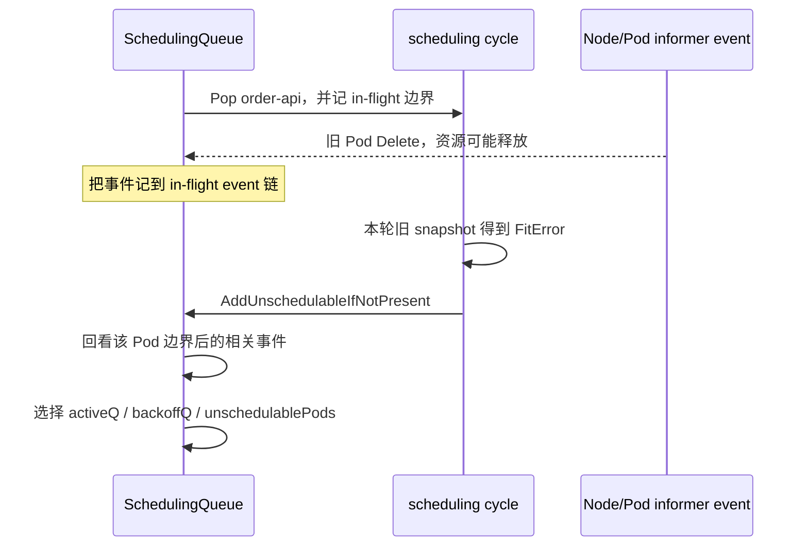

#### 运维现场小案例：资源删除发生在调度中间，为什么下一轮没有睡死

- **现象：** `worker-a` 的旧 Pod 在 `order-api` 本轮计算期间被删除，本轮仍失败，但很快又发生一次尝试。
- **只读命令：** `kubectl get events -n prod --sort-by='.metadata.creationTimestamp' -o custom-columns='TIME:.metadata.creationTimestamp,OBJ:.involvedObject.name,REASON:.reason,COUNT:.count,MESSAGE:.message' | Select-Object -Last 40`; `kubectl logs -n kube-system -l component=kube-scheduler --since=10m --timestamps --prefix | Select-String 'order-api-new|Checking events for in-flight pod'`
- **关键输出（教学示意）：** 删除/失败/重试在时间线上交错；V(5) 日志可能显示检查 in-flight events。
- **能证明：** 有完整日志时可确认调度器为该 in-flight Pod 回看了调度期间发生的事件。
- **不能证明：** Kubernetes Event 可能聚合、限流，单靠 Event 时间不能精确重建 `Pop` 边界或内部 queue transition。
- **源码映射：** `pkg/scheduler/backend/queue/active_queue.go` 的 `inFlightPods/inFlightEvents`，以及 `scheduling_queue.go:AddUnschedulableIfNotPresent` 的回看路径。

### 12.4 QueueingHint 为什么问“上轮谁拒绝”

本案的拒绝插件集合可能有：

```text
worker-a -> NodeResourcesFit
worker-b -> NodeAffinity
worker-c -> TaintToleration
```

如果 `worker-a` 上一个已绑定 Pod 删除，NodeResourcesFit 可以判断它可能释放 request；这值得唤醒。本案若只是某个无关 Secret 更新，则上述插件通常没有理由认为结果会改变。

QueueingHint 是“值得重算”的提示，不是“保证下一次成功”。释放 `500m` 也可能触发重试，但本 Pod 仍需要 `1400m`，下一轮照样失败。

#### 运维现场小案例：删 Secret 没动静，释放 CPU 后却重新尝试

- **现象：** `order-api` 上轮被 `NodeResourcesFit` 拒绝；无关 Secret 更新未改变结果，节点上已绑定 Pod 删除后出现重试。
- **只读命令：** `kubectl get events -n prod --sort-by='.metadata.creationTimestamp' | Select-Object -Last 40`; `kubectl logs -n kube-system -l component=kube-scheduler --since=10m --prefix | Select-String 'order-api-new|QueueingHint|NodeResourcesFit'`
- **关键输出（教学示意）：** 高日志级别下，NodeResourcesFit 对资源相关事件给出值得 Queue 的线索；无关对象没有同类证据。
- **能证明：** 日志明确记录时，可确认哪个上轮 rejector 对哪个 ClusterEvent 参与了 QueueingHint 判断。
- **不能证明：** 被 Queue 只代表值得重算，不保证资源已足够；普通 kubectl 也看不到完整的内部 Queue/QueueSkip 结果。
- **源码映射：** `pkg/scheduler/backend/queue/scheduling_queue.go` 的 `isPodWorthRequeuing` 只调用 `UnschedulablePlugins/PendingPlugins` 中相关插件的 hint。

### 12.5 backoff 解决吞吐，不解决根因

当前默认值大致形成：

```text
1s -> 2s -> 4s -> 8s -> 10s -> 10s ...
```

它防止同一个失败 Pod 不断压住新工作。调大 backoff 不会创造 CPU/GPU，调小也不会解决 label、taint 或 PVC 根因。

`scheduler_pending_pods{queue="backoff"}` 很高说明大量 Pod 在退避，但不能仅靠这个指标知道每个 Pod 的失败原因。

#### 运维现场小案例：失败间隔在变长，为什么不能据此断言是固定 1/2/4 秒

- **现象：** 同一个 `order-api` 多次失败，Event 的 count 增长但不再高频刷屏。
- **只读命令：** `kubectl get events -n prod --field-selector involvedObject.name=order-api-new-7f8d9 --sort-by='.metadata.creationTimestamp' -o custom-columns='FIRST:.firstTimestamp,LAST:.lastTimestamp,COUNT:.count,REASON:.reason,MESSAGE:.message'`; `kubectl logs -n kube-system -l component=kube-scheduler --since=15m --timestamps --prefix | Select-String 'order-api-new-7f8d9'`
- **关键输出（教学示意）：** 聚合 Event 只显示 `COUNT` 与时间范围；完整日志才可能看到多次 attempt 的实际时间点。
- **能证明：** Pod 确实重复失败且被 Event 聚合，日志时间可用于观察现场节奏。
- **不能证明：** Event 聚合值不能反推出每次精确 backoff；实际初始/上限值还可能被组件配置覆盖，且事件唤醒会影响观察间隔。
- **源码映射：** `pkg/scheduler/backend/queue/backoff_queue.go` 的 `getBackoffTime`、`calculateBackoffDuration`。

### 12.6 FailedScheduling Event 与 PodScheduled Condition 谁先证明什么

当前失败处理会尝试：

- 写 Warning Event，reason 通常为 `FailedScheduling`；
- 更新 `PodScheduled=False` Condition；
- 根据结果写 `Unschedulable` 或 `SchedulerError` reason；
- 必要时更新 nomination。

证据边界：

- Event 文本是版本相关表现，可能聚合和限流；
- 一条 Event 是某次观察，不是完整历史；
- Condition 是 API 中当前汇总状态，也可能短暂落后于内存队列；
- `NODE=<none>` 只证明 API 中尚无持久 `spec.nodeName`；
- scheduler 日志和 metrics 才能进一步区分内部 Error、插件延迟和系统性队列压力。

#### 运维现场小案例：告警系统只采 Event，为什么会把旧原因当成当前状态

- **现象：** 历史 Event 仍有 `Insufficient cpu`，但 Pod 当前已绑定；另一只 Pod 的 Condition 仍是 `SchedulerError`。
- **只读命令：** `kubectl get pod -n prod order-api-new-7f8d9 -o jsonpath='node={.spec.nodeName}{range .status.conditions[?(@.type=="PodScheduled")]}{" status="}{.status}{" reason="}{.reason}{" updated="}{.lastTransitionTime}{end}{"\n"}'`; `kubectl get events -n prod --field-selector involvedObject.name=order-api-new-7f8d9 --sort-by='.metadata.creationTimestamp'`
- **关键输出（教学示意）：** 当前 `node=worker-a status=True`，Event 列表仍保留或聚合过往失败观察。
- **能证明：** Condition/nodeName 给当前 API 汇总，Event 给离散历史观察；两者必须按时间和对象 UID一起读。
- **不能证明：** Condition 也可能短暂落后于 scheduler 内存；Event 不保证完整、严格有序或永久保留。
- **源码映射：** `pkg/scheduler/schedule_one.go` 的 `handleSchedulingFailure` 既记录 Warning `FailedScheduling`，也更新 `PodScheduled=False` Condition。

### 12.7 返回值传播卡

```text
Filter 返回 Unschedulable
  -> Diagnosis 记录 Node 与 rejector plugin
  -> 0 个可行 Node 时组装 FitError
  -> schedulingAlgorithm 返回 rejected Status
  -> FailureHandler 记录插件集合并重排
  -> QueueingHint 用插件集合筛选有用事件
```

```text
Filter / Score / Snapshot 返回内部 Error
  -> fwk.AsStatus(error)
  -> FailureHandler 不把它记成普通资源拒绝
  -> ConsecutiveErrorsCount 增加
  -> backoff 后重试
```

```text
PostFilter 自身 Error
  -> 当前固定提交记录日志与 PostFilterMsg
  -> 外层仍以原 FitError 的 Unschedulable 结果返回
  -> 不能笼统说所有内部 error 都原样传到 worker
```

#### 运维现场小案例：同样 NODE 为空，沿 Status 传播找不同责任方

- **现象：** A 是 `Unschedulable`，B 是 `SchedulerError`，C 有 nomination 但当前轮仍失败。
- **只读命令：** `kubectl get pods -n prod -o jsonpath='{range .items[*]}{.metadata.name}{" node="}{.spec.nodeName}{" nominated="}{.status.nominatedNodeName}{range .status.conditions[?(@.type=="PodScheduled")]}{" reason="}{.reason}{" message="}{.message}{end}{"\n"}{end}'`; `kubectl logs -n kube-system -l component=kube-scheduler --since=10m --prefix | Select-String 'PostFilter|SchedulerError|order-api'`
- **关键输出（教学示意）：** API 分类显示业务拒绝、内部错误和 nomination；日志补足具体插件/阶段。
- **能证明：** 能先按当前 API 状态把排障分流，再用日志定位是 Filter/Score/基础设施还是 PostFilter 旁支。
- **不能证明：** Condition message 不是稳定机器接口；尤其 PostFilter Error 在本提交会被记录，却仍以原 FitError/Unschedulable 向外返回。
- **源码映射：** `pkg/scheduler/schedule_one.go` 的 `schedulingAlgorithm`/`handleSchedulingFailure`、`pkg/scheduler/framework/runtime/framework.go:RunPostFilterPlugins`、`pkg/scheduler/backend/queue/scheduling_queue.go:AddUnschedulableIfNotPresent`。

---
## 13. 优先级与抢占：不是“高优先级 Pod 直接把低优先级 Pod 踢掉”

### 13.1 先把两个概念拆开

`PriorityClass` 同时会影响两个不同阶段：

1. **排队次序**：默认 `PrioritySort` 让更高优先级的 Pod 更早被调度；
2. **抢占资格**：如果高优先级 Pod 正常 Filter 后一个节点也放不下，`DefaultPreemption` 才可能在 PostFilter 阶段尝试寻找受害者。

所以“优先”不等于“必定抢占”，“被提名”也不等于“已经绑定”。

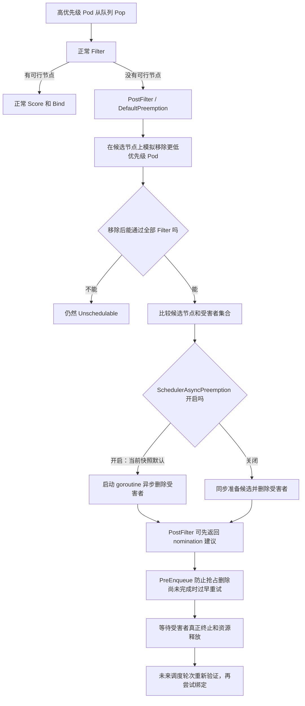

#### 运维现场小案例：高优先级先排队，不等于已经抢占

- **背景：** 案例 B 的 `prod/pay-api-recovery` 优先级为 `100000`，但仍 Pending；值班同学看到“高优先级”就判断 scheduler 会立刻删低优先级 Pod。
- **只读命令：**
  ```powershell
  kubectl get pod -n prod pay-api-recovery -o custom-columns='NAME:.metadata.name,PRI:.spec.priority,NODE:.spec.nodeName,NOMINATED:.status.nominatedNodeName'
  kubectl get events -n prod --field-selector involvedObject.name=pay-api-recovery --sort-by='.metadata.creationTimestamp'
  ```
- **示例证据（教学示意）：** `PRI=100000`、`NODE=<none>`、`NOMINATED=<none>`，Event 只说明本轮不可调度。
- **能证明：** API 中的最终优先级、尚未绑定状态，以及 Pod 至少经历过一次调度观察。
- **不能证明/时间边界：** 静态快照不能还原精确排队次序，也不能证明抢占已经开始；Event 文本会随版本变化。
- **修复/安全边界：** 先找硬约束；不要把“再建更大 PriorityClass”当容量修复，更不要先删所谓受害者。
- **源码/组件映射：** `queuesort.PrioritySort.Less` 决定排队次序；`defaultpreemption.PostFilter` 只在正常 Filter 无解后尝试抢占。

### 13.2 抢占内部到底模拟了什么

当前固定源码中，主入口可从下面几处串起来：

- `pkg/scheduler/framework/plugins/defaultpreemption/default_preemption.go`：`PostFilter`、`SelectVictimsOnNode`；
- `pkg/scheduler/framework/preemption/preemption.go`：`Evaluator.Preempt`、`DryRunPreemption`；
- `pkg/scheduler/framework/preemption/executor.go`：准备并执行对受害者的删除；
- `pkg/scheduler/framework/plugins/defaultpreemption/default_preemption.go`：候选节点排序函数。

大白话步骤是：

1. 先拿一个候选节点的 `NodeInfo` 副本；
2. 找出节点上比待调度 Pod 优先级低的 Pod；
3. 先在模拟账本中把这些潜在受害者移走；
4. 再把能保留的受害者尽量一个个加回来；
5. 每加回一个都重新跑必要的 Filter；
6. 最终留下“为了让高优先级 Pod 能放下，不得不移除”的最小化受害者集合；
7. 对多个候选节点的受害方案再排序；
8. 选中方案后才进入真实删除与 nomination。

当前固定提交中，`SchedulerAsyncPreemption` 已是 Beta 且默认开启：选中候选后，受害者删除工作由独立 goroutine 推进，PostFilter 不必等全部删除 API 调用结束才返回 nomination 建议；`DefaultPreemption.PreEnqueue` 会结合 executor 的进行中状态，避免 preemptor 在异步删除未完成时过早反复调度。关闭该特性时则走同步候选准备路径。这里是明确的版本分支，不应拿当前默认行为描述所有 Kubernetes 版本。

这里的“最小化”不是一句简单的“数量最少”。默认候选比较还会关心 PDB 违反情况、最高受害者优先级、受害者优先级总和、数量等维度。当前 `DefaultPreemption.OrderedScoreFuncs` 没有追加插件自定义函数，默认通用六级比较落在 preemption 包的 `pickOneNodeForPreemption`；实现和排序细节是版本相关事实，升级时两处都要核对。

#### 运维现场小案例：6 核恢复 Pod 如何挑受害者

- **背景：** 案例 B 的教学变体中，`pay-api-recovery` 需要 6 核，`worker-a` 上两个低优先级报表 Pod 各占 3 核；业务问“scheduler 是不是随便删一个”。
- **只读命令：**
  ```powershell
  kubectl get pod -n prod pay-api-recovery -o custom-columns='NODE:.spec.nodeName,NOMINATED:.status.nominatedNodeName,PRI:.spec.priority'
  kubectl get pods -A --field-selector spec.nodeName=worker-a -o custom-columns='NS:.metadata.namespace,NAME:.metadata.name,PRI:.spec.priority,DELETING:.metadata.deletionTimestamp'
  ```
- **示例证据（教学示意）：** preemptor 提名 `worker-a`；只有最终受害者出现 `deletionTimestamp`。
- **能证明：** API 中真实 nomination 和真实删除分别推进到哪一步。
- **不能证明/时间边界：** API 列表看不到全部 dry-run 候选、被加回的 Pod 和候选排序；这些只能靠受控日志、trace 或测试断言补证。
- **修复/安全边界：** 等受害者正常退出；强删会越过优雅终止和数据安全，不能当常规“加速”。
- **源码/组件映射：** `DefaultPreemption.SelectVictimsOnNode` 做移除/加回模拟，`preemption.DryRunPreemption` 比候选，`framework/preemption/executor.go` 才执行删除。

### 13.3 PDB 是重要约束，但不能把它误解成绝对保险

抢占在挑选受害者时会尽量优先选择不违反 `PodDisruptionBudget` 的方案。然而，PDB 在调度抢占里是“尽力遵守”的重要信号，不是任何条件下都不会越过的物理墙。

运维上应这样理解：

- PDB 描述应用可容忍的自愿中断预算；
- 节点内挑受害者时，会先尝试把可能违反 PDB 的 Pod 加回模拟节点、尽量避免选它们；跨候选节点比较时优先选择 PDB 违反数更少的方案；
- 如果所有可行抢占方案都要违反 PDB，调度器仍可能选择违反数更少的方案；
- PDB 也挡不住节点故障、内核崩溃等非自愿中断；
- 业务真正的高可用还需要足够副本、反亲和或拓扑分散、优雅终止和容量余量。

#### 运维现场小案例：PDB 为零余额仍不是绝对防火墙

- **背景：** 案例 B 的低优先级报表服务有 3 个健康副本，PDB `minAvailable=3`；团队误以为 `disruptionsAllowed=0` 能保证它绝不成为抢占受害者。
- **只读命令：**
  ```powershell
  kubectl get pdb -n prod report-api -o custom-columns='DESIRED:.status.desiredHealthy,CURRENT:.status.currentHealthy,ALLOWED:.status.disruptionsAllowed'
  kubectl get pods -n prod -l app=report-api -o custom-columns='NAME:.metadata.name,PRI:.spec.priority,NODE:.spec.nodeName,DELETING:.metadata.deletionTimestamp'
  ```
- **示例证据（教学示意）：** `DESIRED=3 CURRENT=3 ALLOWED=0`，只表示采样时没有可接受的自愿中断余额。
- **能证明：** 当前 PDB selector 计算出的健康数与预算。
- **不能证明/时间边界：** 不能推出节点故障不会中断，也不能推出 DefaultPreemption 永远不会选违反数较少的方案。
- **修复/安全边界：** 高可用还要靠副本、跨域分散和容量；不要为消除 Pending 临时删除 PDB。
- **源码/组件映射：** `filterPodsWithPDBViolation` 区分候选；`preemption.pickOneNodeForPreemption` 优先较少 PDB 违反，而不是封死所有违反方案。

### 13.4 `nominatedNodeName` 只是预约提示

假设高优先级 Pod `pay-api-0` 抢占后被提名到 `worker-a`：

```text
status.nominatedNodeName = worker-a
spec.nodeName           = ""
```

这时含义是：调度器认为 `worker-a` 是一个潜在落点，并已经开始为它清理条件。它还没有真正绑定，原因可能包括：

- 受害 Pod 仍在 `terminationGracePeriodSeconds` 中；
- 节点状态又变了；
- 另一台节点后来更合适；
- 新的高优先级 Pod 竞争同一资源；
- 卷、亲和、动态资源等约束重新计算后不再满足；
- 被提名 Pod 自己被删除或更新。

因此排障时必须同时看 `spec.nodeName` 与 `status.nominatedNodeName`，不能只看后者就宣布“已经调度成功”。

#### 运维现场小案例：有 nomination，十分钟后仍未绑定

- **背景：** 案例 B 的 `prod/pay-api-recovery` 显示提名 `worker-a`，业务把它当成“调度成功”，但受害者仍在 30 秒优雅退出。
- **只读命令：**
  ```powershell
  kubectl get pod -n prod pay-api-recovery -o custom-columns='UID:.metadata.uid,NODE:.spec.nodeName,NOMINATED:.status.nominatedNodeName,PHASE:.status.phase'
  kubectl get pods -A --field-selector spec.nodeName=worker-a -o custom-columns='NS:.metadata.namespace,NAME:.metadata.name,DELETING:.metadata.deletionTimestamp,GRACE:.spec.terminationGracePeriodSeconds'
  ```
- **示例证据（教学示意）：** `NODE=<none>`、`NOMINATED=worker-a`；受害者已有删除时间但尚未退出。
- **能证明：** nomination 是 API 中的候选提示，受害者资源尚未真正释放。
- **不能证明/时间边界：** 不能证明 `worker-a` 已硬预留，也不保证下一轮仍选它。
- **修复/安全边界：** 核对退出、PDB 和节点新变化；不要因 nomination 就 cordon 节点或强删受害者。
- **源码/组件映射：** `Evaluator.Preempt` 返回 nomination；`pkg/scheduler/schedule_one.go:updatePod` 与 `backend/queue:nominator.UpdateNominatedPod` 更新提示，真正绑定仍走后续 cycle。

### 13.5 哪些问题抢占通常救不了

| 根因 | 低优先级 Pod 腾位置能否解决 | 原因 |
|---|---:|---|
| 节点剩余 CPU/内存不足 | 可能 | 删除受害者能归还 request |
| 传统 Device Plugin scalar GPU 被低优先级 Pod 占满 | 可能 | 受害者真正退出后扩展资源 request 会释放；DRA 正在使用的设备不适用这一结论 |
| Pod 单次请求 10 张 GPU，而任何节点最多 8 张 | 不能 | 单节点总量不够 |
| required nodeAffinity 没有任何节点匹配 | 通常不能 | 删除 Pod 不会改变节点 label |
| 缺少 NoSchedule taint 的 toleration | 不能 | 删除受害者不会改变污点关系 |
| PVC 的拓扑与候选节点冲突 | 通常不能 | 资源腾空不等于存储拓扑改变 |
| Node 不存在指定端口 | 视情况 | 删除占端口 Pod 可能有用，硬件/网络约束则无用 |
| 调度器名写错 | 不能 | 根本没有调度器负责这个 Pod |

#### 运维现场小案例：请求 10 张 GPU，抢占也放不进 8 卡节点

- **背景：** 新增教学示例 `ml/train-10gpu` 优先级最高，集群也有低优先级 GPU Pod，但所有节点最大只有 8 张卡。
- **只读命令：**
  ```powershell
  kubectl get pod -n ml train-10gpu -o jsonpath='{range .spec.containers[*]}{.resources.requests.nvidia\.com/gpu}{"\n"}{end}'
  kubectl get nodes -o custom-columns='NAME:.metadata.name,GPU-ALLOC:.status.allocatable.nvidia\.com/gpu'
  ```
- **示例证据（教学示意）：** Pod request 为 `10`，最大单节点 `GPU-ALLOC=8`。
- **能证明：** 对传统 scalar 扩展资源，任何单节点都不具备这个 Pod 的最小账面形状。
- **不能证明/时间边界：** 不能排除 affinity、taint、PVC 等其他原因；MIG、time-slicing、DRA 要按真实供给模型解释。
- **修复/安全边界：** 改任务 shape、使用更大节点或真正的多 Pod 分布式训练；普通 Pod 的请求不能跨节点拼接。
- **源码/组件映射：** `noderesources.fitsRequest` 逐节点比较账本；PostFilter 删除受害者也造不出超过单节点 allocatable 的容量。

### 13.6 `preemptionPolicy: Never` 到底关闭了什么

一个 PriorityClass 可以这样定义：

```yaml
apiVersion: scheduling.k8s.io/v1
kind: PriorityClass
metadata:
  name: business-high-non-preempting
value: 100000
preemptionPolicy: Never
globalDefault: false
description: "高排队优先级，但不主动抢占其他 Pod"
```

使用它的 Pod 仍会因高优先级而排在普通 Pod 前面，但它不会主动发起抢占。它自己也不是天然免疫的；更高优先级且允许抢占的 Pod 仍可能把它当作受害者。

生产建议：PriorityClass 的等级数量要少而清晰，例如平台核心、在线关键、在线普通、离线批处理。不要让每个团队自由发明一个巨大数值，更不要把“解决 Pending”变成无脑加优先级。

#### 运维现场小案例：`Never` 仍排队靠前，但不主动抢占

- **背景：** 案例 B 的教学变体把 `pay-api-recovery` 改用 `business-high-non-preempting`；它比普通 Pod 更早被尝试，却没有受害者。
- **只读命令：**
  ```powershell
  kubectl get priorityclass business-high-non-preempting -o custom-columns='VALUE:.value,POLICY:.preemptionPolicy,GLOBAL:.globalDefault'
  kubectl get pod -n prod pay-api-recovery -o custom-columns='PRI:.spec.priority,PC:.spec.priorityClassName,NODE:.spec.nodeName,NOMINATED:.status.nominatedNodeName'
  ```
- **示例证据（教学示意）：** `VALUE=100000 POLICY=Never`，Pod 仍未绑定且没有 nomination。
- **能证明：** 该 Pod 的优先级与“不主动抢占”策略。
- **不能证明/时间边界：** 无 nomination 不能单独证明 scheduler 未尝试；该 Pod 自己也并非免疫更高优先级抢占。
- **修复/安全边界：** 容量不足仍按容量处理；PriorityClass 影响大量未来 Pod，必须走平台变更评审。
- **源码/组件映射：** `PrioritySort.Less` 仍读取 priority；`DefaultPreemption.PodEligibleToPreemptOthers` 根据 `preemptionPolicy` 阻止它发起抢占。

---

## 14. 从单个 Pod 上升到业务平台：调度前、调度中、调度后分别由谁负责

### 14.1 一张图看清三层控制

```mermaid
flowchart LR
    subgraph A["第一层：业务准入与排队"]
        A1["GitOps / 发布平台"]
        A2["API Server Admission"]
        A3["ResourceQuota / LimitRange / Policy"]
        A4["Kueue 等工作负载准入"]
    end

    subgraph B["第二层：节点放置"]
        B1["kube-scheduler"]
        B2["Filter"]
        B3["Score"]
        B4["Assume / Bind"]
    end

    subgraph C["第三层：节点兑现"]
        C1["kubelet"]
        C2["CSI / Device Plugin / DRA Driver"]
        C3["container runtime"]
        C4["应用进程"]
    end

    A1 --> A2 --> A3 --> A4 --> B1
    B1 --> B2 --> B3 --> B4 --> C1
    C1 --> C2 --> C3 --> C4
```

新手最常见的定位错误，是看到 Pod 没运行就直接找 scheduler。正确分界是：

- **Pod 都没创建出来**：先查 API 准入、配额、发布控制器；
- **Pod 已创建、`spec.nodeName` 为空**：主要查准入门、调度队列和 scheduler；
- **已经有 `spec.nodeName`，但容器没运行**：优先查 kubelet、镜像、卷、设备、runtime 和应用；
- **容器运行但性能差**：优先查运行时用量、CPU throttling、NUMA、GPU 利用率、存储与网络，而不是直接怪 Score。

#### 运维现场小案例：Deployment 要 4 个副本，API 中却只有 3 个 Pod

- **背景：** 案例 A 的教学变体中，`prod/order-api` 期望 4 副本，ResourceQuota 让 ReplicaSet 创建第 4 个 Pod 失败；值班却先查 scheduler。
- **只读命令：**
  ```powershell
  kubectl get deploy,rs,pod -n prod -l app=order-api -o wide
  kubectl get resourcequota -n prod
  kubectl get events -n prod --field-selector involvedObject.kind=ReplicaSet --sort-by='.metadata.creationTimestamp'
  ```
- **示例证据（教学示意）：** Deployment desired=4，API 中只有 3 个 Pod；ReplicaSet Event 指向配额拒绝。
- **能证明：** 缺失 Pod 从未进入 scheduler 责任域，问题在控制器/API 准入链。
- **不能证明/时间边界：** Event 会聚合和过期；配额解除后，新建 Pod 仍可能再遇到节点 Filter。
- **修复/安全边界：** 调整发布规模或经审批改配额；不要删除健康 Pod 来“腾 quota”。
- **源码/组件映射：** Deployment/ReplicaSet controller 创建 Pod，ResourceQuota admission 决定是否接收；只有已创建未绑定 Pod 才进入 kube-scheduler。

### 14.2 平台应把 Pod 规格变成“可治理的合同”

调度器不是意图识别器。业务只写 `replicas: 10`，平台必须进一步把意图翻译为明确合同：

| 业务意图 | 应落到的 Kubernetes 合同 | 主要消费者 |
|---|---|---|
| 这是在线订单服务 | label、命名空间、ServiceAccount、PriorityClass | 策略、队列、审计 |
| 每实例最低需要 1.2 核和 2 GiB | `resources.requests` | NodeResourcesFit、容量规划 |
| 最多可用 2 核和 4 GiB | `resources.limits` | kubelet/cgroup；CPU limit 还涉及 throttling |
| 只能进在线节点池 | required nodeAffinity 或受控 nodeSelector | NodeAffinity |
| 可以容忍 online 专用污点 | toleration | TaintToleration |
| 三个可用区尽量分散 | topologySpreadConstraints | PodTopologySpread |
| 发布时最多同时多 25% | Deployment `maxSurge` | Deployment；间接制造调度峰值 |
| 必须使用 A100 80GB | 受控节点标签、资源类型或 DRA 属性 | NodeAffinity / DRA / 驱动 |
| 批任务最多占某团队 16 张 GPU | Kueue 配额或平台准入 | Kueue/平台，不是单 Pod Filter |

`request` 是这里最关键的合同字段之一。它不是平均利用率，也不是“想用多少就填多少”的报价；它决定调度账本认为这个 Pod 至少占多少容量。

#### 运维现场小案例：Helm 写 1200m，最终 Pod 为什么按 1400m 调度

- **背景：** 案例 A 的业务容器 request 是 `1200m`，平台注入 mesh sidecar `200m`；研发只拿 values.yaml 解释 `Insufficient cpu`。
- **只读命令：**
  ```powershell
  kubectl get pod -n prod order-api-new-7f8d9 -o jsonpath='{range .spec.containers[*]}{.name}{" cpu="}{.resources.requests.cpu}{" mem="}{.resources.requests.memory}{"\n"}{end}'
  kubectl get limitrange -n prod -o yaml
  ```
- **示例证据（教学示意）：** API 最终对象显示 `order-api=1200m`、`mesh-proxy=200m`，常驻容器合计 1400m。
- **能证明：** scheduler 消费 API 中最终 Pod 合同，而不是仓库模板截图。
- **不能证明/时间边界：** 单看最终对象不一定能定位是谁注入 sidecar；精确责任还需 admission 配置和审计日志。
- **修复/安全边界：** 让模板、准入和容量模型使用同一本合同；不要只为消 Pending 把 request 降到启动峰值以下。
- **源码/组件映射：** `resource.PodRequests` 汇总最终 Pod；`NodeResourcesFit.PreFilter/Filter` 用结果与 `NodeInfo` 比较。

### 14.3 节点池不要只靠一个 label

生产节点池通常需要成套设计：

```text
云厂商/机型标签         -> 机器事实，例如实例族、可用区
平台稳定标签            -> 平台承诺，例如 pool=online、accelerator=a100-80gb
taint                   -> 默认拒绝不属于此池的 Pod
toleration               -> 表示某类 Pod 被允许进入
required affinity        -> 表示这个 Pod 必须去哪个池
preferred affinity/Score -> 在允许范围内表达偏好
```

只加 taint+toleration 不足以“吸引”Pod。toleration 的含义只是“门卫不因这条污点赶你走”，并没有说“你必须来这里”。通常要配合 node affinity：

```yaml
spec:
  tolerations:
  - key: workload.platform.example.com/class
    operator: Equal
    value: online
    effect: NoSchedule
  affinity:
    nodeAffinity:
      requiredDuringSchedulingIgnoredDuringExecution:
        nodeSelectorTerms:
        - matchExpressions:
          - key: platform.example.com/pool
            operator: In
            values: [online]
```

注意 `requiredDuringSchedulingIgnoredDuringExecution` 后半句：调度完成后 label 被改掉，并不会因为这个字段由 scheduler 自动驱逐现有 Pod。平台修改节点标签前要另做影响评估。

#### 运维现场小案例：容忍专池污点的 Pod 为什么落到普通池

- **背景：** 案例 D 的教学变体 `ml/train-a100-canary` 只写了 GPU 池 toleration，没有 required affinity，结果落到一个同样可行的普通测试节点。
- **只读命令：**
  ```powershell
  kubectl get pod -n ml train-a100-canary -o yaml
  kubectl get nodes -L platform.example.com/pool,accelerator -o wide
  ```
- **示例证据（教学示意）：** Pod 容忍 special taint，但 `requiredDuringSchedulingIgnoredDuringExecution` 为空；普通节点也通过硬约束。
- **能证明：** toleration 只移除对应 taint 的拒绝，没有形成“必须进专池”的合同。
- **不能证明/时间边界：** 最终落点不能还原当轮所有 Score；也不能证明专池节点当时一定可行。
- **修复/安全边界：** 专池通常组合稳定 label、required affinity、taint 和 toleration；改活跃节点元数据前先评估全部 Pod。
- **源码/组件映射：** `TaintToleration.Filter` 查准入许可；`NodeAffinity.Filter` 才执行必须匹配的节点集合。

### 14.4 发布系统要把“滚动升级”换算成瞬时容量

假设订单服务：

```text
replicas = 100
单 Pod request.cpu = 1.4 核
maxSurge = 25%
```

稳定态账面 CPU 是 `140` 核，滚动升级时最多额外产生 25 个新 Pod，瞬时调度需求可再增加 `35` 核。还没有算 DaemonSet、系统保留、故障域余量和其他业务同时发布。

因此平台容量公式至少要包含：

```text
需要的可调度容量
= 稳定态 requests
+ 发布 surge
+ 节点故障余量
+ 集群扩容生效前的缓冲
+ 系统组件和 DaemonSet
+ 业务突发/批任务受控额度
```

如果平台只按平均 CPU 使用率采购，发布时 Pending 并不是 scheduler 异常，而是合同容量根本不够。

#### 运维现场小案例：稳定态够用，为什么只在发布时缺 1400m

- **背景：** 案例 A 为 4 个 Spring Boot 副本、每 Pod `1400m`、`maxSurge=1`；稳定态正常，第 5 个 surge Pod 遇到在线池只余 `800m`。
- **只读命令：**
  ```powershell
  kubectl get deploy -n prod order-api -o jsonpath='replicas={.spec.replicas}{" surge="}{.spec.strategy.rollingUpdate.maxSurge}{" unavailable="}{.spec.strategy.rollingUpdate.maxUnavailable}{"\n"}'
  kubectl get rs,pod -n prod -l app=order-api -o wide
  kubectl describe node worker-a
  ```
- **示例证据（教学示意）：** 旧 RS 尚未缩，新 RS 已多建 1 Pod；`worker-a` request 余额 800m，小于新 Pod 的 1400m。
- **能证明：** rollout surge 确实制造瞬时 request 峰值，并耗尽本例目标池余额。
- **不能证明/时间边界：** API 快照不含短暂 Assume 账；总核数也不能代替逐节点 shape。
- **修复/安全边界：** 在扩容、surge、unavailable 和发布批次间权衡；策略修改会改变发布速度与可用性。
- **源码/组件映射：** Deployment controller 决定新旧 RS 数；scheduler `NodeResourcesFit` 只对每个新 Pod 做单节点检查。

### 14.5 软规则过多会制造“每条都满足一点、整体谁也看不懂”

Score 插件会把多个偏好归一化和加权后求和。业务平台应限制可选策略组合，否则容易出现：

- 团队以为 preferred affinity 一定生效，实际被其他高权重 Score 覆盖；
- 拓扑分散和资源装箱互相拉扯；
- 镜像本地性让一次发布看起来偏向旧节点；
- 自定义 GPU 分数与默认 CPU/内存分数目标相反；
- 调整某个权重后，全部工作负载的放置分布发生非局部变化。

平台治理建议：

1. 硬约束只表达真正不可违反的条件；
2. 软约束必须说明“可能不满足”；
3. 每类工作负载提供少量经过容量仿真的模板；
4. 保存 scheduler 配置版本、变更记录和回滚方案；
5. 变更权重前用真实 Pod/Node 快照做离线重放或影子验证；
6. 不要根据一次 Pod 落点反推整个 Score 策略。

#### 运维现场小案例：偏好 online，Pod 为什么仍去了 batch

- **背景：** 案例 A 的教学变体 `prod/order-api-canary` 只用 preferred affinity 给 `workload-tier=online` 加 20 分，最终却落到 `worker-b`。
- **只读命令：**
  ```powershell
  kubectl get pod -n prod order-api-canary -o jsonpath='{.spec.affinity.nodeAffinity.preferredDuringSchedulingIgnoredDuringExecution}{"\nnode="}{.spec.nodeName}{"\n"}'
  kubectl get nodes worker-a worker-b -L workload-tier,topology.kubernetes.io/zone
  ```
- **示例证据（教学示意）：** online 是 preferred 而非 required；`worker-b` 也通过全部硬 Filter。
- **能证明：** 该偏好允许被其他 Score 与权重覆盖，落到 batch 不违反这份软合同。
- **不能证明/时间边界：** Pod+Node 静态对象不能还原每个插件原始分、归一化分和总分。
- **修复/安全边界：** 真不可违反就改硬约束并先做容量仿真；不要随意拉高全局权重。
- **源码/组件映射：** `NodeAffinity.Score/NormalizeScore` 只贡献一部分分；`frameworkImpl.RunScorePlugins` 加权汇总。

### 14.6 四类配额不是同一本账

| 账本 | 回答的问题 | 是否直接决定某个节点可放下 Pod |
|---|---|---:|
| `ResourceQuota` | 某命名空间允许创建多少对象、请求多少总资源 | 否；它先决定 API 请求能否通过 |
| Kueue 配额 | 某团队/队列的批工作负载能否获准使用某种资源风味 | 否；先决定 Workload admission |
| Node `allocatable` 与 scheduler `requested` | 这个节点账面还有多少资源 | 是 |
| 物理监控/DCGM/节点实际用量 | 设备真实负载、健康、温度和性能如何 | 默认 Filter/Score 通常不直接消费 |

看到 Kueue 额度还有 8 张 GPU，不代表集群此刻必有一台节点空出 8 张；看到整集群还剩 8 张，也不代表它们集中在同一节点。调度是单节点装箱问题，配额是组织层面的准入问题。

#### 运维现场小案例：Kueue 还有额度，为什么 Pod 仍 Pending

- **背景：** 案例 E 中团队 `vision` 的 Workload 已从 `vision-lq` 获准 8 个 1-GPU Pod，但节点层只有 6 个 Pod 能找到位置。
- **只读命令（安装 Kueue 时）：**
  ```powershell
  kubectl get localqueue -n vision vision-lq -o yaml
  kubectl get workload -n vision -o yaml
  kubectl get pods -n vision -o custom-columns='NAME:.metadata.name,NODE:.spec.nodeName,SCHEDULED:.status.conditions[?(@.type=="PodScheduled")].status'
  ```
- **示例证据（教学示意）：** Workload `Admitted=True`，却只有 6 个 Pod 有 `nodeName`，其余仍为 Unschedulable。
- **能证明：** 工作负载准入账与逐 Pod 单节点装箱账是不同状态。
- **不能证明/时间边界：** Admitted 不是物理设备锁；Node allocatable 也还不能代表实时健康和利用率。
- **修复/安全边界：** 分别处理配额、碎片、任务 shape 和设备健康；不要篡改 Workload Condition 或 Node status。
- **源码/组件映射：** Kueue 位于 Workload admission；Pod 放行后仍由 kube-scheduler `NodeResourcesFit` 等 Filter 选 Node。

---

## 15. GPU 调度完整链路：scheduler 只负责“哪台节点”，不负责“哪块卡”

### 15.1 先记住传统 Device Plugin 路径的一句话

> scheduler 看见的是某节点还有几个名为 `nvidia.com/gpu` 的整数资源；真正挑 GPU UUID 并把设备交给容器的是目标节点上的 kubelet DeviceManager 与设备插件。

这条边界是 GPU 排障的地基。

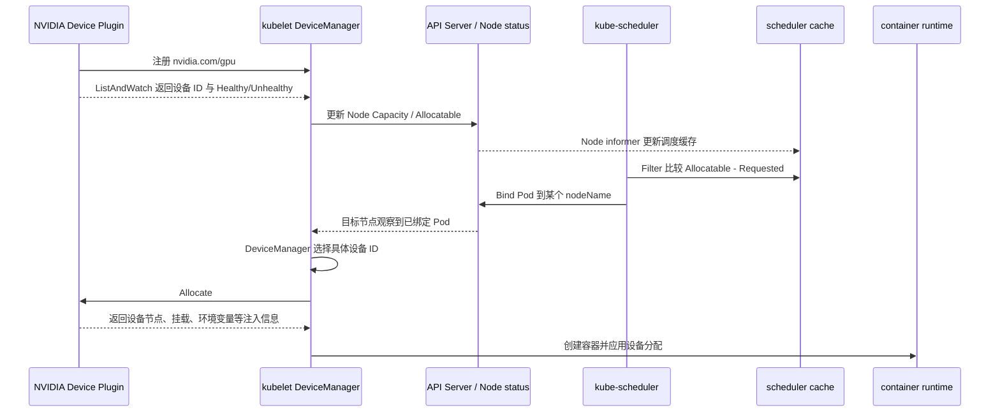

#### 运维现场小案例：Pod 已选中节点，但你仍不知道是哪张卡

- **现象**：Pod 已在 `gpu-b` 运行，业务追问“它拿到的是哪个 GPU UUID？”
- **变量**：`$Namespace='ml-prod'; $PodName='train-0'; $Node='gpu-b'`
- **只读命令 1**：`kubectl get pod -n $Namespace $PodName -o custom-columns='PHASE:.status.phase,NODE:.spec.nodeName'`
- **只读命令 2**：`kubectl get node $Node -o custom-columns='NODE:.metadata.name,GPU-ALLOC:.status.allocatable.nvidia\.com/gpu'`
- **预期/示例输出（教学化）**：`Running  gpu-b`，节点上报 `GPU-ALLOC=4`。
- **能证明**：API 中已经记录节点归属，scheduler 能看到节点级 GPU 标量。
- **不能证明**：不能证明具体 GPU UUID、Device Plugin `Allocate` 返回值或 CUDA 是否可用；这些要查 kubelet PodResources、DeviceManager、CRI/runtime 和驱动证据。
- **时间/风险边界**：两条命令只是当前 API 快照；导出 PodResources、runtime 信息时要避免泄露设备和租户映射。
- **责任域/源码映射**：scheduler 负责 Node Binding；具体 ID 在 `pkg/kubelet/cm/devicemanager/manager.go` 的 `devicesToAllocate`、`allocateContainerResources` 中选择。

### 15.2 `nvidia.com/gpu: 1` 在 scheduler 眼中只是标量

GPU 通常以扩展资源出现：

```yaml
apiVersion: v1
kind: Pod
metadata:
  name: gpu-smoke
spec:
  restartPolicy: Never
  containers:
  - name: cuda
    image: nvcr.io/nvidia/cuda:12.8.1-base-ubuntu22.04
    command: ["bash", "-lc", "nvidia-smi && sleep 3600"]
    resources:
      limits:
        nvidia.com/gpu: 1
```

扩展资源的基本规则：

- 数量必须是整数，不能写 `0.5`；
- 不能像 CPU 那样原生超卖；
- request 与 limit 必须相等；
- 只写 limit 时，API 默认行为通常会把相同数量用于 request；
- 设备共享若产生多个逻辑份额，是设备插件/驱动把逻辑资源数量上报得更多，不是 scheduler 理解了“半张物理卡”。

对 scheduler 来说，资源名可以是 `nvidia.com/gpu`，也可以是厂商定义的其他扩展资源。核心比较仍近似为：

```text
本 Pod 请求的该标量
<= 节点 Allocatable 里的该标量 - NodeInfo.Requested 里的该标量
```

#### 运维现场小案例：GPU 明明空闲，Pod 却报 Insufficient GPU

- **现象**：监控显示 GPU 利用率接近 0，但请求 `nvidia.com/gpu: 1` 的 Pod 一直 Pending。
- **变量**：`$Namespace='ml-prod'; $PodName='infer-7'; $Node='gpu-a'`
- **只读命令 1**：`kubectl get pod -n $Namespace $PodName -o jsonpath='{.spec.containers[*].resources.requests.nvidia\.com/gpu}{" / "}{.spec.containers[*].resources.limits.nvidia\.com/gpu}{"\n"}'`
- **只读命令 2**：`kubectl describe node $Node | Select-String 'Allocated resources:|nvidia.com/gpu' -Context 0,8`
- **只读命令 3**：`kubectl get events -n $Namespace --field-selector involvedObject.kind=Pod,involvedObject.name=$PodName --sort-by='.metadata.creationTimestamp'`
- **预期/示例输出（教学化）**：Pod 为 `1 / 1`；节点 GPU request 已达 `4/4`；事件含 `Insufficient nvidia.com/gpu`。
- **能证明**：传统标量路径的调度合同已经占满，与设备此刻忙不忙不是一回事。
- **不能证明**：不能证明四张物理卡都在计算，也不能用该结果判断 DRA Claim 是否可分配。
- **时间/风险边界**：`describe node` 主要统计 API 可见的已绑定 Pod，不含短暂 assumed Pod。
- **责任域/源码映射**：`pkg/scheduler/framework/plugins/noderesources/fit.go` 的 `computePodResourceRequest` 取请求，`fitsRequest` 比较 `Allocatable - Requested`。

### 15.3 GPU 也有四本经常被混为一谈的账

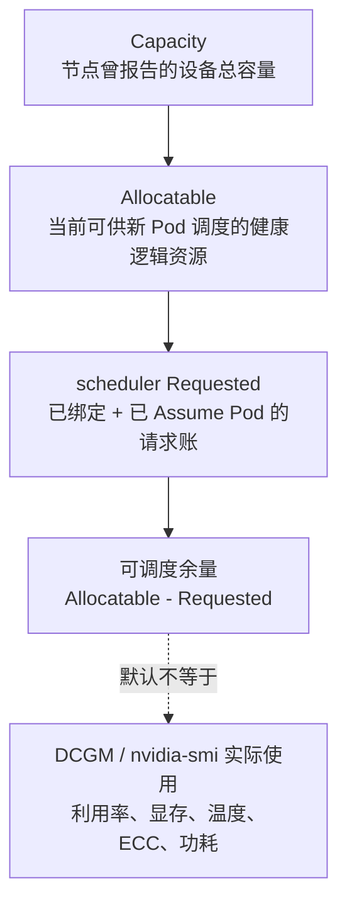

举例：某节点 8 张卡：

```text
Capacity nvidia.com/gpu     = 8
Allocatable nvidia.com/gpu  = 7   # 一张设备 Unhealthy
Requested                   = 6   # 其中可能含刚 Assume、尚未写入 API 的 Pod
scheduler 可用余量         = 1
DCGM 显示实际忙碌卡数      = 2   # 不改变上面的 request 账
```

不能因为 DCGM 显示 GPU 利用率低，就断言 scheduler 应该继续塞 Pod。现有 Pod 可能请求独占 6 张卡但阶段性空闲；调度合同仍然占 6。

当前固定源码中，kubelet DeviceManager 的 `GetCapacity` 会把健康设备计入 allocatable，并把它知道的 unhealthy 数量保留在 capacity 统计中。这解释了为什么一张卡变坏后可能看到 `capacity=8`、`allocatable=7`。具体传播存在 informer 与 Node status 更新延迟，排障时要按时间线取证。

#### 运维现场小案例：Capacity、Allocatable、Requested 和实际利用率四张表对不上

- **现象**：节点显示 `capacity=8`、`allocatable=7`、API 可见 request 为 6，但只有两张卡正在忙。
- **变量**：`$Node='gpu-a'`
- **只读命令 1**：`kubectl get node $Node -o custom-columns='CAP:.status.capacity.nvidia\.com/gpu,ALLOC:.status.allocatable.nvidia\.com/gpu'`
- **只读命令 2**：`kubectl describe node $Node | Select-String 'Allocated resources:|nvidia.com/gpu' -Context 0,8`
- **只读命令 3**：经审批的节点只读通道执行 `nvidia-smi --query-gpu=index,uuid,utilization.gpu,memory.used --format=csv`
- **预期/示例输出（教学化）**：`8 / 7`、request `6`，而 `nvidia-smi` 仅两卡利用率明显大于零。
- **能证明**：资源合同账、健康供给账和物理使用账是不同维度。
- **不能证明**：API 请求账不能展示 scheduler 当前 assumed Pod；一次 `nvidia-smi` 采样也不能代表整个任务周期。
- **时间/风险边界**：三份证据必须记录相同节点和采样时间；UUID 与租户映射需脱敏。
- **责任域/源码映射**：`ManagerImpl.GetCapacity` 形成健康供给；`framework.NodeInfo.Requested` 还会计入 scheduler assumed Pod。

### 15.4 一次 2-GPU 业务调度的逐步推演

假设训练 Pod 的合同是：

```yaml
spec:
  schedulerName: gpu-binpack-scheduler
  tolerations:
  - key: nvidia.com/gpu
    operator: Exists
    effect: NoSchedule
  affinity:
    nodeAffinity:
      requiredDuringSchedulingIgnoredDuringExecution:
        nodeSelectorTerms:
        - matchExpressions:
          - key: platform.example.com/gpu-product
            operator: In
            values: [NVIDIA-A100-SXM4-80GB]
  containers:
  - name: trainer
    image: registry.example.com/ml/trainer:v42
    resources:
      requests:
        cpu: "8"
        memory: 64Gi
      limits:
        nvidia.com/gpu: 2
```

集群视图：

| 节点 | 产品标签 | GPU Allocatable | GPU Requested | 其他条件 | Filter 结果 |
|---|---|---:|---:|---|---|
| `gpu-a` | A100 80GB | 8 | 7 | CPU 充足 | 失败：只剩 1 |
| `gpu-b` | A100 80GB | 8 | 4 | CPU/内存充足 | 通过 |
| `gpu-c` | L40S 48GB | 8 | 0 | 很空 | 失败：required affinity 不匹配 |
| `gpu-d` | A100 80GB | 8 | 2 | 缺少对应 PV 拓扑 | 失败：VolumeBinding |

如果只有 `gpu-b` 可行，scheduler 不会为它运行无意义的多节点 Score 比较，直接建议 `gpu-b`。然后：

1. cache Assume 后 `gpu-b` 的 GPU Requested 立刻从 4 变成 6；
2. API 中可能短时间仍没看到 `spec.nodeName`；
3. Bind 成功后 kubelet 才在 `gpu-b` 选择两张具体设备；
4. 设备插件 `Allocate` 返回注入信息；
5. runtime 创建容器；
6. 应用进程才可能执行 `nvidia-smi` 或 CUDA 初始化。

因此“Binding 已成功、`spec.nodeName` 已持久化”只证明节点决策落到 API，不是一个叫 `Bound` 的 Pod Phase，也不证明驱动、设备分配、CUDA、镜像里的库都正常。

#### 运维现场小案例：四台 GPU 节点中为什么只有 gpu-b 能接单

- **现象**：2-GPU Pod 最终落到 `gpu-b`，运维需要解释其他三台为何不可行。
- **变量**：`$Namespace='ml-prod'; $PodName='train-2gpu'`
- **只读命令 1**：`kubectl get pod -n $Namespace $PodName -o wide`
- **只读命令 2**：`kubectl get nodes -o custom-columns='NAME:.metadata.name,PRODUCT:.metadata.labels.platform\.example\.com/gpu-product,GPU-ALLOC:.status.allocatable.nvidia\.com/gpu,TAINTS:.spec.taints[*]'`
- **只读命令 3**：`kubectl describe nodes | Select-String 'Name:|Allocated resources:|nvidia.com/gpu' -Context 0,8`
- **只读命令 4**：`kubectl get pod -n $Namespace $PodName -o yaml; kubectl get pvc -n $Namespace -o wide; kubectl get pv,storageclass -o yaml`
- **预期/示例输出（教学化）**：Pod 的 `NODE=gpu-b`；其他节点分别存在 GPU 余量、产品标签或卷拓扑方面的硬约束问题。
- **能证明**：这些同窗 API 快照能给出最终落点、产品标签、传统 GPU allocatable/已绑定 request、污点和卷声明；只有人工求交集确实只剩 `gpu-b` 时，才支持“当前快照中它是唯一明显候选”。
- **不能证明**：`describe node` 看不到尚未持久化的 assumed Pod，静态快照也不是 scheduler 当轮 snapshot；成功 Event 通常不保留每个落选节点的完整插件逐项判定，不能据此宣称已经证明唯一可行或伪造 Score 明细。
- **时间/风险边界**：Node 标签、卷和余量会变化，应把 Pod、Node、PVC/PV 快照放在同一时间窗。
- **责任域/源码映射**：NodeAffinity、NodeResourcesFit、VolumeBinding 分别过滤；`schedule_one.go` 只接收最终可行节点结果。

### 15.5 默认 NodeResourcesFit 会检查 GPU，但默认 Score 不一定给 GPU 打分

这是 GPU 平台最值得单独圈出来的细节：

- **Filter 阶段**：NodeResourcesFit 会检查普通扩展资源，所以 `nvidia.com/gpu` 不够会拒绝节点；
- **Score 阶段**：当前默认 NodeResourcesFit 的评分资源列表主要是 CPU 和 memory；没有配置时，不能想当然认为它会因为“这台节点剩余 GPU 多/少”而做 GPU 装箱或打散。

换句话说，两个节点都能放下 1 张 GPU 时，最终落点可能被 CPU/内存、污点偏好、拓扑、亲和、镜像本地性等分数影响，而不是你脑中期待的 GPU 最紧凑放置。

可以在专用 profile 中显式加入 GPU 评分。下面展示的是**同一个 kube-scheduler 进程中保留默认 profile、再增加 GPU profile 的最小相关片段**；真实完整配置还可能包含 leader election、client connection 等字段：

```yaml
apiVersion: kubescheduler.config.k8s.io/v1
kind: KubeSchedulerConfiguration
profiles:
- schedulerName: default-scheduler
- schedulerName: gpu-binpack-scheduler
  pluginConfig:
  - name: NodeResourcesFit
    args:
      scoringStrategy:
        type: MostAllocated
        resources:
        - name: cpu
          weight: 1
        - name: memory
          weight: 1
        - name: nvidia.com/gpu
          weight: 5
```

同一进程的 profiles 必须使用相同 QueueSort 插件及其参数。GPU Pod 还必须显式设置 `spec.schedulerName: gpu-binpack-scheduler`；普通 Pod 继续由 `default-scheduler` profile 负责。如果这是独立 GPU scheduler 进程而非同进程 profile，则要另外处理 leader-election 资源名、RBAC、可用性与监控，不能原样套用这个上下文。

这个配置的业务意图是让满足硬约束的节点中，GPU 使用比例更高者得到更高 NodeResourcesFit 分数，从而尽量把零散空卡合并成整节点余量。但上线前必须回答：

- CPU/内存和 GPU 的权重是否会造成热点；
- 训练任务的磁盘、网络、NUMA 与温度是否承受装箱；
- 节点故障会不会一次影响过多任务；
- 与 topology spread、pod affinity 的总分如何交互；
- 调度器版本中的配置 API 是否仍兼容；
- 是否用仿真或影子调度验证过真实 Pod 集。

这不是复制 YAML 就能结束的“最佳实践”，而是明确的容量取舍。

#### 运维现场小案例：配置了 GPU Pod，却没有按 GPU 余量装箱

- **现象**：两个节点都能放下 Pod，最终落点不像运维预想的“优先塞进 GPU 更满的节点”。
- **变量**：`$Namespace='ml-prod'; $PodName='infer-9'`
- **只读命令 1**：`kubectl get pod -n $Namespace $PodName -o custom-columns='SCHEDULER:.spec.schedulerName,NODE:.spec.nodeName'`
- **只读命令 2**：`kubectl -n kube-system get pod -l component=kube-scheduler -o jsonpath='{range .items[*]}{.metadata.name}{"\t"}{.spec.containers[0].command}{" "}{.spec.containers[0].args}{"\n"}{end}'`
- **只读命令 3**：若配置来自 ConfigMap，再执行 `kubectl -n kube-system get cm -o yaml | Select-String 'NodeResourcesFit|MostAllocated|LeastAllocated|nvidia.com/gpu' -Context 2,6`
- **预期/示例输出（教学化）**：Pod 使用某 profile，但可见配置的评分资源只有 `cpu`、`memory`，没有 `nvidia.com/gpu`。
- **能证明**：Pod 路由到哪个 scheduler，以及可见配置是否声明 GPU 评分。
- **不能证明**：单次落点不能反推具体插件分数；ConfigMap 也不一定就是进程当前加载的有效文件。
- **时间/风险边界**：静态 Pod、本地文件和托管控制面可能无法直接读取；配置输出需脱敏。
- **责任域/源码映射**：默认资源列表在 `pkg/scheduler/apis/config/v1/defaults.go`；实际评分入口为 `noderesources/fit.go` 的 `(*Fit).Score`。

### 15.6 Assume 为什么对昂贵 GPU 尤其重要

普通 Pod 的节点计算不是两个 scheduling cycle 同时跑；`ScheduleOne` 会串行执行这部分。真正重叠的是：Pod-A 的 **binding cycle** 已异步运行时，主循环可以开始 Pod-B 的 **scheduling cycle**。假设一台节点只剩 1 张 GPU：

```text
Pod-A scheduling cycle 的 Filter 看见余量 1
Pod-A Assume 后进入异步 binding cycle
Pod-B 的 scheduling cycle 随后开始
如果 A 只能等 API Bind 后才记账，B 仍可能看见余量 1
```

Assume 先把 Pod-A 加入 scheduler cache，相当于在本地账本占住最后一张卡。Pod-B 随后构建 snapshot 时会看到 Requested 增加，从而被 Filter 拦住。这是乐观并发控制，不是 GPU 锁；真正设备 ID 仍由 kubelet 决定。

绑定失败时必须 `ForgetPod` 清除这笔假设账，否则珍贵 GPU 会在调度器视图里被“幽灵占用”。当前链路通过显式错误处理和 cache 状态转换管理它，不能套用很早版本里“等某个固定 TTL 自动消失”的旧印象。

#### 运维现场小案例：Node API 看着还有一张卡，第二个 Pod 却被拒绝

- **现象**：Pod-A 正在异步绑定，Pod-B 同期收到 `Insufficient nvidia.com/gpu`，但 Node 的 API 请求账暂时还没增加。
- **变量**：`$Namespace='ml-prod'; $PodA='train-a'; $PodB='train-b'; $Node='gpu-a'`
- **只读命令 1**：`kubectl get pod -n $Namespace $PodA $PodB -o custom-columns='NAME:.metadata.name,NODE:.spec.nodeName,PHASE:.status.phase'`
- **只读命令 2**：`kubectl describe node $Node | Select-String 'Allocated resources:|nvidia.com/gpu' -Context 0,8`
- **只读命令 3**：`kubectl get events -n $Namespace --field-selector involvedObject.kind=Pod --sort-by='.metadata.creationTimestamp' | Select-String "$PodA|$PodB"`
- **预期/示例输出（教学化）**：时间线上 B 已报 GPU 不足，而较早的 Node API 快照仍像有一张余量。
- **能证明**：API 对象、Event 与绑定存在时间差，需要考虑 scheduler 本地账本。
- **不能证明**：仅凭该现象不能断言一定是 Assume；还可能有缓存更新、其他约束或刚完成的并发绑定。
- **时间/风险边界**：必须保留毫秒级时间和 Pod UID；不要靠隔几分钟执行的两条命令拼接因果。
- **责任域/源码映射**：`schedule_one.go` 的 `assumeAndReserve`、`assume`、`bindingCycle`；失败路径调用 `ForgetPod`。

### 15.7 scheduler 默认看不见哪些 GPU 事实

传统 `nvidia.com/gpu` 标量路径默认看不见：

- 具体 GPU UUID；
- 每张卡当前显存占用和剩余连续显存；
- SM 利用率、Tensor Core 利用率、功耗、温度；
- GPU 之间是否有 NVLink/NVSwitch 以及拓扑距离；
- GPU 与 CPU NUMA、NIC、NVMe 的局部性；
- 某个逻辑 time-slice 背后和谁共享同一物理卡；
- MIG 实例之间的父卡关系与碎片形状，除非资源类型或驱动把它暴露出来；
- 训练框架的通信模式、batch size 和预计持续时间。

标签只能把少量、相对稳定的事实粗粒度暴露给 NodeAffinity。不要让控制器每几秒根据 GPU 利用率修改 Node label 再让 scheduler 追热点：这会产生高频 API 更新、调度抖动、滞后反馈和难以重现的决策。动态遥测更适合容量控制、队列准入、告警或专门设计的扩展策略。

#### 运维现场小案例：为什么 kubectl 看不到显存和 NVLink

- **现象**：平台想让默认 scheduler 按剩余显存和 NVLink 自动选择 GPU。
- **变量**：`$Namespace='ml-prod'; $PodName='train-0'; $Node='gpu-a'`
- **只读命令 1**：`kubectl top pod -n $Namespace $PodName`
- **只读命令 2**：`kubectl get node $Node -o json | ConvertFrom-Json | Select-Object -ExpandProperty status`
- **只读命令 3**：经审批的节点只读通道执行 `nvidia-smi topo -m`
- **预期/示例输出（教学化）**：`kubectl top` 只有 CPU/内存；Node ResourceList 只有 GPU 资源名与数量；拓扑矩阵只出现在节点工具中。
- **能证明**：这些事实没有作为普通 NodeResourcesFit 输入出现在核心 API 资源账中。
- **不能证明**：不能证明集群不存在 DRA、extender、外部调度器或平台控制器在使用额外信息。
- **时间/风险边界**：拓扑通常较稳定，利用率和显存则是瞬时值；两者不能混成同一类标签。
- **责任域/源码映射**：传统路径的 `NodeResourcesFit` 读取 ResourceList；设备拓扑和遥测属于 kubelet、驱动、DCGM 或扩展策略。

---

## 16. GPU 进阶：MIG、时间切片、DRA 与拓扑分别改变了什么

### 16.1 四种常见供给模型对 scheduler 的呈现

| 模型 | Pod 常见请求 | scheduler 看到的东西 | 主要隔离边界 | 主要风险 |
|---|---|---|---|---|
| 整卡独占 | `nvidia.com/gpu: 1` | 一个整数标量 | 物理 GPU | 利用率可能低，但边界清晰 |
| MIG | 驱动暴露的 MIG profile 资源名 | 不同 profile 的整数标量 | 硬件分区的显存/计算实例 | profile 碎片、重配影响、父卡拓扑不透明 |
| time-slicing | 常仍是 `nvidia.com/gpu: 1`，但节点上报更多逻辑份额 | 逻辑整数份额 | 时间复用，不等于显存硬隔离 | 抢显存、性能抖动、逻辑容量被误当物理卡数 |
| DRA | ResourceClaim/设备类请求，或特性开启后的扩展资源桥接 | 驱动声明的设备、属性、容量与分配约束 | 取决于驱动和设备模型 | API/驱动复杂度、特性版本、观测链更长 |

平台对外不能都叫“1 GPU”。至少要向用户说清它是整卡、MIG profile，还是共享逻辑份额；否则用户会把容量单位和隔离承诺理解错。

#### 运维现场小案例：同一个“1 GPU”工单其实来自四种供给

- **现象**：容量平台把整卡、MIG、time-slicing 和 DRA 都汇总为 `GPU=1`。
- **变量**：`$Namespace='ml-prod'; $PodName='gpu-demo'`
- **只读命令 1**：`kubectl get nodes -o jsonpath='{range .items[*]}{.metadata.name}{"\t"}{.status.allocatable}{"\n"}{end}'`
- **只读命令 2**：`kubectl get pod -n $Namespace $PodName -o yaml | Select-String 'nvidia.com/|resourceClaims:' -Context 1,6`
- **只读命令 3**：`kubectl api-resources --api-group=resource.k8s.io`
- **预期/示例输出（教学化）**：可能分别看到 `nvidia.com/gpu`、MIG profile 资源名、放大的逻辑份额，或显式 `resourceClaims`。
- **能证明**：Pod 与 Node 在 Kubernetes API 中使用哪一种资源表达。
- **不能证明**：仅凭 `nvidia.com/gpu=16` 无法区分 16 张整卡还是 time-slicing 逻辑份额，仍需插件配置和物理库存。
- **时间/风险边界**：资源命名、DRA API 版本和 NVIDIA 配置均随发行版变化。
- **责任域/源码映射**：传统供给进入 `ManagerImpl.GetCapacity`；DRA 由 `DynamicResources` 插件读取 Claim、Slice 和 Class。

### 16.2 MIG 解决的是切分，不自动解决碎片

MIG 可以把支持的 NVIDIA GPU 切成硬件隔离实例。设备插件可以把不同 profile 暴露为不同扩展资源。调度器仍按资源名和整数数量做账，它不会自己推理：

```text
两个小 MIG 实例是否能即时合并成一个大实例
某个实例属于哪张父卡
重新配置 MIG 会杀伤哪些现有工作负载
哪种 profile 组合能最大化未来可用性
```

所以 MIG 平台还需要：

- 受控的节点分组和 profile 策略；
- 变更窗口与排空流程；
- 不同 profile 的配额和价格模型；
- 空闲但碎片化的监控；
- 对“资源总数够、目标 profile 不够”的单独告警；
- 验证设备插件使用何种 MIG strategy 以及资源命名。

#### 运维现场小案例：小 MIG 实例很多，大 profile 仍然 Pending

- **现象**：节点还有多个小 MIG 资源，但请求大 profile 的 Pod 报资源不足。
- **变量**：`$Namespace='ml-prod'; $PodName='mig-train'; $Node='mig-a'`
- **只读命令 1**：`kubectl get node $Node -o json | ConvertFrom-Json | ForEach-Object { $_.status.allocatable.psobject.Properties | Where-Object Name -Match '^nvidia\.com/mig-' }`
- **只读命令 2**：`kubectl get pod -n $Namespace $PodName -o yaml | Select-String 'nvidia.com/mig-'`
- **只读命令 3**：`kubectl get events -n $Namespace --field-selector involvedObject.kind=Pod,involvedObject.name=$PodName --sort-by='.metadata.creationTimestamp'`
- **预期/示例输出（教学化）**：仍有多个 `nvidia.com/mig-1g.10gb`，但事件为 `Insufficient nvidia.com/mig-3g.40gb`；名称仅为配置示例。
- **能证明**：目标 profile 这一独立资源名没有足够整数余量。
- **不能证明**：不能证明小实例能否安全合并，也不能证明它们位于哪张父卡或重配不会影响业务。
- **时间/风险边界**：MIG profile 名称和暴露方式取决于设备插件版本与 strategy。
- **责任域/源码映射**：核心 scheduler 仍由 `fitsRequest` 按资源名逐项比较；父卡重配属于 NVIDIA 驱动/插件和节点运维。

### 16.3 time-slicing 增加的是逻辑份额，不是物理 GPU

假设 4 张物理 GPU，每张配置 4 个 time-slice，节点可能向 Kubernetes 暴露 16 个逻辑 `nvidia.com/gpu`。scheduler 只会做 `16 - requested` 的整数账。

这不代表：

- 有 16 份独立显存；
- 一个 Pod 性能等于独占卡的四分之一且稳定；
- 一个份额故障只影响一个 Pod；
- DCGM 的物理设备指标能直接按 16 个 Pod 一一拆分。

共享策略适合容忍抖动、显存可控的推理/开发负载，不应只因为“利用率好看”就套到所有训练任务。是否允许共享应通过资源类、命名空间、准入策略和明确 SLO 控制。

#### 运维现场小案例：Allocatable 显示 16，机房里却只有 4 张卡

- **现象**：资产系统显示 4 张物理 GPU，Kubernetes 却上报 `nvidia.com/gpu=16`。
- **变量**：`$Node='gpu-share-a'; $PluginNs='gpu-operator'`
- **只读命令 1**：`kubectl get node $Node -o custom-columns='CAP:.status.capacity.nvidia\.com/gpu,ALLOC:.status.allocatable.nvidia\.com/gpu'`
- **只读命令 2**：若配置由 ConfigMap 管理，执行 `kubectl get cm -n $PluginNs -o yaml | Select-String 'timeSlicing|replicas|renameByDefault' -Context 2,5`
- **只读命令 3**：`kubectl get ds,pod -n $PluginNs -o yaml | Select-String 'device-plugin|config|volumeMounts:|nodeSelector:|migStrategy' -Context 1,6`
- **只读命令 4**：经审批的节点只读通道执行 `nvidia-smi -L`；再关联该节点 Device Plugin Pod 的启动日志。
- **预期/示例输出（教学化）**：API 为 16、物理设备为 4，配置中可能为 `replicas: 4`；开启重命名时资源名也可能带 `.shared`。
- **能证明**：同节点同窗的 API 与物理清单只能先证明“scheduler 看见 16 个逻辑资源单位，而物理 GPU 库存不是 16 张”，足以发现供给模型不能按独占整卡解释。
- **不能证明**：搜索到 ConfigMap 不能证明目标 DaemonSet/节点实际加载了它，也不能单凭 `16/4` 区分 time-slicing、MIG、过期配置或其他资源重命名；更不能证明每份有独立显存、固定四分之一性能或稳定故障隔离。
- **时间/风险边界**：还要核对实际 Device Plugin/Operator 配置选择、挂载、节点 selector、插件启动日志并排除 MIG；物理库存与 API 快照都要带时间戳。
- **责任域/源码映射**：份额复制和命名是厂商插件能力；核心 scheduler 只在 `NodeInfo` 中记录最终整数标量。

### 16.4 DRA 把“选设备”更早带进调度过程

Dynamic Resource Allocation 的思路，不只是报一个节点标量，而是通过 `DeviceClass`、`ResourceClaim`、`ResourceSlice` 等对象，让驱动声明设备及属性，让 scheduler 在调度期间参与分配适合的设备。

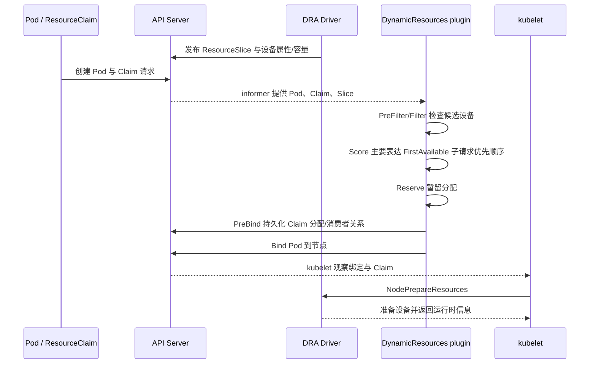

DRA 改变了传统路径里“scheduler 完全不知道具体设备”的边界，但不要过度宣传：scheduler 能看到的是**驱动通过 API 声明出来的属性、容量与约束**，并不会凭空获得实时温度、业务性能模型或完美拓扑知识。

当前 `DynamicResources.Score` 也不是通用的“设备越多、利用率越低、NVLink 越好就越高分”。它主要针对 `FirstAvailable` 请求，按最终命中了第几个优先 subrequest 给分；普通 `Exactly` 请求通常不会靠这个插件拉开节点分数。如果平台把 DRA extended resource 显式加入 NodeResourcesFit 的 scoring resources，NodeResourcesFit 还能基于 DRA 推导出的声明式数量参与资源评分，但这仍不是实时 GPU 性能评分。

当前固定源码还包含 `DRAExtendedResource` 相关桥接逻辑。一个重要检查点在 `NodeResourcesFit`：对某个可由 DRA 管理的扩展资源，如果节点传统 scalar allocatable 大于 0，仍走传统扩展资源账；否则相关资源才可能交给 DynamicResources 路径继续处理。

固定提交 `301946d15e67a4a2e8a5fb8292eb836acd366d78` 中的源码状态是：

```text
DynamicResourceAllocation     -> GA，默认开启并锁定
DRAExtendedResource           -> Beta，默认开启
DRAConsumableCapacity         -> Beta，默认开启
DRADeviceBindingConditions    -> Beta，默认开启
DRANodeAllocatableResources   -> Alpha，默认关闭
```

这些是 v1.37 开发快照中的 feature 状态，不能反推旧生产版本、云厂商发行版或实际启动参数；生产使用必须以目标集群版本的 feature gate、API 与官方文档为准。

还有一个和第 13 节抢占有关的关键限制：传统 Device Plugin scalar GPU 被低优先级 Pod 占用时，受害者真正退出后 request 可以释放，高优先级 Pod可能受益；当前 DRA 路径不支持为了高优先级 Pod 而抢占另一个正在使用 DRA 设备的 Pod。`DynamicResources.PostFilter` 能处理某些空闲、未被使用或遗留 Claim，不等于它会驱逐正在使用设备的低优先级 Pod。DRA 设备被占满时，高优先级 Workload 通常要等正常释放，或依赖另一个明确的控制/运维流程。

#### 运维现场小案例：高优先级 DRA Pod 为什么没有抢走低优先级 Pod 的设备

- **现象**：低优先级 Pod 的 Claim 已分配设备，高优先级 DRA Pod 仍 Pending，运维误以为 DRA 会按“最好 GPU”评分并自动抢占。
- **变量**：`$Namespace='ml-prod'; $ClaimName='gpu-claim-low'; $PodName='train-high'`
- **只读命令 1**：`kubectl get resourceclaims.resource.k8s.io -n $Namespace $ClaimName -o yaml | Select-String 'exactly:|firstAvailable:|allocation:|driver:|pool:|device:' -Context 1,5`
- **只读命令 2**：`kubectl get pod -n $Namespace $PodName -o custom-columns='PRIORITY:.spec.priority,NODE:.spec.nodeName,PHASE:.status.phase'`
- **只读命令 3**：`kubectl get events -n $Namespace --field-selector involvedObject.kind=Pod,involvedObject.name=$PodName --sort-by='.metadata.creationTimestamp'`
- **预期/示例输出（教学化）**：旧 Claim 已记录 driver/pool/device；高优先级 Pod 无 `nodeName`，设备分配失败或无可用设备。
- **能证明**：DRA API 中已有具体分配，以及新 Pod 尚未完成节点选择。
- **不能证明**：Claim 分配不证明 kubelet 已完成 `NodePrepareResources`；普通 `exactly` 请求也不会产生通用 GPU 质量分。
- **时间/风险边界**：当前固定提交的 DRA feature 状态不能外推到旧集群；先用 API discovery 和有效启动参数确认。
- **责任域/源码映射**：`(*DynamicResources).Score`/`computeScore` 主要区分 `firstAvailable` 顺序；`PostFilter` 不会驱逐正在使用 DRA 设备的 Pod，准备动作属于 kubelet 与 DRA driver。

### 16.5 节点级拓扑和设备级拓扑不是一回事

Kubernetes 常用的 topology spread 约束，按 zone、hostname 等**节点标签域**分散 Pod。例如让 8 个推理副本跨 3 个可用区。它并不解决单台 8-GPU 服务器内部的：

- GPU 0 与 GPU 1 是否 NVLink 直连；
- GPU 距哪个 NUMA node 更近；
- RDMA NIC 与某组 GPU 是否同 PCIe root；
- 4 卡任务应该拿哪四块卡。

节点内部设备选择通常落到 DeviceManager、Topology Manager、设备插件/DRA 驱动以及应用通信库。平台排障必须分两级：

```text
集群级：为什么选了这台节点？          -> scheduler 证据
节点级：为什么拿到这几块设备、性能怎样？ -> kubelet/驱动/runtime/DCGM/应用证据
```

#### 运维现场小案例：Pod 跨可用区分散正确，但四卡通信仍很慢

- **现象**：PodTopologySpread 满足了 zone 分散，单节点训练进程仍怀疑拿到了跨 PCIe root 的 GPU。
- **变量**：`$Namespace='ml-prod'; $PodName='train-0'; $Node='gpu-a'`
- **只读命令 1**：`kubectl get pod -n $Namespace $PodName -o yaml | Select-String 'topologySpreadConstraints:|topologyKey:|nodeName:' -Context 0,12`
- **只读命令 2**：`kubectl get node $Node --show-labels`
- **只读命令 3**：经审批的节点只读通道执行 `nvidia-smi topo -m`
- **预期/示例输出（教学化）**：Pod 约束使用 zone/hostname 标签，而设备矩阵另外显示 `NV#`、`PIX`、`PHB`、NUMA 等关系。
- **能证明**：节点级分布约束和节点内设备拓扑是两套不同证据。
- **不能证明**：不能仅凭 PodTopologySpread 判断拿到了哪四张卡，也不能仅凭拓扑矩阵证明 NCCL 性能根因。
- **时间/风险边界**：设备 ID 必须与容器可见 ID、UUID、BDF 和采样节点一一对应。
- **责任域/源码映射**：PodTopologySpread 选择节点域；传统具体设备由 DeviceManager/Topology Manager/插件选择，DRA 则仅能使用驱动声明的拓扑属性。

### 16.6 GPU 健康变化的时间线

一张卡从 Healthy 变为 Unhealthy，大致会经历：

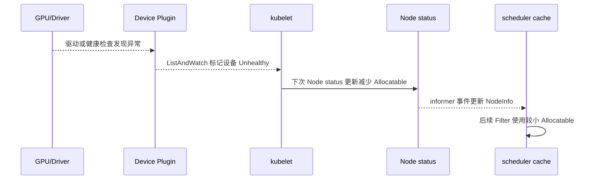

其中任何箭头都可能有短暂延迟。已经绑定并使用故障设备的 Pod，不会仅因 scheduler 看到 allocatable 下降就自动迁移；这属于节点故障处理、设备插件/kubelet 状态、控制器重建和业务恢复策略的范围。

#### 运维现场小案例：一张卡变坏后为什么先看到 8/7

- **现象**：节点从 `capacity=8, allocatable=8` 变成 `capacity=8, allocatable=7`，新 Pod 开始 Pending。
- **变量**：`$Node='gpu-a'; $PluginNs='gpu-operator'; $PluginPod='nvidia-device-plugin-xxxxx'`
- **只读命令 1**：`Get-Date; kubectl get node $Node -o custom-columns='CAP:.status.capacity.nvidia\.com/gpu,ALLOC:.status.allocatable.nvidia\.com/gpu'`
- **只读命令 2**：`kubectl logs -n $PluginNs $PluginPod --since=15m | Select-String 'Unhealthy|health|Xid'`
- **只读命令 3**：`kubectl get events --all-namespaces --field-selector involvedObject.kind=Node,involvedObject.name=$Node --sort-by='.metadata.creationTimestamp'`
- **预期/示例输出（教学化）**：API 为 `8/7`；插件日志在相近时间出现设备健康变化，具体文本随插件版本而变。
- **能证明**：API 供给减少，以及设备插件可能在相邻时间报告健康变化。
- **不能证明**：时间接近不等于根因闭环；也不证明已使用故障卡的 Pod 已迁移或恢复。
- **时间/风险边界**：Node status、ListAndWatch、informer 均有传播延迟；日志可能含 UUID，应脱敏。
- **责任域/源码映射**：`PluginListAndWatchReceiver`、`genericDeviceUpdateCallback`、`GetCapacity`，再经 kubelet Node status 进入 scheduler cache。

---

## 17. Kueue、Volcano 与 kube-scheduler：都谈调度，但决定的不是同一件事

### 17.1 Kueue 先决定“这批活现在能不能进场”

面向训练、批处理、AI Job，单纯让每个 Pod 立即进入 kube-scheduler 队列会产生问题：

- 一个 64-GPU Job 的前几个 Pod 占到卡，剩余 Pod 长期凑不齐；
- 小任务不断穿插，大任务永远等不到整块容量；
- 团队之间没有公平配额和借用规则；
- 业务看到大量 Pending，却分不清是队列等待还是节点放不下。

Kueue 的位置是工作负载准入：

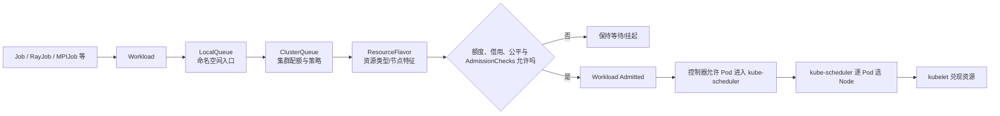

几个对象的大白话解释：

- `LocalQueue`：某命名空间的提交入口，像业务柜台；
- `ClusterQueue`：跨命名空间的资源池、配额和准入规则，像总调度室；
- `ResourceFlavor`：把某类资源额度关联到节点特征，例如 A100 池；
- `Workload`：Kueue 用来表示“一项需要整体准入的工作”；
- `Cohort`：允许多个 ClusterQueue 按策略共享/借用额度的组。

`QuotaReserved=True` 表示 Kueue 已为 Workload 记录资源风味/配额分配，`Admitted=True` 还表示所需 admission checks 已就绪；二者都不是在具体 Node 上加了一把物理原子锁。它们不保证每个 Pod 此刻都能在节点层面放下。节点碎片、污点、卷拓扑、节点故障以及准入与实际创建之间的状态变化，仍可能让后续 Pod Pending。

Kueue 还要分清两套优先级：

```text
WorkloadPriorityClass -> Kueue 中 Workload 的排队、准入与相关抢占顺序
Pod PriorityClass      -> Pod 进入 kube-scheduler 后的队列顺序与 Pod 抢占
```

二者可独立配置。仅设置 WorkloadPriorityClass 不会自动改变 Pod priority；若只设置 Pod PriorityClass，Kueue 在没有独立 WorkloadPriorityClass 时可按其规则推导 workload priority。平台必须明确哪一层在“插队”，不能只显示一个模糊的优先级数字。

Kueue 的 Topology-Aware Scheduling（TAS）还能在**准入阶段**按 rack/block/node 等层级计算可用容量并写入 topology assignment，必要时通过 PodSet 更新约束后续 Pod 范围；但最终每个 Pod 的 Node Binding 仍由它指定的 scheduler 完成。TAS 比“只做总配额”更接近物理拓扑，但仍不能把 `Admitted` 当成已完成 Bind。

#### 运维现场小案例：Workload 已 Admitted，Pod 为什么还在 Pending

- **现象**：Kueue 页面显示训练 Workload 已准入，但某些 GPU Pod 仍没有 `nodeName`。
- **变量**：`$Namespace='team-a'; $Workload='train-job-abc'; $PodName='train-worker-7'`
- **只读命令 1**：`kubectl get workloads.kueue.x-k8s.io -n $Namespace $Workload -o jsonpath='{range .status.conditions[*]}{.type}={.status}:{.reason}{"\n"}{end}'`
- **只读命令 2**：`kubectl get pod -n $Namespace $PodName -o custom-columns='NODE:.spec.nodeName,PHASE:.status.phase,SCHEDULER:.spec.schedulerName'`
- **只读命令 3**：`kubectl get events -n $Namespace --field-selector involvedObject.kind=Pod,involvedObject.name=$PodName --sort-by='.metadata.creationTimestamp'`
- **预期/示例输出（教学化）**：`QuotaReserved=True`、`Admitted=True`，但 Pod 事件仍可能为 `Insufficient nvidia.com/gpu`。
- **能证明**：Kueue 的工作负载准入已完成，而 Pod 节点调度尚未完成。
- **不能证明**：`Admitted=True` 不是某台 Node 上的 GPU 原子锁；不保证没有节点碎片、卷或污点问题。
- **时间/风险边界**：对象字段和 API 版本以已安装 Kueue 为准；准入和 Pod 创建之间也有时间差。
- **责任域/依据**：Kueue 管 Workload 准入，目标 Pod scheduler 管 Node Binding；条件语义以已安装 Kueue 的 API 与官方文档为准。

### 17.2 Volcano 更像“另一套面向批任务的节点调度系统”

Volcano scheduler 可以作为 Pod scheduler，提供面向批处理/HPC 的队列、gang 等插件能力。常见 gang 诉求是：一个 Job 需要的最小成员数不能同时满足时，不要让少数 Pod 先长期占资源。

对比边界：

| 组件 | 主要决策单位 | 核心问题 | 最终会不会选 Node |
|---|---|---|---:|
| Kueue | Workload/Job 准入 | 团队配额、队列、公平、借用、何时进场 | 通常不替代 kube-scheduler 逐 Pod 选节点 |
| kube-scheduler | Pod，当前源码也在演进 PodGroup 能力 | 这个 Pod/组能去哪些节点、哪个最好、如何绑定 | 会 |
| Volcano scheduler | Pod/PodGroup/Queue | 批任务、gang、队列策略与节点放置 | 会 |

当前固定的 Kubernetes master 源码已经包含受 feature gate 控制、仍处早期阶段的内置 gang/PodGroup 相关实现。因此不能写成“Kubernetes 原生永远没有 gang”；更准确的工程说法是：目标生产版本若没有可用且成熟的原生能力，仍需评估 Kueue、Volcano 或其他批调度方案，并承担相应 CRD、控制器、升级和可观测性成本。

VolcanoJob 的最小语义大致如下，真正版本与 CRD 字段以已安装 Volcano 为准：

```yaml
apiVersion: batch.volcano.sh/v1alpha1
kind: Job
metadata:
  name: gpu-train
spec:
  schedulerName: volcano
  minAvailable: 3
  tasks:
  - name: trainer
    replicas: 3
    template:
      spec:
        restartPolicy: Never
        containers:
        - name: trainer
          image: registry.example.com/ml/trainer:v42
          resources:
            limits:
              nvidia.com/gpu: 1
```

`schedulerName: volcano` 表明实际节点放置交给 Volcano；`minAvailable` 是 gang 可运行最小成员约束。Volcano 调度会按配置执行 enqueue、allocate、backfill、preempt、reclaim 等 action，并通过 gang、priority、DRF、proportion/capacity、nodeorder 等插件组合队列公平、抢占和节点排序。插件是否启用、执行次序和参数决定实际语义，不能看到安装了 Volcano 就假定全部能力同时生效。

若 Kueue 与 Volcano 组合，必须指定唯一的职责合同：Kueue 是否只做外层 admission，Volcano 是否做 gang 与 Node 放置；WorkloadPriorityClass、Pod PriorityClass、两边队列、配额/公平、抢占和失败重排怎样映射。没有这张合同，两套系统可能各自正确，却在准入、抢占或重排上互相打架。

#### 运维现场小案例：Pod 到底由 kube-scheduler 还是 Volcano 负责

- **现象**：GPU Pod 没有绑定，值班人员只查 kube-scheduler 日志却找不到记录。
- **变量**：`$Namespace='team-a'; $PodName='vc-train-worker-0'; $PodGroup='vc-train'`
- **只读命令 1**：`kubectl get pod -n $Namespace $PodName -o custom-columns='SCHEDULER:.spec.schedulerName,NODE:.spec.nodeName,PHASE:.status.phase'`
- **只读命令 2**：`kubectl get podgroups.scheduling.volcano.sh -n $Namespace $PodGroup -o yaml | Select-String 'minMember:|phase:|conditions:|reason:|message:' -Context 1,5`
- **只读命令 3**：`kubectl get events -n $Namespace --field-selector involvedObject.name=$PodName --sort-by='.metadata.creationTimestamp'`
- **预期/示例输出（教学化）**：`scheduler=volcano`；PodGroup 可能为 Pending/Unschedulable，并提示最小成员资源不足。
- **能证明**：这个 Pod 的节点放置责任已路由给 Volcano，并存在 gang/PodGroup 状态。
- **不能证明**：只看到 PodGroup 不能证明 gang、DRF、binpack、preempt 等插件全部启用，也不能证明 Kueue 已准入。
- **时间/风险边界**：Volcano CRD 版本和 condition 文本随发行版变化，应先执行 `kubectl api-resources | Select-String 'volcano'`。
- **责任域/依据**：Volcano scheduler 选择 Node；`minMember`、gang action 和实际插件语义以已安装版本的 CRD、ConfigMap 与官方文档为准。

### 17.3 一个 8-Pod、每 Pod 1-GPU 训练任务的状态拆解

```text
阶段 A：Kueue 未准入
  - 业务原因：队列配额、借用/公平次序、AdmissionCheck、Provisioning 等尚未完成
  - 不应该用 kube-scheduler FailedScheduling 解释

阶段 B：已准入，8 个 Pod 已出现
  - scheduler 要逐个找节点
  - 若只有 6 个可放，可能出现 6 Running + 2 Pending

阶段 C：使用 gang 语义
  - 只有满足最小成员/整体约束才继续
  - 具体谁负责整体判断，取决于选用的实现

阶段 D：都已绑定但一个容器 CUDA 初始化失败
  - 已越过节点调度，查 kubelet、设备、镜像和应用
```

平台 UI 应把这四个阶段分开展示，不能统一显示一个模糊的“排队中”。

#### 运维现场小案例：把 8-Pod 训练任务定位到正确阶段

- **现象**：平台统一显示“排队中”，实际可能是 Kueue 等待、Pod 调度失败或绑定后的设备错误。
- **变量**：`$Namespace='team-a'; $Workload='train-8'; $JobLabel='job-name=train-8'`
- **只读命令 1**：`kubectl get workloads.kueue.x-k8s.io -n $Namespace $Workload -o yaml | Select-String 'QuotaReserved|Admitted|admissionChecks|message:' -Context 1,4`
- **只读命令 2**：`kubectl get pods -n $Namespace -l $JobLabel -o custom-columns='POD:.metadata.name,SCHEDULER:.spec.schedulerName,NODE:.spec.nodeName,PHASE:.status.phase'`
- **只读命令 3**：`kubectl get events -n $Namespace --sort-by='.metadata.creationTimestamp' | Select-String 'train-8|FailedScheduling|UnexpectedAdmissionError'`
- **预期/示例输出（教学化）**：未准入时 Pod 可能未放行；已准入后可能 `6 Running + 2 Pending`；已绑定失败则具有 Node 且进入 Failed/容器错误层。
- **能证明**：当前对象停在准入、节点调度还是 kubelet/runtime 之后的哪一层。
- **不能证明**：Phase 和一条 Event 不能单独给出根因；gang 的最小成员还取决于实际实现与配置。
- **时间/风险边界**：Workload、Pod、Event 必须按 UID 和相同时间窗关联，避免把控制器重建出的新 Pod 当成旧 Pod。
- **责任域/源码映射**：Kueue/Volcano 属外部控制器；核心 scheduler 的入口是对应 `schedulerName` 的队列和 `schedule_one.go`。

---

## 18. 多 Profile、多 scheduler、Framework 插件和 Extender 怎么选

### 18.1 `schedulerName` 是责任路由，不是普通标签

Pod 默认使用 `default-scheduler`。也可以写：

```yaml
spec:
  schedulerName: gpu-binpack-scheduler
```

这意味着只有声明负责 `gpu-binpack-scheduler` 的 scheduler profile/进程会处理它。名字写错而集群没有对应调度器时，Pod 可以长期保持未绑定；这不是 NodeResourcesFit 拒绝，因为它可能根本没有进入任何负责它的调度循环。

排障第一屏就应核对：

```powershell
$Namespace = 'prod'
$PodName = 'order-api-typo'
kubectl get pod -n $Namespace $PodName -o jsonpath='{.spec.schedulerName}{"\n"}'
```

#### 运维现场小案例：拼错 `schedulerName`，连 FailedScheduling 都没有

- **背景：** 案例 A 的教学变体 `prod/order-api-typo` 写成 `defaut-scheduler`，数分钟 `NODE=<none>`，也没有常见 Filter 失败 Event。
- **只读命令：**
  ```powershell
  kubectl get pod -n prod order-api-typo -o custom-columns='SCHEDULER:.spec.schedulerName,NODE:.spec.nodeName,GATES:.spec.schedulingGates[*].name'
  kubectl get deploy,pod -A | Select-String 'scheduler'
  kubectl get events -n prod --field-selector involvedObject.name=order-api-typo --sort-by='.metadata.creationTimestamp'
  ```
- **示例证据（教学示意）：** Pod 路由名拼错；可见配置只声明 `default-scheduler` 和 `gpu-binpack-scheduler`。
- **能证明：** 当调度器清单和配置证据完整时，可闭合“没有组件负责该路由名”。
- **不能证明/时间边界：** 托管控制面可能不可见；命令没找到进程不能单独证明它不存在。
- **修复/安全边界：** 修正控制器 Pod template 后重建未绑定 Pod；`schedulerName` 不能原地修改现有 Pod。
- **源码/组件映射：** `profile.Map.HandlesSchedulerName` 判断进程是否负责该名字；匹配 profile 才接收该 Pod。

### 18.2 同一 kube-scheduler 进程的多个 Profile

一个 `KubeSchedulerConfiguration` 可定义多个 profile，每个有自己的 `schedulerName` 与插件配置。它适合：

- 共用同一套 informer/cache，运维组件数较少；
- 给 GPU、批任务或特殊业务设置不同 Score/Filter 组合；
- 不需要进程级故障隔离。

但要知道边界：

- profiles 共用调度队列和 cache；
- 同一进程中所有 profile 的 QueueSort 插件名称与参数必须兼容一致；
- 一个进程卡顿或崩溃会影响它承载的所有 profile；
- profile 名称会出现在部分 metrics label 中，要控制基数；
- profile 的 `addedAffinity` 可能给 Pod 追加用户 YAML 看不见的 NodeAffinity，平台必须文档化。

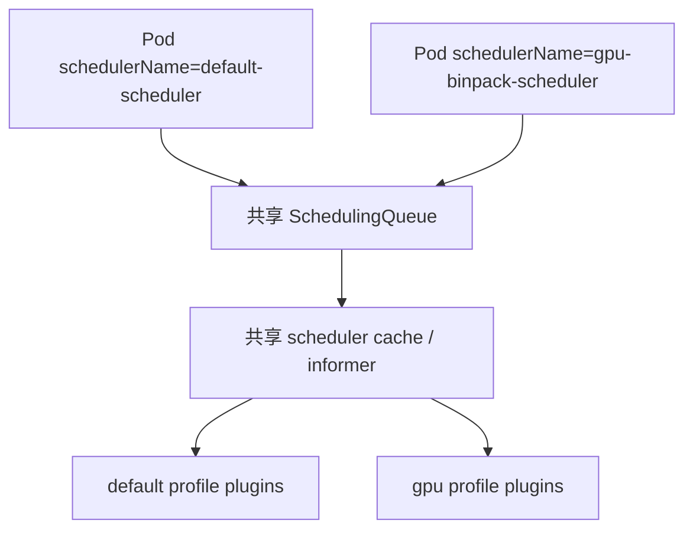

#### 运维现场小案例：Pod 没写 affinity，却被 profile 的隐藏条件拒绝

- **背景：** 案例 D 的 `ml/train-a100` 使用 `gpu-binpack-scheduler`；Pod YAML 没写 nodeAffinity，Event 却显示 NodeAffinity 不匹配。
- **只读命令（配置载体按发行版调整）：**
  ```powershell
  kubectl get pod -n ml train-a100 -o yaml
  kubectl -n kube-system get configmap kube-scheduler-config -o yaml
  kubectl -n kube-system get pod -l component=kube-scheduler -o yaml
  ```
- **示例证据（教学示意）：** profile 的 `NodeAffinity` args 含 `addedAffinity: accelerator=a100-80gb`，候选节点标签不匹配。
- **能证明：** 若 ConfigMap、挂载与启动参数能对上，可解释用户 YAML 看不见的附加硬条件。
- **不能证明/时间边界：** ConfigMap 内容正确不等于运行进程已加载；还要核对挂载、重启时刻和日志。
- **修复/安全边界：** 文档化 addedAffinity 并在准入时提示；改配置前先影子验证，避免清空整个 profile 的可行集合。
- **源码/组件映射：** `profile.NewMap` 按名字建 Framework；`nodeaffinity.New`/`NodeAffinity.Filter` 合并并执行附加条件。

### 18.3 独立 scheduler 进程

独立部署第二个 scheduler 适合需要更强隔离、不同发布节奏或完全不同实现的场景，但成本更高：

- 唯一的 schedulerName；
- 独立配置、Deployment/静态 Pod、证书与 RBAC；
- leader election 的资源名不能冲突；
- 独立日志、metrics、告警和升级演练；
- 明确哪些业务被路由过去；
- 避免两个 scheduler 都声称负责同一 Pod 集，否则可能产生竞争和难以解释的行为。

#### 运维现场小案例：独立 scheduler 配好了名字，却没有 leader 工作

- **背景：** 新增教学示例中，只有路由到 `gpu-binpack-scheduler` 的测试 Pod 堆积；`default-scheduler` 正常。
- **只读命令：**
  ```powershell
  kubectl -n kube-system get deploy,pod,lease | Select-String 'gpu-binpack'
  kubectl -n kube-system describe deploy gpu-binpack-scheduler
  kubectl auth can-i create pods/binding --as=system:serviceaccount:kube-system:gpu-binpack-scheduler
  ```
- **示例证据（教学示意）：** Deployment `AVAILABLE=0`、Lease renewTime 停滞，或 ServiceAccount 无 Binding 权限。
- **能证明：** 独立进程可用性、leader 续约和关键 RBAC 是否有明显缺口。
- **不能证明/时间边界：** Lease 正常不等于 scheduling cycle 健康；`can-i=yes` 也不证明 cache、插件和 Bind 都正常。
- **修复/安全边界：** 恢复副本、RBAC 和唯一 Lease 名；不要让两套 scheduler 同时认领同一名字来“容灾”。
- **源码/组件映射：** `cmd/kube-scheduler/app` 负责进程与 leader election；`profile.Map` 路由，`Scheduler.bind` 使用 Binding API。

### 18.4 Framework 插件与 Extender

| 维度 | Scheduling Framework 插件 | Scheduler Extender |
|---|---|---|
| 运行位置 | 编译进 kube-scheduler 进程 | 外部 HTTP 服务 |
| 能力 | 可接入多个 extension point，状态共享更深 | 主要在筛选、打分、绑定、抢占等有限接口 |
| 延迟 | 进程内调用，通常更低 | 网络调用，受超时和服务可用性影响 |
| 发布 | 需要维护自定义 scheduler 二进制 | 服务可单独发布，但仍要维护协议兼容 |
| 故障影响 | panic/慢插件可直接拖垮 scheduler | 服务慢或失败会按 extender 策略影响调度 |
| 适合 | 深度、长期、性能敏感的定制 | 历史集成或需要外部系统决策的场景 |

Extender 还有几条生产契约必须写进设计：Filter extenders 按配置顺序调用并逐步缩小节点列表；Prioritize extenders 可并行贡献分数；`ignorable` 决定网络/调用错误是忽略还是让本轮失败；`managedResources[].ignoredByScheduler` 可让核心 NodeResourcesFit 跳过某些扩展资源；整个配置只能有一个 extender binder。若核心检查被跳过而 extender 没真正兑现资源，Pod 可能先绑定、再在 kubelet 失败。

Framework 插件通常也不是把一个 `.so` 扔进目录就运行时热加载：实现需要注册并编进自定义 kube-scheduler 二进制，再通过 profile 配置启用。它带来更深集成，也意味着要维护与目标 Kubernetes 版本匹配的构建、测试与供应链。

不要因为 Go 插件开发麻烦，就把一个毫秒级高频决策随手变成跨网络 RPC。也不要因为进程内性能好，就忽略自定义插件对整个控制面的故障半径。生产定制至少要有：超时预算、并发压测、失败语义、指标、版本兼容测试和回滚。

#### 运维现场小案例：Extender 超时拖慢整个 Filter 路径

- **背景：** 案例 F 的教学变体中，内置插件延迟正常，但 `gpu-binpack-scheduler` attempt p99 暴涨；日志出现 Extender 超时。
- **只读命令：**
  ```powershell
  kubectl -n platform get service,endpointslice -l app=gpu-extender -o wide
  kubectl -n kube-system logs deploy/gpu-binpack-scheduler --since=10m | Select-String 'extender|deadline|timeout'
  kubectl -n kube-system get configmap gpu-scheduler-config -o yaml
  ```
- **示例证据（教学示意）：** endpoint 只剩 1 个；日志在 Extender URL 上报超时，配置 `ignorable=false`。
- **能证明：** 本轮失败或变慢经过 Extender 网络路径，并受其失败语义影响。
- **不能证明/时间边界：** 超时不能区分服务 CPU、下游、网络或 timeout 配置；一次日志也不能代表全局比例。
- **修复/安全边界：** 先回滚 Extender 发布或隔离流量，谨慎修改 `ignorable`；忽略错误可能绕过资源责任。
- **源码/组件映射：** `HTTPExtender.Filter/Prioritize/send` 执行 HTTP；Framework 插件由 `frameworkImpl.Run*Plugins` 在进程内执行。

### 18.5 配置变更的安全发布顺序

```text
1. 固定目标 Kubernetes 版本和配置 API
2. 用真实 Node/Pod 清单做离线或测试集群重放
3. 验证硬约束不会扩大可行节点集合
4. 比较新旧 Score 排名和分布，不只看第一名
5. 验证抢占、Permit、卷和 GPU 场景
6. 小流量 schedulerName/profile 灰度
7. 观察队列延迟、错误、失败插件和节点分布
8. 扩大范围，并保留旧配置回切路径
```

Scheduler 不是典型无状态 Web 服务。一次配置变化会改变未来所有 Pod 的放置状态，影响会在节点上长期保留，不能只用“进程健康、接口 200”判断发布成功。

同理，scheduler 只决定尚未绑定 Pod 的未来位置；它不会因为 Score 权重、节点标签或 topology 策略后来改变，就自动把已绑定 Pod 重新摆一遍。若平台引入 Descheduler，它是另一个根据策略驱逐 Pod、再让控制器重建和 scheduler 重新放置的组件；驱逐有业务影响，也不保证重建 Pod 回到你预想的节点。

#### 运维现场小案例：进程健康，但新 Score 把 GPU Pod 分布打歪

- **背景：** 案例 F 的 canary profile 全部绑定成功，健康检查全绿，但 90% 测试 Pod 落在一个机架；旧 profile 只有约 45%。
- **只读命令：**
  ```powershell
  kubectl get pod -n scheduler-canary -o custom-columns='NAME:.metadata.name,SCHEDULER:.spec.schedulerName,NODE:.spec.nodeName'
  kubectl get node -L topology.kubernetes.io/zone,topology.kubernetes.io/rack
  kubectl get events -n scheduler-canary --sort-by='.metadata.creationTimestamp'
  ```
- **示例证据（教学示意）：** canary 都成功，但节点和故障域分布显著偏离固定基线。
- **能证明：** 配置变化影响未来 Pod 放置；“绑定成功率”不足以验收 Score 变更。
- **不能证明/时间边界：** 小样本不能隔离节点时变、平分和其他插件；需固定快照重放。
- **修复/安全边界：** 回滚 canary template/独立配置并重建未绑定测试 Pod；回滚不会自动搬走已绑定 Pod。
- **源码/组件映射：** `scheduler.New`/`profile.NewMap` 装配配置；`RunScorePlugins` 只影响当轮排名。

---

## 19. 生产排障：先判断责任域，再做集合交集

### 19.1 第一棵树：这个 Pod 真的卡在 scheduler 吗

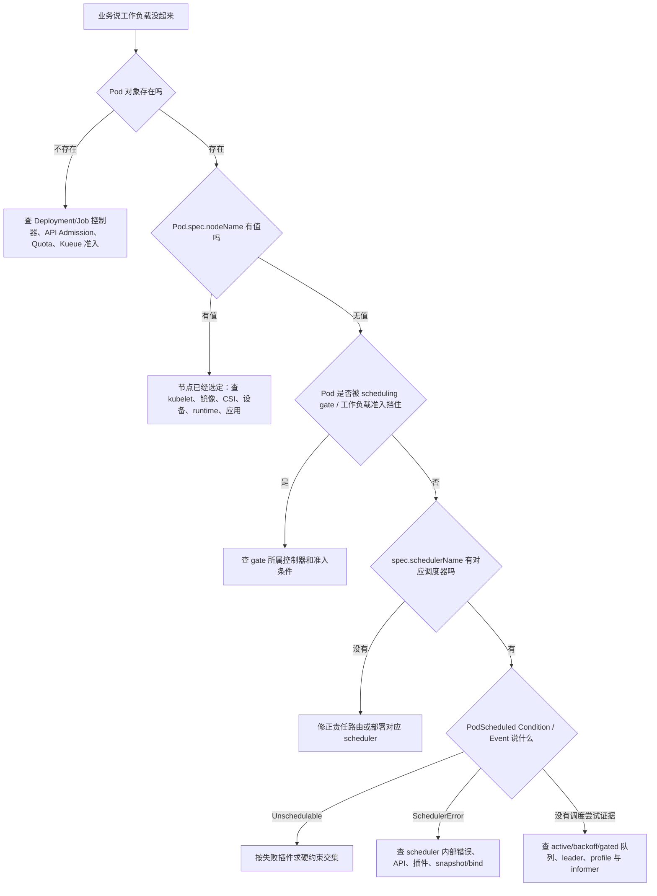

一个很实用的状态表：

| 表象 | `spec.nodeName` | scheduler 是否仍是第一责任域 | 下一站 |
|---|---|---:|---|
| Pending，Node 为空，FailedScheduling | 空 | 是 | Filter/队列/抢占 |
| Pending，Node 为空，没有调度事件，带 schedulingGates | 空 | 部分 | 放 gate 的控制器 |
| Pending，Node 为空，schedulerName 不存在 | 空 | 配置责任 | 调度器路由 |
| Pending，Node 已有值，`FailedMount` | 有 | 否 | kubelet/CSI/存储 |
| Pending，Node 已有值，`FailedCreatePodSandBox` | 有 | 否 | CNI/runtime |
| ContainerCreating，设备分配失败 | 有 | 否 | kubelet/Device Plugin/DRA driver |
| Running，但 GPU 利用率为 0 | 有 | 否 | 应用、CUDA、数据管道和指标 |

#### 运维现场小案例：Pod 仍是 Pending，但已不是 scheduler 第一责任域

- **背景：** 案例 C 的 `finance/ledger-close` 页面显示 Pending；实际已有 `spec.nodeName=worker-a`，后续观察是卷挂载失败。
- **只读命令：**
  ```powershell
  kubectl get pod -n finance ledger-close -o custom-columns='NODE:.spec.nodeName,SCHEDULED:.status.conditions[?(@.type=="PodScheduled")].status,PHASE:.status.phase'
  kubectl get events -n finance --field-selector involvedObject.name=ledger-close --sort-by='.metadata.creationTimestamp'
  ```
- **示例证据（教学示意）：** `NODE=worker-a`、`PodScheduled=True`，后续为 `FailedMount` 类观察。
- **能证明：** Node Binding 已持久化，当前第一责任域转到 kubelet/CSI。
- **不能证明/时间边界：** Event 文本不能单独给出 CSI 根因；还要对 PVC/PV、CSINode 和节点日志。
- **修复/安全边界：** 沿节点兑现链排查；不要删 Pod 试图让 Score 换节点，删除会改变卷与现场。
- **源码/组件映射：** kube-scheduler binding cycle 写 `spec.nodeName`；kubelet VolumeManager/CSI 完成节点侧兑现。

### 19.2 先保存现场，再动对象

下面命令对 Kubernetes API 是只读的，但会在当前本地目录创建和写入证据文件。先把同一时间点的证据保存下来，避免你边改 label、删 Pod、扩节点，边把原始因果链抹掉。

```powershell
$Namespace = 'prod'
$PodName = 'order-api-new-7f8d9'
$CollectedAt = Get-Date -Format 'yyyyMMdd-HHmmss'
$PodUid = kubectl get pod -n $Namespace $PodName -o jsonpath='{.metadata.uid}'
$EvidenceDir = Join-Path (Get-Location) "scheduler-evidence-$CollectedAt-$PodUid"
New-Item -ItemType Directory -Path $EvidenceDir -Force | Out-Null

kubectl get pod -n $Namespace $PodName -o yaml |
  Set-Content -LiteralPath (Join-Path $EvidenceDir 'pod.yaml') -Encoding utf8

kubectl describe pod -n $Namespace $PodName |
  Set-Content -LiteralPath (Join-Path $EvidenceDir 'pod-describe.txt') -Encoding utf8

kubectl get nodes -o wide |
  Set-Content -LiteralPath (Join-Path $EvidenceDir 'nodes-wide.txt') -Encoding utf8

kubectl get nodes --show-labels |
  Set-Content -LiteralPath (Join-Path $EvidenceDir 'nodes-labels.txt') -Encoding utf8

kubectl get nodes -o yaml |
  Set-Content -LiteralPath (Join-Path $EvidenceDir 'nodes.yaml') -Encoding utf8

kubectl get events -n $Namespace --field-selector "involvedObject.uid=$PodUid" --sort-by='.metadata.creationTimestamp' -o yaml |
  Set-Content -LiteralPath (Join-Path $EvidenceDir 'pod-events.yaml') -Encoding utf8
```

说明：

- `describe` 方便人看，但不是稳定机器接口；自动化尽量解析结构化 JSON/YAML 字段；
- Event 可能聚合、限流和过期，保存现场越早越好；
- 生产工单中记录 Pod UID，不只记录名字；控制器重建后同名/相似名 Pod 已不是同一实例；
- 不要第一步就 `kubectl delete pod`，删除会改变 requested、队列和事件现场。
- 若 Pod 使用卷或 DRA，再保存 PVC/PV/StorageClass/CSINode/CSIStorageCapacity，或 DeviceClass/ResourceClaim/ResourceSlice；同时记录 schedulerName、scheduler 配置版本、采集时区与时间。

#### 运维现场小案例：同名 Pod 重建后，旧 Event 被误当成新故障

- **背景：** 案例 A 的 Deployment 重建 Pod，工单只记名字；值班把旧 UID 的 CPU 不足与新 UID 的卷错误拼成一条链。
- **只读命令（API 只读，但会写本地文件）：**
  ```powershell
  $PodUid = kubectl get pod -n prod order-api-new-7f8d9 -o jsonpath='{.metadata.uid}'
  kubectl get pod -n prod order-api-new-7f8d9 -o yaml | Set-Content ".\pod-$PodUid.yaml" -Encoding utf8
  kubectl get events -n prod --field-selector "involvedObject.uid=$PodUid" -o yaml | Set-Content ".\events-$PodUid.yaml" -Encoding utf8
  ```
- **示例证据（教学示意）：** 当前 UID 与旧截图 UID 不同，两批 Event 属于两个对象。
- **能证明：** 采集时的对象身份与关联 Event 快照，避免同名串案。
- **不能证明/时间边界：** Event 会限流、聚合和过期；API 快照也看不到当时短暂 Assume/cache。
- **修复/安全边界：** 先保存再变更；本地文件可能含敏感元数据，应进受控工单目录并按策略清理。
- **源码/组件映射：** `handleSchedulingFailure` 更新 Condition/记录 Event；Pod UID 才是对象身份边界。

### 19.3 把失败消息翻译成“节点集合交集为空”

面对下面这类 Event：

```text
0/12 nodes are available:
4 Insufficient cpu,
3 node(s) didn't match Pod's node affinity/selector,
5 node(s) had untolerated taint.
```

不要把数字相加后就认定三类节点互不重叠；消息是诊断聚合，某节点可能有多个失败原因。正确方法是逐层构造集合：

```text
全集 N：所有 12 台候选 Node
N1 = N 中满足 required node affinity 的节点
N2 = N1 中能容忍目标 taint 的节点
N3 = N2 中端口、卷、拓扑等通过的节点
N4 = N3 中 CPU/memory/GPU request 余额足够的节点

若 N4 为空，Pod Pending
```

这也是 Filter 插件模型的本质：多个硬条件做交集，不是让一个“万能算法”给出玄学结论。

#### 运维现场小案例：`1+1+1` 不代表三组节点互不重叠

- **背景：** 案例 A 的 `order-api-new-7f8d9` 同时收到 CPU、标签和污点聚合原因；有人把数字相加后画成三组互斥 Node。
- **只读命令：**
  ```powershell
  kubectl get pod -n prod order-api-new-7f8d9 -o yaml
  kubectl get nodes worker-a worker-b worker-c -o custom-columns='NAME:.metadata.name,TIER:.metadata.labels.workload-tier,CPU:.status.allocatable.cpu,TAINTS:.spec.taints'
  ```
- **示例证据（教学示意）：** `worker-c` 可同时不满足某个标签条件并带未容忍 taint；节点失败原因可以重叠。
- **能证明：** API 输入中的硬条件应逐节点求交集，不能对 Event 聚合数字做互斥集合相加。
- **不能证明/时间边界：** 采集后对象可能已变化，不能精确重建 scheduler 当轮 snapshot；Event 文本非稳定 API。
- **修复/安全边界：** 每次只改一个合同变量并重新观察；同时改 label、taint、request 会破坏因果闭环。
- **源码/组件映射：** `frameworkImpl.RunFilterPlugins` 可为同一节点汇总多个 Status；可行集合是全部硬 Filter 的交集。

### 19.4 按失败插件取证

| 失败方向 | 必看对象/字段 | 常见误判 |
|---|---|---|
| `NodeAffinity` | Pod `nodeSelector`、required affinity、Node labels、profile addedAffinity | 只看 Pod YAML，不知道 profile 还追加了条件 |
| `TaintToleration` | Node `spec.taints`、Pod tolerations、effect/operator/value | 以为 toleration 会吸引 Pod 去该节点 |
| `NodeResourcesFit` | Pod 最终 request、Node allocatable、节点上所有 Pod requests | 用 `kubectl top` 的 usage 代替 request |
| `PodTopologySpread` | constraint、selector、namespace、topologyKey、各域匹配 Pod 数 | 只看目标 Pod，不统计它选择的同伴 |
| `InterPodAffinity` | namespaceSelector/namespaces、labelSelector、topologyKey | 忽略 namespace 范围或现有 Pod 标签 |
| `NodePorts` | Pod hostPort、节点上已占用 hostPort | 把 Service port 当成 hostPort 冲突 |
| `VolumeBinding` | PVC/PV/StorageClass、bindingMode、CSI 拓扑、selected-node annotation | 只查 CPU，不查 WFFC 卷拓扑 |
| `DynamicResources` | ResourceClaim、DeviceClass、ResourceSlice、allocation 状态、驱动 | 只看 Node 的传统 scalar 资源 |
| `DefaultPreemption` | PriorityClass、preemptionPolicy、候选受害者、PDB、nominatedNodeName | 以为高优先级一定能腾出一个可行节点 |

#### 运维现场小案例：CPU 有余量，WFFC 卷拓扑仍清空可行集合

- **背景：** 案例 C 的 `finance/ledger-close` request 很小，Pod 只允许 zone-a，但可供卷容量主要在 zone-b。
- **只读命令：**
  ```powershell
  kubectl get pod -n finance ledger-close -o yaml
  kubectl get pvc -n finance -o wide
  kubectl get pv,storageclass -o yaml
  kubectl get csistoragecapacity -A -o yaml
  ```
- **示例证据（教学示意）：** StorageClass 为 WFFC；Pod required zone-a；可供卷的拓扑没有共同域。
- **能证明：** 存储与 Pod 的节点硬约束交集为空，CPU 余额不能绕过 VolumeBinding。
- **不能证明/时间边界：** CSIStorageCapacity 可能未启用或有传播延迟；对象匹配也不证明后端实时健康。
- **修复/安全边界：** 调整工作负载、StorageClass 或存储供给的拓扑合同；不要伪造 `selected-node` 或强绑 PV。
- **源码/组件映射：** `VolumeBinding.PreFilter/Filter` 查可行性，`Reserve/PreBind` 才协同卷绑定。

### 19.5 CPU/内存 request 怎么对账

`kubectl describe node` 的 Allocated resources 区域可快速浏览已绑定 Pod requests，但它看不到 scheduler 内存里刚 Assume、尚未持久绑定的瞬时对象。更严谨时应同时看 scheduler 指标/日志与 API 对象时间线。

下面脚本汇总某节点上 API 已绑定 Pod 的容器 requests；它用于人工核对思路，不替代 scheduler 当前版本的完整 Pod request 计算，尤其不涵盖所有 init container、Pod-level resources、overhead、原地 resize 等细节：

```powershell
$NodeName = 'worker-a'
kubectl get pods -A --field-selector "spec.nodeName=$NodeName" -o json |
  ConvertFrom-Json |
  Select-Object -ExpandProperty items |
  ForEach-Object {
    $pod = $_
    $pod.spec.containers | ForEach-Object {
      [PSCustomObject]@{
        Namespace = $pod.metadata.namespace
        Pod       = $pod.metadata.name
        Container = $_.name
        CPU       = $_.resources.requests.cpu
        Memory    = $_.resources.requests.memory
        GPU       = $_.resources.requests.'nvidia.com/gpu'
      }
    }
  } | Format-Table -AutoSize
```

为什么这里只称“人工核对”：真正的 `PodRequests` 还要处理：

- 普通 app containers 的和；
- init containers 的阶段峰值；
- restartable init container 的特殊累计规则；
- Pod overhead；
- Pod-level resources 和原地 resize 特性带来的版本差异；
- 扩展资源从 limit 默认到 request 的 API 行为。

若要得出字节级/毫核级准确结论，应按目标源码版本的 `resource.PodRequests` 与 `NodeInfo` 逻辑复算，而不是手抄一个永远不变的公式。

#### 运维现场小案例：节点实时 CPU 15%，调度账却只余 800m

- **背景：** 案例 A 中 `worker-a` usage 只有约 15%，Allocatable 为 4000m、已请求 3200m，新 Pod 要 1400m。
- **只读命令：**
  ```powershell
  kubectl top node worker-a
  kubectl describe node worker-a
  kubectl get pods -A --field-selector spec.nodeName=worker-a -o custom-columns='NS:.metadata.namespace,POD:.metadata.name,CPU:.spec.containers[*].resources.requests.cpu,MEM:.spec.containers[*].resources.requests.memory'
  ```
- **示例证据（教学示意）：** usage 约 15%，CPU requests=3200m；1400m 大于 `4000-3200=800m`。
- **能证明：** usage 与 request 是两本账，低 usage 不等于可承诺余额足够。
- **不能证明/时间边界：** `describe` 不含刚 Assume 的瞬时账；简化列表也未完整复算 init、overhead 和 Pod-level resources。
- **修复/安全边界：** 用长期负载、SLO 和压测右调 request；贸然下调可能变成争用、抖动或 OOM。
- **源码/组件映射：** `resource.PodRequests` 算 Pod shape，`NodeInfo.Requested` 记账，`fitsRequest` 判断余额。

### 19.6 GPU Pending 的专用排障树

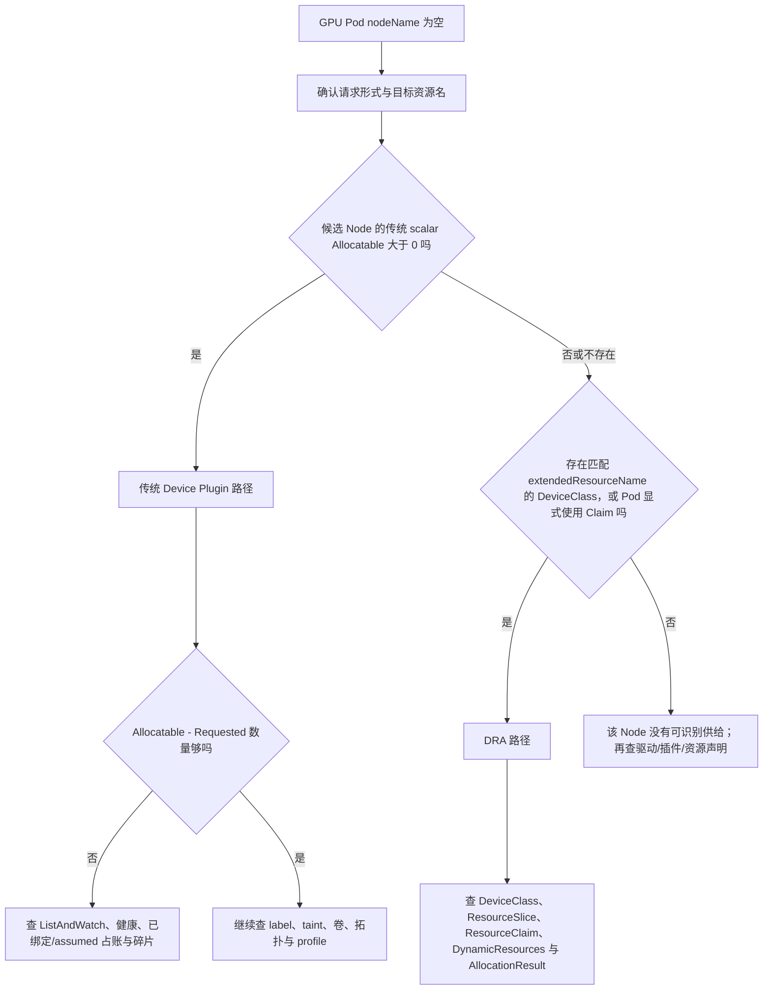

这棵树故意先分供给模式。启用 `DRAExtendedResource` 时，同一个资源名可在某些 Node 由传统 scalar 提供，在另一些 Node 上 scalar 为 0/不存在、却通过 `DeviceClass.spec.extendedResourceName` 与 `ResourceSlice` 由 DRA 提供。因此“Node status 没有 `nvidia.com/gpu`”不能直接判为 Device Plugin 故障。显式 ResourceClaim 的 Pod 更不应从传统 Node scalar 开始排障。

传统 Device Plugin 路径可先做两层只读检查：Node API 看供给，下面的脚本只做“API 已绑定 Pod 的普通容器 GPU request 小计”。它故意不是 scheduler 完整账本。

```powershell
kubectl get nodes -o custom-columns='NAME:.metadata.name,GPU-CAP:.status.capacity.nvidia\.com/gpu,GPU-ALLOC:.status.allocatable.nvidia\.com/gpu'

kubectl get pods -A -o json |
  ConvertFrom-Json |
  Select-Object -ExpandProperty items |
  Where-Object { $_.spec.nodeName } |
  ForEach-Object {
    $appContainerGpuSubtotal = 0
    foreach ($container in $_.spec.containers) {
      $quantity = $container.resources.requests.'nvidia.com/gpu'
      if ($null -ne $quantity) { $appContainerGpuSubtotal += [int]$quantity }
    }
    if ($appContainerGpuSubtotal -gt 0) {
      [PSCustomObject]@{
        Namespace          = $_.metadata.namespace
        Pod                = $_.metadata.name
        Node               = $_.spec.nodeName
        AppContainerGPUReq = $appContainerGpuSubtotal
      }
    }
  } | Sort-Object Node, Namespace, Pod | Format-Table -AutoSize
```

这个小计会漏掉 init container（包括 restartable init）带来的 Pod 阶段峰值，也看不到 scheduler 已 Assume、尚未 Bind 的 Pod，因此**不能代表 `NodeInfo.Requested`**。精确对账要按目标版本 `resource.PodRequests` 的规则复算 Pod shape，再叠加 scheduler cache/绑定时间线。生产环境中资源名还可能是 MIG profile、其他厂商资源或平台抽象名；time-slicing 下统计的是逻辑份额，不能当物理 GPU 台账。

#### 运维现场小案例：Node 没有 GPU scalar，不等于一定是 Device Plugin 坏了

- **现象**：`gpu-b` 的 `.status.allocatable.nvidia.com/gpu` 为空，但请求同名资源的 Pod 可能走 DRA extended-resource 桥接。
- **变量**：`$Namespace='ml-prod'; $PodName='gpu-pending'`
- **只读命令 1**：`kubectl get nodes -o custom-columns='NAME:.metadata.name,GPU:.status.allocatable.nvidia\.com/gpu'`
- **只读命令 2**：`kubectl get deviceclasses.resource.k8s.io -o custom-columns='CLASS:.metadata.name,EXTENDED:.spec.extendedResourceName'`
- **只读命令 3**：`kubectl get pod -n $Namespace $PodName -o yaml | Select-String 'nvidia.com/gpu|resourceClaims:' -Context 1,6`
- **预期/示例输出（教学化）**：`gpu-a GPU=8`，`gpu-b GPU=<none>`；某 DeviceClass 的 `EXTENDED=nvidia.com/gpu`，或 Pod 显式引用 Claim。
- **能证明**：传统 scalar 和 DRA 分流所需的 API 输入是否存在。
- **不能证明**：不能仅凭 DeviceClass 宣告 DRA 一定可用；还需核对 feature gate、DynamicResources 插件、ResourceSlice 和 Claim 分配。
- **时间/风险边界**：同名资源在不同 Node 上可能走不同路径，不能用一台 Node 的结论覆盖整个池。
- **责任域/源码映射**：`fit.go` 的 `shouldDelegateResourceToDRA` 与 `extendeddynamicresources.go` 的 `filterExtendedResources` 实现“scalar 大于 0 走传统，否则尝试 DRA”。

### 19.7 已经绑定却拿不到 GPU，为什么不是重新调度一下就好

若 `spec.nodeName` 已写入，后续 DeviceManager 分配或 `Allocate` 失败，原 Pod 通常不会由 scheduler 自动把 `spec.nodeName` 改成另一台节点。Kubernetes 的绑定不是可随意重写的“建议”。恢复往往需要：

- **传统 DeviceManager 的 Allocate 在 kubelet Pod admission 阶段失败**：通常形成 `UnexpectedAdmissionError`，Pod 被拒绝并进入 `Failed`；设备插件恢复不会复活这个终态 Pod，应由 Deployment/Job 等控制器创建替代 Pod，独立 Pod 则按变更流程删除并重建；
- **其他非终态的容器创建/runtime 错误**：才可能由 kubelet 的容器重试机制原地重试，必须先确认失败层次；
- 节点健康控制触发驱逐/重建；
- 人工隔离故障节点并按变更流程处置。

具体动作有业务影响，必须先确认控制器、重启策略、checkpoint、训练容错和数据一致性。排障讲义只给证据路径，不授权在生产直接删除训练 Pod。

#### 运维现场小案例：Allocate 失败后的原 Pod 为什么不会换节点复活

- **现象**：Pod 已有 `spec.nodeName=gpu-a`，随后 kubelet admission 因设备分配失败将它置为 Failed。
- **变量**：`$Namespace='ml-prod'; $PodName='train-failed'`
- **只读命令 1**：`kubectl get pod -n $Namespace $PodName -o custom-columns='PHASE:.status.phase,REASON:.status.reason,NODE:.spec.nodeName,OWNER:.metadata.ownerReferences[0].kind'`
- **只读命令 2**：`kubectl get events -n $Namespace --field-selector involvedObject.kind=Pod,involvedObject.name=$PodName --sort-by='.metadata.creationTimestamp'`
- **只读命令 3**：`kubectl get pod -n $Namespace $PodName -o jsonpath='{.metadata.uid}{"\t"}{.status.message}{"\n"}'`
- **预期/示例输出（教学化）**：`Failed  UnexpectedAdmissionError  gpu-a  Job`，消息可能包含 DeviceManager/Topology Manager admission 错误。
- **能证明**：该 Pod 已绑定且成为终态对象；若有 owner，后续恢复通常依赖控制器创建新 UID 的替代 Pod。
- **不能证明**：`UnexpectedAdmissionError` 仍是上层归类，不能单独证明是驱动、插件、拓扑还是 checkpoint 损坏。
- **时间/风险边界**：插件恢复不会复活同一个 Failed Pod；删除独立训练 Pod 前必须确认 checkpoint 和数据一致性。
- **责任域/源码映射**：`pkg/kubelet/cm/admission/errors.go` 定义原因；`kubelet.go` 的 `(*Kubelet).rejectPod` 写入 Failed；scheduler 不重写已绑定 Pod 的 Node。

### 19.8 日志该怎样开，才不会把控制面打爆

建议从低成本证据逐级升级：

```text
Pod YAML/Condition/Event
  -> Node/PVC/Claim 等对象
  -> scheduler 稳定 metrics
  -> 当前常规日志按 Pod namespace/name 搜索，API/Event 再用 UID 定身份
  -> 临时、受控提高 verbosity
  -> 必要时 profile 影子/测试环境复现
```

高 verbosity 会显著增加 CPU、磁盘与日志平台压力，还可能输出大量对象元数据。若必须提高：限定时间窗、单副本/测试 scheduler、明确回退时间，遵守集群日志隐私规范。不要为了找一个 Pod，把所有控制面长期开到最高日志级别。

#### 运维现场小案例：只追一个 Pod 名与 UID，不把全控制面开到 `-v=10`

- **背景：** 案例 F 中单个 `prod/order-api-new-7f8d9` 偶发 SchedulerError；团队准备永久提高全部 scheduler 副本日志级别。
- **只读命令：**
  ```powershell
  $PodKey = 'prod/order-api-new-7f8d9'
  $PodUid = kubectl get pod -n prod order-api-new-7f8d9 -o jsonpath='{.metadata.uid}'
  kubectl -n kube-system logs -l component=kube-scheduler --since=10m --tail=-1 --prefix |
    Select-String -SimpleMatch $PodKey
  kubectl get events -n prod --field-selector "involvedObject.uid=$PodUid" --sort-by='.metadata.creationTimestamp'
  kubectl -n kube-system get pod -l component=kube-scheduler -o jsonpath='{range .items[*]}{.metadata.name}{" args="}{.spec.containers[0].args}{"\n"}{end}'
  ```
- **示例证据（教学示意）：** 常规日志在该 `namespace/name` 上显示 Binding API 超时；UID Event 属于当前 Pod；启动参数为 `-v=2`。
- **能证明：** 限定窗口内某个带实例前缀的 scheduler 日志记录过相关错误，Event 对象身份和当前启动参数也可核对。
- **不能证明/时间边界：** 固定源码常规日志通常不会打印 UID；轮转、leader 切换和聚合也可能漏行，一次超时不能直接归因 etcd。
- **修复/安全边界：** 先用对象、metrics 和常规日志；提级必须限实例、限时、有回退并评估隐私/磁盘/CPU。
- **源码/组件映射：** `ScheduleOne` / `scheduleOnePod` 与 `runBindingCycle` / `bindingCycle` 产生日志，`handleSchedulingFailure` 收束失败；verbosity 不是稳定业务接口。

---

## 20. 可观测性：指标告诉你“系统性问题”，Event 告诉你“这个 Pod 的一次观察”

### 20.1 当前固定源码中的关键 scheduler 指标

指标名带 `scheduler_` 前缀。稳定级别是 API 承诺的一部分；ALPHA 指标可能改名、删掉或调整 label，升级时不能无审查继承面板。

| 指标 | 当前稳定度 | 主要含义 | 运维用法 |
|---|---|---|---|
| `scheduler_pending_pods{queue}` | STABLE | active/backoff/unschedulable/gated 各队列数量 | 区分排队、退避、硬条件失败和从未尝试的 gate |
| `scheduler_schedule_attempts_total{result,profile}` | STABLE | 调度尝试按成功、unschedulable、error 等结果累计 | 看失败率与内部错误率趋势 |
| `scheduler_scheduling_attempt_duration_seconds{result,profile}` | STABLE | 一次尝试的算法加绑定延迟 | 看 p95/p99 调度尝试延迟 |
| `scheduler_pod_scheduling_sli_duration_seconds{attempts}` | BETA | Pod 从进入队列到最终成功，可能跨多次尝试 | 更贴近用户等待体验 |
| `scheduler_pod_scheduling_attempts` | STABLE | 成功 Pod 经历的尝试次数 | 发现反复重试 |
| `scheduler_framework_extension_point_duration_seconds{extension_point,status,profile}` | STABLE | 某扩展点所有插件总延迟 | 定位慢在 Filter、Score、Bind 等哪段 |
| `scheduler_plugin_execution_duration_seconds{plugin,extension_point,status}` | ALPHA | 单插件执行延迟 | 深挖慢插件，注意版本和采样/开销 |
| `scheduler_unschedulable_pods{plugin,profile}` | BETA | 被每个插件拒绝的 Pod 数 | 找系统性 NodeResourcesFit/affinity/volume 问题 |
| `scheduler_queue_incoming_pods_total{queue,event}` | STABLE | 哪类事件把 Pod 放入哪个队列 | 分析重排风暴和有用事件 |
| `scheduler_permit_wait_duration_seconds{result}` | BETA | Permit 等待时长 | 查 gang/协调插件等待 |
| `scheduler_preemption_attempts_total` | STABLE | 抢占尝试总数 | 发现容量/优先级压力 |
| `scheduler_preemption_victims` | STABLE | 每次选中的受害者数量分布 | 评估抢占破坏面 |
| `scheduler_inflight_events{event}` | ALPHA | 队列正在跟踪的 in-flight 事件 | 研究事件压力与当前实现 |
| `scheduler_pod_scheduled_after_flush_total` | ALPHA | 因超时 flush 后才成功的 Pod 数 | 辅助发现 QueueingHint/事件遗漏风险 |

指标定义可在 `pkg/scheduler/metrics/metrics.go` 对照当前提交。面板里不要只画平均值；调度延迟通常要看直方图分位数和流量分母。

#### 运维现场小案例：平均值正常，Filter p99 已拖到 3 秒

- **背景：** 案例 F 的面板只画 attempt 平均值 80ms，用户却周期性等待数秒；怀疑自定义插件长尾。
- **只读命令（PromQL；下面两条逐条执行，不能整块粘贴）：**
  ```promql
  histogram_quantile(0.99, sum by (le,extension_point,profile) (rate(scheduler_framework_extension_point_duration_seconds_bucket[5m])))
  histogram_quantile(0.99, sum by (le,result,profile) (rate(scheduler_scheduling_attempt_duration_seconds_bucket[5m])))
  ```
- **示例证据（教学示意）：** `Filter/gpu-binpack` p99=2.9s，attempt p99=3.1s。
- **能证明：** 慢点集中在该 profile 的 Filter 扩展点，并与总 attempt 长尾同窗相关。
- **不能证明/时间边界：** 扩展点汇总不能直接锁定单插件；ALPHA 单插件指标还要核对版本和开销。
- **修复/安全边界：** 关联发布和流量，灰度回滚慢插件；不要通过拉长窗口隐藏长尾。
- **源码/组件映射：** `metrics.go` 定义指标；`frameworkImpl.RunFilterPlugins` 记录扩展点与插件耗时。

### 20.2 四种队列高分别说明什么

```text
active 高且持续增长
  -> scheduler 吞吐可能跟不上、leader/插件/API 变慢，或突然发布洪峰

backoff 高
  -> 大量 Pod 经历失败并在退避；要结合 result=error/unschedulable 区分

unschedulable 高
  -> 已尝试且硬条件不满足；看 scheduler_unschedulable_pods 的 plugin 分解

gated 高
  -> Pod 被 scheduling gate/PreEnqueue 类机制挡住，可能是预期的准入等待
```

单看总 Pending 会把四种完全不同的处置方式混在一起。

#### 运维现场小案例：activeQ 1200，不等于 1200 个硬约束失败

- **背景：** 案例 F 在周一 10:00 多团队同时发布，Pending 暴涨；active 高，unschedulable 并不高。
- **只读命令（PromQL；下面三条逐条执行，不能整块粘贴）：**
  ```promql
  sum by (queue) (scheduler_pending_pods)
  sum by (result,profile) (rate(scheduler_schedule_attempts_total[5m]))
  sum by (event,queue) (rate(scheduler_queue_incoming_pods_total[5m]))
  ```
- **示例证据（教学示意）：** active=1200、backoff=5、unschedulable=20；PodAdd 入队速率高于成功吞吐。
- **能证明：** 主要是等待被尝试的队列积压，更像发布洪峰或吞吐不足。
- **不能证明/时间边界：** 队列形状不能单独区分 API、插件、leader 抖动或到达率过高。
- **修复/安全边界：** 继续看 attempt、extension point、API 延迟与发布速率；不要自动删除 activeQ Pod。
- **源码/组件映射：** `PriorityQueue.Add/Pop/AddUnschedulableIfNotPresent` 维护状态；`pending_pods{queue}` 暴露分类快照。

### 20.3 一组起点 PromQL

以下是思路模板，实际抓取 job、label 和时间窗要按集群监控栈调整。每个注释下面都是一条独立查询，只选择一条执行，不要把整个代码块一次粘贴到 Prometheus：

```promql
# 各队列当前积压
sum by (queue) (scheduler_pending_pods)

# 最近 5 分钟每秒调度尝试，按结果与 profile
sum by (result, profile) (rate(scheduler_schedule_attempts_total[5m]))

# 调度尝试 p99；必须先按 le 聚合直方图桶
histogram_quantile(
  0.99,
  sum by (le, result, profile) (
    rate(scheduler_scheduling_attempt_duration_seconds_bucket[5m])
  )
)

# 哪些插件造成最多不可调度 Pod
topk(10, sum by (plugin, profile) (scheduler_unschedulable_pods))

# 哪个 Framework 扩展点变慢
histogram_quantile(
  0.99,
  sum by (le, extension_point, profile) (
    rate(scheduler_framework_extension_point_duration_seconds_bucket[5m])
  )
)
```

`scheduler_unschedulable_pods` 的一个 Pod 可能同时计入多个拒绝插件，不能把各 plugin 值相加当成唯一 Pod 总数。

#### 运维现场小案例：PromQL 少了 `le`，p99 就算错了

- **背景：** 案例 F 的旧面板把 histogram bucket 直接求和后得到 `p99=0`，但用户明显感到慢。
- **只读命令（PromQL）：**
  ```promql
  histogram_quantile(
    0.99,
    sum by (le,result,profile) (rate(scheduler_scheduling_attempt_duration_seconds_bucket[5m]))
  )
  ```
- **示例证据（教学示意）：** 修正后 `scheduled/default-scheduler` p99=0.8s；错误查询没有保留桶边界。
- **能证明：** 所选窗口、result 和 profile 下的聚合分位数。
- **不能证明/时间边界：** 聚合 p99 不是单 Pod 端到端等待，也不包含永远未成功者；低流量窗口会抖动。
- **修复/安全边界：** 面板记录查询、窗口、分母和 label；升级前核对指标稳定级别。
- **源码/组件映射：** `metrics.go` 的 HistogramVec 决定 bucket/label；`histogram_quantile` 必须保留 `le`。

### 20.4 SLO 要分“调度器健康”和“业务可调度性”

建议至少拆成两类：

**调度器服务 SLO：**

- scheduler leader 可用；
- 内部 `result="error"` 比例；
- activeQ 等待与成功调度延迟；
- Bind/API 错误；
- extension point/plugin 延迟；
- informer/cache 异常。

**业务容量 SLO/信号：**

- 因资源、affinity、taint、volume、GPU 等原因的 unschedulable 数与年龄；
- 各节点池/ResourceFlavor 的可调度余量和碎片；
- Kueue admission 等待时间；
- 发布 surge 导致的等待；
- GPU 逻辑分配率、物理利用率、健康与碎片分别展示。

如果“任何 FailedScheduling 都算 scheduler 不可用”，业务 requests 写错也会让平台 SLO 红；如果只看 scheduler 进程活着，整个 GPU 池资源名消失也可能仍是绿。两类目标必须分开。

一个**用于启动讨论、不是通用标准答案**的度量模板：

| 目标 | SLI/分母 | 示例目标与窗口 | 排除/注意 |
|---|---|---|---|
| 调度器内部可靠性 | `1 - result="error" 的 attempts / 全部 attempts` | 30 天不低于 99.9% | Unschedulable 是业务结论，不算内部 error |
| 成功尝试延迟 | 成功 result 的 attempt duration p99 | 例如 5 分钟窗口 p99 < 1s | 只覆盖一次成功尝试，不等于 Pod 全部等待 |
| 用户绑定体验 | 进入 scheduler 责任域的 Pod 中，X 秒内出现 `spec.nodeName` 的比例 | 在线业务可先讨论 99%/10s/30 天 | 排除 Kueue 未 Admitted、显式 scheduling gate、无匹配 scheduler 的错误路由；需外部观测器 |
| 业务可调度性 | 各 workload class 中 Unschedulable 持续超过阈值的 Pod 比例 | 在线与批任务分别设 2 分钟/30 分钟等阈值 | 失败原因和容量责任要分类，不能都算 scheduler 故障 |

数值必须根据集群规模、发布峰值和业务 SLO 校准。告警应基于误差预算做多窗口 burn-rate，例如短窗口 5m+1h 发现快速燃烧、长窗口 30m+6h 发现慢性燃烧，而不是见一个 Pending 就翻页。

特别注意成功者偏差：当前 `scheduler_pod_scheduling_sli_duration_seconds` 在 Pod 成功完成 Binding 后观察；永远没成功的 Pod不会进入该直方图。仅看它可能得到“成功者都很快”的漂亮结论，所以用户绑定 SLI 要由平台控制器、Condition/Event 库或其他外部状态观察补上未完成样本。scheduler 也没有直接给出“每个不可调度 Pod 年龄”的低基数聚合指标；这通常要结合 kube-state-metrics、对象 Condition/Event 或平台库存计算。

#### 运维现场小案例：成功者 p99 很快，用户仍有 260 个 Pod 等待

- **背景：** 案例 F 的团队用成功调度直方图宣布 SLO 全绿，但 unschedulable 队列持续积压。
- **只读命令（PromQL；下面三条逐条执行，不能整块粘贴）：**
  ```promql
  histogram_quantile(0.99, sum by (le) (rate(scheduler_pod_scheduling_sli_duration_seconds_bucket[30m])))
  sum(scheduler_pending_pods{queue="unschedulable"})
  sum by (plugin,profile) (scheduler_unschedulable_pods)
  ```
- **示例证据（教学示意）：** 成功样本 p99=0.2s，同时 unschedulable=260，主拒绝为 NodeResourcesFit。
- **能证明：** 内部成功路径快与业务可调度性差可以同时成立，必须拆两类 SLI。
- **不能证明/时间边界：** pending gauge 没有每个 Pod 年龄/业务等级；同一 Pod 还可能计入多个插件。
- **修复/安全边界：** 用外部对象库存补年龄、namespace 和 workload class；不要把 Unschedulable 算内部 error。
- **源码/组件映射：** 成功 Binding 后才观察 pod scheduling SLI；queue/plugin 指标从另一侧暴露未完成样本。

### 20.5 告警要带处置上下文

一个好的告警不是“PendingPods > 0”，而是类似：

```text
范围：gpu-binpack-scheduler profile
现象：unschedulable 队列持续 15 分钟增长
主拒绝插件：NodeResourcesFit / NodeAffinity
受影响命名空间和 PriorityClass：通过事件侧或平台库存关联
GPU 池：A100-80GB
容量证据：allocatable、requested、物理健康、Kueue quota
推荐第一步：确认是单节点碎片还是整池不足
禁止自动动作：不要直接删低优先级训练 Pod
```

指标标签不一定包含 namespace 和 Pod，这是为了控制基数。细粒度归因可由 Event、审计日志、平台控制器状态和定期库存快照补全，不要贸然把 Pod UID 加进每个 Prometheus 指标。

#### 运维现场小案例：把 `Pending>0` 升级成可处置告警

- **背景：** 案例 F 的旧告警只写 `PendingPods=87`，值班不知道 profile、插件、节点池，也不敢处置。
- **只读命令：**
  ```promql
  topk(10, sum by (plugin,profile) (scheduler_unschedulable_pods))
  ```
  ```powershell
  kubectl get events -A --field-selector reason=FailedScheduling --sort-by='.metadata.creationTimestamp'
  kubectl get nodes -L platform.example.com/pool,accelerator
  ```
- **示例证据（教学示意）：** `gpu-binpack/NodeResourcesFit` 持续增长，Event 侧集中于案例 D 的 A100 训练 Pod。
- **能证明：** 告警可先收窄到 profile、失败方向和节点池，再由对象证据定位工作负载。
- **不能证明/时间边界：** scheduler 指标通常没有 Pod/namespace；Event 会过期，两者关联是平台时间窗推断。
- **修复/安全边界：** 告警携带查询、时间窗、runbook 和禁止自动动作；不能因资源不足就自动删训练 Pod。
- **源码/组件映射：** scheduler Framework/queue 记录指标；UID、namespace、PriorityClass 来自 API/Event/平台库存。

---

## 21. 容量规划：总量够不等于任何一个 Pod 放得下

### 21.1 三个层级都要算

```text
集群总量：整个集群够不够
节点池总量：目标标签/污点/资源类型的池够不够
单节点形状：一个 Pod 或一组约束能不能在同一节点满足
```

例如集群有 4 台 GPU 节点，各剩 1 张卡，总余量 4；一个请求 4 张卡的 Pod 仍然一个节点也放不下。scheduler 不会把一个普通 Pod 跨 4 台节点拆开。

#### 运维现场小案例：GPU 池总余量 4，4-GPU Pod 仍放不下

- **现象**：四台节点各剩一张卡，容量大盘显示池余量 4，但单 Pod 请求 4 张卡。
- **变量**：`$PoolSelector='platform.example.com/gpu-product=A100-80GB'; $Namespace='ml-prod'; $PodName='train-4gpu'`
- **只读命令 1**：`kubectl describe nodes -l $PoolSelector | Select-String 'Name:|Allocated resources:|nvidia.com/gpu' -Context 0,8`
- **只读命令 2**：`kubectl get events -n $Namespace --field-selector involvedObject.kind=Pod,involvedObject.name=$PodName --sort-by='.metadata.creationTimestamp'`
- **预期/示例输出（教学化）**：四台均为 `allocatable=8、API request=7`；事件为 `0/4 nodes ... Insufficient nvidia.com/gpu`。
- **能证明**：池总余量无法合并成一台节点上的 4 张卡，普通 Pod 的资源合同是节点内满足。
- **不能证明**：`describe` 不含 scheduler assumed Pod，也不能代表 DRA 多节点共享设备或特殊工作负载模型。
- **时间/风险边界**：求和必须限定相同产品池、标签、污点和采样时间。
- **责任域/源码映射**：`noderesources/fit.go` 的 `(*Fit).Filter` 对每个 `NodeInfo` 独立调用 `fitsRequest`，不会跨 Node 拼接普通 Pod 资源。

### 21.2 碎片不是只有 GPU 数量碎片

一个节点必须同时满足多维余额：

```text
CPU >= Pod CPU request
memory >= Pod memory request
目标 GPU resource >= GPU request
ephemeral-storage >= request
Pod slots >= 1
host ports 无冲突
volume topology 可达
required labels/taints/affinity 全通过
```

GPU 还有“交叉碎片”：

- `gpu-a` 剩 2 张 GPU，但只剩 8 GiB memory；
- `gpu-b` 剩 128 GiB memory，但 GPU 已满；
- 两者总和看起来都够，一个 2-GPU/64-GiB Pod 仍无落点。

所以容量面板需要“可承载典型 Pod shape 的节点数”，而不只是按每种资源分别求和。

#### 运维现场小案例：GPU 和内存分别都够，组合起来却无节点可用

- **现象**：`gpu-a` 剩两张 GPU 但内存不足，`gpu-b` 内存充足但 GPU 已满。
- **变量**：`$Namespace='ml-prod'; $PodName='infer-large'; $PoolSelector='platform.example.com/gpu-pool=a100'`
- **只读命令 1**：`kubectl describe nodes -l $PoolSelector | Select-String 'Name:|Allocated resources:|cpu|memory|nvidia.com/gpu|pods' -Context 0,10`
- **只读命令 2**：`kubectl get events -n $Namespace --field-selector involvedObject.kind=Pod,involvedObject.name=$PodName --sort-by='.metadata.creationTimestamp'`
- **预期/示例输出（教学化）**：事件可能同时汇总 `Insufficient memory` 和 `Insufficient nvidia.com/gpu`，但发生在不同节点。
- **能证明**：资源必须在同一个候选 Node 上同时满足，分资源总和会掩盖交叉碎片。
- **不能证明**：Allocated Resources 不是实际利用率；也不展示 host port、卷拓扑等所有不可分约束细节。
- **时间/风险边界**：Node 请求账与 Pending Event 要同窗采集；节点间不能交换内存或 GPU 余额。
- **责任域/源码映射**：`fitsRequest` 对 CPU、memory、ephemeral-storage、pods 和 scalar resources 分别生成失败原因，框架再汇总节点状态。

### 21.3 用 Pod shape 做可调度容量

定义一个线上推理 shape：

```text
cpu=8
memory=48Gi
nvidia.com/gpu=1
pool=a100-80gb
```

对每个满足硬标签/污点的节点，估算：

```text
该节点还能放的 shape 数
= min(
  floor(cpu_remaining / 8),
  floor(memory_remaining / 48Gi),
  floor(gpu_remaining / 1),
  remaining_pod_slots,
  其他不可分约束允许数
)
```

再对节点求和，才是这个 shape 的粗略可调度余量。卷、端口、亲和和动态资源会让真实值更低，因此平台应把它标为估算，并用 scheduler 仿真校验。

#### 运维现场小案例：把“还剩 20 张 GPU”换算成“还能放几个线上 Pod”

- **现象**：容量大盘只有资源总数，业务真正关心的是 `8 CPU + 48Gi + 1 GPU` 的 Pod 还能进几个。
- **变量**：`$PoolSelector='platform.example.com/gpu-pool=a100'`
- **只读命令 1**：`kubectl get nodes -l $PoolSelector -o custom-columns='NAME:.metadata.name,CPU:.status.allocatable.cpu,MEM:.status.allocatable.memory,GPU:.status.allocatable.nvidia\.com/gpu,PODS:.status.allocatable.pods'`
- **只读命令 2**：`kubectl describe nodes -l $PoolSelector | Select-String 'Name:|Allocated resources:|cpu|memory|nvidia.com/gpu|pods' -Context 0,10`
- **预期/示例输出（教学化）**：离线按每节点最小维度计算后，可能得到 `gpu-a=0（内存限制）`、`gpu-b=2（GPU 限制）`。
- **能证明**：在 API 可见请求账和已选硬约束集合下，得到某一 Pod shape 的粗略承载量。
- **不能证明**：不能代替 scheduler；assumed Pod、卷、端口、亲和、DRA 和后续状态变化都会降低真实值。
- **时间/风险边界**：计算结果必须附 shape、selector、采样时间和“不含 scheduler cache”的标记。
- **责任域/源码映射**：准确请求语义以 `component-helpers/resource.PodRequests` 为准，节点累计由 `(*NodeInfo).update` 完成。

### 21.4 扩容为什么不能立刻消除 Pending

从触发 Cluster Autoscaler 或云扩容到可调度，链路可能包括：

```text
发现不可调度 Pod
  -> 判定可扩的 node group
  -> 云厂商创建实例
  -> 操作系统启动
  -> kubelet 加入
  -> CNI/CSI/DaemonSet 就绪
  -> GPU 驱动和 Device Plugin 就绪
  -> Node label/taint/allocatable 正确
  -> informer 把变化送到 scheduler
  -> Pod 被重新激活并调度
```

GPU 节点通常比普通 CPU 节点准备时间更长。若业务 SLO 小于冷启动时间，必须做 warm pool、预留容量或排队准入，不能只依赖看到 Pending 后再扩。

#### 运维现场小案例：新 GPU 节点 Ready 了，Pod 仍报 GPU 不足

- **现象**：云实例已经加入集群并显示 Ready，但 Device Plugin 尚未上报 GPU allocatable。
- **变量**：`$Node='gpu-new-01'; $Namespace='ml-prod'; $PodName='train-waiting'`
- **只读命令 1**：`kubectl get node $Node --watch -o custom-columns='NODE:.metadata.name,READY:.status.conditions[?(@.type=="Ready")].status,GPU:.status.allocatable.nvidia\.com/gpu'`
- **只读命令 2**：`kubectl get ds -A -o wide | Select-String 'nvidia|device-plugin|cni|csi'`
- **只读命令 3**：`kubectl get events -n $Namespace --field-selector involvedObject.kind=Pod,involvedObject.name=$PodName --sort-by='.metadata.creationTimestamp'`
- **预期/示例输出（教学化）**：先出现 `Ready=True、GPU=<none>`，稍后 Device Plugin Ready 后才出现 `GPU=8`，Pod 再被重新尝试。
- **能证明**：扩容链路已走到哪个可观察阶段，以及 scheduler 何时可能获得新供给。
- **不能证明**：Ready 不保证驱动、GPU Operator、RDMA、存储和业务镜像全部就绪；也不能承诺固定恢复秒数。
- **时间/风险边界**：`--watch` 是只读长连接，生产终端应设置观察窗口并保存关键时间点。
- **责任域/源码映射**：DeviceManager 更新 Node status；scheduler 的 Node informer/event handler 更新 cache 并触发队列重试。

### 21.5 装箱和打散没有全局唯一答案

| 策略 | 好处 | 代价 | 常见适用 |
|---|---|---|---|
| GPU 装箱 | 留出整节点，便于大任务；可能缩容更多节点 | 热点和故障半径增大 | 可迁移批任务、成本优先 |
| GPU 打散 | 降低单节点故障影响，平衡热量/带宽 | 产生碎片，未来多卡任务难进 | 在线关键推理 |
| CPU/内存打散、GPU 装箱 | 可能兼顾资源，但多维分数会互相拉扯 | 配置和解释复杂 | 需仿真验证的平台 |
| 按业务亲和共置 | 减少网络延迟 | 争抢本地资源、连带故障 | 有明确通信收益 |

平台应按 workload class 做少量 profile，而不是寻找一个让所有业务都满意的万能权重。

#### 运维现场小案例：在线推理打散了，但不能据此宣称 Score 配置正确

- **现象**：四个推理 Pod 分布在四台 GPU 节点，平台想据此证明“GPU 打散策略已经生效”。
- **变量**：`$Namespace='online'; $Selector='app=gpu-inference'; $PodName='gpu-inference-0'`
- **只读命令 1**：`kubectl get pods -n $Namespace -l $Selector -o custom-columns='POD:.metadata.name,SCHEDULER:.spec.schedulerName,NODE:.spec.nodeName'`
- **只读命令 2**：`kubectl get pod -n $Namespace $PodName -o yaml | Select-String 'topologySpreadConstraints:|podAntiAffinity:|schedulerName:' -Context 0,14`
- **预期/示例输出（教学化）**：Pod 当前分别位于 `gpu-a` 至 `gpu-d`，并声明了 spread/anti-affinity 或专用 scheduler profile。
- **能证明**：最终放置分布和 Pod 显式声明的约束。
- **不能证明**：单次分布不能证明 NodeResourcesFit 的 GPU 权重、各插件最终得分、长期故障半径或最优成本。
- **时间/风险边界**：滚动发布、重调度和节点故障都会改变分布，应按 workload class 做时间序列评估。
- **责任域/源码映射**：NodeResourcesFit、PodTopologySpread、InterPodAffinity 等分数会在框架中加权汇总；最终落点不是某一个插件单独决定。

---

## 22. 实验设计与验收思路：亲眼看见 Filter、Score、抢占与 GPU 边界

> 以下实验面向测试集群。不要在生产节点随意加污点、改标签、部署占资源 Pod 或修改 scheduler 配置。

本节给出实验目的、关键输入、观察点和清理方向；除实验一外，没有为每种发行版拼成可直接执行的一键实验包。镜像仓库、节点名、准入策略、Volcano/Kueue/DRA 版本和 GPU 供给方式必须按隔离环境补齐。每次实验都先做 `kubectl diff`/对象审阅并确认清理方式。

> 下文出现的 `lab-*.yaml`、`fake-device-*.yaml` 都是“你需要准备并审阅的实验输入文件名示意”，不是本仓库已经提供的一键实验包。只有文件真实存在、内容已审阅、namespace/节点选择和清理对象都核对后，才能执行对应 `apply`。

### 22.1 实验记录模板

每次实验都按下面格式记，避免只记“成功/失败”：

```text
假设：我认为哪个插件会在什么阶段做什么
前置：Kubernetes 版本、scheduler 配置、feature gate、Node/Pod 初态
输入：完整 YAML 与命令
观察：Pod Condition、Event、nodeName、scheduler metrics/log
源码：对应函数与分支
反证：修改哪个单一变量，结果应该如何改变
结论：本版本验证了什么；哪些还没验证
清理：删除哪些测试对象，恢复哪些 label/taint
```

#### 运维现场小案例：只记“成功”的实验为什么无法复盘

- **背景：** 新增教学示例中，同学只截图 Pod Running，却没记版本、profile、Pod UID 和初始 Node；第二天无法解释落点。
- **实验命令（仅隔离测试环境；会创建 namespace 和本地文件）：**
  ```powershell
  kubectl create namespace scheduler-lab-record
  kubectl version -o yaml | Set-Content .\lab-version.yaml -Encoding utf8
  kubectl get nodes -o yaml | Set-Content .\lab-nodes-before.yaml -Encoding utf8
  kubectl get pod -n scheduler-lab-record -o yaml | Set-Content .\lab-pods-after.yaml -Encoding utf8
  ```
- **示例证据（教学示意）：** 记录包含版本、时间、UID、`spec.nodeName`、Condition/Event，而不只是一句“成功”。
- **能证明：** 固定实验环境中的输入、对象身份和观察可复核。
- **不能证明/时间边界：** 不能自动外推到不同版本、feature gate、发行版或生产负载。
- **清理/安全边界：** 执行 `kubectl delete namespace scheduler-lab-record --wait=true`；本地证据按隐私与留存策略清理。
- **源码/组件映射：** 每条观察要回指 `schedulePod`、`RunFilterPlugins`、`RunScorePlugins` 或 binding cycle。

### 22.2 实验一：用 request 制造 `Insufficient cpu`

先看测试节点 allocatable，选择一个不会影响他人的隔离测试节点。创建一个 request 明显高于单节点总量的 Pod：

```yaml
apiVersion: v1
kind: Pod
metadata:
  name: scheduler-lab-too-large
  namespace: scheduler-lab-cpu
spec:
  restartPolicy: Never
  containers:
  - name: pause
    image: registry.k8s.io/pause:3.10
    resources:
      requests:
        cpu: "1000"
        memory: 1Mi
```

预期：NodeResourcesFit 报 CPU 不足，而且因为单 Pod request 大于任何节点总 allocatable，抢占也不能解决。若测试 namespace 有 ResourceQuota/LimitRange，`cpu: "1000"` 可能先在 API 准入阶段被拒绝；应使用隔离 namespace，或改成“略高于最大单节点 allocatable、但低于准入上限”的值，确保实验真的到达 scheduler。反证变量：把 CPU request 调整到测试节点可承载值，重新创建新 Pod，观察可行集合变化。

#### 运维现场小案例：稳定复现 `Insufficient cpu`

- **背景：** 新增教学实验要验证 NodeResourcesFit，而不是碰巧把共享节点占满；上方 YAML 另存为已审阅的 `lab-cpu-too-large.yaml`。
- **实验命令（仅隔离测试集群，有写操作）：**
  ```powershell
  kubectl create namespace scheduler-lab-cpu
  kubectl diff -f .\lab-cpu-too-large.yaml
  kubectl apply -f .\lab-cpu-too-large.yaml
  kubectl get pod -n scheduler-lab-cpu scheduler-lab-too-large -o wide
  kubectl get events -n scheduler-lab-cpu --field-selector involvedObject.name=scheduler-lab-too-large --sort-by='.metadata.creationTimestamp'
  ```
- **示例证据（教学示意）：** Pod 存在、`NODE=<none>`、`PodScheduled=False`，失败方向为单节点 CPU 余额不足。
- **能证明：** 请求已通过 API 准入并到达 scheduler，当前单节点资源硬约束无解。
- **不能证明/时间边界：** 若 Pod 根本没创建，验证到的是 Quota/Admission；Event 文本也不是稳定 API。
- **反证/清理/安全边界：** 用可承载 request 新建对照 Pod；最后执行 `kubectl delete namespace scheduler-lab-cpu --wait=true`。
- **源码/组件映射：** `NodeResourcesFit.PreFilter` 算 request，`Filter/fitsRequest` 返回不足；Score 不会执行翻盘。

### 22.3 实验二：证明 toleration 不是吸引力

准备两台测试节点。Pod A 只写 toleration，不写 node affinity；Pod B 同时写 toleration 与 required node affinity。预期：

- A 被允许进入特殊节点，但也可能被调度到其他可行节点；
- B 必须进入带 `pool=special` 标签且污点可容忍的节点。

下面只保留一条有序流程：先保存并检查原状态，再设置一次，观察完成后清理一次。这些都是有状态变更，只能对明确的无业务测试节点执行。

#### 运维现场小案例：A 只有 toleration，B 再加 required affinity

- **背景：** 新增教学实验预期 A“允许但不保证”去 special 节点，B“必须”去 special；`lab-node-a` 必须是无业务专用节点。
- **实验命令（保存原状态；本流程只允许两个测试键原本都不存在）：**
  ```powershell
  $Node = 'lab-node-a'
  $OriginalNode = kubectl get node $Node -o json | ConvertFrom-Json
  $OriginalPoolLabel = $OriginalNode.metadata.labels.'platform.example.com/pool'
  $OriginalClassTaints = @($OriginalNode.spec.taints | Where-Object key -eq 'workload.platform.example.com/class')
  if ($null -ne $OriginalPoolLabel -or $OriginalClassTaints.Count -gt 0) {
    throw '测试键已存在：停止实验，改用新的专用键/节点，或先写出精确恢复原值的方案。'
  }

  kubectl create namespace scheduler-lab-taint
  kubectl label node $Node platform.example.com/pool=special
  kubectl taint node $Node workload.platform.example.com/class=special:NoSchedule
  kubectl diff -n scheduler-lab-taint -f .\lab-toleration-a.yaml -f .\lab-affinity-b.yaml
  kubectl apply -n scheduler-lab-taint -f .\lab-toleration-a.yaml -f .\lab-affinity-b.yaml
  kubectl get pod -n scheduler-lab-taint -o wide
  ```
- **示例证据（教学示意）：** A 可能落其他可行节点；B 只在同时匹配 label 且容忍污点的节点成功。
- **能证明：** toleration 是许可，required affinity 才缩小必须落点集合。
- **不能证明/时间边界：** A 的一次落点不能证明 Score 必然偏向哪里；应固定其他变量并重复。
- **清理/安全边界：** 确认观察已保存后，按顺序执行下面唯一一组清理；前置检查保证这两个键原本不存在，所以移除键才等价于恢复原状态。若实验中途失败也要执行。
  ```powershell
  kubectl delete namespace scheduler-lab-taint --wait=true
  kubectl taint node $Node workload.platform.example.com/class:NoSchedule-
  kubectl label node $Node platform.example.com/pool-
  ```
- **源码/组件映射：** `TaintToleration.Filter` 与 `NodeAffinity.Filter` 是两道独立硬检查。

### 22.4 实验三：证明 `nodeName` 出现后责任域已经切换

创建一个镜像名故意不存在、但 request 很小的 Pod。预期过程：

```text
先成功得到 spec.nodeName
随后进入 ErrImagePull / ImagePullBackOff
```

这证明 scheduler 的节点选择可以成功，而 kubelet 的镜像兑现失败。不要把所有 Pending 都统计成 scheduler 失败。

#### 运维现场小案例：故意拉不到镜像，观察责任域切换

- **背景：** 新增教学实验创建 request 很小、镜像域名故意无效的 Pod；目标是先看到 Binding，再看到节点侧失败。
- **实验命令（仅隔离测试环境，有写操作）：**
  ```powershell
  kubectl create namespace scheduler-lab-image
  kubectl run image-fail -n scheduler-lab-image --image=registry.invalid.example/not-exist:0 --restart=Never
  kubectl get pod -n scheduler-lab-image image-fail -o custom-columns='NODE:.spec.nodeName,PHASE:.status.phase,WAITING:.status.containerStatuses[0].state.waiting.reason'
  kubectl get events -n scheduler-lab-image --field-selector involvedObject.name=image-fail --sort-by='.metadata.creationTimestamp'
  ```
- **示例证据（教学示意）：** 先出现 `NODE=lab-node-b`，随后 waiting reason 为 `ErrImagePull` 类状态。
- **能证明：** scheduler 已完成 Node Binding，失败发生在 kubelet/镜像链之后。
- **不能证明/时间边界：** 不验证真实仓库鉴权根因，也不代表所有 Pending 都是节点侧问题。
- **清理/安全边界：** `kubectl delete namespace scheduler-lab-image --wait=true`；不要用生产私有仓库凭据做注入。
- **源码/组件映射：** scheduler binding cycle 持久化 Node；kubelet image manager/runtime 才拉镜像。

### 22.5 实验四：抢占不是瞬移

在隔离节点池：

1. 创建低优先级、占用大部分 request 的可终止测试 Pod；
2. 创建较高优先级 Pod；
3. 让高优先级 Pod 只能匹配该池；
4. 观察 FailedScheduling、抢占 Event、受害者 deletionTimestamp、`nominatedNodeName`、最终 `spec.nodeName`；
5. 把受害者优雅终止时间设置为可观察但安全的短值；
6. 对比 `preemptionPolicy: Never` 的高优先级 Pod。

实验前确认没有真实业务和 PDB 依赖该节点池。抢占会真实删除受害 Pod，不能在共享生产池练习。

#### 运维现场小案例：用 20 秒优雅退出看见抢占时序

- **背景：** 案例 B 的隔离缩小版：低优先级测试 Pod 占满专用节点，高优先级 Pod 只能匹配该节点，受害者 grace=20 秒。
- **实验命令（抢占会真实删除测试 Pod）：**
  ```powershell
  kubectl create namespace scheduler-lab-preempt
  kubectl diff -n scheduler-lab-preempt -f .\lab-priorityclasses.yaml -f .\lab-preempt-low.yaml -f .\lab-preempt-high.yaml
  kubectl apply -n scheduler-lab-preempt -f .\lab-priorityclasses.yaml -f .\lab-preempt-low.yaml -f .\lab-preempt-high.yaml
  kubectl get pod -n scheduler-lab-preempt -o custom-columns='NAME:.metadata.name,NODE:.spec.nodeName,NOMINATED:.status.nominatedNodeName,DELETING:.metadata.deletionTimestamp' --watch
  ```
- **示例证据（教学示意）：** high 先 nomination，low 再出现 deletionTimestamp；low 退出后 high 才绑定。
- **能证明：** nomination、受害者删除和最终 Binding 是可分离阶段。
- **不能证明/时间边界：** 一次实验不覆盖 PDB 候选、异步抢占 gate 和全部竞争条件；必须记录版本。
- **反证/清理/安全边界：** 用 `preemptionPolicy: Never` 对照；删 namespace、实验 PriorityClass 与测试节点元数据，先确认无其他引用。
- **源码/组件映射：** `DefaultPreemption.PostFilter`→`Evaluator.Preempt`→executor；未来 cycle 才重新 Filter/Bind。

### 22.6 实验五：没有 GPU 也能验证扩展资源 Filter

Kubernetes 允许通过设备插件或节点状态上报扩展资源，但不要手工篡改生产 Node status。最安全的路径是在本地测试集群部署官方示例设备插件或测试用设备插件，暴露例如 `example.com/fake-device`：

```yaml
resources:
  limits:
    example.com/fake-device: 1
```

观察：

- 资源名如何出现在 Node capacity/allocatable；
- 一个 Pod 绑定后 requested 如何变化；
- 超过 allocatable 时 NodeResourcesFit 如何报不足；
- scheduler 仍只选择 Node，kubelet 侧插件才执行 Allocate。

这样可在没有昂贵 GPU 的环境先掌握传统设备调度的主要控制链。

#### 运维现场小案例：不用真 GPU，也能看扩展资源进入 Filter

- **背景：** 新增教学实验在一次性本地集群的专用节点暴露 `example.com/fake-device=2`；第三个 1-device Pod 应 Pending。
- **实验命令（仅可销毁测试集群；输入文件名是示意）：**
  ```powershell
  kubectl create namespace scheduler-lab-device
  kubectl diff -n scheduler-lab-device -f .\fake-device-plugin.yaml -f .\fake-device-pods.yaml
  kubectl apply -n scheduler-lab-device -f .\fake-device-plugin.yaml -f .\fake-device-pods.yaml
  kubectl get nodes -o custom-columns='NAME:.metadata.name,CAP:.status.capacity.example\.com/fake-device,ALLOC:.status.allocatable.example\.com/fake-device'
  kubectl get pod -n scheduler-lab-device -o wide
  ```
- **示例证据（教学示意）：** lab 节点 allocatable=2，前两个 Pod 绑定，第三个无 Node 且扩展资源不足。
- **能证明：** 传统 Device Plugin scalar 进入 Node status 与 NodeResourcesFit request 账。
- **不能证明/时间边界：** fake plugin 不验证 NVIDIA 驱动、CUDA、设备 ID、健康或 Allocate 注入。
- **清理/安全边界：** 最安全是删除一次性集群；至少删 namespace/DaemonSet/Pod 并确认资源停止上报，绝不 patch 生产 Node status。
- **源码/组件映射：** kubelet DeviceManager 注册/ListAndWatch 更新 Node；`noderesources.fitsRequest` 把资源当整数 scalar。

### 22.7 实验六：有 GPU 时验证“调度成功不等于 CUDA 成功”

分两层验收：

```text
调度层：Pod 有正确 nodeName；Node 的 GPU request 账增加
节点层：容器创建成功；nvidia-smi 可见预期设备；CUDA sample 成功
```

再设计三个单变量故障：

- 错误的 GPU 产品 required affinity：预期 Filter 阶段失败；
- 正确节点但故意使用不兼容 CUDA 镜像：预期已绑定后应用/运行时失败；
- 将测试设备标记异常或停止测试设备插件：观察 allocatable 传播与 Event，严格限定隔离环境。

记录每一步的 Node status、Pod UID、Condition、Event、设备插件日志和时间戳，才能把异步传播延迟与真正错误区分开。

#### 运维现场小案例：同一 GPU 节点做“能调度/能运行”双验收

- **背景：** 案例 D 的隔离实验使用一个兼容 CUDA sample 与一个故意不兼容镜像；两者都请求 1 GPU。
- **实验命令（仅隔离 GPU 测试节点，有资源成本）：**
  ```powershell
  kubectl create namespace scheduler-lab-gpu
  kubectl diff -n scheduler-lab-gpu -f .\lab-cuda-ok-job.yaml -f .\lab-cuda-bad-job.yaml
  kubectl apply -n scheduler-lab-gpu -f .\lab-cuda-ok-job.yaml -f .\lab-cuda-bad-job.yaml
  kubectl get pod -n scheduler-lab-gpu -o custom-columns='NAME:.metadata.name,UID:.metadata.uid,NODE:.spec.nodeName,PHASE:.status.phase'
  kubectl logs -n scheduler-lab-gpu job/cuda-ok
  kubectl logs -n scheduler-lab-gpu job/cuda-bad
  ```
- **示例证据（教学示意）：** 两者都有 Node；ok sample 成功，bad 在容器/应用层报兼容错误。
- **能证明：** “选到有 GPU 账的 Node”与“设备注入、驱动、CUDA、应用可用”是两层验收。
- **不能证明/时间边界：** 一次 sample 不代表长期性能、ECC、显存、拓扑和多卡通信健康。
- **清理/安全边界：** `kubectl delete namespace scheduler-lab-gpu --wait=true`；停止插件/标异常只能在专用可恢复节点。
- **源码/组件映射：** scheduler 负责 Filter/Score/Bind；kubelet DeviceManager、Allocate、runtime 和应用负责兑现。

### 22.8 实验七：比较 GPU 默认 Score 与显式 GPU Score

构造两台都能放下 1-GPU Pod、但 GPU 使用比例不同的同型测试节点。先用默认 profile 多次创建等价 Pod，记录可行节点和落点；再在独立测试 profile 中配置 NodeResourcesFit 对 `nvidia.com/gpu` 的 MostAllocated 评分。

验收不是“每次都必须去某节点”，而是：

- 从 scheduler 日志/测试断言确认 GPU 进入评分资源表；
- 手算 NodeResourcesFit 原始/归一化分数；
- 把其他 Score 插件和权重纳入总分；
- 确认平分时仍可能有不同选择；
- 观察装箱对 CPU/内存、故障域和后续大 Pod 的影响。

#### 运维现场小案例：独立 profile 显式把 GPU 加入 MostAllocated

- **背景：** 案例 D 的隔离变体构造两台同型节点，GPU 占比分别 1/8、6/8；比较默认 profile 与显式 GPU Score 的多次落点。
- **实验命令（不修改 default-scheduler；输入文件名是示意）：**
  ```powershell
  kubectl create namespace scheduler-lab-score
  kubectl diff -f .\lab-gpu-score-scheduler.yaml
  kubectl diff -n scheduler-lab-score -f .\lab-gpu-score-pods.yaml
  kubectl apply -f .\lab-gpu-score-scheduler.yaml
  kubectl apply -n scheduler-lab-score -f .\lab-gpu-score-pods.yaml
  kubectl get pod -n scheduler-lab-score -o custom-columns='NAME:.metadata.name,SCHEDULER:.spec.schedulerName,NODE:.spec.nodeName'
  kubectl logs -n kube-system deploy/gpu-score-test-scheduler --since=10m
  ```
- **示例证据（教学示意）：** 显式 profile 手算更偏 6/8 节点，但最终仍受 CPU/内存、拓扑、其他插件和平分影响。
- **能证明：** 目标 profile 把 GPU 加入 NodeResourcesFit 评分，并影响总分分布。
- **不能证明/时间边界：** 单次落点不能证明默认 scheduler“忽略 GPU”，也不能保证每次必选某节点。
- **清理/安全边界：** 删测试 namespace、独立 scheduler Config/Deployment/RBAC 和测试标签；确认生产 Pod 未使用测试名字。
- **源码/组件映射：** `NodeResourcesFit.Score` 计算该插件分数；固定源码的 `(*Fit).ScoreExtensions()` 返回 `nil`，所以它不再执行 `NormalizeScore`。框架随后应用插件权重并与其他 Score 插件求和；只有实现了 Score 扩展的插件才进入各自归一化。Filter 与 Score 仍是两件事。

---

## 23. 八类生产事故复盘：表象相似，根因横跨不同组件

### 23.1 发布时老 Pod 正常，新 Pod 全 Pending

**表象：** 稳定运行时没问题，一滚动升级就出现 `Insufficient cpu`。

**因果链：**

```text
旧副本 requests 已占大部分节点池
  -> Deployment 按 maxSurge 创建额外新 Pod
  -> scheduler 把新 Pod 的 request 与剩余账比较
  -> 没有节点余额达到单 Pod shape
  -> 新 Pod Pending；旧 Pod 因可用性策略暂不缩减
```

**证据：** Deployment strategy、replicas、旧新 ReplicaSet 数量、Pod requests、目标池 allocatable/requested、FailedScheduling 时间线。

**修复方向：** 评估并调整 surge/容量/requests/发布批次，而不是先改 scheduler 权重。Score 不能让硬余额不足的节点通过 Filter。

#### 运维现场小案例：稳定半年，为什么只在滚动发布时 Pending

- **背景：** 案例 A 的旧 `order-api` 副本都 Running；新 surge Pod `order-api-new-7f8d9` 一创建就报 CPU 不足。
- **只读命令：**
  ```powershell
  kubectl get deploy -n prod order-api -o yaml
  kubectl get rs,pod -n prod -l app=order-api -o wide
  kubectl get events -n prod --field-selector reason=FailedScheduling --sort-by='.metadata.creationTimestamp'
  kubectl describe node worker-a
  ```
- **示例证据（教学示意）：** `replicas=4,maxSurge=1`；旧 RS 尚未缩，新 Pod 要 1400m，而目标节点只余 800m。
- **能证明：** 发布时间线、surge 对象数和单节点 request 余额共同支持瞬时容量不足。
- **不能证明/时间边界：** 总 request 不代表每个 Pod shape 可装箱；`describe` 也缺短暂 Assume 账。
- **修复/安全边界：** 在扩容、surge、unavailable、分批发布和 request 右调间选择；策略会影响可用性。
- **源码/组件映射：** Deployment controller 决定 RS 数；`NodeResourcesFit.Filter` 判断每个新 Pod。

### 23.2 扩了 GPU 节点，Pod 还是看不到 GPU

**表象：** 云平台显示新实例带 GPU，Kubernetes Node 也 Ready，但 `nvidia.com/gpu` 不在 allocatable。

**可能链路：**

```text
实例创建
  -> Node Ready
  -> GPU 驱动尚未可用，或 Device Plugin 未注册
  -> kubelet 没有收到有效 ListAndWatch
  -> Node status 没有 GPU 扩展资源
  -> scheduler 不可能拿这台 Node 满足 GPU request
```

**证据：** Node capacity/allocatable、GPU Operator/驱动状态、设备插件 Pod 是否落到节点、插件与 kubelet 日志、节点标签/污点是否齐全。

**修复方向：** 修复设备供给链和节点就绪门槛。不要给 Node 手工贴一个“有 GPU”的普通 label 就宣称资源可用；label 不会创建 `nvidia.com/gpu` allocatable。

#### 运维现场小案例：新 GPU Node Ready，但资源名仍为空

- **背景：** 案例 D 扩出 `gpu-new`，Node `Ready=True`，`ml/train-a100` 仍不把它当候选。
- **只读命令：**
  ```powershell
  kubectl get node gpu-new -o custom-columns='READY:.status.conditions[?(@.type=="Ready")].status,CAP:.status.capacity.nvidia\.com/gpu,ALLOC:.status.allocatable.nvidia\.com/gpu'
  kubectl get pod -A -o wide | Select-String 'nvidia|device-plugin|gpu-operator'
  kubectl get events -A --field-selector involvedObject.name=gpu-new --sort-by='.metadata.creationTimestamp'
  ```
- **示例证据（教学示意）：** `READY=True`，CAP/ALLOC 为空；Device Plugin Pod 未落到该节点或未 Ready。
- **能证明：** API 尚未把该节点登记为传统扩展资源供给者，scheduler 无法用它满足 scalar request。
- **不能证明/时间边界：** 不能只凭 Node status 区分驱动、runtime、DaemonSet selector、注册或 ListAndWatch；DRA 另查。
- **修复/安全边界：** 修设备供给链和节点池就绪门槛；不要 patch Node status 或贴普通 label 冒充容量。
- **源码/组件映射：** kubelet DeviceManager/Device Plugin 更新资源；scheduler `NodeResourcesFit` 消费该账。

### 23.3 GPU 总余量很多，4-GPU Job 仍 Pending

**表象：** 面板显示整池空闲 6 张，但没有一台节点空 4 张。

**根因：** 单节点碎片。普通 Pod 的 4 张 GPU request 必须由同一 Node 满足。

**证据：** 每节点目标资源的 allocatable-requested、CPU/内存交叉余量、required affinity 和卷拓扑。

**修复方向：** Kueue/队列准入、装箱 profile、任务规格、节点池形状、可控迁移/排空。不能直接把 4-GPU Pod 拆成 4 台节点；分布式训练需要控制器、通信配置和多个 Pod 的业务设计。

#### 运维现场小案例：整池空 6 张，4-GPU Pod 仍无落点

- **背景：** 案例 D 的新增教学变体 `ml/train-a100-4gpu` 请求 4 卡，三台节点 API 账面分别只余 3、2、1。
- **只读命令：**
  ```powershell
  kubectl get pod -n ml train-a100-4gpu -o jsonpath='{range .spec.containers[*]}{.resources.requests.nvidia\.com/gpu}{"\n"}{end}'
  kubectl get nodes -l accelerator=a100-80gb -o custom-columns='NAME:.metadata.name,ALLOC:.status.allocatable.nvidia\.com/gpu'
  kubectl describe nodes -l accelerator=a100-80gb | Select-String 'Name:|Allocated resources:|nvidia.com/gpu'
  ```
- **示例证据（教学示意）：** request=4；逐节点最大余额=3，汇总余额=6。
- **能证明：** 传统 scalar 路径中是单节点碎片，不是整池总量为零。
- **不能证明/时间边界：** `describe` 不含 Assume 账，也不代表实时空闲/健康；其他硬条件仍可能共同失败。
- **修复/安全边界：** 优化装箱、准入、任务 shape 或节点池；迁移训练 Pod 要先确认 checkpoint、PDB、成本和数据安全。
- **源码/组件映射：** `NodeInfo.Requested` 是逐节点账；`fitsRequest` 不会跨 Node 拼接普通 Pod。

### 23.4 Event 说 CPU 不足，但 `kubectl top node` 很低

**根因：** scheduler 按 request 账，不按瞬时 usage。应用可能申请 8 核、实际只用 1 核。

**证据：** Pod spec 最终 request、LimitRange/Admission 修改、节点上所有 Pod requests、VPA 推荐、较长时间利用率分布。

**修复方向：** 通过容量分析和压测重新定 request；若只是临时为了让 Pod 进场而大幅降低 request，可能把调度 Pending 变成节点 CPU 争用、延迟抖动和 OOM。

#### 运维现场小案例：`top` 只有 15%，Event 仍说 CPU 不足

- **背景：** 案例 A 的 `worker-a` usage 约 15%，已承诺 request 为 3200m；新 Spring Boot Pod 要 1400m。
- **只读命令：**
  ```powershell
  kubectl top node worker-a
  kubectl describe node worker-a
  kubectl get pod -n prod order-api-new-7f8d9 -o jsonpath='{range .spec.containers[*]}{.name}{"="}{.resources.requests.cpu}{"\n"}{end}'
  ```
- **示例证据（教学示意）：** usage≈15%，request 余额=800m；新 Pod 合计 1400m。
- **能证明：** 调度依据是承诺账，不是瞬时采样，两者不矛盾。
- **不能证明/时间边界：** 低 usage 不能证明 request 过大；还需启动峰值、JIT/GC、SLO 和长期分位数。
- **修复/安全边界：** 用压测/VPA 推荐作右调输入并灰度；大幅降 request 会制造争用和尾延迟。
- **源码/组件映射：** `PodRequests`/`NodeInfo.Requested` 进入 NodeResourcesFit；usage 默认不进入 Filter。

### 23.5 Event 只有污点问题，明明 Pod 写了 toleration

常见细节：

- key 或 value 不一致；
- `operator: Equal` 与 `Exists` 理解错；
- effect 不一致；
- Node 还有第二条未容忍 taint；
- Pod 的目标节点集合其实由 affinity 限到另一批有不同污点的节点；
- `NoExecute` 还会影响已运行 Pod，和 `NoSchedule` 的行为不一样。

证据必须是完整 `Node.spec.taints` 与最终 Pod tolerations，而不是平台模板截图。

#### 运维现场小案例：容忍一条污点，却漏了同节点第二条

- **背景：** 案例 A 的教学变体允许 `order-api` 进入 `worker-c`；Pod 容忍 `dedicated=gpu:NoSchedule`，却漏了维护污点。
- **只读命令：**
  ```powershell
  kubectl get node worker-c -o jsonpath='{range .spec.taints[*]}{.key}{"="}{.value}{":"}{.effect}{"\n"}{end}'
  kubectl get pod -n prod order-api-new-7f8d9 -o jsonpath='{range .spec.tolerations[*]}{.key}{" op="}{.operator}{" value="}{.value}{" effect="}{.effect}{"\n"}{end}'
  ```
- **示例证据（教学示意）：** Node 还有 `maintenance=pending:NoSchedule`；Pod 只容忍 dedicated。
- **能证明：** 最终 Pod tolerations 未覆盖候选 Node 的全部不可容忍 NoSchedule taint。
- **不能证明/时间边界：** 补一条 toleration 不保证成功；资源、affinity、卷仍可能让交集为空。
- **修复/安全边界：** 先确认维护 taint 的平台意图；不要为单 Pod 从节点删 taint，只按授权精确添加 toleration。
- **源码/组件映射：** `TaintToleration.Filter` 找不可容忍 taint；`NodeAffinity.Filter` 决定候选池。

### 23.6 Pod 被提名到节点，却迟迟没绑定

**可能原因：** 受害者优雅退出、PDB/抢占方案变化、目标节点新变化、卷/动态资源等待、Permit、API 更新或 Pod 已被替换。

**证据：** `status.nominatedNodeName`、`spec.nodeName`、受害者 deletionTimestamp、PriorityClass、PDB、Permit metrics、scheduler Event/log 时间线、Pod UID。

**不要做的事：** 看到 nomination 就把目标节点标成故障；也不要认为 nomination 是容量预留的强保证。

#### 运维现场小案例：提名已出现，受害者还在优雅退出

- **背景：** 案例 B 的 `prod/pay-api-recovery` 提名 `worker-a` 后仍无 Node；受害者 grace=30 秒。
- **只读命令：**
  ```powershell
  kubectl get pod -n prod pay-api-recovery -o custom-columns='UID:.metadata.uid,NODE:.spec.nodeName,NOMINATED:.status.nominatedNodeName'
  kubectl get pods -A --field-selector spec.nodeName=worker-a -o custom-columns='NS:.metadata.namespace,NAME:.metadata.name,PRI:.spec.priority,DELETING:.metadata.deletionTimestamp,GRACE:.spec.terminationGracePeriodSeconds'
  kubectl get pdb -A
  ```
- **示例证据（教学示意）：** `NOMINATED=worker-a,NODE=<none>`；victim 已 deleting，grace=30s。
- **能证明：** 清理尚未兑现成可用 request，等待可能是预期时序。
- **不能证明/时间边界：** nomination 不保证最终绑定；Permit、卷、API 和节点新变化仍需时间线。
- **修复/安全边界：** 等正常退出并核对终止；不要强删受害者或把 nomination 当硬预留。
- **源码/组件映射：** `Evaluator.Preempt`/executor 推进删除和 nomination；未来 cycle 才重新验证并 Bind。

### 23.7 Kueue 已 Admitted，Pod 仍然 Pending

**解释：** `Admitted` 说明 Workload 已完成当前 Kueue 配置要求的准入流程：至少已经 quota reservation，所有配置的 AdmissionChecks 等条件已满足；启用 TAS 等能力时，还可能已经计算过准入时的物理拓扑可行性。但它仍不是每个 Pod 的 Node Binding，kube-scheduler 还要解决节点级硬约束，且准入后的集群事实会继续变化。可能是：

- 配额按总资源允许，但节点已碎片化；
- ResourceFlavor 对应的节点标签/污点合同不一致；
- Job Pod 还有 PVC、topology 或 affinity；
- 设备健康下降发生在 admission 后；
- 另一个已准入工作负载先占用了物理节点。

平台状态页应同时呈现 Workload admission 与每个 Pod 的 `PodScheduled` 状态。

#### 运维现场小案例：Kueue 已准入，两个成员仍未选到 Node

- **背景：** 案例 E 的 `vision` Workload 已从 `vision-lq` 准入，8 个 1-GPU Pod 中只有 6 个有 Node。
- **只读命令（按已安装 Kueue API 调整）：**
  ```powershell
  kubectl get workload -n vision -o yaml
  kubectl get pod -n vision -o custom-columns='NAME:.metadata.name,NODE:.spec.nodeName,SCHEDULED:.status.conditions[?(@.type=="PodScheduled")].status'
  kubectl get events -n vision --field-selector reason=FailedScheduling --sort-by='.metadata.creationTimestamp'
  ```
- **示例证据（教学示意）：** Workload `Admitted=True`；6 个 Pod 已绑定，2 个仍由 NodeResourcesFit/affinity 拒绝。
- **能证明：** Workload admission 已完成，但逐 Pod Node placement 尚未完成。
- **不能证明/时间边界：** Admitted 不是物理原子锁；TAS 也只是准入时判断，事实会继续变化。
- **修复/安全边界：** 分别处理 quota/flavor 与节点碎片/健康；不要改 Condition 或手工绑定绕过控制器。
- **源码/组件映射：** Kueue 管 admission/gates；放行后 Pod 进入 kube-scheduler `RunFilterPlugins`/Bind。

### 23.8 scheduler 进程正常，却大面积调度变慢

可能不是“算法算不动”这么简单：

```text
activeQ 发布洪峰
API Server / etcd 写入慢导致 Bind 变慢
自定义 Filter/Score 插件延迟
Extender 网络超时
大量抢占模拟
复杂 affinity/topology 匹配
Node/Pod 规模增长与扫描比例
事件风暴导致反复入队
Permit 等待或异步 API 调用堆积
```

证据顺序：队列长度 -> attempt latency -> result -> extension point -> plugin/extender -> API Server 指标 -> 规模和变更时间线。不要只抓一个 goroutine profile 就跳过上游事实。

#### 运维现场小案例：leader 正常，慢点其实在自定义扩展点

- **背景：** 案例 F 的 Lease 正常续约、Pod 无重启，但多团队发布后从创建到绑定越来越慢。
- **只读命令（PromQL；下面三条逐条执行，不能整块粘贴）：**
  ```promql
  sum by (queue) (scheduler_pending_pods)
  histogram_quantile(0.99, sum by (le,result,profile) (rate(scheduler_scheduling_attempt_duration_seconds_bucket[5m])))
  histogram_quantile(0.99, sum by (le,extension_point,profile) (rate(scheduler_framework_extension_point_duration_seconds_bucket[5m])))
  ```
- **示例证据（教学示意）：** activeQ 增长；attempt p99=4s；`Filter/gpu-binpack` p99=3.6s；leader 正常。
- **能证明：** 本窗口吞吐瓶颈集中在该 profile 的 Filter 扩展点；进程 Running 不等于 SLO 健康。
- **不能证明/时间边界：** 扩展点指标不能唯一归因单插件或下游；还要查 plugin/Extender/API。
- **修复/安全边界：** 灰度回滚最近插件/Extender 变更或限发布洪峰；不要先重启全部 scheduler 或长期开最高日志。
- **源码/组件映射：** `PriorityQueue` 体现积压，`RunFilterPlugins` 记录耗时；HTTP 路径落到 `HTTPExtender.Filter/send`。

---

## 24. 源码带读路线：从会排障到能改插件，按状态所有权前进

### 24.1 第一遍：只追一个成功 Pod

当前固定提交的入口地图如下。行号只对 `301946d15e67a4a2e8a5fb8292eb836acd366d78` 有效：

| 顺序 | 文件与函数 | 当前起始行附近 | 这一站只问一个问题 |
|---:|---|---:|---|
| 1 | `pkg/scheduler/scheduler.go` `Scheduler.Run` | 554 | worker 怎样启动并持续调度 |
| 2 | `pkg/scheduler/schedule_one.go` `ScheduleOne` | 67 | 单次 worker 怎样拿一个 Pod |
| 3 | 同文件 `scheduleOnePod` | 99 | profile、cycle 与异步 binding 怎样衔接 |
| 4 | 同文件 `schedulingCycle` | 175 | 选点、Assume、Reserve、Permit 的同步边界 |
| 5 | 同文件 `schedulingAlgorithm` | 256 | snapshot 与核心选点函数怎样串联 |
| 6 | 同文件 `schedulePod` | 570 | Filter、0/1/多节点、Score 的总分支 |
| 7 | 同文件 `findNodesThatFitPod` | 628 | PreFilter、Filter、extender 怎样组成可行集合 |
| 8 | 同文件 `prioritizeNodes` | 943 | Score 插件与 extender 分数怎样合并 |
| 9 | 同文件 `assumeAndReserve` | 313 | cache Assume 与插件 Reserve 的事务边界 |
| 10 | 同文件 `bindingCycle` | 397 | Permit 等待、PreBind、Bind、PostBind |
| 11 | 同文件 `bind` | 1148 | extender binder 与 Framework Bind 的次序 |

第一遍不要跳进每个插件。你只要能在纸上画出：`PodInfo -> CycleState -> ScheduleResult -> assumedPodInfo -> Binding`。

### 24.2 第二遍：追一个失败 Pod

| 顺序 | 文件/函数 | 要验证的状态 |
|---:|---|---|
| 1 | `findNodesThatPassFilters` | 每个节点的 Status 由谁产生 |
| 2 | `Diagnosis.NodeToStatus` / `UnschedulablePlugins` | 失败节点与拒绝插件怎样汇总 |
| 3 | `FitError` | 0 个可行 Node 如何形成调度失败 |
| 4 | PostFilter / `DefaultPreemption.PostFilter` | 正常失败后是否存在抢占机会 |
| 5 | `handleSchedulingFailure` | Event、Condition、nomination 与重排怎样分开 |
| 6 | scheduling queue `AddUnschedulableIfNotPresent` | Pod 去 active/backoff/unschedulable 哪个队列 |
| 7 | 插件 `EventsToRegister` / QueueingHint | 什么变化值得唤醒该 Pod |

读失败链时，给每个 Status 标三项：`Code`、`Reasons`、`FailedPlugin`。不要只在日志里搜索字符串。

### 24.3 第三遍：只读一个插件的所有 extension point

建议顺序：

1. `NodeResourcesFit`：最贴近日常 request/allocatable；
2. `NodeAffinity`：把 YAML selector/terms 变成集合判断；
3. `TaintToleration`：同时观察 Filter 与 Score；
4. `VolumeBinding`：学习 CycleState、Reserve/PreBind 与外部对象；
5. `DefaultPreemption`：学习 PostFilter、模拟 NodeInfo 和候选排序；
6. `DynamicResources`：最后再学，因为对象、异步分配和特性状态都更复杂。

对每个插件填写同一张卡：

```text
插件名：
注册在哪些 extension point：
PreFilter 写了什么 CycleState：
Filter 只读哪些对象：
成功时返回什么：
失败时 Code/Reason/FailedPlugin：
监听什么 ClusterEvent：
QueueingHint 为什么认为事件有用：
Reserve 后怎样 Unreserve：
有哪些 feature gate / config args：
对应哪条生产故障：
```

### 24.4 新手读 Go 只补七个语法点

| Go 语法/概念 | 在 scheduler 中为什么必须懂 | 对运维的类比 |
|---|---|---|
| interface | Framework 通过接口调用不同插件 | 同一扩展点的标准插槽 |
| struct 与指针 | PodInfo、NodeInfo、CycleState、Status 都以结构体传递 | 对象快照/状态载体 |
| slice/map | 节点列表、分数、资源名、诊断集合 | 清单与索引 |
| `defer` | 保证 `Done`、metrics、清理在函数退出时执行 | finally/收尾钩子 |
| goroutine/channel | Filter 并行、异步 binding、Permit 等待 | 并发 worker 与消息协调 |
| `context.Context` | 取消、trace、超时沿调用链传播 | 一次请求的生命周期令牌 |
| `error` 与 `*framework.Status` | 区分 Go 内部错误和调度语义状态 | 异常 vs 可解释业务结果 |

源码里看见 goroutine 时固定问四句：

```text
谁启动它？
谁等待它？
失败怎样回传？
它读写的对象是否仍有效？
```

例如 `scheduleOnePod` 的调度 cycle 同步执行，而 binding cycle 可异步进行；这就是为什么 cache Assume 必须先发生，为什么绑定失败还要显式回滚和唤醒其他 Pod。

### 24.5 断点与日志观察点

本地调试建议优先在这些位置打断点或加临时、受控日志：

```text
ScheduleOne                  -> 看 Pop 出的 PodInfo/Attempts
schedulePod                  -> 看 feasibleNodes 数量
findNodesThatPassFilters     -> 看每节点失败插件和 Status
prioritizeNodes              -> 看各插件 NodeScoreList 与总分
assumeAndReserve             -> 看 cache Assume 前后 Requested
bindingCycle                 -> 看 Permit/PreBind/Bind Status
handleBindingCycleError      -> 看 Unreserve/Forget/唤醒
handleSchedulingFailure      -> 看 latest Pod UID 与重排目标
```

不要在生产二进制临时改日志。推荐本地 kind/集成测试、自定义构建或现有结构化日志，并控制对象数据的敏感性。

### 24.6 源码验证的最小测试组合

源码学习不是只读函数名。每个结论至少找一种可复查证据：

```text
静态：函数连续代码、接口契约、配置默认值
单测：插件输入 -> Status/Score/QueueingHint
集成：真实 API 对象 -> scheduler -> Binding/Event
生产只读：对象/指标/日志时间线
```

可从小范围测试开始，例如：

```powershell
go test ./pkg/scheduler/framework/plugins/noderesources -run 'TestFit' -count=1
go test ./pkg/scheduler/framework/plugins/defaultpreemption -run 'TestPodEligibleToPreemptOthers' -count=1
go test ./pkg/scheduler -run 'Test.*Scheduling' -count=1
```

测试名会随源码变化。先用 `go test -list` 或 `rg '^func Test'` 核对当前提交，避免把“没有匹配到测试、退出成功”误当成真的验证通过。

---

## 25. 一页生产速查卡

### 25.1 成功链

```text
未绑定 Pod
-> SchedulingQueue
-> Pop / Done 生命周期
-> snapshot
-> PreFilter
-> 并行 Filter 节点
-> 0 个：FitError/PostFilter；1 个：直选；多个：Score
-> Assume scheduler cache
-> Reserve
-> Permit
-> 异步 binding cycle
-> WaitOnPermit / PreBind / Bind / PostBind
-> API 中 spec.nodeName
-> kubelet / CSI / Device Plugin / DRA / runtime
-> 容器与应用
```

### 25.2 失败链

```text
插件 Status
-> Diagnosis 保存节点失败与插件集合
-> FitError 或内部 Error
-> FailureHandler 核对最新 Pod 与 UID
-> Event + PodScheduled Condition
-> activeQ / backoffQ / unschedulablePods / gated
-> 有用 ClusterEvent + QueueingHint 唤醒
-> 新一轮必须重新验证全部硬条件
```

### 25.3 GPU 链

```text
设备插件发现设备
-> kubelet ListAndWatch
-> Node capacity/allocatable
-> scheduler 按扩展资源整数 request 选 Node
-> Assume 先占账
-> Bind
-> kubelet 选具体设备 ID
-> Device Plugin Allocate
-> runtime 注入
-> CUDA/应用验证
```

DRA 是另一条更丰富的设备声明/Claim/分配路径，不要把两条证据链混用。

### 25.4 十个禁止混淆

1. usage 不等于 request；
2. Capacity 不等于 Allocatable；
3. Allocatable 总和不等于单节点可行；
4. toleration 不等于必须去该节点；
5. preferred 不等于保证；
6. nominatedNodeName 不等于 nodeName；
7. Assume 不等于 API 已绑定；
8. Workload Admitted 不等于每个 Pod 已调度；
9. scheduler 选 Node 不等于 GPU 已分配、CUDA 已成功；
10. 进程存活不等于业务可调度容量健康。

### 25.5 事故现场七问

```text
1. 这是哪个 Pod UID，何时创建？
2. spec.nodeName 是否已经有值？
3. spec.schedulerName 谁负责？是否有 gate/上层准入？
4. PodScheduled Condition 与 Event 的时间线是什么？
5. 失败插件对应哪些硬约束集合？
6. request/allocatable/requested 与实际 usage 各是多少，是否混账？
7. 哪个事实变化才能让结果改变，QueueingHint 是否应当唤醒？
```

---

## 26. 自测题与答案：能讲清因果，才算真正理解

### 26.1 问题

1. 为什么 scheduler 不直接看 `kubectl top` 决定能否放 Pod？
2. 为什么有多个可行节点才需要 Score？
3. 一个节点 Filter 返回 Unschedulable 与返回 Error，对整轮调度有什么不同？
4. 为什么 Assume 要在 Bind 前？
5. Reserve 与 Assume 的状态所有者分别是谁？
6. Permit 返回 Wait 后，Pod 是否已经绑定？
7. 为什么 `nominatedNodeName` 不能当作最终落点？
8. 为什么抢占不能解决“任何节点最多 8 GPU、Pod 请求 10 GPU”？
9. toleration 为什么不能保证 GPU Pod 去 GPU 节点？
10. Device Plugin 路径中谁选择具体 GPU UUID？
11. 为什么默认 Filter 会检查 GPU，而默认 Score 未必按 GPU 剩余量排序？
12. MIG 和 time-slicing 都让资源数量看起来更多，它们的隔离语义为什么不同？
13. Kueue Workload 已 Admitted，为什么 Pod 仍可能 Pending？
14. `scheduler_pending_pods{queue="gated"}` 高，应该先查什么？
15. 为什么 Event 文本不适合作为唯一稳定自动化接口？
16. 绑定失败后为什么要 Forget assumed Pod，还要唤醒别的 Pod？
17. 集群总共剩 4 张 GPU，为什么 4-GPU Pod 仍可能放不下？
18. 为什么降低 request 可能把调度问题变成运行态事故？
19. profile 的 addedAffinity 为什么是平台治理风险？
20. 一条来源于 master 的结论，怎样安全用于旧生产版本？

### 26.2 答案

1. scheduler 负责按资源承诺做确定性准入，usage 是瞬时且波动的观测；二者是不同账本。
2. 只有一个可行节点时排名没有选择价值；多个节点才需要比较软偏好。
3. Unschedulable 通常只排除该节点并留下可解释诊断；内部 Error 可中止整轮并按 scheduler error 重试。
4. 异步 Bind 有延迟，Assume 先在 cache 占账，防止并发调度周期对同一余额重复承诺。
5. Assume 属于 scheduler 通用 cache；Reserve 属于各 Framework 插件的领域状态。
6. 没有。它只是在选点和预留后等待放行，Bind 尚未完成。
7. 它是抢占/期望落点提示，受害者、节点和约束都可能继续变化；最终看 `spec.nodeName`。
8. 删除其他 Pod 也不能让单节点物理/逻辑总量从 8 变成 10，属于 Unresolvable 的形状问题。
9. toleration 只取消某条 taint 的拒绝；还需 affinity/selector 或资源 request 共同限定目标池。
10. 目标节点的 kubelet DeviceManager 与设备插件协作选择并 Allocate；scheduler 传统路径只选 Node。
11. 扩展资源进入 NodeResourcesFit 的硬余额判断，但当前默认 scoring resources 主要是 CPU/memory；GPU 评分需显式设计或其他插件提供。
12. MIG 是硬件分区；time-slicing 是时间共享逻辑份额，显存和性能隔离承诺不同。
13. admission 是组织配额层，节点层仍受碎片、label、taint、卷、健康等约束。
14. 先查 schedulingGates、PreEnqueue/准入控制器和上层 Workload 状态，不要先扩 Node。
15. Event 会聚合、限流、过期，reason/message 还可能随版本改变；应结合结构化 Condition、对象、指标与日志。
16. Forget 释放错误的本地占账；其他 Pod 可能正因这笔 assumed 账被拒绝，因此还需事件让它们重评。
17. 四张可能分散在四台节点，或与 CPU/内存/标签条件不在同一台满足。
18. 更小 request 让 scheduler 承诺更多 Pod，真实峰值可能造成 CPU 争抢、延迟、驱逐和 OOM。
19. 它给 profile 中的 Pod 追加用户 YAML 看不见的硬/软亲和，容易造成“明明 YAML 匹配却 Pending”的隐性合同。
20. 先固定目标版本，找同一函数/配置/feature gate，运行对应测试或测试集群实验；找不到同构证据时标记为待验证，不能直接套用。

---

## 27. 官方资料、固定源码入口与继续学习顺序

### 27.1 Kubernetes 官方概念与配置

- [Scheduling Framework](https://kubernetes.io/docs/concepts/scheduling-eviction/scheduling-framework/)
- [Scheduler Configuration](https://kubernetes.io/docs/reference/scheduling/config/)
- [Assigning Pods to Nodes](https://kubernetes.io/docs/concepts/scheduling-eviction/assign-pod-node/)
- [Pod Priority and Preemption](https://kubernetes.io/docs/concepts/scheduling-eviction/pod-priority-preemption/)
- [Pod Topology Spread Constraints](https://kubernetes.io/docs/concepts/scheduling-eviction/topology-spread-constraints/)
- [Device Plugins](https://kubernetes.io/docs/concepts/extend-kubernetes/compute-storage-net/device-plugins/)
- [Dynamic Resource Allocation](https://kubernetes.io/docs/concepts/scheduling-eviction/dynamic-resource-allocation/)
- [Storage Classes / WaitForFirstConsumer](https://kubernetes.io/docs/concepts/storage/storage-classes/)

### 27.2 队列与 GPU 官方资料

- [Kueue Concepts](https://kueue.sigs.k8s.io/docs/concepts/)
- [Kueue ClusterQueue](https://kueue.sigs.k8s.io/docs/concepts/cluster_queue/)
- [Kueue Workload](https://kueue.sigs.k8s.io/docs/concepts/workload/)
- [Kueue WorkloadPriorityClass](https://kueue.sigs.k8s.io/docs/concepts/workload_priority_class/)
- [Kueue Topology-Aware Scheduling](https://kueue.sigs.k8s.io/docs/concepts/topology_aware_scheduling/)
- [Volcano Gang Plugin](https://volcano.sh/docs/scheduler/plugins/gang/)
- [Volcano Scheduler Overview](https://volcano.sh/docs/scheduler/overview/)
- [NVIDIA GPU Operator](https://docs.nvidia.com/datacenter/cloud-native/gpu-operator/latest/index.html)
- [NVIDIA GPU Sharing / Time-Slicing](https://docs.nvidia.com/datacenter/cloud-native/gpu-operator/latest/gpu-sharing.html)
- [NVIDIA MIG in Kubernetes](https://docs.nvidia.com/datacenter/cloud-native/kubernetes/latest/index.html)

### 27.3 本文固定提交的源码入口

- [`pkg/scheduler/schedule_one.go`](https://github.com/kubernetes/kubernetes/blob/301946d15e67a4a2e8a5fb8292eb836acd366d78/pkg/scheduler/schedule_one.go)
- [`pkg/scheduler/framework/runtime/framework.go`](https://github.com/kubernetes/kubernetes/blob/301946d15e67a4a2e8a5fb8292eb836acd366d78/pkg/scheduler/framework/runtime/framework.go)
- [`pkg/scheduler/backend/queue/scheduling_queue.go`](https://github.com/kubernetes/kubernetes/blob/301946d15e67a4a2e8a5fb8292eb836acd366d78/pkg/scheduler/backend/queue/scheduling_queue.go)
- [`pkg/scheduler/framework/plugins/noderesources/fit.go`](https://github.com/kubernetes/kubernetes/blob/301946d15e67a4a2e8a5fb8292eb836acd366d78/pkg/scheduler/framework/plugins/noderesources/fit.go)
- [`pkg/scheduler/framework/plugins/defaultpreemption/default_preemption.go`](https://github.com/kubernetes/kubernetes/blob/301946d15e67a4a2e8a5fb8292eb836acd366d78/pkg/scheduler/framework/plugins/defaultpreemption/default_preemption.go)
- [`pkg/scheduler/framework/plugins/dynamicresources/dynamicresources.go`](https://github.com/kubernetes/kubernetes/blob/301946d15e67a4a2e8a5fb8292eb836acd366d78/pkg/scheduler/framework/plugins/dynamicresources/dynamicresources.go)
- [`pkg/kubelet/cm/devicemanager/manager.go`](https://github.com/kubernetes/kubernetes/blob/301946d15e67a4a2e8a5fb8292eb836acd366d78/pkg/kubelet/cm/devicemanager/manager.go)
- [`pkg/scheduler/metrics/metrics.go`](https://github.com/kubernetes/kubernetes/blob/301946d15e67a4a2e8a5fb8292eb836acd366d78/pkg/scheduler/metrics/metrics.go)

### 27.4 推荐继续学习顺序

```text
第一轮：手算第 3 节案例 + 画第 4 节全景图
第二轮：只读 schedule_one.go 成功链
第三轮：做实验一到四，能解释每个 Status
第四轮：读 NodeResourcesFit 与 NodeAffinity
第五轮：接入 GPU 设备供给链，做传统 Device Plugin 对账
第六轮：学习 Kueue、MIG/time-slicing 与容量碎片
第七轮：再进入 DRA、抢占和自定义插件
```

最后把整篇压成一句话：

> kube-scheduler 是一个基于缓存、插件化规则和乐观预占的节点决策控制器。它把一个尚未绑定的 Pod 与当前集群事实做硬约束交集，在可行节点中计算软偏好，然后先在内存账本占位、再通过 API 持久化 Node；业务平台负责把意图变成可治理合同，GPU 供给链负责把设备事实上报并在节点兑现，队列系统负责决定整项工作何时入场。排障的关键不是背 Event，而是先找状态所有者，再沿事实传播链验证哪本账、哪个约束、哪个时间点出了问题。
